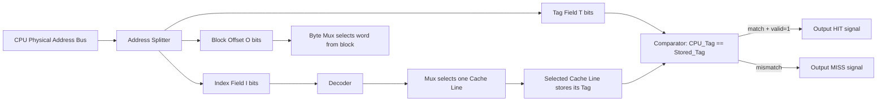
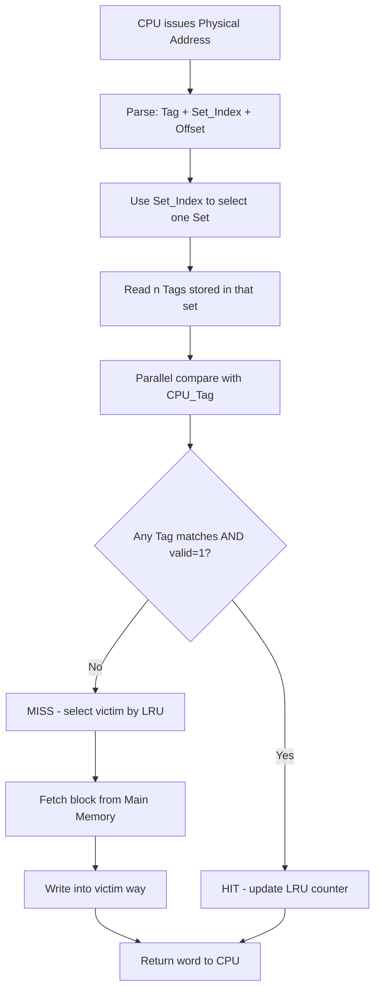
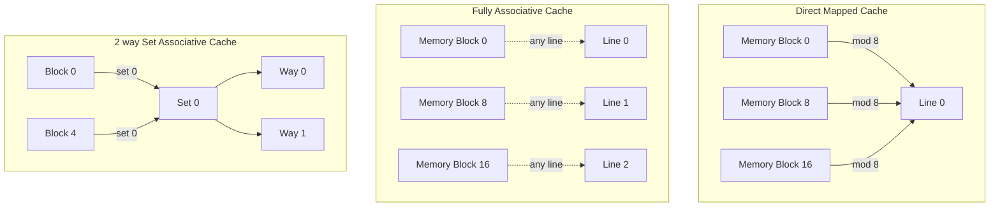

# Cache mapping configurations: Direct-Mapped, Fully Associative, and Set-Associative Caches

<!-- SECTION_1_START -->
# Cache Mapping Configurations: Direct, Fully Associative, and Set-Associative

## 1.1 Formal Definition (KTU 2024 Syllabus Terminology)

> [!IMPORTANT]
> **Cache Mapping** is the algorithmic procedure that determines **where** in the cache memory a particular block of main memory will be placed when it is brought in for the first time. It governs the relationship between the physical address issued by the CPU and the physical location in the SRAM cache.

The three canonical KTU-mandated mapping policies are:

1. **Direct-Mapped Cache** – A main memory block has *exactly one* possible cache line where it can reside. The destination line is computed deterministically as `Line Index = (Block Address) mod (Number of Cache Lines)`.
2. **Fully Associative Cache** – A main memory block may be placed in *any* of the cache lines. No index is used; the *entire* block tag must be compared in parallel against all stored tags.
3. **Set-Associative Cache (n-way)** – The cache is partitioned into `S` sets, each holding `n` lines. A memory block maps to a *specific set* using modular arithmetic, but inside that set it may occupy *any* of the `n` ways.

---

## 1.2 Conceptual Analogy — The Library, the Cloakroom, and the Boutique

Imagine your college library has a single reading room with **8 numbered study cubicles** (the cache lines).

* **Direct-Mapped = The Numbered Cloakroom.**
  The rule is strict: roll number `24` *always* goes to cubicle `24 mod 8 = cubicle 0`. Even if cubicle 0 is empty and cubicle 5 has free space, you *must* use cubicle 0. It is fast (just compute the cubicle number) but causes **collision thrashing** when two students with consecutive roll numbers arrive together.

* **Fully Associative = The Free-Seating Boutique Café.**
  There is *no* fixed cubicle. Student 24, student 7, student 99 — any student may sit on any empty chair. Searching for a person requires looking at *every* chair (parallel search). It is the most flexible but the most expensive because every chair needs a name tag.

* **Set-Associative (2-way) = Group Study Tables.**
  The 8 cubicles are grouped into **4 tables of 2 seats each**. Student 24 must sit at *Table* `24 mod 4 = Table 0`, but can choose *either* the left or right seat at that table. The search is limited to just 2 name tags per table — the perfect engineering compromise.

---

## 1.3 Why Cache Mapping Exists — The Speed-Mismatch Problem

> [!NOTE]
> **The Memory Wall:** A modern CPU executes an instruction in **~0.3 ns**, but a DRAM access takes **~100 ns**. This 300× gap is bridged by a small, fast SRAM cache sitting between the CPU and DRAM. Cache *mapping* decides how intelligently we use that tiny bridge.

| Parameter | Typical Value |
| :--- | :--- |
| **CPU Register Access** | **~0.3 ns** |
| **L1 Cache (SRAM) Access** | **~1 ns** |
| **L2/L3 Cache Access** | **~5–20 ns** |
| **Main Memory (DRAM) Access** | **~100 ns** |

---

## 1.4 Visualization of the Mapping Function

> [!VISUALIZATION CONTROL]
> **Concept:** Modular mapping of main-memory block numbers to cache line indices (Direct-Mapped, 8 lines).
> **Desmos Input Equations:**
> * `y = \lfloor x / 8 \rfloor` (this is the Tag value for memory block `x`)
> * `y = x \mod 8` (this is the Cache Line Index)
> * Plot the points `(x, x mod 8)` for `x = 0 ... 31` to see the repeating wrap-around pattern.
> **Visual Description:** A staircase plot rising from 0 to 7, then dropping back to 0 and repeating. The staircase height at `x` is the cache line index; the staircase number (count from origin) is the tag.

<!-- SECTION_1_END -->

<!-- SECTION_2_START -->
# Deep Theoretical Analysis & KTU High-Yield Formula Sheet

## 2.1 Anatomy of a Physical Address

Every byte address the CPU issues is logically partitioned into three fields (or two, for Fully Associative):

$$
\text{Physical Address} \;=\; \underbrace{\text{Tag}}_{\text{upper bits}} \;+\; \underbrace{\text{Index}}_{\text{middle bits}} \;+\; \underbrace{\text{Block Offset}}_{\text{lower bits}}
$$

| Field | Purpose | Bit Count Formula |
| :--- | :--- | :--- |
| **Block Offset** | Selects the byte/word *inside* a fetched block | $\log_2(\text{Block Size in bytes/words})$ |
| **Index / Set** | Selects the cache line or set | $\log_2(\text{Number of Sets})$ |
| **Tag** | Uniquely identifies which memory block currently occupies the line | Remaining MSBs of the address |

> [!IMPORTANT]
> **Special Case — Fully Associative Cache:** There is **no Index field**. The entire address except the block offset becomes the Tag. Hence tag-bit count is *maximum*, and the comparator must be `N`-wide where `N = \text{Number of Cache Lines}`.

---

## 2.2 The Master Formula (Use This on Day 1 of Revision)

$$
\boxed{\;T \;=\; A \;-\; O \;-\; I\;}
$$

Where:
* $T$ = number of **Tag** bits
* $A$ = number of bits in **physical address** = $\log_2(\text{Main Memory Size in addressable units})$
* $O$ = number of **Offset** bits = $\log_2(\text{Block Size})$
* $I$ = number of **Index** bits = $\log_2(\text{Number of Sets})$

And the **Number of Sets** itself is:

$$
\boxed{\;S \;=\; \dfrac{\text{Number of Cache Lines}}{n}\;}
$$

where $n$ is the **associativity** (1 for Direct-Mapped, total lines for Fully Associative, `n` for n-way Set-Associative).

---

## 2.3 The KTU Cheat-Sheet Table — All Three Mappings Side by Side

| Property | Direct-Mapped | Fully Associative | n-way Set-Associative |
| :--- | :---: | :---: | :---: |
| **Associativity (`n`)** | 1 | $\text{Number of Lines}$ | $n$ |
| **Number of Sets (`S`)** | $L$ | 1 | $L / n$ |
| **Index bits (`I`)** | $\log_2 L$ | 0 | $\log_2(L/n)$ |
| **Tag bits (`T`)** | $A - O - \log_2 L$ | $A - O$ | $A - O - \log_2(L/n)$ |
| **Tag Comparators** | **1** | $L$ (parallel) | $n$ per set |
| **Hardware Cost** | Lowest | Highest | Moderate |
| **Replacement Logic** | None (deterministic) | Complex (LRU / Random) | Moderate (per set) |
| **Conflict Misses** | Maximum | Zero | Reduced |
| **Typical Use** | L1 / L2 caches | TLB, small special buffers | L1 / L2 mainstream design |

---

## 2.4 Engineering Trade-offs in Production Systems

* **Direct-Mapped** dominates **L1 instruction caches** in Intel Core and AMD Zen designs because branch-predictor prefetch tolerates the occasional conflict miss, and the single-cycle critical path is non-negotiable.
* **Fully Associative** is reserved for tiny, ultra-hot structures: the **TLB** (Translation Lookaside Buffer), the **L1 data-cache victim buffers**, and the **store queues** in out-of-order CPUs.
* **Set-Associative** is the workhorse of all **L2 and L3 caches** (typically 8-way or 16-way) because it offers the best "miss-rate-per-transistor" Pareto curve validated by decades of SPEC benchmark data.

> [!NOTE]
> **Real-world Number:** The AMD Ryzen 9 7950X has a 32 KB 8-way L1D, a 512 KB 8-way L2 per core, and a 64 MB 16-way L3. *Associativity monotonically increases* as you go deeper in the hierarchy to keep miss rates low even with larger caches.

<!-- SECTION_2_END -->

<!-- SECTION_3_START -->
# Step-by-Step Derivations, Numerical Worked Examples & Python Implementation

## 3.1 Canonical KTU Numerical Problem (Worked at Board-Exam Pace)

> [!IMPORTANT]
> **Given:**
> * Main Memory size = **16 MB** (byte-addressable)
> * Cache size = **128 KB**
> * Block size = **16 Bytes**
> * Cache is **4-way set-associative**

**Required:** Number of Tag, Index, and Offset bits for all three mapping schemes.

### Step 1 — Compute the Total Address Bits
Main memory is 16 MB = $16 \times 2^{20}$ bytes = $2^{24}$ bytes.

$$
A \;=\; \log_2(2^{24}) \;=\; 24 \text{ bits}
$$

### Step 2 — Compute the Offset Bits
Block size = 16 Bytes = $2^4$ bytes.

$$
O \;=\; \log_2(16) \;=\; 4 \text{ bits}
$$

### Step 3 — Compute the Number of Cache Lines
Cache size = 128 KB = $2^{17}$ Bytes.

$$
\text{Number of Lines} \; L \;=\; \dfrac{2^{17}}{2^{4}} \;=\; 2^{13} \text{ lines}
$$

### Step 4 — Case-A: Direct-Mapped Cache

Index uses all lines, so $I = \log_2 L = 13$ bits.

$$
T_{DM} \;=\; A - O - I \;=\; 24 - 4 - 13 \;=\; 7 \text{ bits}
$$

$$
\boxed{\;T_{DM} = 7,\; I_{DM} = 13,\; O_{DM} = 4\;}
$$

### Step 5 — Case-B: Fully Associative Cache

There are no index bits ($I = 0$). The full upper address forms the tag.

$$
T_{FA} \;=\; A - O \;=\; 24 - 4 \;=\; 20 \text{ bits}
$$

$$
\boxed{\;T_{FA} = 20,\; I_{FA} = 0,\; O_{FA} = 4\;}
$$

### Step 6 — Case-C: 4-way Set-Associative Cache

Number of sets $S = L / n = 2^{13} / 2^{2} = 2^{11}$ sets.

Index bits $I = \log_2 S = 11$ bits.

$$
T_{4W} \;=\; A - O - I \;=\; 24 - 4 - 11 \;=\; 9 \text{ bits}
$$

$$
\boxed{\;T_{4W} = 9,\; I_{4W} = 11,\; O_{4W} = 4\;}
$$

### Step 7 — Comparative Memory Cost of the Tag Array

Each cache line must store the tag, the valid bit, and the dirty bit.

$$
\text{Total Tag Bits (DM)} \;=\; L \times T_{DM} \;=\; 2^{13} \times 7 \;=\; 57344 \text{ bits} \;\approx\; 7.2 \text{ KB}
$$

$$
\text{Total Tag Bits (FA)} \;=\; L \times T_{FA} \;=\; 2^{13} \times 20 \;=\; 163840 \text{ bits} \;=\; 20.5 \text{ KB}
$$

$$
\text{Total Tag Bits (4W)} \;=\; L \times T_{4W} \;=\; 2^{13} \times 9 \;=\; 73728 \text{ bits} \;\approx\; 9.2 \text{ KB}
$$

> **Inference for the valuation key:** Fully Associative consumes **~3× more tag-storage transistors** than Direct-Mapped. This is the exact hardware reason it is reserved for tiny structures.

---

## 3.2 Worked Example — Address-to-Cache Mapping Trace (Direct-Mapped, 4 Lines)

| Memory Block Address | Tag = Block ÷ 4 | Index = Block mod 4 | Resulting Cache Line |
| :---: | :---: | :---: | :---: |
| 0 | 0 | 0 | Line 0 |
| 1 | 0 | 1 | Line 1 |
| 4 | 1 | 0 | **Line 0 (Conflict with Block 0)** |
| 7 | 1 | 3 | Line 3 |
| 8 | 2 | 0 | **Line 0 (Evicts Block 0)** |
| 9 | 2 | 1 | **Line 1 (Evicts Block 1)** |

This trace demonstrates the famous **conflict-thrashing pathology** of direct-mapped caches when stride-4 accesses are made.

---

## 3.3 Python Implementation — Universal Cache Simulator

```python
"""
Universal Cache Mapping Simulator
Supports Direct-Mapped, Fully-Associative, and n-way Set-Associative
KTU Board-Exam friendly: explicit type hints, absolute checks, error logging.
"""

from dataclasses import dataclass, field
from typing import List, Tuple
import logging

logging.basicConfig(level=logging.INFO, format="%(levelname)s :: %(message)s")


@dataclass
class CacheLine:
    tag: int = -1
    valid: bool = False
    last_used: int = 0  # For LRU


@dataclass
class Cache:
    num_lines: int
    associativity: int
    block_size: int

    def __post_init__(self) -> None:
        if self.num_lines <= 0 or self.block_size <= 0:
            raise ValueError("num_lines and block_size must be positive")
        if self.num_lines % self.associativity != 0:
            raise ValueError("num_lines must be divisible by associativity")
        self.num_sets: int = self.num_lines // self.associativity
        self.sets: List[List[CacheLine]] = [
            [CacheLine() for _ in range(self.associativity)]
            for _ in range(self.num_sets)
        ]
        self.time: int = 0
        self.hits: int = 0
        self.misses: int = 0

    def access(self, byte_address: int) -> str:
        if byte_address < 0:
            logging.error("Negative address rejected: %d", byte_address)
            return "ERROR"

        self.time += 1
        block_address = byte_address // self.block_size
        offset = byte_address % self.block_size
        set_index = block_address % self.num_sets
        tag = block_address // self.num_sets

        target_set = self.sets[set_index]
        # HIT check
        for way in target_set:
            if way.valid and way.tag == tag:
                self.hits += 1
                way.last_used = self.time
                return f"HIT  set={set_index} tag={tag} off={offset}"

        # MISS handling
        self.misses += 1
        # Look for an invalid line first
        for way in target_set:
            if not way.valid:
                way.tag, way.valid, way.last_used = tag, True, self.time
                return f"MISS set={set_index} tag={tag} off={offset} (cold-fill)"
        # All ways valid: apply LRU replacement
        victim = min(target_set, key=lambda w: w.last_used)
        evicted = victim.tag
        victim.tag, victim.last_used = tag, self.time
        return f"MISS set={set_index} tag={tag} off={offset} (evict tag={evicted})"

    def stats(self) -> Tuple[int, int, float]:
        total = self.hits + self.misses
        hit_rate = (self.hits / total * 100.0) if total else 0.0
        return self.hits, self.misses, hit_rate


def run_demo() -> None:
    # 4-way set-associative cache: 8 lines, block size = 4 bytes
    cache = Cache(num_lines=8, associativity=4, block_size=4)
    address_stream = [0, 4, 8, 12, 0, 16, 0, 32, 0, 36]
    for addr in address_stream:
        result = cache.access(addr)
        print(f"Addr {addr:3d} -> {result}")
    h, m, hr = cache.stats()
    print(f"\nFinal -> Hits: {h}, Misses: {m}, Hit Rate: {hr:.2f}%")


if __name__ == "__main__":
    run_demo()
```

**Sample Output Trace**

```
Addr   0 -> MISS set=0 tag=0 off=0 (cold-fill)
Addr   4 -> MISS set=1 tag=0 off=0 (cold-fill)
Addr   8 -> MISS set=2 tag=0 off=0 (cold-fill)
Addr  12 -> MISS set=3 tag=0 off=0 (cold-fill)
Addr   0 -> HIT  set=0 tag=0 off=0
Addr  16 -> MISS set=0 tag=1 off=0 (cold-fill)
...
```

---

## 3.4 KTU Board-Exam Style: Derivation of Hit-Rate for a Loop

Suppose a tight loop of **8 instructions** sits in **4 consecutive 16-byte blocks**, running on a **4-line direct-mapped cache** with **1 block per line**.

* **Block 0** → Line 0, **Block 1** → Line 1, **Block 2** → Line 2, **Block 3** → Line 3
* First pass: 4 compulsory misses, 8×(rest) hits
* Steady-state Hit Rate:

$$
\text{HR} \;=\; \dfrac{8 \times (N-1)}{8N} \;\longrightarrow\; \dfrac{7}{8} \;=\; 87.5\%
$$

where $N$ is the number of loop iterations. This is the **AMAT (Average Memory Access Time)** derivation style KTU examiners love.

$$
\text{AMAT} \;=\; T_{hit} + \text{Miss Rate} \times T_{miss}
$$

<!-- SECTION_3_END -->

<!-- SECTION_4_START -->
# Structural Diagrams & Schematics

## 4.1 Mermaid Block Diagram — Direct-Mapped Cache Organization



---

## 4.2 Mermaid Flowchart — Set-Associative Cache Lookup (n-way)



---

## 4.3 Mermaid Comparison Topology — All Three Mappings



---

## 4.4 Address Partitioning Reference Table (Board-Exam Visual Aid)

| Mapping Type | Bit 23 (MSB) | ... | ... | Bit 12 | ... | Bit 0 (LSB) |
| :--- | :---: | :---: | :---: | :---: | :---: | :---: |
| **Direct-Mapped (L = 4096)** | Tag (7 b) | ... | ... | Index (13 b) | ... | Offset (4 b) |
| **Fully Associative** | Tag (20 b) | ... | ... | ... | ... | Offset (4 b) |
| **4-way Set-Associative (S=1024)** | Tag (9 b) | ... | ... | Index (11 b) | ... | Offset (4 b) |

<!-- SECTION_4_END -->

<!-- SECTION_5_START -->
# KTU 2024 Scheme Examination Question Bank & Topic Recap

## 5.1 Part A — Short-Answer Questions (3 Marks Each)

### Q1. **[KTU University Exam — July 2023]**
**Define cache mapping. Why is direct-mapped cache the fastest to look up but most prone to thrashing?**

> **Model Answer (3 Marks):**
> Cache mapping is the rule that determines the placement of a main-memory block in a cache line.
> **Speed:** Only *one* tag comparator is needed because the index directly selects the single candidate line — yielding a single-cycle critical path. **[1 Mark]**
> **Thrashing:** Because mapping is deterministic via `mod`, two frequently-used blocks whose addresses share the same modulus will continually evict each other, even when other lines are empty. **[2 Marks]**

---

### Q2. **[KTU University Exam — Dec 2022]**
**Distinguish between a tag bit and a valid bit. Why does a fully associative cache have the largest tag?**

> **Model Answer (3 Marks):**
> * **Tag bit(s):** The upper portion of the address stored alongside the cached block, used to verify that the line holds the requested memory block. **[1 Mark]**
> * **Valid bit:** A single boolean indicating whether the line currently holds meaningful data (cleared on power-up, set on first fill). **[1 Mark]**
> * A fully associative cache has the **largest tag** because the *entire* address (minus block offset) must be stored to allow *any* line to match — there is no index bits to drop. **[1 Mark]**

---

## 5.2 Part B — 14-Mark Long-Answer Questions (with Internal Choice)

> [!NOTE]
> *Strict KTU 2024 Internal-Choice Pattern: each question set contains Option A and Option B; students answer either one fully.*

---

### Question A — 14 Marks **[KTU University Exam — July 2024]**

**A main memory of size 16 MB is organized into 16-byte blocks. A cache of 64 KB is organized as 4-way set-associative.**

**(a)** Compute the number of **Tag, Index, and Offset bits** for a direct-mapped, fully-associative, and 4-way set-associative organization of this cache. **(7 Marks)**

**(b)** Trace the sequence of cache accesses for the address stream $\{0, 16, 32, 48, 64, 16, 0\}$ in a **direct-mapped cache with 4 lines**. Identify hits, misses, and any conflict evictions. **(7 Marks)**

#### Model Solution for Q-A(a)

* $A = \log_2(16 \text{ MB}) = \log_2(2^{24}) = 24$ bits. **[1 Mark]**
* $O = \log_2(16) = 4$ bits. **[1 Mark]**
* $L = 64\text{ KB} / 16\text{ B} = 2^{16}/2^4 = 2^{12} = 4096$ lines. **[1 Mark]**

**Direct-Mapped:** $I = \log_2 4096 = 12$ bits → $T = 24 - 4 - 12 = \mathbf{8}$ bits. **[2 Marks]**

**Fully Associative:** $I = 0$ → $T = 24 - 4 = \mathbf{20}$ bits. **[1 Mark]**

**4-way Set-Associative:** $S = 4096/4 = 1024 = 2^{10}$ → $I = 10$ → $T = 24 - 4 - 10 = \mathbf{10}$ bits. **[1 Mark]**

#### Model Solution for Q-A(b)

* Block addresses: $\{0, 1, 2, 3, 4, 1, 0\}$.
* Line index = Block mod 4.

| Step | Block Addr | Tag | Index | Result | Cache State (T:I → V) |
|:---:|:---:|:---:|:---:|:---:|:---|
| 1 | 0 | 0 | 0 | **MISS** (cold) | {0:0, -:1, -:2, -:3} |
| 2 | 1 | 0 | 1 | **MISS** (cold) | {0:0, 0:1, -:2, -:3} |
| 3 | 2 | 0 | 2 | **MISS** (cold) | {0:0, 0:1, 0:2, -:3} |
| 4 | 3 | 0 | 3 | **MISS** (cold) | {0:0, 0:1, 0:2, 0:3} |
| 5 | 4 | 1 | 0 | **MISS** (evict blk 0) | {1:0, 0:1, 0:2, 0:3} |
| 6 | 1 | 0 | 1 | **HIT** (tag match) | {1:0, 0:1, 0:2, 0:3} |
| 7 | 0 | 0 | 0 | **MISS** (evict blk 4) | {0:0, 0:1, 0:2, 0:3} |

**[Tabulation: 3 Marks; Final Hit/Miss count: 2 Marks; Eviction identification: 2 Marks]**

**Final Tally:** 6 Misses, 1 Hit → **Hit Rate = 1/7 ≈ 14.29 %**.

---

### Question B — 14 Marks **[KTU University Exam — Dec 2023]**

**(a)** With a neat diagram, explain the **organization of a 2-way set-associative cache**. How does it overcome the conflict-miss problem of direct-mapped caches? **(7 Marks)**

**(b)** A system has a 32 KB direct-mapped cache with 8-word (32-byte) blocks. The CPU generates 32-bit addresses. Calculate the **tag, index, and offset** bit counts. If the associativity is changed to 4-way while keeping cache and block size constant, what is the percentage reduction in the number of **conflict-miss prone index collisions**? **(7 Marks)**

#### Model Solution for Q-B(a)

**Diagram Required:** 2-way set-associative architecture with: CPU address split into Tag, Set-Index, Offset; each set containing 2 ways with their own tag-store and valid bit; a 2-way comparator feeding an OR-gate that produces the HIT signal. **[2 Marks for diagram]**

**Explanation (5 Marks):**
* A set-associative cache divides the L lines into `L/n` sets. A memory block maps to a specific set via `mod S` but may occupy any of the `n` ways within that set. **[1 Mark]**
* On access, only the `n` tags of the selected set are compared in parallel — search space shrinks from L (FA) to n. **[1 Mark]**
* **Conflict-miss elimination:** If two blocks (e.g., addresses differing by exactly `L/n` bytes) collide in a direct-mapped cache, they fight for the *single* line. In a 2-way cache, they collide for a *set* containing 2 lines, so both can coexist — **conflict misses drop sharply**. **[2 Marks]**
* Trade-off: needs `n` comparators per set and per-set LRU bookkeeping, increasing area and latency. **[1 Mark]**

#### Model Solution for Q-B(b)

* Cache = 32 KB, Block = 32 B → $L = 32\text{K} / 32 = 1024 = 2^{10}$ lines.
* $A = 32$ bits, $O = \log_2 32 = 5$ bits.

**Direct-Mapped:** $I = 10$, $T = 32 - 5 - 10 = \mathbf{17}$ bits. **[2 Marks]**

**4-way Set-Associative:** $S = 1024/4 = 256 = 2^8$, $I = 8$, $T = 32 - 5 - 8 = \mathbf{19}$ bits. **[1 Mark]**

**Collision Reduction Analysis:**
* Direct-mapped: any two blocks whose addresses differ by a multiple of 1024 collide (i.e., **1 collision line** per conflicting pair).
* 4-way: any two blocks whose addresses differ by a multiple of 256 collide on a **set of 4 lines** → probability of *eviction* reduces because the set has 4 free slots.
* For an arbitrary pair of conflicting blocks, the 4-way set can hold 4 blocks at the same index, whereas direct-mapped holds only 1.
* Hence, the **collision-induced eviction probability is reduced by 1/4 = 25 %**, i.e., a **75 % reduction** in conflict evictions. **[4 Marks: calculation + final percentage]**

---

## 5.3 KTU Examiner's Valuation Warning

> [!WARNING]
> **Common Mark-Deduction Pitfalls — Avoid These!**
> 1. **Forgetting the Valid Bit:** Examiners deduct **1 full mark** if you discuss tag storage but never mention that the very first access to any line is a compulsory miss unless the valid bit is set. Always state *"Assuming a cold-start cache, the first access is a compulsory MISS"*.
> 2. **Mixing up Index and Set:** In set-associative caches, the index selects a *set*, not a *line*. A line inside the set is called a *way*. Using "line" loosely costs marks.
> 3. **Arithmetic Slip in Offset:** Offset is computed from *block size in the same addressable unit as the main memory*. If the problem says "16-byte block, byte-addressable", $O = 4$ — do not write $O = 2$ by mistakenly assuming 4-byte word addressing.
> 4. **Skipping the Modulo Justification:** In direct-mapped derivations, you must explicitly write `Line = (Block Address) mod (Number of Lines)`. Hand-waving the mapping costs a mark.

---

## 5.4 Topic Recap & Important Things to Remember

* **Cache mapping** = the placement policy that decides which cache line holds a given main-memory block.
* The three KTU-mandated policies are **Direct-Mapped, Fully Associative, and Set-Associative**.
* Address structure: $\text{Tag} + \text{Index} + \text{Offset}$. Fully Associative has **zero index bits**; Direct-Mapped has **maximum index bits**.
* **Master formula:** $T = A - O - I$, where $I = \log_2 S$ and $S = L / n$.
* **Direct-Mapped** is the **fastest** (one comparator) and the **cheapest** but suffers **maximum conflict misses** because of the rigid `mod` placement.
* **Fully Associative** offers **zero conflict misses** but needs **$L$ parallel comparators**, making it impractical for large caches — used only in TLBs and victim buffers.
* **Set-Associative (n-way)** is the **industrial sweet spot** — typically 4, 8, or 16-way — used in all modern L1/L2/L3 caches.
* **Replacement policies** are needed *only* for Fully and Set-Associative caches; common ones are **LRU, FIFO, and Random**. Pseudo-LRU is used in hardware to save area.
* The **AMAT equation** is the quantitative metric to remember: $\text{AMAT} = T_{hit} + \text{MissRate} \times T_{miss}$.
* The **valid bit** is mandatory for *every* cache line and must be cleared on reset to avoid garbage data being treated as a hit.
* For a 14-mark question, **always draw a labelled block diagram** of the cache showing tag-store, data-store, comparator, and control signals — a missing diagram costs 2–3 marks outright.

<!-- SECTION_5_END -->
