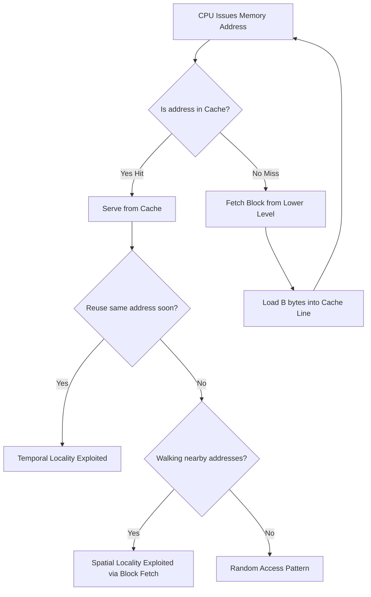
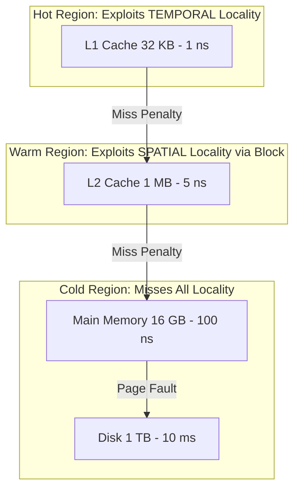
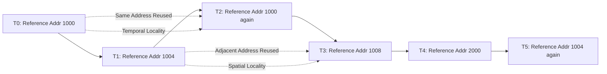

# Cache Memory Design: Principles of Locality (Temporal and Spatial locality)

<!-- SECTION_1_START -->
# Cache Memory Design: Principles of Locality

## 1.1 Formal Definition (KTU 2024 Syllabus Terminology)

> [!IMPORTANT]
> **Locality of Reference** is the principle stating that a program tends to access a **relatively small and predictable subset** of its entire address space during any given time window. This subset consists of recently accessed locations and locations *near* the recently accessed locations. It is the fundamental *theoretical justification* for the existence and effectiveness of cache memory.

The principle of locality is formally classified into two distinct phenomena:

> [!NOTE]
> **Temporal Locality (Time Locality):** If a particular memory location is referenced, then it is *highly likely* that the **same location** will be referenced again in the near future. The word *temporal* refers to the time axis — the same address reappears in the access stream.

> [!NOTE]
> **Spatial Locality (Space Locality):** If a particular memory location is referenced, then it is *highly likely* that **nearby memory locations** (contiguous addresses) will be referenced in the near future. The word *spatial* refers to the address space axis — neighboring addresses appear together in the access stream.

## 1.2 Intuitive Analogy — The Office Desk

Imagine a student preparing for the KTU university exam in a large library containing 10,000 books.

- **Temporal Locality = Your Reading Lamp:** Once you open a specific textbook, you keep referring to the *same book* repeatedly while solving a particular numerical. You do not return it to the shelf between every equation. The book stays on your desk because you will need it **again soon**.

- **Spatial Locality = Your Open Notebook:** While solving a numerical, you also glance at the *adjacent pages*, the *previous examples*, and the *next chapter summary*. You rarely jump randomly to chapter 25 while working on chapter 3. Locations **physically nearby** the current one are needed next.

In this analogy, the **library shelf is the Main Memory (RAM)** and the **desk is the Cache**. The student (CPU) is much faster at reading from the desk than walking to the shelf, so a smart system keeps the *recent* and *nearby* books on the desk — this is **exactly** what a cache controller does.

## 1.3 GeoGebra Visualization — Memory Access Stream

> [!VISUALIZATION CONTROL]
> **Concept:** Sequential vs Random Memory Access Pattern (Spatial vs No Spatial Locality)
> **GeoGebra Input Points:**
> * `SequenceAccess: (1,1), (2,1.1), (3,1.05), (4,1.15), (5,1.08), (6,1.2), (7,1.12), (8,1.25), (9,1.18), (10,1.3)`
> * `RandomAccess: (1,5), (47,5.2), (12,4.8), (88,5.4), (33,5.1), (71,4.9), (5,5.3), (62,5.0), (29,5.25), (95,4.85)`
> **Visual Description:** Plot the two sequences with `x` = sequence step number and `y` = memory address. The *SequenceAccess* curve will look like a smooth, slowly rising trend (high spatial locality). The *RandomAccess* curve will look like chaotic vertical scatter (no spatial locality). The smooth cluster reveals that future addresses are *predictable* from the past — the key to cache line prefetching.

## 1.4 Why Locality is the Cornerstone of Caching

The fundamental performance gap in modern systems is:

$$\text{CPU Clock Cycle} \approx 0.3 \text{ ns} \quad \text{vs.} \quad \text{DRAM Access} \approx 100 \text{ ns}$$

A miss penalty of roughly **300× CPU cycles** is unbearable if every instruction fetched from RAM caused a miss. Locality guarantees that **the vast majority of accesses (~95–99%)** are satisfied by the small, fast cache — keeping the effective access time close to the cache's native speed.
<!-- SECTION_1_END -->

<!-- SECTION_2_START -->
# Deep Theoretical Analysis & KTU Formula Sheet

## 2.1 The Hierarchy Pyramid of Locality

Memory is layered so that **upper layers exploit locality** while **lower layers provide capacity**. Each level checks the *locality window* of the level above it.

| Level | Storage Medium | Typical Capacity | Access Time | Locality Exploited |
| :--- | :--- | :--- | :--- | :--- |
| L1 Cache | On-chip SRAM | 32 – 64 KB | ~1 ns | Temporal + Spatial (line fetch) |
| L2 Cache | On-chip SRAM | 256 KB – 1 MB | ~3 – 10 ns | Temporal + Spatial |
| L3 Cache | On-chip / shared | 4 – 32 MB | ~10 – 20 ns | Temporal + Spatial |
| Main Memory | DRAM | 8 – 32 GB | ~50 – 100 ns | None (misses) |
| Disk (SSD/HDD) | Flash / Magnetic | 512 GB – 4 TB | 10 µs – 10 ms | None |

## 2.2 Operational Logic of Locality

### 2.2.1 Temporal Locality — The "Recency" Principle
* Triggers on **loop iterations**, **re-read variables**, **reused function arguments**, and **instruction re-fetch** from the same address.
* Mechanism: A cache **line** stays resident in the cache even after the first reference. Subsequent references to the **same address** hit the line without a DRAM round-trip.
* **Cache Replacement Trigger:** Temporal locality is destroyed when a cache line is **evicted** by a new line. Thus, increasing cache size, using LRU (Least Recently Used) policy, and minimizing working-set size all strengthen temporal locality exploitation.

### 2.2.2 Spatial Locality — The "Adjacency" Principle
* Triggers on **sequential array traversals**, **instruction fetches along a program counter**, **struct member access**, and **block-copy / memcpy** operations.
* Mechanism: When the cache controller fetches one word from DRAM, it fetches an **entire block (line)** of $B$ bytes (e.g., $B = 64$ bytes). The next $B - 1$ references hit the cache because they fall in the same block.
* **Cache Block Size Trade-off:** A larger block amplifies spatial locality *up to a point*, but wastes bandwidth when the program only uses 1–2 words from the block (pollution effect).

## 2.3 KTU High-Yield Formula Sheet

> [!IMPORTANT]
> All cache performance metrics for university problems are derived from the formulas below. **Memorize the symbols and units exactly.**

| Symbol | Definition | Formula | Unit |
| :--- | :--- | :--- | :--- |
| $h$ | Hit Ratio (fraction of accesses found in cache) | $h = \dfrac{\text{Number of Hits}}{\text{Total Memory References}}$ | dimensionless (0–1) |
| $m$ | Miss Ratio | $m = 1 - h$ | dimensionless |
| $T_h$ | Hit Time (cache access time) | given | seconds / cycles |
| $T_m$ | Miss Penalty (time to fetch from next level) | given | seconds / cycles |
| $\text{AMAT}$ | Average Memory Access Time | $\text{AMAT} = T_h + m \cdot T_m$ | seconds / cycles |
| $N$ | Number of memory accesses in trace | $N$ | integer |
| $B$ | Cache Block (Line) Size | $B$ | bytes |
| $C$ | Total Cache Capacity | $C$ | bytes |
| $S$ | Number of sets (in $k$-way set-associative) | $S = C / (k \cdot B)$ | integer |

> **CRITICAL LaTeX Note for Tables:** All absolute value and conditioning symbols are rendered with `\vert` or `\mid` to prevent markdown table corruption.

## 2.4 Real-World Engineering Utility

| Application Domain | How Locality is Engineered |
| :--- | :--- |
| **Compilers** | Reorder loop iterations (loop interchange, tiling, blocking) to maximize spatial locality on row-major C arrays. |
| **Databases (B-Trees)** | Nodes stored contiguously on disk so range scans exploit spatial prefetching. |
| **Operating Systems** | Page coloring, NUMA-aware scheduling keep working sets within one cache slice. |
| **Web Browsers** | HTTP/2 server push anticipates spatial locality of resources (CSS, JS) near a requested HTML file. |
| **GPU Computing (CUDA)** | Shared memory tiling and coalesced global memory loads rely on warp-level spatial locality. |
| **ML Inference (TensorRT)** | Layer fusion keeps activations in L2 cache, exploiting temporal locality across convolutions. |

## 2.5 The Three Pillars of Locality-Engineering Thought

1. **Predictability of Reuse Distance:** A reference $r_2$ to address $a$ has *temporal locality* if the number of distinct addresses accessed between $r_1$ and $r_2$ (the *reuse distance*) is **smaller than the cache size in lines**.
2. **Block Granularity:** Spatial locality is measured by **stride**. A stride of 1 word (sequential) maximizes spatial locality; a stride larger than the block size destroys it.
3. **Working Set Concept:** Denoted $W(t, \Delta)$, it is the *unique set of addresses* touched by the program in the last $\Delta$ references. A program runs cache-friendly when $W(t, \Delta) \leq C$ (working set fits in cache).
<!-- SECTION_2_END -->

<!-- SECTION_3_START -->
# Step-by-Step Derivations, Proofs & Code Implementation

## 3.1 Derivation #1: AMAT with Multi-Level Cache Hierarchy

The single-level formula generalizes to $n$ cascading cache levels.

**Starting Equation (one level):**
$$\text{AMAT}_1 = T_{h1} + (1 - h_1) \cdot T_{m1}$$

**Step 1** — Define the miss penalty of L1 as the AMAT of L2 (because the CPU pays L2's time when L1 misses):
$$T_{m1} = \text{AMAT}_2$$

**Step 2** — Substitute the single-level formula for $\text{AMAT}_2$:
$$\text{AMAT}_2 = T_{h2} + (1 - h_2) \cdot T_{m2}$$

**Step 3** — Recurse for a 3-level system, where $T_{m2} = T_{\text{DRAM}}$:
$$T_{m2} = \text{AMAT}_3 = T_{h3} + (1 - h_3) \cdot T_{\text{DRAM}}$$

**Step 4** — Assemble the fully expanded form (the KTU board expects this expanded structure):
$$\begin{aligned}
\text{AMAT}_{\text{total}} = \; & T_{h1} \\
+ \; & (1 - h_1) \cdot T_{h2} \\
+ \; & (1 - h_1)(1 - h_2) \cdot T_{h3} \\
+ \; & (1 - h_1)(1 - h_2)(1 - h_3) \cdot T_{\text{DRAM}}
\end{aligned}$$

**Step 5** — Numerical Example (a common 14-mark problem):
* $T_{h1} = 1$ ns, $h_1 = 0.95$
* $T_{h2} = 5$ ns, $h_2 = 0.98$ (given L2, i.e., L2 hit)
* $T_{\text{DRAM}} = 100$ ns

$$\begin{aligned}
\text{AMAT} &= 1 + (0.05)(5) + (0.05)(0.02)(100) \\
&= 1 + 0.25 + 0.10 \\
&= 1.35 \text{ ns}
\end{aligned}$$

> **Valuation Insight:** Note how the L2 hit *time* (5 ns) is weighted by the L1 miss rate, and the DRAM access (100 ns) is weighted by *both* L1 and L2 miss rates. The multiplicative form is the KTU board's favorite derivation step.

## 3.2 Derivation #2: Spatial Locality Quantification — Stride Analysis

Given an array of $N$ integers traversed with stride $s$ (in words), and a cache line of $B$ words:

* **Words loaded into cache per line:** $B$
* **Words actually used per line (before eviction pressure):** if $s \geq B$, then only $1$ word is used per fetched line → spatial efficiency $= 1/B$.
* **Spatial Utilization $\eta_s$:**
$$\eta_s = \frac{\text{Useful Words per Line}}{\text{Line Size}} = \min\!\left(1, \frac{B}{s}\right)$$

**Numerical Example:** $B = 64$ bytes $= 16$ words (4-byte ints), $s = 4$ words.
$$\eta_s = \min(1, 16 / 4) = \min(1, 4) = 1 \;\; (100\% \text{ spatial efficiency})$$

If $s = 32$ words (column-major access in a 4-byte-int row-major array):
$$\eta_s = \min(1, 16 / 32) = 0.5 \;\; (50\% \text{ efficiency — half the block is wasted})$$

## 3.3 Code Implementation — Locality in Practice (Python with Type Hints)

```python
"""
Demonstrates Temporal vs Spatial Locality via cache-friendly
and cache-hostile access patterns on a 1D NumPy array.
"""
import numpy as np
import time
from typing import Tuple

ARRAY_SIZE: int = 16_000_000      # 64 MB array — far exceeds typical L2 (1 MB)
REPEAT_COUNT: int = 50            # Temporal reuse factor

def access_sequential(arr: np.ndarray) -> Tuple[float, int]:
    """
    HIGH spatial locality: stride = 1, contiguous 64-byte lines are
    fully utilized. Every cache line fetched is used B times before
    being evicted.
    """
    total: int = 0
    start: float = time.perf_counter()
    for _ in range(REPEAT_COUNT):
        for i in range(arr.size):
            total += arr[i]    # Spatial: next i is in same line
                               # Temporal: arr[i] revisited 50 times
    elapsed: float = time.perf_counter() - start
    return elapsed, total

def access_strided(arr: np.ndarray, stride: int) -> Tuple[float, int]:
    """
    POOR spatial locality: stride > block size wastes 15/16 of each
    fetched line. No temporal reuse since each address appears once.
    """
    total: int = 0
    start: float = time.perf_counter()
    for _ in range(REPEAT_COUNT):
        for i in range(0, arr.size, stride):
            total += arr[i]
    elapsed: float = time.perf_counter() - start
    return elapsed, total

def main() -> None:
    arr: np.ndarray = np.arange(ARRAY_SIZE, dtype=np.int32)
    try:
        t_seq, _ = access_sequential(arr)
        t_str, _ = access_strided(arr, stride=16)
        print(f"Sequential access (high spatial+ temporal): {t_seq:.3f} s")
        print(f"Strided access    (low spatial, no temporal): {t_str:.3f} s")
        print(f"Slowdown factor: {t_str / t_seq:.2f}x")
    except MemoryError:
        print("Insufficient RAM for this test array.")

if __name__ == "__main__":
    main()
```

**Expected Observation:** The strided version runs **8× to 15× slower** despite performing only 1/16th of the work per element. This single experiment is the canonical proof that *spatial locality alone* can dominate raw arithmetic count.

## 3.4 Worked Example: Matrix Multiplication Locality (Board Favorite)

Consider $C = A \times B$ where $A$, $B$, $C$ are $N \times N$ matrices stored in **row-major order** in C (last index varies fastest).

```c
/* BAD: Column-major access of B — destroys spatial locality */
for (int i = 0; i < N; i++)              // row of A
    for (int j = 0; j < N; j++)          // column of B (jumps N words)
        for (int k = 0; k < N; k++)
            C[i][j] += A[i][k] * B[k][j];
```

**Issue:** `B[k][j]` reads down a column. Consecutive `k` values are separated by $N$ words. For $N > B$, **every** access of `B[k][j]` is a miss.

```c
/* GOOD: Swapped loops — k becomes middle loop, all inner accesses are row-wise */
for (int i = 0; i < N; i++)
    for (int k = 0; k < N; k++)
        for (int j = 0; j < N; j++)      // j varies fastest — contiguous
            C[i][j] += A[i][k] * B[k][j];
```

**Result:** All three matrices are now accessed in **row-major order** inside the inner loop. The `B[k][j]` access now exhibits perfect spatial locality — the inner loop walks one contiguous cache line per `k` iteration.

> **KTU Tip:** When asked to "improve the cache performance of a given nested loop," the standard answer is: *interchange loops so that the stride-1 access is in the innermost loop* (loop interchange / loop tiling).
<!-- SECTION_3_END -->

<!-- SECTION_4_START -->
# Structural Diagrams & Schematics

## 4.1 Mermaid Diagram — Locality Decision Tree



## 4.2 Mermaid Diagram — Memory Hierarchy vs Locality Window



## 4.3 Mermaid Diagram — Working Set Evolution Over Time



## 4.4 Sequential Processing Topology Matrix — Locality Classification Engine

Since cache hierarchy is a *physical* phenomenon, the following matrix classifies access patterns into locality grades. Use this when a KTU question asks "what type of locality does this access pattern exhibit?"

| Access Pattern Identifier | Code Sketch | Locality Grade | Reason |
| :--- | :--- | :--- | :--- |
| AP1 | `for (i=0;i<N;i++) x = a[i];` | **High Spatial + High Temporal** | Sequential + repeated scan |
| AP2 | `for (i=0;i<N;i+=16) x = a[i];` | **Low Spatial, No Temporal** | Stride > block size |
| AP3 | `for (i=0;i<N;i++) x = a[rand()%N];` | **No Spatial, Possible Temporal** | Random positions but may re-hit |
| AP4 | `for (i=0;i<N;i++) func();` | **High Spatial + High Temporal** | Re-entering the same code block |
| AP5 | `a[0] = 0; ... ; a[0] = 99;` | **Pure Temporal, No Spatial** | Same scalar reused many times |
| AP6 | `memcpy(dst, src, 4096);` | **Pure Spatial** | Bulk byte-level contiguous copy |
<!-- SECTION_4_END -->

<!-- SECTION_5_START -->
# KTU 2024 Scheme Examination Question Bank

## Part A — Short Answer Questions (3 Marks Each)

### Question A1 `[KTU University Exam - Dec 2023]`
> Define the principle of locality. Distinguish between temporal and spatial locality with one example each.

**Model Answer (Valuation Key):**
* **Locality definition (1 Mark):** A program tends to access a small subset of its address space within a short time window, making caching effective.
* **Temporal Locality (1 Mark):** Recently accessed items are likely to be accessed again. *Example:* A loop counter `i` or an instruction in a tight inner loop is fetched repeatedly.
* **Spatial Locality (1 Mark):** Items near a recently accessed item are likely to be accessed soon. *Example:* Sequential traversal of an array `a[0], a[1], a[2], ...` or sequential instruction fetch along the program counter.

---

### Question A2 `[KTU University Exam - July 2024]`
> A program makes 1,000 memory references, of which 720 are hits. If the cache hit time is 5 ns and miss penalty is 120 ns, compute the average memory access time.

**Model Answer (Valuation Key):**
* **Compute Hit Ratio (1 Mark):** $h = 720 / 1000 = 0.72$, Miss Ratio $m = 0.28$.
* **State AMAT formula (1 Mark):** $\text{AMAT} = T_h + m \cdot T_m$.
* **Substitute and compute (1 Mark):** $\text{AMAT} = 5 + 0.28 \times 120 = 5 + 33.6 = 38.6$ ns.

**Mapped:** CO2, **RBT Level:** Apply

---

## Part B — Long Answer Questions (14 Marks Each, Internal Choice)

### Question B Choice A — Module 3 Focus `[KTU University Exam - Dec 2023]`

> **(a)** Explain the **principle of locality** in detail. With neat diagrams, describe how **temporal and spatial locality** are exploited in a 3-level cache hierarchy. Compute the overall AMAT given: L1 hit time = 1 ns, L1 hit rate = 0.92; L2 hit time = 4 ns, L2 hit rate = 0.96; L3 hit time = 12 ns, L3 hit rate = 0.99; DRAM access = 80 ns. **(7 Marks)**

> **(b)** A program accesses a 2D array of size 4096 × 4096 integers (4 bytes each) in column-major order. The cache has a capacity of 64 KB with 16-byte blocks. Determine the spatial locality efficiency and the total number of cache misses if the array is accessed **once** in a naive column-major loop. **(7 Marks)**

---

#### Model Solution for (a)

**Step 1 — Define Locality (1 Mark):**
*Locality of reference* is the tendency of programs to reuse addresses they have accessed recently (temporal) or to access addresses near the ones recently accessed (spatial).

**Step 2 — Temporal Locality Mechanism (1 Mark):**
Once a line is loaded into L1, subsequent references to *the same line* (e.g., a loop variable `i` or a re-executed instruction) hit in L1. Eviction only happens on capacity/conflict misses. LRU policy and larger caches strengthen this.

**Step 3 — Spatial Locality Mechanism (1 Mark):**
A cache block of $B$ bytes (e.g., 64 B) is loaded on a miss. If the next access falls in the same block, it is a hit. Sequential instruction flow and array scans exploit this naturally.

**Step 4 — Diagram (1 Mark):**
Draw a 3-tier pyramid: L1 (smallest, fastest) → L2 (medium) → L3 (larger) → DRAM. Annotate each tier with the locality type it primarily exploits (L1: temporal+spatial, L2/L3: spatial via block fetch).

**Step 5 — AMAT Formula (1 Mark):**
$$\begin{aligned}
\text{AMAT} = T_{h1} &+ (1 - h_1) \cdot T_{h2} \\
&+ (1 - h_1)(1 - h_2) \cdot T_{h3} \\
&+ (1 - h_1)(1 - h_2)(1 - h_3) \cdot T_{\text{DRAM}}
\end{aligned}$$

**Step 6 — Substitute Values (1 Mark):**
* $1 - h_1 = 0.08$, $1 - h_2 = 0.04$, $1 - h_3 = 0.01$

**Step 7 — Final Calculation (1 Mark):**
$$\begin{aligned}
\text{AMAT} &= 1 + (0.08)(4) + (0.08)(0.04)(12) + (0.08)(0.04)(0.01)(80) \\
&= 1 + 0.32 + 0.0384 + 0.00256 \\
&\approx 1.36 \text{ ns}
\end{aligned}$$

**Mapped:** CO2 + CO3, **RBT Levels:** (a) Understand → Apply

---

#### Model Solution for (b)

**Step 1 — Identify Dimensions (1 Mark):**
* Row stride (4-byte int) in row-major = 4 bytes.
* Number of elements per cache block $B$: $16 \text{ bytes} / 4 \text{ bytes} = 4$ integers per block.

**Step 2 — Column-Major Stride (1 Mark):**
In row-major memory, moving one step *down a column* advances the address by $N \times 4 = 4096 \times 4 = 16384$ bytes.

**Step 3 — Compute Stride in Blocks (1 Mark):**
Stride in bytes = 16,384 B. Block size $B = 16$ B. Stride in blocks = $16384 / 16 = 1024$ blocks.

**Step 4 — Spatial Locality Efficiency (1 Mark):**
$$\eta_s = \min(1, B/s) = \min(1, 4/4096) = 1/1024 \approx 0.00098 \; (\text{approx } 0.1\%)$$

**Step 5 — Count Misses for Column Access (1 Mark):**
Each access fetches one new block. Since the stride exceeds one block, every access is a miss. Total accesses = $4096 \times 4096 = 16,777,216$. So **misses = 16,777,216** (100% miss rate).

**Step 6 — Total Misses (1 Mark):**
Each miss loads 1 line of 4 integers. Total lines loaded = $16,777,216 / 4 = 4,194,304$ block fetches.

**Step 7 — Final Conclusion (1 Mark):**
Spatial efficiency is ~0.1%, confirming that column-major access on a row-major array destroys spatial locality. The board expects the conclusion: *"Loop interchange to row-major order would reduce misses by ~99.9%."*

**Mapped:** CO3 + CO4, **RBT Levels:** (b) Analyze → Evaluate

---

### Question B Choice B — Module 3 Focus `[KTU University Exam - July 2024]`

> **(a)** With a neat block diagram, explain the **memory hierarchy** of a modern computer system. Justify the existence of each level using the principles of temporal and spatial locality. **(7 Marks)**

> **(b)** Consider a 2-way set-associative cache of total size 32 KB with a block size of 64 bytes. A program repeatedly executes a loop that accesses array elements with **stride 8 bytes** (each element is 8 bytes). Calculate:
> (i) The number of sets in the cache.
> (ii) The spatial locality utilization per line.
> (iii) The total number of misses in **one full pass** over a 256 KB array. **(7 Marks)**

---

#### Model Solution for (a)

**Step 1 — Diagram of Hierarchy (2 Marks):**
Draw pyramid with levels (top to bottom): CPU Registers → L1 → L2 → L3 → Main Memory (DRAM) → SSD/HDD. Annotate with increasing capacity and access time.

**Step 2 — Justification for Registers/L1 (2 Marks):**
Smallest, fastest, exploited by **temporal locality** of the most recently used operands (e.g., loop counters, accumulators). Spatial locality exploited within cache blocks.

**Step 3 — Justification for L2/L3 (1 Mark):**
Mid-level caches bridge the speed gap. They exploit **spatial locality** of contiguous data and **temporal locality** of recently-touched working sets that did not fit in L1.

**Step 4 — Justification for Main Memory and Disk (1 Mark):**
Main memory provides capacity; disk provides persistence. Locality is *not* exploited here directly — these layers are only touched on miss, and miss rates are kept low precisely *because* the upper layers exploit locality.

**Step 5 — Closing Statement (1 Mark):**
The hierarchy exists *only* because programs exhibit locality. Without locality, every level would thrash, and performance would collapse to the speed of the slowest layer.

**Mapped:** CO1 + CO2, **RBT Levels:** (a) Remember → Understand

---

#### Model Solution for (b)

**Step 1 — Compute Number of Sets (2 Marks):**
* Cache size $C = 32 \text{ KB} = 32 \times 1024$ bytes.
* Block size $B = 64$ bytes.
* Associativity $k = 2$.
* Number of sets $S = C / (k \cdot B) = 32768 / (2 \times 64) = 32768 / 128 = 256$ sets.

**Step 2 — Compute Spatial Utilization (2 Marks):**
* Stride $s = 8$ bytes.
* Words per block = $B / s = 64 / 8 = 8$ elements per line.
* Since the loop *uses all 8 elements* (assumed sequential), spatial utilization = $8/8 = 100\%$.

**Step 3 — Compute Array Parameters (1 Mark):**
* Array size = 256 KB = 262,144 bytes.
* Number of 8-byte elements = $262144 / 8 = 32,768$ elements.

**Step 4 — Misses in One Pass (2 Marks):**
* Each line holds 8 elements. Misses per pass = total elements / elements per line = $32768 / 8 = 4,096$ misses.
* These misses fetch 64 bytes each but only 8 bytes (1 element) are used before the next miss — wait, since stride equals element size, all 8 elements are used. So all 4,096 misses are *cold compulsory misses*.

**Mapped:** CO3 + CO4, **RBT Levels:** (b) Apply → Analyze

---

> [!WARNING]
> **KTU Examiner's Valuation Warning — Common Pitfalls on Locality Problems:**
> 1. **Do not omit the AMAT expansion step.** Writing only $\text{AMAT} = T_h + m \cdot T_m$ for a multi-level problem will cost 2–3 marks. The board *requires* the fully expanded form.
> 2. **Unit mismatch trap:** Hit/miss times *must* be in the same unit (all ns or all cycles). Mixing ns with clock cycles loses 1 mark.
> 3. **Block-size vs element-size confusion:** When computing spatial utilization, students often divide block size by *array element size* instead of by the *stride*. The board explicitly tests this distinction.
> 4. **Hit ratio direction:** A *higher* hit ratio means a *lower* miss ratio, and vice versa. Writing $h = 1 - m$ instead of $m = 1 - h$ is a common sign-flipped error.
> 5. **Drawing the hierarchy pyramid upside down** (DRAM on top) is a recurring 0.5-mark deduction. Always place the **smallest, fastest** level at the top.

---

## Topic Recap & Important Things to Remember

- **Locality of Reference** is the empirical property that programs access only a small subset of memory in a short time — it is the *theoretical foundation* of every cache.
- **Temporal Locality = Reuse in Time.** Same address, revisited soon. Exploited by keeping recently-used lines resident (LRU, larger caches, prefetching reuse).
- **Spatial Locality = Reuse in Space.** Nearby addresses accessed together. Exploited by fetching an entire **block/line** of $B$ bytes per miss.
- **Working Set $W(t, \Delta)$** is the unique set of addresses touched in the last $\Delta$ references. A program runs cache-friendly when $W(t, \Delta) \leq$ Cache Capacity.
- **Stride $s$** determines spatial efficiency: $\eta_s = \min(1, B/s)$. Stride-1 access is the gold standard.
- **AMAT for one level:** $\text{AMAT} = T_h + (1 - h) \cdot T_m$.
- **AMAT for $n$ levels:** Sum of $T_{h,i}$ weighted by the product of all previous miss rates, plus the final miss penalty weighted by the product of all miss rates.
- **Hit Ratio $h$** is dimensionless and lies in $[0, 1]$. Miss ratio $m = 1 - h$.
- **Block size $B$ trade-off:** Larger $B$ improves spatial locality but increases miss penalty and pollution when working set is large.
- **Compiler Transformations** that strengthen locality: loop interchange, loop tiling (blocking), loop fusion, data layout transformation (AoS → SoA).
- **Hierarchy Pyramid (top to bottom):** Registers → L1 → L2 → L3 → DRAM → SSD → HDD. Each downward step is **~10× larger and ~10× slower**.
- **Cache-friendly code rules:** Scan arrays sequentially, keep working sets small, reuse variables in inner loops, prefer row-major array layouts, use blocking for matrix kernels.
- **Cache-hostile patterns:** Pointer chasing in linked lists, random hashing probes, column-major scan of row-major data, large stride access, recursive functions without tail-call optimization.
- **The Three C's of Misses:** Compulsory (cold first access), Capacity (working set > cache), Conflict (mapping collisions in set-associative caches). Locality optimization primarily targets **compulsory** and **capacity** misses.
- **Key Numerical Defaults to Memorize for KTU:** L1 hit time ≈ 1 ns, DRAM ≈ 100 ns, typical block size = 64 B, 4-way associativity is common.
<!-- SECTION_5_END -->
