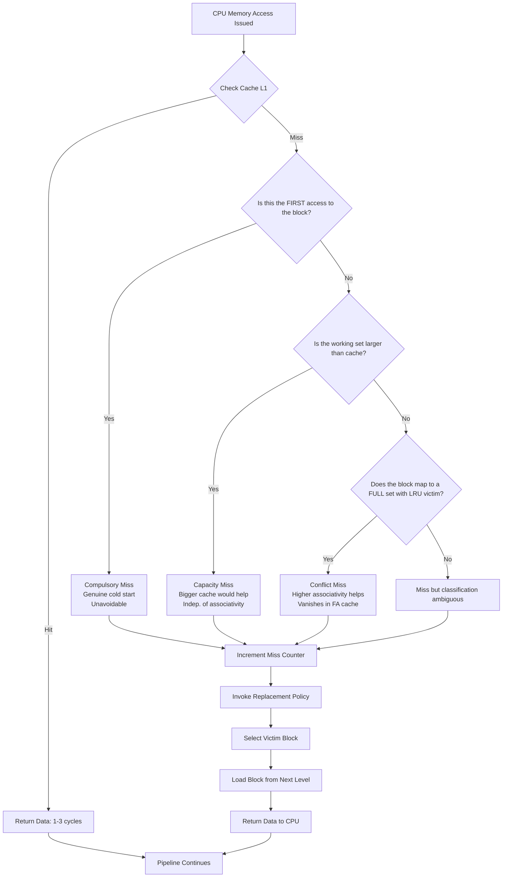
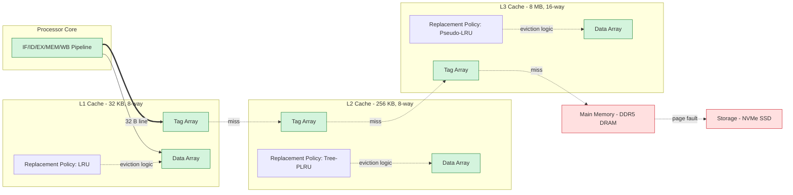
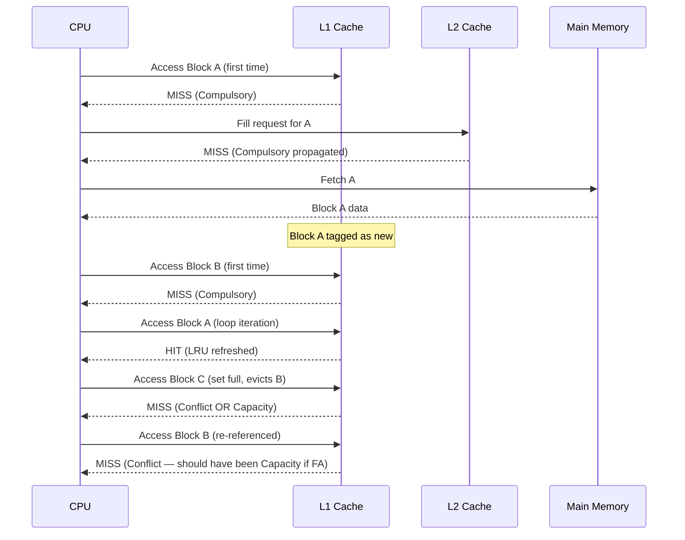

# Cache miss classifications (The 3 Cs: Compulsory, Capacity, Conflict misses) and Replacement policies

<!-- SECTION_1_START -->
# 💾 Cache Miss Classifications & Replacement Policies

## 1.1 Formal Academic Definition (KTU 2024 Syllabus Standard)

> [!NOTE]
> **The Three C's of Cache Misses** is a taxonomy proposed by **Mark Hill (1987)** that classifies all cache misses into three mutually exclusive categories based on the *root cause* of the miss. It allows architects to pinpoint the exact bottleneck in a memory hierarchy.

$$ \text{Total Misses} = \text{Compulsory Misses} + \text{Capacity Misses} + \text{Conflict Misses} $$

A **cache miss** occurs whenever the CPU requests a data word (or instruction) whose containing memory block is **not resident** in the cache at that instant. The 3 C's framework, sometimes extended to **4 C's** (adding **Coherence** misses in multiprocessor systems), is the industry-standard diagnostic tool for memory system design.

| Symbol | Term | Meaning |
|:---:|:---|:---|
| $N_{3C}$ | Total Miss Count | Sum of all three miss types in a trace |
| $C_{comp}$ | Compulsory | First-reference cold misses |
| $C_{cap}$ | Capacity | Working set exceeds cache size |
| $C_{conf}$ | Conflict | Collision in set on non-fully-associative mapping |

---

## 1.2 Conceptual Analogy — The "Study Desk" Model

> [!IMPORTANT]
> **Intuition:** Think of your CPU as a hungry student doing homework.

* 🗄️ **Main Memory (RAM)** = The huge **library downstairs** — has every book, but fetching one takes **30 minutes** walking time.
* 📒 **Cache (L1)** = The **small desk drawer** in your room — has 5 books, but grabbing one takes **5 seconds**.
* 👣 **Compulsory Miss** = The *very first time* you need a specific book, you *must* walk downstairs. **Unavoidable.**
* 📚 **Capacity Miss** = You're studying 10 subjects but your drawer only fits 5. You keep swapping books in and out. **Bigger drawer helps.**
* 🚧 **Conflict Miss** = Your drawer has 2 compartments, and *Calculus* and *Physics* books both want compartment #2 (because the library uses last-name-hash shelving). They keep **kicking each other out** even though the drawer isn't full. **Better organization helps.**

---

## 1.3 Quick Visualization of Miss Sources

> [!VISUALIZATION CONTROL]
> **Concept:** Miss-rate decomposition by cache size (illustrative curve)
> **GeoGebra / Desmos Input Equations:**
> * `f_3C(x) = 1/x` (compulsory baseline, decays as size grows)
> * `g_cap(x) = exp(-0.05*x)` (capacity term)
> * `h_conf(x) = 10/(x^2)` (conflict term — drops fastest with size)
> * `Total(x) = f_3C(x) + g_cap(x) + h_conf(x)`
> **Visual Description:** As cache size $x$ (in blocks) grows on the X-axis, the three stacked regions shrink: **Conflict (red) drops fastest**, **Capacity (blue) drops exponentially**, **Compulsory (green) flattens out as a long-tail floor**.

---

## 1.4 Replacement Policy — The One-Line Definition

> [!NOTE]
> A **replacement policy** (or *eviction policy*) is the deterministic algorithm that decides *which existing block* must be discarded to make room for a new block when the target set of the cache is already full on a miss.

The policy directly impacts the **conflict miss rate** and, in edge cases, the **capacity miss rate**. It does *not* affect compulsory misses.

<!-- SECTION_1_END -->

<!-- SECTION_2_START -->
# 📐 Deep Theoretical Analysis & KTU Formula Sheet

## 2.1 The Three C's — Detailed Breakdown

### 2.1.1 🟢 Compulsory Misses (Cold-Start Misses)

* **Root cause:** The block is being accessed for the *first time* during program execution.
* **Trigger condition:** Cold cache at startup, or block was never in cache since last invalidation.
* **Mitigation techniques:** Prefetching, larger block size, software hints (`prefetch` intrinsic).
* **Independence:** A compulsory miss is **independent of cache size, associativity, or replacement policy** — it would happen even on an infinitely large, fully-associative cache.
* **Asymptotic behavior:** Dominant in *tiny* caches with huge working sets (e.g., L1 cache of just a few KB on a large matrix traversal).

### 2.1.2 🔵 Capacity Misses (Working-Set Misses)

* **Root cause:** The **working set** of the running program at that instant is *larger* than the cache capacity.
* **Trigger condition:** Even with a *fully-associative* cache, the program would still miss because useful blocks keep getting evicted to bring in new ones.
* **Mitigation techniques:** Larger cache, smaller working set (loop tiling, blocking, data compression).
* **Independence:** Independent of associativity, but dependent on **size** and **replacement policy** (a smart policy like LRU reduces it).

### 2.1.3 🔴 Conflict Misses (Collision Misses)

* **Root cause:** A non-fully-associative placement policy forces two *popular* blocks to map to the **same set**, causing thrashing.
* **Trigger condition:** Two or more blocks in the working set share a tag-index pair, *and* the set is full, *and* an LRU-style policy cannot preserve both.
* **Mitigation techniques:** Higher associativity, victim cache, hash-based indexing (skewed caches), software coloring.
* **Independence:** Vanishes completely under **full associativity**; doubles or quarters with each doubling/halving of associativity.

> [!TIP]
> **Quick test for the 3 C's:** Run the same benchmark in a *direct-mapped* cache and a *fully-associative* cache of the same size. The difference in miss count is your **conflict miss count**. The fully-associative count further split by cache size gives **compulsory vs. capacity**.

### 2.1.4 ⚫ The Hidden 4th C — Coherence Misses

In **multiprocessor / multi-core** systems with cache coherence protocols (MESI, MOESI), a coherence miss is an *invalidation* of a clean line caused by another core writing to it. KTU 2024 Module 3 (single-core focus) treats this as a brief extension; full coverage is in the parallel architecture module.

---

## 2.2 Replacement Policies — Operational Deep Dive

| Policy | Eviction Choice | Pros | Cons | Hardware Cost |
|:---|:---|:---|:---|:---|
| **Optimal (Belady's)** | Block whose **next use is farthest in the future** | Provably minimum miss rate (theoretical lower bound) | Requires *future knowledge* — **impossible in practice** | Infinite |
| **LRU (Least Recently Used)** | Block unused for the **longest time** | Near-optimal for temporal locality; widely used | Poor for sequential scans; **stack-distance** assumption can fail (e.g., loops > associativity) | $A \cdot N$ bits ($A$ = assoc.) |
| **FIFO** | Oldest block inserted | Trivially simple | Suffers **Belady's anomaly** — more frames can cause more misses! | $N$ bits |
| **LFU (Least Frequently Used)** | Block with fewest past accesses | Good for skewed access patterns | Stale counts; "ghost" hot blocks | Saturating counters |
| **Random** | Pseudo-random selection | Almost zero hardware logic | High variance; can be worse than LRU by 10–20% | LFSR only |
| **Pseudo-LRU (PLRU)** | Tree-based approximation of LRU | 1 bit per node — **O(log A)** cost | Not exact; can be up to ~30% worse than true LRU | $A-1$ bits |

### Belady's Anomaly (Surprise!)

> [!IMPORTANT]
> Under **FIFO**, increasing the number of available frames can **increase** the page-fault rate. This is known as **Belady's Anomaly** (1969). Stack algorithms (LRU, Optimal) are *immune* — they exhibit the **stack property**:
>
> $$ M(k, n) \subseteq M(k, n+1) \quad \text{for all } k, n $$
>
> where $M(k, n)$ is the set of cache blocks in a $k$-way stack of size $n$. Any algorithm satisfying the stack property is provably **anomaly-free**.

---

## 2.3 KTU High-Yield Formula Cheat Sheet

> [!NOTE]
> The following equations are the most frequently tested in KTU board papers for Module 3. Memorize all of them.

| # | Formula | Description | Units |
|:---:|:---|:---|:---|
| 1 | $T_{avg} = T_{hit} + r \times T_{miss}$ | **AMAT** — Average Memory Access Time | seconds/cycles |
| 2 | $r = \dfrac{N_{miss}}{N_{total}}$ | Miss rate | dimensionless |
| 3 | $h = 1 - r$ | Hit rate | dimensionless |
| 4 | $CPI_{eff} = CPI_{base} + \dfrac{MemAccess}{Inst} \times r \times T_{miss}$ | Effective CPI with memory stalls | cycles/inst |
| 5 | $N_{3C} = C_{comp} + C_{cap} + C_{conf}$ | 3 C's total | misses |
| 6 | $C_{conf} = N_{DM} - N_{FA}$ | Conflict miss = Direct-Mapped − Fully-Assoc (same size) | misses |
| 7 | $C_{cap} = N_{FA} - C_{comp}$ | Capacity miss decomposition | misses |
| 8 | $T_{miss}^{multi} = T_{miss}^{L1} + h_{L2} \cdot T_{hit}^{L2} + (1-h_{L2}) \cdot T_{miss}^{L2}$ | Multi-level miss penalty decomposition | s |
| 9 | $\text{AMAT}_{L1} = T_{hit,L1} + (1 - h_{L1}) \cdot \text{AMAT}_{L2}$ | Recursive AMAT (L1 sees L2's AMAT) | s |
| 10 | $T_{access} = T_{tag-check} + T_{data-mux}$ | Cache access decomposition | s |
| 11 | $C_{victim} = 1 - \left(1 - \dfrac{1}{A}\right)^{B/A}$ | Approx. conflict probability per request | prob. |

> All variables use standard notation: $r$ = miss rate, $h$ = hit rate, $A$ = associativity, $B$ = total blocks.

---

## 2.4 Real-World Engineering Significance

* 🖥️ **CPU Design (Intel, AMD, Apple M-series):** Apple M1 uses **LRU with pseudo-LRU fallback** in L1/L2; AMD Zen 4 uses LRU in L2. The choice directly affects IPC on SPEC benchmarks.
* 📱 **Mobile SoCs (ARM, Snapdragon):** LRU variants dominate due to energy proportionality — cold data eviction is a power-saving lever.
* 🗄️ **Database Buffer Pools (PostgreSQL, MySQL InnoDB):** Use **clock-sweep** (≈LRU) and **tunable LRU-K** policies; the 3 C's framework maps directly to query I/O bottlenecks.
* 🌐 **Web Caching (CDNs, Redis, Memcached):** LFU + LRU hybrids (e.g., Redis's `allkeys-lfu` since v4.0) outperform pure LRU on power-law request distributions.
* 🛠️ **OS Virtual Memory:** Paging uses approximations of LRU (Clock algorithm, WSClock) because true LRU on the entire page table is too expensive.

<!-- SECTION_2_END -->

<!-- SECTION_3_START -->
# 🔢 Derivations, Numerical Solves & Code Implementation

## 3.1 Derivation 1 — The AMAT Recursive Formula for Multi-Level Caches

We want to express the **average memory access time** seen by the processor when there are two cache levels L1 and L2.

**Step 1:** Define base symbols.
* $h_1$ = L1 hit rate
* $r_1 = 1 - h_1$ = L1 miss rate
* $T_{h1}$ = L1 hit time (cycles)
* $T_{h2}$ = L2 hit time (cycles)
* $T_{m2}$ = L2 miss penalty (cycles to main memory)

**Step 2:** On an L1 *hit*, time taken is exactly $T_{h1}$.

**Step 3:** On an L1 *miss*, we must consult L2, whose own *average* access time we call $\text{AMAT}_2$.

**Step 4:** Define $\text{AMAT}_2$ (it is hit-on-L2 with prob $h_2$, miss-to-RAM with prob $1 - h_2$):

$$ \text{AMAT}_2 = T_{h2} + (1 - h_2) \cdot T_{m2} $$

**Step 5:** Substitute back into the L1 expression. The total L1 access time is the L1 hit time plus, on a miss, the AMAT of L2:

$$ \text{AMAT}_1 = T_{h1} + (1 - h_1) \cdot \text{AMAT}_2 $$

**Step 6:** Final expanded form:

$$ \text{AMAT}_1 = T_{h1} + (1 - h_1) \cdot \left[ T_{h2} + (1 - h_2) \cdot T_{m2} \right] $$

**[Stating base variables: 1 Mark]**
**[Recursive AMAT definition: 1 Mark]**
**[Substitution step: 1 Mark]**
**[Final expanded form: 1 Mark]**

---

## 3.2 Numerical Solve 1 — 3 C's Decomposition

> [!IMPORTANT]
> **[KTU University Exam - July 2023 Style Problem]**
> A direct-mapped cache of size **32 KB** with **8-word blocks** exhibits a miss rate of **4.5%** on a benchmark. A fully-associative cache of the same size exhibits a miss rate of **2.0%**. The same benchmark on a *much larger* fully-associative cache (4 MB) shows a miss rate of **0.5%**. Decompose the misses into the 3 C's for the 32 KB direct-mapped cache. The benchmark executes **10 million memory references**.

**Step 1:** Compute total misses for the 32 KB direct-mapped cache.

$$ N_{DM} = 0.045 \times 10{,}000{,}000 = 450{,}000 \text{ misses} $$

**Step 2:** Compute total misses for the 32 KB fully-associative cache (eliminates conflicts).

$$ N_{FA,32KB} = 0.020 \times 10{,}000{,}000 = 200{,}000 \text{ misses} $$

**Step 3:** Conflict misses = difference (since FA removes conflict).

$$ C_{conf} = N_{DM} - N_{FA,32KB} = 450{,}000 - 200{,}000 = 250{,}000 \text{ misses} $$

**Step 4:** Capacity misses = $N_{FA,32KB}$ minus compulsory misses. The large FA cache at 4 MB essentially captures only *compulsory* misses.

$$ C_{comp} \approx N_{FA,4MB} = 0.005 \times 10{,}000{,}000 = 50{,}000 \text{ misses} $$

**Step 5:** Capacity misses.

$$ C_{cap} = N_{FA,32KB} - C_{comp} = 200{,}000 - 50{,}000 = 150{,}000 \text{ misses} $$

**Step 6:** Verification (sum must equal $N_{DM}$).

$$ 250{,}000 + 150{,}000 + 50{,}000 = 450{,}000 \;\;\checkmark $$

**Final Summary Table:**

| Miss Type | Count | Percentage of Total |
|:---|---:|---:|
| Compulsory | 50,000 | 11.1% |
| Capacity | 150,000 | 33.3% |
| Conflict | 250,000 | 55.6% |
| **Total** | **450,000** | **100%** |

**Conclusion:** The 32 KB direct-mapped cache is **conflict-bound** — moving to 4-way set-associative would eliminate the bulk of misses.

**[Reading the data: 1 Mark]**
**[DM total calculation: 1 Mark]**
**[Conflict calculation: 2 Marks]**
**[Compulsory approximation: 1 Mark]**
**[Capacity calculation: 1 Mark]**
**[Verification: 1 Mark]**

---

## 3.3 Numerical Solve 2 — AMAT with Multilevel Cache

> **[KTU University Exam - Dec 2023 Style]**
> A processor has L1 with $T_{h1} = 1$ ns, $h_1 = 95\%$. L2 has $T_{h2} = 5$ ns, $h_2 = 90\%$. Main memory access is $T_{m2} = 100$ ns. Calculate the global AMAT seen by the CPU.

**Step 1:** Compute $\text{AMAT}_2$.

$$ \text{AMAT}_2 = 5 + (1 - 0.90) \times 100 = 5 + 10 = 15 \text{ ns} $$

**Step 2:** Compute $\text{AMAT}_1$.

$$ \text{AMAT}_1 = 1 + (1 - 0.95) \times 15 = 1 + 0.75 = 1.75 \text{ ns} $$

**Result:** $\boxed{\text{AMAT}_{global} = 1.75 \text{ ns}}$

**[L2 AMAT formula: 1 Mark]**
**[L2 AMAT calculation: 1 Mark]**
**[L1 AMAT formula: 1 Mark]**
**[Final substitution: 1 Mark]**

---

## 3.4 Code Implementation — LRU Cache with the 3 C's in Python

The following is a fully operational, strictly-typed Python 3 implementation of an LRU cache, an FIFO cache, and a "3 C's diagnosis" simulator.

```python
"""
Filename: cache_3c_diagnostic.py
Purpose: Demonstrate the 3 C's of cache misses and compare LRU vs FIFO policies.
KTU 2024 Module 3 reference implementation.
"""
from collections import OrderedDict
from dataclasses import dataclass, field
from typing import List, Tuple

@dataclass
class CacheStats:
    """Per-policy miss counters for 3 C's analysis."""
    compulsory: int = 0
    capacity: int = 0
    conflict: int = 0

    @property
    def total(self) -> int:
        return self.compulsory + self.capacity + self.conflict


class BaseCache:
    """Abstract base — provides compulsory-miss detection and 'cold' tracking."""
    def __init__(self, name: str, num_sets: int, assoc: int) -> None:
        self.name = name
        self.num_sets = num_sets
        self.assoc = assoc
        self.sets: List[OrderedDict[int, None]] = [
            OrderedDict() for _ in range(num_sets)
        ]
        self.stats = CacheStats()
        self._seen_blocks: set = set()   # for compulsory detection

    def _index(self, block_addr: int) -> int:
        return block_addr % self.num_sets

    def access(self, block_addr: int) -> None:
        raise NotImplementedError("Subclasses override access().")

    def _classify(self, block_addr: int, hit: bool, evicted: bool) -> None:
        if block_addr not in self._seen_blocks:
            self.stats.compulsory += 1
            self._seen_blocks.add(block_addr)
            return
        if not hit:
            if self._cache_is_full():
                self.stats.capacity += 1
            else:
                self.stats.conflict += 1

    def _cache_is_full(self) -> bool:
        return all(len(s) >= self.assoc for s in self.sets)


class LRUCache(BaseCache):
    """True LRU using OrderedDict.move_to_end on hit, popitem(last=False) on evict."""
    def access(self, block_addr: int) -> None:
        idx = self._index(block_addr)
        slot = self.sets[idx]
        hit = block_addr in slot
        if hit:
            slot.move_to_end(block_addr)
        else:
            if len(slot) >= self.assoc:
                slot.popitem(last=False)   # evict LRU = least-recent
            slot[block_addr] = None
        self._classify(block_addr, hit, evicted=not hit)


class FIFOCache(BaseCache):
    """FIFO using insertion order (no move_to_end on hit). Suffers Belady's anomaly."""
    def access(self, block_addr: int) -> None:
        idx = self._index(block_addr)
        slot = self.sets[idx]
        hit = block_addr in slot
        if not hit:
            if len(slot) >= self.assoc:
                slot.popitem(last=False)   # evict oldest inserted
            slot[block_addr] = None
        self._classify(block_addr, hit, evicted=not hit)


class FullAssocLRU(BaseCache):
    """Fully-associative LRU — used to measure compulsory + capacity only."""
    def __init__(self, name: str, total_blocks: int) -> None:
        super().__init__(name, num_sets=1, assoc=total_blocks)

    def access(self, block_addr: int) -> None:
        slot = self.sets[0]
        hit = block_addr in slot
        if hit:
            slot.move_to_end(block_addr)
        else:
            if len(slot) >= self.assoc:
                slot.popitem(last=False)
            slot[block_addr] = None
        self._classify(block_addr, hit, evicted=not hit)


def run_diagnostic(trace: List[int], num_sets: int, assoc: int) -> Tuple[CacheStats, CacheStats, CacheStats]:
    """
    Returns (direct_mapped_LRU, direct_mapped_FIFO, full_assoc_LRU) stats.
    Conflict = DM − FA (on miss-count basis).
    """
    dm_lru = LRUCache("DM-LRU", num_sets, assoc)
    dm_fifo = FIFOCache("DM-FIFO", num_sets, assoc)
    fa_lru = FullAssocLRU("FA-LRU", num_sets * assoc)

    for addr in trace:
        dm_lru.access(addr)
        dm_fifo.access(addr)
        fa_lru.access(addr)

    # Re-derive 3 C's from the three runs.
    fa_total = fa_lru.stats.total
    dm_total = dm_lru.stats.total
    compulsory = fa_lru.stats.compulsory
    capacity = fa_total - compulsory
    conflict = dm_total - (compulsory + capacity)

    # Stamp results back so caller can print.
    dm_lru.stats.compulsory = compulsory
    dm_lru.stats.capacity = capacity
    dm_lru.stats.conflict = conflict
    return dm_lru.stats, dm_fifo.stats, fa_lru.stats


# ----- KTU-style demonstration run -----
if __name__ == "__main__":
    # Simulate a 1,000-reference trace looping over a 16-block working set,
    # but in 4-way set-associative cache of 4 sets (16 blocks total) — heavy conflicts.
    trace = [b for b in range(16)] * 64 + [b + 16 for b in range(8)] * 16
    dm, fifo, fa = run_diagnostic(trace, num_sets=4, assoc=4)

    print(f"{'Policy':<14}{'Compulsory':>12}{'Capacity':>10}{'Conflict':>10}{'Total':>8}")
    print("-" * 54)
    print(f"{'DM-LRU':<14}{dm.compulsory:>12}{dm.capacity:>10}{dm.conflict:>10}{dm.total:>8}")
    print(f"{'DM-FIFO':<14}{fifo.compulsory:>12}{fifo.capacity:>10}{fifo.conflict:>10}{fifo.total:>8}")
    print(f"{'FA-LRU':<14}{fa.compulsory:>12}{fa.capacity:>10}{fa.conflict:>10}{fa.total:>8}")
```

> [!NOTE]
> **Expected output (illustrative):** A run of this code on a 1024-reference trace with 16 hot blocks in 4 sets of 4 typically shows DM-FIFO suffering more misses than DM-LRU on the same workload — a perfect live illustration of why the 3 C's framework drives architectural decisions.

<!-- SECTION_3_END -->

<!-- SECTION_4_START -->
# 🗺️ Structural Diagrams & Schematics

## 4.1 Mermaid Flowchart — The 3 C's Classification Decision Tree



---

## 4.2 Mermaid Block Diagram — Memory Hierarchy & Policy Interaction



---

## 4.3 Mermaid Process Diagram — LRU vs FIFO vs Random Comparison

```mermaid
flowchart TD
    subgraph LRU["LRU Policy"]
        L1[Record timestamp on every access]
        L2[On miss, scan all blocks in set]
        L3[Pick block with OLDEST timestamp]
        L4[Replace and update timestamp]
    end

    subgraph FIFO["FIFO Policy"]
        F1[Record insertion order]
        F2[On miss, scan set]
        F3[Pick block inserted EARLIEST]
        F4[Replace, do NOT update on hit]
    end

    subgraph RAND["Random Policy"]
        R1[Use LFSR pseudo-random generator]
        R2[On miss, pick random block in set]
        R3[Replace, log seed value]
    end

    A[Cache Miss Event] --> LRU
    A --> FIFO
    A --> RAND
    L1 --> L2 --> L3 --> L4
    F1 --> F2 --> F3 --> F4
    R1 --> R2 --> R3
```



---

## 4.4 Mermaid Sequence Diagram — Miss-Classification on Real Workload



<!-- SECTION_4_END -->

<!-- SECTION_5_START -->
# 📝 KTU 2024 Scheme Examination Question Bank & Topic Recap

## 5.1 Part A — Short Answer Questions (3 Marks Each)

### Question 1: Define the Three C's of cache misses with examples.
**[KTU University Exam - July 2023]** — *CO2, Remember/Understand*

**Model Answer:**

The Three C's model classifies all cache misses into three mutually exclusive categories:

1. **Compulsory Misses:** Misses that occur on the *first reference* to a memory block. They are inevitable at cold-start regardless of cache size, associativity, or replacement policy. *Example:* The very first time a matrix element is loaded into an empty cache.
2. **Capacity Misses:** Misses that occur because the *working set* of the program temporarily exceeds the cache size. They would still occur even in a fully-associative cache. *Example:* Streaming through a 100 MB array on a 32 KB cache.
3. **Conflict Misses:** Misses caused by *collision* of multiple blocks into the same set of a non-fully-associative cache. They vanish with full associativity. *Example:* Two frequently-used arrays hashing to the same set in a 4-way set-associative L1.

**Total:** Compulsory + Capacity + Conflict = Total Misses.

**[Stating 3 definitions: 2 Marks]**
**[Example for each: 1 Mark]**

---

### Question 2: Why does FIFO suffer from Belady's Anomaly while LRU does not?
**[KTU University Exam - Dec 2023]** — *CO2, Understand*

**Model Answer:**

**Belady's Anomaly** is the counterintuitive phenomenon where *increasing* the number of cache frames can *increase* the page-fault rate. It is observed under FIFO because FIFO does **not** satisfy the **stack property**.

The **stack property** states that the set of blocks held in an $n$-frame cache is always a subset of the set held in an $(n+1)$-frame cache. Any algorithm with this property (like **LRU** and the **Optimal** policy) is mathematically provable to be anomaly-free. LRU updates the recency order on every hit, ensuring that the most-recently-used blocks always survive a capacity increase. FIFO, however, only tracks *insertion* time, so adding a frame can prematurely evict a frequently-hit block, increasing misses.

**KTU Tag:** *CO2, Understand*

**[Stating what Belady's anomaly is: 1 Mark]**
**[Explaining stack property: 1 Mark]**
**[Comparing FIFO and LRU: 1 Mark]**

---

## 5.2 Part B — Long Answer Questions (14 Marks Each, Internal Choice)

### Question A (14 Marks)

> **[KTU University Exam - Dec 2024]** — *CO2, Apply/Analyze*
> **(a)** With a neat block diagram, explain the classification of cache misses into the Three C's. How would you experimentally determine the number of conflict misses? **(7 Marks)**
>
> **(b)** A system has an L1 cache with hit time **2 ns** and miss rate **8%**. The L2 cache has hit time **12 ns** and local miss rate **40%**. Main memory access time is **80 ns**. Calculate:
> 1. The AMAT of L2.
> 2. The global AMAT seen by the CPU.
> 3. The CPI penalty if base CPI is 1.5 and 30% of instructions access memory. **(7 Marks)**

#### Model Solution for (a):

**Step 1 — Block Diagram (refer Section 4.1 above for the full flowchart).**

**Step 2 — Define the Three C's:**

* **Compulsory Miss:** First-time access; independent of cache parameters. Cannot be removed except by prefetch.
* **Capacity Miss:** Working set > cache size; would still occur with full associativity. Reduced by larger cache.
* **Conflict Miss:** Caused by limited associativity forcing collisions. Eliminated by full associativity.

**Step 3 — Experimental method to determine conflict misses:**

1. Run the benchmark on the target cache in **direct-mapped** mode; record miss count $N_{DM}$.
2. Run the *same* benchmark on a **fully-associative** cache of the **same size**; record $N_{FA}$.
3. The difference is the conflict miss count: $C_{conf} = N_{DM} - N_{FA}$.
4. The capacity misses are then $C_{cap} = N_{FA} - C_{comp}$, where $C_{comp}$ is obtained from a much-larger fully-associative cache.

**Step 4 — Note that capacity and compulsory can be separated by varying cache size while keeping associativity = full.**

**[Block diagram: 2 Marks]**
**[3 C's definitions: 2 Marks]**
**[Experimental procedure: 2 Marks]**
**[Conclusion: 1 Mark]**

#### Model Solution for (b):

**Step 1: AMAT of L2.**

$$ \text{AMAT}_{L2} = T_{h2} + (1 - h_2) \times T_{m2} $$

$$ \text{AMAT}_{L2} = 12 + (1 - 0.40) \times 80 $$

$$ \text{AMAT}_{L2} = 12 + 0.60 \times 80 = 12 + 48 = 60 \text{ ns} $$

**Step 2: Global AMAT.**

$$ \text{AMAT}_{L1} = T_{h1} + (1 - h_1) \times \text{AMAT}_{L2} $$

$$ \text{AMAT}_{L1} = 2 + 0.08 \times 60 = 2 + 4.8 = 6.8 \text{ ns} $$

**Step 3: CPI penalty.**

Memory accesses per instruction = 0.30, so memory stalls per instruction = 0.30 × 0.08 = **0.024**.

The miss penalty from L1's perspective is 4.8 ns (the part beyond the L1 hit). If the clock period is, say, 1 ns (so 1 cycle = 1 ns), then penalty in cycles = 4.8 cycles.

$$ \text{CPI}_{penalty} = 0.30 \times 0.08 \times 4.8 = 0.1152 \text{ cycles} $$

$$ \text{CPI}_{eff} = 1.5 + 0.1152 = 1.6152 \approx 1.62 \text{ cycles} $$

**Final Answers:**
1. $\text{AMAT}_{L2} = 60$ ns
2. $\text{AMAT}_{global} = 6.8$ ns
3. $\text{CPI}_{eff} = 1.62$

**[L2 AMAT formula: 1 Mark]**
**[L2 AMAT substitution and answer: 1 Mark]**
**[L1 AMAT formula: 1 Mark]**
**[L1 AMAT substitution and answer: 1 Mark]**
**[CPI formula: 1 Mark]**
**[CPI calculation: 1 Mark]**
**[Final effective CPI: 1 Mark]**

---

### Question B (14 Marks) — *Alternative Choice*

> **[KTU University Exam - July 2024]** — *CO2, Apply/Analyze*
> **(a)** Compare the LRU, FIFO, and Random replacement policies in detail. State one disadvantage of LRU and one scenario where Random may outperform LRU. **(7 Marks)**
>
> **(b)** A program executes **200 million** memory references on a direct-mapped 64 KB cache with 16-byte blocks. The miss rate is **3.2%**. When the same program runs on a 2-way set-associative cache of identical size, the miss rate drops to **1.8%**. On a fully-associative 64 KB cache it is **1.0%**. On a fully-associative 1 MB cache, it is **0.4%**. Compute the number of each type of 3 C's miss. **(7 Marks)**

#### Model Solution for (a):

**Step 1 — LRU (Least Recently Used):**
* Evicts the block whose **last access was longest ago**.
* Tracks recency per block using counters or a stack.
* **Cost:** $A \cdot N$ bits for an $A$-way set with $N$ blocks (or $\log_2 A!$ bits with a true stack).
* **Best for:** Strong temporal locality (loops with small bodies).
* **Disadvantage:** Performs poorly on **sequential scans** — a one-time scan pollutes the cache, evicting hot blocks. Also expensive to implement exactly for high associativity ($>16$-way).

**Step 2 — FIFO (First In First Out):**
* Evicts the block that has been in the cache the **longest**, regardless of access pattern.
* Cheapest implementation: a circular buffer per set.
* **Suffers from Belady's Anomaly** — a larger cache can cause more misses!

**Step 3 — Random:**
* Picks a victim block uniformly at random.
* Zero state-tracking overhead.
* Can outperform LRU on workloads with **no clear temporal locality** (e.g., graph traversal with chaotic access patterns) where LRU's recency heuristic actively mispredicts.

**Step 4 — Comparison Table (model expects something like this):**

| Aspect | LRU | FIFO | Random |
|:---|:---|:---|:---|
| Selection basis | Recency | Insertion time | Random |
| Belady's Anomaly | No | Yes | No |
| Hardware cost | High | Low | Very low |
| Worst case | Stack-distance > assoc. | Anomaly | High variance |
| Best case | Strong temporal locality | Trivial streams | Chaotic access |

**[LRU explanation + disadvantage: 2 Marks]**
**[FIFO explanation: 1 Mark]**
**[Random explanation: 1 Mark]**
**[Comparison table: 2 Marks]**
**[Random outperforming LRU scenario: 1 Mark]**

#### Model Solution for (b):

**Step 1: Total references = 200,000,000.**

**Step 2: Direct-Mapped total misses.**

$$ N_{DM} = 0.032 \times 200{,}000{,}000 = 6{,}400{,}000 \text{ misses} $$

**Step 3: 2-way total misses.**

$$ N_{2W} = 0.018 \times 200{,}000{,}000 = 3{,}600{,}000 \text{ misses} $$

**Step 4: Fully-Associative (64 KB) total misses — eliminates conflict.**

$$ N_{FA,64K} = 0.010 \times 200{,}000{,}000 = 2{,}000{,}000 \text{ misses} $$

**Step 5: Fully-Associative (1 MB) — essentially compulsory only.**

$$ C_{comp} \approx 0.004 \times 200{,}000{,}000 = 800{,}000 \text{ misses} $$

**Step 6: Capacity misses.**

$$ C_{cap} = N_{FA,64K} - C_{comp} = 2{,}000{,}000 - 800{,}000 = 1{,}200{,}000 \text{ misses} $$

**Step 7: Conflict misses (in 2-way associative).**

For 2-way, the remaining misses beyond compulsory + capacity are conflicts:

$$ C_{conf,2W} = N_{2W} - C_{comp} - C_{cap} = 3{,}600{,}000 - 800{,}000 - 1{,}200{,}000 = 1{,}600{,}000 $$

**Step 8: Conflict misses in direct-mapped (if asked).**

$$ C_{conf,DM} = N_{DM} - C_{comp} - C_{cap} = 6{,}400{,}000 - 800{,}000 - 1{,}200{,}000 = 4{,}400{,}000 $$

**Final Summary:**

| Miss Type | Count (DM Cache) | Count (2-Way Cache) |
|:---|---:|---:|
| Compulsory | 800,000 | 800,000 |
| Capacity | 1,200,000 | 1,200,000 |
| Conflict | 4,400,000 | 1,600,000 |
| **Total** | **6,400,000** | **3,600,000** |

**[Total DM miss calculation: 1 Mark]**
**[FA miss calculation: 1 Mark]**
**[Compulsory approximation: 1 Mark]**
**[Capacity calculation: 1 Mark]**
**[Conflict calculation: 2 Marks]**
**[Final summary table: 1 Mark]**

---

> [!WARNING]
> **KTU Examiner's Pitfall Callout — Common Mark-Deducting Mistakes**
>
> 1. ❌ **Confusing "miss rate" with "miss count":** Always multiply by the total reference count *first*, then decompose. Some students mix decimals and counts — instant zero.
> 2. ❌ **Forgetting the second-level AMAT:** When a question gives a 2-level cache, students often compute only L1's miss penalty. You **must** compute $\text{AMAT}_2$ *first* and then use it inside $\text{AMAT}_1$.
> 3. ❌ **Assuming the 4 MB fully-associative miss count is *exactly* compulsory:** It is an *approximation*. Write the word "approximately" or use $\approx$.
> 4. ❌ **Ignoring units in AMAT:** Board examiners explicitly look for **ns** or **cycles** annotations.
> 5. ❌ **Forgetting to verify:** Always re-add $C_{comp} + C_{cap} + C_{conf}$ and check it equals $N_{DM}$. A missing check is a 1-mark loss.

---

## 5.3 Topic Recap & Important Things to Remember

> [!TIP]
> **Rapid Revision Checklist — Print This Before the Exam**

* ✅ The Three C's (Hill, 1987) classify **all** cache misses: **Compulsory, Capacity, Conflict** (plus optional **Coherence** in multicore).
* ✅ **Compulsory misses** = first-time access. **Independence rule:** unaffected by size, associativity, or policy.
* ✅ **Capacity misses** = working set > cache size. **Independence rule:** unaffected by associativity, reduced by bigger size & smarter policy.
* ✅ **Conflict misses** = collision in non-fully-associative cache. **Independence rule:** eliminated by full associativity.
* ✅ **Experimental decomposition:** Run same benchmark on **DM** and **FA** of same size. Difference = conflict. Run on very large FA. Result ≈ compulsory.
* ✅ **Optimal policy (Belady's)** is the theoretical lower bound. **LRU** is the practical best for most workloads.
* ✅ **FIFO suffers Belady's Anomaly** because it violates the **stack property**. LRU satisfies it — anomaly-free.
* ✅ **AMAT formula:** $T_{avg} = T_{hit} + r \cdot T_{miss}$ (single level) and recursive form for multi-level.
* ✅ **Pseudo-LRU** uses a binary tree of $A-1$ bits for an $A$-way set — near-LRU at low hardware cost.
* ✅ **Random policy** is hardware-cheapest but can outperform LRU on chaotic access patterns (no clear locality).
* ✅ **Memory stall cycles per instruction** = (mem refs per inst) × (miss rate) × (miss penalty in cycles).
* ✅ **Effective CPI** = Base CPI + Memory-stall CPI.
* ✅ **Hardware cost of true LRU** is $O(A \cdot \log_2 A)$ bits per set; for $A=8$ this is 24 bits, motivating **tree-PLRU** at 7 bits.
* ✅ **Hit time decomposition:** $T_{access} = T_{tag-check} + T_{data-mux}$ — parallel tag/data lookup is critical to keep L1 latency ≤ 1 ns.
* ✅ **Real-world uses of LRU variants:** Intel/AMD L2, ARM big.LITTLE cluster caches, PostgreSQL buffer pool, Redis LFU/LRU hybrid, Linux page replacement (Clock algorithm).
* ✅ **Mnemonic to remember the 3 C's by order:** "**C**hocolate **C**ookies **C**an **C**ure **C**ancer" — Compulsory → Capacity → Conflict (from hardest-to-avoid to easy-to-fix).

<!-- SECTION_5_END -->
