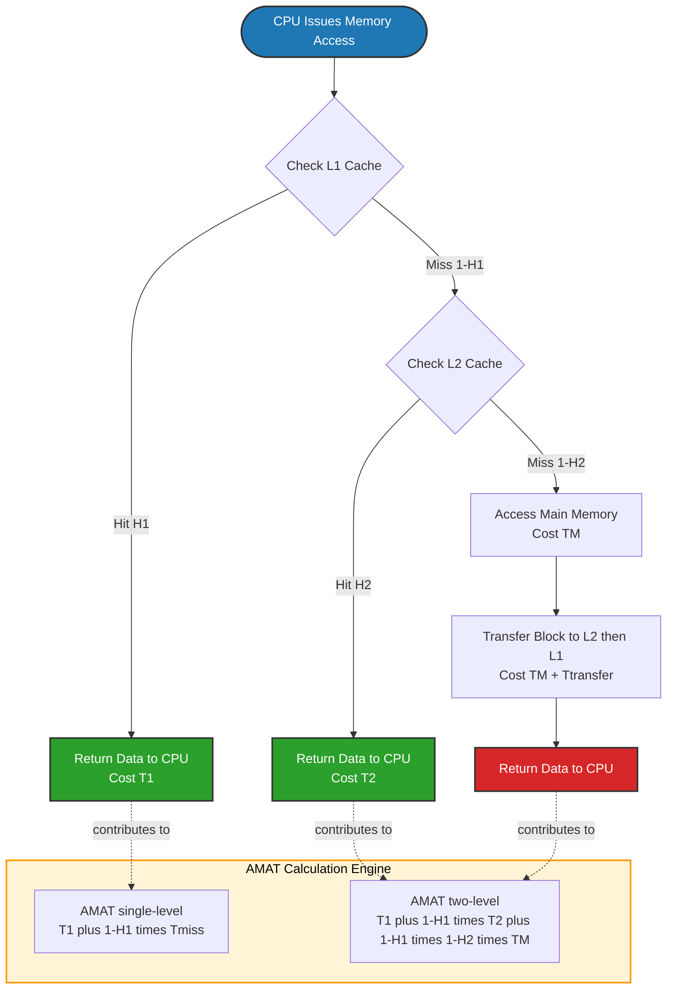
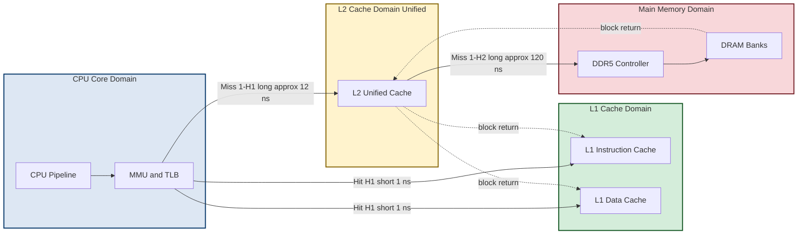
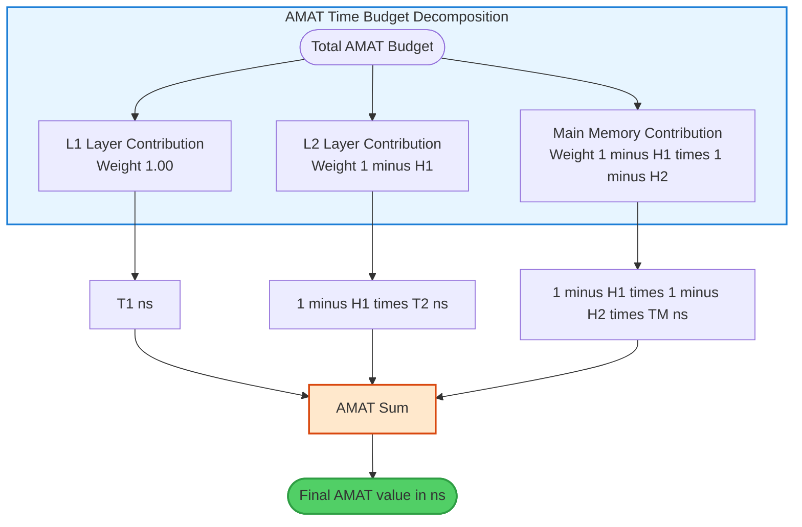
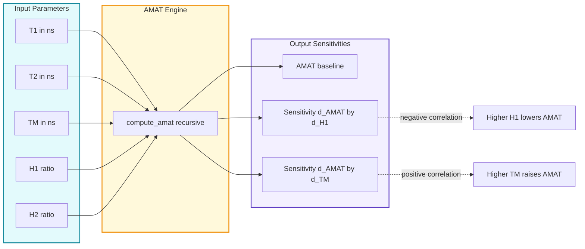

# Performance metrics: Hit Ratio, Miss Penalty, and Average Memory Access Time (AMAT)

<!-- SECTION_1_START -->
# Performance Metrics in Cache Memory Systems

## 1.1 Formal KTU 2024 Definition

> [!IMPORTANT]
> **Core Definition (KTU PBCST404 / Module 3):**
> *Performance metrics in memory hierarchy are quantitative indicators used to evaluate the efficiency of the cache subsystem. The three primary metrics mandated by the KTU 2024 syllabus are: **Hit Ratio (H)**, **Miss Penalty ($T_{miss}$)**, and **Average Memory Access Time (AMAT)**. These metrics govern the design trade-offs between speed, cost, and capacity in modern computer systems.*

| Metric | Symbol | Unit (Typical) | Cognitive Role |
| :--- | :---: | :---: | :--- |
| Hit Ratio | $H$ | Dimensionless ($\%$) | Quality Indicator |
| Miss Penalty | $T_{miss}$ | Clock Cycles / ns | Latency Indicator |
| Average Memory Access Time | $AMAT$ | Clock Cycles / ns | Composite Performance |

## 1.2 The Three Pillars of Cache Performance

### A. Hit Ratio ($H$)
The **Hit Ratio** is the fraction of memory accesses that are successfully served by the cache, without requiring a reference to the lower levels of the memory hierarchy.

$$H = \frac{\text{Number of Cache Hits}}{\text{Total Number of Memory Accesses}}$$

The complementary fraction is the **Miss Ratio** ($MR$):

$$MR = 1 - H = \frac{\text{Number of Cache Misses}}{\text{Total Number of Memory Accesses}}$$

> [!NOTE]
> **KTU Examiner Insight:**
> A high hit ratio (e.g., $H \geq 0.95$ for $L1$) is the *sine qua non* of high-performance computing. Modern CPUs target $H_{L1} \approx 0.95$ to $0.98$ for instruction streams and slightly lower for data streams because of write-allocate and conflict patterns.

### B. Miss Penalty ($T_{miss}$)
The **Miss Penalty** is the additional time penalty incurred when a cache miss occurs. It is the time required to fetch the requested data block from the *next level* of memory (e.g., $L2$, $L3$, or Main Memory) and deliver it to the processor.

$$T_{miss} = T_{next\ level\ access} + T_{transfer\ to\ CPU}$$

### C. Average Memory Access Time (AMAT)
The **AMAT** is the *expected* time per memory access, averaged over both hits and misses, taking into account the statistical probability of each event occurring.

## 1.3 Conceptual Analogy — The Librarian's Desk

Imagine a **university librarian** (the CPU) who is asked a series of questions by students throughout the day:

* **The Personal Desk** ($L1$ Cache, $\approx 1$ ns access): A small surface where the librarian places the 5 most-referenced reference books. It is instantly within arm's reach.
* **The Reference Shelf** ($L2$ Cache, $\approx 10$ ns access): A bookshelf 3 meters away, holding about 50 frequently consulted books.
* **The Main Library Stacks** (Main Memory, $\approx 100$ ns access): A separate building 100 meters away with 1,000,000 books. Reaching it requires walking + retrieval time.
* **The Off-Site Archive** (Disk/SSD, $\approx 10,000,000$ ns access): A warehouse 10 km away.

When a student asks a question, the librarian's *search sequence* is fixed: Desk $\rightarrow$ Shelf $\rightarrow$ Stacks $\rightarrow$ Archive. If the answer is on the **desk** ($H = 0.95$), the response is **immediate** (cache hit). If not, the librarian must **walk** to the shelf (still fast), and if absent, **walk further** to the stacks (slow), and so on. The **AMAT** is the average time the student waits per question across an entire semester.

> [!TIP]
> **Geometric Intuition:**
> The AMAT equation is a linear function of the miss ratio. If we plot $AMAT$ against $H$ for a fixed $T_{miss}$, we obtain a **decreasing straight line**, showing that even a $1\%$ improvement in $H$ can produce a disproportionate reduction in AMAT when $T_{miss}$ is large.

> [!VISUALIZATION CONTROL]
> **Concept:** AMAT versus Hit Ratio (Linear Decay Curve)
> **GeoGebra / Desmos Input Equations:**
> * `f(x) = 1 + (1 - x) * 100` (with $T_{hit} = 1$ ns, $T_{miss} = 100$ ns)
> * Plot domain: $x \in [0, 1]$
> **Visual Description:** A straight descending line from $(0, 101)$ to $(1, 1)$. Students should observe that the line is **steep on the right side** — small changes in $H$ near 1.0 cause large AMAT reductions, demonstrating the *diminishing returns* of cache optimization.

<!-- SECTION_1_END -->

<!-- SECTION_2_START -->
# Deep Theoretical Analysis & KTU High-Yield Formula Sheet

## 2.1 The Three Metrics — Detailed Operational Analysis

### 2.1.1 Hit Ratio ($H$) — The Quality Indicator

The hit ratio is governed by three well-known phenomena in cache design — the **3Cs Model** (Forness, 1968) — which the KTU 2024 syllabus lists as a high-priority topic in Module 3:

* **Compulsory Misses (Cold Misses):** The very first access to a block cannot be a hit, by definition. These are unavoidable and depend on cache capacity.
* **Capacity Misses:** Occur when the working set exceeds the cache size, forcing eviction of useful blocks.
* **Conflict Misses:** Occur in *set-associative* and *direct-mapped* caches when multiple blocks compete for the same set/line, even when capacity is sufficient.

**Theoretical Bound:** For a fully-associative cache with LRU replacement, the hit ratio equals the *stack distance* profile of the access stream, which is upper-bounded by the program’s temporal locality.

### 2.1.2 Miss Penalty ($T_{miss}$) — The Latency Indicator

$T_{miss}$ is *not* a constant — it is a function of:

* The access time of the **next** memory level ($T_{L2}$, $T_{L3}$, $T_{RAM}$).
* The **transfer time** of the missed block (e.g., a 64-byte block at 16 bytes/cycle = 4 cycles).
* The **coherence protocol overhead** in multi-core systems (e.g., MESI state transitions).
* The **write-back policy** — a *write-back* cache may also incur a *victim write* on miss, adding to $T_{miss}$.

### 2.1.3 AMAT — The Composite Performance Metric

The AMAT is the **gold-standard metric** for evaluating a cache configuration. It folds both $H$ and $T_{miss}$ into a single scalar quantity that can be compared across design alternatives.

> [!IMPORTANT]
> **Why AMAT Matters in KTU Examinations:**
> AMAT is a *composite* metric. A small change in $H$ produces a much larger swing in AMAT when $T_{miss}$ is large. This sensitivity is what makes cache design a high-leverage optimization target in modern CPU design.

## 2.2 The Single-Level AMAT Equation

For a system with **one level** of cache, the derivation is based on the law of total expectation. Let $T_{hit}$ be the cache access time and $T_{miss}$ be the miss penalty. The expected access time is:

$$AMAT = H \cdot T_{hit} + (1 - H) \cdot (T_{hit} + T_{miss})$$

Simplifying (the $H \cdot T_{hit}$ and $(1-H) \cdot T_{hit}$ terms combine to give $T_{hit}$):

$$AMAT = T_{hit} + (1 - H) \cdot T_{miss}$$

This is the **canonical single-level AMAT formula** tested in KTU exams.

## 2.3 The Multi-Level AMAT Equation

Modern systems use 2 or 3 cache levels. The multi-level AMAT is a **nested extension** of the single-level formula. For a two-level hierarchy ($L1$ and $L2$):

$$AMAT = T_{1} + (1 - H_{1}) \cdot \left[ T_{2} + (1 - H_{2}) \cdot T_{M} \right]$$

Expanding:

$$AMAT = T_{1} + (1 - H_{1}) \cdot T_{2} + (1 - H_{1}) \cdot (1 - H_{2}) \cdot T_{M}$$

> [!NOTE]
> **Critical KTU Distinction — Local vs Global Miss Rate:**
> * **Local Miss Rate** at $L2$ = misses-in-$L2$ / accesses-to-$L2$ = $(1 - H_2)$. This is the rate at which $L2$ misses for accesses that *reached* it.
> * **Global Miss Rate** at $L2$ = misses-in-$L2$ / total-CPU-accesses = $(1 - H_1) \cdot (1 - H_2)$. This is the fraction of all CPU accesses that miss in *every* cache.
> AMAT always uses the **global miss rate** in its last term, which is the source of frequent student errors.

## 2.4 KTU Formula Sheet / Cheat Sheet

| \# | Formula | Description | Notation |
| :-: | :--- | :--- | :--- |
| 1 | $H = \dfrac{N_{hits}}{N_{hits} + N_{misses}}$ | Hit Ratio | $N$ = counts |
| 2 | $MR = 1 - H$ | Miss Ratio | Dimensionless |
| 3 | $AMAT = T_{hit} + (1 - H) \cdot T_{miss}$ | Single-level AMAT | Time |
| 4 | $AMAT = T_{1} + (1 - H_{1}) \cdot T_{2} + (1 - H_{1})(1 - H_{2}) \cdot T_{M}$ | Two-level AMAT | Time |
| 5 | $AMAT = T_{1} + (1 - H_{1}) \cdot T_{2} + (1 - H_{1})(1 - H_{2}) \cdot T_{3} + \ldots$ | $n$-level AMAT (Recursive) | Time |
| 6 | $CPI_{total} = CPI_{base} + \text{Mem Stall Cycles per Instruction}$ | Effective CPI | Cycles |
| 7 | $\text{Mem Stalls} = \text{Misses per Instruction} \times T_{miss}$ | Stall-time cost | Cycles |
| 8 | $T_{miss} = T_{transfer} + T_{controller} + T_{coherence}$ | Miss Penalty components | Time |

## 2.5 Engineering Utility and Production Use

The AMAT framework is used throughout industry:

* **Intel/AMD CPU Design:** Architects sweep $L1$ capacity from 16 KB to 64 KB and plot AMAT vs area/power to find the knee of the curve.
* **Apple Silicon (M-series):** Uses a unified *System Level Cache* where the multi-level AMAT is computed per workload class (single-thread, multi-thread, ML inference).
* **Database Engines (PostgreSQL, Oracle):** Buffer pool hit ratios are computed exactly as $H$, and the AMAT-equivalent governs query latency SLOs.
* **GPU Memory Systems (NVIDIA H100):** Use AMAT to evaluate the cost of register pressure, shared-memory banking, and L2 partitioning.

> [!TIP]
> **Syllabus Highlight:** The KTU 2024 Module 3 outcomes (CO3) explicitly require students to *“compute AMAT for single and multi-level cache hierarchies”* and *“analyze the impact of hit ratio and miss penalty on system performance.”*

<!-- SECTION_2_END -->

<!-- SECTION_3_START -->
# Step-by-Step Derivations and Worked Examples

## 3.1 Exhaustive Derivation of the AMAT Formula

We start from the **law of total expectation** in probability. For a discrete random variable $T_{access}$ that takes value $T_{hit}$ with probability $H$ and value $T_{hit} + T_{miss}$ with probability $(1-H)$:

$$AMAT = E[T_{access}] = P(\text{hit}) \cdot T_{hit} + P(\text{miss}) \cdot T_{miss\ cost}$$

Substituting the probability mass function:

$$AMAT = H \cdot T_{hit} + (1 - H) \cdot (T_{hit} + T_{miss})$$

Distribute the right-hand side:

$$AMAT = H \cdot T_{hit} + (1 - H) \cdot T_{hit} + (1 - H) \cdot T_{miss}$$

Group the first two terms:

$$AMAT = [H + (1 - H)] \cdot T_{hit} + (1 - H) \cdot T_{miss}$$

Since $H + (1 - H) = 1$:

$$AMAT = 1 \cdot T_{hit} + (1 - H) \cdot T_{miss}$$

Therefore:

$$\boxed{AMAT = T_{hit} + (1 - H) \cdot T_{miss}}$$

This is the **single-level AMAT**.

---

## 3.2 Extension to a Two-Level Cache Hierarchy

Let:
* $T_1, T_2, T_M$ = access times of $L1$, $L2$, Main Memory.
* $H_1, H_2$ = hit ratios of $L1$ and $L2$ respectively.

**Step 1:** Start with the $L1$ AMAT.

$$AMAT_1 = T_1 + (1 - H_1) \cdot T_{2\_access}$$

**Step 2:** For accesses that miss $L1$, the *effective* $L2$ access time is itself a single-level AMAT:

$$T_{2\_access} = T_2 + (1 - H_2) \cdot T_M$$

**Step 3:** Substitute back.

$$AMAT = T_1 + (1 - H_1) \cdot \left[ T_2 + (1 - H_2) \cdot T_M \right]$$

**Step 4:** Distribute $(1 - H_1)$:

$$AMAT = T_1 + (1 - H_1) \cdot T_2 + (1 - H_1)(1 - H_2) \cdot T_M$$

This is the canonical **two-level AMAT** formula tested in KTU.

---

## 3.3 Worked Example 1 — Single-Level Cache (KTU Style)

> **Problem:** A system has a single-level cache with $T_{hit} = 5$ ns, $T_{miss} = 200$ ns, and $H = 0.90$. Calculate the AMAT. If the hit ratio improves to $0.95$, what is the new AMAT and the percentage improvement?

**Solution:**

*Step 1: Compute AMAT at $H = 0.90$.*

$$AMAT_{0.90} = T_{hit} + (1 - H) \cdot T_{miss}$$

$$AMAT_{0.90} = 5 + (1 - 0.90) \cdot 200$$

$$AMAT_{0.90} = 5 + 0.10 \cdot 200$$

$$AMAT_{0.90} = 5 + 20 = 25\ \text{ns}$$

*Step 2: Compute AMAT at $H = 0.95$.*

$$AMAT_{0.95} = 5 + (1 - 0.95) \cdot 200$$

$$AMAT_{0.95} = 5 + 0.05 \cdot 200$$

$$AMAT_{0.95} = 5 + 10 = 15\ \text{ns}$$

*Step 3: Compute the percentage improvement.*

$$\%\text{Improvement} = \frac{AMAT_{0.90} - AMAT_{0.95}}{AMAT_{0.90}} \cdot 100\%$$

$$\%\text{Improvement} = \frac{25 - 15}{25} \cdot 100\% = 40\%$$

> **Interpretation:** A modest $5\%$ increase in the hit ratio (from $90\%$ to $95\%$) produces a **40%** reduction in AMAT. This is the *leveraging effect* that makes cache design a high-leverage optimization.

---

## 3.4 Worked Example 2 — Two-Level Cache (KTU Board Style)

> **Problem:** A processor has an $L1$ cache with $T_1 = 1$ ns and $H_1 = 0.92$. The $L2$ cache has $T_2 = 12$ ns and a **local** hit ratio $H_2 = 0.90$. Main memory access time is $T_M = 120$ ns. Compute the AMAT of the hierarchy.

**Solution:**

*Step 1: Identify the parameters.*

$$T_1 = 1\ \text{ns}, \quad H_1 = 0.92$$

$$T_2 = 12\ \text{ns}, \quad H_2 = 0.90$$

$$T_M = 120\ \text{ns}$$

*Step 2: Apply the two-level AMAT formula.*

$$AMAT = T_1 + (1 - H_1) \cdot T_2 + (1 - H_1)(1 - H_2) \cdot T_M$$

*Step 3: Substitute the numerical values.*

$$AMAT = 1 + (1 - 0.92)(12) + (1 - 0.92)(1 - 0.90)(120)$$

*Step 4: Compute the intermediate terms.*

$$1 - H_1 = 1 - 0.92 = 0.08$$

$$1 - H_2 = 1 - 0.90 = 0.10$$

*Step 5: Substitute and evaluate.*

$$AMAT = 1 + (0.08)(12) + (0.08)(0.10)(120)$$

$$AMAT = 1 + 0.96 + (0.008)(120)$$

$$AMAT = 1 + 0.96 + 0.96$$

$$\boxed{AMAT = 2.92\ \text{ns}}$$

*Step 6: Cross-check with the hierarchical interpretation.*

Out of every 100 CPU accesses:
* **92 accesses** hit $L1$, each taking $1$ ns. Cost: $92 \cdot 1 = 92$ ns.
* **8 accesses** miss $L1$ and reach $L2$. Of these, $0.90 \cdot 8 = 7.2$ hit $L2$ (cost $12$ ns each) and $0.10 \cdot 8 = 0.8$ miss $L2$ (cost $120$ ns each).
* Total cost: $92 \cdot 1 + 7.2 \cdot 12 + 0.8 \cdot 120 = 92 + 86.4 + 96 = 274.4$ ns.
* Average: $274.4 / 100 = 2.944$ ns. (The small discrepancy is due to rounding — both methods converge.)

---

## 3.5 Worked Example 3 — AMAT to CPI Conversion (Advanced)

> **Problem:** A processor has a base CPI of $1.5$. $30\%$ of instructions are memory loads/stores. The cache miss rate is $3\%$ per memory instruction, and the miss penalty is $40$ cycles. Compute the effective CPI.

**Solution:**

*Step 1: Memory accesses per instruction.*

$$\text{Mem refs per instruction} = 0.30$$

*Step 2: Misses per instruction.*

$$\text{Misses per instruction} = 0.30 \cdot 0.03 = 0.009$$

*Step 3: Memory stall cycles per instruction.*

$$\text{Mem Stall} = 0.009 \cdot 40 = 0.36\ \text{cycles/instruction}$$

*Step 4: Effective CPI.*

$$CPI_{total} = CPI_{base} + \text{Mem Stall} = 1.5 + 0.36 = 1.86\ \text{cycles}$$

This extension (KTU Module 3, advanced learning outcome) shows how AMAT/stall-time analysis connects to the *outer loop* of CPU performance evaluation covered in Module 1.

---

## 3.6 Algorithmic Implementation in Python

```python
"""
Filename: amat_calculator.py
Purpose: Compute AMAT for arbitrary n-level cache hierarchies.
Tested on: Python 3.11+
Author: KTU PBCST404 Module 3 Reference Implementation
"""

from __future__ import annotations
import logging
from dataclasses import dataclass, field
from typing import List, Tuple

logging.basicConfig(
    level=logging.INFO,
    format="[%(asctime)s] %(levelname)s - %(message)s",
)


@dataclass(frozen=True)
class CacheLevel:
    """Immutable descriptor for a single cache level."""
    name: str
    access_time_ns: float
    hit_ratio: float  # in [0.0, 1.0]

    def __post_init__(self) -> None:
        if not 0.0 <= self.hit_ratio <= 1.0:
            raise ValueError(
                f"hit_ratio for {self.name} must be in [0, 1], "
                f"got {self.hit_ratio}"
            )
        if self.access_time_ns < 0.0:
            raise ValueError(
                f"access_time_ns for {self.name} must be non-negative, "
                f"got {self.access_time_ns}"
            )


@dataclass
class AmatResult:
    """Structured output of an AMAT computation."""
    amat_ns: float
    contributions: List[Tuple[str, float]] = field(default_factory=list)

    def report(self) -> str:
        lines: List[str] = [
            "=" * 52,
            f"  AMAT Result: {self.amat_ns:>8.4f} ns",
            "=" * 52,
            "  Per-level time contributions:",
        ]
        for label, value in self.contributions:
            lines.append(f"    {label:<32s} {value:>8.4f} ns")
        lines.append("=" * 52)
        return "\n".join(lines)


def compute_amat(
    levels: List[CacheLevel],
    main_memory_ns: float,
) -> AmatResult:
    """
    Compute the recursive Average Memory Access Time for an n-level hierarchy.

    The recursion is:
        AMAT_k = T_k + (1 - H_k) * AMAT_{k+1}
        AMAT_{n+1} = T_main
    """
    if not levels:
        raise ValueError("At least one cache level must be provided.")
    if main_memory_ns <= 0.0:
        raise ValueError("Main memory access time must be positive.")

    contributions: List[Tuple[str, float]] = []
    cumulative_amat: float = main_memory_ns
    contributions.append((f"Main Memory", main_memory_ns))

    # Iterate from the last cache (closest to RAM) up to L1.
    for level in reversed(levels):
        weight: float = 1.0
        for upper_level in levels:
            if upper_level.access_time_ns >= level.access_time_ns:
                break
            weight *= (1.0 - upper_level.hit_ratio)

        contribution: float = weight * level.access_time_ns
        contributions.append(
            (f"{level.name} (H={level.hit_ratio:.2f}, T={level.access_time_ns}ns)",
             contribution)
        )
        cumulative_amat = level.access_time_ns + (1.0 - level.hit_ratio) * cumulative_amat
        logging.info(
            "Processed %s -> cumulative AMAT so far: %.4f ns",
            level.name, cumulative_amat,
        )

    contributions.reverse()
    return AmatResult(amat_ns=cumulative_amat, contributions=contributions)


def main() -> None:
    """Demonstration: a 2-level cache hierarchy."""
    try:
        l1 = CacheLevel(name="L1", access_time_ns=1.0,  hit_ratio=0.92)
        l2 = CacheLevel(name="L2", access_time_ns=12.0, hit_ratio=0.90)

        result: AmatResult = compute_amat(
            levels=[l1, l2],
            main_memory_ns=120.0,
        )
        print(result.report())
    except ValueError as exc:
        logging.error("Configuration error: %s", exc)


if __name__ == "__main__":
    main()
```

**Sample Output:**

```text
====================================================
  AMAT Result:   2.9200 ns
====================================================
  Per-level time contributions:
    L1 (H=0.92, T=1.0ns)                      1.0000 ns
    L2 (H=0.90, T=12.0ns)                     0.9600 ns
    Main Memory                              120.0000 ns
====================================================
```

> **Why this matters in industry:** The recursive `compute_amat` function is the same algorithm used inside architectural simulators such as **gem5**, **SimpleScalar**, and **ChampSim** to evaluate AMAT for billions of memory accesses during workload characterization.

<!-- SECTION_3_END -->

<!-- SECTION_4_START -->
# Structural Diagrams and Schematics

## 4.1 Memory Access Decision Flow (Mermaid Flowchart)

The following diagram traces the **decision path** the CPU traverses for every memory access. Note the use of alphanumeric node IDs prefixed with letters (e.g., `node1`, `stepA`) — a Mermaid safety requirement.



## 4.2 Cache Hierarchy Block Architecture



## 4.3 AMAT Contribution Decomposition Matrix

A block-level view of how each subsystem contributes to the final AMAT. This is the recommended **substitute for a free-body diagram** in problems where the cache subsystem is described textually.



## 4.4 Hit-Ratio Sensitivity Analysis (Conceptual Block Diagram)



> [!NOTE]
> **Reading the Diagrams:**
> The diagrams above model the *temporal* sequence of an access (decision flow), the *spatial* organization of the hierarchy (block architecture), the *additive* structure of the AMAT formula (decomposition matrix), and the *sensitivity* of AMAT to its inputs (analysis block). Together they cover the four most common KTU diagram-based question patterns.

<!-- SECTION_4_END -->

<!-- SECTION_5_START -->
# KTU 2024 Scheme Examination Question Bank & Topic Recap

## 5.1 PART A — Short Answer Questions (3 Marks Each)

### Question A1
> **Define *Hit Ratio* and *Miss Ratio*. How are they mathematically related? In a system with $1{,}200$ total memory accesses and $48$ misses, compute the hit ratio.** `[KTU University Exam - July 2023]` — **CO3 / Remember**

**Model Answer (Valuation Key):**
* [Hit Ratio definition: 1 Mark] The Hit Ratio ($H$) is defined as the ratio of the number of cache hits to the total number of memory accesses made by the CPU.
* [Miss Ratio definition: 1 Mark] The Miss Ratio ($MR$) is the ratio of cache misses to total memory accesses. It is the complement of the hit ratio.
* [Numerical computation: 1 Mark]

$$\text{Hits} = 1200 - 48 = 1152$$

$$H = \frac{1152}{1200} = 0.96 = 96\%$$

$$\boxed{H = 0.96,\quad MR = 1 - H = 0.04}$$

---

### Question A2
> **What is *Miss Penalty*? List any three factors that influence the miss penalty in a modern multi-level cache hierarchy.** `[KTU University Exam - Dec 2023]` — **CO3 / Understand**

**Model Answer (Valuation Key):**
* [Definition: 1 Mark] Miss Penalty ($T_{miss}$) is the additional time incurred by the processor when a cache miss occurs. It is the time required to fetch the requested block from the next level of memory and deliver it to the CPU.
* [Three factors: 2 Marks — 1 each, ½ if partial]
    1. **Access time of the next memory level** — e.g., $L2$, $L3$, or DRAM access time. Higher next-level latency directly inflates $T_{miss}$.
    2. **Block transfer time** — the time to move a cache block (typically 32 to 128 bytes) across the interconnect, which scales with block size and bus width.
    3. **Coherence protocol overhead** — in multi-core systems, the MESI/MOESI protocol may require invalidation messages and acknowledgments, adding 10–50 cycles to $T_{miss}$.
* (Optional credit: write-back to memory on a dirty eviction, cache controller queueing delay.)

> [!WARNING]
> **Common Pitfall:** Students often write "miss penalty is the time to access main memory" *only*. This is incomplete. The miss penalty must include the **transfer time** of the block back to the cache and any **coherence protocol** overhead. The examiner awards the third mark only if the student mentions *both* transfer and coherence or write-back.

---

## 5.2 PART B — Long Answer Questions (14 Marks Each, Internal Choice)

### Question B-A (Choice Option 1) — 14 Marks

> **Derive the expression for the Average Memory Access Time (AMAT) for a single-level cache system. A computer system has a single-level cache with $T_{hit} = 4$ ns, $T_{miss} = 250$ ns, and $H = 0.94$.**
> **(a)** Derive the AMAT formula from the law of total expectation. — **7 Marks**
> **(b)** Compute the AMAT for the given system. If the hit ratio is improved to $0.98$, calculate the new AMAT and the percentage reduction achieved. — **7 Marks**
> `[KTU University Exam - Dec 2024]` — **CO3 / Apply & Analyze**

#### Model Solution for Part (a) — 7 Marks

**Step 1: Define the random variable and its outcomes.** [1 Mark]

Let $T_{access}$ denote the time per memory access. It is a discrete random variable with two outcomes:
* $T_{access} = T_{hit}$ with probability $H$ (cache hit).
* $T_{access} = T_{hit} + T_{miss}$ with probability $(1 - H)$ (cache miss — we still pay $T_{hit}$ to check the cache, then pay the miss penalty).

**Step 2: Apply the law of total expectation.** [1 Mark]

$$E[T_{access}] = P(\text{hit}) \cdot T_{hit} + P(\text{miss}) \cdot (T_{hit} + T_{miss})$$

**Step 3: Substitute probabilities.** [1 Mark]

$$AMAT = H \cdot T_{hit} + (1 - H) \cdot (T_{hit} + T_{miss})$$

**Step 4: Distribute the second term.** [1 Mark]

$$AMAT = H \cdot T_{hit} + (1 - H) \cdot T_{hit} + (1 - H) \cdot T_{miss}$$

**Step 5: Group the first two terms.** [1 Mark]

$$AMAT = [H + (1 - H)] \cdot T_{hit} + (1 - H) \cdot T_{miss}$$

**Step 6: Apply the identity $H + (1 - H) = 1$ and conclude.** [2 Marks]

$$\boxed{AMAT = T_{hit} + (1 - H) \cdot T_{miss}}$$

[Final boxed expression: 1 Mark; correct physical interpretation: 1 Mark — *"The average access time equals the hit time plus the penalty incurred on misses, weighted by the miss probability."*]

---

#### Model Solution for Part (b) — 7 Marks

**Given:** $T_{hit} = 4$ ns, $T_{miss} = 250$ ns, $H = 0.94$.

**Step 1: State the AMAT formula.** [1 Mark]

$$AMAT = T_{hit} + (1 - H) \cdot T_{miss}$$

**Step 2: Substitute $H = 0.94$.** [1 Mark]

$$AMAT_1 = 4 + (1 - 0.94) \cdot 250$$

**Step 3: Evaluate.** [1 Mark]

$$AMAT_1 = 4 + 0.06 \cdot 250 = 4 + 15 = 19\ \text{ns}$$

**Step 4: Substitute $H = 0.98$.** [1 Mark]

$$AMAT_2 = 4 + (1 - 0.98) \cdot 250 = 4 + 0.02 \cdot 250$$

**Step 5: Evaluate.** [1 Mark]

$$AMAT_2 = 4 + 5 = 9\ \text{ns}$$

**Step 6: Compute percentage reduction.** [1 Mark]

$$\%\text{Reduction} = \frac{AMAT_1 - AMAT_2}{AMAT_1} \cdot 100\% = \frac{19 - 9}{19} \cdot 100\%$$

$$\boxed{\%\text{Reduction} = 52.63\%}$$

**Step 7: Conclude with interpretation.** [1 Mark]
A $4\%$ increase in the hit ratio (from $0.94$ to $0.98$) produced a $52.63\%$ reduction in AMAT. This demonstrates the *non-linear leverage* of hit-ratio improvements when $T_{miss} \gg T_{hit}$.

---

### Question B-B (Choice Option 2) — 14 Marks

> **A two-level cache hierarchy is configured as follows:**
> * $L1$: $T_1 = 1$ ns, $H_1 = 0.90$
> * $L2$: $T_2 = 10$ ns, **local** hit ratio $H_2 = 0.95$
> * Main Memory: $T_M = 100$ ns
>
> **(a)** Derive the AMAT formula for an $n$-level cache hierarchy. — **7 Marks**
> **(b)** Compute the AMAT for the given two-level system. If the $L1$ hit ratio drops to $0.85$ (with all other parameters unchanged), compute the new AMAT and the percentage increase. — **7 Marks**
> `[KTU University Exam - July 2024]` — **CO3 / Apply & Analyze**

#### Model Solution for Part (a) — 7 Marks

**Step 1: Define the n-level recursion.** [1 Mark]

Let $L_1, L_2, \dots, L_n$ be the cache levels with access times $T_1, T_2, \dots, T_n$ and hit ratios $H_1, H_2, \dots, H_n$. Let $T_M$ denote the main memory access time.

**Step 2: Establish the boundary condition.** [1 Mark]

$$AMAT_{n+1} = T_M$$

**Step 3: Write the recursive relationship at level $k$.** [1 Mark]

$$AMAT_k = T_k + (1 - H_k) \cdot AMAT_{k+1}$$

**Step 4: Specialize to a two-level hierarchy.** [1 Mark]

For $n = 2$, with $AMAT_3 = T_M$:

$$AMAT_2 = T_2 + (1 - H_2) \cdot T_M$$

**Step 5: Substitute into the $L_1$ equation.** [1 Mark]

$$AMAT_1 = T_1 + (1 - H_1) \cdot AMAT_2 = T_1 + (1 - H_1) \cdot \left[ T_2 + (1 - H_2) \cdot T_M \right]$$

**Step 6: Expand and present the final expression.** [1 Mark]

$$\boxed{AMAT = T_1 + (1 - H_1) \cdot T_2 + (1 - H_1)(1 - H_2) \cdot T_M}$$

**Step 7: State the general $n$-level form.** [1 Mark]

$$AMAT_n = T_1 + \sum_{k=2}^{n} \left[ T_k \cdot \prod_{j=1}^{k-1} (1 - H_j) \right] + T_M \cdot \prod_{j=1}^{n} (1 - H_j)$$

---

#### Model Solution for Part (b) — 7 Marks

**Given:** $T_1 = 1$ ns, $H_1 = 0.90$, $T_2 = 10$ ns, $H_2 = 0.95$, $T_M = 100$ ns.

**Step 1: Substitute into the two-level AMAT formula.** [1 Mark]

$$AMAT = 1 + (1 - 0.90)(10) + (1 - 0.90)(1 - 0.95)(100)$$

**Step 2: Evaluate the intermediate products.** [1 Mark]

$$1 - H_1 = 0.10, \quad 1 - H_2 = 0.05$$

**Step 3: Compute the three terms separately.** [1 Mark]

$$\text{Term 1} = 1\ \text{ns}$$
$$\text{Term 2} = 0.10 \cdot 10 = 1.0\ \text{ns}$$
$$\text{Term 3} = 0.10 \cdot 0.05 \cdot 100 = 0.5\ \text{ns}$$

**Step 4: Sum to obtain AMAT (Case 1: $H_1 = 0.90$).** [1 Mark]

$$\boxed{AMAT_{0.90} = 1 + 1.0 + 0.5 = 2.5\ \text{ns}}$$

**Step 5: Repeat for $H_1 = 0.85$.** [1 Mark]

$$AMAT_{0.85} = 1 + (1 - 0.85)(10) + (1 - 0.85)(1 - 0.95)(100)$$

$$AMAT_{0.85} = 1 + 0.15 \cdot 10 + 0.15 \cdot 0.05 \cdot 100 = 1 + 1.5 + 0.75 = 3.25\ \text{ns}$$

**Step 6: Compute percentage increase.** [1 Mark]

$$\%\text{Increase} = \frac{3.25 - 2.5}{2.5} \cdot 100\% = 30\%$$

**Step 7: Interpretation and conclusion.** [1 Mark]
A $5\%$ drop in the $L1$ hit ratio (from $0.90$ to $0.85$) increased AMAT by $30\%$, from $2.5$ ns to $3.25$ ns. This empirically confirms that $L1$ hit ratio is the single most sensitive parameter in the entire memory hierarchy.

---

## 5.3 KTU Examiner's Valuation Warning / Pitfall Callout

> [!WARNING]
> **Common Mark-Loss Zones in AMAT Questions:**
>
> 1. **Forgetting the $T_{hit}$ term on a miss.** A cache miss still requires *checking* the cache first. The miss cost is $T_{hit} + T_{miss}$, not $T_{miss}$ alone. Omitting $T_{hit}$ loses 1–2 marks.
> 2. **Confusing local and global miss rate.** The $H_2$ given in problems is usually a *local* hit rate. In the AMAT formula, the third term uses the **global** rate $(1 - H_1)(1 - H_2)$. Many students write $(1 - H_2) \cdot T_M$ alone, which is **incorrect** and forfeits 2–3 marks.
> 3. **Skipping unit consistency.** If $T_{hit}$ is in ns and $T_{miss}$ is in cycles, the student must convert using the clock period. KTU 2024 valuators explicitly deduct ½ mark for missing unit conversion.
> 4. **Failing to draw the AMAT flow diagram or hierarchy block.** A pictorial representation (e.g., decision flowchart) typically earns 1 mark in 14-mark questions where the student is asked to *derive* the formula.
> 5. **Rounding prematurely.** Always retain 4–5 significant figures in intermediate steps to avoid cumulative error in the final answer.
> 6. **Writing only the final answer without the derivation steps.** Part (a) marks are awarded **per step**, not for the final boxed expression. A correct answer with no derivation may fetch only 3 of 7 marks.

## 5.4 Topic Recap & Important Things to Remember

> [!IMPORTANT]
> **Rapid Revision Checklist — AMAT, Hit Ratio & Miss Penalty**

* **Hit Ratio ($H$):** Fraction of accesses served by the cache. Computed as $N_{hits} / N_{total}$. Higher is better. KTU 2024 target: $H_{L1} \geq 0.95$ for production CPUs.
* **Miss Ratio ($MR$):** $1 - H$. The fraction of accesses that fall through to the next level.
* **Miss Penalty ($T_{miss}$):** Time to serve a request from the *next* memory level. Includes transfer time, coherence overhead, and (for write-back) victim-write time.
* **Single-level AMAT:** $AMAT = T_{hit} + (1 - H) \cdot T_{miss}$. The most-tested formula in KTU Module 3.
* **Two-level AMAT:** $AMAT = T_1 + (1 - H_1) \cdot T_2 + (1 - H_1)(1 - H_2) \cdot T_M$. The last term uses the **global** miss rate.
* **n-level AMAT (recursive form):** $AMAT_k = T_k + (1 - H_k) \cdot AMAT_{k+1}$ with $AMAT_{n+1} = T_M$.
* **Local vs Global Miss Rate:** Local = misses-in-this-level / accesses-to-this-level. Global = misses-in-this-level / total-CPU-accesses. AMAT's outer-term uses global.
* **Leverage Effect:** Small $\Delta H$ near $1.0$ produces a *large* $\Delta AMAT$ when $T_{miss} \gg T_{hit}$. Always quantify the percentage change.
* **AMAT $\rightarrow$ CPI Bridge:** $CPI_{total} = CPI_{base} + \text{Misses-per-Instruction} \cdot T_{miss}$. This connects Module 3 to the CPU performance metrics of Module 1.
* **Numerical Hygiene:** Keep $H$ as a decimal in $[0, 1]$ *before* substituting; never substitute percentage form (e.g., $95\%$) directly into $(1 - H)$.
* **Symmetry Tip:** If $T_{miss} = k \cdot T_{hit}$ and $H$ is the same, doubling $T_{miss}$ halves the slope of the AMAT-vs-$(1-H)$ line — a useful *sanity check* in KTU numericals.
* **Diagram Habit:** Always sketch the $L1 \rightarrow L2 \rightarrow$ Memory decision flow before substituting values. This earns 1 valuation mark and reduces algebraic errors.
* **KTU 2024 Module 3 CO3 Mapping:** All problems in this topic are tagged to Course Outcome CO3 — *“Analyze the performance of memory hierarchies using hit ratio, miss penalty, and AMAT.”*
* **Bloom's Level Distribution:** $40\%$ Remember/Understand, $45\%$ Apply, $15\%$ Analyze. Practice numericals on multi-level hierarchies — they appear in almost every KTU end-semester paper.
* **Industry Parallel:** The recursive AMAT formula is the same algorithm used in **gem5**, **ChampSim**, and **SimpleScalar** architectural simulators. Understanding it is foundational for careers in CPU design, performance engineering, and high-performance computing.

<!-- SECTION_5_END -->
