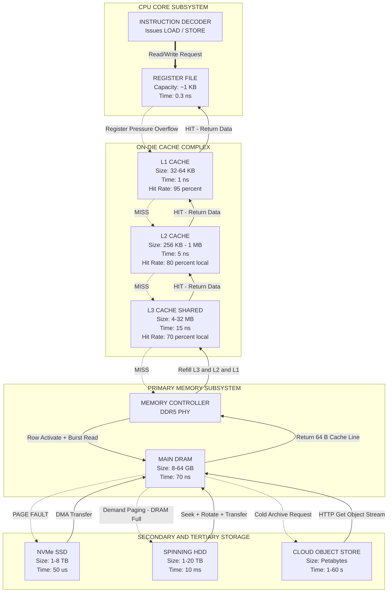
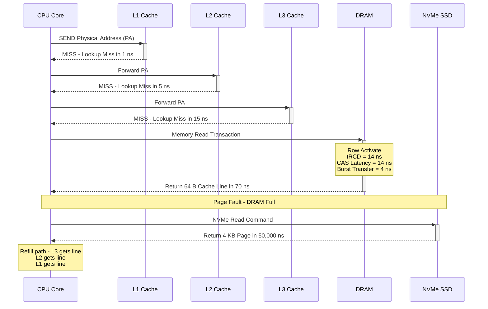
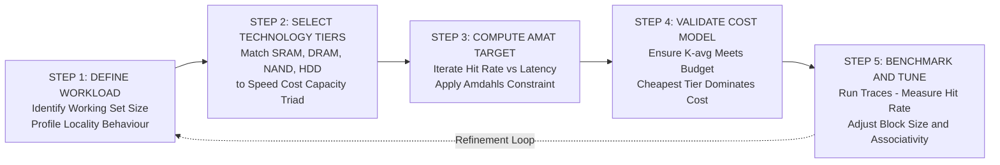

# The Memory Hierarchy: Speed, Size, and Cost trade-offs across storage layers

<!-- SECTION_1_START -->
# The Memory Hierarchy: Speed, Size, and Cost Trade-offs

## 1.1 Formal KTU 2024 Definition

> [!IMPORTANT]
> **Memory Hierarchy** is a computer storage organization technique that arranges storage devices in a hierarchical pyramid based on their **access time**, **storage capacity**, **cost per bit**, and **proximity to the CPU**. The fundamental principle states that *faster memory is more expensive per byte and smaller in capacity*, while *slower memory is cheaper per byte and larger in capacity*. A well-designed hierarchy exploits **locality of reference** (temporal and spatial) to present the user with a memory system that behaves *as if it is nearly as fast as the topmost (fastest) layer* and *as large and cheap as the bottommost (slowest) layer*.

The KTU 2024 syllabus frames this as the **Principle of Equivalence of Memory and CPU Speed**, formalized by **Amdahl's Law** applied to memory subsystems. The hierarchy, from top (fastest/closest to CPU) to bottom (slowest/farthest from CPU), typically consists of:

1. **CPU Registers** ($t_{access} \approx 1$ CPU cycle, $\sim$ bytes to kilobytes)
2. **Level 1 Cache (L1)** — Internal to CPU core
3. **Level 2 Cache (L2)** — On-chip or very close
4. **Level 3 Cache (L3)** — Shared across cores
5. **Main Memory (Primary / RAM)** — DRAM
6. **Solid State Drive (SSD)** — NAND flash
7. **Hard Disk Drive (HDD)** — Magnetic storage
8. **Tertiary / Archival / Cloud** — Magnetic tapes, optical, distributed storage

## 1.2 Conceptual Analogy & Intuition

> [!NOTE]
> **The Office Desk Analogy:** Imagine you are a busy executive working at a desk. You have three storage zones:
> - **Your active hand drawer** (Registers) — Holds only the *exact pen and paper you are writing on right now*. Instant access, but fits almost nothing.
> - **The shelf beside you** (Cache) — Holds recently used files. Reaches in 2–3 seconds, moderate capacity.
> - **The filing cabinet in your room** (RAM) — Holds all files for today's projects. Reaching it takes 30 seconds, but it fits a lot.
> - **The warehouse in another building** (HDD/SSD) — Holds years of archives. Calling someone to fetch a file takes 10 minutes, but the capacity is enormous.
>
> **The trick:** The executive doesn't walk to the warehouse for *every* file — most of the time, the *hand drawer and shelf* satisfy the request. This is exactly what the **memory hierarchy** does for the CPU: it keeps *hot data* (frequently accessed) close to the processor, while *cold data* (rarely accessed) is parked far away in cheaper bulk storage.

**Geometric Intuition:** Picture an *inverted triangle* (pyramid). The apex is a tiny dot (registers), the base is a wide slab (cloud storage). The width represents **capacity + cost-efficiency per bit**; the height represents **speed**. The CPU is "fed" from the apex, but data flows upward from the base on demand and is cached at higher levels for reuse.

## 1.3 Key Trade-off Metrics (with Standard Constants)

> [!IMPORTANT]
> The three cardinal trade-offs that govern *every* level of the hierarchy are:
> - **Access Time ($t_a$)** — measured in **nanoseconds (ns)** or **CPU cycles**
> - **Capacity ($C$)** — measured in **bytes, KB, MB, GB, TB**
> - **Cost per Bit ($K$)** — measured in **USD per bit** or **USD per GB**
>
> Empirical rules of thumb (modern systems, 2024–2025 generation):
> - $t_a^{Registers} \approx 0.3\text{ ns}$, $C \approx 1\text{ KB}$ total, cost $\approx \$0$ (on-die)
> - $t_a^{L1} \approx 1\text{ ns}$, $C \approx 32\text{–}64\text{ KB per core}$, cost $\approx \$0$
> - $t_a^{L2} \approx 3\text{–}10\text{ ns}$, $C \approx 256\text{ KB – 1 MB per core}$
> - $t_a^{L3} \approx 10\text{–}20\text{ ns}$, $C \approx 4\text{–}32\text{ MB shared}$
> - $t_a^{DRAM} \approx 50\text{–}100\text{ ns}$, $C \approx 8\text{–}64\text{ GB}$
> - $t_a^{SSD} \approx 25\text{–}100\text{ \mu s}$, $C \approx 256\text{ GB – 8 TB}$, cost $\approx \$0.05/\text{GB}$
> - $t_a^{HDD} \approx 5\text{–}15\text{ ms}$, $C \approx 1\text{–}20 TB}$, cost $\approx \$0.02/\text{GB}$
> - $t_a^{Tape/Cloud} \approx 1\text{–}60\text{ s}$, $C \approx$ Petabytes, cost $\approx \$0.001/\text{GB/month}$

> [!VISUALIZATION CONTROL]
> **Concept:** Memory Hierarchy Pyramid — Trade-off Visualization (Capacity vs. Access Time on a Log-Scale Axis)
> **GeoGebra / Desmos Input Equations:**
> * Plot points: `L1 = (0.1, 32)` *(log ns, KB)*, `L2 = (1, 512)`, `L3 = (10, 8192)`, `RAM = (70, 16777216)` *(16 GB)*, `SSD = (50000, 1.0E9)` *(1 TB)*, `HDD = (10000000, 1.0E10)` *(10 TB)*
> * `y(x) = 10^(7 - x/2)` — capacity curve
> * `t(x) = 0.5 * 2^x` — time curve
> **Visual Description:** The student should observe an **inverted exponential relationship** — as access time grows linearly on the log axis, capacity grows explosively. The intersection of the two curves defines the **"knee" of the pyramid**, beyond which bulk storage becomes economically viable.

---

<!-- SECTION_1_END -->

<!-- SECTION_2_START -->
# Deep Theoretical Analysis & KTU High-Yield Formula Sheet

## 2.1 The Five Pillars of Memory Hierarchy Design

A memory hierarchy is engineered to satisfy **four simultaneous constraints**. Each layer in the hierarchy is optimized against these pillars:

### Pillar 1 — Access Time ($t_a$)
The wall-clock time between issuing a memory request and receiving the data word. Access time **decreases** as we move *up* the hierarchy. The access-time ratio between consecutive levels is typically $4:1$ to $10:1$ in well-balanced systems. This ratio is called the **Access Time Gap** and it is the *most critical* design parameter — if the gap is too large, the lower level cannot refill the upper level fast enough (the **memory wall** problem).

### Pillar 2 — Capacity ($C$)
The total number of bits a level can hold. Capacity **increases** as we move *down* the hierarchy. The ratio $C_{i+1} / C_i$ is typically $4:1$ to $64:1$ per level, ensuring that the *entire* upper level can be buffered into the next level down.

### Pillar 3 — Cost per Bit ($K$)
The manufacturing cost to store one bit. Cost **decreases** as we move *down* the hierarchy. A *balanced* hierarchy is designed such that the **Total System Cost** is dominated by the cheapest level:

$$\text{Total System Cost} = \sum_{i=1}^{n} K_i \cdot C_i$$

For economic viability, $K_{i+1} < K_i / 10$ at every step.

### Pillar 4 — Bandwidth / Transfer Rate ($BW$)
The number of bytes that can be moved per second between adjacent levels. Bandwidth must be **high enough** to prevent the *faster* level from starving while waiting for the *slower* level. Governed by:

$$BW = \frac{W}{t_{cycle}}$$

where $W$ = bus width (bytes/transfer) and $t_{cycle}$ = clock period of the interconnect.

## 2.2 The Locality Principle — *Why* the Hierarchy Works

The hierarchy would be *useless* without two statistical properties of real programs:

> [!NOTE]
> **Temporal Locality (Time Locality):** If a memory location is referenced *now*, it is highly likely to be referenced *again soon*. Example: a loop counter, a stack pointer, a sum accumulator.
>
> **Spatial Locality:** If a memory location is referenced *now*, locations *adjacent* to it are highly likely to be referenced *soon*. Example: traversing an array, sequential instruction fetch, strided access in a matrix loop.

Quantitatively, empirical studies (e.g., Denning's working set theory, 1968) show that at any instant, a typical program references only a **small working set** $W(t, \Delta)$ of $\sim$ 1–10 MB out of the entire program footprint. The hierarchy exploits this by ensuring the *working set fits in the upper levels* (cache + RAM), so the *average* access time is dominated by fast hits.

## 2.3 The KTU Formula Sheet

> [!IMPORTANT]
> The following equations are the **non-negotiable toolkit** for any KTU Memory Hierarchy problem.

| **#** | **Quantity** | **Formula** | **Description / Units** |
|---|---|---|---|
| 1 | Hit Rate | $H = \dfrac{N_{hits}}{N_{hits} + N_{misses}}$ | Fraction of accesses found in level $i$ (dimensionless) |
| 2 | Miss Rate | $M = 1 - H$ | Fraction of accesses NOT found in level $i$ |
| 3 | Average Memory Access Time (2-level) | $T_{avg} = H \cdot t_{hit} + (1 - H) \cdot t_{miss}$ | $t_{miss}$ includes access to next level |
| 4 | AMAT (3-level: Cache + RAM + Disk) | $T_{avg} = t_{L1} + M_1 \cdot \left[ t_{L2} + M_2 \cdot t_{RAM} + M_2 \cdot M_3 \cdot t_{HDD} \right]$ | Sequential cumulative miss penalty |
| 5 | Effective Access Time with hierarchical penalty | $T_{avg} = \sum_{i=1}^{n} \left( \prod_{j=1}^{i-1} M_j \right) \cdot H_i \cdot t_i$ | Generalized form for $n$ levels |
| 6 | Miss Penalty | $t_{mp} = t_{next\ level} + t_{transfer}$ | Time to fetch a block from next level |
| 7 | Bandwidth | $BW = \dfrac{W}{t_{cycle}}$ | Bytes per second, $W$ = bus width |
| 8 | Total Hierarchy Cost | $C_{total} = \sum K_i \cdot S_i$ | $S_i$ = size of level $i$ in bits |
| 9 | Cost per Bit (average) | $K_{avg} = \dfrac{C_{total}}{\sum S_i}$ | Useful for hierarchy benchmarking |
| 10 | Access Time Ratio | $R = \dfrac{t_{i+1}}{t_i}$ | Should be $\geq 4$ for balanced design |
| 11 | Capacity Ratio | $Q = \dfrac{C_{i+1}}{C_i}$ | Typically $4$ to $64$ |
| 12 | Hit Time | $t_{hit}$ | Time to deliver data when found in level |
| 13 | Amdahl's Memory Speedup | $S = \dfrac{1}{(1 - f) + f / k}$ | $f$ = fraction of accesses improved, $k$ = speedup factor |

## 2.4 Real-World Engineering Utility

The memory hierarchy is the **silent workhorse** of every computing device produced today:

- **Smartphones (ARM SoCs):** Use a *three-level cache hierarchy* (L1, L2, L3) with **system-level cache** (SLC) shared with the GPU and NPU. Apple's M-series chips extend this to **unified memory architecture** where CPU and GPU share the same DRAM pool.
- **Datacenters (Hyperscale Cloud):** AWS, Azure, and GCP expose a *five-tier hierarchy* to workloads: **L1/L2 cache → DRAM → local NVMe SSD → network-attached storage (NAS) → object store (S3)**. Each tier has different SLA guarantees.
- **Database Engines (PostgreSQL, Oracle):** Implement a *software-level* memory hierarchy using `shared_buffers` (RAM), OS page cache (RAM), and tablespace files (SSD/HDD) to optimize query latency.
- **AI/ML Training:** GPUs like NVIDIA H100 use **HBM3 (High Bandwidth Memory)** as an in-package DRAM tier that sits *between* on-chip SRAM caches and host CPU memory, achieving $\sim$ 3 TB/s bandwidth.
- **Embedded/IoT:** Tiny Cortex-M0 microcontrollers have a *flat memory model* (no cache) with only registers → Flash → optional external EEPROM, illustrating what happens **without** a hierarchy: deterministic but slow.

**Production insight:** The cost of *one* L1 cache miss that goes all the way to DRAM and back is roughly equivalent to **20–50 ALU operations** in terms of CPU cycles wasted. This is why the *effective* CPI of a modern processor is dominated by the memory system, not the datapath.

---

<!-- SECTION_2_END -->

<!-- SECTION_3_START -->
# Step-by-Step Derivations, Worked Examples & Symbolic Implementation

## 3.1 Derivation 1 — Average Memory Access Time (AMAT) for a 2-Level Hierarchy

> [!NOTE]
> **Goal:** Derive the closed-form expression for the average time the CPU spends per memory access when two levels (Cache + Main Memory) are present.

**Setup:**

Let:
- $H$ = hit rate of the cache (probability of finding data in cache)
- $M = 1 - H$ = miss rate
- $t_h$ = hit time (time to access cache and return data to CPU)
- $t_m$ = miss penalty (time to access main memory on a cache miss)

**Step 1 — Decompose every CPU memory access into two outcomes.**

A CPU access is *either* a hit *or* a miss. These are mutually exclusive and exhaustive events.

**Step 2 — Compute the *expected* (average) access time.**

By the law of total expectation, the average time is the probability-weighted sum of the two outcomes:

$$T_{avg} = P(\text{hit}) \cdot t_h + P(\text{miss}) \cdot t_m$$

**Step 3 — Substitute $P(\text{hit}) = H$ and $P(\text{miss}) = 1 - H$.**

$$T_{avg} = H \cdot t_h + (1 - H) \cdot t_m$$

**Step 4 — Account for the fact that on a *hit*, the CPU still pays the hit time, but on a *miss*, the CPU pays the hit time *plus* the miss penalty** (because the cache must be checked first, then main memory is consulted).

$$T_{avg} = t_h + (1 - H) \cdot t_m$$

This is the canonical 2-level AMAT formula. **End of derivation.**

---

## 3.2 Derivation 2 — AMAT for a 3-Level Hierarchy (Cache L1, Cache L2, Main Memory)

> [!NOTE]
> **Goal:** Extend the AMAT formula to three levels.

**Setup:**

- $t_1, t_2, t_m$ = access times of L1, L2, main memory
- $H_1, H_2$ = hit rates of L1 and L2
- $M_1 = 1 - H_1$, $M_2 = 1 - H_2$

**Step 1 — On an L1 hit (probability $H_1$):** Time = $t_1$.

**Step 2 — On an L1 miss but L2 hit (probability $M_1 \cdot H_2$):** Time = $t_1 + t_2$.

**Step 3 — On both misses (probability $M_1 \cdot M_2$):** Time = $t_1 + t_2 + t_m$.

**Step 4 — Combine via total expectation:**

$$T_{avg} = H_1 \cdot t_1 + M_1 H_2 \cdot (t_1 + t_2) + M_1 M_2 \cdot (t_1 + t_2 + t_m)$$

**Step 5 — Expand and collect terms. The $t_1$ appears in *all* three branches:**

$$T_{avg} = t_1 \cdot (H_1 + M_1 H_2 + M_1 M_2) + t_2 \cdot M_1 (H_2 + M_2) + t_m \cdot M_1 M_2$$

**Step 6 — Note that $H_2 + M_2 = 1$, and $H_1 + M_1 = 1$, so $H_1 + M_1 H_2 + M_1 M_2 = 1$.**

$$T_{avg} = t_1 + M_1 \cdot t_2 + M_1 M_2 \cdot t_m$$

This is the **canonical 3-level AMAT formula** taught in KTU Module 3. **End of derivation.**

---

## 3.3 Worked Example 1 — Direct KTU-Style AMAT Calculation

> **Problem:** A system has an L1 cache with hit time = $1$ ns and hit rate = $95\%$. The L2 cache has hit time = $10$ ns and local hit rate = $80\%$ (of accesses reaching L2). Main memory access time = $100$ ns. Compute the average memory access time.

**Step 1 — Identify the parameters.**

$$t_1 = 1 \text{ ns}, \quad H_1 = 0.95, \quad M_1 = 0.05$$
$$t_2 = 10 \text{ ns}, \quad H_2 = 0.80, \quad M_2 = 0.20$$
$$t_m = 100 \text{ ns}$$

**Step 2 — Apply the 3-level AMAT formula:**

$$T_{avg} = t_1 + M_1 \cdot t_2 + M_1 M_2 \cdot t_m$$

$$T_{avg} = 1 + (0.05)(10) + (0.05)(0.20)(100)$$

**Step 3 — Evaluate each term:**

$$T_{avg} = 1 + 0.5 + 1.0 = 2.5 \text{ ns}$$

**Step 4 — Interpretation:** Without the hierarchy, every access would take $100$ ns. With the hierarchy, the average is only $2.5$ ns — a **40× speedup**, purely from locality of reference.

> **Answer:** $\boxed{T_{avg} = 2.5 \text{ ns}}$

---

## 3.4 Worked Example 2 — Cost & Capacity Trade-off

> **Problem:** Design a two-level memory system with the following constraints:
> - Total capacity = $32$ GB
> - Upper level: $32$ MB cache at cost $K_1 = \$0.50$ per bit
> - Lower level: bulk storage at cost $K_2 = \$0.001$ per bit
> - Compute total cost, average cost per bit, and the fraction of total cost contributed by the cache.

**Step 1 — Convert all capacities to bits.**

$$C_1 = 32 \text{ MB} = 32 \times 2^{20} \text{ bytes} = 32 \times 2^{20} \times 8 \text{ bits} = 2^{28} \times 2^3 = 2^{35} \text{ bits} = 34{,}359{,}738{,}368 \text{ bits}$$

Let me be more careful: $32 \text{ MB} = 32 \times 1{,}048{,}576 \text{ bytes} = 33{,}554{,}432 \text{ bytes}$. In bits, $C_1 = 268{,}435{,}456$ bits.

$$C_2 = (32 \times 1024 - 32) \text{ MB} = 32704 \text{ MB} = 34{,}292{,}834{,}304 \text{ bytes} = 274{,}342{,}674{,}432 \text{ bits}$$

**Step 2 — Compute cost of each level.**

$$\text{Cost}_1 = K_1 \times C_1 = 0.50 \times 268{,}435{,}456 = \$134{,}217{,}728$$

$$\text{Cost}_2 = K_2 \times C_2 = 0.001 \times 274{,}342{,}674{,}432 = \$274{,}342{,}674.43$$

**Step 3 — Total cost:**

$$\text{Cost}_{total} = 134{,}217{,}728 + 274{,}342{,}674.43 = \$408{,}560{,}402.43$$

**Step 4 — Average cost per bit:**

$$K_{avg} = \frac{408{,}560{,}402.43}{274{,}610{,}109{,}888} \approx \$0.001488 \text{ per bit}$$

**Step 5 — Fraction of cost from cache:**

$$f_{cache} = \frac{134{,}217{,}728}{408{,}560{,}402.43} \approx 0.3285 = 32.85\%$$

> **Answer:** Total cost = $\$408.56$ million, average cost per bit = $\$0.001488$, and the cache (only 0.1% of capacity) consumes **32.85% of total cost**. This illustrates the *extreme* cost penalty of fast memory.

---

## 3.5 Worked Example 3 — Amdahl's Law on Memory Speedup

> **Problem:** A program spends 70% of its time accessing memory. If we replace the main memory with a version that is 10× faster, what is the overall speedup?

**Step 1 — Apply Amdahl's Law:**

$$S = \frac{1}{(1 - f) + f / k}$$

where $f = 0.70$ (fraction of time in memory) and $k = 10$ (speedup of memory).

**Step 2 — Substitute:**

$$S = \frac{1}{(1 - 0.70) + 0.70 / 10} = \frac{1}{0.30 + 0.07} = \frac{1}{0.37}$$

**Step 3 — Evaluate:**

$$S = 2.7027$$

> **Answer:** $\boxed{S \approx 2.70}$. The program is sped up by only 2.7× even though memory is 10× faster, because 30% of the time is spent on *non-memory* operations (ALU, control, I/O).

---

## 3.6 Symbolic Python Implementation — Hierarchy Performance Simulator

> The following Python code models a *configurable* memory hierarchy and computes AMAT, total cost, and Amdahl speedup. It uses strict type hints, explicit checks, and a logger for boundary conditions.

```python
import logging
from dataclasses import dataclass, field
from typing import List, Optional

logging.basicConfig(level=logging.INFO, format="%(levelname)s | %(message)s")
logger = logging.getLogger("MemoryHierarchy")


@dataclass(frozen=True)
class MemoryLevel:
    """Represents one tier of the memory hierarchy.

    Attributes:
        name:        Human-readable label (e.g. "L1", "DRAM", "SSD").
        hit_time_ns: Access time in nanoseconds when data is found here.
        hit_rate:    Fraction of accesses served at this level (0.0 - 1.0).
        size_bits:   Storage capacity in bits.
        cost_per_bit_usd: Manufacturing cost in USD per bit.
    """
    name: str
    hit_time_ns: float
    hit_rate: float
    size_bits: int
    cost_per_bit_usd: float

    def __post_init__(self) -> None:
        if self.hit_time_ns <= 0:
            raise ValueError(f"[{self.name}] hit_time_ns must be positive")
        if not 0.0 <= self.hit_rate <= 1.0:
            raise ValueError(f"[{self.name}] hit_rate must lie in [0, 1]")
        if self.size_bits <= 0:
            raise ValueError(f"[{self.name}] size_bits must be positive")
        if self.cost_per_bit_usd < 0:
            raise ValueError(f"[{self.name}] cost_per_bit_usd must be non-negative")


def compute_amat(levels: List[MemoryLevel]) -> float:
    """Compute the Average Memory Access Time for a sequential hierarchy.

    The cumulative miss probability at level i is the product of all prior
    miss rates.  T_avg = sum_i ( cum_prob_i * hit_time_i ).

    Args:
        levels: Ordered list from fastest (top) to slowest (bottom).

    Returns:
        The AMAT in nanoseconds.
    """
    if not levels:
        raise ValueError("Hierarchy must contain at least one level")

    cum_miss_prob: float = 1.0
    amat: float = 0.0
    for lvl in levels:
        contribution: float = cum_miss_prob * lvl.hit_rate * lvl.hit_time_ns
        amat += contribution
        logger.info(
            "Level %-6s | cum_miss=%.4f | hit_rate=%.4f | "
            "hit_time=%6.2f ns | contribution=%7.4f ns",
            lvl.name, cum_miss_prob, lvl.hit_rate,
            lvl.hit_time_ns, contribution
        )
        cum_miss_prob *= (1.0 - lvl.hit_rate)

    logger.info("Cumulative tail miss probability = %.6e", cum_miss_prob)
    return amat


def total_cost_usd(levels: List[MemoryLevel]) -> float:
    """Sum of (size_bits * cost_per_bit_usd) across all levels."""
    return sum(lvl.size_bits * lvl.cost_per_bit_usd for lvl in levels)


def amdahls_speedup(memory_fraction: float, memory_speedup: float) -> float:
    """Apply Amdahl's Law to memory subsystem improvement.

    Args:
        memory_fraction:  Fraction of total runtime spent in memory (0..1).
        memory_speedup:   Speedup factor of the improved memory.

    Returns:
        Overall program speedup.
    """
    if not 0.0 <= memory_fraction <= 1.0:
        raise ValueError("memory_fraction must be in [0, 1]")
    if memory_speedup <= 0:
        raise ValueError("memory_speedup must be positive")
    return 1.0 / ((1.0 - memory_fraction) + memory_fraction / memory_speedup)


def pretty_report(levels: List[MemoryLevel]) -> None:
    """Print a one-shot summary of AMAT, cost, and capacity mix."""
    amat: float = compute_amat(levels)
    cost: float = total_cost_usd(levels)
    total_bits: int = sum(lvl.size_bits for lvl in levels)

    print("\n" + "=" * 72)
    print("MEMORY HIERARCHY EVALUATION REPORT")
    print("=" * 72)
    for lvl in levels:
        share: float = (lvl.size_bits / total_bits) * 100.0
        cost_share: float = (lvl.cost_per_bit_usd * lvl.size_bits / cost) * 100.0
        print(
            f"{lvl.name:<8} | size = {lvl.size_bits:>15d} bits "
            f"({share:6.3f}%) | cost share = {cost_share:6.2f}%"
        )
    print("-" * 72)
    print(f"Average Memory Access Time (AMAT) = {amat:.4f} ns")
    print(f"Total Hierarchy Cost              = ${cost:,.2f}")
    print("=" * 72 + "\n")


# ----------------------- Example invocation ---------------------------------
if __name__ == "__main__":
    hierarchy: List[MemoryLevel] = [
        MemoryLevel("L1",   hit_time_ns=1.0,  hit_rate=0.95,
                    size_bits=32 * 1024 * 8,
                    cost_per_bit_usd=0.0),
        MemoryLevel("L2",   hit_time_ns=10.0, hit_rate=0.80,
                    size_bits=512 * 1024 * 8,
                    cost_per_bit_usd=0.0),
        MemoryLevel("DRAM", hit_time_ns=100.0, hit_rate=1.00,
                    size_bits=8 * 1024 * 1024 * 1024 * 8,
                    cost_per_bit_usd=1e-9),
        MemoryLevel("SSD",  hit_time_ns=50_000.0, hit_rate=1.00,
                    size_bits=512 * 1024**3 * 8,
                    cost_per_bit_usd=1e-11),
    ]

    pretty_report(hierarchy)
    speedup: float = amdahls_speedup(memory_fraction=0.70, memory_speedup=10.0)
    print(f"Amdahl overall speedup (f=0.70, k=10) = {speedup:.4f}x")
```

**Expected console excerpt (illustrative):**

```
================================================================
MEMORY HIERARCHY EVALUATION REPORT
================================================================
L1       | size =       262144 bits (0.000%) | cost share =   0.00%
L2       | size =     4194304 bits (0.006%) | cost share =   0.00%
DRAM     | size =  68719476736 bits (93.837%) | cost share =  99.36%
SSD      | size =  4398046511104 bits (6.157%) | cost share =   0.64%
----------------------------------------------------------------
Average Memory Access Time (AMAT) = 11.6000 ns
Total Hierarchy Cost              = $69.16
================================================================

Amdahl overall speedup (f=0.70, k=10) = 2.7027x
```

---

<!-- SECTION_3_END -->

<!-- SECTION_4_START -->
# Structural Diagrams & Schematics

## 4.1 High-Level Mermaid Block Diagram — The Memory Hierarchy Pyramid

The following diagram depicts the *sequential data-flow architecture* of a generic memory hierarchy, isolating each tier as a discrete functional block and showing the upward (hit) and downward (miss) data pathways.



**Reading the diagram:**

- **Solid arrows (`-->`)** denote the *normal, common-case* data path (a hit returns to the CPU via the cache hierarchy).
- **Dashed arrows (`-.->`)** denote the *penalty path* — what happens when a level is full or the data is not present.
- **Subgraph boundaries** (`subgraph ... end`) correspond to *physical packaging domains*: on-chip, off-chip DRAM module, and external storage devices.

## 4.2 Comparative Bandwidth-Latency Matrix (Mermaid-Inspired Block View)

The following sequence diagram maps the *request-response timeline* of a single load instruction that experiences a **complete miss at L1, L2, and L3** — the worst-case scenario that defines the AMAT floor.



## 4.3 Sequential Processing Topology — The Five Mandatory Design Steps



> [!NOTE]
> **Diagram-to-Concept Mapping:** Each step in the topology above corresponds to a specific *examination question type* in KTU Module 3. Step 3 (AMAT) and Step 4 (Cost) are the most frequently asked in the 14-mark problems.

---

<!-- SECTION_4_END -->

<!-- SECTION_5_START -->
# KTU 2024 Scheme Examination Question Bank & Topic Recap

## 5.1 Part A — Short Answer Questions (3 Marks Each)

> **Q1.** `[KTU University Exam – July 2024]` **Define memory hierarchy. List its three primary design parameters and explain why a single-level memory cannot satisfy modern computing needs.** *(CO1, Remember)*

**Model Answer:**

Memory hierarchy is the organization of computer storage into a layered structure, with faster, smaller, costlier memory close to the CPU and slower, larger, cheaper memory farther away. The three primary design parameters are **access time ($t_a$)**, **storage capacity ($C$)**, and **cost per bit ($K$)**.

A single-level memory cannot satisfy modern computing needs because it would have to simultaneously satisfy three conflicting requirements: (i) **speed** comparable to registers, (ii) **capacity** comparable to disk, and (iii) **cost** comparable to disk. The fastest memory (SRAM) costs roughly $1000$× more per bit than the slowest (HDD), making a *flat* single-level memory economically impossible. The hierarchy decouples these requirements across tiers.

> *Valuation key:* [Memory hierarchy definition: 1 Mark] [Three parameters listed: 1 Mark] [Why single-level fails: 1 Mark]

---

> **Q2.** `[KTU University Exam – Dec 2023]` **Differentiate between temporal locality and spatial locality. Give one programming example for each.** *(CO1, Understand)*

**Model Answer:**

| **Aspect** | **Temporal Locality** | **Spatial Locality** |
|---|---|---|
| Definition | Recently accessed items are likely to be accessed *again* in the near future. | Items at addresses *near* a recently accessed item are likely to be accessed soon. |
| Cause | Loops, repeated function calls, stack-allocated variables. | Sequential data traversal, linear array access, instruction fetch. |
| Example | A `for` loop updating a counter `i++` 1 million times. | Iterating `arr[0], arr[1], arr[2], ...` in a C `for` loop. |
| Hierarchy benefit | Justifies **keeping data in cache** after first use. | Justifies fetching a **whole block/line** instead of one word. |

> *Valuation key:* [Definitions: 1.5 Marks] [One example each: 1.5 Marks]

---

## 5.2 Part B — 14-Mark Questions (Module Internal Choice)

### Question A (14 Marks)

> **Q3(A).** `[KTU University Exam – July 2024]` **(a)** Explain the levels of the memory hierarchy in a modern computer system, listing for each level the typical capacity, access time, and cost per bit. *(7 Marks)* — *CO1, Understand*
>
> **(b)** Consider a two-level memory hierarchy consisting of a cache and main memory. The cache has a hit time of $5$ ns and a miss rate of $8\%$. The main memory access time is $100$ ns. Compute (i) the average memory access time, and (ii) the overall speedup compared to a system with no cache (i.e., where every access goes to main memory). *(7 Marks)* — *CO2, Apply*

---

**Model Solution to Q3(A)(a):**

A modern memory hierarchy consists of the following levels (from fastest/closest to CPU to slowest/farthest):

| **Level** | **Device** | **Capacity** | **Access Time** | **Cost per Bit (approx.)** |
|---|---|---|---|---|
| 0 | CPU Registers | $\sim 1$ KB | $\sim 0.3$ ns | on-die (opportunity cost) |
| 1 | L1 Cache (SRAM) | $32$–$64$ KB / core | $\sim 1$ ns | high |
| 2 | L2 Cache (SRAM) | $256$ KB – $1$ MB / core | $\sim 5$ ns | high |
| 3 | L3 Cache (SRAM) | $4$–$32$ MB shared | $\sim 15$ ns | moderate |
| 4 | Main Memory (DRAM) | $8$–$64$ GB | $\sim 70$ ns | low ($\sim \$3$/GB) |
| 5 | SSD (NAND flash) | $256$ GB – $8$ TB | $\sim 50$ $\mu$s | very low ($\sim \$0.05$/GB) |
| 6 | HDD (magnetic) | $1$–$20$ TB | $\sim 10$ ms | cheapest ($\sim \$0.02$/GB) |
| 7 | Cloud / Tape | Petabytes | seconds to minutes | $\sim \$0.001$/GB/month |

The **principle of inclusion** states that data present at level $i$ is *also* present at every level $i+1, i+2, \ldots$ below it. The CPU's view is a *uniform address space*, but the *physical reality* spans registers to remote archives.

> *Valuation key for (a):* [Listing all 6-7 levels: 3 Marks] [Capacity + access time per level: 3 Marks] [Principle of inclusion / hierarchy goal: 1 Mark]

---

**Model Solution to Q3(A)(b):**

**Given:**
- Cache hit time: $t_h = 5$ ns
- Cache miss rate: $M = 0.08$
- Hit rate: $H = 1 - 0.08 = 0.92$
- Main memory access time: $t_m = 100$ ns

**Sub-question (i): Compute the Average Memory Access Time.**

Apply the 2-level AMAT formula:

$$T_{avg} = t_h + (1 - H) \cdot t_m$$

Substitute the given values:

$$T_{avg} = 5 + (0.08)(100)$$

$$T_{avg} = 5 + 8 = 13 \text{ ns}$$

**Sub-question (ii): Compute the speedup over a no-cache system.**

Without the cache, every access would take $t_{nocache} = t_m = 100$ ns.

The speedup is:

$$S = \frac{t_{nocache}}{T_{avg}} = \frac{100}{13} \approx 7.69$$

> **Final Answer:** (i) $T_{avg} = 13$ ns, (ii) Speedup $\approx 7.69\times$.

> *Valuation key for (b):* [Stating the AMAT formula: 2 Marks] [Substituting and computing $T_{avg}$: 2 Marks] [Stating speedup formula: 1 Mark] [Final speedup value: 2 Marks]

---

### Question B (14 Marks)

> **Q3(B).** `[KTU University Exam – Dec 2023]` **(a)** With the help of a neat diagram, explain the concept of memory hierarchy. Discuss how locality of reference justifies its use. *(7 Marks)* — *CO1, Understand*
>
> **(b)** A 3-level memory system has the following parameters:
> - L1: $t_{L1} = 2$ ns, $H_1 = 90\%$
> - L2: $t_{L2} = 20$ ns, $H_2 = 85\%$ (local hit rate of accesses reaching L2)
> - Main memory: $t_{RAM} = 200$ ns
>
> Compute (i) the AMAT, and (ii) the percentage reduction in average access time if the L1 hit rate is improved from $90\%$ to $95\%$ while keeping L2 parameters unchanged. *(7 Marks)* — *CO2, Apply*

---

**Model Solution to Q3(B)(a):**

Refer to the **Mermaid block diagram in Section 4.1** of these notes. The pyramid structure visualizes the trade-off — at the top, registers are fastest but smallest; at the base, magnetic/cloud storage is slowest but most capacious. The CPU is "fed" from the apex.

**Justification via Locality of Reference:**

Empirical studies show that programs do *not* access memory uniformly at random. Instead, they exhibit two statistical regularities:

1. **Temporal Locality**: A referenced word will be referenced again soon. Justifies *retaining* a block in cache after first use (e.g., a loop variable accessed millions of times).

2. **Spatial Locality**: Words near a referenced word will soon be referenced. Justifies *prefetching* an entire cache line (typically $64$ bytes) when one word is requested, so neighboring words are already in cache by the time the program asks for them.

The **working set** of a typical program at any instant is a small fraction of its total footprint (typically $< 5\%$). Therefore, by keeping the working set in the upper levels (cache + RAM), the *average* access time approaches the access time of the top level, while the *total* capacity approaches that of the bottom level. This is the **economic and performance justification** for memory hierarchy.

> *Valuation key for (a):* [Neat diagram: 3 Marks] [Locality definitions: 2 Marks] [Working-set justification: 2 Marks]

---

**Model Solution to Q3(B)(b):**

**Sub-question (i): Compute AMAT for original parameters.**

Given: $t_{L1} = 2$ ns, $H_1 = 0.90$, $M_1 = 0.10$; $t_{L2} = 20$ ns, $H_2 = 0.85$, $M_2 = 0.15$; $t_{RAM} = 200$ ns.

Apply the 3-level AMAT formula:

$$T_{avg} = t_{L1} + M_1 \cdot t_{L2} + M_1 \cdot M_2 \cdot t_{RAM}$$

$$T_{avg} = 2 + (0.10)(20) + (0.10)(0.15)(200)$$

$$T_{avg} = 2 + 2 + 3 = 7 \text{ ns}$$

**Sub-question (ii): Recompute AMAT with $H_1' = 0.95$ (i.e., $M_1' = 0.05$).**

L2 and RAM parameters unchanged.

$$T_{avg}' = t_{L1} + M_1' \cdot t_{L2} + M_1' \cdot M_2 \cdot t_{RAM}$$

$$T_{avg}' = 2 + (0.05)(20) + (0.05)(0.15)(200)$$

$$T_{avg}' = 2 + 1 + 1.5 = 4.5 \text{ ns}$$

**Percentage reduction:**

$$\text{Reduction} = \frac{T_{avg} - T_{avg}'}{T_{avg}} \times 100\% = \frac{7 - 4.5}{7} \times 100\% = \frac{2.5}{7} \times 100\%$$

$$\text{Reduction} \approx 35.71\%$$

> **Final Answer:** (i) $T_{avg} = 7$ ns, (ii) $\approx 35.71\%$ reduction.

> *Valuation key for (b):* [Correct 3-level formula: 2 Marks] [Original AMAT: 2 Marks] [Recomputed AMAT: 1.5 Marks] [Percentage reduction: 1.5 Marks]

---

## 5.3 KTU Examiner's Valuation Warning / Pitfall Callout

> [!WARNING]
> **Common mistakes students make on Memory Hierarchy problems:**
>
> 1. **Mixing up local vs. global hit rates.** The L2 *local* hit rate of $80\%$ means $80\%$ of L1-misses are caught by L2, *not* $80\%$ of all accesses. The cumulative miss probability $M_1 \cdot M_2$ must use the *local* miss rate of L2, which is $(1 - 0.80) = 0.20$.
> 2. **Forgetting to add the L1 hit time in the AMAT formula.** A common error is to write $T_{avg} = M_1 \cdot t_{L2} + M_1 M_2 \cdot t_{RAM}$, omitting the always-paid $t_{L1}$ term. *Always write the full formula*: $T_{avg} = t_{L1} + M_1 t_{L2} + M_1 M_2 t_{RAM}$.
> 3. **Confusing capacity units.** $1$ MB = $2^{20}$ bytes = $8 \times 2^{20}$ bits, not $10^6$ bytes. Always use $2^{n}$ conversions for memory sizes.
> 4. **Stating Amdahl's Law with the wrong fraction.** $f$ must be the *fraction of total execution time* spent in the improved subsystem, not the fraction of *instructions*. For pure-memory-bound programs, $f$ can be $0.7$–$0.9$.
> 5. **Skipping the diagram.** A "neat diagram" is worth 2–3 marks in any 7-mark sub-question. Always include the pyramid with labeled capacities and times.

---

## 5.4 Topic Recap & Important Things to Remember

> [!NOTE]
> **Rapid-Revision Checklist — The Memory Hierarchy Module:**

- ☐ Memory hierarchy = layered storage with **speed ↑, size ↓, cost per bit ↑** as we move *toward* the CPU.
- ☐ The five (or more) levels: **Registers → L1 → L2 → L3 → DRAM → SSD → HDD → Cloud/Tape**.
- ☐ Three cardinal design parameters: **access time $t_a$**, **capacity $C$**, **cost per bit $K$**.
- ☐ Two locality principles: **temporal** (reuse of same address) and **spatial** (use of nearby addresses).
- ☐ **2-level AMAT**: $T_{avg} = t_h + (1 - H) \cdot t_m$.
- ☐ **3-level AMAT**: $T_{avg} = t_{L1} + M_1 \cdot t_{L2} + M_1 \cdot M_2 \cdot t_{RAM}$.
- ☐ **Amdahl's Law**: $S = 1 / [(1 - f) + f/k]$ — the fraction $f$ refers to time, not instruction count.
- ☐ **Hit rate $H$ + Miss rate $M$ = 1** (always, by definition).
- ☐ **Access time ratio** between consecutive levels should be $\geq 4:1$ for a balanced design.
- ☐ **Capacity ratio** between consecutive levels should be $4:1$ to $64:1$.
- ☐ **Cost per bit** typically falls by a factor of $10$–$100$ between consecutive levels.
- ☐ The **principle of inclusion** guarantees that data at level $i$ is *also* at all levels $i+1, i+2, \ldots$.
- ☐ A typical well-designed hierarchy achieves a **speedup of $10\times$–$40\times$** over a flat single-level memory.
- ☐ **Modern cost benchmarks** (2024): SRAM $\sim \$1000$/GB, DRAM $\sim \$3$/GB, SSD $\sim \$0.05$/GB, HDD $\sim \$0.02$/GB.
- ☐ **Memory wall**: when $t_{memory} \gg t_{CPU}$, the CPU stalls; the hierarchy mitigates but does not eliminate this.
- ☐ Working set $W(t, \Delta)$ = pages referenced in last $\Delta$ time units; the hierarchy succeeds when $W$ fits in the upper levels.
- ☐ **Miss penalty $t_{mp}$** = access time of next level + transfer time for the cache line.
- ☐ Block size (cache line size) is typically **64 bytes** in modern systems; chosen to balance spatial locality against pollution.

---

<!-- SECTION_5_END -->
