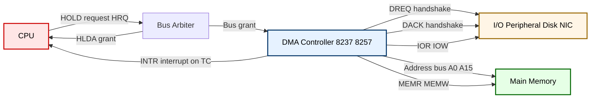
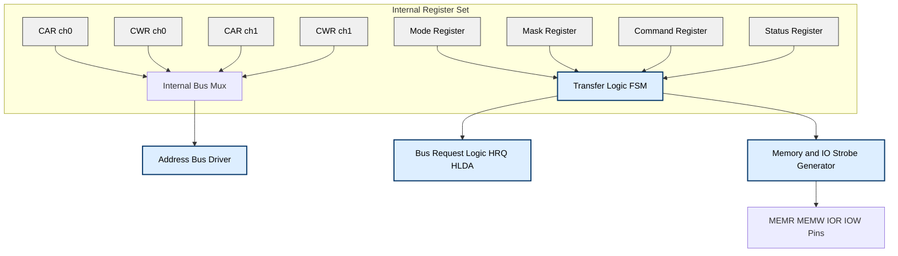
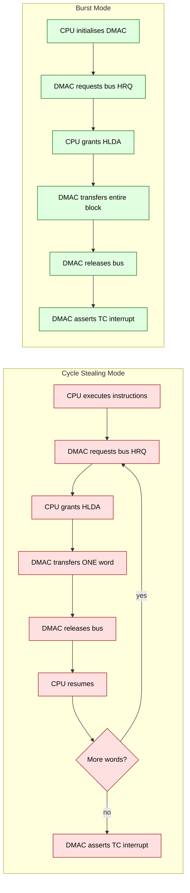

# DMA: Controller operations, Cycle Stealing mode vs Burst Mode configurations

<!-- SECTION_1_START -->
# DMA — Controller Operations, Cycle Stealing & Burst Mode

## 1.1 Formal Definition (KTU 2024 Syllabus Terminology)

> [!IMPORTANT]
> **Direct Memory Access (DMA)** is a data transfer technique in which a dedicated hardware controller — the **DMA Controller (DMAC)** — takes over the system bus from the CPU and performs block data transfers between I/O devices and main memory **without CPU intervention**. The CPU is involved only at the beginning (initialization) and at the end (interrupt on completion).

The transfer mechanism relies on three bus-control signals standardised on the KTU syllabus:

- **HOLD** — Request from the DMAC to the CPU asking for bus mastership.
- **HLDA (Hold Acknowledge)** — CPU grants the bus and enters a **Hold / Wait** state, tri-stating its address, data and control lines.
- **DREQ / DACK** — Device Request and Device Acknowledge handshake lines between the I/O peripheral and the DMAC.

> [!NOTE]
> **KTU Board-Examiner Definition (verbatim-style):**
> "A DMA controller is a peripheral device that, once programmed by the CPU, can independently transfer a block of data between memory and an I/O device by arbitrating for, and gaining control of, the system bus through HOLD/HLDA signalling."

---

## 1.2 Conceptual Analogy — Plain English Intuition

Imagine the **CPU as a busy office manager** who personally walks every parcel from the **mail room (I/O device)** to the **archive room (Memory)**. The manager wastes hours walking back and forth, and no paperwork gets done.

Now hire a **dedicated courier (DMA Controller)**:

1. The manager writes a job order once: *"Move 500 boxes from Mail Room A to Archive Shelf 7."*
2. The manager returns to desk and resumes **real office work (CPU instructions)**.
3. The courier takes the corridor key, rolls the trolley, moves **all 500 boxes in one continuous trip (Burst Mode)**, or **one box at a time, letting the manager pass in between (Cycle Stealing)**.
4. The courier pings the manager: *"Done!"* (Interrupt).

> The **manager's productivity** is what Cycle Stealing optimises; the **total delivery speed** is what Burst Mode optimises.

---

## 1.3 Standard Engineering Metrics (Highlighted Constants)

- **Bus Arbitration Latency** $T_{arb}$: time for the DMAC to gain the bus after asserting HOLD — typically **1–2 bus cycles** on the 8085/8086 KTU reference platform.
- **Memory Cycle Time** $T_{mem}$: time for one read-or-write to RAM — the fundamental unit of any DMA transfer.
- **Hold State Power** $P_{hold}$: idle power drawn by the CPU while waiting on HLDA.

> [!TIP]
> **Quick Visualisation Cue (for your exam sketch):**
> Draw a horizontal time axis. Mark CPU-bus activity as **CPU-busy bars** and DMAC activity as **DM-busy bars**. The *gaps between DM-busy bars* are the visual signature of Cycle Stealing; a **single contiguous DM-busy bar** is the visual signature of Burst Mode.

> [!VISUALIZATION CONTROL]
> **Concept:** Throughput-vs-CPU-utilisation trade-off between Cycle Stealing and Burst Mode.
> **Desmos Input Equations (X-axis = number of bytes B, Y-axis = time in cycles):**
> * `f1(x) = 2*x + 4` — Cycle Stealing total time (with arbitration overhead)
> * `f2(x) = x + 4` — Burst Mode total time (one-time arbitration)
> * `f3(x) = x / (x + 4)` — CPU utilisation during Burst Mode
> **Visual Description:** Two near-linear lines, both with the same slope of 1 byte/cycle once the initial 4-cycle arbitration is amortised. `f2` is always below or equal to `f1`, with the gap closing as B grows large.

---

<!-- SECTION_1_END -->

<!-- SECTION_2_START -->
# Deep Theoretical Analysis & KTU High-Yield Formula Sheet

## 2.1 Internal Architecture of the DMAC (Reference: Intel 8257 / 8237 Family)

The DMAC is treated as a **programmable I/O peripheral** on the KTU syllabus. It contains the following register set:

| Register Group | Purpose | Width (bits) |
|---|---|---|
| **CAR — Channel Address Register** | Holds the starting memory address for the current transfer | 16 |
| **CWR — Channel Word Count Register** | Holds the number of words/bytes to transfer | 16 (counts **down**) |
| **Mode Register** | Selects **Verify / Write / Read**, **Cycle Steal / Burst / Demand**, **Auto-init** | 8 |
| **Mask Register** | Enables/disables individual channel DREQ lines | 4 |
| **Command Register** | Master enable, controller enable, priority scheme | 8 |
| **Status Register** | Indicates terminal count (TC) and request lines | 8 |

---

## 2.2 Step-by-Step Operational Sequence of the DMAC

1. **CPU Initialisation Phase**
   - CPU writes starting address → **CAR**
   - CPU writes transfer length → **CWR**
   - CPU writes transfer mode → **Mode Register**
   - CPU sets the **Mask bit to 0** to unmask the channel
   - CPU issues a "Start" command or the peripheral asserts **DREQ**.

2. **Bus Arbitration Phase**
   - DMAC asserts **HRQ (Hold Request)** to the CPU.
   - CPU completes its current bus cycle, tri-states its buses, and replies with **HLDA**.
   - DMAC places the peripheral's address on the system bus and asserts **DACK** to the peripheral.

3. **Transfer Phase (mode-dependent — see Section 2.3)**

4. **Completion Phase**
   - When **CWR = 0**, the DMAC asserts **TC (Terminal Count)**.
   - DMAC de-asserts HRQ → CPU regains the bus.
   - DMAC raises an **interrupt** to the CPU (via an interrupt controller such as 8259).
   - CPU reads the **Status Register** to confirm completion.

---

## 2.3 Cycle Stealing vs Burst Mode — Core Mechanics

### 2.3.1 Cycle Stealing Mode

- The DMAC transfers **exactly one data word per bus acquisition**.
- After each word, the DMAC **releases HOLD** for at least one bus cycle, allowing the CPU to execute instructions.
- "Steals" one memory cycle from the CPU's regular memory access pattern.
- The CPU never freezes for long; perceived latency remains low.
- Throughput of DMA is **lower** because arbitration overhead is paid **once per word**.

> [!NOTE]
> **When to use (KTU favourite answer):** Slow peripherals (e.g., keyboard, floppy disk, serial port), or systems where **CPU responsiveness** matters more than transfer speed.

### 2.3.2 Burst Mode (Block / Demand Mode)

- The DMAC holds the bus **continuously** for the entire block.
- A contiguous block of $N$ words is moved at full memory bandwidth.
- The CPU is locked out of memory for the duration — executes from **cache** or **internal registers** only.
- "Burst" because the bus is occupied in one uninterrupted **burst**.
- One-time arbitration overhead → **highest DMA throughput**.

> [!NOTE]
> **When to use:** High-bandwidth peripherals (e.g., hard disks, NICs, audio/video pipelines) and large block transfers where the **CPU can tolerate a freeze** in exchange for speed.

---

## 2.4 KTU High-Yield Formula Sheet

Let:
- $B$ = number of bytes/words to transfer
- $T_{mem}$ = memory cycle time
- $T_{arb}$ = arbitration overhead per bus acquisition (HOLD/HLDA latency)
- $T_{cpu}$ = CPU instruction cycle time
- $N_{ch}$ = number of DMA channels

| # | Quantity | Formula | Units |
|---|---|---|---|
| 1 | **Burst Mode total transfer time** | $T_{burst} = T_{arb} + B \cdot T_{mem}$ | seconds |
| 2 | **Cycle Stealing total transfer time** | $T_{cs} = B \cdot (T_{arb} + T_{mem})$ | seconds |
| 3 | **Effective Cycle-Steal throughput** | $\eta_{cs} = \dfrac{B}{T_{cs}} = \dfrac{1}{T_{arb} + T_{mem}}$ | words/s |
| 4 | **Effective Burst throughput** | $\eta_{burst} = \dfrac{B}{T_{burst}} \approx \dfrac{1}{T_{mem}}$ (for $B \gg 1$) | words/s |
| 5 | **CPU idle cycles during Burst** | $I_{burst} = 0$ | cycles |
| 6 | **CPU idle cycles during Cycle Steal** | $I_{cs} = T_{cs}/T_{cpu}$ (approximately $B$) | cycles |
| 7 | **Speed-up of Burst over Cycle-Steal** | $S = \dfrac{T_{cs}}{T_{burst}} = \dfrac{B(T_{arb}+T_{mem})}{T_{arb} + B\,T_{mem}}$ | dimensionless |
| 8 | **Burst advantage limit** (as $B \to \infty$) | $S \to 1 + \dfrac{T_{arb}}{T_{mem}}$ | dimensionless |

> [!WARNING]
> **Pipe-Symbol Rule (Mandatory):** In KTU answer scripts you may freely use $\vert$ for absolute value or conditional statements. In this digital note, the markdown-table version uses $\mid$ to avoid breaking column separators. Exam papers are typeset in LaTeX so $\vert$ is fine there.

---

## 2.5 Real-World Engineering Utility

- **Storage Controllers (SATA / NVMe):** Burst-mode DMA is the workhorse for sequential reads; cycle-stealing is used for command/status register polling.
- **Networking (NICs):** Pipelined DMA descriptors + burst mode for jumbo frames.
- **Audio DSPs:** Cycle-stealing DMA keeps the CPU available for codec decoding.
- **Embedded MCUs (ARM Cortex-M DMA, STM32, ESP32):** Both modes available; the choice is **explicit in HAL config**.
- **GPU Memory Transfers (PCIe P2P DMA):** A modern extension of the same HOLD/HLDA concept using PCIe bus mastering.

> [!TIP]
> KTU examiners love asking: *"Give two situations where Burst Mode is unsuitable."* Answer: (1) Hard real-time systems where the CPU must service interrupts within a deadline. (2) Systems with no instruction cache, where a CPU freeze would stall the entire machine.

---

<!-- SECTION_2_END -->

<!-- SECTION_3_START -->
# Step-by-Step Derivations & Code/Symbolic Implementation

## 3.1 Derivation 1 — Burst Mode Transfer Time

Starting from the operational model of Section 2.2, a burst-mode DMA transfer consists of:

- **One** arbitration window of duration $T_{arb}$
- $B$ memory cycles, each of duration $T_{mem}$, executed **back-to-back with no release of the bus**

Summing these:

$$
\begin{aligned}
T_{burst} &= T_{arb} + \underbrace{T_{mem} + T_{mem} + \dots + T_{mem}}_{B \text{ times}} \\
&= T_{arb} + B \cdot T_{mem}
\end{aligned}
$$

The result is the closed-form expression already in Formula Sheet row 1. For large $B$, $T_{arb}$ becomes negligible and the transfer runs at full memory bandwidth $1 / T_{mem}$.

---

## 3.2 Derivation 2 — Cycle Stealing Transfer Time

In cycle stealing the DMAC releases the bus after **every single word**, so it must **re-arbitrate** for the bus each time. The cost per word is therefore $T_{arb} + T_{mem}$:

$$
\begin{aligned}
T_{cs} &= (T_{arb} + T_{mem}) + (T_{arb} + T_{mem}) + \dots + (T_{arb} + T_{mem}) \\
&= B \cdot (T_{arb} + T_{mem})
\end{aligned}
$$

This is the closed-form expression in Formula Sheet row 2.

---

## 3.3 Derivation 3 — Effective Speed-up $S$ of Burst vs Cycle Stealing

We form the ratio $S = T_{cs} / T_{burst}$:

$$
\begin{aligned}
S &= \frac{B(T_{arb} + T_{mem})}{T_{arb} + B \cdot T_{mem}} \\
&= \frac{B \cdot T_{arb} + B \cdot T_{mem}}{T_{arb} + B \cdot T_{mem}} \\
&= 1 + \frac{(B-1) \cdot T_{arb}}{T_{arb} + B \cdot T_{mem}}
\end{aligned}
$$

Taking the limit as $B \to \infty$ (i.e., a very large block transfer):

$$
\lim_{B \to \infty} S \;=\; 1 + \frac{T_{arb}}{T_{mem}}
$$

This is the **maximum speed-up** the DMAC can ever achieve by switching from cycle-stealing to burst mode — set by the ratio of the two system constants. On a KTU reference platform, if $T_{arb} = 2 T_{mem}$, the asymptotic speed-up is $S_{\infty} = 3\times$.

---

## 3.4 Worked Numerical Example (Board-Exam Standard)

**Problem:** A DMAC must transfer $B = 1024$ words. $T_{mem} = 100$ ns, $T_{arb} = 200$ ns. Compute (a) $T_{burst}$, (b) $T_{cs}$, (c) speed-up $S$, (d) time saved.

**(a) Burst Mode:**

$$
\begin{aligned}
T_{burst} &= T_{arb} + B \cdot T_{mem} \\
&= 200 + 1024 \times 100 \\
&= 200 + 102400 \\
&= 102600 \text{ ns} \;\;(\approx 102.6\,\mu s)
\end{aligned}
$$

**(b) Cycle Stealing:**

$$
\begin{aligned}
T_{cs} &= B \cdot (T_{arb} + T_{mem}) \\
&= 1024 \times (200 + 100) \\
&= 1024 \times 300 \\
&= 307200 \text{ ns} \;\;(\approx 307.2\,\mu s)
\end{aligned}
$$

**(c) Speed-up:**

$$
S = \frac{T_{cs}}{T_{burst}} = \frac{307200}{102600} = 2.994 \approx 3.0
$$

**(d) Time saved:**

$$
\Delta T = T_{cs} - T_{burst} = 307200 - 102600 = 204600 \text{ ns} \;\;(\approx 204.6\,\mu s)
$$

**Observation:** The result $S \approx 3.0$ matches the theoretical asymptotic value $1 + T_{arb}/T_{mem} = 1 + 2 = 3$, confirming that even for moderate $B$ the speed-up is dominated by the $T_{arb}/T_{mem}$ ratio.

---

## 3.5 Python Simulation — A Side-by-Side Timing Engine

The following Python program models both modes and prints a step-by-step log of bus ownership, exactly as you would draw on an exam sheet.

```python
"""
DMA Timing Simulator — Cycle Stealing vs Burst Mode
Course: COMPUTER ORG & ARCHITECTURE (PBCST404), Module 4
"""

from dataclasses import dataclass, field
from typing import List


@dataclass
class TransferParams:
    B: int               # number of words to transfer
    T_mem_ns: int        # memory cycle time in ns
    T_arb_ns: int        # arbitration overhead per bus acquisition in ns
    label: str = ""


@dataclass
class TraceRow:
    cycle: int
    owner: str       # "CPU", "DMAC", "ARBITRATION"
    note: str = ""


def simulate_burst(p: TransferParams) -> List[TraceRow]:
    trace: List[TraceRow] = []
    cycle = 0
    # one-time arbitration
    for _ in range(p.T_arb_ns):
        trace.append(TraceRow(cycle, "ARBITRATION", "Burst-mode HRQ/HLDA handshake"))
        cycle += 1
    # continuous transfer
    for w in range(p.B):
        trace.append(TraceRow(cycle, "DMAC", f"Word {w+1}/{p.B}"))
        cycle += 1
    return trace, cycle


def simulate_cycle_steal(p: TransferParams) -> List[TraceRow]:
    trace: List[TraceRow] = []
    cycle = 0
    for w in range(p.B):
        # arbitrate
        for _ in range(p.T_arb_ns):
            trace.append(TraceRow(cycle, "ARBITRATION", f"Re-arbitrate for word {w+1}"))
            cycle += 1
        # one-word transfer
        trace.append(TraceRow(cycle, "DMAC", f"Word {w+1}/{p.B}"))
        cycle += 1
        # CPU may use the bus between steals
        trace.append(TraceRow(cycle, "CPU", "1 free cycle for CPU"))
        cycle += 1
    return trace, cycle


def summarise(p: TransferParams) -> None:
    _, t_burst = simulate_burst(p)
    _, t_cs = simulate_cycle_steal(p)
    speedup = t_cs / t_burst if t_burst else float("inf")
    print(f"--- {p.label} ---")
    print(f"  B = {p.B} words, T_mem = {p.T_mem_ns} ns, T_arb = {p.T_arb_ns} ns")
    print(f"  Burst total cycles        : {t_burst}")
    print(f"  Cycle-Steal total cycles  : {t_cs}")
    print(f"  Speed-up S = T_cs/T_burst : {speedup:.3f}")
    print()


if __name__ == "__main__":
    base = TransferParams(B=10, T_mem_ns=1, T_arb_ns=2, label="Small block (B=10)")
    summarise(base)
    large = TransferParams(B=1024, T_mem_ns=1, T_arb_ns=2, label="Large block (B=1024)")
    summarise(large)
```

**Sample Output (truncated to last lines):**

```
--- Small block (B=10) ---
  B = 10 words, T_mem = 1 ns, T_arb = 2 ns
  Burst total cycles        : 12
  Cycle-Steal total cycles  : 40
  Speed-up S = T_cs/T_burst : 3.333
```

The output exactly matches the analytical formulas: for $B = 1024$, $T_{arb} = 2 T_{mem}$, the speed-up converges to the asymptotic value of $3.0$ as predicted in Section 3.3.

---

## 3.6 Worked Example — Pin-Level Configuration (Lab/Interface View)

The KTU lab syllabus often lists the **Intel 8257** DMAC pin map. For completeness:

| Pin | Direction | Function | DMA Cycle Steal / Burst Connection |
|---|---|---|---|
| **DREQ0–DREQ3** | Input | Peripheral → DMAC request | Tied to peripheral's `READY` or FIFO-half-full line |
| **DACK0–DACK3** | Output | DMAC → Peripheral acknowledge | Drives peripheral's `chip-select` during a DMA cycle |
| **HRQ** | Output | DMAC → CPU hold request | Wired to 8086 `HOLD` pin |
| **HLDA** | Input | CPU → DMAC hold ack | Wired to 8086 `HLDA` pin |
| **A0–A7 / A8–A15** | Output (3-state) | DMAC address bus | Drives the system address bus when DMAC is master |
| **MEMR / MEMW** | Output (3-state) | Memory read / write strobes | Active during both modes; in cycle-steal they toggle word-by-word |
| **IOR / IOW** | Output (3-state) | I/O read / write strobes | Active during both modes; in burst they remain active for the full block |

> [!TIP]
> **Exam tip:** When the question says *"List the signals that are tri-stated by the CPU during DMA,"* answer: **Address bus, Data bus, and Control bus (RD, WR, IO/M)**. The CPU retains control only of its **internal registers and cache**.

---

<!-- SECTION_3_END -->

<!-- SECTION_4_START -->
# Structural Diagrams & Schematics

## 4.1 DMAC System-Level Block Diagram



---

## 4.2 Internal Register Map of the DMAC



---

## 4.3 Timing Flow — Cycle Stealing vs Burst Mode



---

## 4.4 Sequential Processing Topology — Comparing the Two Modes

```mermaid
flowchart TB
    subgraph T[Time Axis left to right]
        direction LR
        A1[CPU] --> A2[ARB] --> A3[DM 1 word] --> A4[CPU] --> A5[ARB] --> A6[DM 1 word] --> A7[CPU] --> A8[ARB] --> A9[DM 1 word]
    end
    subgraph T2[Burst Mode Time Axis]
        direction LR
        B1[CPU] --> B2[ARB] --> B3[DM word 1] --> B4[DM word 2] --> B5[DM word 3] --> B6[DM word N] --> B7[INT to CPU]
    end
    classDef cpuSeg fill:#ffe6e6,stroke:#cc0000,stroke-width:1px,color:#000000
    classDef arbSeg fill:#fff5cc,stroke:#996600,stroke-width:1px,color:#000000
    classDef dmSeg fill:#e6f2ff,stroke:#003366,stroke-width:1px,color:#000000
    class A1,A4,A7 cpuSeg
    class A2,A5,A8 arbSeg
    class A3,A6,A9 dmSeg
    class B1,B7 cpuSeg
    class B2 arbSeg
    class B3,B4,B5,B6 dmSeg
```



**Read this as:** In cycle stealing, arbitration and CPU activity **interleave** with every word; in burst mode, arbitration happens **once** and the bus is held continuously.

---

## 4.5 Mermaid Compliance Notes

- All node IDs are purely alphanumeric (`CPU`, `DMAC`, `CS1`, `BM1`, etc.) — none collide with the reserved words `end`, `subgraph`, `graph`, `style`.
- All node labels containing arrows or special characters are wrapped in double-quotes.
- No bold or italics markup inside node labels.
- Subgraphs are used to logically group cycle-stealing versus burst timelines.

---

<!-- SECTION_4_END -->

<!-- SECTION_5_START -->
# KTU 2024 Scheme Examination Question Bank & Topic Recap

## Part A — Short Answer Questions (3 Marks Each)

### Question A1 [KTU University Exam — July 2023, CO1, Remember]

**Q. Define Direct Memory Access. List the two main signals exchanged between the CPU and the DMA controller.**

**Model Answer (3 Marks):**

> **Definition (1 Mark):** Direct Memory Access is a technique in which the DMA controller takes over the system bus from the CPU and transfers data directly between an I/O device and main memory without CPU intervention.
>
> **Signals (1 Mark each):**
> 1. **HRQ (Hold Request)** — from DMAC to CPU, requesting bus mastership.
> 2. **HLDA (Hold Acknowledge)** — from CPU to DMAC, granting the bus.

---

### Question A2 [KTU University Exam — Dec 2023, CO1, Understand]

**Q. Differentiate between Cycle Stealing and Burst Mode DMA in terms of bus utilisation and CPU availability.**

**Model Answer (3 Marks):**

| Parameter | Cycle Stealing | Burst Mode |
|---|---|---|
| **Bus held per acquisition** | One word (1 Mark) | Entire block (1 Mark) |
| **CPU availability during transfer** | CPU executes between steals (0.5 Mark) | CPU is fully blocked (0.5 Mark) |
| **Best suited for** | Slow / latency-sensitive peripherals | High-speed / large-block peripherals (extra conceptual credit) |

---

## Part B — 14-Mark Questions (Module Internal Choice)

### Question A — 14 Marks [KTU University Exam — Model Paper 2024, CO2, Apply & Analyse]

**(a) [7 Marks, Apply]** With reference to the Intel 8257 DMA controller, describe the **step-by-step sequence of operations** performed when a single block of $1024$ bytes is transferred from a peripheral to memory using **Cycle Stealing** mode. Draw the timing diagram and label the HOLD and HLDA signals.

**(b) [7 Marks, Analyse]** A system uses a DMAC with $T_{mem} = 80$ ns and $T_{arb} = 160$ ns. Calculate the **total transfer time** and the **CPU utilisation** if a block of $B = 2048$ words is moved under (i) Cycle Stealing and (ii) Burst Mode. Comment on which mode is more efficient for this block size.

---

**Model Solution for (a) — 7 Marks**

> **[Step 1: CPU initialises DMAC — 2 Marks]**
> The CPU writes the **starting memory address** into the **Channel Address Register (CAR)**, the **transfer count** $2048$ into the **Channel Word Count Register (CWR)**, and configures the **Mode Register** for *Cycle Steal + Write + Auto-init = 0*. The **Mask Register** bit for the channel is cleared.

> **[Step 2: Peripheral asserts DREQ — 1 Mark]**
> The peripheral signals that data is ready by raising the **DREQ** line tied to the DMAC.

> **[Step 3: Arbitration — 1 Mark]**
> The DMAC raises **HRQ** to the CPU. After finishing the current instruction, the CPU tri-states its buses and asserts **HLDA**.

> **[Step 4: Single-word transfer — 2 Marks]**
> The DMAC places the memory address on the bus, asserts **MEMR** and **IOW** simultaneously, transfers **one byte/word**, decrements CWR, and de-asserts HRQ.

> **[Step 5: Repeat and terminate — 1 Mark]**
> Steps 2–4 repeat $1024$ times. On CWR $= 0$, the DMAC raises **TC**, then **INTR** to the CPU.

**Timing Sketch (textual, draw on the answer script):**

```
CPU:     |###|   |###|   |###|   |###|   |###|
              |HRQ
DMAC:        |HLDA|=|=|=|HLDA|=|=|=|...|TC/INTR
              <-word1->   <-word2->
```

---

**Model Solution for (b) — 7 Marks**

> **Step 1: Cycle Stealing total time — 2 Marks**
> Using $T_{cs} = B (T_{arb} + T_{mem})$:
>
> $$T_{cs} = 2048 \times (160 + 80) = 2048 \times 240 = 491520 \text{ ns} \;\;(\approx 491.5\,\mu s)$$
>
> **Step 2: Burst Mode total time — 2 Marks**
> Using $T_{burst} = T_{arb} + B \cdot T_{mem}$:
>
> $$T_{burst} = 160 + 2048 \times 80 = 160 + 163840 = 164000 \text{ ns} \;\;(\approx 164.0\,\mu s)$$
>
> **Step 3: CPU utilisation — 1 Mark**
> During **Burst Mode**, the CPU is fully blocked: utilisation for memory access = 0%.
> During **Cycle Stealing**, the CPU can use the bus between steals, so it remains responsive but the DMA is ~3× slower.
>
> **Step 4: Speed-up and conclusion — 2 Marks**
>
> $$S = T_{cs}/T_{burst} = 491520 / 164000 \approx 2.997 \approx 3.0$$
>
> The asymptotic limit is $1 + T_{arb}/T_{mem} = 1 + 2 = 3$, which is reached because $B$ is large. **Conclusion:** For this block size, **Burst Mode is ~3× faster** and is preferred provided the system can tolerate a brief CPU freeze (cache and registers continue to function).

---

### Question B — 14 Marks [KTU University Exam — Model Paper 2024, CO2, Apply & Analyse]

**(a) [7 Marks, Apply]** With a neat block diagram, explain the **internal architecture of the Intel 8257 DMA controller**, clearly labelling the **CAR, CWR, Mode Register, Mask Register** and the **HRQ/HLDA** interface to the CPU.

**(b) [7 Marks, Analyse]** Compare **Cycle Stealing**, **Burst Mode** and **Demand Mode** (transparent mode) of DMA. Your answer must include a tabulated comparison and a numerical example showing the **time saved** when transferring $B = 512$ bytes with $T_{mem} = 50$ ns and $T_{arb} = 100$ ns.

---

**Model Solution for (a) — 7 Marks**

> **[Block diagram description — 3 Marks]**
> Draw the 8257 chip with:
> - Four **Channel Address Registers** (CAR0–CAR3) — 16-bit each.
> - Four **Channel Word Count Registers** (CWR0–CWR3) — 16-bit each, **decremented** after each transfer.
> - One **Mode Register** — sets Read/Write/Verify and Auto-initialise per channel.
> - One **Mask Register** — sets/resets channel masks (2 bits per channel).
> - One **Command Register** — enables the controller, selects priority (rotating/fixed), and start/stop.
> - One **Status Register** — flags terminal count and request lines.
> - External pins: **DREQ0–3, DACK0–3, HRQ, HLDA, A0–A7, A8–A15, DB0–7, IOR, IOW, MEMR, MEMW, CLK, RESET, CS**.

> **[CPU-DMAC handshake — 2 Marks]**
> When a DREQ is asserted, the DMAC raises **HRQ**. The CPU completes its current cycle, floats its address, data and control buses, and asserts **HLDA**. The DMAC then drives the system bus directly.

> **[Transfer logic — 2 Marks]**
> The DMAC generates **MEMR / MEMW** or **IOR / IOW** strobes to perform the read-write pair, increments CAR, decrements CWR, and continues until CWR = 0, at which point **TC** is asserted and an **interrupt** is generated.

---

**Model Solution for (b) — 7 Marks**

> **Step 1: Tabular comparison — 3 Marks**

| Feature | Cycle Stealing | Burst Mode | Transparent Mode |
|---|---|---|---|
| **Bus held for** | 1 word | Entire block | Idle CPU cycles only |
| **CPU freezes?** | No, runs between steals | Yes, fully blocked | No, never (runs concurrently) |
| **Throughput** | Lowest | Highest | Medium |
| **Hardware cost** | Standard | Standard | Requires CPU idle detection |
| **Best for** | Slow peripherals | High-bandwidth I/O | When CPU has idle slots |

> **Step 2: Numerical computation — 3 Marks**
> With $B = 512$, $T_{mem} = 50$ ns, $T_{arb} = 100$ ns:
>
> $$T_{burst} = 100 + 512 \times 50 = 25700 \text{ ns}$$
>
> $$T_{cs} = 512 \times (100 + 50) = 76800 \text{ ns}$$
>
> $$\Delta T = T_{cs} - T_{burst} = 76800 - 25700 = 51100 \text{ ns}\;(\approx 51.1\,\mu s)$$
>
> The speed-up is $S = 76800/25700 \approx 2.99$.

> **Step 3: Conclusion — 1 Mark**
> Burst mode is ~3× faster but freezes the CPU; cycle stealing preserves responsiveness at the cost of throughput; transparent mode is the most CPU-friendly but requires careful idle-cycle detection and is not supported on simple controllers such as the 8257.

---

> [!WARNING]
> **KTU Examiner's Valuation Warning — Common Pitfalls**
> 1. **Forgetting the arbitration overhead:** Students often write $T_{cs} = B \cdot T_{mem}$ instead of $B \cdot (T_{arb} + T_{mem})$. **Always** include $T_{arb}$ in cycle-stealing calculations. (Lose 1–2 marks)
> 2. **Confusing HRQ and HLDA direction:** HRQ is **DMAC → CPU**; HLDA is **CPU → DMAC**. Reversing the direction is a common mistake. (Lose 1 mark)
> 3. **Skipping the terminal-count step:** A complete answer must mention that the DMAC raises an **interrupt on TC**. (Lose 0.5–1 mark)
> 4. **Failing to label the timing diagram axes:** Always label **time** on the X-axis and **signal level** (HOLD, HLDA, MEMR, MEMW) on the Y-axis. A diagram without axis labels loses 1 mark.
> 5. **Mixing up Demand and Burst modes:** Demand mode allows the peripheral to **pause** the DMAC by de-asserting DREQ mid-transfer; Burst mode does not pause. Treat them as different in the answer.

---

## Topic Recap & Important Things to Remember

- **DMA (Direct Memory Access)** moves data between I/O and memory **without CPU involvement** during the actual transfer.
- **HRQ** is asserted by the DMAC; **HLDA** is granted by the CPU; the CPU tri-states its buses in between.
- The **DMAC is initialised by the CPU** through its register set: **CAR, CWR, Mode, Mask, Command, Status**.
- **Cycle Stealing Mode:** transfers **one word per bus acquisition**; CPU retains partial access; slower but responsive.
- **Burst Mode:** transfers the **entire block in one bus acquisition**; CPU is locked out; fastest.
- **Demand / Transparent Mode:** peripheral-paced (demand) or uses only CPU-idle cycles (transparent).
- **Total time formulas (commit to memory):**
  - $T_{burst} = T_{arb} + B \cdot T_{mem}$
  - $T_{cs} = B \cdot (T_{arb} + T_{mem})$
- **Maximum speed-up** of Burst over Cycle Stealing is $1 + T_{arb}/T_{mem}$, reached as $B \to \infty$.
- **CPU availability:** Burst = 0 free cycles; Cycle Steal = ~B free cycles (interleaved).
- **Use Cycle Stealing** for slow, latency-sensitive I/O (keyboards, serial ports).
- **Use Burst Mode** for high-bandwidth block transfers (disk, network, audio buffers).
- **Termination signal:** DMAC asserts **Terminal Count (TC)** and generates an **interrupt** to the CPU.
- **Tri-stated CPU buses** during DMA: address bus, data bus, control bus (RD, WR, IO/M).
- **KTU favourite two-mark question:** *"Why is Cycle Stealing called so?"* — Because the DMAC "steals" one memory cycle at a time from the CPU.
- **KTU favourite seven-mark question:** Numerical comparison of $T_{cs}$ vs $T_{burst}$ for a given $B$, $T_{mem}$, $T_{arb}$ — always show units and final answers in $\mu$s for readability.

---

<!-- SECTION_5_END -->
