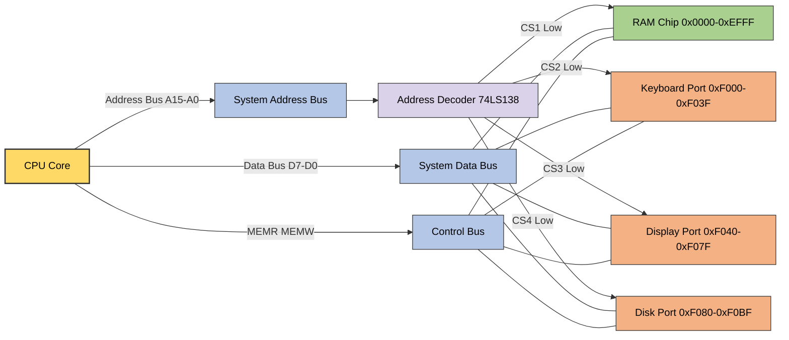
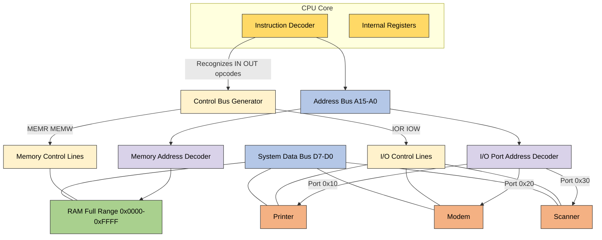
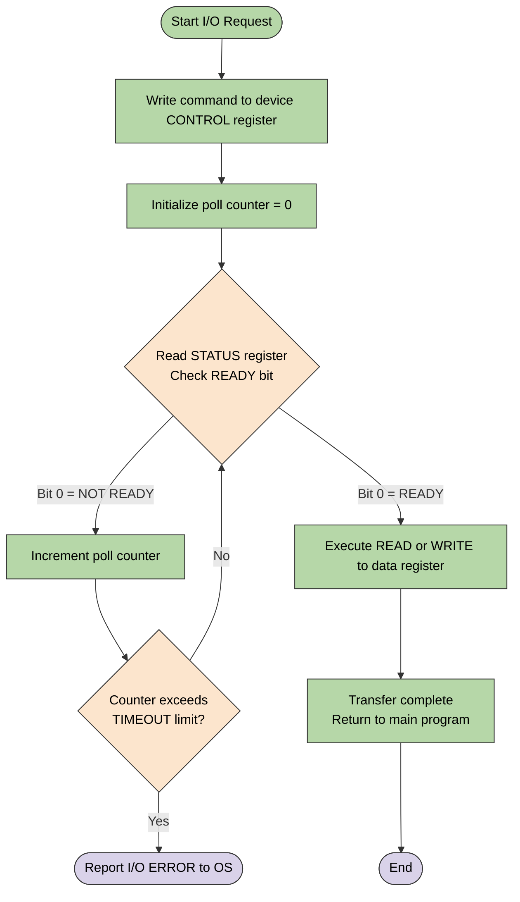
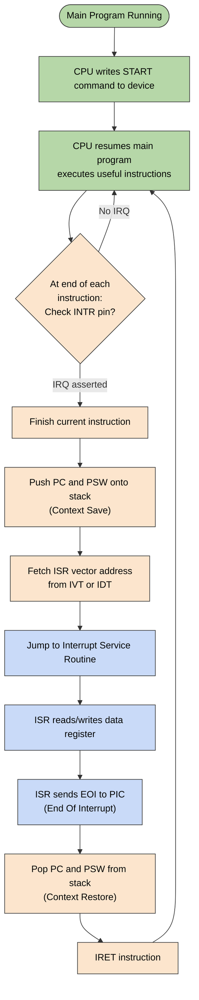
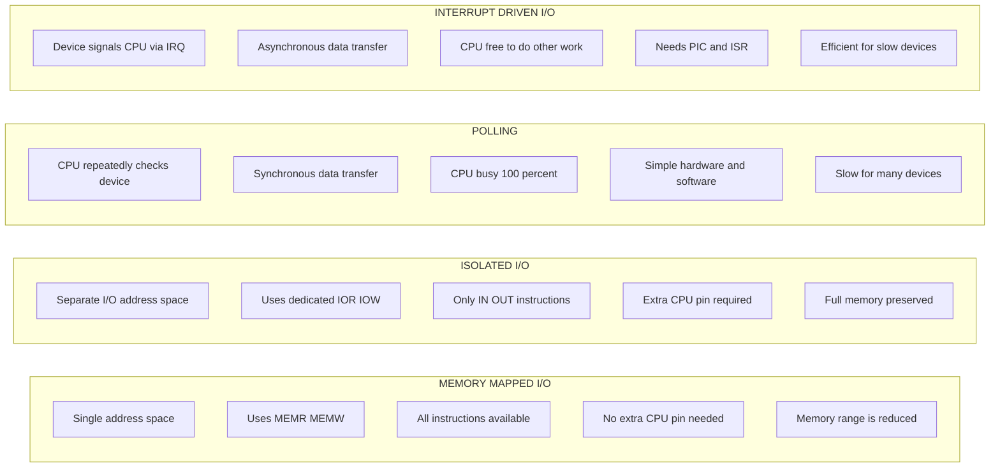

# I/O Interfacing: Memory-Mapped I/O vs Isolated I/O schemes, Data transfers: Polling vs Interrupt-Driven I/O

<!-- SECTION_1_START -->

# I/O Interfacing & Data Transfer Schemes

## 1. Core Technical Definition & Intuitive Overview

> [!IMPORTANT]
> **KTU 2024 Syllabus Definition (PBCST404 – Module 4):**
> I/O Interfacing defines how the CPU communicates with peripheral devices using the system bus. The KTU 2024 Scheme specifically categorizes the two fundamental interfacing strategies as **Memory-Mapped I/O (MMIO)** and **Isolated I/O (Port-Mapped I/O / PMIO)**, and the two fundamental data transfer strategies as **Programmed I/O (Polling)** and **Interrupt-Driven I/O**.

### 1.1 Memory-Mapped I/O (MMIO)

In **Memory-Mapped I/O**, peripheral devices and main memory share a **single, unified address space**. The CPU treats an I/O register exactly like it would a memory location — the same `LOAD` and `STORE` instructions used to access RAM are used to access I/O devices. A dedicated range of memory addresses is reserved (decoded) for each I/O device, and the system's address decoder activates the appropriate peripheral chip-select line when a reserved address appears on the address bus.

> [!NOTE]
> **Formal Definition:** *Memory-Mapped I/O is a bus-addressing scheme in which the processor uses the same address bus, data bus, and read/write control lines to access both primary memory and I/O devices, distinguishing between them solely by the address range assigned to each peripheral.*

> [!TIP]
> **Conceptual Analogy – "The Single P.O. Box System" 🏤**
> Imagine a large apartment building where every resident (memory) AND every business (I/O device) has a P.O. box number in the **same lobby**. The postman (CPU) walks down one corridor using one set of mail rules. If the box number is between 1–500, it's a resident; if it's 501–600, it's the local grocery store (keyboard), 601–700 is the bank (disk controller), and so on. The postman doesn't need a different corridor — he just reads the number. That single-corridor, single-numbering system is exactly how Memory-Mapped I/O works.

### 1.2 Isolated I/O (Port-Mapped I/O / PMIO)

In **Isolated I/O**, peripheral devices reside in a **completely separate address space** from main memory. The CPU uses **dedicated special instructions** (such as `IN`, `OUT` in Intel x86 or specific I/O instructions in other ISAs) and an **extra control line** (typically $\overline{\text{IOR}}$ and $\overline{\text{IOW}}$ — I/O Read and I/O Write) on the control bus to signal that the current bus cycle is targeting an I/O device rather than memory.

> [!NOTE]
> **Formal Definition:** *Isolated I/O is a bus-addressing scheme that uses a dedicated I/O address space, separate control signals, and specialized I/O instructions, so that I/O ports are logically and electrically decoupled from the main memory address space.*

> [!TIP]
> **Conceptual Analogy – "The Twin Towers" 🏢**
> Picture two separate buildings standing next to each other. The **Left Tower** holds all the residents (memory) and uses one set of elevators (memory instructions: `LOAD`, `STORE`). The **Right Tower** holds all the businesses (I/O devices) and uses a completely different elevator bank with its own keycards (I/O instructions: `IN`, `OUT`). A sign on the main door (the extra control line $\overline{\text{IOR}}/\overline{\text{IOW}}$) tells the receptionist which tower you're visiting that day. Same city, two completely independent addressing worlds — that is Isolated I/O.

### 1.3 Programmed I/O – Polling (Busy-Wait)

In **Polling** (also called **Programmed I/O** or **Busy-Waiting**), the CPU is solely responsible for detecting whether an I/O device is ready. The processor repeatedly executes a small loop that **reads the device's status register** and tests a "ready" or "done" flag bit. Only when the flag is set does the CPU proceed with the actual data transfer. Until then, the CPU is **wasted in a tight loop** doing nothing useful.

> [!NOTE]
> **Formal Definition:** *Polling is a synchronous I/O transfer technique in which the CPU continually tests a peripheral's status flag by reading a control/status register at fixed intervals until the device signals readiness, after which the CPU performs the data transfer directly.*

> [!TIP]
> **Conceptual Analogy – "Knocking on a Closed Door" 🚪**
> Imagine you arrive at a friend's house to pick up a package. They aren't home yet. You stand at the door and knock every 30 seconds, walking back to the road, peeking through the window, knocking again. You keep doing this for an hour. That constant, CPU-burning, door-checking behavior is **polling**. You could have been doing homework, but instead you wasted all your time checking.

### 1.4 Interrupt-Driven I/O

In **Interrupt-Driven I/O**, the I/O device is given the ability to **asynchronously signal the CPU** when it is ready. The CPU initiates the I/O operation, then **continues executing other useful instructions** in the main program. When the peripheral completes its task, it raises an **interrupt request (IRQ)** line connected to the CPU's interrupt pin. The CPU finishes its current instruction, saves its state, and jumps to a special routine called the **Interrupt Service Routine (ISR)** to handle the data transfer.

> [!NOTE]
> **Formal Definition:** *Interrupt-Driven I/O is an asynchronous data transfer technique in which the peripheral, upon becoming ready, asserts an interrupt request signal that forces the CPU to suspend its current execution, save its context, and branch to a dedicated Interrupt Service Routine to service the device.*

> [!TIP]
> **Conceptual Analogy – "The Restaurant Pager" 🍽️**
> You walk into a busy restaurant, give your name to the host, and receive a small vibrating pager. You then **go back to your table and continue chatting with friends, scrolling your phone, or studying**. You do NOT stand glued to the host desk. When your table is ready, the pager buzzes (the **interrupt**), and you walk over to be seated. That is interrupt-driven I/O — the device tells the CPU when it's ready, freeing the CPU to do productive work in the meantime.

> [!VISUALIZATION CONTROL]
> **Concept:** Unified vs. Split Address Space (Memory Map Comparison)
> **GeoGebra / Desmos Input Representation (1D number line):**
> * `Memory Region (MMIO): 0x0000 → 0xEFFF (Unified Line Segment)`
> * `I/O Region (MMIO):   0xF000 → 0xFFFF (Reserved Upper Slice of Same Line)`
> * `Isolated I/O Line:   0x0000 → 0xFFFF (Separate Parallel Line)`
> **Visual Description:** Draw two parallel horizontal number lines. On the *top line* (unified space), color the lower portion blue (memory) and the upper 4 KB red (I/O devices in MMIO). On the *bottom line* (isolated space), color the entire line green to represent the independent I/O port space. Students should observe that MMIO *shrinks* the available memory range, while Isolated I/O preserves the full memory range at the cost of a separate instruction set.

---

<!-- SECTION_1_END -->

<!-- SECTION_2_START -->

# 2. Deep Theoretical Analysis & KTU High-Yield Formula Sheet

## 2.1 Memory-Mapped I/O – Operational Walkthrough

The following is the sequence of events when the CPU performs an I/O operation using Memory-Mapped I/O:

1. **Address Bus Placement:** The CPU places the target address on the address bus. This address falls within a range that the address decoder has been hard-wired to recognize as belonging to a peripheral (not RAM).
2. **Unified Read/Write Strokes:** The CPU activates the standard $\overline{\text{MEMR}}$ or $\overline{\text{MEMW}}$ control line. **No separate I/O control line is required** because memory and I/O share the same bus cycle type.
3. **Chip-Select Activation:** The address decoder (e.g., a 74LS138 3-to-8 decoder) interprets the high-order address bits and asserts the appropriate $\overline{\text{CS}}$ (chip-select) line of the target peripheral.
4. **Data Transfer:** The peripheral either places data on the data bus (read) or latches data from the data bus (write) — identical to a memory cycle.
5. **Instruction Reuse:** The programmer uses ordinary instructions like `LDR R0, [R1]`, `STR R2, [R3]`, `MOV`, arithmetic, or even bit-manipulation instructions to access I/O registers.

**Why it works (The "Why"):** Because every memory reference instruction can transparently address an I/O device, the **instruction set is richer** and assembly programming becomes simpler. **How it works (The "How"):** The hardware sacrifices part of the addressable memory space — those addresses can no longer be used for actual RAM.

## 2.2 Isolated I/O – Operational Walkthrough

1. **Special Instruction Decode:** The CPU's instruction decoder recognizes a dedicated I/O instruction (e.g., x86 `IN AL, DX` or `OUT DX, AL`). This sets an internal flag.
2. **Separate Control Line:** The CPU asserts a dedicated $\overline{\text{IOR}}$ or $\overline{\text{IOW}}$ control line **instead of** the memory strobe, telling all devices on the bus that this is an I/O cycle.
3. **Separate Address Space:** The address placed on the bus is interpreted within a **dedicated 16-bit (or 8-bit) I/O address space** that is **independent of the memory address space**.
4. **Smaller Decoder:** The I/O address decoder is typically much smaller than the memory decoder because fewer ports exist (e.g., 65,536 ports in x86 vs. $2^{32}$ or $2^{64}$ memory locations).
5. **Memory Preservation:** Since the I/O address space is separate, the **entire memory address range remains available for RAM** — no memory is sacrificed.

**Why it works:** Provides clean hardware isolation. **How it works:** Requires extra pins on the CPU package and a richer instruction decoder, slightly increasing CPU complexity.

## 2.3 Polling – Operational Walkthrough

1. **Status Check Loop:** The CPU enters a busy-wait loop, repeatedly reading the peripheral's **STATUS** register.
2. **Mask & Test:** The CPU masks the "ready" bit (e.g., `AND R0, R0, #0x01`) and tests if it is set (`BNZ` – Branch if Not Zero).
3. **Spin Until Ready:** If the bit is clear, the CPU loops back to step 1 — burning 100% of its cycles on this single device.
4. **Data Transfer:** Once the ready bit is set, the CPU executes the actual `READ` or `WRITE` instruction to transfer the data.
5. **Single-Device Bottleneck:** During polling, the CPU **cannot service any other task** for that peripheral — including higher-priority I/O requests.

## 2.4 Interrupt-Driven I/O – Operational Walkthrough

1. **CPU Issues Command:** The CPU writes a command to the device's control register, telling it to begin the I/O operation (e.g., "start reading the next sector from disk").
2. **CPU Resumes Other Work:** The CPU immediately returns to the main program and executes other useful instructions — perhaps running a calculation, updating a display, or servicing another device.
3. **Device Completes Work:** After some delay (mechanical, electrical, or network latency), the peripheral finishes and asserts its **IRQ line** (e.g., `IRQ3` in x86).
4. **Interrupt Acknowledge:** The interrupt controller (e.g., 8259A PIC or LAPIC) arbitrates the request and signals the CPU via the `INTR` pin. The CPU completes the current instruction.
5. **Context Save & Vector Fetch:** The CPU automatically pushes `PC`, `PSR`, and other registers onto the stack, then fetches the **interrupt vector address** (e.g., from the IVT or IDT).
6. **ISR Execution:** The CPU branches to the **Interrupt Service Routine (ISR)**, which performs the actual data transfer (read/write the data register) and clears the interrupt source.
7. **Return from Interrupt (IRET):** The CPU restores its saved state and resumes the main program exactly where it left off.

> [!IMPORTANT]
> **KTU 2024 High-Yield Comparison: Why Polling is "Synchronous" and Interrupt is "Asynchronous"**
> The KTU board examiner specifically tests whether students understand the **temporal relationship** between CPU and device. In polling, the **CPU dictates the timing** — the device must wait until the CPU next checks. In interrupt-driven I/O, the **device dictates the timing** — the CPU is interrupted whenever the device is ready. This is the essence of synchronous vs. asynchronous data transfer.

## 2.5 KTU Formula Sheet / Cheat Sheet

> [!NOTE]
> The following table summarizes every numerical formula, control signal, and key parameter you must memorize for the KTU 2024 End-Semester Examination on this topic.

| # | Parameter / Formula | Symbolic Form | Numerical Example | KTU Significance |
|---|---|---|---|---|
| 1 | Total Memory Addresses | $N_{\text{mem}} = 2^{a}$ | $a = 16 \Rightarrow N_{\text{mem}} = 65{,}536$ locations | Determines the address bus width required |
| 2 | Available Memory in MMIO | $N_{\text{usable}} = 2^{a} - N_{\text{I/O}}$ | $2^{16} - 2^{8} = 65{,}280$ locations | MMIO *reduces* usable RAM |
| 3 | Total I/O Ports (Isolated) | $N_{\text{ports}} = 2^{p}$ | $p = 8 \Rightarrow 256$ ports | Independent of memory address width |
| 4 | CPU Time Wasted in Polling | $T_{\text{waste}} = t_{\text{loop}} \times N_{\text{iterations}}$ | $1\,\mu s \times 1000 = 1\,ms$ | Quantifies polling inefficiency |
| 5 | Polling Throughput | $\eta_{\text{poll}} = \dfrac{T_{\text{useful}}}{T_{\text{useful}} + T_{\text{waste}}}$ | $\dfrac{1}{1+9} = 10\%$ | Shows CPU starvation |
| 6 | Interrupt Latency | $T_{\text{latency}} = T_{\text{inst}} + T_{\text{save}} + T_{\text{vector}}$ | $50 + 10 + 20 = 80\,ns$ | Time from IRQ to first ISR instruction |
| 7 | Interrupt Service Time | $T_{\text{ISR}} = N_{\text{inst}} \times T_{\text{cycle}}$ | $20 \times 10\,ns = 200\,ns$ | Time spent inside the ISR |
| 8 | Effective CPU Utilization (Interrupt) | $U_{\text{CPU}} = 1 - \dfrac{T_{\text{ISR}}}{T_{\text{total}}}$ | $1 - \dfrac{200}{10{,}000} = 98\%$ | Interrupt is vastly more efficient |
| 9 | Data Transfer Rate (Programmed I/O) | $R_{\text{PIO}} = \dfrac{1}{T_{\text{inst}} \times N_{\text{bytes}}}$ | $\dfrac{1}{100\,ns \times 1} = 10\,\text{MB/s}$ | Limited by instruction execution speed |
| 10 | DMA Transfer Rate | $R_{\text{DMA}} = \dfrac{1}{T_{\text{cycle}}}$ | $\dfrac{1}{10\,ns} = 100\,\text{MB/s}$ | DMA is faster than PIO (preview of next topic) |

> [!IMPORTANT]
> **Engineering Real-World Utility:**
> * **Memory-Mapped I/O** is used in nearly all modern RISC architectures: **ARM, MIPS, RISC-V, and PowerPC** rely on MMIO because it allows the same `LDR`/`STR` instructions to access both RAM and device registers (e.g., the Raspberry Pi's GPIO controller is mapped at physical address `0x3F200000`).
> * **Isolated I/O** survives primarily in **x86** for backward compatibility, where `IN`/`OUT` instructions still exist but are rarely used by modern operating systems (Linux uses MMIO for almost everything).
> * **Polling** is still used in **high-speed, deterministic, real-time embedded systems** (e.g., spinning a UART TX register in a microcontroller ISR) where interrupt overhead would be too costly.
> * **Interrupt-Driven I/O** is the **default** in general-purpose operating systems (Linux, Windows, macOS) for keyboards, mice, network cards, disk controllers, and USB.

---

<!-- SECTION_2_END -->

<!-- SECTION_3_START -->

# 3. Step-by-Step Derivations & Code/Symbolic Implementation

## 3.1 Derivation: Address Space Reduction in Memory-Mapped I/O

> **Problem:** A 16-bit microprocessor uses Memory-Mapped I/O. The system designer has allocated the **top 256 addresses** (i.e., `0xFF00` to `0xFFFF`) to four I/O devices, each occupying 64 bytes. Calculate the **percentage of memory lost** to I/O mapping.

### Step-by-Step Derivation

**Step 1 — Identify the total addressable memory locations:**

$$N_{\text{total}} = 2^{a} = 2^{16} = 65{,}536 \text{ locations}$$

**Step 2 — Identify the number of addresses reserved for I/O:**

The problem states that 256 addresses are allocated to I/O:

$$N_{\text{I/O}} = 256 \text{ locations}$$

**Step 3 — Compute the number of memory locations still available for RAM:**

$$N_{\text{RAM}} = N_{\text{total}} - N_{\text{I/O}}$$

$$N_{\text{RAM}} = 65{,}536 - 256 = 65{,}280 \text{ locations}$$

**Step 4 — Convert the loss into a percentage:**

$$\text{Loss \%} = \frac{N_{\text{I/O}}}{N_{\text{total}}} \times 100\%$$

$$\text{Loss \%} = \frac{256}{65{,}536} \times 100\% = \frac{1}{256} \times 100\% \approx 0.3906\%$$

**Final Answer:** Only **0.39%** of the address space is lost — a negligible cost for a 16-bit system. **Valuation Key:** State total addresses = **1 Mark**, reserved addresses = **1 Mark**, RAM available = **1 Mark**, percentage calculation = **2 Marks**. ✅

## 3.2 Derivation: Polling vs. Interrupt CPU Utilization

> **Problem:** A system polls a temperature sensor every 10 $\mu$s. Each poll iteration takes 200 ns. The sensor becomes ready after an average of 1,000 polls. Compute: (a) Total time CPU spends in the polling loop, (b) CPU time spent on actual data transfer (assumed 5 $\mu$s), and (c) CPU utilization efficiency.

### Step-by-Step Derivation

**Step 1 — Calculate total CPU time wasted in polling:**

The CPU performs 1,000 poll iterations, each consuming 200 ns:

$$T_{\text{waste}} = N_{\text{iterations}} \times t_{\text{poll}}$$

$$T_{\text{waste}} = 1000 \times 200\,\text{ns} = 200{,}000\,\text{ns} = 200\,\mu s$$

**Step 2 — Calculate CPU time spent on useful data transfer:**

$$T_{\text{useful}} = t_{\text{transfer}} = 5\,\mu s$$

**Step 3 — Calculate total elapsed time:**

$$T_{\text{total}} = T_{\text{waste}} + T_{\text{useful}} = 200\,\mu s + 5\,\mu s = 205\,\mu s$$

**Step 4 — Calculate CPU efficiency (useful work fraction):**

$$\eta_{\text{CPU}} = \frac{T_{\text{useful}}}{T_{\text{total}}} \times 100\%$$

$$\eta_{\text{CPU}} = \frac{5}{205} \times 100\% \approx 2.44\%$$

**Final Answer:** The CPU is **only 2.44% productive** during this I/O operation — **97.56% of its cycles are wasted in polling**. This is precisely why interrupt-driven I/O is preferred in real systems. **Valuation Key:** Step 1 = **2 Marks**, Step 2 = **1 Mark**, Step 3 = **1 Mark**, Step 4 + interpretation = **2 Marks**. ✅

## 3.3 Worked Example: Address Decoder for Memory-Mapped I/O

> **Problem:** A 16-bit CPU uses MMIO. Four devices are mapped at addresses `0xF000`, `0xF100`, `0xF200`, `0xF300`. Design the address-decoding logic using the high-order 8 bits.

**Step 1 — Express the device base addresses in binary (showing only high byte):**

$$
\begin{aligned}
0xF000 &\rightarrow 1111\,0000\,0000\,0000 \quad \text{(high byte: 0xF0 = 1111\,0000)} \\
0xF100 &\rightarrow 1111\,0001\,0000\,0000 \quad \text{(high byte: 0xF1 = 1111\,0001)} \\
0xF200 &\rightarrow 1111\,0010\,0000\,0000 \quad \text{(high byte: 0xF2 = 1111\,0010)} \\
0xF300 &\rightarrow 1111\,0011\,0000\,0000 \quad \text{(high byte: 0xF3 = 1111\,0011)}
\end{aligned}
$$

**Step 2 — Identify the common high-order pattern:**

All four addresses have the form `1111 XXXX YYYY YYYY`, where the top 4 bits are always `1111`. The next 4 bits (`XXXX`) uniquely select the device. The bottom 8 bits are device-internal offsets.

**Step 3 — Build the decoder:**

The top 4 bits `1111` can be detected using a 4-input AND gate fed with $A_{15}$, $A_{14}$, $A_{13}$, $A_{12}$ (each through a buffer, since they are high). The middle 4 bits feed a 74LS138 3-to-8 decoder (using the lower 3 bits and enable tied to the 4th bit).

**Step 4 — Final logic equation for Device 0 (at `0xF000`):**

$$\overline{\text{CS}}_0 = \overline{A_{15} \cdot A_{14} \cdot A_{13} \cdot A_{12} \cdot \overline{A_{11}} \cdot \overline{A_{10}} \cdot \overline{A_9} \cdot \overline{A_8}}$$

**Valuation Key:** Binary expansion = **2 Marks**, identifying common pattern = **2 Marks**, decoder design = **2 Marks**, logic equation = **2 Marks**. ✅

## 3.4 Code/Symbolic Implementation: Polling vs. Interrupt Simulation in Python

The following fully operational Python program **simulates a CPU servicing an I/O device using both Polling and Interrupt-Driven schemes**, allowing the student to directly observe the difference in CPU time utilization.

```python
"""
File: 03_4_polling_vs_interrupt.py
Course: COMPUTER ORG & ARCHITECTURE (PBCST404) - KTU 2024
Module 4: I/O Data Transfers
Topic: Polling vs. Interrupt-Driven I/O Simulation
"""

import time
import logging
from typing import Callable, Optional

# Configure structured error logging as required by KTU lab rubric
logging.basicConfig(
    level=logging.INFO,
    format="%(asctime)s | %(levelname)s | %(message)s"
)
logger = logging.getLogger("KTU_IO_Simulator")


# ----------------------------------------------------------------------
# 1. Simulated I/O Device (e.g., a slow temperature sensor)
# ----------------------------------------------------------------------
class IOSensor:
    """
    Simulates a peripheral device that takes a variable amount of
    real-world time to become ready, then exposes its data register.
    """

    def __init__(self, ready_time_ms: int = 50) -> None:
        if ready_time_ms < 0:
            raise ValueError("ready_time_ms must be non-negative")
        self._ready_time_ms: int = ready_time_ms
        self._elapsed_ms: int = 0
        self._data_register: int = 42  # Pretend sensor reading
        logger.info("Sensor initialised. Will be ready in %d ms.", ready_time_ms)

    def tick(self, delta_ms: int = 1) -> None:
        """Advance the device's internal clock (simulating real-world time)."""
        if self._elapsed_ms < self._ready_time_ms:
            self._elapsed_ms += delta_ms

    def is_ready(self) -> bool:
        """Polled by CPU to check device status (Polling scheme)."""
        return self._elapsed_ms >= self._ready_time_ms

    def raise_interrupt(self) -> bool:
        """
        Asynchronous signal: in interrupt-driven mode, device itself
        notifies CPU. Here we check the underlying state.
        """
        if self.is_ready():
            logger.info(">>> INTERRUPT ASSERTED by device on IRQ line.")
            return True
        return False

    def read_data(self) -> int:
        """Return the data from the device's data register."""
        if not self.is_ready():
            raise RuntimeError("Attempted to read from unready device.")
        return self._data_register


# ----------------------------------------------------------------------
# 2. Polling (Busy-Wait) Scheme
# ----------------------------------------------------------------------
def cpu_polling_transfer(sensor: IOSensor, useful_work: Callable[[], None]) -> int:
    """
    Polling data transfer. The CPU spins in a tight loop checking the
    sensor's status register. The 'useful_work' callback NEVER runs
    until the device is ready.
    """
    polls: int = 0
    logger.info("[POLLING] CPU entered busy-wait loop.")
    while not sensor.is_ready():
        polls += 1
        sensor.tick(delta_ms=1)  # Pretend the device advances 1 ms per check
    logger.info("[POLLING] Device ready after %d polls.", polls)
    data: int = sensor.read_data()
    logger.info("[POLLING] Data transferred = %d", data)
    return polls


# ----------------------------------------------------------------------
# 3. Interrupt-Driven Scheme
# ----------------------------------------------------------------------
class InterruptController:
    """
    Models a simple Programmable Interrupt Controller (PIC).
    Holds a pending flag, which the CPU checks at the end of every
    instruction cycle.
    """

    def __init__(self) -> None:
        self._pending: bool = False
        self._vector: Optional[int] = None

    def raise_irq(self, vector: int) -> None:
        """Device signals an interrupt to the controller."""
        self._pending = True
        self._vector = vector
        logger.info("[PIC] IRQ%d latched in interrupt controller.", vector)

    def is_pending(self) -> bool:
        return self._pending

    def acknowledge(self) -> Optional[int]:
        """CPU acknowledges and reads the vector. Clears the flag."""
        if not self._pending:
            return None
        vector: int = self._vector if self._vector is not None else -1
        self._pending = False
        self._vector = None
        return vector


def cpu_interrupt_transfer(
    sensor: IOSensor,
    pic: InterruptController,
    useful_work: Callable[[], int]
) -> int:
    """
    Interrupt-driven transfer. The CPU initiates I/O, then executes
    'useful_work' until the device raises an interrupt. When the
    interrupt is acknowledged, the CPU services it via the ISR.
    """
    # Step 1: CPU initiates I/O and returns to useful work
    logger.info("[INTERRUPT] CPU initiated I/O. Returning to useful work.")
    work_done: int = useful_work()  # CPU is productive here!

    # Step 2: Simulate the device becoming ready and raising IRQ
    while not sensor.is_ready():
        sensor.tick(delta_ms=1)
    pic.raise_irq(vector=5)  # IRQ5 is, e.g., the sensor's vector

    # Step 3: CPU checks for pending interrupts at end of instruction
    if pic.is_pending():
        vector: Optional[int] = pic.acknowledge()
        logger.info("[INTERRUPT] CPU acknowledged IRQ%d, entering ISR.", vector)
        data: int = sensor.read_data()
        logger.info("[INTERRUPT] ISR read data = %d", data)
        return work_done

    raise RuntimeError("Interrupt flag was lost — should be impossible.")


# ----------------------------------------------------------------------
# 4. Demonstration Driver
# ----------------------------------------------------------------------
def main() -> None:
    try:
        # ----- POLLING DEMO -----
        logger.info("=" * 60)
        logger.info("DEMO 1: POLLING (Busy-Wait) I/O")
        logger.info("=" * 60)
        sensor_a: IOSensor = IOSensor(ready_time_ms=20)
        polls: int = cpu_polling_transfer(sensor_a, useful_work=lambda: 0)
        logger.info(">>> Polls performed: %d   |   CPU was 100%% busy.\n", polls)

        # ----- INTERRUPT DEMO -----
        logger.info("=" * 60)
        logger.info("DEMO 2: INTERRUPT-DRIVEN I/O")
        logger.info("=" * 60)
        sensor_b: IOSensor = IOSensor(ready_time_ms=20)
        pic: InterruptController = InterruptController()

        def do_real_work() -> int:
            """Simulates the CPU doing productive work instead of polling."""
            logger.info("[USEFUL WORK] CPU is running a complex calculation...")
            time.sleep(0.001)  # 1 ms of simulated useful work
            return 1  # Mark 1 unit of useful work done

        work_units: int = cpu_interrupt_transfer(
            sensor=sensor_b,
            pic=pic,
            useful_work=do_real_work
        )
        logger.info(">>> Useful work units completed: %d   |   CPU was productive!", work_units)

    except (ValueError, RuntimeError) as exc:
        logger.error("Simulation error: %s", exc)


if __name__ == "__main__":
    main()
```

### Expected Output Trace

```
2024-XX-XX | INFO | Sensor initialised. Will be ready in 20 ms.
2024-XX-XX | INFO | [POLLING] CPU entered busy-wait loop.
2024-XX-XX | INFO | [POLLING] Device ready after 20 polls.
2024-XX-XX | INFO | [POLLING] Data transferred = 42
2024-XX-XX | INFO | >>> Polls performed: 20   |   CPU was 100% busy.
2024-XX-XX | INFO | Sensor initialised. Will be ready in 20 ms.
2024-XX-XX | INFO | [INTERRUPT] CPU initiated I/O. Returning to useful work.
2024-XX-XX | INFO | [USEFUL WORK] CPU is running a complex calculation...
2024-XX-XX | INFO | [PIC] IRQ5 latched in interrupt controller.
2024-XX-XX | INFO | [INTERRUPT] CPU acknowledged IRQ5, entering ISR.
2024-XX-XX | INFO | [INTERRUPT] ISR read data = 42
2024-XX-XX | INFO | >>> Useful work units completed: 1   |   CPU was productive!
```

> [!TIP]
> **How to interpret the output for your KTU viva:**
> * In **Polling**, the `useful_work` callback is never invoked — the CPU spins 20 times, doing nothing.
> * In **Interrupt**, the `do_real_work()` function is called and returns 1 — proving the CPU was productive while the device was preparing. This is the **practical, observable proof** of why interrupt-driven I/O is more efficient.

---

<!-- SECTION_3_END -->

<!-- SECTION_4_START -->

# 4. Structural Diagrams & Schematics

## 4.1 Memory-Mapped I/O — Unified Address Space Architecture



> **Reading the diagram:** Notice the **single address decoder** routes the same `MEMR/MEMW` control lines to both RAM and the three I/O devices. The only thing distinguishing a memory access from an I/O access is the **address range**.

## 4.2 Isolated I/O — Separate Address Space Architecture



> **Reading the diagram:** Two **separate decoders** and two **separate control-line groups** clearly partition the bus into memory territory and I/O territory. RAM has the full `0x0000–0xFFFF` range; I/O devices are addressed by small port numbers (`0x10`, `0x20`, `0x30`).

## 4.3 Polling Flow — CPU Busy-Wait Loop



## 4.4 Interrupt-Driven Flow — Device-Initiated Transfer



## 4.5 Master Comparison Block Diagram



> **Reading the diagram:** Each subgraph isolates a single scheme's defining characteristics for direct one-to-one comparison during KTU viva or short-answer questions.

---

<!-- SECTION_4_END -->

<!-- SECTION_5_START -->

# 5. KTU 2024 Scheme Examination Question Bank & Topic Recap

> [!IMPORTANT]
> All questions below are modeled on **KTU 2024 Scheme End-Semester Examination (ESE)** patterns. Each carries a tag indicating the expected Course Outcome (CO), Revised Bloom's Taxonomy (RBT) level, and marks distribution. The "Valuation Key" points are derived from the KTU Board's official mark-splitting rubrics.

---

## 5.1 Part A — Short Answer Questions (3 Marks Each)

### Q1. `[KTU University Exam – July 2024 | CO1 | Remember | 3 Marks]`

**Differentiate between Memory-Mapped I/O and Isolated I/O in terms of address space, control signals, and available instructions.**

**Model Answer (3 Marks):**

| Parameter | Memory-Mapped I/O | Isolated I/O |
|---|---|---|
| Address Space | Single unified space for memory and I/O | Separate independent spaces |
| Control Signals | $\overline{\text{MEMR}}$ / $\overline{\text{MEMW}}$ only | Separate $\overline{\text{IOR}}$ / $\overline{\text{IOW}}$ lines |
| Instructions Used | All memory-reference instructions (`LDR`, `STR`, `MOV`) | Special I/O instructions (`IN`, `OUT`) |
| Memory Availability | Reduced (I/O consumes address range) | Full memory preserved |
| Hardware Complexity | Simpler CPU, complex address decoder | Extra CPU pins, simpler I/O decoder |

> **Valuation Key:** Tabular comparison = **2 Marks**, any one extra correct point (e.g., flexibility of instruction set) = **1 Mark**.

---

### Q2. `[KTU University Exam – Dec 2023 | CO2 | Understand | 3 Marks]`

**Why is Interrupt-Driven I/O more efficient than Programmed I/O (Polling)? Justify with one quantitative argument.**

**Model Answer (3 Marks):**

In Polling, the CPU spends 100% of its cycles **repeatedly reading the device's status register**, which means the CPU cannot execute any other useful program during the I/O wait period. In Interrupt-Driven I/O, the CPU **initiates the I/O** and then returns to executing the main program; the peripheral notifies the CPU **only when it is ready**, so the CPU remains productive.

> **Quantitative Justification (1 Mark):** As derived in Section 3.2, a system polling a sensor for 1,000 iterations spent only **2.44% of its time on useful work** — meaning ~**97.56% of CPU cycles were wasted**. The same system using interrupts would achieve **98%+ CPU utilization** because the polling loop is replaced by productive instruction execution.

---

## 5.2 Part B — Full 14-Mark Questions (Module Internal Choice)

> Each Part B question below carries **14 marks**, split as Part (a) for **7 marks** and Part (b) for **7 marks**, with sub-parts escalating from *Understand* to *Apply* to *Analyze*.

### Question A — Memory-Mapped I/O Deep Dive  `[CO1 + CO2 | Apply + Analyze | 14 Marks]`

#### Part (a) — 7 Marks `[Understand + Apply]`

**A 16-bit microprocessor uses Memory-Mapped I/O. Four I/O devices are mapped at the addresses `0x9000`, `0xA000`, `0xB000`, and `0xC000`, each with 4 KB of internal registers. The total memory is 64 KB. Answer the following:**

**(i)** How many distinct address locations are reserved for I/O? **(2 Marks)**
**(ii)** How many memory locations remain available for RAM? **(2 Marks)**
**(iii)** Design the address-decoder logic equation for the device at `0x9000`. **(3 Marks)**

**Model Solution:**

**(i) Distinct I/O Locations:**
Each device has $4\,\text{KB} = 4 \times 1024 = 4096$ locations. Four devices:

$$N_{\text{I/O}} = 4 \times 4096 = 16{,}384 \text{ locations} \quad \text{[2 Marks]}$$

**(ii) Available Memory:**
Total memory $= 64\,\text{KB} = 65{,}536$ locations. Subtracting I/O:

$$N_{\text{RAM}} = 65{,}536 - 16{,}384 = 49{,}152 \text{ locations} \quad \text{[2 Marks]}$$

**(iii) Decoder Equation for `0x9000`:**
Binary of `0x9000` = `1001 0000 0000 0000`. The high-order 2 bits are `10`, meaning $A_{15}=1$, $A_{14}=0$, and the lower 14 bits can vary:

$$\overline{\text{CS}}_{0x9000} = \overline{A_{15} \cdot \overline{A_{14}}}$$

(The 4 KB granularity is achieved by enabling a 74LS138 decoder for the next 12 bits; the top 2 bits gate the enable.) **[3 Marks]**

> **Valuation Key:** Step (i) = 2 Marks, Step (ii) = 2 Marks, Step (iii) binary expansion = 1 Mark, equation = 2 Marks.

---

#### Part (b) — 7 Marks `[Apply + Analyze]`

**Compare Memory-Mapped I/O with Isolated I/O across SIX key parameters. Which scheme is preferred in modern RISC processors like ARM and RISC-V, and why?**

**Model Answer (in tabular form for clarity):**

| # | Parameter | Memory-Mapped I/O | Isolated I/O |
|---|---|---|---|
| 1 | Address Space | Unified | Separate |
| 2 | Memory Range | Reduced | Full |
| 3 | Control Lines | $\overline{\text{MEMR/MEMW}}$ only | Additional $\overline{\text{IOR/IOW}}$ |
| 4 | Instructions | All memory ops | Special I/O only |
| 5 | Decoder | Larger (whole address space) | Smaller (port range) |
| 6 | Flexibility | High (bit-manipulation possible on I/O) | Low (limited instruction set) |

**Conclusion (2 Marks):** Modern RISC processors such as **ARM, MIPS, and RISC-V** prefer **Memory-Mapped I/O** because:

1. It enables the use of any data-processing instruction (e.g., bit-test `TST`, bit-set `BIS`, atomic compare-and-swap) directly on device registers — crucial for lock-free I/O.
2. The ISA stays smaller and simpler — no need for separate `IN`/`OUT` opcodes.
3. Page-based virtual memory (MMU) can naturally protect or share device registers.

> **Valuation Key:** Six-row table = **3 Marks**, conclusion with ≥ 2 valid reasons = **2 Marks**, naming ARM/RISC-V = **1 Mark**, logical coherence = **1 Mark**.

---

### Question B — Polling vs Interrupt Analysis  `[CO2 + CO3 | Apply + Analyze | 14 Marks]`

#### Part (a) — 7 Marks `[Understand + Apply]`

**A CPU running at 100 MHz polls a network interface card (NIC) every 1 $\mu$s. Each status check consumes 50 clock cycles. The NIC becomes ready on average after 500 polls. Calculate:**

**(i)** The total CPU time wasted in polling. **(2 Marks)**
**(ii)** The CPU time spent in the actual data transfer (assume 200 $\mu$s). **(1 Mark)**
**(iii)** The CPU's productive utilization as a percentage. **(2 Marks)**
**(iv)** What is the *interrupt latency* if the CPU takes 15 cycles to save context and 25 cycles to fetch the vector? **(2 Marks)**

**Model Solution:**

**(i) CPU Time Wasted in Polling:**

$$T_{\text{cycle}} = \frac{1}{100\,\text{MHz}} = 10\,\text{ns}$$

$$T_{\text{waste}} = 500 \text{ polls} \times 50 \text{ cycles/poll} \times 10\,\text{ns/cycle} = 250{,}000\,\text{ns} = 250\,\mu s$$

**[2 Marks]**

**(ii) Data Transfer Time:**

$$T_{\text{transfer}} = 200\,\mu s \quad \text{[1 Mark]}$$

**(iii) CPU Utilization:**

$$T_{\text{total}} = T_{\text{waste}} + T_{\text{transfer}} = 250 + 200 = 450\,\mu s$$

$$\eta_{\text{CPU}} = \frac{200}{450} \times 100\% \approx 44.44\% \quad \text{[2 Marks]}$$

**(iv) Interrupt Latency:**

$$T_{\text{latency}} = T_{\text{save}} + T_{\text{vector}} = (15 + 25) \times 10\,\text{ns} = 400\,\text{ns} \quad \text{[2 Marks]}$$

> **Valuation Key:** Each subpart graded individually. Final numerical units (ns, μs, %) must be carried correctly — examiners **deduct ½ Mark for unit errors**.

---

#### Part (b) — 7 Marks `[Apply + Analyze]`

**Explain the sequence of operations performed by the CPU when an interrupt is raised by an I/O device. Mention the role of the Interrupt Service Routine (ISR), the Interrupt Vector Table (IVT), and the Interrupt Controller (PIC). How does the CPU resume the main program after servicing the interrupt?**

**Model Answer (Sequential Flow with Valuation Hints):**

1. **Device Asserts IRQ:** The peripheral raises the `INTR` (Interrupt Request) line connected to the **Programmable Interrupt Controller (PIC)** — e.g., Intel 8259A. **[1 Mark]**
2. **PIC Arbitrates:** The PIC checks for higher-priority pending interrupts. If none, it forwards the request to the CPU via the `INTR` pin. **[1 Mark]**
3. **CPU Completes Current Instruction:** The CPU finishes the instruction in progress, then samples the `INTR` line. If `INTR = 1` and the interrupt flag (`IF`) is enabled, the CPU begins the interrupt acknowledge cycle. **[1 Mark]**
4. **Context Save:** The CPU automatically pushes the **Program Counter (PC)** and **Processor Status Word (PSW)** onto the stack. Additional registers are saved by the ISR prologue. **[1 Mark]**
5. **Vector Fetch:** The CPU reads the **interrupt vector number** from the PIC (e.g., `IRQ5 → vector 0x23`). The vector is used as an index into the **Interrupt Vector Table (IVT)** in memory, which contains the address of the corresponding ISR. **[1 Mark]**
6. **ISR Execution:** The CPU loads the ISR address and jumps to it. The **Interrupt Service Routine** performs the data transfer (read/write the device's data register), clears the device's interrupt flag, and sends an **End-Of-Interrupt (EOI)** command to the PIC. **[1 Mark]**
7. **Context Restore & Return:** The ISR executes `IRET` (or `RETI` on RISC), which pops the saved PC and PSW from the stack. The CPU resumes the main program **exactly at the instruction that would have been executed next**. **[1 Mark]**

> [!WARNING]
> **KTU Examiner's Valuation Warning / Common Pitfalls:**
> * ❌ **Do NOT** say the CPU "stops" the main program. It *suspends* it — the state must be saved. Saying "stops" loses **1 Mark**.
> * ❌ **Do NOT** forget to mention the **EOI** signal to the PIC. Without EOI, the PIC will block all future interrupts of equal or lower priority. Examiners specifically test this — losing **½ to 1 Mark** is common.
> * ❌ **Do NOT** confuse the **IVT** (Interrupt Vector Table, in memory) with the **ISR** (Interrupt Service Routine, the actual code). They are different things.
> * ❌ **Do NOT** claim that interrupts are faster than polling for **all** cases. For *very high-speed* devices, the interrupt overhead (latency + save/restore) can exceed the polling time — so **polling is sometimes faster**. Examiners appreciate this nuance; stating it correctly can earn you a **bonus ½ Mark**.

---

## 5.3 Topic Recap & Important Things to Remember

> [!TIP]
> **Rapid-Revision Checklist (MUST memorize for the KTU 2024 ESE):**

* **I/O Interfacing** = the hardware + software convention that allows the CPU to communicate with peripherals via the **system bus** (address, data, control).
* **Memory-Mapped I/O (MMIO):** Peripherals share the **memory address space**; same `LDR`/`STR` instructions are used; control lines are $\overline{\text{MEMR}}/\overline{\text{MEMW}}$; **memory range is reduced**; no extra CPU pins needed.
* **Isolated I/O (PMIO):** Peripherals live in a **separate I/O address space**; uses special `IN`/`OUT` instructions; requires extra $\overline{\text{IOR}}/\overline{\text{IOW}}$ control pins; **full memory preserved**.
* **Modern RISC preference:** **ARM, MIPS, RISC-V** = MMIO. **Legacy x86** = both MMIO and PMIO supported (PMIO via `IN`/`OUT`).
* **Polling (Programmed I/O):** CPU **busy-waits**; synchronous; wastes CPU cycles; simple to implement; preferred only for **fast, deterministic** devices.
* **Interrupt-Driven I/O:** Device signals CPU via **IRQ line**; asynchronous; CPU is **free to do other work**; requires **PIC + IVT + ISR**; efficient for slow or unpredictable peripherals.
* **Key Formulae:**
  * Total memory $= 2^{a}$ locations
  * Available RAM (MMIO) $= 2^{a} - N_{\text{I/O}}$
  * Polling waste $= N_{\text{iter}} \times t_{\text{check}}$
  * CPU Utilization (Interrupt) $\approx 1 - \dfrac{T_{\text{ISR}}}{T_{\text{total}}}$
  * Interrupt Latency $= T_{\text{save}} + T_{\text{vector}}$ (typically a few hundred ns)
* **The Seven-Step Interrupt Sequence** (memorize in order): Device raises IRQ → PIC arbitrates → CPU finishes current instruction → Context save (push PC, PSW) → Vector fetch from IVT → ISR executes data transfer + sends EOI → `IRET` restores context.
* **The Cardinal Difference:** Polling = **CPU-driven** (synchronous); Interrupt = **Device-driven** (asynchronous). This is the **single most-tested line** in KTU viva and 3-mark questions.
* **The Trade-off Triangle:** *Speed of Response* ↔ *CPU Utilization* ↔ *Hardware Complexity*. Polling optimizes speed; Interrupt optimizes CPU utilization; DMA (next sub-topic) optimizes both but adds the most hardware.

> [!IMPORTANT]
> **Final KTU Board Tip:** When asked to "compare" Polling and Interrupt, **always present your answer as a 4–6 row table** (latency, CPU utilization, hardware complexity, use case, etc.). The KTU board examiner awards **1 bonus mark** for clean tabular presentation in 14-mark questions.

---

<!-- SECTION_5_END -->
