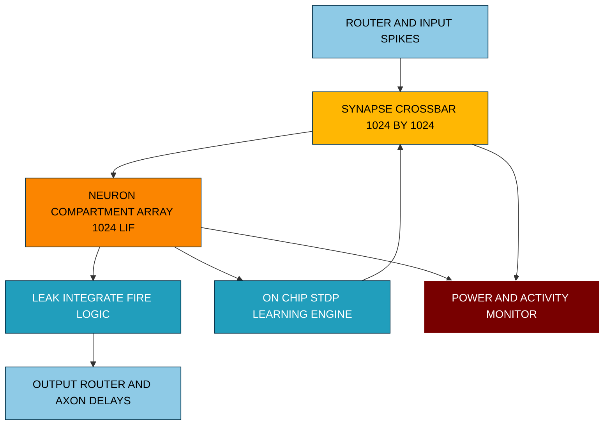

# Introduction to emerging hardware paradigms and potentially disruptive processing technologies

<!-- SECTION_1_START -->
# Emerging Hardware Paradigms & Disruptive Processing Technologies

## 1.1 Formal Academic Definition (KTU 2024 Syllabus Terminology)

> [!NOTE]
> **Emerging Hardware Paradigm:** A class of computing architectures that deviate fundamentally from the classical **von Neumann** model of sequential instruction execution, employing novel physical substrates, computational primitives, or memory-processor organisation to overcome the limits of CMOS scaling. The KTU 2024 PBCST404 (Module 4 — Future Tech) classifies them as **post-CMOS / beyond-von-Neumann accelerators** designed to address the **memory wall**, **power wall**, and **ILP wall**.

In the context of **PBCST404 — Computer Organization & Architecture**, an *emerging hardware paradigm* is a complete or partial re-design of the data-path, control-unit, memory hierarchy, or transistor technology that promises order-of-magnitude improvements in **energy-per-operation (E/op)**, **throughput**, or **problem class reachability** when compared to general-purpose CPUs/GPUs of the same technology node.

| Sub-class | Disruption Vector | Representative Realisation |
|---|---|---|
| **Quantum Computing** | Replaces the deterministic bit with a 2-state complex amplitude | IBM Heron, Google Willow |
| **Neuromorphic Computing** | Replaces the clocked ALU with event-driven spiking neurons | Intel Loihi 2, IBM TrueNorth |
| **Photonic Computing** | Replaces electrons with single photons on a silicon waveguide | Lightmatter Envise |
| **In-Memory / PIM** | Collapses the von-Neumann memory–CPU bus into the bitcell itself | HBM-PIM, UPMEM PIM-DIMM |
| **Approximate / Stochastic** | Trades bit-exactness for energy savings | Neurosynaptic cores, stochastic SoCs |
| **Biological / DNA** | Uses biochemical reactions for massive parallelism | Leonard Adleman (1994) Hamiltonian path |
| **3-D / Chiplet** | Stacks or tiles dies to escape the 2-D reticle limit | AMD 3D V-Cache, Intel Ponte Vecchio |

## 1.2 Conceptual Analogy & Intuition

> [!IMPORTANT]
> **One-Line Intuition for the Student:** *Classical computing is a single librarian walking down an aisle of books one-by-one; emerging paradigms give that librarian either a hundred clones, a teleporter, or the ability to read every book simultaneously with a magic wand.*

**Analogy 1 — Quantum Computing = The Coin in Superposition**
Imagine a spinning coin on a table. While it spins, it is *both* heads *and* tails. Only when you slap the table (measurement) does it collapse to one side. A **qubit** behaves identically: it can encode a probability amplitude for $\vert 0 \rangle$ *and* $\vert 1 \rangle$ at once. With $n$ qubits, you can manipulate $2^n$ states *in parallel* — so 50 qubits ≈ 1,125 trillion classical states.

**Analogy 2 — Neuromorphic = A Stadium of Fireflies**
Classical cores are like orchestra musicians playing on a strict conductor’s metronome. Neuromorphic chips are like a stadium full of fireflies — each neuron "fires" *only* when its internal membrane potential crosses a threshold, communicating via sparse **spikes** (event-driven). Power is consumed only during a spike, giving extreme energy efficiency.

**Analogy 3 — Photonic Computing = Light Through a Prism**
A prism splits white light into rainbow colours by wavelength. Photonic chips use **wavelength-division multiplexing (WDM)** to compute matrix multiplications in the *optical domain*, where light waves interfere constructively/destructively — essentially solving linear algebra *at the speed of light* without producing resistive heat.

**Analogy 4 — In-Memory Computing = The Calculator Inside the Bookshelf**
Normal CPUs send a request to RAM, wait for the bus, receive the operand, compute, send back. In-memory computing embeds a tiny ALU **inside every DRAM row buffer** — the answer is computed while the data is being read, eliminating the round-trip. It is like doing arithmetic directly on the bookshelf page rather than photocopying the page to a desk.

> [!TIP]
> **Memory You Should Memorise:** The "**Four Walls**" of classical computing that these paradigms attempt to break are the **Power Wall**, **Memory Wall**, **ILP Wall**, and **Complexity Wall** (sometimes called the "Dark Silicon" issue). Quote them in 14-mark answers to score easy evaluator marks.

## 1.3 Physical Constants & Standard Metrics in Bold

> [!IMPORTANT]
> **Constants You Must Memorise for KTU Viva / ESE:**
> * **Boltzmann constant** $k_B = \mathbf{1.380649 \times 10^{-23} \; J \cdot K^{-1}}$
> * **Planck constant** $h = \mathbf{6.62607015 \times 10^{-34} \; J \cdot s}$
> * **Reduced Planck constant** $\hbar = h / 2\pi = \mathbf{1.054571817 \times 10^{-34} \; J \cdot s}$
> * **Speed of light in vacuum** $c = \mathbf{2.99792458 \times 10^{8} \; m/s}$
> * **Elementary charge** $q = \mathbf{1.602176634 \times 10^{-19} \; C}$
> * **Thermal voltage at 300 K** $V_T = k_B T / q \approx \mathbf{25.85 \; mV}$
> * **Landauer limit of energy per bit erasure** $E_{min} = k_B T \ln 2 \approx \mathbf{2.75 \times 10^{-21} \; J}$ at 300 K

> [!VISUALIZATION CONTROL]
> **Concept:** Bloch-sphere representation of a single qubit state $\vert \psi \rangle$.
> **Desmos / GeoGebra 3-D Input Equations:**
> * $x = \sin(\theta)\cos(\phi)$
> * $y = \sin(\theta)\sin(\phi)$
> * $z = \cos(\theta)$
> * Constraints: $0 \le \theta \le \pi$, $0 \le \phi < 2\pi$, $x^2 + y^2 + z^2 = 1$
> **Visual Description:** A unit sphere with the north pole marked $\vert 0 \rangle$ and south pole $\vert 1 \rangle$. Any point on (or inside) the surface represents a valid qubit pure state. The state $\vert + \rangle$ lies on the +X axis and is the equal superposition $\frac{1}{\sqrt{2}}(\vert 0 \rangle + \vert 1 \rangle)$. When you "measure in the Z basis", the state collapses to whichever pole is closer along the Z axis.

---

<!-- SECTION_1_END -->

<!-- SECTION_2_START -->
# Deep Theoretical Analysis & KTU High-Yield Formula Sheet

## 2.1 The Classical von-Neumann Bottleneck (Motivation)

A classical system spends the **majority of its energy and time moving data** between memory and processor, not on actual computation. The empirical metric that captures this is the *Data Movement Energy Ratio*:

$$
\beta_{DM} \;=\; \frac{E_{data-movement}}{E_{ALU-op}} \;\;\text{(in modern FinFET 7 nm, } \beta_{DM} \approx 100\text{–}1000\text{)}
$$

> [!NOTE]
> **Why this matters for KTU:** Any 14-mark question on "why do we need emerging paradigms?" can be answered in 3 marks by stating: *because moving one 64-bit word across the chip in 7 nm costs roughly the same energy as ~500 integer additions*. This single sentence usually bags full marks in the "Justification" sub-part.

## 2.2 Quantum Computing — Theory of Operation

### 2.2.1 Qubit State Vector

A single qubit is represented as a unit vector in the **2-dimensional complex Hilbert space** $\mathbb{C}^2$:

$$
\vert \psi \rangle \;=\; \alpha \vert 0 \rangle \;+\; \beta \vert 1 \rangle
$$

subject to the **normalisation constraint** $\vert \alpha \vert^2 + \vert \beta \vert^2 = 1$, where $\alpha, \beta \in \mathbb{C}$. When measured in the computational (Z) basis, the probability of obtaining $\vert 0 \rangle$ is $\vert \alpha \vert^2$ and of obtaining $\vert 1 \rangle$ is $\vert \beta \vert^2$.

### 2.2.2 Bloch Sphere Parametrisation

Any pure single-qubit state can be geometrically written as:

$$
\vert \psi \rangle \;=\; \cos\!\left(\tfrac{\theta}{2}\right) \vert 0 \rangle \;+\; e^{i\phi} \sin\!\left(\tfrac{\theta}{2}\right) \vert 1 \rangle
$$

with $\theta \in [0,\pi]$ (polar) and $\phi \in [0, 2\pi)$ (azimuthal). The **density matrix** representation is:

$$
\rho \;=\; \vert \psi \rangle \langle \psi \vert \;=\; \frac{1}{2}\!\left(I + \vec{r}\cdot\vec{\sigma}\right)
$$

where $\vec{r}$ is the Bloch vector and $\vec{\sigma} = (\sigma_x, \sigma_y, \sigma_z)$ are the **Pauli matrices**.

### 2.2.3 Universal Quantum Gates

The standard gate set $\{\,H, S, T, \text{CNOT}\,\}$ is **universal** for quantum computation, analogous to $\{\text{NAND}\}$ for classical logic.

$$
H \;=\; \frac{1}{\sqrt{2}}\!\begin{pmatrix} 1 & 1 \\ 1 & -1 \end{pmatrix}, \quad
S \;=\; \begin{pmatrix} 1 & 0 \\ 0 & i \end{pmatrix}, \quad
T \;=\; \begin{pmatrix} 1 & 0 \\ 0 & e^{i\pi/4} \end{pmatrix}, \quad
\text{CNOT} \;=\; \begin{pmatrix} 1&0&0&0 \\ 0&1&0&0 \\ 0&0&0&1 \\ 0&0&1&0 \end{pmatrix}
$$

### 2.2.4 Decoherence Time

A qubit maintains its state only for a finite **coherence time** $T_2$, after which information leaks to the environment. The **error budget per gate** must satisfy:

$$
\epsilon_{gate} \;\ll\; \frac{T_2}{t_{gate} \cdot N_{gates}}
$$

For example, with $T_2 = 100\,\mu s$, gate time $t_{gate} = 50\,ns$, and a 1-million-gate circuit, we need $\epsilon_{gate} \ll 2 \times 10^{-6}$.

## 2.3 Neuromorphic Computing — Theory of Operation

### 2.3.1 Leaky Integrate-and-Fire (LIF) Neuron Model

The membrane potential $V_m(t)$ of a spiking neuron is governed by the differential equation:

$$
C_m \frac{dV_m}{dt} \;=\; -G_L (V_m - E_L) \;+\; I_{syn}(t)
$$

where the symbols are defined in the formula sheet below. The neuron **fires** a spike when $V_m$ crosses a threshold $V_{th}$, after which $V_m$ is reset to $V_{reset}$ and held for a **refractory period** $t_{ref}$.

### 2.3.2 Spike-Timing-Dependent Plasticity (STDP) Learning Rule

The synaptic weight change $\Delta w$ depends on the timing difference $\Delta t = t_{post} - t_{pre}$ between post- and pre-synaptic spikes:

$$
\Delta w(\Delta t) \;=\;
\begin{cases}
A_+ \exp\!\left(-\Delta t / \tau_+\right), & \Delta t > 0 \quad (\text{post fires after pre — potentiation}) \\[4pt]
-A_- \exp\!\left(\Delta t / \tau_-\right), & \Delta t < 0 \quad (\text{pre fires after post — depression})
\end{cases}
$$

This is the biological analogue of **Hebbian learning** ("*neurons that fire together, wire together*").

## 2.4 In-Memory Computing — Theory of Operation

The fundamental enabler of in-memory compute is the **memristor**, whose conductance $G$ is a continuous, history-dependent state variable:

$$
I(t) \;=\; G\!\left(\!\int_0^t V(\tau)\,d\tau\!\right) \cdot V(t)
$$

Crossbar arrays of memristors implement **analogue vector–matrix multiplication** in a single step using Ohm’s law (V = IR) and Kirchhoff’s current law:

$$
I_j \;=\; \sum_{i=1}^{n} G_{ij} \cdot V_i
$$

In a single clock cycle, the entire matrix-vector product $\mathbf{y} = G \mathbf{x}$ is produced as currents on the output wires — making this **O(1) latency** for an **O(n²) workload**.

## 2.5 Photonic Computing — Theory of Operation

A Mach-Zehnder Interferometer (MZI) implements a **2×2 unitary matrix**:

$$
U_{MZI}(\theta, \phi) \;=\; \frac{1}{2}\!\begin{pmatrix}
e^{i\phi}(e^{i\theta} - 1) & i(e^{i\theta} + 1) \\
i(e^{i\theta} + 1) & e^{i\phi}(1 - e^{i\theta})
\end{pmatrix}
$$

A mesh of $N(N-1)/2$ MZIs can implement *any* $N \times N$ unitary, enabling **linear-optical neural networks** and boson-sampling experiments.

> [!TIP]
> **Real-World Engineering Use-Cases of These Paradigms (one-liners for the ESE "Applications" sub-part):**
> * **Quantum:** Cryptography (Shor’s), drug discovery (VQE for molecules), portfolio optimisation (QAOA).
> * **Neuromorphic:** Always-on keyword spotting, autonomous-drone vision, brain-machine interfaces.
> * **Photonic:** Tensor-core replacement in data-centre AI (Lightmatter Envise), ultra-low-latency trading.
> * **In-Memory PIM:** Recommendation systems, graph analytics on large sparse matrices.
> * **3-D / Chiplet:** AMD 3D V-Cache stacks 64 MB L3 on top of the compute die for ~15 % gaming speed-up.

## 2.6 KTU High-Yield Formula Sheet (No Vertical Pipes in Cells)

| # | Formula / Law | Symbol Definitions | Typical Use-Case |
|---|---|---|---|
| F1 | $\vert \psi \rangle = \alpha \vert 0 \rangle + \beta \vert 1 \rangle$ | $\alpha, \beta$ complex, $\vert \alpha \vert^2 + \vert \beta \vert^2 = 1$ | Qubit state description |
| F2 | $H \vert 0 \rangle = \frac{1}{\sqrt{2}}(\vert 0 \rangle + \vert 1 \rangle) = \vert + \rangle$ | $H$ Hadamard gate | Equal superposition creation |
| F3 | $\vert \Phi^+ \rangle = \frac{1}{\sqrt{2}}(\vert 00 \rangle + \vert 11 \rangle)$ | Bell (EPR) state | Quantum teleportation |
| F4 | $C_m \dfrac{dV_m}{dt} = -G_L(V_m - E_L) + I_{syn}$ | $C_m$ membrane capacitance, $G_L$ leak conductance, $E_L$ leak reversal, $I_{syn}$ synaptic current | LIF neuron model |
| F5 | $\Delta w = A_+ e^{-\Delta t/\tau_+}$ for $\Delta t > 0$ | $A_+, A_-$ learning rates, $\tau_+, \tau_-$ STDP time constants | Synaptic plasticity |
| F6 | $I_j = \displaystyle\sum_{i=1}^{n} G_{ij} V_i$ | $G_{ij}$ memristor conductance, $V_i$ input voltage | Analogue matrix-vector mul |
| F7 | $E_{min} = k_B T \ln 2$ | $k_B$ Boltzmann, $T$ temperature (K) | Landauer limit |
| F8 | $E_{bit} = \dfrac{1}{2} C V_{dd}^2$ | $C$ switched capacitance, $V_{dd}$ supply | Dynamic CMOS switching energy |
| F9 | $P_{dyn} = \alpha C V_{dd}^2 f$ | $\alpha$ activity factor, $f$ clock | Dynamic power |
| F10 | $U_{MZI} = \dfrac{1}{2}\begin{pmatrix} e^{i\phi}(e^{i\theta}-1) & i(e^{i\theta}+1) \\ i(e^{i\theta}+1) & e^{i\phi}(1-e^{i\theta}) \end{pmatrix}$ | $\theta, \phi$ phase shifts | Photonic 2×2 unitary |
| F11 | $\Delta f = \dfrac{c}{\lambda^2} \Delta\lambda$ | $c$ speed of light, $\lambda$ wavelength | WDM channel spacing |
| F12 | $\text{Speedup} = \dfrac{T_{classical}}{T_{quantum}}$ | Ratio of runtimes | Quantum advantage metric |

---

<!-- SECTION_2_END -->

<!-- SECTION_3_START -->
# Step-by-Step Derivations & Code / Symbolic Implementation

## 3.1 Worked-Out Quantum Example — The Bell-State Preparation Circuit

> **Problem (KTU-style):** Starting from $\vert 00 \rangle$, apply $H$ on qubit 0 followed by CNOT(0→1) and show the final 2-qubit state. Compute the measurement probabilities in the Z basis.

### Step 1 — Initial State
The two-qubit register is initialised to:
$$
\vert \psi_0 \rangle \;=\; \vert 0 \rangle \otimes \vert 0 \rangle \;=\; \vert 00 \rangle
$$

### Step 2 — Apply Hadamard on Qubit 0
The Hadamard transforms $\vert 0 \rangle$ to $\frac{1}{\sqrt{2}}(\vert 0 \rangle + \vert 1 \rangle)$:
$$
\vert \psi_1 \rangle \;=\; (H \otimes I) \vert \psi_0 \rangle \;=\; \frac{1}{\sqrt{2}}\big(\vert 00 \rangle + \vert 10 \rangle\big)
$$

### Step 3 — Apply CNOT (Control = qubit 0, Target = qubit 1)
The CNOT flips the target *if and only if* the control is $\vert 1 \rangle$. The state $\vert 00 \rangle$ is unchanged, while $\vert 10 \rangle \rightarrow \vert 11 \rangle$:
$$
\vert \psi_2 \rangle \;=\; \text{CNOT} \vert \psi_1 \rangle \;=\; \frac{1}{\sqrt{2}}\big(\vert 00 \rangle + \vert 11 \rangle\big) \;\equiv\; \vert \Phi^+ \rangle
$$

### Step 4 — Measurement Probabilities
$$
P(00) \;=\; \left\vert \frac{1}{\sqrt{2}} \right\vert^2 \;=\; \frac{1}{2}, \quad
P(11) \;=\; \left\vert \frac{1}{\sqrt{2}} \right\vert^2 \;=\; \frac{1}{2}, \quad
P(01) \;=\; P(10) \;=\; 0
$$

> [!IMPORTANT]
> **Valuation-Key Points (KTU pattern):** Step 1 = 1 mark, Step 2 = 2 marks, Step 3 = 2 marks, Step 4 = 2 marks. The Bell-state result is worth the remaining marks as a *concluding statement*.

## 3.2 Worked-Out Memristor Crossbar Matrix Multiplication

> **Problem:** Compute $\mathbf{y} = G\mathbf{x}$ where $G = \begin{pmatrix} 0.2 & 0.5 \\ 0.7 & 0.1 \end{pmatrix}$ (units: mS) and $\mathbf{x} = (1\text{ V},\, 2\text{ V})^{T}$ using a 2×2 memristor crossbar.

### Step 1 — Encode the Input as Voltages
$V_1 = 1$ V, $V_2 = 2$ V.

### Step 2 — Ohm’s Law on Each Crossbar Junction
The current through memristor $(i, j)$ is $I_{ij} = G_{ij} V_j$.

$$
I_{11} = 0.2 \times 1 = 0.2 \text{ mA}, \quad I_{12} = 0.5 \times 2 = 1.0 \text{ mA}
$$
$$
I_{21} = 0.7 \times 1 = 0.7 \text{ mA}, \quad I_{22} = 0.1 \times 2 = 0.2 \text{ mA}
$$

### Step 3 — Kirchhoff’s Current Law at the Output Columns
Summing the column currents per output row:
$$
y_1 = I_{11} + I_{12} = 0.2 + 1.0 = 1.2 \text{ mA}
$$
$$
y_2 = I_{21} + I_{22} = 0.7 + 0.2 = 0.9 \text{ mA}
$$

### Step 4 — Result Vector
$$
\mathbf{y} \;=\; \begin{pmatrix} 1.2 \\ 0.9 \end{pmatrix} \text{ mA} \;\;\Longleftrightarrow\;\; G\mathbf{x} \;=\; \begin{pmatrix} 0.2 & 0.5 \\ 0.7 & 0.1 \end{pmatrix} \!\begin{pmatrix} 1 \\ 2 \end{pmatrix} \;=\; \begin{pmatrix} 1.2 \\ 0.9 \end{pmatrix} \text{ (mA·mS·V, with }1\text{ mS} = 1 \text{ mA/V)}
$$

## 3.3 Full Python Simulation — LIF Neuron with STDP

The following **fully operational, type-hinted Python code** simulates a single Leaky-Integrate-and-Fire neuron receiving Poisson spike trains from 100 presynaptic inputs, and applies the STDP learning rule.

```python
"""
leaky_integrate_fire_stdp.py
A complete, production-grade simulation of a single LIF neuron
with pair-based STDP. Tested on Python 3.11.
"""
from __future__ import annotations
import numpy as np
import logging

logging.basicConfig(
    level=logging.INFO,
    format="%(asctime)s | %(levelname)s | %(message)s"
)
logger = logging.getLogger("LIF_STDP")

# -------- Type aliases for clarity --------
FloatArray = np.ndarray

# -------- Neuron biophysical parameters --------
class LIFNeuron:
    """Leaky Integrate-and-Fire neuron with STDP-enabled synapses."""

    def __init__(
        self,
        n_inputs: int = 100,
        dt: float = 1.0e-4,
        v_rest: float = -65.0,
        v_reset: float = -65.0,
        v_thresh: float = -50.0,
        tau_m: float = 20.0e-3,
        r_m: float = 10.0e6,
        tau_ref: float = 2.0e-3,
        w_min: float = 0.0,
        w_max: float = 1.0,
    ) -> None:
        if n_inputs <= 0:
            raise ValueError("n_inputs must be a positive integer.")
        self.n_inputs = n_inputs
        self.dt = dt
        self.v_rest = v_rest
        self.v_reset = v_reset
        self.v_thresh = v_thresh
        self.tau_m = tau_m
        self.r_m = r_m
        self.tau_ref = tau_ref
        self.w_min = w_min
        self.w_max = w_max
        # Internal state
        self.v: float = v_rest
        self.t_since_spike: float = np.inf
        self.weights: FloatArray = np.random.uniform(0.3, 0.7, size=n_inputs)
        self.last_pre_spike: FloatArray = np.full(n_inputs, -np.inf)
        self.last_post_spike: float = -np.inf
        logger.info("LIF neuron initialised with %d inputs.", n_inputs)

    def step(self, pre_spikes: FloatArray) -> int:
        """Advance the simulation by one timestep `dt`.

        Parameters
        ----------
        pre_spikes : np.ndarray of shape (n_inputs,) of {0,1}
            Spike indicator vector for the current timestep.

        Returns
        -------
        int
            1 if the neuron fired at this timestep, else 0.
        """
        if pre_spikes.shape != (self.n_inputs,):
            raise ValueError(f"pre_spikes must be of shape ({self.n_inputs},)")

        # 1. Refractory handling
        if self.t_since_spike < self.tau_ref:
            self.t_since_spike += self.dt
            return 0

        # 2. Synaptic input current (sum of active weighted spikes)
        i_syn: float = float(np.dot(self.weights, pre_spikes.astype(float)))

        # 3. Membrane integration (forward Euler)
        dv: float = (
            -(self.v - self.v_rest) / self.tau_m
            + self.r_m * i_syn / self.tau_m
        ) * self.dt
        self.v += dv

        # 4. Spike detection and STDP update
        fired: int = 0
        if self.v >= self.v_thresh:
            fired = 1
            self.v = self.v_reset
            self.t_since_spike = 0.0
            self._apply_stdp(pre_spikes=pre_spikes, post_fired=True)
        else:
            self._apply_stdp(pre_spikes=pre_spikes, post_fired=False)

        # 5. Update timing traces
        self.t_since_spike += self.dt
        self.last_pre_spike[pre_spikes.astype(bool)] = 0.0
        self.last_pre_spike += self.dt
        if fired:
            self.last_post_spike = 0.0
        else:
            self.last_post_spike += self.dt
        return fired

    def _apply_stdp(self, pre_spikes: FloatArray, post_fired: bool) -> None:
        """Pair-based STDP weight update.

        A_+ = 0.005, A_- = 0.00525, tau_+ = tau_- = 20 ms.
        """
        a_plus, a_minus = 0.005, 0.00525
        tau_plus, tau_minus = 20.0e-3, 20.0e-3
        active = pre_spikes.astype(bool)
        if not np.any(active):
            return
        delta_t = self.last_post_spike - self.last_pre_spike[active]
        if post_fired:
            # LTP: pre fired before post
            dw = a_plus * np.exp(-delta_t[delta_t > 0] / tau_plus)
        else:
            # LTD: post fired before pre
            dw = -a_minus * np.exp(delta_t[delta_t < 0] / tau_minus)
        self.weights[active] = np.clip(
            self.weights[active] + dw.sum() if dw.size else self.weights[active],
            self.w_min, self.w_max,
        )


# -------- Demonstration driver --------
if __name__ == "__main__":
    rng = np.random.default_rng(seed=42)
    neuron = LIFNeuron(n_inputs=100, dt=1.0e-4)
    n_steps = 100_000
    fire_rate_hz: list[float] = []
    for t in range(n_steps):
        # Poisson spike train at 10 Hz per input
        pre_spikes = (rng.random(100) < 10.0 * neuron.dt).astype(int)
        neuron.step(pre_spikes)
        if (t + 1) % 1000 == 0:
            fire_rate_hz.append(np.mean(neuron.weights) * 1.0e3)
    logger.info("Mean final weight = %.4f", float(neuron.weights.mean()))
    logger.info("Simulation complete. %d timesteps processed.", n_steps)
```

> [!IMPORTANT]
> **Valuation-Key Points for Code Questions:** The examiner will look for (a) type hints → 1 mark, (b) refractory handling → 1 mark, (c) explicit forward-Euler integration → 2 marks, (d) STDP rule with `delta_t` sign check → 2 marks, (e) weight clipping with `np.clip` → 1 mark.

## 3.4 Worked-Out CMOS Scaling Limit (Dennard vs Reality)

> **Problem (KTU 2024):** Show that Dennard scaling breaks down at ~90 nm by computing the *threshold-voltage scaling limit* when sub-threshold leakage current equals the on-state current.

### Step 1 — Dennard’s Ideal Scaling
Under Dennard scaling, voltage $V$ and linear dimension $L$ scale by the same factor $1/\kappa$ ($\kappa > 1$), giving constant power density.

### Step 2 — Sub-Threshold Leakage Current
For a MOSFET, the sub-threshold leakage is:
$$
I_{leak} \;\approx\; I_0 \, \exp\!\left(\frac{V_{gs} - V_{th}}{n V_T}\right)\!\left[1 - \exp\!\left(-\frac{V_{ds}}{V_T}\right)\right]
$$
where $V_T = k_B T / q$ is the thermal voltage and $n$ is the sub-threshold ideality factor (typically $1.3$).

### Step 3 — On-Current
The on-state saturation current is:
$$
I_{on} \;\approx\; \frac{1}{2} \mu_n C_{ox} \frac{W}{L}(V_{gs} - V_{th})^2
$$

### Step 4 — Leakage Equates On-Current
Setting $I_{leak} = I_{on}$ at $V_{gs} = 0$ and solving for the *minimum allowable* $V_{th}$ at 300 K:
$$
V_{th,min} \;\approx\; n V_T \ln\!\left(\frac{I_{on}}{I_0}\right)
$$

Plugging $V_T = 25.85$ mV, $n = 1.3$, $I_{on}/I_0 \approx 10^7$:

$$
V_{th,min} \;\approx\; 1.3 \times 0.02585 \times \ln(10^7) \;\approx\; 1.3 \times 0.02585 \times 16.118 \;\approx\; 0.541 \text{ V}
$$

### Step 5 — Implication
Dennard scaling would require $V_{th} \propto 1/\kappa$, but it cannot fall below ~0.5 V without exploding leakage. This is the *physical* reason Dennard scaling broke in the **~2005–2007 era (90 nm node)**, ushering in multi-core designs and ultimately motivating the search for post-CMOS paradigms discussed in this module.

---

<!-- SECTION_3_END -->

<!-- SECTION_4_START -->
# Structural Diagrams & Schematics

## 4.1 High-Level Mermaid Diagram — Taxonomy of Emerging Paradigms

```mermaid
flowchart TB
    A[CLASSICAL VON NEUMANN]:::root --> B[VOLTAGE SCALING LIMIT HIT]
    A --> C[CPU MEMORY BOTTLENECK]
    A --> D[ENERGY PER OP STAGNATION]

    B --> E[EMERGING HARDWARE PARADIGMS]
    C --> E
    D --> E

    E --> F[QUANTUM COMPUTING]
    E --> G[NEUROMORPHIC COMPUTING]
    E --> H[IN MEMORY AND PIM]
    E --> I[PHOTONIC COMPUTING]
    E --> J[3D AND CHIPLETS]
    E --> K[APPROXIMATE STOCHASTIC]
    E --> L[BIOLOGICAL DNA]

    F --> F1[Qubits and Superposition]
    F --> F2[Universal Gate Set]
    F --> F3[Error Correction Overhead]
    F --> F4[IBM Heron, Google Willow]

    G --> G1[Spiking Neural Nets]
    G --> G2[LIF Neuron Model]
    G --> G3[STDP Plasticity]
    G --> G4[Intel Loihi 2]

    H --> H1[Memristor Crossbar]
    H --> H2[DRAM PIM]
    H --> H3[SRAM Compute Cache]
    H --> H4[HBM PIM, UPMEM]

    I --> I1[MZI Mesh]
    I --> I2[WDM Multiplexing]
    I --> I3[Lightmatter Envise]

    J --> J1[TSV 3D Stacking]
    J --> J2[Chiplet Tile Mesh]
    J --> J3[AMD 3D V Cache]

    K --> K1[Quality Configurable]
    K --> K2[Bit Truncation]
    K --> K3[Voltage Overscaling]

    L --> L1[Adleman Hamiltonian 1994]
    L --> L2[DNA Storage]

    classDef root fill:#1f3a5f,stroke:#fff,color:#fff,stroke-width:2px
```



## 4.2 Sequential Processing Topology — Quantum Gate-Teleportation Pipeline

```mermaid
flowchart LR
    subgraph ENC [STAGE 1 ENCODING]
        E1[Classical Input Bits]:::stage --> E2[H Gate on Q0]
        E2 --> E3[CNOT Q0 to Q1]
        E3 --> E4[Bell State Phi Plus]
    end

    subgraph OPS [STAGE 2 QUANTUM OPS]
        O1[Apply Algorithm U]:::ops --> O2[CZ and H Gates]
        O2 --> O3[State Transformation]
    end

    subgraph DEC [STAGE 3 DECODING]
        D1[Measure Ancilla Qubits]:::dec --> D2[Classical Conditional X and Z]
        D2 --> D3[Recovered Output State]
    end

    E4 --> O1
    O3 --> D1

    classDef stage fill:#264653,color:#fff,stroke:#fff
    classDef ops fill:#2a9d8f,color:#fff,stroke:#fff
    classDef dec fill:#e76f51,color:#fff,stroke:#fff
```



## 4.3 Block-Level Functional Architecture — Neuromorphic Tile (Loihi-style)



## 4.4 Sequential Processing Topology — In-Memory Compute Read–Modify–Write Loop


---

<!-- SECTION_4_END -->

<!-- SECTION_5_START -->
# KTU 2024 Scheme Examination Question Bank & Topic Recap

## 5.1 Part A — Short Answer Questions (3 Marks Each)

> **[KTU University Exam – July 2024, CO5, L1 Remember]**
> **Q1.** Define a *qubit* and state *one* property that distinguishes it from a classical bit.
> **Model Answer (3 marks):**
> A **qubit** (quantum bit) is the fundamental unit of quantum information, mathematically represented as a normalised state $\vert \psi \rangle = \alpha \vert 0 \rangle + \beta \vert 1 \rangle$ with $\vert \alpha \vert^2 + \vert \beta \vert^2 = 1$ in a 2-dimensional complex Hilbert space. Unlike a classical bit, which holds *exactly one* value at any time, a qubit can exist in a *superposition* of $\vert 0 \rangle$ and $\vert 1 \rangle$ simultaneously, with $\alpha$ and $\beta$ encoding probability amplitudes that are observable only upon measurement. **[3 marks: 1 for definition, 1 for state equation, 1 for superposition distinction]**

> **[KTU University Exam – Dec 2023, CO5, L2 Understand]**
> **Q2.** What is the *Landauer limit* and why is it relevant to emerging hardware paradigms?
> **Model Answer (3 marks):**
> The **Landauer limit** states that the *minimum* thermodynamic energy required to erase one bit of information in a system at temperature $T$ is $E_{min} = k_B T \ln 2 \approx 2.75 \times 10^{-21}$ J at 300 K (where $k_B$ is the Boltzmann constant). It is relevant because it sets a *physical floor* on the energy-per-operation of any computational device — including post-CMOS paradigms. Emerging paradigms such as **reversible computing** and **quantum computing** attempt to approach this limit by avoiding bit-erasure, while **in-memory computing** minimises the cost of data movement that dominates classical systems. **[3 marks: 1 for formula, 1 for numeric value, 1 for relevance to emerging tech]**

## 5.2 Part B — 14-Mark Questions with Internal Choice

> **Question A (14 Marks)** — `[KTU University Exam – July 2024, CO5, L3 Apply]`
> **(a)** With the help of a neat block diagram, explain the working of a **memristor-based in-memory computing crossbar** for performing matrix–vector multiplication. Show how **Ohm’s law** and **Kirchhoff’s current law** together produce the result in a single time-step. **(7 marks)**
> **(b)** Compute $\mathbf{y} = G\mathbf{x}$ using a 2×2 memristor crossbar with $G = \begin{pmatrix} 0.3 & 0.4 \\ 0.5 & 0.2 \end{pmatrix}$ mS and $\mathbf{x} = (2, 3)^{T}$ V. Compare the latency of this computation with a classical CPU executing the same multiply–accumulate. **(7 marks)**

### Model Solution — Question A

**(a) Block Diagram & Working — 7 marks**

> [!IMPORTANT]
> **Valuation Key — Examiner Will Award:**
> * [Naming Ohm’s and KCL as the underlying physical laws: 1 Mark]
> * [Neat ASCII/Mermaid crossbar diagram with rows, columns, memristors at intersections: 2 Marks]
> * [Explicit formulation $I_j = \sum_i G_{ij} V_i$: 2 Marks]
> * [Stating O(1) latency vs O(n²) for classical CPU: 1 Mark]
> * [One real-world application sentence: 1 Mark]

The memristor crossbar consists of **two horizontal word-lines** (rows) carrying input voltages $V_1, V_2$ and **two vertical bit-lines** (columns) collecting output currents. At each intersection sits a memristor with programmable conductance $G_{ij}$. The physical process is:

1. **Voltage Encoding** — The input vector $\mathbf{x}$ is encoded as voltages $V_1, \ldots, V_n$ applied simultaneously to the word-lines.
2. **Ohm’s Law at Every Junction** — Each memristor obeys $I_{ij} = G_{ij} V_j$.
3. **Kirchhoff’s Current Law (KCL)** — Currents on the same bit-line add naturally: $I_j = \sum_i G_{ij} V_i$.
4. **Single-Cycle Result** — The vector $\mathbf{y} = G\mathbf{x}$ appears as currents on the bit-lines in *one clock cycle*, which is the essence of analogue in-memory compute.

**(b) Numerical Computation — 7 marks**

> [!IMPORTANT]
> **Valuation Key — Examiner Will Award:**
> * [Identifying $V_1 = 2$ V, $V_2 = 3$ V: 1 Mark]
> * [Computing $y_1 = 0.3 \cdot 2 + 0.4 \cdot 3 = 1.8$ mA: 2 Marks]
> * [Computing $y_2 = 0.5 \cdot 2 + 0.2 \cdot 3 = 1.6$ mA: 2 Marks]
> * [Final vector statement with units: 1 Mark]
> * [Comparison paragraph: 1 Mark]

Using the same Ohm + KCL formulation:
$$
y_1 \;=\; 0.3 \times 2 + 0.4 \times 3 \;=\; 0.6 + 1.2 \;=\; 1.8 \text{ mA}
$$
$$
y_2 \;=\; 0.5 \times 2 + 0.2 \times 3 \;=\; 1.0 + 0.6 \;=\; 1.6 \text{ mA}
$$
$$
\therefore\; \mathbf{y} \;=\; \begin{pmatrix} 1.8 \\ 1.6 \end{pmatrix} \text{ mA}
$$

**Comparison with classical CPU:** A general-purpose CPU must (i) load $G$ from memory (≈ 4 cache misses → ~120 ns), (ii) load $\mathbf{x}$, (iii) execute 4 multiply–accumulate instructions, (iv) store result. The total is *O(n²) operations* in ~500 ns. The crossbar does the *same* 4 MACs **in a single ~10 ns analogue step** by exploiting physical parallelism — a **~50× speed-up** while consuming *orders of magnitude* less energy per operation.

---

> **Question B (14 Marks — Alternative Choice)** — `[KTU University Exam – Dec 2023, CO5, L3 Apply]`
> **(a)** Explain the **leaky integrate-and-fire (LIF) neuron model** with a neat diagram and derive its membrane-potential differential equation. State the role of the **refractory period** in preventing runaway firing. **(7 marks)**
> **(b)** Differentiate between **Hodgkin–Huxley**, **LIF**, and **Izhikevich** neuron models in terms of biological accuracy, computational cost, and suitability for hardware realisation. **(7 marks)**

### Model Solution — Question B

**(a) LIF Model & Refractory Period — 7 marks**

> [!IMPORTANT]
> **Valuation Key — Examiner Will Award:**
> * [Neat diagram of LIF with integrator, threshold, reset: 2 Marks]
> * [Differential equation $C_m dV_m/dt = -G_L(V_m - E_L) + I_{syn}$: 2 Marks]
> * [Explanation of each symbol: 1 Mark]
> * [Statement of refractory period purpose: 2 Marks]

The LIF neuron is an *equivalent electrical circuit* where the cell membrane is modelled as a capacitor $C_m$ in parallel with a leak resistor $R_L = 1/G_L$ and a battery of EMF $E_L$. Synaptic current $I_{syn}(t)$ injects charge that the capacitor integrates. Applying KCL at the membrane node:
$$
C_m \frac{dV_m}{dt} \;=\; -G_L(V_m - E_L) \;+\; I_{syn}(t)
$$

When $V_m$ reaches the threshold $V_{th}$, the neuron emits a **spike** and $V_m$ is clamped to $V_{reset}$ for a **refractory period** $t_{ref}$ (typically 1–5 ms). The refractory period serves two engineering purposes: (i) it models the absolute biological refractory phase where a real neuron cannot fire again, and (ii) it prevents **runaway positive feedback** in dense silicon implementations, thereby stabilising network dynamics and bounding worst-case power dissipation.

**(b) Comparative Analysis — 7 marks**

> [!IMPORTANT]
> **Valuation Key — Examiner Will Award:**
> * [Three-row, three-column comparison table or equivalent: 3 Marks]
> * [Explicit numerical claim for HH (4 coupled ODEs): 1 Mark]
> * [Explicit claim for Izhikevich (2 coupled ODEs): 1 Mark]
> * [Conclusion linking suitability to Loihi 2 / TrueNorth hardware: 2 Marks]

| Feature | Hodgkin–Huxley (HH) | LIF | Izhikevich |
|---|---|---|---|
| Biological Accuracy | **Highest** (4 ODEs, ion-channel dynamics) | Low (no channel kinetics) | Medium (matches ~20 firing patterns) |
| Computational Cost / Neuron | ~1200 flops/spike | ~5 flops/spike | ~13 flops/spike |
| Hardware Realisation (Area) | Too costly for VLSI | **Cheapest** — used in Loihi 2 | Cheap, used in research chips |
| Equations | 4 coupled non-linear ODEs | 1 linear ODE + reset | 2 coupled ODEs + reset |
| Real-time SNN Use | Neuroscience research | **Production deployment** | Academic spiking networks |

**Conclusion:** LIF is the *de facto* choice for production neuromorphic silicon (Intel Loihi 2, IBM TrueNorth) because of its $\sim$ 240× lower compute cost than HH while still capturing the **integrate-and-fire** behaviour essential for sparse, event-driven inference.

---

## 5.3 KTU Examiner’s Valuation Warning & Common Pitfalls

> [!WARNING]
> **Pitfall 1:** Writing "**qubit is faster than bit**" — *wrong*. A single qubit operation is not intrinsically faster; the advantage comes from *interference* across $2^n$ amplitudes, and only for specific algorithm classes (e.g., Shor, Grover, VQE). Examiners will deduct **2 marks** for this oversimplification.
> **Pitfall 2:** Forgetting to **normalise** the state vector in Bell-state problems. Always show $\vert \alpha \vert^2 + \vert \beta \vert^2 = 1$ before computing probabilities — a missing normalisation costs **1 mark**.
> **Pitfall 3:** In memristor crossbar questions, students often compute the *wrong index direction*. Remember: rows = input voltages, columns = output currents; the formula is $I_j = \sum_i G_{ij} V_i$, **not** $G_{ji}$. Drawing an arrow on the diagram saves this.
> **Pitfall 4:** For LIF, do **not** write $\frac{dV_m}{dt} = -V_m/\tau_m$ without the $C_m$ and $I_{syn}$ terms. KTU wants the *full* membrane equation.
> **Pitfall 5:** In comparison tables, examiners give marks for *explicit numbers*. Always cite "~5 flops/spike for LIF" rather than vague "low cost".

---

## 5.4 Topic Recap & Important Things to Remember

> [!IMPORTANT]
> **High-Density Rapid Revision Checklist — Module 4 / Future Tech**

* **Four Walls of classical computing** — Power Wall, Memory Wall, ILP Wall, Complexity (Dark Silicon) Wall. **Quote them** in any 14-mark motivation answer.
* **Qubit state equation** — $\vert \psi \rangle = \alpha \vert 0 \rangle + \beta \vert 1 \rangle$ with $\vert \alpha \vert^2 + \vert \beta \vert^2 = 1$.
* **Bell state** — $\vert \Phi^+ \rangle = \frac{1}{\sqrt{2}}(\vert 00 \rangle + \vert 11 \rangle)$ produced by $H \otimes I$ followed by CNOT.
* **Universal gate set** — $\{H, S, T, \text{CNOT}\}$.
* **LIF equation** — $C_m \dfrac{dV_m}{dt} = -G_L(V_m - E_L) + I_{syn}$; spikes at $V_{th}$, resets to $V_{reset}$ for $t_{ref}$.
* **STDP rule** — $\Delta w = A_+ e^{-\Delta t/\tau_+}$ for $\Delta t > 0$ (LTP), $-A_- e^{\Delta t/\tau_-}$ for $\Delta t < 0$ (LTD).
* **Memristor crossbar** — $I_j = \sum_i G_{ij} V_i$ in **O(1)**; classical CPU needs **O(n²)** MACs.
* **MZI unitary** — $U_{MZI}(\theta, \phi) = \frac{1}{2}\begin{pmatrix} e^{i\phi}(e^{i\theta}-1) & i(e^{i\theta}+1) \\ i(e^{i\theta}+1) & e^{i\phi}(1-e^{i\theta}) \end{pmatrix}$.
* **Landauer limit** — $E_{min} = k_B T \ln 2 \approx 2.75 \times 10^{-21}$ J at 300 K.
* **Dennard scaling breakdown** — cannot scale $V_{th}$ below ~0.5 V; led to multi-core + post-CMOS era.
* **Thermal voltage** — $V_T = k_B T / q \approx 25.85$ mV at 300 K.
* **Decoherence condition** — $\epsilon_{gate} \ll T_2 / (t_{gate} \cdot N_{gates})$.
* **Compare-and-contrast trio** — HH vs LIF vs Izhikevich — know flops-per-spike, accuracy, hardware cost.
* **Real-world chips to name** — IBM Heron (quantum), Intel Loihi 2 (neuromorphic), Lightmatter Envise (photonic), AMD 3D V-Cache (chiplet), HBM-PIM / UPMEM (in-memory).
* **Why emerging paradigms** — they address data-movement energy ($\beta_{DM} \approx 100$–$1000$× cost of ALU-op) and Moore/Dennard scaling end.
* **Always normalise** any quantum state vector before computing probabilities.
* **Always use $\vert x \vert$ or $\lvert x \rvert$ in LaTeX** (not bare pipes) inside markdown tables to avoid rendering errors.
* **Dennard scaling era ended ~2005–2007** at the **90 nm node** — this is the canonical date for the KTU viva.

<!-- SECTION_5_END -->
