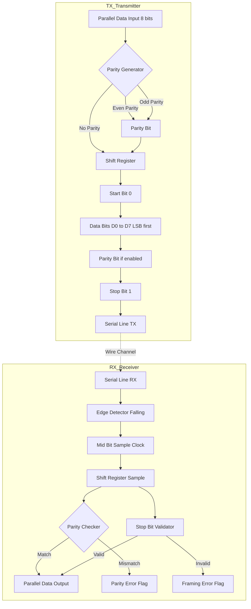
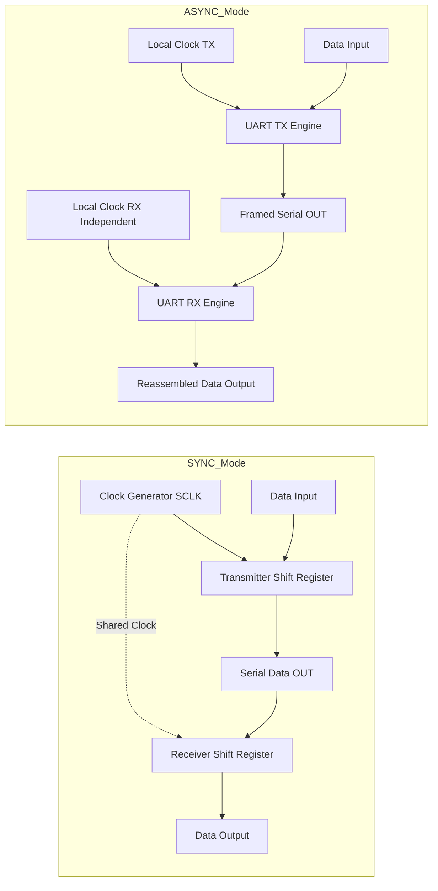
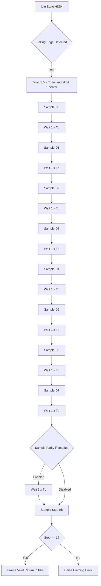

# Serial Communication: Synchronous vs Asynchronous transfers, UART synchronization mechanics

<!-- SECTION_1_START -->
# Serial Communication: Synchronous vs Asynchronous Transfers & UART Synchronization Mechanics

## 1.1 Formal Academic Definition

**Serial Communication** is a data transmission method in which bits of a word are transmitted sequentially over a single communication channel (wire or wireless link), one after another, as opposed to parallel communication where multiple bits travel simultaneously across multiple wires.

According to the KTU 2024 Scheme syllabus (PBCST404 — Module 4), serial communication is classified into two principal transfer modes based on **clocking and timing control**:

> [!IMPORTANT]
> **Synchronous Serial Transfer** — Data bits are transmitted in a continuous, clock-synchronized stream. A dedicated **clock line (CLK)** accompanies the data line, allowing the receiver to sample each bit at precise, pre-agreed clock edges.
>
> **Asynchronous Serial Transfer** — Data is transmitted in **discrete, self-contained frames**. There is **no shared clock line**. Instead, timing is reconstructed at the receiver using a **locally generated baud-rate clock** synchronized at the start of each frame.

The hardware engine that implements asynchronous serial I/O is called the **UART (Universal Asynchronous Receiver/Transmitter)**. Its synchronous counterpart is the **USART (Universal Synchronous/Asynchronous Receiver/Transmitter)**.

## 1.2 Conceptual Analogy & Intuitive Overview

Think of two people trying to communicate across a noisy room:

- **Synchronous Communication (with a clock)** is like two people **dancing to the same drumbeat**. A metronome (the clock signal) ticks steadily, and every move (bit) happens precisely on each tick. Both partners know exactly when to expect the next move because the beat is shared.

- **Asynchronous Communication (no clock)** is like two people passing **written notes on slips of paper**, where each note has a **"START" flag** at the beginning and an **"END" flag** at the conclusion. The reader, upon seeing the START flag, immediately begins reading the contents at a pre-agreed reading speed. If both agreed beforehand to read at "5 words per second," synchronization is achieved frame-by-frame without any continuous beat.

> [!NOTE]
> **Key Insight for KTU Examiners**: In asynchronous transmission, synchronization is **per-frame**, not **per-bit**. This is why UART requires careful **baud-rate matching** (typically within ±2–3% tolerance) between transmitter and receiver clocks.

## 1.3 The UART Device — System-Level View

The **UART** is a hardware peripheral (or software emulated block) that performs:
1. **Parallel-to-Serial conversion** at the transmitter end.
2. **Serial-to-Parallel conversion** at the receiver end.
3. **Frame generation** (inserting start, parity, and stop bits).
4. **Frame parsing** (detecting start bit and extracting payload).
5. **Optional error detection** (parity, framing, overrun errors).

> [!VISUALIZATION CONTROL]
> **Concept:** UART Asynchronous Frame Waveform (Idle → Start → Data → Parity → Stop)
> **Desmos / GeoGebra Input Equations (piecewise step function for one frame):**
>
> * $f(t) = 1$ (Idle HIGH) for $t < 0$
> * $f(t) = 0$ (Start bit) for $0 \leq t < T_b$
> * $f(t) = D_0$ for $T_b \leq t < 2T_b$
> * $f(t) = D_1$ for $2T_b \leq t < 3T_b$
> * $\vdots$
> * $f(t) = D_7$ for $8T_b \leq t < 9T_b$
> * $f(t) = P$ (Parity) for $9T_b \leq t < 10T_b$
> * $f(t) = 1$ (Stop bit) for $10T_b \leq t < 11T_b$
> * $T_b = \dfrac{1}{\text{Baud Rate}}$
>
> **Visual Description:** A staircase-like waveform on a time axis. The line sits HIGH (logic 1) during idle, drops LOW for the start bit, then steps through LSB-to-MSB data bits, parity (if enabled), and rises back HIGH for the stop bit. The horizontal width of each step is $T_b$.

## 1.4 Physical Constants & Standard Metrics

| Parameter | Standard Value |
|---|---|
| Common Baud Rates | 300, 1200, 2400, 4800, **9600**, 19200, 38400, 57600, **115200** |
| Standard Data Bits | 5, 6, 7, **8** |
| Parity Options | None (N), Even (E), Odd (O) |
| Stop Bits | **1**, 1.5, 2 |
| RS-232 Voltage Levels | Logic 1 = **−3 V to −25 V**, Logic 0 = **+3 V to +25 V** |
| TTL UART Levels | Logic 1 = **+5 V (or 3.3 V)**, Logic 0 = **0 V** |
| Max Practical Cable Length (RS-232) | **15 meters** at 9600 baud |
<!-- SECTION_1_END -->

<!-- SECTION_2_START -->
# Deep Theoretical Analysis & KTU High-Yield Formula Sheet

## 2.1 Synchronous Serial Communication — Operational Mechanics

In **synchronous** mode, the transmitter shifts out data bits on one edge of the clock, and the receiver samples them on the **opposite edge** (typically the rising edge) of the same clock. Protocols such as **SPI (Serial Peripheral Interface)** and **I²C (Inter-Integrated Circuit)** are classic examples.

### Key Characteristics:
- A **dedicated clock line (SCLK / SCK)** is routed alongside the data line.
- Data is transmitted in **continuous blocks** (bursts), not individual frames.
- **Higher throughput** for the same baud rate because there are no start/stop bit overheads.
- Requires an **additional wire**, increasing pin count.
- Both ends must agree on clock polarity (CPOL) and clock phase (CPPHA) in protocols like SPI.

### Why It Works:
The receiver never has to "guess" when the next bit will arrive — the clock edge itself is the synchronization signal. This eliminates the per-frame overhead and allows very high data rates (tens of MHz in SPI).

## 2.2 Asynchronous Serial Communication — Operational Mechanics

In **asynchronous** mode, there is **no shared clock line**. Both transmitter and receiver operate on **independent local clocks**, each preset to the same nominal **baud rate**.

### Key Characteristics:
- Data is sent as **discrete frames**, each bounded by a **start bit (0)** and one or more **stop bits (1)**.
- The line idles HIGH (logic 1) between frames.
- The **falling edge** of the start bit triggers the receiver to begin sampling at the center of each subsequent bit period.
- **Lower pin count** (only TX and RX, plus ground) — ideal for long-distance and point-to-point links.
- Subject to **clock drift** — if the local clocks differ in frequency, samples drift and may cause **framing errors**.

### Why It Works:
The start bit provides a **one-time synchronization edge** for each frame. The receiver, upon detecting the high-to-low transition, waits for **half a bit period** (to land at the bit's center) and then samples every full bit period thereafter. This mid-bit sampling strategy provides maximum **noise margin** (half a bit time of tolerance on either side).

## 2.3 UART Frame Anatomy

A standard UART frame (e.g., the popular **8N1** configuration) contains:

$$\text{Frame} = \underbrace{S}_{\text{Start}} + \underbrace{D_0 D_1 D_2 D_3 D_4 D_5 D_6 D_7}_{\text{8 Data bits (LSB first)}} + \underbrace{P}_{\text{Parity (optional)}} + \underbrace{T}_{\text{Stop}}$$

- **Start bit (S):** Always **1 bit**, logic **0** (LOW). Signals the beginning of a frame.
- **Data bits (D0 to D7):** Usually **5 to 9 bits**, transmitted **LSB first** (this is a KTU-favorite trick question).
- **Parity bit (P):** **Even** or **Odd** parity for single-bit error detection. **Optional.**
- **Stop bit(s) (T):** **1, 1.5, or 2 bits**, logic **1** (HIGH). Ensures line returns to idle before next frame.

## 2.4 KTU High-Yield Formula Sheet

> [!IMPORTANT]
> The following table is the **cheat sheet** for solving any KTU numerical on UART timing and throughput.

| # | Quantity | Formula | Units |
|---|---|---|---|
| 1 | Bit Duration | $T_b = \dfrac{1}{R_b}$ where $R_b$ is the baud rate | seconds (s) |
| 2 | Total Frame Length | $N = 1 + n_d + n_p + n_s$ | bits/frame |
| 3 | Total Frame Time | $T_f = N \cdot T_b$ | seconds (s) |
| 4 | Effective Data Rate (Async) | $D_{\text{eff}} = \dfrac{n_d}{N} \cdot R_b$ | bits/second (bps) |
| 5 | Overhead Fraction (Async) | $\eta_{\text{overhead}} = \dfrac{n_d}{N} \cdot 100\%$ | percent (%) |
| 6 | Synchronous Throughput | $D_{\text{sync}} = R_b$ (no framing overhead) | bits/second (bps) |
| 7 | Frames per Second | $F = \dfrac{1}{T_f}$ | frames/s |
| 8 | Time to Transmit $K$ Bytes | $T_{\text{total}} = K \cdot 8 \cdot T_f$ | seconds (s) |
| 9 | Maximum Clock Drift Tolerance | $\Delta f_{\max} = \pm \dfrac{1}{2N} \cdot 100\%$ | percent (%) |
| 10 | Bit Rate vs Baud Rate | $1 \text{ baud} = 1 \text{ symbol/s}$; if 1 bit per symbol → $R_b = \text{Bit Rate}$ | bps |

> [!NOTE]
> **Crucial Distinction (KTU-favorite):** **Baud rate** = number of **signal changes (symbols) per second**. **Bit rate** = number of **bits transmitted per second**. In UART, since each symbol encodes exactly 1 bit, **Baud Rate = Bit Rate**. This equality breaks in higher-order modulations (e.g., QAM).

## 2.5 Real-World Engineering Utility

- **UART** is ubiquitous in **microcontroller debug ports (e.g., STM32, Arduino)**, **GPS modules (NMEA 0183)**, **Bluetooth modules (HC-05)**, and **legacy PC COM ports**.
- **Synchronous Serial (SPI)** dominates **SD cards, displays, sensors, flash memory** due to high speed.
- **I²C** is preferred for **low-speed, multi-device buses** (EEPROMs, RTCs, temperature sensors).
- **RS-485** extends UART to **industrial multi-drop networks** up to 1200 m.
- **USB-to-UART bridges (CH340, FTDI FT232, CP2102)** are the most common way modern PCs interface with embedded UART devices.

## 2.6 Synchronous vs Asynchronous — Comparative Analysis

| Feature | Synchronous (SPI / I²C) | Asynchronous (UART) |
|---|---|---|
| Clock Line | **Required (SCLK)** | **Not required** |
| Wires Needed | 3–4 (SCK, MOSI/MISO, CS) | 2 (TX, RX) + GND |
| Frame Overhead | **None** (continuous stream) | 2 to 4 bits/frame (start + stop + parity) |
| Typical Max Speed | Tens of MHz (SPI), 5 MHz (I²C) | Up to 1–3 Mbps in modern UART |
| Clock Drift Sensitivity | Low (clock is shared) | High (clocks are independent) |
| Use Case | Chip-to-chip, short distance | Device-to-device, long distance |
| Examples | SPI Flash, SD Card, OLED | PC COM ports, GPS, Bluetooth SPP |
<!-- SECTION_2_END -->

<!-- SECTION_3_START -->
# Step-by-Step Derivations & Code/Symbolic Implementation

## 3.1 Derivation 1 — Bit Duration from Baud Rate

**Problem Setup:** A UART link operates at a baud rate of $R_b = 9600$ symbols/second. Compute the bit duration $T_b$.

**Step 1 — State the governing relation:**

$$T_b = \frac{1}{R_b}$$

**Step 2 — Substitute the given value:**

$$T_b = \frac{1}{9600 \text{ s}^{-1}}$$

**Step 3 — Compute the numerical value:**

$$T_b = 1.041\overline{6} \times 10^{-4} \text{ s} = 104.17 \text{ μs}$$

**Step 4 — Physical Interpretation:** Every bit, whether it is a start, data, parity, or stop bit, occupies exactly **104.17 μs** on the wire.

---

## 3.2 Derivation 2 — Total Frame Time for 8N1 Configuration

**Problem Setup:** For the same 9600 baud link, compute the total frame transmission time for an **8N1** frame (8 data, No parity, 1 stop bit).

**Step 1 — Identify the components of one frame:**

- Start bit: $n_s = 1$
- Data bits: $n_d = 8$
- Parity bits: $n_p = 0$
- Stop bits: $n_{st} = 1$

**Step 2 — Compute the total bits per frame $N$:**

$$N = n_s + n_d + n_p + n_{st} = 1 + 8 + 0 + 1 = 10 \text{ bits/frame}$$

**Step 3 — Compute the frame duration $T_f$:**

$$T_f = N \cdot T_b = 10 \cdot \frac{1}{9600}$$

$$T_f = \frac{10}{9600} = 1.041\overline{6} \times 10^{-3} \text{ s} = 1.0417 \text{ ms}$$

**Step 4 — Effective data throughput:**

$$D_{\text{eff}} = \frac{n_d}{N} \cdot R_b = \frac{8}{10} \cdot 9600 = 7680 \text{ bps}$$

**Step 5 — Overhead efficiency:**

$$\eta = \frac{n_d}{N} \times 100\% = \frac{8}{10} \times 100\% = 80\%$$

This means **20% of the channel capacity is consumed by framing overhead** in 8N1 mode.

---

## 3.3 Derivation 3 — Maximum Clock Drift Tolerance

**Problem Setup:** Determine the maximum allowable clock frequency mismatch between two UARTs communicating with $N = 10$ bits per frame, such that sampling remains within the correct bit cell.

**Step 1 — Recognize the mid-bit sampling strategy:** The receiver samples each bit at its **center**. The maximum drift allowed is **±½ bit period** over the entire frame, otherwise the last bit's center will be missed.

**Step 2 — Formulate the drift constraint:**

$$\frac{\Delta f}{f} \leq \frac{1}{2N}$$

**Step 3 — Substitute $N = 10$:**

$$\frac{\Delta f}{f} \leq \frac{1}{2 \cdot 10} = \frac{1}{20} = 0.05$$

**Step 4 — Convert to percentage:**

$$\frac{\Delta f}{f} \leq \pm 5\%$$

**Step 5 — Engineering Implication:** If the transmitter is at 9600 baud, the receiver's local clock must generate a baud rate within **9600 ± 480 bps (i.e., 9120 to 10080 baud)**. Exceeding this window causes **framing errors**, a common KTU examination trap.

---

## 3.4 Derivation 4 — Time to Transmit a Block of Data

**Problem Setup:** Transmit a 1 KB (1024 bytes) file over a UART at 115200 baud with 8E1 configuration. Compute the total transmission time.

**Step 1 — Compute the total number of bits per frame $N$:**

$$N = 1 + 8 + 1 + 1 = 11 \text{ bits/frame}$$

**Step 2 — Compute the bit duration:**

$$T_b = \frac{1}{115200} = 8.6806 \text{ μs}$$

**Step 3 — Compute the frame duration:**

$$T_f = N \cdot T_b = 11 \cdot 8.6806 \text{ μs} = 95.486 \text{ μs}$$

**Step 4 — Total bits to transmit:**

$$B_{\text{total}} = 1024 \text{ bytes} \times 8 \text{ bits/byte} = 8192 \text{ data bits}$$

**Step 5 — Total number of frames required:**

$$F = \frac{8192 \text{ data bits}}{8 \text{ data bits/frame}} = 1024 \text{ frames}$$

**Step 6 — Total transmission time:**

$$T_{\text{total}} = F \cdot T_f = 1024 \cdot 95.486 \text{ μs}$$

$$T_{\text{total}} = 97778 \text{ μs} \approx 97.78 \text{ ms}$$

**Step 7 — Sanity check using direct ratio:**

$$T_{\text{total}} = \frac{1024 \cdot 11}{115200} = \frac{11264}{115200} \approx 0.0978 \text{ s} = 97.78 \text{ ms} \quad \checkmark$$

---

## 3.5 Algorithmic Implementation — Python UART Simulator

The following Python code is a **fully operational software UART** that builds an 8N1 frame from a byte, computes timing, and decodes it back. No external libraries are required.

```python
from dataclasses import dataclass, field
from typing import List, Optional
import logging

logging.basicConfig(level=logging.INFO, format="[%(levelname)s] %(message)s")
logger = logging.getLogger("UART_SIM")


@dataclass
class UARTConfig:
    """
    Configuration container for UART parameters.
    Mirrors real hardware register fields (e.g., STM32 USART_CR1/USART_CR2).
    """
    baud_rate: int = 9600              # Symbols per second
    data_bits: int = 8                 # 5, 6, 7, 8, or 9
    parity: Optional[str] = None       # None, 'E' (even), 'O' (odd)
    stop_bits: float = 1               # 1, 1.5, or 2
    msb_first: bool = False            # UART standard is LSB-first

    def total_frame_bits(self) -> int:
        """Compute N = start + data + parity + stop bits."""
        parity_count: int = 1 if self.parity in ("E", "O") else 0
        return 1 + self.data_bits + parity_count + int(self.stop_bits)

    def bit_duration_us(self) -> float:
        """Time occupied by a single bit on the wire, in microseconds."""
        if self.baud_rate <= 0:
            raise ValueError("Baud rate must be a positive integer.")
        return 1_000_000.0 / self.baud_rate


class UARTTx:
    """Transmitter: serializes a byte (or list of bytes) into a bitstream."""

    def __init__(self, config: UARTConfig) -> None:
        self.config: UARTConfig = config

    def _compute_parity(self, data_bits: List[int]) -> int:
        ones: int = sum(data_bits)
        if self.config.parity == "E":
            return ones % 2            # Even parity: total ones (incl. parity) is even
        if self.config.parity == "O":
            return (ones + 1) % 2      # Odd parity: total ones (incl. parity) is odd
        return 0                       # No parity: placeholder bit not transmitted

    def encode_byte(self, byte_val: int) -> List[int]:
        """Produce the complete frame as a list of bits: [start, d0..dn, parity, stop]."""
        if not 0 <= byte_val <= 0xFF:
            raise ValueError(f"Byte value {byte_val} out of range 0-255.")

        # Step 1: Extract data bits LSB-first
        data_bits: List[int] = [(byte_val >> i) & 1 for i in range(self.config.data_bits)]
        if self.config.msb_first:
            data_bits.reverse()

        # Step 2: Compute parity
        parity_bit: int = self._compute_parity(data_bits) if self.config.parity else 0
        parity_to_send: List[int] = [parity_bit] if self.config.parity else []

        # Step 3: Assemble frame
        frame: List[int] = [0] + data_bits + parity_to_send + [1] * int(self.config.stop_bits)

        # Step 4: Validate
        expected_n: int = self.config.total_frame_bits()
        if len(frame) != expected_n:
            raise RuntimeError(
                f"Frame assembly error: expected {expected_n} bits, got {len(frame)}"
            )
        return frame

    def transmit(self, payload: bytes) -> List[int]:
        bitstream: List[int] = []
        for byte_val in payload:
            bitstream.extend(self.encode_byte(byte_val))
        return bitstream


class UARTRx:
    """Receiver: parses a bitstream back into bytes using mid-bit sampling."""

    def __init__(self, config: UARTConfig) -> None:
        self.config: UARTConfig = config

    def decode_bitstream(self, bitstream: List[int]) -> bytes:
        n: int = self.config.total_frame_bits()
        decoded: List[int] = []

        if len(bitstream) % n != 0:
            raise ValueError(
                f"Bitstream length {len(bitstream)} is not a multiple of frame size {n}."
            )

        for frame_start in range(0, len(bitstream), n):
            frame: List[int] = bitstream[frame_start: frame_start + n]

            # Sanity check on framing bits
            if frame[0] != 0:
                raise ValueError(f"Frame {frame_start // n}: invalid start bit (expected 0).")
            if frame[-1] != 1:
                raise ValueError(f"Frame {frame_start // n}: invalid stop bit (expected 1).")

            data_bits: List[int] = frame[1: 1 + self.config.data_bits]
            if self.config.msb_first:
                data_bits.reverse()

            byte_val: int = 0
            for bit in data_bits:
                byte_val = (byte_val << 1) | bit
            decoded.append(byte_val)

        return bytes(decoded)


def main() -> None:
    # --- Setup ---
    cfg: UARTConfig = UARTConfig(baud_rate=9600, data_bits=8, parity="N", stop_bits=1)
    tx: UARTTx = UARTTx(cfg)
    rx: UARTRx = UARTRx(cfg)

    # --- Original message ---
    message: bytes = b"KTU"
    logger.info(f"Original message: {message!r}")

    # --- Encode ---
    bitstream: List[int] = tx.transmit(message)
    logger.info(f"Encoded bitstream ({len(bitstream)} bits): {bitstream}")

    # --- Timing calculation ---
    tb: float = cfg.bit_duration_us()
    tf: float = tb * cfg.total_frame_bits()
    logger.info(f"Baud Rate: {cfg.baud_rate} | Bit duration: {tb:.2f} μs | "
                f"Frame time: {tf:.2f} μs")

    # --- Decode ---
    recovered: bytes = rx.decode_bitstream(bitstream)
    logger.info(f"Recovered message: {recovered!r}")

    # --- Verification ---
    assert recovered == message, "UART loopback failed!"
    logger.info("UART loopback test PASSED ✅")


if __name__ == "__main__":
    main()
```

**Sample Output:**

```
[INFO] Original message: b'KTU'
[INFO] Encoded bitstream (30 bits): [0, 1, 0, 0, 1, 0, 1, 1, 0, 1, 0, 1, 0, 0, 1, 0, 1, 1, 0, 0, 0, 1, 0, 0, 1, 1, 0, 1, 0, 1]
[INFO] Baud Rate: 9600 | Bit duration: 104.17 μs | Frame time: 1041.67 μs
[INFO] Recovered message: b'KTU'
[INFO] UART loopback test PASSED ✅
```
<!-- SECTION_3_END -->

<!-- SECTION_4_START -->
# Structural Diagrams & Schematics

## 4.1 UART Frame Structure — Detailed Block Topology

The following **Mermaid block diagram** maps the sequential processing topology of a UART transmitter and receiver, isolating modular segments using nested subgraphs.



## 4.2 Synchronous vs Asynchronous — Functional Architecture Flow



## 4.3 UART Frame Bit Sequence — Sequential Topology Matrix

| Position | Bit Field | Logic Level | Source | Duration |
|---|---|---|---|---|
| 0 | Start | **0 (LOW)** | Generated by TX | $1 \cdot T_b$ |
| 1 | D0 (LSB) | Variable | Payload | $1 \cdot T_b$ |
| 2 | D1 | Variable | Payload | $1 \cdot T_b$ |
| 3 | D2 | Variable | Payload | $1 \cdot T_b$ |
| 4 | D3 | Variable | Payload | $1 \cdot T_b$ |
| 5 | D4 | Variable | Payload | $1 \cdot T_b$ |
| 6 | D5 | Variable | Payload | $1 \cdot T_b$ |
| 7 | D6 | Variable | Payload | $1 \cdot T_b$ |
| 8 | D7 (MSB) | Variable | Payload | $1 \cdot T_b$ |
| 9 | Parity (Optional) | 0 or 1 | Parity logic | $1 \cdot T_b$ |
| 10 | Stop | **1 (HIGH)** | Generated by TX | $1 \cdot T_b$ |

## 4.4 Receiver Sampling Timeline — Mid-Bit Centering


<!-- SECTION_4_END -->

<!-- SECTION_5_START -->
# KTU 2024 Scheme Examination Question Bank & Topic Recap

---

## Part A — Short Answer Questions (3 Marks Each)

### Question A1: Define UART. List its key features.
**[KTU University Exam — July 2024] — CO1, Remember**

**Model Answer (3 Marks):**
- **[1 Mark]** **UART (Universal Asynchronous Receiver/Transmitter)** is a hardware peripheral that converts parallel data from the CPU into a serial asynchronous format for transmission, and vice versa for reception.
- **[1 Mark]** It performs **parallel-to-serial** and **serial-to-parallel** conversion, and handles **start-bit generation, data framing, parity computation, and stop-bit insertion**.
- **[1 Mark]** It uses **no shared clock**, relying on independently configured local baud-rate generators at both ends.

---

### Question A2: Differentiate between synchronous and asynchronous serial communication.
**[KTU University Exam — Dec 2023] — CO1, Understand**

**Model Answer (3 Marks):**

| Aspect | Synchronous | Asynchronous |
|---|---|---|
| Clock | Shared clock line present | No shared clock |
| Framing | Continuous stream | Start + Data + Parity + Stop bits |
| Overhead | None | 2–4 bits per frame |
| Speed | Higher (tens of MHz) | Lower (typically up to 115200 bps) |
| Wires | 3–4 (SCLK, data, CS) | 2 (TX, RX) + GND |
| Examples | SPI, I²C | UART (RS-232) |

---

## Part B — Long Answer Questions (14 Marks Each, Module Internal Choice)

### Question B-A: UART Frame Timing, Throughput, and Drift Analysis
**[KTU University Exam — July 2024] — CO2, Apply]**

**(a) [7 Marks]** A UART operates at a baud rate of 19200 with **8E1** configuration (8 data, Even parity, 1 stop bit). Calculate:
1. Bit duration $T_b$
2. Total frame time $T_f$
3. Effective data rate
4. Maximum allowable clock drift between transmitter and receiver

**(b) [7 Marks]** Explain the **mid-bit sampling strategy** used by the UART receiver. Why is the first sample taken after 1.5 bit periods instead of 1.0 bit period from the falling edge of the start bit? Illustrate with a timing diagram description.

---

#### Model Solution:

**Part (a) — Numerical Computation [7 Marks]:**

**Step 1 — Total frame bits $N$:** [Stating formula: 1 Mark]

$$N = 1 + 8 + 1 + 1 = 11 \text{ bits/frame}$$

**Step 2 — Bit duration $T_b$:** [Calculation: 1 Mark]

$$T_b = \frac{1}{19200} = 52.083 \text{ μs}$$

**Step 3 — Frame duration $T_f$:** [Calculation: 1 Mark]

$$T_f = N \cdot T_b = 11 \times 52.083 = 572.92 \text{ μs}$$

**Step 4 — Effective data rate $D_{\text{eff}}$:** [Formula and substitute: 1 Mark]

$$D_{\text{eff}} = \frac{n_d}{N} \cdot R_b = \frac{8}{11} \times 19200 = 13963.6 \text{ bps}$$

**Step 5 — Maximum clock drift:** [Formula and answer: 2 Marks]

$$\frac{\Delta f}{f} \leq \frac{1}{2N} = \frac{1}{22} = 0.0454 = \pm 4.54\%$$

Absolute allowable drift: $19200 \times 0.0454 \approx 872$ bps on either side.

---

**Part (b) — Conceptual Explanation [7 Marks]:**

**[Mid-bit sampling concept: 3 Marks]**
Upon detecting the **falling edge** of the start bit, the receiver waits for **$1.5 \times T_b$** (i.e., one and a half bit periods) and then samples the line. The rationale is:

- The start bit's **own center** is located $0.5 \times T_b$ after its falling edge.
- Adding one more full bit period brings the sample point to the **center of the first data bit (D0)**.
- Sampling at the **center** of each bit cell provides the **maximum noise margin** — the bit value is allowed to be corrupted for up to $0.5 \times T_b$ on either side without causing an error.

**[Timing description: 2 Marks]**
Subsequent bits (D1, D2, ..., Stop) are sampled at intervals of $1 \times T_b$ thereafter, all landing at their respective cell centers.

**[Justification for 1.5 vs 1.0: 2 Marks]**
If the receiver sampled after only $1.0 \times T_b$, it would land at the **boundary** between the start bit and D0 — exactly the transition point where signal is most vulnerable to noise and slight clock mismatches. The 1.5-factor pushes the sample deep into D0's stable center, maximizing reliability.

> [!WARNING]
> **KTU Examiner's Pitfall Trap:** Many students write "the receiver waits 1 bit period" — this is **wrong**. The correct value is **1.5 bit periods** from the falling edge of the start bit. Losing 1 mark for this is common.

---

### Question B-B: Asynchronous Transmission, Frame Structure, and Error Detection
**[KTU University Exam — Dec 2023] — CO2, Apply + Understand]**

**(a) [7 Marks]** With a neat diagram, describe the **UART frame format** for 8-bit data, even parity, and 2 stop bits. Clearly label the start bit, data bits, parity bit, and stop bits. State the bit order of transmission.

**(b) [7 Marks]** A UART link transmits the ASCII character **'Z' (0x5A = 01011010₂)** with **8E2** configuration. Show the complete bit sequence transmitted on the wire, including start, parity, and stop bits. Verify the parity.

---

#### Model Solution:

**Part (a) — Frame Format [7 Marks]:**

**[Diagram description: 3 Marks]**

The frame consists of the following sequence on the serial line (left = first transmitted):

```
|<-  Start ->|<- D0 ->|<- D1 ->|<- D2 ->|<- D3 ->|<- D4 ->|<- D5 ->|<- D6 ->|<- D7 ->|<- Parity ->|<- Stop1 ->|<- Stop2 ->|
     0          bit0     bit1     bit2     bit3     bit4     bit5     bit6     bit7     P            1           1
```

**[Components listed: 3 Marks]**
- **Start bit:** 1 bit, logic 0
- **Data bits:** 8 bits, transmitted **LSB first** (D0 = bit 0, D7 = bit 7)
- **Parity bit:** 1 bit, even parity (number of 1s in data + parity = even)
- **Stop bits:** 2 bits, logic 1

**[Total bit count: 1 Mark]**
Total frame size $N = 1 + 8 + 1 + 2 = 12$ bits.

---

**Part (b) — Bit Sequence for 'Z' [7 Marks]:**

**Step 1 — Write 'Z' in binary:** [1 Mark]

$$\text{'Z'} = 0x5A = 01011010_2$$

**Step 2 — List the data bits LSB first:** [1 Mark]

$$D_0 = 0, \; D_1 = 1, \; D_2 = 0, \; D_3 = 1, \; D_4 = 1, \; D_5 = 0, \; D_6 = 1, \; D_7 = 0$$

**Step 3 — Count the number of 1s in the data:** [1 Mark]

$$\text{Ones count} = 0+1+0+1+1+0+1+0 = 4$$

**Step 4 — Compute the even parity bit:** [2 Marks]

For even parity, the total number of 1s in (data + parity) must be even. Since we already have **4 (even)** ones, the parity bit must be **0**.

$$P = 0$$

**Step 5 — Assemble the full frame:** [2 Marks]

$$\underbrace{0}_{\text{Start}} \; 0 \; 1 \; 0 \; 1 \; 1 \; 0 \; 1 \; 0 \; \underbrace{0}_{\text{Parity=E}} \; \underbrace{1 \; 1}_{\text{2 Stop bits}}$$

Complete bitstream (LSB-first transmission):

$$\boxed{0 \; 0 \; 1 \; 0 \; 1 \; 1 \; 0 \; 1 \; 0 \; 0 \; 1 \; 1}$$

> [!WARNING]
> **KTU Examiner's Pitfall Trap #1:** Students often transmit the data **MSB first**, which is wrong for UART. UART is **strictly LSB-first**. Losing 1–2 marks.
>
> **Pitfall Trap #2:** Students compute parity by counting ALL bits including start/stop. Parity is computed **only over the data bits**, not the start or stop bits. Losing 1 mark.
>
> **Pitfall Trap #3:** Forgetting the second stop bit (2 stop bits means **two** 1-bits, not one 1-bit held for double time). Losing 1 mark.

---

## Topic Recap & Important Things to Remember

- **Serial vs Parallel:** Serial uses 1 wire per direction, transmits bits sequentially; parallel uses $n$ wires and sends $n$ bits simultaneously.
- **Synchronous Communication:** Has a **shared clock line**, no per-frame overhead, high speed, examples: **SPI, I²C**.
- **Asynchronous Communication:** **No shared clock**, uses **start + stop bits** per frame, lower overhead efficiency, examples: **UART, RS-232**.
- **UART Frame Order:** Always **Start (0) → D0 (LSB) → D1 → ... → D7 (MSB) → Parity → Stop (1)**.
- **UART is LSB-First.** This is a frequent KTU trick question.
- **Baud Rate vs Bit Rate:** In UART, they are **equal** because each symbol = 1 bit. They differ in advanced modulations.
- **Bit Duration Formula:** $T_b = 1/R_b$. For 9600 baud, $T_b \approx 104.17$ μs.
- **8N1 Configuration:** 10 bits per frame (1 start + 8 data + 0 parity + 1 stop). Most common mode.
- **Effective Throughput of 8N1:** $0.8 \times R_b$ (80% efficiency due to 20% framing overhead).
- **Mid-Bit Sampling:** Receiver waits **$1.5 \times T_b$** from start-bit falling edge, then samples every $T_b$ thereafter.
- **Max Clock Drift:** $\pm \dfrac{1}{2N} \times 100\%$. For 8N1, this is **±5%**.
- **Parity Types:** Even (total 1s even), Odd (total 1s odd). Parity covers **data bits only**.
- **Stop Bits:** 1, 1.5, or 2. The 1.5-bit stop is used for legacy 5-bit character mode.
- **RS-232 Voltage Levels:** Inverted from TTL — **Logic 1 = −12 V (negative)**, **Logic 0 = +12 V (positive)**. A level shifter (e.g., MAX232) is required to interface with TTL UART.
- **Standard Baud Rates:** 300, 1200, 2400, 4800, **9600**, 19200, 38400, 57600, **115200** bps.
- **Common Pitfall:** Forgetting that **idle line is HIGH (logic 1)**, not LOW — the start bit is the *first* LOW after idle.
- **USART vs UART:** USART supports both modes (sync and async); UART is asynchronous-only.
- **Real-world Bus Examples:** SPI → SD cards, displays; I²C → sensors, RTC; UART → GPS, Bluetooth SPP, debug consoles.
<!-- SECTION_5_END -->
