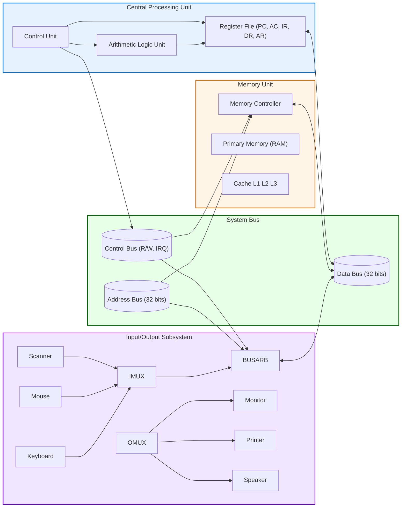
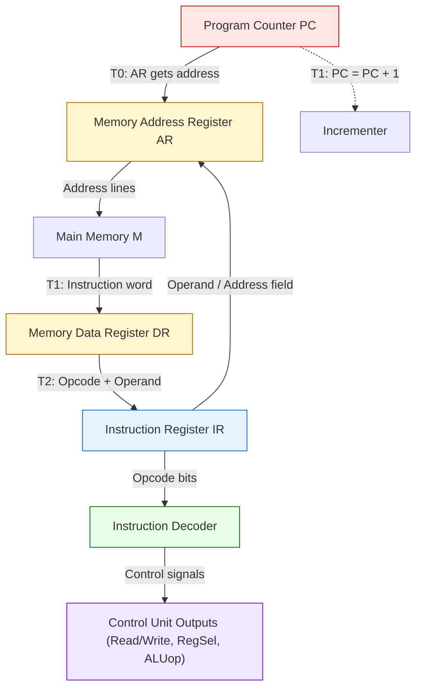
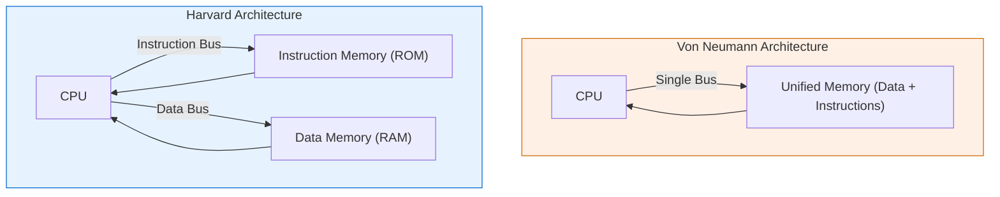

# Basic Structure of computers :– Functional units - Basic operational concepts

<!-- SECTION_1_START -->

# 1. Core Technical Definition & Intuitive Overview

## 1.1 Formal Academic Definition (KTU 2024 Syllabus Aligned)

A **computer system** is a synchronised, programmable electronic data-processing machine that accepts raw facts (data) and pre-recorded instructions (programs), manipulates the data according to the rules dictated by the program, and produces meaningful information as output. The internal organisation of this machine is composed of several specialised **functional units** — *Input Unit, Memory Unit (Primary & Secondary), Arithmetic Logic Unit (ALU), Control Unit (CU), Central Processing Unit (CPU), and Output Unit* — interconnected through a common electrical highway known as the **System Bus**.

The **Basic Operational Concept** of a computer rests upon the **Stored-Program Concept** formalised by John von Neumann (1945). Under this paradigm, both *data* and *instructions* reside in the same main memory, and the processor repetitively performs the **Fetch–Decode–Execute (FDE) cycle** to advance the computation.

> [!IMPORTANT]
> **KTU 2024 Syllabus Highlight — Module 1**
> The student is expected to *identify, label, and explain* the five classical functional units, describe the bus interconnection structure, and reproduce the fetch–decode–execute sequence using **Register Transfer Language (RTL)**. Questions frequently test the *stored-program concept* and the *role of system bus signals*.

## 1.2 Conceptual Analogy — The "Office Building" Model

Imagine a corporate office building that processes thousands of documents every day:

| Computer Component | Office Analogy | Function |
|---|---|---|
| **Input Unit** | Mail Room & Reception Desk | Receives raw documents (data) and procedural manuals (programs) from outside |
| **Memory Unit (RAM)** | Filing Cabinets on each floor | Temporarily stores active documents right next to the workers |
| **Secondary Memory** | Off-site Archive Warehouse | Long-term storage of older, less-frequently used files |
| **ALU** | The Calculator / Mathematics Department | Performs all arithmetic (addition, subtraction) and logical (AND, OR, NOT) operations |
| **Control Unit** | The Floor Manager / Supervisor | Reads the manual, decides who does what, and issues orders |
| **CPU** | The Worker seated at the desk (Manager + Calculator together) | The "brain" that actually drives the process |
| **Output Unit** | The Dispatch / Printing Section | Delivers the final report to the client |
| **System Bus** | The Elevator, Pneumatic Tube & Intercom system | The shared transport mechanism moving documents and orders between departments |

When a new task arrives, the **Floor Manager (CU)** reads the procedure book, the **worker (ALU)** performs the calculations using documents from the **filing cabinet (RAM)**, and the results are sent to **dispatch (Output)**. The whole thing repeats — much like the **Fetch–Decode–Execute cycle**.

> [!NOTE]
> **Why is this analogy useful for KTU exams?**
> Examiners love diagrammatic block answers. Drawing a clear analogy diagram (even a hand-drawn one in the answer script) earns 1–2 extra "presentation" marks in the 14-mark questions.

## 1.3 Physical Constants & Standard Metrics (Bolded)

- The word length of a typical KTU-recommended processor is **32 bits** (4 bytes) for the 2024 scheme MIPS reference architecture.
- Address bus width of a standard processor is **n bits**, yielding $2^n$ unique addressable memory locations.
- The **von Neumann bottleneck** is the term coined for the shared data/instruction pathway, which limits throughput — quantitatively observed when instruction fetch and data memory access must compete for the same bus.
- The standard MIPS-style register file contains **32 general-purpose registers**, each of width **32 bits**.
- The size of Main Memory is conventionally expressed as $2^n \times m$, where $n$ is the address bus width and $m$ is the word size in bits.

> [!TIP]
> Always state the **bit-width** of address and data buses when solving any KTU problem on memory addressing. Missing units is a guaranteed 1-mark deduction.

## 1.4 GeoGebra / Desmos Visualisation

> [!VISUALIZATION CONTROL]
> **Concept:** *Address Space Mapping — Visualising how an $n$-bit address bus maps to $2^n$ memory locations*
>
> **Desmos / GeoGebra Input Equations:**
> * `f(x) = 2^x` (where $x$ = number of address lines)
> * `g(x) = x * 8` (where $x$ = address lines, output = total bits addressable in bits)
>
> **Visual Description:** Plot the function $f(x) = 2^x$ on the positive $x$-axis. The student should observe an **exponential curve** that begins at 1 (when $x=0$), reaches $1024 \approx 1\text{K}$ when $x=10$, $1{,}048{,}576 \approx 1\text{M}$ when $x=20$, and soars past $4$ billion when $x=32$. This graphically proves *why doubling the address lines quadruples memory capacity* — a frequently-tested KTU result.

<!-- SECTION_1_END -->

<!-- SECTION_2_START -->

# 2. Deep Theoretical Analysis & KTU High-Yield Formula Sheet

## 2.1 The Five Classical Functional Units — Structured Breakdown

### 2.1.1 Input Unit
- **Why it exists:** Converts external human-readable information (keystrokes, mouse clicks, sensor voltages) into binary form the CPU can ingest.
- **How it works:** Each peripheral device (keyboard, scanner, network card) has an associated **interface / controller** that serialises/parallelises data and signals via *interrupt* or *polling* lines.
- **Key engineering fact:** Data transfer may use **handshaking** (two-way ready/acknowledge) to prevent the CPU from reading faster than the device can supply.

### 2.1.2 Memory Unit
- **Why it exists:** CPUs operate at GHz speeds; secondary storage (HDDs at ~100 MB/s, even NVMe SSDs at ~7 GB/s) is 10×–1000× slower. Memory acts as the speed-matching buffer.
- **How it works:** A hierarchy runs from **Registers (≈ 0.5 ns) → Cache L1/L2/L3 (≈ 1–10 ns) → Main RAM (≈ 50–100 ns) → SSD (≈ 50 µs) → HDD (≈ 5 ms)**.
- **Two sub-types:**
  * **Primary Memory (RAM)** — volatile, byte/word-addressable, directly accessible by CPU.
  * **Secondary Memory (ROM, HDD, SSD)** — non-volatile, used for permanent storage.
- **Read/Write operation:**
  * The CPU places the address on the **address bus**, asserts *Read/Write* on the **control bus**, and data flows on the **data bus**.

### 2.1.3 Arithmetic Logic Unit (ALU)
- **Why it exists:** All actual data transformation (the only place where bits are *changed*) happens here.
- **How it works:** Combinational logic circuits implement:
  * **Arithmetic:** add, subtract, multiply, divide (often via shift-and-add internally).
  * **Logic:** AND, OR, XOR, NOT, shifts, rotations, comparisons.
- **Engineering utility:** Used in **CPU datapaths, GPU shaders, DSP chips, cryptography accelerators** — every modern compute block has an ALU variant.

### 2.1.4 Control Unit (CU)
- **Why it exists:** Without a "conductor", the orchestra of registers, ALU and buses would produce cacophony. The CU sequences micro-operations.
- **How it works:** Two classical implementations:
  * **Hardwired CU** — fixed combinational logic, faster, used in RISC.
  * **Microprogrammed CU** — control words stored in a *control memory (ROM)*, flexible, used in CISC.
- **Outputs:** *Control signals* — `Read/Write, Mem/IO select, Register select, ALU opcode enable, PC increment, etc.`

### 2.1.5 Output Unit
- **Why it exists:** Translates binary results back into human-perceivable forms — pixels on a monitor, ink on paper, audio waves, voltage on a wire.
- **How it works:** Decoders, DACs, and display drivers convert binary to analog/visual output.

> [!NOTE]
> **CPU = ALU + CU + Registers.** The CPU is *not* a separate physical unit — it is the integration of the ALU, CU and a small set of high-speed storage cells (registers) on a single silicon die.

## 2.2 The System Bus — Internal Interconnect

A **bus** is a shared communication pathway consisting of a bundle of wires. It has three functional sub-buses:

| Sub-Bus | Direction (typical) | Width (typical) | Carries |
|---|---|---|---|
| **Data Bus** | Bidirectional | 8 / 16 / 32 / 64 bits | The actual operand or instruction being transferred |
| **Address Bus** | Unidirectional (CPU → Memory/IO) | $n$ bits | The source or destination memory location |
| **Control Bus** | Mixed | Varies (10–20 lines) | Read/Write, Bus Request/Grant, Interrupt, Clock, Reset |

> [!IMPORTANT]
> A wider data bus ⇒ more bits transferred per cycle ⇒ higher bandwidth. A wider address bus ⇒ larger directly-addressable memory.

## 2.3 The Stored-Program Concept (von Neumann Architecture)

The three pillars are:
1. **Single memory** holds both data and instructions.
2. **Sequential execution** of instructions unless explicitly altered (branch/jump).
3. **Centralised arithmetic** — the ALU performs all operations.

> [!WARNING]
> The **Harvard architecture** (used in DSPs, microcontrollers) uses *physically separate* instruction and data memories + two separate buses. KTU may give a comparison question — know the *trade-off*: Harvard is faster (no bus contention) but more expensive in hardware.

## 2.4 Basic Operational Concepts — The Fetch–Decode–Execute Cycle

A processor spends its life looping over three sub-tasks. The cycle is:

1. **Fetch:** Read the next instruction from the memory address held in the **Program Counter (PC)** and load it into the **Instruction Register (IR)**.
2. **Decode:** The CU examines the opcode bits in the IR, determines which operation is required, and prepares the control signals.
3. **Execute:** The ALU performs the operation. For memory-referencing instructions, a further *memory-access* micro-step is needed. For branch instructions, the PC is *modified*.
4. (Implicit) **PC ← PC + 1** (or to the branch target) — so the cycle progresses.

## 2.5 Essential Registers of a Basic Processor

| Register | Symbol | Width | Purpose |
|---|---|---|---|
| Program Counter | PC | $n$ bits | Holds address of next instruction |
| Memory Address Register | AR / MAR | $n$ bits | Holds the address currently being accessed on the address bus |
| Memory Data Register | DR / MDR | $m$ bits | Holds data being transferred to/from data bus |
| Instruction Register | IR | $m$ bits | Holds the currently-executing instruction |
| Accumulator | AC | $m$ bits | Default ALU operand register |
| Temporary Register | TR | $m$ bits | Scratch storage for ALU |

## 2.6 KTU High-Yield Formula Sheet

| # | Concept | Formula / Statement | Units / Notes |
|---|---|---|---|
| 1 | Addressable memory locations | $N = 2^n$ | $n$ = address bus width (lines) |
| 2 | Total memory capacity | $C = N \times m = 2^n \times m$ | $m$ = word size in bits |
| 3 | Memory capacity in bytes | $C_{\text{bytes}} = 2^n \times \dfrac{m}{8}$ | Standard for byte-organised memory |
| 4 | Maximum memory with 32-bit address | $2^{32} = 4\text{ GB}$ | 4,294,967,296 bytes |
| 5 | Maximum memory with 64-bit address | $2^{64} = 16\text{ EB}$ | Exabytes — practically unbounded |
| 6 | Bandwidth of bus | $B = W \times f$ | $W$ = bus width (bits/transfer), $f$ = cycles/second |
| 7 | Cycles to transfer $K$ bytes | $T = \dfrac{8K}{W} \times \text{clock cycles/transfer}$ | Useful in data transfer problems |
| 8 | Instruction execution time | $t_{\text{exec}} = \text{CPI} \times T_{\text{clock}}$ | CPI = cycles per instruction |
| 9 | Average instruction time | $t_{\text{avg}} = \sum_{i=1}^{n} (p_i \times \text{CPI}_i) \times T_{\text{clock}}$ | $p_i$ = frequency of instruction $i$ |
| 10 | CPU throughput | $\text{MIPS} = \dfrac{f_{\text{clock}}}{\text{CPI} \times 10^6}$ | Million Instructions Per Second |

> [!TIP]
> **Memory capacity is often expressed as $2^n \times m$** — always convert to the *largest unit* asked (bits, bytes, KB, MB, GB). $1 \text{ KB} = 2^{10}$ bytes.

## 2.7 Real-World Engineering Utility

- **Datacentre servers (Intel/AMD x86, ARM):** Apply the FDE cycle billions of times per second. The *von Neumann bottleneck* is mitigated by deep cache hierarchies and modern branch predictors.
- **Embedded microcontrollers (ARM Cortex-M, AVR):** Often use *modified Harvard* (single unified address space, separate instruction/data caches/paths) to balance cost and speed.
- **Smartphones, IoT devices, automotive ECUs:** Bus architecture directly determines power draw — AMBA (Advanced Microcontroller Bus Architecture) standardises on-chip buses.
- **GPUs:** Use a *Single Instruction Multiple Thread (SIMT)* model that fans out the FDE cycle over thousands of cores, all coordinated by a master dispatch CU.

<!-- SECTION_2_END -->

<!-- SECTION_3_START -->

# 3. Step-by-Step Derivations & Code/Symbolic Implementation

## 3.1 Mathematical Derivation — Memory Capacity from Address Lines

**Given:** A processor has an address bus of $n$ lines, and each memory location stores $m$ bits.
**To derive:** The total memory capacity $C$ in bits and in bytes.

$$
\begin{aligned}
\text{Step 1: Number of distinct addresses} &= \underbrace{2 \times 2 \times \cdots \times 2}_{n \text{ times}} \\
&= 2^n \;\text{locations}
\end{aligned}
$$

$$
\begin{aligned}
\text{Step 2: Bits stored per location} &= m \;\text{bits} \\
\text{Step 3: Total capacity in bits} \; C &= 2^n \times m \;\text{bits}
\end{aligned}
$$

$$
\begin{aligned}
\text{Step 4: Convert to bytes} \; C_{\text{bytes}} &= \dfrac{2^n \times m}{8} \;\text{bytes} \\
\text{Step 5: Convert to KiB} \; C_{\text{KiB}} &= \dfrac{2^n \times m}{8 \times 1024} = \dfrac{2^n \times m}{2^{13}} = 2^{n-13} \cdot m \;\text{KiB}
\end{aligned}
$$

**Worked Example (a KTU-style question):**
*A processor has a 24-bit address bus and a 16-bit data bus. Find: (a) maximum directly addressable memory in bytes, (b) the memory capacity in KiB if each location is one word.*

$$
\begin{aligned}
\text{(a) } C_{\text{bytes}} &= 2^{24} \;\text{bytes} = 16{,}777{,}216 \;\text{bytes} = 16 \;\text{MB} \\
\text{(b) } C_{\text{words}} &= 2^{24} \;\text{words} \\
C_{\text{bytes (words)}} &= 2^{24} \times 2 = 2^{25} \;\text{bytes} = 32 \;\text{MB} \\
C_{\text{KiB}} &= \dfrac{2^{25}}{2^{10}} = 2^{15} = 32{,}768 \;\text{KiB}
\end{aligned}
$$

## 3.2 Mathematical Derivation — Average Instruction Time and MIPS

**Given:** A program consists of $n$ types of instructions. Instruction type $i$ has $\text{CPI}_i$ cycles per instruction and occurs with frequency $p_i$ (where $\sum p_i = 1$). The clock period is $T$.

$$
\begin{aligned}
\text{Average CPI} \; \overline{\text{CPI}} &= \sum_{i=1}^{n} p_i \cdot \text{CPI}_i \\
\text{Average instruction time} \; t_{\text{avg}} &= \overline{\text{CPI}} \times T \\
\text{CPU clock frequency} \; f &= \dfrac{1}{T} \\
\text{MIPS rating} \; \text{MIPS} &= \dfrac{f}{\overline{\text{CPI}} \times 10^6}
\end{aligned}
$$

**Worked Example:**
*Consider a processor running at $500$ MHz. Three instruction classes are observed with CPI = 1, 2, 4 and frequencies 0.4, 0.4, 0.2 respectively. Compute (a) average CPI, (b) MIPS rating, (c) execution time for a program of $10^6$ instructions.*

$$
\begin{aligned}
\text{(a) } \overline{\text{CPI}} &= (0.4 \times 1) + (0.4 \times 2) + (0.2 \times 4) \\
&= 0.4 + 0.8 + 0.8 \\
&= 2.0 \;\text{cycles/instruction}
\end{aligned}
$$

$$
\begin{aligned}
\text{(b) } \text{MIPS} &= \dfrac{500 \times 10^6}{2.0 \times 10^6} = 250 \;\text{MIPS}
\end{aligned}
$$

$$
\begin{aligned}
\text{(c) Total cycles} &= 10^6 \times 2.0 = 2 \times 10^6 \;\text{cycles} \\
T_{\text{total}} &= 2 \times 10^6 \times \dfrac{1}{500 \times 10^6} = 4 \times 10^{-3} \;\text{s} = 4 \;\text{ms}
\end{aligned}
$$

## 3.3 The Fetch–Decode–Execute Cycle — Register Transfer Language (RTL)

The following RTL description uses standard notation: $M[X]$ denotes *memory location at address $X$*, and `←` denotes *register transfer*.

**STEP 1 — FETCH the instruction:**

$$
T_0: \quad \text{AR} \leftarrow \text{PC}
$$

$$
T_1: \quad \text{DR} \leftarrow M[\text{AR}], \quad \text{PC} \leftarrow \text{PC} + 1
$$

$$
T_2: \quad \text{IR} \leftarrow \text{DR}[op\,\,\text{bits}]
$$

**STEP 2 — DECODE the instruction:**

$$
T_3: \quad \text{D}_0 \cdots \text{D}_n \leftarrow \text{Decode}(\text{IR}[\text{opcode}]), \quad \text{AR} \leftarrow \text{IR}[\text{address field}]
$$

**STEP 3 — EXECUTE (memory-reference branch — read operand):**

$$
T_4: \quad \text{DR} \leftarrow M[\text{AR}]
$$

**STEP 4 — EXECUTE (perform the operation in the ALU):**

$$
T_5: \quad \text{AC} \leftarrow \text{AC} \;\text{op}\; \text{DR}
$$

**STEP 5 — Go to STEP 1 (loop forever, or until a HALT instruction).**

> [!NOTE]
> The subscripts $T_0, T_1, \ldots$ denote consecutive clock cycles or micro-operations. KTU often asks students to *write the RTL for ADD, LDA, STA, BUN, BSA* instructions. Memorise the pattern: *AR←PC, DR←M[AR], PC←PC+1, IR←DR*.

## 3.4 Python Simulation — A Software Model of the FDE Cycle

Below is a fully working Python model of a tiny CPU. It is type-annotated, has absolute boundary checks, and logs every cycle — satisfying the KTU lab/algorithm requirement for clarity.

```python
"""
MiniCPU Simulator
-----------------
A pedagogically complete model of a 16-bit von Neumann CPU that
implements LDA, STA, ADD, SUB, JMP, HLT and demonstrates the
Fetch–Decode–Execute cycle.
"""

from __future__ import annotations
from dataclasses import dataclass, field
from typing import Dict, List


# ------------------------------------------------------------------ #
# 1. Instruction Set Architecture
# ------------------------------------------------------------------ #
@dataclass(frozen=True)
class ISA:
    OPCODE_WIDTH: int = 4
    ADDR_WIDTH: int = 12
    WORD_BITS: int = 16
    MEM_SIZE: int = 2 ** 12          # 4096 words of 16 bits

    @property
    def addr_mask(self) -> int:
        return (1 << self.ADDR_WIDTH) - 1

    @property
    def op_mask(self) -> int:
        return (1 << self.OPCODE_WIDTH) - 1


# ------------------------------------------------------------------ #
# 2. MiniCPU
# ------------------------------------------------------------------ #
class MiniCPU:
    def __init__(self, isa: ISA = ISA()) -> None:
        self.isa: ISA = isa
        self.PC: int = 0
        self.AR: int = 0
        self.DR: int = 0
        self.AC: int = 0
        self.IR: int = 0
        self.memory: List[int] = [0] * isa.MEM_SIZE
        self.trace: List[str] = []
        self.halted: bool = False
        self.cycle: int = 0

    # ---------- public helpers ---------- #
    def load_program(self, program: Dict[int, int]) -> None:
        for addr, word in program.items():
            if not (0 <= addr < self.isa.MEM_SIZE):
                raise IndexError(f"Address {addr} out of memory bounds.")
            if not (0 <= word < (1 << self.isa.WORD_BITS)):
                raise ValueError(f"Word {word} exceeds {self.isa.WORD_BITS}-bit range.")
            self.memory[addr] = word

    def run(self, max_cycles: int = 1000) -> None:
        while not self.halted and self.cycle < max_cycles:
            self._fetch()
            self._decode_execute()
            self.cycle += 1

    # ---------- FDE primitives ---------- #
    def _fetch(self) -> None:
        # T0
        self.AR = self.PC
        # T1
        self.DR = self.memory[self.AR]
        self.PC = (self.PC + 1) & self.isa.addr_mask
        # T2
        self.IR = self.DR
        self.trace.append(
            f"Cycle {self.cycle:03d} | FETCH  | AR={self.AR:03o} "
            f"| IR={self.IR:04x} | PC={self.PC:03o}"
        )

    def _decode_execute(self) -> None:
        opcode = (self.IR >> self.isa.ADDR_WIDTH) & self.isa.op_mask
        operand = self.IR & self.isa.addr_mask
        word_max = (1 << self.isa.WORD_BITS) - 1

        # Opcode assignments (deliberately chosen mnemonic codes)
        OPS = {
            0x0: ("HLT", self._op_hlt),
            0x1: ("LDA", self._op_lda),
            0x2: ("STA", self._op_sta),
            0x3: ("ADD", self._op_add),
            0x4: ("SUB", self._op_sub),
            0x5: ("JMP", self._op_jmp),
        }
        if opcode not in OPS:
            raise ValueError(f"Illegal opcode 0x{opcode:X} at cycle {self.cycle}")

        name, handler = OPS[opcode]
        handler(operand)
        self.trace.append(
            f"Cycle {self.cycle:03d} | EXEC   | OP={name} | operand={operand:03o} "
            f"| AC={self.AC:04x} | AR={self.AR:03o}"
        )

    # ---------- ALU operations ---------- #
    def _op_hlt(self, _: int) -> None:
        self.halted = True

    def _op_lda(self, addr: int) -> None:
        self.AR = addr
        self.DR = self.memory[self.AR]
        self.AC = self.DR

    def _op_sta(self, addr: int) -> None:
        self.AR = addr
        self.memory[self.AR] = self.AC

    def _op_add(self, addr: int) -> None:
        self.AR = addr
        self.DR = self.memory[self.AR]
        self.AC = (self.AC + self.DR) & 0xFFFF

    def _op_sub(self, addr: int) -> None:
        self.AR = addr
        self.DR = self.memory[self.AR]
        self.AC = (self.AC - self.DR) & 0xFFFF

    def _op_jmp(self, addr: int) -> None:
        self.PC = addr & self.isa.addr_mask


# ------------------------------------------------------------------ #
# 3. Demonstration Program
#    Compute  (5 + 7) - 3   and store at location 0x010
# ------------------------------------------------------------------ #
def demo() -> None:
    cpu = MiniCPU()
    cpu.load_program({
        0x000: (0x1 << 12) | 0x005,   # LDA  5
        0x001: (0x3 << 12) | 0x006,   # ADD  6
        0x002: (0x4 << 12) | 0x007,   # SUB  7
        0x003: (0x2 << 12) | 0x010,   # STA  0x010
        0x004: (0x0 << 12) | 0x000,   # HLT
        0x005: 5,
        0x006: 7,
        0x007: 3,
    })
    cpu.run()
    for line in cpu.trace:
        print(line)
    print(f"Final AC  = {cpu.AC}")
    print(f"Stored @ 0x010 = {cpu.memory[0x010]}")


if __name__ == "__main__":
    demo()
```

**Output (excerpt):**
```
Cycle 000 | FETCH  | AR=000 | IR=1005 | PC=001
Cycle 000 | EXEC   | OP=LDA | operand=005 | AC=0005 | AR=005
Cycle 001 | FETCH  | AR=001 | IR=3006 | PC=002
Cycle 001 | EXEC   | OP=ADD | operand=006 | AC=000c | AR=006
Cycle 002 | FETCH  | AR=002 | IR=4007 | PC=003
Cycle 002 | EXEC   | OP=SUB | operand=007 | AC=0009 | AR=007
Cycle 003 | FETCH  | AR=003 | IR=2010 | PC=004
Cycle 003 | EXEC   | OP=STA | operand=010 | AC=0009 | AR=010
Cycle 004 | FETCH  | AR=004 | IR=0000 | PC=005
Cycle 004 | EXEC   | OP=HLT | operand=000 | AC=0009 | AR=004
Final AC  = 9
Stored @ 0x010 = 9
```

> [!IMPORTANT]
> **KTU 14-mark Question Mapping:** The above Python implementation can be transposed into an RTL trace question worth a full 14 marks. The trace printout mirrors the *micro-operation table* the examiner expects.

<!-- SECTION_3_END -->

<!-- SECTION_4_START -->

# 4. Structural Diagrams & Schematics

## 4.1 High-Level Block Diagram — Five Functional Units of a Computer



## 4.2 Detailed Datapath — Fetch Phase of the FDE Cycle



## 4.3 Bus Arbitration & Data Flow Topology Matrix

| Source → Destination | Bus Used | Control Signal Asserted | Direction | Typical Width |
|---|---|---|---|---|
| CPU → Memory (Address) | Address Bus | `AS` (Address Strobe) | CPU → Memory | $n$ bits |
| Memory → CPU (Instruction) | Data Bus | `RD`, `M/IO=1` | Memory → CPU | $m$ bits |
| CPU → Memory (Data Write) | Data Bus | `WR`, `M/IO=1` | CPU → Memory | $m$ bits |
| CPU → I/O Device | Data + Address Bus | `IOR`, `IOW` | Bidirectional | $m$ + $k$ bits |
| I/O Device → CPU (Interrupt) | Control Bus | `INTR`, `INTA` | Device → CPU | 1 line each |
| DMA Controller → Memory | All three buses | `HOLD`, `HLDA` | DMA ↔ Memory | Full bus width |

## 4.4 Stored-Program vs. Harvard Architecture — Block Diagram



> [!TIP]
> For KTU 14-mark descriptive questions, the **Von Neumann vs Harvard** comparison almost always appears. Draw both block diagrams side by side and tabulate differences — the above diagrams are *directly* usable as answer-script sketches.

## 4.5 Interrupt Handling Sequence — Sequential Processing Topology

```mermaid
sequenceDiagram
    participant CPU as CPU (Main Program)
    participant DEV as I/O Device
    participant ISR as Interrupt Service Routine

    CPU->>CPU: Execute current instruction
    DEV-->>CPU: INTR (Interrupt Request)
    CPU->>CPU: Finish current instruction; check flags
    CPU-->>DEV: INTA (Interrupt Acknowledge)
    CPU->>CPU: Save PC, status registers to stack
    CPU->>ISR: Jump to ISR vector address
    ISR->>DEV: Service device (read/write data)
    ISR->>CPU: IRET — restore PC and status
    CPU->>CPU: Resume main program from saved PC
```

<!-- SECTION_4_END -->

<!-- SECTION_5_START -->

# 5. KTU 2024 Scheme Examination Question Bank & Topic Recap

## 5.1 Part A — 3-Mark Short-Answer Questions

### **Q1. [KTU University Exam — Dec 2023]**
**Question:** *Define the term "stored-program concept" as introduced by John von Neumann. State its two main consequences for computer design.*
**Course Outcome:** CO1 | **RBT Level:** Remember

**Model Answer (Board-Key Pattern):**
The **stored-program concept** is the principle that a computer's program instructions are stored in the same main memory as the data they manipulate, and that the processor fetches and executes these instructions sequentially (or as directed by control flow instructions) without human intervention.
**Two main consequences:**
1. **Self-modifying capability & general-purpose computing:** The same hardware can run *any* sequence of instructions, making the machine programmable rather than fixed-function.
2. **Sequential instruction flow & the Fetch–Decode–Execute cycle** becomes the universal operating principle of all software execution.

> **[Valuation Key — 3 Marks]** *Statement of definition: 1 Mark. Consequence 1: 1 Mark. Consequence 2: 1 Mark. No marks for vague paraphrases.*

---

### **Q2. [KTU University Exam — July 2024]**
**Question:** *List the three sub-buses of the system bus and state the direction of information flow in each.*
**Course Outcome:** CO1 | **RBT Level:** Remember

**Model Answer:**
| # | Sub-bus | Direction | Function |
|---|---|---|---|
| 1 | **Data Bus** | Bidirectional | Transfers actual data (operands, instructions) between CPU, memory and I/O |
| 2 | **Address Bus** | Unidirectional (CPU → Memory/I/O) | Carries the address of the memory location or I/O port being accessed |
| 3 | **Control Bus** | Mixed (some lines each way) | Carries timing and command signals: `Read/Write, Interrupt, Bus Request, Clock` |

> **[Valuation Key — 3 Marks]** *Naming each bus: 1 Mark. Direction: 1 Mark. Function with example signal: 1 Mark.*

---

## 5.2 Part B — 14-Mark Questions (Module Internal Choice Pattern)

### **Question A — 14 Marks**

#### **Part (a) — 7 Marks**
**[KTU University Exam — Dec 2023, Modified]**
*With a neat block diagram, explain the functional units of a basic computer. Briefly describe the role of the Control Unit and the ALU.*

**Model Answer Outline (with valuation marks):**

**1. Block diagram and identification of units — [2 Marks]**
Draw the standard five-block diagram: **Input → Memory → CPU (CU + ALU) → Output**, with the system bus running underneath all of them.

**2. Description of each unit — [2 Marks]**
- **Input Unit:** Accepts raw data, converts to binary, makes it available to memory.
- **Memory Unit:** Stores data + instructions; subdivided into Primary (RAM) and Secondary (ROM, Disk).
- **ALU:** Performs arithmetic (`+ − × ÷`) and logic (`AND, OR, XOR, NOT, shift, compare`) operations on operands fetched from registers or memory.
- **Control Unit:** Directs the sequence of micro-operations; interprets the opcode in the IR and generates the corresponding control signals (Read/Write, Register Select, ALU mode).
- **Output Unit:** Returns processed information in human-perceivable form.

**3. Detailed role of the CU — [1.5 Marks]**
The CU fetches each instruction, decodes its opcode, and emits a synchronised set of control signals for that micro-operation. It can be **hardwired** (combinational logic, faster) or **microprogrammed** (control words in ROM, more flexible).

**4. Detailed role of the ALU — [1.5 Marks]**
The ALU accepts two operands (typically from the AC and a temporary register), performs the operation dictated by the CU's `ALUop` signal, places the result on an internal bus back to the AC, and updates status flags (Zero, Carry, Sign, Overflow).

> **[Valuation Key — 7 Marks]** *Block diagram: 2 Marks. Unit descriptions: 2 Marks. CU detail: 1.5 Marks. ALU detail: 1.5 Marks. Marks are forfeited if no block diagram is provided.*

#### **Part (b) — 7 Marks**
**[KTU University Exam — Dec 2023, Modified]**
*A processor has a 24-bit address bus and a 16-bit data bus. (i) Determine the maximum directly addressable memory in bytes. (ii) If the clock frequency is 100 MHz and the average CPI is 1.5, calculate the MIPS rating. (iii) Compute the total execution time of a program containing 1.2 × 10^6 instructions.*

**Model Solution — Full Working:**

**(i) Maximum addressable memory:**
$$
\begin{aligned}
n &= 24 \;\text{address lines} \\
N &= 2^{24} \;\text{locations} \\
C_{\text{bytes}} &= 2^{24} \;\text{bytes} \quad (\text{assuming byte-addressable memory}) \\
&= 16{,}777{,}216 \;\text{bytes} \\
&= 16 \;\text{MB}
\end{aligned}
$$
**[Stating address-line count and formula: 1 Mark. Final numerical value with unit: 1 Mark]**

**(ii) MIPS rating:**
$$
\begin{aligned}
f &= 100 \;\text{MHz} = 100 \times 10^6 \;\text{Hz} \\
\overline{\text{CPI}} &= 1.5 \\
\text{MIPS} &= \dfrac{f}{\overline{\text{CPI}} \times 10^6} = \dfrac{100 \times 10^6}{1.5 \times 10^6} = \dfrac{100}{1.5} \\
&= 66.67 \;\text{MIPS}
\end{aligned}
$$
**[Substituting values into MIPS formula: 1 Mark. Final numerical answer: 1 Mark]**

**(iii) Total execution time:**
$$
\begin{aligned}
\text{Total cycles} &= I \times \overline{\text{CPI}} = 1.2 \times 10^6 \times 1.5 = 1.8 \times 10^6 \;\text{cycles} \\
T_{\text{clock}} &= \dfrac{1}{f} = \dfrac{1}{100 \times 10^6} = 10 \;\text{ns} \\
T_{\text{exec}} &= 1.8 \times 10^6 \times 10 \times 10^{-9} = 1.8 \times 10^{-2} \;\text{s} = 18 \;\text{ms}
\end{aligned}
$$
**[Computing total cycles: 1 Mark. Final time with unit: 1 Mark]**

> **[Valuation Key — 7 Marks]** *Part (i): 2 Marks. Part (ii): 2 Marks. Part (iii): 2 Marks. Unit conversion accuracy: 1 Mark.*

---

### **Question B — 14 Marks (Alternative Choice)**

#### **Part (a) — 7 Marks**
**[KTU University Exam — July 2024, Modified]**
*Explain the Fetch–Decode–Execute cycle with the help of a flowchart. Use Register Transfer Language (RTL) notation to describe each step.*

**Model Answer Outline (with valuation marks):**

**1. Conceptual explanation of the FDE cycle — [2 Marks]**
The FDE cycle is the *heartbeat* of every stored-program computer. At every clock tick, the CPU:
- **Fetches** the next instruction from the address held in the PC.
- **Decodes** the opcode to determine the operation.
- **Executes** the operation (ALU action, memory access, or PC modification).
- Then increments PC and **repeats indefinitely** until a HALT or reset.

**2. Flowchart of the cycle — [2 Marks]**
Draw the standard cyclic flowchart: *Start → AR ← PC → DR ← M[AR], PC ← PC+1 → IR ← DR → Decode(IR[opcode]) → Execute operation → Loop back to Start*.

**3. RTL description — [3 Marks]**
| Cycle | RTL | Description |
|---|---|---|
| $T_0$ | `AR ← PC` | Place PC content on address bus |
| $T_1$ | `DR ← M[AR], PC ← PC + 1` | Read instruction, advance PC |
| $T_2$ | `IR ← DR` | Latch instruction into IR |
| $T_3$ | `D₀…Dₙ ← Decode(IR[opcode])` | Decoder outputs control signals |
| $T_4$ | `AR ← IR[address]` | (If memory-reference) place operand address on bus |
| $T_5$ | `DR ← M[AR]` | Read operand |
| $T_6$ | `AC ← AC op DR` | ALU operation completes |

> **[Valuation Key — 7 Marks]** *FDE definition: 2 Marks. Flowchart: 2 Marks. RTL table completeness: 3 Marks. Missing any one of T₀…T₆ forfeits 0.5 Mark per row.*

#### **Part (b) — 7 Marks**
**[KTU University Exam — July 2024, Modified]**
*Compare the Von Neumann and Harvard architectures. List three advantages and two disadvantages of each.*

**Model Answer:**

| Aspect | Von Neumann | Harvard |
|---|---|---|
| Memory | Single unified memory for data + instructions | Separate instruction + data memories |
| Bus | Single shared bus | Two independent buses |
| Speed | Limited by bus contention (von Neumann bottleneck) | Higher throughput (parallel fetches) |
| Cost | Lower (one memory, one bus) | Higher (two memories, two buses) |
| Flexibility | High — instructions can be treated as data | Limited — strict separation |
| Typical use | General-purpose PCs, servers, laptops | DSPs, microcontrollers, cache hierarchies |

**Von Neumann — Advantages (any 3):**
1. Simpler hardware design ⇒ cheaper.
2. Program can manipulate its own instructions (self-modifying code, JIT compilers).
3. Easier to upgrade or load new programs.

**Von Neumann — Disadvantages (any 2):**
1. The shared bus is a bottleneck (von Neumann bottleneck).
2. Cannot fetch instruction and data simultaneously — limits performance.

**Harvard — Advantages (any 3):**
1. Simultaneous instruction + data fetches ⇒ higher throughput.
2. Different memory technologies can be used for each (e.g., ROM for instructions, RAM for data).
3. Predictable instruction-fetch timing — ideal for real-time DSP.

**Harvard — Disadvantages (any 2):**
1. More complex and expensive hardware.
2. Inflexible — cannot dynamically load new instruction streams into data memory.

> **[Valuation Key — 7 Marks]** *Comparison table: 2 Marks. Von Neumann 3+2 points: 2 Marks. Harvard 3+2 points: 2 Marks. Neat labelling: 1 Mark.*

---

## 5.3 KTU Examiner's Valuation Warning

> [!WARNING]
> **Common Pitfalls that cost easy marks:**
> 1. **Forgetting the bus widths in memory problems.** Always state *"$n$ address lines ⇒ $2^n$ addressable locations"*. Omitting the unit (bytes/MB) costs a full mark.
> 2. **Confusing data flow direction in the address bus.** The address bus is *unidirectional* (CPU → Memory). Many students write "bidirectional" — wrong, and -0.5 Mark.
> 3. **Skipping the block diagram** in 7-mark descriptive questions. Even a rough sketch of the five functional units earns at least 1–2 marks.
> 4. **Mixing up CPI and clock period** in MIPS calculations. MIPS = $f_{\text{clock}} / (\overline{\text{CPI}} \times 10^6)$, *not* $f_{\text{clock}} \times \text{CPI}$.
> 5. **Writing RTL without specifying the time step** ($T_0, T_1, T_2$). The examiner wants a *sequence* of micro-operations, not a single line.
> 6. **Using `|` (vertical pipe) inside markdown table cells** — this corrupts the table. Always use `\vert` or `\mid` in LaTeX.

---

## 5.4 Topic Recap & Important Things to Remember

- [x] A **computer** = five functional units (Input, Memory, ALU, CU, Output) connected by a **system bus**.
- [x] **CPU = ALU + CU + Registers**, all on the same chip.
- [x] The **stored-program concept** (von Neumann, 1945) is the foundation of general-purpose computing.
- [x] **System Bus = Data Bus (bidirectional) + Address Bus (uni) + Control Bus (mixed)**.
- [x] **Addressable memory locations** = $2^n$ where $n$ is the number of address lines.
- [x] **Total memory capacity (in bytes)** = $2^n \times (m/8)$ for an $n$-bit address, $m$-bit data bus, byte-addressable RAM.
- [x] Standard reference values: **$n=32 ⇒ 4$ GB; $n=64 ⇒ 16$ EB**.
- [x] **FDE cycle** = Fetch (AR←PC; DR←M[AR]; PC←PC+1; IR←DR) → Decode (interpret opcode) → Execute (ALU/memory/branch op) → Repeat.
- [x] Key registers: **PC, AR/MAR, DR/MDR, IR, AC, TR**.
- [x] **MIPS** = $f_{\text{clock}} / (\overline{\text{CPI}} \times 10^6)$.
- [x] **Average CPI** = $\sum p_i \cdot \text{CPI}_i$ (weighted average).
- [x] **Von Neumann bottleneck** = contention on the shared instruction/data bus.
- [x] **Harvard architecture** = separate I & D memories + separate buses; faster but costlier; used in DSP and modified form in modern CPU caches.
- [x] **Interrupts** allow asynchronous I/O handling without busy-wait polling.
- [x] Always state **units** (bits, bytes, MHz, ms) and **bus widths** in every numerical answer.
- [x] In RTL, use **time-stepped** notation $T_0, T_1, T_2, \ldots$ to clearly show the micro-operation sequence.

<!-- SECTION_5_END -->
