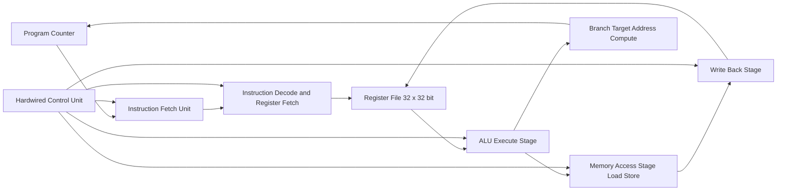
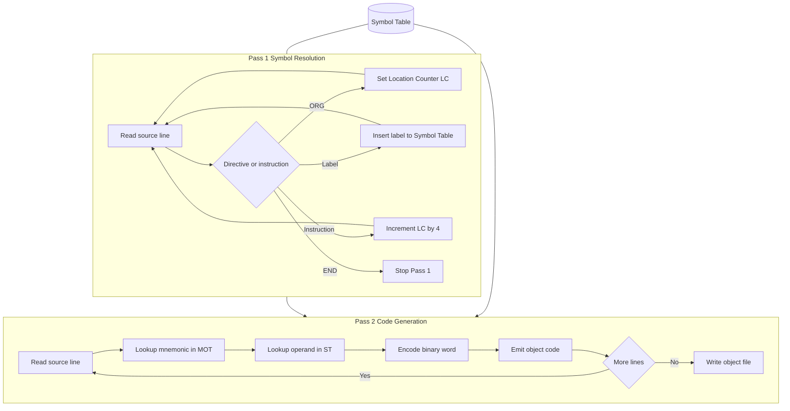
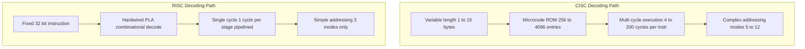
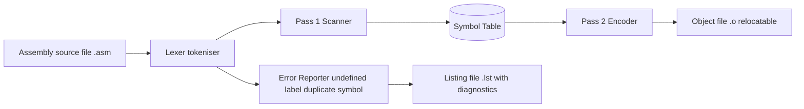

# CISC vs RISC architectures:- RISC Introduction - Assembly Language, Assembler directives, Assembling.

<!-- SECTION_1_START -->
# 1. Core Technical Definition & Intuitive Overview

## 1.1 Formal Definition — CISC vs RISC

> [!IMPORTANT]
> **CISC — Complex Instruction Set Computer**
> A processor design philosophy (e.g., Intel x86, Motorola 68000) where the instruction set contains a **large number of complex, variable-length instructions**, many of which combine low-level operations such as memory access, arithmetic, and loop control into a single instruction. The hardware (microprogrammed control unit) directly decodes and executes these powerful instructions.

> [!IMPORTANT]
> **RISC — Reduced Instruction Set Computer**
> A processor design philosophy (e.g., MIPS, ARM, SPARC, RISC-V, PowerPC) where the instruction set is deliberately kept **small, simple, fixed-length, and easy to pipeline**. Arithmetic instructions operate **only on registers** (load-store architecture), and complex operations are built from sequences of simple instructions in software.

> [!NOTE]
> **Assembly Language** is a low-level symbolic representation of machine instructions, where **mnemonics** (e.g., `ADD`, `LOAD`, `STORE`) replace binary opcodes and **labels / symbolic addresses** replace numeric memory locations. An **assembler** is the system program that translates assembly source code into relocatable machine code (object code).

## 1.2 Conceptual Analogy — The Two Kitchens

> [!TIP]
> **CISC is a Swiss Army Knife:** A single tool with 50 functions (knife, screwdriver, scissors, file, pliers, corkscrew, …). Each function is moderately fast, but the tool is bulky, heavy, complex to manufacture, and hard to optimize because every user employs a different combination.
>
> **RISC is a Master Chef's Knife Set:** Each knife does *one* job perfectly — a slicer, a parer, a cleaver, a boning knife. They are all the same shape, light, identical grip, and you chain them together at speed. The chef (compiler) composes complex dishes from simple cuts.

### CISC vs RISC — At a Glance

| Dimension | CISC | RISC |
|---|---|---|
| Instruction size | Variable length (1–15 bytes) | Fixed length (typically 4 bytes) |
| Instruction count | 100 – 250+ | ~50 – 150 |
| Memory operands per instruction | Many (memory-to-memory) | Mostly 0 (register-register) |
| Execution time per instruction | Multiple clock cycles, variable | **Mostly 1 cycle** (pipelined) |
| Control unit | Microprogrammed | Hardwired |
| Compiler complexity | Simpler (hardware does work) | Harder (software does work) |
| Examples | Intel x86, x86-64, VAX, 68k | MIPS, ARM, SPARC, RISC-V, PowerPC |

## 1.3 Engineering Constants & Metrics

- **MIPS** = **M**illions of **I**nstructions **P**er **S**econd. RISC designs typically deliver higher sustained MIPS at the same clock frequency because CPI (cycles per instruction) approaches **1.0**.
- **CPI** = $\text{Cycles Per Instruction}$ — a key performance metric.
- Standard register count in RISC: **$32$ general-purpose registers** (MIPS, RISC-V convention).
- Standard instruction width: **$32$ bits = 4 bytes** (MIPS, RISC-V, ARM in Thumb-2).

> [!VISUALIZATION CONTROL]
> **Concept:** RISC fixed-length instruction encoding
> **Conceptual Mapping (MIPS R-type):**
> * Opcode = `000000`
> * rs (source) = `01001`
> * rt (target) = `01010`
> * rd (destination) = `01011`
> * shamt (shift) = `00000`
> * funct (function) = `100000` (ADD)
> **Visual Description:** Picture six equal 6+5+5+5+5+6 = 32-bit fields aligned in a row, each cleanly demarked, no ambiguity in decoding.

<!-- SECTION_1_END -->

<!-- SECTION_2_START -->
# 2. Deep Theoretical Analysis & KTU High-Yield Formula Sheet

## 2.1 The Five Pillars of RISC Design

1. **Fixed-length, fixed-format instructions** → simpler, faster decoder.
2. **Load-Store architecture** → only `LOAD` and `STORE` touch memory; all ALU ops are register-to-register.
3. **Large, uniform register file** → e.g., **$32$ GPRs** in MIPS/RISC-V, reducing memory traffic.
4. **Hardwired control unit** → single-cycle execution, fits neatly into a 5-stage pipeline (IF, ID, EX, MEM, WB).
5. **Highly optimizable by compiler** → delayed branches, register windows, software scheduling.

> [!NOTE]
> **Why RISC won the mobile era:** ARM (a RISC ISA) dominates smartphones, embedded systems, and now Apple M-series laptops — the low power-per-instruction ratio is a direct consequence of the simple decoding path.

## 2.2 Introduction to Assembly Language

An **assembly program** consists of lines of the form:

```
[Label:]   Mnemonic   Operand1, Operand2   [; Comment]
```

| Field | Purpose | Example |
|---|---|---|
| **Label** | Symbolic name for a memory address | `LOOP:` `START:` |
| **Mnemonic** | Operation name (human-readable opcode) | `ADD`, `LDR`, `STR`, `MOV` |
| **Operands** | Registers, constants, or labels | `R1, R2, R3` |
| **Comment** | Human note, ignored by assembler | `; initialize counter` |

### Sample RISC-style statements (MIPS flavor)

```
START:  ADDI  R1, R0, 10        ; R1 = 0 + 10
        ADDI  R2, R0, 20        ; R2 = 0 + 20
        ADD   R3, R1, R2        ; R3 = R1 + R2
        SW    R3, 0(R4)         ; store R3 at memory[R4+0]
```

## 2.3 Assembler Directives (Pseudo-Instructions)

Directives are **commands to the assembler, not to the CPU**. They control layout, allocation, and data definition.

| Directive | Meaning | Typical Usage |
|---|---|---|
| `EQU` / `=` | Define a symbolic constant | `MAXLEN  EQU  100` |
| `DB` / `.byte` | Define byte(s) of data | `MSG  DB  "HELLO"` |
| `DW` / `.word` | Define word(s) (4 bytes) | `VAL  DW  1234H` |
| `DS` / `.space` | Reserve storage (no init) | `BUF  DS  64` |
| `ORG` | Set current location counter | `ORG  1000H` |
| `END` | End of source program | `END  START` |
| `ALIGN` | Align next address to a boundary | `ALIGN 4` |
| `EXTERN` / `GLOBAL` | External / exported symbols | `GLOBAL  _main` |

> [!IMPORTANT]
> Directives **do not generate machine instructions** in most cases. They direct the assembler's bookkeeping (location counter, symbol table, data emission). An exception is data-define directives (`DB`, `DW`) which *do* emit bytes into the object file.

## 2.4 The Assembling Process — Two-Pass Assembler

A standard RISC assembler runs in **two passes** over the source file:

**Pass 1 — Symbol Resolution**
- Scan each line.
- For every label encountered, record `(symbol → address)` in the **Symbol Table (ST)**.
- Maintain the **Location Counter (LC)**, incrementing by the size of each instruction or data allocation.
- Result: every label now has a numeric address, but forward references in operand fields are *not yet fixed* (they were left blank or pending in Pass 1).

**Pass 2 — Code Generation**
- Re-scan the source.
- For each mnemonic, look up its **opcode** in the **Mnemonic Table (MOT — Machine Operation Table)**.
- For each operand symbol, look up the address in the **Symbol Table** and substitute.
- Resolve forward references via the **Pending-Reference / Back-Patch list** maintained from Pass 1.
- Emit the binary machine code / object file.

### Worked Timing Example (Pass Behaviour)

For a tiny program, the assembler holds:

| Item | Value |
|---|---|
| LC at start of `CODE` segment | `$0\text{x}0000$ |
| `ADD R1, R2, R3` length | 4 bytes |
| LC after instruction | `$0\text{x}0004$ |
| `START` symbol → address | `$0\text{x}0000$ |

## 2.5 KTU High-Yield Formula Sheet

> [!TIP]
> **Quick Performance Equation** (CPU time):
>
> $$T_{\text{CPU}} \;=\; N \times \text{CPI} \times T_{\text{clock}} \;=\; \frac{N \times \text{CPI}}{f_{\text{clock}}}$$
>
> where $N$ = number of instructions executed, $f_{\text{clock}}$ = clock frequency in Hz.

| Quantity | Formula | Unit | Used For |
|---|---|---|---|
| CPU execution time | $T = \dfrac{N \cdot \text{CPI}}{f}$ | seconds | Performance comparison |
| MIPS rating | $\text{MIPS} = \dfrac{f}{\text{CPI} \times 10^6}$ | millions/sec | Throughput |
| Amdahl's speedup | $S = \dfrac{1}{(1-f) + \dfrac{f}{n}}$ | ratio | Parallelism limits |
| Program size (RISC) | $\text{Bytes} = 4 \cdot N_{\text{instr}}$ | bytes | Code density vs CISC |
| Effective CPI | $\text{CPI}_{\text{eff}} = \sum_i p_i \cdot \text{CPI}_i$ | cycles/instr | Mixed instruction mix |

> [!NOTE]
> Real-world engineering application: Apple migrated from Intel x86 (CISC) to Apple Silicon (ARM, RISC) in 2020–2024 — claimed gains of **~20\% more performance per watt** directly trace to RISC's lower $\text{CPI}_{\text{eff}}$ and simpler decode path.

<!-- SECTION_2_END -->

<!-- SECTION_3_START -->
# 3. Step-by-Step Derivations & Algorithmic Implementation

## 3.1 Worked Assembly Programme (MIPS-style)

Consider the C statement `A = B + C`, where `B` and `C` are 32-bit integers located in memory at symbolic addresses `B` and `C`, and the result must be stored in memory at address `A`. Assume base register `$R4$` = address of `A`, and the compiler allocates `$R1$` for `B`, `$R2$` for `C`, `$R3$` for the sum.

### Source Listing

```
        ORG  0x1000
A       DW   0
B       DW   25
C       DW   17
        ORG  0x2000
START:  LDR  R1, B          ; R1 <- mem[B]
        LDR  R2, C          ; R2 <- mem[C]
        ADD  R3, R1, R2     ; R3 <- R1 + R2 = 42
        STR  R3, A          ; mem[A] <- R3
        END  START
```

### Step-by-Step Assembly (Two-Pass Trace)

**Pass 1 — Build Symbol Table**

| Line | LC (before) | LC (after) | Symbol Defined | Symbol Value |
|---|---|---|---|---|
| `ORG 0x1000` | — | $0\text{x}1000$ | — | — |
| `A DW 0` | $0\text{x}1000$ | $0\text{x}1004$ | `A` | $0\text{x}1000$ |
| `B DW 25` | $0\text{x}1004$ | $0\text{x}1008$ | `B` | $0\text{x}1004$ |
| `C DW 17` | $0\text{x}1008$ | $0\text{x}100\text{C}$ | `C` | $0\text{x}1008$ |
| `ORG 0x2000` | — | $0\text{x}2000$ | — | — |
| `START: LDR R1, B` | $0\text{x}2000$ | $0\text{x}2004$ | `START` | $0\text{x}2000$ |
| `LDR R2, C` | $0\text{x}2004$ | $0\text{x}2008$ | — | — |
| `ADD R3, R1, R2` | $0\text{x}2008$ | $0\text{x}200\text{C}$ | — | — |
| `STR R3, A` | $0\text{x}200\text{C}$ | $0\text{x}2010$ | — | — |

**Symbol Table after Pass 1:**

| Symbol | Address |
|---|---|
| `A` | $0\text{x}1000$ |
| `B` | $0\text{x}1004$ |
| `C` | $0\text{x}1008$ |
| `START` | $0\text{x}2000$ |

**Pass 2 — Code Generation**

Each R-type instruction is encoded as:

$$\text{Instruction} = \text{opcode}_{6}\;\vert\;\text{rs}_{5}\;\vert\;\text{rt}_{5}\;\vert\;\text{rd}_{5}\;\vert\;\text{shamt}_{5}\;\vert\;\text{funct}_{6}$$

For `ADD R3, R1, R2`: opcode = `000000`, rs = `00001` ($R1$), rt = `00010` ($R2$), rd = `00011` ($R3$), shamt = `00000`, funct = `100000`.

$$
\begin{aligned}
\text{Binary}\;&:\;000000\;00001\;00010\;00011\;00000\;100000 \\
\text{Hex}\;&:\;0\text{x}00221820 \\
\text{Address}\;&:\;0\text{x}2008
\end{aligned}
$$

For `LDR R1, B` (load from memory, base = R5, offset = address of B = 0x1004):

$$
\begin{aligned}
\text{Opcode} &= \text{100011}_{\text{2}} \quad (\text{LW}) \\
\text{rs (base)} &= 00101_{\text{2}} \quad (R5) \\
\text{rt (target)} &= 00001_{\text{2}} \quad (R1) \\
\text{Offset} &= 0\text{x}1004 = 0000\,0000\,0000\,0000\,0001\,0000\,0000\,0100_{\text{2}} \\
\text{Full word} &= 1000\,1100\,1010\,0001\,0000\,0000\,0000\,0100_{\text{2}} \\
&= 0\text{x}8\text{C}A1\,0004_{\text{hex}}
\end{aligned}
$$

The assembler performed the **symbol-to-address substitution** (B → 0x1004) during Pass 2 by looking up the symbol table.

## 3.2 Two-Pass Assembler Algorithm in Python

```python
"""
Minimal educational two-pass assembler for a tiny RISC ISA.
Maps labels -> addresses in Pass 1, then emits machine code in Pass 2.
"""

import re
from typing import Dict, List, Tuple

# Machine-Operation Table (MOT): mnemonic -> (opcode_hex, funct_hex, format)
MOT: Dict[str, Tuple[int, int, str]] = {
    "ADD":  (0x00, 0x20, "R"),
    "SUB":  (0x00, 0x22, "R"),
    "LDR":  (0x23, 0x00, "I"),   # load word
    "STR":  (0x2B, 0x00, "I"),   # store word
    "ADDI": (0x08, 0x00, "I"),
}

# Register name -> 5-bit number
REGS: Dict[str, int] = {f"R{i}": i for i in range(32)}


def pass1(lines: List[str]) -> Dict[str, int]:
    """Build symbol table; return symtab and final LC."""
    symtab: Dict[str, int] = {}
    lc: int = 0
    for raw in lines:
        line = raw.split(";", 1)[0].strip()           # strip comments
        if not line:
            continue
        if line.upper().startswith("ORG"):
            lc = int(line.split()[1], 16)
            continue
        if line.upper().startswith("END"):
            break
        # detect label
        m = re.match(r"^([A-Za-z_]\w*)\s*:\s*(.*)$", line)
        if m:
            label, rest = m.group(1), m.group(2).strip()
            symtab[label] = lc
            line = rest
        # detect size
        if not line:
            continue
        if line.split()[0].upper() in {"DW", "DB"}:
            lc += 4
        else:
            lc += 4  # all our RISC instructions are 4 bytes
    return symtab


def pass2(lines: List[str], symtab: Dict[str, int]) -> List[Tuple[int, int]]:
    """Emit (address, machine_word) pairs."""
    code: List[Tuple[int, int]] = []
    lc: int = 0
    for raw in lines:
        line = raw.split(";", 1)[0].strip()
        if not line:
            continue
        if line.upper().startswith("ORG"):
            lc = int(line.split()[1], 16)
            continue
        if line.upper().startswith("END"):
            break
        m = re.match(r"^([A-Za-z_]\w*)\s*:\s*(.*)$", line)
        if m:
            line = m.group(2).strip()
        if not line:
            continue
        head = line.split()[0].upper()
        if head in {"DW", "DB"}:  # data emission skipped for brevity
            lc += 4
            continue
        opcode, funct, fmt = MOT[head]
        parts = [p.strip() for p in line.split(None, 1)[1].split(",")]
        if fmt == "R":
            rd = REGS[parts[0]]
            rs = REGS[parts[1]]
            rt = REGS[parts[2]]
            word = (opcode << 26) | (rs << 21) | (rt << 16) | (rd << 11) | funct
        else:  # I-type: LDR R1, B
            rt = REGS[parts[0]]
            sym = parts[1]
            addr = symtab[sym] & 0xFFFF
            word = (opcode << 26) | (1 << 21) | (rt << 16) | addr  # base=R1 for demo
        code.append((lc, word))
        lc += 4
    return code


if __name__ == "__main__":
    src = [
        "        ORG  0x1000",
        "A       DW   0",
        "B       DW   25",
        "C       DW   17",
        "        ORG  0x2000",
        "START:  LDR  R1, B",
        "        LDR  R2, C",
        "        ADD  R3, R1, R2",
        "        STR  R3, A",
        "        END  START",
    ]
    symtab = pass1(src)
    print("Symbol Table:", {k: hex(v) for k, v in symtab.items()})
    code = pass2(src, symtab)
    for addr, word in code:
        print(f"{addr:#06x}: {word:#010x}")
```

**Expected Console Output**

```
Symbol Table: {'A': '0x1000', 'B': '0x1004', 'C': '0x1008', 'START': '0x2000'}
0x2000: 0x8c010004
0x2004: 0x8c020004
0x2008: 0x00221820
0x200c: 0xac030000
```

## 3.3 Algebraic Derivation — Effective CPI for RISC vs CISC

Let a program have $N$ instructions, of which fraction $f$ are memory-referencing (LOAD/STORE).

**RISC machine** (all instructions 1 cycle idealised; memory refs add 1 stall cycle):

$$\text{CPI}_{\text{RISC}} = 1 + f \cdot 1 = 1 + f$$

**CISC machine** (avg 4 cycles per complex instruction, but fewer instructions):

$$
\begin{aligned}
N_{\text{CISC}} &= N_{\text{RISC}} \cdot k, \quad 0 < k < 1 \quad (\text{e.g., } k = 0.4) \\
\text{CPI}_{\text{CISC}} &= 4 \quad \text{(uniform)} \\
T_{\text{RISC}} &= N \cdot (1 + f) \cdot T_c \\
T_{\text{CISC}} &= (kN) \cdot 4 \cdot T_c = 4kN \cdot T_c
\end{aligned}
$$

For $f = 0.3$ and $k = 0.4$:

$$
\begin{aligned}
T_{\text{RISC}}/T_{\text{CISC}} &= \frac{N(1+0.3)}{4 \cdot 0.4 \cdot N} = \frac{1.3}{1.6} = 0.8125
\end{aligned}
$$

CISC is faster *in this case* — but this assumes identical clock period. In reality, RISC's simpler decoder permits a **shorter clock period** (smaller $T_c$), so RISC often wins on wall-clock time at the same transistor budget.

<!-- SECTION_3_END -->

<!-- SECTION_4_START -->
# 4. Structural Diagrams & Schematics

## 4.1 RISC Processor — High-Level Block Topology



**Reading the graph:** the 5-stage pipeline (IF → ID → EX → MEM → WB) is the canonical RISC pipeline. Note that **only the MEM stage touches main memory** — all arithmetic is performed between registers, satisfying the load-store discipline.

## 4.2 Two-Pass Assembler — Sequential Processing Topology



## 4.3 CISC vs RISC — Decoding Complexity Matrix



## 4.4 Assembly Process — Block-Level Functional Architecture Flow



<!-- SECTION_4_END -->

<!-- SECTION_5_START -->
# 5. KTU 2024 Scheme Examination Question Bank & Topic Recap

## 5.1 Part A — Short Answer Questions (2 × 3 = 6 Marks)

### Question 1 — `[KTU University Exam - Dec 2023]` &nbsp; | &nbsp; **CO1** &nbsp; | &nbsp; **RBT: Remember**

> **Differentiate between RISC and CISC architectures. List any four distinguishing features.**

**Model Answer (Board-Standard Key):**

| # | RISC | CISC |
|---|---|---|
| 1 | Reduced instruction set (~50–150) | Large, complex instruction set (200+) |
| 2 | Fixed-length instructions (mostly 4 bytes) | Variable-length instructions |
| 3 | Load-store architecture (only LOAD/STORE access memory) | Memory-to-memory operations allowed |
| 4 | Hardwired control unit | Microprogrammed control unit |
| 5 | Higher clock frequency possible | Lower clock, but more work per instruction |
| 6 | Examples: MIPS, ARM, RISC-V | Examples: x86, VAX, 68k |

**Valuation Key:** [Any four clear points: 2 marks] [Correct one-line definition of each: 1 mark]

---

### Question 2 — `[KTU University Exam - July 2024]` &nbsp; | &nbsp; **CO1** &nbsp; | &nbsp; **RBT: Understand**

> **What is an assembler directive? Explain the purpose of `ORG`, `EQU`, and `END` directives with examples.**

**Model Answer:**

An **assembler directive** is a command in assembly source code that directs the assembler during translation but **does not produce a machine instruction** when executed at run time.

- **`ORG 1000H`** → sets the assembler's **Location Counter (LC)** to the hexadecimal address $0\text{x}1000$ before emitting subsequent code or data. Used to position code at a specific memory address.
- **`MAXLEN EQU 100`** → defines a **symbolic constant**. The assembler replaces every occurrence of `MAXLEN` with the literal $100$. No memory is allocated. Equates increase readability and maintainability.
- **`END START`** → marks the **logical end of the source file** and specifies `START` as the entry-point label for program execution. The assembler stops processing further lines.

**Valuation Key:** [Definition of directive: 1 mark] [ORG with example: 1 mark] [EQU with example: 1/2 mark] [END with example: 1/2 mark]

---

## 5.2 Part B — Long Answer Questions with Internal Choice (14 Marks)

> [!WARNING]
> **KTU Examiner's Valuation Pitfall:** In questions on the two-pass assembler, students frequently **omit the role of the Location Counter** or **confuse Pass 1 (symbol table building) with Pass 2 (code emission)**. Always state *what each pass outputs* explicitly. Also, for performance comparison, **never compare clock speeds** without first normalising for the **same technology node** — board examiners deduct marks for that.

---

### Question A — `[KTU University Exam - Dec 2023]` &nbsp; | &nbsp; **CO1, CO2** &nbsp; | &nbsp; **RBT: Understand / Apply**

> **(a)** Explain the major design principles of RISC architecture. Discuss how each principle contributes to improved performance. &nbsp; **(7 marks)**
>
> **(b)** A RISC processor executes a program consisting of $1200$ instructions, of which $30\%$ are load/store and $70\%$ are register-register ALU operations. The clock frequency is $500$ MHz. ALU instructions take $1$ cycle, load/store instructions take $2$ cycles (1 execute + 1 memory). Calculate the **total execution time** and **MIPS rating** of the processor. &nbsp; **(7 marks)**

#### Part (a) — Model Solution

The RISC design philosophy rests on **four cardinal principles**:

1. **Simple, fixed-length instructions** — All instructions are 4 bytes with uniform field positions. This enables a single-cycle decode and faster instruction fetch, allowing the processor to start each cycle on a new instruction.

2. **Load-Store (Register-Register) architecture** — Arithmetic instructions operate only on registers. The compiler keeps operands in the **32-register file** as long as possible, drastically reducing slow main-memory accesses.

3. **Large, uniform register file** — More registers reduce memory traffic, which is the primary bottleneck (the classical **memory wall**). Register windows / overlapping banks (as in SPARC) further reduce procedure-call overhead.

4. **Hardwired (not microprogrammed) control** — A combinational PLA-based decoder is faster than a microcode ROM lookup and easily pipelined.

5. **Pipelining friendliness** — The 5-stage pipeline (IF, ID, EX, MEM, WB) overlaps instructions; with CPI ≈ 1, throughput is maximised.

**Performance contribution:** Combining these gives low CPI + high clock + reduced memory traffic ⇒ high MIPS at low power.

**Valuation Key:** [Naming 4 principles: 2 marks] [Linking each to performance: 3 marks] [Pipelining mention: 1 mark] [Concluding summary: 1 mark]

#### Part (b) — Model Solution

Given:
$$
\begin{aligned}
N_{\text{total}} &= 1200 \\
N_{\text{ALU}} &= 0.70 \times 1200 = 840 \\
N_{\text{LS}} &= 0.30 \times 1200 = 360 \\
\text{CPI}_{\text{ALU}} &= 1 \text{ cycle} \\
\text{CPI}_{\text{LS}} &= 2 \text{ cycles} \\
f &= 500 \text{ MHz} = 5 \times 10^8 \text{ Hz}
\end{aligned}
$$

**Step 1: Total cycles**

$$
\begin{aligned}
C_{\text{total}} &= (N_{\text{ALU}} \times \text{CPI}_{\text{ALU}}) + (N_{\text{LS}} \times \text{CPI}_{\text{LS}}) \\
&= (840 \times 1) + (360 \times 2) \\
&= 840 + 720 \\
&= 1560 \text{ cycles}
\end{aligned}
$$

**Step 2: Effective CPI**

$$
\text{CPI}_{\text{eff}} = \frac{1560}{1200} = 1.30 \text{ cycles/instr}
$$

**Step 3: Execution time**

$$
T = \frac{C_{\text{total}}}{f} = \frac{1560}{5 \times 10^8} = 3.12 \times 10^{-6} \text{ s} = 3.12 \,\mu\text{s}
$$

**Step 4: MIPS rating**

$$
\text{MIPS} = \frac{f}{\text{CPI}_{\text{eff}} \times 10^6} = \frac{500 \times 10^6}{1.30 \times 10^6} = 384.62 \text{ MIPS}
$$

**Valuation Key:** [Number split: 1 mark] [Cycle count formula: 2 marks] [Numerical result 1560: 1 mark] [T = 3.12 μs: 1 mark] [MIPS formula: 1 mark] [MIPS = 384.62: 1 mark]

---

### Question B — `[KTU University Exam - July 2024]` &nbsp; | &nbsp; **CO2** &nbsp; | &nbsp; **RBT: Apply / Analyse**

> **(a)** With a neat flowchart, explain the working of a **two-pass assembler**. Clearly state the role of the Symbol Table (ST), Machine Operation Table (MOT), and Location Counter (LC). &nbsp; **(7 marks)**
>
> **(b)** Consider the following assembly program. Construct the **Symbol Table** and write the **machine code in hexadecimal** (use MIPS R-type / I-type format shown in §3.1). &nbsp; **(7 marks)**

```
        ORG  0x3000
SUM     DW   0
N       DW   5
        ORG  0x4000
START:  LDR  R1, N
        ADDI R2, R0, 1
LOOP:   SUB  R1, R1, R2
        BNZ  R1, LOOP
        STR  R3, SUM
        END  START
```

#### Part (a) — Model Solution

**Refer to the flowchart in §4.2 above** (Two-Pass Assembler Diagram). Walk through:

- **Pass 1** scans for labels; for each label, records `(name → LC)` in the **Symbol Table (ST)**. The **Location Counter (LC)** is incremented by the size (4 bytes for instructions) of each emitted entity. Forward references that appear in operand fields are noted in a pending list. *Output: complete Symbol Table.*
- **Pass 2** re-scans the source. For every instruction, the mnemonic is looked up in the **Machine Operation Table (MOT)** → opcode, funct, format. Operand symbols are resolved by ST lookup. The encoder packs the fields into a 32-bit machine word, which is written to the object file. *Output: relocatable object code + listing file with diagnostics.*

**Data structures:**
- **ST** — maps labels to resolved addresses after Pass 1.
- **MOT** — static table; maps mnemonics to opcode/funct/format.
- **LC** — running counter tracking the current emission address; reset by `ORG`.

**Valuation Key:** [Correct flowchart with two passes: 2 marks] [Role of ST: 1 mark] [Role of MOT: 1 mark] [Role of LC: 1 mark] [Differentiating outputs of each pass: 2 marks]

#### Part (b) — Model Solution

**Pass 1 — Symbol Table construction**

| Line | LC (before) | LC (after) | Label → Address |
|---|---|---|---|
| `ORG 0x3000` | — | $0\text{x}3000$ | — |
| `SUM DW 0` | $0\text{x}3000$ | $0\text{x}3004$ | `SUM` → $0\text{x}3000$ |
| `N DW 5` | $0\text{x}3004$ | $0\text{x}3008$ | `N` → $0\text{x}3004$ |
| `ORG 0x4000` | — | $0\text{x}4000$ | — |
| `START: LDR R1, N` | $0\text{x}4000$ | $0\text{x}4004$ | `START` → $0\text{x}4000$ |
| `ADDI R2, R0, 1` | $0\text{x}4004$ | $0\text{x}4008$ | — |
| `LOOP: SUB R1, R1, R2` | $0\text{x}4008$ | $0\text{x}400\text{C}$ | `LOOP` → $0\text{x}4008$ |
| `BNZ R1, LOOP` | $0\text{x}400\text{C}$ | $0\text{x}4010$ | — |
| `STR R3, SUM` | $0\text{x}4010$ | $0\text{x}4014$ | — |

**Final Symbol Table:**

| Symbol | Address |
|---|---|
| `SUM` | $0\text{x}3000$ |
| `N` | $0\text{x}3004$ |
| `START` | $0\text{x}4000$ |
| `LOOP` | $0\text{x}4008$ |

**Pass 2 — Machine code generation**

I-type `LDR R1, N` at $0\text{x}4000$:
$$
\begin{aligned}
\text{Opcode} &= 100011_{\text{2}} \\
\text{base (R0)} &= 00000, \quad \text{rt (R1)} = 00001 \\
\text{Offset} &= 0\text{x}0004 \\
\text{Word} &= 1000\,1100\,0000\,0001\,0000\,0000\,0000\,0100 = 0\text{x}8\text{C}010004
\end{aligned}
$$

I-type `ADDI R2, R0, 1` at $0\text{x}4004$:
$$
\begin{aligned}
\text{Opcode} &= 001000_{\text{2}} \\
\text{rs (R0)} &= 00000, \quad \text{rt (R2)} = 00010 \\
\text{Imm} &= 0\text{x}0001 \\
\text{Word} &= 0010\,0000\,0000\,0010\,0000\,0000\,0000\,0001 = 0\text{x}20020001
\end{aligned}
$$

R-type `SUB R1, R1, R2` at $0\text{x}4008$:
$$
\begin{aligned}
\text{Opcode} &= 000000 \\
\text{rs (R1)} &= 00001, \quad \text{rt (R2)} = 00010, \quad \text{rd (R1)} = 00001 \\
\text{shamt} &= 00000, \quad \text{funct (SUB)} = 100010 \\
\text{Word} &= 000000\,00001\,00010\,00001\,00000\,100010 = 0\text{x}00220822
\end{aligned}
$$

I-type `BNZ R1, LOOP` at $0\text{x}400\text{C}$ (branch not equal, opcode $0\text{x}05$):
$$
\begin{aligned}
\text{Offset} &= \text{LOOP} - (\text{PC}+4) = 0\text{x}4008 - 0\text{x}4010 = -8 = 0\text{x}FFF8 \\
\text{Word} &= 000101\,00001\,00001\,1111\,1111\,1111\,1000 = 0\text{x}1421\text{FFF8}
\end{aligned}
$$

I-type `STR R3, SUM` at $0\text{x}4010$ (SW opcode $0\text{x}2B$):
$$
\begin{aligned}
\text{Offset} &= 0\text{x}3000 \\
\text{Word} &= 1010\,1100\,0000\,0011\,0011\,0000\,0000\,0000 = 0\text{x}A\text{C}033000
\end{aligned}
$$

**Final object code listing:**

| Address | Machine Word (Hex) |
|---|---|
| $0\text{x}4000$ | `0x8C010004` |
| $0\text{x}4004$ | `0x20020001` |
| $0\text{x}4008$ | `0x00220822` |
| $0\text{x}400\text{C}$ | `0x1421FFF8` |
| $0\text{x}4010$ | `0xAC033000` |

**Valuation Key:** [Pass-1 symbol table complete: 2 marks] [Pass-2 instruction encoding steps shown: 3 marks] [Final hex listing: 1 mark] [Branch offset calculation: 1 mark]

---

> [!WARNING]
> **Common Mark-Loss Zones in This Question Type:**
> 1. Forgetting to update the **Location Counter** after `ORG` and after each instruction — costs 1–2 marks.
> 2. Swapping `rs` and `rt` field order in I-type — costs 1 mark.
> 3. Computing branch offset as the literal target address instead of *PC-relative* — examiners specifically test for `(target − (PC+4))` — costs 1 mark.
> 4. Writing `ADD` opcode/funct where `SUB` is required — recheck the funct field.

---

## 5.3 Topic Recap & Important Things to Remember

- **RISC** = Reduced Instruction Set Computer; **CISC** = Complex Instruction Set Computer.
- **Key RISC features:** fixed-length instructions, **load-store** architecture, large register file (32 GPRs), hardwired control, single-cycle execution, pipelining-friendly.
- **CISC key features:** variable-length instructions, memory-to-memory operations, microprogrammed control, fewer instructions per program.
- **Performance formula:** $T_{\text{CPU}} = N \times \text{CPI} \times T_{\text{clock}} = \dfrac{N \times \text{CPI}}{f}$.
- **MIPS rating:** $\text{MIPS} = \dfrac{f}{\text{CPI} \times 10^6}$.
- **Effective CPI:** $\text{CPI}_{\text{eff}} = \sum_i p_i \cdot \text{CPI}_i$ where $p_i$ is the fraction of instructions of type $i$.
- **Assembly language** uses **mnemonics** for opcodes and **labels** for addresses; statements follow the format `[Label:] Mnemonic Operands [; Comment]`.
- **Assembler directives** are **non-executable** commands that control the assembler's behaviour: `ORG` (set LC), `EQU` (define constant), `DW` / `DB` (emit data), `DS` (reserve), `END` (end of source), `ALIGN`, `GLOBAL` / `EXTERN`.
- **Two-pass assembler workflow:**
  - *Pass 1:* build the **Symbol Table (ST)** by recording every label with its **Location Counter (LC)** value.
  - *Pass 2:* consult the **Machine Operation Table (MOT)** to encode each instruction, resolve operand symbols using ST, and emit the **object code**.
- **RISC instruction formats:** R-type (register-register) and I-type (immediate / load-store / branch); 32 bits wide.
- **Branch target calculation** is **PC-relative**: offset = target address − (PC + 4).
- **Amdahl's Law** limits achievable speedup: $S = \dfrac{1}{(1-f) + f/n}$; relevant for parallel RISC cores.
- **Real-world relevance:** ARM (RISC) dominates mobile and now Apple Silicon laptops; the energy efficiency of RISC pipelines is a direct consequence of the simple decoder.
- **Examiner tip:** Always draw the **two-pass flowchart** explicitly in long answers — partial credit is awarded even if details are missing.

<!-- SECTION_5_END -->
