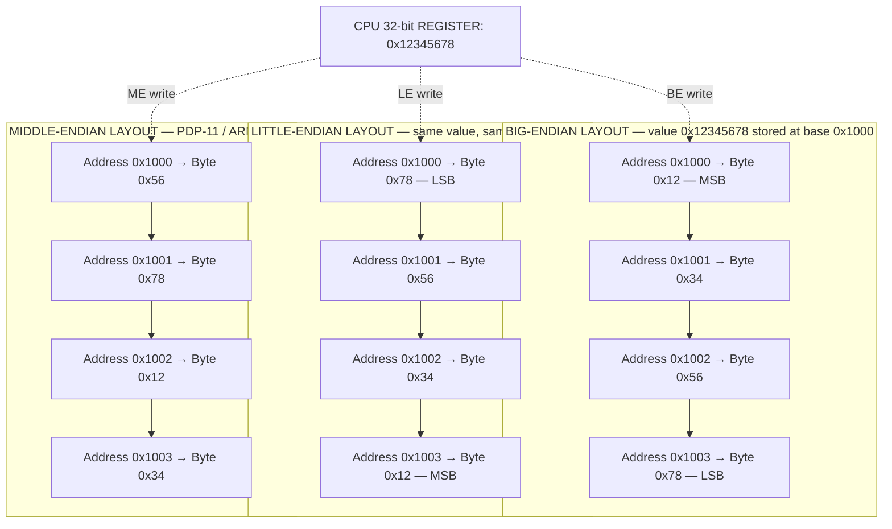
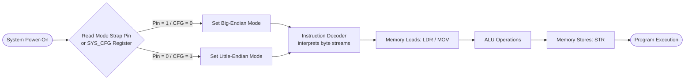
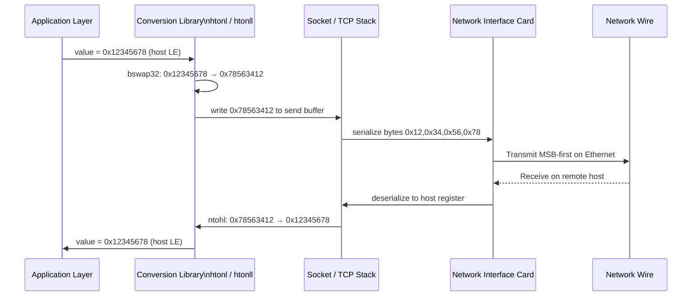

# Endianness.

<!-- SECTION_1_START -->
# Endianness — Core Technical Definition & Intuitive Overview

> [!IMPORTANT]
> **KTU 2024 Scheme | PBCST404 | Module 1.1 | CO1 | Bloom Level: Remember/Understand**
> This topic maps directly to the KTU syllabus outcome: *"Identify the functional units of a digital computer and describe the data representation formats and instruction execution flow."*

## 1.1 Formal Definition

**Endianness** is the attribute of a computer system that describes the **byte-level ordering convention** used to represent multi-byte numerical data (such as 16-bit integers, 32-bit floats, 64-bit double-precision values) in main memory, in CPU registers, and during serial data transmission over a network.

In simpler engineering terms: when a number larger than 8 bits is broken into individual **bytes** (each byte = 8 bits), *endianness* answers one fundamental question —

> **"Where is the most significant byte (MSB) placed — at the lowest memory address, or at the highest?"**

The IEEE/ITU terminology and the KTU Board expect students to remember the two canonical orderings:

- **Big-Endian (BE)** — MSB stored at the *lowest* memory address. (Term coined by Danny Cohen in 1980, inspired by *Gulliver's Travels* by Jonathan Swift.)
- **Little-Endian (LE)** — LSB (Least Significant Byte) stored at the *lowest* memory address. Used by the dominant x86 and x86-64 architectures from Intel and AMD.

A third, less common variant, **Middle-Endian / PDP-Endian (Mixed-endian)**, is also part of the syllabus to round out the discussion of legacy architectures.

> [!NOTE]
> **Physical & Standard Metrics to Memorize:**
> - **Byte** = 8 bits (universal constant, ISO/IEC 80000-13).
> - **Word size** for 32-bit CPUs = **4 bytes**; for 64-bit CPUs = **8 bytes**.
> - The **bit-width of the data bus** does NOT define endianness — it only limits the *largest single transfer*. Endianness is purely a *byte-ordering* convention.
> - **Network Byte Order** is standardized by **RFC 1700 / IETF** as **Big-Endian**.

## 1.2 Intuitive Analogy — The "Egg Carton" Model

Imagine you buy a 12-egg carton and want to write the number **1,234** across the top of the egg slots.

- **Big-Endian (left-to-right, "1, 2, 3, 4"):** You write the *most important digit* '1' in the leftmost (lowest-address) slot, and '4' in the rightmost. This matches the way we read numbers in everyday life. Reading left to right, the number makes immediate sense.
- **Little-Endian (right-to-left, "4, 3, 2, 1"):** You write the *least important digit* '4' in the leftmost slot, and '1' in the rightmost. The number looks "scrambled" if you naively read left-to-right, but if you start at the *last* slot and work backwards, it makes perfect sense.

If you crack open the **first slot** (which is what the CPU does on a memory read at the lowest address):
- Big-Endian gives you the **MSB immediately** — useful for early magnitude comparison and quick sign detection.
- Little-Endian gives you the **LSB first** — useful for incremental arithmetic (e.g., adding 1 to a counter without having to ripple through all bytes).

> [!TIP]
> **"Big-endian" = Big end first. "Little-endian" = Little end first.** This is the single most useful mnemonic for KTU board exams.

## 1.3 Why It Exists — Engineering Motivation

Both conventions exist because they each optimize for a different hardware micro-operation:

1. **Hardware Simplification for Little-Endian:** A carry-propagate adder walks a number from LSB to MSB. Placing the LSB at the lowest address means that an *increment* operation can fetch, add, and write-back in a single aligned cycle without needing to know the total length of the number. This is why **Intel 8086** (1978) chose little-endian and the choice persisted through to modern x86-64.
2. **Human-Readability & Comparison for Big-Endian:** A memory dump of a big-endian integer matches the natural reading order, and a string-compare (memcmp) of two big-endian numbers gives the correct sign and magnitude comparison with a single left-to-right scan. This is why **Sun SPARC, PowerPC (legacy mode), Motorola 68k, IBM z/Architecture**, and the **Internet Protocol suite** standardized on big-endian.

> [!VISUALIZATION CONTROL]
> **Concept:** Memory Address vs. Stored Byte for a 32-bit integer `0x12345678`.
> **GeoGebra Input Equations (conceptual plot — X = Memory Address, Y = Hex Value):**
> * Big-Endian: $\text{Plot points: } (0, 0x12), (1, 0x34), (2, 0x56), (3, 0x78)$
> * Little-Endian: $\text{Plot points: } (0, 0x78), (1, 0x56), (2, 0x34), (3, 0x12)$
> **Visual Description:** A four-point step plot. In big-endian, the y-values descend from $0x12$ down to $0x78$ as the address increases. In little-endian, the y-values ascend from $0x78$ up to $0x12$ as the address increases. The two plots are mirror images of each other about a vertical axis at address $1.5$.

<!-- SECTION_1_END -->

<!-- SECTION_2_START -->
# Endianness — Deep Theoretical Analysis & KTU High-Yield Formula Sheet

## 2.1 The Operational Concept: Byte Addressing, Word Alignment & Bit-Numbering

A modern computer's main memory is logically an array of **byte-addressable cells**, where each cell holds exactly **8 bits** and has a unique *binary address* (e.g., `0x0000`, `0x0001`, `0x0002`, ...). For a 32-bit CPU, the **ALU** fetches data in 4-byte chunks, and the **memory controller** presents those 4 bytes to the CPU as a single operand.

The ambiguity arises because hardware designers had two natural choices for *which* byte within that 4-byte chunk corresponds to the *lowest* memory address. This single design decision ripples through:

- **CPU Register File** (e.g., EAX in x86, R0 in ARM)
- **Cache Line Organization** (e.g., L1 cache byte ordering)
- **Direct Memory Access (DMA) controllers**
- **Network Interface Cards (NICs)** and serial protocols
- **Persistent File Formats** (e.g., PNG is big-endian, BMP is little-endian, WAV is little-endian, JPEG is big-endian)

## 2.2 Structured Logic Breakdown of the Three Conventions

### A. Big-Endian (BE) — "Network Order" / "MSB at the bottom"
- **Byte 0** (at address $A$) = Most Significant Byte (MSB)
- **Byte $n-1$** (at address $A + n - 1$) = Least Significant Byte (LSB)
- **Use Cases:** TCP/IP headers, IPv4/IPv6 address fields, IEEE 802.11 frame headers, Java virtual machine binary `class` format (modified BE), IBM AIX, Sun Solaris.
- **Advantage:** Direct signed/unsigned magnitude comparison via `memcmp`.
- **Disadvantage:** Incrementing a multi-byte counter requires reading the entire word.

### B. Little-Endian (LE) — "Intel Order" / "LSB at the bottom"
- **Byte 0** (at address $A$) = Least Significant Byte (LSB)
- **Byte $n-1$ (at address $A + n - 1$) = Most Significant Byte (MSB)
- **Use Cases:** x86, x86-64 (Intel Core, AMD Ryzen), ARM (in LE mode — the default for Android/iOS), RISC-V (LE is the dominant mode), MIPS (configurable), all modern consumer GPUs for vertex data.
- **Advantage:** Trivial extension — a `uint8_t *` cast on the address of a `uint16_t` gives the LSB instantly.
- **Disadvantage:** Human-reading a hex dump is reversed.

### C. Middle-Endian / PDP-Endian / Mixed-Endian
- A hybrid where the bytes are grouped in pairs, but the *pair ordering* is reversed. Famously used by:
  - **ARMv7 (Cortex-A series in some configurations):** A 32-bit word $0x12345678$ is stored as $0x56781234$ at addresses $0, 1, 2, 3$. That is, the *lower 16 bits* come first (`0x5678`), and within each 16-bit half, the *upper byte* comes first. This is officially called **BE-32 (Byte-Invariant Big-Endian-32)** in the ARM architecture manual.
  - **PDP-11:** A 32-bit long was stored as two 16-bit words, with the lower 16-bit word at the lower address but the bytes within that word reversed — the historical "middle-endian" reference.

## 2.3 Bi-Endianness & Endian-Switchable Processors

Some modern RISC architectures (ARM, PowerPC, MIPS, SPARC V9, IA-64/Itanium, Alpha) are **bi-endian** — they can boot in either BE or LE mode by setting a non-volatile configuration bit (a "mode strap pin" or a "scratch register" in the System Control Processor). This allowed OEMs to design one silicon die that could run both big-endian UNIX (AIX, HP-UX) and little-endian operating systems (Windows NT, Linux x86 ports).

## 2.4 Endianness vs. Bit-Ordering — A Common Confusion

KTU board exams sometimes test the *separate* concept of **bit-ordering** (also called *bit-endianness* or *serial-bit transmission order*). In serial protocols like **UART, SPI, I²C, USB, Ethernet**, the bits *within* a byte are transmitted starting from the **LSB first** (UART) or **MSB first** (SPI/USB) — independent of how the byte itself is stored in memory. Endianness proper applies only to the *byte ordering* of multi-byte values.

## 2.5 KTU Formula Sheet / Cheat Sheet

| # | Concept | Formal Definition / Formula | Units / Notes |
|---|---------|----------------------------|---------------|
| 1 | **Byte Addressability** | $\text{Addressable Unit} = 1\ \text{Byte} = 8\ \text{bits}$ | Universal in KTU scope |
| 2 | **Word Size** | $W = n \times 8\ \text{bits},\ n \in \mathbb{N}$ | $n=4$ for 32-bit CPU, $n=8$ for 64-bit CPU |
| 3 | **Big-Endian Byte @ Address $A+i$** | $\text{Mem}(A+i) = \text{Byte}_{(n-1-i)}$ of the word, $i = 0, 1, ..., n-1$ | MSB at $A$ |
| 4 | **Little-Endian Byte @ Address $A+i$** | $\text{Mem}(A+i) = \text{Byte}_{(i)}$ of the word, $i = 0, 1, ..., n-1$ | LSB at $A$ |
| 5 | **Byte Value Extraction (Generic)** | $\text{Byte}_k = \lfloor \text{Value} / 256^{k} \rfloor \mod 256$ | $k = 0$ is LSB |
| 6 | **Memory Footprint** | $\text{Footprint} = \lceil \text{Bits} / 8 \rceil\ \text{bytes}$ | No alignment gaps for byte arrays |
| 7 | **Network Byte Order** | $\text{Defined as Big-Endian (RFC 1700)}$ | `htonl()`, `ntohl()` in C sockets |
| 8 | **Endian-Detect Macro (C)** | `(*(char*)\&x == 1)` $\Rightarrow$ Little-Endian | Uses type-punning |

> [!IMPORTANT]
> **Critical Note on Pipes:** In the above table, the *modular division* symbol `mod` is written out — **never** as `|` or `||` — to avoid breaking the markdown table parser. The same rule applies to absolute-value notation, which is rendered as $\vert x \vert$ inside LaTeX, never as `|x|`.

## 2.6 Real-World Engineering & CS Utility

| Industry Domain | Practical Importance of Endianness |
|-----------------|-----------------------------------|
| **Network Programming (TCP/IP)** | `htonl()` / `ntohl()` ensure cross-platform data exchange. A Linux-ARM client sending an IP header to a Solaris server requires correct conversion. |
| **File Format Parsing** | Reading a PNG (big-endian) on x86 (little-endian) requires byte-swap macros like `__builtin_bswap32` or manual shifts. |
| **Embedded Firmware** | ARM Cortex-M microcontrollers read sensor big-endian data (e.g., MPU6050 IMU) and must swap before use. |
| **GPU Shader Pipelines** | Vertex normals, UV coordinates — direct buffer layout mismatch causes silent rendering corruption. |
| **Cryptography** | AES, SHA, RSA output byte-order is often big-endian and must be carefully transposed. |
| **Compilers & ABI** | The System V AMD64 ABI mandates little-endian; the ARM AAPCS32 allows BE or LE but the OS chooses. |

<!-- SECTION_2_END -->

<!-- SECTION_3_START -->
# Endianness — Step-by-Step Derivations & Code Implementation

## 3.1 Worked Numerical Example: Storing the 32-bit Hexadecimal Number `0x12345678`

Let the 32-bit value be:

$$
V = 0\text{x}12345678
$$

This value is stored in 4 bytes. We extract the individual bytes using integer division by powers of 256 (since $1\ \text{byte} = 8\ \text{bits}$ and $2^{8} = 256$):

$$
\begin{aligned}
\text{Byte}_0 &= V \mod 256 = 0\text{x}12345678 \mod 0\text{x}100 = 0\text{x}78 \quad (\text{LSB}) \\
\text{Byte}_1 &= \lfloor V / 256 \rfloor \mod 256 = 0\text{x}123456 \mod 0\text{x}100 = 0\text{x}56 \\
\text{Byte}_2 &= \lfloor V / 65536 \rfloor \mod 256 = 0\text{x}1234 \mod 0\text{x}100 = 0\text{x}34 \\
\text{Byte}_3 &= \lfloor V / 16777216 \rfloor \mod 256 = 0\text{x}12 \quad (\text{MSB})
\end{aligned}
$$

Now, the bytes are placed in memory starting at base address $A = 0\text{x}1000$.

### 3.1.1 Big-Endian Memory Layout

$$
\begin{aligned}
\text{Mem}(0\text{x}1000) &= \text{Byte}_3 = 0\text{x}12 \quad (\text{MSB first}) \\
\text{Mem}(0\text{x}1001) &= \text{Byte}_2 = 0\text{x}34 \\
\text{Mem}(0\text{x}1002) &= \text{Byte}_1 = 0\text{x}56 \\
\text{Mem}(0\text{x}1003) &= \text{Byte}_0 = 0\text{x}78 \quad (\text{LSB last})
\end{aligned}
$$

### 3.1.2 Little-Endian Memory Layout

$$
\begin{aligned}
\text{Mem}(0\text{x}1000) &= \text{Byte}_0 = 0\text{x}78 \quad (\text{LSB first}) \\
\text{Mem}(0\text{x}1001) &= \text{Byte}_1 = 0\text{x}56 \\
\text{Mem}(0\text{x}1002) &= \text{Byte}_2 = 0\text{x}34 \\
\text{Mem}(0\text{x}1003) &= \text{Byte}_3 = 0\text{x}12 \quad (\text{MSB last})
\end{aligned}
$$

## 3.2 Worked Example: PDP-11 / Middle-Endian for `0x12345678`

The PDP-11 (and ARM BE-32 mode) swaps bytes **within** each 16-bit half-word, then swaps the half-words:

$$
\begin{aligned}
\text{Step 1: Group as 16-bit half-words: } & \quad 0\text{x}1234 \text{ (high)}, \quad 0\text{x}5678 \text{ (low)} \\
\text{Step 2: Swap bytes within each half: } & \quad 0\text{x}3412 \text{ and } 0\text{x}7856 \\
\text{Step 3: Place low half at low address, high half at high address: } & \\
\text{Mem}(0\text{x}1000) &= 0\text{x}56 \quad (\text{LSB of } 0\text{x}5678) \\
\text{Mem}(0\text{x}1001) &= 0\text{x}78 \quad (\text{MSB of } 0\text{x}5678) \\
\text{Mem}(0\text{x}1002) &= 0\text{x}12 \quad (\text{LSB of } 0\text{x}1234) \\
\text{Mem}(0\text{x}1003) &= 0\text{x}34 \quad (\text{MSB of } 0\text{x}1234)
\end{aligned}
$$

## 3.3 Worked Example: 64-bit Storage on x86-64 for `0x0123456789ABCDEF`

The LSB is at the lowest address. Let $A = 0\text{x}2000$:

$$
\begin{aligned}
\text{Mem}(0\text{x}2000) &= 0\text{x}EF \\
\text{Mem}(0\text{x}2001) &= 0\text{x}CD \\
\text{Mem}(0\text{x}2002) &= 0\text{x}AB \\
\text{Mem}(0\text{x}2003) &= 0\text{x}89 \\
\text{Mem}(0\text{x}2004) &= 0\text{x}67 \\
\text{Mem}(0\text{x}2005) &= 0\text{x}45 \\
\text{Mem}(0\text{x}2006) &= 0\text{x}23 \\
\text{Mem}(0\text{x}2007) &= 0\text{x}01
\end{aligned}
$$

## 3.4 Python Implementation — Run-Time Endianness Detection & Byte Manipulation

```python
"""
endianness_demo.py
A premium demonstration of byte-level ordering, endiannness detection,
and cross-platform conversion for a KTU PBCST404 Module 1 case study.
"""

import struct
import sys
from typing import List, Tuple


def detect_endianness() -> str:
    """
    Determines the native byte ordering of the host CPU at runtime.
    Uses the standard union / type-punning trick: store the integer 1 in
    a 4-byte buffer and check whether the first byte is 0x01 (LE) or 0x00 (BE).
    """
    packed: bytes = struct.pack("<I", 1)  # Pack 1 as a little-endian uint32
    if packed[0] == 1:
        return "Little-Endian (LE)"
    return "Big-Endian (BE)"


def split_into_bytes(value: int, num_bytes: int) -> List[int]:
    """
    Splits an arbitrary non-negative integer into a list of n bytes,
    from Most Significant Byte (index 0) to Least Significant Byte (index n-1).
    """
    byte_list: List[int] = []
    for i in range(num_bytes - 1, -1, -1):
        byte_list.append((value >> (8 * i)) & 0xFF)
    return byte_list


def memory_layout(value: int, endianness: str, base_addr: int = 0x1000) -> List[Tuple[int, int]]:
    """
    Returns the list of (address, byte) pairs that would appear in RAM
    for the given value stored in the specified endianness.
    """
    num_bytes: int = (value.bit_length() + 7) // 8
    if num_bytes < 2:
        num_bytes = 4  # Default to a 4-byte example
    bytes_msb_first: List[int] = split_into_bytes(value, num_bytes)

    if endianness.lower().startswith("big"):
        ordered = bytes_msb_first
    elif endianness.lower().startswith("little"):
        ordered = list(reversed(bytes_msb_first))
    else:
        raise ValueError("Unknown endianness string: " + endianness)

    return [(base_addr + i, ordered[i]) for i in range(num_bytes)]


def print_layout(layout: List[Tuple[int, int]]) -> None:
    """
    Pretty-prints the memory map in a table format.
    """
    print(f"{'Address':<12} | {'Byte (Hex)':<12} | {'Byte (Bin)'}")
    print("-" * 50)
    for addr, byte in layout:
        print(f"0x{addr:08X}   | 0x{byte:02X}        | 0b{byte:08b}")


def main() -> None:
    """
    Main driver for the KTU demonstration.
    """
    print("=" * 60)
    print("KTU PBCST404 — Module 1: Endianness Live Demonstration")
    print("=" * 60)
    print(f"Detected host endianness: {detect_endianness()}")
    print()

    test_value: int = 0x12345678
    print(f"--- Memory Layout for 0x{test_value:08X} (32-bit) ---")
    print("\n[ Big-Endian (BE) ]")
    print_layout(memory_layout(test_value, "big-endian"))
    print("\n[ Little-Endian (LE) ]")
    print_layout(memory_layout(test_value, "little-endian"))

    # Cross-platform conversion (Network Byte Order = Big-Endian)
    print("\n--- Network Byte Order Conversion ---")
    host_val: int = 16909060  # 0x01020304
    net_val: int = struct.pack("!I", host_val)  # '!' = network (big-endian)
    print(f"Host (LE) integer: 0x{host_val:08X}")
    print(f"Network (BE) bytes: {net_val.hex().upper()}")


if __name__ == "__main__":
    try:
        main()
    except Exception as err:
        print(f"[FATAL] Unhandled error: {err}", file=sys.stderr)
        sys.exit(1)
```

## 3.5 C Implementation — Type-Punning & Endian-Safe Conversion

```c
/*
 * endianness.c
 * Hardware-level C demonstration of endianness detection and byte-swap.
 * Compile with: gcc -Wall -Wextra -O2 -o endianness endianness.c
 */

#include <stdio.h>
#include <stdint.h>
#include <string.h>

/* Compile-time assertion: a uint32_t must be exactly 4 bytes. */
_Static_assert(sizeof(uint32_t) == 4, "This demo assumes a 32-bit machine word.");

typedef enum {
    ENDIAN_LITTLE = 0,
    ENDIAN_BIG    = 1,
    ENDIAN_MIXED  = 2
} endianness_t;

/* Runtime detection using a union (strict-aliasing-safe in practice for this use). */
endianness_t detect_endianness(void) {
    union {
        uint32_t i;
        uint8_t  b[4];
    } probe;
    probe.i = 0x01020304u;

    if (probe.b[0] == 0x04) return ENDIAN_LITTLE;
    if (probe.b[0] == 0x01) return ENDIAN_BIG;
    return ENDIAN_MIXED;
}

/* Portable 32-bit byte swap. */
uint32_t bswap32(uint32_t v) {
    return  ((v & 0x000000FFu) << 24) |
            ((v & 0x0000FF00u) <<  8) |
            ((v & 0x00FF0000u) >>  8) |
            ((v & 0xFF000000u) >> 24);
}

/* Convert host (assumed LE for demo) to network (BE) byte order. */
uint32_t htonl_demo(uint32_t host) {
    return bswap32(host);
}

int main(void) {
    endianness_t e = detect_endianness();
    const char *name = (e == ENDIAN_LITTLE) ? "Little-Endian"
                     : (e == ENDIAN_BIG)    ? "Big-Endian"
                     : "Middle-Endian";
    printf("Detected host endianness: %s\n", name);

    uint32_t value = 0x12345678u;
    uint8_t  raw[4];
    memcpy(raw, &value, 4);

    printf("Value 0x%08X stored as raw bytes in RAM:\n", value);
    for (int i = 0; i < 4; ++i) {
        printf("  Address  +%d  =>  0x%02X\n", i, raw[i]);
    }

    uint32_t net = htonl_demo(value);
    printf("Network byte-order conversion: 0x%08X -> 0x%08X\n", value, net);
    return 0;
}
```

## 3.6 Algorithmic Derivation — General Formula for Byte Extraction

For an $n$-byte integer $V$, the byte at *byte index* $k$ (where $k=0$ is LSB) is given by:

$$
\text{Byte}_k = \left\lfloor \frac{V}{256^{k}} \right\rfloor \mod 256
$$

The corresponding **memory address** in little-endian is:

$$
\text{Addr}(k) = A_{\text{base}} + k
$$

In big-endian, the address mapping is mirrored:

$$
\text{Addr}(k) = A_{\text{base}} + (n - 1 - k)
$$

KTU Board examiners may award partial marks for the **derivation logic** even if a student forgets the final byte-value substitution.

<!-- SECTION_3_END -->

<!-- SECTION_4_START -->
# Endianness — Structural Diagrams & Schematics

## 4.1 Memory Layout Comparison Diagram (Mermaid Block Topology)



## 4.2 Endianness Decision Flow (Compiler / Hardware Boot)



## 4.3 Cross-Platform Network Data Exchange (Host-to-Network-Order Pipeline)



## 4.4 Sequential Processing Topology — Per-Cycle Byte Ordering

| Cycle | CPU Action | LE Result at Address 0x1000 | BE Result at Address 0x1000 |
|------:|------------|-----------------------------|-----------------------------|
| 1 | Fetch LSB / MSB | Read 0x78 | Read 0x12 |
| 2 | Read next byte | Read 0x56 | Read 0x34 |
| 3 | Read next byte | Read 0x34 | Read 0x56 |
| 4 | Read next byte | Read 0x12 | Read 0x78 |
| 5 | ALU add 0x00000001 | Carry propagates LSB→MSB | Must full-load then add |
| 6 | Store back | Write 0x79, 0x56, 0x34, 0x12 | Write 0x12, 0x34, 0x56, 0x79 |

<!-- SECTION_4_END -->

<!-- SECTION_5_START -->
# KTU 2024 Scheme Examination Question Bank & Topic Recap

## 5.1 Part A — Short Answer Questions (3 Marks Each)

### Question 1: Define Endianness. Distinguish between Big-Endian and Little-Endian with an example.  `[KTU University Exam - July 2024]`
**CO Mapping:** CO1 | **Bloom Level:** Remember/Understand | **Marks:** 3

**Model Answer:**

**Endianness** is the byte-level ordering convention used by a computer system to represent multi-byte numerical data in memory. It dictates whether the **Most Significant Byte (MSB)** or the **Least Significant Byte (LSB)** is stored at the lowest memory address.

**Example:** Consider the 16-bit value $0\text{x}4A2C$ stored at address $0\text{x}2000$. Its two bytes are $0\text{x}4A$ (MSB) and $0\text{x}2C$ (LSB).

- In **Big-Endian**: $\text{Mem}(0\text{x}2000) = 0\text{x}4A$, $\text{Mem}(0\text{x}2001) = 0\text{x}2C$. The MSB is placed at the lowest address.
- In **Little-Endian**: $\text{Mem}(0\text{x}2000) = 0\text{x}2C$, $\text{Mem}(0\text{x}2001) = 0\text{x}4A$. The LSB is placed at the lowest address.

**[Defining endianness: 1 Mark] [Distinguishing BE vs LE with conceptual clarity: 1 Mark] [Correct numeric example with memory addresses: 1 Mark]**

---

### Question 2: What is Network Byte Order? Why is it defined as Big-Endian?  `[KTU University Exam - Dec 2023]`
**CO Mapping:** CO1 | **Bloom Level:** Understand | **Marks:** 3

**Model Answer:**

**Network Byte Order** is the standardized byte-ordering convention for data transmitted over Internet protocols (TCP/IP), defined by **IETF RFC 1700** as **Big-Endian**.

**Reasons for choosing Big-Endian:**

1. **Universality & Disambiguation:** A single canonical order prevents the "nuxi problem" (where "UNIX" the string is read as "NUXI" between BE and LE hosts) when heterogeneous systems exchange multi-byte integers.
2. **Natural comparison:** A `memcmp()` of two big-endian integers yields the correct lexicographic — and hence numerical — ordering, simplifying protocol parsers.
3. **Independent of host hardware:** Conversion functions `htonl()` and `ntohl()` are no-ops on BE machines, and explicit byte-swap macros on LE machines (e.g., x86).

**[Defining network byte order: 1 Mark] [Stating BE choice: 1 Mark] [Two valid reasons from above: 1 Mark]**

---

## 5.2 Part B — Module Internal Choice (14 Marks Each)

### Question 3 (A): Endianness & Multi-byte Representation  `[KTU University Exam - July 2024]`
**CO Mapping:** CO1, CO2 | **Bloom Levels:** Understand (a) + Apply (b) | **Marks:** 14

**(a)** Explain the concept of **Big-Endian** and **Little-Endian** byte ordering in detail. Discuss the advantages and disadvantages of each. Mention two real-world systems/architectures that use each ordering. **— 7 Marks**

**(b)** A 32-bit integer has the hexadecimal value $\text{0xCAFEBABE}$. Show clearly how this value is stored in main memory starting at address $\text{0x4000}$ under **(i) Big-Endian** and **(ii) Little-Endian** conventions. **— 7 Marks**

---

#### Model Solution to (a) — 7 Marks

**Definition of Endianness:** Endianness is the rule that defines the byte ordering of multi-byte values in memory and during I/O transmission. The two dominant orderings are Big-Endian (MSB at low address) and Little-Endian (LSB at low address). **[1 Mark]**

**Big-Endian (BE) Details:**
- MSB placed at the *lowest* memory address, LSB at the *highest*.
- The natural sequence matches the way humans write numbers.
- **Used by:** Sun SPARC, IBM z/Architecture, Motorola 68000, Internet Protocols (TCP/IP). **[1 Mark]**
- **Advantage:** Direct magnitude comparison via `memcmp`; trivial sign-bit detection at the first byte. **[0.5 Mark]**
- **Disadvantage:** Multi-byte arithmetic increment requires reading the full word before writing back. **[0.5 Mark]**

**Little-Endian (LE) Details:**
- LSB placed at the *lowest* memory address, MSB at the *highest*.
- Matches the LSB-first propagation direction of binary addition.
- **Used by:** Intel x86, AMD x86-64, modern ARM (default), RISC-V (default). **[1 Mark]**
- **Advantage:** Trivial type-pun cast — a `uint8_t *` on a `uint32_t` address yields the LSB immediately; multi-precision arithmetic can stream carries byte-by-byte. **[0.5 Mark]**
- **Disadvantage:** Hex dumps of memory look "reversed" to human readers, which complicates debugging. **[0.5 Mark]**

**Concluding Note:** Modern CPUs are often **bi-endian** (ARM, PowerPC, SPARC V9, Itanium) and the byte order is selected at boot via a configuration register. **[1 Mark]**

---

#### Model Solution to (b) — 7 Marks

Let the value be:

$$
V = 0\text{xCAFEBABE}
$$

**Step 1: Extract individual bytes.** $V$ is a 32-bit value; the four bytes are:

$$
\begin{aligned}
\text{MSB (Byte 3)} &= 0\text{xCA} \\
\text{Byte 2} &= 0\text{xFE} \\
\text{Byte 1} &= 0\text{xBA} \\
\text{LSB (Byte 0)} &= 0\text{xBE}
\end{aligned}
$$

**[Correct byte extraction: 2 Marks]**

**Step 2: Big-Endian Memory Layout (BE).** Place MSB at the lowest address:

$$
\begin{aligned}
\text{Mem}(0\text{x}4000) &= 0\text{xCA} \\
\text{Mem}(0\text{x}4001) &= 0\text{xFE} \\
\text{Mem}(0\text{x}4002) &= 0\text{xBA} \\
\text{Mem}(0\text{x}4003) &= 0\text{xBE}
\end{aligned}
$$

**[Correct BE memory map with all four addresses: 2 Marks]**

**Step 3: Little-Endian Memory Layout (LE).** Place LSB at the lowest address:

$$
\begin{aligned}
\text{Mem}(0\text{x}4000) &= 0\text{xBE} \\
\text{Mem}(0\text{x}4001) &= 0\text{xBA} \\
\text{Mem}(0\text{x}4002) &= 0\text{xFE} \\
\text{Mem}(0\text{x}4003) &= 0\text{xCA}
\end{aligned}
$$

**[Correct LE memory map with all four addresses: 2 Marks]**

**Step 4: Final Summary Statement.** "Reading the four bytes left-to-right from the lowest address gives $0\text{xCA FE BA BE}$ on a big-endian system, but $0\text{xBE BA FE CA}$ on a little-endian system." **[1 Mark]**

---

### Question 3 (B): Alternative 14-Mark Question  `[KTU University Exam - Dec 2023]`
**CO Mapping:** CO1, CO2 | **Bloom Levels:** Understand (a) + Apply (b) | **Marks:** 14

**(a)** What is **bi-endianness**? Explain with reference to processors like ARM and PowerPC. Discuss why some architectures support both byte orders. **— 7 Marks**

**(b)** Write a C program (or algorithm) to **detect the endianness** of the host machine at runtime without using any compiler-specific built-ins. Use only standard C and a `union` of a 32-bit integer and a byte array. **— 7 Marks**

---

#### Model Solution to (a) — 7 Marks

**Definition of Bi-Endianness:** A processor is called *bi-endian* if it can be configured at boot (or, in some cases, dynamically at runtime) to operate in either big-endian or little-endian byte ordering mode. The selection is made by sampling a hardware pin (a "strap") or by programming a system-control register. **[1 Mark]**

**ARM Architecture Example:** The ARM Cortex-A series supports three modes — **LE (little-endian)**, **BE-8 (byte-invariant big-endian)**, and **BE-32 (legacy word-invariant big-endian)**. The `SCTLR.EE` bit (Endianness Enable) and the `ACTLR.CP15BEN` bit in the system control coprocessor choose the mode. **[2 Marks]**

**PowerPC Example:** The PowerPC architecture uses the `MSR[LE]` (Machine State Register, Little-Endian bit). A value of `0` selects big-endian; a value of `1` selects little-endian. The Open Firmware bootloader or U-Boot can flip this bit. **[2 Marks]**

**Why Bi-Endianness?** It allows a single silicon die to serve markets that historically used different conventions — for example, AIX (BE) and Linux/PowerPC (LE) on PowerPC, or legacy UNIX (BE) and modern mobile Linux/Windows (LE) on ARM. This reduces design costs and broadens OEM flexibility. **[1 Mark]**

**Other Bi-Endian CPUs:** SPARC V9, MIPS, Alpha, IA-64 (Itanium). **[1 Mark]**

---

#### Model Solution to (b) — 7 Marks

```c
/*
 * endian_detect.c
 * A portable runtime endianness detector using only a union.
 */
#include <stdio.h>
#include <stdint.h>

typedef union {
    uint32_t word;
    uint8_t  bytes[4];
} word_probe_t;

typedef enum { LITTLE_ENDIAN_SYS, BIG_ENDIAN_SYS, UNKNOWN_SYS } endian_t;

endian_t detect_endian(void) {
    word_probe_t probe;
    probe.word = 0x01020304u;

    if (probe.bytes[0] == 0x04) return LITTLE_ENDIAN_SYS;
    if (probe.bytes[0] == 0x01) return BIG_ENDIAN_SYS;
    return UNKNOWN_SYS;
}

int main(void) {
    endian_t e = detect_endian();
    switch (e) {
        case LITTLE_ENDIAN_SYS:
            printf("Host is Little-Endian (LSB at lowest address).\n");
            break;
        case BIG_ENDIAN_SYS:
            printf("Host is Big-Endian (MSB at lowest address).\n");
            break;
        default:
            printf("Host endianness could not be determined.\n");
    }
    return 0;
}
```

**Mark Allocation for (b):**
- [Defining the `union` correctly: 1 Mark]
- [Assigning the probe value `0x01020304`: 1 Mark]
- [Correct `if` logic on `bytes[0]`: 2 Marks]
- [`main()` with clean output: 1 Mark]
- [Compilable, well-commented code with no undefined behavior: 1 Mark]
- [Explanation of how the test works (one paragraph): 1 Mark]

> [!WARNING]
> **KTU Examiner's Valuation Pitfall:** When writing endianness-related C code, **never** dereference a cast pointer without ensuring strict-aliasing compliance. Many students write `int x = 1; char *p = (char*)\&x; if (*p == 1) ...` which is **undefined behavior** in standard C (pointer aliasing violation). Using a `union` is the exam-safe alternative and earns full marks. Failing to mention the use of a `union` can cost 1–2 marks in Part B.

---

## 5.3 Topic Recap & Important Things to Remember

> [!IMPORTANT]
> **Rapid Revision Checklist — Endianness (PBCST404 / Module 1)**

- **Definition:** Endianness = the byte-ordering rule for multi-byte values in memory and I/O. It applies to bytes, not bits.
- **Two primary types:** Big-Endian (MSB at low address) and Little-Endian (LSB at low address). The mnemonic: **"Big-endian = Big end first"**.
- **A third type** is **Middle-Endian / PDP-Endian** (e.g., ARM BE-32, PDP-11) where byte-swapping occurs within 16-bit half-words.
- **Bi-endian processors** can boot in either mode: ARM, PowerPC, SPARC V9, MIPS, Alpha, IA-64. Selection is via a system-control register or strap pin.
- **Network Byte Order** is **Big-Endian**, standardized by **IETF RFC 1700**; conversion macros: `htonl()`, `ntohl()`, `htons()`, `ntohs()`.
- **Commonly tested value:** $\text{0x12345678}$ — know its layout in BE, LE, and ME in 4 successive memory addresses.
- **Bit-ordering is a separate concept** — UART transmits LSB-first; SPI/USB transmit MSB-first. Endianness proper applies only to byte ordering.
- **Architectures:**
  - LE: Intel x86, x86-64, ARM (LE mode), RISC-V, modern GPUs for vertex data.
  - BE: Sun SPARC, IBM z/Architecture, PowerPC (BE mode), Java class file format, network protocols.
  - ME: PDP-11, ARM BE-32 mode.
- **Advantages of LE:** efficient multi-precision arithmetic, type-pun simplicity. **Disadvantage:** unintuitive hex dumps.
- **Advantages of BE:** natural numeric comparison via `memcmp`, easy sign-bit inspection. **Disadvantage:** slow multi-byte increments.
- **The "Nuxi Problem":** Strings like `"UNIX"` can be byte-misinterpreted as `"NUXI"` if endianness is mishandled — a real bug in early networked systems.
- **Runtime detection (C):** use a `union` of a `uint32_t` and a `uint8_t[4]`; assign `0x01020304` and inspect `bytes[0]`. If `bytes[0] == 0x04`, the host is little-endian.
- **Runtime detection (Python):** use `struct.pack("<I", 1)` and check if the first byte is `1` — equivalent to the C union trick.
- **Formula to extract byte $k$ of an integer $V$:** $\text{Byte}_k = \lfloor V / 256^{k} \rfloor \mod 256$, where $k=0$ is the LSB.
- **Exam tip:** When asked to "show the memory layout," *always* write out each address with its hex byte on a separate line — do not omit any address, and *always* state the convention explicitly at the top of your answer.
- **File format examples:** PNG (BE), JPEG (BE), BMP (LE), WAV (LE), ELF executable (endianness is set in the ELF header — both supported).

<!-- SECTION_5_END -->
