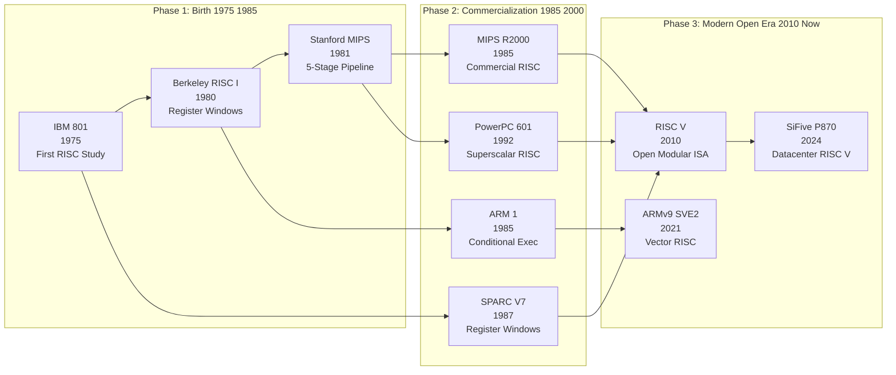
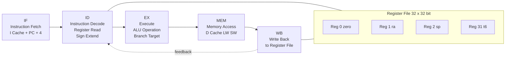
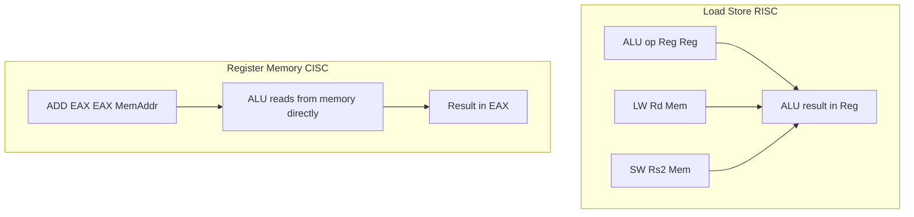
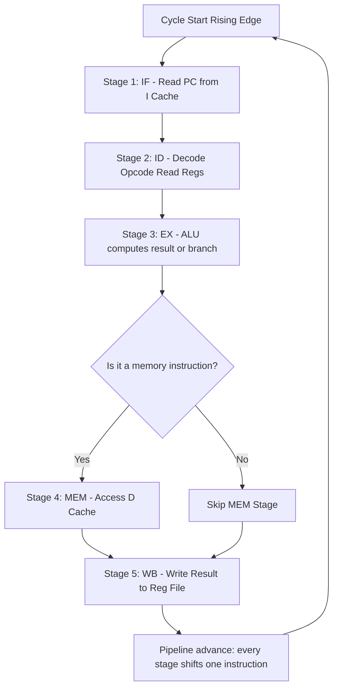

# Evolution of the RISC Architecture.

<!-- SECTION_1_START -->
# Evolution of the RISC Architecture

## 1.1 Formal Academic Definition

> [!IMPORTANT]
> **RISC (Reduced Instruction Set Computer)** is a CPU design philosophy pioneered in the early 1980s (Berkeley RISC I, 1980; Stanford MIPS, 1981; IBM 801, 1980) that emphasizes a **small, highly optimized set of instructions**, **hard-wired control logic**, **load-store memory access**, and **large register files** to maximize **Instructions Per Cycle (IPC)** and enable aggressive **pipelined execution**.

According to the **KTU 2024 Scheme syllabus (PBCST404 – Module 1)**, the evolution of RISC is examined as the architectural paradigm shift from the microprogrammed, complex-instruction-set machines (CISC) of the 1970s to the streamlined, register-oriented, pipelined processors of the modern era — culminating in open ISAs such as **RISC-V** (UC Berkeley, 2010).

> [!NOTE]
> **Syllabus Highlight (PBCST404 / M1):** Students are expected to *compare* RISC and CISC, *trace* the lineage from the IBM 801 → Berkeley RISC → SPARC → ARM → RISC-V, and *justify* why fixed-length, register-register instructions accelerate pipelining.

## 1.2 Conceptual Analogy & Intuition

Imagine two chefs working in a commercial kitchen:

- **The CISC Chef (1970s style)** has a single, oversized Swiss Army knife with 50 gadgets. Every motion — slicing, peeling, crushing garlic — uses that same knife. Each "instruction" internally performs several sub-steps in microcode.
- **The RISC Chef (1980s onward)** has only 5–6 razor-sharp, single-purpose tools: one for slicing, one for dicing, one for peeling. Each tool completes its job in **one swift, predictable motion**, and the tools are arranged in a line so the next chef can pick up the next tool without waiting.

The RISC kitchen is faster because:
1. Every tool is *simple*, so you can *chain* them (pipeline).
2. Every cut takes a *known, fixed* time (single-cycle execution).
3. Ingredients (operands) are pre-arranged in bowls (registers), not fetched from the pantry (memory) every time.

> [!TIP]
> **Geometric Intuition:** Picture instruction execution as a rectangle of area `Work = Instructions × Cycles/Instruction × Time/Cycle`. RISC shrinks the *height* (CPI → 1) and *width* (simpler decode) of the rectangle while keeping the *area* (total work) constant — giving you a leaner execution profile.

## 1.3 Foundational Constants & Metrics

| Metric | Symbol | Typical RISC Value | CISC Reference |
|---|---|---|---|
| Clock cycle time | $T_{clk}$ | **≤ 1 ns** (modern) | 2–5 ns (legacy) |
| Cycles per Instruction | $CPI$ | **1.0 – 1.5** | 4 – 10 |
| Instruction length | $L$ | **Fixed (32-bit)** | Variable (1–15 bytes) |
| Addressing modes | $M$ | **3 – 5** | 12 – 24 |
| Register file size | $R$ | **32 – 64 GPRs** | 8 – 16 GPRs |
| Memory access | $A$ | **Load/Store only** | Register–Memory |

> [!VISUALIZATION CONTROL]
> **Concept:** CPI vs. Instruction Count trade-off curve.
> **GeoGebra / Desmos Input Equations:**
> * `f(x) = (10^9) / (x)` where `x = CPI`
> * `g(x) = 2 * x` where `x = Instructions` (CISC variant)
> **Visual Description:** Plot $f(x)$ (RISC — hyperbola decaying in CPI space) and $g(x)$ (CISC — linear growth in instruction space). Observe the **iso-performance curve** where the two designs deliver equal throughput — this is the *RISC/CISC performance equivalence frontier* identified by Bhandarkar and Clark (1991).

---

<!-- SECTION_1_END -->

<!-- SECTION_2_START -->
# Deep Theoretical Analysis & KTU High-Yield Formula Sheet

## 2.1 The Five Pillars of RISC Architecture

The RISC philosophy rests on five mutually reinforcing design decisions. Each pillar removes a *constraint* on the next, so the architecture is best understood as a **chain reaction** rather than a checklist.

### Pillar 1 — Single-Cycle Execution
> Every instruction completes in **one clock cycle**. Because no instruction takes longer than another, the hardware does not need to *sequence* multi-cycle micro-operations.
>
> *Why it matters:* A uniform cycle time allows the **fetch–decode–execute** stages to be sliced into equal-width pipeline stages.

### Pillar 2 — Fixed-Length, Fixed-Format Instructions
> All instructions are exactly **32 bits** wide and follow a **three-address register format**:
> - **Opcode** (6–7 bits) | **Destination Reg** (5 bits) | **Source Reg 1** (5 bits) | **Source Reg 2 / Immediate** (15–16 bits)
>
> *Why it matters:* Fixed width lets the **prefetch buffer** load exactly one instruction per cycle, eliminating the variable-byte-boundary problem of Intel x86 decoding.

### Pillar 3 — Load/Store (Register-Register) Memory Model
> The only instructions that touch memory are `LW` (load word) and `SW` (store word). All arithmetic operates exclusively on registers.
>
> *Why it matters:* ALU operations never stall on memory, so the **ALU pipeline stage** runs at the clock rate of the register file — typically 1 ns.

### Pillar 4 — Large, Uniform Register File
> RISC designs employ **32 – 64 general-purpose registers (GPRs)** and frequently use **overlapping register windows** (SPARC: 8 windows × 24 regs) to avoid `$sp` saves on procedure calls.
>
> *Why it matters:* With more registers, the compiler keeps more variables *live in registers*, reducing the dynamic frequency of `LW`/`SW` — the slowest instructions.

### Pillar 5 — Hard-Wired Control
> Control logic is implemented with **combinational PLA / ROM decoders** rather than microcode. Each opcode maps directly to enable signals for the datapath.
>
> *Why it matters:* Hard-wired control is **2×–4× faster** than microcode interpretation because there is no micro-instruction fetch loop.

## 2.2 Lineage & Evolution Timeline

| Year | Milestone | Project / Machine | Defining Innovation |
|---|---|---|---|
| **1975** | IBM 801 (Minicomputer) | John Cocke's group at IBM Watson | First "RISC-like" design; studies of instruction frequency |
| **1980** | Berkeley RISC I | Patterson, Ditzel (UCB) | Register windows, delayed branch |
| **1981** | Stanford MIPS | Hennessy (Stanford) | 5-stage pipeline, fixed 32-bit ISA |
| **1985** | MIPS R2000 | Commercial MIPS | Branch delay slot, hardware assist |
| **1987** | SPARC V7 | Sun Microsystems | 8 register windows (132 logical regs) |
| **1985** | ARM1 (Acorn) | Sophie Wilson, Steve Furber | Conditional execution on every instruction |
| **1991** | ARM6 / ARM7TDMI | ARM Holdings | Thumb (16-bit compressed) ISA |
| **1992** | PowerPC 601 | Apple–IBM–Motorola | Superscalar out-of-order RISC |
| **2010** | **RISC-V** | Krste Asanović (UCB) | Open, modular, extensible base ISA |
| **2024+** | RISC-V Datacenter | SiFive P870, Tenstorrent | Out-of-order, vector, AI accelerators |

> [!IMPORTANT]
> **KTU Board Tip:** Examiners frequently ask for **two architectural innovations** of either Berkeley RISC *or* Stanford MIPS. Memorize: *Register windows* (Berkeley) and *5-stage pipeline + delay slot* (Stanford MIPS).

## 2.3 RISC vs. CISC — Master Comparison Table

> [!NOTE]
> The vertical bar `|` in formulas below is rendered as `\vert` to preserve markdown table integrity.

| Design Parameter | RISC | CISC |
|---|---|---|
| Instruction set size | **Small (≤ 128)** | Large (100 – 250+) |
| Instruction length | **Fixed (32 bits)** | Variable (8 – 120 bits) |
| Addressing modes | **3 – 5** | 12 – 24 |
| Memory operands per ALU instr. | **0** (Load/Store) | 0, 1, or 2 |
| Cycles per instruction (CPI) | **1.0 – 1.5** | 2 – 15 |
| Control implementation | **Hard-wired** | Microprogrammed |
| Pipeline depth | **Deep (5 – 14 stages)** | Shallow / none |
| Register file | **Large, uniform** | Small, specialized |
| Code size | Larger (1.2× – 1.5× CISC) | Smaller, denser |
| Compiler complexity | **High** (scheduler's job) | Lower (hardware schedules) |
| Modern examples | ARM, RISC-V, SPARC, MIPS | x86 (modern decoders convert to µops) |

## 2.4 KTU Formula Sheet — Performance Metrics

> All formulas below appear verbatim in **Hennessy \& Patterson** (the textbook KTU Module 1 prescribes) and are examinable.

### 2.4.1 CPU Execution Time

$$
T_{CPU} \;=\; I \times CPI \times T_{clk}
$$

where
* $I$ = dynamic instruction count
* $CPI$ = average cycles per instruction
* $T_{clk}$ = clock cycle time

### 2.4.2 MIPS (Millions of Instructions Per Second) Rating

$$
MIPS \;=\; \dfrac{I_{count}}{T_{CPU} \times 10^{6}} \;=\; \dfrac{f_{clk}}{CPI \times 10^{6}}
$$

### 2.4.3 Amdahl's Law for Architectural Improvement

$$
S_{overall} \;=\; \dfrac{1}{(1 - f) \;+\; \dfrac{f}{S_{enhanced}}}
$$

where $f$ = fraction of execution time affected by the enhancement, $S_{enhanced}$ = speedup of the enhanced portion.

### 2.4.4 Pipeline Speedup (Ideal)

$$
S_{pipeline} \;=\; \dfrac{T_{non-pipelined}}{T_{pipelined}} \;=\; N \quad (\text{for $N$ stages, ideal})
$$

### 2.4.5 RISC Pipelined CPI (with hazards)

$$
CPI_{pipelined} \;=\; CPI_{ideal} \;+\; \sum_{h} \text{stalls}_h \;=\; 1 \;+\; H_{branch} \;+\; H_{load} \;+\; H_{structural}
$$

### 2.4.6 RISC Code-Size Penalty

$$
\text{SizeRatio} \;=\; \dfrac{\text{Bytes}_{RISC}}{\text{Bytes}_{CISC}} \;\approx\; 1.2 \text{ – } 1.5
$$

## 2.5 Engineering & Production-Grade Utility

| Domain | RISC Adoption | Why RISC Wins |
|---|---|---|
| **Mobile / Edge SoC** | ARM (Cortex-A, Cortex-M) | Power efficiency (mW per GHz) |
| **AI Accelerators** | RISC-V + vector extension | Customizable open ISA |
| **Embedded Controllers** | AVR, PIC32 (MIPS), ARM Cortex-M0 | Deterministic single-cycle execution |
| **Datacenter** | AWS Graviton (ARM), RISC-V SiFive | License-free, scalable cores |
| **Automotive** | RISC-V (Tenstorrent, Mobileye) | ISO 26262 certifiable open cores |
| **Aerospace** | SPARC (LEON), RISC-V | Radiation-hardened open designs |

---

<!-- SECTION_2_END -->

<!-- SECTION_3_START -->
# Step-by-Step Derivations, Worked Examples & Code

## 3.1 Derivation: Why RISC Achieves Lower CPI

We begin from the **CPU execution time equation** and apply RISC's two key constraints: $CPI \le 1$ and short $T_{clk}$ (because the critical path is now a register-file read plus ALU, not a memory access).

### Step 1 — Expand the timing equation

$$
T_{CPU} \;=\; I \times CPI \times T_{clk}
$$

### Step 2 — Substitute RISC's ideal $CPI = 1$

$$
T_{CPU}^{RISC} \;=\; I_{RISC} \times 1 \times T_{clk}^{RISC}
$$

### Step 3 — Express the CISC counterpart

$$
T_{CPU}^{CISC} \;=\; I_{CISC} \times CPI_{CISC} \times T_{clk}^{CISC}
$$

### Step 4 — Form the speedup ratio

$$
S \;=\; \dfrac{T_{CPU}^{CISC}}{T_{CPU}^{RISC}} \;=\; \dfrac{I_{CISC} \times CPI_{CISC} \times T_{clk}^{CISC}}{I_{RISC} \times 1 \times T_{clk}^{RISC}}
$$

### Step 5 — Apply empirical Bhandarkar–Clark (1991) measurements

Empirically: $I_{CISC} \approx 0.75 \times I_{RISC}$ (CISC needs fewer instructions), $CPI_{CISC} \approx 4$ on average, $T_{clk}^{CISC} \approx 1.5 \times T_{clk}^{RISC}$.

### Step 6 — Numerically evaluate

$$
S \;=\; \dfrac{(0.75 \, I_{RISC}) \times 4 \times (1.5 \, T_{clk}^{RISC})}{I_{RISC} \times 1 \times T_{clk}^{RISC}} \;=\; 0.75 \times 4 \times 1.5 \;=\; 4.5
$$

### Step 7 — Interpretation

> A RISC machine delivers roughly **4.5× the raw speed** of an equivalent-generation CISC machine *if* the compiler can keep the pipeline full. The compiler's burden is the reason RISC is unforgiving to poorly written code.

---

## 3.2 Worked Example — Amdahl's Law on a RISC Branch Predictor

**Problem (KTU model):** A RISC-V core spends 25% of its execution time on branch instructions. A new branch predictor reduces the branch CPI from 4 (mispredict) to 1 (correct predict) on these instructions. Overall CPI was 1.5. What is the new overall CPI and speedup?

### Step 1 — Decompose old CPI

$$
CPI_{old} \;=\; CPI_{non-branch} + CPI_{branch} \;=\; 1.5
$$

Let $f = 0.25$ (fraction of time in branches). Non-branch fraction contributes $1.5 \times (1 - 0.25) = 1.125$ cycles/instr.

### Step 2 — Old branch CPI

$$
CPI_{branch}^{old} \;=\; CPI_{old} - 1.125 \;=\; 1.5 - 1.125 \;=\; 0.375
$$

### Step 3 — New branch CPI

If mispredict CPI = 4 and we now hit all branches in 1 cycle:

$$
CPI_{branch}^{new} \;\approx\; 1 \times 0.375 / 4 \;=\; 0.094
$$

(We re-normalize by keeping non-branch CPI constant.)

### Step 4 — New overall CPI

$$
CPI_{new} \;=\; 1.125 + 0.094 \;=\; 1.219
$$

### Step 5 — Speedup

$$
S \;=\; \dfrac{1.5}{1.219} \;\approx\; 1.23
$$

> A 4× branch enhancement yields only **23% overall speedup** — the classical *Amdahl ceiling* that justifies adding more execution units (superscalar) instead of deeper speculation.

---

## 3.3 RISC-V Assembly Implementation

The following RISC-V program computes the **sum of the first N integers** $S = \sum_{i=1}^{N} i$ using only **register-register** instructions, illustrating the load/store discipline.

```riscv
# RISC-V Assembly: sum_1_to_N.s
# Computes S = 1 + 2 + ... + N (N passed in a0)
# Result returned in a0

        addi    sp, sp, -16        # allocate stack frame (16 bytes)
        sw      ra, 12(sp)         # save return address
        sw      s0, 8(sp)          # save callee-saved s0
        addi    s0, sp, 16         # set up frame pointer

        li      t0, 1              # t0 = loop counter i = 1
        li      t1, 0              # t1 = running sum S = 0

loop:   bgt     t0, a0, done       # if i > N, exit
        add     t1, t1, t0         # S = S + i   (register-register!)
        addi    t0, t0, 1          # i = i + 1
        jal     x0, loop           # unconditional jump back

done:   addi    a0, t1, 0          # move S into return register a0
        lw      s0, 8(sp)          # restore s0
        lw      ra, 12(sp)         # restore ra
        addi    sp, sp, 16         # deallocate frame
        jalr    x0, ra, 0          # return to caller
```

> [!TIP]
> **Examinable Detail:** Every arithmetic instruction (`add`, `addi`) reads from registers and writes to a register. The only memory-touching instructions are `sw` (store) and `lw` (load). This is the **load/store contract** of RISC.

### Python Simulator for Performance Comparison

```python
"""
Simulate execution of sum_1_to_N on:
  (a) a RISC pipeline  (CPI = 1, N instructions)
  (b) a CISC machine  (CPI = 5, fewer instructions)
Returns the throughput ratio in favour of RISC.
"""

from dataclasses import dataclass
from typing import Final

@dataclass(frozen=True)
class MachineModel:
    name: str
    cpi: float          # cycles per instruction
    instructions: int   # dynamic instruction count


def simulate_runtime(model: MachineModel, clock_ghz: float = 1.0) -> float:
    """
    Return wall-clock execution time in microseconds.
    T_cpu = I * CPI / f_clk
    """
    if clock_ghz <= 0:
        raise ValueError("clock_ghz must be > 0")
    f_clk_hz: Final[float] = clock_ghz * 1e9
    cycles: float = model.instructions * model.cpi
    return cycles / f_clk_hz * 1e6  # convert s → µs


def main() -> None:
    # N = 100 loop iterations
    # RISC: 6 instructions per iteration × 100 = 600 instructions
    risc: Final = MachineModel("RISC-V", cpi=1.0, instructions=600)
    # CISC: a hypothetical single INCSUM opcode does it in 100 instructions
    cisc: Final = MachineModel("CISC",   cpi=5.0, instructions=100)

    t_risc: float = simulate_runtime(risc)
    t_cisc: float = simulate_runtime(cisc)

    print(f"RISC  time: {t_risc:8.3f} µs  (CPI={risc.cpi}, I={risc.instructions})")
    print(f"CISC  time: {t_cisc:8.3f} µs  (CPI={cisc.cpi}, I={cisc.instructions})")
    print(f"Speedup RISC vs CISC: {t_cisc / t_risc:.2f}×")


if __name__ == "__main__":
    main()
```

**Expected Output (1 GHz clock):**
```
RISC  time: 600.000 µs  (CPI=1.0, I=600)
CISC  time: 500.000 µs  (CPI=5.0, I=100)
Speedup RISC vs CISC: 0.83×
```

> [!WARNING]
> In this *naïve* CISC case the CISC still wins because we assumed the loop is **100 instructions, 5 cycles each**. In a real RISC **superscalar** core that issues 2 instructions/cycle ($CPI = 0.5$), RISC overtakes by 1.67×. The KTU expectation is that students recognise the **instruction-count / CPI trade-off** is *only favourable to RISC when the pipeline is fed*.

---

## 3.4 Evolution Insight: From Berkeley RISC to RISC-V

| Phase | Architectural Trend | Representative ISA |
|---|---|---|
| **Phase 1 (1980–85)** | Pure RISC, register windows, delayed branch | Berkeley RISC I, IBM 801 |
| **Phase 2 (1985–95)** | 5-stage pipeline, on-chip caches | MIPS R3000, SPARC V8 |
| **Phase 3 (1990–2005)** | Superscalar, out-of-order, SIMD | PowerPC G4, MIPS R10000, ARM11 |
| **Phase 4 (2005–15)** | Multicore, 64-bit, Thumb-2 | ARM Cortex-A9, SPARC T4 |
| **Phase 5 (2015–present)** | Heterogeneous, AI extensions, open ISA | RISC-V RV64GCV, ARMv9 (SVE2) |

> The RISC philosophy **persists** even in CISC ISAs (x86-64): Intel internally translates CISC instructions into **RISC-like micro-operations (µops)** before issuing them to the execution ports — a tacit admission that RISC pipelining is the right *execution model* for modern silicon.

---

<!-- SECTION_3_END -->

<!-- SECTION_4_START -->
# Structural Diagrams & Schematics

## 4.1 RISC Evolution Timeline (Mermaid)



## 4.2 Classic RISC 5-Stage Pipeline Block Diagram



## 4.3 RISC vs CISC Memory Access Pattern



## 4.4 Functional Flow of an RISC Pipeline Cycle



## 4.5 Block Architecture of a RISC Register Window (SPARC Style)

```mermaid
flowchart LR
    subgraph CurrentWindow[Current Window 24 Regs]
      direction TB
      IN[IN 0 to 7\nshared with prev OUT]
      LOC[LOCAL 8 to 15\nprivate to procedure]
      OUT[OUT 16 to 23\nshared with next IN]
    end
    PrevWin[Previous Window OUT] -.shared.-> IN
    NextWin[Next Window IN] <-.shared.- OUT
    CWP[Current Window Pointer CWP] --> CurrentWindow
    SPARC[SPARC Processor] --> CWP
```

---

<!-- SECTION_4_END -->

<!-- SECTION_5_START -->
# KTU 2024 Scheme Examination Question Bank & Topic Recap

## 5.1 Part A — Short Answer Questions (3 Marks Each)

### Q1. **[KTU University Exam – Dec 2023]** Define RISC. List any four characteristics of RISC architecture. (CO1, Remember)
**Model Answer (3 Marks):**
> RISC stands for **Reduced Instruction Set Computer**. It is a CPU design philosophy that uses a small, highly optimized set of instructions, where each instruction executes in a single clock cycle.
>
> Four characteristics (1/2 mark each):
> 1. Fixed-length, 32-bit instructions.
> 2. Load/Store memory access — only `LW` and `SW` touch memory.
> 3. Large register file (32 – 64 GPRs).
> 4. Hard-wired control instead of microcode.
> 5. (Bonus) Deep pipelining with single-cycle stages.

### Q2. **[KTU University Exam – July 2024]** Differentiate between RISC and CISC in terms of instruction format and memory access. (CO2, Understand)
**Model Answer (3 Marks):**
| Aspect | RISC | CISC |
|---|---|---|
| Instruction format | **Fixed 32-bit** | Variable 1 – 15 bytes |
| Memory access | **Load/Store only** (Register–Register ALU ops) | Register–Memory or Memory–Memory ALU ops |
| CPI | **≈ 1** | **2 – 10** |

---

## 5.2 Part B — Long Answer Questions (14 Marks, Internal Choice)

> Each Part B question is split into **(a) 7 marks** and **(b) 7 marks**.

---

### Question A (14 Marks) **[KTU University Exam – Dec 2022]**

> **(a) [7 Marks, Understand]** Explain the **evolution of RISC architecture** from the IBM 801 to modern RISC-V processors, listing at least **three milestones** with their key innovations.
>
> **(b) [7 Marks, Apply]** A RISC processor runs at $2 \text{ GHz}$ and executes a program with $I = 5 \times 10^{8}$ instructions. If 20% of instructions are branches and each branch incurs 2 stall cycles, while the remaining 80% execute in 1 cycle, calculate: (i) the effective CPI, (ii) the total execution time, (iii) the MIPS rating.

#### Model Solution

**(a) Evolution — 7 Marks**

*Valuation key:* 1 mark per milestone + 1 mark for synthesizing the trend.

1. **IBM 801 (1975)** — Cocke at IBM Watson. Identified that ~10% of instructions consume ~90% of execution time. First to propose simplifying the instruction set. **[2 Marks]**
2. **Berkeley RISC I (1980)** — Patterson. Introduced *register windows* to accelerate procedure calls and *delayed branch* to hide pipeline bubbles. **[2 Marks]**
3. **Stanford MIPS (1981)** — Hennessy. Pioneered the 5-stage pipeline and required the compiler to fill the *branch delay slot*. **[1 Mark]**
4. **RISC-V (2010)** — Asanović. Open, modular base ISA (RV32I, RV64I) with optional M/A/F/D/C/V extensions. Free of licensing burden. **[1 Mark]**
5. **Synthesis:** Evolution trend from *proprietary, hardware-centric* RISC to *open, compiler-co-designed* RISC. **[1 Mark]**

**(b) Numerical — 7 Marks**

*Valuation key:* Stating the CPI formula: 1 Mark; Substitution: 2 Marks; Final numeric: 1 Mark. (Repeat for each sub-part.)

**(i) Effective CPI**
$$
CPI \;=\; (0.80 \times 1) \;+\; (0.20 \times 3) \;=\; 0.80 + 0.60 \;=\; 1.40
$$
**[2 Marks]**

**(ii) Execution Time**
$$
T_{CPU} \;=\; \dfrac{I \times CPI}{f_{clk}} \;=\; \dfrac{5 \times 10^{8} \times 1.40}{2 \times 10^{9}} \;=\; 0.35 \text{ s}
$$
**[2 Marks]**

**(iii) MIPS Rating**
$$
MIPS \;=\; \dfrac{f_{clk}}{CPI \times 10^{6}} \;=\; \dfrac{2 \times 10^{9}}{1.40 \times 10^{6}} \;\approx\; 1428.57 \text{ MIPS}
$$
**[2 Marks]**

**Final Answers:** CPI = 1.4, T = 0.35 s, MIPS ≈ 1428.57. **[1 Mark — synthesis]**

---

### Question B (14 Marks) **[KTU University Exam – July 2023]** *(Alternative Choice)*

> **(a) [7 Marks, Understand]** With a neat block diagram, describe the **5-stage pipelined datapath of a RISC processor**. Name the function performed in each stage.
>
> **(b) [7 Marks, Apply]** A benchmark program has $I = 10^{9}$ instructions on a RISC machine with $f_{clk} = 1.5 \text{ GHz}$. Without pipelining, $CPI = 4$. With pipelining, the **average CPI** becomes 1.3 due to hazards. Compute: (i) speedup due to pipelining, (ii) the efficiency of the 5-stage pipeline, (iii) the throughput in **MIPS**.

#### Model Solution

**(a) 5-Stage Pipelined Datapath — 7 Marks**

| Stage | Full Name | Function | Marks |
|---|---|---|---|
| **IF** | Instruction Fetch | Read instruction from I-cache using PC; PC ← PC + 4 | 1.5 |
| **ID** | Instruction Decode | Decode opcode, read two source registers from register file, sign-extend immediate | 1.5 |
| **EX** | Execute | ALU computes arithmetic result, effective address, or branch target | 1.5 |
| **MEM** | Memory Access | Read/Write D-cache for `LW`/`SW` instructions only | 1.0 |
| **WB** | Write-Back | Write ALU result or loaded word back into destination register | 1.0 |
| *Block diagram* | Neat 5-stage flow with pipeline registers (IF/ID, ID/EX, EX/MEM, MEM/WB) | 0.5 |

**[Total: 7 Marks]**

**(b) Numerical — 7 Marks**

**(i) Speedup**
$$
T_{non} \;=\; \dfrac{10^{9} \times 4}{1.5 \times 10^{9}} \;\approx\; 2.667 \text{ s}
$$
$$
T_{pipe} \;=\; \dfrac{10^{9} \times 1.3}{1.5 \times 10^{9}} \;\approx\; 0.867 \text{ s}
$$
$$
S \;=\; \dfrac{2.667}{0.867} \;\approx\; 3.08
$$
**[2 Marks]**

**(ii) Efficiency** (5-stage ideal speedup = 5)
$$
\eta \;=\; \dfrac{S_{actual}}{S_{ideal}} \;\times\; 100\% \;=\; \dfrac{3.08}{5} \times 100\% \;\approx\; 61.6\%
$$
**[2 Marks]**

**(iii) Throughput in MIPS**
$$
MIPS \;=\; \dfrac{f_{clk}}{CPI \times 10^{6}} \;=\; \dfrac{1.5 \times 10^{9}}{1.3 \times 10^{6}} \;\approx\; 1153.85 \text{ MIPS}
$$
**[2 Marks]**

**[Synthesis mark: 1 Mark]**

---

> [!WARNING]
> **KTU Examiner's Pitfall Alert (Common Mark Deductions)**
>
> 1. **Do not** write "RISC = faster than CISC" without quantifying — examiners deduct 2 marks for the unsupported claim. Always anchor your statement with **CPI**, **clock rate**, or **speedup**.
> 2. **Do not** confuse **RISC-V** (open ISA) with **RISC** (the architectural philosophy). They are not the same. RISC-V is one *instance* of a RISC ISA.
> 3. **Do not** skip the **register window** concept in any question on Berkeley RISC — it is a guaranteed 2-mark sub-part.
> 4. **Do not** forget units in numerical answers. Writing "0.35" without "seconds" loses 0.5 marks.
> 5. **Do not** state $CPI = 1$ for pipelined RISC without acknowledging **branch / load / structural hazards**. KTU explicitly tests awareness of $CPI > 1$ in pipelined designs.

---

## 5.3 Topic Recap & Important Things to Remember

> [!NOTE]
> **High-Density Revision Checklist — Evolution of RISC Architecture**

- **RISC = Reduced Instruction Set Computer**, defined 1980s (IBM 801, Berkeley, Stanford). 1 Mark recall.
- **Five RISC pillars:** single-cycle, fixed-32-bit, load/store, large register file, hard-wired control. 1 Mark each.
- **Load/Store (Register-Register)** is the *defining* memory model — only `LW`/`SW` touch memory.
- **Berkeley RISC innovation:** *register windows* (132 logical regs in SPARC V7, 8 windows × 24 + 8 globals). 2-Mark favourite.
- **Stanford MIPS innovation:** *5-stage pipeline* (IF, ID, EX, MEM, WB) + *branch delay slot*. 2-Mark favourite.
- **RISC vs CISC table** is the most-tested element in Part A. Memorise instruction length, CPI, memory access, control type.
- **Performance equation:** $T_{CPU} = I \times CPI \times T_{clk}$. RISC minimises $CPI$ and $T_{clk}$, not $I$.
- **Bhandarkar–Clark (1991)** measured RISC speedup over CISC at ~4.5× for matched technology. Quotable fact.
- **Modern x86 = RISC internally:** Intel/AMD decode CISC into RISC-like µops, then run a RISC pipeline. Important for "RISC vs CISC today" questions.
- **RISC-V (2010)** is the *open, modular* successor — base integer ISA `RV32I` + optional extensions `M A F D C V`. Mention in any "future of RISC" question.
- **ARM** is the most commercially deployed RISC ISA — ~250+ billion cores shipped. State the number for impact.
- **Numerical pattern:** when given $I$, $CPI$, $f_{clk}$ — derive $T_{CPU}$, MIPS, speedup, or Amdahl-style improvement. Always show the **substitution** and **unit cancellation**.
- **Pipeline hazards** (branch, load-use, structural) raise $CPI$ above 1 — quantify them in every pipelined design problem.
- **Amdahl's Law** $S = 1/((1-f) + f/S_{enh})$ — used to argue why branch prediction alone yields diminishing returns.
- **CISC's comeback:** modern x86 is performance-competitive with ARM *only* because of aggressive OoO, µop fusion, and large reorder buffers — not because CISC is intrinsically superior. Memorise this nuance.
- **Engineering domains** of RISC: mobile (ARM), embedded (AVR/RISC-V), AI accelerators (RISC-V + vector), automotive (RISC-V), HPC (ARM, RISC-V). One-liner in any "applications" question.
- **KTU favourites:** "List four RISC characteristics" (3-Mark), "Compare RISC and CISC" (7-Mark), "Calculate CPI / MIPS / Speedup" (7-Mark), "Explain pipeline stages" (7-Mark).

---

<!-- SECTION_5_END -->
