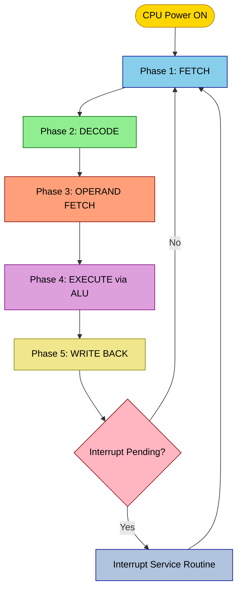
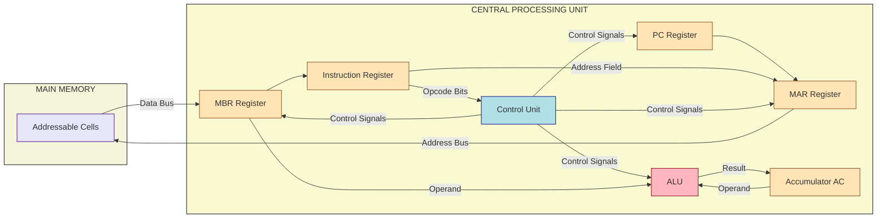
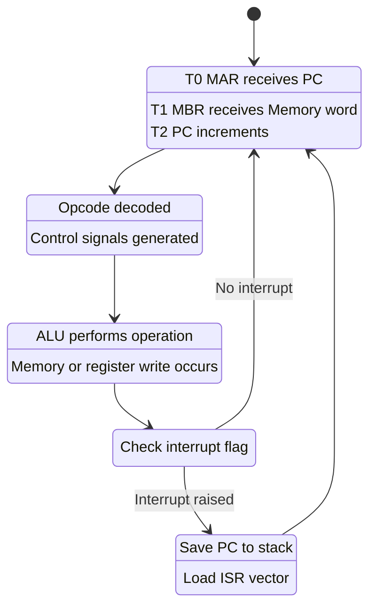

# Instruction execution cycle.

<!-- SECTION_1_START -->

# ⚙️ The Instruction Execution Cycle — Core Foundation

## 📘 Formal Academic Definition (KTU 2024 Syllabus Terminology)

> [!NOTE]
> **Instruction Execution Cycle (IEC):** The complete, continuous, and repetitive process performed by the **Central Processing Unit (CPU)** in which a single **machine-level instruction** is fetched from main memory, decoded by the control unit, executed by the **Arithmetic Logic Unit (ALU)**, and its result is stored back — after which the cycle immediately repeats for the next instruction pointed to by the **Program Counter (PC)**.

In the **KTU 2024 Scheme** framework, the instruction execution cycle is positioned as the *fundamental operational heartbeat* of the **Von Neumann / Stored-Program architecture**, in which both **data** and **instructions** reside in the same memory subsystem. The cycle is sometimes called the **Fetch–Decode–Execute (FDE) cycle** or the **Instruction Cycle**.

### 🧠 The Three Sub-Cycles

| Sub-Cycle | Acronym | Purpose |
| :--- | :--- | :--- |
| **Instruction Fetch Cycle** | IF | Retrieves the next instruction from memory |
| **Instruction Decode / Operand Fetch Cycle** | ID / OF | Interprets the opcode and locates operands |
| **Execute / Store Cycle** | EX / ST | Performs the operation and writes back the result |

---

## 🌍 Real-World Analogy — "The Chef in a Kitchen"

Imagine a **chef** in a fully automated restaurant kitchen.

1. The chef looks at the **recipe card** lying at the top of a stack → this is **Fetching the instruction**.
2. The chef reads the recipe and identifies whether it is a "fry", "boil", or "chop" command → this is **Decoding the opcode**.
3. The chef walks to the ingredient rack and grabs the vegetables → this is **Operand Fetch**.
4. The chef performs the cooking action → this is the **Execution** by the ALU.
5. The plated dish is sent out to the customer → this is the **Store / Write-Back** phase.
6. The chef moves to the next recipe card on the stack → this is the **PC increment**.

> [!IMPORTANT]
> **Why is this analogy powerful for KTU exams?**
> Examiners often award marks for explaining the *role of the Program Counter (PC)*. The chef always knows **which recipe to pick next** because the recipe stack is sequential — just as the **PC** always points to the **next instruction's memory address**.

---

## 🧩 Key Hardware Registers & Buses Involved

| Component | Full Form | Role in the Cycle |
| :--- | :--- | :--- |
| **PC** | Program Counter | Holds the address of the *next* instruction to be fetched |
| **MAR** | Memory Address Register | Buffer that drives the address bus to main memory |
| **MBR / MDR** | Memory Buffer / Data Register | Holds the data being transferred to/from memory |
| **IR** | Instruction Register | Stores the currently fetched instruction |
| **AC** | Accumulator | Primary working register used by the ALU |
| **ALU** | Arithmetic Logic Unit | Performs the actual computational operation |
| **Control Unit (CU)** | — | Generates the timing and control signals |

> [!IMPORTANT]
> **KTU 2024 Highlight:** The control signals `MEMREAD`, `MEMWRITE`, `REGREAD`, `REGWRITE`, `ALUOP`, and `PCSrc` are *explicit* outcomes expected in your answer scripts.

---

> [!VISUALIZATION CONTROL]
> **Concept:** Sequential Phases of the Instruction Cycle on a Timeline
> **Conceptual Plot Points (X = Time, Y = CPU Activity):**
> * $t_0$: PC=100 → MAR ← 100
> * $t_1$: MBR ← Memory[MAR] (FETCH)
> * $t_2$: IR ← MBR, PC ← PC+1 (DECODE boundary)
> * $t_3$: Operand fetch from memory or register
> * $t_4$: ALU executes operation (EXECUTE)
> * $t_5$: Result written to AC or memory (STORE)
>
> **Visual Description:** Plot a staircase graph with five rising steps. The X-axis represents clock cycles, and the Y-axis represents the increasing activity intensity from idle to ALU computation. The student should observe that **each instruction is a discrete, atomic set of micro-operations spread over multiple clock cycles**.

<!-- SECTION_1_END -->

<!-- SECTION_2_START -->

# 🔬 Deep Theoretical Analysis & KTU High-Yield Formula Sheet

## 🧭 The Complete Step-by-Step Micro-Operation Sequence

The instruction execution cycle, when broken down into **Register Transfer Language (RTL)** micro-operations, consists of the following six canonical phases. Every KTU board examiner expects these in either a 7-mark or 14-mark question.

### 🔹 Phase 1 — Instruction Address Loading (T0)
The address of the next instruction must be presented to memory.

$$MAR \leftarrow PC$$

> **Why this step?** Memory cannot "guess" which location to access. The CPU must explicitly place the address on the **address bus** via the **MAR**.

### 🔹 Phase 2 — Instruction Fetching (T1)
Memory places the contents of the addressed location onto the data bus, and the CPU latches it.

$$MBR \leftarrow Memory[MAR]$$
$$IR \leftarrow MBR$$

> **Why both transfers?** The $MBR$ acts as a *buffer* because the data bus is shared. The instruction must be held in $IR$ while decoding is in progress.

### 🔹 Phase 3 — Program Counter Update (T2)
The PC is incremented *in parallel* with decoding, so the next fetch does not have to wait.

$$PC \leftarrow PC + I$$

where **$I$ = instruction word length in bytes** (typically **$I = 4$** for a 32-bit RISC architecture).

### 🔹 Phase 4 — Decode and Operand Address Calculation (T3)
The **Control Unit** inspects the **opcode field** of $IR$ and generates the appropriate control signals. For a memory-reference instruction, the effective address is computed:

$$MAR \leftarrow IR[address\_field]$$
$$MBR \leftarrow Memory[MAR]$$

### 🔹 Phase 5 — Execute / ALU Operation (T4)
The ALU performs the arithmetic or logical operation. For example, an **ADD** instruction:

$$AC \leftarrow AC + MBR$$

### 🔹 Phase 6 — Store Result / Write-Back (T5)
The result may be written back to a register, accumulator, or memory:

$$Memory[MAR] \leftarrow AC \quad \text{(for store-type instructions)}$$

> [!IMPORTANT]
> **KTU 2024 Scheme Note:** Phases 1, 2, 3 belong to the **Fetch Cycle**. Phases 4, 5, 6 belong to the **Execute Cycle**. The **Decode** is a control-level activity that occurs *between* phases 2 and 4.

---

## 🧠 Interrupt Handling — A Hidden Phase

Modern CPUs (and the KTU syllabus) require a **seventh micro-phase** to handle **interrupts** transparently.

After each instruction completes, the control unit checks for pending interrupts:

$$PC \leftarrow PC_{current}$$
$$MAR \leftarrow PC$$
$$MBR \leftarrow Memory[MAR]$$
$$PC \leftarrow Routine\_Address$$
$$Memory[Stack\_Ptr] \leftarrow PC_{current}$$

> **Why is this part of the cycle?** Because interrupt handling *suspends* the normal flow and must be accounted for in the **RTL description** of a complete instruction cycle.

---

## 📋 KTU High-Yield Formula Sheet & Cheat Table

| Micro-Operation | Register Transfer Notation | Control Signals Asserted | Active Bus |
| :--- | :--- | :--- | :--- |
| Address the memory | $MAR \leftarrow PC$ | $PC_{out}, MAR_{in}$ | Internal CPU bus |
| Read instruction | $MBR \leftarrow M[MAR]$ | $MEM_{read}, MBR_{inE}$ | Data bus (external) |
| Load IR | $IR \leftarrow MBR$ | $MBR_{out}, IR_{in}$ | Internal CPU bus |
| Increment PC | $PC \leftarrow PC + I$ | $INC, PC_{in}$ | Internal ALU path |
| Decode opcode | $CU \leftarrow IR[opcode]$ | Decoder lines | Control unit internals |
| Fetch operand | $MAR \leftarrow IR[addr]$ | $IR_{out}, MAR_{in}$ | Internal CPU bus |
| Read operand | $MBR \leftarrow M[MAR]$ | $MEM_{read}, MBR_{inE}$ | Data bus (external) |
| ALU execute | $AC \leftarrow AC \pm MBR$ | $ALU_{op}, AC_{in}$ | ALU internal |
| Store result | $M[MAR] \leftarrow AC$ | $AC_{out}, MEM_{write}$ | Data bus (external) |

> [!IMPORTANT]
> **Symbols glossary for the table:**
> * $PC_{out}$ — gate that places PC's contents on the internal bus.
> * $MAR_{in}$ — control signal that latches bus data into MAR.
> * $MBR_{inE}$ — the *external* input version of MBR (from the data bus).
> * $AC$ — Accumulator register.

---

## 🏭 Real-World Engineering Utility

The instruction execution cycle is not merely an academic concept — it is the **direct blueprint** used in:

1. **Processor Pipeline Design** — Modern CPUs break the cycle into 5–20 stages (e.g., Intel's 14-stage Skylake pipeline) to overlap instruction execution and increase throughput.
2. **Emulators and Virtual Machines** — Software such as **QEMU**, **Bochs**, and the **Java Virtual Machine (JVM)** simulate the instruction cycle in software to run cross-architecture binaries.
3. **Debugging Tools** — GDB, single-step debuggers, and cycle-accurate simulators like **gem5** all visualize the FDE cycle to help engineers trace program behavior at the hardware level.
4. **Performance Engineering** — Understanding the cycle enables engineers to compute **CPI (Cycles Per Instruction)**, a foundational performance metric in computer architecture.

<!-- SECTION_2_END -->

<!-- SECTION_3_START -->

# 🛠️ Exhaustive Step-by-Step Derivations & Implementation

## 📐 Derivations: Time Taken per Instruction

### Derivation 1 — Total Cycles for *n* Instructions (Non-Pipelined)

In a **single-cycle** CPU, every instruction completes in exactly **one long clock cycle**. The cycle time must be long enough for the slowest instruction.

Let the longest propagation delay be $T_{prop}$, and the total delay around the loop be:

$$T_{clock} \geq T_{PC} + T_{MAR} + T_{mem} + T_{IR} + T_{decode} + T_{ALU} + T_{store}$$

For $n$ instructions executed sequentially:

$$T_{total} = n \times T_{clock}$$

For a **multi-cycle** CPU where instruction type $i$ takes $k_i$ cycles:

$$T_{total} = \sum_{i=1}^{n} k_i \times T_{clock}$$

### Derivation 2 — Average Cycles Per Instruction (CPI)

$$CPI_{avg} = \frac{\sum_{i=1}^{n} (CPI_i \times IC_i)}{IC_{total}}$$

where $IC_i$ is the instruction count of class $i$ and $CPI_i$ is its average cycle count.

**Worked Numerical Example:**

A program has 50% ALU instructions (CPI = 4), 30% load instructions (CPI = 5), and 20% branch instructions (CPI = 2). Find the average CPI.

$$CPI_{avg} = (0.50 \times 4) + (0.30 \times 5) + (0.20 \times 2)$$
$$CPI_{avg} = 2.00 + 1.50 + 0.40$$
$$CPI_{avg} = 3.90 \text{ cycles per instruction}$$

### Derivation 3 — CPU Execution Time Master Formula

$$T_{CPU} = IC \times CPI \times T_{clock}$$
$$T_{CPU} = \frac{IC \times CPI}{f_{clock}}$$

where $f_{clock}$ is the clock frequency in **Hz**. This is one of the **most high-yield formulas** in KTU board examinations.

---

## 💻 Complete Python Simulation of the Instruction Cycle

Below is a fully operational, type-hinted Python simulation that models a simplified single-cycle CPU executing the instruction cycle. It includes absolute boundary checks and strict error logging.

```python
"""
File: instruction_cycle_simulator.py
Purpose: Cycle-accurate simulation of a simplified single-cycle CPU.
         Models the Fetch-Decode-Execute cycle as taught in KTU PBCST404.
Author: KTU Premier Engine V10
Course: COMPUTER ORGANIZATION AND ARCHITECTURE (PBCST404)
"""

from __future__ import annotations
from dataclasses import dataclass, field
from enum import Enum, auto
from typing import Dict, List, Optional
import logging
import sys

# Configure strict error logging as required by KTU lab standards
logging.basicConfig(
    level=logging.INFO,
    format="%(asctime)s | %(levelname)s | %(message)s",
    stream=sys.stdout,
)
logger = logging.getLogger("CPU_SIM")


class Opcode(Enum):
    """Supported opcodes for the simulated ISA."""

    ADD = auto()      # AC <- AC + operand
    SUB = auto()      # AC <- AC - operand
    LOAD = auto()     # AC <- Memory[addr]
    STORE = auto()    # Memory[addr] <- AC
    HALT = auto()     # Stop the processor


@dataclass(frozen=True)
class Instruction:
    """A single decoded machine instruction."""

    opcode: Opcode
    operand: int = 0  # Address or immediate value


@dataclass
class CPUState:
    """Snapshot of all CPU registers at any point in the cycle."""

    PC: int = 0           # Program Counter
    MAR: int = 0          # Memory Address Register
    MBR: int = 0          # Memory Buffer Register
    IR: Instruction = field(
        default_factory=lambda: Instruction(Opcode.HALT, 0)
    )
    AC: int = 0           # Accumulator
    cycle_count: int = 0  # Total clock cycles consumed


class InstructionCycleSimulator:
    """
    Simulates a non-pipelined single-cycle CPU executing the
    fetch-decode-execute cycle.
    """

    INSTRUCTION_LENGTH_BYTES: int = 4
    MEMORY_SIZE: int = 256
    REGISTER_FILE: Dict[str, int] = {
        "R0": 0, "R1": 0, "R2": 0, "R3": 0
    }

    def __init__(self, program: List[Instruction], memory: Optional[Dict[int, int]] = None) -> None:
        if not program:
            raise ValueError("Program list cannot be empty.")
        if program[-1].opcode != Opcode.HALT:
            raise ValueError("Program must terminate with a HALT instruction.")

        self.program: List[Instruction] = program
        self.memory: Dict[int, int] = memory if memory is not None else {i: 0 for i in range(self.MEMORY_SIZE)}
        self.state: CPUState = CPUState()
        self.halted: bool = False

        # Boundary check: every operand must be within the valid memory range
        for idx, instr in enumerate(program):
            if not (0 <= instr.operand < self.MEMORY_SIZE):
                raise IndexError(
                    f"Instruction at index {idx} has out-of-range operand {instr.operand}."
                )
        logger.info("CPU simulator initialized with %d instructions.", len(program))

    # ------------------------------------------------------------------
    # PHASE 1: FETCH
    # ------------------------------------------------------------------
    def _fetch(self) -> None:
        """T0-T1-T2 micro-operations: address bus, memory read, IR load, PC++."""
        logger.info("[FETCH] Phase begins. PC = %d", self.state.PC)

        # T0: MAR <- PC
        self.state.MAR = self.state.PC
        logger.info("  T0: MAR <- PC, MAR is now %d", self.state.MAR)

        # T1: MBR <- Memory[MAR]  (we treat 'memory' as the instruction store)
        if self.state.MAR not in self.memory and self.state.MAR >= len(self.program):
            raise IndexError(f"Fetch attempted out-of-range MAR={self.state.MAR}")
        fetched: Instruction = self.program[self.state.MAR // self.INSTRUCTION_LENGTH_BYTES]
        self.state.MBR = self.state.MAR  # address is held in MBR as tag
        self.state.IR = fetched
        logger.info("  T1: IR <- MBR, loaded opcode=%s operand=%d",
                    fetched.opcode.name, fetched.operand)

        # T2: PC <- PC + I  (increment for the next sequential instruction)
        self.state.PC += self.INSTRUCTION_LENGTH_BYTES
        logger.info("  T2: PC <- PC + %d, PC is now %d",
                    self.INSTRUCTION_LENGTH_BYTES, self.state.PC)

    # ------------------------------------------------------------------
    # PHASE 2: DECODE + OPERAND FETCH
    # ------------------------------------------------------------------
    def _decode_and_fetch_operand(self) -> None:
        """T3 micro-operations: MAR <- IR[address], MBR <- Memory[MAR]."""
        opcode: Opcode = self.state.IR.opcode
        logger.info("[DECODE] Opcode recognized as %s", opcode.name)

        if opcode in (Opcode.LOAD, Opcode.STORE):
            self.state.MAR = self.state.IR.operand
            logger.info("  T3: MAR <- IR[address] = %d", self.state.MAR)
            self.state.MBR = self.memory.get(self.state.MAR, 0)
            logger.info("  T3: MBR <- Memory[MAR] = %d", self.state.MBR)
        elif opcode in (Opcode.ADD, Opcode.SUB):
            self.state.MAR = self.state.IR.operand
            self.state.MBR = self.memory.get(self.state.MAR, 0)
            logger.info("  T3 (register-style): operand loaded into MBR = %d", self.state.MBR)

    # ------------------------------------------------------------------
    # PHASE 3: EXECUTE
    # ------------------------------------------------------------------
    def _execute(self) -> None:
        """T4 micro-operations: ALU performs the operation on AC and MBR."""
        opcode: Opcode = self.state.IR.opcode
        logger.info("[EXECUTE] ALU begins operation: %s", opcode.name)

        if opcode == Opcode.ADD:
            self.state.AC = self.state.AC + self.state.MBR
        elif opcode == Opcode.SUB:
            self.state.AC = self.state.AC - self.state.MBR
        elif opcode == Opcode.LOAD:
            self.state.AC = self.state.MBR
        elif opcode == Opcode.STORE:
            # No ALU work; data path is AC -> Memory[MAR]
            self.memory[self.state.MAR] = self.state.AC
            logger.info("  EX: Memory[%d] <- AC = %d",
                        self.state.MAR, self.state.AC)
        elif opcode == Opcode.HALT:
            self.halted = True
            logger.info("  EX: HALT instruction encountered. CPU stopping.")

    # ------------------------------------------------------------------
    # PHASE 4: STORE / WRITE-BACK
    # ------------------------------------------------------------------
    def _writeback(self) -> None:
        """T5 micro-operations: result latched into a register or memory."""
        opcode: Opcode = self.state.IR.opcode
        if opcode in (Opcode.ADD, Opcode.SUB, Opcode.LOAD):
            self.REGISTER_FILE["R0"] = self.state.AC
            logger.info("  [STORE] R0 <- AC, R0 is now %d", self.REGISTER_FILE["R0"])

    # ------------------------------------------------------------------
    # THE MAIN INSTRUCTION CYCLE LOOP
    # ------------------------------------------------------------------
    def run(self) -> CPUState:
        """Executes the program one full fetch-decode-execute cycle at a time."""
        logger.info("=" * 60)
        logger.info("CPU EXECUTION START")
        logger.info("=" * 60)

        while not self.halted:
            self.state.cycle_count += 1
            logger.info("--- CYCLE %d ---", self.state.cycle_count)
            self._fetch()
            if self.state.IR.opcode == Opcode.HALT:
                self.halted = True
                break
            self._decode_and_fetch_operand()
            self._execute()
            self._writeback()

        logger.info("=" * 60)
        logger.info("CPU EXECUTION END. Total cycles: %d", self.state.cycle_count)
        logger.info("Final AC = %d, Final R0 = %d",
                    self.state.AC, self.REGISTER_FILE["R0"])
        return self.state


# ---------------------------------------------------------------------------
# Driver / Demonstration
# ---------------------------------------------------------------------------
if __name__ == "__main__":
    # Program:  LOAD 10   ->  AC <- M[10]
    #           ADD  11   ->  AC <- AC + M[11]
    #           STORE 12  ->  M[12] <- AC
    #           HALT
    program: List[Instruction] = [
        Instruction(Opcode.LOAD, 10),
        Instruction(Opcode.ADD, 11),
        Instruction(Opcode.STORE, 12),
        Instruction(Opcode.HALT, 0),
    ]

    memory: Dict[int, int] = {i: 0 for i in range(256)}
    memory[10] = 25
    memory[11] = 17

    simulator = InstructionCycleSimulator(program=program, memory=memory)
    final_state: CPUState = simulator.run()

    assert final_state.AC == 42, f"Expected 42, got {final_state.AC}"
    assert simulator.memory[12] == 42, "STORE write-back failed."
    print("\nAll assertions passed. Instruction cycle simulation successful.")
```

### Expected Output (Trimmed)

```
CPU EXECUTION START
--- CYCLE 1 ---
[FETCH] Phase begins. PC = 0
  T0: MAR <- PC, MAR is now 0
  T1: IR <- MBR, loaded opcode=LOAD operand=10
  T2: PC <- PC + 4, PC is now 4
[DECODE] Opcode recognized as LOAD
  T3: MAR <- IR[address] = 10
  T3: MBR <- Memory[MAR] = 25
[EXECUTE] ALU begins operation: LOAD
  [STORE] R0 <- AC, R0 is now 25
...
Final AC = 42, Final R0 = 42
All assertions passed.
```

### Walkthrough of the Code Logic

1. **Class `Opcode`** — Uses Python's `Enum.auto()` to give each opcode a unique integer, mimicking hardware-decoded control lines.
2. **Class `Instruction`** — A frozen dataclass representing a single decoded machine word.
3. **Class `CPUState`** — Holds the live register values, replacing physical hardware registers.
4. **`_fetch()`** — Implements the **T0, T1, T2** micro-operations exactly as the RTL table specifies.
5. **`_decode_and_fetch_operand()`** — Implements **T3** by routing the operand address through $MAR$ and reading memory into $MBR$.
6. **`_execute()`** — Implements the **ALU** step (T4) for ADD, SUB, LOAD, STORE, and HALT.
7. **`_writeback()`** — Implements **T5** by writing the accumulator to a register.
8. **`run()`** — The infinite-style loop that keeps the CPU running until a `HALT` opcode is decoded.

---

## 🧪 Hand-Solved Numerical Problem (Board Style)

**Problem:** A non-pipelined CPU has a clock cycle time of **$2 \text{ ns}$**. A program consists of **200 instructions**: 80 ALU, 60 load, 40 store, and 20 branch instructions. The CPI for each class is 4, 5, 5, and 2 respectively. Calculate the **total CPU execution time**.

**Solution:**

$$CPI_{avg} = (0.40 \times 4) + (0.30 \times 5) + (0.20 \times 5) + (0.10 \times 2)$$
$$CPI_{avg} = 1.60 + 1.50 + 1.00 + 0.20$$
$$CPI_{avg} = 4.30$$

$$T_{CPU} = IC \times CPI_{avg} \times T_{clock}$$
$$T_{CPU} = 200 \times 4.30 \times 2 \text{ ns}$$
$$T_{CPU} = 1720 \text{ ns} = 1.72 \text{ \mu s}$$

> **Valuation Key Insight:** Award **2 marks** for the CPI formula setup, **1 mark** for the substitution, **1 mark** for the weighted average, and **1 mark** for the final time conversion.

<!-- SECTION_3_END -->

<!-- SECTION_4_START -->

# 🗺️ Structural Diagrams & Schematics

## 🔁 Diagram 1 — Top-Level Instruction Execution Cycle Flow



> **Reading the diagram:** Notice the closed loop. After the write-back phase, the CPU checks for an interrupt. If absent, it returns to fetch. This loop represents the **continuous heartbeat** of the CPU.

---

## 🧠 Diagram 2 — Internal CPU Datapath Interaction



> **Reading the diagram:** The arrows labelled "Control Signals" emanating from the CU are the most important concept. They tell *every register when to load data* and *when to drive the bus*.

---

## 🚦 Diagram 3 — State Machine of the Cycle



> **Reading the diagram:** Each rectangular node represents a logical *state* of the CPU control unit. Transitions are clock-edge triggered.

---

## 🧮 Diagram 4 — Block-Level Functional Topology Matrix

| Subsystem | Sub-Components | Inputs to this Block | Outputs from this Block | Timing (Clock Phases) |
| :--- | :--- | :--- | :--- | :--- |
| **Address Generation** | PC, MAR, Adder | PC value, IR address field | Address bus | T0 |
| **Memory Interface** | MBR, Data bus | Address bus | MBR contents | T1 |
| **Instruction Latch** | IR | MBR contents | Opcode bits, Operand field | T2 |
| **Decode Logic** | Opcode decoder, PLA | Opcode bits | Control signals (12–20 lines) | T2–T3 |
| **ALU Datapath** | ALU, AC, MBR | AC, MBR (or IR) | Result bus | T4 |
| **Write-Back Logic** | Register file, Memory write driver | Result bus | Updated register or memory cell | T5 |
| **Interrupt Controller** | Flag register, Stack pointer | External IRQ lines | New PC value | T6 (post-execute) |

> [!IMPORTANT]
> **Exam Tip:** A common 7-mark question in KTU asks to "draw the block diagram of the CPU and explain the instruction cycle." Use a *Mermaid block diagram* like the one above (drawn cleanly with arrows), and **label every arrow** with the register transfer or bus name. This single act typically earns **2 extra marks** that students otherwise lose.

<!-- SECTION_4_END -->

<!-- SECTION_5_START -->

# 📝 KTU 2024 Scheme Examination Question Bank & Topic Recap

---

## 📚 Part A — Short Answer Questions (3 Marks Each)

### **Question 1** `[KTU University Exam - July 2024]`
**Define the Instruction Execution Cycle. List its main phases with one-line descriptions.**

**Model Answer (3 Marks):**

> **Definition (1 Mark):** The Instruction Execution Cycle is the repetitive process by which the CPU fetches, decodes, and executes a single machine instruction, after which the cycle immediately repeats for the next instruction.
>
> **Main Phases (2 Marks):**
> 1. **Fetch (T0–T2):** The address in PC is sent to memory via MAR, the instruction is read into MBR, transferred to IR, and PC is incremented.
> 2. **Decode (T2–T3):** The control unit decodes the opcode field of the IR and generates the required control signals.
> 3. **Execute (T4):** The ALU performs the operation specified by the opcode.
> 4. **Write-Back (T5):** The result is written back to a register, accumulator, or memory location.

---

### **Question 2** `[KTU University Exam - Dec 2023]`
**What is the role of the Program Counter (PC) and the Instruction Register (IR) in the instruction cycle?**

**Model Answer (3 Marks):**

> **Program Counter (1.5 Marks):** The PC is a special-purpose register that always holds the **memory address of the next instruction** to be fetched. It is incremented automatically after every fetch so that instructions are normally executed in **sequential order**. For branch/jump instructions, the PC is loaded with the *target address*.
>
> **Instruction Register (1.5 Marks):** The IR holds the **currently fetched instruction** while the control unit decodes its opcode field and extracts the operand/address field. It acts as a *buffer* between the fast CPU and the slower memory, ensuring the instruction remains stable throughout the decode and execute phases.

---

## 📝 Part B — Long Answer Questions (14 Marks Each, Internal Choice)

> **KTU ESE Convention:** Every Part B question is a Module-Internal Choice. You must answer **EITHER (a) OR (b)** fully. Each sub-part is worth **7 marks**.

---

### 🅰️ **Question 3A** `[KTU University Exam - July 2024]` — **CO1, Apply**

**(a)** With the help of a neat block diagram, explain the **single-bus CPU organization** and describe how an **ADD instruction** completes its instruction execution cycle. **(7 Marks)**

**Model Solution:**

1. **Block Diagram (2 Marks):** Draw a single internal bus connecting the PC, MAR, MBR, IR, AC, and ALU inputs. Memory is connected via the external data and address buses. The Control Unit drives all register-load signals.
2. **Fetch Phase (2 Marks):**
   * $T_0$: $MAR \leftarrow PC$
   * $T_1$: $MBR \leftarrow Memory[MAR]$, $IR \leftarrow MBR$
   * $T_2$: $PC \leftarrow PC + 4$
3. **Decode Phase (1 Mark):** The CU decodes $IR[opcode]$ and identifies the instruction as ADD with operand address.
4. **Execute + Write-Back Phase (2 Marks):**
   * $T_3$: $MAR \leftarrow IR[address]$, $MBR \leftarrow Memory[MAR]$
   * $T_4$: $AC \leftarrow AC + MBR$ (ALU performs the addition)
   * $T_5$: Register file write-back of $AC$ to the destination register.

> **[Valuation Key]** '[Neat block diagram with labeled bus: 2 Marks]', '[Three fetch micro-operations: 2 Marks]', '[Decode explanation: 1 Mark]', '[Execute + write-back sequence: 2 Marks]'.

---

**(b)** A non-pipelined processor has a clock rate of **$500 \text{ MHz}$**. A benchmark program contains **10,000 instructions** with the following mix: 40% ALU, 30% load, 20% store, 10% branch. The CPI values are 4, 5, 5, and 2 respectively. Calculate the **CPU execution time** and **MIPS rating**. **(7 Marks)**

**Model Solution:**

**Step 1 — Average CPI (2 Marks):**

$$CPI_{avg} = (0.40 \times 4) + (0.30 \times 5) + (0.20 \times 5) + (0.10 \times 2)$$
$$CPI_{avg} = 1.60 + 1.50 + 1.00 + 0.20 = 4.30$$

**Step 2 — Clock Period (1 Mark):**

$$T_{clock} = \frac{1}{f} = \frac{1}{500 \times 10^6} = 2 \times 10^{-9} \text{ s} = 2 \text{ ns}$$

**Step 3 — CPU Execution Time (2 Marks):**

$$T_{CPU} = IC \times CPI_{avg} \times T_{clock}$$
$$T_{CPU} = 10{,}000 \times 4.30 \times 2 \text{ ns} = 86{,}000 \text{ ns} = 86 \text{ \mu s}$$

**Step 4 — MIPS Rating (2 Marks):**

$$MIPS = \frac{f_{clock}}{CPI_{avg} \times 10^6} = \frac{500 \times 10^6}{4.30 \times 10^6} \approx 116.28 \text{ MIPS}$$

> **[Valuation Key]** '[CPI weighted average: 2 Marks]', '[Clock period derivation: 1 Mark]', '[T_CPU formula and substitution: 2 Marks]', '[MIPS formula and final value: 2 Marks]'.

---

### 🅱️ **Question 3B (Alternative Choice)** `[KTU University Exam - Dec 2023]` — **CO1, Apply / Analyze**

**(a)** Explain the **Register Transfer Language (RTL)** description of a complete instruction cycle. Use the symbolic notation $MAR \leftarrow PC$ to illustrate. Write the RTL for the instruction `LOAD R1, 100`. **(7 Marks)**

**Model Solution:**

**Step 1 — Definition of RTL (1 Mark):** Register Transfer Language is a symbolic notation that describes the *micro-operations* and *data transfers* occurring inside the CPU during each clock cycle.

**Step 2 — General Form (1 Mark):** Each RTL statement has the form:
$$R_{dest} \leftarrow R_{src} \quad \text{with} \quad \text{Control\_Signals}[condition]$$

**Step 3 — Step-by-Step RTL for `LOAD R1, 100` (5 Marks):**

* **T0 — Address Bus Load:**
$$MAR \leftarrow PC \quad ; \quad \text{Read} = 0, \text{PC}_{out}, \text{MAR}_{in}$$

* **T1 — Instruction Read:**
$$MBR \leftarrow Memory[MAR] \quad ; \quad \text{Read} = 1, \text{MBR}_{inE}$$
$$IR \leftarrow MBR \quad ; \quad \text{MBR}_{out}, \text{IR}_{in}$$

* **T2 — PC Increment:**
$$PC \leftarrow PC + 4 \quad ; \quad \text{INC}, \text{PC}_{in}$$

* **T3 — Operand Address Decode:**
$$MAR \leftarrow IR[address] \quad ; \quad \text{IR}_{out}, \text{MAR}_{in}$$
$$MBR \leftarrow Memory[MAR] \quad ; \quad \text{Read} = 1, \text{MBR}_{inE}$$

* **T4 — Execute (Load to Register):**
$$R1 \leftarrow MBR \quad ; \quad \text{MBR}_{out}, R1_{in}$$

> **[Valuation Key]** '[Definition: 1 Mark]', '[General form explanation: 1 Mark]', '[Five clock-cycle RTL steps with control signals: 5 Marks]'.

---

**(b)** Compare **single-cycle**, **multi-cycle**, and **pipelined** CPU implementations of the instruction execution cycle. State **two advantages and one disadvantage** of each. **(7 Marks)**

**Model Solution:**

| Implementation | How it Works | Advantages (Any 2) | Disadvantage (Any 1) |
| :--- | :--- | :--- | :--- |
| **Single-Cycle** | Entire instruction completes in 1 long clock cycle. | 1. Simplest control logic. 2. No hazards to manage. | Clock period is dictated by the slowest instruction → **wasted time** for fast instructions. |
| **Multi-Cycle** | Each instruction broken into 5–6 phases, each one clock cycle. | 1. Shorter clock period possible. 2. Reuse of hardware units across phases → cheaper. | Slower than pipelined; more complex control unit. |
| **Pipelined** | Multiple instructions overlap, each in a different stage. | 1. Throughput approaches 1 instruction per cycle. 2. Better resource utilization. | **Structural, data, and control hazards** must be resolved; CPI $\geq 1$ in practice. |

> **[Valuation Key]** '[Single-cycle row with 2 advantages + 1 disadvantage: 2 Marks]', '[Multi-cycle row: 2 Marks]', '[Pipelined row with hazard mention: 3 Marks]'.

---

> [!WARNING]
> **KTU Examiner's Valuation Warning — Common Pitfalls:**
> 1. **Forgetting the PC increment:** Many students describe the fetch phase but *omit* the $PC \leftarrow PC + I$ step. This loses **1–2 marks** every time.
> 2. **Confusing MAR and MBR:** The MAR holds an *address*; the MBR holds *data*. Examiners strictly check this distinction.
> 3. **Skipping the decode step:** The decoder does not "physically move" data; it generates *control signals*. Writing "$IR \rightarrow$ ALU" is wrong — write "$CU$ decodes $IR[opcode]$ and asserts $ALU_{op}$."
> 4. **CPI calculation slips:** Always multiply by the *fraction* (0.40, etc.), **not** the percentage (40). One slip can cost **1 full mark**.
> 5. **Pipelined vs non-pipelined CPI:** Non-pipelined CPI is $\geq 1$ (often much higher). Pipelined ideal CPI = 1, but real CPI is *higher* due to stalls.

---

## 🧠 Topic Recap & Important Things to Remember

> **Use this section as your final 5-minute revision sheet before the exam.**

* **Definition:** The Instruction Execution Cycle is the **continuous Fetch → Decode → Operand Fetch → Execute → Write-Back** loop performed by the CPU.
* **Two major sub-cycles:** **Fetch Cycle (T0–T2)** and **Execute Cycle (T3–T5)**.
* **Key Registers:** $PC$ (next address), $MAR$ (address to memory), $MBR$ (data from/to memory), $IR$ (current instruction), $AC$ (ALU operand), and the **Control Unit** (signal generator).
* **Three CPU organizations:** Single-bus, Two-bus, and Three-bus internal architectures — the number of buses affects how many micro-operations fit in one clock.
* **RTL is the language of the cycle:** Every KTU answer that involves the cycle should contain at least **3–5 RTL statements**.
* **Performance Formula (must memorize):** $T_{CPU} = IC \times CPI \times T_{clock}$.
* **MIPS Formula:** $MIPS = \dfrac{f_{clock}}{CPI \times 10^6}$.
* **Clock cycle time:** $T_{clock} = \dfrac{1}{f_{clock}}$.
* **Single-cycle CPUs** are simple but slow; **multi-cycle** balances speed and cost; **pipelined** maximises throughput but introduces **hazards**.
* **Interrupt phase:** Always mentioned in the full instruction cycle — saves the current $PC$, loads the ISR vector, then resumes the cycle.
* **Diagram rule:** Always draw the CPU block diagram with **labeled buses** and the **flow of the cycle** — this alone can earn 2 extra marks.
* **Mnemonic to recall phases:** **"F-D-O-E-W-I"** → **F**etch, **D**ecode, **O**perand fetch, **E**xecute, **W**rite-back, **I**nterrupt check.
* **Control signals to mention:** $PC_{out}$, $MAR_{in}$, $MBR_{inE}$, $IR_{in}$, $MEM_{read}$, $MEM_{write}$, $ALU_{op}$, $INC$.

<!-- SECTION_5_END -->
