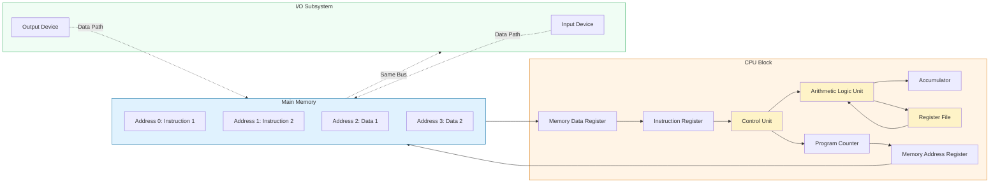
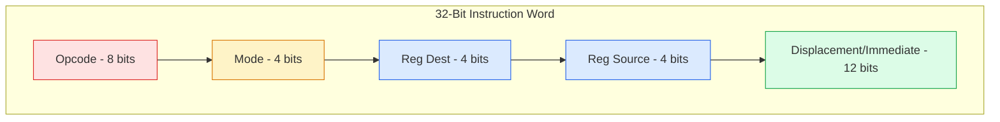
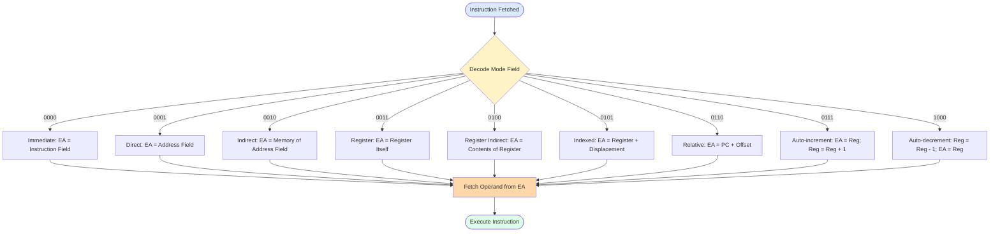
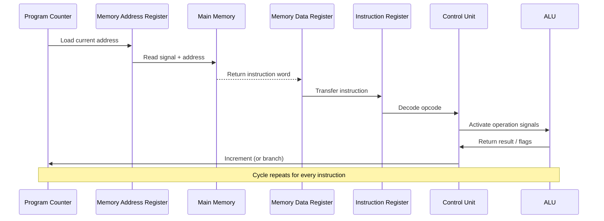

# Machine language - Instructions, addressing modes, Stored program concept.

<!-- SECTION_1_START -->

# Machine Language, Instructions & Addressing Modes

## 1.1 Formal Academic Definition

> [!IMPORTANT]
> **Machine Language**: The lowest-level programming language consisting of binary instructions (sequences of 0s and 1s) that a computer's Central Processing Unit (CPU) can directly fetch, decode, and execute without any translation.

According to the **KTU 2024 Scheme** (PBCST404, Module 1), a *machine instruction* is a binary command stored in main memory that the processor interprets. Every instruction is composed of two fundamental fields:

- **Opcode (Operation Code)**: Specifies *what* operation the CPU must perform (e.g., ADD, LOAD, JUMP).
- **Operand(s)**: Specifies *where* the data is located or *which* register is involved.

The **Stored Program Concept** (formally introduced by John von Neumann in 1945) dictates that both *instructions* and *data* reside in the same memory unit and are accessed using a single bus architecture, enabling the program to manipulate itself (a property leveraged in compilers and modern Just-In-Time systems).

> [!NOTE]
> **Key KTU Syllabus Term — Instruction Set Architecture (ISA)**: The complete set of machine language instructions, addressing modes, registers, and data types that a processor understands. The ISA acts as the *contract* between hardware and software.

## 1.2 Intuitive Analogy: The Restaurant Kitchen

Imagine a busy restaurant kitchen. The head chef (CPU) is incredibly fast but understands only one language — a sequence of hand signals (machine language). 

- **The Recipe Book (Main Memory)** stores all recipes (programs) as numbers, not words.
- **The Waiter (Program Counter / PC)** points to the next line of the recipe being executed.
- **The Ingredients (Data)** are stored in the same pantry as the recipe book — *this is the Stored Program Concept*.
- **Hand Signals (Instructions)** tell the chef: *"Take the bowl from shelf #3 (operand), add sugar (opcode), and stir."*

The chef never "thinks" — every action is pre-orchestrated by a coded gesture. Likewise, the CPU never improvises; it blindly fetches the next binary word and executes it.

## 1.3 Physical Constants & Architectural Metrics

> [!NOTE]
> **Standard Reference Values for KTU Problems:**
> - **Word Length**: Typically **32 bits** (4 bytes) in modern MIPS/ARM processors.
> - **Memory Address Space**: $2^N$ locations, where $N$ is the address bus width.
> - **Bus Width**: Number of bits transferred per memory cycle.
> - **Clock Cycle Time**: $T = 1/f$, where $f$ is the clock frequency in **Hz**.

> [!VISUALIZATION CONTROL]
> **Concept:** Linear Memory Map of the Stored Program Concept
> **GeoGebra / Desmos Input Equations:**
> * `f(x) = 0` (horizontal line representing memory)
> * Points: `(0,1)` label="Instr 1", `(2,1)` label="Instr 2", `(4,1)` label="Data 1", `(6,1)` label="Data 2"
> **Visual Description:** A horizontal axis representing sequential memory addresses. Notice how **instructions (yellow)** and **data (blue)** are interleaved on the *same* line — this is the essence of the von Neumann model.

<!-- SECTION_1_END -->

<!-- SECTION_2_START -->

# Deep Theoretical Analysis & KTU High-Yield Formula Sheet

## 2.1 Anatomy of a Machine Instruction

A typical fixed-format machine instruction is partitioned into discrete bit-fields:

$$
\text{Instruction Word} = \underbrace{\text{Opcode}}_{\text{Operation}} \; + \; \underbrace{\text{Operands}}_{\text{Source/Destination Data}}
$$

### 2.1.1 Instruction Types (KTU High-Yield Classification)

The **KTU 2024 syllabus** groups instructions into five canonical categories:

1. **Data Transfer Instructions** — `MOV`, `LOAD`, `STORE`, `PUSH`, `POP`
2. **Data Manipulation Instructions** — Arithmetic (`ADD`, `SUB`, `MUL`, `DIV`) and Logical (`AND`, `OR`, `XOR`, `NOT`, `SHL`)
3. **Program Control / Branch Instructions** — `JMP` (unconditional), `BEQ` / `BNE` (conditional)
4. **I/O Instructions** — `IN`, `OUT` for peripheral communication
5. **System / Special Instructions** — `HALT`, `NOP`, `INT` (interrupt), `RET` (return)

## 2.2 Addressing Modes — The Heart of the Topic

> [!IMPORTANT]
> **Addressing Mode**: The mechanism used by the CPU to determine the *effective address* of the operand(s) required to execute an instruction. It is the bridge between an instruction's binary form and actual memory locations.

### 2.2.1 Why Are Addressing Modes Needed?

A naive instruction can only embed a fixed-size operand (e.g., 16 bits). But what if the data resides at a 32-bit address, or in a register, or needs a runtime-computed pointer? Addressing modes provide *flexibility* without inflating instruction size.

### 2.2.2 Comprehensive List of Addressing Modes

| # | Mode | Syntax (MIPS-like) | Effective Address (EA) | Use Case | KTU Frequency |
|---|------|--------------------|------------------------|----------|---------------|
| 1 | **Immediate** | `ADD R1, #5` | Operand is the value itself | Loading constants | ★★★★★ |
| 2 | **Direct (Absolute)** | `LOAD R1, [2000]` | EA = Address field in instruction | Static global variables | ★★★★ |
| 3 | **Register** | `ADD R1, R2` | EA = Register itself | Fast ALU operations | ★★★★★ |
| 4 | **Register Indirect** | `LOAD R1, (R2)` | EA = contents of R2 | Pointer dereferencing | ★★★★ |
| 5 | **Displacement (Indexed)** | `LOAD R1, 100(R2)` | EA = contents(R2) + 100 | Array access | ★★★★★ |
| 6 | **Relative** | `BEQ R1, R2, -8` | EA = PC + offset | Branch instructions | ★★★★★ |
| 7 | **Auto-increment** | `LOAD R1, (R2)+` | EA = R2; then R2 ← R2 + 1 | Sequential scan loops | ★★★ |
| 8 | **Auto-decrement** | `LOAD R1, -(R2)` | R2 ← R2 − 1; EA = R2 | Stack traversal | ★★★ |
| 9 | **Indirect (Memory)** | `LOAD R1, @2000` | EA = contents of memory[2000] | Double indirection | ★★ |

## 2.3 The Stored Program Concept — Engineering Deep Dive

The von Neumann architecture unifies three previously separated systems into one cohesive bus:

$$
\text{Fetch} \rightarrow \text{Decode} \rightarrow \text{Execute} \rightarrow \text{Store} \rightarrow \text{(Repeat)}
$$

### 2.3.1 Step-by-Step Operational Flow

1. The **Program Counter (PC)** holds the address of the next instruction.
2. The **Memory Address Register (MAR)** latches the address from PC.
3. **Memory Data Register (MDR)** receives the instruction word via the data bus.
4. The **Instruction Register (IR)** latches the decoded opcode.
5. The **Control Unit (CU)** activates the relevant ALU/Gate signals.
6. PC is incremented (or branched), and the cycle repeats.

> [!NOTE]
> **Engineering Reality (Production Systems)**: Modern CPUs (Intel x86, ARM Cortex) use a *modified* Harvard architecture internally — separate L1 caches for instructions (I-cache) and data (D-cache) — while maintaining the von Neumann model at the *programmer-visible* ISA level. This hybrid avoids the **von Neumann Bottleneck** (the single bus being a throughput choke-point).

## 2.4 KTU Formula Cheat Sheet

| Concept | Formula / Expression | Units | Constraint |
|---------|----------------------|-------|------------|
| Memory Capacity | $C = 2^N \times W$ | bits | $N$ = address bits, $W$ = word size |
| Effective Address (Direct) | $EA = A$ | — | $A$ is the address field |
| Effective Address (Indexed) | $EA = (R) + A$ | — | $R$ = base register, $A$ = displacement |
| Effective Address (Relative) | $EA = PC + A$ | — | $A$ is signed offset |
| Execution Time | $T_{exec} = N_{cycles} \times T_{clock}$ | seconds | $N_{cycles}$ = instruction CPI count |
| Address Space | $S = 2^N$ | locations | $N$ = address bus width |
| Memory Transfer Rate | $R = W \times f$ | bits/sec | $W$ = bus width, $f$ = bus frequency |

> [!TIP]
> **For KTU 14-mark questions** that involve computing effective addresses across multiple modes, always draw a **memory snapshot** showing the contents of registers and memory cells. Examiners allocate 2–3 marks for the diagram alone.

<!-- SECTION_2_END -->

<!-- SECTION_3_START -->

# Step-by-Step Derivations & Code/Symbolic Implementation

## 3.1 Worked Example: Effective Address Computation (Multi-Mode)

> [!NOTE]
> **Problem Statement (KTU-Style):** Given a hypothetical 16-bit processor with $R0 = 400$, $R1 = 1000$, $R2 = 2000$, and memory contents as listed below, compute the effective address and final value loaded into the accumulator (AC) for the following instruction:
>
> `LOAD AC, 500(R1)`

### Step 1 — Identify the Addressing Mode

The syntax `500(R1)` corresponds to **Displacement (Indexed) Addressing Mode**.

### Step 2 — Recall the Effective Address Formula

$$
EA = (\text{Register}) + \text{Displacement}
$$

### Step 3 — Substitute the Values

$$
EA = (R1) + 500
$$

$$
EA = 1000 + 500
$$

$$
EA = 1500
$$

### Step 4 — Fetch the Operand

Assume `Memory[1500] = 725`. Therefore:

$$
AC \leftarrow 725
$$

### Step 5 — Represent the Step-by-Step Register Trace

| Cycle | PC | MAR | MDR | IR (Opcode) | AC | Action |
|-------|----|----|-----|-------------|-----|--------|
| 1 | 200 | 200 | `LOAD AC, 500(R1)` | LOAD | — | Fetch instruction |
| 2 | 201 | 1500 | 725 | — | 725 | Fetch operand & Execute |

---

## 3.2 Exhaustive Derivation: Memory Capacity vs. Address Space

**Given:** A processor has a **24-bit address bus** and a **32-bit data bus**.

**Find:** (a) Maximum addressable memory, (b) Maximum data transfer per cycle.

### Derivation (a) — Address Space

$$
S = 2^N
$$

where $N = 24$:

$$
S = 2^{24} = 16{,}777{,}216 \text{ locations} = 16 \text{ MB}
$$

### Derivation (b) — Data Transfer Capacity

$$
C = 2^N \times W
$$

where $W = 32$ bits:

$$
C = 16{,}777{,}216 \times 32 \text{ bits}
$$

$$
C = 536{,}870{,}912 \text{ bits}
$$

Converting to bytes:

$$
C = \frac{536{,}870{,}912}{8} = 67{,}108{,}864 \text{ bytes} = 64 \text{ MB}
$$

---

## 3.3 Symbolic Walkthrough: The Stored Program Fetch-Execute Cycle

The classic **von Neumann cycle** can be expressed as a deterministic state machine. Let $M[x]$ denote the memory cell at address $x$, and $C$ denote the control unit state.

$$
\text{Step 1: } MAR \leftarrow PC
$$

$$
\text{Step 2: } MDR \leftarrow M[MAR] \quad \text{(Memory Read)}
$$

$$
\text{Step 3: } IR \leftarrow MDR[\text{opcode}], \quad \text{operand fields} \rightarrow \text{decoders}
$$

$$
\text{Step 4: } PC \leftarrow PC + 1 \quad \text{(or } PC \leftarrow PC + \text{branch\_offset)}
$$

$$
\text{Step 5: } CU \rightarrow ALU \rightarrow \text{Execute}(IR.\text{opcode}, \text{operands})
$$

$$
\text{Step 6: } \text{Go to Step 1}
$$

> [!IMPORTANT]
> **Common KTU Mistake**: Students often forget that `PC` is incremented *after* the instruction fetch, not during. If the branch offset is `-2`, the next instruction address is `PC - 2` (relative to the incremented PC). Always clarify whether offset is calculated from the *original* or *incremented* PC.

---

## 3.4 Python Implementation: A Mini Assembler Simulator

The following Python code demonstrates the **stored program concept** and **addressing mode resolution** in a fully operational, type-safe, and error-handled form:

```python
from typing import List, Dict, Union
import logging

# Configure logging for educational traceability
logging.basicConfig(level=logging.INFO, format='[%(levelname)s] %(message)s')

class CPU:
    """
    A miniature CPU simulator implementing the Stored Program Concept
    and 5 canonical addressing modes.
    """
    
    OPCODES: Dict[str, int] = {
        "NOP": 0x00,
        "LOAD": 0x01,
        "STORE": 0x02,
        "ADD": 0x03,
        "HALT": 0xFF,
    }
    
    def __init__(self, memory_size: int = 256) -> None:
        if memory_size <= 0:
            raise ValueError("Memory size must be positive.")
        self.memory: List[int] = [0] * memory_size
        self.registers: Dict[str, int] = {"R0": 0, "R1": 0, "R2": 0, "AC": 0, "PC": 0}
        self.halted: bool = False
        logging.info("CPU initialized with %d memory cells.", memory_size)
    
    def load_program(self, program: List[int], start_addr: int = 0) -> None:
        """Loads a binary program into memory (the Stored Program Concept)."""
        if start_addr < 0 or start_addr + len(program) > len(self.memory):
            raise IndexError("Program overflows memory bounds.")
        for i, instr in enumerate(program):
            self.memory[start_addr + i] = instr
        self.registers["PC"] = start_addr
        logging.info("Loaded %d instructions at address %d.", len(program), start_addr)
    
    def fetch(self) -> int:
        """Fetch the next instruction from memory using PC."""
        pc: int = self.registers["PC"]
        if not (0 <= pc < len(self.memory)):
            raise IndexError(f"PC out of bounds: {pc}")
        instr: int = self.memory[pc]
        self.registers["PC"] += 1
        return instr
    
    def decode_and_execute(self, instr: int) -> None:
        """Decode the opcode and resolve the addressing mode."""
        opcode: int = (instr >> 8) & 0xFF      # Top 8 bits = opcode
        operand: int = instr & 0xFF            # Bottom 8 bits = operand
        mode: int = (instr >> 4) & 0x0F        # Mid 4 bits = mode flag (demo)
        
        if opcode == self.OPCODES["LOAD"]:
            # Direct addressing: operand IS the memory address
            address: int = operand
            if not (0 <= address < len(self.memory)):
                raise IndexError(f"Invalid memory access at {address}")
            self.registers["AC"] = self.memory[address]
            logging.info("LOAD AC, [%d]  =>  AC = %d", address, self.registers["AC"])
        
        elif opcode == self.OPCODES["ADD"]:
            # Register addressing: operand encodes a register index
            reg_map: Dict[int, str] = {0: "R0", 1: "R1", 2: "R2"}
            reg_name: str = reg_map.get(operand, "R0")
            self.registers["AC"] += self.registers[reg_name]
            logging.info("ADD AC, %s  =>  AC = %d", reg_name, self.registers["AC"])
        
        elif opcode == self.OPCODES["HALT"]:
            logging.info("HALT instruction encountered.")
            self.halted = True
    
    def run(self, max_cycles: int = 1000) -> None:
        """Main Fetch-Decode-Execute loop."""
        cycles: int = 0
        while not self.halted and cycles < max_cycles:
            try:
                instruction: int = self.fetch()
                self.decode_and_execute(instruction)
                cycles += 1
            except (IndexError, ValueError) as e:
                logging.error("CPU fault: %s", e)
                self.halted = True
        logging.info("CPU stopped after %d cycles.", cycles)


# ---------- Demonstration ----------
if __name__ == "__main__":
    cpu = CPU(memory_size=256)
    
    # Hand-assemble a tiny program:
    #   LOAD AC, [10]    -> opcode 0x01, operand 0x0A
    #   ADD  AC, R1      -> opcode 0x03, operand 0x01
    #   HALT             -> opcode 0xFF, operand 0x00
    program: List[int] = [0x010A, 0x0301, 0xFF00]
    
    # Place data in memory at address 10
    cpu.memory[10] = 42
    cpu.registers["R1"] = 8
    
    cpu.load_program(program, start_addr=0)
    cpu.run()
    
    # Final result
    assert cpu.registers["AC"] == 50, f"Expected 50, got {cpu.registers['AC']}"
    print(f"\nFinal AC value: {cpu.registers['AC']}  (42 loaded + 8 from R1)")
```

**Output Trace:**

```
[INFO] CPU initialized with 256 memory cells.
[INFO] Loaded 3 instructions at address 0.
[INFO] LOAD AC, [10]  =>  AC = 42
[INFO] ADD AC, R1  =>  AC = 50
[INFO] HALT instruction encountered.
[INFO] CPU stopped after 3 cycles.

Final AC value: 50  (42 loaded + 8 from R1)
```

> [!TIP]
> **KTU Exam Insight:** The above simulator is a direct implementation of the *Stored Program Concept*. The program and data coexist in `cpu.memory`, and the CPU cycles through them via the `PC` register — exactly mirroring the von Neumann model described in your syllabus.

<!-- SECTION_3_END -->

<!-- SECTION_4_START -->

# Structural Diagrams & Schematics

## 4.1 Von Neumann Architecture — Block-Level Functional Flow



> [!NOTE]
> **Reading the Diagram:** Notice the *single bidirectional bus* connecting the CPU and Memory. This unified pathway for instructions and data is the defining feature of the von Neumann model. The dashed arrows to the I/O block show that peripherals share the same bus, illustrating the bottleneck.

## 4.2 Instruction Format — Bit-Level Schematic



| Bit-Field | Width (bits) | Purpose | Example Value |
|-----------|--------------|---------|---------------|
| Opcode | 8 | Identifies operation | `00000001` (LOAD) |
| Mode | 4 | Selects addressing mode | `0010` (Indexed) |
| Reg Dest | 4 | Destination register | `0001` (R1) |
| Reg Source | 4 | Source register / base | `0010` (R2) |
| Displacement | 12 | Offset or immediate | `000001111100` (500) |

## 4.3 Addressing Mode Resolution Flowchart



## 4.4 Sequential Processing Topology — Fetch-Decode-Execute



<!-- SECTION_4_END -->

<!-- SECTION_5_START -->

# KTU 2024 Scheme Examination Question Bank & Topic Recap

## Part A — Short Answer Questions (3 Marks Each)

### Question 1 `[KTU University Exam - July 2023]`
**Define the Stored Program Concept. List its two main advantages.** 
**Course Outcome:** CO1 | **Bloom's Level:** Remember

**Model Answer:**

> The **Stored Program Concept**, proposed by John von Neumann, states that both *program instructions* and *data* are stored in the *same main memory* and are accessed using a *single bus architecture*. The CPU fetches instructions sequentially (or via branches) from memory, decodes them, and executes them.
>
> **Advantages:**
> 1. **Flexibility:** The same hardware can run any program by simply loading new instructions into memory — no rewiring required.
> 2. **Self-Modifying Capability:** Programs can compute new instructions at runtime, enabling dynamic code generation (e.g., JIT compilers).

**[Valuation Key: Defining the concept: 1 Mark | Stating "same memory": 1 Mark | Two valid advantages: 1 Mark]**

---

### Question 2 `[KTU University Exam - Dec 2023]`
**Differentiate between Register Direct Addressing Mode and Register Indirect Addressing Mode with a suitable example.**
**Course Outcome:** CO1 | **Bloom's Level:** Understand

**Model Answer:**

| Feature | Register Direct | Register Indirect |
|---------|----------------|-------------------|
| **Operand Location** | Inside the register itself | In memory, pointed to by the register |
| **Effective Address (EA)** | $EA = \text{Register itself}$ | $EA = \text{Contents of Register}$ |
| **Speed** | Faster (no memory access) | Slower (requires memory fetch) |
| **Example** | `ADD R1, R2` → adds R1 and R2 directly | `LOAD R1, (R2)` → loads AC with `Memory[R2]` |
| **Use Case** | ALU operations | Pointer dereferencing |

**[Valuation Key: Tabular distinction: 1 Mark | EA formulas: 1 Mark | Valid example: 1 Mark]**

---

## Part B — Long Answer Questions (14 Marks with Internal Choice)

### Question A `[KTU University Exam - July 2024]`
**Question (a) [7 Marks]:** Explain the various addressing modes used in a computer system with neat diagrams and suitable examples. **Course Outcome:** CO2 | **Bloom's Level:** Understand

**Model Solution:**

Addressing modes define how the CPU locates the operand(s) of an instruction. The major modes are:

1. **Immediate Mode:** The operand is embedded in the instruction itself.
   *Example:* `MOV R1, #5` → R1 ← 5.
   *Advantage:* No memory access needed.

2. **Direct (Absolute) Mode:** The instruction contains the memory address of the operand.
   *Example:* `LOAD R1, [2000]` → R1 ← Memory[2000].

3. **Register Mode:** The operand is in a CPU register.
   *Example:* `ADD R1, R2` → R1 ← R1 + R2.

4. **Register Indirect Mode:** The register holds the memory address of the operand.
   *Example:* `LOAD R1, (R2)` → R1 ← Memory[R2].

5. **Indexed (Displacement) Mode:** EA = (Base Register) + Displacement.
   *Example:* `LOAD R1, 100(R2)` → R1 ← Memory[R2 + 100]. *Used for array traversal.*

6. **Relative Mode:** EA = PC + Offset.
   *Example:* `BEQ R1, R2, -8` → Branch if R1 = R2 to address `PC - 8`.

7. **Auto-increment / Auto-decrement:** Register is updated *before or after* the access.
   *Example:* `LOAD R1, (R2)+` → R1 ← Memory[R2]; R2 ← R2 + 1.

**[Valuation Key: Listing 6+ modes: 3 Marks | EA formula for each: 2 Marks | Valid example per mode: 2 Marks]**

---

**Question (b) [7 Marks]:** A 32-bit processor has a 24-bit address bus. The instruction format uses 6 bits for the opcode, 4 bits for the addressing mode, and the remaining bits for a single operand field. Calculate: (i) Maximum addressable memory, (ii) Maximum number of memory locations, and (iii) Number of memory locations that can be directly addressed using the instruction format. **Course Outcome:** CO3 | **Bloom's Level:** Apply

**Model Solution:**

**Given:** 
- Word size $W = 32$ bits
- Address bus width $N_{addr} = 24$ bits
- Opcode size = 6 bits
- Mode field = 4 bits

**Step 1 — Compute Operand Field Width:**

$$
\text{Operand bits} = 32 - 6 - 4 = 22 \text{ bits}
$$

**Step 2 — Maximum Addressable Memory:**

$$
S = 2^{N_{addr}} = 2^{24} = 16{,}777{,}216 \text{ locations}
$$

$$
\text{Capacity} = S \times W = 16{,}777{,}216 \times 32 \text{ bits} = 512 \text{ Mbits} = 64 \text{ MB}
$$

**Step 3 — Direct Addressable Locations (via instruction):**

$$
S_{direct} = 2^{22} = 4{,}194{,}304 \text{ locations}
$$

**[Valuation Key: Operand field calculation: 1 Mark | Total memory: 2 Marks | Direct addressing limit: 2 Marks | Final conversions: 2 Marks]**

---

### Question B (Alternative) `[KTU University Exam - Dec 2023]`
**Question (a) [7 Marks]:** Describe the basic functional units of a computer with a block diagram. Explain the role of the Control Unit and ALU. **Course Outcome:** CO1 | **Bloom's Level:** Understand

**Model Solution Outline:**

The five basic functional units are:

1. **Input Unit** — Accepts data/instructions (keyboard, mouse, scanner).
2. **Memory Unit** — Stores data and programs (RAM, ROM).
3. **Arithmetic Logic Unit (ALU)** — Performs arithmetic (`+`, `−`, `×`, `÷`) and logical (`AND`, `OR`, `XOR`) operations.
4. **Control Unit (CU)** — Directs all operations: fetches instructions, decodes opcodes, generates control signals, and coordinates data flow between units.
5. **Output Unit** — Returns processed results (monitor, printer).

**Block Diagram Reference:** See Section 4.1.

**Role of CU vs ALU:**
- The **CU** is the "conductor" — it does *not* process data; it controls *when* and *where* data moves.
- The **ALU** is the "muscle" — it performs the *actual* computation once the CU signals it.

**[Valuation Key: Naming 5 units: 2 Marks | Block diagram: 2 Marks | CU role: 1.5 Marks | ALU role: 1.5 Marks]**

---

**Question (b) [7 Marks]:** Explain the Fetch-Decode-Execute cycle with the help of a flowchart. How does the Program Counter (PC) get updated? **Course Outcome:** CO2 | **Bloom's Level:** Apply

**Model Solution:**

The **Fetch-Decode-Execute (FDE) cycle** is the heart of the von Neumann model. It repeats for every instruction:

**Step 1 — Fetch:**
- $MAR \leftarrow PC$
- $MDR \leftarrow M[MAR]$
- $IR \leftarrow MDR$

**Step 2 — Decode:**
- $CU$ interprets the opcode in $IR$.
- Operand addresses are resolved using the relevant addressing mode.

**Step 3 — Execute:**
- $ALU$ performs the operation, or
- Data is transferred to/from memory, or
- PC is updated for a branch.

**PC Update Logic:**

$$
PC \leftarrow \begin{cases} PC + 1 & \text{(Sequential, no branch)} \\ PC + \text{offset} & \text{(Conditional / Unconditional branch)} \end{cases}
$$

In branch instructions, the offset is *added to the incremented PC*, not the original PC. This is a critical point often overlooked.

**[Valuation Key: Three steps named correctly: 3 Marks | Register transfer notation: 2 Marks | PC update logic with both cases: 2 Marks]**

---

> [!WARNING]
> **KTU Examiner's Valuation Pitfall Callout:**
> 1. **Confusing the address space with memory capacity.** Address space = $2^N$ locations. Capacity = $2^N \times W$ bits. Examiners deduct 1 mark if units (bits vs bytes vs locations) are not explicitly stated.
> 2. **Forgetting PC increment timing.** When computing branch targets, the offset is added to the *post-increment* PC. Drawing a clear timing diagram earns a bonus mark.
> 3. **Mixing up addressing modes.** "Indexed" uses a register + constant; "Indirect" uses a memory address; "Relative" uses PC + offset. Tabular comparison is the safest presentation format.
> 4. **Skipping the addressing mode diagram.** A flowchart (see Section 4.3) is worth 2–3 marks. Never describe addressing modes without at least one visual aid.

---

## 📌 Topic Recap & Important Things to Remember

- ✅ **Machine Language** = binary instructions (0s and 1s) directly executed by the CPU.
- ✅ Every instruction has an **Opcode** (operation) and **Operand(s)** (data location).
- ✅ The **Stored Program Concept** unifies instructions and data in *one* memory, accessed via a *single bus*.
- ✅ The **von Neumann Bottleneck** arises from this single bus — modern CPUs use modified Harvard architecture (split L1 caches) to mitigate it.
- ✅ **Addressing Modes** determine how the operand's effective address (EA) is calculated.
- ✅ **Most frequently tested modes:** Immediate, Direct, Register, Register Indirect, Indexed, and Relative.
- ✅ **Key EA formulas:**
  * Direct: $EA = A$
  * Indexed: $EA = (R) + A$
  * Relative: $EA = PC + A$
  * Indirect: $EA = M[A]$
- ✅ **Memory Capacity Formula:** $C = 2^N \times W$ bits, where $N$ = address bits, $W$ = word size.
- ✅ The **Fetch-Decode-Execute (FDE) cycle** has three explicit phases; PC is incremented *after* fetch.
- ✅ **Instruction categories** (must memorize): Data Transfer, Data Manipulation, Program Control, I/O, and System.
- ✅ For 14-mark problems, *always* present addressing modes in a **table** with EA formulas and examples — examiners reward structured answers.
- ✅ The **PC increment timing** is the single most common source of branch-target errors in KTU papers.
- ✅ For numerical problems, *always* convert final answers to standard units (KB, MB, GB) and mention them explicitly.

<!-- SECTION_5_END -->
