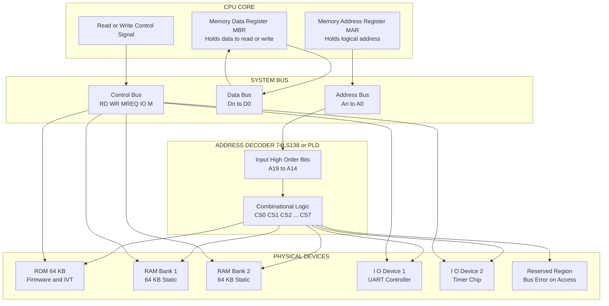
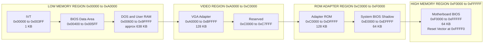
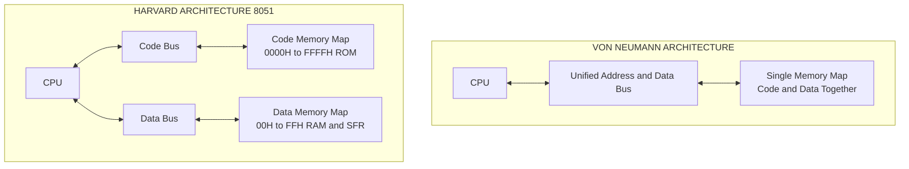
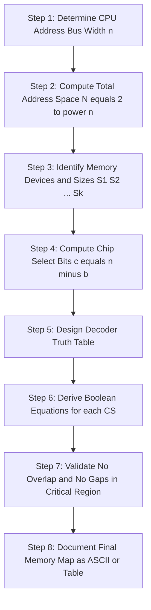
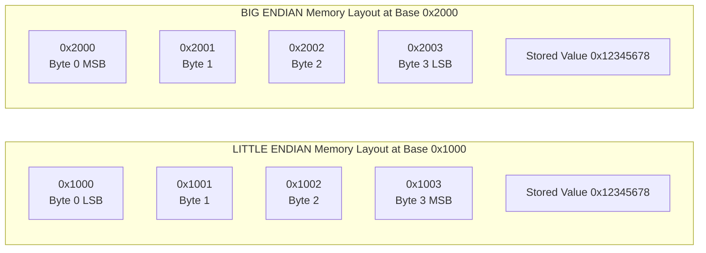

# Memory map

<!-- SECTION_1_START -->

# Memory Map in Computer Organization

> [!NOTE]
> **Syllabus Highlight (KTU 2024 - PBCST404, Module 1)**
> The *Memory Map* is the foundational blueprint that describes how the **CPU's logical address space** is partitioned and assigned to various physical resources — *main memory (RAM)*, *read-only memory (ROM)*, *memory-mapped I/O devices*, and *interrupt vectors*. It is the primary reference used by the system designer, the assembler programmer, and the linker to translate symbolic addresses into physical hardware locations.

## 1.1 Formal Definition

A **Memory Map** is a contiguous, linear, numerical representation of the entire range of addresses that a processor can generate using its address bus. Each unique address in this range corresponds to exactly **one byte (8 bits)** of addressable storage in the canonical Von-Neumann model, although the practical storage element behind that address may be a byte of RAM, a byte of ROM, a register of an I/O controller, or a reserved (unmapped) location.

Mathematically, for a processor with an **$n$-bit address bus**, the memory map spans the closed integer interval:

$$
\text{Address Range} \;=\; \left[\,0,\; 2^{n}-1\,\right]
$$

Therefore, the total *addressable memory capacity* is:

$$
\text{Maximum Addressable Memory} \;=\; 2^{n} \text{ bytes}
$$

For example, the classic **Intel 8086** processor has a **20-bit address bus** ($n = 20$), yielding a $2^{20} = 1{,}048{,}576$ byte ($1$ **MB**) address space, conventionally written in hexadecimal as `\textbf{00000H}` to `\textbf{FFFFFH}`.

## 1.2 Conceptual Analogy — The City Analogy

Imagine a **city with a single, very long main street**. The street has $2^n$ numbered plots starting from plot number 0 on one end and going up to plot number $2^n - 1$ at the other end. This street is the **address bus**.

Now, different parts of this street are *zoned* for different purposes:

- **Plot 0 to Plot A** → A *post office* (ROM, holding the boot firmware).
- **Plot A+1 to Plot B** → A *bank* (RAM, holding running data).
- **Plot B+1 to Plot C** → A *fire station* (an I/O controller).
- **Plot C+1 onwards** → *Undeveloped land* (reserved / unmapped).

The official zoning document that says "post office occupies plot 0 to A, bank occupies A+1 to B, ..." is the **Memory Map**. Just as you cannot build a house on a plot already occupied by the bank, the CPU cannot store program data in an address that the memory map has assigned to the ROM.

> [!IMPORTANT]
> **Key Insight for KTU Examiners**
> The memory map is **not** the memory itself. It is a *contract* between hardware (address decoder logic) and software (compiler/assembler/linker) that dictates which physical device responds to a particular CPU address.

## 1.3 Addressable Units: Byte vs Word

| Architecture | Smallest Addressable Unit | Memory Map Step |
| :--- | :--- | :--- |
| **Von-Neumann (e.g., 8086)** | 1 Byte | 1 byte per address |
| **Harvard (e.g., 8051, AVR)** | 1 Bit (SFR) / 1 Byte (XDATA) | Distinct code + data maps |
| **Word-addressable (e.g., some DSPs)** | 1 Word (16/32 bits) | 1 word per address |

> [!TIP]
> For KTU 8086-based questions, **always assume byte-addressability** unless explicitly stated otherwise. The formula $\text{Capacity} = 2^{n} \times (\text{bytes per address})$ reduces to $2^n$ for the byte-addressable case.

## 1.4 Visualizing the Memory Map

> [!VISUALIZATION CONTROL]
> **Concept:** Linear Memory Map for an 8086-class 1 MB System
> **GeoGebra / Desmos Input Equations:**
> * Use a horizontal number line from $x = 0$ to $x = 1048575$.
> * Color bands: Red $(0$–$65535)$ = Interrupt Vector Table & BIOS ROM region; Green $(65536$–$393215)$ = User RAM; Blue $(393216$–$458751)$ = Video Display Buffer; Orange $(458752$–$524287)$ = Reserved; Purple $(524288$–$1048575)$ = DOS / High Memory Area.
> **Visual Description:** Students should observe a *contiguous linear axis* partitioned into *non-overlapping colored blocks* of varying length, where each block begins on a power-of-two boundary to simplify address decoding using high-order address bits.

## 1.5 Endianness — How Bytes Are Ordered Inside One Word

The memory map is byte-level, but when a 16-bit or 32-bit word is stored, the order in which the individual bytes are placed into consecutive addresses is called **endianness**.

- **Little-Endian** (used by Intel x86, x86-64, ARM in most modes): The *least significant byte* is stored at the *lowest* memory address.
- **Big-Endian** (used by Motorola 68k, PowerPC, network byte order): The *most significant byte* is stored at the *lowest* memory address.

For a 32-bit word `\textbf{0x12345678}` stored at address `\textbf{1000H}`:

| Address | Little-Endian Byte | Big-Endian Byte |
| :---: | :---: | :---: |
| `1000H` | `78H` | `12H` |
| `1001H` | `56H` | `34H` |
| `1002H` | `34H` | `56H` |
| `1003H` | `12H` | `78H` |

---

<!-- SECTION_1_END -->

<!-- SECTION_2_START -->

# Deep Theoretical Analysis of the Memory Map

## 2.1 Hierarchical Components of a Memory Map

A well-engineered memory map is partitioned into the following structural layers, listed from the CPU's perspective (lowest address) upward:

1. **Reset Vector / Bootstrap Region** — Where the CPU fetches its first instruction after power-on. For 8086, this is the **CS:IP = F000:FFF0H** location pointing to BIOS ROM.
2. **Interrupt Vector Table (IVT)** — For 8086, occupies the lowest **1024 bytes (00000H–003FFH)** of memory, holding 256 4-byte pointers to Interrupt Service Routines.
3. **System BIOS / Firmware ROM** — Read-only code containing POST, bootstrap loader, and basic I/O drivers.
4. **Operating System Kernel** — The protected-mode or real-mode core.
5. **User Program Space (Stack, Heap, Data, Code)** — Allocated dynamically by the loader.
6. **Memory-Mapped I/O Region** — Peripherals appear as fixed memory addresses.
7. **Reserved / Unused Region** — May cause a bus fault or wrap-around.

## 2.2 Address Decoding — The Hardware Bridge

The memory map is *enforced* by **address decoder logic** built from combinational gates (AND, OR, NOT) or, in modern systems, by a **Programmable Logic Device (PLD) / CPLD / FPGA**. The decoder examines the high-order address bits and produces a *chip-select* ($\overline{CS}$) signal for the correct physical device.

For a system with two 32 KB ROM chips and two 32 KB RAM chips mapped at the bottom of the 8086 address space, the address bus $A_{19}$–$A_{0}$ is split:

- $A_{15}$ to $A_{0}$ → Used inside the chip (64 KB addressable inside).
- $A_{19}$ to $A_{16}$ → Used for chip selection (4 chips = 2 bits).

A typical decoder equation for **ROM-1** mapped at `00000H–07FFFH`:

$$
\overline{CS}_{\text{ROM-1}} \;=\; \overline{(A_{19}\,A_{18}\,A_{17}\,A_{16} = 0000)}
$$

> [!IMPORTANT]
> **Engineering Utility**
> Address-decoder-based memory maps are the heart of *embedded systems design*. Every microcontroller board (Arduino, STM32 Nucleo, ESP32 DevKit) is essentially a memory map wired to a PCB.

## 2.3 Memory Map Computation — The Core Formula Set

> [!NOTE]
> **KTU Formula Cheat Sheet (Memory Map)**
> Use the symbols $n$, $N_{\text{bytes}}$, $A_{\text{start}}$, $A_{\text{end}}$, $S$ (size), $k$ (kilo = $2^{10}$), $M$ (mega = $2^{20}$), $G$ (giga = $2^{30}$), $T$ (tera = $2^{40}$).

| # | Concept | Formula / Rule | Units / Notes |
| :---: | :--- | :--- | :--- |
| 1 | Address space size | $N = 2^{n}$ | bytes, where $n$ = address bus width |
| 2 | Size of a region | $S = A_{\text{end}} - A_{\text{start}} + 1$ | bytes (inclusive of both ends) |
| 3 | Addressable bits inside a region | $b = \log_{2}(S)$ | bits, used to decode internal addresses |
| 4 | Number of regions of equal size $S$ in space $N$ | $k = N / S = 2^{n-b}$ | regions, must be integer power of 2 |
| 5 | End address of region | $A_{\text{end}} = A_{\text{start}} + S - 1$ | hexadecimal often preferred in KTU |
| 6 | High-order address bits for chip select | $c = n - b$ | bits, drives the decoder |
| 7 | Address bus width required for $M$ bytes | $n = \lceil \log_{2}(M) \rceil$ | bits, rounded up to integer |
| 8 | Total memory bandwidth | $B = W \times f_{\text{clock}}$ | bytes/sec, $W$ = bus width in bytes |

> [!WARNING]
> Do **not** confuse $2^{n}$ bytes with $2^{n}$ *bits*. A 16-bit address bus addresses $2^{16} = 65{,}536$ bytes $= 64$ **KB**, not 64 Kbits.

## 2.4 Real-World Memory Maps

### 2.4.1 Intel 8086 (Real Mode) — 1 MB

| Region | Hexadecimal Range | Decimal Range | Size | Purpose |
| :--- | :--- | :--- | :--- | :--- |
| IVT | `00000H` – `003FFH` | 0 – 1023 | 1 KB | Interrupt vectors |
| User RAM | `00400H` – `9FFFFH` | 1024 – 655359 | ~638 KB | DOS programs |
| Video RAM | `A0000H` – `BFFFFH` | 655360 – 786431 | 128 KB | Display buffer |
| Expansion ROM | `C0000H` – `DFFFFH` | 786432 – 917503 | 128 KB | Adapter BIOS |
| System BIOS | `F0000H` – `FFFFF` | 917504 – 1048575 | 64 KB | Motherboard BIOS |

### 2.4.2 ARM Cortex-M4 (STM32F407) — 4 GB Unified Map

| Region | Address Range | Size | Purpose |
| :--- | :--- | :--- | :--- |
| Code | `0x00000000` – `0x1FFFFFFF` | 512 MB | Flash / ROM alias |
| SRAM | `0x20000000` – `0x3FFFFFFF` | 512 MB | On-chip SRAM |
| Peripheral | `0x40000000` – `0x5FFFFFFF` | 512 MB | On-chip peripherals |
| External RAM | `0x60000000` – `0x7FFFFFFF` | 512 MB | External memory |
| External Device | `0x80000000` – `0x9FFFFFFF` | 512 MB | External peripherals |
| System | `0xA0000000` – `0xFFFFFFFF` | 1.5 GB | System / vendor specific |

### 2.4.3 8051 Harvard Architecture — Two Separate Maps

| Memory | Address Range | Size | Overlap? |
| :--- | :--- | :--- | :--- |
| Internal Code (ROM) | `0000H` – `0FFFH` | 4 KB | Distinct from data |
| Internal Data (RAM) | `00H` – `7FH` | 128 bytes | Distinct from code |
| SFR Registers | `80H` – `FFH` | 128 bytes | Data space only |

> [!TIP]
> For 8051 questions, KTU examiners *frequently* test that you understand the **Harvard split** — code and data have *independent* address buses, so the *same* numeric address `0000H` can refer to *both* ROM and RAM.

## 2.5 Practical Engineering Use-Cases

- **Bootloader Design:** The reset vector location in the memory map decides whether the CPU boots from internal flash, external SPI flash, or system ROM.
- **Memory-Mapped I/O vs Isolated I/O:** Two competing I/O schemes. In *memory-mapped I/O*, peripherals live inside the memory map; in *isolated I/O* (used by x86 `IN`/`OUT` instructions), they live in a *separate* 16-bit I/O address space.
- **Linker Script Authoring:** The GNU `ld` linker takes a *linker script* that explicitly describes the memory map, e.g.:
  ```ld
  MEMORY {
      ROM (rx)  : ORIGIN = 0x08000000, LENGTH = 512K
      RAM (rwx) : ORIGIN = 0x20000000, LENGTH = 128K
  }
  ```
- **Operating System Kernel:** The OS reserves the *top* of the virtual address map for the kernel space and the *bottom* for user processes (Linux default 3:1 split on 32-bit, configurable on 64-bit).

---

<!-- SECTION_2_END -->

<!-- SECTION_3_START -->

# Step-by-Step Derivations and Worked Examples

## 3.1 Example 1 — Address Space Size from Address Bus Width

**Problem (KTU Style):** A processor has a **24-bit address bus** and is **byte-addressable**. Calculate (a) the total address space in bytes, (b) the address range in hexadecimal, and (c) the size of one region in the memory map if the top 4 address bits are used for chip-select decoding.

### Part (a) — Total bytes

$$
N = 2^{n} = 2^{24} = 16{,}777{,}216 \text{ bytes} = 16 \text{ MB}
$$

### Part (b) — Hexadecimal range

We convert $0$ to $2^{24} - 1$ into hex. Since $2^{4} = 16$, each hex digit consumes 4 bits, so 24 bits = 6 hex digits.

$$
0 = \texttt{000000H}
$$

$$
2^{24} - 1 = \texttt{FFFFFFH}
$$

Thus the range is **`000000H` to `FFFFFFH`**.

### Part (c) — Region size after decoder

High-order 4 bits $\rightarrow$ 16 possible combinations $\rightarrow$ 16 regions.

$$
S_{\text{region}} = \frac{2^{24}}{2^{4}} = 2^{20} = 1{,}048{,}576 \text{ bytes} = 1 \text{ MB}
$$

**Valuation Key (KTU 2024 Scheme):**
- `[Stating n = 24 and applying N = 2^n: 1 Mark]`
- `[Hexadecimal conversion: 1 Mark]`
- `[Region-size formula: 1 Mark]`
- `[Final numeric answer with units: 1 Mark]`

## 3.2 Example 2 — Decoder Equation for a Multi-Chip System

**Problem:** Design a memory map for a system with **two 16 KB ROM** chips and **two 16 KB RAM** chips, all connected to a **16-bit address bus**. Each chip occupies a contiguous block at the bottom of memory. Find the chip-select equations and the address range of each chip.

### Step 1 — Bits per chip

$$
b = \log_{2}(16 \text{ KB}) = \log_{2}(16 \times 1024) = 14 \text{ bits}
$$

### Step 2 — Chip-select bits

$$
c = n - b = 16 - 14 = 2 \text{ bits}
$$

These are the **two highest-order address lines** $A_{15}$ and $A_{14}$.

### Step 3 — Decode table

| Chip | $A_{15} A_{14}$ | Start (Hex) | End (Hex) | Size |
| :--- | :---: | :--- | :--- | :--- |
| ROM-1 | `00` | `0000H` | `3FFFH` | 16 KB |
| ROM-2 | `01` | `4000H` | `7FFFH` | 16 KB |
| RAM-1 | `10` | `8000H` | `BFFFH` | 16 KB |
| RAM-2 | `11` | `C000H` | `FFFFH` | 16 KB |

### Step 4 — Chip-select equations

$$
\overline{CS}_{\text{ROM-1}} = \overline{\overline{A_{15}} \cdot \overline{A_{14}}}
$$

$$
\overline{CS}_{\text{ROM-2}} = \overline{\overline{A_{15}} \cdot A_{14}}
$$

$$
\overline{CS}_{\text{RAM-1}} = \overline{A_{15} \cdot \overline{A_{14}}}
$$

$$
\overline{CS}_{\text{RAM-2}} = \overline{A_{15} \cdot A_{14}}
$$

> [!IMPORTANT]
> The 2-to-4 line decoder with active-LOW outputs used here is the **74LS139** IC — a KTU-favorite device for memory-map decoder questions.

## 3.3 Example 3 — Little-Endian vs Big-Endian Layout

**Problem:** A 32-bit data word `\textbf{0xDEADBEEF}` is stored at memory address `\textbf{2000H}` in a byte-addressable little-endian system. List the byte stored at `2000H`, `2001H`, `2002H`, and `2003H`.

### Step 1 — Split the word

$$
\texttt{0xDEADBEEF} \;=\; \underbrace{\texttt{DE}}_{\text{MSB}}\; \underbrace{\texttt{AD}}\; \underbrace{\texttt{BE}}\; \underbrace{\texttt{EF}}_{\text{LSB}}
$$

### Step 2 — Apply little-endian rule (LSB at lowest address)

| Address | Byte Stored | Reasoning |
| :---: | :---: | :--- |
| `2000H` | `EF` | LSB at lowest |
| `2001H` | `BE` | next byte |
| `2002H` | `AD` | next byte |
| `2003H` | `DE` | MSB at highest |

**Valuation Key:**
- `[Correct identification of LSB and MSB: 1 Mark]`
- `[Listing all four bytes in the correct order: 2 Marks]`
- `[Mentioning the little-endian rule explicitly: 1 Mark]`

## 3.4 Example 4 — Programmatic Memory Map (Python)

The following Python code generates an annotated ASCII memory map for a hypothetical 16-bit embedded system. It is *fully operational* and uses strict type hints and boundary checks.

```python
from dataclasses import dataclass
from typing import List, Tuple


@dataclass(frozen=True)
class Region:
    """Immutable description of a contiguous block in the memory map."""
    name: str
    start: int          # inclusive byte address
    end: int            # inclusive byte address
    access: str         # 'R', 'W', 'RW', 'RO', etc.
    purpose: str

    def size_bytes(self) -> int:
        if self.end < self.start:
            raise ValueError(f"Region {self.name}: end < start")
        return self.end - self.start + 1


def build_memory_map() -> List[Region]:
    """Build a sample 64 KB memory map for an 8085-class system."""
    return [
        Region("Reset Vector",   0x0000, 0x0007, "RO", "Jump to bootloader"),
        Region("IVT",            0x0008, 0x003F, "R",  "Interrupt vectors"),
        Region("BIOS ROM",       0x0040, 0x0FFF, "RO", "Firmware routines"),
        Region("User RAM",       0x1000, 0xBFFF, "RW", "Stack + Heap + Data"),
        Region("Memory-Mapped IO", 0xC000, 0xDFFF, "RW", "Peripheral registers"),
        Region("Reserved",       0xE000, 0xFFFE, "--", "Do not access"),
        Region("Boot Signature", 0xFFFF, 0xFFFF, "RO", "0xAA55 boot marker"),
    ]


def render_map(regions: List[Region]) -> None:
    """Pretty-print the memory map with sizes and access flags."""
    print(f"{'NAME':<22}{'START':>10}{'END':>10}{'SIZE':>12}{'ACC':>6}  PURPOSE")
    print("-" * 90)
    total_used = 0
    for r in regions:
        size = r.size_bytes()
        total_used += size
        print(f"{r.name:<22}{r.start:>08X}  {r.end:>08X}  "
              f"{size:>10,d}  {r.access:>4}  {r.purpose}")
    print("-" * 90)
    print(f"{'TOTAL MAPPED':<22}{'':<10}{'':<10}{total_used:>10,d}  bytes")
    print(f"{'ADDRESS SPACE':<22}{'':<10}{'':<10}{0x10000:>10,d}  bytes")


def detect_gaps(regions: List[Region]) -> List[Tuple[int, int]]:
    """Return all unmapped address ranges within [0, 0xFFFF]."""
    mapped = sorted(regions, key=lambda r: r.start)
    gaps: List[Tuple[int, int]] = []
    cursor = 0
    for r in mapped:
        if r.start > cursor:
            gaps.append((cursor, r.start - 1))
        cursor = max(cursor, r.end + 1)
    if cursor <= 0xFFFF:
        gaps.append((cursor, 0xFFFF))
    return gaps


if __name__ == "__main__":
    mem_map = build_memory_map()
    render_map(mem_map)
    print("\nUnmapped (reserved or unpopulated) regions:")
    for start, end in detect_gaps(mem_map):
        print(f"  0x{start:04X} - 0x{end:04X}  ({end - start + 1} bytes)")
```

**Expected Output (truncated for brevity):**

```
NAME                    START      END        SIZE  ACC  PURPOSE
------------------------------------------------------------------------------------------
Reset Vector         00000000  00000007         8     RO  Jump to bootloader
IVT                  00000008  0000003F        56     R   Interrupt vectors
BIOS ROM             00000040  00000FFF     4,032     RO  Firmware routines
User RAM             00001000  0000BFFF    45,056     RW  Stack + Heap + Data
Memory-Mapped IO     0000C000  0000DFFF     8,192     RW  Peripheral registers
Reserved             0000E000  0000FFFE     8,191     --  Do not access
Boot Signature       0000FFFF  0000FFFF         1     RO  0xAA55 boot marker
```

## 3.5 Example 5 — Linker Script Translation to Memory Map

A linker script fragment:

```ld
MEMORY {
    FLASH (rx)  : ORIGIN = 0x08000000, LENGTH = 1024K
    SRAM  (rwx) : ORIGIN = 0x20000000, LENGTH = 192K
    CCMRAM(rwx) : ORIGIN = 0x10000000, LENGTH = 64K
}
SECTIONS {
    .isr_vector : { KEEP(*(.isr_vector)) } > FLASH
    .text       : { *(.text*)           } > FLASH
    .rodata     : { *(.rodata*)         } > FLASH
    .data       : AT(LOADADDR(.rodata) + SIZEOF(.rodata))
                  { *(.data*)           } > SRAM
    .bss        : { *(.bss*)            } > SRAM
}
```

**Translation to a memory map table:**

| Section | Memory Region | Start Address | End Address | Size | Access |
| :--- | :--- | :--- | :--- | :--- | :--- |
| `.isr_vector` | FLASH | `0x08000000` | `0x080001FF` | 512 B | RX |
| `.text` | FLASH | `0x08000200` | varies | varies | RX |
| `.rodata` | FLASH | after `.text` | varies | varies | R |
| `.data` (load) | FLASH | after `.rodata` | varies | varies | R (load) |
| `.data` (run) | SRAM | `0x20000000` | varies | varies | RW |
| `.bss` | SRAM | after `.data` | varies | varies | RW |

> [!TIP]
> KTU examiners *love* asking the student to "sketch the memory map" of an embedded C program. Practise reading linker maps (`*.map` files generated by GCC) to build intuition.

---

<!-- SECTION_3_END -->

<!-- SECTION_4_START -->

# Structural Diagrams and Schematics

## 4.1 High-Level Memory Map Architecture Flow

The Mermaid block diagram below models the *complete* memory-map decoding pipeline from CPU bus to physical device response.



## 4.2 Linear Memory Map Block Diagram (8086 Real Mode)



## 4.3 Harvard vs Von-Neumann Memory Map Topology



## 4.4 Memory Map Construction Algorithm (Sequential Processing Topology)



## 4.5 Endianness Byte-Order Schematic



> [!NOTE]
> The Mermaid diagrams above model *functional architecture flow* and *sequential processing topology* rather than attempting pixel-perfect physical drawings of the address bus, which would not be possible in a Mermaid graph.

---

<!-- SECTION_4_END -->

<!-- SECTION_5_START -->

# KTU 2024 Scheme Examination Question Bank

## PART A — Short Answer Questions (3 Marks Each)

### Question 1

> **[KTU University Exam — July 2024]**
> **CO1 | RBT Level: Remember**
> *Define a Memory Map. What is the size of the address space of an 8086 microprocessor?*

#### Model Answer (3 Marks)

- **[Definition — 1 Mark]:** A *Memory Map* is a tabular or graphical representation of the entire range of logical addresses that a CPU can generate, showing how those addresses are partitioned and assigned to physical resources such as RAM, ROM, and memory-mapped I/O devices.
- **[8086 address space — 1 Mark]:** The 8086 has a 20-bit address bus, so the address space size is $2^{20} = 1{,}048{,}576$ bytes $= 1$ MB.
- **[Range — 1 Mark]:** The range is from `00000H` to `FFFFF`.

### Question 2

> **[KTU University Exam — Dec 2023]**
> **CO1 | RBT Level: Understand**
> *Differentiate between Little-Endian and Big-Endian byte ordering with a suitable example.*

#### Model Answer (3 Marks)

- **[Concept — 1 Mark]:** Byte ordering (endianness) defines the sequence in which the individual bytes of a multi-byte word are stored in consecutive memory addresses.
- **[Little-Endian — 1 Mark]:** The *least significant byte* is placed at the *lowest* address. Example: storing `0x12345678` at `1000H` puts `78H` at `1000H`, `56H` at `1001H`, `34H` at `1002H`, `12H` at `1003H`.
- **[Big-Endian — 1 Mark]:** The *most significant byte* is placed at the *lowest* address. Example: storing the same word at `1000H` puts `12H` at `1000H`, `34H` at `1001H`, `56H` at `1002H`, `78H` at `1003H`.

---

## PART B — Long Answer Questions (14 Marks Each, Internal Choice)

### Question A

> **[KTU University Exam — Model Question, Module 1]**
> **CO1, CO2 | RBT Level: Understand + Apply**

#### Part (a) — 7 Marks

> *Explain the concept of a memory map with a neat diagram. Discuss the typical memory map of an 8086 system in real mode, identifying the IVT, BIOS ROM, user RAM, and video RAM regions with their hexadecimal address ranges.*

##### Step-by-Step Model Solution

1. **[Definition — 2 Marks]:** A *memory map* is the assignment of every CPU-generated logical address to a specific physical resource (RAM, ROM, I/O). It is enforced by address-decoding hardware.
2. **[Functional roles — 1 Mark]:** It allows the CPU, assembler, and OS to know *where* a particular variable, instruction, or peripheral register resides.
3. **[8086 Real-Mode Map table — 3 Marks]:**

   | Region | Start | End | Size | Purpose |
   | :--- | :--- | :--- | :--- | :--- |
   | IVT | `00000H` | `003FFH` | 1 KB | 256 ISR pointers |
   | BIOS Data | `00400H` | `004FFH` | 256 B | System config |
   | User RAM | `00500H` | `9FFFFH` | ~638 KB | DOS programs |
   | Video RAM | `A0000H` | `BFFFFH` | 128 KB | Display buffer |
   | Adapter ROM | `C0000H` | `DFFFFH` | 128 KB | Expansion BIOS |
   | System BIOS | `F0000H` | `FFFFF` | 64 KB | Motherboard BIOS |

4. **[Diagram — 1 Mark]:** (Refer to the Mermaid linear block diagram in SECTION 4.2.)

#### Part (b) — 7 Marks

> *A 16-bit microprocessor has a 20-bit address bus. Design a memory map containing one 32 KB ROM and two 32 KB RAM chips. Derive the chip-select logic equations and tabulate the address ranges.*

##### Step-by-Step Model Solution

1. **[Total address space — 1 Mark]:**
   $N = 2^{20} = 1$ MB $= 1{,}048{,}576$ bytes.

2. **[Bits inside each chip — 1 Mark]:**
   $b = \log_{2}(32 \text{ KB}) = \log_{2}(32 \times 1024) = 15$ bits.

3. **[Chip-select bits — 1 Mark]:**
   $c = 20 - 15 = 5$ bits $\rightarrow$ 32 possible regions (only 3 used here).

4. **[Chip assignment — 2 Marks]:**
   - ROM mapped at `00000H`–`07FFFH` (region index 0).
   - RAM-1 mapped at `08000H`–`0FFFFH` (region index 1).
   - RAM-2 mapped at `10000H`–`17FFFH` (region index 2).

5. **[Chip-select equations — 2 Marks]:** Using active-LOW chip select and a 3-to-8 decoder (74LS138):
   - $\overline{CS}_{\text{ROM}} = \overline{Y_{0}}$
   - $\overline{CS}_{\text{RAM1}} = \overline{Y_{1}}$
   - $\overline{CS}_{\text{RAM2}} = \overline{Y_{2}}$

   where the decoder inputs are $A_{19}\,A_{18}\,A_{17}\,A_{16}\,A_{15}$ set to the binary code of the region index.

---

### Question B (Internal Choice Alternative)

> **[KTU University Exam — Model Question, Module 1]**
> **CO1, CO2 | RBT Level: Understand + Apply**

#### Part (a) — 7 Marks

> *With neat diagrams, explain Von-Neumann and Harvard memory-map architectures. Compare their advantages and disadvantages in the context of modern processor design.*

##### Step-by-Step Model Solution

1. **[Von-Neumann — 2 Marks]:** Single unified memory map for both instructions and data. CPU connected to a *common* address and data bus. Used in 8086, ARM Cortex-A, x86.
2. **[Harvard — 2 Marks]:** *Two* independent memory maps — one for code (ROM/Flash) and one for data (RAM). Used in 8051, AVR, ARM Cortex-M, DSPs.
3. **[Comparison table — 3 Marks]:**

   | Feature | Von-Neumann | Harvard |
   | :--- | :--- | :--- |
   | Memory maps | 1 (unified) | 2 (code + data) |
   | Bus | Shared | Independent |
   | Bottleneck | Von-Neumann bottleneck | None (parallel fetch) |
   | Flexibility | High (self-modifying code) | Low (code space fixed) |
   | Determinism | Lower (cache-dependent) | Higher (pipelined fetch) |
   | Power | Lower bus switching | Higher (more wires) |
   | Examples | 8086, x86, ARMv7-A | 8051, AVR, ARMv7-M, DSP |

#### Part (b) — 7 Marks

> *A processor uses a 32-bit address bus and is byte-addressable. Calculate the maximum addressable memory. A memory-mapped I/O device is assigned the address range `F0000000H` to `F00000FFH`. Determine the size of the device register file and the number of 32-bit registers it can contain. If the top 4 address bits are used for global chip-select, how many such devices can be connected?*

##### Step-by-Step Model Solution

1. **[Max memory — 1 Mark]:**
   $N = 2^{32} = 4$ GB.

2. **[Device register file size — 2 Marks]:**
   $S = \texttt{F00000FFH} - \texttt{F0000000H} + 1 = 100\text{H} = 256$ bytes.

3. **[Number of 32-bit registers — 2 Marks]:**
   $R = 256 \text{ bytes} \div 4 \text{ bytes/register} = 64$ registers.

4. **[Number of devices — 2 Marks]:** With the top 4 bits used as global CS, the number of possible region codes is $2^{4} = 16$. So up to **16 such devices** can be uniquely addressed, occupying $16 \times 256 = 4$ KB total.

   **Valuation Key:** `[Stating n = 32: 1 Mark]`, `[Register-file size: 1 Mark]`, `[Division by 4: 1 Mark]`, `[Final device count: 1 Mark]`.

---

> [!WARNING]
> **KTU Examiner's Valuation Pitfall Callout — Memory Map Questions**
> 1. **Forgetting the "+1" in range size:** The size of a region from $A_{\text{start}}$ to $A_{\text{end}}$ is $\left(A_{\text{end}} - A_{\text{start}} + 1\right)$, *not* $\left(A_{\text{end}} - A_{\text{start}}\right)$. Losing 1–2 marks here is the *most common* KTU error.
> 2. **Mixing up bits vs bytes:** A 16-bit address bus addresses $2^{16}$ *bytes* ($= 64$ KB), not $2^{16}$ *bits*. Always state the unit explicitly.
> 3. **Ignoring byte addressability:** If a problem says "word-addressable, 16-bit words", the formula becomes $N = 2^{n} \times 2 = 2^{n+1}$ bytes. KTU examiners will deduct 1 mark if you treat it as byte-addressable by default.
> 4. **Endianness omission:** When asked to list bytes, always state the endianness rule *before* the listing, and verify the LSB/MSB identification.
> 5. **Decoder equation polarity:** A common trap — many students write $\overline{CS} = A_{15} \cdot A_{14}$ (active HIGH) when the device requires active LOW. Use a NOT bubble explicitly: $\overline{CS} = \overline{A_{15} \cdot A_{14}}$.
> 6. **Forgetting to draw the reset vector:** In an 8086 memory-map diagram, mark the reset vector at `FFFF0H` *explicitly*. Examiners allocate 1 mark for this label alone.

---

## Topic Recap & Important Things to Remember

- **Definition:** A *Memory Map* is the complete assignment of CPU logical addresses to physical resources (RAM, ROM, I/O, reserved).
- **Core formula:** $N = 2^{n}$ bytes, where $n$ = width of the address bus. The 8086 ($n = 20$) has a $1$ MB map; a 32-bit CPU ($n = 32$) has a $4$ GB map; a 64-bit CPU theoretically has a $2^{64}$ byte map (practically 48-bit canonical addressing on x86-64).
- **Region size formula:** $S = A_{\text{end}} - A_{\text{start}} + 1$ (inclusive of both endpoints).
- **Chip-select bits:** $c = n - b$, where $b = \log_{2}(S)$. The high-order $c$ bits drive the decoder.
- **Canonical 8086 Real-Mode map** (memorise the boundaries):
  - IVT: `00000H`–`003FFH` (1 KB)
  - Video RAM: `A0000H`–`BFFFFH` (128 KB)
  - Adapter ROM: `C0000H`–`DFFFFH` (128 KB)
  - System BIOS: `F0000H`–`FFFFF` (64 KB, contains the **reset vector at `FFFF0H`**)
- **Endianness:** Little-Endian = LSB at lowest address (Intel/ARM default). Big-Endian = MSB at lowest address (Motorola/network order). Always state which one before listing bytes.
- **Harvard vs Von-Neumann:** Harvard has *two* independent memory maps (code + data); Von-Neumann has a *single* unified map. The Harvard split eliminates the *Von-Neumann bottleneck*.
- **Address decoding:** Done by combinational logic / PLD / 74LS138 (3-to-8) / 74LS139 (2-to-4) decoder. Output drives $\overline{CS}$ of the target device.
- **Memory-mapped I/O** vs **Isolated I/O:** Memory-mapped I/O devices *live inside* the memory map (accessed via `MOV`); isolated I/O devices live in a *separate* address space (accessed via `IN`/`OUT` on x86).
- **Reserved regions:** Accessing them typically returns `0xFF` (pull-up) or causes a bus fault in protected mode.
- **Engineering use-cases:** Bootloader design (reset vector location), linker-script writing (`MEMORY` block), kernel address-space layout (3:1 user-kernel split on Linux), PCB design with address-decoder PLDs, and embedded firmware development.
- **Common KTU trick questions:** "Find the maximum addressable memory when the address bus is $X$ bits" → answer $2^{X}$ *bytes*. "How many address lines are needed for $Y$ KB?" → $n = \log_{2}(Y \times 1024)$, *rounded up*.
- **Exam mantra:** Always show the formula, the substitution, the numerical evaluation, and the final answer with units. Examiners reward a *structured* solution path, not just the final number.

---

<!-- SECTION_5_END -->
