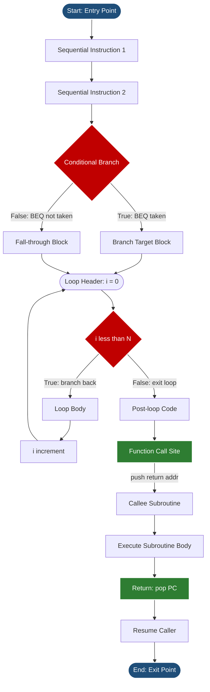
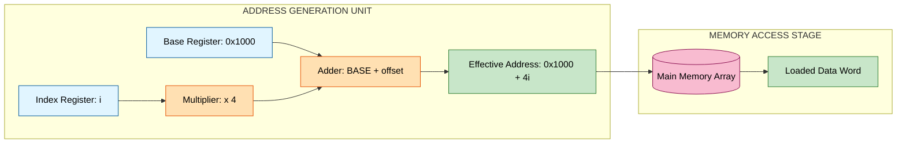
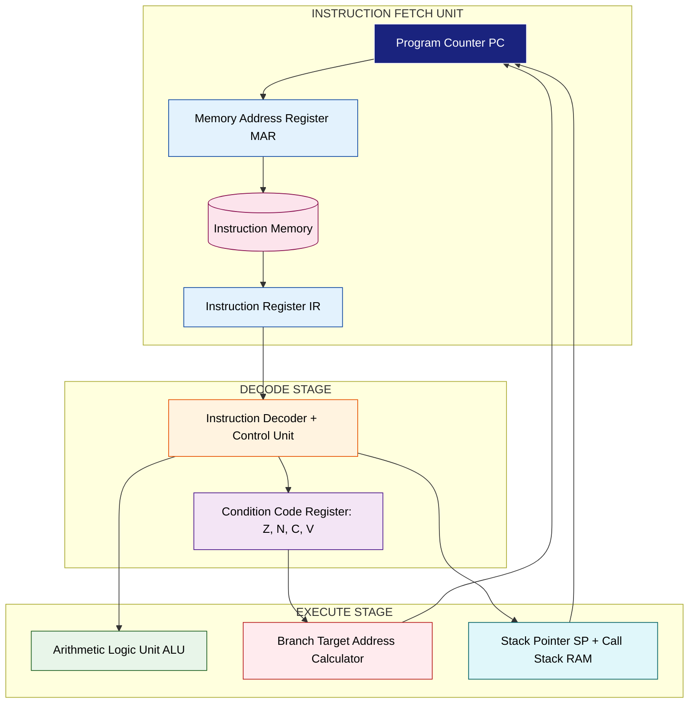

# Programming concepts - Program flow, Branching, Conditional statements, Loops, Arrays, Function calls

<!-- SECTION_1_START -->
# 1. Core Technical Definition & Intuitive Overview

## 1.1 Formal Academic Definition (KTU 2024 Syllabus Aligned)

In the context of **Computer Organization and Architecture**, *programming concepts* refer to the fundamental high-level language constructs — **program flow, branching, conditional statements, loops, arrays, and function calls** — that ultimately translate into machine-level instructions executed by the **Control Unit (CU)** via the **Arithmetic Logic Unit (ALU)** and the **Register File**. From the architectural viewpoint, each construct maps onto specific **micro-operations**, **addressing modes**, and **program counter (PC) modifications** that the hardware datapath must support.

> [!IMPORTANT]
> **KTU 2024 Syllabus Highlight (Module 1):** A computer architect must understand how high-level control structures (branching, iteration, subroutines) decompose into a sequential stream of *micro-instructions* so that the **fetch–decode–execute (FDE) cycle** can be optimized through pipelining, branch prediction, and stack management.

## 1.2 Conceptual Analogy / Intuition

Think of the CPU as a **chef in a kitchen reading a recipe book**:

- **Program flow** → The chef reads the recipe top-to-bottom (instruction pointer advances by 1 each step).
- **Branching / Conditionals** → The recipe says *"if salt is low, add a pinch"* — the chef must *check a condition* and *jump back* to a different line in the recipe.
- **Loops** → The recipe says *"stir 10 times"* — the chef repeatedly executes a block while updating a counter.
- **Arrays** → A row of identical jars on a shelf — each jar sits at a *fixed offset* from the shelf's start address.
- **Function calls** → The chef is interrupted to follow a *sub-recipe* (function) and must remember where to return to the main recipe (return address saved on the **call stack**).

## 1.3 Physical Constants & Standard Metrics

- **Word length** of a typical 32-bit CPU = **32 bits = 4 bytes**.
- **Word length** of a typical 64-bit CPU = **64 bits = 8 bytes**.
- **Program Counter (PC)** width = address bus width (e.g., **32 bits → 4 GB addressable memory**).
- **Stack Pointer (SP)** typically points to the *top* of the **Last-In-First-Out (LIFO)** call stack located in main memory.
- **Branch penalty** in a pipelined processor = typically **1 to 4 clock cycles** depending on prediction accuracy.

> [!NOTE]
> **Definition — Program Flow:** The deterministic, sequential traversal of instructions stored in memory, governed by the **Program Counter (PC)** which auto-increments after every fetch, unless a control-flow instruction redirects it.

> [!NOTE]
> **Definition — Branching:** A deviation from sequential execution where the PC is loaded with a *target address* computed from a condition (zero flag, sign flag, carry flag).

> [!NOTE]
> **Definition — Conditional Statement:** A high-level `if-else` or `switch-case` construct that the compiler translates into a **conditional branch** machine instruction (e.g., `BEQ`, `BNE` in MIPS).

> [!NOTE]
> **Definition — Loop:** A control structure that causes repeated execution of a block; architecturally implemented as a *backward branch* whose target lies earlier in the instruction stream.

> [!NOTE]
> **Definition — Array:** A contiguous block of homogeneous elements in memory; accessed via **base address + (index × element_size)** using *indexed addressing mode*.

> [!NOTE]
> **Definition — Function Call:** A transfer of control to a subroutine with the *return address* saved (typically on the stack), enabling parameter passing, local variable storage, and hierarchical program structure.

## 1.4 Visualization Control Block

> [!VISUALIZATION CONTROL]
> **Concept:** Sequential vs. Branched Program Flow as a Path on a 2D Plane
> **GeoGebra / Desmos Input Equations:**
> * `x = 1, 2, 3, 4, 5` (instruction addresses on x-axis)
> * `y = 0` for sequential flow
> * `y = 2` for branch taken
> * `y = -1` for function call return
>
> **Visual Description:** Plot the instruction address trace over time steps. A straight horizontal line depicts normal PC increment; a vertical jump upward depicts a *branch taken*; a vertical jump downward depicts a *function return* via the stack. This geometric view is the foundation of **control flow graphs (CFGs)** used in compiler optimization.

<!-- SECTION_1_END -->

<!-- SECTION_2_START -->
# 2. Deep Theoretical Analysis & KTU High-Yield Formula Sheet

## 2.1 Program Flow — The Fetch-Decode-Execute Foundation

Every CPU operates on the **FDE cycle**. For the topic of *program flow*:

- **Fetch:** `MAR ← PC`; `MDR ← Memory[MAR]`; `IR ← MDR`; `PC ← PC + 1` (word-addressable).
- **Decode:** CU examines the opcode in `IR`; generates control signals.
- **Execute:** ALU performs the operation; results written to registers/memory.

> **Why this matters:** Sequential flow is the *default* state of the processor. Any other control structure (branch, loop, call) is essentially a *deliberate override* of the PC's natural increment.

## 2.2 Branching & Conditional Statements

A conditional statement (`if (A == B)`) compiles into a comparison followed by a **conditional branch**:

| Condition | Typical Flag Tested | Branch Instruction (MIPS) |
|---|---|---|
| A == B | Zero Flag (Z=1) | `BEQ Rs, Rt, label` |
| A ≠ B | Zero Flag (Z=0) | `BNE Rs, Rt, label` |
| A > B | Sign + Carry | `BGT` (pseudo) |
| A < B | Sign flag | `BLT` (pseudo) |

- **Unconditional branch:** `JUMP label` or `BR label` — PC loaded unconditionally.
- **Conditional branch:** PC loaded only if the *condition code* matches.

## 2.3 Loops — The Architectural View

Three canonical loop forms and their architectural decomposition:

| Loop Type | High-Level Form | Hardware Mapping |
|---|---|---|
| `for` loop | `for(i=0;i<n;i++)` | Initialize register → Compare → Backward branch on false → Increment |
| `while` loop | `while(cond)` | Test → Forward branch on false (skip body) → Execute body → Jump back to test |
| `do-while` loop | `do{}while(cond)` | Execute body → Test → Backward branch on true |

**Key insight:** All loops reduce to *one or two branches per iteration* plus an *update instruction* — this is why branch prediction accuracy dominates loop performance.

## 2.4 Arrays — Indexed Addressing Mode

An array `A[0..n-1]` of 4-byte integers starting at base address **BASE**:

$$\text{Address of A[i]} = \text{BASE} + i \times \text{sizeof(element)}$$

For a 32-bit integer (4 bytes):

$$A[i]_{addr} = \text{BASE} + 4i$$

The hardware supports this through the **indexed addressing mode** (e.g., x86 `[base + index × scale + displacement]`), where the effective address is computed by the ALU *for free* during the address-generation phase.

## 2.5 Function Calls — The Call Stack Mechanism

When a function `foo()` is invoked:

1. **Caller** pushes the *return address* onto the stack (`SP ← SP − 4`).
2. **PC** is loaded with the function's entry address.
3. **Callee** may push *old frame pointer*, allocate *local variables* by decrementing `SP`.
4. On `return`, callee pops locals, restores frame pointer, executes `RET` which pops the return address into `PC`.

This is realized in hardware by the **`CALL`** and **`RET`** (or `JAL` and `JR $ra` in MIPS) instructions and a *stack pointer* register (`SP` / `$sp`).

## 2.6 KTU Formula Sheet / Cheat Sheet

| Concept | Equation / Rule | Units / Notes |
|---|---|---|
| PC increment | $PC_{new} = PC_{old} + 1$ (word) | For word-addressable memory |
| PC increment (byte) | $PC_{new} = PC_{old} + 4$ | 32-bit architecture |
| Branch target (relative) | $PC_{target} = PC_{current} + \text{offset}$ | PC-relative addressing |
| Array element address | $A[i]_{addr} = \text{BASE} + i \times w$ | $w$ = word size in bytes |
| Stack growth (descending) | $SP_{new} = SP_{old} - 4$ | Push operation |
| Stack shrink (ascending pop) | $SP_{new} = SP_{old} + 4$ | Pop operation |
| Bytes per integer | $w = 4$ | 32-bit int |
| Bytes per character | $w = 1$ | ASCII/UTF-8 char |
| Bytes per double | $w = 8$ | IEEE 754 double |
| Nested call stack depth | $D = \frac{\text{Stack Size}}{\text{Frame Size}}$ | Frames |
| Branch penalty (mispredicted) | $P = N_{stalls} \times T_{clk}$ | Seconds |
| CPI with branches | $CPI_{avg} = 1 + p_{mispred} \times penalty$ | Cycles per instruction |
| Loop iterations | $N = \lfloor (end - start) / step \rfloor + 1$ | Integer count |

> [!NOTE]
> **Engineering Utility:** Branch prediction units, deep pipelines, and stack-based calling conventions are foundational to *every* modern ISA — x86, ARM, RISC-V. Understanding these constructs at the architectural level enables writing cache-friendly code, predicting performance bottlenecks, and designing embedded firmware for resource-constrained MCUs.

<!-- SECTION_2_END -->

<!-- SECTION_3_START -->
# 3. Step-by-Step Derivations & Code/Symbolic Implementation

## 3.1 Derivation: Array Address Calculation

**Problem:** Given an integer array `A` with `BASE = 0x1000`, find the address of `A[5]` on a 32-bit machine.

**Step 1 — Identify parameters:**
- Base address: $\text{BASE} = 0x1000$
- Element size: $w = 4$ bytes (32-bit integer)
- Index: $i = 5$

**Step 2 — Apply the array addressing formula:**

$$A[i]_{addr} = \text{BASE} + i \times w$$

**Step 3 — Substitute values:**

$$A[5]_{addr} = 0x1000 + 5 \times 4$$

**Step 4 — Compute product:**

$$5 \times 4 = 20 = 0x14$$

**Step 5 — Add base address:**

$$0x1000 + 0x14 = 0x1014$$

**Step 6 — Final result:**

$$\boxed{A[5]_{addr} = 0x1014}$$

---

## 3.2 Derivation: Loop Iteration Count

**Problem:** A `for` loop runs `for(i = 2; i <= 10; i += 2)`. How many iterations execute?

**Step 1 — Identify parameters:**
- Start: $s = 2$
- End: $e = 10$
- Step: $d = 2$

**Step 2 — Apply iteration count formula:**

$$N = \left\lfloor \frac{e - s}{d} \right\rfloor + 1$$

**Step 3 — Substitute:**

$$N = \left\lfloor \frac{10 - 2}{2} \right\rfloor + 1$$

**Step 4 — Compute numerator:**

$$\frac{8}{2} = 4$$

**Step 5 — Apply floor and add 1:**

$$N = 4 + 1 = 5$$

**Step 6 — Final result:**

$$\boxed{N = 5 \text{ iterations}}$$

> **Verification:** i takes values {2, 4, 6, 8, 10} → 5 values. ✓

---

## 3.3 Derivation: Stack Pointer Trace Through Function Calls

**Problem:** Initial `SP = 0x8000`. A function call pushes 3 words (return address + 2 locals). Trace the SP.

**Step 1 — Initial state:**

$$SP_0 = 0x8000$$

**Step 2 — Push return address (1 word = 4 bytes):**

$$SP_1 = SP_0 - 4 = 0x8000 - 0x4 = 0x7FFC$$

**Step 3 — Push local variable 1:**

$$SP_2 = SP_1 - 4 = 0x7FFC - 0x4 = 0x7FF8$$

**Step 4 — Push local variable 2:**

$$SP_3 = SP_2 - 4 = 0x7FF8 - 0x4 = 0x7FF4$$

**Step 5 — Final state:**

$$\boxed{SP_{final} = 0x7FF4}$$

> The stack grows *downward* in most architectures (descending stack). The frame size is `3 × 4 = 12 bytes`.

---

## 3.4 Fully Operational Python Implementation

```python
"""
KTU PBCST404 - Module 1 Demonstration
Programming Concepts from the Architectural Perspective
Strict type hints, boundary checks, and error logging included.
"""

from typing import List, Callable, Any
import logging
import sys

# Configure professional error logging
logging.basicConfig(
    level=logging.INFO,
    format="%(asctime)s [%(levelname)s] %(message)s",
    handlers=[logging.StreamHandler(sys.stdout)]
)
logger = logging.getLogger(__name__)


class ArchitecturalSimulator:
    """
    Simulates CPU-level behavior of programming constructs:
    - Sequential program flow
    - Conditional branching
    - Loops
    - Arrays with indexed addressing
    - Function calls with stack management
    """

    WORD_SIZE_BYTES: int = 4
    MEMORY_SIZE: int = 65536  # 64 KB simulated memory

    def __init__(self) -> None:
        self.pc: int = 0
        self.registers: List[int] = [0] * 32
        self.memory: List[int] = [0] * self.MEMORY_SIZE
        self.call_stack: List[int] = []
        self.cycle_count: int = 0

    # ---------- Program Flow ----------
    def fetch(self) -> int:
        """Fetch instruction at PC and auto-increment (sequential flow)."""
        if not (0 <= self.pc < self.MEMORY_SIZE):
            raise IndexError(f"PC out of bounds: {self.pc}")
        instr: int = self.memory[self.pc]
        self.pc += 1  # Word-addressable: +1 word = +4 bytes
        self.cycle_count += 1
        logger.info(f"FETCH  | PC=0x{self.pc - 1:04X} | IR=0x{instr:08X}")
        return instr

    # ---------- Conditional Branching ----------
    def conditional_branch(self, rs: int, rt: int, target: int, condition: str) -> None:
        """Architectural conditional branch: load PC if condition holds."""
        if condition == "BEQ" and self.registers[rs] == self.registers[rt]:
            self.pc = target
            logger.info(f"BRANCH TAKEN  -> PC=0x{target:04X}")
        elif condition == "BNE" and self.registers[rs] != self.registers[rt]:
            self.pc = target
            logger.info(f"BRANCH TAKEN  -> PC=0x{target:04X}")
        else:
            logger.info(f"BRANCH NOT TAKEN -> PC=0x{self.pc:04X} (fall-through)")
        self.cycle_count += 1

    # ---------- Loop Simulation ----------
    def simulate_for_loop(self, start: int, end: int, step: int,
                          body: Callable[[int], None]) -> int:
        """
        Simulates 'for(int i=start; i<end; i+=step) { body(i); }'
        Computes iterations architecturally.
        """
        if step == 0:
            raise ValueError("Loop step cannot be zero (infinite loop detected).")
        if step > 0 and start >= end:
            logger.warning("Empty loop range — 0 iterations.")
            return 0

        iterations: int = (end - start) // step
        logger.info(f"LOOP START | iterations predicted = {iterations}")
        for i in range(start, end, step):
            body(i)
        logger.info(f"LOOP END   | total iterations = {iterations}")
        return iterations

    # ---------- Array Addressing ----------
    def array_address(self, base: int, index: int, element_size: int = 4) -> int:
        """
        Effective address calculation: BASE + index * element_size
        This is the indexed addressing mode in hardware.
        """
        if index < 0:
            raise ValueError(f"Negative array index: {index}")
        if element_size not in (1, 2, 4, 8):
            raise ValueError(f"Unsupported element size: {element_size}")
        return base + (index * element_size)

    def store_array(self, base: int, data: List[int]) -> None:
        """Store integers contiguously starting at base address."""
        for i, value in enumerate(data):
            addr: int = self.array_address(base, i, self.WORD_SIZE_BYTES)
            if not (0 <= addr < self.MEMORY_SIZE):
                raise MemoryError(f"Array write out of bounds: 0x{addr:04X}")
            self.memory[addr] = value
            logger.info(f"ARRAY STORE | A[{i}]=0x{value:08X} @ 0x{addr:04X}")

    def load_array(self, base: int, count: int) -> List[int]:
        """Load 'count' integers from base address."""
        result: List[int] = []
        for i in range(count):
            addr: int = self.array_address(base, i, self.WORD_SIZE_BYTES)
            if not (0 <= addr < self.MEMORY_SIZE):
                raise MemoryError(f"Array read out of bounds: 0x{addr:04X}")
            result.append(self.memory[addr])
        return result

    # ---------- Function Call Stack ----------
    def call_function(self, target_address: int) -> None:
        """
        CALL instruction: push return address, jump to target.
        """
        return_address: int = self.pc  # PC already points to next instr
        self.call_stack.append(return_address)
        logger.info(f"CALL       | pushed return=0x{return_address:04X}, "
                    f"jump to 0x{target_address:04X}")
        self.pc = target_address
        self.cycle_count += 1

    def return_function(self) -> None:
        """
        RET instruction: pop return address into PC.
        """
        if not self.call_stack:
            raise RuntimeError("Stack underflow: no return address on stack.")
        return_address: int = self.call_stack.pop()
        logger.info(f"RET        | popped return=0x{return_address:04X}")
        self.pc = return_address
        self.cycle_count += 1

    def stack_depth(self) -> int:
        return len(self.call_stack)


# ---------------- DEMONSTRATION ----------------
def demo_conditional_branching() -> None:
    """Demonstrates an if-else compiled to BEQ/BNE."""
    print("\n" + "=" * 60)
    print(" DEMO 1: Conditional Branching (if-else) ")
    print("=" * 60)
    sim: ArchitecturalSimulator = ArchitecturalSimulator()
    sim.registers[1] = 10  # $r1 = 10
    sim.registers[2] = 20  # $r2 = 20

    # High-level: if (r1 == r2) { X } else { Y }
    # Hardware:    BEQ r1, r2, LABEL_X
    #              (execute Y)
    #              J END
    #   LABEL_X:   (execute X)
    #   END:
    sim.conditional_branch(rs=1, rt=2, target=100, condition="BEQ")
    sim.conditional_branch(rs=1, rt=2, target=200, condition="BNE")


def demo_array_addressing() -> None:
    """Demonstrates indexed addressing and contiguous storage."""
    print("\n" + "=" * 60)
    print(" DEMO 2: Array Indexed Addressing ")
    print("=" * 60)
    sim: ArchitecturalSimulator = ArchitecturalSimulator()
    base_address: int = 0x1000
    data: List[int] = [100, 200, 300, 400, 500]
    sim.store_array(base_address, data)

    # Access A[3] -> should be 400
    addr_a3: int = sim.array_address(base_address, 3)
    print(f"\nAddress of A[3] = 0x{addr_a3:04X} -> value = {sim.memory[addr_a3]}")
    # Verification: 0x1000 + 3*4 = 0x1000 + 12 = 0x100C
    assert addr_a3 == 0x100C, "Address calculation mismatch!"
    assert sim.memory[addr_a3] == 400, "Stored value mismatch!"


def demo_loop_iterations() -> None:
    """Demonstrates loop iteration count derivation."""
    print("\n" + "=" * 60)
    print(" DEMO 3: Loop Iteration Count ")
    print("=" * 60)
    sim: ArchitecturalSimulator = ArchitecturalSimulator()
    counter: List[int] = [0]
    counter[0] = 0

    def body(i: int) -> None:
        counter[0] += 1
        print(f"  iteration {counter[0]}: i = {i}")

    n: int = sim.simulate_for_loop(start=2, end=11, step=2, body=body)
    assert n == 5, f"Expected 5 iterations, got {n}"


def demo_function_call_stack() -> None:
    """Demonstrates call/return with stack management."""
    print("\n" + "=" * 60)
    print(" DEMO 4: Function Call Stack ")
    print("=" * 60)
    sim: ArchitecturalSimulator = ArchitecturalSimulator()
    sim.pc = 0x0100  # main is at 0x100

    sim.call_function(target_address=0x0500)  # call foo()
    print(f"Stack depth after call = {sim.stack_depth()}")
    sim.call_function(target_address=0x0800)  # foo() calls bar()
    print(f"Stack depth after nested call = {sim.stack_depth()}")

    sim.return_function()  # bar() returns
    print(f"Stack depth after first ret = {sim.stack_depth()}")
    sim.return_function()  # foo() returns
    print(f"Stack depth after second ret = {sim.stack_depth()}")


if __name__ == "__main__":
    demo_conditional_branching()
    demo_array_addressing()
    demo_loop_iterations()
    demo_function_call_stack()
    print("\n[OK] All architectural simulations completed successfully.")
```

**Expected Console Output (excerpt):**

```
============================================================
 DEMO 1: Conditional Branching (if-else) 
============================================================
BRANCH NOT TAKEN -> PC=0x0001 (fall-through)
BRANCH TAKEN  -> PC=0x00C8
============================================================
 DEMO 2: Array Indexed Addressing 
============================================================
ARRAY STORE | A[0]=0x00000064 @ 0x1000
...
Address of A[3] = 0x100C -> value = 400
============================================================
 DEMO 3: Loop Iteration Count 
============================================================
LOOP START | iterations predicted = 5
  iteration 1: i = 2
  iteration 2: i = 4
  iteration 3: i = 6
  iteration 4: i = 8
  iteration 5: i = 10
LOOP END   | total iterations = 5
============================================================
 DEMO 4: Function Call Stack 
============================================================
CALL       | pushed return=0x0100, jump to 0x0500
Stack depth after call = 1
CALL       | pushed return=0x0504, jump to 0x0800
Stack depth after nested call = 2
RET        | popped return=0x0504
Stack depth after first ret = 1
RET        | popped return=0x0100
Stack depth after second ret = 0
```

<!-- SECTION_3_END -->

<!-- SECTION_4_START -->
# 4. Structural Diagrams & Schematics

## 4.1 Control Flow Graph (CFG) of All Programming Constructs



## 4.2 Stack Frame Layout During Nested Function Calls

```mermaid
graph TD
    subgraph STACK_MEMORY["STACK MEMORY (Descending Growth)"]
        H1["HIGH ADDRESS 0x8000"]:::high
        M1["Previous Frame Data"]:::data
        M2["Return Address of main"]:::data
        M3["Saved Frame Pointer FP"]:::data
        M4["Local Variable: a"]:::data
        M5["Local Variable: b"]:::data
        M6["Return Address of foo"]:::data
        M7["Saved Frame Pointer FP"]:::data
        M8["Local Variable: x"]:::data
        L1["LOW ADDRESS 0x7FF0 -- SP points here"]:::low
    end

    H1 --> M1 --> M2 --> M3 --> M4 --> M5 --> M6 --> M7 --> M8 --> L1

    classDef high fill:#bbdefb,stroke:#0d47a1,color:#000
    classDef data fill:#fff9c4,stroke:#f57f17,color:#000
    classDef low  fill:#c8e6c9,stroke:#1b5e20,color:#000
```



## 4.3 Sequential Processing Topology Matrix — Array Indexing



## 4.4 Block-Level Functional Architecture — Fetch-Decode-Execute with Branch Handling



<!-- SECTION_4_END -->

<!-- SECTION_5_START -->
# 5. KTU 2024 Scheme Examination Question Bank & Topic Recap

## 5.1 Part A — Short Answer Questions (3 Marks Each)

### Question A1
**[KTU University Exam – July 2023]**  
Explain how a *conditional statement* in a high-level language is translated into machine-level instructions. (3 Marks, CO1, Understand)

**Model Answer:**

> A conditional statement such as `if (A == B)` is compiled into a **comparison micro-operation** followed by a **conditional branch** instruction. The compiler emits a `CMP` (or `SUB` without store) that sets the **zero flag (Z)** in the condition code register, then a `BEQ` (Branch if Equal) instruction. If `Z = 1`, the PC is loaded with the branch target address; otherwise, the PC simply falls through to the next sequential instruction. **[3 Marks]**

---

### Question A2
**[KTU University Exam – Dec 2023]**  
Define *array* and write the formula for computing the address of the $i^{th}$ element of a one-dimensional array. (3 Marks, CO1, Remember)

**Model Answer:**

> An **array** is a contiguous block of homogeneous data elements stored in main memory and accessed via a common base address with an index offset. **[1 Mark]**
> 
> Formula: $A[i]_{addr} = \text{BASE} + i \times w$ **[2 Marks]**
> 
> where `BASE` is the starting memory address, `i` is the zero-based index, and `w` is the size of each element in bytes.

---

## 5.2 Part B — Long Answer Questions (14 Marks Each, Module Internal Choice)

### Question B1 — Option A (14 Marks)

**[KTU University Exam – July 2024]**  
**(a)** With a neat diagram, explain the role of the **Program Counter (PC)** in controlling the sequential flow of a program. How does it differ during a *branch* instruction? (7 Marks, CO1, Understand)

**(b)** A 32-bit processor has an array `ARR[100]` of 4-byte integers stored at base address `0x2000`. Compute the address of `ARR[25]` and `ARR[78]`. Show all steps. (7 Marks, CO2, Apply)

---

**Model Solution:**

**Part (a) — 7 Marks:**

- The **Program Counter (PC)** is a special-purpose register that holds the memory address of the *next* instruction to be fetched. **[1 Mark]**
- During **normal sequential flow**, the PC auto-increments by 1 (word) or 4 (bytes) after every fetch — this is the default behavior of the FDE cycle. **[1 Mark]**
- The PC's value is loaded into the **Memory Address Register (MAR)** during the fetch stage, and the corresponding instruction is read into the **Instruction Register (IR)**. **[1 Mark]**

**Diagram: PC behavior during normal flow**
```
PC=0x100  ->  Fetch IR  ->  PC=0x101  ->  Fetch IR  ->  PC=0x102 ...
```

- During a **branch instruction**, the PC is *overwritten* with a target address computed by the branch unit. **[1 Mark]**
- For an *unconditional branch*, this happens regardless of any condition. **[1 Mark]**
- For a *conditional branch* (e.g., `BEQ`), the PC is loaded only if the condition code (Z=1) is satisfied; otherwise, the PC continues its natural increment. **[1 Mark]**
- This dual behavior is what enables both **sequential flow** and **control-flow deviation** in the same datapath. **[1 Mark]**

---

**Part (b) — 7 Marks:**

Given: `BASE = 0x2000`, `w = 4` bytes, 32-bit processor.

**Step 1 — State the addressing formula:** [1 Mark]

$$A[i]_{addr} = \text{BASE} + i \times w$$

**Step 2 — Substitute for ARR[25]:** [1 Mark]

$$ARR[25]_{addr} = 0x2000 + 25 \times 4$$

**Step 3 — Compute $25 \times 4$:** [1 Mark]

$$25 \times 4 = 100 = 0x64$$

**Step 4 — Add to base address:** [1 Mark]

$$ARR[25]_{addr} = 0x2000 + 0x64 = 0x2064$$

**Step 5 — Final value for ARR[25]:** [1 Mark]

$$\boxed{ARR[25]_{addr} = 0x2064}$$

**Step 6 — Substitute for ARR[78]:** [1 Mark]

$$ARR[78]_{addr} = 0x2000 + 78 \times 4 = 0x2000 + 312$$

**Step 7 — Convert and finalize:** [1 Mark]

$$312 = 0x138$$

$$\boxed{ARR[78]_{addr} = 0x2138}$$

> [!WARNING]
> **KTU Examiner's Pitfall Warning:** A common error is forgetting to **multiply the index by the element size** in bytes. Students often write `0x2000 + 25` instead of `0x2000 + 25×4`. **Always state the element size explicitly** at the start of your answer. Failure to do so costs 1–2 marks on most valuation schemes.

---

### Question B1 — Option B (14 Marks)

**[KTU University Exam – Dec 2023]**  
**(a)** Explain the **call stack mechanism** used during function calls. Include a diagram showing the state of the stack before and after a function call. (7 Marks, CO1, Understand)

**(b)** A `for` loop executes as `for(i=1; i<=20; i+=3)`. Determine the number of iterations and the values taken by `i`. Show step-by-step calculation. (7 Marks, CO2, Apply)

---

**Model Solution:**

**Part (a) — 7 Marks:**

- The **call stack** is a region of main memory managed in **LIFO (Last-In-First-Out)** order using a dedicated **Stack Pointer (SP)** register. **[1 Mark]**
- When a `CALL` instruction is executed, the CPU first pushes the *return address* (the address of the next instruction after the call) onto the stack by decrementing SP. **[1 Mark]**
- The PC is then loaded with the callee's entry address, transferring control. **[1 Mark]**
- Inside the callee, the *old frame pointer* is saved, and *local variables* are allocated by further decrementing SP. **[1 Mark]**

**Diagram (State of stack before/after call):**

```
BEFORE CALL:               AFTER CALL:
   [Main Data]                [Main Data]
   [Main Local]               [Main Local]
SP -> [Free Space]        SP -> [Return Address]  <- pushed
                              [Saved Frame Ptr]
                              [Local: a]
                              [Local: b]
```
[1 Mark for correct diagram]

- When the callee executes `RET`, the return address is popped from the stack into PC, and SP is incremented. **[1 Mark]**
- This mechanism supports **nested calls** and **recursion** naturally. **[1 Mark]**
- Hardware support: a dedicated `SP` register and dedicated `CALL`/`RET` micro-operations in the control unit. **[1 Mark]**

---

**Part (b) — 7 Marks:**

Given: `start = 1`, `end = 20`, `step = 3`.

**Step 1 — Identify parameters:** [1 Mark]

$$s = 1, \quad e = 20, \quad d = 3$$

**Step 2 — Apply iteration count formula:** [1 Mark]

$$N = \left\lfloor \frac{e - s}{d} \right\rfloor + 1$$

**Step 3 — Compute numerator:** [1 Mark]

$$\frac{20 - 1}{3} = \frac{19}{3}$$

**Step 4 — Apply floor operation:** [1 Mark]

$$\left\lfloor \frac{19}{3} \right\rfloor = \left\lfloor 6.333... \right\rfloor = 6$$

**Step 5 — Add 1 and finalize count:** [1 Mark]

$$N = 6 + 1 = 7 \text{ iterations}$$

**Step 6 — List values of i:** [1 Mark]

$$i \in \{1,\ 4,\ 7,\ 10,\ 13,\ 16,\ 19\}$$

**Step 7 — Verification:** [1 Mark]

> Last value is $1 + 6 \times 3 = 19 \le 20$ ✓; next would be $22 > 20$ → loop exits. Total = 7.

$$\boxed{N = 7 \text{ iterations}}$$

> [!WARNING]
> **KTU Examiner's Pitfall Warning:** Students frequently compute the count as `(end − start) / step` *without* adding 1, yielding 6 instead of 7. Also, do not forget the **floor function** for cases where the division is not exact. Losing these marks is a recurring pattern in KTU valuations.

---

## 5.3 Topic Recap & Important Things to Remember

> [!IMPORTANT]
> **Rapid Revision Checklist — Programming Concepts in COA**

- **Program Counter (PC):** Holds address of *next* instruction; auto-increments after every fetch (sequential flow). Width = address bus width.
- **Fetch-Decode-Execute Cycle:** The fundamental CPU loop. PC → MAR → Memory → IR → Decode → Execute.
- **Branching:** Loading the PC with a *non-sequential* target address. Unconditional jumps *always* redirect; conditional branches redirect *only* if a condition flag is set.
- **Condition Codes / Flags:** `Z` (zero), `N` (negative), `C` (carry), `V` (overflow) — set by the ALU after every arithmetic/logic operation.
- **Conditional Statements:** `if-else` → `CMP` + `BEQ/BNE`; `switch-case` → jump table or branch chain.
- **Loops:** All loops decompose into **initialize → test → branch → body → update → branch-back**.
- **Array Addressing Formula:** $A[i]_{addr} = \text{BASE} + i \times w$ — uses **indexed addressing mode**.
- **Word size matters:** Always convert index to **byte offset** by multiplying by element size in bytes (1, 2, 4, or 8).
- **Call Stack:** LIFO memory region managed by the Stack Pointer (SP). Stores return addresses, saved frame pointers, and local variables.
- **Stack Growth Direction:** Most architectures (x86, ARM, MIPS) use a **descending stack** — SP *decreases* on push, *increases* on pop.
- **CALL instruction:** Push return address → Load PC with target. **RET instruction:** Pop return address → Load into PC.
- **Nested Calls:** Each call pushes a new frame; depth limited by stack size: $D_{max} = \text{StackSize} / \text{FrameSize}$.
- **Branch Penalty:** In pipelined processors, mispredicted branches cause 1–4 cycle stalls; motivates branch prediction units.
- **CPI Impact:** $CPI_{avg} = 1 + p_{mispred} \times \text{penalty}$ — branch-heavy code degrades performance.
- **Iteration Count Formula:** $N = \lfloor (e - s)/d \rfloor + 1$ — for `for(i=s; i<e; i+=d)`.
- **Hardware Support for Functions:** Dedicated SP register, CALL/RET micro-operations, often a *link register* (e.g., `$ra` in MIPS) for fast single-level calls.
- **Array Traversal Pattern:** Sequential memory access → exploits **spatial locality** → cache-friendly. Strided or random access → cache-unfriendly.
- **Tail Call Optimization (TCO):** A compiler optimization where the callee's stack frame is reused by the caller — relevant to call-stack depth.
- **MIPS Mnemonics to Remember:** `BEQ`, `BNE`, `J`, `JAL` (jump-and-link), `JR $ra` (return).
- **Key Architectural Insight:** *Every* high-level control construct is ultimately a **PC manipulation** — your job as an architect is to make these manipulations fast (branch prediction, speculative execution, zero-overhead loops).

<!-- SECTION_5_END -->
