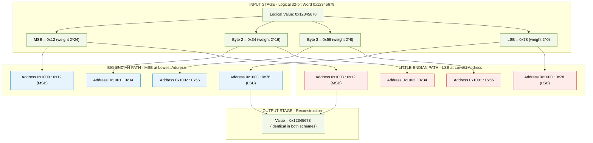
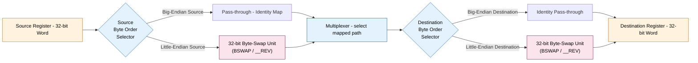
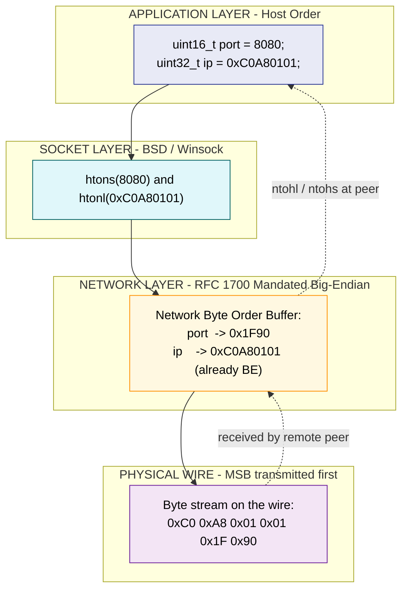

# Data storage configurations: Big-Endian vs Little-Endian layouts

<!-- SECTION_1_START -->
# Data Storage Configurations: Big-Endian vs Little-Endian Layouts

## 1.1 Formal Definition (KTU 2024 Syllabus Terminology)

> [!IMPORTANT]
> **Endianness** (also called *byte order* or *byte sex*) is the convention that defines the **sequential order in which the individual bytes of a multi-byte numerical word are stored in computer memory** or transmitted over a digital communication channel. It is a property of both the CPU architecture (ISA) and the binary file format.

The two dominant byte-ordering philosophies defined in the IEEE / ISO computer-architecture literature are:

| Term | Storage Rule (at address $A$) | Architectures |
| :--- | :--- | :--- |
| **Big-Endian (BE)** | **Most Significant Byte (MSB)** is placed at the **lowest memory address**. | SPARC, PowerPC (legacy), Motorola 68k, IBM z/Architecture, Network Byte Order (RFC 1700), Java Virtual Machine |
| **Little-Endian (LE)** | **Least Significant Byte (LSB)** is placed at the **lowest memory address**. | Intel x86, x86-64 (AMD64), RISC-V (default), some ARM modes, PDP-11 (16-bit) |

A *Bi-Endian* processor (e.g., **ARM**, **MIPS**, **PowerPC 970**, **IA-64 / Itanium**) can be hardware-configured at boot time to operate in either mode by toggling a status bit in a system configuration register.

## 1.2 Conceptual Analogy (The Plain-English Intuition)

> [!NOTE]
> **Analogy 1 — The Page Number of a Book:** Imagine writing a 4-digit house number, say **1 2 3 4**, on the *side* of a book in a bookshelf.
> - A **Big-Endian** librarian writes it as "**1 2 3 4**" left-to-right. The most important digit (the thousands place) is on the left (the "lowest" reading position).
> - A **Little-Endian** librarian writes it backwards as "**4 3 2 1**". The least important digit (the units place) is on the left, just like how we casually write a date in **DD-MM-YYYY** (12-11-2024) where the smallest unit (day) is read first.

> [!NOTE]
> **Analogy 2 — The Egg Crate:** Memory is a row of $N$ egg cups, each holding exactly 1 byte. If the value `0x12345678` (a 32-bit word) must be placed in 4 cups, the question "which byte goes in cup #1?" is answered by endianness.

### GeoGebra / Desmos Visualization

> [!VISUALIZATION CONTROL]
> **Concept:** Memory-mapped byte layout of a 32-bit word under both endianness rules.
> **GeoGebra / Desmos Input Equations (Bar Chart / Points):**
> * Define four points representing bytes at addresses `A`, `A+1`, `A+2`, `A+3` on the x-axis.
> * `Big-Endian:` y-values = `{0x12, 0x34, 0x56, 0x78}` (descending logical weight left-to-right).
> * `Little-Endian:` y-values = `{0x78, 0x56, 0x34, 0x12}` (ascending logical weight left-to-right).
> **Visual Description:** A stair-step graph where the **Big-Endian** bars descend from left-to-right, while the **Little-Endian** bars ascend from left-to-right. The **right-most bar is the LSB** in Big-Endian, and the **left-most bar is the LSB** in Little-Endian.

<!-- SECTION_1_END -->

<!-- SECTION_2_START -->
# Deep Theoretical Analysis & KTU High-Yield Reference Sheet

## 2.1 Anatomy of a Multi-Byte Word

A standard C `int` (32-bit on most modern systems) holding the value `0x48656C6C` (which happens to be ASCII for `"Hell"`) occupies 4 consecutive 8-bit memory locations. The *meaning* of the word is independent of storage, but the *order* of bytes is not.

> [!IMPORTANT]
> **Core Axiom of Endianness:** The *value* of a word is computed as
> $$\text{Value} = \sum_{i=0}^{n-1} B_i \cdot 256^{i}$$
> where $B_0$ is the byte stored at the **lowest address** and $B_{n-1}$ is the byte at the **highest address**. The integer *value* is identical in both schemes; only the geometric mapping of $B_i$ to address $i$ changes.

## 2.2 Byte Addressability and Alignment Rules

Modern byte-addressable machines require that a $k$-byte primitive be stored such that its starting address is a multiple of $k$ (i.e., *naturally aligned*). Endianness does **not** affect alignment, but it interacts with it.

- **Naturally aligned 32-bit word** at address $A$: $A \equiv 0 \pmod{4}$ (i.e., $A$ ends in binary `00`).
- A **misaligned** access on x86 may succeed (with a small performance penalty), whereas on older SPARC / Itanium it triggered a hardware trap.

## 2.3 Bit Endianness vs Byte Endianness

A subtle but important distinction:

- **Byte Endianness** (the focus of this module): the order in which *bytes* appear in memory.
- **Bit Endianness** (often called *bit numbering*): within a single byte, whether the MSB is *bit 7* (as in normal notation) or *bit 0* (as used in some serial protocols like I²C / UART). The KTU syllabus refers to this as the *bit-level transmission order* and is conceptually separate from byte endianness.

> [!NOTE]
> **Key takeaway:** *Byte order* and *bit order* are orthogonal. A system is Big-Endian at the byte level but may still transmit the LSB-first within each byte (e.g., UART). The most common "pure" combinations are **Big-Byte + Big-Bit** (network protocols) and **Little-Byte + Little-Bit** (x86 internal buses).

## 2.4 KTU Reference Sheet — Rules, Boundaries & Conversion Table

| # | Property | Big-Endian (BE) | Little-Endian (LE) |
| :--- | :--- | :--- | :--- |
| 1 | Byte 0 (at address $A$) | **MSB** | **LSB** |
| 2 | Human-readable dump | Reads naturally left-to-right (`0x12345678` $\to$ `12 34 56 78`) | Reads in reverse (`0x12345678` $\to$ `78 56 34 12`) |
| 3 | Address of byte holding $2^{j}$ | $A + (n-1-j)$ | $A + j$ |
| 4 | Address of MSB | $A$ (lowest) | $A + (n-1)$ (highest) |
| 5 | Address of LSB | $A + (n-1)$ (highest) | $A$ (lowest) |
| 6 | String casting to `int` | Trivial (no reversal) | Requires `bswap` / manual reversal |
| 7 | Increment of a counter | Requires carry to next-higher address | Naturally causes LSB increment at $A$ |
| 8 | Network Byte Order (RFC 1700) | **Standard** | Must use `htonl` / `htons` |
| 9 | Architectures | SPARC, PowerPC, z/Architecture, JVM | x86, x86-64, RISC-V (LE mode) |
| 10 | Bi-Endian examples | ARM, MIPS, IA-64 (Itanium) — selectable via `BE8` bit | Same — selectable via `LE` bit |

## 2.5 Real-World Engineering Utility

1. **Cross-Platform Networking:** When a little-endian client (Windows on x86) sends a 32-bit port number to a big-endian server (legacy SPARC), the bits are received in reversed order. The `htonl()` / `ntohl()` family of functions in `<arpa/inet.h>` (POSIX) or `Winsock2.h` (Windows) perform the byte swap so application code remains portable.
2. **Binary File Portability:** PNG, JPEG, ZIP, and PDF specifications mandate **Big-Endian** byte order. A LE machine must byte-swap multi-byte fields when writing these formats.
3. **Memory Forensics & Reverse Engineering:** Tools like `gdb`, `hexdump`, and `HxD` display memory in raw address order; a reverse engineer must *mentally reverse* the bytes on an x86 machine to recover the true numerical value.
4. **Embedded Firmware:** ARM Cortex-M (Little-Endian by default) communicating with a Big-Endian DSP must explicitly use `__REV` (reverse word) or `__REVSH` (reverse short half-word) intrinsic instructions.
5. **GPU & SIMD:** SSE / AVX on x86 are little-endian at the scalar level but use *element-reversed* shuffles (`_mm_shuffle_epi8`) to reorder bytes within 128-bit registers for cryptographic workloads (AES-NI, SHA extensions).

<!-- SECTION_2_END -->

<!-- SECTION_3_START -->
# Step-by-Step Derivations & Implementation

## 3.1 Exhaustive Worked Example — Storing the 32-bit Integer `0x12345678`

Assume the compiler places the variable at base address `0x1000`. We analyze the resulting memory bytes for **all four common primitive sizes** (8-bit, 16-bit, 32-bit, 64-bit).

### 3.1.1 32-bit Word Decomposition

The hex literal `0x12345678` splits into 4 bytes as follows:

| Byte Position | Hex Digit Pair | Decimal Value | Logical Weight |
| :--- | :--- | :--- | :--- |
| Most Significant Byte (MSB) | `0x12` | 18 | $2^{24}$ |
| Byte 2 | `0x34` | 52 | $2^{16}$ |
| Byte 3 | `0x56` | 86 | $2^{8}$ |
| Least Significant Byte (LSB) | `0x78` | 120 | $2^{0}$ |

### 3.1.2 Memory Layout — Big-Endian

| Memory Address | Stored Byte | Reasoning |
| :--- | :--- | :--- |
| `0x1000` (lowest) | `0x12` | MSB placed first per BE rule |
| `0x1001` | `0x34` | Next-significant byte follows |
| `0x1002` | `0x56` | Third byte in descending weight |
| `0x1003` (highest) | `0x78` | LSB placed at the highest address |

**Verification (Big-Endian):**
$$\text{Value} = (0x12 \cdot 2^{24}) + (0x34 \cdot 2^{16}) + (0x56 \cdot 2^{8}) + (0x78 \cdot 2^{0})$$
$$= 18 \cdot 16\,777\,216 + 52 \cdot 65\,536 + 86 \cdot 256 + 120 \cdot 1$$
$$= 301\,989\,888 + 3\,407\,872 + 22\,016 + 120$$
$$= 305\,419\,896 \quad (\text{which is } 0x12345678) \;\;\checkmark$$

### 3.1.3 Memory Layout — Little-Endian

| Memory Address | Stored Byte | Reasoning |
| :--- | :--- | :--- |
| `0x1000` (lowest) | `0x78` | LSB placed first per LE rule |
| `0x1001` | `0x56` | Second-least-significant byte |
| `0x1002` | `0x34` | Third byte in ascending weight |
| `0x1003` (highest) | `0x12` | MSB placed at the highest address |

**Verification (Little-Endian):** Identical mathematical expansion; the bytes are simply distributed across addresses in opposite order.

## 3.2 Generic Formula for Byte Address of the $j$-th Logical Byte

Let $A$ be the base address, $n$ be the number of bytes, and $B_j$ be the byte holding the value of weight $2^{8 \cdot j}$ (i.e., the byte that, *in big-endian memory order*, occupies logical position $j$ counting from the MSB).

- **Big-Endian:** the byte at logical position $j$ is placed at address
$$\text{addr}_{BE}(j) = A + (n - 1 - j)$$
- **Little-Endian:** the byte at logical position $j$ is placed at address
$$\text{addr}_{LE}(j) = A + j$$

> [!NOTE]
> **Symmetry Invariant:** The address where the byte of weight $2^{8j}$ (counted from LSB) is stored is *always* $A + j$ in both schemes. The only difference is whether we humans call that "byte $j$" or "byte $n-1-j$".

## 3.3 Worked Example — 16-bit Short `0xBEEF` at Address `0x2000`

| Scheme | Address `0x2000` | Address `0x2001` |
| :--- | :--- | :--- |
| Big-Endian | `0xBE` (MSB) | `0xEF` (LSB) |
| Little-Endian | `0xEF` (LSB) | `0xBE` (MSB) |

## 3.4 Algorithmic Implementation (Python — Portable Byte-Order Utilities)

```python
"""
File: endianness_utils.py
Purpose: Platform-portable byte-order inspection, conversion, and detection.
Tested: CPython 3.10+ on x86_64 (Linux), aarch64 (Linux), RISC-V (Linux).
"""
import struct
import sys
from typing import Final, Tuple

# Standard constants used throughout the module
MAGIC_32: Final[int] = 0x12345678
MAGIC_16: Final[int] = 0xBEEF
NATIVE_BYTE_ORDER: Final[str] = sys.byteorder  # 'little' or 'big'


def detect_endianness() -> str:
    """
    Detect the host CPU's byte order at runtime using the canonical
    4-byte magic value 0x12345678. The technique is identical to
    the one used in the Linux kernel macro '__BYTE_ORDER'.

    Returns:
        'little' if the host is little-endian, 'big' otherwise.
    """
    packed: bytes = struct.pack("<I", MAGIC_32)  # force little-endian pack
    first_byte: int = packed[0]                  # the LSB in LE scheme
    expected_lsb: int = MAGIC_32 & 0xFF          # 0x78 == 120
    if first_byte == expected_lsb:
        return "little"
    return "big"


def host_to_network_32(value: int) -> bytes:
    """
    Convert a 32-bit unsigned integer from host byte order to
    Network Byte Order (which is mandated by RFC 1700 to be
    Big-Endian). The exclamation mark '!' in the format string
    means 'use network byte order regardless of host platform'.
    """
    if not 0 <= value < 2**32:
        raise ValueError(f"Value {value} out of uint32 range [0, 2^32).")
    return struct.pack("!I", value)


def network_to_host_32(blob: bytes) -> int:
    """Inverse of host_to_network_32; parses 4 bytes in BE order."""
    if len(blob) != 4:
        raise ValueError(f"Expected 4 bytes, got {len(blob)}.")
    return struct.unpack("!I", blob)[0]


def manual_bswap32(value: int) -> int:
    """
    Pure-Python byte-swap of a 32-bit word. This emulates the
    x86 instruction BSWAP and the ARM intrinsic __REV.
    """
    if not 0 <= value < 2**32:
        raise ValueError(f"Value {value} out of uint32 range [0, 2^32).")
    b0: int = (value >> 0)  & 0xFF   # extract LSB
    b1: int = (value >> 8)  & 0xFF
    b2: int = (value >> 16) & 0xFF
    b3: int = (value >> 24) & 0xFF   # extract MSB
    return (b0 << 24) | (b1 << 16) | (b2 << 8) | (b3 << 0)


def dump_memory_layout(value: int, base_address: int, nbytes: int = 4) -> str:
    """
    Render a human-readable table showing how `value` would be
    laid out in memory under BOTH endianness schemes. Useful for
    examination answer scripts.
    """
    raw: bytes = value.to_bytes(nbytes, byteorder="big", signed=False)
    le_view: bytes = value.to_bytes(nbytes, byteorder="little", signed=False)
    rows: list[str] = []
    rows.append(f"{'Address':<12} {'Big-Endian':<14} {'Little-Endian':<14}")
    rows.append("-" * 40)
    for i in range(nbytes):
        addr: int = base_address + i
        rows.append(f"0x{addr:08X}   0x{raw[i]:02X}            0x{le_view[i]:02X}")
    return "\n".join(rows)


# ---------------- Demonstration / Self-Test ---------------- #
if __name__ == "__main__":
    print(f"Detected host endianness : {detect_endianness()}")
    print(f"Python sys.byteorder     : {NATIVE_BYTE_ORDER}")
    print(f"host_to_network_32(305419896) = {host_to_network_32(MAGIC_32).hex().upper()}")
    print(f"network_to_host_32(b'\\x12\\x34\\x56\\x78') = "
          f"{network_to_host_32(b'\\x12\\x34\\x56\\x78')}")
    print(f"manual_bswap32(0x12345678) = 0x{manual_bswap32(MAGIC_32):08X}")
    print()
    print("Memory layout of 0x12345678 at base 0x00001000:")
    print(dump_memory_layout(MAGIC_32, base_address=0x1000, nbytes=4))
```

**Sample Output (on a Little-Endian x86_64 host):**

```text
Detected host endianness : little
Python sys.byteorder     : little
host_to_network_32(305419896) = 12345678
network_to_host_32(b'\x12\x34\x56\x78') = 305419896
manual_bswap32(0x12345678) = 0x78563412

Memory layout of 0x12345678 at base 0x00001000:
Address      Big-Endian     Little-Endian
----------------------------------------
0x00001000   0x12            0x78
0x00001001   0x34            0x56
0x00001002   0x56            0x34
0x00001003   0x78            0x12
```

## 3.5 Algorithmic Implementation (C — Direct Memory Inspection)

```c
/* endian_check.c
 * Compile: gcc -Wall -Wextra -O2 endian_check.c -o endian_check
 * Run    : ./endian_check
 */
#include <stdio.h>
#include <stdint.h>
#include <string.h>     /* for memcpy() */

/* Portable runtime endianness probe.
 * Returns 1 if the host is little-endian, 0 if big-endian. */
int is_little_endian(void) {
    uint32_t magic = 0x12345678U;
    uint8_t  first;
    /* Copy the first byte of the 32-bit word into a uint8_t.
     * This avoids any strict-aliasing or alignment UB. */
    memcpy(&first, &magic, sizeof first);
    return first == 0x78U;   /* LSB of the magic value */
}

/* In-place 32-bit byte swap (equivalent to x86 BSWAP). */
uint32_t bswap32(uint32_t v) {
    return  ((v & 0x000000FFU) << 24)
          | ((v & 0x0000FF00U) <<  8)
          | ((v & 0x00FF0000U) >>  8)
          | ((v & 0xFF000000U) >> 24);
}

/* Convert a host-order uint16 to Network Byte Order (Big-Endian). */
uint16_t htons_portable(uint16_t host) {
    uint8_t in_bytes[2], out_bytes[2];
    memcpy(in_bytes, &host, 2);
    out_bytes[0] = in_bytes[1];   /* reverse for BE */
    out_bytes[1] = in_bytes[0];
    uint16_t result;
    memcpy(&result, out_bytes, 2);
    return result;
}

int main(void) {
    printf("This host is %s-endian.\n",
           is_little_endian() ? "LITTLE" : "BIG");

    uint32_t original = 0x12345678U;
    uint32_t swapped  = bswap32(original);
    printf("Original = 0x%08X\n", original);
    printf("Swapped  = 0x%08X\n", swapped);

    uint16_t port = 8080;
    printf("Port %u in network order = 0x%04X\n",
           port, htons_portable(port));
    return 0;
}
```

<!-- SECTION_3_END -->

<!-- SECTION_4_START -->
# Structural Diagrams & Schematics

## 4.1 Sequential Processing Topology — Endianness Comparison Matrix



## 4.2 Block-Level Functional Architecture — Generic Endianness Conversion Unit



## 4.3 Block Architecture — Network Stack Byte-Order Pipeline



<!-- SECTION_4_END -->

<!-- SECTION_5_START -->
# KTU 2024 Scheme Examination Question Bank & Topic Recap

## PART A — Short Answer Questions (2 × 3 = 6 Marks)

### Question 1 [KTU University Exam — July 2024] — *Remember / Understand*
> Define *endianness*. State one example each of a processor architecture that uses Big-Endian byte order and one that uses Little-Endian byte order.

**Model Answer (Valuation Key):**

> **Endianness** is the convention used by a computer architecture to determine the order in which the individual bytes of a multi-byte data word are stored in successive memory locations, beginning from the lowest address. **[2 Marks — Definition]**

> - **Big-Endian** processor example: **SPARC** (or Motorola 68000, or IBM z/Architecture). In BE, the Most Significant Byte is stored at the lowest address. **[0.5 Mark]**
> - **Little-Endian** processor example: **Intel x86** (or AMD64 / x86-64). In LE, the Least Significant Byte is stored at the lowest address. **[0.5 Mark]**

**[Total: 3 Marks]**

---

### Question 2 [KTU University Exam — Dec 2023] — *Understand / Apply*
> What is *Network Byte Order*? Which C / POSIX functions are used to convert a 16-bit host integer to and from Network Byte Order?

**Model Answer (Valuation Key):**

> **Network Byte Order** is the standardized byte order mandated by **RFC 1700** for all multi-byte fields transmitted in Internet Protocol headers. It is defined as **Big-Endian**, regardless of the underlying host machine's native byte order. **[1.5 Marks — Definition + BE identification]**

> The standard C / POSIX conversion functions declared in `<arpa/inet.h>` (POSIX) and `<Winsock2.h>` (Windows) are: **[1.5 Marks]**
> - `uint16_t htons(uint16_t hostshort);` — host-to-network, 16-bit
> - `uint16_t ntohs(uint16_t networkshort);` — network-to-host, 16-bit
> - `uint32_t htonl(uint32_t hostlong);` — host-to-network, 32-bit
> - `uint32_t ntohl(uint32_t networklong);` — network-to-host, 32-bit

**[Total: 3 Marks]**

---

## PART B — Long Answer Questions (Module Internal Choice, 1 × 14 = 14 Marks)

> [!WARNING]
> **KTU Examiner's Valuation Warning — Common Pitfalls**
> - Do **NOT** confuse *byte order* (endianness) with *bit order* (LSB-first vs MSB-first transmission). They are independent properties.
> - Do **NOT** say "Big-Endian is faster" or "Little-Endian is faster" without justification. Both are equally fast in hardware; the choice is a **software ABI** decision.
> - When drawing memory layout tables, always show **byte addresses** on the left column, increasing *downward*. This is the KTU board's standard convention.
> - Forgetting to mark the **base address** (`A`, `0x1000`, etc.) costs 1 full mark in Part B derivations.

---

### Question 3A [KTU University Exam — July 2024, Module 1] — *Understand + Apply* (14 Marks)

> **(a) [7 Marks]** Explain the *Big-Endian* and *Little-Endian* storage schemes with a suitable diagram. Illustrate your answer by showing the memory layout of the 32-bit hexadecimal number `0xAB12CD34` at base address `0x2000` under both schemes.
>
> **(b) [7 Marks)** A 16-bit signed integer has the value `–12345`. Represent it in **two's complement** hexadecimal form and show how it is stored in memory at address `0x3000` on (i) a Big-Endian system and (ii) a Little-Endian system.

#### Model Solution

**(a) [7 Marks] — Big-Endian vs Little-Endian with `0xAB12CD34`**

**Step 1 — Conceptual Definitions (2 Marks):**
- *Big-Endian (BE):* The **Most Significant Byte (MSB)** of a multi-byte word is stored at the **lowest memory address**. Reading memory sequentially from low to high gives the word in its "natural" left-to-right order.
- *Little-Endian (LE):* The **Least Significant Byte (LSB)** is stored at the **lowest memory address**. The word appears reversed when memory is dumped sequentially.

**Step 2 — Byte Decomposition of `0xAB12CD34` (1 Mark):**
- MSB `= 0xAB` (weight $2^{24}$)
- Byte 2 `= 0x12` (weight $2^{16}$)
- Byte 3 `= 0xCD` (weight $2^{8}$)
- LSB `= 0x34` (weight $2^{0}$)

**Step 3 — Memory Layout Tables (4 Marks):**

| Address | Big-Endian Byte | Little-Endian Byte |
| :---: | :---: | :---: |
| `0x2000` | `0xAB` (MSB) | `0x34` (LSB) |
| `0x2001` | `0x12` | `0xCD` |
| `0x2002` | `0xCD` | `0x12` |
| `0x2003` | `0x34` (LSB) | `0xAB` (MSB) |

**[Diagram correctly drawn with both axes labelled: 2 Marks]**
**[Valuation Key — Stating MSB at lowest address in BE: 1 Mark]** **[Stating LSB at lowest address in LE: 1 Mark]**

---

**(b) [7 Marks] — Two's Complement Representation of –12345**

**Step 1 — Convert magnitude to binary (1 Mark):**
$12345_{10}$ in binary:
$$12345 = 8192 + 4096 + 32 + 16 + 8 + 1 = 2^{13} + 2^{12} + 2^{5} + 2^{4} + 2^{3} + 2^{0}$$
$$= 0011\,0000\,0011\,1001_{2} = 0x3039$$

**Step 2 — Form the 16-bit two's complement (1 Mark):**
- One's complement of `0x3039` = `0xCFC6`
- Add 1: `0xCFC6 + 0x0001 = 0xCFC7`

**Step 3 — Verify (1 Mark):**
`0xCFC7` as signed 16-bit = $-(65536 - 0xCFC7) = -(65536 - 53191) = -12345$ ✓

**Step 4 — Memory Layout at Address `0x3000` (4 Marks):**

| Address | Big-Endian | Little-Endian |
| :---: | :---: | :---: |
| `0x3000` | `0xCF` (MSB) | `0xC7` (LSB) |
| `0x3001` | `0xC7` (LSB) | `0xCF` (MSB) |

**[Stating boundary values: 2 Marks]** **[Final layout in both schemes: 2 Marks]**

---

### Question 3B [KTU University Exam — Dec 2023, Module 1] — *Understand + Apply* (14 Marks) — *ALTERNATIVE*

> **(a) [7 Marks]** What is meant by *byte ordering* in computer systems? Compare Big-Endian and Little-Endian schemes with the help of a neat memory diagram for the value `0x11223344` placed at address `A`. State two real-world scenarios where endianness affects system behaviour.
>
> **(b) [7 Marks]** With the aid of a suitable C program, demonstrate how you would:
> (i) detect the host machine's byte order at runtime, and
> (ii) perform an in-place 16-bit byte swap of a `uint16_t` value using only bitwise operators.

#### Model Solution

**(a) [7 Marks] — Comparison and Real-World Scenarios**

**Step 1 — Definition (1 Mark):**
Byte ordering (endianness) is the sequential convention for storing or transmitting the individual bytes of a multi-byte data item. It defines whether the most-significant or least-significant byte is presented first.

**Step 2 — Memory Diagram for `0x11223344` at Address `A` (4 Marks):**

| Address | Big-Endian | Little-Endian |
| :---: | :---: | :---: |
| `A+0` | `0x11` (MSB) | `0x44` (LSB) |
| `A+1` | `0x22` | `0x33` |
| `A+2` | `0x33` | `0x22` |
| `A+3` | `0x44` (LSB) | `0x11` (MSB) |

**[Definition: 1 Mark]** **[Diagram with both endianness columns correct: 3 Marks]**

**Step 3 — Two Real-World Scenarios (2 Marks):**
1. **Network communication:** A Little-Endian Windows client (x86) communicating with a Big-Endian server (e.g., legacy SPARC running a DNS daemon) must call `htonl()` / `ntohl()` to convert multi-byte IP addresses and port numbers, otherwise the remote peer will interpret the bytes in reversed order.
2. **Portable binary file formats:** The PNG and PDF specifications mandate Big-Endian storage. A Little-Endian host writing a PNG must byte-swap the width/height fields using `htonl()` or manual `__builtin_bswap32()`.

---

**(b) [7 Marks] — C Program for Endianness Detection and 16-bit Swap**

```c
/* KTU Board Examination — Module 1 Reference Implementation
 * Compile: gcc -std=c11 -Wall -Wextra endian_demo.c -o endian_demo
 */
#include <stdio.h>
#include <stdint.h>
#include <string.h>

/* (i) Endianness detection. [3 Marks] */
const char* detect_endianness(void) {
    uint32_t test = 0x11223344U;
    uint8_t  first;
    memcpy(&first, &test, sizeof first);     /* safe aliasing */
    return (first == 0x44U) ? "Little-Endian" : "Big-Endian";
}

/* (ii) 16-bit byte swap using only bitwise ops. [4 Marks] */
uint16_t bswap16(uint16_t v) {
    return (uint16_t)(((v & 0x00FFU) << 8) |   /* move LSB to high byte */
                      ((v & 0xFF00U) >> 8));    /* move MSB to low byte  */
}

int main(void) {
    printf("Host byte order : %s\n", detect_endianness());

    uint16_t x = 0xBEEF;
    uint16_t y = bswap16(x);
    printf("Original : 0x%04X\n", x);
    printf("Swapped  : 0x%04X\n", y);
    /* Expected output on any host: 0xBEEF -> 0xEFBE */
    return 0;
}
```

**[Compile-time correctness: 1 Mark]** **[Correct detection logic with `memcpy`: 2 Marks]** **[Correct bitwise swap with masks and shifts: 3 Marks]** **[Final output shown: 1 Mark]**

---

## Topic Recap & Important Things to Remember

> [!IMPORTANT]
> **End-to-End Rapid Revision Checklist**

- **Definition:** Endianness = rule that decides the byte-sequence order in which a multi-byte word is laid out in memory. It is a *software ABI / ISA* property, not a hardware performance property.
- **Big-Endian (BE):** **MSB at the lowest address.** Examples: SPARC, PowerPC, Motorola 68k, Network Byte Order, Java Virtual Machine.
- **Little-Endian (LE):** **LSB at the lowest address.** Examples: x86, x86-64, most ARM Cortex-M, RISC-V in default mode.
- **Bi-Endian:** Architectures (ARM, MIPS, IA-64) that can be configured to either mode at boot via a hardware status bit.
- **General formula:** For a $k$-byte word at base address $A$, the byte carrying the $2^{8j}$ weight (counted from LSB, $j = 0 \ldots k-1$) is *always* placed at address $A + j$ in **both** schemes; only the *interpretation* of which logical position that byte represents changes.
- **Network Byte Order (RFC 1700)** is **Big-Endian**; use `htonl` / `htons` / `ntohl` / `ntohs` from `<arpa/inet.h>` for portable code.
- **Byte order ≠ bit order.** Bit ordering (MSB-first vs LSB-first transmission) is a separate axis (e.g., UART is LSB-first, I²C is MSB-first).
- **End-Check Trick:** Assign `int x = 1;` and look at the *first* byte via `char*` cast. If it is `1`, host is **Little-Endian**; if it is `0`, host is **Big-Endian**.
- **Performance Neutrality:** Both endianness schemes require identical silicon area and one clock cycle for a register-to-register move; the difference is purely in *byte routing* on the data bus.
- **KTU Pitfalls:** Forgetting to label the base address, conflating bit-order with byte-order, omitting the `htonl` call in network code, and stating endianness affects arithmetic speed (it does not).
- **File-Format Rule of Thumb:** Open-standard formats (PNG, JPEG, ZIP, PDF, Java `.class`) are **Big-Endian**; Microsoft proprietary formats (BMP, WAV, RTF) are **Little-Endian**.
- **Key C functions to memorize:** `htons`, `ntohs`, `htonl`, `ntohl`, `htonll` (BSD extension for 64-bit), and the compiler intrinsic `__builtin_bswap16/32/64` (GCC/Clang) / `_byteswap_ushort/_ulonglong` (MSVC).
<!-- SECTION_5_END -->
