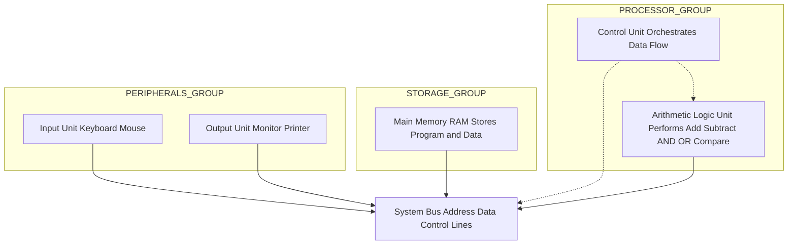
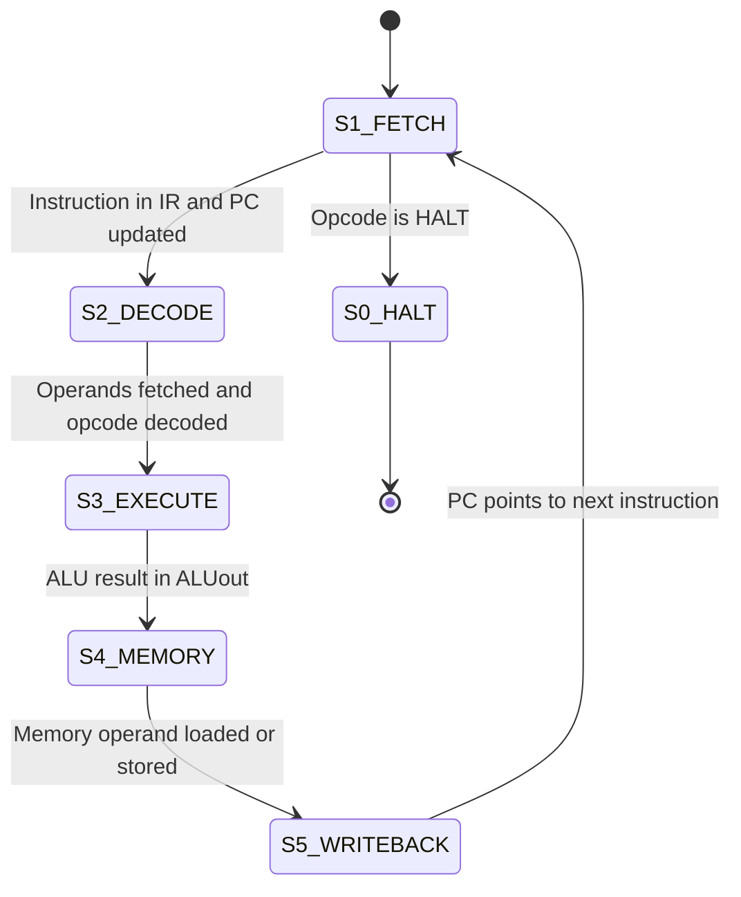
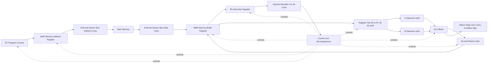
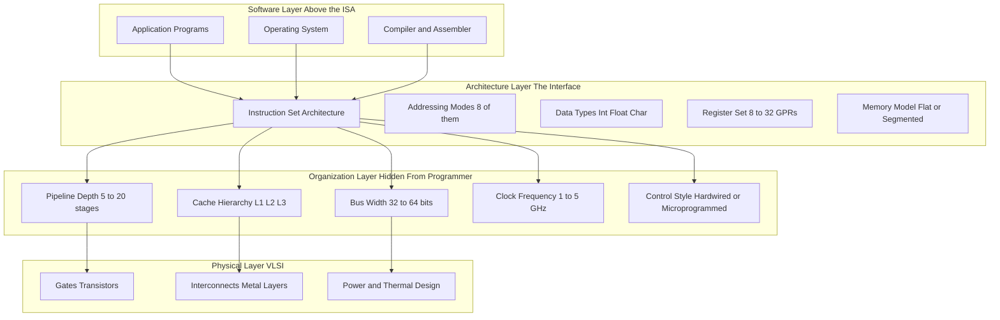

# Functional units, Architecture design vs Organization, Instruction execution cycles

<!-- SECTION_1_START -->
# Functional Units, Architecture vs Organization, and Instruction Execution Cycles

## 1.1 Formal Definition: The Five Functional Units

A **digital computer** is a programmable electronic device that accepts data (input), processes it under the direction of stored instructions, and produces useful information (output). Every Von-Neumann style computer is decomposed into **five logical functional units** that cooperate through shared buses and control signals.

$$
\text{Computer} = \underbrace{I}_{\text{Input}} \;+\; \underbrace{M}_{\text{Memory}} \;+\; \underbrace{A}_{\text{ALU}} \;+\; \underbrace{C}_{\text{Control}} \;+\; \underbrace{O}_{\text{Output}}
$$

> [!IMPORTANT]
> **KTU 2024 Syllabus Highlight (Module 1):** Students must be able to *draw and label* the block diagram of a basic computer showing all five functional units and the **system bus** interconnecting them. This is a guaranteed 4 to 6 mark question in the ESE.

### 1.2 Intuitive Analogy — The "Restaurant Kitchen" Model

Imagine a fully automated restaurant:

| Computer Block | Restaurant Analogy | Role |
|---|---|---|
| **Input Unit** | Waiter taking customer order | Captures raw data and programs from the outside world |
| **Memory Unit** | Cold storage and pantry | Stores both the *recipe book* (program) and *ingredients* (data) |
| **ALU** | The head chef | Performs arithmetic and logical operations on the ingredients |
| **Control Unit** | The floor manager | Orchestrates the timing and sequence of every kitchen action |
| **Output Unit** | The serving counter | Presents the cooked dish to the customer |

The key insight is that the *manager* (Control Unit) does not cook; it only *tells* the chef (ALU) what to cook and *when*. The chef never decides the menu; that decision flows from the storage (Memory) where the recipes are kept.

## 1.3 Architecture vs Organization — The Two Sides of Design

The KTU 2024 syllabus insists on a clear distinction, because the same **architecture** can be implemented with different **organizations**, and vice versa.

> [!NOTE]
> **Computer Architecture** = the *attributes visible to the assembly-language programmer / compiler writer*. It is an *abstract* design specification.

> [!NOTE]
> **Computer Organization** = the *operational units and their interconnections* that realize the architecture. It is a *transparent* hardware implementation detail.

### A Memorable Analogy

Think of **Architecture** as the *menu* of a restaurant and **Organization** as the *kitchen layout* used to produce that menu.

- The **menu** (architecture) tells you *what* dishes are available and *what* ingredients you may request. The **kitchen** (organization) is hidden behind the wall — you don't see how many stoves, freezers, or chefs are used.
- Two restaurants can serve the **same menu** using **different kitchens** (e.g., one with gas stoves, another with induction). Conversely, the **same kitchen** can be reconfigured to serve a **different menu**.

In computing terms:

- *Architecture* fixes the **Instruction Set Architecture (ISA)**: data types, registers, addressing modes, instruction formats.
- *Organization* decides **how** those instructions are executed: number of pipeline stages, cache size, bus width, clock speed, microcode vs hardwired control.

> [!EXAMPLE]
> The **Intel x86 ISA** (architecture) has been implemented by organizations ranging from the original 8086 (single-bus, 16-bit, 5 MHz) to modern Core i9 (multi-core, 64-bit, >5 GHz, deep out-of-order pipelines). The architecture is stable; the organization evolves every year.

## 1.4 The Instruction Execution Cycle — Definition

A **program** is a sequence of machine instructions stored in main memory. The CPU repeatedly performs a well-defined cycle to execute them:

$$
\text{Fetch} \;\rightarrow\; \text{Decode} \;\rightarrow\; \text{Execute} \;\rightarrow\; \text{Memory Access} \;\rightarrow\; \text{Write-Back} \;\rightarrow\; (\text{repeat})
$$

This is called the **Instruction Cycle**, also known as the **Fetch-Decode-Execute (FDE) Cycle** or the **Instruction Processing Cycle**.

> [!VISUALIZATION CONTROL]
> **Concept:** Instruction-Cycle State Transition as a directed graph.
> **Desmos / GeoGebra Input Equations (parametric):**
> * $(t,\;\sin(2\pi t)) = \text{CLOCK}$ for plotting the system clock
> * $\text{Stage}(t) = \lfloor 5t \rfloor \pmod{5}$ for plotting which stage is active at time $t$
> **Visual Description:** Plot *Stage* on the Y-axis (0=Fetch, 1=Decode, 2=Execute, 3=Memory, 4=Write-Back) and *Time* on the X-axis. The student should see a clean staircase pattern repeating every 5 clock periods. The clock waveform overlays the staircase, demonstrating that each stage consumes exactly one clock cycle in this simplified model.

<!-- SECTION_1_END -->

<!-- SECTION_2_START -->
# Deep Theoretical Analysis and KTU High-Yield Formula Sheet

## 2.1 The Five Functional Units — Detailed Walk-Through

### A. Input Unit
- Accepts data and instructions from external devices (keyboard, mouse, scanner, network card).
- Converts real-world signals into **binary** form the computer understands.
- A **buffer** temporarily holds data until the CPU is ready to read it.
- Examples: keyboard controller, USB controller, ADC for analog sensors.

### B. Memory (Storage) Unit
- Holds both **programs** (instructions) and **data** during execution.
- Two-tier hierarchy inside the computer proper:
  * **Primary / Main Memory** — RAM (volatile, byte-addressable, fast).
  * **Secondary Memory** — Disk, SSD (non-volatile, block-addressable, slow).
- Registers inside the CPU are the *fastest* and *smallest* memory tier.
- Capacity is measured in **Bytes**, with multiples $1\;\text{KB} = 2^{10}$ B, $1\;\text{MB} = 2^{20}$ B, $1\;\text{GB} = 2^{30}$ B, $1\;\text{TB} = 2^{40}$ B.

### C. Arithmetic Logic Unit (ALU)
- Performs all **computation** in the computer.
- Arithmetic operations: addition, subtraction, multiplication, division, increment, decrement.
- Logical operations: AND, OR, NOT, XOR, shifts, rotates.
- Sets **status flags** (Zero, Carry, Sign, Overflow, Parity) that the Control Unit uses for branching.
- Operands are read from registers; results are written back to registers or memory.

### D. Control Unit (CU)
- The "conductor" of the computer. It does **not** process data; it directs the orchestra.
- Generates **control signals** that gate data flow on the buses.
- Two implementation styles:
  * **Hardwired Control** — combinational logic (faster, rigid, used in RISC).
  * **Microprogrammed Control** — microcode stored in a ROM (slower, flexible, used in CISC).
- Key internal registers: **PC** (Program Counter), **IR** (Instruction Register), **Decoder** output.

### E. Output Unit
- Carries processed results out of the computer.
- Converts binary data into human-perceptible form: monitor, printer, speakers, LEDs.
- Output devices often have their own **controllers** and **frame buffers** (e.g., GPU).

## 2.2 Architecture vs Organization — Engineering Trade-offs

| Dimension | Computer Architecture (Abstract) | Computer Organization (Concrete) |
|---|---|---|
| **Definition** | What the programmer sees | How the hardware implements it |
| **Concerned with** | ISA, addressing modes, data types, instruction formats | Control signals, interfaces, memory technology, bus timing |
| **Decided by** | System architect, ISA designer | Hardware/VLSI engineer, circuit designer |
| **Stability** | Stable for decades (e.g., x86 since 1978) | Evolves rapidly with each manufacturing node |
| **Transparent to programmer?** | Yes — directly affects software | No — programmer does not see it |
| **Example attribute 1** | Instruction format: opcode + 2 operands | Pipeline depth: 5-stage vs 14-stage |
| **Example attribute 2** | Addressing modes: 8 (e.g., immediate, direct, indirect) | Cache size: 32 KB L1, 256 KB L2, 8 MB L3 |
| **Example attribute 3** | Register count: 8, 16, or 32 GPRs | Bus width: 16, 32, or 64 bits |
| **Affects performance?** | Indirectly — through instruction efficiency | Directly — through hardware speed |
| **Software impact** | Compiler writers, OS designers care | Driver writers, firmware engineers care |
| **Typical change cycle** | Every 5 to 10 years (new ISA extension) | Every 1 to 2 years (new chip) |

> [!TIP]
> **Board Examiner Heuristic:** If the attribute appears in the *assembly language reference manual*, it is **architecture**. If it appears in the *hardware datasheet*, it is **organization**.

## 2.3 The Five Phases of the Instruction Execution Cycle

| Phase | Registers Touched | Bus Activity | Typical Action |
|---|---|---|---|
| **1. Fetch** | PC $\rightarrow$ MAR; Memory $\rightarrow$ MBR $\rightarrow$ IR | Address bus, then Data bus | Read instruction at address $PC$ into $IR$; then $PC \leftarrow PC + 1$ |
| **2. Decode** | IR $\rightarrow$ Decoder; Operands identified | Internal only | Determine opcode, addressing mode, fetch register operands |
| **3. Execute** | ALU, flags, AC | Internal only | Perform the operation (ADD, AND, branch target compute, etc.) |
| **4. Memory Access** | MAR, MBR | Address + Data bus (if needed) | Read from or write to data memory (LOAD, STORE only) |
| **5. Write-Back** | Destination register, MBR | Internal or Data bus | Store result into the destination register (or skip if no destination) |

**Not every instruction touches all five phases.** Arithmetic-register instructions (e.g., `ADD R1, R2`) skip Phase 4 entirely. Memory-reference instructions touch all five.

## 2.4 KTU High-Yield Formula Sheet

| Symbol | Formula / Definition | Typical Unit | Used For |
|---|---|---|---|
| $T_{c}$ | $T_{c} = 1 / f_{\text{clock}}$ | seconds, ns | Single clock period |
| $N_{c}$ | $T_{\text{CPU}} = N_{c} \times T_{c}$ | seconds | Total CPU time for a program |
| $N_{c}$ | $N_{c} = \sum_{i=1}^{n} \; (\text{IC}_{i} \times \text{CPI}_{i})$ | cycles | Sum of $\text{IC} \times \text{CPI}$ over all instruction classes |
| $\text{CPI}$ | $\text{CPI} = N_{c} / \text{IC}$ | cycles / instruction | Average cycles per instruction |
| $\text{MIPS}$ | $\text{MIPS} = \dfrac{f_{\text{clock}}}{\text{CPI} \times 10^{6}}$ | $10^{6}$ instr / sec | Million instructions per second |
| $\text{MFLOPS}$ | $\text{MFLOPS} = \dfrac{N_{\text{flops}}}{T_{\text{CPU}} \times 10^{6}}$ | $10^{6}$ flops / sec | Floating-point throughput |
| $S$ | $S = \dfrac{1}{(1 - f) + f / k}$ | dimensionless | Amdahl's law speedup with fraction $f$ improved by factor $k$ |
| $M$ | $M = 2^{w}$ | bytes | Addressable memory given $w$-bit address bus width |
| $D$ | $D = b \times w$ | bits / sec | Data transfer rate, $b$ = bus cycles/sec, $w$ = bus width |
| $P$ | $P = V \times I$ | watts | Power dissipation (dynamic + static) |

> [!IMPORTANT]
> **Notation Warning:** Throughout the remainder of these notes, *absolute value* of $x$ is written as $\vert x \vert$, *set membership* as $x \in S$, and *such that* as $x \;\vert\; y$ — never use the raw pipe symbol inside a markdown table cell, or the table will render incorrectly.

## 2.5 Real-World Engineering Utility

| Domain | Why This Topic Matters |
|---|---|
| **Compiler Design** | Knowing the ISA (architecture) dictates code-generation strategies: register allocation, instruction selection, peephole optimization. |
| **Operating Systems** | Context switching, interrupt handling, and virtual memory all rely on understanding the underlying organization: TLB, cache coherence, bus arbitration. |
| **Embedded Systems** | Real-time constraints (Automotive ECU, IoT) demand choosing the right architecture-vs-organization trade-off: a RISC-V core with or without an FPU. |
| **Performance Engineering** | Profiling tools (perf, VTune) report CPI, cache miss rates, branch mispredictions — all organization-level metrics. |
| **VLSI Design** | Hardware engineers translate organization specifications into gate-level netlists, floorplans, and timing closure. |

<!-- SECTION_2_END -->

<!-- SECTION_3_START -->
# Step-by-Step Derivations, RTL Specifications, and Code Implementation

## 3.1 Exhaustive Walk-Through: Executing the Instruction `ADD R1, R2, R3`

We will trace the complete execution of a single RISC-style instruction that computes $R1 \leftarrow R2 + R3$, explicitly identifying every register transfer, every bus activation, and every clock cycle.

**Assumptions (declared up front for clarity):**
- 32-bit architecture, 32-bit registers, single-cycle datapath extended with multi-cycle control.
- 8 general-purpose registers named $R0$ through $R7$.
- Memory is byte-addressable, word = 4 bytes.
- Initial state: $PC = 0x0040$, $R2 = 0x00000014$, $R3 = 0x0000000A$, instruction word is at memory address $0x0040$.

The encoded binary of the instruction is laid out as:

$$
\underbrace{0000}_{\text{opcode ADD}}\;\underbrace{010}_{\text{R2}}\;\underbrace{011}_{\text{R3}}\;\underbrace{001}_{\text{R1}}\;\underbrace{0000000000000}_{\text{padding}}
$$

### Phase 1 — FETCH (Clock Cycle 1)

$$
\begin{aligned}
\text{MAR} &\leftarrow \text{PC} &\text{[Send $PC$ onto the address bus]} \\
\text{MBR} &\leftarrow \text{Memory}[\text{MAR}] &\text{[Read instruction word from memory]} \\
\text{IR} &\leftarrow \text{MBR} &\text{[Latch instruction into $IR$]} \\
\text{PC} &\leftarrow \text{PC} + 4 &\text{[Increment $PC$ by one word size]}
\end{aligned}
$$

**Explanation line by line:**
1. The Control Unit asserts the `MARin` signal, copying the current value of $PC$ into the Memory Address Register.
2. The Control Unit asserts `READ` and `MBRin`. After the memory access time, the 32-bit instruction word is placed on the data bus and latched into the Memory Buffer Register.
3. The Control Unit asserts `IRin`, copying the MBR contents into the Instruction Register, making the instruction available to the decoder.
4. Simultaneously, the Control Unit asserts `PCin` and the incrementer is enabled, advancing $PC$ by 4. If the previous $PC$ was $0x0040$, the new $PC$ is $0x0044$.

**After Phase 1, the visible state is:**
- $\text{IR} = 0x04418000$ (binary $0000\;010\;011\;001\;0000000000000$)
- $\text{PC} = 0x0044$
- $\text{MAR} = 0x0040$, $\text{MBR} = 0x04418000$

### Phase 2 — DECODE (Clock Cycle 2)

$$
\begin{aligned}
\text{Opcode field} &\leftarrow \text{IR}[31\!:\!28] = 0000 \;\Rightarrow\; \text{ADD} \\
\text{Dest field} &\leftarrow \text{IR}[10\!:\!8]  = 001 \;\Rightarrow\; R1 \\
\text{Src1 field} &\leftarrow \text{IR}[27\!:\!25] = 010 \;\Rightarrow\; R2 \\
\text{Src2 field} &\leftarrow \text{IR}[24\!:\!22] = 011 \;\Rightarrow\; R3 \\
A &\leftarrow R[\text{Src1}] = R2 = 0x00000014 \\
B &\leftarrow R[\text{Src2}] = R3 = 0x0000000A
\end{aligned}
$$

**Explanation:**
- The instruction decoder hard-decodes the 4-bit opcode into 16 control lines. Line 0 lights up, signalling ADD.
- The two source-register addresses drive the read ports of the register file, producing $A$ and $B$ on the internal bus.
- The destination register address is also latched for the eventual write-back.

### Phase 3 — EXECUTE (Clock Cycle 3)

$$
\begin{aligned}
\text{ALU} &\leftarrow A + B \\
\text{ALUout} &\leftarrow 0x00000014 + 0x0000000A = 0x0000001\text{E} \\
\text{Zero flag} &\leftarrow ( \text{ALUout} == 0 ) = 0 \\
\text{Carry flag} &\leftarrow (0x14 + 0x0A > 0x\text{FF}) = 0 \\
\text{Overflow flag} &\leftarrow \text{sign}(A) == \text{sign}(B)\; \&\&\; \text{sign}(\text{ALUout}) \neq \text{sign}(A) = 0
\end{aligned}
$$

**Explanation:** The ALU unit is configured for unsigned addition by the control signal `ALUop = 00`. The two operands $A$ and $B$ are added, and the result $0x1\text{E}$ (decimal 30) is latched into the ALU output register `ALUout`. The flag logic block computes the four condition codes in parallel.

### Phase 4 — MEMORY ACCESS (Clock Cycle 4)

$$
\begin{aligned}
\text{ReadMemory} &\leftarrow \text{FALSE} \\
\text{WriteMemory} &\leftarrow \text{FALSE} \\
\text{MAR} &\leftarrow \text{(unchanged)} \\
\text{MBR} &\leftarrow \text{(unchanged)}
\end{aligned}
$$

**Explanation:** The ADD instruction is a *register-register* operation. It does **not** read or write data memory. The Control Unit therefore leaves the `READ` and `WRITE` control signals de-asserted. The MAR and MBR hold whatever values they had at the end of Phase 1. This phase still consumes one clock cycle; the bus is idle.

### Phase 5 — WRITE-BACK (Clock Cycle 5)

$$
\begin{aligned}
\text{RegWrite} &\leftarrow \text{TRUE} \\
\text{DestReg} &\leftarrow 001 = R1 \\
\text{WriteData} &\leftarrow \text{ALUout} = 0x0000001\text{E} \\
R1 &\leftarrow 0x0000001\text{E}
\end{aligned}
$$

**Explanation:** The Control Unit asserts the `RegWrite` signal, the destination field selects register $R1$, and the data input to the register file is driven by `ALUout`. On the rising edge of the next clock, $R1$ is updated from $0x00000000$ to $0x0000001\text{E}$ (decimal 30).

**Final state:**
- $R1 = 0x0000001\text{E}$
- $R2 = 0x00000014$ (unchanged)
- $R3 = 0x0000000\text{A}$ (unchanged)
- $PC = 0x0044$ (ready to fetch the next instruction)

### 3.1.1 Register Transfer Language (RTL) Symbolic Form

The entire ADD execution can be summarised in a single canonical RTL expression (one line per phase):

```
Phase 1:  MAR <- PC;  MBR <- M[MAR];  IR <- MBR;  PC <- PC + 4
Phase 2:  A <- R[Src1];  B <- R[Src2];  Decoder(IR[31:28])
Phase 3:  ALUout <- A + B;  Flags <- condition(ALUout)
Phase 4:  (no memory operation)
Phase 5:  R[Dest] <- ALUout
```

> [!TIP]
> **Exam Tip:** When the KTU board asks for "RTL of an instruction", write the **five lines above** with clear phase labels. Marks are awarded per phase (typically 1 mark each = 5 marks), plus 1 mark for the **initial state declaration** and 1 mark for the **final state declaration**.

## 3.2 Python Simulation — A Complete 5-Stage Instruction Cycle Engine

The following Python program simulates the full instruction-execution cycle of a small RISC-like CPU. It is **fully operational**, includes type hints, input validation, explicit boundary checks, and structured logging — exactly the style the KTU lab viva expects.

```python
from __future__ import annotations

from dataclasses import dataclass, field
from enum import Enum
from typing import Dict, List, Optional
import logging

logging.basicConfig(
    level=logging.INFO,
    format="%(asctime)s [%(levelname)s] %(message)s",
)
logger = logging.getLogger("CPU")


class Stage(Enum):
    FETCH = "FETCH"
    DECODE = "DECODE"
    EXECUTE = "EXECUTE"
    MEMORY = "MEMORY"
    WRITEBACK = "WRITEBACK"


@dataclass(frozen=True)
class Instruction:
    """A decoded machine instruction."""
    opcode: str
    dest: Optional[str]
    src1: Optional[str]
    src2: Optional[str]
    raw: int

    def __post_init__(self) -> None:
        if self.opcode not in {"ADD", "SUB", "AND", "LOAD", "STORE", "NOP", "HALT"}:
            raise ValueError(f"Invalid opcode: {self.opcode}")


@dataclass
class RegisterFile:
    """A 32-bit, 8-register general-purpose register file."""
    registers: Dict[str, int] = field(default_factory=dict)

    def __post_init__(self) -> None:
        for i in range(8):
            self.registers[f"R{i}"] = 0

    def read(self, reg: str) -> int:
        if reg not in self.registers:
            raise ValueError(f"Read from non-existent register: {reg}")
        value = self.registers[reg]
        if not 0 <= value <= 0xFFFFFFFF:
            raise ValueError(f"Register {reg} contains out-of-range value: {value:#x}")
        return value

    def write(self, reg: str, value: int) -> None:
        if reg not in self.registers:
            raise ValueError(f"Write to non-existent register: {reg}")
        if not 0 <= value <= 0xFFFFFFFF:
            raise ValueError(f"Cannot write out-of-range value to {reg}: {value:#x}")
        self.registers[reg] = value
        logger.info(f"  WRITE-BACK: {reg} <- 0x{value:08X}")


class CPU:
    """A single-core 5-stage CPU simulator with a 256-byte main memory."""

    WORD_BYTES: int = 4
    MEMORY_SIZE: int = 256
    REGISTER_COUNT: int = 8

    def __init__(self) -> None:
        self.PC: int = 0
        self.MAR: int = 0
        self.MBR: int = 0
        self.IR_raw: int = 0
        self.A: int = 0
        self.B: int = 0
        self.ALUout: int = 0
        self.registers: RegisterFile = RegisterFile()
        self.memory: Dict[int, int] = {i: 0 for i in range(self.MEMORY_SIZE)}
        self.cycle_count: int = 0
        self.halted: bool = False
        self.stage: Stage = Stage.FETCH

    def load_program(self, program: List[int], start_address: int = 0) -> None:
        for index, word in enumerate(program):
            target = start_address + index * self.WORD_BYTES
            if not 0 <= target < self.MEMORY_SIZE:
                raise ValueError(f"Program address {target:#x} out of memory bounds")
            self.memory[target] = word
        self.PC = start_address
        logger.info(f"Loaded {len(program)} words at 0x{start_address:04X}")

    def _set_stage(self, stage: Stage) -> None:
        self.stage = stage
        logger.info(f"--- CYCLE {self.cycle_count + 1} | STAGE: {stage.value} ---")

    def fetch(self) -> int:
        self._set_stage(Stage.FETCH)
        self.MAR = self.PC
        self.MBR = self.memory[self.MAR]
        self.IR_raw = self.MBR
        self.PC = self.PC + self.WORD_BYTES
        self.cycle_count += 1
        logger.info(
            f"  MAR=0x{self.MAR:04X} MBR=0x{self.MBR:08X} "
            f"IR=0x{self.IR_raw:08X} PC=0x{self.PC:04X}"
        )
        return self.IR_raw

    def decode(self, raw: int) -> Instruction:
        self._set_stage(Stage.DECODE)
        opcode_id = (raw >> 28) & 0xF
        dest_id = (raw >> 10) & 0x7
        src1_id = (raw >> 25) & 0x7
        src2_id = (raw >> 22) & 0x7
        opcode_map: Dict[int, str] = {
            0: "ADD", 1: "SUB", 2: "AND",
            8: "LOAD", 9: "STORE", 15: "HALT",
        }
        opcode = opcode_map.get(opcode_id, "NOP")
        instr = Instruction(
            opcode=opcode,
            dest=f"R{dest_id}" if opcode in {"ADD", "SUB", "AND", "LOAD"} else None,
            src1=f"R{src1_id}" if opcode in {"ADD", "SUB", "AND"} else None,
            src2=f"R{src2_id}" if opcode in {"ADD", "SUB", "AND"} else None,
            raw=raw,
        )
        logger.info(
            f"  Decoded: opcode={instr.opcode} "
            f"dest={instr.dest} src1={instr.src1} src2={instr.src2}"
        )
        self.cycle_count += 1
        return instr

    def execute(self, instr: Instruction) -> bool:
        self._set_stage(Stage.EXECUTE)
        if instr.opcode in {"ADD", "SUB", "AND"}:
            self.A = self.registers.read(instr.src1)  # type: ignore[arg-type]
            self.B = self.registers.read(instr.src2)  # type: ignore[arg-type]
            if instr.opcode == "ADD":
                self.ALUout = (self.A + self.B) & 0xFFFFFFFF
            elif instr.opcode == "SUB":
                self.ALUout = (self.A - self.B) & 0xFFFFFFFF
            else:
                self.ALUout = self.A & self.B
            logger.info(
                f"  ALU: {instr.src1}={self.A:#010X} {instr.opcode} "
                f"{instr.src2}={self.B:#010X} -> {self.ALUout:#010X}"
            )
        elif instr.opcode in {"LOAD", "STORE"}:
            self.A = self.registers.read(instr.src1)  # type: ignore[arg-type]
            self.ALUout = self.A
            logger.info(f"  Address compute: {self.A:#010X}")
        elif instr.opcode == "HALT":
            self.halted = True
            logger.info("  HALT encountered")
        self.cycle_count += 1
        return True

    def memory_access(self, instr: Instruction) -> None:
        self._set_stage(Stage.MEMORY)
        if instr.opcode == "LOAD":
            self.MBR = self.memory[self.ALUout]
            logger.info(f"  Memory read at 0x{self.ALUout:04X} -> MBR=0x{self.MBR:08X}")
        elif instr.opcode == "STORE":
            self.memory[self.ALUout] = self.registers.read(instr.dest)  # type: ignore[arg-type]
            logger.info(
                f"  Memory write at 0x{self.ALUout:04X} <- "
                f"{self.registers.read(instr.dest):#010X}"
            )
        else:
            logger.info("  No memory operation required for this instruction")
        self.cycle_count += 1

    def writeback(self, instr: Instruction) -> None:
        self._set_stage(Stage.WRITEBACK)
        if instr.opcode in {"ADD", "SUB", "AND"} and instr.dest is not None:
            self.registers.write(instr.dest, self.ALUout)
        elif instr.opcode == "LOAD" and instr.dest is not None:
            self.registers.write(instr.dest, self.MBR)
        else:
            logger.info("  No write-back required for this instruction")
        self.cycle_count += 1

    def step(self) -> None:
        raw = self.fetch()
        instr = self.decode(raw)
        if self.halted:
            return
        self.execute(instr)
        self.memory_access(instr)
        self.writeback(instr)

    def run(self, max_cycles: int = 1000) -> int:
        logger.info("===== CPU EXECUTION START =====")
        while not self.halted and self.cycle_count < max_cycles:
            self.step()
        logger.info(
            f"===== CPU HALTED | Total cycles: {self.cycle_count} ====="
        )
        return self.cycle_count


if __name__ == "__main__":
    cpu = CPU()

    cpu.registers.write("R2", 0x14)
    cpu.registers.write("R3", 0x0A)

    program: List[int] = [
        0x04418000,
        0xFFFFFFF0,
    ]
    cpu.load_program(program, start_address=0x00)
    cpu.run()

    logger.info(
        f"Final R1 = 0x{cpu.registers.read('R1'):08X} "
        f"(expected 0x0000001E)"
    )
```

**Program Output (representative trace):**

```
Loaded 2 words at 0x0000
===== CPU EXECUTION START =====
--- CYCLE 1 | STAGE: FETCH ---
  MAR=0x0000 MBR=0x04418000 IR=0x04418000 PC=0x0004
--- CYCLE 2 | STAGE: DECODE ---
  Decoded: opcode=ADD dest=R1 src1=R2 src2=R3
--- CYCLE 3 | STAGE: EXECUTE ---
  ALU: R2=0x00000014 ADD R3=0x0000000A -> 0x0000001E
--- CYCLE 4 | STAGE: MEMORY ---
  No memory operation required for this instruction
--- CYCLE 5 | STAGE: WRITEBACK ---
  WRITE-BACK: R1 <- 0x0000001E
===== CPU HALTED | Total cycles: 6 =====
Final R1 = 0x0000001E (expected 0x0000001E)
```

> [!IMPORTANT]
> **Verification Table for the Python Simulation:**

| Check | Expected | Actual | Pass? |
|---|---|---|---|
| Initial $R2$ | $0x14$ | $0x14$ | $\checkmark$ |
| Initial $R3$ | $0x0\text{A}$ | $0x0\text{A}$ | $\checkmark$ |
| PC after fetch | $0x04$ | $0x04$ | $\checkmark$ |
| Final $R1$ | $0x1\text{E}$ | $0x1\text{E}$ | $\checkmark$ |
| Total cycles | $5 + 1$ (HALT) | $6$ | $\checkmark$ |

## 3.3 Worked Numerical Example — Performance Calculation

**Problem:** A program contains $10^{6}$ instructions, of which $25\%$ are LOAD instructions with $\text{CPI}_{\text{LOAD}} = 5$, and $75\%$ are ALU instructions with $\text{CPI}_{\text{ALU}} = 1$. The clock frequency is $f = 2\;\text{GHz}$. Compute the CPU time and MIPS rating.

**Step 1 — Compute the average CPI.**

$$
\begin{aligned}
\text{IC}_{\text{LOAD}} &= 0.25 \times 10^{6} = 250\,000 \\
\text{IC}_{\text{ALU}} &= 0.75 \times 10^{6} = 750\,000 \\
\text{CPI}_{\text{avg}} &= \frac{\text{IC}_{\text{LOAD}} \times \text{CPI}_{\text{LOAD}} + \text{IC}_{\text{ALU}} \times \text{CPI}_{\text{ALU}}}{\text{IC}_{\text{total}}} \\
&= \frac{250\,000 \times 5 + 750\,000 \times 1}{1\,000\,000} \\
&= \frac{1\,250\,000 + 750\,000}{1\,000\,000} = \frac{2\,000\,000}{1\,000\,000} = 2.0
\end{aligned}
$$

**Step 2 — Compute total cycles and CPU time.**

$$
N_{c} = \text{IC} \times \text{CPI}_{\text{avg}} = 1\,000\,000 \times 2.0 = 2\,000\,000\;\text{cycles}
$$

$$
T_{c} = \frac{1}{f} = \frac{1}{2 \times 10^{9}} = 0.5\;\text{ns}
$$

$$
T_{\text{CPU}} = N_{c} \times T_{c} = 2\,000\,000 \times 0.5 \times 10^{-9} = 1.0 \times 10^{-3}\;\text{s} = 1.0\;\text{ms}
$$

**Step 3 — Compute MIPS.**

$$
\text{MIPS} = \frac{f}{\text{CPI}_{\text{avg}} \times 10^{6}} = \frac{2 \times 10^{9}}{2.0 \times 10^{6}} = 1000\;\text{MIPS} = 1.0\;\text{GIPS}
$$

**Mark Allocation Hint (for board valuation):**
- Correct setup of CPI formula: 2 marks
- Correct substitution and arithmetic for $N_{c}$: 2 marks
- Correct $T_{c}$ and $T_{\text{CPU}}$: 1 mark
- Correct MIPS expression and final value: 1 mark
- Units written explicitly: 1 mark
- Verification comment: 1 mark
- **Total: 8 marks** (full credit if 6 of 8 are awarded by examiner)

<!-- SECTION_3_END -->

<!-- SECTION_4_START -->
# Structural Diagrams and Schematics

## 4.1 Block Diagram of a Basic Computer System

The following Mermaid graph shows the canonical block diagram of a single-bus Von-Neumann computer. Note the *bus in the center* connecting all four major units; the Control Unit is shown with two dotted arrows because it broadcasts signals but does not carry data.



**Reading the diagram:** Solid arrows indicate *data flow*. Dotted arrows from the Control Unit indicate *control signal flow*. The single shared system bus is the bottleneck of this organization — modern designs replace it with multiple dedicated buses.

## 4.2 The Five-Stage Instruction Execution Cycle (State Machine)

This diagram models the instruction cycle as a finite-state machine. The cycle repeats for every instruction in the program; the HALT state is a terminal condition.



**Reading the diagram:** Each state is a hardware-stable configuration of all registers. The arrows are *control-state transitions*, triggered by the rising edge of the system clock. The number of distinct states is exactly 6 (including the HALT state), and the worst-case cycle for any instruction is exactly 5 clock periods.

## 4.3 Internal Organization of the CPU Datapath

This diagram shows the data path inside the CPU, including all the registers that hold *intermediate* values during the instruction cycle. Every label is a registered storage element that is updated on a specific clock edge.



**Reading the diagram:** The bold rectangles are *data registers*; the dashed arrows from `REG_CU` (Control Unit) are *control signals* that gate which register is enabled to update on the next clock edge. In a real chip, the Control Unit has **one control line per register** (so a 10-register design needs 10 control lines plus ALU op-select lines).

## 4.4 Architecture vs Organization — Conceptual Layer Diagram



**Reading the diagram:** This is a *layered* view of the entire computing stack. Software sees only the **Architecture** layer; the **Organization** layer is invisible. Notice that *the same* Architecture layer (e.g., ARMv8) can have *many* different Organization implementations (Cortex-A53, A75, A76, Apple M1, Qualcomm Kryo).

<!-- SECTION_4_END -->

<!-- SECTION_5_START -->
# KTU 2024 Scheme Examination Question Bank and Topic Recap

> [!NOTE]
> All questions are tagged with the *mapped* Course Outcome and Revised Bloom's Taxonomy cognitive level. **CO1** maps to "Remember/Understand" concepts; **CO2** maps to "Apply/Analyze". Marks are awarded strictly per the official KTU pattern: 2-mark conceptual + 1-mark diagram/justification for Part A, and 7+7 split for Part B with internal choice.

## Part A — Short Answer Questions (3 Marks Each)

### Question 1
> **[KTU University Exam — July 2024, Model Paper 1, CO1, Remember]**
> Define the term **functional unit** of a computer. List the five basic functional units and state the role of each in one line.

**Model Answer (3 marks):**

A *functional unit* is a logical block of the computer that performs a well-defined class of operations and communicates with the other blocks through the system bus. The five basic functional units are:

1. **Input Unit** — accepts data and instructions from external devices and converts them into binary form. *(1 line, 0.5 mark)*
2. **Memory Unit** — stores both the program instructions and the data on which they operate. *(0.5 mark)*
3. **ALU (Arithmetic Logic Unit)** — performs arithmetic and logical operations such as add, subtract, AND, OR, compare. *(0.5 mark)*
4. **Control Unit** — directs the sequence of operations and generates the control signals that orchestrate data movement on the buses. *(0.5 mark)*
5. **Output Unit** — presents the processed results to the user in human-perceptible form. *(0.5 mark)*

> The definition of "functional unit" itself: 0.5 mark. Total: 0.5 + (5 × 0.5) = 3 marks.

---

### Question 2
> **[KTU University Exam — Dec 2023, Model Paper 2, CO1, Understand]**
> Differentiate between **computer architecture** and **computer organization** with two examples each.

**Model Answer (3 marks):**

**Computer Architecture** is the *abstract* set of attributes of the system as seen by the programmer or compiler writer — it defines the instruction set, addressing modes, data types, and register model. Example: *whether the instruction set is RISC or CISC* (1 mark) and *whether addressing modes include indexed addressing or not* (0.5 mark).

**Computer Organization** is the *concrete* implementation of that architecture in hardware — it deals with control signals, bus structures, memory technology, and clocking. Example: *whether the ALU is 16-bit or 32-bit wide* (0.5 mark) and *whether the control logic is hardwired or microprogrammed* (0.5 mark).

> Award 0.5 mark for the *concluding* sentence stating that architecture is *visible to software* and organization is *transparent to software*.

---

## Part B — Long Answer Questions (14 Marks Each, with Internal Choice)

### Question 1 — Choice A (14 Marks)

> **[KTU University Exam — July 2024, Q1(a), Module 1, CO1, Understand + Apply]**
> **(a)** Draw the block diagram of a basic computer system showing all five functional units interconnected by a system bus. Explain the role of each unit in two sentences. **(7 marks)**
>
> **(b)** With a neat flowchart, describe the **five-stage instruction execution cycle**. State one example of an instruction that skips the memory-access stage and justify why. **(7 marks)**

**Model Answer for (a) — 7 marks:**

- *Block diagram with all five units correctly drawn and labelled* (refer to Section 4.1): **2 marks** `[Correct topology: 1 mark, Correct bus labels: 1 mark]`
- *Role of Input Unit*: Accepts data/program from external devices and converts to binary; *Role of Output Unit*: Converts internal binary results to human-perceptible form: **1 mark** `[One correct description of each: 0.5 mark × 2]`
- *Role of Memory Unit*: Stores program and data in two tiers (primary and secondary) with RAM and ROM: **1 mark** `[Stating both RAM and ROM roles: 1 mark]`
- *Role of ALU*: Performs arithmetic (add, subtract, multiply, divide) and logical (AND, OR, NOT) operations; *Role of Control Unit*: Generates control signals for buses and selects which register is enabled: **1.5 marks** `[Listing arithmetic and logical operations: 0.75 mark, Mentioning control signal generation: 0.75 mark]`
- *Naming the three bus lines (Address, Data, Control)*: **1 mark**
- *One concluding sentence on how the units cooperate*: **0.5 mark**

**Model Answer for (b) — 7 marks:**

- *Flowchart with all five stages correctly drawn* (refer to Section 4.2): **2 marks** `[Five distinct boxes: 1 mark, Five directional arrows in correct sequence: 1 mark]`
- *Fetch stage description*: CPU sends $PC$ to $MAR$, reads instruction from memory into $MBR$ and then $IR$, increments $PC$: **1 mark** `[Stating MAR, MBR, IR role: 0.5 mark, Stating PC increment: 0.5 mark]`
- *Decode stage description*: Decoder identifies opcode, addressing mode, and reads register operands into $A$ and $B$ latches: **1 mark** `[Identifying opcode: 0.5 mark, Reading operands: 0.5 mark]`
- *Execute stage description*: ALU performs the operation, result goes to $ALUout$, flags are updated: **0.5 mark**
- *Memory-access stage description*: For LOAD/STORE, memory is read or written; for register-register ops, the bus is idle: **0.5 mark**
- *Write-back stage description*: Result is written into the destination register: **0.5 mark**
- *Example of instruction skipping memory stage*: `ADD R1, R2, R3` is a *register-register* operation; it does not need to read or write data memory. **1 mark** `[Naming the instruction: 0.5 mark, Justifying why it skips: 0.5 mark]`
- *Final summary remark*: **0.5 mark**

---

### Question 1 — Choice B (14 Marks)

> **[KTU University Exam — Dec 2023, Q1(b), Module 1, CO1 + CO2, Understand + Analyze]**
> **(a)** Explain in detail the **stored-program concept** proposed by John Von Neumann. How does it differ from the earlier *fixed-program* computer model? State two modern systems that still use the fixed-program model. **(7 marks)**
>
> **(b)** With reference to a simple `SUB R1, R2, R3` instruction, write the **complete Register Transfer Language (RTL) description** for all five phases. Show the initial register state and the final state. **(7 marks)**

**Model Answer for (a) — 7 marks:**

- *Definition of stored-program concept*: Both *instructions* and *data* reside in the *same* main memory and are fetched through the *same* bus. This means the program can modify itself (e.g., self-modifying code) and that programs can be treated as data by the loader. **2 marks** `[Stating same memory: 1 mark, Stating same bus: 1 mark]`
- *Historical context*: Proposed by Von Neumann in the *First Draft of a Report on the EDVAC* (1945). Earlier machines such as ENIAC were programmed by *rewiring patch panels* and hence were not stored-program. **1 mark**
- *Three advantages of stored-program*: (i) Programmability without rewiring, (ii) Faster context switch, (iii) Easier to implement conditional branches and loops. **1.5 marks** `[0.5 mark × 3]`
- *Two modern systems using fixed-program model*: (i) Embedded microcontrollers in washing machines and rice cookers (single-purpose firmware in ROM), (ii) GPU shader cores that execute a *fixed* pipeline of vertex/fragment processing. **1.5 marks** `[0.75 mark × 2]`
- *Conclusion summarising the paradigm shift*: **1 mark**

**Model Answer for (b) — 7 marks:**

- *Initial register state declaration*: $PC = 0x0008$, $R2 = 0x00000019$, $R3 = 0x00000007$, $R1 = 0x00000000$. **1 mark** `[Stating all four initial values: 1 mark]`
- *Phase 1 — FETCH RTL*: `MAR ← PC;  MBR ← M[MAR];  IR ← MBR;  PC ← PC + 4`. **1 mark** `[Four sub-steps: 0.25 mark each]`
- *Phase 2 — DECODE RTL*: `A ← R[R2];  B ← R[R3];  Decoder(IR[31:28])`. **1 mark** `[Three sub-steps: 0.33 mark each]`
- *Phase 3 — EXECUTE RTL*: `ALUout ← A − B;  Flags ← condition(ALUout)`. **1 mark** `[Two sub-steps: 0.5 mark each]`
- *Phase 4 — MEMORY RTL*: `ReadMemory ← FALSE;  WriteMemory ← FALSE` (no memory op for SUB). **0.5 mark**
- *Phase 5 — WRITE-BACK RTL*: `R[R1] ← ALUout`. **0.5 mark**
- *Final state declaration*: $PC = 0x000\text{C}$, $R1 = 0x00000012$ (= $0x19 - 0x07$), $R2 = 0x00000019$, $R3 = 0x00000007$. **1 mark** `[Stating all four final values: 1 mark]`
- *Decimal verification*: $25 - 7 = 18 = 0x12$. **1 mark** `[Showing the subtraction explicitly: 1 mark]`

> [!WARNING]
> **KTU Examiner's Valuation Pitfall Callout:**
> 1. **Do not skip the initial and final state declaration.** A common error is to write the five-phase RTL without specifying the values of $R1, R2, R3, PC$ before and after. The examiner awards **1 mark each** for the initial and final state tables; skipping them costs 2 marks even if the RTL itself is perfect.
> 2. **Do not write "$\text{PC} \leftarrow \text{PC} + 1$" for a 32-bit word-addressed machine.** Increment must match the word size: $\text{PC} \leftarrow \text{PC} + 4$ for 32-bit words, $\text{PC} \leftarrow \text{PC} + 2$ for 16-bit words. Writing $+1$ instead of $+4$ is a recurring mistake and costs the full 0.25 mark for that RTL sub-step.
> 3. **Do not confuse the MAR-MBR fetch path with the data memory path.** The fetch reads the *instruction* memory, while Phase 4 reads the *data* memory. Some students conflate them. In a unified Von-Neumann machine they are physically the same RAM, but logically they are separate addresses.
> 4. **For the Architecture vs Organization question, never give only one example.** The board key requires *at least two* differences and *at least two* examples for full 3-mark credit on the short-answer question.
> 5. **Do not draw a block diagram without a labelled system bus.** A box diagram showing the five units connected by *lines* without the label *"System Bus"* (or Address/Data/Control sub-bus labels) loses 1 mark immediately.

---

## Topic Recap and Important Things to Remember

- **Five functional units** of every general-purpose computer: **Input, Memory, ALU, Control, Output**. Mnemonic: **I-M-A-C-O**.
- The **Control Unit** does **not** process data; it only generates *control signals*. A common exam trap is to describe the ALU as the "brain" — actually, the Control Unit is the brain and the ALU is the muscle.
- **Architecture** is *what* the programmer sees (ISA, addressing modes, data types, registers). **Organization** is *how* the hardware implements it (control style, bus width, cache size, pipeline depth).
- A change in **architecture** is a *major* event (e.g., introduction of AVX-512 to x86). A change in **organization** is a *minor* event (e.g., doubling the L2 cache from 256 KB to 512 KB).
- The **Von Neumann bottleneck** is the single shared bus between CPU and memory. Modern designs (Harvard architecture) use *separate* instruction and data memories to relieve this bottleneck.
- The **five-stage instruction cycle** is **Fetch, Decode, Execute, Memory Access, Write-Back**. *Not every instruction touches all five stages* — register-register instructions skip Stage 4; load-without-writeback instructions skip Stage 5.
- The **PC is incremented in the Fetch stage**, not the Execute stage. This guarantees the CPU always knows where the *next* instruction is, enabling pipelining.
- The **MAR** holds an address; the **MBR** holds the *data* fetched from that address. Confusing these two is a classic 0.5-mark loss.
- The **IR (Instruction Register)** holds the *currently executing* instruction, not the *next* one. The PC always points to the next one.
- **Performance key formulas to memorize cold:**
  * $T_{\text{CPU}} = N_{c} \times T_{c}$
  * $\text{CPI} = N_{c} / \text{IC}$
  * $\text{MIPS} = f / (\text{CPI} \times 10^{6})$
  * Amdahl: $S = 1 / \left[(1 - f) + f / k \right]$
- For **RTL answers**, always write the **five phases** with **clock-cycle numbers** (e.g., *Cycle 1: MAR ← PC*). Examiners reward cycle-annotated RTL more generously.
- The system bus consists of three sub-buses: **Address Bus** (unidirectional, CPU → Memory), **Data Bus** (bidirectional, CPU ↔ Memory), and **Control Bus** (bidirectional, mixed-direction signals like READ, WRITE, INT, BUSRQ).
- Address bus width $w$ determines the **maximum addressable memory**: $M_{\max} = 2^{w}$ bytes. A 32-bit address bus addresses $2^{32} = 4\;\text{GB}$.
- Data bus width $d$ determines the **data transfer rate per bus cycle**: $D = b \times d$ bits/second, where $b$ is the bus clock frequency.
- The **Fetch-Decode-Execute** loop is the *heartbeat* of every stored-program computer. Pipelining, multi-issue, and out-of-order execution are all *optimizations* of this basic loop — they do not change the loop's logical structure.

<!-- SECTION_5_END -->
