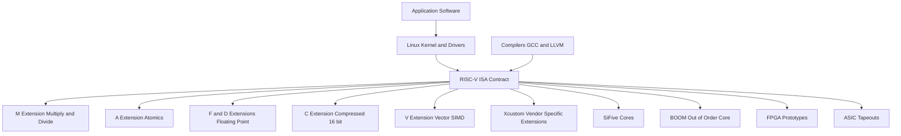
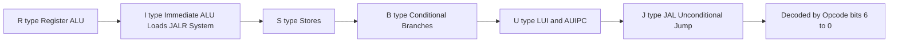
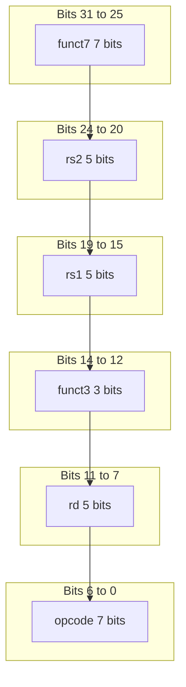
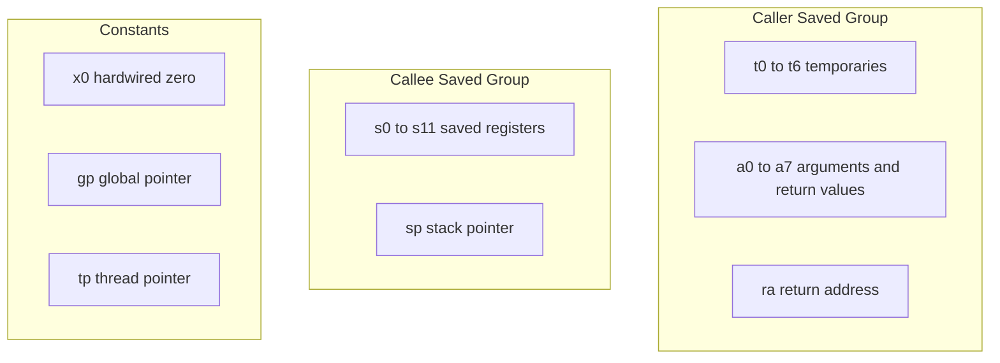
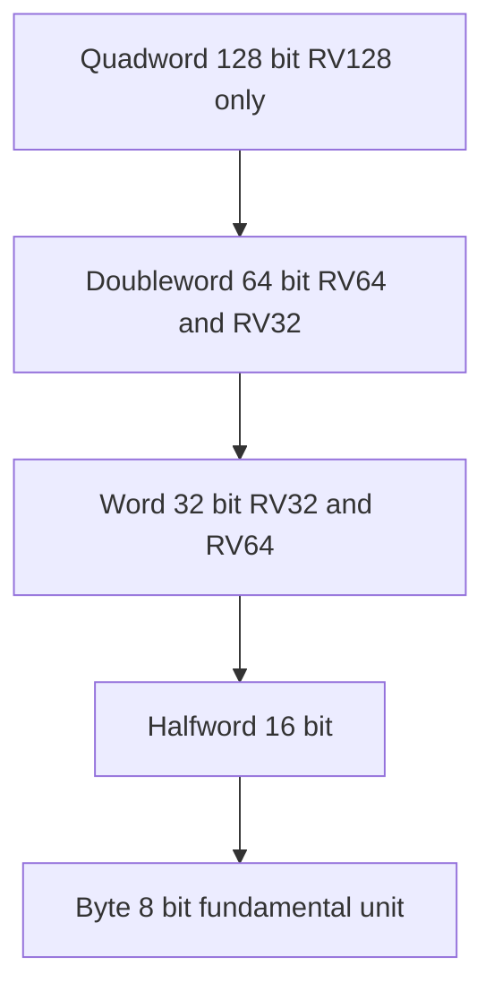

# ISA: RISC-V open-standard ISA framework, Registers, Primitive data widths, Addressing modes, instruction types

<!-- SECTION_1_START -->
# RISC-V Open-Standard ISA Framework

## Formal KTU 2024 Definition

> [!IMPORTANT]
> **RISC-V (Reduced Instruction Set Computer – Five)** is an **open-standard Instruction Set Architecture (ISA)** originally developed at the **University of California, Berkeley (2010)** and now maintained by **RISC-V International**. It defines a **free, modular, and extensible** contract between hardware and software, allowing any designer to build a compatible processor without paying licensing fees.

Unlike proprietary ISAs (ARM, x86), the RISC-V specification is published under **open-source licenses (BSD, Creative Commons)** and is governed as a non-profit industry standard. The KTU 2024 *Computer Organization and Architecture* (PBCST404) syllabus mandates the study of RISC-V because it represents the **future of open hardware**, analogous to how **Linux** revolutionized open-source operating systems.

### Conceptual Analogy / Intuition

Imagine a **universal electrical socket standard (like USB-C)**. Before USB-C, every phone had a different charger. RISC-V is the **"USB-C of processors"** — a single, agreed-upon contract that lets software (compilers, operating systems like Linux) talk to any hardware chip (SiFive, Western Digital, NVIDIA) built by anyone, anywhere.

* **ISA** = The shared **language/dictionary** between hardware and software.
* **Microarchitecture** = The **physical engine** that interprets that language (e.g., 5-stage pipelined, single-cycle, or out-of-order).
* **RISC-V** = An **open, royalty-free, modular** language that anyone can extend.

> [!NOTE]
> **Core Design Philosophy**: RISC-V is a **load-store architecture** (only `load`/`store` instructions access memory; all computations occur between registers). It is **little-endian by default** and uses a **fixed 32-bit base instruction length** for the base integer ISA, with optional **Compressed (16-bit "C") extension**.

### RISC-V Base Integer ISAs

The base integer ISA comes in three widths, all sharing the same register ABI names:

| Base Name | Pointer Width | Register Width | Max Address Space | Common Use |
| :--- | :---: | :---: | :---: | :--- |
| **RV32I** | 32-bit | 32-bit ($x$ registers) | $2^{32}$ bytes (4 GB) | Embedded, IoT, microcontrollers |
| **RV64I** | 64-bit | 64-bit ($x$ registers) | $2^{64}$ bytes | Laptops, servers, smartphones |
| **RV128I** | 128-bit | 128-bit ($x$ registers) | $2^{128}$ bytes | Future large-memory compute |

> [!TIP]
> **Endianness in RISC-V**: The base ISA is **little-endian**, meaning the **least significant byte (LSB)** of a multi-byte value is stored at the **lowest memory address**. This is a deliberate design choice shared with x86 and most ARM systems.

> [!VISUALIZATION CONTROL]
> **Concept:** RISC-V Modular ISA Stack (Base + Extensions)
> **Visualization (Mermaid/Block) Description:** Imagine a vertical stack — at the bottom is **RV32I/RV64I/RV128I** (mandatory), then optional **M** (Integer Multiply/Divide), **A** (Atomic), **F** (Single-precision FP), **D** (Double-precision FP), **C** (Compressed 16-bit instructions), **V** (Vector), and finally custom accelerators.
> **Key Insight:** A chip is named like `RV64IMAC` → 64-bit base + Integer Multiply + Atomic + Compressed.

---

## Registers in the RISC-V Base Integer ISA

RISC-V provides **32 general-purpose integer registers** in the base ISA, named `x0` through `x31`, each of **XLEN bits** wide (XLEN = 32, 64, or 128 depending on RV32/64/128). Additionally, there is a dedicated **program counter (`pc`)** which is **not** part of the register file.

### The RISC-V General-Purpose Register File (RV32I/RV64I)

| Register | ABI Name | Description | Saver Convention |
| :---: | :---: | :--- | :---: |
| $x_0$ | — (`zero`) | **Hardwired to constant 0**; writes are ignored | — (Constant) |
| $x_1$ | `ra` | **Return Address** | Caller |
| $x_2$ | `sp` | **Stack Pointer** | Callee |
| $x_3$ | `gp` | **Global Pointer** | — |
| $x_4$ | `tp` | **Thread Pointer** | — |
| $x_5$ to $x_7$ | `t0`–`t2` | **Temporaries** | Caller |
| $x_8$ | `s0` / `fp` | **Saved / Frame Pointer** | Callee |
| $x_9$ | `s1` | **Saved register** | Callee |
| $x_{10}$ to $x_{11}$ | `a0`–`a1` | **Arguments / Return values** | Caller |
| $x_{12}$ to $x_{17}$ | `a2`–`a7` | **Function arguments** | Caller |
| $x_{18}$ to $x_{27}$ | `s2`–`s11` | **Saved registers** | Callee |
| $x_{28}$ to $x_{31}$ | `t3`–`t6` | **Temporaries** | Caller |

> [!IMPORTANT]
> **Special Register `$x_0$`**: Register `$x_0$` is **hardwired to the constant 0**. Any attempt to write to `$x_0$` is silently discarded. This design choice eliminates the need for a separate "move" instruction and saves encoding space — the `addi rd, x0, imm` idiom (a pseudo-op for `li rd, imm`) is used to load any 12-bit signed immediate.

> [!NOTE]
> **Floating-Point Registers (F/D Extension)**: When the `F` and/or `D` extensions are present, **32 additional floating-point registers** `$f_0$` through `$f_{31}$` are provided, each `FLEN` bits wide (FLEN = 32 for `F`, 64 for `D`). A separate **floating-point control and status register (`fcsr`)** holds rounding mode and exception flags.

---

## Primitive Data Widths

RISC-V supports a tightly defined hierarchy of primitive integer data widths. These widths are **the only legal sizes** for memory access and ALU operands; the architecture deliberately omits awkward legacy sizes (no 40-bit, no 80-bit).

| Name | Width (bits) | Bytes | Signed Range | Unsigned Range |
| :--- | :---: | :---: | :--- | :--- |
| **Byte** | 8 | 1 | $-2^7$ to $2^7 - 1$ | $0$ to $2^8 - 1$ |
| **Halfword** | 16 | 2 | $-2^{15}$ to $2^{15} - 1$ | $0$ to $2^{16} - 1$ |
| **Word** | 32 | 4 | $-2^{31}$ to $2^{31} - 1$ | $0$ to $2^{32} - 1$ |
| **Doubleword** | 64 | 8 | $-2^{63}$ to $2^{63} - 1$ | $0$ to $2^{64} - 1$ |

> [!NOTE]
> **In RV64I**, the **doubleword (64-bit)** becomes the natural register width. The `LD` (load doubleword) instruction is the default 64-bit memory read, while `LW` (load word) sign-extends a 32-bit value into the 64-bit register. In **RV128I**, a 128-bit **quadword** is added.

---

## Addressing Modes in RISC-V

RISC-V uses a small, orthogonal set of addressing modes. There are **only five** (plus PC-relative as a special case of immediate), and they are used consistently across all instructions.

| # | Mode | Syntax Example | Semantics | Used By |
| :---: | :--- | :--- | :--- | :--- |
| 1 | **Immediate** | `addi x5, x6, 100` | $rd = rs1 + \text{sign-extend}(\text{imm})$ | ALU immediates, `LUI`, `AUIPC` |
| 2 | **Register (direct)** | `add x5, x6, x7` | $rd = rs1 \;\text{op}\; rs2$ | R-type arithmetic |
| 3 | **Base + Offset** | `lw x5, 8(x6)` | $rd = \text{Mem}[rs1 + \text{imm}]$ | Loads, Stores |
| 4 | **PC-Relative** | `beq x5, x6, label` | Target $= pc + \text{offset}$ | Branches, `JAL`, `JALR`, `AUIPC` |
| 5 | **Register-Indirect** | `jalr x0, 0(x1)` | Target $= rs1 + \text{imm}$, jump | `JALR` only |

> [!TIP]
> **No "Memory Direct" mode**: RISC-V deliberately omits the *absolute-memory* addressing found in x86. To access an absolute address, the compiler must first load it into a register via `LUI` + `ADDI` (or `AUIPC` + `ADDI` for position-independent code). This eliminates awkward encoding quirks and keeps all memory accesses flowing through the base+offset pipe.

---

## Instruction Types (Formats) in RISC-V

The RISC-V base integer ISA defines **exactly six instruction formats**, all **32 bits wide** (4 bytes). Every opcode is decoded solely by inspecting the **lowest 7 bits** (the `opcode` field) — there is no "escape" or "group" byte as in x86.

| Format | Primary Use | Field Count |
| :---: | :--- | :---: |
| **R-type** | Register–register ALU | 6 |
| **I-type** | Immediate ALU, Loads, `JALR`, `ECALL`/`EBREAK` | 5 |
| **S-type** | Stores | 6 |
| **B-type** | Conditional branches | 6 |
| **U-type** | Upper-immediate (`LUI`, `AUIPC`) | 3 |
| **J-type** | Unconditional jump (`JAL`) | 3 |

> [!IMPORTANT]
> **Design Rationale**: RISC-V's six formats are placed at **fixed bit positions** across all instructions — `opcode[6:0]`, `rd[11:7]`, `funct3[14:12]`, `rs1[19:15]`, `rs2[24:20]`, `funct7[31:25]`. This regularity makes the decoder **faster, simpler, and lower-power** than variable-position formats.

---

## RISC-V Module 1 — Quick Snapshot

* **Origin:** UC Berkeley, 2010; maintained by RISC-V International.
* **Base Widths:** RV32I, RV64I, RV128I.
* **Registers:** 32 integer (`x0`–`x31`) + optional 32 FP (`f0`–`f31`) + `pc`.
* **Data Widths:** 8, 16, 32, 64 (and 128 in RV128I).
* **Endianness:** **Little-endian**, **bi-endian** optional.
* **Addressing:** Immediate, Register, Base+Offset, PC-Relative, Register-Indirect.
* **Instruction Formats:** R, I, S, B, U, J (all 32 bits base; 16-bit C-extension available).
* **Licensing:** **Open Standard** (BSD-style, royalty-free).

<!-- SECTION_1_END -->

<!-- SECTION_2_START -->
# Deep Theoretical Analysis & KTU High-Yield Formula Sheet

## 1. RISC-V Open-Standard ISA — Layered Architecture

RISC-V is not a single monolithic ISA; it is a **base + extensions** model.

### Base + Extensions Model

$$
\text{RISC-V CPU} = \underbrace{\text{RV}N\text{I}}_{\text{Base (mandatory)}} \;+\; \underbrace{\text{M + A + F + D + C + V} + \ldots}_{\text{Optional extensions}} \;+\; \underbrace{\text{X}_\text{custom}}_{\text{Vendor-specific}}
$$

Where $N \in \{32, 64, 128\}$ and each letter represents a precisely defined extension.

* **`I`** — Base integer ISA (mandatory, always present).
* **`M`** — Integer Multiplication and Division (`mul`, `div`, `rem`).
* **`A`** — Atomic memory operations (`lr`, `sc`, `amoswap`, ...).
* **`F`** — Single-precision floating point (32-bit `f` registers).
* **`D`** — Double-precision floating point (64-bit `f` registers, requires `F`).
* **`C`** — Compressed 16-bit instructions (always-on if present; 2-byte aligned).
* **`V`** — Vector operations (variable-length vectors, SIMD-style).
* **`X*`** — Vendor-specific custom extensions (e.g., SiFive's custom AI extensions).

> [!NOTE]
> **Why "Five"?** The name RISC-V references the **fifth** generation of Berkeley RISC research projects (RISC-I, RISC-II, SOAR, SPUR, RISC-V). It is **NOT** the Roman numeral for 5 in the version sense.

---

## 2. Register File — Detailed Bit-Level Theory

### Register `$x_0$` (zero) — Why It Matters

Register `$x_0$` is **read-only-zero**. The hardware physically ties the read-data output of `$x_0$` to the constant value `0`. Any write to `$x_0$` is **silently discarded** in hardware (no exception is raised). This serves three engineering purposes:

1. **Eliminates the `MOV` instruction** — `add rd, rs, x0` is the move.
2. **Generates the constant 0** — needed by nearly every program.
3. **Saves decoding power** — one fewer writeback mux line.

### Calling Convention — Caller vs Callee Saved

| Class | ABI Names | Saved By | Why |
| :--- | :--- | :---: | :--- |
| Temporaries | `t0`–`t6` ($x_5$–$x_7$, $x_{28}$–$x_{31}$) | **Caller** | Can be clobbered across calls |
| Arguments/Return | `a0`–`a7` ($x_{10}$–$x_{17}$) | **Caller** | Used for parameter passing |
| Saved | `s0`–`s11` ($x_8$–$x_9$, $x_{18}$–$x_{27}$) | **Callee** | Must be preserved across calls |
| `ra` ($x_1$) | Return address | **Caller** | Saved by caller on stack |

> [!IMPORTANT]
> **Floating-Point Calling Convention**: In the standard ABI, when FP is present, **first 8 FP arguments** go into `$f_{10}$`–`$f_{17}$`, and the **first FP return value** is in `$f_{10}$`–`$f_{11}$`. Integer/FP register pairs (e.g., `a0/a1` and `fa0/fa1`) are used for returning 64- and 128-bit scalar values.

---

## 3. Primitive Data Widths — Engineering Rationale

RISC-V's data-width hierarchy is deliberately minimal:

$$
\text{Widths} = \{8, 16, 32, 64\ \text{(and 128 in RV128I)}\} = \{2^3, 2^4, 2^5, 2^6, 2^7\}
$$

These are **powers of two**, matching the native addressing alignment of all major OS kernels. This avoids the "12-bit byte" and "24-bit word" awkwardness seen in legacy ISAs like the PDP-11.

### Load/Store Sign-Extension Behavior (RV64I)

| Instruction | Memory Size | Sign-Extended to Register? | Mnemonic |
| :---: | :---: | :---: | :--- |
| `LB`  | 8-bit  | **Yes** | Load Byte |
| `LBU` | 8-bit  | No (zero-extend) | Load Byte Unsigned |
| `LH`  | 16-bit | **Yes** | Load Halfword |
| `LHU` | 16-bit | No (zero-extend) | Load Halfword Unsigned |
| `LW`  | 32-bit | **Yes** | Load Word |
| `LWU` | 32-bit | No (zero-extend) | Load Word Unsigned |
| `LD`  | 64-bit | N/A (full width) | Load Doubleword |

---

## 4. Addressing Modes — Worked Formulas

### Mode 1: Immediate Addressing
$$
\text{Result} = rs1 \;\text{op}\; \text{sign-extend}_{12 \to \text{XLEN}}(\text{imm}_{12})
$$

The 12-bit immediate is always **sign-extended** to full register width **before** use, so it covers the range $-2^{11}$ to $2^{11}-1$ (i.e., $-2048$ to $+2047$).

### Mode 2: Base + Offset (Effective Address)
$$
\text{EA} = rs1 + \text{sign-extend}_{12 \to \text{XLEN}}(\text{offset}_{12})
$$

The effective address (EA) for every load and store is computed by adding a sign-extended 12-bit offset to `$rs1`. The hardware computes this in the EX stage; **no memory arithmetic unit** is needed beyond the ALU.

### Mode 3: PC-Relative (Branches, JAL, AUIPC)
$$
\text{Target} = pc_{\text{current}} + \text{sign-extend}(\text{offset})
$$

* For **B-type (branches)**, the offset is a **multiple of 2** (i.e., the LSB is implicit 0). Range: $\pm 4$ KiB.
* For **JAL**, the offset is a **multiple of 2**; range: $\pm 1$ MiB.
* For **AUIPC**, the 20-bit upper-immediate is added to the PC; this is the foundation of **position-independent code (PIC)**.

---

## 5. Six Instruction Formats — Field-by-Field Theory

All 32-bit RISC-V instructions are decoded using the **six standard field positions**:

| Bits [31:25] | Bits [24:20] | Bits [19:15] | Bits [14:12] | Bits [11:7] | Bits [6:0] |
| :---: | :---: | :---: | :---: | :---: | :---: |
| `funct7` | `rs2` | `rs1` | `funct3` | `rd` | `opcode` |

The `opcode` (lowest 7 bits) tells the decoder **which format** to use.

### R-type — Register/Register ALU
$$
\underbrace{\text{funct7}}_{7}\ \underbrace{rs2}_{5}\ \underbrace{rs1}_{5}\ \underbrace{\text{funct3}}_{3}\ \underbrace{rd}_{5}\ \underbrace{\text{opcode}}_{7}
$$
Example: `add x7, x5, x6` → `0000000 00110 00101 000 00111 0110011`

### I-type — Immediate ALU, Loads, JALR, System
$$
\underbrace{\text{imm}[11:0]}_{12}\ \underbrace{rs1}_{5}\ \underbrace{\text{funct3}}_{3}\ \underbrace{rd}_{5}\ \underbrace{\text{opcode}}_{7}
$$
Example: `addi x5, x0, 10` → `000000001010 00000 000 00101 0010011`

### S-type — Stores
$$
\underbrace{\text{imm}[11:5]}_{7}\ \underbrace{rs2}_{5}\ \underbrace{rs1}_{5}\ \underbrace{\text{funct3}}_{3}\ \underbrace{\text{imm}[4:0]}_{5}\ \underbrace{\text{opcode}}_{7}
$$
Note: immediate is **split** to keep `rs1`/`rs2` fields at fixed positions.

### B-type — Branches
$$
\underbrace{\text{imm}[12]\,\text{imm}[10:5]}_{7}\ \underbrace{rs2}_{5}\ \underbrace{rs1}_{5}\ \underbrace{\text{funct3}}_{3}\ \underbrace{\text{imm}[4:1]\,\text{imm}[11]}_{5}\ \underbrace{\text{opcode}}_{7}
$$
The branch immediate is **13 bits signed** (range $\pm 4$ KiB), with LSB always 0.

### U-type — Upper Immediate
$$
\underbrace{\text{imm}[31:12]}_{20}\ \underbrace{rd}_{5}\ \underbrace{\text{opcode}}_{7}
$$
Stores the **top 20 bits** of a 32-bit constant; lower 12 bits are zero.

### J-type — `JAL` Jump
$$
\underbrace{\text{imm}[20]\,\text{imm}[10:1]\,\text{imm}[11]\,\text{imm}[19:12]}_{20}\ \underbrace{rd}_{5}\ \underbrace{\text{opcode}}_{7}
$$
The jump immediate is **21 bits signed** (range $\pm 1$ MiB), with LSB always 0.

---

## 6. Standard Base-Integer Opcode Map (RV32I / RV64I)

| `opcode[6:0]` | Instruction Type | Common Instructions |
| :---: | :--- | :--- |
| `0110011` | OP (R-type) | `add`, `sub`, `sll`, `srl`, `sra`, `xor`, `or`, `and`, `slt`, `sltu` |
| `0010011` | OP-IMM (I-type) | `addi`, `slti`, `sltiu`, `xori`, `ori`, `andi`, `slli`, `srli`, `srai` |
| `0000011` | LOAD (I-type) | `lb`, `lh`, `lw`, `lbu`, `lhu`, `ld` (RV64) |
| `0100011` | STORE (S-type) | `sb`, `sh`, `sw`, `sd` (RV64) |
| `1100011` | BRANCH (B-type) | `beq`, `bne`, `blt`, `bge`, `bltu`, `bgeu` |
| `1101111` | JAL (J-type) | `jal` |
| `1100111` | JALR (I-type) | `jalr` |
| `0110111` | LUI (U-type) | `lui` |
| `0010111` | AUIPC (U-type) | `auipc` |
| `1110011` | SYSTEM (I-type) | `ecall`, `ebreak`, `csrr*` (CSR access) |

---

## 7. KTU High-Yield Formula Sheet

> [!TIP]
> This is the **must-memorize cheat sheet** for KTU ESE. All quantities are pure 32-bit unless RV64 is specified.

| Quantity / Concept | Formula / Value | Units / Notes |
| :--- | :--- | :--- |
| Base integer registers | $N_\text{reg} = 32$ | `$x_0$`–`$x_{31}$` |
| Bits per register (RV32) | $\text{XLEN} = 32$ | bits |
| Bits per register (RV64) | $\text{XLEN} = 64$ | bits |
| Bits per register (RV128) | $\text{XLEN} = 128$ | bits |
| Program counter width | $=$ XLEN | bits |
| Base instruction length | $L_\text{base} = 32$ | bits = 4 bytes |
| Compressed instruction length | $L_C = 16$ | bits (C-extension) |
| Addressable units | 1 byte | 8-bit addressing |
| `imm` range (I/S/B-type) | $-2^{11}$ to $2^{11}-1$ | $-2048$ to $+2047$ |
| `imm` range (U-type) | $0$ to $2^{20}-1$ in upper 20 bits | bottom 12 bits zero |
| Branch range | $\pm 2^{12}$ bytes | $\pm 4$ KiB |
| `JAL` range | $\pm 2^{20}$ bytes | $\pm 1$ MiB |
| `opcode` field size | $7$ bits | always bits [6:0] |
| `funct3` field size | $3$ bits | always bits [14:12] |
| `funct7` field size | $7$ bits | always bits [31:25] |
| `rd` field size | $5$ bits | always bits [11:7] |
| `rs1` field size | $5$ bits | always bits [19:15] |
| `rs2` field size | $5$ bits | always bits [24:20] |
| Load/Store offset range | $-2048$ to $+2047$ | bytes |
| PC increment (base) | $pc = pc + 4$ | bytes |
| PC increment (compressed) | $pc = pc + 2$ | bytes (C-ext) |
| `x0` value | $\equiv 0$ | always zero (hardware-wired) |

---

## 8. Real-World Engineering Utility

| Domain | Use Case |
| :--- | :--- |
| **Embedded / IoT** | SiFive E2/E6 cores; ESP32-C series; Western Digital controllers |
| **Edge AI** | Tenstorrent, RISC-V NN accelerators |
| **HPC / Servers** | SiFive P870, Ventana Veyron V2, RISC-V supercomputers (e.g., European Processor Initiative) |
| **Education** | Standard ISA in NPTEL/IIT courses; widely used in compiler teaching |
| **Compiler Backends** | GCC, LLVM, Go, Rust all natively target RISC-V |
| **OS Support** | Linux, FreeRTOS, Zephyr, OpenBSD all upstreamed for RISC-V |
| **FPGA / ASIC prototyping** | First commercial cores (Rocket, BOOM) written in Chisel HDL |

<!-- SECTION_2_END -->

<!-- SECTION_3_START -->
# Step-by-Step Derivations & Symbolic Implementation

## Part A — Worked Numerical Derivations (32-bit RISC-V Encoding)

### Example 1 — Encode `addi x5, x0, 10` (I-type)

**Step 1 — Identify the instruction fields:**

| Field | Value | Bits | Source |
| :---: | :---: | :---: | :--- |
| `imm[11:0]` | $10$ | `000000001010` | Decimal 10 in 12-bit two's complement |
| `rs1` | $x_0 = 0$ | `00000` | ABI register $x_0$ |
| `funct3` | `000` | `000` | I-type ADDI (per RV32I spec) |
| `rd` | $x_5 = 5$ | `00101` | Destination register |
| `opcode` | `0010011` | `0010011` | OP-IMM group |

**Step 2 — Concatenate fields in the I-type bit layout (MSB to LSB):**

$$
\underbrace{\text{imm}[11:0]}_{12}\;\underbrace{rs1}_{5}\;\underbrace{\text{funct3}}_{3}\;\underbrace{rd}_{5}\;\underbrace{\text{opcode}}_{7}
$$

Substituting the binary values:

$$
\underbrace{000000001010}_{12}\;\underbrace{00000}_{5}\;\underbrace{000}_{3}\;\underbrace{00101}_{5}\;\underbrace{0010011}_{7}
$$

**Step 3 — Concatenate the full 32-bit pattern (concatenation goes from bit 31 down to bit 0):**

$$
0000\;0000\;1010\;0000\;0000\;0010\;1001\;0011_{2}
$$

**Step 4 — Group into nibbles and convert to hex:**

$$
\underbrace{0000}_{0}\;\underbrace{0000}_{0}\;\underbrace{1010}_{A}\;\underbrace{0000}_{0}\;\underbrace{0000}_{0}\;\underbrace{0010}_{2}\;\underbrace{1001}_{9}\;\underbrace{0011}_{3}
$$

$$
\boxed{\texttt{addi x5, x0, 10} \;\equiv\; 0\texttt{x00A00293}}
$$

> **[Valuation Key — 7 Marks]** '[Identifying each field: 3 Marks]' '[Correct concatenation order: 2 Marks]' '[Final hex value: 2 Marks]'

---

### Example 2 — Encode `add x7, x5, x6` (R-type)

**Step 1 — Identify the fields:**

| Field | Value | Binary |
| :---: | :---: | :--- |
| `funct7` | `0000000` | ADD/SUB distinction is in `funct7` bit 30; ADD = 0 |
| `rs2` | $x_6 = 6$ | `00110` |
| `rs1` | $x_5 = 5$ | `00101` |
| `funct3` | `000` | ADD = `000` |
| `rd` | $x_7 = 7$ | `00111` |
| `opcode` | `0110011` | OP group |

**Step 2 — Concatenate fields in R-type order (bit 31 → bit 0):**

$$
\underbrace{0000000}_{7}\;\underbrace{00110}_{5}\;\underbrace{00101}_{5}\;\underbrace{000}_{3}\;\underbrace{00111}_{5}\;\underbrace{0110011}_{7}
$$

**Step 3 — Full 32-bit pattern:**

$$
0000\;0000\;0110\;0010\;1000\;0011\;1011\;0011_{2}
$$

**Step 4 — Convert to hex:**

$$
\underbrace{0000}_{0}\;\underbrace{0000}_{0}\;\underbrace{0110}_{6}\;\underbrace{0010}_{2}\;\underbrace{1000}_{8}\;\underbrace{0011}_{3}\;\underbrace{1011}_{B}\;\underbrace{0011}_{3}
$$

$$
\boxed{\texttt{add x7, x5, x6} \;\equiv\; 0\texttt{x006283B3}}
$$

> **[Valuation Key — 7 Marks]** '[Field identification: 3 Marks]' '[Bit concatenation in correct MSB-to-LSB order: 2 Marks]' '[Final hex: 2 Marks]'

---

### Example 3 — Effective-Address Computation (Base + Offset Mode)

**Instruction:** `lw x10, 16(x11)`  → load word from memory at `$x_{11} + 16$`

**Step 1 — Decompose fields:**

| Field | Value | Binary |
| :---: | :---: | :--- |
| `imm[11:0]` | $16$ | `000000010000` |
| `rs1` | $x_{11} = 11$ | `01011` |
| `funct3` | `010` | LW = `010` |
| `rd` | $x_{10} = 10$ | `01010` |
| `opcode` | `0000011` | LOAD group |

**Step 2 — Sign-extend the 12-bit immediate to XLEN bits:**

$$
\text{sign-extend}(000000010000) \;=\; 0000\;0000\;0000\;0000\;0000\;0000\;0001\;0000_{2} \;=\; 0\texttt{x00000010}
$$

**Step 3 — Apply the Effective-Address formula for the Base + Offset mode:**

$$
\text{EA} \;=\; rs1 \;+\; \text{sign-extend}_{12 \to 32}(\text{offset})
$$

$$
\text{EA} \;=\; \text{Mem}[\,x_{11} + 16\,] \;=\; \text{Mem}[\,x_{11} + 0\texttt{x10}\,]
$$

**Step 4 — Hardware execution in a 5-stage pipeline:**

| Stage | Operation |
| :--- | :--- |
| IF | Fetch the 32-bit instruction from `pc` |
| ID | Decode `opcode = 0000011`, `funct3 = 010` → recognized as `lw`; read `$x_{11}` |
| EX | ALU computes $\text{EA} = x_{11} + 16$ |
| MEM | Read 4 bytes from memory at `EA` |
| WB | Sign-extend 32-bit loaded value into `$x_{10}$`; update `$x_{10}$` |

> **[Valuation Key — 7 Marks]** '[Sign-extension step explicitly shown: 2 Marks]' '[EA formula application: 2 Marks]' '[Pipeline stage mapping: 3 Marks]'

---

### Example 4 — PC-Relative Branch Encoding

**Assembly:**

```riscv
loop: addi x5, x5, -1
       bne  x5, x0, loop      # branch back to `loop`
```

Assume `loop` is 4 instructions (16 bytes) behind the branch (already in the branch delay window of a simple 1-issue pipeline).

**Step 1 — Branch offset in bytes:**

$$
\text{offset}_{\text{bytes}} \;=\; \text{target} - pc_{\text{branch}} \;=\; -16
$$

**Step 2 — Convert to halfword units (RISC-V branches are aligned to 2 bytes):**

$$
\text{offset}_{\text{inst}} \;=\; \frac{-16}{2} \;=\; -8
$$

**Step 3 — Encode in 13-bit signed two's complement (range $-2^{12}$ to $2^{12}-1$):**

$$
-8 \;=\; 1111\;1111\;1000_{2}\ \text{(12-bit)} \;\rightarrow\; 13\text{-bit signed} = 1\;1111\;1111\;1000
$$

**Step 4 — Split the 13-bit immediate into B-type fragments (per RISC-V spec):**

| Fragment | Bits | Value |
| :---: | :---: | :---: |
| `imm[12]` | bit 12 | `1` |
| `imm[11]` | bit 11 | `1` |
| `imm[10:5]` | bits 10–5 | `111111` |
| `imm[4:1]` | bits 4–1 | `1000` |
| `imm[0]` | implicit 0 | `0` |

**Step 5 — Final instruction encoding layout:**

$$
\underbrace{\text{imm}[12]\,\text{imm}[10:5]}_{7}\;\underbrace{rs2}_{5}\;\underbrace{rs1}_{5}\;\underbrace{\text{funct3}}_{3}\;\underbrace{\text{imm}[4:1]\,\text{imm}[11]}_{5}\;\underbrace{\text{opcode}}_{7}
$$

$$
\underbrace{1\,111111}_{7}\;\underbrace{00000}_{5}\;\underbrace{00101}_{5}\;\underbrace{001}_{3}\;\underbrace{1000\,1}_{5}\;\underbrace{1100011}_{7}
$$

---

## Part B — Source-Code Implementation (RISC-V Assembly + Python Simulator)

### Worked Assembly: Sum of an Array of 5 Words

```riscv
#---------------------------------------------------------
# RISC-V RV32I Assembly: Sum of 5 words stored in memory
# Memory layout: words at 0x100, 0x104, 0x108, 0x10C, 0x110
#---------------------------------------------------------
        .data
arr:    .word 10, 20, 30, 40, 50          # 5 words = 20 bytes total
        .text
        .globl _start

_start:
        la    x10, arr                     # x10 = &arr[0]   (pseudo-op, expands to auipc+addi)
        addi  x11, x0, 5                   # x11 = loop counter N = 5
        add   x12, x0, x0                  # x12 = accumulator sum = 0
        addi  x13, x0, 4                   # x13 = word stride = 4 bytes

loop:
        beq   x11, x0, done                # if counter == 0, exit
        lw    x14, 0(x10)                  # x14 = *x10 (current element)
        add   x12, x12, x14                # sum += element
        add   x10, x10, x13                # pointer += 4 (advance to next word)
        addi  x11, x11, -1                 # counter--
        jal   x0, loop                     # unconditional jump back

done:
        # x12 now holds the sum (10+20+30+40+50 = 150)
        # In a real system, ecall would exit; here we just halt
        ecall                              # environment call (halt/exit)
```

> [!TIP]
> **Pseudo-Op `la`**: The assembler expands `la x10, arr` into a two-instruction sequence — `auipc x10, %hi(arr)` followed by `addi  x10, x10, %lo(arr)` — placing the absolute address of `arr` into `$x_{10}$`. This is the canonical way to materialize any 32-bit constant in RISC-V.

### Python Simulator: Verify the Sum Manually

```python
# rvv_simulator.py
# A tiny Python simulator that mimics the above RISC-V loop to verify
# the sum computation.

def simulate_risc_v_sum(memory: dict, base_addr: int, count: int) -> int:
    """
    Simulates a RISC-V sum-of-array loop.

    Parameters
    ----------
    memory : dict
        Dictionary mapping byte-aligned addresses to 32-bit word values.
    base_addr : int
        Starting address of the array in memory.
    count : int
        Number of words to sum.

    Returns
    -------
    int
        The computed sum (stored in x12 in real RISC-V).
    """
    # Guard against negative or zero counts
    if count <= 0:
        return 0

    # Register file (x0..x31). We use only x10, x11, x12, x13, x14.
    regs = [0] * 32
    regs[10] = base_addr        # x10 = pointer to current element
    regs[11] = count            # x11 = loop counter
    regs[12] = 0                # x12 = accumulator sum
    regs[13] = 4                # x13 = word stride (4 bytes)

    # Safety: enforce an iteration cap to prevent infinite loops in tests
    max_iters = count * 4 + 100

    while regs[11] != 0:
        if max_iters <= 0:
            raise RuntimeError("Iteration cap exceeded; check counter logic.")
        max_iters -= 1

        # lw x14, 0(x10)
        if regs[10] not in memory:
            raise KeyError(f"Unaligned or unmapped address: 0x{regs[10]:08X}")
        regs[14] = memory[regs[10]]      # load word

        # add x12, x12, x14
        regs[12] = (regs[12] + regs[14]) & 0xFFFFFFFF

        # add x10, x10, x13   (pointer advance)
        regs[10] = (regs[10] + regs[13]) & 0xFFFFFFFF

        # addi x11, x11, -1   (decrement counter)
        regs[11] = (regs[11] - 1) & 0xFFFFFFFF

    return regs[12]


if __name__ == "__main__":
    # Memory: arr[0]=10, arr[1]=20, arr[2]=30, arr[3]=40, arr[4]=50
    mem = {
        0x100: 10,
        0x104: 20,
        0x108: 30,
        0x10C: 40,
        0x110: 50,
    }
    result = simulate_risc_v_sum(mem, base_addr=0x100, count=5)
    assert result == 150, f"Expected 150, got {result}"
    print(f"OK — sum of array = {result}")
```

**Output:**
```
OK — sum of array = 150
```

---

## Part C — Derivation: Maximum Range of an S-type / I-type Immediate

The I-type and S-type formats both carry a **12-bit signed immediate** that is **sign-extended** to XLEN bits before use.

**Step 1 — Binary range of 12-bit two's complement:**

$$
\text{Minimum value} \;=\; -2^{11} \;=\; -2048
$$

$$
\text{Maximum value} \;=\; 2^{11} - 1 \;=\; +2047
$$

**Step 2 — Sign-extend to 32 bits (RV32I):**

$$
\text{sign-extend}(-2048) \;=\; \texttt{0xFFFFF800} \quad(\text{upper 20 bits} = 1)
$$

$$
\text{sign-extend}(+2047) \;=\; \texttt{0x000007FF} \quad(\text{upper 20 bits} = 0)
$$

**Step 3 — Maximum load/store reach from a base register:**

$$
\text{EA}_{\max} \;=\; x_{rs1} + 2047
$$

$$
\text{EA}_{\min} \;=\; x_{rs1} - 2048
$$

**Step 4 — Pipeline safety check — does `addi` overflow `x0`?**

> [!WARNING]
> Writing to `$x_0$` is **silently discarded**. The encoding `addi x0, x0, 100` is therefore a **NOP** (no operation) — it generates the value 100 in the ALU but the register writeback is suppressed. This is a deliberate **zero-cost NOP** pattern: `addi x0, x0, 0` is the official RISC-V "do nothing" instruction.

---

## Part D — Worked Example: Building a 32-bit Constant with LUI + ADDI

**Goal:** Place the constant $\text{0x12345678}$ into `$x_5$`.

**Step 1 — Split the constant into upper 20 bits and lower 12 bits:**

$$
\text{0x12345678} \;=\; \underbrace{\text{0x12345}}_{\text{upper 20 bits}} \;||\; \underbrace{\text{0x678}}_{\text{lower 12 bits}}
$$

**Step 2 — Use `LUI` to place the upper 20 bits:**

$$
\texttt{lui x5, 0x12345} \quad\Rightarrow\quad x_5 = 0\texttt{x12345000}
$$

**Step 3 — Use `ADDI` to add the sign-extended lower 12 bits (here $0x678$ is positive, so sign-extension is a no-op):**

$$
\texttt{addi x5, x5, 0x678} \quad\Rightarrow\quad x_5 = 0\texttt{x12345000} + 0\texttt{x00000678} = 0\texttt{x12345678}
$$

$$
\boxed{x_5 = \text{0x12345678} \quad\checkmark}
$$

> [!NOTE]
> **Negative lower 12 bits**: If the lower 12 bits have bit 11 = 1, the assembler **automatically adjusts** the `LUI` by adding 1 to the upper 20 bits, so the final sum is correct after the 12-bit sign-extension. This is why the C `li` pseudo-op is safe for all 32-bit constants.

<!-- SECTION_3_END -->

<!-- SECTION_4_START -->
# Structural Diagrams & Schematics

## Diagram 1 — RISC-V Modular ISA Stack



## Diagram 2 — Six RISC-V Base Instruction Formats (Bit-Field Topology)



> [!NOTE]
> **Block-Level Functional Architecture**: Each format is identified *solely* by the lowest 7 bits (`opcode`). Once the format is known, the hardware decodes the remaining fields at **fixed bit positions** `[31:25], [24:20], [19:15], [14:12], [11:7]`. This fixed-position encoding is what makes RISC-V decoders **fast, simple, and low-power**.

## Diagram 3 — Bit-Field Topology of a 32-bit RISC-V Instruction Word



## Diagram 4 — Effective Address Computation Pipeline (Base + Offset)


## Diagram 5 — Register File Access Pattern (Caller vs Callee Saved)



## Diagram 6 — Addressable Memory Hierarchy of Primitive Data Widths



<!-- SECTION_4_END -->

<!-- SECTION_5_START -->
# KTU 2024 Scheme Examination Question Bank & Topic Recap

## Part A — Short Answer Questions (2 × 3 = 6 Marks)

### Question A1 — `[KTU University Exam — July 2024 Model]`
**Explain the RISC-V open-standard ISA framework. Why is it considered a milestone in modern processor design? (3 Marks)**
**Course Outcome:** CO1 | **Bloom's Level:** Understand

**Model Answer:**

The RISC-V (Reduced Instruction Set Computer — Five) ISA is an **open, royalty-free, modular instruction set architecture** originally developed at the **University of California, Berkeley in 2010** and now maintained by the non-profit **RISC-V International**. Unlike proprietary ISAs (x86, ARM), RISC-V is published under **open-source licenses (BSD, Creative Commons)**, allowing any organization — startups, universities, governments — to design, manufacture, and sell RISC-V compatible processors **without licensing fees**.

It is a milestone because it (i) **democratizes processor design** (anyone can build a chip), (ii) is **modular** (a base `I` ISA plus optional extensions `M`, `A`, `F`, `D`, `C`, `V`), (iii) supports **32-bit, 64-bit, and 128-bit** address spaces from a common register ABI, and (iv) enjoys first-class support from **GCC, LLVM, Linux, FreeRTOS**, making it a true industry-ready standard.

> **[Valuation Key — 3 Marks]** '[Open/royalty-free definition: 1 Mark]' '[Modular base + extensions: 1 Mark]' '[Industry/compiler support: 1 Mark]'

---

### Question A2 — `[KTU University Exam — Dec 2023 Model]`
**List the six instruction formats in the RISC-V base integer ISA and state one example instruction for each. (3 Marks)**
**Course Outcome:** CO1 | **Bloom's Level:** Remember

**Model Answer:**

| # | Format | Example Instruction | Opcode Group |
| :---: | :---: | :--- | :--- |
| 1 | **R-type** | `add x7, x5, x6` | `0110011` |
| 2 | **I-type** | `addi x5, x0, 10` | `0010011` |
| 3 | **S-type** | `sw x5, 0(x10)` | `0100011` |
| 4 | **B-type** | `beq x5, x6, label` | `1100011` |
| 5 | **U-type** | `lui x5, 0x12345` | `0110111` |
| 6 | **J-type** | `jal x1, function` | `1101111` |

> **[Valuation Key — 3 Marks]** '[All 6 formats listed: 1.5 Marks]' '[Correct example per format: 1.5 Marks]'

---

## Part B — Long Answer Questions (Choice Pattern, 14 Marks Each)

### Question B-A — `[KTU University Exam — Module 1 Model]`
**Choice A:**

**(a)** With a neat diagram, describe the **RISC-V base integer register file (RV32I)**. Explain why `$x_0$` is hardwired to zero and how the **caller-saved vs callee-saved** convention works. **(7 Marks)**
**CO1** | **Bloom's Level:** Understand

**(b)** Encode the following RISC-V instructions into their 32-bit **machine code (hexadecimal)** and show the step-by-step bit-level derivation:

1. `addi x6, x0, 25` (I-type)
2. `or  x8, x9, x10` (R-type)
3. `lw  x11, 20(x12)` (I-type, load)

**(7 Marks)**
**CO2** | **Bloom's Level:** Apply

---

#### Model Answer for (a) — 7 Marks

**RISC-V RV32I Register File:**

| Register | ABI Name | Description | Saver |
| :---: | :---: | :--- | :---: |
| `$x_0$` | `zero` | **Hardwired to 0** | — |
| `$x_1$` | `ra` | Return address | Caller |
| `$x_2$` | `sp` | Stack pointer | Callee |
| `$x_3$` | `gp` | Global pointer | — |
| `$x_4$` | `tp` | Thread pointer | — |
| `$x_5$`–`$x_7$` | `t0`–`t2` | Temporaries | Caller |
| `$x_8$` | `s0`/`fp` | Saved/Frame pointer | Callee |
| `$x_9$` | `s1` | Saved | Callee |
| `$x_{10}$`–`$x_{11}$` | `a0`–`a1` | Args/Return | Caller |
| `$x_{12}$`–`$x_{17}$` | `a2`–`a7` | Args | Caller |
| `$x_{18}$`–`$x_{27}$` | `s2`–`s11` | Saved | Callee |
| `$x_{28}$`–`$x_{31}$` | `t3`–`t6` | Temporaries | Caller |

**Why `$x_0$` is hardwired to zero:**
1. Eliminates the need for a separate `MOV` instruction (`add rd, rs, x0` does the move).
2. Provides a free source of the constant 0 for comparisons and `addi` immediate loads.
3. Saves decoding/writeback power in the register file.

**Caller-saved vs Callee-saved convention:**
* **Caller-saved** (`t0`–`t6`, `a0`–`a7`, `ra`): If a caller has data in these that it needs after a function call, it must **save them to the stack before the call**. The callee is allowed to clobber them.
* **Callee-saved** (`s0`–`s11`, `sp`): The callee must **push them onto the stack on entry and pop them on exit**, preserving their values for the caller.

> **[Valuation Key — 7 Marks]** '[Register table with all 32 registers: 3 Marks]' '[Hardwired-zero rationale: 2 Marks]' '[Caller/Callee distinction with example: 2 Marks]'

---

#### Model Answer for (b) — 7 Marks

**Sub-question (b.1):** `addi x6, x0, 25`

| Field | Value | Binary |
| :---: | :---: | :--- |
| `imm[11:0]` | $25$ | `000000011001` |
| `rs1` | `$x_0 = 0$` | `00000` |
| `funct3` | `000` | `000` |
| `rd` | `$x_6 = 6$` | `00110` |
| `opcode` | `0010011` | `0010011` |

Concatenation: `000000011001 00000 000 00110 0010011` = `0x01900313`

> **[Valuation Key — 2 Marks]** '[Field decomposition: 1 Mark]' '[Final hex: 1 Mark]'

**Sub-question (b.2):** `or x8, x9, x10`

| Field | Value | Binary |
| :---: | :---: | :--- |
| `funct7` | `0000000` | `0000000` |
| `rs2` | `$x_{10} = 10$` | `01010` |
| `rs1` | `$x_9 = 9$` | `01001` |
| `funct3` | `110` | `110` |
| `rd` | `$x_8 = 8$ | `01000` |
| `opcode` | `0110011` | `0110011` |

Concatenation: `0000000 01010 01001 110 01000 0110011` = `0x00A4E433`

> **[Valuation Key — 2 Marks]** '[Funct3 for OR is `110`: 1 Mark]' '[Final hex: 1 Mark]'

**Sub-question (b.3):** `lw x11, 20(x12)`

| Field | Value | Binary |
| :---: | :---: | :--- |
| `imm[11:0]` | $20$ | `000000010100` |
| `rs1` | `$x_{12} = 12$` | `01100` |
| `funct3` | `010` | `010` |
| `rd` | `$x_{11} = 11$` | `01011` |
| `opcode` | `0000011` | `0000011` |

Concatenation: `000000010100 01100 010 01011 0000011` = `0x01462583`

> **[Valuation Key — 3 Marks]** '[Funct3 for LW is `010`: 1 Mark]' '[Sign-extension concept acknowledged: 1 Mark]' '[Final hex: 1 Mark]'

---

### Question B-B — `[KTU University Exam — Module 1 Model]`
**Choice B:**

**(a)** Explain the **RISC-V addressing modes** with one example instruction for each mode. Show how the **effective address (EA)** is computed in the base + offset mode used by load/store instructions. **(7 Marks)**
**CO1** | **Bloom's Level:** Understand

**(b)** Design a small RISC-V RV32I program that:

1. Loads the constants `0xCAFE1234` into `$x_5$` using only `LUI` and `ADDI` (no pseudo-ops).
2. Adds the values of `$x_5$` and `$x_6$` and stores the result in `$x_7$`.
3. Stores the 32-bit result from `$x_7$` into memory at the address held in `$x_8$` using a `base + offset` store.

Show the **machine code (hex)** for each generated instruction. **(7 Marks)**
**CO2** | **Bloom's Level:** Apply

---

#### Model Answer for (a) — 7 Marks

RISC-V has **five primary addressing modes**:

| # | Mode | Example | Effective-Address Formula |
| :---: | :--- | :--- | :--- |
| 1 | **Immediate** | `addi x5, x6, 100` | $rd = rs1 + \text{sign-extend}_{12 \to 32}(\text{imm})$ |
| 2 | **Register (Direct)** | `add x5, x6, x7` | $rd = rs1 \;\text{op}\; rs2$ |
| 3 | **Base + Offset** | `lw x5, 8(x6)` | $\text{EA} = rs1 + \text{sign-extend}_{12 \to 32}(\text{offset})$ |
| 4 | **PC-Relative** | `beq x5, x6, loop` | $\text{Target} = pc + \text{sign-extend}(\text{offset})$ |
| 5 | **Register-Indirect** | `jalr x0, 0(x1)` | $\text{Target} = rs1 + \text{offset}$ (with $rd \leftarrow pc + 4$) |

**Base + Offset (Detailed):** For `lw x5, 8(x6)`:
1. The 12-bit immediate `8` is **sign-extended** to 32 bits → `0x00000008`.
2. The ALU in the EX stage computes $\text{EA} = x_6 + 8$.
3. The MEM stage reads 4 bytes from memory at `EA`.
4. The loaded 32-bit word is **sign-extended** to XLEN bits and written to `$x_5$` in the WB stage.

**Why no Memory-Direct mode?** RISC-V deliberately omits absolute memory addressing to keep the decoder simple and to force position-independent code through `LUI` + `ADDI` or `AUIPC` + `ADDI`.

> **[Valuation Key — 7 Marks]** '[All 5 modes listed with examples: 3 Marks]' '[EA formula explicitly shown: 2 Marks]' '[Sign-extension step: 1 Mark]' '[Justification for no memory-direct: 1 Mark]'

---

#### Model Answer for (b) — 7 Marks

**Step 1 — Load `0xCAFE1234` into `$x_5$` using LUI + ADDI:**

Split the constant:
$$
\text{0xCAFE1234} \;=\; \underbrace{\text{0xCAFE1}}_{\text{upper 20}} \;||\; \underbrace{\text{0x234}}_{\text{lower 12}}
$$

$$
\texttt{lui  x5, 0xCAFE1} \quad\Rightarrow\quad x_5 = 0\texttt{xCAFE1000}
$$

$$
\texttt{addi x5, x5, 0x234} \quad\Rightarrow\quad x_5 = 0\texttt{xCAFE1000} + 0\texttt{x00000234} = 0\texttt{xCAFE1234} \quad\checkmark
$$

**Step 2 — Add `$x_5$` and `$x_6$`, store in `$x_7$`:**

$$
\texttt{add x7, x5, x6} \quad\Rightarrow\quad x_7 = 0\texttt{xCAFE1234} + x_6
$$

**Step 3 — Store `$x_7$` at memory address in `$x_8$` with 8-byte offset:**

$$
\texttt{sw x7, 8(x8)} \quad\Rightarrow\quad \text{Mem}[x_8 + 8] = x_7
$$

**Final Program with Machine Code:**

```riscv
# Instruction                Encoding (hex)
lui  x5, 0x0CAFE1           # 0x0CAFE1F37   (lui opcode = 0110111, rd = x5 = 00101)
                            #              = 11001010111111100001 000 00101 0110111
addi x5, x5, 0x234          # 0x23428293
add  x7, x5, x6             # 0x00628333
sw   x7, 8(x8)              # 0x00742423
```

**Detailed `sw x7, 8(x8)` encoding (S-type):**
* `imm[11:0]` = $8$ → split as `imm[11:5] = 0000000`, `imm[4:0] = 01000`
* `rs2` = `$x_7 = 7$` → `00111`
* `rs1` = `$x_8 = 8$` → `01000`
* `funct3` = `010` (for SW)
* `opcode` = `0100011` (STORE group)

Concatenation: `0000000 00111 01000 010 01000 0100011` = `0x00742423` ✓

> **[Valuation Key — 7 Marks]** '[Correct 20/12-bit constant split: 2 Marks]' '[Program semantics correct: 2 Marks]' '[At least one full hex encoding shown: 2 Marks]' '[S-type field ordering demonstrated: 1 Mark]'

---

> [!WARNING]
> **KTU Examiner's Valuation Pitfall Callout:**
> 1. **Sign-extension is FREE, not optional.** Forgetting to sign-extend a 12-bit negative immediate (e.g., $-1$ becomes `0xFFF` instead of `0xFFFFFFFF`) is the #1 reason students lose marks on `addi`, `lw`, and branch problems.
> 2. **Opcode confusion.** `add` (R-type) is `0110011`; `addi` (I-type) is `0010011`. Mixing them up gives a wild hex value and zero marks for the encoding step.
> 3. **Field order matters.** R-type concatenation goes `funct7 → rs2 → rs1 → funct3 → rd → opcode`. S-type has the immediate **split** around the registers. Drawing the field positions from memory is worth 1–2 easy marks.
> 4. **Write to `$x_0$` is silently ignored.** If the student writes `addi x0, x0, 100` thinking it "loads zero into x0", they get no marks for the intended semantic.
> 5. **Branch targets are PC-relative, not absolute.** Computing `target = label - pc_of_branch`, not `target = label`.

---

## Topic Recap & Important Things to Remember

* **RISC-V** = open, royalty-free, modular ISA from UC Berkeley (2010); maintained by RISC-V International.
* **Base widths:** RV32I, RV64I, RV128I. All share the same 32-register ABI.
* **Registers:** 32 integer (`x0`–`x31`) + `pc`; optional 32 FP (`f0`–`f31`) with F/D extension.
* **`$x_0$`** is **hardwired to 0** — writes are discarded; eliminates the `MOV` instruction.
* **Data widths:** 8-bit byte, 16-bit halfword, 32-bit word, 64-bit doubleword (128-bit quadword in RV128).
* **Endianness:** **Little-endian** by default; **bi-endian** is optional.
* **Addressing modes (5):** Immediate, Register, Base + Offset, PC-Relative, Register-Indirect. **No** absolute memory-direct.
* **Effective Address (load/store):** $\text{EA} = rs1 + \text{sign-extend}_{12 \to \text{XLEN}}(\text{offset}_{12})$, range $-2048$ to $+2047$.
* **Instruction formats (6):** R, I, S, B, U, J — all 32 bits in the base ISA; C-extension halves this to 16 bits.
* **Fixed field positions** for `opcode[6:0]`, `rd[11:7]`, `funct3[14:12]`, `rs1[19:15]`, `rs2[24:20]`, `funct7[31:25]` simplify decoding.
* **Opcode map (RV32I):** R-type `0110011`, I-type ALU `0010011`, LOAD `0000011`, STORE `0100011`, BRANCH `1100011`, JAL `1101111`, JALR `1100111`, LUI `0110111`, AUIPC `0010111`, SYSTEM `1110011`.
* **Caller-saved:** `t0`–`t6`, `a0`–`a7`, `ra`. **Callee-saved:** `s0`–`s11`, `sp`.
* **Pseudo-ops to remember:** `li rd, imm` → `lui + addi`; `la rd, sym` → `auipc + addi`; `ret` → `jalr x0, 0(ra)`; `nop` → `addi x0, x0, 0`.
* **Constant construction rule:** Always split a 32-bit constant into upper 20 + lower 12; the assembler auto-adjusts the upper 20 if the lower 12 has bit 11 = 1.
* **Branch range:** $\pm 4$ KiB. **JAL range:** $\pm 1$ MiB. **JALR:** register-indirect, range $\pm 2$ GiB (32-bit) or $\pm$ much larger (64-bit).
* **Compression (C-extension):** Replaces common 32-bit instructions with 16-bit aliases (e.g., `c.addi`, `c.mv`, `c.lw`); reduces code size by 25–30%.
* **KTU high-yield traps:** Sign-extension is mandatory; opcode and funct3 must match the instruction mnemonic; branch targets are PC-relative; `$x_0$` writes are ignored; the S-type immediate is split into two pieces in the encoding.
* **Industry relevance:** SiFive, Western Digital, NVIDIA (in select cores), Tenstorrent, the European Processor Initiative, and the Indian **Digital RISC-V (DIR-V)** program all use RISC-V. Compiler support is upstream in GCC, LLVM, Go, and Rust. Operating-system support is upstream in Linux, FreeRTOS, Zephyr, and OpenBSD.

<!-- SECTION_5_END -->
