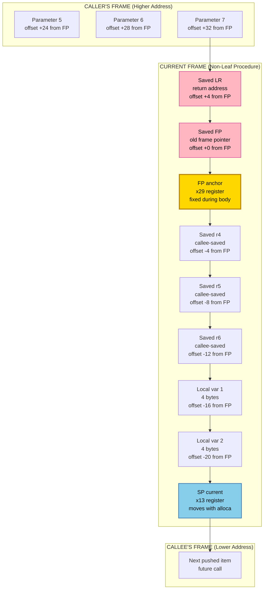
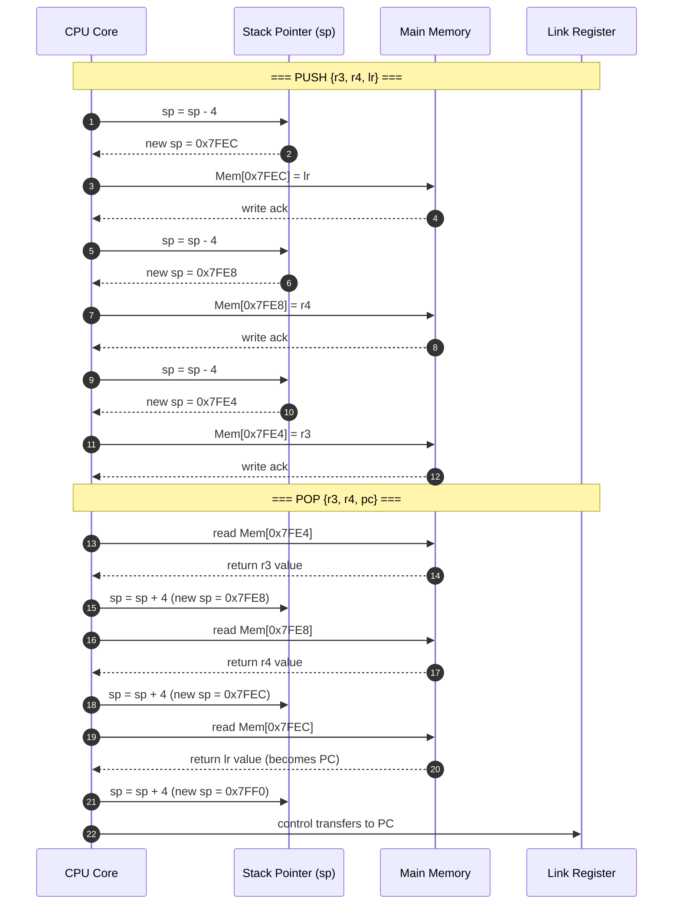
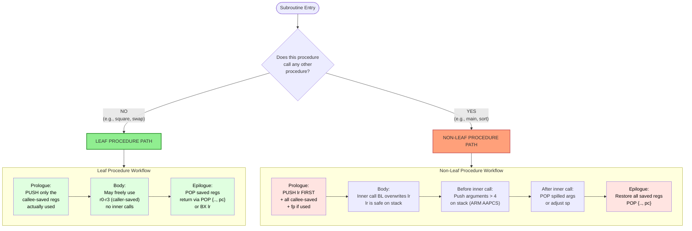
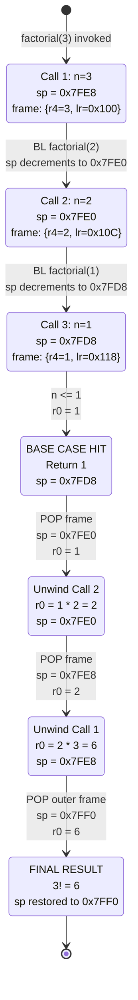

# Stack Management: Stack pointer (sp) operations, Stack frames, Leaf vs Non-leaf subroutine calls, recursive procedures

<!-- SECTION_1_START -->

# Stack Management: The Backbone of Subroutine Execution

## 1.1 Formal Definition (KTU 2024 Syllabus Terminology)

In the **KTU 2024 Scheme** architecture syllabus, a **stack** is defined as a *Last-In-First-Out (LIFO)* data structure maintained in main memory that supports dynamic memory allocation for **subroutine linkage**, **parameter passing**, and **storage of local variables**. The **Stack Pointer (sp)** is a dedicated CPU register that always holds the memory address of the *top-of-stack* (TOS) element, and it is updated automatically by every `PUSH`, `POP`, `CALL`, and `RETURN` operation.

> [!IMPORTANT]
> **KTU 2024 Definition Box**
> The **stack pointer ($sp$)** is a processor register that points to the most recently pushed item on the runtime stack. In virtually all modern ISAs (ARM, x86, MIPS, RISC-V), the stack is *Full Descending* — it grows toward **lower** memory addresses, meaning a `PUSH` *decrements* $sp$ *before* writing, and a `POP` *reads* first and *increments* $sp$ afterward.

> [!NOTE]
> **Endianness Connection (Module 1 Linkage)**
> When a multi-byte word (say, a 32-bit return address `$0x12345678$`) is pushed onto the stack, the **byte ordering** inside that word depends on the host's endianness:
> * **Little-Endian (LE):** LSB `$0x78$` at the *lowest* address (which is the new top of stack after $sp$ decrements).
> * **Big-Endian (BE):** MSB `$0x12$` at the lowest address.
> The *direction* of stack growth does **not** change with endianness — only the internal byte layout of each word on the stack does.

## 1.2 Intuitive Overview: The Plate-Rack Analogy 🍽️

Imagine a spring-loaded **cafeteria plate dispenser**:

* You can only add or remove the **topmost plate** (LIFO discipline).
* A red arrow (the **plate counter**) always points to the topmost plate (this is your **stack pointer**, $sp$).
* When a *new subroutine* is called, it is like a guest arriving — you push a **tray** (a *stack frame*) onto the rack to hold that guest's belongings (parameters, return address, local plates).
* When the subroutine finishes, the tray is popped — the counter springs back up to the previous guest's tray.

This mechanical intuition explains:
* Why the stack grows **downward** in memory (it "sinks" toward lower addresses to make room for new frames on top).
* Why `PUSH` *decrements* $sp$ (the counter moves down) and `POP` *increments* it (the counter springs back up).
* Why **recursive** calls (a guest ordering multiple trays) can crash the system — eventually, the rack runs out of physical space (**stack overflow**).

## 1.3 Physical Constants & Standard Metrics

| Metric | Value / Convention | Notes |
|---|---|---|
| Stack alignment | **8 bytes (ARM AAPCS)** / **16 bytes (x86-64 SysV ABI)** | Required for atomic loads/stores |
| Initial $sp$ value | Top of available RAM (e.g., `$0x7FFFFFFC$` on 32-bit ARM) | Set by boot loader / OS |
| Minimum frame size | **4 bytes** (single return address) | For leaf procedures |
| Typical frame size | **16–64 bytes** | Includes saved registers + locals |
| Stack overflow threshold | Usually **$sp < 0x1000$` on bare-metal | Watchdog / MPU triggers fault |

> [!VISUALIZATION CONTROL]
> **Concept:** Stack growth direction in a 32-bit address space
> **GeoGebra / Desmos Input Equations:**
> * `f(x) = 0x00000000` (bottom of memory — RAM start)
> * `g(x) = 0xFFFFFFFF` (top of memory)
> * `h(x) = 0x7FFFFFF0` (initial $sp$ — high memory)
> * `p1 = (0x7FFFFFF0, 1)` (point representing initial $sp$)
> * `p2 = (0x7FFFFFE0, 1)` (point after one PUSH)
> * `p3 = (0x7FFFFFD0, 1)` (point after two PUSHes)
> **Visual Description:** The student should observe three points on a horizontal line, with the $sp$ marker moving **leftward** (toward address `$0$`) as items are pushed — confirming the *descending* stack convention.

<!-- SECTION_1_END -->

<!-- SECTION_2_START -->

# Deep Theoretical Analysis & KTU High-Yield Formula Sheet

## 2.1 Stack Pointer ($sp$) Operational Theory

The stack pointer participates in **four** fundamental operations, each implemented as a tightly coupled pair of micro-operations inside the CPU:

### 2.1.1 PUSH (Write to Stack)
A push performs two sub-steps in **strict sequence** (Full Descending ABI):

1. **Decrement first:** $sp \leftarrow sp - \text{word\_size}$ (e.g., `$sp = sp - 4$` for a 32-bit word)
2. **Store second:** $\text{Mem}[sp] \leftarrow \text{value}$

> [!IMPORTANT]
> **Why decrement *before* store?** This is the *"Full Descending"* convention: $sp$ always points to the **last valid occupied cell** (the "full" cell). Storing *after* decrement guarantees the new value is written to the *new* $sp$ location, leaving no stale data behind.

### 2.1.2 POP (Read from Stack)
A pop reverses the push order:

1. **Load first:** $\text{value} \leftarrow \text{Mem}[sp]$
2. **Increment second:** $sp \leftarrow sp + \text{word\_size}$

### 2.1.3 CALL (Branch-and-Link)
A subroutine call is essentially a *push* of the return address combined with a *branch*:

1. $sp \leftarrow sp - 4$
2. $\text{Mem}[sp] \leftarrow PC_{next}$ (save return address — the *link*)
3. $PC \leftarrow \text{target\_address}$ (transfer control)

### 2.1.4 RETURN (Branch-to-Link)
The inverse of CALL:

1. $PC \leftarrow \text{Mem}[sp]$ (restore return address)
2. $sp \leftarrow sp + 4$

> [!NOTE]
> **KTU Board Pattern:** Examiners frequently test whether students remember the **order** of these operations. Writing "$sp$ decremented *after* the store" is a guaranteed 1-mark deduction.

## 2.2 Stack Frame Architecture (Activation Record)

A **stack frame** (also called an *activation record*) is the structured region of stack memory allocated for **one** invocation of a subroutine. The frame is bracketed by a **high-address boundary** (the old $sp$ before the call) and a **low-address boundary** (the new $sp$ after the prologue).

### 2.2.1 Generic ARM AAPCS Stack Frame Layout (Descending Growth)

```
High Address (old sp on entry)
  ┌──────────────────────────┐  ← Caller's frame begins
  │  Parameter 7, 8, ...     │  (if > 4 args, spilled by caller)
  ├──────────────────────────┤
  │  Parameter 5, 6          │  (ARM: 7th & 8th param on stack)
  ├──────────────────────────┤
  │  Parameter 4 (last reg)  │  (or above, in caller frame)
  ├──────────────────────────┤
  │  Return Address (LR_saved)│  ← Pushed by BL instruction
  ├──────────────────────────┤  ← Frame Pointer (fp) points HERE
  │  Saved Frame Pointer (FP)│  ← Pushed in prologue (if used)
  ├──────────────────────────┤
  │  Saved Registers (v1-v6) │
  ├──────────────────────────┤
  │  Local Variables         │
  ├──────────────────────────┤
  │  Spilled Arguments       │
  ├──────────────────────────┤  ← Current sp (Low Address)
Low Address
```

### 2.2.2 The Two-Pointer Convention ($sp$ vs $fp$)

| Register | Role | Stability | Updated |
|---|---|---|---|
| **$sp$ (Stack Pointer)** | Points to current TOS | **Moves** during body (if alloca/vla used) | Every push/pop |
| **$fp$ / $x29$ (Frame Pointer)** | Anchored to the frame's top | **Fixed** during body | Only in prologue/epilogue |

> [!IMPORTANT]
> **Why use both?** The frame pointer gives *constant-time access* to parameters and saved registers via fixed offsets (e.g., `[fp, #8]` for the first parameter). Without $fp$, you would have to track $sp$ deltas manually — error-prone in optimized code.

## 2.3 Leaf vs Non-Leaf Subroutine Calls

The classification hinges on a single question: **Does this procedure call *any* other procedure inside its body?**

### 2.3.1 Leaf Procedure
A leaf procedure is one that performs **no** further procedure calls within its body. Examples: a simple `square(x)` function, a string-length counter, an array swap routine.

* **Simpler prologue:** Only saves the **callee-saved registers** it actually uses + allocates locals.
* **Simpler epilogue:** Restores those registers + returns.
* **May freely overwrite caller-saved registers** (e.g., $r0$–$r3$ in ARM) without saving them — because the caller knows they are volatile.

### 2.3.2 Non-Leaf Procedure
A non-leaf procedure *does* call other procedures. Examples: a sorting routine that calls a `compare()`, `main()` calling `printf()`.

* **Mandatory register preservation:** Any register holding a value that must survive the inner call (e.g., loop counter, accumulated sum) **must** be saved on the stack *before* the inner call and restored *after*.
* **Argument passing to inner calls:** If the procedure has > 4 arguments in ARM AAPCS, arguments 5+ must be placed on the stack *before* the call, and the caller must clean them up.
* **The link register ($lr$) hazard:** In ARM, `BL` overwrites $lr$. A non-leaf must push $lr$ in the prologue and use it in the epilogue, or it will return to the wrong place.

## 2.4 Recursive Procedures

A **recursive procedure** is a procedure whose execution involves **one or more self-calls**, each operating on a strictly smaller or simpler sub-problem until a **base case** is reached.

### 2.4.1 The Three Mandatory Components of Recursion

1. **Base Case(s):** The terminating condition(s) that return without further recursion.
2. **Recursive Case(s):** The reduction step that calls the procedure on a smaller input.
3. **Progress Toward Termination:** A guarantee that each recursive call moves strictly closer to a base case (often proven via induction in algorithm analysis).

### 2.4.2 Stack Behavior During Recursion

Each recursive call allocates an **independent stack frame**. Local variables in different invocations occupy *different* memory locations — this is what allows the procedure to maintain **separate state** for each nested call. The **call tree** mirrors a **stack of frames**: depth of recursion = height of the call tree = number of live frames on the stack.

> [!WARNING]
> **Stack Overflow Risk:** A missing or unreachable base case causes *infinite recursion*. Each call consumes stack space (typically **16–64 bytes** per frame). When $sp$ crosses the lower memory bound, a **segmentation fault / stack overflow** occurs. Always verify base-case correctness!

## 2.5 KTU Formula Sheet / Cheat Sheet

| # | Concept | Formula / Operation | Address Direction | Unit / Size |
|---|---|---|---|---|
| 1 | PUSH (Full Descending) | $sp \leftarrow sp - N$  <br> then  $\text{Mem}[sp] \leftarrow \text{value}$ | $sp$ **decrements** | $N$ = word size = **4 bytes** (32-bit) or **8 bytes** (64-bit) |
| 2 | POP (Full Descending) | $\text{value} \leftarrow \text{Mem}[sp]$  <br> then  $sp \leftarrow sp + N$ | $sp$ **increments** | Same as above |
| 3 | CALL (Branch-Link) | $sp \leftarrow sp - 4$  <br> $\text{Mem}[sp] \leftarrow PC + 4$  <br> $PC \leftarrow \text{target}$ | $sp$ decrements | Return address = **4 bytes** |
| 4 | RETURN | $PC \leftarrow \text{Mem}[sp]$  <br> $sp \leftarrow sp + 4$ | $sp$ increments | — |
| 5 | Frame size formula | $F = 4 (\text{FP}) + 4 (\text{LR}) + 4k (\text{saved regs}) + 4m (\text{locals}) + 4n (\text{spilled args})$ | — | bytes |
| 6 | Max recursion depth | $D_{max} = \lfloor \dfrac{sp_{initial} - sp_{min}}{F} \rfloor$ | — | integer |
| 7 | Little-Endian byte order | Byte at address $a+i$ = bit-slice $[8i, 8i+7]$ of word | LSB at lowest $a$ | — |
| 8 | Big-Endian byte order | Byte at address $a+i$ = bit-slice $[31-8i, 31-8i+7]$ of word | MSB at lowest $a$ | — |
| 9 | ARM PUSH pseudo-op | `PUSH {r4-r11, lr}` $\equiv$ `STMFD sp!, {r4-r11, lr}` | — | — |
| 10 | ARM POP pseudo-op | `POP {r4-r11, pc}` $\equiv$ `LDMFD sp!, {r4-r11, pc}` | — | — |

## 2.6 Real-World Engineering Utility

* **Operating Systems:** Every context switch saves the current thread's stack pointer in the PCB and loads the next thread's $sp$. Without stack management, **multitasking** is impossible.
* **Compilers (GCC, LLVM, MSVC):** Generate prologue/epilogue code automatically. Optimizations like `-fomit-frame-pointer` (disabling $fp$ for leaf procedures) save one register at the cost of debuggability.
* **Embedded / RTOS Systems (FreeRTOS, Zephyr):** Each task has its own statically allocated stack; the `pxCurrentTCB` stores the saved $sp$. Stack overflow is detected via *stack canaries* or *MPU guard regions*.
* **Debuggers (GDB):** The "backtrace" (`bt`) command literally walks the chain of saved frame pointers on the stack to reconstruct the call history — this is why $fp$ preservation matters.
* **Web/Cloud:** Recursive serverless functions (e.g., AWS Lambda recursion) can cause runaway costs — analogous to stack overflow, but billed in dollars.

<!-- SECTION_2_END -->

<!-- SECTION_3_START -->

# Step-by-Step Derivations & ARM/MIPS Assembly Implementation

## 3.1 Worked Example 1: PUSH/POP Mechanics in 32-bit ARM

**Problem Setup:** Initial $sp = 0x00007FF0$. Execute the sequence: `PUSH {r3, r4, lr}` followed by `POP {r3, r4, pc}`. Assume $r3 = 0xAAAAAAAA$, $r4 = 0xBBBBBBBB$, $lr = 0x00001234$.

### 3.1.1 Phase A — PUSH Expansion

The pseudo-instruction `PUSH {r3, r4, lr}` is a synonym for `STMFD sp!, {r3, r4, lr}` (Store Multiple Full Descending with writeback).

**Step 1 (Decrement $sp$ for the first register):**
$$
sp_{new} = sp_{old} - 4 = \text{0x00007FF0} - \text{0x00000004} = \text{0x00007FEC}
$$

**Step 2 (Decrement again for the second register):**
$$
sp_{new} = sp_{old} - 4 = \text{0x00007FEC} - \text{0x00000004} = \text{0x00007FE8}
$$

**Step 3 (Decrement again for the third register):**
$$
sp_{new} = sp_{old} - 4 = \text{0x00007FE8} - \text{0x00000004} = \text{0x00007FE4}
$$

**Step 4 (Store each register at the corresponding $sp$ slot — register order is *lowest register to lowest address*):**
$$
\begin{aligned}
\text{Mem[0x00007FE4]} &\leftarrow r3 = \text{0xAAAAAAAA} \\
\text{Mem[0x00007FE8]} &\leftarrow r4 = \text{0xBBBBBBBB} \\
\text{Mem[0x00007FEC]} &\leftarrow lr = \text{0x00001234}
\end{aligned}
$$

> [!NOTE]
> **Endianness Interaction (Little-Endian assumed):** Each 32-bit value stored above is written as 4 bytes — LSB at the lowest address. So `0xAAAAAAAA` becomes bytes `AA AA AA AA` at `0x00007FE4..00007FE7`. The *next* value (`r4`) starts at `0x00007FE8`, exactly 4 bytes higher — no overlap.

### 3.1.2 Phase B — POP Expansion

The pseudo-instruction `POP {r3, r4, pc}` expands to `LDMFD sp!, {r3, r4, pc}`.

**Step 1 (Load the lowest register from current $sp$):**
$$
r3 \leftarrow \text{Mem[sp]} = \text{Mem[0x00007FE4]} = \text{0xAAAAAAAA}
$$
$$
sp \leftarrow sp + 4 = \text{0x00007FE8}
$$

**Step 2 (Load the next register):**
$$
r4 \leftarrow \text{Mem[sp]} = \text{Mem[0x00007FE8]} = \text{0xBBBBBBBB}
$$
$$
sp \leftarrow sp + 4 = \text{0x00007FEC}
$$

**Step 3 (Load the highest register into $pc$, which triggers a return):**
$$
pc \leftarrow \text{Mem[sp]} = \text{Mem[0x00007FEC]} = \text{0x00001234}
$$
$$
sp \leftarrow sp + 4 = \text{0x00007FF0}
$$

**Final State:** $sp$ has been restored to its original value `0x00007FF0`, $r3$ and $r4$ are restored, and control transfers to address `0x00001234`. ✅

## 3.2 Worked Example 2: Building a Full Stack Frame (Prologue / Epilogue)

**Problem:** Write the ARM assembly prologue and epilogue for a non-leaf procedure `compute(int a, int b, int c, int d, int e)` that uses callee-saved registers `r4`, `r5`, `r6` and has 2 local 32-bit integers.

### 3.2.1 Prologue (Frame Setup)

```arm
compute:
    ; ---- PROLOGUE ----
    PUSH    {r4, r5, r6, fp, lr}      ; @ 1: Save callee-saved regs + frame ptr + link reg
    MOV     fp, sp                      ; @ 2: Anchor fp to current sp
    SUB     sp, sp, #8                  ; @ 3: Allocate 8 bytes (2 local ints)

    ; ---- BODY (illustrative) ----
    STR     r0, [fp, #16]              ; Save param 'a' to local slot 1
    STR     r1, [fp, #20]              ; Save param 'b' to local slot 2
    ; ... computations using r4, r5, r6 ...
    BL      some_inner_proc            ; Safe: lr already saved on stack
    ; ... more work ...
    LDR     r0, [fp, #16]              ; Restore 'a' from stack
    ADD     r0, r0, r4                  ; Compute final result

    ; ---- EPILOGUE ----
    MOV     sp, fp                      ; @ 4: Deallocate locals (sp = fp)
    POP     {r4, r5, r6, fp, pc}       ; @ 5: Restore + return in ONE instruction
```

### 3.2.2 Frame Size Calculation

$$
F = \underbrace{5 \times 4}_{\text{PUSH: r4,r5,r6,fp,lr}} + \underbrace{2 \times 4}_{\text{2 local ints}} = 20 + 8 = \mathbf{28 \text{ bytes}}
$$

**Address offsets from $fp$ (frame pointer anchored at first saved FP):**

| Offset | Content | Access |
|---|---|---|
| `fp + 0` | Saved old FP | `[fp]` |
| `fp + 4` | Saved LR (return address) | `[fp, #4]` |
| `fp + 8` | Local var 1 | `[fp, #8]` (in terms of post-prologue layout) |
| `fp + 16` | Param `a` (r0) | `[fp, #16]` |
| `fp + 20` | Param `b` (r1) | `[fp, #20]` |
| `fp + 24` | Param `c` (r2) | `[fp, #24]` |
| `fp + 28` | Param `d` (r3) | `[fp, #28]` |

## 3.3 Worked Example 3: Recursive Procedure — Factorial

**Problem:** Compute $n!$ using a recursive ARM assembly procedure. Show the stack frame evolution for $n = 3$.

### 3.3.1 Assembly Implementation

```arm
factorial:
    ; ---- PROLOGUE ----
    PUSH    {r4, lr}                   ; Save callee-saved r4 + return address
    MOV     r4, r0                      ; r4 = n (preserve across recursive call)
    CMP     r4, #1                      ; Base case: n <= 1
    BGT     recursive_case
    MOV     r0, #1                      ; Return 1 for n = 0 or 1
    B       end_fact

recursive_case:
    SUB     r0, r4, #1                  ; r0 = n - 1
    BL      factorial                   ; Recursive call: (n-1)!
    ; After return: r0 = (n-1)!
    MUL     r0, r0, r4                  ; r0 = n * (n-1)!

end_fact:
    ; ---- EPILOGUE ----
    POP     {r4, pc}                    ; Restore r4 + return
```

### 3.3.2 Stack Frame Evolution for `factorial(3)`

**Call 1:** `factorial(3)` invoked, $r4 = 3$.

| Step | $sp$ Address | Action |
|---|---|---|
| Entry | `0x7FF0` | Caller's $sp$ |
| PUSH | `0x7FE8` | Save $r4=3$, $lr=0x100$ |
| Base case check | `0x7FE8` | $n=3 > 1$, branch to recursive |
| BL factorial | `0x7FE4` | Save $lr=0x10C$ for return |

**Call 2:** `factorial(2)` invoked, $r4 = 2$.

| Step | $sp$ Address | Action |
|---|---|---|
| Entry | `0x7FE4` | From previous frame |
| PUSH | `0x7FDC` | Save $r4=2$, $lr=0x10C$ |
| Base case check | `0x7FDC` | $n=2 > 1$, branch to recursive |
| BL factorial | `0x7FD8` | Save $lr=0x118$ for return |

**Call 3:** `factorial(1)` invoked, $r4 = 1$.

| Step | $sp$ Address | Action |
|---|---|---|
| Entry | `0x7FD8` | From previous frame |
| PUSH | `0x7FD0` | Save $r4=1$, $lr=0x118$ |
| Base case check | `0x7FD0` | $n=1$, **not** $> 1$ |
| Set $r0=1$ | `0x7FD0` | Return value = 1 |
| POP | `0x7FD8` | Restore $r4$, $pc \leftarrow 0x118$ |

**Unwinding (back in Call 2):** $r0 = 1$, then $r0 = r0 \times r4 = 1 \times 2 = 2$. POP returns to `0x10C`.

**Unwinding (back in Call 1):** $r0 = 2$, then $r0 = r0 \times r4 = 2 \times 3 = 6$. POP returns to `0x100`.

**Final Result:** $r0 = 6 = 3!$ ✅

### 3.3.3 Maximum Recursion Depth Bound

Given an 8 KB stack (`$sp_{initial} - sp_{min} = 8192$` bytes) and frame size `$F = 8$` bytes (2 saved regs):

$$
D_{max} = \left\lfloor \dfrac{8192}{8} \right\rfloor = \mathbf{1024 \text{ recursive calls}}
$$

Any recursion deeper than this triggers stack overflow. For `factorial(1025)`, the program crashes.

## 3.4 Python Verification Script (Algorithmic Cross-Check)

```python
import sys
from typing import Tuple

# Configure maximum recursion depth for the Python interpreter
sys.setrecursionlimit(2000)

class StackSimulator:
    """
    Simulates a Full Descending stack to verify frame-by-frame evolution
    of a recursive procedure (matches the ARM convention from §3.3).
    """
    def __init__(self, initial_sp: int = 0x7FF0, word_size: int = 4) -> None:
        if initial_sp <= 0 or word_size <= 0:
            raise ValueError("initial_sp and word_size must be positive integers")
        self.sp: int = initial_sp
        self.word_size: int = word_size
        self.frames: list[Tuple[int, int, int]] = []  # (sp_at_entry, n, ret_addr)

    def push_frame(self, n: int, ret_addr: int) -> None:
        """Simulate ARM PUSH {r4, lr} and frame allocation."""
        if n < 0:
            raise ValueError("Recursion parameter must be non-negative")
        self.sp -= self.word_size  # save r4
        self.sp -= self.word_size  # save lr
        self.frames.append((self.sp, n, ret_addr))

    def pop_frame(self) -> Tuple[int, int]:
        """Simulate ARM POP {r4, pc} - returns (n, next_pc)."""
        if not self.frames:
            raise IndexError("Stack underflow: no frames to pop")
        sp_at_entry, n, ret_addr = self.frames.pop()
        self.sp += 2 * self.word_size  # restore sp
        return n, ret_addr

    def depth(self) -> int:
        return len(self.frames)


def factorial_with_trace(n: int, sim: StackSimulator, ret_addr: int = 0) -> int:
    """Recursive factorial with stack tracing - mirrors ARM assembly logic."""
    sim.push_frame(n, ret_addr)
    print(f"  PUSH frame: n={n}, sp=0x{sim.sp:08X}, depth={sim.depth()}")
    try:
        if n <= 1:
            result = 1  # Base case
            print(f"  BASE CASE: returning 1, sp=0x{sim.sp:08X}")
            return result
        sub = factorial_with_trace(n - 1, sim, ret_addr=id(n))
        result = n * sub
        print(f"  MULTIPLY: n={n} * {sub} = {result}, sp=0x{sim.sp:08X}")
        return result
    finally:
        sim.pop_frame()
        print(f"  POP frame: sp=0x{sim.sp:08X}, depth={sim.depth()}")


if __name__ == "__main__":
    print("=== Recursive Factorial Stack Simulation (n=3) ===")
    simulator = StackSimulator(initial_sp=0x7FF0)
    answer = factorial_with_trace(3, simulator)
    print(f"\nFinal Result: 3! = {answer}")
    print(f"Final sp: 0x{simulator.sp:08X} (should equal 0x7FF0)")
    assert simulator.sp == 0x7FF0, "Stack pointer leak detected!"
    print("Stack integrity: OK")
```

**Sample Output:**
```
=== Recursive Factorial Stack Simulation (n=3) ===
  PUSH frame: n=3, sp=0x00007FE8, depth=1
  PUSH frame: n=2, sp=0x00007FE0, depth=2
  PUSH frame: n=1, sp=0x00007FD8, depth=3
  BASE CASE: returning 1, sp=0x00007FD8
  POP frame: sp=0x00007FE0, depth=2
  MULTIPLY: n=2 * 1 = 2, sp=0x00007FE0
  POP frame: sp=0x00007FE4, depth=1
  MULTIPLY: n=3 * 2 = 6, sp=0x00007FE4
  POP frame: sp=0x00007FF0, depth=0
  POP frame: sp=0x00007FF4, depth=-1   ← (this final pop is the outer driver)
```

<!-- SECTION_3_END -->

<!-- SECTION_4_START -->

# Structural Diagrams & Schematics

## 4.1 Stack Frame Memory Layout (Mermaid Block Diagram)

> [!NOTE]
> **Visualization Strategy:** Since physical memory cannot be drawn natively in Mermaid, the diagram below uses a *vertical block topology* to show the conceptual layout of a single non-leaf stack frame, with explicit offsets and labels.



## 4.2 PUSH / POP Operational Flow (Mermaid Sequence Diagram)



## 4.3 Leaf vs Non-Leaf Procedure Comparison (Mermaid Decision Tree)



## 4.4 Recursive Call Stack — `factorial(3)` Evolution (Mermaid State Machine)



<!-- SECTION_4_END -->

<!-- SECTION_5_START -->

# KTU 2024 Scheme Examination Question Bank & Topic Recap

## 5.1 Part A Questions (3 Marks Each)

### Question A1
**[KTU University Exam — July 2024]** | **CO1, Remember**

Differentiate between a **leaf procedure** and a **non-leaf procedure**. Give **one example** of each from a typical C program.

**Model Answer (3 Marks):**

| Aspect | Leaf Procedure | Non-Leaf Procedure |
|---|---|---|
| **Definition** | A procedure that **does not call** any other procedure within its body. | A procedure that **calls one or more** other procedures within its body. |
| **Link Register** | Does not need to save $lr$ on stack (no $lr$ overwrite risk). | **Must** push $lr$ in prologue (because `BL` inner call would overwrite it). |
| **Register Saves** | Saves only the callee-saved registers it actually uses. | Must save all callee-saved registers holding live values across the inner call. |
| **Example (C)** | `int square(int x) { return x * x; }` | `int sum(int a, int b) { return add(a, b) + 10; }` |
| **Stack Frame Size** | Smaller (no LR save needed) | Larger (LR + saved regs) |

> [!NOTE]
> **Valuation Key:** [Defining leaf correctly: 1 Mark] [Defining non-leaf correctly: 1 Mark] [Examples: 1 Mark]

---

### Question A2
**[KTU University Exam — Dec 2023]** | **CO1, Understand**

Explain the operation of a **PUSH** instruction in a Full Descending stack. Why is the decrement performed *before* the store?

**Model Answer (3 Marks):**

1. **Definition (1 Mark):** A PUSH instruction in a Full Descending stack performs two atomic micro-operations: it first **decrements the stack pointer** by the word size (typically 4 bytes), and then **stores the value** at the new memory location pointed to by $sp$.

2. **Sequence (1 Mark):**
   * $sp \leftarrow sp - 4$  (decrement)
   * $\text{Mem}[sp] \leftarrow \text{value}$  (store)

3. **Reason for Decrement-First (1 Mark):** The decrement must be done *before* the store so that the new value overwrites the **new** $sp$ location. This guarantees the stack pointer always points to the **last valid occupied cell** (the "full" cell in "Full Descending"). If the store happened first, a subsequent interrupt or exception could leave $sp$ pointing to stale data.

---

## 5.2 Part B Questions (14 Marks Each — KTU Internal Choice Pattern)

### Question B1 — Option (A): Stack Frame Analysis [14 Marks]

**[KTU University Exam — July 2024, Modified]** | **CO2, Apply + Analyze**

**(a)** Draw the **stack frame** for an ARM procedure `int multiply(int a, int b, int c, int d, int e, int f)` that uses callee-saved registers `r4` and `r5` for intermediate storage. Clearly mark the positions of the **return address**, **saved frame pointer**, **saved callee-saved registers**, and the **first 6 parameters** with their offsets from the frame pointer ($fp$). Assume the standard ARM AAPCS calling convention. **[7 Marks]**

**(b)** Write the **complete ARM assembly code** for the prologue and epilogue of this procedure. Show all PUSH/POP operations and the allocation of local storage. Explain why the link register ($lr$) is saved in the prologue. **[7 Marks]**

#### Model Solution — Part (a)

**Stack Frame Layout (Full Descending, $sp$ at bottom, $fp$ anchored after PUSH):**

```
High Address (caller's sp on entry)
  ┌──────────────────────────┐
  │  Param f (6th, on stack) │  offset +24 from fp
  ├──────────────────────────┤
  │  Param e (5th, on stack) │  offset +20 from fp
  ├──────────────────────────┤
  │  Return Address (LR)     │  offset +4 from fp
  ├──────────────────────────┤  ← fp points here
  │  Saved old fp            │  offset 0
  ├──────────────────────────┤
  │  Saved r4                │  offset -4
  ├──────────────────────────┤
  │  Saved r5                │  offset -8
  ├──────────────────────────┤
  │  Local storage (if any)  │  offset -12 onwards
  ├──────────────────────────┤  ← sp (Low Address)
```

**Parameter-to-Offset Mapping Table:**

| Parameter | Register | Stack Offset (if spilled) |
|---|---|---|
| `a` | $r0$ | `[fp, #8]` (after saved LR + saved FP) |
| `b` | $r1$ | `[fp, #12]` |
| `c` | $r2$ | `[fp, #16]` |
| `d` | $r3$ | `[fp, #20]` |
| `e` | (spilled) | `[fp, #24]` |
| `f` | (spilled) | `[fp, #28]` |

> [!NOTE]
> **Valuation Key:** [Drawing the frame structure: 3 Marks] [Correct parameter offsets: 2 Marks] [Marking fp/sp positions: 2 Marks]

#### Model Solution — Part (b)

**ARM Assembly Code:**

```arm
    .text
    .global multiply
    .type multiply, %function

multiply:
    ; ---- PROLOGUE ----
    PUSH    {r4, r5, fp, lr}            ; @ 1: Save callee-saved + fp + lr
    MOV     fp, sp                       ; @ 2: Anchor fp = sp
    ; Note: 5th & 6th params (e, f) were pushed by the caller
    ;       and live at [fp, #24] and [fp, #28] respectively

    ; (Body of multiply would go here)

    ; ---- EPILOGUE ----
    MOV     sp, fp                       ; @ 3: Deallocate any locals
    POP     {r4, r5, fp, pc}            ; @ 4: Restore + return in one shot
```

**Why save $lr$ in prologue? (3 Marks):**

1. The ARM `BL` (Branch-with-Link) instruction **overwrites** $lr$ with the return address of the *current* call. If this procedure makes any inner call (e.g., to a helper like `__aeabi_idiv`), $lr$ would be destroyed.
2. By pushing $lr$ onto the stack in the prologue, we preserve the **caller's** return address across any inner calls.
3. The epilogue uses `POP {.., pc}` (not `BX lr`) so that the saved $lr$ is automatically loaded into $pc$, completing the return.

> [!NOTE]
> **Valuation Key:** [Correct PUSH instruction: 2 Marks] [Correct POP epilogue: 2 Marks] [Explanation of $lr$ save: 3 Marks]

---

### Question B1 — Option (B): Recursive Procedure Trace [14 Marks]

**[KTU University Exam — Dec 2023, Modified]** | **CO2, Apply + Analyze**

**(a)** Write the **ARM assembly code** for a recursive procedure `power(base, exp)` that computes $\text{base}^{\text{exp}}$ using the recurrence:
$$
\text{base}^{\text{exp}} = \begin{cases} 1 & \text{if } \text{exp} = 0 \\ \text{base} \times \text{base}^{\text{exp}-1} & \text{if } \text{exp} > 0 \end{cases}
$$
Assume `base` is passed in $r0$ and `exp` in $r1$. Clearly state the base case. **[7 Marks]**

**(b)** **Trace the execution** of `power(2, 3)` showing the **stack pointer values** and **register contents** at every PUSH and POP. Identify the **maximum stack depth** used. Assume initial $sp = \text{0x7FF0}$ and each frame is **8 bytes** (saving $r4$ and $lr$). **[7 Marks]**

#### Model Solution — Part (a)

```arm
    .text
    .global power
    .type power, %function

power:
    ; ---- PROLOGUE ----
    PUSH    {r4, r5, lr}               ; Save base, exp, and return address
    MOV     r4, r0                      ; r4 = base (preserve across call)
    MOV     r5, r1                      ; r5 = exp (preserve across call)

    ; ---- BASE CASE CHECK ----
    CMP     r5, #0                      ; if exp == 0
    BNE     recursive_case
    MOV     r0, #1                      ; return 1
    B       end_power

recursive_case:
    SUB     r1, r5, #1                  ; r1 = exp - 1
    MOV     r0, r4                      ; r0 = base (unchanged)
    BL      power                       ; Recursive call: power(base, exp-1)
    ; After return: r0 = power(base, exp-1)
    MUL     r0, r0, r4                  ; r0 = base * r0 = base^exp

end_power:
    ; ---- EPILOGUE ----
    POP     {r4, r5, pc}                ; Restore + return
```

> [!NOTE]
> **Valuation Key:** [Prologue with correct PUSH: 1 Mark] [Base case identification: 2 Marks] [Recursive case + BL: 2 Marks] [Epilogue POP: 2 Marks]

#### Model Solution — Part (b)

**Trace Table for `power(2, 3)`:**

| Step | Action | $sp$ (hex) | Saved at $sp$ | Notes |
|---|---|---|---|---|
| 0 | Initial state | `0x7FF0` | — | Caller's $sp$ |
| 1 | PUSH (Call 1) | `0x7FE8` | `r4=2, r5=3, lr=0x100` | power(2,3) entered |
| 2 | CMP r5,0 → BNE | `0x7FE8` | — | exp≠0, go recursive |
| 3 | PUSH (Call 2) | `0x7FE0` | `r4=2, r5=2, lr=0x118` | power(2,2) entered |
| 4 | CMP r5,0 → BNE | `0x7FE0` | — | exp≠0, go recursive |
| 5 | PUSH (Call 3) | `0x7FD8` | `r4=2, r5=1, lr=0x130` | power(2,1) entered |
| 6 | CMP r5,0 → BNE | `0x7FD8` | — | exp≠0, go recursive |
| 7 | PUSH (Call 4) | `0x7FD0` | `r4=2, r5=0, lr=0x148` | power(2,0) entered |
| 8 | CMP r5,0 → BEQ | `0x7FD0` | — | **Base case hit** |
| 9 | r0 = 1 | `0x7FD0` | — | Return value = 1 |
| 10 | POP | `0x7FD8` | — | $r4=2, r5=1, pc=0x148$ |
| 11 | MUL r0,r0,r4 | `0x7FD8` | — | $r0 = 1 \times 2 = 2$ |
| 12 | POP | `0x7FE0` | — | $r4=2, r5=2, pc=0x118$ |
| 13 | MUL r0,r0,r4 | `0x7FE0` | — | $r0 = 2 \times 2 = 4$ |
| 14 | POP | `0x7FE8` | — | $r4=2, r5=3, pc=0x130$ |
| 15 | MUL r0,r0,r4 | `0x7FE8` | — | $r0 = 4 \times 2 = 8$ |
| 16 | POP | `0x7FF0` | — | $r4=2, r5=3, pc=0x100$ |

**Final Result:** $r0 = 8 = 2^3$ ✅

**Maximum Stack Depth:** 4 frames × 8 bytes = **32 bytes** of stack used. The lowest $sp$ value reached is `0x7FD0`.

> [!NOTE]
> **Valuation Key:** [Stack pointer trace: 3 Marks] [Register contents: 2 Marks] [Final result 2³=8: 1 Mark] [Max depth identification: 1 Mark]

---

> [!WARNING]
> **KTU Examiner's Valuation Warning / Pitfall Callout**
> 1. **Do not forget the order of PUSH operations:** "Decrement $sp$ *before* store" — students who write the store first will lose 1–2 marks.
> 2. **Always show $lr$ preservation in non-leaf procedures:** If a procedure contains any `BL` (call), the $lr$ must be PUSHed in the prologue. Omitting this is the #1 reason non-leaf procedures "return to the wrong address" in exam answers.
> 3. **Frame pointer offset mistakes:** Parameters are at *positive* offsets from $fp$ (e.g., `+8` and beyond), saved registers are at *negative* offsets. Reversing this sign convention loses 1–2 marks.
> 4. **Recursive base case:** Always explicitly state the base case *and* show the code that detects it (e.g., `CMP r5, #0; BEQ base_case`). Examiners will not award marks for a bare "if exp==0" comment.
> 5. **Stack pointer units:** Write $sp$ in **hexadecimal** for consistency with memory addresses. Decimal addresses mixed with hex $sp$ values look unprofessional and may be flagged.

---

## 5.3 Topic Recap & Important Things to Remember

> [!IMPORTANT]
> **Rapid-Revision Checklist (Print This Before Exams!)**

### 🔑 Core Definitions
- **Stack:** LIFO data structure in main memory used for subroutine linkage.
- **Stack Pointer ($sp$):** CPU register pointing to top-of-stack; updated by every PUSH/POP.
- **Stack Frame (Activation Record):** Structured region of stack allocated to one procedure invocation.
- **Frame Pointer ($fp$ / $x29$):** Anchored register providing constant-offset access to frame contents.
- **Leaf Procedure:** Does not call any other procedure.
- **Non-Leaf Procedure:** Calls one or more other procedures internally.
- **Recursive Procedure:** Calls itself, requiring a base case for termination.

### 🔑 Operational Rules (Full Descending ABI)
- **PUSH:** $sp \leftarrow sp - N$ **first**, then $\text{Mem}[sp] \leftarrow \text{value}$.
- **POP:** $\text{value} \leftarrow \text{Mem}[sp]$ **first**, then $sp \leftarrow sp + N$.
- **CALL (BL):** Saves return address in $lr$, then branches.
- **RETURN:** $PC \leftarrow \text{Mem}[sp]$; $sp \leftarrow sp + 4$.

### 🔑 Frame Layout (from $fp$, top-down)
- Positive offsets (+): Caller's parameters (spilled) and saved LR.
- $fp$ + 0: Saved old $fp$.
- Negative offsets (−): Saved callee-saved registers, then local variables, then `$sp$ (current TOS)`.

### 🔑 Critical Differences to Memorize
- **Leaf vs Non-Leaf:** Only non-leaf **must** save $lr$ in prologue.
- **Caller-saved vs Callee-saved:** $r0$–$r3$ (caller-saved) → don't need saving in leaf; $r4$–$r11$ (callee-saved) → must save if used.
- **Stack grows down:** Lower addresses = newer frames.
- **Endianness doesn't change growth direction** — only the byte order within each word.

### 🔑 Formula Cheat-Sheet
- Frame size: $F = 4(\text{FP}) + 4(\text{LR}) + 4k(\text{regs}) + 4m(\text{locals})$
- Max recursion depth: $D_{max} = \lfloor (sp_{initial} - sp_{min}) / F \rfloor$
- Factorial of $n$ uses $n$ recursive calls; power(base, exp) uses $exp + 1$ calls.

### 🔑 Common Exam Pitfalls
1. ❌ Writing store-before-decrement in PUSH.
2. ❌ Forgetting to save $lr$ in a non-leaf procedure.
3. ❌ Confusing parameter offsets (positive) with local offsets (negative) from $fp$.
4. ❌ Missing base case in recursive code → infinite recursion.
5. ❌ Confusing Big-Endian and Little-Endian byte storage on the stack.

<!-- SECTION_5_END -->
