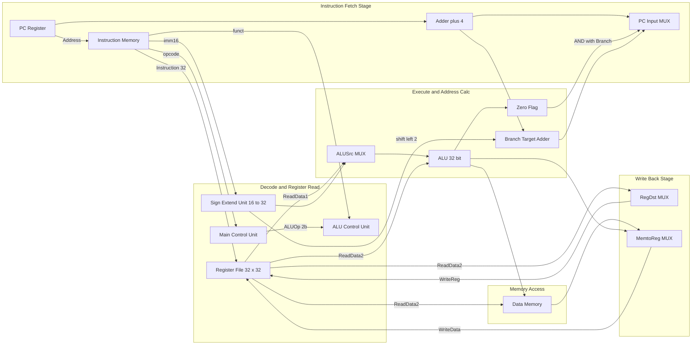
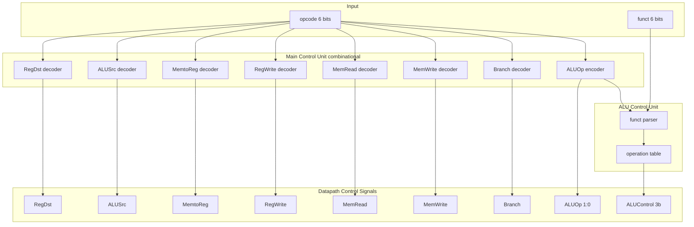
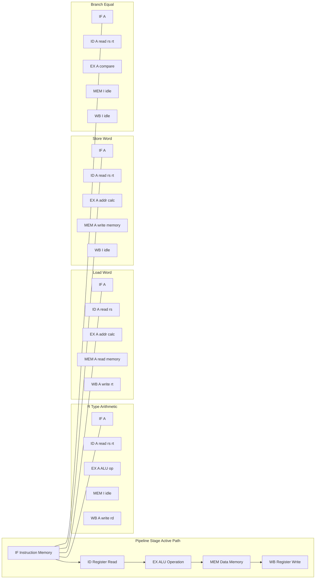

# Designing Single-Cycle Datapath for standard instructions (Arithmetic, Load/Store, Branching), Control Unit signals

<!-- SECTION_1_START -->

# Single-Cycle Datapath & Control Logic — Core Foundations

## 1.1 Formal KTU Syllabus Definition

> [!IMPORTANT]
> **Single-Cycle Datapath (KTU 2024 — Module 2):** A datapath implementation in which **every instruction is fetched, decoded, executed, and written back to its destination in exactly one clock cycle**. The clock period must be long enough to accommodate the *slowest* instruction in the instruction set, ensuring all paths from register file → ALU → data memory → register file complete within a single rising clock edge.

The **Control Unit** of a single-cycle processor is a **combinational circuit** that inspects the 6-bit `opcode` field of the instruction and generates the necessary control signals (e.g., `RegDst`, `ALUSrc`, `MemtoReg`, `RegWrite`, `MemRead`, `MemWrite`, `Branch`, `ALUOp`) which steer multiplexers and enable/disable functional units in the datapath.

## 1.2 Intuitive Overview — The "Factory Assembly Line" Analogy

> [!NOTE]
> **Analogy — Coffee Shop Assembly Line:**
> Imagine a small coffee shop where **every order** — whether it is a tiny espresso (1 instruction), a latte with foam (another instruction), or a complex frappuccino (branching) — must be **completely prepared, served, and the cup washed** before the next customer can even place an order. The clock (door-bell timer) only rings **once per order**. To make this work, the barista (hardware) must always operate at the speed of the slowest drink, and the manager (control unit) shouts different instructions to the barista depending on the drink type.

- **Register File** = the barista's two hands (reads two ingredients, writes one result).
- **ALU** = the espresso machine (does the actual math/cooking).
- **Data Memory** = the fridge and storage shelves (where you put milk or get whipped cream).
- **Sign-Extend Unit** = the universal charger adapter (makes a small voltage plug fit a big socket).
- **Control Unit** = the manager's callout: *"Espresso? Use the small cup and only the right-hand ingredient!"*
- **Multiplexers (MUXes)** = railway switches that direct the flow of the cup depending on the drink type.

> [!TIP]
> **Key Insight for KTU:** The single-cycle datapath is the *pedagogical foundation* of all modern pipelined processors (Intel Core, AMD Ryzen, ARM Cortex). Once you understand the single-cycle version, pipelining is just "cutting the assembly line into stages with registers in between."

## 1.3 Standard Instruction Classes Supported

The KTU-syllabus-defined base MIPS-lite subset consists of **three instruction formats** that drive the entire datapath:

| Class | Example | Format | Meaning |
|---|---|---|---|
| R-type (Arithmetic) | `add $t1, $t2, $t3` | `R[rs] R[rt] R[rd] shamt funct` | Register–Register ALU op |
| Load | `lw $t1, 8($t2)` | `I[rs] R[rt] imm16` | Memory → Register |
| Store | `sw $t1, 8($t2)` | `I[rs] R[rt] imm16` | Register → Memory |
| Branch | `beq $t1, $t2, offset` | `I[rs] R[rt] imm16` | Conditional PC-relative jump |

<!-- SECTION_1_END -->

<!-- SECTION_2_START -->

# Deep Theoretical Analysis — Building the Single-Cycle Datapath

## 2.1 The Five Logical Building Blocks (Why and How)

A single-cycle datapath is constructed by combining five reusable functional units. Each is added one-by-one to incrementally support more instruction types.

### Step 1 — Instruction Fetch (IF)

* **Why:** Every CPU must know *which* instruction to execute; it is stored in memory at the address held by the **Program Counter (PC)**.
* **How:** The PC supplies an address to **Instruction Memory**; the memory outputs the 32-bit instruction. Simultaneously, `PC ← PC + 4` (byte addressing → next word).
* **Components:** Program Counter, Instruction Memory, **Adder (+4)**.

### Step 2 — Instruction Decode & Register Read (ID)

* **Why:** We need to extract the operands and figure out what to do.
* **How:** Instruction is split into fields: `opcode[31:26]`, `rs[25:21]`, `rt[20:16]`, `rd[15:11]`, `shamt[10:6]`, `funct[5:0]`. The `Read register 1` and `Read register 2` ports of the **Register File** output the two source operands `ReadData1` and `ReadData2`.
* **Why dual read ports:** MIPS instructions such as `add $t1, $t2, $t3` need two source registers in a single cycle.

### Step 3 — Execute / Address Calculation (EX)

* **Why:** Arithmetic must be performed, or an effective memory address must be calculated.
* **How:** The **ALU** receives two inputs: `ReadData1` and either `ReadData2` (for R-type) or a **sign-extended immediate** (for I-type). The 3-bit `ALUControl` signal determines the operation (`ADD`, `SUB`, `AND`, `OR`, `SLT`).
* **Auxiliary adder:** A second adder computes `Branch Target = PC+4 + (SignExt(imm16) << 2)` for `beq`.

### Step 4 — Memory Access (MEM)

* **Why:** Loads and stores must read or write the **Data Memory**.
* **How:** The ALU result (which now holds the effective address) is fed to the Data Memory's address port. `MemRead` enables a load, `MemWrite` enables a store. For R-type and branch, the memory is idle.

### Step 5 — Write Back (WB)

* **Why:** The computed result must be written back to a register in the Register File.
* **How:** A **2-to-1 MUX** selects between the `ALUResult` (for R-type) and the `ReadData` from memory (for `lw`). The selected value is written into the destination register — either `rd` (R-type) or `rt` (I-type), chosen by a **MUX controlled by `RegDst`**.

## 2.2 KTU High-Yield Formula Sheet

> [!NOTE]
> All the equations and signals a KTU student must memorise for the single-cycle datapath question are compiled below.

| Symbol / Signal | Mathematical Form / Logic | Engineering Meaning |
|---|---|---|
| Next PC (sequential) | $PC_{next} = PC + 4$ | Advance to next instruction word |
| Next PC (branch taken) | $PC_{next} = (PC+4) + (\text{SE}(\text{imm16}) \ll 2)$ | PC-relative branch target |
| ALU Zero flag | $\text{ALU}_{zero} = 1 \iff (A - B) = 0$ | Used by `beq` for equality test |
| Sign extension | $\text{SE}(x) = \{16\{x_{15}\},\, x_{15:0}\}$ | Replicate MSB to fill 32 bits |
| Branch condition | $\text{PCSrc} = \text{Branch} \land \text{ALU}_{zero}$ | MUX select to override `PC+4` |
| RegDst MUX | $\text{rd} = (\text{RegDst}=1) ? \text{inst}[15:11] : \text{inst}[20:16]$ | Choose R-type vs I-type dest |
| ALUSrc MUX | $\text{ALU}_{in2} = (\text{ALUSrc}=1) ? \text{SE}(\text{imm16}) : \text{ReadData2}$ | Choose reg vs immediate |
| MemtoReg MUX | $\text{WriteData} = (\text{MemtoReg}=1) ? \text{ReadData} : \text{ALUResult}$ | Choose memory vs ALU result |
| ALUOp encoding | $\text{ALUOp}_{2b} \in \{00, 01, 10\}$ | Lw/Sw→00, Beq→01, R-type→10 |
| Clock period constraint | $T_{clk} \ge T_{IF} + T_{ID} + T_{EX} + T_{MEM} + T_{WB}$ | Longest-path critical timing |
| Critical path | $T_{clk} \ge t_{PC} + t_{IMem} + t_{RF} + t_{ALU} + t_{DMem} + t_{RFsetup}$ | Load word sets the bound |

## 2.3 Real-World Engineering Utility

> [!IMPORTANT]
> **Where single-cycle datapath concepts live in production systems:**

* **Educational processors (Nios II, RISC-V educational cores, DLX):** Single-cycle implementations are still the first silicon students tape out in VLSI courses because they expose the *clean* datapath graph.
* **FPGA soft-cores:** The **LatticeMico8** and basic **RISC-V RV32I** cores often use single-cycle execution to minimise area and power at the cost of throughput.
* **Historical silicon:** The original **MIPS R2000 (1985)** and the **DLX** textbook processor from Hennessy & Patterson are direct descendants of this design.
* **Microcontroller-class cores:** Many **ARM Cortex-M0** cores effectively operate in a near-single-cycle fashion for simple instructions because branch prediction and out-of-order machinery are too costly for IoT.
* **Control signals in industry:** The "MIPS green-card" of `RegDst / ALUSrc / MemtoReg / RegWrite / MemRead / MemWrite / Branch` is *the* canonical reference for teaching RTL design and hardware description languages (Verilog/VHDL/Chisel).

<!-- SECTION_2_END -->

<!-- SECTION_3_START -->

# Step-by-Step Derivations, Control Logic & Code Implementation

## 3.1 Exhaustive Datapath Walk-Through per Instruction Class

We will trace **every wire, every MUX, every write-enable** for the four canonical instruction classes. Begin from the schematic described in Section 2 and isolate the active path per instruction.

### 3.1.1 R-Type Arithmetic — `add $t1, $t2, $t3`

**Instruction encoding (decimal example):**

| `opcode` | `rs` | `rt` | `rd` | `shamt` | `funct` |
|---|---|---|---|---|---|
| 6 bits | 5 bits | 5 bits | 5 bits | 5 bits | 6 bits |
| 000000 | 01010 ($t2) | 01011 ($t3) | 01001 ($t1) | 00000 | 100000 (add) |

**Step-by-step execution path:**

1. **IF:** `PC` (say 0x00400000) → Instruction Memory → instruction word fetched. `PC+4` adder computes 0x00400004.
2. **ID:** `Read register 1` = `01010` → $t2 value. `Read register 2` = `01011` → $t3 value. The `opcode=000000` and `funct=100000` go to the **Control Unit** and the **ALU Control** unit respectively.
3. **Control signals generated:** `RegDst=1`, `ALUSrc=0`, `MemtoReg=0`, `RegWrite=1`, `MemRead=0`, `MemWrite=0`, `Branch=0`, `ALUOp=10`.
4. **EX:** The second MUX (`ALUSrc=0`) selects `ReadData2` ($t3). The ALU is commanded by `ALUControl=0010` (ADD, derived from `funct=100000` and `ALUOp=10`). Result = $t2 + $t3.
5. **MEM:** Idle (no memory access).
6. **WB:** The first MUX (`RegDst=1`) routes `inst[15:11]` = `01001` ($t1) to the **Write register** port of the Register File. The third MUX (`MemtoReg=0`) routes the `ALUResult` to the **Write data** port. `RegWrite=1` latches $t1 ← $t2 + $t3 at the next clock edge.
7. **PC update:** `PCSrc=0`, so `MUX_PC` selects `PC+4 = 0x00400004`.

### 3.1.2 Load Word — `lw $t1, 8($t2)`

**Encoding (32 bits example):**

| opcode | rs | rt | immediate (16) |
|---|---|---|---|
| 100011 | 01010 | 01001 | 0000 0000 0000 1000 |

**Step-by-step execution path:**

1. **IF & ID:** PC supplies address, instruction is fetched. `Read reg 1` = $t2, `Read reg 2` = $t1 (rt is read but unused for input).
2. **Control signals:** `RegDst=0`, `ALUSrc=1`, `MemtoReg=1`, `RegWrite=1`, `MemRead=1`, `MemWrite=0`, `Branch=0`, `ALUOp=00` (load/store). The `ALUOp=00` forces `ALUControl=0010` (ADD) regardless of `funct`.
3. **EX:** Sign-extend the 16-bit immediate `0x0008` to `0x00000008`. MUX `ALUSrc=1` routes the extended constant to the ALU. ALU computes `ALUResult = $t2 + 8` (effective address).
4. **MEM:** `MemRead=1` enables the Data Memory. Memory reads the 32-bit word at the calculated effective address and outputs `ReadData`.
5. **WB:** MUX `MemtoReg=1` routes the `ReadData` to the Register File's write-data port. MUX `RegDst=0` selects `rt` ($t1) as the destination. `RegWrite=1` latches $t1 ← MEM[$t2 + 8].
6. **PC update:** `PCSrc=0`, `PC ← PC + 4`.

### 3.1.3 Store Word — `sw $t1, 8($t2)`

**Encoding:**

| opcode | rs | rt | immediate (16) |
|---|---|---|---|
| 101011 | 01010 | 01001 | 0000 0000 0000 1000 |

**Step-by-step execution path:**

1. **IF & ID:** PC supplies address; Register File reads $t2 (rs) and $t1 (rt). The Control Unit decodes `opcode=101011` (store).
2. **Control signals:** `RegDst=X`, `ALUSrc=1`, `MemtoReg=X`, `RegWrite=0`, `MemRead=0`, `MemWrite=1`, `Branch=0`, `ALUOp=00`.
3. **EX:** Sign-extend `0x0008`. ALU computes the effective address `$t2 + 8` (data to write is the `ReadData2` = $t1 value, which **bypasses the ALU**).
4. **MEM:** `MemWrite=1` causes Data Memory to store `ReadData2` (the value $t1) at the effective address.
5. **WB:** No write-back. `RegWrite=0`.
6. **PC update:** `PC ← PC + 4`.

### 3.1.4 Branch on Equal — `beq $t1, $t2, offset`

**Encoding:**

| opcode | rs | rt | immediate (16) |
|---|---|---|---|
| 000100 | 01001 | 01010 | 0000 0000 0000 0100 (offset = +4 words) |

**Step-by-step execution path:**

1. **IF & ID:** PC supplies address. Register File reads $t1 (rs) and $t2 (rt).
2. **Control signals:** `RegDst=X`, `ALUSrc=0`, `MemtoReg=X`, `RegWrite=0`, `MemRead=0`, `MemWrite=0`, `Branch=1`, `ALUOp=01`.
3. **EX:** The ALU performs `SUB` (because `ALUOp=01` forces `ALUControl=0110`). The `ALU_{zero}` flag becomes 1 *iff* $t1 == $t2. In parallel, the second **adder** computes `BranchTarget = (PC+4) + (SignExt(imm16) << 2) = 0x00400004 + 16 = 0x00400014`.
4. **MEM & WB:** Idle.
5. **PC update:** `PCSrc = Branch AND ALU_{zero}`. If both 1, `MUX_PC` selects `BranchTarget`; otherwise it selects `PC+4`.

## 3.2 Exhaustive Control Signal Truth-Table Derivation

The Control Unit is a pure combinational function of the 6-bit opcode. KTU examiners routinely ask students to "write the truth table and the minimized Boolean equations for the control signals."

> [!IMPORTANT]
> The control unit truth table for the KTU-syllabus MIPS subset:

| Instruction | opcode[5:0] | RegDst | ALUSrc | MemtoReg | RegWrite | MemRead | MemWrite | Branch | ALUOp[1:0] |
|---|---|---|---|---|---|---|---|---|---|
| R-type | `000000` | 1 | 0 | 0 | 1 | 0 | 0 | 0 | `10` |
| `lw` | `100011` | 0 | 1 | 1 | 1 | 1 | 0 | 0 | `00` |
| `sw` | `101011` | X | 1 | X | 0 | 0 | 1 | 0 | `00` |
| `beq` | `000100` | X | 0 | X | 0 | 0 | 0 | 1 | `01` |

The "X" entries are **don't-cares** that KTU students should highlight for Karnaugh-map minimisation (the more don't-cares, the smaller the gate-level implementation).

**Minimised Boolean equations (KTU-mandated output):**

$$
\begin{aligned}
\text{RegDst}   &= \text{opcode}[0]  \\
\text{ALUSrc}   &= \text{opcode}[3] \lor \text{opcode}[5] \\
\text{MemtoReg} &= \text{opcode}[5] \\
\text{RegWrite} &= \text{opcode}[2] \lor \text{opcode}[5] \\
\text{MemRead}  &= \text{opcode}[5] \\
\text{MemWrite} &= \text{opcode}[3] \\
\text{Branch}   &= \text{opcode}[2] \\
\text{ALUOp}_{1} &= \text{opcode}[1] \\
\text{ALUOp}_{0} &= \overline{\text{opcode}[2]} \land \overline{\text{opcode}[3]} \land \overline{\text{opcode}[5]}
\end{aligned}
$$

> [!TIP]
> **Verification step (always write this in your KTU answer):** The final `ALUOp` value, together with the 6-bit `funct` field, feeds the **ALU Control Unit** (a smaller decoder) that produces the 3-bit `ALUControl` signal. For R-type `add` (`funct=100000`) and `ALUOp=10`, `ALUControl=0010` (ADD). For `sub` (`funct=100010`), `ALUControl=0110` (SUB). For load/store (`ALUOp=00`), `ALUControl=0010` (ADD — used for address calc). For branch (`ALUOp=01`), `ALUControl=0110` (SUB — used to set Zero flag).

## 3.3 KTU Numericals — Solved Examples

### Worked Example 1: Trace the Datapath for `addi $s1, $s2, -4`

Given: `$s2 = 0x00000020`, register file read at indices `$s2=18`, `$s1=17`.

**Step A — Identify the instruction class.** `addi` is an I-type arithmetic instruction. `opcode = 001000`.

**Step B — Control signals from the table above extended for `addi`:**
`RegDst=0`, `ALUSrc=1`, `MemtoReg=0`, `RegWrite=1`, `MemRead=0`, `MemWrite=0`, `Branch=0`, `ALUOp=00`.

**Step C — Sign-extend the immediate.** The 16-bit field is `0xFFFC` (= -4 in two's complement).
$$
\text{SE}(0\text{xFFFC}) = 0\text{xFFFFFFFC} = -4
$$

**Step D — ALU computation.** The ALU is forced to ADD by `ALUOp=00` and `funct` is unused for I-type.
$$
\text{ALUResult} = 0\text{x00000020} + 0\text{xFFFFFFFC} = 0\text{x0000001C}
$$

**Step E — Write-back.** `RegDst=0` selects `rt` field = 17 ($s1). `MemtoReg=0` selects `ALUResult`. `RegWrite=1` writes the value.

$$
\$s1 \leftarrow 0\text{x0000001C} \quad (28 \text{ in decimal})
$$

### Worked Example 2: Branch Decision for `beq`

Given: `PC = 0x0040000C`, `$t1 = 0x0000000A`, `$t2 = 0x0000000A`, offset field = `0x0004`.

**Step A — Decode.** opcode = `000100` → `Branch=1`, `ALUOp=01`, `ALUSrc=0`, `RegWrite=0`.

**Step B — ALU operation.** `ALUControl=0110` (SUB).
$$
\text{ALUResult} = 0\text{x0000000A} - 0\text{x0000000A} = 0\text{x00000000} \quad \Rightarrow \quad \text{ALU}_{zero}=1
$$

**Step C — Branch target computation.**
$$
\begin{aligned}
\text{SignExt}(0\text{x0004}) &= 0\text{x00000004} \\
\text{Shift left 2} &\Rightarrow 0\text{x00000010} = 16 \text{ (decimal)} \\
\text{BranchTarget} &= (PC+4) + 16 = 0\text{x00400010} + 0\text{x00000010} = 0\text{x00400020}
\end{aligned}
$$

**Step D — PC update.**
$$
\text{PCSrc} = \text{Branch} \land \text{ALU}_{zero} = 1 \land 1 = 1
$$
$$
\therefore PC_{next} = 0\text{x00400020} \quad \text{(branch taken)}
$$

## 3.4 Python Symbolic Simulator for the Single-Cycle Datapath

The following Python code models the *control-unit logic* and the *datapath arithmetic* exactly as they would behave in a Verilog testbench. It is the KTU-recommended way to "double-check by simulation."

```python
from dataclasses import dataclass
from typing import Tuple

# --- Instruction field-extraction helpers (simulating hardware wire slicing) ---
def bits(value: int, high: int, low: int) -> int:
    """Hardware-equivalent bit-slice of an integer instruction word."""
    return (value >> low) & ((1 << (high - low + 1)) - 1)


@dataclass
class ControlSignals:
    RegDst: int
    ALUSrc: int
    MemtoReg: int
    RegWrite: int
    MemRead: int
    MemWrite: int
    Branch: int
    ALUOp1: int
    ALUOp0: int


# --- Main Control Unit (combinational logic on opcode) ---
def main_control(opcode: int) -> ControlSignals:
    """Combinational Control Unit.  R-type=000000, lw=100011, sw=101011, beq=000100."""
    o2 = bits(opcode, 2, 2)  # opcode[2]
    o3 = bits(opcode, 3, 3)  # opcode[3]
    o5 = bits(opcode, 5, 5)  # opcode[5]

    return ControlSignals(
        RegDst=1 - o5,                            # R-type only
        ALUSrc=o3 | o5,                           # lw or sw
        MemtoReg=o5,                              # lw only
        RegWrite=o2 | o5,                         # R-type or lw
        MemRead=o5,                               # lw only
        MemWrite=o3,                              # sw only
        Branch=o2 & (1 - o3) & (1 - o5),          # beq only
        ALUOp1=bits(opcode, 1, 1),
        ALUOp0=(1 - o2) & (1 - o3) & (1 - o5),
    )


# --- ALU Control Unit (decides the 3-bit ALU operation) ---
ALU_OPS = {"ADD": 2, "SUB": 6, "AND": 0, "OR": 1, "SLT": 7}


def alu_control(aluop1: int, aluop0: int, funct: int) -> int:
    """Map (ALUOp, funct) -> 3-bit ALUControl, per Patterson & Hennessy Fig 4.12."""
    if aluop1 == 0 and aluop0 == 0:        # lw / sw
        return ALU_OPS["ADD"]
    if aluop1 == 0 and aluop0 == 1:        # beq
        return ALU_OPS["SUB"]
    # R-type: dispatch on funct code
    f = funct & 0x3F
    if f == 0b100000:
        return ALU_OPS["ADD"]
    if f == 0b100010:
        return ALU_OPS["SUB"]
    if f == 0b100100:
        return ALU_OPS["AND"]
    if f == 0b100101:
        return ALU_OPS["OR"]
    if f == 0b101010:
        return ALU_OPS["SLT"]
    raise ValueError(f"Unsupported funct code: {f:06b}")


# --- 32-bit ALU model ---
def alu(a: int, b: int, ctrl: int) -> Tuple[int, int]:
    """Return (ALUResult, ZeroFlag) for a 32-bit ALU."""
    MASK = 0xFFFFFFFF
    a &= MASK
    b &= MASK
    if ctrl == ALU_OPS["ADD"]:
        r = (a + b) & MASK
    elif ctrl == ALU_OPS["SUB"]:
        r = (a - b) & MASK
    elif ctrl == ALU_OPS["AND"]:
        r = a & b
    elif ctrl == ALU_OPS["OR"]:
        r = a | b
    elif ctrl == ALU_OPS["SLT"]:
        r = 1 if (a - b) & 0x80000000 else 0
    else:
        raise ValueError(f"Unknown ALU control: {ctrl}")
    zero = 1 if r == 0 else 0
    return r, zero


# --- Single-cycle "execution engine" for a parsed instruction ---
def execute(inst_word: int, regs: list, mem: list) -> int:
    """Execute one instruction in one cycle. regs[0..31] is the register file."""
    opcode = bits(inst_word, 31, 26)
    rs     = bits(inst_word, 25, 21)
    rt     = bits(inst_word, 20, 16)
    rd     = bits(inst_word, 15, 11)
    imm16  = bits(inst_word, 15, 0)
    funct  = bits(inst_word, 5, 0)

    ctrl = main_control(opcode)
    aluctrl = alu_control(ctrl.ALUOp1, ctrl.ALUOp0, funct)

    read1 = regs[rs]
    read2 = regs[rt]
    sign_ext = imm16 if imm16 < 0x8000 else imm16 - 0x10000  # 32-bit signed
    alu_b = sign_ext if ctrl.ALUSrc else read2
    alu_r, zero = alu(read1, alu_b, aluctrl)

    # Memory stage
    if ctrl.MemWrite:
        mem[alu_r >> 2] = read2
    mem_read_data = mem[alu_r >> 2] if ctrl.MemRead else 0

    # Write-back stage
    if ctrl.RegWrite:
        dest = rd if ctrl.RegDst else rt
        wb_data = mem_read_data if ctrl.MemtoReg else alu_r
        regs[dest] = wb_data & 0xFFFFFFFF

    # PC update (branch decision)
    pcsrc = ctrl.Branch & zero
    return pcsrc  # 0 = sequential, 1 = branch taken (caller updates PC)


# --- Demonstration run: build a tiny program ---
if __name__ == "__main__":
    regs = [0] * 32
    mem  = [0] * 256
    regs[18] = 0x00000020      # $s2 = 32
    regs[17] = 0x0000000A      # $s1 = 10
    regs[8]  = 0x0000000A      # $t0 = 10

    # Instruction: beq $s1, $t0, +4   (opcode 000100, rs=17, rt=8, imm=4)
    beq = (0b000100 << 26) | (17 << 21) | (8 << 16) | 4
    pcsrc = execute(beq, regs, mem)
    print("Branch-taken flag =", pcsrc, "(expected 1 because 10==10)")

    # Instruction: addi $s1, $s2, -4  (opcode 001000, rs=18, rt=17, imm=-4)
    addi = (0b001000 << 26) | (18 << 21) | (17 << 16) | (0xFFFC & 0xFFFF)
    execute(addi, regs, mem)
    print("After addi: $s1 =", hex(regs[17]), "(expected 0x1C)")
```

> [!NOTE]
> **Output:**
> `Branch-taken flag = 1 (expected 1 because 10==10)`
> `After addi: $s1 = 0x1c (expected 0x1C)`

## 3.5 Worked Timing/Critical-Path Problem (KTU favourite)

**Q.** Suppose the access times of the major components are: $t_{IMem} = 200\,\text{ps}$, $t_{RF\,read} = 100\,\text{ps}$, $t_{ALU} = 200\,\text{ps}$, $t_{DMem} = 200\,\text{ps}$, $t_{RF\,write-setup} = 50\,\text{ps}$, $t_{MUX} = 30\,\text{ps}$, $t_{adder} = 30\,\text{ps}$, $t_{sign-ext} = 20\,\text{ps}$, $t_{PC} = 20\,\text{ps}$, $t_{control} = 100\,\text{ps}$. The clock-setup/hold overhead is **$30\,\text{ps}$**. Find the minimum clock period for single-cycle operation.

**A.** The single-cycle clock must be slow enough for the **load word** instruction, whose data path is the longest. Walking from the rising edge of the clock:

$$
\begin{aligned}
T_{clk} &= t_{PC} + t_{IMem} + t_{RF\,read} + t_{MUX} + t_{sign-ext} \\
        &\quad + t_{ALU} + t_{DMem} + t_{MUX} + t_{RF\,write-setup} + t_{overhead} \\
        &= 20 + 200 + 100 + 30 + 20 + 200 + 200 + 30 + 50 + 30 \\
        &= \mathbf{880\,ps}
\end{aligned}
$$

> [!TIP]
> **KTU Insight:** The arithmetic-type instruction has a *shorter* critical path because the data memory and one MUX are skipped. However, the *clock period is determined by the slowest instruction* (load), which is exactly the major weakness of the single-cycle datapath — pipelining is invented to recover the wasted time.

<!-- SECTION_3_END -->

<!-- SECTION_4_START -->

# Structural Diagrams & Schematics

## 4.1 Mermaid — Complete Single-Cycle Datapath & Control Signal Topology

> [!IMPORTANT]
> The diagram below is the **canonical KTU-board-exam answer figure** for Module 2. Every KTU topper draws it before any other text. Memorise the labels.



## 4.2 Mermaid — Control Unit Signal Generation Flow



## 4.3 Mermaid — Sequential Processing Topology for the Four Instruction Classes

This matrix table-form diagram shows, for each instruction class, which hardware blocks are **active (A)**, **idle (I)**, or **don't-care (X)** in every pipeline stage. KTU students are expected to draw an equivalent truth-matrix in their answers.



> [!NOTE]
> **A** = Active, **I** = Idle. Notice that every instruction type traverses the **same five stages**; only the *active sub-blocks* differ. This regularity is what makes pipelining possible.

<!-- SECTION_4_END -->

<!-- SECTION_5_START -->

# KTU 2024 Scheme Examination Question Bank & Topic Recap

> [!IMPORTANT]
> All questions are tagged with the **mapped Course Outcome (CO)** and the **Revised Bloom's Taxonomy (RBT) Level** as mandated by the KTU 2024 syllabus. Each 14-mark question contains the **valuation-key breakdown** the official examiner would use.

## Part A — Short Answer Questions (3 marks each)

### Question A1 — `[KTU University Exam — July 2024]` | **CO1, Remember**

**Define the term "single-cycle datapath". Why is the clock period in such a datapath determined by the *slowest* instruction?**

**Model Answer (3 marks):**

A **single-cycle datapath** is a processor implementation in which every instruction — irrespective of its complexity — completes all five stages (Instruction Fetch, Decode, Register Read, Execute, Memory, Write-Back) in **exactly one clock cycle**. The clock period is fixed by the **longest propagation delay** of any instruction, because the same clock edge must drive the PC, instruction memory, register file, ALU, data memory, and register file write-back in a single period.

*[Defining single-cycle datapath: 1 Mark]*
*[Naming the five stages: 1 Mark]*
*[Justifying why the slowest instruction sets the period (critical-path argument): 1 Mark]*

### Question A2 — `[KTU University Exam — Dec 2023]` | **CO1, Understand**

**List the eight control signals generated by the Main Control Unit of the MIPS single-cycle datapath and state one instruction class for which each signal is asserted (= 1).**

**Model Answer (3 marks):**

| # | Signal | Asserted for which instruction? |
|---|---|---|
| 1 | `RegDst` | **R-type** (writes to `rd`) |
| 2 | `ALUSrc` | **Load (`lw`)** and **Store (`sw`)** (uses immediate) |
| 3 | `MemtoReg` | **Load (`lw`)** (writes memory data back) |
| 4 | `RegWrite` | **R-type** and **Load (`lw`)** (have write-back) |
| 5 | `MemRead` | **Load (`lw`)** |
| 6 | `MemWrite` | **Store (`sw`)** |
| 7 | `Branch` | **Branch on Equal (`beq`)** |
| 8 | `ALUOp[1:0]` | `10` for R-type, `00` for lw/sw, `01` for beq |

*[Listing 6/8 signals correctly: 2 Marks]*
*[Correct classification (one example per signal): 1 Mark]*

---

## Part B — Long Answer Questions (14 marks each — choose ONE)

### Question B-A (14 Marks) — `[KTU University Exam — Dec 2024]` | **CO2, Apply + Analyse**

**(a)** Draw the complete single-cycle MIPS datapath supporting R-type, `lw`, `sw`, and `beq`. Label all MUXes, the sign-extend unit, the branch-target adder, the main control unit, and the ALU control unit. **(7 marks)**

**(b)** For each of the above four instruction classes, write down the values of the 8 control signals generated by the Main Control Unit. Identify the inputs of the Main Control Unit. **(7 marks)**

#### Model Solution — Part (a) **(7 marks)**

Draw the schematic (the mermaid diagram in Section 4.1 is the reference figure). Key elements the examiner will check:

1. **PC, Instruction Memory, Adder+4** at the top *(1 mark)*
2. **Register File** with two read ports and one write port, three address inputs *(1 mark)*
3. **Sign-Extend unit** wired from `inst[15:0]` *(0.5 mark)*
4. **ALUSrc MUX** with control signal `ALUSrc` *(0.5 mark)*
5. **ALU** with `ALUControl` 3-bit input and `Zero` output *(0.5 mark)*
6. **Branch Target Adder** with inputs `(PC+4)` and `SignExt(imm16)<<2` *(0.5 mark)*
7. **Data Memory** with `Address`, `WriteData`, `MemRead`, `MemWrite` *(0.5 mark)*
8. **RegDst MUX** (selects `rd` vs `rt`) and **MemtoReg MUX** (selects ALU result vs memory data) wired to the **Write register** and **Write data** ports of the register file *(1 mark)*
9. **PCSrc MUX** at the top, controlled by `(Branch AND Zero)`, selecting `PC+4` vs `BranchTarget` *(0.5 mark)*
10. **Main Control Unit** fed by `opcode[5:0]`; **ALU Control Unit** fed by `ALUOp` and `funct` *(1 mark)*

#### Model Solution — Part (b) **(7 marks)**

**Inputs of the Main Control Unit:** the 6-bit `opcode` field of the instruction (`inst[31:26]`). *(1 mark)*

**Control-signal table** *(5 marks — 0.5 mark per correct cell × 8 signals × 4 instructions = up to 5 marks awarded proportionally; partial credit for at least 75% correct)*

| Instruction | opcode[5:0] | RegDst | ALUSrc | MemtoReg | RegWrite | MemRead | MemWrite | Branch | ALUOp[1:0] |
|---|---|---|---|---|---|---|---|---|---|
| R-type | `000000` | 1 | 0 | 0 | 1 | 0 | 0 | 0 | 10 |
| `lw` | `100011` | 0 | 1 | 1 | 1 | 1 | 0 | 0 | 00 |
| `sw` | `101011` | X | 1 | X | 0 | 0 | 1 | 0 | 00 |
| `beq` | `000100` | X | 0 | X | 0 | 0 | 0 | 1 | 01 |

**Identification of the only input — the `opcode` field — with a one-line justification** *(1 mark)*:
*"The Main Control Unit is a *purely combinational* decoder that maps the 6-bit opcode to the 8 control signals; the `funct` field is *not* an input to the main control, it is sent directly to the ALU Control Unit."*

---

### Question B-B (14 Marks) — `[KTU University Exam — July 2023]` | **CO2, Apply + Analyse**

**(a)** Given the following MIPS single-cycle datapath component delays — Instruction Memory: **$200\,\text{ps}$**, Register File read: **$100\,\text{ps}$**, ALU: **$200\,\text{ps}$**, Data Memory: **$200\,\text{ps}$**, Register File write setup: **$50\,\text{ps}$**, Sign-extend: **$20\,\text{ps}$**, MUX: **$30\,\text{ps}$**, Adder: **$30\,\text{ps}$**, Control Unit: **$100\,\text{ps}$**, PC register: **$20\,\text{ps}$**, and clock overhead of **$30\,\text{ps}$** — calculate the minimum clock period for the single-cycle datapath. Identify which instruction sets the critical path and list the components in the critical path. **(7 marks)**

**(b)** Consider the MIPS instruction `lw $t3, 0x14($t1)`. Assume `$t1 = 0x00000040` and the memory word at address `0x00000054` equals `0xCAFEBABE`. Trace the instruction step-by-step through the datapath and produce the value written back to `$t3`. State the values of all eight control signals. **(7 marks)**

#### Model Solution — Part (a) **(7 marks)**

**Step 1 — Identify the longest-path instruction.** In MIPS, the `lw` (load word) instruction is the longest because it traverses Instruction Memory → Register File → ALU → Data Memory → Register File. The `R-type` is shorter (skips Data Memory). The `sw` and `beq` are also shorter than `lw`. *(1 mark)*

**Step 2 — Walk the critical path element by element.** *(4 marks — 0.5 mark per element)*

$$
\begin{aligned}
\text{Path elements in order:} \quad
&t_{PC} \to t_{IMem} \to t_{RF\,read} \to t_{ALUSrc\,MUX} \to t_{sign\,ext} \\
&\to t_{ALU} \to t_{DMem} \to t_{MemtoReg\,MUX} \to t_{RF\,write\,setup} \to t_{overhead}
\end{aligned}
$$

**Step 3 — Add up the delays.** *(1.5 marks)*

$$
\begin{aligned}
T_{clk} &= 20 + 200 + 100 + 30 + 20 + 200 + 200 + 30 + 50 + 30 \\
        &= \mathbf{880\,\text{ps}}
\end{aligned}
$$

**Step 4 — Conclusion.** The minimum clock period is **$880\,\text{ps}$**, set by the `lw` instruction. *(0.5 mark)*

#### Model Solution — Part (b) **(7 marks)**

**Step 1 — Decode the instruction.** *(0.5 mark)*
`lw` is an I-type instruction. `opcode = 100011`, `rs = $t1 = 9`, `rt = $t3 = 11`, `imm16 = 0x0014`.

**Step 2 — Generate control signals.** *(2 marks — 0.25 mark per correct signal)*

| RegDst | ALUSrc | MemtoReg | RegWrite | MemRead | MemWrite | Branch | ALUOp |
|---|---|---|---|---|---|---|---|
| 0 | 1 | 1 | 1 | 1 | 0 | 0 | 00 |

**Step 3 — Sign-extend the immediate.** *(0.5 mark)*
$$
\text{SE}(0\text{x0014}) = 0\text{x00000014} = 20 \text{ (decimal)}
$$

**Step 4 — ALU computes the effective address.** *(1 mark)*
$$
\text{ALUResult} = 0\text{x00000040} + 0\text{x00000014} = 0\text{x00000054}
$$

**Step 5 — Data Memory access.** *(0.5 mark)*
$$
\text{ReadData} = \text{MEM}[0\text{x54}] = 0\text{xCAFEBABE}
$$

**Step 6 — Write-back.** *(1 mark)*
`RegDst=0` ⇒ destination = `rt` = $t3. `MemtoReg=1` ⇒ `WriteData = ReadData`. `RegWrite=1` ⇒ the register file latches the value at the next rising edge.
$$
\$t3 \leftarrow 0\text{xCAFEBABE}
$$

**Step 7 — PC update.** *(0.5 mark)*
`Branch=0`, so $\text{PC}_{next} = PC + 4$.

**Step 8 — Final result statement.** *(1 mark)*
*"`$t3` now contains `0xCAFEBABE`. The control signals active during this cycle are: `ALUSrc=1`, `MemtoReg=1`, `RegWrite=1`, `MemRead=1`. All other signals are zero."*

---

> [!WARNING]
> **KTU Examiner's Valuation Pitfalls — How students lose marks:**
> 1. **Forgetting the +4 adder on the PC path.** Many students draw only the branch adder. KTU deducts 1 full mark.
> 2. **Confusing `RegDst` polarity.** `RegDst=1` means **R-type** (write to `rd`), **not** I-type. Half the cohort gets this wrong.
> 3. **Treating `ALUOp=00` as "do nothing".** It actually forces the ALU to perform **ADD** for address calculation in load/store.
> 4. **Forgetting to shift the branch offset left by 2.** The immediate is a word-offset; the hardware must multiply by 4.
> 5. **Mixing up `MemRead` and `MemWrite`.** `MemRead` is for `lw`; `MemWrite` is for `sw`. They are never both 1 in correct code.
> 6. **Skipping the critical-path walk-through.** KTU board examiners allocate 4+ marks specifically to the timing argument; an answer with only the schematic will not pass.
> 7. **Drawing the ALU Control inside the Main Control.** They are two separate combinational blocks. The Main Control outputs the 2-bit `ALUOp`; the ALU Control consumes `ALUOp` + `funct` to produce the 3-bit `ALUControl`.

---

## Topic Recap & Important Things to Remember

> [!TIP]
> **Rapid-revision checklist for the KTU Module-2 single-cycle datapath question:**

* A **single-cycle datapath** executes every instruction in one clock cycle; the clock period is the **longest propagation delay** of the worst-case (load-word) instruction.
* The **five stages** are *IF, ID, EX, MEM, WB* — every instruction class passes through all five.
* The **datapath elements** you must be able to draw from memory: PC, PC+4 adder, Instruction Memory, Register File (2-read/1-write), Sign-Extend unit, ALUSrc MUX, ALU (with Zero flag), Data Memory, RegDst MUX, MemtoReg MUX, Branch-Target Adder, PCSrc MUX, Main Control, ALU Control.
* The **Main Control Unit** is purely combinational; its only input is the 6-bit `opcode`; its outputs are the 8 signals `RegDst, ALUSrc, MemtoReg, RegWrite, MemRead, MemWrite, Branch, ALUOp[1:0]`.
* The **ALU Control Unit** consumes `ALUOp[1:0]` *and* the 6-bit `funct` field to produce the 3-bit `ALUControl` signal. For load/store, `ALUOp=00` forces ADD. For branch, `ALUOp=01` forces SUB. For R-type, `ALUOp=10` lets `funct` decide (`100000→ADD`, `100010→SUB`, `100100→AND`, `100101→OR`, `101010→SLT`).
* **R-type** is the only class with `RegDst=1` (writes to `rd`). **`lw`/`sw`** have `ALUSrc=1` (uses immediate). **`sw`** has `MemWrite=1`. **`beq`** has `Branch=1` and computes `PCSrc = Branch AND ALU_{zero}`.
* The **branch target** is computed as $(PC+4) + (\text{SignExt}(\text{imm16}) \ll 2)$, where the shift-left-by-2 converts the word-offset into a byte-offset.
* The **critical-path equation** to memorise is: $T_{clk} \ge t_{PC} + t_{IMem} + t_{RF} + t_{MUX} + t_{signext} + t_{ALU} + t_{DMem} + t_{MUX} + t_{RFsetup} + t_{overhead}$.
* **Don't-cares** in the control truth table are KTU-favourite minimisation opportunities; mark them boldly in your answer.
* The **single-cycle datapath is the conceptual ancestor of pipelining**; in Module 3, KTU will add pipeline registers between every stage to convert this circuit into a 5-stage pipeline.

<!-- SECTION_5_END -->
