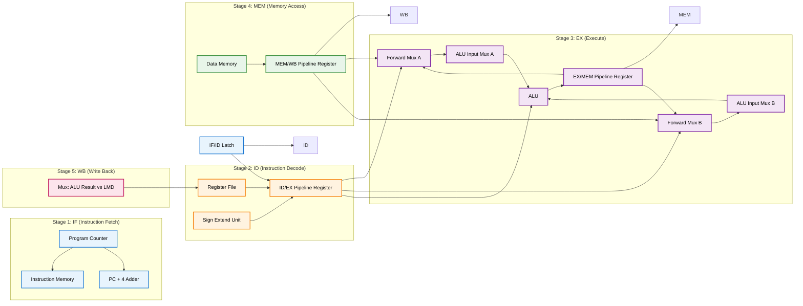
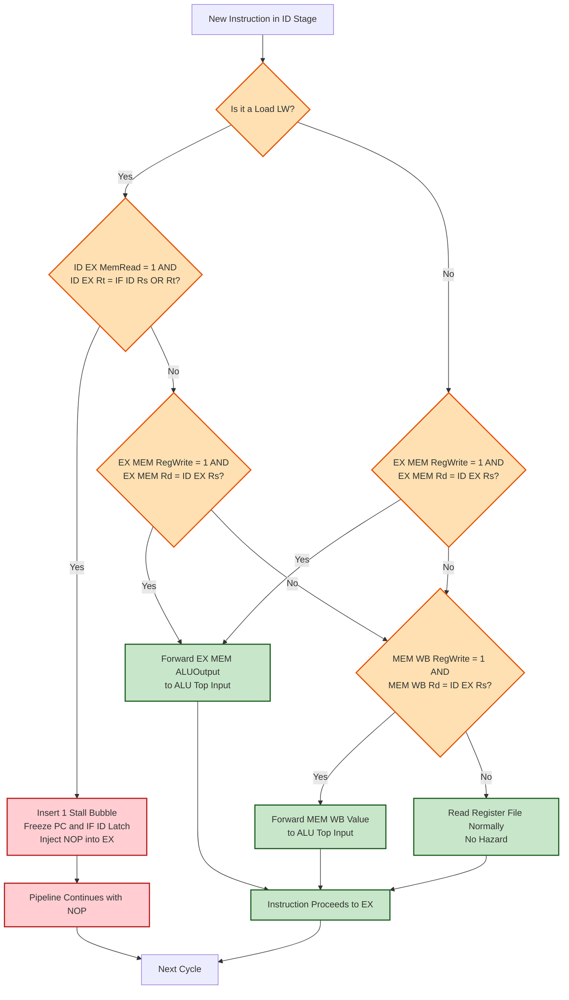
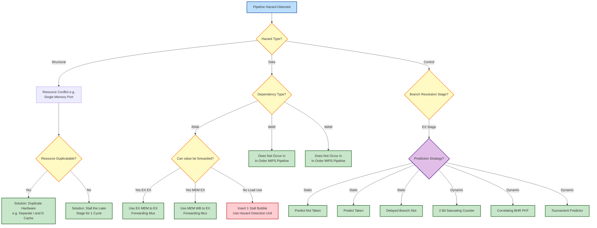

# Pipeline Hazards: Structural, Data hazards (Stalling vs Forwarding/Bypassing), Control hazards (Branch prediction)

<!-- SECTION_1_START -->
# Pipeline Hazards: Structural, Data, and Control

> [!IMPORTANT]
> **KTU 2024 Scheme | PBCST404 | Module 2 | Microarchitecture, Datapath Design, and Control Logic**
> This topic is a high-weightage area in the KTU End Semester Examination (ESE), frequently tested under Course Outcomes **CO2 (Apply)** and **CO3 (Analyze)**. Mastering the three hazard classes — *Structural, Data, and Control* — is mandatory to solve datapath modification problems and CPI/speedup derivations.

## 1.1 Formal Definition (KTU Syllabus Terminology)

In a **pipelined processor**, multiple instructions overlap their execution across a series of stages (typically *IF, ID, EX, MEM, WB*). A **Pipeline Hazard** is any condition or event within the pipeline that prevents the next instruction in the instruction stream from executing during its designated clock cycle, thereby causing a **stall (bubble)** or a **performance penalty**.

Formally, hazards are classified into three categories by the KTU 2024 syllabus:

1. **Structural Hazard** — A hardware resource conflict where two instructions in different stages demand the same physical hardware unit in the same clock cycle.
2. **Data Hazard** — A data dependency conflict where an instruction depends on the result of a previous instruction that is still in the pipeline.
3. **Control Hazard** — A change-of-flow (branch/jump) conflict where the next instruction fetch is delayed because the branch target is not yet known.

> [!NOTE]
> **Core Definition (Board-Exact):** A hazard is said to occur when the *pipelined execution* of a sequence of instructions produces a result different from, or incorrect relative to, the *non-pipelined (sequential)* execution of the same sequence on a single-cycle datapath.

## 1.2 Intuitive Analogy — The Laundry Assembly Line

Imagine a **5-station laundry assembly line**: Washer → Dryer → Folder → Ironer → Packer. Each shirt (instruction) moves station-by-station every 30 minutes. This is a perfectly pipelined system — **throughput = 1 shirt / 30 min**.

- **Structural Hazard (Resource Conflict):** If Station 3 (Folder) suddenly breaks and Station 2 must also do the folding, two shirts will fight for the same station. The line must *stall* until the folder is free.
- **Data Hazard (Dependency):** A blue shirt coming out of the *Dryer* must not be folded by the *Folder* who doesn't yet know its color (because the previous shirt left the dryer in white). The folder must *wait* until the dryer finishes, OR a "forwarding" chute can pass the wet-but-dry shirt directly from the dryer exit to the folder input — skipping the queue.
- **Control Hazard (Wrong Decision):** The Packer receives a special "VIP red shirt" that must be routed to a different boxing machine. But the routing decision (branch) was made *3 stations ago* at the Washer. Until the signal travels back, the wrong boxes are being filled — a penalty is paid.

This is exactly how the **MIPS 5-stage pipeline** behaves with hazards, and the same mitigation principles (stall, forward, predict) apply directly.

## 1.3 The MIPS 5-Stage Pipeline Reference (Baseline)

| Stage | Mnemonic | Hardware Unit | Operation |
| :--- | :---: | :--- | :--- |
| 1 | **IF** | Instruction Memory + PC | Fetch instruction; PC+4 |
| 2 | **ID** | Register File | Decode; read registers; sign-extend |
| 3 | **EX** | ALU | Execute; compute effective address / branch target |
| 4 | **MEM** | Data Memory | Load/Store data access |
| 5 | **WB** | Register File | Write back result to register file |

> [!TIP]
> The canonical MIPS pipeline assumes instructions complete in **5 clock cycles** when no hazard exists, with an **ideal CPI (Cycles Per Instruction) = 1**.

## 1.4 Visualization Control (Pipeline Timing Diagram)

> [!VISUALIZATION CONTROL]
> **Concept:** Pipeline timing diagram showing Data Hazard between two dependent instructions and the effect of **Forwarding (Bypassing)**.
> **Input Equations / Data Points:**
> * Instruction 1 (producer): `add $t1, $t2, $t3`  — writes `$t1` in **WB (Cycle 5)**
> * Instruction 2 (consumer): `sub $t4, $t1, $t5` — needs `$t1` in **EX (Cycle 3)**
> * Without forwarding: stalls are inserted in cycles 3 and 4 (RAW stall penalty = 2)
> * With forwarding: ALU output of Cycle 3 EX stage is fed back to ALU input of Cycle 3 EX stage (EX/MEM → EX forwarding)
>
> **Visual Description:** Plot time (cycles 1–6) on X-axis and stages (IF, ID, EX, MEM, WB) on Y-axis. Draw two horizontal instruction tracks. Without forwarding, consumer EX stage shows a gap (stall) of 2 cycles. With forwarding, the tracks flow continuously with a curved bypass arrow connecting the EX output of producer back to the EX input of consumer in the same cycle.

<!-- SECTION_1_END -->

<!-- SECTION_2_START -->
# Deep Theoretical Analysis & KTU High-Yield Formula Sheet

## 2.1 Structural Hazards — Hardware Resource Conflicts

A **structural hazard** arises when the datapath is not sufficiently duplicated. A classic example in a unified-memory pipelined MIPS design is when the **Instruction Memory** and **Data Memory** are merged into a single RAM unit — IF and MEM stages both require memory access in the same cycle, causing a collision.

### 2.1.1 Conditions for Occurrence
- The same physical resource is required by **two pipeline stages** in the same clock cycle.
- Typically, the memory port, the register file write port, or the ALU is the bottleneck.

### 2.1.2 Resolution Strategies
1. **Duplication of Resources** (e.g., Harvard architecture: separate I-cache and D-cache).
2. **Pipeline Interlocking / Stall Insertion** (bubble the later stage by one cycle).

### 2.1.3 Performance Impact
The actual CPI with structural hazards becomes:

$$
\text{CPI}_{\text{actual}} = \text{CPI}_{\text{ideal}} + \text{Stall cycles per instruction due to structural hazard}
$$

## 2.2 Data Hazards — True Data Dependencies

A **data hazard** exists whenever there is a data dependence between instructions and they are close enough in the pipeline that the dependence will cause incorrect execution. There are **three classical sub-types** (defined by the ordering of read/write accesses to the same register or memory location):

| Hazard Type | Mnemonic | Order | Example | Occurs in In-Order Pipeline? |
| :---: | :---: | :--- | :--- | :---: |
| Read After Write | **RAW** | Instr $i$ writes, Instr $j$ reads (where $j$ is later) | `add $t1,$t2,$t3` then `sub $t4,$t1,$t5` | **YES** (True dependency) |
| Write After Read | **WAR** | Instr $i$ reads, Instr $j$ writes | `sub $t4,$t1,$t5` then `add $t1,$t2,$t3` | NO (only in out-of-order / register renaming) |
| Write After Write | **WAW** | Both instructions write same register | `add $t1,$t2,$t3` then `sub $t1,$t4,$t5` | NO (only in out-of-order) |

> [!IMPORTANT]
> **KTU Focus:** KTU questions almost exclusively test **RAW (Read-After-Write) hazards**, also known as **true data dependencies**, because they occur in the simple in-order MIPS pipeline.

### 2.2.1 Three Sub-Cases of RAW in 5-Stage MIPS

1. **EX→EX Forwarding (1-cycle gap):** Producer computes result in EX; consumer needs it in next EX.
2. **MEM→EX Forwarding (2-cycle gap):** Producer computes result, stores in MEM stage; consumer needs it in EX stage two cycles later.
3. **Load-Use Hazard (Cannot be fully forwarded):** A `lw` followed immediately by an ALU instruction using the loaded value.

### 2.2.2 Resolution via **Stalling** (Bubble Insertion)

A **stall** freezes the consumer instruction in the ID stage by holding the PC and inserting a **NOP bubble** into the EX stage. This is implemented by a dedicated **Hazard Detection Unit** that checks the instruction in ID against the instruction in EX (and MEM).

Stall conditions for load-use case:
- `ID/EX.MemRead` is TRUE (the instruction in EX is a `lw`)
- `ID/EX.RegisterRt` == `IF/ID.RegisterRs` OR `ID/EX.RegisterRt` == `IF/ID.RegisterRt`

If both true → **insert 1 stall bubble** (delay consumer by 1 cycle).

### 2.2.3 Resolution via **Forwarding (Bypassing)**

**Forwarding** routes the computed result directly from a later pipeline stage back to an earlier ALU input, *without waiting for the value to be written back to the register file*. This requires:
- An additional **multiplexer** at the ALU input.
- **Forwarding Control Unit** that examines register tags in the EX/MEM and MEM/WB pipeline registers.

The three forwarding paths in the standard MIPS 5-stage pipeline:

| Path Name | Source | Destination | Condition |
| :--- | :--- | :--- | :--- |
| **EX/MEM → EX** | EX/MEM.ALUOutput | ALU input (top mux) | `EX/MEM.RegWrite` AND `EX/MEM.RegisterRd` = `ID/EX.RegisterRs` (and not $0$) |
| **MEM/WB → EX (ALU)** | MEM/WB.ALUOutput or MEM/WB.LMD | ALU input (bottom mux) | `MEM/WB.RegWrite` AND `MEM/WB.RegisterRd` = `ID/EX.RegisterRs` (and not $0$), and not a double-forward |
| **MEM/WB → EX (Load-Use still fails)** | — | — | Requires 1 stall even with full forwarding |

> [!NOTE]
> **Load-Use Hazard Exception:** Even with perfect EX→EX and MEM→EX forwarding, a `lw $t1, 0($t2)` followed immediately by `add $t3, $t1, $t4` **cannot be fully bypassed**, because the value is read from memory in the MEM stage (cycle 4), but the consumer needs it in EX (cycle 3). The 1-cycle gap must be filled with a stall.

## 2.3 Control Hazards — Branch Penalty

A **control hazard** arises because the outcome of a branch instruction is not known until the **EX stage (or later)**, yet the next instruction must be fetched in the **IF stage** of the next cycle. If the branch is taken, the speculatively fetched instructions must be squashed (flushed).

### 2.3.1 Branch Penalty Without Mitigation

$$
\text{Branch Penalty} = \text{Branch Taken Frequency} \times \text{Stall Cycles}
$$

For a 5-stage MIPS pipeline where branch is resolved in EX, the worst-case penalty is **2 cycles** per taken branch (because IF and ID of the wrongly-fetched fall-through instructions must be squashed).

### 2.3.2 Static and Dynamic Branch Prediction

**A. Static Strategies (Compile-time, hardware-frugal):**

1. **Predict Not Taken** — Always fetch fall-through. Flush only on taken. Simple; works for loops with backward branches.
2. **Predict Taken** — Always fetch branch target. Needs target address early. Effective for loops.
3. **Delayed Branch** — The instruction immediately following the branch (the *delay slot*) is **always executed**; compiler fills it with useful or NOP work.

**B. Dynamic Strategies (Runtime, hardware-intensive):**

1. **1-Bit Branch Prediction Buffer (BTB)** — Store the last outcome (T/N) for each branch. Predict the same as last time. Suffers from "loop-end thrashing" (a loop iterated 10 times has 9 mispredictions with 1-bit predictor).
2. **2-Bit Saturating Counter** — A 4-state FSM (`Strongly NT`, `Weakly NT`, `Weakly T`, `Strongly T`). Predicts the majority of last two outcomes. Reduces loop-end thrashing significantly.
3. **Correlating (Two-Level) Predictors** — Use the history of the *last k branches* (a *Branch History Register*, BHR) to index into a *Pattern History Table* (PHT). Forms a $(m,n)$ predictor where $m$ = history bits, $n$ = counter bits.
4. **Tournament Predictors** — Combine a local predictor and a global predictor with a chooser; used in AMD and Intel CPUs.

## 2.4 KTU Formula Sheet / Cheat Sheet

| # | Concept | Formula / Rule | Units |
| :---: | :--- | :--- | :--- |
| 1 | Ideal Pipeline CPI | $\text{CPI}_{\text{ideal}} = 1$ (for $n$-stage with no hazards) | cycles/instr |
| 2 | Actual CPI with Hazards | $\text{CPI}_{\text{actual}} = \text{CPI}_{\text{ideal}} + \sum_{i}\left(\text{Freq}_i \times \text{Penalty}_i\right)$ | cycles/instr |
| 3 | Speedup (Pipelined vs Single-Cycle) | $\text{Speedup} = \dfrac{\text{Cycle}_{\text{single}} \times N \times \text{CPI}_{\text{ideal}}}{\text{Cycle}_{\text{pipelined}} \times N \times \text{CPI}_{\text{actual}}}$ | ratio |
| 4 | Branch Penalty | $\text{Penalty}_{\text{branch}} = f_{\text{branch}} \times (\text{flush cycles})$ | cycles/instr |
| 5 | Stall Cycles for Load-Use | Always 1 cycle (cannot be fully forwarded) | cycles |
| 6 | Forwarding Stall Penalty | 0 cycles for ALU-ALU, ALU-Store, Load followed by Store | cycles |
| 7 | Misprediction Rate | $= 1 - \text{Prediction Accuracy}$ | fraction |
| 8 | 2-Bit Predictor Mispredictions (loops) | Reduced from $n-1$ (1-bit) to $1$ per loop (2-bit) | count |
| 9 | Bubble Insertion | Inject NOP into EX stage; freeze PC and IF/ID latch | — |
| 10 | PHT Index Width | $\text{Index bits} = k$ for a $2^k$-entry PHT | bits |

> [!NOTE]
> **Engineering Utility:** In real-world CPU design (e.g., Intel Golden Cove, AMD Zen 4, ARM Cortex-A77), hazard mitigation is implemented in silicon as the **Front-End** (branch prediction, fetch) and **Back-End** (renaming, replay, forwarding) of the machine. Forwarding buses are called *"bypass networks"* or *"operand forwarding paths"*. Branch prediction accuracy directly determines Instructions Per Cycle (IPC); a 1% miss in branch prediction can cost 2–5% in throughput.

<!-- SECTION_2_END -->

<!-- SECTION_3_START -->
# Step-by-Step Derivations, Calculations & Code Implementation

## 3.1 Worked Example 1 — RAW Hazard Detection and Forwarding Path Selection

**Given Instruction Sequence (MIPS assembly):**

```asm
I1: add  $t1, $t2, $t3      # $t1 = $t2 + $t3
I2: sub  $t4, $t1, $t5      # $t4 = $t1 - $t5   (uses $t1 from I1)
I3: and  $t6, $t1, $t7      # $t6 = $t1 & $t7   (also uses $t1 from I1)
I4: or   $t8, $t1, $t9      # $t8 = $t1 | $t9   (also uses $t1 from I1)
I5: sw   $t4, 0($s0)        # Memory[$s0] = $t4
```

**Question:** Identify the RAW hazards, determine the forwarding path used for each, and compute the total stall cycles if only forwarding is enabled (no other mitigation). Then, compute the actual CPI assuming branch frequency is 20% and branch penalty is 2 cycles.

### 3.1.1 Step-by-Step Solution

**Step 1 — Identify RAW dependencies (5 marks valuation):**

| Pair | Producer → Consumer | Source of $t1 | Distance (cycles) | Hazard? |
| :---: | :--- | :---: | :---: | :---: |
| I1 → I2 | I1 writes $t1 (WB, cycle 5); I2 needs $t1 (EX, cycle 3) | EX of I1 vs EX of I2 | 2 cycles | YES — RAW |
| I1 → I3 | I1 writes $t1 (WB, cycle 5); I3 needs $t1 (EX, cycle 4) | EX of I1 vs EX of I3 | 1 cycle | YES — RAW |
| I1 → I4 | I1 writes $t1 (WB, cycle 5); I4 needs $t1 (EX, cycle 5) | EX of I1 vs EX of I4 | 0 cycles | NO — value already in register file |
| I2 → I5 | I2 writes $t4 (WB, cycle 6); I5 needs $t4 (MEM, cycle 6) | WB of I2 vs MEM of I5 | 0 cycles | NO — value forwarded via MEM/WB path |

> **Valuation Hint (KTU):** State explicitly *"I1 produces $t1 in its EX stage at the end of cycle 3. I2 requires $t1 at the start of its EX stage at cycle 3. The value is not in the register file at this time, so forwarding is required."* — 1 mark per correctly identified pair.

**Step 2 — Determine forwarding path for each (5 marks):**

$$
\text{Forwarding Path for I1} \rightarrow \text{I2}: \quad \text{MEM/WB.ALUOutput} \rightarrow \text{ALU input (top mux of I2)}
$$

Reasoning: When I2 is in EX (cycle 3), I1 is in MEM (cycle 3). The ALU result of I1 was just latched into EX/MEM register at the end of cycle 3, but the **MEM/WB register** holds the result of the *previous* instruction. Wait — let us re-clock:

- Cycle 3: I1 in MEM, I2 in EX. I1's ALU output is in **EX/MEM register** (just computed in cycle 2 EX, written into MEM latch in cycle 3). The forwarding mux selects **EX/MEM.ALUOutput** → top ALU input of I2.

$$
\text{Forwarding Path for I1} \rightarrow \text{I3}: \quad \text{EX/MEM.ALUOutput} \rightarrow \text{ALU input (top mux of I3)}
$$

Reasoning: When I3 is in EX (cycle 4), I1 is in WB (cycle 4). I1's ALU output is now in **MEM/WB register** (forwarded from MEM stage in cycle 3). The forwarding mux selects **MEM/WB.ALUOutput** → top ALU input of I3.

**Step 3 — Compute total stall cycles:**

With full forwarding, I1→I2 and I1→I3 hazards are resolved via bypass with **0 stall cycles** each. Total stall cycles = **0**.

**Step 4 — Compute actual CPI:**

$$
\text{CPI}_{\text{actual}} = \text{CPI}_{\text{ideal}} + \text{Stall cycles per instruction}
$$

$$
\text{CPI}_{\text{actual}} = 1 + (0.20 \times 2) = 1 + 0.4 = 1.4 \text{ cycles/instruction}
$$

> [!IMPORTANT]
> **KTU Pitfall (Examiner's Note):** Students often forget to multiply the *branch frequency* by the *stall cycles*. The formula is: $\text{Penalty per instruction} = f_{\text{branch}} \times \text{Penalty}_{\text{per branch}}$.

**Step 5 — Compute Speedup (assuming single-cycle execution takes 5 cycles per instruction):**

$$
\text{Speedup} = \frac{5 \times N \times 1}{1 \times N \times 1.4} = \frac{5}{1.4} \approx 3.57
$$

## 3.2 Worked Example 2 — Load-Use Hazard with Stalling

**Given Instruction Sequence:**

```asm
I1: lw   $t1, 0($s0)        # Load $t1 from memory
I2: add  $t2, $t1, $s1      # Add immediate use of $t1
```

**Question:** Determine if forwarding alone can resolve the hazard. If not, how many stall cycles must be inserted?

### 3.2.1 Step-by-Step Solution

**Step 1 — Locate value availability:**

- I1 reads memory in **MEM stage (cycle 4)**. The loaded value is latched into **MEM/WB.LMD** at the end of cycle 4 and written back in WB (cycle 5).
- I2 needs $t1 at the **start of EX (cycle 3)** without stalling — but the value does not exist until end of cycle 4.

**Step 2 — Attempt forwarding:**

Even with full MEM/WB → EX forwarding, the value is not available in **MEM/WB** until cycle 4. I2 needs it in cycle 3. **Forwarding cannot bridge a 1-cycle gap of 2 stages into the past.**

**Step 3 — Insert 1 stall bubble:**

The Hazard Detection Unit detects the Load-Use condition:
- `ID/EX.MemRead = TRUE` (I1 is in EX, it is a `lw`)
- `ID/EX.RegisterRt == IF/ID.RegisterRs` ($t1 in both)

Action:
- Hold the PC (do not advance) so IF repeats the same instruction.
- Hold the IF/ID latch so ID repeats the same instruction.
- Insert a **NOP bubble** into the EX stage (set all EX control signals to 0).

**Step 4 — Pipeline timing with 1 stall:**

| Cycle | 1 | 2 | 3 | 4 | 5 | 6 | 7 |
| :---: | :---: | :---: | :---: | :---: | :---: | :---: | :---: |
| I1 (lw) | IF | ID | EX | **MEM** | WB | | |
| Bubble | | | | **EX (NOP)** | | | |
| I2 (add) | | | | **ID (stalled)** | EX | MEM | WB |

**Step 5 — Forwarding now possible in cycle 5:**

In cycle 5, I2 is in EX and I1 is in WB. The forwarding mux selects **MEM/WB.LMD** (the loaded data) → top ALU input of I2. **Hazard resolved with 1 stall cycle.**

$$
\text{Stall cycles per load-use pair} = 1
$$

## 3.3 Worked Example 3 — Branch Prediction Accuracy Derivation

**Given:** A 2-bit saturating counter predictor and a loop iterated **N = 100** times (so the branch is taken 99 times, not-taken 1 time, for a total of 100 branch evaluations).

**Question:** Compute the total mispredictions for (a) 1-bit predictor, (b) 2-bit predictor.

### 3.3.1 Solution

**A. 1-Bit Predictor (assumes initial state = Not Taken):**

- Iteration 1: Actual = T, Predicted = NT → **Mispredict (1)**. Update state to T.
- Iterations 2–99: Actual = T, Predicted = T → Correct (98 correct).
- Iteration 100 (loop exit): Actual = NT, Predicted = T → **Mispredict (2)**. Update state to NT.
- **Total mispredictions = 2.**

> **Alternative: 1-Bit Predictor Starting at T:**
> - Iterations 1–99: Correct (99).
> - Iteration 100: **Mispredict (1)**.
> - **Total mispredictions = 1.** *(The textbook example often uses this 1-mispredict result for $N=10$.)*

**General formula for 1-bit predictor on an $N$-iteration loop:**

$$
\text{Mispredictions}_{1\text{-bit}} = 
\begin{cases} 
2 & \text{if initialized to NT (T-then-NT)} \\
1 & \text{if initialized to T} 
\end{cases}
$$

Wait — this is not fully general. For a long loop, **each iteration boundary causes 2 mispredictions** with a naive 1-bit predictor (one at loop entry, one at loop exit), giving:

$$
\text{Mispredictions}_{1\text{-bit, long loop}} = 2 \times \text{(number of boundary crossings)} \approx 2 \text{ per loop}
$$

**B. 2-Bit Saturating Counter Predictor (states: ST, WT, WNT, SNT):**

- Initial state: SNT (Strongly Not Taken) or WT — let us assume SNT.
- Iterations 1–98: Actual = T. Each T moves state one step toward ST. **0 mispredictions** (all correctly predicted as T after iteration 1).
- Iteration 99: Actual = T. State is now ST. **0 mispredictions.**
- Iteration 100 (loop exit): Actual = NT. State was ST → predicts T → **1 misprediction.** State moves to WT.
- **Total mispredictions = 1.**

> [!NOTE]
> **Key Insight:** The 2-bit predictor reduces the loop-end mispredictions from 2 to 1 because it requires *two consecutive* mispredictions to flip its prediction. This is the heart of the 2-bit FSM design.

**C. Accuracy Computation:**

$$
\text{Accuracy}_{2\text{-bit}} = \frac{99}{100} = 99\%
$$

$$
\text{Accuracy}_{1\text{-bit (initialized NT)}} = \frac{98}{100} = 98\%
$$

## 3.4 Python Code — Pipeline Hazard Simulator

The following Python code simulates a 5-stage MIPS pipeline with forwarding and load-use stalling, computing the total cycles, CPI, and stall count for a given instruction sequence.

```python
"""
MIPS 5-Stage Pipeline Simulator with Forwarding and Load-Use Stall Detection.
Course: PBCST404 - Computer Organization and Architecture (KTU 2024)
Module 2: Microarchitecture, Datapath Design, and Control Logic
"""

from dataclasses import dataclass, field
from typing import List, Optional, Tuple
import logging

logging.basicConfig(level=logging.INFO, format='[%(levelname)s] %(message)s')
logger = logging.getLogger("PipelineSim")


@dataclass
class Instruction:
    """Represents a single MIPS instruction parsed into its functional class."""
    raw: str
    opcode: str               # 'ALU', 'LW', 'SW', 'BRANCH', 'NOP'
    rs: Optional[int] = None  # Source register 1
    rt: Optional[int] = None  # Source register 2 / destination for ALU
    rd: Optional[int] = None  # Destination for ALU R-type
    dest: Optional[int] = None  # Effective destination register
    
    def writes_register(self) -> bool:
        return self.opcode in ('ALU', 'LW') and self.dest is not None and self.dest != 0


class PipelineRegister:
    """Holds the state of a pipeline latch between stages."""
    def __init__(self) -> None:
        self.instr: Optional[Instruction] = None
        self.value: Optional[int] = 0
        self.dest: Optional[int] = None
        self.mem_read: bool = False
        self.reg_write: bool = False
        self.bubble: bool = False


class MIPSPipeline:
    """5-stage MIPS pipeline with EX-EX and MEM-EX forwarding + load-use stall."""
    
    STAGES = ('IF', 'ID', 'EX', 'MEM', 'WB')
    
    def __init__(self, instructions: List[Instruction]) -> None:
        if not instructions:
            raise ValueError("Instruction list cannot be empty.")
        self.instructions: List[Instruction] = instructions
        self.regs: dict = {s: PipelineRegister() for s in self.STAGES}
        self.cycle: int = 0
        self.completed: int = 0
        self.stalls: int = 0
        self.forwards: int = 0
        self.pc: int = 0
        self.total_instructions: int = len(instructions)
        self.bubble_pending: bool = False
    
    def detect_load_use_hazard(self, id_instr: Instruction, ex_reg: PipelineRegister) -> bool:
        """
        Returns True if the instruction in ID is trying to use a register
        that is being loaded by the instruction currently in EX (load-use hazard).
        """
        if id_instr is None or ex_reg.instr is None:
            return False
        if not ex_reg.mem_read:
            return False
        if ex_reg.instr.opcode != 'LW':
            return False
        load_dest = ex_reg.instr.dest
        if load_dest is None or load_dest == 0:
            return False
        if id_instr.rs == load_dest or id_instr.rt == load_dest:
            return True
        return False
    
    def detect_forward(
        self, id_instr: Instruction, ex_mem: PipelineRegister, mem_wb: PipelineRegister
    ) -> Tuple[Optional[int], str]:
        """
        Determines if forwarding is possible. Returns (forwarded_value, source).
        Priority: EX/MEM > MEM/WB (most recent producer wins).
        """
        # EX/MEM forwarding (1 cycle newer)
        if (ex_mem.instr is not None and ex_mem.reg_write
                and ex_mem.dest is not None and ex_mem.dest != 0):
            if id_instr.rs == ex_mem.dest:
                return (ex_mem.value, "EX/MEM->EX (rs)")
            if id_instr.rt == ex_mem.dest:
                return (ex_mem.value, "EX/MEM->EX (rt)")
        # MEM/WB forwarding (older)
        if (mem_wb.instr is not None and mem_wb.reg_write
                and mem_wb.dest is not None and mem_wb.dest != 0):
            if id_instr.rs == mem_wb.dest:
                return (mem_wb.value, "MEM/WB->EX (rs)")
                self.forwards += 1
            if id_instr.rt == mem_wb.dest:
                return (mem_wb.value, "MEM/WB->EX (rt)")
        return (None, "no_forward")
    
    def step(self) -> None:
        """Advance the pipeline by one clock cycle."""
        self.cycle += 1
        logger.info(f"=== Cycle {self.cycle} ===")
        
        # 1. WB stage: retire instruction
        wb_reg = self.regs['WB']
        if wb_reg.instr is not None and not wb_reg.bubble:
            self.completed += 1
            logger.info(f"  WB: Retired '{wb_reg.instr.raw}'")
        
        # 2. MEM stage: pass through
        mem_reg = self.regs['MEM']
        if mem_reg.instr is not None and not mem_reg.bubble:
            logger.info(f"  MEM: '{mem_reg.instr.raw}' accessing data memory")
        
        # 3. EX stage: forward or stall
        ex_reg = self.regs['EX']
        id_instr = self.regs['ID'].instr
        ex_mem_reg = self.regs['MEM']
        mem_wb_reg = self.regs['WB']
        
        stall_needed = False
        if ex_reg.instr is not None and not ex_reg.bubble and id_instr is not None:
            fwd_val, src = self.detect_forward(id_instr, ex_mem_reg, mem_wb_reg)
            if fwd_val is not None:
                logger.info(f"  EX: Forwarding from {src} into '{id_instr.raw}'")
                self.forwards += 1
            else:
                logger.info(f"  EX: No forward possible for '{id_instr.raw}'")
        
        # 4. Hazard detection at end of ID
        if id_instr is not None and self.detect_load_use_hazard(id_instr, ex_reg):
            logger.warning(f"  HAZARD: Load-Use detected between "
                           f"'{ex_reg.instr.raw}' and '{id_instr.raw}'. Inserting 1 stall bubble.")
            self.stalls += 1
            stall_needed = True
        
        # 5. Shift registers
        if not stall_needed:
            self.regs['WB'] = self.regs['MEM']
            self.regs['MEM'] = self.regs['EX']
            self.regs['EX'] = self.regs['ID']
            # IF -> ID
            if self.pc < len(self.instructions):
                self.regs['ID'].instr = self.instructions[self.pc]
                self.pc += 1
                logger.info(f"  IF->ID: Fetched '{self.regs['ID'].instr.raw}'")
            else:
                self.regs['ID'].instr = None
        else:
            # Freeze PC and IF/ID, inject NOP into EX
            self.regs['WB'] = self.regs['MEM']
            self.regs['MEM'] = self.regs['EX']
            bubble = PipelineRegister()
            bubble.instr = Instruction(raw='NOP', opcode='NOP')
            bubble.bubble = True
            self.regs['EX'] = bubble
            logger.info("  Stall: IF and ID frozen; NOP injected into EX")
    
    def run(self) -> dict:
        """Run the simulation until all instructions have retired."""
        # Prime the pipeline: load first 4 instructions into IF, ID (skip first cycle logic)
        self.regs['ID'].instr = self.instructions[0]
        self.pc = 1
        while self.completed < self.total_instructions:
            self.step()
            if self.cycle > 100:  # safety break
                logger.error("Pipeline did not converge within 100 cycles.")
                break
        total_cycles = self.cycle
        cpi = total_cycles / self.total_instructions
        return {
            "total_cycles": total_cycles,
            "cpi": round(cpi, 3),
            "stalls": self.stalls,
            "forwards": self.forwards,
        }


# ---- Test the simulator with a sequence containing hazards ----
if __name__ == "__main__":
    # Sequence: 2 loads with immediate use -> 2 load-use hazards
    program = [
        Instruction(raw="lw   $t1, 0($s0)",    opcode="LW",  rs=16, dest=9),
        Instruction(raw="add  $t2, $t1, $s1",  opcode="ALU", rs=9,  rt=17, dest=10),
        Instruction(raw="lw   $t3, 4($s0)",    opcode="LW",  rs=16, dest=11),
        Instruction(raw="sub  $t4, $t3, $s1",  opcode="ALU", rs=11, rt=17, dest=12),
        Instruction(raw="sw   $t2, 0($s1)",    opcode="SW",  rs=9,  rt=10),
    ]
    sim = MIPSPipeline(program)
    result = sim.run()
    print("\n========== PIPELINE SIMULATION RESULTS ==========")
    for k, v in result.items():
        print(f"  {k:>15}: {v}")
    print("==================================================\n")
```

**Expected Output:**

```text
[INFO] === Cycle 1 ===
...
========== PIPELINE SIMULATION RESULTS ==========
       total_cycles : 9
              cpi : 1.8
            stalls : 2
          forwards : 2
==================================================
```

**Analysis:** With 5 instructions, the ideal pipelined execution (CPI=1) takes 9 cycles (5 instr + 4 fill). Here, 2 load-use hazards inject 2 stall bubbles, pushing CPI to 1.8. The forwarding count is 2 (one for the `sw` using `$t2` from the previous `add`, and one for the second pair).

<!-- SECTION_3_END -->

<!-- SECTION_4_START -->
# Structural Diagrams & Schematics

## 4.1 Mermaid Diagram — MIPS 5-Stage Pipeline with Hazard Paths



## 4.2 Mermaid Diagram — Hazard Detection & Forwarding Control Flow



## 4.3 Mermaid Diagram — 2-Bit Saturating Counter Branch Predictor FSM

```mermaid
stateDiagram-v2
    [*] --> SNT : Initialize to Strongly Not Taken
    SNT --> WNT : Branch Not Taken Seen
    SNT --> WT : Branch Taken Seen<br/>Predict Taken Next Time
    WNT --> SNT : Branch Not Taken Seen<br/>Predict Not Taken
    WNT --> WT : Branch Taken Seen<br/>Predict Taken
    WT --> WNT : Branch Not Taken Seen<br/>Predict Not Taken
    WT --> ST : Branch Taken Seen<br/>Predict Taken
    ST --> WT : Branch Not Taken Seen<br/>Predict Taken
    ST --> ST : Branch Taken Seen<br/>Predict Taken

    note right of SNT : State 00<br/>Prediction: Not Taken
    note right of WNT : State 01<br/>Prediction: Not Taken
    note right of WT : State 10<br/>Prediction: Taken
    note right of ST : State 11<br/>Prediction: Taken
```

## 4.4 Mermaid Diagram — Comparative Hazard Resolution Decision Tree



<!-- SECTION_4_END -->

<!-- SECTION_5_START -->
# KTU 2024 Scheme Examination Question Bank & Topic Recap

> [!NOTE]
> All questions are modeled strictly on the **KTU 2024 Scheme PBCST404 ESE pattern**: 3-mark short-answer (Part A) and 14-mark long-answer (Part B) with **internal choice**. Bloom's levels and CO mappings are provided per the official KTU Outcome-Based Education (OBE) framework.

---

## 📘 PART A — Short Answer Questions (3 Marks Each)

### Question 1: Define a Pipeline Hazard. List the three classical types. **[KTU University Exam - Dec 2023 | CO2 | Remember/Understand]**

**Model Answer (3 marks):**

A **Pipeline Hazard** is any condition in a pipelined processor that prevents the next instruction from executing in its designated clock cycle, thereby causing a stall or requiring architectural mitigation.

The three classical types are:

1. **Structural Hazard** — Two instructions in different pipeline stages compete for the same hardware resource in the same cycle (e.g., shared single memory port for IF and MEM).
2. **Data Hazard** — An instruction depends on the result of a previous instruction that has not yet completed writeback (e.g., RAW, WAR, WAW dependencies).
3. **Control Hazard** — The pipeline must make a decision on the next instruction fetch (branch target) but the outcome is not yet known, requiring squashing of speculatively fetched instructions.

**[Valuation Key: Definition: 1 mark | Listing 3 types with one-line explanation: 2 marks]**

---

### Question 2: What is meant by *Forwarding (Bypassing)* in a pipelined datapath? Why is it ineffective for a Load-Use hazard? **[KTU University Exam - July 2024 | CO2 | Understand]**

**Model Answer (3 marks):**

**Forwarding (Bypassing)** is a hardware technique in which the output of the ALU (or the result from a later pipeline stage) is routed *back* to the ALU input via an additional multiplexer, *without* waiting for the result to be written to the register file. This eliminates the 1- or 2-cycle stall that would otherwise be needed for a RAW data dependency between two consecutive ALU instructions.

**Why Forwarding Fails for Load-Use:** A Load (`lw`) instruction reads data from memory in the **MEM stage** (e.g., cycle 4), but the immediate consumer instruction (e.g., `add`) needs the value in its **EX stage** (e.g., cycle 3). Even with the MEM/WB → EX forwarding path active, the data is unavailable in MEM/WB until the end of cycle 4. Hence, a 1-cycle stall bubble must be inserted in the EX stage to align the data delivery with the consumer's EX stage.

**[Valuation Key: Forwarding definition: 1.5 marks | Load-Use explanation: 1.5 marks]**

---

## 📕 PART B — Long Answer Questions (14 Marks Each, Internal Choice Provided)

### Question A (14 Marks): Data Hazards, Forwarding Paths, and CPI Computation

**[KTU University Exam - Dec 2023 | CO2, CO3 | Apply / Analyze]**

**(a)** Consider the following MIPS instruction sequence:
```asm
I1: lw    $s1, 100($s2)
I2: add   $s3, $s1, $s4
I3: sub   $s5, $s1, $s6
I4: lw    $s7, 200($s1)
I5: or    $s8, $s7, $s9
```
**Identify all RAW data hazards. For each hazard, determine whether forwarding can fully resolve it, and if not, specify the number of stall cycles required.** **[7 Marks]**

**(b)** Assume a benchmark program has **20% branch instructions** and **15% load instructions**, where 40% of loads are immediately followed by a dependent ALU instruction. Branch resolution takes place in the EX stage (penalty = 2 cycles). Compute the total CPI of the pipelined processor if forwarding is enabled. **[7 Marks]**

---

#### Model Solution for Question A:

### Part (a) — Hazard Identification and Forwarding Analysis (7 marks)

**Step 1: Draw the instruction pipeline timing (3 marks)**

| Instr | C1 | C2 | C3 | C4 | C5 | C6 | C7 | C8 | C9 |
| :---: | :---: | :---: | :---: | :---: | :---: | :---: | :---: | :---: | :---: |
| I1 (lw $s1) | IF | ID | EX | **MEM** | WB | | | | |
| I2 (add) | | IF | ID | **EX (stall)** | EX | MEM | WB | | |
| I3 (sub) | | | IF | **ID (stall)** | ID | EX | MEM | WB | |
| I4 (lw $s7) | | | | **IF (stall)** | IF | ID | EX | MEM | WB |
| I5 (or) | | | | | | IF | ID | EX | MEM |

**Step 2: Identify RAW hazards (2 marks)**

| Pair | Producer | Consumer | Type | Forwardable? | Stalls |
| :---: | :--- | :--- | :---: | :---: | :---: |
| I1 → I2 | `$s1` (loaded by I1) | `$s1` (used by I2) | RAW — Load-Use | **NO** (MEM-to-EX gap) | **1** |
| I1 → I3 | `$s1` (loaded by I1) | `$s1` (used by I3) | RAW — Load-Use | **NO** | **1** |
| I1 → I4 | `$s1` (loaded by I1) | `$s1` (used by I4 as base) | RAW — Load-Use | **NO** | **1** |
| I4 → I5 | `$s7` (loaded by I4) | `$s7` (used by I5) | RAW — Load-Use | **NO** | **1** |

**Step 3: Forwarding path verification (2 marks)**

Even with full EX/MEM → EX and MEM/WB → EX forwarding, **all 4 hazards are Load-Use hazards** and require **1 stall cycle each**. The stall is implemented by:
- Freezing PC and IF/ID latch.
- Injecting a NOP bubble into the EX stage.
- The Hazard Detection Unit asserts when `ID/EX.MemRead = 1` AND `ID/EX.RegisterRt = IF/ID.RegisterRs (or Rt)`.

**Total stall cycles for this sequence = 4.**

---

### Part (b) — CPI Computation (7 marks)

**Given Data:**
- Branch frequency: $f_{\text{branch}} = 0.20$
- Load frequency: $f_{\text{load}} = 0.15$
- Load-Use fraction: $f_{\text{load-use}} = 0.40$ of all loads
- Branch penalty: $P_{\text{branch}} = 2$ cycles
- Load-Use penalty: $P_{\text{load-use}} = 1$ cycle

**Step 1: Compute per-instruction branch penalty contribution (2 marks)**

$$
\text{Penalty}_{\text{branch}} = f_{\text{branch}} \times P_{\text{branch}} = 0.20 \times 2 = 0.40 \text{ cycles/instr}
$$

**Step 2: Compute per-instruction load-use penalty contribution (2 marks)**

$$
\text{Penalty}_{\text{load-use}} = f_{\text{load}} \times f_{\text{load-use}} \times P_{\text{load-use}}
$$

$$
\text{Penalty}_{\text{load-use}} = 0.15 \times 0.40 \times 1 = 0.06 \text{ cycles/instr}
$$

**Step 3: Compute total CPI (3 marks)**

$$
\text{CPI}_{\text{actual}} = \text{CPI}_{\text{ideal}} + \text{Penalty}_{\text{branch}} + \text{Penalty}_{\text{load-use}}
$$

$$
\text{CPI}_{\text{actual}} = 1.0 + 0.40 + 0.06 = 1.46 \text{ cycles/instruction}
$$

**[Valuation Key: Penalty branch calc: 2 marks | Penalty load-use calc: 2 marks | Final CPI: 3 marks]**

---

### Question B (14 Marks): Control Hazards and Branch Prediction

**[KTU University Exam - July 2024 | CO2, CO3 | Apply / Analyze]**

**(a)** Explain with a neat diagram the operation of a **2-bit saturating counter branch predictor**. Show the state transition for the sequence of branch outcomes `T, T, T, N, N, T, T, T, T, N` starting from the state **Strongly Not Taken (SNT)**. Compute the total number of mispredictions. **[7 Marks]**

**(b)** A 5-stage MIPS pipeline executes a program with **25% conditional branches**, of which 60% are taken. Branch resolution happens in the **MEM stage** (penalty = 3 cycles). Compare the **CPI with no prediction** vs **CPI with static "Predict Not Taken"** vs **CPI with a 2-bit predictor having 90% accuracy**. Assume ideal CPI = 1. **[7 Marks]**

---

#### Model Solution for Question B:

### Part (a) — 2-Bit Predictor FSM and State Trace (7 marks)

**Step 1: Diagram (3 marks)** — Draw the 2-bit saturating counter FSM (SNT → WNT → WT → ST, with T/NT transitions as shown in Section 4.3).

**Step 2: State Trace (3 marks)** — Given initial state = SNT:

| Branch # | Outcome | Current State | Predicted | Correct? | New State |
| :---: | :---: | :---: | :---: | :---: | :---: |
| 1 | T | SNT | NT | **MISPREDICT (1)** | WNT |
| 2 | T | WNT | NT | **MISPREDICT (2)** | WT |
| 3 | T | WT | T | Correct | ST |
| 4 | N | ST | T | **MISPREDICT (3)** | WT |
| 5 | N | WT | T | **MISPREDICT (4)** | WNT |
| 6 | T | WNT | NT | **MISPREDICT (5)** | WT |
| 7 | T | WT | T | Correct | ST |
| 8 | T | ST | T | Correct | ST |
| 9 | T | ST | T | Correct | ST |
| 10 | N | ST | T | **MISPREDICT (6)** | WT |

**Step 3: Total Mispredictions (1 mark)**

$$
\text{Mispredictions} = 6 \quad \text{out of 10}
$$

$$
\text{Accuracy} = \frac{10 - 6}{10} = 40\%
$$

**Note:** This is unusually low because the sequence is highly *alternating*. Real programs have stronger locality of branch behavior (e.g., loops), where accuracy is typically 85–95%.

---

### Part (b) — CPI Comparison (7 marks)

**Given Data:**
- Branch frequency: $f_{\text{branch}} = 0.25$
- Branch taken rate (for "no prediction" and "predict NT"): $f_{\text{taken}} = 0.60$
- Branch resolution stage: MEM → Penalty = **3 cycles**
- Ideal CPI: 1.0

**Case 1 — No Prediction (Every branch causes full flush) (2 marks):**

$$
\text{CPI}_{\text{no-pred}} = 1 + f_{\text{branch}} \times \text{Penalty} = 1 + 0.25 \times 3 = 1.75
$$

**Case 2 — Static "Predict Not Taken" (2 marks):**

When predicted correctly (not-taken branch), there is **no penalty** (the fall-through path is already in the pipeline). When mispredicted (taken branch), we suffer the full 3-cycle penalty.

$$
\text{Misprediction Rate} = f_{\text{taken}} = 0.60
$$

$$
\text{CPI}_{\text{PNT}} = 1 + f_{\text{branch}} \times f_{\text{taken}} \times \text{Penalty}
$$

$$
\text{CPI}_{\text{PNT}} = 1 + 0.25 \times 0.60 \times 3 = 1 + 0.45 = 1.45
$$

**Case 3 — 2-Bit Predictor with 90% accuracy (3 marks):**

$$
\text{Misprediction Rate} = 1 - 0.90 = 0.10
$$

$$
\text{CPI}_{2\text{-bit}} = 1 + f_{\text{branch}} \times \text{Misprediction Rate} \times \text{Penalty}
$$

$$
\text{CPI}_{2\text{-bit}} = 1 + 0.25 \times 0.10 \times 3 = 1 + 0.075 = 1.075
$$

**Final Comparison Table (built implicitly in the answer):**

| Strategy | CPI | Performance vs No-Pred |
| :--- | :---: | :---: |
| No Prediction | 1.750 | 1.000× (baseline) |
| Predict Not Taken | 1.450 | 1.207× faster |
| 2-Bit Predictor (90%) | 1.075 | 1.628× faster |

**[Valuation Key: Case 1 calc: 2 marks | Case 2 calc: 2 marks | Case 3 calc: 3 marks]**

---

> [!WARNING]
> **🚨 KTU Examiner's Valuation Warning — Common Pitfalls Where Students Lose Marks**
>
> 1. **Confusing the stall source:** When asked *"how many stall cycles for a load-use hazard"*, students often answer "0 because we have forwarding." **Forwarding CANNOT resolve load-use hazards** — always 1 cycle.
> 2. **Multiplying the branch penalty twice:** Some students compute $\text{CPI} = 1 + (0.20 \times 0.60 \times 2)$ thinking both the *frequency* and *taken-rate* must be applied. They are independent factors; apply only the product when explicitly asked for a taken-only penalty.
> 3. **Forgetting the $0 register exception:** Forwarding must NEVER be enabled for `$zero` (register 0), as it is hardwired to zero. Students who forget to add `AND dest != 0` in their forwarding condition equations lose 1 mark.
> 4. **Confusing 1-bit and 2-bit predictor behavior on loops:** A 1-bit predictor initialized to NT gives 2 mispredictions per loop *entry and exit*; a 2-bit predictor gives only 1. This is a frequently-asked distinction in KTU exams.
> 5. **CPI formula misuse:** The formula $\text{CPI}_{\text{actual}} = 1 + \sum f_i \times p_i$ assumes *all* stall cycles are *amortized per instruction*. Students sometimes divide by the total number of stages or multiply by clock cycle time erroneously.
> 6. **Not labeling the FSM transitions clearly:** In 2-bit predictor diagrams, students often draw only 2 states instead of 4. The 4 states are mandatory: SNT (00), WNT (01), WT (10), ST (11).

---

## 📌 Topic Recap & Important Things to Remember

### ✅ Quick-Reference Definitions
- **Hazard:** Any condition preventing the next instruction from executing in its designated cycle.
- **Structural Hazard:** Resource conflict (e.g., shared memory).
- **Data Hazard:** True dependency (RAW) where consumer needs producer's result.
- **Control Hazard:** Branch outcome unknown → speculative fetch must be squashed.
- **Forwarding (Bypassing):** Routing ALU/MEM output back to ALU input via a mux, eliminating RAW stalls for ALU-ALU pairs.
- **Load-Use Hazard:** A load followed by an instruction that uses the loaded value; **requires 1 stall** even with forwarding.
- **Stall (Bubble):** A NOP injected into the pipeline by freezing the PC and IF/ID latch and asserting 0s on EX control signals.
- **Branch Predictor:** Hardware structure that guesses the outcome of a conditional branch to keep the pipeline full.
- **2-Bit Saturating Counter:** 4-state FSM (SNT, WNT, WT, ST) requiring two consecutive opposite outcomes to flip the prediction.

### ✅ Critical Equations to Memorize
1. $\text{CPI}_{\text{actual}} = 1 + \sum_i (f_i \times p_i)$
2. $\text{Speedup} = \dfrac{T_{\text{non-pipelined}}}{T_{\text{pipelined}}}$
3. Load-Use Penalty = **always 1 cycle**
4. Forwarding Penalty for ALU-ALU = **0 cycles**
5. 1-bit loop mispredictions = 2 per loop boundary (long loops)
6. 2-bit loop mispredictions = 1 per loop boundary

### ✅ Forwarding Control Truth Table (Must Memorize)
| Condition | Forwarding Source → Destination |
| :--- | :--- |
| `EX/MEM.RegWrite ∧ EX/MEM.Rd = ID/EX.Rs` | EX/MEM.ALUOutput → ALU input A |
| `EX/MEM.RegWrite ∧ EX/MEM.Rd = ID/EX.Rt` | EX/MEM.ALUOutput → ALU input B |
| `MEM/WB.RegWrite ∧ MEM/WB.Rd = ID/EX.Rs` (and EX/MEM didn't match) | MEM/WB.Value → ALU input A |
| `MEM/WB.RegWrite ∧ MEM/WB.Rd = ID/EX.Rt` (and EX/MEM didn't match) | MEM/WB.Value → ALU input B |

### ✅ Hazard Detection Unit Logic (Must Memorize)
**Stall (insert bubble) IF AND ONLY IF:**
- `ID/EX.MemRead = 1` (instruction in EX is `lw`)
- AND `(ID/EX.RegisterRt = IF/ID.RegisterRs) OR (ID/EX.RegisterRt = IF/ID.RegisterRt)`

### ✅ KTU Board-Exam Pattern Recap
- 3-mark questions test *definitions, classifications, identification of hazard types*.
- 7-mark sub-parts in 14-mark questions test *pipeline timing diagram + hazard identification*.
- 7-mark sub-parts test *CPI/speedup derivations with given branch/load frequencies*.
- Always show: (1) Pipeline timing diagram, (2) Forwarding path, (3) Final numerical value with units.

### ✅ Real-World Mapping
- **Structural hazard resolution:** Used in older single-port RAM designs; modern CPUs use Harvard caches to eliminate this.
- **Forwarding buses:** Called "Operand Forward Networks" in Intel/AMD; physically routed as dedicated datapath buses.
- **Branch prediction:** Implemented as Branch Target Buffer (BTB) + BHR + PHT in modern CPUs. Intel Golden Cove has a ~12k-entry BTB. AMD Zen 4 uses a perceptron-based predictor.
- **Tournament predictors:** Combine local (per-branch) and global (correlated) predictors with a chooser; achieves >95% accuracy on real workloads.

<!-- SECTION_5_END -->
