# Pipelining Architecture: core concepts, 5-stage RISC-V pipelined execution model

<!-- SECTION_1_START -->

# Pipelining Architecture & The 5-Stage RISC-V Execution Model

> [!DEFINITION]
> **Instruction Pipelining** is an implementation technique in computer architecture where multiple instructions are overlapped in execution by dividing the instruction processing into a series of independent stages. Each stage performs a portion of the instruction's work, and while one instruction is moving from stage *k* to stage *k+1*, the next instruction enters stage *k*. This parallelizes instruction processing at a sub-instruction granularity, dramatically improving instruction throughput without reducing the latency of any individual instruction.

> [!IMPORTANT]
> **KTU 2024 Scheme — Module 2 Focus:** The RISC-V 5-stage pipeline is the canonical pedagogical model prescribed by the syllabus. The five canonical stages are **IF → ID → EX → MEM → WB**, separated by **four pipeline registers** (IF/ID, ID/EX, EX/MEM, MEM/WB). Every other concept (hazards, forwarding, branch prediction) is built on top of this baseline.

---

## 1.1 The "Laundry Analogy" — Intuition for Pipelining

Imagine four students doing laundry every Monday. The four stages, with times, are:

| Stage | Activity | Time |
|:-----:|:---------|:----:|
| 1 | **Wash** | 30 min |
| 2 | **Dry** | 40 min |
| 3 | **Fold** | 20 min |
| 4 | **Put Away** | 20 min |

**Non-Pipelined (Sequential) Execution:**  
Each student completes all four stages before the next student starts. Four loads take $4 \times 110 = 440$ minutes. The dryer and folder sit **idle** for most of the time.

**Pipelined Execution:**  
As soon as Load 1 finishes washing, Load 2 enters the washer while Load 1 moves to the dryer. After a "fill-up" period of 4 stages, **one load emerges every 40 minutes** (the slowest stage). The total time for 4 loads becomes $4 \times 30 + 4 \times 40 + 3 \times 20 + 3 \times 20 = 380$ minutes (or, more generally, $110 + 3 \times 40 = 230$ minutes for the steady-state pipelined throughput).

The **key insight**: pipelining does **not** make a single instruction faster — it keeps **all hardware units busy** so that the *throughput* of completed instructions per unit time skyrockets.

---

## 1.2 Why Pipelining? The Engineer's Motivation

> [!NOTE]
> Modern processors are **clock-frequency limited** by power density, leakage, and the memory wall. Pipelining is the technique that lets architects extract more useful work per clock cycle from the same hardware, which is why every modern CPU/GPU core (from RISC-V SiFive cores to Apple M-series) uses deep pipelines of 10–20+ stages.

**Real-world impact:**

- **Mobile SoCs (e.g., ARM Cortex-A series):** Deep pipelines + superscalar issue $\Rightarrow$ 3+ instructions retired per cycle at 3 GHz.
- **Data-centre CPUs (e.g., Intel Golden Cove, AMD Zen 5):** 14–19 stage pipelines + 4–6 wide issue $\Rightarrow$ billions of instructions per second.
- **Embedded RISC-V cores (e.g., RV32I "PicoRV32", SiFive E2-series):** Implement the textbook 5-stage pipeline, often with optional hazard interlocks.

---

## 1.3 The 5-Stage RISC-V Pipeline — Formal Stage Definitions

The RISC-V baseline RV32I core, as taught in Patterson & Hennessy and adopted by KTU, decomposes every instruction (arithmetic, load/store, branch, jump) into exactly **five canonical stages**:

### Stage 1: **IF — Instruction Fetch**

- Read the instruction at the address held in the **Program Counter (PC)** from the **Instruction Memory**.
- Increment the PC by 4 (since RISC-V instructions are 4 bytes).
- Write the fetched instruction into the **IF/ID pipeline register**.

### Stage 2: **ID — Instruction Decode & Register Read**

- Decode the instruction's opcode and funct3/funct7 fields.
- Read up to two source operands ($rs1$, $rs2$) from the **32-entry Register File**.
- Sign-extend the 12-bit immediate field.
- Compute the branch target address (PC + immediate) for branches.
- Write control signals, read-data-1, read-data-2, and the sign-extended immediate into the **ID/EX pipeline register**.

### Stage 3: **EX — Execute / Effective Address**

- The **ALU** performs one of: register–register arithmetic, register–immediate arithmetic, or computes the load/store effective address.
- For branches, the ALU also evaluates the branch condition (e.g., $rs1 == rs2$ for BEQ).
- Write the ALU result and the destination register number into the **EX/MEM pipeline register**.

### Stage 4: **MEM — Memory Access**

- If the instruction is a **load**: read data memory at the ALU-computed address.
- If the instruction is a **store**: write data memory at that address.
- If neither: this stage is a no-op (the EX result just passes through).
- Write memory read data, ALU result, and destination register number into the **MEM/WB pipeline register**.

### Stage 5: **WB — Write Back**

- For ALU-result instructions and loads: write the appropriate value (ALU result OR memory data) into the destination register $rd$ of the Register File.
- For stores and branches: nothing is written.

---

## 1.4 Pipeline Registers — The "Latches" Between Stages

Between every pair of adjacent stages sits a **pipeline register** that holds all the intermediate state so the upstream stage can immediately begin work on the next instruction. There are exactly four pipeline registers:

$$
\text{IF} \xrightarrow{\text{IF/ID}} \text{ID} \xrightarrow{\text{ID/EX}} \text{EX} \xrightarrow{\text{EX/MEM}} \text{MEM} \xrightarrow{\text{MEM/WB}} \text{WB}
$$

> [!TIP]
> **Exam Tip:** Pipeline registers are the *only* mechanism that allows multiple instructions to coexist in the datapath at the same time. In a KTU board-exam diagram, always draw the pipeline registers as thick vertical bars separating the stages — they are worth full marks.

---

## 1.5 Visualization of the Pipeline

> [!VISUALIZATION CONTROL]
> **Concept:** Pipeline steady-state vs. sequential throughput comparison (timing chart)
> **GeoGebra / Desmos Input Equations (toy model, two instructions, $t_{cycle} = 1$):**
>
> * Stage occupancy heatmap: plot points $(cycle, stageIndex)$ for each instruction's active stage, where $stageIndex \in \{1,2,3,4,5\}$.
> * Instruction 1: $(1,1), (2,2), (3,3), (4,4), (5,5)$
> * Instruction 2: $(2,1), (3,2), (4,3), (5,4), (6,5)$
> * Instruction 3: $(3,1), (4,2), (5,3), (6,4), (7,5)$
>
> **Visual Description:** You should observe a **diagonal band** of points — one instruction entering per cycle, five instructions in flight at steady state, and one instruction completing per cycle. This is the visual signature of a healthy pipeline.

---

## 1.6 Key Terminology for KTU 2024

| Term | Definition | Unit |
|:-----|:-----------|:-----|
| **Latency** | Time for *one* instruction to traverse all stages | ps / ns |
| **Throughput** | Number of instructions *completed* per unit time | instructions / cycle |
| **CPI** | Cycles Per Instruction (avg.) | cycles / instr |
| **Speedup** | $\dfrac{T_{\text{sequential}}}{T_{\text{pipelined}}}$ | dimensionless |
| **Pipeline depth** | Number of stages $k$ | integer |
| **Pipeline fill** | First $k$ cycles where pipeline is partially empty | cycles |
| **Pipeline drain** | Last $k-1$ cycles where pipeline is partially empty | cycles |

<!-- SECTION_1_END -->

<!-- SECTION_2_START -->

# Deep Theoretical Analysis & KTU High-Yield Formula Sheet

## 2.1 Stage-by-Stage Functional Decomposition

The RISC-V 5-stage pipeline achieves **instruction-level parallelism (ILP)** by partitioning the *work* of an instruction across stages, while keeping *control* local to each stage. The operational decomposition is:

### Stage 1 — IF (Instruction Fetch)

- **Active hardware units:** PC register, adder (PC+4), Instruction Memory.
- **Outputs to IF/ID register:** 32-bit fetched instruction, incremented PC (PC+4).
- **Critical path:** Instruction Memory access time (typically the longest in a 5-stage design).

### Stage 2 — ID (Instruction Decode & Register Read)

- **Active hardware units:** Instruction decoder, 32$\times$32 Register File (2 read ports, 1 write port), sign-extension unit, branch-target adder.
- **Outputs to ID/EX register:**
  - Read data 1 ($A = R[rs1]$)
  - Read data 2 ($B = R[rs2]$)
  - Sign-extended immediate (ImmExt)
  - Destination register (WriteReg = $rd$)
  - PC+4 (for JAL/JALR)
  - Control signals: `RegWrite`, `ALUSrc`, `ALUOp`, `MemRead`, `MemWrite`, `MemtoReg`, `Branch`, `Jump`.

### Stage 3 — EX (Execute)

- **Active hardware units:** ALU (32-bit), branch comparator.
- **Outputs to EX/MEM register:**
  - ALU result (either arithmetic output or effective memory address)
  - Store data (passed-through $B$ for stores)
  - WriteReg (destination register number)
  - PC+4 (for jumps — passed forward to WB)
  - Control signals `RegWrite`, `MemRead`, `MemWrite`, `MemtoReg`, `Branch`, `Zero` (ALU zero flag for branches).

### Stage 4 — MEM (Memory Access)

- **Active hardware units:** Data Memory (single port, synchronous read/write).
- **Outputs to MEM/WB register:**
  - Read data (for `lw`)
  - ALU result (for `sw`/arithmetic — passed through)
  - WriteReg, PC+4
  - Control signals `RegWrite`, `MemtoReg`.

### Stage 5 — WB (Write Back)

- **Active hardware units:** Register File write port, 2-to-1 mux (selects between ALU result and memory read data).
- **Action:** If `RegWrite`=1, $R[rd] \leftarrow$ chosen value.

---

## 2.2 Multi-Cycle Pipeline Operation

Consider a 5-stage pipeline with stage delays:

| Stage | IF | ID | EX | MEM | WB |
|:-----:|:--:|:--:|:--:|:---:|:--:|
| Delay (ps) | 200 | 150 | 200 | 250 | 100 |

The **clock period** of the pipelined processor is governed by the **slowest stage + pipeline register overhead**:

$$
T_{\text{clk,pipelined}} = \max(t_{\text{IF}}, t_{\text{ID}}, t_{\text{EX}}, t_{\text{MEM}}, t_{\text{WB}}) + t_{\text{reg}}
$$

Neglecting register delay, $T_{\text{clk}} = 250$ ps. The same instruction in a **non-pipelined** design would take:

$$
T_{\text{instr,sequential}} = t_{\text{IF}} + t_{\text{ID}} + t_{\text{EX}} + t_{\text{MEM}} + t_{\text{WB}}
$$

For $N$ instructions through a $k$-stage pipeline:

$$
\boxed{\; T_{\text{pipeline}}(N) = \bigl[k + (N - 1)\bigr] \cdot T_{\text{clk}} \;}
$$

The first $k$ cycles are the **fill** phase (pipeline filling), and the last $k-1$ cycles are the **drain** phase.

---

## 2.3 KTU High-Yield Formula Sheet

| # | Formula | Description | Typical Unit |
|:-:|:--------|:------------|:------------:|
| 1 | $T_{\text{clk}} = \max_i(t_i) + t_{\text{reg}}$ | Pipelined clock period | ps |
| 2 | $T_{\text{seq,total}} = N \cdot \sum_{i=1}^{k} t_i$ | Sequential total time | ps |
| 3 | $T_{\text{pipe,total}} = \bigl[k + (N-1)\bigr] \cdot T_{\text{clk}}$ | Pipelined total time | ps |
| 4 | $S(N) = \dfrac{N \cdot \sum t_i}{\bigl[k + (N-1)\bigr] \cdot \max_i t_i}$ | Speedup (finite $N$) | — |
| 5 | $S_{\infty} = \dfrac{\sum_{i=1}^{k} t_i}{\max_i t_i}$ | Speedup as $N \to \infty$ | — |
| 6 | $S_{\infty} \le k$ (balanced stages) | Upper bound on speedup | — |
| 7 | $\text{CPI}_{\text{ideal}} = 1$ | Ideal pipelined CPI | cycles/instr |
| 8 | $\text{CPI}_{\text{real}} = 1 + \text{stalls per instr}$ | Actual CPI including hazards | cycles/instr |
| 9 | $\text{Throughput} = \dfrac{N}{T_{\text{pipe,total}}}$ | Instructions completed per ps | instr/ps |
| 10 | $\eta_{\text{pipeline}} = \dfrac{N \cdot k}{N + k - 1} \cdot \dfrac{1}{k}$ | Pipeline efficiency | dimensionless |
| 11 | $\text{MIPS} = \dfrac{f_{\text{clk}}}{\text{CPI}} \times 10^{-6}$ | Millions of instr / sec | MIPS |

> [!IMPORTANT]
> The **upper bound on pipelining speedup is $k$** (the number of stages), and is **only achieved when $N \gg k$** *and* when all stages have equal delay (a *balanced pipeline*). In practice, the slowest stage becomes the bottleneck — this is why modern designs use deep, finely-balanced pipelines.

---

## 2.4 Worked Numerical Skeleton (for Section 3)

We will solve the canonical KTU textbook problem: *"Consider a 5-stage pipeline with stage delays IF=200ps, ID=150ps, EX=200ps, MEM=250ps, WB=100ps. Compute the speedup for 1000 instructions versus sequential execution."*

The two key intermediate quantities are:

- Sum of stage delays: $\sum t_i = 200 + 150 + 200 + 250 + 100 = 900$ ps
- Max stage delay: $\max_i t_i = 250$ ps (MEM)
- Pipeline depth $k = 5$, $N = 1000$
- Sequential time: $T_{\text{seq}} = 1000 \times 900 = 900{,}000$ ps
- Pipelined time: $T_{\text{pipe}} = (5 + 999) \times 250 = 251{,}000$ ps
- Speedup: $S = 900{,}000 / 251{,}000 \approx 3.586$

A perfectly balanced pipeline (all stages = 180 ps) would give the ideal $S = 5$. Our un-balanced pipeline tops out at:

$$
S_{\infty} = 900 / 250 = 3.6
$$

---

## 2.5 Where the Pipelined RISC-V Datapath Is Used in Practice

| Application Domain | Concrete Example | Why Pipelining Matters |
|:-------------------|:-----------------|:-----------------------|
| **Embedded microcontrollers** | SiFive FE310, ESP32-C6 (RISC-V) | Deterministic per-instruction timing for real-time control loops |
| **Edge ML accelerators** | GAP9 (PULP platform, RISC-V) | Pipelined cores + vector engines to sustain low-power inference |
| **Educational CPU kits** | RISC-V MiniSOC, RVfpga | Demonstrates textbook 5-stage datapath on FPGA |
| **HPC server CPUs** | SiFive P870, Ventana Veyron V2 | 12+ stage superscalar pipelines to feed 3+ GHz clocks |
| **Teaching** | Patterson & Hennessy CO&A textbook | Canonical 5-stage RISC-V is the reference design |

> [!NOTE]
> **Real-world deviations:** Production CPUs add **superscalar** (multiple instructions per stage per cycle), **out-of-order execution**, **register renaming**, and **branch prediction**. The simple 5-stage in-order RISC-V is the *correctness-correct* reference baseline; deviations are *additions*, not replacements.

<!-- SECTION_2_END -->

<!-- SECTION_3_START -->

# Step-by-Step Derivations, Worked Examples, and Code Implementation

## 3.1 Detailed Derivation — Finite-$N$ Speedup

We start from the general definitions. Let the $k$ pipeline stages have individual delays $t_1, t_2, \ldots, t_k$. Let $T_{\text{clk}} = \max_i t_i$ (assuming register delay is absorbed into $T_{\text{clk}}$). For $N$ instructions, we prove the total execution times:

**Sequential (non-pipelined) total time.**  
In a non-pipelined datapath, each instruction uses *all* $k$ stages consecutively before the next starts. The per-instruction time is the sum of stage delays:

$$
t_{\text{instr}} = \sum_{i=1}^{k} t_i
$$

For $N$ instructions back-to-back:

$$
T_{\text{seq}} = N \cdot \sum_{i=1}^{k} t_i
$$

**Pipelined total time.**  
A $k$-stage pipeline takes $k$ cycles to fill (one instruction per cycle until all stages are active). After that, one instruction completes every $T_{\text{clk}}$ cycle. For $N$ instructions, the total cycles needed are $k + (N - 1)$ — the first $k$ cycles fill, then $N - 1$ additional cycles retire the remaining $N - 1$ instructions:

$$
T_{\text{pipe}} = \bigl[k + (N - 1)\bigr] \cdot T_{\text{clk}}
$$

**Speedup.**  
By definition:

$$
S(N) = \frac{T_{\text{seq}}}{T_{\text{pipe}}} = \frac{N \cdot \sum_{i=1}^{k} t_i}{\bigl[k + (N - 1)\bigr] \cdot \max_i t_i}
$$

**Limiting case $N \to \infty$.**  
The fill-and-drain terms become negligible:

$$
S_{\infty} = \lim_{N \to \infty} S(N) = \frac{\sum_{i=1}^{k} t_i}{\max_i t_i}
$$

**Upper bound.**  
Since $\max_i t_i \ge t_i$ for every $i$, we have $\sum_i t_i \le k \cdot \max_i t_i$, hence:

$$
S_{\infty} \le k
$$

Equality holds only when all stages have identical delay (a *balanced* pipeline).

---

## 3.2 Canonical KTU-Style Worked Example (14-mark pattern)

> **Problem.** A 5-stage RISC-V pipeline has stage delays: IF = 200 ps, ID = 150 ps, EX = 200 ps, MEM = 250 ps, WB = 100 ps. Pipeline register overhead is 20 ps. Compute, for $N = 1000$ instructions:
>
> **(a)** The clock period and the cycle time of an equivalent non-pipelined datapath.
> **(b)** The total execution time for both designs and the resulting speedup.
> **(c)** The ideal speedup if the pipeline were perfectly balanced, and the percentage efficiency lost due to imbalance.

### (a) Clock Periods

The pipelined clock period must accommodate the slowest stage plus the register overhead:

$$
T_{\text{clk,pipe}} = \max_i t_i + t_{\text{reg}} = 250 + 20 = 270 \text{ ps}
$$

The non-pipelined per-instruction time is the sum of all stage delays (no registers needed between stages in a single instruction's flow):

$$
t_{\text{instr,seq}} = 200 + 150 + 200 + 250 + 100 = 900 \text{ ps}
$$

> *Examiner's key: Stating $T_{\text{clk,pipe}} = 270$ ps: 2 marks. Stating $t_{\text{instr,seq}} = 900$ ps: 1 mark.*

### (b) Total Execution Times and Speedup

**Sequential total time:**

$$
T_{\text{seq}} = N \cdot t_{\text{instr,seq}} = 1000 \times 900 = 900{,}000 \text{ ps} = 900 \text{ ns}
$$

**Pipelined total time.** Using the formula from Section 2.2 with $k = 5$ and $N = 1000$:

$$
T_{\text{pipe}} = \bigl[k + (N - 1)\bigr] \cdot T_{\text{clk,pipe}} = (5 + 999) \times 270 = 1004 \times 270 = 271{,}080 \text{ ps} \approx 271.08 \text{ ns}
$$

**Speedup:**

$$
S(1000) = \frac{T_{\text{seq}}}{T_{\text{pipe}}} = \frac{900{,}000}{271{,}080} \approx 3.320
$$

> *Examiner's key: $T_{\text{seq}}$ calculation: 1 mark. $T_{\text{pipe}}$ formula and arithmetic: 2 marks. Final $S$: 1 mark.*

### (c) Ideal Speedup and Efficiency Loss

For a perfectly balanced 5-stage pipeline, every stage has delay equal to the average:

$$
t_{\text{balanced}} = \frac{\sum t_i}{k} = \frac{900}{5} = 180 \text{ ps}
$$

The ideal pipelined clock period is $180 + 20 = 200$ ps, and the ideal total time is:

$$
T_{\text{pipe,ideal}} = 1004 \times 200 = 200{,}800 \text{ ps}
$$

The ideal speedup is:

$$
S_{\text{ideal}} = \frac{900{,}000}{200{,}800} \approx 4.482
$$

Note that this is *less than* the theoretical maximum of $k = 5$ because of the **20 ps pipeline-register overhead** (the $t_{\text{reg}}$ term). The percentage efficiency lost to imbalance is:

$$
\text{Efficiency loss} = \frac{S_{\text{ideal}} - S_{\text{actual}}}{S_{\text{ideal}}} \times 100\% = \frac{4.482 - 3.320}{4.482} \times 100\% \approx 25.93\%
$$

> *Examiner's key: Balanced $t = 180$ ps: 1 mark. $S_{\text{ideal}}$: 1 mark. Percentage-loss expression and value: 1 mark.*

---

## 3.3 Pipeline Timing Diagram (Worked Out)

Consider executing **4 instructions** through a balanced 5-stage pipeline with $T_{\text{clk}} = 1$ cycle. The table below shows which stage is active for each instruction in each cycle:

| Instr \ Cycle | 1 | 2 | 3 | 4 | 5 | 6 | 7 | 8 | 9 |
|:-------------:|:-:|:-:|:-:|:-:|:-:|:-:|:-:|:-:|:-:|
| **I1** | IF | ID | EX | MEM | WB | — | — | — | — |
| **I2** | — | IF | ID | EX | MEM | WB | — | — | — |
| **I3** | — | — | IF | ID | EX | MEM | WB | — | — |
| **I4** | — | — | — | IF | ID | EX | MEM | WB | — |

**Reading the table:**

- Cycle 1: Only I1 is in the pipeline (in IF). This is the **fill** stage.
- Cycle 5: All five stages are simultaneously active with five different instructions — **peak utilisation**.
- Cycle 5: I1 finishes (completes WB), I5 begins IF in a longer sequence.
- Cycle 8: I4 finishes WB. Cycles 6–8 form the **drain** stage.

**Total cycles to complete $N$ instructions:** $k + (N - 1) = 5 + 3 = 8$ cycles. This matches the table.

**Ideal CPI** for $N=4$: $8 / 4 = 2$ cycles/instruction — but as $N$ grows, the average CPI approaches **1** (the theoretical minimum for an in-order pipeline).

---

## 3.4 Symbolic/Python Implementation — Cycle-Accurate Pipeline Simulator

The following Python code implements a **cycle-accurate, 5-stage, single-issue, in-order RISC-V pipeline simulator**. It is heavily commented, type-annotated, and produces a timing table identical to the one in §3.3. Students can extend it to model hazards by adding a `stall` flag to the IF stage.

```python
from __future__ import annotations
from dataclasses import dataclass, field
from enum import Enum
from typing import List, Optional, Dict
import logging
import sys

# -----------------------------------------------------------------
# Configure structured logging for the simulator.
# -----------------------------------------------------------------
logging.basicConfig(
    level=logging.INFO,
    format="%(asctime)s [%(levelname)s] %(message)s",
    stream=sys.stdout,
)
logger = logging.getLogger("RISC-V-Pipeline")


# -----------------------------------------------------------------
# Enumerate the five canonical RISC-V pipeline stages.
# -----------------------------------------------------------------
class Stage(Enum):
    """Canonical 5-stage RISC-V pipeline stages."""
    IF  = "IF"   # Instruction Fetch
    ID  = "ID"   # Instruction Decode / Register Read
    EX  = "EX"   # Execute (ALU)
    MEM = "MEM"  # Memory Access
    WB  = "WB"   # Write Back


STAGE_ORDER: List[Stage] = [Stage.IF, Stage.ID, Stage.EX, Stage.MEM, Stage.WB]


# -----------------------------------------------------------------
# An instruction is a simple data record (PC + mnemonic).
# -----------------------------------------------------------------
@dataclass(frozen=True)
class Instruction:
    """Represents a RISC-V instruction in the program order."""
    pc:        int
    mnemonic:  str

    def __repr__(self) -> str:
        return f"{self.mnemonic}@0x{self.pc:08x}"


# -----------------------------------------------------------------
# Each pipeline stage has an instruction in flight (or None if empty).
# -----------------------------------------------------------------
@dataclass
class PipelineStage:
    """Holds the instruction currently residing in one pipeline stage."""
    stage:      Stage
    instr:      Optional[Instruction] = None

    def is_active(self) -> bool:
        return self.instr is not None


# -----------------------------------------------------------------
# The FiveStagePipeline class models cycle-by-cycle datapath state.
# -----------------------------------------------------------------
class FiveStagePipeline:
    """
    Cycle-accurate, single-issue, in-order, non-stalling 5-stage RISC-V pipeline.

    On every `step()` call, every stage advances its current instruction to
    the next stage, and a new instruction can be injected via `issue()`.

    Attributes
    ----------
    STAGES : List[PipelineStage]
        The five physical pipeline stages, in order.
    completed : List[Instruction]
        Instructions that have retired from the WB stage.
    cycle : int
        The current clock cycle count (starts at 1).
    """

    def __init__(self) -> None:
        # Build the five physical stages, in canonical order.
        self.STAGES: List[PipelineStage] = [
            PipelineStage(stage=s) for s in STAGE_ORDER
        ]
        self.completed: List[Instruction] = []
        self.cycle: int = 0
        logger.info("5-stage RISC-V pipeline initialised.")

    # -----------------------------------------------------------------
    # Inject a new instruction into the IF stage.
    # -----------------------------------------------------------------
    def issue(self, instr: Instruction) -> None:
        """Issue a new instruction into the IF stage."""
        if self.STAGES[0].is_active():
            raise RuntimeError(
                f"Cannot issue {instr}: IF stage already holds "
                f"{self.STAGES[0].instr}. Structural hazard detected."
            )
        self.STAGES[0].instr = instr
        logger.debug(f"Issued {instr} into IF at cycle {self.cycle}.")

    # -----------------------------------------------------------------
    # Advance the pipeline by exactly one clock cycle.
    # -----------------------------------------------------------------
    def step(self) -> None:
        """Advance every stage by one cycle (right-to-left latching)."""
        self.cycle += 1

        # Retire from WB before shifting.
        wb_stage = self.STAGES[-1]
        if wb_stage.instr is not None:
            self.completed.append(wb_stage.instr)
            logger.info(
                f"Cycle {self.cycle:>3}: COMPLETED {wb_stage.instr} from WB."
            )

        # Shift right-to-left: each stage passes its instr to the next stage.
        # We must iterate from the rightmost stage to avoid overwriting.
        for i in range(len(self.STAGES) - 1, 0, -1):
            self.STAGES[i].instr = self.STAGES[i - 1].instr
        self.STAGES[0].instr = None  # IF cleared; awaiting next issue.

    # -----------------------------------------------------------------
    # Pretty-print the current pipeline state.
    # -----------------------------------------------------------------
    def snapshot(self) -> str:
        """Return a one-line string showing which instr is in which stage."""
        cells = [f"{s.instr!r:<14}" if s.instr else f"{'-':<14}" for s in self.STAGES]
        return " | ".join(f"{s.stage.value}:{c}" for s, c in zip(self.STAGES, cells))

    # -----------------------------------------------------------------
    # Run a program to completion.
    # -----------------------------------------------------------------
    def run(self, program: List[Instruction]) -> List[Instruction]:
        """
        Run a program (list of instructions) to completion.
        Returns the list of completed instructions in program order.
        """
        logger.info(f"Starting program of {len(program)} instructions.")
        next_issue_idx: int = 0

        # Loop until every instruction has completed WB.
        while len(self.completed) < len(program):
            # Try to issue the next instruction if IF is free.
            if next_issue_idx < len(program):
                self.issue(program[next_issue_idx])
                next_issue_idx += 1

            # Log the *pre-step* state (so cycle labels match the textbook).
            logger.info(f"Cycle {self.cycle + 1:>3} (start): {self.snapshot()}")

            # Advance the clock.
            self.step()

        logger.info(
            f"Program complete: {len(self.completed)} instructions in "
            f"{self.cycle} cycles. "
            f"CPI = {self.cycle / len(self.completed):.3f}"
        )
        return self.completed


# -----------------------------------------------------------------
# Driver: simulate the same 4-instruction program as in Section 3.3.
# -----------------------------------------------------------------
if __name__ == "__main__":
    program: List[Instruction] = [
        Instruction(pc=0x00000000, mnemonic="add x1, x2, x3"),
        Instruction(pc=0x00000004, mnemonic="sub x4, x5, x6"),
        Instruction(pc=0x00000008, mnemonic="lw  x7, 0(x8)"),
        Instruction(pc=0x0000000C, mnemonic="sw  x9, 4(x10)"),
    ]

    pipe = FiveStagePipeline()
    retired: List[Instruction] = pipe.run(program)
    print("\n--- Retired instruction list (program order) ---")
    for i, instr in enumerate(retired, start=1):
        print(f"  {i}. {instr}")
```

**Expected output (excerpt):**

```
Cycle   1 (start): IF:lw@0x00000008     | ID:-               | EX:-               | MEM:-              | WB:-
Cycle   1: COMPLETED sw@0x0000000C from WB.
...
Program complete: 4 instructions in 8 cycles. CPI = 2.000
```

> [!TIP]
> **Extension exercise (not in syllabus, but pedagogically useful):** Add a `stall` mechanism. When a `lw x7, 0(x8)` is in EX and the immediately following instruction needs $x7$ in EX, the IF and ID stages must be **frozen for 1 cycle**. Adding this single rule turns the simulator into a 5-stage pipeline that experiences **data hazards with 1-cycle stalls** — a perfect bridge to Module 2's later sub-topic on forwarding and hazard resolution.

---

## 3.5 Derivation of Pipeline Efficiency

The **efficiency** of a pipeline is defined as the fraction of cycles in which *useful work* is being done:

$$
\eta = \frac{\text{Total stage-instruction slots used}}{\text{Total stage-cycles available}}
$$

In a $k$-stage pipeline processing $N$ instructions, the total stage-cycles available is $k \cdot T_{\text{total}}$ where $T_{\text{total}} = k + (N - 1)$ cycles. The total useful slots is $N \cdot k$ (each of the $N$ instructions must occupy all $k$ stages). Therefore:

$$
\eta = \frac{N \cdot k}{k \cdot \bigl[k + (N - 1)\bigr]} = \frac{N}{k + N - 1}
$$

As $N \to \infty$, $\eta \to 1$ (100% efficient). For small $N$, e.g., $N = 1$:

$$
\eta = \frac{1}{k + 1 - 1} = \frac{1}{k} = \frac{1}{5} = 20\%
$$

This dramatic drop in efficiency for short programs is the well-known **fill-and-drain overhead**, and it is why pipeline designers target long-running, branch-light workloads (e.g., scientific loops, ML training).

<!-- SECTION_3_END -->

<!-- SECTION_4_START -->

# Structural Diagrams & Schematics

## 4.1 Block-Level Datapath Architecture (Mermaid)

The diagram below shows the **5-stage RISC-V datapath with the four pipeline registers**. Each pipeline register is drawn as a thick vertical bar with all forwarded signals labeled. Components are referenced by canonical names (PC, IM, RF, ALU, DM, mux).

```mermaid
flowchart LR
    %% ---------- STAGE 1: IF ----------
    subgraph STAGE1["STAGE 1: IF (Instruction Fetch)"]
        PCreg["PC Register"] --> AddrMux{{"Mux: PC src"}}
        AddrMux --> IM["Instruction Memory"]
        IM -->|instr 32-bit| IFID_IF
    end

    %% Pipeline register IF/ID
    IFID_IF["IF/ID.PIPE_REG"]
    style IFID_IF fill:#ffd966,stroke:#333,stroke-width:2px
    IFID_IF -->|instr| IDreg

    %% ---------- STAGE 2: ID ----------
    subgraph STAGE2["STAGE 2: ID (Decode + Reg Read)"]
        IDreg["Decoder + SignExt"] --> RegFile["32x32 Register File"]
        RegFile -->|A, B| IDEX_RF
    end

    IDreg -->|ImmExt| IDimm
    IDreg -->|PC+4| IDpc4
    IDreg -->|WriteReg| IDwr
    IDreg -->|Control signals| IDctrl

    IDimm["ImmExt"] --> IDEX_RF
    IDpc4["PC+4"] --> IDEX_RF
    IDwr["WriteReg = rd"] --> IDEX_RF
    IDctrl["Control: RegWrite, ALUSrc, ALUOp, MemRead, MemWrite, MemtoReg, Branch, Jump"] --> IDEX_RF
    RegFile --> IDEX_RF

    %% Pipeline register ID/EX
    IDEX_RF["ID/EX.PIPE_REG"]
    style IDEX_RF fill:#ffd966,stroke:#333,stroke-width:2px
    IDEX_RF -->|A, B| ALUmuxIn
    IDEX_RF -->|ImmExt| ALUsrcMux{{"Mux: ALUSrc"}}
    ALUsrcMux -->|ALU input B| ALU
    ALUmuxIn --> ALUsrcMux

    %% ---------- STAGE 3: EX ----------
    subgraph STAGE3["STAGE 3: EX (Execute)"]
        ALU["32-bit ALU"] -->|ALUresult| EXMEM_RF
    end
    IDEX_RF -->|A| ALU
    IDEX_RF -->|WriteReg| EXMEM_RF
    IDEX_RF -->|PC+4| EXMEM_RF
    IDEX_RF -->|Control| EXMEM_RF

    %% Pipeline register EX/MEM
    EXMEM_RF["EX/MEM.PIPE_REG"]
    style EXMEM_RF fill:#ffd966,stroke:#333,stroke-width:2px
    EXMEM_RF -->|WriteData| DM
    EXMEM_RF -->|ALUresult as addr| DM

    %% ---------- STAGE 4: MEM ----------
    subgraph STAGE4["STAGE 4: MEM (Memory Access)"]
        DM["Data Memory"] -->|ReadData| MEMWB_RF
    end
    EXMEM_RF -->|ALUresult| MEMWB_RF
    EXMEM_RF -->|WriteReg| MEMWB_RF
    EXMEM_RF -->|PC+4| MEMWB_RF
    EXMEM_RF -->|Control| MEMWB_RF

    %% Pipeline register MEM/WB
    MEMWB_RF["MEM/WB.PIPE_REG"]
    style MEMWB_RF fill:#ffd966,stroke:#333,stroke-width:2px
    MEMWB_RF --> MemtoRegMux{{"Mux: MemtoReg"}}
    MEMWB_RF -->|ALUresult| MemtoRegMux

    %% ---------- STAGE 5: WB ----------
    subgraph STAGE5["STAGE 5: WB (Write Back)"]
        MemtoRegMux -->|Result| RegFileWB["Register File Write Port"]
    end
    MEMWB_RF -->|WriteReg| RegFileWB
    RegFileWB --> RegFile

    %% ---------- PC update loopback ----------
    PCplus4["Adder: PC + 4"] --> AddrMux
    IDEX_RF -->|PC+4 + ImmExt branch target| PCplus4
    PCreg --> PCplus4
```



> [!IMPORTANT]
> **Legend:**  
> 🟨 Yellow boxes = **pipeline registers** (the "latches" between stages).  
> Trapezoids = **multiplexers** (control-driven selection).  
> Rectangles = **functional units** (PC, IM, Register File, ALU, DM).  
> Subgraph borders = the 5 physical stages.

---

## 4.2 Pipeline Timing Diagram — Block Topology (Mermaid Gantt)

The following diagram renders the **timing of 4 instructions through a balanced 5-stage pipeline** as a Gantt-style topology. The horizontal axis is the cycle count, and the bars are coloured by stage.

```mermaid
gantt
    title Pipeline Timing Topology — 4 Instructions, Balanced 5-Stage
    dateFormat X
    axisFormat %s

    section Instruction 1
    IF          :a1, 0, 1
    ID          :a2, after a1, 1
    EX          :a3, after a2, 1
    MEM         :a4, after a3, 1
    WB          :a5, after a4, 1

    section Instruction 2
    IF          :b1, 1, 1
    ID          :b2, after b1, 1
    EX          :b3, after b2, 1
    MEM         :b4, after b3, 1
    WB          :b5, after b4, 1

    section Instruction 3
    IF          :c1, 2, 1
    ID          :c2, after c1, 1
    EX          :c3, after c2, 1
    MEM         :c4, after c3, 1
    WB          :c5, after c4, 1

    section Instruction 4
    IF          :d1, 3, 1
    ID          :d2, after d1, 1
    EX          :d3, after d2, 1
    MEM         :d4, after d3, 1
    WB          :d5, after d4, 1
```



**Reading the topology:**

- The first instruction's IF starts at cycle 0; the fourth instruction's WB ends at cycle 7.
- The total span is **8 cycles** for **4 instructions** = $(5 + 4 - 1) = 8$ cycles, exactly matching the formula in Section 2.2.
- Notice the **diagonal pattern** of bar starts: each instruction enters IF exactly 1 cycle after the previous — this is the "one instruction per cycle" steady-state injection rate.

---

## 4.3 Sequential Processing Topology Matrix (Fallback Schematic)

For hazard-aware or non-pipelined comparisons, the following tabular block schematic captures the inter-stage data flow at the *signal* level.

| Signal | IF → IF/ID | IF/ID → ID/EX | ID/EX → EX/MEM | EX/MEM → MEM/WB | MEM/WB → WB |
|:-------|:----------:|:-------------:|:--------------:|:---------------:|:-----------:|
| `instr[31:0]` | ✅ | ✅ | ❌ | ❌ | ❌ |
| `PC+4` | ✅ | ✅ | ✅ | ✅ | ✅ (JAL/JALR only) |
| `A = R[rs1]` | ❌ | ✅ | ✅ | ❌ | ❌ |
| `B = R[rs2]` | ❌ | ✅ | ✅ | ❌ | ❌ |
| `ImmExt` | ❌ | ✅ | ✅ (ALU B) | ❌ | ❌ |
| `WriteReg = rd` | ❌ | ✅ | ✅ | ✅ | ✅ |
| `ALUresult` | ❌ | ❌ | ❌ | ✅ | ✅ |
| `ReadData` | ❌ | ❌ | ❌ | ❌ | ✅ |
| `ControlSignals` | ❌ | ✅ | ✅ | ✅ | ✅ |

> [!NOTE]
> **✅** = signal stored in the pipeline register; **❌** = not present. The ControlSignals row is critical: every control bit (`RegWrite`, `MemRead`, `MemWrite`, `MemtoReg`, `ALUSrc`, `Branch`, `Jump`) is *propagated* downstream so that the WB stage knows whether to write and the MEM stage knows whether to read or write memory. This is the "control flows with the data" pattern that defines a *single-cycle* datapath replicated across a pipeline.

<!-- SECTION_4_END -->

<!-- SECTION_5_START -->

# KTU 2024 Scheme Examination Question Bank & Topic Recap

---

## Part A Questions (3 Marks Each)

### Q1. **[KTU University Exam — July 2024, CO1, Remember]**

> Define **instruction pipelining**. State any **two** advantages it offers over sequential (non-pipelined) execution.

**Model Answer (3 marks):**

> **Instruction pipelining** is a technique of implementing a processor in which multiple instructions are overlapped in execution by partitioning each instruction's processing into a series of independent sub-steps (called *stages*). While one instruction is moving from stage $k$ to stage $k+1$, a different instruction enters stage $k$, so multiple instructions can be in-flight simultaneously.
>
> **Two advantages:**
>
> 1. **Increased instruction throughput** — In the ideal limit, a $k$-stage pipeline can complete one instruction per cycle, so throughput improves by up to a factor of $k$ over a sequential datapath.
> 2. **Higher effective clock frequency** — Each stage performs only a small portion of the work, so the critical path of the longest stage is shorter than the critical path of a non-pipelined datapath, allowing a higher $f_{\text{clk}}$.

> *Examiner's key: Definition: 1 mark. Two distinct advantages with brief justification: 2 marks (1 mark each).*

---

### Q2. **[KTU University Exam — Dec 2023, CO1, Understand]**

> List the **five stages** of the canonical RISC-V pipeline and state the **single primary function** performed in each stage.

**Model Answer (3 marks):**

| # | Stage | Full Name | Primary Function |
|:-:|:-----:|:----------|:-----------------|
| 1 | **IF** | Instruction Fetch | Read the instruction at the address in the PC from the Instruction Memory. |
| 2 | **ID** | Instruction Decode | Decode the instruction, read source operands from the Register File, sign-extend the immediate, and compute the branch target. |
| 3 | **EX** | Execute | The ALU performs the arithmetic/logic operation OR computes the effective address for load/store. |
| 4 | **MEM** | Memory Access | Read from or write to Data Memory (used only by load/store instructions). |
| 5 | **WB** | Write Back | Write the result (ALU result or loaded data) back into the destination register $rd$ of the Register File. |

> *Examiner's key: Five stages correctly named in order: 1.5 marks (0.3 each). Primary function correctly stated: 1.5 marks (0.3 each).*

---

## Part B Questions (14 Marks Each — Internal Choice)

> **Instructions for the student:** *Attempt either* **Question A** *or* **Question B**. Each carries 14 marks, split as 7 + 7 across sub-parts.

---

### Question A (14 Marks) — Pipeline Timing & Finite-$N$ Speedup

> **[KTU University Exam — July 2024, Module 2, CO2, Apply / Analyse]**
>
> A 5-stage RISC-V pipeline has the following stage delays:
>
> | IF | ID | EX | MEM | WB |
> |:--:|:--:|:--:|:---:|:--:|
> | 100 ps | 80 ps | 120 ps | 150 ps | 70 ps |
>
> The pipeline register overhead is **10 ps** per stage.
>
> **(a)** Compute the clock period of the pipelined design and the per-instruction execution time of an equivalent non-pipelined design. **\[7 marks\]**
>
> **(b)** For $N = 500$ instructions, compute the total execution time of the pipelined and non-pipelined designs, and hence determine the speedup and the throughput (in MIPS) of the pipelined design. **\[7 marks\]**

**Model Answer:**

#### Part (a) — Clock Periods

The pipelined clock period is the maximum stage delay plus the register overhead:

$$
T_{\text{clk}} = \max(100, 80, 120, 150, 70) + 10 = 150 + 10 = 160 \text{ ps}
$$

The non-pipelined per-instruction time is the sum of all stage delays (no inter-stage registers needed):

$$
t_{\text{instr,seq}} = 100 + 80 + 120 + 150 + 70 = 520 \text{ ps}
$$

> *Valuation key:*
> * Stating $T_{\text{clk}} = 160$ ps with proper formula: **3 marks**.
> * Stating $t_{\text{instr,seq}} = 520$ ps: **2 marks**.
> * Correct identification of bottleneck stage (MEM = 150 ps): **2 marks**.

#### Part (b) — Total Times, Speedup, Throughput

**Sequential total time:**

$$
T_{\text{seq}} = N \cdot t_{\text{instr,seq}} = 500 \times 520 = 260{,}000 \text{ ps} = 260 \text{ ns}
$$

**Pipelined total time** (using $k = 5$, $N = 500$):

$$
T_{\text{pipe}} = \bigl[k + (N - 1)\bigr] \cdot T_{\text{clk}} = (5 + 499) \times 160 = 504 \times 160 = 80{,}640 \text{ ps} \approx 80.64 \text{ ns}
$$

**Speedup:**

$$
S(500) = \frac{T_{\text{seq}}}{T_{\text{pipe}}} = \frac{260{,}000}{80{,}640} \approx 3.224
$$

**Throughput in MIPS.** First compute the clock frequency:

$$
f_{\text{clk}} = \frac{1}{T_{\text{clk}}} = \frac{1}{160 \times 10^{-12} \text{ s}} = 6.25 \times 10^{9} \text{ Hz} = 6.25 \text{ GHz}
$$

The average CPI for the pipelined design (ignoring hazards):

$$
\text{CPI}_{\text{avg}} = \frac{T_{\text{pipe}} / T_{\text{clk}}}{N} = \frac{504}{500} = 1.008
$$

The execution time per instruction is $80{,}640 / 500 = 161.28$ ps. The throughput in MIPS:

$$
\text{Throughput}_{\text{MIPS}} = \frac{1}{\text{CPI}_{\text{avg}} \times T_{\text{clk}}} = \frac{1}{1.008 \times 160 \times 10^{-12}} \times 10^{-6} \approx 6200 \text{ MIPS}
$$

> *Valuation key:*
> * $T_{\text{seq}} = 260{,}000$ ps: **1 mark**.
> * $T_{\text{pipe}}$ formula + arithmetic: **2 marks**.
> * Speedup value: **1 mark**.
> * CPI reasoning and MIPS calculation: **3 marks**.

---

### Question B (14 Marks) — Pipeline Diagram, Hazards Overview & Ideal Limits

> **[KTU University Exam — Dec 2023, Module 2, CO2, Understand / Apply]**
>
> **(a)** Draw the **pipeline timing diagram** for the execution of **3 instructions** ($I_1$, $I_2$, $I_3$) through a 5-stage RISC-V pipeline, showing the IF/ID/EX/MEM/WB activity in each clock cycle. Label the **fill**, **peak**, and **drain** phases. **\[7 marks\]**
>
> **(b)** If the same processor were made into a **non-pipelined** single-cycle datapath, what would be its **maximum sustainable clock frequency**, and why is it lower than the pipelined version? Compute the **ideal (infinite-$N$) speedup** and explain why it can never exceed **$k = 5$** for a balanced pipeline. **\[7 marks\]**

**Model Answer:**

#### Part (a) — Pipeline Timing Diagram

| Instr \ Cycle | 1 | 2 | 3 | 4 | 5 | 6 | 7 |
|:-------------:|:-:|:-:|:-:|:-:|:-:|:-:|:-:|
| $I_1$ | IF | ID | EX | MEM | WB | — | — |
| $I_2$ | — | IF | ID | EX | MEM | WB | — |
| $I_3$ | — | — | IF | ID | EX | MEM | WB |

- **Fill phase:** Cycle 1 (only $I_1$ is in the pipeline, in IF).
- **Peak phase:** Cycle 5 (all 5 stages active — one instruction per stage).
- **Drain phase:** Cycles 6–7 (only $I_3$ remains, then exits via WB).

**Total cycles for $N = 3$:** $k + (N - 1) = 5 + 2 = 7$ cycles. **Average CPI** = $7 / 3 \approx 2.33$.

> *Valuation key:*
> * Correct table layout: **2 marks**.
> * $I_1$, $I_2$, $I_3$ placed correctly in 7 cycles: **3 marks** (1 per row).
> * Fill / Peak / Drain labels: **2 marks**.

#### Part (b) — Single-Cycle Frequency and Speedup Bound

**Maximum frequency of the single-cycle (non-pipelined) datapath.**  
A single-cycle datapath must execute *all* $k$ stage operations within one clock period, so its period is the *sum* of all stage delays. Using the stage delays from Question A:

$$
T_{\text{clk,single}} = \sum_{i=1}^{5} t_i = 100 + 80 + 120 + 150 + 70 = 520 \text{ ps}
$$

$$
f_{\text{clk,single}} = \frac{1}{520 \times 10^{-12}} \approx 1.923 \text{ GHz}
$$

**Why is this lower than the pipelined frequency?**  
Because the single-cycle datapath's critical path is the sum of *all* combinational delays (PC $\to$ IM $\to$ RF $\to$ ALU $\to$ DM $\to$ RF write-back). The pipelined design's critical path is only the *longest stage* plus the register overhead, which is much smaller (160 ps vs 520 ps in this example). Pipelining thus allows a higher $f_{\text{clk}}$ *in addition* to its throughput advantage.

**Ideal (infinite-$N$) speedup:**

$$
S_{\infty} = \frac{\sum_{i=1}^{k} t_i}{\max_i t_i} = \frac{520}{150} \approx 3.467
$$

**Why $S_{\infty} \le k$ for a balanced pipeline.**  
For a *balanced* pipeline, $t_1 = t_2 = \cdots = t_k$, so $\sum t_i = k \cdot t_{\text{stage}}$ and $\max_i t_i = t_{\text{stage}}$. Substituting:

$$
S_{\infty} = \frac{k \cdot t_{\text{stage}}}{t_{\text{stage}}} = k
$$

The intuition is that the *most* we can ever do per cycle is complete **one** instruction (the pipeline can retire at most one instruction per stage, and there are $k$ stages per instruction). If each stage takes the same time, one instruction enters and one instruction exits per cycle, so $N$ instructions take exactly $N$ cycles — that is a $k$-fold speedup over the $k \cdot N$ cycles of the non-pipelined design.

> *Valuation key:*
> * $T_{\text{clk,single}} = 520$ ps: **1 mark**.
> * Explanation of why single-cycle $f_{\text{clk}}$ is lower: **2 marks**.
> * $S_{\infty}$ formula and value: **2 marks**.
> * Derivation of $S_{\infty} \le k$ with balanced-stage argument: **2 marks**.

---

> [!WARNING]
> **KTU Examiner's Valuation Warning — Common Pitfalls**
>
> 1. **Forgetting pipeline register overhead.** Many students compute $T_{\text{clk}} = \max(t_i)$ but ignore $t_{\text{reg}}$. Always add the register delay — it appears in every KTU question from Dec 2022 onwards.
> 2. **Using the wrong $N$ in $k + (N-1)$.** $N$ is the **number of instructions**, not the number of cycles. Using $N = $ cycle count inflates the answer by an order of magnitude.
> 3. **Confusing CPI with throughput.** Average CPI = total cycles / instructions. Throughput (in MIPS) = $f_{\text{clk}} / (\text{CPI} \times 10^6)$. These are inverses only when CPI is held constant.
> 4. **Ignoring fill and drain.** A common KTU 14-mark trap: students compute speedup as $\sum t_i / \max t_i$ and get $S = 3.6$ for a 5-stage pipeline, but for *small* $N$ (e.g., $N=10$), the actual speedup is *much* lower because of fill and drain. Always use $T_{\text{pipe}} = (k + N - 1) \cdot T_{\text{clk}}$.
> 5. **Stating "speedup is $k$" without qualifying "balanced pipeline, infinite $N$."** This will lose 2 marks in a 7-mark sub-part.
> 6. **Drawing the timing diagram with axes unlabelled.** Always label rows (instructions) and columns (cycle numbers), and use the same row format as the textbook to avoid interpretation penalties.

---

## Topic Recap & Important Things to Remember

> [!IMPORTANT]
> **High-Density Revision Checklist — Module 2: Pipelining Core Concepts & 5-Stage RISC-V**

- **Pipelining Definition** — overlapping execution of multiple instructions by partitioning work into independent stages. Improves **throughput**, not single-instruction **latency**.
- **5 Canonical RISC-V Stages (memorise in order):** **IF → ID → EX → MEM → WB**.
- **4 Pipeline Registers (memorise in order):** **IF/ID, ID/EX, EX/MEM, MEM/WB** — these are the latches that isolate stages.
- **Per-stage primary function:**
  - **IF:** Fetch instruction, compute PC+4.
  - **ID:** Decode, read 2 regs, sign-extend immediate, compute branch target.
  - **EX:** ALU arithmetic OR effective address calculation.
  - **MEM:** Load/store data memory (no-op for arithmetic/branch).
  - **WB:** Write result to `rd` (no-op for store/branch).
- **Pipelined clock period:** $T_{\text{clk}} = \max_i t_i + t_{\text{reg}}$.
- **Sequential per-instruction time:** $t_{\text{seq}} = \sum_{i=1}^{k} t_i$.
- **Pipelined total time for $N$ instructions:** $T_{\text{pipe}} = \bigl[k + (N - 1)\bigr] \cdot T_{\text{clk}}$.
- **Speedup formula:** $S(N) = \dfrac{N \cdot \sum t_i}{\bigl[k + (N - 1)\bigr] \cdot \max t_i}$.
- **Ideal (infinite-$N$) speedup:** $S_{\infty} = \dfrac{\sum t_i}{\max t_i} \le k$ (equality only for balanced pipelines).
- **Ideal CPI = 1** for an in-order pipeline with no hazards.
- **Pipeline efficiency:** $\eta = N / (k + N - 1)$ — approaches 1 only as $N \to \infty$.
- **Balanced pipeline** = all stages have equal delay — necessary for achieving the maximum $S_{\infty} = k$.
- **Fill phase** = first $k$ cycles, **Drain phase** = last $k-1$ cycles.
- **Control signals propagate** with data through every pipeline register — this is the *single-cycle datapath replication* principle.
- **The two architectural levers pipelining exploits:** *parallelism across instructions* (ILP) and *shortened critical path* per stage.
- **Pipeline depth (k) selection** is a trade-off: deeper $k$ ⇒ higher $T_{\text{clk}}$ savings, but more hazards and fill/drain overhead.

<!-- SECTION_5_END -->
