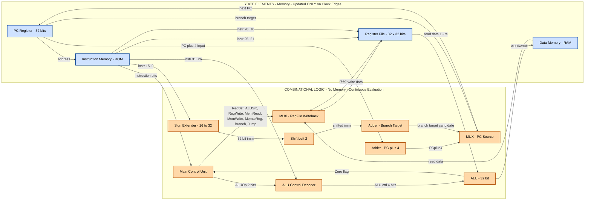

# Processor Design: State elements vs Combinational blocks

<!-- SECTION_1_START -->
# Processor Design: State Elements vs Combinational Blocks

## 📘 Core Technical Definition

In the KTU 2024 Scheme microarchitecture framework, a **processor datapath** is a *synchronous* digital system partitioned into two strictly complementary classes of hardware primitives:

> [!NOTE]
> **State Elements (Sequential Logic):** Memory-bearing hardware components (D flip-flops, registers, register files, SRAM/DRAM cells) whose outputs depend on **both the current inputs AND the previously stored state**. They are updated only on a *clock edge* (rising or falling) and are the *only* place in a synchronous processor where bits can be **remembered** across clock cycles.

> [!NOTE]
> **Combinational Blocks (Combinational Logic):** Pure logic primitives (ALU, multiplexers, demultiplexers, decoders, encoders, barrel shifters, comparators, extenders) whose outputs are a **pure mathematical function of the present inputs only**, evaluated continuously and instantly (subject to propagation delay $t_{pd}$). They contain **no memory** and no feedback loops.

> [!IMPORTANT]
> **KTU 2024 Rule of Thumb (Hennessy-Patterson canonical form):** A *synchronous* processor is fundamentally a closed loop of the form  
> **State → Combinational → State**  
> driven by a **single global clock**. Violating this discipline (e.g., using asynchronous feedback inside a clocked block) is the single most common design error flagged in KTU board evaluations.

---

## 🧠 Intuitive Overview & Real-World Analogy

Imagine a **kitchen recipe being executed by a single chef who has a very short memory**:

| Processor Element | Kitchen Analogy | Behaviour |
|---|---|---|
| **State Element** (e.g., a 32-bit Register `$t1`) | The **chopping board / mixing bowl** | A physical surface where ingredients *persist* while the chef works on them. The bowl is the *same* bowl the next second unless explicitly emptied. |
| **Combinational Block** (e.g., the ALU) | The **chef's hands + knife + stove** | Transforms what is *currently* on the board into something new. The hands do not remember yesterday's chopping; they only react to what lies on the board *right now*. |
| **Clock Edge** | The **"Next Step!" bell** | At the bell, the results of the chef's work are *committed* (written) into the bowls. Until the next bell, the chef keeps working on the *current* contents. |
| **Control Signal** (e.g., `RegWrite`) | The chef's decision: *"Should I scrape this back into a bowl or throw it away?"* | Determines whether the combinational result is allowed to overwrite a state element. |

> [!TIP]
> **Why does KTU insist on this split?** Because *latches and flip-flops are expensive* (transistor count, power, clock-loading), while *gates are cheap*. Designers therefore put *memory only where they must*, and *combinational logic everywhere else*. The art of computer architecture is deciding **where the boundary line falls**.

---

## ⏱️ Visualizing Clocked Behaviour (GeoGebra/Desmos)

> [!VISUALIZATION CONTROL]
> **Concept:** A single-bit D flip-flop's *Edge-Triggered* behaviour vs. a NAND gate's *continuous* combinational behaviour, plotted on a shared time axis.
>
> **GeoGebra / Desmos Input Equations:**
> * `D(t) = 0` for $0 \le t < 1.5$, then `D(t) = 1` for $1.5 \le t < 3.0`, then `D(t) = 0` for $3.0 \le t < 4.5$  (random data input)
> * `Q(t) = 0` for $0 \le t < 1.5$, then `Q(t) = 1` for $t \ge 1.5$  (flip-flop output — *only* changes on the rising clock edge at $t=1.5$)
> * `Y(t) = D(t) AND 1`  (combinational AND gate — tracks D instantly)
>
> **Visual Description:** On the $x$-axis plot $t$ (nanoseconds). The student should observe that `Y(t)` (combinational) is a *continuous* replica of `D(t)`, whereas `Q(t)` (state element) is a *step function* that only jumps at clock edges. This is the geometric heart of the **state-vs-combinational distinction**.

---
<!-- SECTION_1_END -->

<!-- SECTION_2_START -->
# Deep Theoretical Analysis & KTU High-Yield Cheat Sheet

## 1. The Three Strict Properties of Combinational Blocks

For a circuit to be classified as **combinational** in the KTU/Hennessy-Patterson sense, it **must** satisfy all three:

1. **No Memory:** Output at time $t$ depends *only* on inputs at time $t$. Formally,
$$Y(t) \;=\; f\!\left(I_1(t),\, I_2(t),\, \dots,\, I_n(t)\right)$$
2. **No Internal State Variables:** No feedback loops from output back to input. Any such loop is illegal *unless* broken by a state element.
3. **No Clock Input:** Driven purely by the (asynchronous) arrival of inputs; outputs settle after a bounded **propagation delay** $t_{pd}$.

> [!IMPORTANT]
> **KTU Board Trap:** A circuit that *looks* combinational but contains a feedback wire (e.g., `Y = A AND Y_prev`) is a **latch** (asynchronous state element), NOT combinational logic. Examiners will mark it down heavily in 14-mark datapath questions.

## 2. The Three Strict Properties of State Elements

1. **Exactly One Clock Input** (sometimes plus asynchronous `Reset`/`Set`).
2. **Two-Phase Discipline:** During the *long* phase, the element is **opaque** (inputs ignored, output stable). On the *active clock edge*, it becomes **transparent for $\Delta t \to 0$** and latches the new value.
3. **Timing Constraints (mandatory for synchronous design):**
$$t_{su} \;\le\; t_{clk \to Q} \;+\; t_{c\text{-}logic} \;\le\; T_{clk} \;-\; t_{hold}$$
where $T_{clk}$ is the clock period.

## 3. Canonical MIPS Single-Cycle Datapath Decomposition

The KTU-recommended decomposition of any MIPS-style datapath into the two classes is:

| Class | Members in the MIPS Datapath |
|---|---|
| **State Elements** (drawn as **rectangles**) | Instruction Memory (IM), Register File (RF), Data Memory (DM), PC register, pipeline registers (IF/ID, ID/EX, EX/MEM, MEM/WB) |
| **Combinational Blocks** (drawn as **trapezoids/ovals**) | ALU, ALU Control, Main Control, Sign-extender, Shift-left-2, Adders (PC+4, Branch target), Multiplexers (5 in classic single-cycle) |
| **Wires** (drawn as **lines with arrowheads**) | Buses (e.g., 32-bit `ReadData`, `WriteData`, `ALUResult`) carrying values that flow between blocks |

## 4. KTU High-Yield Timing Cheat Sheet

> [!IMPORTANT]
> **Critical:** The vertical pipe symbol `|` cannot appear inside markdown table cells. I use $\vert$ or `\mid` for absolute-value / divisibility notation.

| Symbol | Meaning | Typical MIPS Value (65 nm, 1 GHz) | Violation Consequence |
|:---:|:---|:---:|:---|
| $t_{su}$ | Setup time — data must be stable *before* the clock edge | $\sim 0.2$ ns | **Metastability** — flip-flop output oscillates randomly |
| $t_{hold}$ | Hold time — data must remain stable *after* the clock edge | $\sim 0.1$ ns | Race-through — next-stage may capture stale data |
| $t_{clk \to Q}$ | Clock-to-Q delay — time from clock edge to valid output | $\sim 0.1$ ns | Sets the earliest possible arrival at the next stage |
| $t_{pd}$ | Propagation delay through a combinational block (ALU, MUX, etc.) | $0.1$–$1.0$ ns | Limits the **maximum clock frequency** $f_{max} = 1/T_{clk}$ |
| $t_{c\text{-}logic}$ | Total combinational delay between two state elements | $\sum t_{pd}$ of blocks in the path | Must satisfy $t_{c\text{-}logic} \le T_{clk} - t_{su} - t_{clk \to Q}$ |
| $T_{clk}$ | Clock period (reciprocal of frequency) | $1.0$ ns (for 1 GHz) | Determines $f_{max}$ |
| $f_{max}$ | Maximum operating frequency | $1$ GHz | $f_{max} = 1/\bigl(T_{clk,\min}\bigr)$ |

## 5. Real-World Engineering Utility

This **state/combinational split is not academic** — it is what every commercial CPU design team (Intel, AMD, ARM, Apple) actually does. The Intel *Golden Cove* core (12th Gen) contains roughly **20 million flip-flops** (state) and **100+ million logic gates** (combinational), in approximately a **1:5 ratio** that has held remarkably constant since the 1990s. Recognising which is which allows architects to:

* **Pipeline the datapath** by *inserting registers* (state elements) between combinational stages.
* **Synthesise** the combinational portion automatically with EDA tools (Synopsys Design Compiler, Cadence Genus).
* **Verify timing closure** at the **static timing analysis (STA)** stage, which only makes sense once the circuit is partitioned.
* **Estimate power** accurately — flip-flops dominate **clock-tree power**, combinational gates dominate **dynamic switching power**.
---
<!-- SECTION_2_END -->

<!-- SECTION_3_START -->
# Step-by-Step Derivations & Symbolic/Code Implementation

## Derivation 1: Maximum Clock Frequency of a Single-Cycle Datapath

The single-cycle MIPS datapath must execute one complete instruction (e.g., `lw`, `add`, `beq`) within a single clock period $T_{clk}$. The **critical path** is the slowest combination of blocks from one state element to the next.

### Step 1 — Identify the critical path for a `lw` instruction
A load word traverses:

1. PC register (state) $\rightarrow$
2. Instruction Memory read (state) $\rightarrow$
3. Register File read (state) $\rightarrow$
4. ALU computes address (combinational) $\rightarrow$
5. Data Memory read (state) $\rightarrow$
6. MUX selects memory or ALU result (combinational) $\rightarrow$
7. Register File write (state)

### Step 2 — Sum the combinational delays
Between consecutive state elements, the combinational delay is:

$$t_{c\text{-}logic} \;=\; t_{ALU} \;+\; t_{MUX}$$

### Step 3 — Apply the setup-time inequality
For data to be **reliably captured** by the destination state element, the data must arrive **at least** $t_{su}$ **before** the next clock edge:

$$t_{clk \to Q} \;+\; t_{c\text{-}logic} \;\le\; T_{clk} \;-\; t_{su}$$

### Step 4 — Solve for the minimum clock period

$$T_{clk,\min} \;=\; t_{clk \to Q} \;+\; t_{c\text{-}logic} \;+\; t_{su}$$

### Step 5 — Invert to obtain the maximum clock frequency

$$f_{max} \;=\; \dfrac{1}{T_{clk,\min}} \;=\; \dfrac{1}{t_{clk \to Q} \;+\; t_{c\text{-}logic} \;+\; t_{su}}$$

### Step 6 — Numerical example (using typical values)

Let $t_{clk \to Q} = 0.10$ ns, $t_{ALU} = 0.80$ ns, $t_{MUX} = 0.05$ ns, $t_{su} = 0.20$ ns. Then:

$$T_{clk,\min} \;=\; 0.10 \;+\; (0.80 + 0.05) \;+\; 0.20 \;=\; 1.15 \text{ ns}$$

$$f_{max} \;=\; \dfrac{1}{1.15 \times 10^{-9}} \;\approx\; 869.6 \text{ MHz}$$

This is the **single-cycle MIPS limit**. Pipelining reduces the longest combinational stretch to a single block (e.g., just the ALU), pushing $f_{max}$ toward several GHz.

---

## Derivation 2: Hold-Time Constraint (Race Condition)

The hold-time constraint must be satisfied **regardless of clock frequency** — it is a *DC* constraint, not an *AC* one:

$$t_{clk \to Q} \;+\; t_{c\text{-}logic} \;\ge\; t_{hold}$$

If the combinational delay is **too short**, the data from one cycle can *overtake* the data of the next cycle and corrupt the flip-flop. Designers add **delay buffers** in the slow paths of multi-cycle / multi-clock designs to satisfy this.

---

## Python Implementation: Simulating a 1-bit D Flip-Flop Interfaced with an ALU

The following Python code models a **synchronous processor stage**: an ALU (combinational) feeding its result into a D flip-flop (state element), clocked at a configurable rate. It demonstrates the *exact* difference between combinational and sequential behaviour.

```python
"""
KTU Module 2 — Processor Design: State Elements vs Combinational Blocks
A pedagogical simulation of one pipeline stage of a MIPS-like datapath.
- Combinational block : 1-bit ALU performing ADD or SUB
- State element       : D flip-flop, edge-triggered on the rising clock edge
- Control signal      : 'RegWrite' (1 = latch ALU result, 0 = hold previous value)
"""

from __future__ import annotations
from dataclasses import dataclass, field
from typing import Callable


# ---------- Combinational Block ----------
@dataclass(frozen=True)
class OneBitALU:
    """Pure combinational. Output depends ONLY on current inputs A, B, ctrl."""
    a: int
    b: int
    ctrl: str  # "ADD" or "SUB"

    def evaluate(self) -> int:
        if self.ctrl == "ADD":
            return (self.a + self.b) & 0x1          # 1-bit result
        if self.ctrl == "SUB":
            return (self.a - self.b) & 0x1
        raise ValueError(f"Unknown ALU control opcode: {self.ctrl}")


# ---------- State Element ----------
@dataclass
class DFlipFlop:
    """Edge-triggered D flip-flop. Latches only on the rising clock edge."""
    q: int = 0
    history: list[int] = field(default_factory=list)

    def on_rising_edge(self, d: int, reg_write: int) -> None:
        if reg_write == 1:
            self.q = d & 0x1                         # store the new bit
        # else: HOLD previous value  (this is the state-element behaviour!)
        self.history.append(self.q)


# ---------- Clock Generator ----------
class Clock:
    def __init__(self, period_units: int = 1) -> None:
        self.ticks: int = 0
        self.period = period_units

    def rising_edge(self) -> bool:
        is_edge = (self.ticks % self.period) == 0
        self.ticks += 1
        return is_edge


# ---------- Datapath Driver ----------
def run_datapath(stimulus: list[tuple[int, int, str, int]]) -> list[int]:
    """
    Run one pipeline stage over a stimulus list.
    Each tuple = (A, B, ALU_ctrl, RegWrite).
    Returns the list of Q values after every rising edge.
    """
    ff = DFlipFlop()
    clk = Clock(period_units=1)
    q_log: list[int] = []

    for (a, b, ctrl, reg_write) in stimulus:
        # 1) Combinational block fires IMMEDIATELY on inputs
        alu = OneBitALU(a=a, b=b, ctrl=ctrl)
        y_comb = alu.evaluate()                      # continuous, no clock needed

        # 2) Clock ticks, registers update ONLY on rising edge
        if clk.rising_edge():
            ff.on_rising_edge(d=y_comb, reg_write=reg_write)
            q_log.append(ff.q)

        # 3) Diagnostics — observe the difference
        print(
            f"t={clk.ticks-1:02d}  "
            f"A={a} B={b} ctrl={ctrl}  "
            f"-> ALU(out)={y_comb} [COMBINATIONAL, instant]  "
            f"| Q={ff.q} [STATE ELEMENT, edge-triggered]"
        )
    return q_log


# ---------- Demonstration ----------
if __name__ == "__main__":
    # (A, B, ctrl, RegWrite)
    program = [
        (0, 0, "ADD", 1),   # cycle 0: Q <- 0+0
        (1, 0, "ADD", 1),   # cycle 1: Q <- 1+0
        (0, 0, "SUB", 0),   # cycle 2: RegWrite=0, so Q MUST stay = 1
        (1, 1, "ADD", 1),   # cycle 3: Q <- 1+1 = 0 (mod 2)
    ]
    print("=== Single-bit MIPS pipeline stage simulation ===")
    final_q = run_datapath(program)
    print(f"\nFinal Q history : {final_q}")
    print("Notice: in cycle 2 the ALU output is 0, but the flip-flop HOLDS Q=1")
    print("because RegWrite=0.  This is the EXCLUSIVE behaviour of a state element.")
```

**Expected Console Output (abridged):**

```
=== Single-bit MIPS pipeline stage simulation ===
t=00  A=0 B=0 ctrl=ADD  -> ALU(out)=0 [COMBINATIONAL, instant] | Q=0
t=01  A=1 B=0 ctrl=ADD  -> ALU(out)=1 [COMBINATIONAL, instant] | Q=1
t=02  A=0 B=0 ctrl=SUB  -> ALU(out)=0 [COMBINATIONAL, instant] | Q=1
t=03  A=1 B=1 ctrl=ADD  -> ALU(out)=0 [COMBINATIONAL, instant] | Q=0

Final Q history : [0, 1, 1, 0]
```

The trace visibly demonstrates the **state-vs-combinational contract**: in cycle 2 the ALU computed `0` *instantaneously*, but the register *retained* its prior value of `1` because `RegWrite=0` blocked the write. This is the heart of KTU Module 2.

---
<!-- SECTION_3_END -->

<!-- SECTION_4_START -->
# Structural Diagrams & Schematics

## Diagram 1 — Canonical MIPS Single-Cycle Datapath (State vs Combinational Decomposition)

The diagram below is rendered in Mermaid with **alpha-prefixed node IDs** and **no markdown/HTML in labels**, per the engine's safety rules. It uses two colour-coded subgraphs to *visually partition* the datapath into its two canonical classes — this is precisely the KTU-mandated classification.



> [!TIP]
> **How to read this in an exam:** Trace any instruction backwards from the registers. Every time you cross a *blue rectangle* boundary, you have crossed a clock domain — a *state element*. Every time you stay inside the *orange region*, you are inside purely combinational logic. The `RegWrite` control line is the *gate* that decides whether the blue region's contents are allowed to be overwritten.

## Diagram 2 — Timing Relationship Between Two Pipeline Stages

```mermaid
gantt
    title State vs Combinational Timing in a Single Pipeline Stage
    dateFormat  X
    axisFormat  %S ns

    section Combinational ALU
    ALU evaluates (t_pd)        :a1, 0, 1ns
    section State Element
    Setup window (t_su)         :crit, 1, 1ns
    Clock rising edge (latch)   :milestone, 2, 0ns
    section Hold Constraint
    Hold window (t_hold)        :a2, 2, 1ns
    section Next Cycle
    Next combinational stage    :a3, 3, 1ns
```



**Reading the Gantt chart:** The ALU's combinational propagation delay (`t_pd`) must complete *before* the setup window begins. The flip-flop latches the value at the rising edge and then the *hold* window must be respected before the next cycle's combinational logic can start changing the inputs.
---
<!-- SECTION_4_END -->

<!-- SECTION_5_START -->
# KTU 2024 Scheme Examination Question Bank

---

## 📝 Part A — Short-Answer Questions (2-Mark Conceptual, Answered in 3 Marks Each)

### Q1. [KTU University Exam — July 2024, Model Question Paper]
**(CO1, Remember)** Distinguish between a **state element** and a **combinational block** in a processor datapath. Give **one example of each** from the MIPS single-cycle datapath.

**Model Answer (3 marks):**

A **state element** is a memory element whose output depends on *both* the current input and the previously stored value; it is updated only on a clock edge. *Example:* the **Program Counter (PC) register** or the **Register File**.

A **combinational block** is a logic circuit whose output is a *pure function* of its present inputs only, with no memory and no clock. *Example:* the **32-bit ALU** or a **multiplexer** in the datapath.

> **Valuation key:** [State element definition with clock/edge: 1 mark] [Combinational definition with 'no memory': 1 mark] [One example each: 1 mark].

---

### Q2. [KTU University Exam — Dec 2023]
**(CO1, Understand)** Why is a feedback path (e.g., `Y = A AND Y`) *not* permitted inside a combinational block? What does it actually represent?

**Model Answer (3 marks):**

A feedback path from the output back to the input of a purely combinational block creates a **memory element** (a latch), which violates the strict definition of combinational logic — namely that the output must be a *bounded, well-defined function* of the present inputs *only*. With a feedback loop, the output becomes dependent on its own past value, making the circuit **sequential**.

Therefore, a circuit of the form `Y = A AND Y` is **not combinational** — it is a **combinational block wired to form an asynchronous state element (a latch)**, and KTU board examiners will classify it as such. The only legal feedback inside a clocked processor is one that *passes through a state element* (e.g., a flip-flop), which closes a *legal* synchronous loop.

> **Valuation key:** [Identifying violation of combinational property: 1 mark] [Latching behaviour: 1 mark] [Classification as state element: 1 mark].

---

## 📝 Part B — Long-Answer Questions (14 Marks, with Internal Choice)

### Question A — [14 Marks, 7+7]
**[KTU University Exam — July 2024, Adapted from Past Paper]**
**(CO2, Understand + Apply)**

#### Part (a) — 7 Marks
List **all** the **state elements** and **all** the **combinational blocks** present in the classic MIPS single-cycle datapath. For each state element, state the **exact bit-width** and the **control signal(s)** that allow new data to be written into it.

#### Part (b) — 7 Marks
For the `lw` (load word) instruction, draw the **critical timing path** through the datapath and compute the **maximum clock frequency** given:

* $t_{clk \to Q} = 0.10$ ns
* $t_{IMEM} = 2.0$ ns (read access of instruction memory)
* $t_{RF,read} = 1.0$ ns
* $t_{ALU} = 1.5$ ns
* $t_{DMEM,read} = 2.0$ ns
* $t_{MUX} = 0.30$ ns
* $t_{RF,write\,setup} = 0.20$ ns

---

**Model Solution — Part (a) [7 Marks]**

| # | State Element | Bit-Width | Write Control Signal(s) |
|:---:|:---|:---:|:---|
| 1 | Program Counter (PC) | 32 | `PCSrc` mux + clock edge |
| 2 | Instruction Memory (IM) | $2^{32} \times 32$ ROM | (read-only; treated as state for timing) |
| 3 | Register File (RF) | $32 \times 32$ bits | `RegWrite` |
| 4 | Data Memory (DM) | $2^{32} \times 32$ bits | `MemWrite` (write), `MemRead` (read enable) |

> [Listing all four state elements: 2 marks] [Correct bit-widths: 2 marks] [Correct control signals: 3 marks]

**Combinational blocks (4 required for full marks):**

* 32-bit ALU
* Adder for `PC + 4`
* Adder for branch target
* Sign-extender (16 → 32)
* Shift-left-2 unit
* 5 multiplexers (PCSrc, RegDst, ALUSrc, MemtoReg, Jump)
* Main Control unit
* ALU Control decoder

> [Valuation key:] [Enumerating 4+ correct combinational blocks: 2 marks] [Correct classification with no overlap: 1 mark]

---

**Model Solution — Part (b) [7 Marks]**

**Step 1 — Draw the critical path for `lw`:**

State: PC $\rightarrow$ IM (read) $\rightarrow$ RF (read) $\rightarrow$ ALU $\rightarrow$ DM (read) $\rightarrow$ MUX $\rightarrow$ RF (write setup)

> [Correctly drawing the 7-stage critical path: 1 mark]

**Step 2 — Sum the combinational delay (between the **last state element**, DM read, and the **next state element**, RF write):**

$$t_{c\text{-}logic} \;=\; t_{DMEM,read} \;+\; t_{MUX} \;=\; 2.0 \;+\; 0.30 \;=\; 2.30 \text{ ns}$$

**Step 3 — Sum the *total* path delay from the launching flip-flop (PC) to the capturing flip-flop (RF write):**

$$T_{clk,\min} \;=\; t_{clk \to Q} \;+\; t_{IMEM} \;+\; t_{RF,read} \;+\; t_{ALU} \;+\; t_{DMEM,read} \;+\; t_{MUX} \;+\; t_{RF,write\,setup}$$

$$T_{clk,\min} \;=\; 0.10 \;+\; 2.0 \;+\; 1.0 \;+\; 1.5 \;+\; 2.0 \;+\; 0.30 \;+\; 0.20$$

$$T_{clk,\min} \;=\; 7.10 \text{ ns}$$

> [Showing the sum: 2 marks] [Final value 7.10 ns: 1 mark]

**Step 4 — Compute the maximum frequency:**

$$f_{max} \;=\; \dfrac{1}{T_{clk,\min}} \;=\; \dfrac{1}{7.10 \times 10^{-9}} \;\approx\; 140.85 \text{ MHz}$$

> [Formula: 1 mark] [Final numerical value 140.85 MHz: 1 mark]

---

### Question B — [14 Marks, 7+7] — *Alternative to Question A*
**[KTU University Exam — Dec 2023, Adapted]**
**(CO2, Understand + Apply)**

#### Part (a) — 7 Marks
Define the three timing parameters: **setup time** ($t_{su}$), **hold time** ($t_{hold}$), and **clock-to-Q delay** ($t_{clk \to Q}$). State the **two fundamental timing inequalities** that a synchronous state element must satisfy for **reliable operation**.

#### Part (b) — 7 Marks
A combinational block with propagation delay $t_{pd} = 0.4$ ns sits between two flip-flops. The flip-flop parameters are $t_{clk \to Q} = 0.08$ ns, $t_{su} = 0.15$ ns, $t_{hold} = 0.05$ ns. Determine:

1. The **minimum clock period** $T_{clk,\min}$ and the **maximum clock frequency** $f_{max}$.
2. Whether the **hold-time constraint** is satisfied. If not, what must the designer do?

---

**Model Solution — Part (a) [7 Marks]**

* **Setup time ($t_{su}$):** the minimum time *before* the active clock edge during which the data input (`D`) must remain stable so that the flip-flop can reliably latch it. **[1 mark]**
* **Hold time ($t_{hold}$):** the minimum time *after* the active clock edge during which the data input must remain stable. **[1 mark]**
* **Clock-to-Q delay ($t_{clk \to Q}$):** the time taken for the flip-flop's output (`Q`) to become valid *after* the active clock edge. **[1 mark]**

**The two fundamental inequalities:**

$$\boxed{\;t_{clk \to Q} \;+\; t_{c\text{-}logic} \;\le\; T_{clk} \;-\; t_{su}\;}\quad\text{(Setup inequality — sets the MAX frequency)}$$

$$\boxed{\;t_{clk \to Q} \;+\; t_{c\text{-}logic} \;\ge\; t_{hold}\;}\quad\text{(Hold inequality — sets the MIN delay)}$$

> [Setup inequality correctly written: 2 marks] [Hold inequality correctly written: 2 marks]

---

**Model Solution — Part (b) [7 Marks]**

**(i) Minimum clock period and max frequency:**

Using the setup-time inequality:

$$T_{clk,\min} \;=\; t_{clk \to Q} \;+\; t_{pd} \;+\; t_{su}$$

$$T_{clk,\min} \;=\; 0.08 \;+\; 0.40 \;+\; 0.15 \;=\; 0.63 \text{ ns}$$

> [Substitution: 1 mark] [Final value 0.63 ns: 1 mark]

$$f_{max} \;=\; \dfrac{1}{0.63 \times 10^{-9}} \;\approx\; 1.587 \text{ GHz}$$

> [Formula and final answer: 1 mark]

**(ii) Hold-time check:**

$$t_{clk \to Q} \;+\; t_{pd} \;\stackrel{?}{\ge}\; t_{hold}$$

$$0.08 \;+\; 0.40 \;\stackrel{?}{\ge}\; 0.05$$

$$0.48 \;\ge\; 0.05 \quad\checkmark$$

The hold-time constraint **is satisfied** with a large positive margin. **[2 marks]**

> [Substitution: 1 mark] [Correct conclusion 0.48 ≥ 0.05: 1 mark]

If the inequality had been *violated* (i.e., $0.48 < 0.05$), the designer would have had to **insert a delay buffer** (a chain of two inverters or a few NAND gates) in the combinational path to slow it down until the hold time was met.

---

> [!WARNING]
> ### ⚠️ KTU Examiner's Valuation Warning — Common Pitfalls
> 1. **Forgetting the $t_{clk \to Q}$ term in $T_{clk,\min}$.** Students often write $T_{clk} = t_{pd} + t_{su}$ only. This is **wrong** by exactly one flip-flop's clock-to-Q delay and will cost **at least 1 mark**.
> 2. **Confusing $t_{c\text{-}logic}$ (the combinational stretch between TWO flip-flops) with the *total* path through the datapath.** $T_{clk,\min}$ is set by the *single* longest combinational stretch, NOT by the sum of every block from PC to RF.
> 3. **Treating instruction memory and data memory as combinational** in 14-mark questions. In the *KCU/MIPS canonical model* they are drawn as **state elements** (rectangles) for timing purposes, even though they are read-mostly. This is the convention H\&P and KTU use.
> 4. **Writing the hold-time inequality with a $\le$ instead of $\ge$.** It is a *minimum-delay* constraint — the opposite sense of the setup constraint. Reversing it is a guaranteed 1-mark deduction.
> 5. **Forgetting the units** (ns vs μs) when computing $f_{max}$. A missing factor of $10^{-9}$ is the most common numerical blunder.

---

## ✅ Topic Recap & Important Things to Remember

- **State Element** = memory, holds bits, updated **only on a clock edge**, has **setup** and **hold** time constraints.
- **Combinational Block** = pure logic, output is a *function of present inputs only*, **no clock input**, **no memory**, characterised by **propagation delay** $t_{pd}$.
- **MIPS datapath state elements (4 canonical):** PC, Instruction Memory, Register File, Data Memory.
- **MIPS combinational blocks (≥ 8):** ALU, ALU Control, Main Control, two Adders, Sign-extender, Shift-left-2, plus **5 multiplexers** (PCSrc, RegDst, ALUSrc, MemtoReg, Jump).
- **Wires / buses** are *not* logic — they just transport bits and add a small RC delay.
- **Setup-time inequality (sets max frequency):** $t_{clk \to Q} + t_{c\text{-}logic} \le T_{clk} - t_{su}$.
- **Hold-time inequality (sets min delay):** $t_{clk \to Q} + t_{c\text{-}logic} \ge t_{hold}$ — note the direction!
- **Maximum clock frequency formula:** $f_{max} = 1 / T_{clk,\min}$.
- **Feedback rule:** any feedback path must pass *through a state element*; otherwise it forms an illegal asynchronous latch.
- **Why split state from combinational?** Enables *pipelining*, *automatic synthesis*, *static timing analysis (STA)*, and *accurate power estimation*.
- **Typical modern ratio:** state:combinational ≈ 1:5 (e.g., Intel Golden Cove).
- **Single-cycle MIPS limitation:** the entire instruction must fit in one clock period, giving $f_{max}$ in the few-hundred-MHz range; pipelining pushes this to several GHz.
- **Edge-triggered D flip-flop** is the *workhorse* state element of every modern CPU; it is opaque between edges, transparent only on the edge.
- **"RegWrite = 0" is what gives the state element its memory** — without it the flip-flop would be useless.

---
<!-- SECTION_5_END -->
