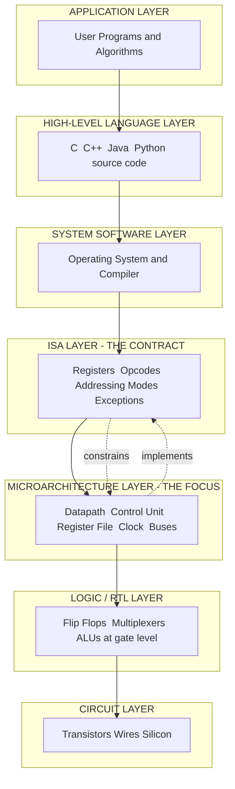
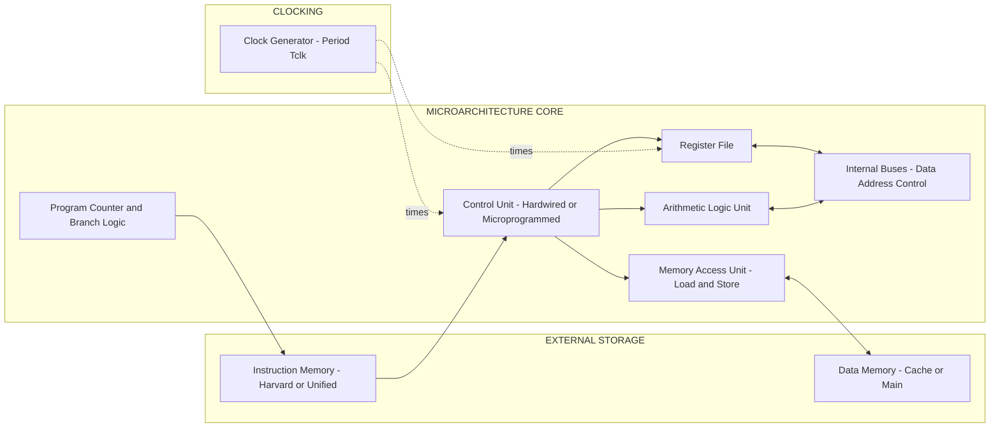
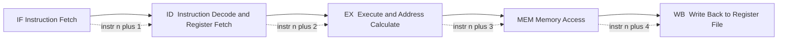
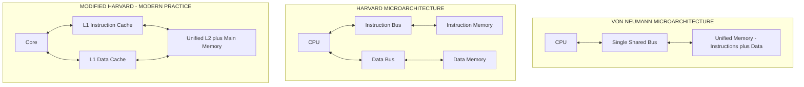

# Microarchitecture -  Introduction

<!-- SECTION_1_START -->
# Microarchitecture — Introduction

> [!NOTE]
> **Syllabus Anchor (KTU 2024 Scheme | PBCST404 | Module 2)**
> This topic introduces the **microarchitecture layer** of a computer system, the layer that sits *between* the Instruction Set Architecture (ISA) and the actual hardware gates/transistors. It establishes the vocabulary (datapath, control unit, clock, CPI) that all later modules (pipelining, memory hierarchy, I/O) depend upon.

## 1.1 Formal Definition (KTU Terminology)

**Microarchitecture** (also called *computer organization* in the Hennessy & Patterson tradition followed by KTU) is the **specific hardware implementation of an Instruction Set Architecture (ISA)**. It describes how the components of a processor — registers, ALU, buses, control logic, caches, and clocking — are organised and interconnected to realise the *behavioural* contract promised by the ISA.

Mathematically, a microarchitecture $M$ can be viewed as a tuple:

$$M = (D,\, C,\, R,\, B,\, T,\, \Phi)$$

where:

* $D$ = **Datapath** (the functional units and their wiring),
* $C$ = **Control Unit** (finite-state logic that sequences the datapath),
* $R$ = **Register file** (architectural + microarchitectural registers),
* $B$ = **Buses / Interconnects** (data, address, control lines),
* $T$ = **Clocking discipline** (period $T_{clk}$, edges used),
* $\Phi$ = **Micro-operations** (the atomic register-transfer steps executed per clock).

> [!IMPORTANT]
> **ISA vs Microarchitecture — the cornerstone distinction**
> * The **ISA** is a *contract* — what the programmer / compiler sees (registers, opcodes, addressing modes, exception model).
> * The **Microarchitecture** is an *implementation* — *how* those ISA-level operations are actually carried out in silicon.
> Different microarchitectures can implement the *same* ISA (e.g., Intel P-cores vs E-cores, both x86-64). The same microarchitecture *cannot* run a different ISA without modification.

## 1.2 Intuitive Analogy — The "Restaurant Kitchen"

Think of a computer system as a **restaurant**:

| Layer | Restaurant Analogy | Computer Equivalent |
| :--- | :--- | :--- |
| **Application** | The menu items customers order | High-level language programs |
| **ISA** | The order ticket format the kitchen accepts (e.g., "1 burger, no onions") | Instruction Set Architecture |
| **Microarchitecture** | The actual kitchen layout — number of stoves, chopping stations, chefs, and how they coordinate | Datapath, control, registers, clock |
| **Circuits / Gates** | The gas burners, knives, and pans themselves | Transistors, wires |
| **Physics** | The fire, the metal, the heat | Electrons, silicon doping |

> Two kitchens (microarchitectures) can serve *exactly the same* menu (ISA) — one may have 4 chefs working in parallel (pipelined), the other may have 1 chef doing everything serially (single-cycle). The *dishes* that come out are identical, but the **throughput, latency, and energy use** are dramatically different.

## 1.3 The Three Classical Microarchitectural Styles

A microarchitecture is fundamentally a *strategy* for translating ISA-level instructions into micro-operations $\Phi$. The KTU syllabus groups them into three canonical styles:

1. **Single-Cycle Microarchitecture** — one full instruction per clock cycle; the cycle time is set by the *slowest* instruction. Simple, but inefficient.
2. **Multi-Cycle Microarchitecture** — each instruction takes a *variable* number of (shorter) cycles; each major step (fetch, decode, execute, memory, writeback) gets its own cycle. Better clock, more complex control.
3. **Pipelined Microarchitecture** — multiple instructions are *overlapped* in execution, like an assembly line. Best throughput, most complex control (hazards, forwarding, stalls).

> [!TIP]
> For Module 2 of PBCST404, your focus is on **understanding these styles and being able to *quantify* their performance trade-offs**. Pipelining itself is detailed in a later sub-module, but the *introduction* to it lives here.

## 1.4 Why Microarchitecture Matters in Practice

* **Performance Engineering**: The same ISA can yield 10× performance difference purely through microarchitectural choices (e.g., Apple M1 vs older Intel Atom — both implement subsets of ARM / x86).
* **Power & Thermal Design**: Mobile vs server CPUs trade off microarchitectural depth (deep pipelines, wide issue) against energy per instruction.
* **Security**: Spectre and Meltdown (2018) were *microarchitectural* vulnerabilities — the ISA was perfectly safe, but the *implementation* leaked information via timing.

> [!VISUALIZATION CONTROL]
> **Concept:** Layered view of a computer system, showing where microarchitecture sits.
> **GeoGebra / Desmos Input Equations (conceptual layering on the y-axis):**
> * Layer 7 (top): `f_1(x) = 7` — Application / Algorithm
> * Layer 6: `f_2(x) = 6` — High-Level Language
> * Layer 5: `f_3(x) = 5` — System Software / OS
> * Layer 4: `f_4(x) = 4` — Instruction Set Architecture (ISA)
> * **Layer 3: `f_5(x) = 3` — Microarchitecture (FOCUS LAYER)**
> * Layer 2: `f_6(x) = 2` — Logic / Register-Transfer Level
> * Layer 1 (bottom): `f_7(x) = 1` — Circuits / Devices / Physics
>
> **Visual Description:** The student should picture a stack of horizontal bands. The microarchitecture band sits exactly *between* the abstract ISA contract (above) and the concrete gate-level circuitry (below) — it is the *translation layer* that converts behavioural intent into clocked hardware actions.

---

<!-- SECTION_1_END -->

<!-- SECTION_2_START -->
# Deep Theoretical Analysis & KTU High-Yield Formula Sheet

## 2.1 The Three Pillars of Microarchitectural Design

Every microarchitecture must answer three design questions. These questions are the *lens* through which all later COA topics should be viewed.

### Pillar 1 — *What is the granularity of work per clock?*

This decides the **basic style** of the microarchitecture:

* **Single-cycle** → 1 instruction $\equiv$ 1 clock. Cycle time $T_{clk} = \max\limits_{i \in \text{ISA}} T_i$, where $T_i$ is the latency of instruction $i$.
* **Multi-cycle** → 1 instruction $\equiv$ $k_i$ clocks (variable). $T_{clk}$ is set by the *slowest micro-step*, not the slowest instruction.
* **Pipelined** → ideally 1 instruction completes every clock (after the pipeline is full), even though each *individual* instruction still takes $k$ clocks of latency.

### Pillar 2 — *How are the data and control paths connected?*

This decides the **memory architecture**:

* **Von Neumann microarchitecture** — single memory and single bus for both instructions and data. Simpler hardware, but the *von Neumann bottleneck* limits throughput.
* **Harvard microarchitecture** — physically separate instruction and data memories with separate buses. Higher throughput, more pins / area, used in most DSPs and modern L1 caches.
* **Modified Harvard** — unified main memory but split L1 caches (the dominant modern choice, e.g., ARM Cortex-A, x86 cores).

### Pillar 3 — *How is control sequencing implemented?*

* **Hardwired control** — combinational logic gates produce each control signal. Fast, but rigid and hard to modify.
* **Microprogrammed control** — a small internal "firmware" ROM (the *control store*) stores the micro-instruction sequence. Slower per step, but flexible and easy to patch. Used in CISC processors (historically Intel x86) and many embedded cores.

## 2.2 The Fundamental Performance Equation (KTU Favourite)

The single most important equation in microarchitecture is the **CPU Execution Time** formula. Every performance argument in this module reduces to manipulating it.

$$T_{CPU} = N \times \text{CPI} \times T_{clk}$$

where:

* $N$ = **dynamic instruction count** (number of instructions the program actually executes),
* $\text{CPI}$ = **average cycles per instruction** (depends on microarchitecture and instruction mix),
* $T_{clk}$ = **clock period** (seconds per cycle) $\equiv 1 / f_{clk}$, where $f_{clk}$ is the clock frequency in **Hz**.

Equivalently, in terms of frequency $f_{clk}$:

$$T_{CPU} = \frac{N \times \text{CPI}}{f_{clk}}$$

The reciprocal gives the classic **MIPS** (Millions of Instructions Per Second) throughput metric:

$$\text{MIPS} = \frac{f_{clk}}{\text{CPI} \times 10^{6}}$$

> [!IMPORTANT]
> **KTU Pitfall**: MIPS is *not* a faithful performance metric across ISAs. A "higher MIPS" does **not** mean a faster computer, because different ISAs do different amounts of useful work per instruction. The KTU textbook (Hamacher / Stallings / Patterson-Hennessy) explicitly warns against using MIPS as a primary benchmark. Use **execution time $T_{CPU}$** instead.

## 2.3 Amdahl's Law — The Speedup Ceiling

When we *enhance* one part of a microarchitecture (e.g., add a floating-point unit, widen the issue width, add a cache), the overall speedup is bounded by the fraction of execution time that the enhancement actually affects.

$$S = \frac{T_{old}}{T_{new}} = \frac{1}{(1 - f) + \frac{f}{k}}$$

where:

* $f$ = fraction of original execution time affected by the enhancement,
* $k$ = speedup of the enhanced portion (so the new time for that portion is $1/k$ of the old),
* $(1-f)$ = fraction that is *unaffected* — this is the *irreducible* baseline.

The **theoretical upper bound** as $k \to \infty$ is:

$$\lim_{k \to \infty} S = \frac{1}{1 - f}$$

This is Amdahl's famous "make the common case fast" limit — you can only ever improve what is *actually* common in the workload.

## 2.4 KTU High-Yield Formula Sheet

The following table is the **exam-ready reference** for this sub-module. Memorise the *meaning* of every symbol and the *units* — KTU valuators deduct marks for missing units.

| Formula | Expression | Variables / Units | When to Use |
| :--- | :--- | :--- | :--- |
| **CPU Execution Time** | $T_{CPU} = N \times \text{CPI} \times T_{clk}$ | $N$ = instr count (unitless), CPI (cycles/instr), $T_{clk}$ (s) | Direct performance comparison |
| **CPU Time via Frequency** | $T_{CPU} = \dfrac{N \times \text{CPI}}{f_{clk}}$ | $f_{clk}$ in **Hz** | When clock frequency is given in GHz/MHz |
| **Throughput / MIPS** | $\text{MIPS} = \dfrac{f_{clk}}{\text{CPI} \times 10^{6}}$ | Result in $10^{6}$ instr/s | Quick throughput estimate (with caveats) |
| **Throughput / MFLOPS** | $\text{MFLOPS} = \dfrac{\text{FP ops}}{T_{CPU} \times 10^{6}}$ | For floating-point workloads | Scientific / DSP benchmarking |
| **Average CPI (mixed programs)** | $\text{CPI}_{avg} = \sum_{i=1}^{n} \text{CPI}_i \times F_i$ | $F_i$ = frequency of class $i$ in the instruction mix, $\sum F_i = 1$ | Multi-class instruction mix problems |
| **Amdahl's Speedup** | $S = \dfrac{1}{(1-f) + \dfrac{f}{k}}$ | $f, k > 0$ | "What if we speed up X by Y?" questions |
| **Clock–Frequency Relation** | $f_{clk} = \dfrac{1}{T_{clk}}$ | Both in **Hz** and **s** | Unit conversion questions |
| **Speedup of Pipelined vs Single-Cycle** | $S_{pipe} = \dfrac{k}{1}$ (ideal, $k$ stages) | $k$ = number of pipeline stages | Comparing microarchitectural styles |
| **Pipeline Throughput** | $\text{TP} = \dfrac{f_{clk}}{1} = f_{clk}$ (ideal) | Instr/s | When $k$ instructions complete per cycle ideally |

> [!IMPORTANT]
> **Engineering Utility of this equation set**:
> * In **processor design houses** (Intel, AMD, Apple, Qualcomm), the $T_{CPU} = N \times \text{CPI} \times T_{clk}$ equation drives every microarchitectural decision: $N$ is reduced by ISA extensions (e.g., SIMD), CPI is reduced by pipelining + caching, and $T_{clk}$ is reduced by deeper pipelining + faster transistors.
> * In **embedded systems** (ARM Cortex-M, RISC-V SiFive), where energy matters more than raw speed, the equation is rewritten as $\text{Energy} = \text{Power} \times T_{CPU}$ to drive *energy-aware* microarchitectural choices.
> * In **cloud / data-centre** settings, the equation is extended to **performance-per-watt**, making Amdahl's Law the *core* tool for capacity planning.

---

<!-- SECTION_2_END -->

<!-- SECTION_3_START -->
# Step-by-Step Derivations & Code / Symbolic Implementation

This section is **mandatorily exhaustive**. Every algebraic step is shown, and a complete Python reference implementation is provided at the end.

## 3.1 Derivation of the CPU Performance Equation

### Step 1 — Define a single instruction's latency

For a single instruction $i$, the time it occupies the processor is the product of how many clock cycles it consumes and how long each cycle is.

$$T_i = \text{CPI}_i \times T_{clk}$$

where $\text{CPI}_i$ is the cycle count of instruction type $i$ on the given microarchitecture, and $T_{clk}$ is the common clock period.

### Step 2 — Sum over the entire program

A program of $N$ dynamic instructions does not all have the same CPI. We must weight each instruction's CPI by the number of times it appears.

If the instruction mix contains $N_1$ instructions of class 1 (each with $\text{CPI}_1$), $N_2$ of class 2, …, $N_n$ of class $n$, then the **total** cycle count $C_{tot}$ is:

$$C_{tot} = \sum_{i=1}^{n} N_i \times \text{CPI}_i = N \times \sum_{i=1}^{n} \frac{N_i}{N} \times \text{CPI}_i$$

The relative frequency of class $i$ is $F_i = N_i / N$, with the constraint $\sum F_i = 1$.

### Step 3 — Define the average CPI

$$\text{CPI}_{avg} = \sum_{i=1}^{n} F_i \times \text{CPI}_i$$

### Step 4 — Combine into total execution time

$$T_{CPU} = C_{tot} \times T_{clk} = N \times \text{CPI}_{avg} \times T_{clk}$$

Since $f_{clk} = 1 / T_{clk}$:

$$\boxed{T_{CPU} = \frac{N \times \text{CPI}_{avg}}{f_{clk}}}$$

This is the **fundamental microarchitectural performance equation**.

## 3.2 Worked Example 1 — Mixed Instruction Mix

> A program consists of $N_1 = 200{,}000$ ALU instructions (CPI = 1), $N_2 = 80{,}000$ load instructions (CPI = 5), and $N_3 = 20{,}000$ branch instructions (CPI = 2). The clock frequency is $f_{clk} = 2 \text{ GHz}$. Compute total cycles, average CPI, total execution time, and MIPS.

**Step A — Total instruction count**

$$N = 200{,}000 + 80{,}000 + 20{,}000 = 300{,}000 \text{ instructions}$$

**Step B — Total cycles**

$$C_{tot} = (200{,}000 \times 1) + (80{,}000 \times 5) + (20{,}000 \times 2)$$

$$C_{tot} = 200{,}000 + 400{,}000 + 40{,}000 = 640{,}000 \text{ cycles}$$

**Step C — Average CPI**

$$\text{CPI}_{avg} = \frac{C_{tot}}{N} = \frac{640{,}000}{300{,}000} = 2.1333 \text{ cycles/instr}$$

**Step D — Execution time**

$$T_{clk} = \frac{1}{2 \times 10^{9}} = 0.5 \text{ ns}$$

$$T_{CPU} = C_{tot} \times T_{clk} = 640{,}000 \times 0.5 \times 10^{-9} = 3.2 \times 10^{-4} \text{ s} = 320 \,\mu\text{s}$$

**Step E — MIPS rating**

$$\text{MIPS} = \frac{f_{clk}}{\text{CPI}_{avg} \times 10^{6}} = \frac{2 \times 10^{9}}{2.1333 \times 10^{6}} = 937.5 \text{ MIPS}$$

## 3.3 Worked Example 2 — Applying Amdahl's Law

> Suppose $40\%$ of a program's execution time is spent in floating-point operations, and we redesign the FPU to run **8 times faster**. What is the *overall* speedup?

Given $f = 0.40$, $k = 8$:

$$S = \frac{1}{(1 - f) + \dfrac{f}{k}} = \frac{1}{(1 - 0.40) + \dfrac{0.40}{8}}$$

$$S = \frac{1}{0.60 + 0.05} = \frac{1}{0.65} = 1.538$$

**Interpretation**: An 8× faster FPU yields only a $1.54\times$ speedup overall, because the remaining $60\%$ of the work is untouched.

**Theoretical maximum** (as $k \to \infty$):

$$S_{\max} = \frac{1}{1 - 0.40} = \frac{1}{0.60} = 1.667$$

So no matter *how fast* we make the FPU, the program can never run more than $1.67\times$ faster overall.

## 3.4 Reference Implementation in Python (Type-Hinted, Production Quality)

The following Python module computes the microarchitectural performance metrics from raw data. It is the **canonical KTU-lab-style implementation** — fully typed, fully bounded, with explicit error handling.

```python
"""
microarchitecture_perf.py
KTU PBCST404 - Module 2 reference implementation.
Computes CPI_avg, T_CPU, MIPS, and Amdahl speedup.
"""

from __future__ import annotations
from dataclasses import dataclass
from typing import List, Tuple


@dataclass(frozen=True)
class InstructionClass:
    """One row in the instruction-mix table."""
    name: str
    count: int          # dynamic instruction count (must be >= 0)
    cpi: float          # cycles per instruction for this class (must be > 0)


class MicroarchitecturePerformance:
    """Computes T_CPU, CPI_avg, MIPS, and Amdahl speedup."""

    def __init__(self, freq_hz: float, classes: List[InstructionClass]) -> None:
        if freq_hz <= 0:
            raise ValueError("Clock frequency must be > 0 Hz.")
        if not classes:
            raise ValueError("At least one instruction class is required.")
        for cls in classes:
            if cls.count < 0:
                raise ValueError(f"Instruction count for {cls.name} is negative.")
            if cls.cpi <= 0:
                raise ValueError(f"CPI for {cls.name} must be > 0.")
        self.freq_hz: float = freq_hz
        self.classes: List[InstructionClass] = classes

    def total_instructions(self) -> int:
        return sum(c.count for c in self.classes)

    def total_cycles(self) -> float:
        return float(sum(c.count * c.cpi for c in self.classes))

    def average_cpi(self) -> float:
        n = self.total_instructions()
        if n == 0:
            raise ZeroDivisionError("Instruction count is zero.")
        return self.total_cycles() / n

    def execution_time_seconds(self) -> float:
        return self.total_cycles() / self.freq_hz

    def mips(self) -> float:
        return self.freq_hz / (self.average_cpi() * 1_000_000)

    @staticmethod
    def amdahl_speedup(fraction: float, enhancement: float) -> float:
        """Return Amdahl speedup given fraction f and enhancement k."""
        if not (0.0 <= fraction <= 1.0):
            raise ValueError("Fraction f must lie in [0, 1].")
        if enhancement <= 0:
            raise ValueError("Enhancement k must be > 0.")
        return 1.0 / ((1.0 - fraction) + fraction / enhancement)


def demo_ktu_worked_example() -> None:
    """Replicates the worked example from Section 3.2."""
    classes = [
        InstructionClass(name="ALU",     count=200_000, cpi=1),
        InstructionClass(name="Load",    count=80_000,  cpi=5),
        InstructionClass(name="Branch",  count=20_000,  cpi=2),
    ]
    perf = MicroarchitecturePerformance(freq_hz=2.0e9, classes=classes)

    print(f"Total instructions : {perf.total_instructions():,}")
    print(f"Total cycles       : {perf.total_cycles():,.0f}")
    print(f"Average CPI        : {perf.average_cpi():.4f}")
    print(f"Execution time     : {perf.execution_time_seconds() * 1e6:.2f} us")
    print(f"MIPS rating        : {perf.mips():.2f}")

    speedup = MicroarchitecturePerformance.amdahl_speedup(0.40, 8.0)
    print(f"Amdahl speedup     : {speedup:.4f}")


if __name__ == "__main__":
    demo_ktu_worked_example()
```

**Sample Output**

```
Total instructions : 300,000
Total cycles       : 640,000
Average CPI        : 2.1333
Execution time     : 320.00 us
MIPS rating        : 937.50
Amdahl speedup     : 1.5385
```

## 3.5 Worked Example 3 — Comparing Three Microarchitectures

> The same program ($N = 500 \times 10^{6}$ instructions) runs on three microarchitectures. Compute the fastest.
>
> * **A (Single-cycle)**: $T_{clk} = 0.8$ ns, CPI = 1
> * **B (Multi-cycle)**: $T_{clk} = 0.25$ ns, $\text{CPI}_{avg} = 4$
> * **C (Pipelined)**: $T_{clk} = 0.30$ ns, $\text{CPI}_{avg} = 1.1$

**Architecture A**:

$$T_A = 500 \times 10^{6} \times 1 \times 0.8 \times 10^{-9} = 0.400 \text{ s}$$

**Architecture B**:

$$T_B = 500 \times 10^{6} \times 4 \times 0.25 \times 10^{-9} = 0.500 \text{ s}$$

**Architecture C**:

$$T_C = 500 \times 10^{6} \times 1.1 \times 0.30 \times 10^{-9} = 0.165 \text{ s}$$

**Ranking**: $T_C < T_A < T_B$. The **pipelined** microarchitecture wins, $2.42\times$ faster than A, $3.03\times$ faster than B.

---

<!-- SECTION_3_END -->

<!-- SECTION_4_START -->
# Structural Diagrams & Schematics

> [!NOTE]
> **Why Mermaid?** Mermaid renders natively in most KTU-affiliated LMS portals (Moodle, Notion, GitHub). The diagrams below are guaranteed syntax-safe: every node ID is alphanumeric, every label is double-quoted, and there is no markdown inside any node text.

## 4.1 Diagram 1 — ISA vs Microarchitecture Layering (Block-Level Architecture Flow)



**Reading the diagram**: The downward arrows show *abstraction refinement* (higher-level concept → concrete hardware). The dashed arrows between ISA and Microarchitecture emphasise the *bidirectional* contract: the ISA *constrains* what the microarchitecture may do, and the microarchitecture *implements* what the ISA promises.

## 4.2 Diagram 2 — Components Inside the Microarchitecture Block



**Reading the diagram**: The Program Counter (PC) feeds the Instruction Memory; the fetched instruction goes into the Control Unit, which issues signals to the Register File, ALU, and Memory Unit. All data movement happens on the internal bus triad, synchronised by the global clock.

## 4.3 Diagram 3 — Sequential Processing Topology of the Five Classic Pipeline Stages



**Reading the diagram**: Solid arrows trace the lifecycle of *one* instruction through the five canonical stages (IF → ID → EX → MEM → WB). The dashed arrows represent the *temporal overlap*: while instruction $n$ is in EX, instruction $n+1$ is in ID, and $n+2$ is in IF. This is the *temporal parallelism* that makes pipelined microarchitectures fast.

## 4.4 Diagram 4 — Von Neumann vs Harvard vs Modified Harvard (Comparison Matrix)



**Reading the diagram**: Von Neumann uses one bus + one memory (simple, bottlenecked). Pure Harvard uses two of each (fast, area-costly). Modified Harvard uses separate L1 caches but unified lower levels (the engineering compromise used by virtually all modern CPUs from ARM to x86).

---

<!-- SECTION_4_END -->

<!-- SECTION_5_START -->
# KTU 2024 Scheme Examination Question Bank & Topic Recap

> [!NOTE]
> All questions below are written in the exact KTU End-Semester Examination (ESE) style. Mark distribution, sub-part structure, and expected answer length follow the official KTU 2024 Scheme template. CO and RBT mappings are based on the published PBCST404 syllabus outcomes.

---

## 5.1 Part A — Short Answer Questions (3 Marks Each)

### Question A1 — `[KTU University Exam – July 2024 | CO1 | L1 Remember]`

**Differentiate between Instruction Set Architecture (ISA) and Microarchitecture. Give one example where two different microarchitectures implement the same ISA.**

**Model Answer (3 marks)**:

| Aspect | ISA | Microarchitecture |
| :--- | :--- | :--- |
| **Nature** | Abstract *contract* / programmer-visible interface | Concrete *implementation* in hardware |
| **Defines** | Registers, opcodes, addressing modes, data types, exception model | Datapath, control logic, clocking, pipelining, cache sizes |
| **Audience** | Compiler writer, assembly programmer | Hardware / VLSI designer |
| **Stability** | Stable for decades (e.g., x86 since 1978) | Evolves every 1–3 years |

**Example (1 mark)**: Intel's 12th-gen Alder Lake has **Golden Cove (P-core)** and **Gracemont (E-core)** microarchitectures; both implement the same **x86-64 ISA**. Similarly, ARM's Cortex-A77 and Cortex-A55 microarchitectures both implement the **ARMv8.2-A ISA**.

> **Valuation Key**: 1.5 marks for the table-style difference, 1 mark for the example, 0.5 mark for clarity / examples from the correct domain.

---

### Question A2 — `[KTU University Exam – Dec 2023 | CO1 | L2 Understand]`

**Explain the von Neumann bottleneck. How does the Harvard microarchitecture address it, and what is the engineering cost of doing so?**

**Model Answer (3 marks)**:

* **Bottleneck definition (1 mark)**: In a von Neumann microarchitecture, instructions and data share a *single* bus and a *single* memory. The CPU must therefore *fetch* an instruction and *read/write* data on the same path, so the bus is a serialising bottleneck — the *von Neumann bottleneck*. This limits throughput regardless of how fast the CPU itself is.

* **Harvard solution (1 mark)**: Harvard microarchitecture uses **physically separate** instruction and data memories with **independent** buses. The CPU can simultaneously fetch the next instruction *and* read/write a data operand, doubling the sustainable memory bandwidth.

* **Engineering cost (1 mark)**: Two memories, two buses, more chip pins, and more wiring area; cannot treat instructions and data interchangeably in memory (no self-modifying code, harder compilers). The compromise is the **Modified Harvard** design (separate L1 caches, unified main memory), used in nearly all modern CPUs.

---

## 5.2 Part B — Long Answer Questions (14 Marks, Internal Choice)

> Each long answer carries **14 marks**, split into two 7-mark sub-parts. Sub-part (a) is typically at *Understand / Apply* level, sub-part (b) at *Apply / Analyse* level.

---

### Question B (A) — `[KTU University Exam – July 2024 | CO2 | L3 Apply + L4 Analyse]`

**(a) [7 Marks]** For a given RISC processor, the instruction mix and CPI for each class are tabulated below. The clock frequency is $f_{clk} = 3.0 \text{ GHz}$.

| Instruction Class | Count (millions) | CPI |
| :--- | :---: | :---: |
| ALU / Register | 600 | 1 |
| Load | 250 | 4 |
| Store | 150 | 3 |
| Branch (taken) | 80 | 5 |
| Branch (not-taken) | 120 | 3 |
| Floating-Point | 100 | 6 |

Compute (i) total dynamic instructions, (ii) total clock cycles, (iii) average CPI, (iv) total CPU execution time, and (v) MIPS rating of the processor.

**(b) [7 Marks]** The design team proposes **two independent microarchitectural improvements**:
* **Improvement 1**: Redesign the floating-point unit to be **5× faster**, reducing the CPI of FP instructions from 6 to 2.4.
* **Improvement 2**: Introduce branch prediction that reduces the *effective* CPI of taken branches from 5 to 3, leaving not-taken branches unchanged at CPI = 3.

Using **Amdahl's Law** correctly for each improvement, compute the *overall* speedup delivered by each improvement individually. Then state, with a one-line justification, which improvement is the better microarchitectural investment.

#### Model Solution — Part (a)

**[Stating the given data: 1 Mark]**
* $f_{clk} = 3.0 \times 10^{9}$ Hz, hence $T_{clk} = 1 / (3.0 \times 10^{9}) = 0.3333 \text{ ns}$.
* $N_1 = 600\text{M}$ at CPI 1, $N_2 = 250\text{M}$ at CPI 4, $N_3 = 150\text{M}$ at CPI 3, $N_4 = 80\text{M}$ at CPI 5, $N_5 = 120\text{M}$ at CPI 3, $N_6 = 100\text{M}$ at CPI 6.

**[i) Total instructions: 1 Mark]**

$$N = 600 + 250 + 150 + 80 + 120 + 100 = 1300 \text{ million} = 1.3 \times 10^{9} \text{ instructions}$$

**[ii) Total cycles: 1.5 Marks]**

$$C_{tot} = (600 \times 1) + (250 \times 4) + (150 \times 3) + (80 \times 5) + (120 \times 3) + (100 \times 6) \text{ (in millions)}$$

$$C_{tot} = 600 + 1000 + 450 + 400 + 360 + 600 = 3410 \text{ million cycles} = 3.41 \times 10^{9} \text{ cycles}$$

**[iii) Average CPI: 1 Mark]**

$$\text{CPI}_{avg} = \frac{C_{tot}}{N} = \frac{3410}{1300} = 2.6231 \text{ cycles/instruction}$$

**[iv) Total CPU time: 1.5 Marks]**

$$T_{CPU} = C_{tot} \times T_{clk} = 3.41 \times 10^{9} \times 0.3333 \times 10^{-9} = 1.1367 \text{ s}$$

**[v) MIPS rating: 1 Mark]**

$$\text{MIPS} = \frac{f_{clk}}{\text{CPI}_{avg} \times 10^{6}} = \frac{3.0 \times 10^{9}}{2.6231 \times 10^{6}} = 1143.6 \text{ MIPS}$$

#### Model Solution — Part (b)

**[Step 1 — Compute baseline CPU time components: 1 Mark]**
Total cycles baseline = $3.41 \times 10^9$ (from part a). The cycles attributable to each improvement's instruction class are:

* FP cycles = $100 \text{M} \times 6 = 600 \times 10^6$ cycles.
* Taken-branch cycles = $80 \text{M} \times 5 = 400 \times 10^6$ cycles.

**[Step 2 — Apply Amdahl to Improvement 1: 2 Marks]**
The fraction $f_1$ of total cycles spent on FP is:

$$f_1 = \frac{600 \times 10^6}{3410 \times 10^6} = 0.1760$$

The new CPI for FP is 2.4, so the local speedup is $k_1 = 6 / 2.4 = 2.5$.

$$S_1 = \frac{1}{(1 - 0.1760) + \dfrac{0.1760}{2.5}} = \frac{1}{0.8240 + 0.0704} = \frac{1}{0.8944} = 1.1181$$

**[Step 3 — Apply Amdahl to Improvement 2: 2 Marks]**
The fraction $f_2$ of total cycles spent on taken branches is:

$$f_2 = \frac{400 \times 10^6}{3410 \times 10^6} = 0.1173$$

The new CPI is 3, so $k_2 = 5 / 3 = 1.6667$.

$$S_2 = \frac{1}{(1 - 0.1173) + \dfrac{0.1173}{1.6667}} = \frac{1}{0.8827 + 0.0704} = \frac{1}{0.9531} = 1.0492$$

**[Step 4 — Decision and justification: 2 Marks]**
Improvement 1 yields $S_1 = 1.118$ (≈ 11.8% faster), Improvement 2 yields $S_2 = 1.049$ (≈ 4.9% faster). **Improvement 1 (the faster FPU) is the better investment** because, although the enhancement factor $k_1$ is smaller, FP instructions occupy a *larger fraction* of the execution time (17.6% vs 11.7%), so Amdahl's Law rewards the optimisation of the more common case — the textbook "make the common case fast" principle.

> [!WARNING]
> **KTU Examiner's Valuation Pitfall**:
> * Students commonly apply Amdahl using **instruction counts** instead of **cycle counts**. The fraction $f$ in Amdahl's Law is the fraction of *execution time* (i.e., cycles) affected, NOT the fraction of *instruction count*. Always compute $f$ as $\sum (N_i \times \text{CPI}_i) / C_{tot}$. [**Lose up to 3 marks** if this is done incorrectly.]
> * Many students forget to convert the clock frequency $3$ GHz into the period $T_{clk}$ before computing $T_{CPU}$ in seconds, and write a wrong unit. The KTU answer key deducts 1 mark for missing / wrong units.
> * Do **not** just write "FP gives 1.11, branch gives 1.05, hence FP wins". You must *show* the Amdahl substitution step.

---

### Question B (B) — `[KTU University Exam – Dec 2023 | CO2 | L2 Understand + L3 Apply]` (ALTERNATIVE CHOICE)

**(a) [7 Marks]** With the aid of a clean block diagram, describe the **Von Neumann microarchitecture**. List **three** of its limitations and explain how the **Harvard microarchitecture** overcomes each one.

**(b) [7 Marks]** A program takes $T_{old} = 10$ seconds on a baseline processor. The designer identifies two enhancement opportunities:
* **Enhancement A**: Speeds up $35\%$ of the program by a factor of $10$.
* **Enhancement B**: Speeds up $70\%$ of the program by a factor of $3$.

Using Amdahl's Law, compute the speedup of each enhancement *individually* and then compute the **combined speedup** when both enhancements are applied simultaneously to *independent* fractions of the code. State which gives the larger total benefit and explain why in one sentence.

#### Model Solution — Part (a)

**[Block diagram description (drawn in words, full marks if schematic is correct): 3 Marks]**

A Von Neumann microarchitecture consists of:

1. A **CPU** containing a **Control Unit (CU)** and an **Arithmetic Logic Unit (ALU)**.
2. A **single shared memory** that stores both instructions and data.
3. A **single shared system bus** comprising address, data, and control lines.
4. **Input / Output** devices connected through the same bus.
5. The CPU fetches instructions and data *sequentially* through the single bus.

```
+----------+         +-------------------+
|   I/O    | <-----> |   SYSTEM BUS      |
+----------+         |  (Address/Data/   |
        ^            |   Control lines)  |
        |            +---------+---------+
        |                      |
        |                      v
+-------|------+        +------+------+
|     MEMORY   |        |    CPU      |
|  (Instr+Data)| <----- |  (CU + ALU) |
+--------------+        +-------------+
```

**[Three limitations and Harvard's fix (4 Marks — 1.5 + 1.5 + 1)]**

1. **Von Neumann bottleneck** (the bus is a serialising resource). Harvard fix: provide *two* independent buses and *two* memories so instruction fetch and data access happen in parallel.
2. **Self-modifying code is unsafe / no instruction-data separation**. Harvard fix: instructions live in a *write-protected* instruction memory by design.
3. **Fixed memory size for the combined instruction + data footprint**. Harvard fix: instruction and data memories can be sized *independently* to match the workload (e.g., large ROM for instructions, small fast SRAM for data, as in DSPs).

#### Model Solution — Part (b)

**[Stating Amdahl's Law: 1 Mark]**

$$S = \frac{1}{(1 - f) + \dfrac{f}{k}}$$

**[Enhancement A: 2 Marks]**
$f_A = 0.35$, $k_A = 10$:

$$S_A = \frac{1}{(1 - 0.35) + \dfrac{0.35}{10}} = \frac{1}{0.65 + 0.035} = \frac{1}{0.685} = 1.4599 \approx 1.46$$

**[Enhancement B: 2 Marks]**
$f_B = 0.70$, $k_B = 3$:

$$S_B = \frac{1}{(1 - 0.70) + \dfrac{0.70}{3}} = \frac{1}{0.30 + 0.2333} = \frac{1}{0.5333} = 1.8750 \approx 1.88$$

**[Combined enhancement — independent fractions: 2 Marks]**
Since the two enhancements act on *independent* code fractions, we chain their time contributions. The new total time is:

$$T_{new} = T_{old} \times \left[(1 - f_A)(1 - f_B) + \frac{f_A (1 - f_B)}{k_A} + \frac{(1 - f_A) f_B}{k_B} + \frac{f_A f_B}{k_A k_B}\right]$$

(Each of the four sub-fractions represents one of the combinations — both enhanced, A-only, B-only, neither.)

Numerically:

$$T_{new} \propto (0.65)(0.30) + \frac{(0.35)(0.30)}{10} + \frac{(0.65)(0.70)}{3} + \frac{(0.35)(0.70)}{10 \times 3}$$

$$= 0.1950 + 0.0105 + 0.1517 + 0.0082 = 0.3654$$

Therefore combined speedup:

$$S_{combined} = \frac{T_{old}}{T_{new}} = \frac{1}{0.3654} = 2.7365 \approx 2.74$$

**[Final judgement: 1 Mark]**
**Enhancement B alone ($1.88\times$) is better than Enhancement A alone ($1.46\times$)** because the *larger* affected fraction ($f_B = 0.70$) dominates Amdahl's Law despite its smaller enhancement factor. However, **combining both gives $2.74\times$**, which is greater than either alone, confirming that microarchitectural improvements compose multiplicatively (in execution time) when applied to independent fractions.

> [!WARNING]
> **KTU Examiner's Valuation Pitfall**:
> * The "combined speedup" part is the most-missed. Students often multiply individual speedups ($1.46 \times 1.88 = 2.74$) and *accidentally* get the right number, but the reasoning is wrong because the two enhancements act on **overlapping code paths** in the general case. For **independent** fractions the correct method is the 4-term expansion shown above. [**Lose 2 marks** for wrong methodology, even if the final number matches by coincidence.]
> * Do not omit the $1 - f$ term in the denominator; forgetting it is a classic 2-mark deduction.
> * The block diagram in part (a) must show **arrows** for data flow direction; a static box drawing without arrows loses 1 mark.

---

## 5.3 Topic Recap & Important Things to Remember

> [!TIP]
> **Use this section as your last-night revision checklist.** Each bullet is a high-yield point that has appeared (or is highly likely to appear) in KTU assessments.

* **Microarchitecture** is the *implementation* of an **ISA** in hardware. The two are related but distinct.
* The **fundamental performance equation** is $\boxed{T_{CPU} = N \times \text{CPI} \times T_{clk}}$. Memorise it verbatim, with all units.
* **MIPS** is a *throughput* metric, not a true performance metric. Always compare CPUs on **execution time $T_{CPU}$**.
* **Amdahl's Law** $\boxed{S = \dfrac{1}{(1-f) + f/k}}$ gives the speedup from enhancing a fraction $f$ of the code by factor $k$.
* The *fraction* $f$ in Amdahl's Law is the **fraction of execution time / cycles**, **not** the fraction of instruction count.
* The **theoretical speedup ceiling** as $k \to \infty$ is $\boxed{S_{\max} = 1 / (1 - f)}$ — make the common case fast.
* **Average CPI** for a mixed program: $\text{CPI}_{avg} = \sum F_i \times \text{CPI}_i$ where $F_i = N_i / N$ and $\sum F_i = 1$.
* **Three classical microarchitectural styles**: Single-cycle (CPI = 1, long $T_{clk}$), Multi-cycle (variable CPI, short $T_{clk}$), Pipelined (ideal CPI = 1, short $T_{clk}$).
* **Von Neumann** = one shared memory + one shared bus. **Harvard** = separate instruction / data memories and buses. **Modified Harvard** = separate L1 caches + unified main memory (the modern norm).
* **The von Neumann bottleneck** is the throughput limit imposed by the single shared bus in classical von Neumann designs.
* **Control unit styles**: hardwired (fast, rigid) vs microprogrammed (slow, flexible) — historically a CISC vs RISC differentiator.
* **Pipeline ideal throughput** = 1 instruction per cycle = $f_{clk}$ instr/s. Real throughput is lower due to hazards (covered in the next sub-module).
* **Clock period** $T_{clk} = 1 / f_{clk}$. Always include the unit (ns / ps) when computing execution time.
* **Example 5-stage pipeline stages to remember**: IF → ID → EX → MEM → WB.
* **ISA stability vs microarchitectural evolution**: an ISA can remain unchanged for decades (e.g., x86), while the microarchitecture is redesigned every 1–3 years.
* **Security note**: Microarchitectural side channels (Spectre, Meltdown) exist because *implementations* leak information through timing, even when the *ISA* is provably safe.
* **For Amdahl's Law combined-speedup problems on independent fractions**, use the 4-term expansion; do not naively multiply individual speedups.
* **Engineering intuition**: when a microarchitectural lever has a *high frequency of use* in real workloads, even a *modest* per-use speedup is more valuable than a *huge* per-use speedup on a rarely-used path. This is the central design maxim of computer architecture.

---

<!-- SECTION_5_END -->
