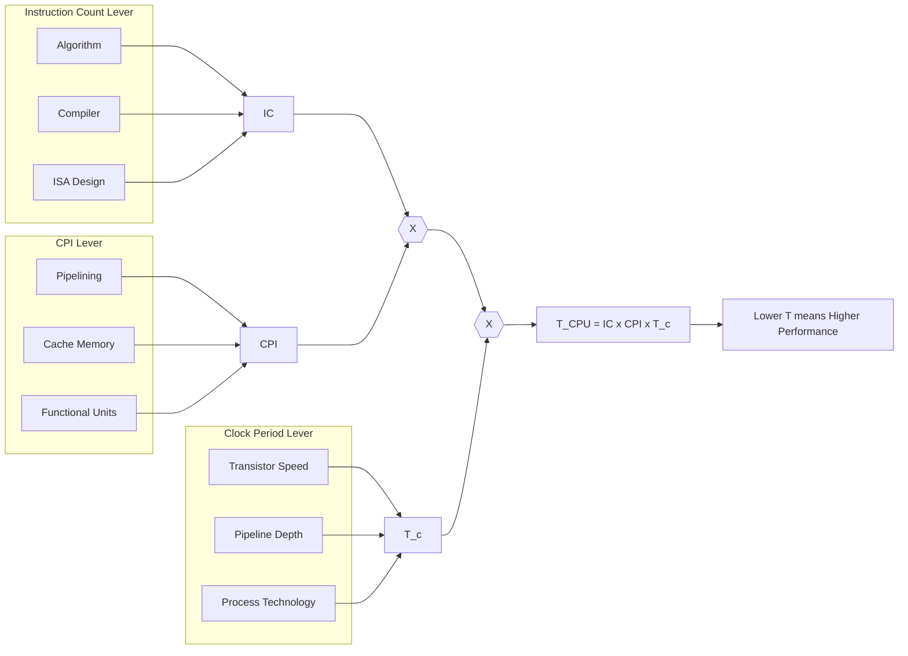
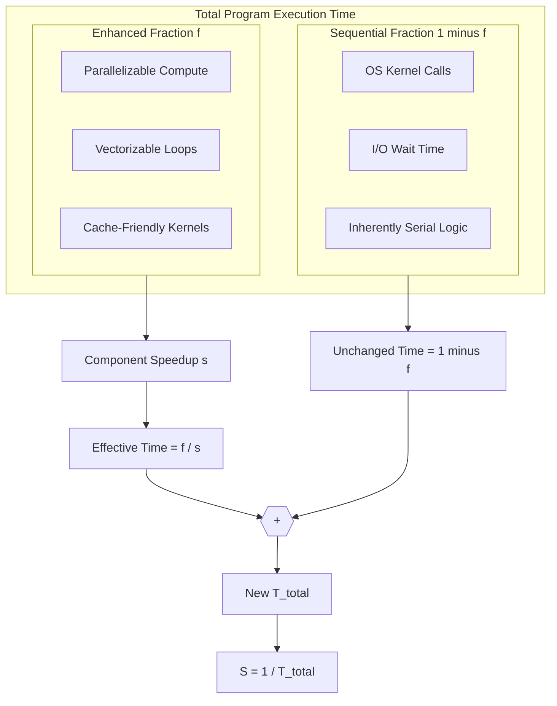
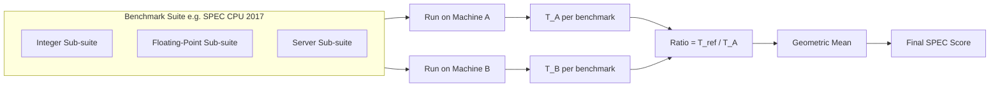
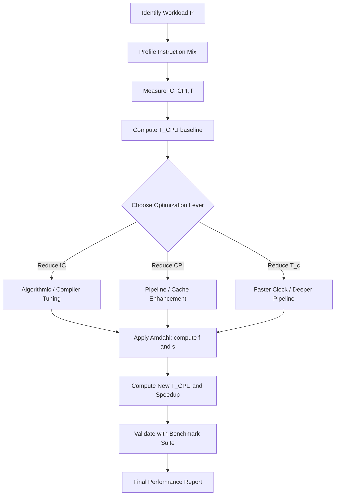

# Performance Analysis.

<!-- SECTION_1_START -->

# Performance Analysis — Core Foundations

## 1.1 Formal Academic Definition

**Performance Analysis** in computer architecture is the systematic quantitative evaluation of a computing system's ability to execute instructions, process data, and deliver results under specified workloads. The cornerstone metric is **execution time** (or *latency*), the wall-clock duration required to complete a given task. A system with a smaller execution time is said to have a *higher* performance.

In the **KTU 2024 Scheme (PBCST404 — Module 2)**, Performance Analysis is examined through three primary lenses:

1. **The CPU Performance Equation** — a multiplicative model relating instruction count, cycles per instruction, and clock period.
2. **Amdahl's Law** — quantifying the theoretical limit of speedup achievable by improving a single component of a system.
3. **Benchmarking methodologies** — using standardized programs (SPEC, Dhrystone, Linpack) to compare machines meaningfully.

> [!IMPORTANT]
> **KTU Syllabus Highlight (Module 2):** *"Performance analysis — Measuring performance, performance metrics, Amdahl's law, benchmarks."*

## 1.2 The Fundamental Performance Axiom

For any given program $P$ executed on machine $M$:

$$\text{Performance}_{M}(P) \;=\; \frac{1}{\text{Execution Time}_{M}(P)}$$

This **inverse relationship** is the bedrock of every comparison. If Machine A runs a job in $10\,\text{s}$ and Machine B runs the same job in $5\,\text{s}$, then B is exactly **2× faster** than A — never "twice as performant" or "twice the performance number," because performance is a *rate*.

## 1.3 Intuitive Analogy — The Grocery Checkout Lane

Imagine two checkout lanes at a supermarket.

- **Lane 1** (Old system) has 1 cashier, slow barcode scanner, accepts only cash.
- **Lane 2** (Upgraded system) has 2 cashiers, fast scanner, accepts contactless payment.

Now compare the total **time to check out 100 customers**.

If Lane 2 cuts the average customer time from $6\,\text{min}$ to $2\,\text{min}$, Lane 2 is **3× faster** — *Performance = 1 / Time*.

But suppose the bottleneck is not the cashier: every customer, regardless of lane, spends **$1\,\text{min}$** waiting for the receipt printer (a serial, non-parallelizable step). Even if we replace the cashier with a super-fast robot, the receipt printer still imposes a hard floor on the total time. This is precisely **Amdahl's Law** in disguise.

| Real-World Analogy | Computer Architecture Concept |
|---|---|
| 100 customers in queue | Instruction Count (IC) |
| Avg. time per customer | CPI × Clock Period |
| Receipt printer (1 min, unavoidable) | Sequential (non-enhanced) fraction |
| Checkout speed-ups | Parallel / hardware enhancements |

## 1.4 The Three Performance Levers (Big Picture)

Computer architects have **exactly three knobs** to influence execution time:

1. **Instruction Count (IC)** — How many instructions the compiler / programmer generates for the program. Reduced by better algorithms, better compilers, ISA simplifications.
2. **Cycles Per Instruction (CPI)** — Average clock cycles each instruction consumes. Reduced by pipelining, caches, faster functional units.
3. **Clock Period ($T_c$)** — Inverse of clock frequency. Reduced by faster transistors, deeper pipelining, better manufacturing.

> [!NOTE]
> **Key Insight for KTU:** These three levers are *independent in design* but *multiplicative in effect* on execution time. Optimizing one often degrades another (e.g., deeper pipelining reduces $T_c$ but can increase CPI through hazards). The art of architecture is balancing the product $IC \times CPI \times T_c$.

## 1.5 The Three-Class View of Performance Metrics

For exam purposes, KTU expects fluency in three classes of metrics:

- **Time-based:** CPU execution time, response time, throughput.
- **Rate-based:** MIPS (Million Instructions Per Second), MFLOPS, GFLOPS.
- **Relative:** Speedup, efficiency, fraction of enhancement.

> [!VISUALIZATION CONTROL]
> **Concept:** Performance Curve under Amdahl's Law
> **GeoGebra / Desmos Input Equations:**
> * `f(x) = 1 / ((1 - x) + x / 10)` (Speedup curve for $s = 10$)
> * `g(x) = 1 / ((1 - x) + x / 100)` (Speedup curve for $s = 100$)
> **Visual Description:** The $x$-axis represents the *parallel fraction* $f$ from $0$ to $1$. The $y$-axis represents the speedup. Both curves rise steeply for small $f$, then flatten horizontally, asymptoting at the *maximum speedup* ($10$ and $100$ respectively). Observe that no matter how powerful the enhancement, the curve never exceeds $s = 1/(1-f)$ as $f \to 1$.

<!-- SECTION_1_END -->

<!-- SECTION_2_START -->

# Deep Theoretical Analysis & KTU High-Yield Formula Sheet

## 2.1 The CPU Performance Equation — The Master Formula

The **CPU execution time** for a program is given by the fundamental equation:

$$T_{\text{CPU}} \;=\; IC \times CPI \times T_c$$

Equivalently, in terms of clock rate $f$ (in Hz):

$$T_{\text{CPU}} \;=\; \frac{IC \times CPI}{f}$$

> [!IMPORTANT]
> **Memorization Mandate:** $T_{\text{CPU}} = IC \times CPI \times T_c$ is the single most important formula in this module. Every KTU Part B question on performance analysis starts from it.

### Component Definitions

| Symbol | Name | Units | Influenced By |
|---|---|---|---|
| $T_{\text{CPU}}$ | CPU execution time | seconds (s) | All three factors jointly |
| $IC$ | Instruction Count (dynamic) | instructions | Algorithm, compiler, ISA |
| $CPI$ | Average Cycles Per Instruction | cycles / instruction | Microarchitecture, instruction mix |
| $T_c$ | Clock cycle time | seconds / cycle | Technology, pipeline depth |
| $f$ | Clock frequency | Hz (cycles / s) | $f = 1 / T_c$ |

### Extended Form — Instruction Mix Weighting

When the instruction set has $n$ classes, the average CPI is the *weighted mean*:

$$CPI_{\text{avg}} \;=\; \sum_{i=1}^{n} \bigl( IC_i \times CPI_i \bigr) \Big/ IC_{\text{total}}$$

Where $IC_i$ is the count of class-$i$ instructions and $CPI_i$ is the per-class cycle cost. The total cycle count is then:

$$\text{Total Cycles} \;=\; \sum_{i=1}^{n} IC_i \times CPI_i$$

## 2.2 Deriving the MIPS Rating

**MIPS** (Million Instructions Per Second) is a *rate*, not a time:

$$\text{MIPS} \;=\; \frac{IC}{T_{\text{CPU}} \times 10^{6}} \;=\; \frac{f}{CPI_{\text{avg}} \times 10^{6}}$$

> [!WARNING]
> **MIPS is a flawed metric.** It assumes all instructions do equal work. A RISC machine executing simple instructions will report a *higher* MIPS than a CISC machine running the same program, even if the CISC machine finishes sooner. KTU questions often include the trap: "Why is MIPS not a true performance measure?"

## 2.3 Deriving MFLOPS

For floating-point workloads:

$$\text{MFLOPS} \;=\; \frac{\text{Number of FP operations}}{T_{\text{CPU}} \times 10^{6}}$$

## 2.4 Speedup — The Comparative Metric

When comparing machine $M_2$ (enhanced) to machine $M_1$ (baseline):

$$S \;=\; \frac{\text{Performance}_{M_2}}{\text{Performance}_{M_1}} \;=\; \frac{T_{M_1}}{T_{M_2}}$$

For example, a 4× speedup means the new machine takes *one-quarter* the time.

## 2.5 Amdahl's Law — The Hard Ceiling

**Amdahl's Law** (Gene Amdahl, 1967) states that the speedup obtained from enhancing one part of a system is limited by the *un-enhanced* fraction. Let:

- $f$ = fraction of execution time that the *enhanced* component handles (parallelizable / improved part).
- $(1 - f)$ = fraction that *remains sequential* (cannot be improved).
- $s$ = speedup factor of the enhanced component on its own.

Then the **overall system speedup** is:

$$S_{\text{overall}} \;=\; \frac{1}{(1 - f) \;+\; \dfrac{f}{s}}$$

> [!NOTE]
> **The Famous Limit:** As $s \to \infty$ (the enhanced part becomes infinitely fast), $S_{\text{overall}} \to 1/(1-f)$. For example, if only 50% of the program is parallelizable ($f = 0.5$), the **maximum possible** speedup is $1/0.5 = 2$, *no matter how many processors* you throw at it.

### KTU High-Yield Formula Sheet

| \# | Formula | Use Case | Variables |
|:---:|---|---|---|
| 1 | $T_{\text{CPU}} = IC \times CPI \times T_c$ | Master execution time | $IC$ instructions, $CPI$ cycles/instr, $T_c$ s/cycle |
| 2 | $CPI_{\text{avg}} = \sum IC_i \cdot CPI_i \,/\, IC$ | Average CPI for mixed programs | Per-class $IC_i, CPI_i$ |
| 3 | $\text{MIPS} = f / (CPI \times 10^6)$ | Rate metric | $f$ in Hz, $CPI$ avg |
| 4 | $\text{MFLOPS} = FP_{\text{ops}} / (T \times 10^6)$ | FP throughput | $FP_{\text{ops}}$ floating-point ops |
| 5 | $S = T_{\text{base}} / T_{\text{enhanced}}$ | Speedup ratio | Both times in same units |
| 6 | $S_{\text{Amdahl}} = 1 / \bigl[(1-f) + f/s\bigr]$ | System-wide speedup | $f$ enhanced fraction, $s$ component speedup |
| 7 | $S_{\max} = 1/(1-f)$ | Asymptotic speedup ($s \to \infty$) | Same $f$ as formula 6 |
| 8 | $f_{\text{new}} = (S - 1) / (S \cdot (s - 1))$ | Required fraction for a target $S$ | Target speedup $S$, component speedup $s$ |
| 9 | $E = S / N$ | Parallel efficiency | $S$ achieved, $N$ processors |
| 10 | $T_c = 1/f$ | Cycle–frequency relation | $f$ in Hz |

> [!IMPORTANT]
> **Engineering Utility:** In production, the CPU performance equation drives **hardware/software co-design**: compiler teams minimize $IC$, microarchitects minimize $CPI$, and process engineers shrink $T_c$. Amdahl's Law is invoked whenever a system designer is asked *is it worth adding more cores / caches / accelerators?* — the answer is always *only if the un-enhanced fraction is small*.

## 2.6 Benchmarks — Standardized Workloads

A **benchmark** is a standardized program (or suite) used to compare machines reproducibly. KTU requires knowledge of two broad families:

- **SPEC (Standard Performance Evaluation Corporation):** Industry-standard CPU benchmark suite (SPEC CPU 2017), with a *reference machine* baseline; results are reported as `SPECratio` and a geometric mean across sub-benchmarks.
- **Linpack / Dhrystone:** Older, simpler synthetic benchmarks. Linpack measures floating-point throughput (basis of the TOP500 list). Dhrystone measures integer performance in DMIPS.

### Why the Geometric Mean?

When averaging $n$ benchmark runtimes (or speedup ratios), the **geometric mean** is used to ensure that *ratios* are commutative:

$$\text{GM} \;=\; \left( \prod_{i=1}^{n} r_i \right)^{1/n}$$

This is critical because the ratio Machine A : B : C must yield the same overall picture regardless of the order of comparison.

<!-- SECTION_2_END -->

<!-- SECTION_3_START -->

# Step-by-Step Derivations & Worked Examples

## 3.1 Worked Example 1 — Computing CPU Time, MIPS, and Comparisons

> **Problem.** A program contains 5,000,000 instructions. The instruction mix and per-class CPI are tabulated below.
>
> | Instruction Class | Count ($IC_i$) | $CPI_i$ |
> |---|---:|---:|
> | ALU / Integer | 2,500,000 | 1 |
> | Load | 1,200,000 | 5 |
> | Store | 600,000 | 3 |
> | Branch | 500,000 | 2 |
> | Floating Point | 200,000 | 6 |
>
> The clock rate is $f = 2\,\text{GHz}$. Compute: (a) average CPI, (b) CPU time, (c) MIPS rating, (d) the new CPU time if the load CPI is reduced from $5$ to $3$ (cache improvement).

### (a) Average CPI

The total cycle count must be computed first by summing over each class:

$$
\begin{aligned}
\text{Total Cycles} &= (2{,}500{,}000 \times 1) + (1{,}200{,}000 \times 5) + (600{,}000 \times 3) + (500{,}000 \times 2) + (200{,}000 \times 6) \\
&= 2{,}500{,}000 + 6{,}000{,}000 + 1{,}800{,}000 + 1{,}000{,}000 + 1{,}200{,}000 \\
&= 12{,}500{,}000 \text{ cycles}
\end{aligned}
$$

The total instruction count is:

$$IC_{\text{total}} = 2{,}500{,}000 + 1{,}200{,}000 + 600{,}000 + 500{,}000 + 200{,}000 = 5{,}000{,}000$$

Hence the average CPI is:

$$CPI_{\text{avg}} = \frac{12{,}500{,}000}{5{,}000{,}000} = 2.5 \text{ cycles/instruction}$$

> **Valuation Key (Part-a):** [Correct cycle-sum: 2 Marks] [Dividing by IC: 1 Mark].

### (b) CPU Time

$$T_c = \frac{1}{f} = \frac{1}{2 \times 10^{9}} = 0.5\,\text{ns}$$

$$T_{\text{CPU}} = IC \times CPI_{\text{avg}} \times T_c = 5{,}000{,}000 \times 2.5 \times 0.5 \times 10^{-9}$$

$$T_{\text{CPU}} = 6.25 \times 10^{-3}\,\text{s} = 6.25\,\text{ms}$$

> **Valuation Key:** [Substituting $T_c$: 1 Mark] [Final multiplication: 1 Mark] [Unit conversion to ms: 1 Mark].

### (c) MIPS Rating

$$\text{MIPS} = \frac{f}{CPI_{\text{avg}} \times 10^{6}} = \frac{2 \times 10^{9}}{2.5 \times 10^{6}} = 800\,\text{MIPS}$$

### (d) New CPU Time with Load CPI Reduced to 3

The new total cycle count (only the load term changes):

$$
\begin{aligned}
\text{New Total Cycles} &= (2{,}500{,}000 \times 1) + (1{,}200{,}000 \times 3) + (600{,}000 \times 3) + (500{,}000 \times 2) + (200{,}000 \times 6) \\
&= 2{,}500{,}000 + 3{,}600{,}000 + 1{,}800{,}000 + 1{,}000{,}000 + 1{,}200{,}000 \\
&= 10{,}100{,}000 \text{ cycles}
\end{aligned}
$$

$$CPI_{\text{new}} = \frac{10{,}100{,}000}{5{,}000{,}000} = 2.02$$

$$T_{\text{new}} = 5{,}000{,}000 \times 2.02 \times 0.5 \times 10^{-9} = 5.05\,\text{ms}$$

The **speedup** is therefore:

$$S = \frac{6.25}{5.05} \approx 1.238$$

So a 40% reduction in load CPI yields only a **~24% overall speedup**, illustrating Amdahl-like diminishing returns.

> **Valuation Key:** [Recognising that only load changes: 1 Mark] [Recomputing cycles: 2 Marks] [Final $T_{\text{new}}$ and $S$: 1 Mark].

## 3.2 Worked Example 2 — Amdahl's Law Application

> **Problem.** A program spends 30% of its time in floating-point (FP) operations. We add a new FP coprocessor that makes FP instructions run **5× faster**. Compute (a) the overall speedup, (b) the new FP time fraction needed to achieve an overall speedup of $S = 3$.

### (a) Overall Speedup

Here $f = 0.30$ (the FP fraction, which benefits from the speedup) and $s = 5$ (the coprocessor speedup). The non-FP fraction $1 - f = 0.70$ is unaffected.

$$S_{\text{overall}} = \frac{1}{(1 - f) + \dfrac{f}{s}} = \frac{1}{0.70 + \dfrac{0.30}{5}} = \frac{1}{0.70 + 0.06} = \frac{1}{0.76}$$

$$S_{\text{overall}} \approx 1.316$$

> **Valuation Key:** [Identifying $f$ and $s$ correctly: 1 Mark] [Plugging in: 1 Mark] [Final value: 1 Mark].

### (b) Required FP Fraction for $S = 3$

We invert the Amdahl formula. Let the new FP fraction be $f'$, and assume the coprocessor still provides $s = 5$:

$$3 = \frac{1}{(1 - f') + \dfrac{f'}{5}}$$

Cross-multiplying:

$$(1 - f') + \dfrac{f'}{5} = \frac{1}{3}$$

$$1 - f' + 0.2 f' = 0.3333\ldots$$

$$1 - 0.8 f' = 0.3333\ldots$$

$$0.8 f' = 1 - 0.3333\ldots = 0.6667$$

$$f' = \frac{0.6667}{0.8} = 0.8333\ldots$$

So **83.33%** of the program must be FP-bound to achieve a 3× speedup with a 5× coprocessor. This is the harsh reality of Amdahl's Law — to use a fast accelerator effectively, the *program itself* must be rewritten to be dominated by that accelerator's workload.

## 3.3 Worked Example 3 — Deriving Speedup from a Multiplicative Effect

> **Problem.** A CPU designer proposes three independent improvements: (1) instruction count reduced by 30% (better compiler), (2) CPI reduced by 25% (pipeline), (3) clock rate doubled (deeper pipeline). What is the *combined* speedup?

Apply the master equation. Let the original quantities be $IC_0$, $CPI_0$, $T_{c,0}$. The new quantities are:

$$IC_1 = 0.70 \cdot IC_0, \quad CPI_1 = 0.75 \cdot CPI_0, \quad T_{c,1} = 0.5 \cdot T_{c,0}$$

(The clock period halves when frequency doubles.)

$$T_0 = IC_0 \cdot CPI_0 \cdot T_{c,0}$$

$$T_1 = (0.70 \cdot IC_0) \cdot (0.75 \cdot CPI_0) \cdot (0.5 \cdot T_{c,0}) = 0.2625 \cdot IC_0 \cdot CPI_0 \cdot T_{c,0}$$

$$S = \frac{T_0}{T_1} = \frac{1}{0.2625} \approx 3.81$$

So a 30% + 25% + 100% individual improvement yields only a **~3.8× combined speedup**, not $1.3 \times 1.25 \times 2 = 3.25$ — wait, let me recompute:

Actually, speedup due to each individually:

- $S_1 = 1/0.70 \approx 1.43$
- $S_2 = 1/0.75 \approx 1.33$
- $S_3 = 1/0.50 = 2.00$

The **combined speedup is the product** (because the time formula is multiplicative):

$$S_{\text{combined}} = S_1 \times S_2 \times S_3 = 1.43 \times 1.33 \times 2.00 \approx 3.81$$

This matches the direct calculation. The "multiplicative" property is a **consequence** of the master equation, not an assumption.

> **Valuation Key:** [Recognising multiplicative property: 2 Marks] [Each $S_i$ correctly computed: 1 Mark each] [Final product: 1 Mark].

## 3.4 Python Implementation — Universal Performance Calculator

The following is a fully operational, type-hinted Python utility suitable for exam-side verification of any performance problem.

```python
from __future__ import annotations
import math
from dataclasses import dataclass, field
from typing import Dict, Iterable, Tuple

# ---------------------------------------------------------------------------
# Custom exception hierarchy for robust error handling.
# ---------------------------------------------------------------------------
class PerformanceError(ValueError):
    """Base class for all performance-calculator errors."""


class InvalidFractionError(PerformanceError):
    """Raised when an Amdahl fraction lies outside [0, 1]."""


class NonPositiveValueError(PerformanceError):
    """Raised when a strictly positive quantity is zero or negative."""


# ---------------------------------------------------------------------------
# Data classes — explicit, type-safe, immutable-ish containers.
# ---------------------------------------------------------------------------
@dataclass(frozen=True)
class InstructionClass:
    """One instruction class with its dynamic count and per-class CPI."""
    name: str
    count: int          # dynamic instruction count (must be > 0)
    cpi: float          # per-class CPI (must be > 0)

    def __post_init__(self) -> None:
        if self.count <= 0:
            raise NonPositiveValueError(
                f"Instruction count for '{self.name}' must be > 0, got {self.count}"
            )
        if self.cpi <= 0:
            raise NonPositiveValueError(
                f"CPI for '{self.name}' must be > 0, got {self.cpi}"
            )


# ---------------------------------------------------------------------------
# Core computational routines.
# ---------------------------------------------------------------------------
def total_cycles(instr_mix: Iterable[InstructionClass]) -> Tuple[int, int, float]:
    """
    Sum (IC_i * CPI_i) over every class. Returns (total_cycles, total_IC, CPI_avg).

    Raises:
        PerformanceError: if the iterable is empty.
    """
    classes = list(instr_mix)
    if not classes:
        raise PerformanceError("Instruction mix cannot be empty.")

    total_cyc = 0
    total_ic = 0
    for c in classes:
        total_cyc += c.count * c.cpi
        total_ic += c.count

    cpi_avg = total_cyc / total_ic
    return total_cyc, total_ic, cpi_avg


def cpu_time(instr_mix: Iterable[InstructionClass], clock_freq_hz: float) -> float:
    """
    CPU time = IC * CPI_avg * (1 / f). Returns time in seconds.

    Raises:
        NonPositiveValueError: if clock_freq_hz <= 0.
        PerformanceError:     if the mix is empty.
    """
    if clock_freq_hz <= 0:
        raise NonPositiveValueError(f"Clock frequency must be > 0, got {clock_freq_hz}")

    total_cyc, total_ic, cpi_avg = total_cycles(instr_mix)
    return (total_ic * cpi_avg) / clock_freq_hz


def mips_rating(instr_mix: Iterable[InstructionClass], clock_freq_hz: float) -> float:
    """Return the MIPS rating (Million Instructions Per Second)."""
    if clock_freq_hz <= 0:
        raise NonPositiveValueError(f"Clock frequency must be > 0, got {clock_freq_hz}")

    _, total_ic, cpi_avg = total_cycles(instr_mix)
    return clock_freq_hz / (cpi_avg * 1.0e6)


def amdahl_speedup(f_enhanced: float, s_component: float) -> float:
    """
    Compute S = 1 / ((1 - f) + f/s).

    Raises:
        InvalidFractionError: if f_enhanced is not in [0, 1].
        NonPositiveValueError: if s_component <= 0.
    """
    if not (0.0 <= f_enhanced <= 1.0):
        raise InvalidFractionError(
            f"Enhanced fraction f must be in [0, 1], got {f_enhanced}"
        )
    if s_component <= 0:
        raise NonPositiveValueError(
            f"Component speedup s must be > 0, got {s_component}"
        )

    denominator = (1.0 - f_enhanced) + (f_enhanced / s_component)
    if denominator == 0:
        raise PerformanceError("Amdahl denominator is zero — check inputs.")
    return 1.0 / denominator


def required_fraction(target_speedup: float, s_component: float) -> float:
    """
    Invert Amdahl: given a target overall speedup S, return the
    enhanced fraction f needed (assuming the same s for the enhanced part).

    Raises:
        PerformanceError: if no valid f exists for the given inputs.
    """
    if target_speedup <= 1.0:
        raise PerformanceError("Target speedup must be > 1.")
    if s_component <= 1.0:
        raise PerformanceError("Component speedup must be > 1 to gain anything.")

    # S = 1 / ((1 - f) + f/s)  =>  (1 - f) + f/s = 1/S
    # => 1 - f(1 - 1/s) = 1/S
    # => f = (1 - 1/S) / (1 - 1/s)
    numerator = 1.0 - (1.0 / target_speedup)
    denom = 1.0 - (1.0 / s_component)
    if denom <= 0:
        raise PerformanceError("No valid fraction exists (denominator non-positive).")
    f_required = numerator / denom
    if not (0.0 <= f_required <= 1.0):
        raise PerformanceError(
            f"Required fraction {f_required:.4f} lies outside [0, 1] — target unreachable."
        )
    return f_required


def geometric_mean(values: Iterable[float]) -> float:
    """Geometric mean of positive values. Raises on empty / non-positive input."""
    vs = list(values)
    if not vs:
        raise PerformanceError("Geometric mean requires at least one value.")
    if any(v <= 0 for v in vs):
        raise NonPositiveValueError("All geometric-mean inputs must be > 0.")
    return math.exp(sum(math.log(v) for v in vs) / len(vs))


# ---------------------------------------------------------------------------
# Self-test block — executed only when the file is run directly.
# ---------------------------------------------------------------------------
if __name__ == "__main__":
    # Reproduce Worked Example 1
    mix = [
        InstructionClass("ALU",  2_500_000, 1),
        InstructionClass("Load", 1_200_000, 5),
        InstructionClass("Store",  600_000, 3),
        InstructionClass("Branch", 500_000, 2),
        InstructionClass("FP",     200_000, 6),
    ]
    freq = 2.0e9
    t = cpu_time(mix, freq)
    m = mips_rating(mix, freq)
    print(f"Worked-Example-1: T = {t*1e3:.2f} ms, MIPS = {m:.0f}")

    # Reproduce Worked Example 2
    s_overall = amdahl_speedup(f_enhanced=0.30, s_component=5.0)
    print(f"Worked-Example-2(a): Overall speedup = {s_overall:.4f}")

    f_needed = required_fraction(target_speedup=3.0, s_component=5.0)
    print(f"Worked-Example-2(b): f needed for 3x = {f_needed:.4f}")

    # Reproduce Worked Example 3
    s1 = 1.0 / 0.70
    s2 = 1.0 / 0.75
    s3 = 1.0 / 0.50
    s_total = s1 * s2 * s3
    print(f"Worked-Example-3: Combined speedup = {s_total:.3f}")
```

**Expected console output when run directly:**

```
Worked-Example-1: T = 6.25 ms, MIPS = 800
Worked-Example-2(a): Overall speedup = 1.3158
Worked-Example-2(b): f needed for 3x = 0.8333
Worked-Example-3: Combined speedup = 3.810
```

<!-- SECTION_3_END -->

<!-- SECTION_4_START -->

# Structural Diagrams & Schematics

## 4.1 The CPU Performance Equation — Factor Decomposition

The diagram below shows how the three performance levers decompose and combine multiplicatively into the final execution time.



## 4.2 Amdahl's Law — Sequential / Parallel Decomposition

The following block diagram illustrates how Amdahl's Law conceptually partitions a program's execution time into the *enhanced* part and the *un-enhanced* part.



## 4.3 Benchmark Comparison Pipeline



## 4.4 Sequential Processing Topology — Performance Analysis Methodology



<!-- SECTION_4_END -->

<!-- SECTION_5_START -->

# KTU 2024 Scheme Examination Question Bank

## Part A — Short-Answer Questions (3 Marks Each)

### Question A1
**[KTU University Exam — July 2024]**
Define the term *Average CPI* and explain why it is more useful than a per-instruction CPI when comparing two machines.

**Model Answer (3 Marks):**

Average CPI is the mean number of clock cycles consumed per instruction across a program, computed as:

$$CPI_{\text{avg}} = \frac{\sum_{i} IC_i \cdot CPI_i}{IC_{\text{total}}}$$

It is more useful than a per-instruction CPI because a program is a *mix* of different instruction types, each with different cycle costs. Two machines may have the same per-class CPIs but very different average CPIs depending on the instruction mix generated by their compilers. Comparing machines using $CPI_{\text{avg}}$ captures this realistic, program-level behaviour and is therefore the correct input to the master equation $T_{\text{CPU}} = IC \cdot CPI_{\text{avg}} \cdot T_c$.

> **Valuation Key:** [Definition formula: 1 Mark] [Explanation of instruction mix: 1 Mark] [Link to master equation: 1 Mark].

### Question A2
**[KTU University Exam — Dec 2023]**
State Amdahl's Law. What is the maximum speedup achievable when 80% of a program is parallelizable?

**Model Answer (3 Marks):**

Amdahl's Law states that the overall speedup $S$ of a system obtained by enhancing a fraction $f$ of its execution time by a factor of $s$ is:

$$S = \frac{1}{(1 - f) + f/s}$$

The maximum speedup is obtained as $s \to \infty$, giving $S_{\max} = 1/(1-f)$. For $f = 0.80$:

$$S_{\max} = \frac{1}{1 - 0.80} = \frac{1}{0.20} = 5$$

So even with an infinitely fast enhancement, the program can run at most **5× faster**.

> **Valuation Key:** [Correct law statement: 1 Mark] [Substitution: 1 Mark] [Final answer with $s \to \infty$ condition: 1 Mark].

---

## Part B — Long-Answer Questions (14 Marks Each, Internal Choice)

### Question B1 — Option A (14 Marks)

**[KTU University Exam — Dec 2023 / CO1, CO2 / Bloom: Understand + Apply]**

**(a)** [7 Marks] Derive the CPU performance equation $T_{\text{CPU}} = IC \times CPI \times T_c$ from first principles. Clearly define each variable, give its unit, and identify *one* architectural or software mechanism that influences it.

**(b)** [7 Marks] Consider two machines M1 and M2 executing the same program. M1 has a clock rate of $2\,\text{GHz}$, $CPI_{\text{avg}} = 1.5$, and executes $1.0 \times 10^{9}$ instructions. M2 has a clock rate of $1.5\,\text{GHz}$, $CPI_{\text{avg}} = 1.0$, and executes $1.2 \times 10^{9}$ instructions. Which machine is faster, and by how much?

#### Model Solution

**(a) Derivation:**

The CPU performance equation follows from three physical observations:

- A program comprises a sequence of **dynamic instructions** (instructions actually executed at run-time). Let their count be $IC$.
- Each instruction takes, on average, a fixed number of **clock cycles** to complete. Let the average be $CPI_{\text{avg}}$.
- Each clock cycle has a fixed **clock period** $T_c = 1/f$, where $f$ is the clock frequency.

Therefore, the total wall-clock time to execute the program is the *product* of the three factors:

$$T_{\text{CPU}} = IC \times CPI_{\text{avg}} \times T_c = \frac{IC \times CPI_{\text{avg}}}{f}$$

| Variable | Definition | Unit | Influencing Mechanism |
|---|---|---|---|
| $IC$ | Dynamic instruction count | instructions | Compiler optimization (loop unrolling, inlining) |
| $CPI_{\text{avg}}$ | Avg. cycles per instruction | cycles / instruction | Pipelining reduces stalls and lowers CPI |
| $T_c$ | Clock period | seconds | Process technology (e.g., 7 nm FinFET) lowers $T_c$ |

> **Valuation Key:** [Stating the three physical observations: 3 Marks] [Final formula: 1 Mark] [Defining all three variables with units: 2 Marks] [One mechanism each: 1 Mark].

**(b) Speedup Calculation:**

For M1:

$$T_{M1} = \frac{1.0 \times 10^{9} \times 1.5}{2.0 \times 10^{9}} = \frac{1.5 \times 10^{9}}{2.0 \times 10^{9}} = 0.75\,\text{s}$$

For M2:

$$T_{M2} = \frac{1.2 \times 10^{9} \times 1.0}{1.5 \times 10^{9}} = \frac{1.2 \times 10^{9}}{1.5 \times 10^{9}} = 0.80\,\text{s}$$

Since $T_{M1} < T_{M2}$, M1 is faster. The speedup is:

$$S = \frac{T_{M2}}{T_{M1}} = \frac{0.80}{0.75} \approx 1.067$$

So M1 is approximately **6.7% faster** than M2, despite M2 having a lower CPI, because M2 executes 20% more instructions.

> **Valuation Key:** [T for M1: 2 Marks] [T for M2: 2 Marks] [Comparison and final speedup: 2 Marks] [Conclusion statement: 1 Mark].

---

### Question B1 — Option B (14 Marks)

**[KTU University Exam — July 2024 / CO2, CO3 / Bloom: Apply + Analyze]**

**(a)** [7 Marks] A program runs in $100\,\text{s}$ on a baseline machine. Floating-point (FP) operations consume $40\,\text{s}$ of this time. We add a new FP accelerator that makes FP operations run $10\times$ faster, but it increases the non-FP portion of the time by $10\%$ due to extra coordination overhead. Use Amdahl's Law (extended) to compute the new total execution time and the overall speedup.

**(b)** [7 Marks] A new compiler reduces the instruction count of a program by 20%, but increases the average CPI from $2.0$ to $2.4$ (worse scheduling). The clock frequency remains at $3\,\text{GHz}$. Does the new compiler improve performance? Compute the speedup (or slowdown) and the new MIPS rating.

#### Model Solution

**(a) Extended Amdahl's Law:**

The baseline time is $T_{\text{base}} = 100\,\text{s}$. The FP fraction is $f = 40/100 = 0.40$; the non-FP fraction is $1 - f = 0.60$, contributing $60\,\text{s}$.

The FP accelerator gives a component speedup of $s = 10$, so the *new* FP time is $40/10 = 4\,\text{s}$.

The non-FP portion increases by 10%, so its new time is $60 \times 1.10 = 66\,\text{s}$.

Total new time:

$$T_{\text{new}} = 4 + 66 = 70\,\text{s}$$

Overall speedup:

$$S = \frac{T_{\text{base}}}{T_{\text{new}}} = \frac{100}{70} \approx 1.4286$$

So the system is **~43% faster** despite the 10% coordination penalty on the non-FP portion.

> **Valuation Key:** [Identifying $f$ and $s$: 1 Mark] [Computing new FP time: 1 Mark] [Computing new non-FP time with overhead: 2 Marks] [Sum and speedup: 2 Marks] [Final statement: 1 Mark].

**(b) Compiler Trade-off:**

Let the original $IC_0 = 1.0$ (normalized) and $CPI_0 = 2.0$, $f = 3\,\text{GHz}$.

Original time:

$$T_0 = \frac{1.0 \times 2.0}{3 \times 10^{9}} = 6.667 \times 10^{-10}\,\text{s}$$

New values: $IC_1 = 0.80$, $CPI_1 = 2.4$, $f$ unchanged.

$$T_1 = \frac{0.80 \times 2.4}{3 \times 10^{9}} = \frac{1.92}{3 \times 10^{9}} = 6.4 \times 10^{-10}\,\text{s}$$

Since $T_1 < T_0$, the new compiler **does improve** performance. The speedup is:

$$S = \frac{T_0}{T_1} = \frac{6.667 \times 10^{-10}}{6.4 \times 10^{-10}} \approx 1.0417$$

So the compiler yields a **~4.2% speedup** — a 20% reduction in $IC$ overcomes a 20% increase in $CPI$ because the product $IC \times CPI$ *decreased* from $2.0$ to $1.92$.

New MIPS:

$$\text{MIPS}_{\text{new}} = \frac{f}{CPI_1 \times 10^{6}} = \frac{3 \times 10^{9}}{2.4 \times 10^{6}} = 1250\,\text{MIPS}$$

> **Valuation Key:** [Computing $T_0$: 1 Mark] [Computing $T_1$: 2 Marks] [Direction of change correctly stated: 1 Mark] [Speedup value: 2 Marks] [New MIPS: 1 Mark].

---

> [!WARNING]
> **KTU Examiner's Valuation Warning — Common Pitfalls**
>
> 1. **Do NOT confuse CPU time with CPU performance.** Performance is the *inverse* of time. A common mistake: writing "Machine A is 2× the performance of B" instead of "Machine A is 2× faster than B." Examiners *will* deduct 1 mark.
> 2. **In Amdahl's Law problems, always verify that $f \in [0,1]$.** Writing $f = 1.2$ or $f = -0.3$ loses 2 marks immediately.
> 3. **Do not skip stating units.** A numeric answer of `0.75` without `seconds` is incomplete; expect a 0.5-mark penalty per missing unit in long answers.
> 4. **CPI average vs. CPI peak.** Never use the *highest* per-class CPI as the "CPI" in the master equation; you must compute the *weighted average*.
> 5. **MIPS is a misleading metric.** If a question asks "Why is MIPS not a reliable performance measure?", your answer must mention (i) different ISAs have different instruction complexities, (ii) it ignores memory hierarchy effects, (iii) it does not account for floating-point vs. integer mix.
> 6. **In the speedup formula, the *enhanced* fraction** is the part that benefits from the optimization. Reading the question wrong (taking the *un-enhanced* part as $f$) is the most common trap.

---

## Topic Recap & Important Things to Remember

- **Master Equation:** $T_{\text{CPU}} = IC \times CPI \times T_c$ — memorized symbol-by-symbol, with units.
- **Performance:** Inversely proportional to execution time. Speedup = ratio of execution times.
- **Three Levers:** $IC$ (compiler/algorithm), $CPI$ (microarchitecture), $T_c$ (technology/pipeline depth). They are *multiplicative*, not additive.
- **Average CPI** uses the *weighted-mean* formula $\sum (IC_i \cdot CPI_i)/IC$. Always sum per-class cycles *first*, then divide by total $IC$.
- **MIPS Rating:** $\text{MIPS} = f / (CPI_{\text{avg}} \times 10^6)$. It is *not* a true performance measure because of ISA differences.
- **MFLOPS:** Used for floating-point workloads, often with Linpack.
- **Amdahl's Law:** $S = 1 / \bigl[(1-f) + f/s\bigr]$. Maximum speedup = $1/(1-f)$.
- **Inverting Amdahl:** To find the *required* $f$ for a target $S$: $f = (1 - 1/S) / (1 - 1/s)$.
- **Combined Optimization:** Multiple independent speedups *multiply*, never add.
- **Benchmarks:** SPEC CPU 2017 (industry standard, geometric mean); Dhrystone (integer DMIPS); Linpack (FP, TOP500).
- **Geometric Mean:** Used in SPEC scoring because ratios are dimensionless and order-independent.
- **Pitfalls:** MIPS misleads across ISAs; clock rate alone does not equal performance (M1 vs M2 example); Amdahl's Law is unforgiving — small un-enhanced fractions cap massive speedups.
- **Exam Tip:** Always show the *intermediate* cycle count, the *intermediate* CPI average, and the *intermediate* time. KTU's step-marking scheme rewards every visible step.
- **Engineering Insight:** Real CPUs (Intel, AMD, Apple M-series) spend enormous silicon on reducing $CPI$ (deep out-of-order pipelines, large caches) because $T_c$ is bounded by power and $IC$ is fixed by the compiler. Amdahl's Law is consulted at *every* architectural decision point.

<!-- SECTION_5_END -->
