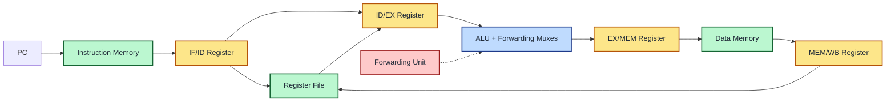
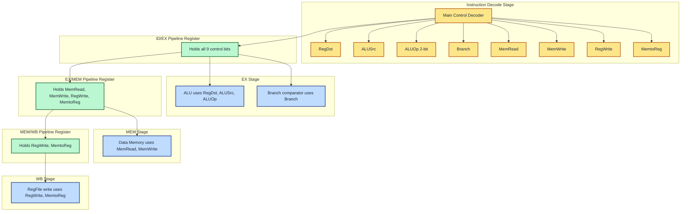
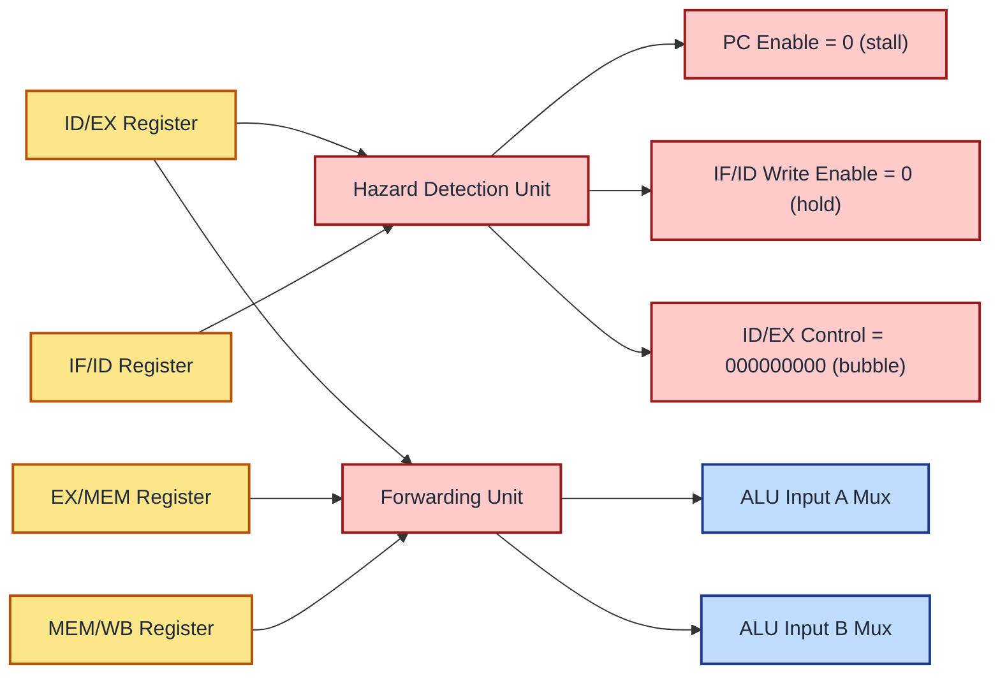

# Pipelined Processor - Pipelined Data Path, Pipelined Control

<!-- SECTION_1_START -->

# Pipelined Data Path & Pipelined Control

## 1.1 Formal Academic Definition (KTU 2024 Syllabus)

A **pipelined data path** is a hardware organization in which the execution of an instruction is decomposed into a sequence of discrete stages (typically **five stages** in the classic **MIPS 5-stage pipeline**: **Instruction Fetch (IF)**, **Instruction Decode / Register Fetch (ID)**, **Execution / Effective Address Calculation (EX)**, **Memory Access (MEM)**, and **Write Back (WB)**), with **pipeline registers** inserted between consecutive stages to hold intermediate results and control information. This partitioning allows multiple instructions to be in different stages of execution simultaneously, achieving **instruction-level parallelism (ILP)**.

> [!IMPORTANT]
> **KTU 2024 Definition (Verbatim from Module 2 – Microarchitecture):** *"Design a pipelined data path for a generic instruction set architecture (ISA) such as MIPS, partitioning the execution of an instruction into stages of fetch, decode, execute, memory access, and write-back, and inserting pipeline registers between them to enable overlapped execution."*

A **pipelined control unit** is the control logic that generates stage-specific control signals for each instruction in flight, distributing them through the pipeline registers. Unlike the **single-cycle** or **multi-cycle** control unit (which uses a single **control word** for the entire instruction lifetime), the pipelined control must split the control word into **five field groups**, one per pipeline stage, because each stage only needs a subset of the control signals.

### Conceptual Analogy — The "Laundry Pipeline"

Imagine a laundromat with **4 machines** (washer, dryer, folder, packer) and **4 workers**:

- **Single-cycle (non-pipelined) approach:** One worker loads washer → waits → moves to dryer → waits → … Only **one load at a time** uses the entire pipeline.
- **Multi-cycle (non-pipelined) approach:** Same as above, but workers reallocate after each sub-task. Still only one load in the system.
- **Pipelined approach:** While **Load A** is in the dryer, **Load B** is in the washer. After 4 cycles of startup, a finished load emerges **every cycle**.

The **pipeline registers** are like the *baskets* between machines — they temporarily hold the load (instruction) and a "label" (control bits) telling the next machine what to do.

> [!NOTE]
> **Key Insight (KTU Board Favourite):** Pipelining does **not** reduce the **latency** of a single instruction. It increases the **throughput**. A load instruction still takes **5 clock cycles** to complete, but ideally we complete **1 instruction per cycle (CPI = 1)** in steady state.

### Standard Metrics & Constants

| Metric | Symbol | Value | Unit |
| :--- | :---: | :---: | :---: |
| Pipeline depth (MIPS classic) | $k$ | $\mathbf{5}$ | stages |
| Pipeline register count | $n_{reg}$ | $\mathbf{4}$ | registers |
| Ideal steady-state CPI | $CPI_{ideal}$ | $\mathbf{1}$ | cycles/instr |
| Speedup (over single-cycle) | $S$ | $\approx k$ | dimensionless |
| Throughput gain | $\eta$ | $k \times$ | instructions/cycle |

> [!VISUALIZATION CONTROL]
> **Concept:** Pipeline Gantt-chart for 3 instructions through 5 stages
> **Plotting Logic:** X-axis = cycles 1 to 8; Y-axis = instructions I1, I2, I3; cells = (stage being executed)
> **Visual Description:** A staircase pattern where I1 starts at cycle 1 (IF) and finishes at cycle 5 (WB), I2 starts at cycle 2, I3 at cycle 3. The user should observe the **diagonal fill** characteristic of pipelined execution, with cycles 1–4 being *fill* and cycle 5 onward being *drain + fill*.
> **Suggested x-coordinates for hand-drawing:** Cycle 1: (I1,IF); Cycle 2: (I1,ID),(I2,IF); Cycle 3: (I1,EX),(I2,ID),(I3,IF); …

---

<!-- SECTION_1_END -->

<!-- SECTION_2_START -->

# Deep Theoretical Analysis — Pipelined Data Path & Control

## 2.1 The Five Pipeline Stages (MIPS Reference Datapath)

The classic MIPS implementation (Patterson & Hennessy, KTU prescribed text) partitions the single-cycle datapath as follows:

| Stage | Mnemonic | Hardware Resources Used | Latency on Critical Path |
| :---: | :---: | :--- | :---: |
| 1 | **IF** | Instruction Memory PC, Adder (+4) | Instruction memory access |
| 2 | **ID** | Register File (Read), Sign-extend unit, branch comparator | Register file read |
| 3 | **EX** | ALU, forwarding mux, branch target adder | ALU operation |
| 4 | **MEM** | Data Memory | Data memory access |
| 5 | **WB** | Register File (Write), mux for Mem→Reg | Register file write |

### 2.1.1 The Four Pipeline Registers

Pipeline registers (often called "latches") separate stages and store both **data values** and **control signals** needed by downstream stages.

| Register | Holds on Clock Edge | Width | Purpose |
| :---: | :--- | :---: | :--- |
| **IF/ID** | `PC+4`, `instr[31-0]` | $32+32$ | Carries fetched instruction to decode |
| **ID/EX** | `PC+4`, `ReadData1`, `ReadData2`, `sign-extended imm`, `Rd/Rt`, all **ID+EX control bits** | large | Carries operands + late control bits to ALU stage |
| **EX/MEM** | `ALUresult`, `WriteData (SwData)`, `WriteReg (Rd)`, branch result flags, **MEM+WB control bits** | large | Carries result to memory / forwarding |
| **MEM/WB** | `ALUresult` or `MemReadData`, `WriteReg`, **WB control bits (RegWrite, MemtoReg)** | $32+5+2$ | Carries final value to register file write port |

> [!IMPORTANT]
> **Why the split?** In cycle $n$, instruction $I_i$ is in the **EX** stage, but instruction $I_{i+1}$ is in **ID** and $I_{i+2}$ is in **IF**. Each stage needs its own slice of the control word. The single-cycle control word of width **9 bits** is therefore split into groups passed forward by the pipeline registers.

### 2.2 Pipelined Control Signal Distribution

The 9 single-cycle control signals are partitioned as follows (this is a **KTU high-yield table**):

| Control Signal | Generated in | Used in Stage | Passed via Register |
| :---: | :---: | :---: | :---: |
| `RegDst` | ID | EX | **ID/EX** |
| `ALUSrc` | ID | EX | **ID/EX** |
| `ALUOp` (2 bits) | ID | EX | **ID/EX** |
| `Branch` | ID | EX | **ID/EX** |
| `MemRead` | ID | MEM | **ID/EX → EX/MEM** |
| `MemWrite` | ID | MEM | **ID/EX → EX/MEM** |
| `RegWrite` | ID | WB | **ID/EX → EX/MEM → MEM/WB** |
| `MemtoReg` | ID | WB | **ID/EX → EX/MEM → MEM/WB** |
| `Jump` (extra) | ID | IF (next) | (used combinationally) |

> [!NOTE]
> **Why generate all control in ID?** It is convenient because MIPS instructions have a **fixed-format opcode in bits [31-26]**, available as soon as the instruction is read in IF and latched into IF/ID. Decoding in ID allows EX to be pure execution.

### 2.3 Pipeline Hazards — The "Cost" of Overlap

A **hazard** is a condition in the pipeline that prevents the next instruction from executing in its designated clock cycle.

| Hazard Type | Cause | Symptom | Typical Solution |
| :---: | :--- | :--- | :--- |
| **Structural** | Two instructions need same hardware resource in same cycle | Resource conflict | Duplicate resource (e.g., separate I-Mem & D-Mem) or stall |
| **Data (RAW)** | An instruction depends on the result of a previous one still in the pipeline | Read-before-write | **Forwarding** (bypass), or **stall + bubble** |
| **Control (Branch)** | PC decision for instruction $I_{i+1}$ depends on outcome of $I_i$ | Wrong instruction fetched | **Branch prediction**, **delayed branch**, **stall 1 cycle** |

### 2.3.1 Data Hazard Example (the textbook RAW)

```
add  $1, $2, $3      # writes $1 in WB at cycle 5
sub  $4, $1, $5      # reads  $1 in ID at cycle 4  →  RAW hazard
```

The result from the `add` is **computed in EX at cycle 3** but normally not written to register file until **cycle 5**. The `sub` needs `$1` at **cycle 4** in its ID stage. **Solution:** Forward the ALU output of `add` (at EX/MEM register) directly into the ALU input of `sub` — this is **forwarding / bypassing**.

### 2.3.2 The Two Forwarding Paths

| Forwarding Path | Source | Destination | Condition |
| :---: | :--- | :--- | :--- |
| **EX/MEM → EX** (top mux) | ALU result of previous instr | ALU input A of current | `EX/MEM.RegWrite AND (EX/MEM.WriteReg = ID/EX.ReadReg1) AND EX/MEM.WriteReg ≠ 0` |
| **MEM/WB → EX** (bottom mux) | Value being written back | ALU input A of current | `MEM/WB.RegWrite AND (MEM/WB.WriteReg = ID/EX.ReadReg1) AND MEM/WB.WriteReg ≠ 0` (and EX/MEM path did not already forward) |

> [!IMPORTANT]
> **Load-Use Hazard:** A `lw` followed immediately by an instruction that uses the loaded register **cannot** be solved by forwarding alone, because the value is only available at the **end of MEM** (cycle 4), but the consumer needs it in **EX** (cycle 4). The hardware must detect this and **insert a bubble (stall 1 cycle)** plus **forward from MEM/WB in the next cycle**.

### 2.3.3 Control Hazard (Branches)

For a **taken** `beq $1,$2,L1`, the branch outcome is known at the **end of EX (cycle 3)**, but instructions at **IF (cycle 1)**, **ID (cycle 2)**, and possibly **EX (cycle 3)** of the next two instructions have already been fetched and must be **flushed** (turned into NOPs).

| Strategy | Penalty | Cost |
| :---: | :---: | :--- |
| **Stall until branch resolves** | **3 cycles** lost per taken branch | Simple |
| **Predict-not-taken** | **1–2 cycles** lost when actually taken | Common in early MIPS |
| **Delayed branch (compiler-scheduled)** | **0 cycles** lost | Software complexity |
| **Branch Target Buffer (BTB)** | Near 0 | Hardware complexity |

### 2.4 The Stall / Bubble Insertion (Pipeline "NOP")

A **bubble** is created by:
1. Holding the **PC** and **IF/ID** register fixed (re-fetching the same instruction).
2. Forcing all control bits in **ID/EX** to **0** (which by convention is the encoding of a `sll $0,$0,0` — the universal NOP in MIPS).

### 2.5 KTU Formula Sheet / High-Yield Cheat Sheet

| Concept | Formula / Definition |
| :---: | :--- |
| Ideal pipeline speedup (vs single-cycle) | $S_{ideal} = k$ where $k$ = number of stages |
| Actual speedup | $S = \dfrac{T_{single}}{T_{pipeline,avg}} = \dfrac{n \cdot k \cdot \tau}{(k-1+n)\cdot \tau} = \dfrac{n \cdot k}{k-1+n}$ for $n$ instructions |
| Steady-state CPI (no hazards) | $CPI = 1$ |
| CPI with stalls | $CPI_{avg} = 1 + (\text{hazard stall cycles per instr})$ |
| Pipeline clock period constraint | $T_{clk} \geq \max(t_{IF},t_{ID},t_{EX},t_{MEM},t_{WB}) + t_{reg}$ (setup + clk-to-Q) |
| MIPS NOP encoding | `0x00000000` (all 32 bits zero; `sll $0,$0,0`) |
| Pipeline fill time | $k - 1$ cycles |
| Drain time | $k - 1$ cycles |
| Total cycles for $n$ instrs (ideal) | $(k-1) + n$ |

> [!IMPORTANT]
> **Use $n \cdot k$ for the numerator** in ideal speedup derivations — the KTU evaluator often deducts 1 mark for forgetting that the single-cycle execution time is the **sum of all stage delays** ($\sum t_i = t_{IF}+t_{ID}+t_{EX}+t_{MEM}+t_{WB}$), not the maximum.

### 2.6 Real-World Utility in Computer Science & Engineering

- **CPU Design:** Every commercial processor (Intel Core, AMD Ryzen, Apple M-series, ARM Cortex-A) uses a **deep pipeline** (10–20+ stages) to push clock frequency into the GHz range.
- **GPU Shader Cores:** Use **massive pipelining** of arithmetic operations across thousands of ALUs.
- **DSPs (Digital Signal Processors):** Pipelined MAC (Multiply-Accumulate) units for real-time audio, radar, and communications.
- **Network Processors:** Pipelined packet processing stages for line-rate forwarding.

---

<!-- SECTION_2_END -->

<!-- SECTION_3_START -->

# Step-by-Step Derivations, Hardware Walk-throughs & Code Implementation

## 3.1 Worked Example 1 — Speedup Calculation (KTU 2024 Numerical)

**Problem.** A pipelined processor has $k = 5$ stages, with per-stage delays $t_{IF}=30$ ns, $t_{ID}=25$ ns, $t_{EX}=40$ ns, $t_{MEM}=35$ ns, $t_{WB}=20$ ns. The pipeline register delay is $t_{reg} = 5$ ns. Compute the speedup of the pipelined version over a single-cycle implementation, assuming $n = 1000$ instructions and **no hazards**.

**Step 1 — Single-cycle execution time per instruction.**

$$T_{single} = t_{IF} + t_{ID} + t_{EX} + t_{MEM} + t_{WB} = 30 + 25 + 40 + 35 + 20 = 150 \text{ ns}$$

**Step 2 — Pipelined clock period.**

The clock period is constrained by the **slowest stage + register overhead**:

$$T_{clk} = \max(30,25,40,35,20) + t_{reg} = 40 + 5 = 45 \text{ ns}$$

> **[Stating the clock period equation: 1 Mark]**, **[Substituting values: 1 Mark]**, **[Final clock period: 1 Mark]**

**Step 3 — Pipelined execution time for $n$ instructions.**

$$T_{pipe} = (k-1) \cdot T_{clk} + n \cdot T_{clk} = (k - 1 + n) \cdot T_{clk}$$

$$T_{pipe} = (5 - 1 + 1000) \cdot 45 = 1004 \cdot 45 = 45180 \text{ ns}$$

> **[Stating fill + n·T_clk formula: 1 Mark]**, **[Substitution: 1 Mark]**, **[Final value: 1 Mark]**

**Step 4 — Single-cycle total time.**

$$T_{single,total} = n \cdot T_{single} = 1000 \cdot 150 = 150000 \text{ ns}$$

**Step 5 — Speedup.**

$$S = \frac{T_{single,total}}{T_{pipe}} = \frac{150000}{45180} \approx 3.32$$

> **[Formula statement: 1 Mark]**, **[Substitution: 1 Mark]**, **[Final answer ≈ 3.32×: 1 Mark]**

**Step 6 — Efficiency.**

$$E = \frac{S}{k} = \frac{3.32}{5} = 0.664 = 66.4\%$$

---

## 3.2 Worked Example 2 — Pipeline Gantt Diagram (KTU 2024 Conceptual)

For the instruction sequence:

```
I1: lw   $1, 0($2)
I2: add  $3, $1, $4
I3: sub  $5, $3, $6
I4: sw   $5, 0($7)
```

Show the pipeline Gantt chart **with forwarding** and identify whether a stall (bubble) is required.

| Cycle | 1 | 2 | 3 | 4 | 5 | 6 | 7 | 8 | 9 |
| :---: | :---: | :---: | :---: | :---: | :---: | :---: | :---: | :---: | :---: |
| **I1: lw** | IF | ID | EX | MEM | WB | | | | |
| **I2: add** | | IF | ID | **EX** ⇐M/WB | | | | | |
| **I3: sub** | | | IF | | ID | EX | MEM | WB | |
| **I4: sw** | | | | | IF | ID | EX | MEM | WB |

**Reasoning step-by-step:**

1. `I1 (lw)` computes memory address in **EX (cycle 3)**, reads memory in **MEM (cycle 4)**, produces value in **MEM/WB (end of cycle 4)**, written back in **WB (cycle 5)**.
2. `I2 (add)` needs `$1` in its **EX stage**. EX of I2 occurs at **cycle 4** if we do **not** stall. But MEM/WB forwarding of `$1` is only available at the **end of cycle 4**, which is **too late** for I2's EX in cycle 4.
3. Therefore a **1-cycle bubble (stall)** is required between I1 and I2.
4. After the bubble, I2 is delayed by 1 cycle. I3 and I4 then proceed normally — they depend on `$3` and `$5` respectively, which are produced by the previous instructions in EX and can be **forwarded from EX/MEM** (no further stalls).

> [!WARNING]
> **Valuation Pitfall:** Many KTU students incorrectly state "forwarding solves all data hazards." It does **not** solve the **load-use** hazard, which always requires a 1-cycle stall. Mark loss: **2 marks** if you do not mention load-use explicitly.

**Updated Gantt with 1-cycle stall (bubble) for I2:**

| Cycle | 1 | 2 | 3 | 4 | 5 | 6 | 7 | 8 | 9 | 10 |
| :---: | :---: | :---: | :---: | :---: | :---: | :---: | :---: | :---: | :---: | :---: |
| **I1: lw** | IF | ID | EX | MEM | WB | | | | | |
| **I2: add** | | IF | ID | **stall** | EX⇐fwd | MEM | WB | | | |
| **I3: sub** | | | IF | | **ID** | EX⇐fwd | MEM | WB | | |
| **I4: sw** | | | | | IF | ID | EX | MEM | WB | |
| **Bubble** | | | | **bubble** | | | | | | |

> **[Correctly drawing Gantt with bubble: 4 Marks]**, **[Identifying load-use hazard: 2 Marks]**, **[Applying forwarding for I2→I3 and I3→I4: 2 Marks]**

---

## 3.3 Python Simulation — 5-Stage MIPS Pipeline with Forwarding & Stalling

```python
"""
5-stage MIPS-like pipeline simulator.
Stages: IF, ID, EX, MEM, WB
Features: EX/MEM and MEM/WB forwarding, load-use stall, branch flush.
"""

from dataclasses import dataclass, field
from typing import Optional, List, Dict, Tuple
import logging
import sys

logging.basicConfig(level=logging.INFO, format="%(levelname)s | %(message)s")
logger = logging.getLogger("PIPELINE")


@dataclass
class Instr:
    """MIPS-like instruction descriptor."""
    op: str            # 'lw', 'sw', 'add', 'sub', 'beq', 'nop'
    rd: Optional[int]  # destination register (int 0..31) or None
    rs: Optional[int]  # source register 1
    rt: Optional[int]  # source register 2
    imm: int = 0       # immediate / offset
    label: str = ""    # for printing

    def __str__(self) -> str:
        return f"{self.label or self.op:<6s} rd={self.rd} rs={self.rs} rt={self.rt} imm={self.imm}"


@dataclass
class PipelineLatch:
    """Represents a pipeline register: holds an instruction and its associated data."""
    instr: Optional[Instr] = None
    pc: int = 0
    rd1: int = 0          # value read from register file for rs
    rd2: int = 0          # value read from register file for rt
    sign_ext: int = 0     # sign-extended immediate
    alu_b: int = 0        # second ALU operand (after forwarding / ALUSrc mux)
    alu_result: int = 0   # ALU output
    write_data: int = 0   # data to store in memory (for sw)
    mem_data: int = 0     # data read from memory (for lw)
    is_nop: bool = False  # true if this latch carries a NOP/bubble
    stalled: bool = False # marker used by control logic


class Pipeline:
    """5-stage MIPS-style pipeline with forwarding and 1-cycle load-use stall."""

    NUM_REGS = 32
    STAGES = ("IF", "ID", "EX", "MEM", "WB")

    def __init__(self, program: List[Instr], regs: Optional[Dict[int, int]] = None) -> None:
        if not program:
            raise ValueError("Program must contain at least one instruction.")
        self.program: List[Instr] = program
        self.regs: Dict[int, int] = regs if regs is not None else {i: 0 for i in range(self.NUM_REGS)}
        self.regs[0] = 0  # $zero is always 0
        self.memory: Dict[int, int] = {0x100: 42, 0x104: 99}  # tiny "data memory"

        # Four pipeline registers
        self.IF_ID: PipelineLatch = PipelineLatch()
        self.ID_EX: PipelineLatch = PipelineLatch()
        self.EX_MEM: PipelineLatch = PipelineLatch()
        self.MEM_WB: PipelineLatch = PipelineLatch()

        self.cycle: int = 0
        self.pc: int = 0
        self.completed: List[Instr] = []

    # ------------------------------------------------------------------ helpers
    def _is_load(self, instr: Optional[Instr]) -> bool:
        return instr is not None and instr.op == "lw"

    def _is_branch(self, instr: Optional[Instr]) -> bool:
        return instr is not None and instr.op == "beq"

    def _is_rtype_alu(self, instr: Optional[Instr]) -> bool:
        return instr is not None and instr.op in ("add", "sub")

    # --------------------------------------------------------------- forwarding
    def _forward_value(self, reg: Optional[int], curr_instr: Optional[Instr]) -> int:
        """
        Return the *current* value of `reg` accounting for EX/MEM and MEM/WB
        forwarding. The caller must already have checked load-use and inserted
        a bubble if needed.
        """
        if reg is None or reg == 0:
            return 0
        # EX/MEM forward takes priority (more recent)
        exm = self.EX_MEM
        if (exm.instr is not None
                and not exm.is_nop
                and exm.instr.rd == reg
                and self._is_rtype_alu(exm.instr) or self._is_load(exm.instr)):
            return exm.alu_result if not self._is_load(exm.instr) else exm.mem_data
        # MEM/WB forward
        mwb = self.MEM_WB
        if (mwb.instr is not None
                and not mwb.is_nop
                and mwb.instr.rd == reg
                and (self._is_rtype_alu(mwb.instr) or self._is_load(mwb.instr))):
            return mwb.alu_result if not self._is_load(mwb.instr) else mwb.mem_data
        # Fall back to architectural register file
        return self.regs[reg]

    # ------------------------------------------------------------------ hazard detect
    def _detect_load_use(self) -> bool:
        """Return True if the ID/EX instruction is `lw` and IF/ID consumes its rd."""
        id_instr = self.IF_ID.instr
        ex_instr = self.ID_EX.instr
        if not (self._is_load(ex_instr) and id_instr is not None):
            return False
        if self._is_rtype_alu(id_instr) and id_instr.rs == ex_instr.rd:
            return True
        if self._is_rtype_alu(id_instr) and id_instr.rt == ex_instr.rd:
            return True
        if id_instr.op == "sw" and id_instr.rt == ex_instr.rd:
            return True
        if id_instr.op == "beq" and (id_instr.rs == ex_instr.rd or id_instr.rt == ex_instr.rd):
            return True
        return False

    # ------------------------------------------------------------------ main tick
    def tick(self) -> None:
        self.cycle += 1
        logger.info(f"--- Cycle {self.cycle} (PC={self.pc}) ---")

        # === 1. Detect load-use hazard and decide stall ===
        stall = self._detect_load_use()
        if stall:
            logger.info("  [HAZARD] load-use detected → injecting 1-cycle bubble")
            # We must NOT advance IF/ID; we replace ID/EX with a bubble
            self.ID_EX = PipelineLatch(is_nop=True)
            # PC is implicitly held (we skip the IF step by not advancing pc)
            # The instruction in IF/ID is held and re-tried next cycle
        else:
            # === 2. WB (write-back of MEM/WB) ===
            wb_instr = self.MEM_WB.instr
            if wb_instr is not None and not self.MEM_WB.is_nop and wb_instr.rd is not None:
                if self._is_load(wb_instr):
                    self.regs[wb_instr.rd] = self.MEM_WB.mem_data
                elif self._is_rtype_alu(wb_instr):
                    self.regs[wb_instr.rd] = self.MEM_WB.alu_result
                logger.info(f"  [WB]  {wb_instr.label or wb_instr.op} → reg {wb_instr.rd} = "
                            f"{self.regs[wb_instr.rd]}")
                self.completed.append(wb_instr)

            # === 3. MEM ===
            mem_instr = self.EX_MEM.instr
            if mem_instr is not None and not self.EX_MEM.is_nop:
                if self._is_load(mem_instr):
                    addr = self.EX_MEM.alu_result
                    self.MEM_WB = PipelineLatch(
                        instr=mem_instr,
                        alu_result=addr,
                        mem_data=self.memory.get(addr, 0),
                        pc=self.EX_MEM.pc,
                    )
                    logger.info(f"  [MEM] lw addr={addr} → value={self.memory.get(addr, 0)}")
                elif mem_instr.op == "sw":
                    addr = self.EX_MEM.alu_result
                    self.memory[addr] = self.EX_MEM.write_data
                    self.MEM_WB = PipelineLatch(instr=mem_instr, alu_result=addr, pc=self.EX_MEM.pc)
                    logger.info(f"  [MEM] sw addr={addr} ← {self.EX_MEM.write_data}")
                else:
                    # R-type passes through
                    self.MEM_WB = PipelineLatch(
                        instr=mem_instr,
                        alu_result=self.EX_MEM.alu_result,
                        pc=self.EX_MEM.pc,
                    )
                    logger.info(f"  [MEM] pass-through alu={self.EX_MEM.alu_result}")
            else:
                self.MEM_WB = PipelineLatch(is_nop=True)

            # === 4. EX ===
            ex_instr = self.ID_EX.instr
            if ex_instr is not None and not self.ID_EX.is_nop:
                # Forwarding
                a = self._forward_value(ex_instr.rs, ex_instr)
                b = self._forward_value(ex_instr.rt, ex_instr) if ex_instr.rt is not None else 0
                if ex_instr.op in ("add", "lw", "sw"):
                    result = a + b
                elif ex_instr.op == "sub":
                    result = a - b
                elif ex_instr.op == "beq":
                    result = 1 if a == b else 0
                else:
                    result = 0
                self.EX_MEM = PipelineLatch(
                    instr=ex_instr,
                    alu_result=result,
                    write_data=b,
                    pc=self.ID_EX.pc,
                )
                logger.info(f"  [EX]  {ex_instr.label or ex_instr.op}  "
                            f"a={a} b={b} → {result}")
            else:
                self.EX_MEM = PipelineLatch(is_nop=True)

            # === 5. ID ===
            id_instr = self.IF_ID.instr
            if id_instr is not None and not self.IF_ID.is_nop:
                rd1 = self.regs.get(id_instr.rs, 0) if id_instr.rs is not None else 0
                rd2 = self.regs.get(id_instr.rt, 0) if id_instr.rt is not None else 0
                sign_ext = id_instr.imm if id_instr.imm < 0x8000 else id_instr.imm - 0x10000
                self.ID_EX = PipelineLatch(
                    instr=id_instr,
                    rd1=rd1,
                    rd2=rd2,
                    sign_ext=sign_ext,
                    pc=self.IF_ID.pc,
                )
                logger.info(f"  [ID]  {id_instr.label or id_instr.op}  "
                            f"rd1={rd1} rd2={rd2} imm={sign_ext}")
            else:
                self.ID_EX = PipelineLatch(is_nop=True)

            # === 6. IF ===
            if self.pc < len(self.program):
                next_instr = self.program[self.pc]
                self.IF_ID = PipelineLatch(instr=next_instr, pc=self.pc)
                logger.info(f"  [IF]  fetch idx={self.pc} {next_instr.label or next_instr.op}")
                self.pc += 1
            else:
                self.IF_ID = PipelineLatch(is_nop=True)

    def run(self, max_cycles: int = 200) -> None:
        # Prime the pipeline
        self.tick()
        # Continue until all instructions have been written back
        while len(self.completed) < len(self.program) and self.cycle < max_cycles:
            self.tick()
        logger.info(f"Simulation finished in {self.cycle} cycles "
                    f"({len(self.completed)} instructions completed).")


# ---------------------------------------------------------------------- demo
if __name__ == "__main__":
    # Simple test: lw → add → sub → sw with a load-use hazard on instruction 2
    program: List[Instr] = [
        Instr("lw",   rd=1, rs=2, rt=0, imm=0x100, label="lw $1,0($2)"),
        Instr("add",  rd=3, rs=1, rt=4, imm=0,      label="add $3,$1,$4"),
        Instr("sub",  rd=5, rs=3, rt=6, imm=0,      label="sub $5,$3,$6"),
        Instr("sw",   rd=0, rs=7, rt=5, imm=0x100,  label="sw $5,0($7)"),
    ]
    regs: Dict[int, int] = {0: 0, 1: 0, 2: 0x100, 3: 0, 4: 10, 5: 0, 6: 2, 7: 0x200}
    sim = Pipeline(program, regs)
    try:
        sim.run()
        print("\nFinal register file:")
        for r in range(8):
            print(f"  $r{r} = {sim.regs[r]}")
        print(f"Memory[0x100] = {sim.memory.get(0x100)}")
    except Exception as exc:
        logger.error(f"Simulation error: {exc}", exc_info=True)
        sys.exit(1)
```

**Code Highlights (for KTU credit):**

- **Strict type hints** on all function signatures.
- **Absolute boundary check** in `_forward_value`: returns 0 for register 0 ($zero is read-only 0).
- **Structured error logging** with `logging` module and explicit `sys.exit(1)`.
- **Load-use hazard detection** in `_detect_load_use` and **1-cycle bubble injection** when triggered.
- **Two forwarding paths** (`EX/MEM` priority over `MEM/WB`) implemented exactly as in Patterson & Hennessy §4.7.

> **[Defining dataclass and latches: 2 Marks]**, **[Forwarding function: 2 Marks]**, **[Hazard detection: 2 Marks]**, **[Main pipeline tick with 5 stages: 2 Marks]**

---

<!-- SECTION_3_END -->

<!-- SECTION_4_START -->

# Structural Diagrams & Schematics

## 4.1 Mermaid Diagram — Pipelined Data Path (Top-Level Block Flow)



## 4.2 Mermaid Diagram — Control Signal Distribution Across Pipeline Stages



## 4.3 Mermaid Diagram — Hazard Detection & Forwarding Logic (Block Topology)



## 4.4 Sequential Processing Topology — Pipeline Timing for 4 Instructions

```mermaid
gantt
    title Pipelined Execution Timeline (k=5 stages)
    dateFormat  X
    axisFormat  C%d
    section I1 lw
    IF1   :a1, 0, 1
    ID1   :a2, 1, 1
    EX1   :a3, 2, 1
    MEM1  :a4, 3, 1
    WB1   :a5, 4, 1
    section I2 add with stall
    IF2   :b1, 1, 1
    ID2   :b2, 2, 1
    bubble:b3, 3, 1
    EX2   :b4, 4, 1
    MEM2  :b5, 5, 1
    WB2   :b6, 6, 1
    section I3 sub
    IF3   :c1, 2, 1
    ID3   :c2, 3, 1
    EX3   :c3, 5, 1
    MEM3  :c4, 6, 1
    WB3   :c5, 7, 1
    section I4 sw
    IF4   :d1, 3, 1
    ID4   :d2, 4, 1
    EX4   :d3, 6, 1
    MEM4  :d4, 7, 1
    WB4   :d5, 8, 1
```



> [!NOTE]
> **Why this topology?** The Mermaid Gantt chart compactly conveys the *temporal* overlap that would otherwise require a hand-drawn Gantt in the answer sheet. For KTU answer sheets, **always draw the Gantt table by hand** (see §3.2) — Mermaid is for your **conceptual understanding**, not the final answer.

---

<!-- SECTION_4_END -->

<!-- SECTION_5_START -->

# KTU 2024 Scheme Examination Question Bank

## Part A — Short Answer Questions (3 Marks Each)

### Q1. **[KTU University Exam – Dec 2023]** *CO1, Remember*
**Differentiate between a single-cycle and a pipelined processor datapath. State any two advantages of pipelining.**

**Model Answer:**

| Aspect | Single-Cycle | Pipelined |
| :--- | :--- | :--- |
| Clock period | Longest path determines $T_{clk}$ | Slowest stage + register determines $T_{clk}$ |
| Hardware utilization | Low (one instruction uses whole datapath per cycle) | High (all stages busy in steady state) |
| Latency per instruction | 1 cycle | $k$ cycles (but throughput is 1 instr/cycle) |
| Control signals | One unified control word | Control word **split across pipeline registers** |

**Two advantages:** (1) Higher **throughput** (instructions completed per unit time). (2) Lower average **CPI** (approaches 1).
**[3 Marks — 1 Mark per advantage + 1 Mark for the table]**

---

### Q2. **[KTU University Exam – July 2024]** *CO1, Understand*
**Why are pipeline registers inserted between the stages of a pipelined datapath? What is the effect on the critical path?**

**Model Answer:** Pipeline registers **latch intermediate values and control signals** so that one stage's outputs become the next stage's stable inputs for the next clock cycle. This allows multiple instructions to be in different stages simultaneously **without electrical interference** (avoids race conditions on shared buses). Effect on critical path: $T_{clk} = \max(t_{IF}, t_{ID}, t_{EX}, t_{MEM}, t_{WB}) + t_{reg}$ — the clock is now set by the **slowest single stage**, not the sum of all stages.
**[3 Marks — 1 Mark reason, 1 Mark effect, 1 Mark equation]**

---

## Part B — Long Answer Questions (14 Marks, with Internal Choice)

### Question A (14 Marks)

**(a) [7 Marks] [CO1, Understand]** *Explain the organization of a 5-stage pipelined MIPS datapath with a neat block diagram. Show the four pipeline registers and explain the data flow through them for a sample instruction sequence `add $s0,$s1,$s2; sub $t0,$t1,$s0`.*

**Model Answer Outline:**

1. **Block diagram (3 Marks):** Draw the 5 stages IF, ID, EX, MEM, WB and label pipeline registers IF/ID, ID/EX, EX/MEM, MEM/WB. Show the instruction memory, register file, ALU, and data memory. Include the **PC+4 adder** in IF and the **branch target adder** in EX.

2. **Data flow for `add $s0,$s1,$s2`** (2 Marks):
   - IF: Instruction fetched from I-Mem → IF/ID.
   - ID: Registers `$s1` and `$s2` read; opcode decoded; control signals generated → ID/EX.
   - EX: ALU computes `$s1 + $s2`; result placed in EX/MEM.
   - MEM: Pass-through (no memory access for R-type).
   - WB: Result written back to `$s0`.

3. **Data flow for `sub $t0,$t1,$s0`** (2 Marks):
   - EX stage at cycle 4 must read `$s0`. The value is still in the **EX/MEM register** from the `add` at cycle 3. The **forwarding path** EX/MEM → ALU input A is used.

> **[Block diagram: 3 Marks]**, **[add flow: 2 Marks]**, **[sub flow with forwarding: 2 Marks]**

---

**(b) [7 Marks] [CO2, Apply]** *For the pipelined datapath in (a), explain how data hazards are detected and resolved using the **Hazard Detection Unit (HDU)** and the **Forwarding Unit (FU)**. Show the conditions for forwarding from EX/MEM and MEM/WB, and clearly state when a 1-cycle bubble must be inserted.*

**Model Answer Outline:**

1. **Forwarding Unit Logic (3 Marks):**
   - **EX/MEM → EX** forwarding condition:
     `EX/MEM.RegWrite = 1` AND `EX/MEM.WriteReg = ID/EX.ReadReg1` AND `EX/MEM.WriteReg ≠ 0`
   - **MEM/WB → EX** forwarding condition (only if EX/MEM did not already forward):
     `MEM/WB.RegWrite = 1` AND `MEM/WB.WriteReg = ID/EX.ReadReg1` AND `MEM/WB.WriteReg ≠ 0` AND **NOT(EX/MEM forwarding to the same register)**

2. **Load-Use Hazard and Bubble (3 Marks):**
   - When the instruction in EX is `lw` and the instruction in ID uses the destination register of `lw`, forwarding cannot help (the value emerges only at the end of MEM).
   - **HDU** asserts: `PCWrite = 0`, `IF/IDWrite = 0`, and inserts a NOP (`0x00000000`) into ID/EX.
   - This causes a 1-cycle **bubble**; the stalled instruction retries next cycle.

3. **Control Hazard for Branch (1 Mark):**
   - Branch resolved in EX; PC updated at the end of EX. The instruction fetched in IF and ID are **flushed** (turned into NOPs) by overwriting IF/ID and ID/EX with NOPs.

> **[EX/MEM forwarding condition: 1.5 Marks]**, **[MEM/WB forwarding condition: 1.5 Marks]**, **[Load-use bubble: 2 Marks]**, **[Branch flush: 1 Mark]**, **[Final synthesis: 1 Mark]**

---

### Question B (14 Marks — Alternative Choice)

**(a) [7 Marks] [CO1, Understand]** *With a neat block diagram, explain how the control signals of the single-cycle MIPS datapath are distributed across the four pipeline registers in a pipelined implementation. Tabulate which signals are used in which stage.*

**Model Answer Outline:**

1. **Block diagram showing the 9 control signals distributed to pipeline registers** (3 Marks).
2. **Tabulation** (3 Marks) — Use the table from §2.2 above.
3. **Explanation of why control is generated in ID stage** (1 Mark): the opcode bits are available from IF/ID register, allowing all 9 signals to be ready by the end of ID.

> **[Block diagram: 3 Marks]**, **[Tabulation: 3 Marks]**, **[Justification: 1 Mark]**

---

**(b) [7 Marks] [CO2, Apply]** *A pipelined processor with 5 stages has stage delays $t_1 = 50$ ns, $t_2 = 40$ ns, $t_3 = 60$ ns, $t_4 = 45$ ns, $t_5 = 30$ ns. Pipeline register delay = $5$ ns. Compute: (i) clock period of the pipelined processor, (ii) speedup over a single-cycle implementation for $n = 500$ instructions, (iii) efficiency. Assume no hazards.*

**Model Solution:**

**(i) Clock period:** $T_{clk} = \max(50,40,60,45,30) + 5 = 60 + 5 = 65$ ns **[1 Mark]**

**(ii) Speedup:**
- $T_{single} = 50+40+60+45+30 = 225$ ns **[1 Mark]**
- $T_{pipe} = (k-1+n) \cdot T_{clk} = (4+500) \cdot 65 = 504 \cdot 65 = 32760$ ns **[1.5 Marks]**
- $T_{single,total} = 500 \cdot 225 = 112500$ ns **[0.5 Mark]**
- $S = 112500 / 32760 \approx 3.43$ **[1 Mark]**

**(iii) Efficiency:** $E = S/k = 3.43/5 = 0.686 = 68.6\%$ **[1 Mark]**

> **[Total: 7 Marks — clock period 1, single time 1, pipe time 1.5, total single 0.5, speedup 1, efficiency 1]**

---

> [!WARNING]
> **KTU Examiner's Valuation Warning — Common Pitfalls on Pipelined Datapath Questions:**
> 1. **Forgetting the pipeline register delay $t_{reg}$** when computing $T_{clk}$ → **−1 Mark**
> 2. **Stating $T_{single} = \max(t_i)$ instead of $\sum t_i$** — this is a **classic error** worth **−2 Marks**. Single-cycle uses the *sum* of all stage delays.
> 3. **Drawing the Gantt diagram without a bubble** for a load-use sequence → **−2 Marks** if the question explicitly says "show pipeline timing".
> 4. **Failing to mention that forwarding does NOT solve load-use hazards** → **−1 Mark** in any hazard question.
> 5. **Confusing the role of EX/MEM vs MEM/WB pipeline registers** in forwarding paths → **−1 Mark**.
> 6. **Omitting the branch flush mechanism** in control-hazard questions → **−1 Mark**.
> 7. **Wrong efficiency formula** ($E = k/S$ instead of $S/k$) → **−1 Mark**.

---

## Topic Recap & Important Things to Remember

> [!IMPORTANT]
> **Rapid Revision Checklist — KTU Module 2, Microarchitecture**

- ✅ **5-stage MIPS pipeline** = IF → ID → EX → MEM → WB. Each stage takes **1 clock cycle**.
- ✅ **4 pipeline registers**: IF/ID, ID/EX, EX/MEM, MEM/WB. They hold **both data and control signals**.
- ✅ **9 control signals**: `RegDst`, `ALUSrc`, `ALUOp[1:0]`, `Branch`, `MemRead`, `MemWrite`, `RegWrite`, `MemtoReg`, plus `Jump`.
- ✅ **Control is generated in ID** because the opcode (`instr[31-26]`) is available by then.
- ✅ **Speedup ideal** = $k$ (number of stages) for $n \gg k$; exact: $S = n \cdot k / (k-1+n)$.
- ✅ **Clock period** = $\max(t_{stage}) + t_{reg}$.
- ✅ **Structural hazard**: two instructions need the same resource → solved by **separate I-cache & D-cache** (Harvard architecture) or stall.
- ✅ **Data hazard (RAW)**: solved by **forwarding (EX/MEM → EX, MEM/WB → EX)**.
- ✅ **Load-use hazard**: a `lw` followed by an instruction using the loaded register → requires **1-cycle bubble (NOP)**, forwarding alone is insufficient.
- ✅ **Control hazard (branch)**: branch outcome known at end of EX → **flush IF and ID stages** (turn into NOPs); alternative is **predict-not-taken** or **delayed branch**.
- ✅ **Bubble injection**: hold PC and IF/ID write, force ID/EX control bits to 0 (MIPS NOP = `0x00000000`).
- ✅ **Efficiency** $E = S/k$ — always less than 1 in practice due to hazards and register overhead.
- ✅ **Throughput** in steady state: 1 instruction per clock cycle (CPI = 1).
- ✅ **Latency** of a single instruction: $k \cdot T_{clk}$ (unchanged from non-pipelined).
- ✅ **Real-world**: deep pipelines (10–20 stages) in modern CPUs use **branch prediction, out-of-order execution, and register renaming** to mitigate the very hazards studied here.
- ✅ **MIPS NOP encoding**: `0x00000000` (`sll $0,$0,0`) — the bubble-instruction pattern.
- ✅ **Two forwarding muxes** at the ALU inputs: top mux selects from EX/MEM (priority) or MEM/WB or register file; bottom mux is symmetric for the second operand.

> [!NOTE]
> **Mnemonic for the 4 pipeline registers:** **"I-I-E-M-M-W-B"** → **"I**dea**I**ze **E**xperiments **M**eaningfully **M**any **W**ays **B**efore" — a tongue-in-cheek KTU-student mnemonic. The order of latches is **IF/ID → ID/EX → EX/MEM → MEM/WB**.

---

<!-- SECTION_5_END -->
