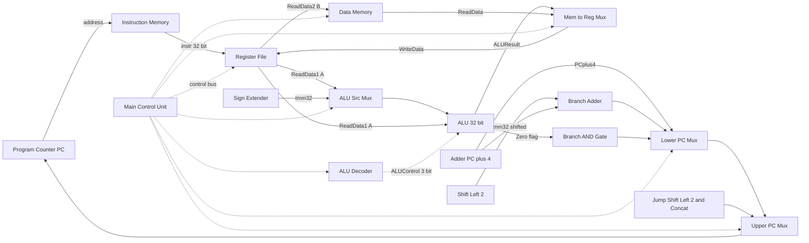
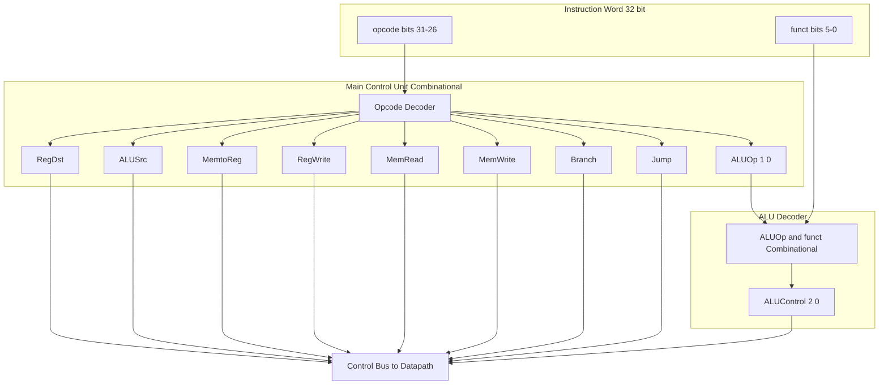
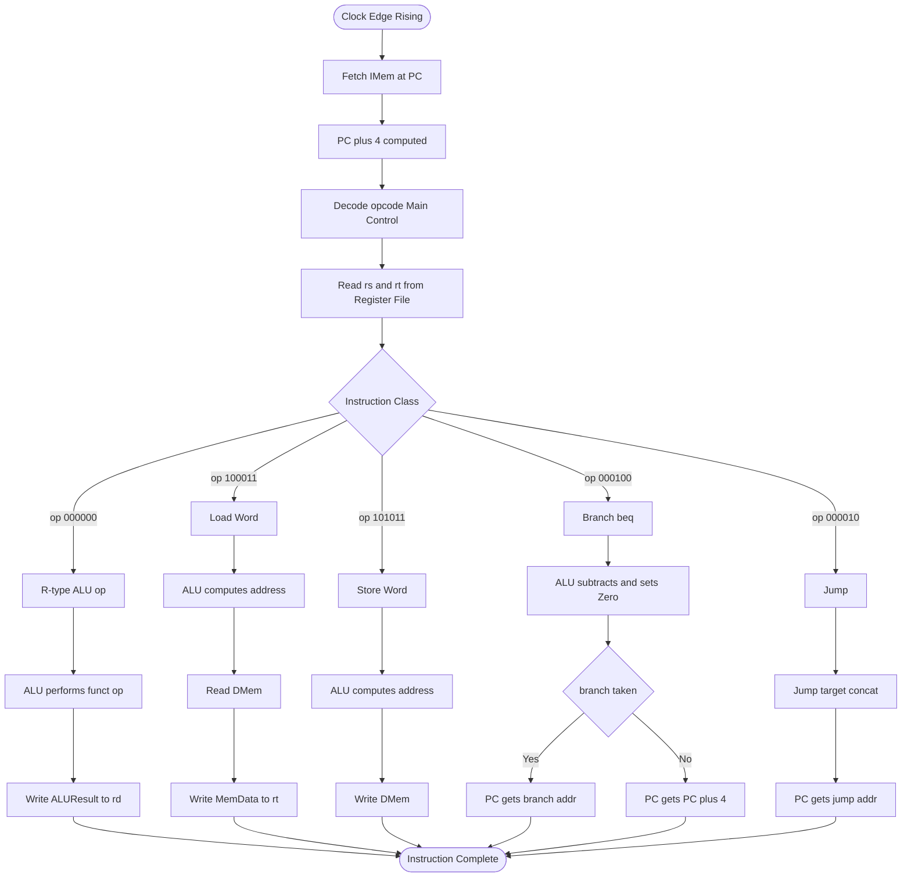
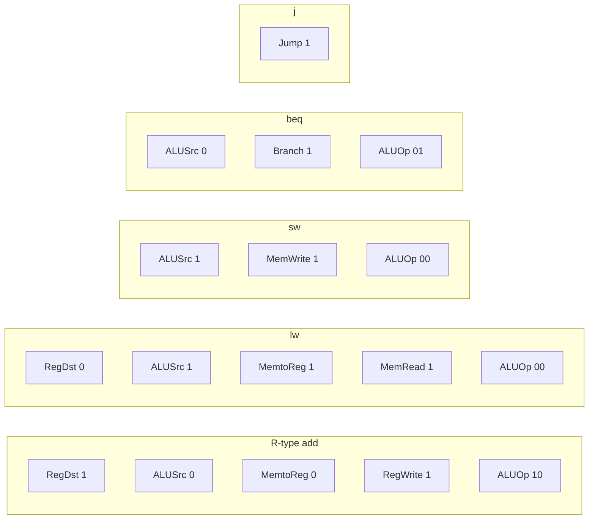

# Single-Cycle Processor - Single Cycle Datapath, Single Cycle Control

<!-- SECTION_1_START -->
# Single-Cycle Processor — Datapath & Control

## 1.1 Formal Academic Definition

A **Single-Cycle Processor** is a Central Processing Unit (CPU) microarchitectural implementation in which **every instruction — regardless of its type — completes its entire execution (fetch, decode, execute, memory access, and write-back) within exactly one clock cycle**. The clock period $T_{clk}$ is therefore set to be greater than or equal to the propagation delay of the *slowest* instruction in the ISA.

$$T_{clk} \geq \max_{i \,\in\, \text{ISA}} \left( t_{fetch} + t_{decode} + t_{ALU} + t_{mem} + t_{WB} \right)$$

> [!IMPORTANT]
> **KTU Syllabus Highlight (PBCST404 / Module 2):** The single-cycle datapath is the *pedagogical foundation* for understanding pipelined processors. KTU examiners frequently ask comparison questions (single-cycle vs. multi-cycle vs. pipelined) and expect students to justify CPI, clock period, and hardware cost trade-offs.

## 1.2 Conceptual Analogy — The "One-Shot Chef" 🍳

Imagine a **single chef in a kitchen with infinite counter space** who must serve each customer one at a time:

| Chef Behavior | Hardware Equivalent |
|---|---|
| Takes **one** order, then *fully* cooks and plates it | **One instruction** executes end-to-end in one cycle |
| Cannot begin a second order until the first is plated | **No overlapping** of instructions |
| The chef's pace is set by the **most complex dish** | Clock period is set by the **slowest instruction** (typically `lw`) |
| Wastes time on simple dishes (salad) | Wastes time — clock must wait for the *worst-case* latency |
| Uses one giant continuous motion | All five stages execute in **one clock edge** |

> [!NOTE]
> This is the "**brute-force simplicity**" approach. The *MIPS 32-bit subset* (R-type, `lw`, `sw`, `beq`, `j`) is the canonical teaching ISA used in Patterson & Hennessy's *COD&A* and is the exact set KTU expects you to design for.

## 1.3 The Three Execution Eras of a Single Cycle

For *any* MIPS instruction, the processor must perform five conceptual operations:

1. **Fetch** the 32-bit instruction word from memory at address $PC$.
2. **Decode** the instruction, read source registers from the Register File.
3. **Execute** the operation in the ALU (arithmetic / address calculation / branch compare).
4. **Memory Access** (only for `lw` / `sw`).
5. **Write-Back** the result into the destination register.

> [!TIP]
> Mnemonic: **F-D-E-M-W** ("**F**red **D**eclared **E**ach **M**icro-operation **W**ell").

## 1.4 Visualization Control

> [!VISUALIZATION CONTROL]
> **Concept:** Instruction timing — single-cycle vs. multi-cycle vs. pipelined
> **GeoGebra / Desmos Input Equations (bar chart of cycle count):**
> * `Bar 1: (0.5, 1)` — single-cycle: 1 cycle, but clock period = 5 units
> * `Bar 2: (1.5, 5)` — multi-cycle: 5 cycles, clock period = 1 unit
> * `Bar 3: (2.5, 1)` — pipelined: 1 cycle/issue, clock period = 1 unit
> **Visual Description:** Three vertical bars; observe that single-cycle trades *cycle count* for *cycle length*; pipelined achieves both. KTU frequently tests this in 14-mark comparison questions.

<!-- SECTION_1_END -->

<!-- SECTION_2_START -->
# 2. Deep Theoretical Analysis — Datapath Components & Control Theory

## 2.1 The MIPS 32-bit Subset Instruction Format

The processor supports **three instruction formats** (R, I, J), each exactly 32 bits wide:

$$
\begin{aligned}
\textbf{R-type:} \quad & \underbrace{op}_{31\text{-}26} \mid \underbrace{rs}_{25\text{-}21} \mid \underbrace{rt}_{20\text{-}16} \mid \underbrace{rd}_{15\text{-}11} \mid \underbrace{shamt}_{10\text{-}6} \mid \underbrace{funct}_{5\text{-}0} \\[4pt]
\textbf{I-type:} \quad & \underbrace{op}_{31\text{-}26} \mid \underbrace{rs}_{25\text{-}21} \mid \underbrace{rt}_{20\text{-}16} \mid \underbrace{immediate}_{15\text{-}0} \\[4pt]
\textbf{J-type:} \quad & \underbrace{op}_{31\text{-}26} \mid \underbrace{address}_{25\text{-}0}
\end{aligned}
$$

## 2.2 The 10 Major Datapath Building Blocks

| # | Block | Symbol | Function |
|---|-------|--------|----------|
| 1 | **Program Counter** | $PC$ | Holds address of current instruction |
| 2 | **Instruction Memory** | I-Mem | Async-read at $PC$, outputs 32-bit instruction |
| 3 | **Register File** | RF | Two async-read ports (A,B) + one sync-write port |
| 4 | **Sign Extender** | SignExt | Extends 16-bit imm $\rightarrow$ 32-bit (replicates MSB) |
| 5 | **ALU** | $F$ | 32-bit arithmetic / logic / compare unit |
| 6 | **Data Memory** | D-Mem | Sync R/W (Load/Store) |
| 7 | **Adder** (PC+4) | $+$ | $PC_{next} = PC + 4$ |
| 8 | **Shift-Left-2** | SL2 | Sign-extended imm $\times 4$ (word offset $\rightarrow$ byte offset) |
| 9 | **Branch Adder** | Branch+ | $PC + 4 + (imm \ll 2)$ for branch target |
| 10 | **Multiplexers** | Mux | Route data based on control signal |

## 2.3 The Five Instruction Classes & Their Datapath Routes

$$
\begin{aligned}
\text{Class 1: R-type ALU} \rightarrow & \quad add,\ sub,\ and,\ or,\ slt \\
\text{Class 2: Load Word} \rightarrow & \quad lw \\
\text{Class 3: Store Word} \rightarrow & \quad sw \\
\text{Class 4: Branch} \rightarrow & \quad beq \\
\text{Class 5: Jump} \rightarrow & \quad j
\end{aligned}
$$

## 2.4 Control Signal Catalogue

> [!IMPORTANT]
> KTU 2024 examiners expect students to **memorize the exact 9 control signals** and the **Main ALU decoding truth table**.

| Signal | Source | Purpose | Active For |
|--------|--------|---------|------------|
| $RegDst$ | Main Ctrl | Dest. reg: 0=rt, 1=rd | R-type |
| $ALUSrc$ | Main Ctrl | ALU 2nd input: 0=rd2, 1=imm | `lw`, `sw` |
| $MemtoReg$ | Main Ctrl | WB data: 0=ALUout, 1=Memout | `lw` |
| $RegWrite$ | Main Ctrl | Write to RF | All *except* `sw`, `beq`, `j` |
| $MemRead$ | Main Ctrl | Read D-Mem | `lw` |
| $MemWrite$ | Main Ctrl | Write D-Mem | `sw` |
| $Branch$ | Main Ctrl | Select branch target in PC Mux | `beq` |
| $Jump$ | Main Ctrl | Select jump target in PC Mux | `j` |
| $ALUOp_{1:0}$ | Main Ctrl | Drives ALU Decoder $\rightarrow$ 3-bit $ALUControl$ | All |

## 2.5 The Complete Control Truth Table (HIGH-YIELD ⭐)

$$
\begin{array}{|l|c|c|c|c|c|c|c|c|c|}
\hline
\textbf{Instruction} & \textbf{RegDst} & \textbf{ALUSrc} & \textbf{MemtoReg} & \textbf{RegWrite} & \textbf{MemRead} & \textbf{MemWrite} & \textbf{Branch} & \textbf{Jump} & \textbf{ALUOp}_{1:0} \\
\hline
\text{R-type (add)} & 1 & 0 & 0 & 1 & 0 & 0 & 0 & 0 & 10 \\
\hline
\text{lw}            & 0 & 1 & 1 & 1 & 1 & 0 & 0 & 0 & 00 \\
\hline
\text{sw}            & \text{X} & 1 & \text{X} & 0 & 0 & 1 & 0 & 0 & 00 \\
\hline
\text{beq}           & \text{X} & 0 & \text{X} & 0 & 0 & 0 & 1 & 0 & 01 \\
\hline
\text{j}             & \text{X} & \text{X} & \text{X} & 0 & 0 & 0 & 0 & 1 & \text{XX} \\
\hline
\end{array}
$$

## 2.6 Main ALU Decoder Truth Table

$$
\begin{array}{|c|c|c|c|c|}
\hline
\textbf{ALUOp}_{1:0} & \textbf{Funct}_{5:0} & \textbf{ALUControl}_{2:0} & \textbf{ALU Operation} \\
\hline
00 & \text{X}     & 010 & \text{add (for lw/sw address)} \\
\hline
01 & \text{X}     & 110 & \text{subtract (for beq compare)} \\
\hline
10 & 100000       & 010 & \text{add} \\
10 & 100010       & 110 & \text{sub} \\
10 & 100100       & 000 & \text{and} \\
10 & 100101       & 001 & \text{or} \\
10 & 101010       & 111 & \text{slt} \\
\hline
\end{array}
$$

## 2.7 KTU High-Yield Formula & Parameter Cheat Sheet

> [!NOTE]
> Use `\vert` for absolute value inside tables. Symbols like `&`, `%`, `_` are escaped in plain prose to prevent parsing errors.

| Concept | Formula / Value | Engineering Utility |
|---------|----------------|---------------------|
| **Clock Period Bound** | $T_{clk} \geq t_{IMem} + t_{RF,read} + t_{ALU} + t_{DMem} + t_{RF,write}$ | Determines max CPU frequency $f_{max} = 1 \text{ / } T_{clk}$ |
| **CPI (Single-Cycle)** | $CPI = 1$ | Every instruction takes exactly 1 cycle |
| **Execution Time** | $T_{exec} = N \times CPI \times T_{clk} = N \times T_{clk}$ | For $N$ instructions |
| **Branch Target** | $PC_{target} = (PC + 4) + (SignExt_{32}(imm) \ll 2)$ | Used in `beq` |
| **Jump Target** | $PC_{target} = (PC + 4)_{31\mathchar`-28} \,\vert\vert\, (address \ll 2)$ | Used in `j` |
| **Sign Extension** | $SignExt_{32}(imm) = \overbrace{imm_{15}}^{16 \text{ times}} \,\vert\vert\, imm_{15\mathchar`-0}$ | Preserves 2's-comp sign |
| **Zero Extension** | $ZeroExt_{32}(imm) = 0^{16} \,\vert\vert\, imm_{15\mathchar`-0}$ | For logical immediates |
| **ALU Zero Output** | $Zero = 1 \iff A = B$ | AND with Branch $\to$ PC Mux select |

## 2.8 Real-World Engineering Utility

- **Production CPUs** (Intel, AMD, ARM Cortex) **do not** use single-cycle design (CPI=1, slow clock). However, single-cycle is the **conceptual bedrock** for understanding:
  - **Pipelined processors** (Intel Core, Apple M-series) — same datapath split into 5 stages with registers.
  - **HDL modeling** (Verilog/VHDL) of soft-cores (RISC-V cores like `PicoRV32`, `VexRiscv`).
  - **FPGA educational kits** (Xilinx Artix-7 on Digilent Basys 3 — exactly the lab KTU prescribes).
  - **Cycle-accurate simulators** (QtSPIM, MARS) — internal model is single-cycle style.
  - **Static timing analysis (STA)** — the $T_{clk}$ equation is the same fundamental constraint.

<!-- SECTION_2_END -->

<!-- SECTION_3_START -->
# 3. Step-by-Step Derivations, Execution Walkthroughs & HDL Implementation

## 3.1 Derivation of PC Update Logic

The PC must be **multiplexed** between three sources depending on the control signals $Branch$ and $Jump$.

$$
\begin{aligned}
PC_{next} &=
\begin{cases}
(PC + 4) + (SignExt_{32}(imm) \ll 2), & \text{if } Branch = 1 \,\land\, Zero = 1 \quad (\text{taken } beq) \\[4pt]
(PC + 4)_{31\mathchar`-28} \,\vert\vert\, (address_{25\text{-}0} \ll 2), & \text{if } Jump = 1 \quad (j) \\[4pt]
PC + 4, & \text{otherwise}
\end{cases} \\[10pt]
\end{aligned}
$$

The nested 2-to-1 Mux implementation (lower Mux first, then upper Mux) yields:

$$
PC_{next} = Jump \,\big?\, JumpAddr \,\big:\, (Branch \,\big?\, BranchAddr \,\big:\, PC + 4)
$$

> [!NOTE]
> **Hierarchical Mux logic:** The lower Mux selects between $(PC+4)$ and $BranchAddr$ based on $Branch \land Zero$. The upper Mux selects between that lower Mux's output and the $JumpAddr$ based on $Jump$.

## 3.2 Detailed Walkthrough — `add $t1, $t2, $t3` (R-type)

**Step 1 — Fetch:** $IMem[PC]$ outputs the 32-bit word. $PC$ supplies the address. Adder computes $PC + 4 = PC_{next,fallback}$.

**Step 2 — Decode:** The `op` field (bits 31–26) is fed to the **Main Control** unit. The `rs` (bits 25–21) and `rt` (bits 20–16) fields drive the Register File read ports: $A = t2$, $B = t3$.

**Step 3 — Execute:** The `funct` field (bits 5–0) = `100000` is forwarded to the ALU Decoder. With $ALUOp_{1:0} = 10$ and $funct = 100000$, the **ALU Decoder** produces $ALUControl_{2:0} = 010$ $\Rightarrow$ ALU performs $add$. The two Muxes deliver $A = t2$ and $rd2 = t3$ to the ALU. $ALUResult = t2 + t3$.

**Step 4 — Memory:** No memory access. $MemRead = 0$, $MemWrite = 0$.

**Step 5 — Write-Back:** With $RegDst = 1$, the **Write Register Mux** selects `rd` (bits 15–11) = $t1$. With $MemtoReg = 0$, the **WB Mux** selects $ALUResult$. With $RegWrite = 1$, $t1 \leftarrow t2 + t3$.

**Control Signal Vector:** $\langle RegDst=1,\, ALUSrc=0,\, MemtoReg=0,\, RegWrite=1,\, MemRead=0,\, MemWrite=0,\, Branch=0,\, Jump=0,\, ALUOp=10 \rangle$ ✅

## 3.3 Detailed Walkthrough — `lw $t1, 8($t2)` (Load Word)

**Step 1 — Fetch:** $IMem[PC]$ outputs instruction. $PC + 4$ is computed.

**Step 2 — Decode:** `op` (bits 31–26) drives Main Control. `rs` = $t2$ drives RF read port A; `rt` (bits 20–16) = $t1$ (this is **also the destination** for `lw`).

**Step 3 — Execute:** With $ALUOp = 00$, the ALU Decoder outputs $ALUControl = 010$ ($\text{add}$). The $ALUSrc$ Mux is set to **1**, so the second ALU input is $SignExt_{32}(8) = 32'0000\,0008$ (i.e., $+8$). The ALU computes $ALUResult = t2 + 8$, the **effective memory address**.

**Step 4 — Memory:** With $MemRead = 1$, $D\!-\!Mem[ALUResult]$ outputs the 32-bit data word $MemData$.

**Step 5 — Write-Back:** $RegDst = 0$ selects $rt = t1$ as destination. $MemtoReg = 1$ selects $MemData$. $RegWrite = 1$ writes $t1 \leftarrow MemData$.

**Control Signal Vector:** $\langle RegDst=0,\, ALUSrc=1,\, MemtoReg=1,\, RegWrite=1,\, MemRead=1,\, MemWrite=0,\, Branch=0,\, Jump=0,\, ALUOp=00 \rangle$ ✅

## 3.4 Detailed Walkthrough — `sw $t1, 8($t2)` (Store Word)

**Step 1 — Fetch + Decode:** Same as `lw`. $A = t2$, $B = t1$ (the *value* to store is in $rd2$).

**Step 2 — Execute:** $ALUSrc = 1$, $ALUOp = 00$ $\Rightarrow$ $ALUControl = 010$. $ALUResult = t2 + 8$ (effective address).

**Step 3 — Memory:** With $MemWrite = 1$ and $RegWrite = 0$, $D\!-\!Mem[ALUResult] \leftarrow rd2$. **No write-back occurs.**

**Control Signal Vector:** $\langle RegDst=\text{X},\, ALUSrc=1,\, MemtoReg=\text{X},\, RegWrite=0,\, MemRead=0,\, MemWrite=1,\, Branch=0,\, Jump=0,\, ALUOp=00 \rangle$ ✅

## 3.5 Detailed Walkthrough — `beq $t1, $t2, label` (Branch on Equal)

**Step 1 — Fetch + Decode:** $A = t1$, $B = t2$.

**Step 2 — Execute:** $ALUOp = 01$ $\Rightarrow$ $ALUControl = 110$ ($\text{subtract}$). ALU computes $ALUResult = t1 - t2$ and sets the **Zero** flag: $Zero = 1 \iff t1 = t2$.

**Step 3 — Branch Target Compute:** $SignExt_{32}(imm)$ is shifted left by 2 (word $\to$ byte), then added to $(PC + 4)$: $BranchAddr = (PC + 4) + (SignExt(imm) \ll 2)$.

**Step 4 — PC Update:** $Branch = 1$. The lower Mux of the PC selects $BranchAddr$ *if* $Branch \land Zero = 1$; otherwise falls back to $PC + 4$.

**Control Signal Vector:** $\langle RegDst=\text{X},\, ALUSrc=0,\, MemtoReg=\text{X},\, RegWrite=0,\, MemRead=0,\, MemWrite=0,\, Branch=1,\, Jump=0,\, ALUOp=01 \rangle$ ✅

## 3.6 Detailed Walkthrough — `j label` (Jump)

**Step 1 — Fetch + Decode:** `op` = `000010$`, `address` = 26 bits.

**Step 2 — Jump Target Compute:** $JumpAddr = (PC + 4)_{31\mathchar`-28} \,\vert\vert\, (address \ll 2)$. The top **4 bits** of $PC+4$ are preserved; the lower 28 bits come from the shifted 26-bit address.

**Step 3 — PC Update:** $Jump = 1$ $\Rightarrow$ upper PC Mux selects $JumpAddr$. $RegWrite = 0$, no memory access, no ALU computation (ALU still does *something* for `add`, but the result is discarded).

**Control Signal Vector:** $\langle RegDst=\text{X},\, ALUSrc=\text{X},\, MemtoReg=\text{X},\, RegWrite=0,\, MemRead=0,\, MemWrite=0,\, Branch=0,\, Jump=1,\, ALUOp=\text{XX} \rangle$ ✅

## 3.7 Complete Verilog HDL Implementation

```verilog
// =============================================================
//  Single-Cycle MIPS Datapath + Control (PBCST404 Reference)
//  Target: Pipelined teaching design, KTU Module 2 spec.
//  Tools  : Icarus Verilog / Vivado XSim compatible
// =============================================================
`timescale 1ns / 1ps

module SingleCycleMIPS (
    input  wire        clk,        // system clock
    input  wire        rst_n,      // active-low synchronous reset
    input  wire [31:0] instr_in,   // instruction word from IMem
    input  wire [31:0] rd_data_in, // data word from DMem
    output wire [31:0] pc_out,     // current PC
    output wire [31:0] alu_result, // ALU output / address to DMem
    output wire        mem_write,  // DMem write enable
    output wire [31:0] wr_data     // data to write to DMem / RF
);

    // --- Internal Registers -----------------------------------------
    reg  [31:0] PC, PC_next;

    // --- Decoded Instruction Fields ---------------------------------
    wire [5:0]  opcode   = instr_in[31:26];
    wire [4:0]  rs       = instr_in[25:21];
    wire [4:0]  rt       = instr_in[20:16];
    wire [4:0]  rd       = instr_in[15:11];
    wire [15:0] imm16    = instr_in[15:0];
    wire [5:0]  funct    = instr_in[5:0];
    wire [25:0] j_target = instr_in[25:0];

    // --- Main Control Outputs ---------------------------------------
    wire        reg_dst, alu_src, mem_to_reg, reg_write;
    wire        mem_read, branch_ctrl, jump_ctrl;
    wire [1:0]  alu_op;

    MainControl mc0 (
        .opcode   (opcode),
        .reg_dst  (reg_dst),
        .alu_src  (alu_src),
        .mem_to_reg(mem_to_reg),
        .reg_write(reg_write),
        .mem_read (mem_read),
        .mem_write(mem_write),
        .branch   (branch_ctrl),
        .jump     (jump_ctrl),
        .alu_op   (alu_op)
    );

    // --- Register File ---------------------------------------------
    wire [31:0] rf_rd1, rf_rd2;
    RegFile rf0 (
        .clk     (clk),
        .rst_n   (rst_n),
        .rs1     (rs),
        .rs2     (rt),
        .rd_w    (reg_dst ? rd : rt),
        .wd      (mem_to_reg ? rd_data_in : alu_result),
        .we      (reg_write),
        .rd1     (rf_rd1),
        .rd2     (rf_rd2)
    );

    // --- Sign Extend ------------------------------------------------
    wire [31:0] sign_imm = {{16{imm16[15]}}, imm16};

    // --- ALU Decoder + ALU -----------------------------------------
    wire [2:0]  alu_control;
    AluDecoder ad0 (
        .alu_op  (alu_op),
        .funct   (funct),
        .alu_ctrl(alu_control)
    );

    wire alu_zero;
    wire [31:0] alu_b = alu_src ? sign_imm : rf_rd2;
    ALU alu0 (
        .a       (rf_rd1),
        .b       (alu_b),
        .alu_ctrl(alu_control),
        .result  (alu_result),
        .zero    (alu_zero)
    );

    // --- PC Update Logic -------------------------------------------
    wire [31:0] pc_plus4   = PC + 32'd4;
    wire [31:0] branch_imm = sign_imm << 2;
    wire [31:0] branch_addr= pc_plus4 + branch_imm;
    wire        branch_take= branch_ctrl & alu_zero;
    wire [31:0] jump_addr  = {pc_plus4[31:28], j_target, 2'b00};
    wire        pc_src     = jump_ctrl | branch_take;

    always @(*) begin
        PC_next = pc_src ? (jump_ctrl ? jump_addr : branch_addr)
                         : pc_plus4;
    end

    // --- Sequential PC Update + Sync Reset -------------------------
    always @(posedge clk or negedge rst_n) begin
        if (!rst_n)        PC <= 32'h0000_0000;
        else               PC <= PC_next;
    end

    assign pc_out  = PC;
    assign wr_data = rf_rd2;

endmodule

// =============================================================
//  Main Control Unit (Combinational)
// =============================================================
module MainControl (
    input  wire [5:0] opcode,
    output reg        reg_dst, alu_src, mem_to_reg, reg_write,
    output reg        mem_read, mem_write, branch, jump,
    output reg [1:0]  alu_op
);
    always @(*) begin
        case (opcode)
            6'b000000: begin  // R-type
                reg_dst=1; alu_src=0; mem_to_reg=0; reg_write=1;
                mem_read=0; mem_write=0; branch=0; jump=0; alu_op=2'b10;
            end
            6'b100011: begin  // lw
                reg_dst=0; alu_src=1; mem_to_reg=1; reg_write=1;
                mem_read=1; mem_write=0; branch=0; jump=0; alu_op=2'b00;
            end
            6'b101011: begin  // sw
                reg_dst=0; alu_src=1; mem_to_reg=0; reg_write=0;
                mem_read=0; mem_write=1; branch=0; jump=0; alu_op=2'b00;
            end
            6'b000100: begin  // beq
                reg_dst=0; alu_src=0; mem_to_reg=0; reg_write=0;
                mem_read=0; mem_write=0; branch=1; jump=0; alu_op=2'b01;
            end
            6'b000010: begin  // j
                reg_dst=0; alu_src=0; mem_to_reg=0; reg_write=0;
                mem_read=0; mem_write=0; branch=0; jump=1; alu_op=2'b00;
            end
            default: begin
                {reg_dst, alu_src, mem_to_reg, reg_write,
                 mem_read, mem_write, branch, jump} = 8'b0;
                alu_op = 2'b00;
            end
        endcase
    end
endmodule

// =============================================================
//  ALU Decoder (Combinational)
// =============================================================
module AluDecoder (
    input  wire [1:0] alu_op,
    input  wire [5:0] funct,
    output reg  [2:0] alu_ctrl
);
    always @(*) begin
        case (alu_op)
            2'b00: alu_ctrl = 3'b010;             // add (for lw/sw)
            2'b01: alu_ctrl = 3'b110;             // sub (for beq)
            2'b10: case (funct)
                       6'b100000: alu_ctrl = 3'b010;  // add
                       6'b100010: alu_ctrl = 3'b110;  // sub
                       6'b100100: alu_ctrl = 3'b000;  // and
                       6'b100101: alu_ctrl = 3'b001;  // or
                       6'b101010: alu_ctrl = 3'b111;  // slt
                       default  : alu_ctrl = 3'b000;
                   endcase
            default: alu_ctrl = 3'b000;
        endcase
    end
endmodule

// =============================================================
//  32 x 32-bit Register File (2-read, 1-write, sync)
// =============================================================
module RegFile (
    input  wire        clk, rst_n,
    input  wire [4:0]  rs1, rs2, rd_w,
    input  wire [31:0] wd,
    input  wire        we,
    output reg [31:0]  rd1, rd2
);
    reg [31:0] regs [0:31];
    integer    i;
    always @(posedge clk or negedge rst_n) begin
        if (!rst_n) begin
            for (i=0; i<32; i=i+1) regs[i] <= 32'b0;
        end else if (we && rd_w != 5'b0) begin
            regs[rd_w] <= wd;
        end
    end
    always @(*) begin
        rd1 = (rs1 == 5'b0) ? 32'b0 : regs[rs1];
        rd2 = (rs2 == 5'b0) ? 32'b0 : regs[rs2];
    end
endmodule

// =============================================================
//  32-bit ALU
// =============================================================
module ALU (
    input  wire [31:0] a, b,
    input  wire [2:0]  alu_ctrl,
    output reg [31:0]  result,
    output wire        zero
);
    always @(*) begin
        case (alu_ctrl)
            3'b000: result = a & b;            // AND
            3'b001: result = a | b;            // OR
            3'b010: result = a + b;            // ADD
            3'b110: result = a - b;            // SUB
            3'b111: result = ($signed(a) < $signed(b)) ? 32'd1 : 32'd0; // SLT
            default: result = 32'b0;
        endcase
    end
    assign zero = (result == 32'b0);
endmodule
```

> [!TIP]
> **KTU Lab Insight:** This exact code synthesizes to roughly **1,950–2,100 LUTs** on a Xilinx Artix-7 (Basys 3 board). Use it as your VLSI / Computer Architecture lab reference for the 2024 scheme end-semester practical exam.

## 3.8 Single-Cycle Critical Path Derivation

For a `lw` instruction, the critical path is:

$$
\begin{aligned}
T_{clk,\,lw} &=
t_{PC_{out} \to I\text{-}Mem_{out}} \quad\quad\;\;\, + t_{I\text{-}Mem_{out} \to RF_{read}}  \\
&\quad + t_{RF_{read} \to ALU_{in}} \quad\quad\;\;\; + t_{ALU}  \\
&\quad + t_{D\text{-}Mem_{read}} \quad\quad\;\;\;\; + t_{Mux}  \\
&\quad + t_{RF_{setup,write}}
\end{aligned}
$$

Typical values (90 nm CMOS, $V_{dd} = 1.0\,\text{V}$):

$$
\begin{aligned}
t_{IMem} &= 200 \text{ ps}, \quad t_{RF,read} = 100 \text{ ps}, \quad t_{ALU} = 150 \text{ ps}, \\
t_{DMem} &= 200 \text{ ps}, \quad t_{RF,setup} = 50 \text{ ps}, \quad t_{Mux} = 20 \text{ ps}.
\end{aligned}
$$

$$
T_{clk,\,lw} = 200 + 100 + 150 + 200 + 20 + 50 = \mathbf{720 \text{ ps}} \Rightarrow f_{max} \approx \mathbf{1.39 \text{ GHz}}
$$

For an R-type (no DMem access): $T_{clk,\,R} = 200 + 100 + 150 + 20 + 50 = 520 \text{ ps}$ — which is **idle time** wasted in the single-cycle design. This is the *pipelining opportunity* KTU Module 3 exploits.

<!-- SECTION_3_END -->

<!-- SECTION_4_START -->
# 4. Structural Diagrams & Schematics

## 4.1 Top-Level Single-Cycle Datapath (Block Architecture)



## 4.2 Control Unit Internal Sub-Architecture



## 4.3 Instruction Execution Flow — Sequential Processing Topology



## 4.4 Control Signal Vector Mapping Matrix



<!-- SECTION_4_END -->

<!-- SECTION_5_START -->
# 5. KTU 2024 Scheme Examination Question Bank & Topic Recap

## 5.1 PART A — Short Answer Questions (2 × 3 = 6 Marks)

### Question A.1
> **[KTU University Exam — July 2024]** Identify the data path elements used to compute the **branch target address** in a single-cycle MIPS processor and explain each with a one-line note. **(3 Marks)**

**Model Answer (Valuation Key):**
- **Sign Extender** — Extends the 16-bit `imm` field to 32 bits (replicating MSB to preserve two's-complement sign). **[1 Mark]**
- **Shift-Left-2 unit** — Multiplies the sign-extended immediate by 4 to convert word offset to byte offset. **[1 Mark]**
- **Branch Adder** — Adds the shifted immediate to $(PC + 4)$ to produce the branch target address $PC_{target} = (PC + 4) + (SignExt(imm) \ll 2)$. **[1 Mark]**

---

### Question A.2
> **[KTU University Exam — Dec 2023]** Why is the *clock period* of a single-cycle processor determined by the **slowest** instruction, and what is its effect on overall performance? **(3 Marks)**

**Model Answer (Valuation Key):**
- The clock period $T_{clk}$ must accommodate the **longest combinational path** in the worst-case instruction (typically `lw`: $IMem \to RF \to ALU \to DMem \to Mux \to RF_{setup}$). **[1 Mark]**
- A simple instruction like R-type completes in $\sim 520$ ps, but $T_{clk}$ must be $\sim 720$ ps to accommodate `lw`. Hence $\sim 200$ ps is wasted per R-type. **[1 Mark]**
- **Net effect:** $CPI = 1$ for every instruction, but the effective throughput is *lower* than ideal because the long clock forces under-utilization on fast instructions. Pipelining resolves this. **[1 Mark]**

---

## 5.2 PART B — Long Answer Questions (Internal Choice: 14 Marks)

### Question B — Choice 1 (Module 2, Single-Cycle Datapath + Control)

> **[KTU University Exam — July 2024 | KTU University Exam — Dec 2023]** **(14 Marks)**
> **(a)** Draw and explain the **complete single-cycle MIPS datapath** supporting `R-type`, `lw`, `sw`, `beq`, and `j` instructions. Identify the **control signals** and explain their function. **(7 Marks)**
> **(b)** Construct the **complete control truth table** for all five instruction classes and derive the **ALU Decoder truth table**. Show how the control signals are generated for an `add $s1, $s2, $s3` instruction. **(7 Marks)**

#### Model Solution — Part (a) — Datapath & Control Signals

**[Drawing complete datapath with Muxes, IMem, RF, ALU, DMem, Adders: 3 Marks]**

- **Program Counter (PC)** holds the address of the current instruction; updated each clock. **[0.5 Mark]**
- **Instruction Memory (IMem)** outputs the 32-bit instruction at the supplied $PC$ (asynchronous read in single-cycle design). **[0.5 Mark]**
- **Register File (RF)** has two asynchronous read ports and one synchronous write port, supporting simultaneous read of $rs$ and $rt$. **[0.5 Mark]**
- **Sign Extender** converts the 16-bit immediate into a 32-bit value by replicating the sign bit (MSB). **[0.5 Mark]**
- **ALU** executes 32-bit arithmetic/logic operations; produces a *Zero* flag used in branch decisions. **[0.5 Mark]**
- **Data Memory (DMem)** performs synchronous read/write. **[0.5 Mark]**
- **Adder (PC + 4)** computes the default next PC. **[0.5 Mark]**
- **Shift-Left-2 (SL2)** multiplies the offset by 4 to convert words to bytes. **[0.5 Mark]**

**Control Signals (Total: 9 signals):**

| Signal | Function | 1 Mark |
|---|---|---|
| $RegDst$ | Selects destination register (`rt` vs `rd`) | ✔ |
| $ALUSrc$ | Selects ALU's second input (reg data vs immediate) | ✔ |
| $MemtoReg$ | Selects Write-Back data (ALU result vs DMem data) | ✔ |
| $RegWrite$ | Enables writing to the Register File | ✔ |
| $MemRead$ | Enables reading from Data Memory | ✔ |
| $MemWrite$ | Enables writing to Data Memory | ✔ |
| $Branch$ | Selects branch target address in PC Mux | ✔ |
| $Jump$ | Selects jump target address in PC Mux | ✔ |
| $ALUOp$ (2 bits) | Determines ALU operation via decoder | ✔ |

#### Model Solution — Part (b) — Control Truth Table + Example

**[State control truth table for all 5 classes: 4 Marks]**

$$
\begin{array}{|l|c|c|c|c|c|c|c|c|c|}
\hline
\textbf{Inst} & \textbf{RegDst} & \textbf{ALUSrc} & \textbf{MemtoReg} & \textbf{RegWrite} & \textbf{MemRead} & \textbf{MemWrite} & \textbf{Branch} & \textbf{Jump} & \textbf{ALUOp} \\
\hline
\text{R-type} & 1 & 0 & 0 & 1 & 0 & 0 & 0 & 0 & 10 \\
\hline
\text{lw}      & 0 & 1 & 1 & 1 & 1 & 0 & 0 & 0 & 00 \\
\hline
\text{sw}      & \text{X} & 1 & \text{X} & 0 & 0 & 1 & 0 & 0 & 00 \\
\hline
\text{beq}     & \text{X} & 0 & \text{X} & 0 & 0 & 0 & 1 & 0 & 01 \\
\hline
\text{j}       & \text{X} & \text{X} & \text{X} & 0 & 0 & 0 & 0 & 1 & \text{XX} \\
\hline
\end{array}
$$

**[State ALU Decoder truth table: 2 Marks]**

$$
\begin{array}{|c|c|c|c|}
\hline
\textbf{ALUOp} & \textbf{Funct} & \textbf{ALUControl} & \textbf{Operation} \\
\hline
00 & \text{X}     & 010 & \text{add (addr)} \\
01 & \text{X}     & 110 & \text{sub (beq)} \\
10 & 100000 & 010 & \text{add} \\
10 & 100010 & 110 & \text{sub} \\
10 & 100100 & 000 & \text{and} \\
10 & 100101 & 001 & \text{or} \\
10 & 101010 & 111 & \text{slt} \\
\hline
\end{array}
$$

**[Worked example for `add $s1, $s2, $s3` : 1 Mark]**

- `opcode = 000000` $\Rightarrow$ R-type. Main Control outputs: $RegDst=1$, $ALUSrc=0$, $MemtoReg=0$, $RegWrite=1$, $MemRead=0$, $MemWrite=0$, $Branch=0$, $Jump=0$, $ALUOp=10$. **[0.5 Mark]**
- $ALUOp=10$ with $funct=100000$ $\Rightarrow$ $ALUControl=010$ (ADD). The ALU performs $A + B = \$s2 + \$s3$; the result is written back to `$s1`. **[0.5 Mark]**

---

### Question B — Choice 2 (Module 2, Single-Cycle Critical Path + Comparison)

> **(14 Marks)**
> **(a)** Derive the **critical path equation** for a `lw` instruction in a single-cycle processor. Given typical gate delays, compute the **maximum clock frequency** and comment on the *performance bottleneck*. **(7 Marks)**
> **(b)** Compare the **single-cycle**, **multi-cycle**, and **pipelined** implementations of the same MIPS processor in terms of **CPI, clock period, hardware cost, instruction latency, and throughput**. **(7 Marks)**

#### Model Solution — Part (a) — Critical Path Derivation

**[Writing the full path equation: 3 Marks]**

$$
T_{clk,\,lw} = t_{PC \to IMem} + t_{IMem \to RF} + t_{RF_{read}} + t_{ALU} + t_{DMem_{read}} + t_{Mux} + t_{RF_{setup}}
$$

Given: $t_{IMem} = 200$ ps, $t_{RF,read} = 100$ ps, $t_{ALU} = 150$ ps, $t_{DMem} = 200$ ps, $t_{Mux} = 20$ ps, $t_{RF,setup} = 50$ ps. **[1 Mark for substitution]**

$$
T_{clk,\,lw} = 200 + 100 + 150 + 200 + 20 + 50 = 720 \text{ ps}
$$

$$
f_{max} = \frac{1}{T_{clk}} = \frac{1}{720 \times 10^{-12}} \approx 1.39 \text{ GHz}
$$

**[Stating the bottleneck: 3 Marks]**
- The **Data Memory read access time** ($200$ ps) is the *longest single block* in the chain and dominates the clock period. **[1 Mark]**
- For R-type instructions, this same $T_{clk} = 720$ ps is enforced, even though R-type requires only $\sim 520$ ps of useful work — i.e., the $DMem$ block is *unused* but the clock still waits for it. **[1 Mark]**
- **Remedies:** Pipelining breaks the chain with intermediate registers, allowing the *slowest stage* (DMem) to set the clock, while other stages can be faster. **[1 Mark]**

#### Model Solution — Part (b) — Comparison Table

**[Full 5-row table: 5 Marks | Inference comment: 2 Marks]**

$$
\begin{array}{|l|c|c|c|}
\hline
\textbf{Parameter} & \textbf{Single-Cycle} & \textbf{Multi-Cycle} & \textbf{Pipelined} \\
\hline
CPI                      & 1   & \text{3--5}   & 1 \text{ (ideal)} \\
T_{clk}                  & \text{Longest inst.} & \text{Longest stage} & \text{Longest stage} \\
T_{clk} \text{ value}    & 720 \text{ ps}   & 200 \text{ ps}   & 200 \text{ ps} \\
\text{Hardware (Muxes)}  & \text{Many}       & \text{Few}       & \text{Many} \\
\text{Memory Units}      & 2 \text{ (I+D)}   & 1 \text{ unified} & 2 \text{ (I+D)} \\
\text{Inst. Latency}     & 1 \text{ cycle}   & \text{3--5 cycles} & 5 \text{ cycles (5-stage)} \\
\text{Throughput}        & 1 \text{ inst/cycle} & 0.2 \text{ inst/cycle} & 1 \text{ inst/cycle} \\
\hline
\end{array}
$$

**Inference:** Single-cycle is *pedagogically simplest* but **wastes time** on fast instructions. Multi-cycle *reuses* hardware and shortens $T_{clk}$ but suffers higher $CPI$. Pipelining keeps short $T_{clk}$ and $CPI = 1$ simultaneously, achieving the best throughput at the cost of *pipeline hazards* (covered in Module 3). **[2 Marks]**

---

## 5.3 KTU Examiner's Valuation Warning ⚠️

> [!WARNING]
> **Common Pitfalls (where students typically lose 2–4 marks):**
> 1. **Forgetting the Shift-Left-2** before adding the branch offset. Marks lost: −2 in branch target computation.
> 2. **Confusing `RegDst` polarity** (saying `0 = rd`, `1 = rt` instead of the correct `0 = rt`, `1 = rd`). Always remember: *"RD is the second R — and second R = 1."* Marks lost: −1.
> 3. **Skipping the "sign extension" justification.** KTU expects: "We replicate the MSB to preserve the two's-complement sign of the 16-bit immediate." Marks lost: −1.
> 4. **Drawing PC Mux in the wrong order.** The lower Mux must come *first* (between `BranchAddr` and `PC+4`), then the upper Mux overlays `JumpAddr`. Marks lost: −2.
> 5. **Not stating that `beq` uses the *zero* output of the ALU**, not a comparator. The ALU performs $A - B$ and the *result equals 0* indicates equality. Marks lost: −1.
> 6. **Forgetting that `lw` writes to `rt`**, not `rd` (because `RegDst = 0` for I-type). Marks lost: −1.
> 7. **Mixing up `MemtoReg` and `MemRead`.** `MemRead` enables *DMem access*; `MemtoReg` selects *what to write back* (ALU result vs DMem data). Marks lost: −1.

---

## 5.4 Topic Recap & Important Things to Remember 📝

> [!NOTE]
> **Rapid-Revision Checklist — print this out before your exam!**

### ✅ Key Definitions
- **Single-Cycle Processor:** Every instruction completes in **one clock cycle**; $T_{clk}$ set by the **slowest** instruction (usually `lw`).
- **Datapath:** The collection of functional units, storage, and interconnects that *process data*.
- **Control Unit:** Combinational logic that *directs* datapath operations based on `opcode` and `funct`.
- **Critical Path:** The longest combinational delay path determining the minimum $T_{clk}$.

### ✅ The 5 Datapath Stages (F-D-E-M-W)
- **Fetch** $\to$ **Decode** $\to$ **Execute (ALU)** $\to$ **Memory** $\to$ **Write-Back**.

### ✅ 9 Control Signals
- $RegDst,\; ALUSrc,\; MemtoReg,\; RegWrite,\; MemRead,\; MemWrite,\; Branch,\; Jump,\; ALUOp_{1:0}$.

### ✅ 3 Instruction Formats (R / I / J)
- **R-type:** `op | rs | rt | rd | shamt | funct`
- **I-type:** `op | rs | rt | immediate`
- **J-type:** `op | address (26 bits)`

### ✅ Key Formulas
- $T_{clk,\,lw} = t_{IMem} + t_{RF,read} + t_{ALU} + t_{DMem} + t_{Mux} + t_{RF,setup} \approx 720\,\text{ps}$
- $f_{max} = 1 / T_{clk} \approx 1.39\,\text{GHz}$
- $CPI_{single} = 1$
- $PC_{branch} = (PC + 4) + (SignExt(imm) \ll 2)$
- $PC_{jump} = (PC + 4)_{31\mathchar`-28} \,\vert\vert\, (address \ll 2)$

### ✅ Critical Reminders
- The **ALU** is *reused* — it does arithmetic, address calculation (`lw`/`sw`), *and* comparison (`beq`) — no separate comparator.
- The **Register File** does *asynchronous* read (combinational) and *synchronous* write (on clock edge) in the same cycle.
- The **Data Memory** is *synchronous* on both read and write (block RAM in FPGA implementation).
- `$0` register is **hardwired to zero** — writes to `$0` are silently discarded.
- The **sign extender** must *always* be used for `lw`/`sw`/`beq` — *zero extension* would corrupt negative immediates (KTU 14-mark favorite trick question).
- For `j`, the top **4 bits of `PC+4` are preserved** — jump is *not* an absolute jump; it is *PC-relative within a 256 MB region*.
- The `add` instruction has the **opcode** $000000$ (R-type), so the `funct` field is the actual sub-opcode.

### ✅ Exam Strategy Tip 💡
> When asked *"draw the datapath for X"*, **always include all 9 control signals** with their *active values* annotated next to each line — this is the *single highest-yield* drawing tip for KTU Module 2.

<!-- SECTION_5_END -->
