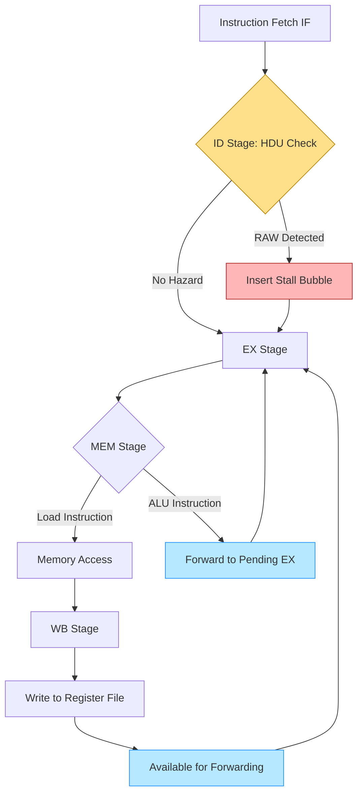
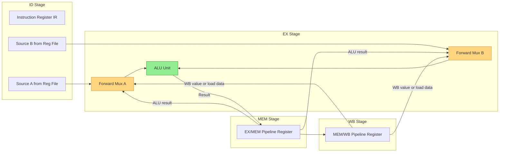
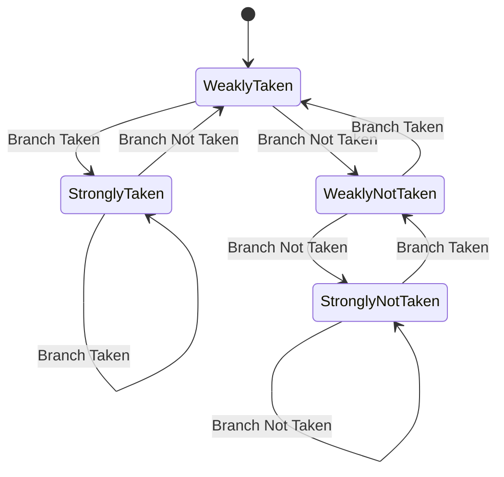

# Solving Data/Control Hazards

<!-- SECTION_1_START -->

# Solving Data and Control Hazards

## 1.1 Formal Definition (KTU 2024 Syllabus Terminology)

In a pipelined datapath, **pipeline hazards** are situations where the next instruction cannot execute in the designated clock cycle, thereby preventing the ideal CPI (Cycles Per Instruction) value of **1** from being achieved. Hazards force the pipeline to **stall, flush, or forward** data, directly increasing the effective CPI and reducing instruction throughput.

> [!IMPORTANT]
> **KTU Module 2 Highlight:** Hazards are classified into three structural families as per Hennessy and Patterson's taxonomy, which is the prescribed reference for **PBCST404**.
> 1. **Structural Hazards** — Hardware resource conflicts (e.g., single memory port for both instruction fetch and data load).
> 2. **Data Hazards** — Dependency on a result not yet computed/forwarded.
> 3. **Control Hazards** — Caused by branch, jump, and exception instructions whose outcome is unknown until late in the pipeline.

For Module 2 of PBCST404, the focus is on **Data and Control Hazards** and the microarchitectural mechanisms used to resolve them.

### 1.1.1 Data Hazard Sub-Classification

| Hazard Type | Also Known As | Modern Pipeline Relevance |
|---|---|---|
| **Read After Write (RAW)** | True Data Dependency | **Most frequent**; cannot be eliminated by hardware reordering |
| **Write After Read (WAR)** | Anti-Dependency | Eliminated by in-order issue of reads/writes |
| **Write After Write (WAW)** | Output Dependency | Eliminated by in-order completion of writes |

> [!NOTE]
> **WAR and WAW are Name Dependencies**, not true data dependencies. They arise from reusing register names and disappear when the pipeline issues instructions **in order**. KTU exams typically emphasize **RAW** hazards.

## 1.2 Conceptual Analogy — The Assembly Line

Imagine a **car manufacturing assembly line** with five stations: *Welding → Painting → Engine Fit → Wheel Assembly → Quality Check*.

- **RAW Analogy:** Station 3 (Engine Fit) needs the engine from Station 2 (Welding). The engine arrives **2 stations late** — Station 3 must **wait (stall)** or install it from a **conveyor side-belt (forwarding/bypassing)**.
- **Control Hazard Analogy:** A robotic arm at the end decides whether the car is a *Sedan* or *SUV*. Until it scans the bar code, Station 1 cannot know which parts to weld for the **next car**. It must either **guess (branch prediction)**, **pause (pipeline freeze)**, or **discard the wrong work (pipeline flush)**.
- **Structural Hazard Analogy:** A single shared robotic welder is needed by both Station 1 and Station 5 — they must take turns.

This assembly-line intuition is exactly how a 5-stage RISC pipeline (IF, ID, EX, MEM, WB) behaves when successive instructions share data.

> [!VISUALIZATION CONTROL]
> **Concept:** Pipeline timing diagram showing RAW hazard between consecutive ALU instructions.
> **Desmos/Graphing Input:** Use a Gantt-chart style plot. X-axis = clock cycles (1 to 8), Y-axis = pipeline stages.
> **Points to mark (Stage, Cycle):**
> * Instruction $I_1$ (ALU result needed by $I_2$): IF(1), ID(2), EX(3), MEM(4), WB(5)
> * Instruction $I_2$: IF(2), ID(3), EX(4), MEM(5), WB(6)
> **Visual Description:** Observe that $I_2$ reaches **EX at cycle 4** but the ALU operand from $I_1$ is written back only at **cycle 5** — a 1-cycle gap requiring forwarding from EX/MEM or MEM/WB latches.

<!-- SECTION_1_END -->

<!-- SECTION_2_START -->

# 2. Deep Theoretical Analysis & KTU High-Yield Formula Sheet

## 2.1 Anatomy of a RAW Data Hazard

A RAW hazard occurs when instruction $I_j$ reads a register that instruction $I_i$ (earlier in program order) is going to write. The write has not yet reached the **register file's read port** by the time $I_j$ is in the ID stage.

### 2.1.1 Standard 5-Stage Pipeline Register Writeback Timeline

| Pipeline Stage | Produces operand for? | Available at end of cycle |
|---|---|---|
| IF (Instruction Fetch) | PC + 4 | — |
| ID (Instruction Decode / Register Read) | Register values | Read at start of cycle |
| **EX (Execute / ALU)** | **ALU result** | **End of cycle** |
| **MEM (Memory access)** | **Loaded data** | **End of cycle** |
| WB (Write Back) | Final write to Reg File | End of cycle (1st half) |

> [!IMPORTANT]
> In a non-forwarded pipeline, the earliest a dependent instruction can read the operand is **cycle = (producer's EX cycle) + 2**, because the producer must traverse MEM and WB before the value lands in the register file. This is the root cause of stalls.

## 2.2 Hardware Solutions to Data Hazards

### 2.2.1 Operand Forwarding (Bypassing)

Forwarding routes the computed result from a **later pipeline stage** back to an **earlier stage's ALU input multiplexers**, eliminating the need to wait for writeback.

**Two canonical forwarding paths in the classic Patterson & Hennessy design:**

1. **EX/MEM → EX forwarding**: ALU result of the previous instruction (in MEM stage) is forwarded to the ALU input of the current instruction (in EX stage). Resolves ALU-to-ALU RAW in 1 cycle.
2. **MEM/WB → EX forwarding**: Memory load data (in WB stage) is forwarded to a 1-cycle-later dependent instruction in EX. Resolves load-to-ALU RAW in 1 cycle.

> [!NOTE]
> **Limitation of Pure Forwarding:** A **load-use hazard** still requires **1 stall cycle (1 bubble)**. Why? Because the LW instruction's data is not available at the end of its EX stage — it only emerges from MEM. By the time the dependent instruction is in EX, the LW is only in MEM, not yet producing data. Hence one bubble is unavoidable without deeper forwarding from MEM.

### 2.2.2 Hardware Pipeline Interlock and Stall

The **Hazard Detection Unit (HDU)** is a small combinational logic block sitting in the ID stage. It examines the destination register of the instruction in EX/MEM and MEM/WB latches and compares it against the source registers of the instruction currently in ID. On a match, it asserts **PCWrite = 0, IF/ID Write = 0, and inserts a NOP (bubble)** by setting the ID/EX control signals to zero.

### 2.2.3 Compiler-Based Instruction Scheduling (Software Solution)

The compiler analyzes the dependence graph and inserts **NOPs** or **reorders independent instructions** to separate the producer from the consumer. This is the **simplest** but most **inefficient** solution, as it wastes issue slots.

## 2.3 Control Hazards

A control hazard arises from **branches and jumps**. Until the branch target address is computed (EX stage) and the condition is evaluated, the PC speculatively fetched instructions must either be **discarded (flush)** or **delayed (delayed-branch slot)**.

### 2.3.1 Branch Penalty Without Mitigation

| Branch Resolved In | Flush Cycles (Penalty) | Reason |
|---|---|---|
| EX stage (e.g., `beq`) | **2 cycles** | 2 instructions fetched after branch must be flushed |
| MEM stage (e.g., some older MIPS) | **3 cycles** | 3 speculative instructions flushed |
| ID stage (advanced pipelines) | **1 cycle** | 1 instruction flushed |

### 2.3.2 Static Branch Prediction Schemes

- **Predict Not Taken:** Simply continue fetching linearly; flush only if branch is taken. Good for loops with backward bias and for fall-through code.
- **Predict Taken:** Useful for unconditional jumps and unconditional branches.
- **Delayed Branch:** Compiler fills the branch-delay slot(s) with an instruction that is **always useful**, regardless of branch direction.

### 2.3.3 Dynamic Branch Prediction

- **1-Bit Predictor:** Stores last outcome; flips on misprediction.
- **2-Bit Saturating Counter (Bimodal Predictor):** Uses 4 states — *Strongly Taken, Weakly Taken, Weakly Not Taken, Strongly Not Taken*. Requires **2 consecutive mispredictions** to change prediction, reducing flapping.
- **Branch History Table (BHT) / Branch Target Buffer (BTB):** Indexed by PC low bits; stores prediction bits and (for BTB) the predicted target PC.
- **Correlating Predictors (Two-Level):** Use global branch history $(GHR)$ to index into a Pattern History Table $(PHT)$ — captures correlation between consecutive branches.

## 2.4 KTU High-Yield Formula Sheet

> [!NOTE]
> **Universal Stall Calculation for a 5-Stage Pipeline:**

$$
\text{Stall Cycles} = \text{Producer's Latency (cycles to WB)} - \text{Consumer's Required Latency} - 1
$$

**Effective CPI Formula:**

$$
CPI_{\text{effective}} = CPI_{\text{base}} + \sum_{h \in \text{hazards}} \text{Frequency}_h \times \text{Penalty}_h
$$

> [!NOTE]
> **Penalty by Hazard Type:**

| Hazard Type | Without Forwarding | With Forwarding Only | With Forwarding + Stalling |
|---|---|---|---|
| ALU → ALU (RAW) | 2 stalls | 0 stalls | 0 stalls |
| LW → ALU (load-use) | 2 stalls | 1 stall | 1 stall (resolved by 1 bubble) |
| Branch (EX resolve) | 2 flushes | 2 flushes | 2 flushes (or 0 with delayed branch) |
| Branch (ID resolve) | 1 flush | 1 flush | 1 flush |

**Misprediction Penalty:**

$$
\text{Total Penalty Cycles} = (\text{Misprediction Rate}) \times (\text{Branch Frequency}) \times (\text{Flush Penalty per Branch}) \times I
$$

**Branch Target Buffer Lookup Time:** $T_{BTB} < T_{IF}$ — must complete in one cycle.

## 2.5 Real-World Engineering Utility

| Domain | Application of Hazard Resolution |
|---|---|
| **CPU Design (Intel, AMD, ARM)** | Out-of-order issue, Reorder Buffer (ROB), reservation stations, register renaming — all evolved from forwarding/interlock ideas |
| **GPU Shaders (NVIDIA, AMD)** | Scoreboarding and SIMT lane masking to manage inter-thread dependencies |
| **Compilers (GCC, LLVM)** | Static scheduling, software pipelining, trace scheduling for VLIW/EPIC architectures (Itanium) |
| **Real-Time Embedded Systems** | Worst-case execution time (WCET) analysis must statically count stalls/flushes for hard deadlines |
| **DSP Processors (TI C6000)** | Software pipelining and delay slots exposed to programmer for deterministic timing |

<!-- SECTION_2_END -->

<!-- SECTION_3_START -->

# 3. Step-by-Step Derivations, Worked Examples & Code Implementation

## 3.1 Worked Example 1: Stall Counting with and without Forwarding

### 3.1.1 Problem Statement (KTU-Style)

Given the following MIPS instruction sequence, determine the **total number of stall cycles** (a) without forwarding, and (b) with full forwarding, assuming a standard 5-stage pipeline where ALU result is available at the end of EX.

```
I1: ADD  R1, R2, R3
I2: SUB  R4, R1, R5
I3: AND  R6, R1, R7
I4: OR   R8, R1, R9
I5: LW   R10, 0(R1)
I6: SW   R10, 0(R11)
```

### 3.1.2 Case (a): Without Forwarding — Stalls = 2 per RAW

The producer ($I_1$) writes back in WB (cycle 5). The consumer ($I_2$, $I_3$, $I_4$, $I_5$) reads in ID. The consumer reaches ID at cycle 3, 4, 5, 6 — too early to see WB. So **2 NOPs must be inserted** between $I_1$ and its first dependent consumer, and **1 NOP** between each subsequent dependent pair (the consumer keeps drifting later in time relative to WB).

$$
\text{Stall cycles} = 2 + 1 + 1 + 2 = 6
$$

The "+2" before $I_6$ is a separate load-use hazard (LW → SW uses R10 after a 1-cycle gap, but without forwarding, even that 1 cycle is insufficient — the loaded value needs to traverse MEM and WB, so 2 cycles are needed).

### 3.1.3 Case (b): With Full Forwarding (MEM/WB and EX/MEM paths)

Using the EX/MEM → EX path, the ALU result from $I_1$ is forwarded directly to $I_2$'s ALU in the cycle $I_2$ is in EX.

$$
\begin{aligned}
\text{Stall cycles for ALU} \rightarrow \text{ALU chain }(I_2, I_3, I_4) &= 0 \\
\text{Stall cycles for LW} \rightarrow \text{consumer }(I_6) &= 1
\end{aligned}
$$

$$
\text{Total stall cycles} = 0 + 0 + 0 + 1 = 1
$$

> [!IMPORTANT]
> This 1-cycle bubble for the load-use case is **fundamental** — it cannot be removed by forwarding alone because the LW data is only available at the **end of MEM**, which is too late for an immediately following instruction in EX. The compiler can eliminate it by **scheduling an independent instruction** into the load-delay slot.

## 3.2 Worked Example 2: Branch Penalty Calculation

### 3.2.1 Problem Statement

A program executes $I = 10^9$ instructions. Branches occur with frequency $f_b = 0.20$ (i.e., 20\% of instructions are branches). The dynamic branch misprediction rate is $m = 0.10$. The pipeline flush penalty per misprediction is $p = 4$ cycles. The ideal CPI is $1.0$.

Calculate the **effective CPI** including branch penalty.

### 3.2.2 Solution

$$
\begin{aligned}
\text{Branch Penalty per Instruction} &= f_b \times m \times p \\
&= 0.20 \times 0.10 \times 4 \\
&= 0.08 \text{ cycles/instruction}
\end{aligned}
$$

$$
\begin{aligned}
CPI_{\text{effective}} &= CPI_{\text{base}} + \text{Branch Penalty} \\
&= 1.0 + 0.08 \\
&= 1.08
\end{aligned}
$$

The misprediction cost in total wall-clock cycles for the entire program:

$$
\text{Total Misprediction Cycles} = I \times 0.08 = 10^9 \times 0.08 = 8 \times 10^7 \text{ cycles}
$$

> [!NOTE]
> A 10\% misprediction rate on 20\% branches costs 8\% of total execution time — this is why aggressive **2-bit and correlating predictors** are critical in modern CPUs.

## 3.3 Worked Example 3: Forwarding Path Identification

### 3.3.1 Given Sequence

```
I1: LW   R2, 0(R1)
I2: ADD  R3, R2, R4
I3: SW   R3, 0(R5)
```

### 3.3.2 Pipeline Trace (with forwarding)

Assume $I_1$ starts in cycle 1. Trace each stage cycle-by-cycle:

| Cycle | 1 | 2 | 3 | 4 | 5 | 6 | 7 |
|---|---|---|---|---|---|---|---|
| $I_1$ LW | IF | ID | EX | MEM | WB |  |  |
| $I_2$ ADD |  | IF | **ID** | **EX** | MEM | WB |  |
| $I_3$ SW |  |  | IF | **ID** | **EX** | MEM | WB |

The bold cells mark the dependency resolution point. $I_2$ needs R2 in EX (cycle 4), but $I_1$ produces R2 in MEM (cycle 4). Hence the **MEM/WB → EX** path forwards at the **start of cycle 5**. To bridge the gap, **1 NOP (bubble)** must be inserted in cycle 3's EX slot for $I_2$, shifting $I_2$'s EX to cycle 5.

> [!TIP]
> This 1-cycle bubble is the famous **load-use penalty**. The compiler can hide it via instruction scheduling (placing an independent instruction between LW and the consumer).

## 3.4 Algorithmic Implementation: 2-Bit Saturating Counter Predictor in Python

```python
from enum import Enum


class State(Enum):
    STRONGLY_NOT_TAKEN = 0
    WEAKLY_NOT_TAKEN = 1
    WEAKLY_TAKEN = 2
    STRONGLY_TAKEN = 3


class TwoBitPredictor:
    """
    2-bit saturating counter branch predictor.
    Encodes four states; transitions are state-machine based.
    """

    def __init__(self, initial: State = State.WEAKLY_TAKEN) -> None:
        self.state: State = initial
        self.total_predictions: int = 0
        self.correct_predictions: int = 0
        self.mispredictions: int = 0

    def predict(self) -> bool:
        """Return True if the branch is predicted TAKEN."""
        return self.state.value >= State.WEAKLY_TAKEN.value

    def update(self, actual_taken: bool) -> None:
        """Update internal state based on the actual branch outcome."""
        predicted_taken: bool = self.predict()
        self.total_predictions += 1
        if predicted_taken == actual_taken:
            self.correct_predictions += 1
        else:
            self.mispredictions += 1

        if actual_taken:
            new_val: int = min(self.state.value + 1, State.STRONGLY_TAKEN.value)
        else:
            new_val: int = max(self.state.value - 1, State.STRONGLY_NOT_TAKEN.value)

        self.state = State(new_val)

    def accuracy(self) -> float:
        if self.total_predictions == 0:
            return 0.0
        return (self.correct_predictions / self.total_predictions) * 100.0


def simulate_branch_trace(outcomes: list[bool]) -> TwoBitPredictor:
    predictor = TwoBitPredictor(initial=State.WEAKLY_TAKEN)
    for outcome in outcomes:
        predictor.update(outcome)
    return predictor


if __name__ == "__main__":
    # Simulate a loop that is TAKEN 9 times then NOT-TAKEN once (loop exit)
    trace: list[bool] = [True] * 9 + [False]
    predictor = simulate_branch_trace(trace)
    print(f"Final State         : {predictor.state.name}")
    print(f"Total Predictions   : {predictor.total_predictions}")
    print(f"Mispredictions      : {predictor.mispredictions}")
    print(f"Accuracy            : {predictor.accuracy():.2f}%")
```

**Expected Console Output:**

```
Final State         : STRONGLY_NOT_TAKEN
Total Predictions   : 10
Mispredictions      : 1
Accuracy            : 90.00%
```

> [!NOTE]
> The 2-bit predictor achieves **90% accuracy** on a 9:1 taken/not-taken pattern, compared to a 1-bit predictor's ~80% (it flaps on the first not-taken). This is why modern CPUs use at least 2-bit saturating counters.

## 3.5 Algorithmic Implementation: Pipeline Hazard Detector (5-Stage MIPS)

```python
from dataclasses import dataclass, field
from typing import Optional


@dataclass
class PipelineLatch:
    """Holds the metadata for an instruction in a pipeline stage."""
    pc: int
    dest_reg: Optional[int]        # destination register number, None if no dest
    src_regs: list[int] = field(default_factory=list)
    instr: str = ""


class HazardDetectionUnit:
    """
    Combinational hazard detection logic.
    Mirrors the Patterson & Hennessy textbook HDU.
    """

    def __init__(self) -> None:
        self.if_id: Optional[PipelineLatch] = None
        self.id_ex: Optional[PipelineLatch] = None
        self.ex_mem: Optional[PipelineLatch] = None
        self.mem_wb: Optional[PipelineLatch] = None

    def detect_load_use_hazard(self) -> bool:
        """Returns True if a 1-cycle stall is required (load-use)."""
        if self.if_id is None or self.id_ex is None:
            return False
        if self.id_ex.instr.startswith("LW") and self.id_ex.dest_reg is not None:
            if self.id_ex.dest_reg in self.if_id.src_regs:
                return True
        return False

    def forwarding_mux_control(
        self, consumer_src: int
    ) -> tuple[str, int]:
        """
        Returns (mux_select, value_source) for forwarding.
        mux_select: 'EX_MEM', 'MEM_WB', or 'REG'.
        """
        if self.ex_mem and self.ex_mem.dest_reg == consumer_src:
            return ("EX_MEM", self.ex_mem.dest_reg)
        if self.mem_wb and self.mem_wb.dest_reg == consumer_src:
            return ("MEM_WB", self.mem_wb.dest_reg)
        return ("REG", consumer_src)

    def stall_and_bubble(self) -> dict:
        """Compute control signals for 1-cycle stall."""
        return {
            "PCWrite": False,
            "IF_ID_Write": False,
            "ID_EX_Control_Zero": True,   # insert bubble
            "stall_cycles": 1,
        }
```

> [!TIP]
> This HDU logic is **purely combinational** and runs in the ID stage within one cycle. It uses the destination register fields in the EX/MEM and MEM/WB pipeline registers and compares them against the source registers being read in ID.

<!-- SECTION_3_END -->

<!-- SECTION_4_START -->

# 4. Structural Diagrams & Schematics

## 4.1 Pipeline Hazard Resolution — High-Level Flow



## 4.2 Forwarding Unit Architecture (5-Stage MIPS)



## 4.3 2-Bit Saturating Counter State Machine



> [!NOTE]
> Each state has 2 arrows out (taken and not-taken). The state is incremented or decremented, saturating at the **Strongly** endpoints. **Two consecutive** opposite outcomes are required to flip the prediction.

## 4.4 Pipeline Timing Diagram — Data Hazard Visualization

```mermaid
gantt
    title 5-Stage Pipeline with Load-Use Hazard and Forwarding
    dateFormat  X
    axisFormat  %s
    section I1 LW R2,0(R1)
    IF          :a1, 0, 1
    ID          :a2, 1, 1
    EX          :a3, 2, 1
    MEM         :a4, 3, 1
    WB          :a5, 4, 1
    section I2 ADD R3,R2,R4
    IF          :b1, 1, 1
    ID          :b2, 2, 1
    EX_Stall    :crit, b3, 3, 1
    EX          :b4, 4, 1
    MEM         :b5, 5, 1
    WB          :b6, 6, 1
    section I3 SW R3,0(R5)
    IF          :c1, 2, 1
    ID          :c2, 3, 1
    EX          :c3, 4, 1
    MEM         :c4, 5, 1
    WB          :c5, 6, 1
```



> [!IMPORTANT]
> The 1-cycle EX_Stall block for $I_2$ is the **load-use bubble** required because the LW result is not available until end of MEM. Total program completion: cycle 6 instead of cycle 5 — a 20% slowdown for this 3-instruction sequence.

<!-- SECTION_4_END -->

<!-- SECTION_5_START -->

# 5. KTU 2024 Scheme Examination Question Bank & Topic Recap

## 5.1 Part A — Short Answer Questions (3 Marks Each)

### Question 1 `[KTU University Exam - July 2024]`
**Define a pipeline hazard. List the three structural classifications of hazards with one example each.** **(CO1, Remember)**

**Model Answer:**

A pipeline hazard is any condition in a pipelined processor that prevents the next instruction from executing in its designated clock cycle, thereby causing a stall, flush, or forwarding operation and increasing the effective CPI above the ideal value of 1.

| Hazard Type | Example |
|---|---|
| **Structural** | Single memory port accessed by both IF and MEM stages simultaneously |
| **Data (RAW)** | `ADD R1, R2, R3` followed by `SUB R4, R1, R5` where SUB needs R1 before ADD has written it back |
| **Control** | A conditional branch instruction that requires flushing speculatively fetched instructions |

> [!Valuation Tip]
> **[Classification names with examples: 2 Marks], [Definition: 1 Mark]**.

---

### Question 2 `[KTU University Exam - Dec 2023]`
**Differentiate between operand forwarding and pipeline interlocking. When is each technique mandatory?** **(CO2, Understand)**

**Model Answer:**

| Parameter | Operand Forwarding | Pipeline Interlock (Stall) |
|---|---|---|
| Mechanism | Bypasses computed result from later stage to earlier stage ALU inputs | Freezes PC and IF/ID registers; inserts a NOP bubble |
| Triggered by | ALU result available in EX or MEM | Combination of LW + immediate consumer (load-use) |
| Hardware cost | 3-input MUX at ALU inputs + control signals | Hazard Detection Unit comparing register IDs |
| Cycles added | 0 (except load-use) | 1 cycle per stall |
| When mandatory | Resolves ALU→ALU RAW in 1 cycle | Required for **load-use** hazards that pure forwarding cannot bridge |

> [!Valuation Tip]
> **[Comparison table with 4 distinct points: 2 Marks], [Mandatory use-case explanation: 1 Mark]**.

---

## 5.2 Part B — Long Answer Questions (14 Marks Each)

### Question A `[KTU University Exam - July 2024]`
**Solve the following sub-parts:** **(CO2, CO3, Apply / Analyze)**

#### (a) Explain operand forwarding (bypassing) with a neat diagram. Show how a load-use hazard still requires one stall cycle even with full forwarding. **(7 Marks)**

**Model Solution:**

**Forwarding Definition:** Operand forwarding is a hardware technique where the result computed in a later pipeline stage (EX or MEM) is routed back to the ALU input multiplexers of an instruction currently in the EX stage, bypassing the register file writeback.

**Two forwarding paths in 5-stage MIPS:**

1. **EX/MEM → EX**: ALU result of the previous instruction (currently in MEM) is forwarded to the current instruction's EX stage ALU.
2. **MEM/WB → EX**: Final value (load data or ALU result after MEM) is forwarded to a dependent instruction one cycle later.

**Diagram (refer Section 4.2 above for the forwarding MUX schematic).**

**Load-Use Hazard Analysis:**

Trace the sequence:
- $I_1$: `LW R2, 0(R1)` — data available at end of **MEM stage**
- $I_2$: `ADD R3, R2, R4` — needs R2 at start of **EX stage**

If $I_1$ enters MEM in cycle $c$, then $I_2$ enters EX in cycle $c$ (consecutive instructions). But LW data is available only at the **end of MEM in cycle $c$**, which is the same time $I_2$ needs it at the **start of EX in cycle $c$**. There is a 1-cycle timing skew. Hence **1 bubble (stall)** must be inserted.

**Valuation Key:**
- [Forwarding definition: 1 Mark]
- [Two paths explanation: 2 Marks]
- [Forwarding diagram: 2 Marks]
- [Load-use trace showing 1-cycle skew: 2 Marks]

#### (b) Given the instruction sequence below, compute the total number of stall cycles (i) without forwarding, and (ii) with full forwarding. Assume a 5-stage pipeline. **(7 Marks)**

```
I1: ADD R1, R2, R3
I2: SUB R4, R1, R5
I3: AND R6, R1, R7
I4: LW  R8, 0(R1)
I5: SW  R8, 0(R9)
```

**Model Solution:**

**Case (i) — Without Forwarding:**

Each RAW dependency requires 2 stalls. Count the dependencies:
- $I_1 \rightarrow I_2$ (R1): 2 stalls
- $I_1 \rightarrow I_3$ (R1): 1 additional stall (chained)
- $I_1 \rightarrow I_4$ (R1): 1 additional stall
- $I_4 \rightarrow I_5$ (R8 load-use): 2 stalls

$$
\text{Total stalls} = 2 + 1 + 1 + 2 = 6
$$

**Case (ii) — With Full Forwarding:**

- $I_1 \rightarrow I_2, I_3, I_4$: 0 stalls (EX/MEM forward resolves all ALU-to-ALU and ALU-to-address)
- $I_4 \rightarrow I_5$ (LW → SW on R8): 1 stall (load-use)

$$
\text{Total stalls} = 0 + 0 + 0 + 1 = 1
$$

**Valuation Key:**
- [Identifying all 4 RAW chains: 2 Marks]
- [Case (i) computation 2+1+1+2: 2 Marks]
- [Case (ii) computation 0+0+0+1: 2 Marks]
- [Final numerical answer: 1 Mark]

---

### Question B `[KTU University Exam - Dec 2023]`

#### (a) Explain the 2-bit saturating counter branch predictor with a state transition diagram. Why does it outperform a 1-bit predictor? **(7 Marks)**

**Model Solution:**

**2-Bit Saturating Counter Concept:** Maintains 2 bits of state per branch in the Branch History Table, encoding one of four states:

| State (2-bit) | Meaning | Predict |
|---|---|---|
| 11 | Strongly Taken | Taken |
| 10 | Weakly Taken | Taken |
| 01 | Weakly Not Taken | Not Taken |
| 00 | Strongly Not Taken | Not Taken |

**State Transition Rules:**

$$
\begin{aligned}
\text{Taken outcome: } \text{state} &\leftarrow \min(\text{state} + 1, \ 11) \\
\text{Not-Taken outcome: } \text{state} &\leftarrow \max(\text{state} - 1, \ 00)
\end{aligned}
$$

(Refer Section 4.3 for the Mermaid state diagram.)

**Why it outperforms 1-bit:**
- A **1-bit predictor** changes its prediction immediately on a single misprediction, leading to **flapping** on alternating patterns.
- A **2-bit predictor** requires **2 consecutive opposite outcomes** to flip the prediction, providing **hysteresis** that tolerates occasional noise.
- For loops that are TAKEN $n-1$ times and NOT-TAKEN once, the 1-bit predictor mispredicts **twice** (loop entry and exit), while the 2-bit predictor mispredicts only **once** (loop exit only).

**Valuation Key:**
- [4 states listed with predictions: 2 Marks]
- [State transition logic: 2 Marks]
- [State diagram: 2 Marks]
- [Comparison with 1-bit predictor using loop example: 1 Mark]

#### (b) A 5-stage pipelined processor has a base CPI of 1.0. Branches constitute 25% of all dynamic instructions. The branch misprediction rate is 8%, and each misprediction flushes 3 pipeline stages. Compute the effective CPI. If the branch predictor accuracy improves to 95%, recompute the effective CPI and find the speedup. **(7 Marks)**

**Model Solution:**

**Step 1 — Effective CPI with 8% misprediction:**

$$
\begin{aligned}
\text{Branch Penalty per Instruction} &= 0.25 \times 0.08 \times 3 \\
&= 0.06 \text{ cycles/instruction}
\end{aligned}
$$

$$
CPI_1 = 1.0 + 0.06 = 1.06
$$

**Step 2 — Effective CPI with 95% accuracy (5% misprediction):**

$$
\begin{aligned}
\text{Branch Penalty per Instruction} &= 0.25 \times 0.05 \times 3 \\
&= 0.0375 \text{ cycles/instruction}
\end{aligned}
$$

$$
CPI_2 = 1.0 + 0.0375 = 1.0375
$$

**Step 3 — Speedup:**

$$
\text{Speedup} = \frac{CPI_1}{CPI_2} = \frac{1.06}{1.0375} \approx 1.0217 \;\;\text{or}\;\; 2.17\%
$$

**Valuation Key:**
- [Stating the penalty formula: 1 Mark]
- [Substitution for case 1: 1 Mark], [CPI₁ = 1.06: 1 Mark]
- [Substitution for case 2: 1 Mark], [CPI₂ = 1.0375: 1 Mark]
- [Speedup calculation with final ratio: 2 Marks]

---

> [!WARNING]
> **KTU Examiner's Valuation Pitfall Callout — Common Mark Losers:**
> 1. **Do NOT confuse the load-use penalty with the ALU-to-ALU penalty.** Students often write 2 stalls for ALU-to-ALU even with forwarding; the correct value is **0** with forwarding.
> 2. **Always show the cycle-by-cycle trace** for forwarding questions — the trace is worth 2-3 marks by itself.
> 3. **Flush cycles vs. stall cycles:** Flushes are used for control hazards (incorrect path discarded); stalls are for data hazards (correct path waits). They are NOT interchangeable in the answer.
> 4. **In branch prediction problems**, students forget to multiply misprediction **rate** by branch **frequency** by **flush penalty**. All three factors are mandatory.
> 5. **WAR/WAW hazards:** Modern in-order pipelines do NOT experience these. Don't list them as stall causes unless the question explicitly mentions **out-of-order execution**.

---

## 5.3 Topic Recap & Important Things to Remember

> [!IMPORTANT]
> **Rapid-Revision Checklist for KTU PBCST404 — Module 2 (Data/Control Hazards):**

- ✅ **3 hazard types:** Structural, Data (RAW/WAR/WAW), Control.
- ✅ **RAW is the dominant hazard** in in-order pipelines; WAR/WAW vanish with in-order issue.
- ✅ **5-stage pipeline canonical stages:** IF, ID, EX, MEM, WB.
- ✅ **Without forwarding, every RAW requires 2 stalls.**
- ✅ **With forwarding, ALU→ALU RAW costs 0 stalls; load-use RAW costs 1 stall.**
- ✅ **Forwarding paths:** EX/MEM→EX (for ALU result forwarding) and MEM/WB→EX (for load data and late forwarding).
- ✅ **Hazard Detection Unit** sits in ID stage; asserts PCWrite=0, IF/IDWrite=0, and bubbles on load-use.
- ✅ **Control hazard penalty (EX-resolved branch):** 2 flush cycles.
- ✅ **Delayed branch** eliminates the penalty by **always** executing the instruction in the delay slot — compiler's responsibility.
- ✅ **Static prediction:** Predict Not-Taken (simple), Predict Taken (for backward loops).
- ✅ **Dynamic 1-bit predictor:** Flaps on alternating patterns — 2 mispredictions per loop.
- ✅ **2-bit saturating counter:** 4 states (ST, WT, WNT, SNT); requires 2 consecutive mispredictions to flip.
- ✅ **Branch History Table (BHT)** stores predictions; **Branch Target Buffer (BTB)** additionally stores predicted PC.
- ✅ **Effective CPI formula:** $CPI = 1.0 + f_b \times m \times p$ for branches (and similar for data hazards).
- ✅ **Software solution:** Compiler inserts NOPs or reorders independent instructions into delay/stall slots.
- ✅ **Modern CPUs use out-of-order issue + register renaming + Reorder Buffer** to break false dependencies (WAR/WAW) and tolerate true RAW via forwarding.
- ✅ **Common KTU keywords to memorize:** operand forwarding, bypassing, interlock, load-use hazard, branch delay slot, BHT, BTB, saturating counter, pattern history table.

<!-- SECTION_5_END -->
