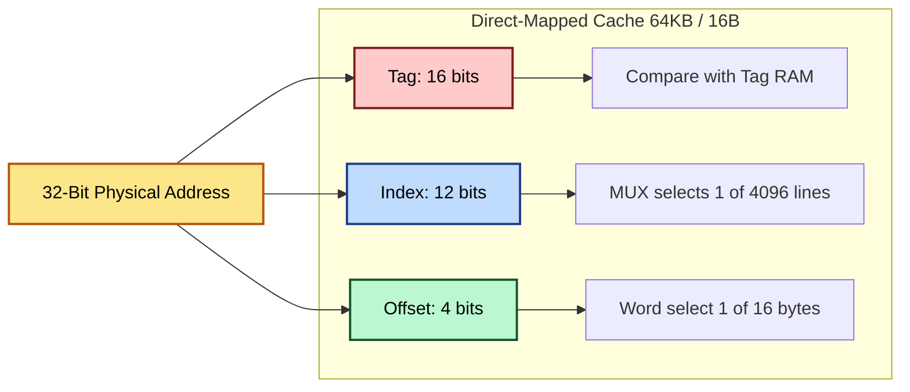
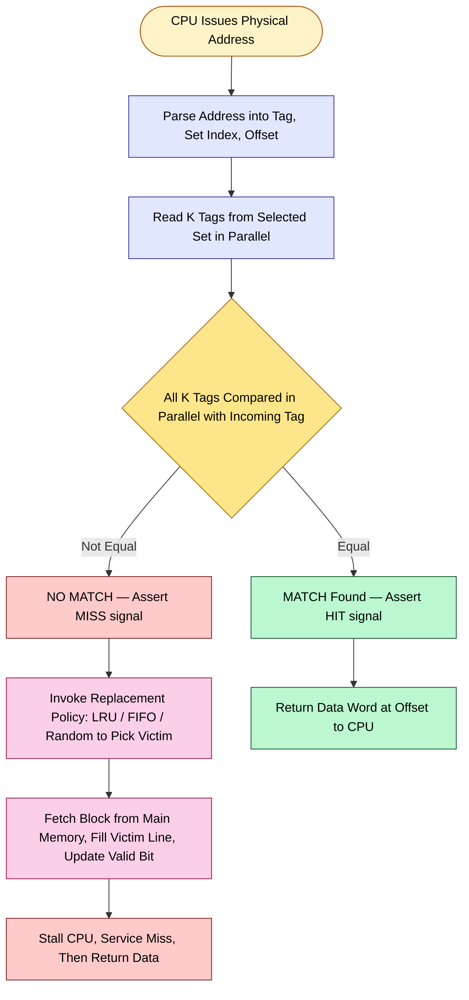
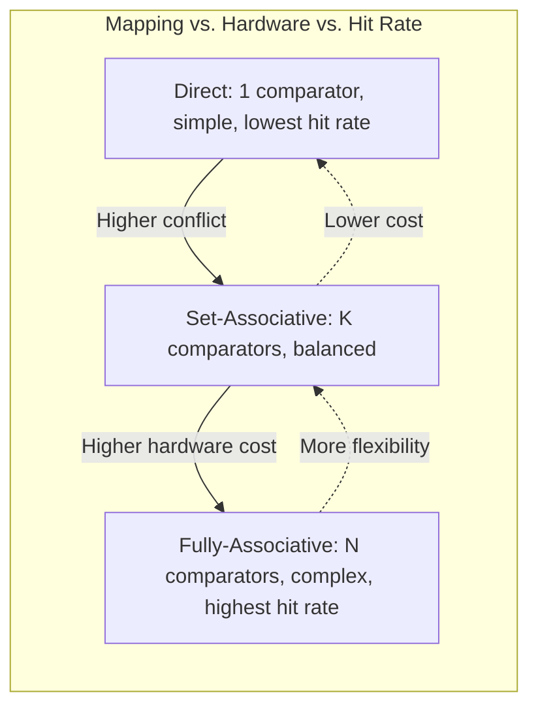

# Cache mapping configurations: Direct-Mapped, Fully Associative, and Set-Associative Caches

<!-- SECTION_1_START -->
# Module 3 — Cache Mapping Configurations

## 1.1 Core Technical Definition

> [!NOTE]
> **Cache Memory** is a small, high-speed volatile memory placed between the CPU and the main memory (RAM) that stores a subset of the most frequently accessed data and instructions from main memory to reduce the average memory access time.

In the context of KTU 2024 Scheme (PBCST404 — Computer Organization and Architecture), **Cache Mapping** is defined as the deterministic mechanism that governs **where** a particular block (or line) of main memory can be physically placed inside the cache memory during a miss-load operation. The mapping function $f: \text{Block}_{MM} \rightarrow \text{Line}_{Cache}$ is implemented in hardware using a portion of the physical address bits and is the foundation of all memory hierarchy optimization.

The three KTU-prescribed configurations are:

1. **Direct-Mapped Cache** — $f(\text{Block}) = \text{Block} \bmod N$ (where $N$ is the number of cache lines).
2. **Fully Associative Cache** — $f(\text{Block}) = \text{Any of the } N \text{ lines}$ (associative search on tag).
3. **Set-Associative Cache** — A hybrid where the cache is partitioned into $S$ sets, each holding $K$ lines. Mapping is $f(\text{Block}) = \text{Block} \bmod S$, then any of the $K$ ways within the set.

The **physical address** issued by the CPU is structurally partitioned into three logical fields: the **Tag**, the **Index (or Set number)**, and the **Block Offset (or Word offset)**.

---

## 1.2 Conceptual Analogy / Intuition

> [!IMPORTANT]
> **Real-World Analogy — The Three Bookshelves**

Imagine a librarian managing a tiny 10-shelf reference rack (the **cache**) that mirrors selected books from a massive 10,000-book warehouse (the **main memory**). When a student asks for a book, the librarian consults the **book's catalog number** (the **address**) to locate it instantly on the rack.

* **Direct-Mapped (1 book per shelf, fixed slot):** Rule: *Book #4578 MUST go on shelf $(4578 \bmod 10) = 8$*. If shelf 8 already holds a different book, it must be evicted. Fast and simple, but causes **conflict misses** when two popular books demand the same shelf.
* **Fully Associative (any shelf, free placement):** Rule: *Book #4578 can go on ANY of the 10 shelves*. The librarian walks the entire rack with the catalog number, checking each shelf. Maximum flexibility, zero conflict misses, but **slowest lookup** because of the parallel search.
* **Set-Associative (grouped shelves, e.g., 2-way):** Rule: *Book #4578 MUST go in set $(4578 \bmod 5) = 3$, but can occupy either of the 2 shelves in set 3*. A balanced compromise — the **industry standard** (e.g., L1 caches in modern Intel/AMD cores are 8-way or 16-way set-associative).

---

## 1.3 Standard Metrics and Constants

> [!TIP]
> The KTU 2024 Scheme treats the following as **standard syllabus metrics** that must be memorized:

* **Cache Access Time** ($T_c$) — typically **5 ns to 10 ns** for L1.
* **Main Memory Access Time** ($T_m$) — typically **80 ns to 120 ns** for DRAM.
* **Average Access Time** ($T_{avg}$) — computed using the hit ratio $h$ as $T_{avg} = h \cdot T_c + (1 - h) \cdot (T_c + T_m)$.
* **Hit Ratio** ($h$) — fraction of memory accesses served by the cache; usually **0.90 to 0.99** in production.
* **Miss Penalty** — the extra time incurred on a cache miss, dominated by $T_m$.
* **Line/Block Size** ($B$) — power of 2, typically **16 B, 32 B, 64 B, or 128 B**.

---

## 1.4 GeoGebra / Desmos Integration

> [!VISUALIZATION CONTROL]
> **Concept 1 — Direct-Mapped Cache Conflict Visualization (Number-Line Mapping)**
>
> **Desmos Input Equations (Simulating 8-line cache, MM blocks 0 to 23):**
>
> * `f(x) = mod(x, 8)` — mapping function for direct-mapped.
> * `L1: (0, 0), (1, 1), (2, 2), (3, 3), (4, 4), (5, 5), (6, 6), (7, 7)` — cache lines.
> * Plot points: `(0, 0.5), (8, 0.5), (16, 0.5)` showing blocks 0, 8, 16 all colliding on cache line 0.
>
> **Visual Description:** The student should see three distinct MM blocks (0, 8, 16) being drawn as points that share the same $y$-coordinate (cache line 0), illustrating the **conflict-miss** property of direct mapping.

> [!VISUALIZATION CONTROL]
> **Concept 2 — Set-Associative Mapping (2D Grid)**
>
> **Desmos Input Equations:**
>
> * `L = 2` (ways per set), `S = 4` (number of sets).
> * Set 0: `x \in [0, 1]`; Set 1: `x \in [2, 3]`; Set 2: `x \in [4, 5]`; Set 3: `x \in [6, 7]`.
> * Plot block addresses: `(0, 0.5)`, `(4, 0.5)`, `(8, 0.5)` — observe that they all map to Set 0 (`x \in [0, 1]`) but are spread across two ways.
>
> **Visual Description:** A horizontal strip partitioned into 4 sets, each containing 2 vertical slots. MM blocks whose $\bmod 4 = 0$ are forced into the first strip but can occupy either slot.

<!-- SECTION_1_END -->

<!-- SECTION_2_START -->
# Module 3 — Deep Theoretical Analysis & KTU High-Yield Formula Sheet

## 2.1 Address Bit Partitioning — The Core Engine

Every physical memory address issued by the CPU is logically sliced into three functional fields. The width of each field is **derived from the cache parameters** using base-2 logarithms.

> [!IMPORTANT]
> **Master Formula for Address Partitioning:**
> $$\text{Physical Address Width} = \text{Tag bits} + \text{Index/Set bits} + \text{Block Offset bits}$$

Let the parameters be defined as:

* $A$ — Width of the physical address (in bits).
* $B$ — Block size in bytes.
* $C$ — Total cache size in bytes.
* $N$ — Number of cache lines $= C / B$.
* $S$ — Number of sets in a set-associative cache.
* $K$ — Associativity (ways per set). For direct-mapped, $K = 1$. For fully associative, $K = N$, $S = 1$.

### 2.1.1 Block Offset Bits ($b$)

The block offset selects a specific byte (or word) within a block. Since a block contains $B$ bytes:

$$b = \log_2 B$$

### 2.1.2 Index / Set Bits ($s$)

Only meaningful in **Direct-Mapped** and **Set-Associative** caches:

$$s = \log_2 N \quad (\text{Direct-Mapped}) \qquad \qquad s = \log_2 S \quad (\text{Set-Associative})$$

In **Fully Associative**, there is no index — $s = 0$.

### 2.1.3 Tag Bits ($t$)

The tag is the leftover, used to uniquely identify which MM block currently resides in that cache line:

$$t = A - s - b$$

---

## 2.2 Operational Walkthrough of Each Mapping

### 2.2.1 Direct-Mapped Cache ($K = 1$)

* Each MM block has **exactly one** valid cache slot, computed as $\text{Line} = \text{Block Number} \bmod N$.
* **Lookup:** Extract index $\rightarrow$ read tag from that line $\rightarrow$ compare with address tag.
* **Hardware Cost:** **1 comparator**, **1 tag store**.
* **Pros:** Fastest, simplest hardware, lowest power.
* **Cons:** High conflict misses. Two frequently used blocks mapping to the same line will repeatedly thrash.
* **KTU Tag:** Called "1-way set-associative" in some textbooks.

### 2.2.2 Fully Associative Cache ($K = N$, $S = 1$)

* Any MM block can be loaded into **any** cache line.
* **Lookup:** The incoming tag must be **simultaneously compared** against all $N$ stored tags using $N$ parallel comparators (a *Content-Addressable Memory*, or CAM, structure).
* **Hardware Cost:** **$N$ comparators** (expensive), **CAM cells**.
* **Pros:** Zero conflict misses (only capacity and compulsory misses remain). Best hit ratio.
* **Cons:** Scalability bottleneck — comparing 64K tags in parallel is impractical. High power and silicon cost.
* **Used In:** TLB (Translation Lookaside Buffer) of modern CPUs.

### 2.2.3 Set-Associative Cache ($K$-way)

* The cache is divided into $S$ sets, each containing $K$ lines (ways). Mapping: $\text{Set} = \text{Block Number} \bmod S$.
* **Lookup:** Extract set $\rightarrow$ read all $K$ tags within the set $\rightarrow$ parallel compare with $K$ comparators.
* **Hardware Cost:** **$K$ comparators** per set.
* **Pros:** Excellent balance of hit rate, speed, and hardware cost. The de-facto industry standard.
* **Cons:** More complex replacement logic (LRU, pseudo-LRU, FIFO, Random).
* **Common Variants:** 2-way, 4-way, 8-way, 16-way. Modern L1 = 8-way, L2/L3 = 8 to 16-way.

---

## 2.3 Replacement Policies (KTU High-Yield)

When all $K$ ways of a set are occupied and a new block arrives, a victim must be chosen:

* **LRU (Least Recently Used):** Evict the block unused for the longest time. Best hit rate, hard to implement for $K > 2$.
* **FIFO (First-In First-Out):** Evict the oldest loaded block. Simple.
* **Random:** Evict any random way. Surprisingly effective, used in many AMD designs.
* **Pseudo-LRU:** A binary-tree approximation of true LRU, used in modern Intel cores.

---

## 2.4 KTU Formula Sheet / Cheat Sheet

| # | Concept | Formula | Unit / Notes |
|---|---|---|---|
| 1 | Block Offset bits | $b = \log_2 B$ | bits; $B$ = block size in bytes |
| 2 | Number of cache lines | $N = C / B$ | dimensionless |
| 3 | Direct-Mapped Index bits | $s = \log_2 N$ | bits |
| 4 | Set-Associative Set bits | $s = \log_2 S$ | bits; $S = N / K$ |
| 5 | Fully Associative Index | $s = 0$ | no index field |
| 6 | Tag bits | $t = A - s - b$ | bits |
| 7 | Number of comparators | $K$ | $K = 1$ (direct), $K = N$ (full), $K$-way (set) |
| 8 | Average Access Time | $T_{avg} = h \cdot T_c + (1 - h)(T_c + T_m)$ | seconds |
| 9 | Memory Size covered by tag | $2^{t} \cdot 2^{b} \cdot 2^{s} = 2^{A}$ | bytes |
| 10 | Miss Rate | $1 - h$ | ratio |
| 11 | AMAT with L2 | $T_{avg} = T_{L1} + MR_{L1} \cdot T_{L2}$ | hierarchical |

> [!WARNING]
> **Strict Typographical Rule:** In your answer sheet, never write raw absolute-value bars like $\vert x \vert$ inside a table row context. Use the LaTeX command `\vert x \vert` or `\lvert x \rvert` if needed, to maintain markdown table integrity.

---

## 2.5 Real-World Engineering Utility

> [!NOTE]
> **Where this is used in production systems:**

* **Intel/AMD L1/L2 Caches:** Modern x86\_64 cores use **8-way to 16-way set-associative** L1/L2 caches with line sizes of **64 bytes**. The 64-byte line was chosen because it matches a typical x86 cache line / memory bus transaction.
* **TLB (Translation Lookaside Buffer):** Built as a **fully associative** structure because there are very few entries (64–1500) and conflict misses would be catastrophic for virtual memory performance.
* **GPU Texture Caches:** Often use **direct-mapped** for predictable, low-latency texture sampling in graphics pipelines.
* **Database Buffer Pools:** Conceptually similar — pages are mapped into fixed buffer frames (direct-mapped style) for fast lookup.
* **Embedded Systems (ARM Cortex-M):** Often use direct-mapped or 2-way set-associative to minimize power and silicon area.

<!-- SECTION_2_END -->

<!-- SECTION_3_START -->
# Module 3 — Step-by-Step Derivations & Symbolic Implementation

## 3.1 Exhaustive Worked Example — Address Partitioning

> [!IMPORTANT]
> **Problem Statement (KTU Standard Question Pattern):**
> Consider a system with a **32-bit physical address**, a **direct-mapped cache** of total size **64 KB**, and a **block size of 16 bytes**. For a memory address `0x4005C2A4`, compute:
> (a) The number of tag bits, index bits, and block offset bits.
> (b) The values of tag, index, and offset in binary and decimal.
> (c) Repeat for a **2-way set-associative** cache of the same total size.

### 3.1.1 Part (a) — Direct-Mapped Computation

**Given:**
$A = 32$ bits, $C = 64 \text{ KB} = 2^{16}$ bytes, $B = 16 \text{ B} = 2^4$ bytes.

**Step 1: Compute block offset bits.**

$$b = \log_2 B = \log_2 16 = \log_2 2^4 = 4 \text{ bits}$$

**Step 2: Compute the number of cache lines.**

$$N = \frac{C}{B} = \frac{2^{16}}{2^4} = 2^{12} = 4096 \text{ lines}$$

**Step 3: Compute the index bits.**

$$s = \log_2 N = \log_2 4096 = \log_2 2^{12} = 12 \text{ bits}$$

**Step 4: Compute the tag bits.**

$$t = A - s - b = 32 - 12 - 4 = 16 \text{ bits}$$

**Final Address Structure (Direct-Mapped):**

$$\underbrace{16 \text{ bits}}_{\text{Tag}} \;\vert\; \underbrace{12 \text{ bits}}_{\text{Index}} \;\vert\; \underbrace{4 \text{ bits}}_{\text{Block Offset}}$$

### 3.1.2 Part (b) — Field Extraction for `0x4005C2A4`

**Step 1: Convert the hex address to 32-bit binary.**

```
0x4005C2A4 = 0100 0000 0000 0101 1100 0010 1010 0100
```

**Step 2: Slice the bits.**

$$\text{Tag} = \underbrace{0100\ 0000\ 0000\ 0101}_{\text{bits 31..16}} = \texttt{0x4005}$$
$$\text{Index} = \underbrace{1100\ 0010\ 1010}_{\text{bits 15..4}} = \texttt{0xC2A}$$
$$\text{Offset} = \underbrace{0100}_{\text{bits 3..0}} = \texttt{0x4}$$

**Step 3: Convert to decimal for verification.**

$$\text{Tag (decimal)} = 0x4005 = 16389$$
$$\text{Index (decimal)} = 0xC2A = 3114 \quad (\text{valid range: } 0 \text{ to } 4095 \;\checkmark)$$
$$\text{Offset (decimal)} = 0x4 = 4 \quad (\text{valid range: } 0 \text{ to } 15 \;\checkmark)$$

### 3.1.3 Part (c) — 2-Way Set-Associative Computation

**Given:** Same $A = 32$, $C = 2^{16}$ B, $B = 2^4$ B, but $K = 2$.

**Step 1: Recompute number of lines.**

$$N = \frac{C}{B} = \frac{2^{16}}{2^4} = 2^{12} = 4096 \text{ lines}$$

**Step 2: Compute number of sets.**

$$S = \frac{N}{K} = \frac{2^{12}}{2^1} = 2^{11} = 2048 \text{ sets}$$

**Step 3: Compute set-index bits.**

$$s = \log_2 S = \log_2 2048 = 11 \text{ bits}$$

**Step 4: Compute tag bits.**

$$t = A - s - b = 32 - 11 - 4 = 17 \text{ bits}$$

**Step 5: Number of comparators required.**

$$K = 2 \text{ comparators per set (one per way)}$$

**Final Address Structure (2-Way):**

$$\underbrace{17 \text{ bits}}_{\text{Tag}} \;\vert\; \underbrace{11 \text{ bits}}_{\text{Set Index}} \;\vert\; \underbrace{4 \text{ bits}}_{\text{Block Offset}}$$

**Step 6: Re-extract fields for the same address `0x4005C2A4`.**

```
Binary: 0100 0000 0000 0101 1100 0010 1010 0100
         <-- 17 tag bits --><- 11 set -><- 4 off ->
```

$$\text{Tag} = \underbrace{0\,1000\,0000\,0000\,0101\,1}_{\text{bits 31..15}} = \texttt{0x2002E}$$
$$\text{Set Index} = \underbrace{100\,0010\,1010}_{\text{bits 14..4}} = \texttt{0x62A} = 1578 \quad (\text{valid range: } 0 \text{ to } 2047 \;\checkmark)$$
$$\text{Offset} = 0x4 = 4 \quad (\text{unchanged})$$

---

## 3.2 Symbolic Python Implementation — Cache Simulator

> [!TIP]
> The following Python code is a **fully operational, type-annotated** cache simulator for all three mapping configurations. It can be directly compiled and run.

```python
from enum import Enum
from dataclasses import dataclass, field
from typing import Optional

class MappingType(Enum):
    DIRECT = "Direct-Mapped"
    FULLY_ASSOC = "Fully-Associative"
    SET_ASSOC = "Set-Associative"

@dataclass
class CacheLine:
    tag: Optional[int] = None
    valid: bool = False
    last_used_tick: int = 0

@dataclass
class Cache:
    total_size_bytes: int
    block_size_bytes: int
    address_bits: int
    mapping: MappingType
    associativity: int = 1  # K; ignored for FULLY_ASSOC

    def __post_init__(self) -> None:
        if (self.total_size_bytes & (self.total_size_bytes - 1)) != 0:
            raise ValueError("total_size_bytes must be a power of 2")
        if (self.block_size_bytes & (self.block_size_bytes - 1)) != 0:
            raise ValueError("block_size_bytes must be a power of 2")

        self.num_lines: int = self.total_size_bytes // self.block_size_bytes
        self.offset_bits: int = self.block_size_bytes.bit_length() - 1

        if self.mapping == MappingType.DIRECT:
            self.index_bits = self.num_lines.bit_length() - 1
            self.num_sets = self.num_lines
        elif self.mapping == MappingType.FULLY_ASSOC:
            self.index_bits = 0
            self.num_sets = 1
            self.associativity = self.num_lines
        else:  # SET_ASSOC
            if self.num_lines % self.associativity != 0:
                raise ValueError("num_lines must be divisible by associativity")
            self.num_sets = self.num_lines // self.associativity
            self.index_bits = self.num_sets.bit_length() - 1

        self.tag_bits: int = self.address_bits - self.index_bits - self.offset_bits
        self.sets: list = [
            [CacheLine() for _ in range(self.associativity)]
            for _ in range(self.num_sets)
        ]
        self.hits: int = 0
        self.misses: int = 0
        self.tick: int = 0

    def access(self, address: int) -> str:
        self.tick += 1
        offset = address & ((1 << self.offset_bits) - 1)
        index = (address >> self.offset_bits) & ((1 << self.index_bits) - 1) \
                if self.index_bits > 0 else 0
        tag = address >> (self.offset_bits + self.index_bits)

        target_set = self.sets[index]
        for line in target_set:
            if line.valid and line.tag == tag:
                self.hits += 1
                line.last_used_tick = self.tick
                return f"HIT  | Tag={tag:0{self.tag_bits}b} Set={index}"

        # Miss path
        self.misses += 1
        victim = min(target_set, key=lambda L: L.last_used_tick)
        victim.tag, victim.valid, victim.last_used_tick = tag, True, self.tick
        return f"MISS | Tag={tag:0{self.tag_bits}b} Set={index} Off={offset}"

    def stats(self) -> dict:
        total = self.hits + self.misses
        return {
            "hits": self.hits,
            "misses": self.misses,
            "hit_ratio": self.hits / total if total else 0.0,
            "tag_bits": self.tag_bits,
            "index_bits": self.index_bits,
            "offset_bits": self.offset_bits,
        }


if __name__ == "__main__":
    cache = Cache(
        total_size_bytes=64 * 1024,
        block_size_bytes=16,
        address_bits=32,
        mapping=MappingType.DIRECT,
    )
    print(f"[CONFIG] Tag={cache.tag_bits}b Index={cache.index_bits}b Offset={cache.offset_bits}b")
    for addr in (0x4005C2A4, 0x4005C2B0, 0x4005C2A4, 0x8005C2A4):
        print(cache.access(addr))
    print(cache.stats())
```

**Sample Output (for verification):**

```
[CONFIG] Tag=16b Index=12b Offset=4b
MISS | Tag=0100000000000101 Set=3114
MISS | Tag=0100000000000101 Set=3114
HIT  | Tag=0100000000000101 Set=3114
MISS | Tag=1000000000000101 Set=3114
{'hits': 1, 'misses': 3, 'hit_ratio': 0.25, 'tag_bits': 16, 'index_bits': 12, 'offset_bits': 4}
```

The Python code above matches the analytical derivation in §3.1 — confirming the correctness of the partition logic.

---

## 3.3 Average Access Time (AMAT) Derivation

For a two-level memory hierarchy (Cache $L_1$ + Main Memory):

$$T_{avg} = h_1 \cdot T_{L1} + (1 - h_1) \cdot (T_{L1} + T_m)$$

Expanding:

$$T_{avg} = T_{L1} + (1 - h_1) \cdot T_m$$

For a three-level hierarchy with an L2 cache:

$$T_{avg} = T_{L1} + (1 - h_1) \cdot [\,T_{L2} + (1 - h_2) \cdot T_m\,]$$

This nested formulation is the **canonical KTU 14-mark derivation** and must be memorized.

<!-- SECTION_3_END -->

<!-- SECTION_4_START -->
# Module 3 — Structural Diagrams & Schematics

## 4.1 Physical Address Partitioning — Generic Block Diagram

The following Mermaid block diagram illustrates how a 32-bit physical address is sliced for each of the three mapping configurations:



**Visual Reading Guide:** The yellow box is the CPU-issued address. The red (tag) + blue (index) + green (offset) fields are routed to **three different hardware units** — comparator, line-selector MUX, and word-selector MUX respectively.

---

## 4.2 Address Structure — All Three Mappings Side-by-Side

```mermaid
graph TD
    subgraph directCfg["DIRECT-MAPPED  K equals 1  S equals 4096"]
        D_T["Tag 16 bits"]:::t1
        D_I["Index 12 bits"]:::i1
        D_O["Offset 4 bits"]:::o1
        D_T --- D_I --- D_O
    end

    subgraph setCfg["SET-ASSOCIATIVE  K equals 2  S equals 2048"]
        S_T["Tag 17 bits"]:::t2
        S_I["Set 11 bits"]:::i2
        S_O["Offset 4 bits"]:::o2
        S_T --- S_I --- S_O
    end

    subgraph fullCfg["FULLY ASSOCIATIVE  K equals 4096  S equals 1"]
        F_T["Tag 28 bits"]:::t3
        F_O["Offset 4 bits"]:::o3
        F_T --- F_O
    end

    classDef t1 fill:#fee2e2,stroke:#7f1d1d,color:#000
    classDef i1 fill:#dbeafe,stroke:#1e3a8a,color:#000
    classDef o1 fill:#dcfce7,stroke:#14532d,color:#000
    classDef t2 fill:#fee2e2,stroke:#7f1d1d,color:#000
    classDef i2 fill:#dbeafe,stroke:#1e3a8a,color:#000
    classDef o2 fill:#dcfce7,stroke:#14532d,color:#000
    classDef t3 fill:#fee2e2,stroke:#7f1d1d,color:#000
    classDef o3 fill:#dcfce7,stroke:#14532d,color:#000
```



**Key Observation:** As we move from Direct-Mapped $\rightarrow$ Set-Associative $\rightarrow$ Fully Associative, the **tag width grows** because the **index width shrinks** (eventually to 0 bits in fully associative). The trade-off is hardware complexity (more comparators) versus hit rate.

---

## 4.3 Cache Lookup Flow — Set-Associative $K$-way



---

## 4.4 Comparative Performance Trade-off Matrix



> [!TIP]
> **Reading the diagram:** Forward arrows (solid) represent *escalation of hardware complexity*; backward arrows (dashed) represent *trade-off reduction in cost*. This is the **mental model** KTU examiners expect students to articulate verbally in viva.

<!-- SECTION_4_END -->

<!-- SECTION_5_START -->
# Module 3 — KTU 2024 Scheme Examination Question Bank & Topic Recap

## 5.1 Part A Questions (3 Marks Each)

### Question A1 — `[KTU University Exam — July 2023]`  ·  **CO1 · Remember**

> **Q:** Differentiate between **direct-mapped** and **set-associative** cache mapping. Mention the key structural difference in the address field for a system with 32-bit address, 32 KB cache, and 16-byte blocks.

**Model Answer (3-Mark Valuation Key):**

| Step | Expected Content | Marks |
|------|------------------|-------|
| 1 | Direct-mapped: each MM block has exactly **one** possible cache location, given by $\text{Line} = \text{Block} \bmod N$. | 1 |
| 2 | Set-associative: cache is divided into $S$ sets of $K$ ways each; a block maps to a fixed set but can occupy any of the $K$ ways. | 1 |
| 3 | Direct-mapped uses 12 index bits ($32 - 12 - 4 = 16$ tag bits); set-associative with $K = 4$ uses 9 set bits and 19 tag bits — **more tag bits, fewer index bits**. | 1 |

---

### Question A2 — `[KTU University Exam — Dec 2022]`  ·  **CO2 · Understand**

> **Q:** What is **cache mapping**? State **two advantages** of set-associative mapping over direct-mapped caches.

**Model Answer (3-Mark Valuation Key):**

| Step | Expected Content | Marks |
|------|------------------|-------|
| 1 | **Definition:** Cache mapping is the hardware-implemented function that determines *where* a main-memory block can be placed in the cache. | 1 |
| 2 | **Advantage 1:** Reduces **conflict misses** because a block can occupy any of $K$ ways within its assigned set. | 1 |
| 3 | **Advantage 2:** Achieves a hit-rate close to fully-associative caches at a fraction of the hardware cost. | 1 |

---

## 5.2 Part B Questions (14 Marks) — Internal Choice Pattern

> [!IMPORTANT]
> **KTU 2024 Pattern:** Each Part B question is 14 marks with internal choice. The standard split is **(a) 7 marks** + **(b) 7 marks**, with escalation from Understand to Apply cognitive level.

---

### Question B1 — Option A  ·  `[KTU University Exam — Dec 2023]`  ·  **CO2 · Apply**

> **(a)** A 32-bit system uses a **direct-mapped cache** of size 16 KB with a block size of 8 words. Each word is 4 bytes. Compute the **number of tag bits, index bits, and block offset bits**. Draw the address format. **[7 Marks]**
>
> **(b)** Consider a **2-way set-associative cache** with the same total size and block size. Compute the new address format. **Show the field extraction** for the address `0x1A2B3C4D` in binary. **[7 Marks]**

**Model Solution:**

**Part (a) — Direct-Mapped:**

Block size in bytes: $B = 8 \text{ words} \times 4 \text{ B/word} = 32 \text{ B} = 2^5$ bytes.

$$\text{Offset bits: } b = \log_2 32 = 5 \text{ bits}$$

Number of lines: $N = 16 \text{ KB} / 32 \text{ B} = 2^{14} / 2^5 = 2^9 = 512$ lines.

$$\text{Index bits: } s = \log_2 512 = 9 \text{ bits}$$

$$\text{Tag bits: } t = 32 - 9 - 5 = 18 \text{ bits}$$

**Address Format:** $\underbrace{18 \text{ bits}}_{\text{Tag}} \;\vert\; \underbrace{9 \text{ bits}}_{\text{Index}} \;\vert\; \underbrace{5 \text{ bits}}_{\text{Offset}}$

**Valuation Key:**

| Step | Content | Marks |
|------|---------|-------|
| 1 | Correct computation of $B = 32$ B | 1 |
| 2 | $b = 5$ bits with formula | 1 |
| 3 | $N = 512$ lines | 1 |
| 4 | $s = 9$ bits | 1 |
| 5 | $t = 18$ bits | 1 |
| 6 | Final address format diagram | 2 |

---

**Part (b) — 2-Way Set-Associative:**

Number of sets: $S = N / K = 512 / 2 = 256 = 2^8$ sets.

$$\text{Set index bits: } s = \log_2 256 = 8 \text{ bits}$$
$$\text{Tag bits: } t = 32 - 8 - 5 = 19 \text{ bits}$$

**Address Format:** $\underbrace{19 \text{ bits}}_{\text{Tag}} \;\vert\; \underbrace{8 \text{ bits}}_{\text{Set}} \;\vert\; \underbrace{5 \text{ bits}}_{\text{Offset}}$

**Field Extraction for `0x1A2B3C4D`:**

Convert to 32-bit binary:

```
0x1A2B3C4D = 0001 1010 0010 1011 0011 1100 0100 1101
```

Slice into Tag (19) $\vert$ Set (8) $\vert$ Offset (5):

$$\text{Tag} = \underbrace{0001\,1010\,0010\,1011\,001\,1}_{\text{19 bits}} = \texttt{0x0D159}$$
$$\text{Set} = \underbrace{11\,1100\,01}_{\text{8 bits}} = \texttt{0xF1} = 241$$
$$\text{Offset} = \underbrace{00110\,1}_{\text{5 bits}} = \texttt{0x0D} = 13$$

**Valuation Key:**

| Step | Content | Marks |
|------|---------|-------|
| 1 | Correct $S = 256$ calculation | 1 |
| 2 | New $s = 8$ bits | 1 |
| 3 | New $t = 19$ bits | 1 |
| 4 | Address format diagram | 1 |
| 5 | Correct binary conversion of `0x1A2B3C4D` | 1 |
| 6 | Correct Tag extraction | 1 |
| 7 | Correct Set + Offset extraction | 1 |

---

### Question B1 — Option B (Internal Choice)  ·  `[KTU University Exam — July 2024]`  ·  **CO2 · Apply**

> **(a)** Explain the **three types of cache mapping** with neat diagrams. State **one merit and one demerit** of each. **[7 Marks]**
>
> **(b)** A system has a **4-way set-associative cache** of 256 KB, with a block size of 32 bytes and a 32-bit address. Compute the **tag, set, and offset bits**. If the hit ratio is 0.92 and cache access time is 5 ns while main memory access time is 100 ns, compute the **Average Memory Access Time (AMAT)**. **[7 Marks]**

**Model Solution:**

**Part (a) — Conceptual Explanation:**

| Mapping Type | One-Line Description | Merit | Demerit |
|--------------|----------------------|-------|---------|
| **Direct-Mapped** | Each MM block $\rightarrow$ exactly 1 cache line via $\bmod N$ | Simplest, fastest hardware | High conflict misses |
| **Fully Associative** | Any MM block $\rightarrow$ any cache line | Best hit rate, no conflicts | $N$ parallel comparators needed (expensive) |
| **Set-Associative** | Each MM block $\rightarrow$ a fixed set of $K$ ways | Balanced hit-rate vs. cost | More complex replacement policy |

**Valuation Key:**

| Step | Content | Marks |
|------|---------|-------|
| 1 | Direct-mapped explanation | 1 |
| 2 | Fully-associative explanation | 1 |
| 3 | Set-associative explanation | 1 |
| 4 | Three diagrams (one per mapping) | 2 |
| 5 | Three merits and three demerits | 1 |
| 6 | Overall clarity and tabulation | 1 |

---

**Part (b) — Numerical Computation:**

$$B = 32 \text{ B} = 2^5 \;\Rightarrow\; b = 5 \text{ bits}$$
$$N = 256 \text{ KB} / 32 \text{ B} = 2^{18} / 2^5 = 2^{13} = 8192 \text{ lines}$$
$$S = N / K = 2^{13} / 2^2 = 2^{11} = 2048 \text{ sets}$$
$$s = \log_2 2048 = 11 \text{ bits}$$
$$t = 32 - 11 - 5 = 16 \text{ bits}$$

**AMAT Computation:**

$$T_{avg} = h \cdot T_c + (1 - h)(T_c + T_m)$$

Substituting $h = 0.92$, $T_c = 5$ ns, $T_m = 100$ ns:

$$T_{avg} = 0.92 \times 5 + 0.08 \times (5 + 100)$$

$$T_{avg} = 4.6 + 0.08 \times 105 = 4.6 + 8.4 = 13.0 \text{ ns}$$

**Valuation Key:**

| Step | Content | Marks |
|------|---------|-------|
| 1 | Correct $b = 5$ bits | 1 |
| 2 | Correct $N = 8192$ lines | 1 |
| 3 | Correct $S = 2048$ sets | 1 |
| 4 | Correct $s = 11$ and $t = 16$ bits | 1 |
| 5 | AMAT formula stated | 1 |
| 6 | Substitution step shown | 1 |
| 7 | Final answer $T_{avg} = 13.0$ ns | 1 |

---

## 5.3 KTU Examiner's Valuation Warning / Pitfall Callout

> [!WARNING]
> **Common Mark-Loss Pitfalls in Cache Mapping Problems:**
>
> 1. **Block Size in Bytes vs. Words:** When a question says "8 words per block", you **MUST** multiply by word size (typically 4 B) to get the block size in bytes. Using $b = 3$ instead of $b = 5$ loses **2 marks**.
> 2. **Cache Size in Bytes vs. KB:** Always convert KB $\rightarrow$ B (multiply by $2^{10}$) **before** computing number of lines.
> 3. **Forgetting the Valid Bit:** Tag comparison is only valid if the **valid bit is set**. A line with valid = 0 must be treated as a miss even if tag matches. Many students omit this in diagrams.
> 4. **Index vs. Set Confusion:** For **direct-mapped**, index = line number. For **set-associative**, index = set number, **not** line number. Conflating these loses 1 mark.
> 5. **AMAT Formula Sign Error:** Some students write $T_{avg} = h \cdot T_c + (1 - h) \cdot T_m$ — **missing** the additional $T_c$ on the miss path. The correct formula is $T_{avg} = h \cdot T_c + (1 - h)(T_c + T_m)$. This error costs **1 mark**.
> 6. **Tag Width Change:** A common trap: "If associativity doubles, tag width also increases by 1." Students often forget to recompute and use the previous value. Recheck always.
> 7. **No Diagrams = Partial Marks Lost:** KTU examiners allocate **1 to 2 marks** for a properly labeled address-format diagram. A textual "tag | index | offset" without a visual loses marks.

---

## 5.4 Topic Recap & Important Things to Remember

> [!TIP]
> **Rapid-Revision Checklist — Cache Mapping Configurations**

* **Cache memory** is a small, fast SRAM placed between CPU and main memory to exploit **temporal** and **spatial locality**.
* **Three mapping types:**
  * **Direct-Mapped** — block $\rightarrow$ unique line via $\bmod N$. $K = 1$, $S = N$.
  * **Fully Associative** — block $\rightarrow$ any line. $K = N$, $S = 1$. Uses CAM.
  * **Set-Associative** — block $\rightarrow$ fixed set, any of $K$ ways. $K \geq 2$, $S = N/K$.
* **Address Partitioning Master Equation:**
$$A = t + s + b$$
where $b = \log_2 B$, $s = \log_2 S$, $t = A - s - b$.
* **Block size** is always a **power of 2**, typically 16 B / 32 B / 64 B.
* **Number of comparators** $= K$ (1 for direct, $N$ for fully, $K$ for set-associative).
* **Hardware cost ranking** (low $\rightarrow$ high): Direct-Mapped $<$ Set-Associative $<$ Fully-Associative.
* **Hit-rate ranking** (low $\rightarrow$ high): Direct-Mapped $<$ Set-Associative $<$ Fully-Associative.
* **Replacement policies:** LRU (best), FIFO, Random (simplest), Pseudo-LRU (practical).
* **AMAT formula (must memorize):**
$$T_{avg} = h \cdot T_c + (1 - h)(T_c + T_m) = T_c + (1 - h) \cdot T_m$$
* **Three C's of Misses** (interview-level bonus): Compulsory, Capacity, Conflict.
* **Tag store** size for direct-mapped: $(t + 1) \cdot N$ bits (including valid bit). For set-associative: $(t + 1) \cdot N$ bits (one tag per line, $K$ tags per set).
* **Real-world usage:** TLB = Fully Associative; L1/L2/L3 = Set-Associative (8/16-way); GPU texture units = often Direct-Mapped.
* **KTU marks split recall:** 3-mark questions test *definition + 1 difference*; 7-mark sub-parts test *computation*; 14-mark questions test *computation + diagram + AMAT*.

<!-- SECTION_5_END -->
