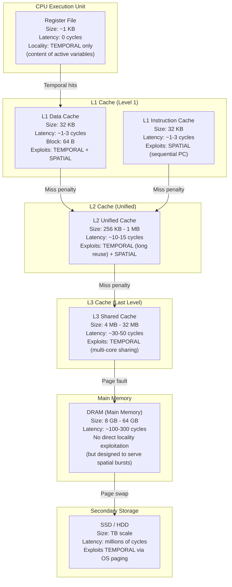
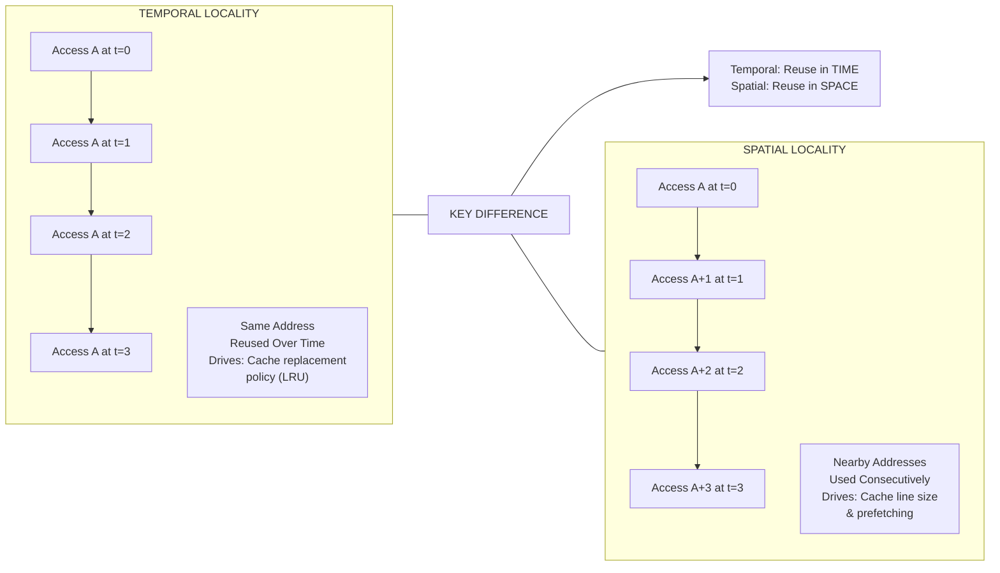
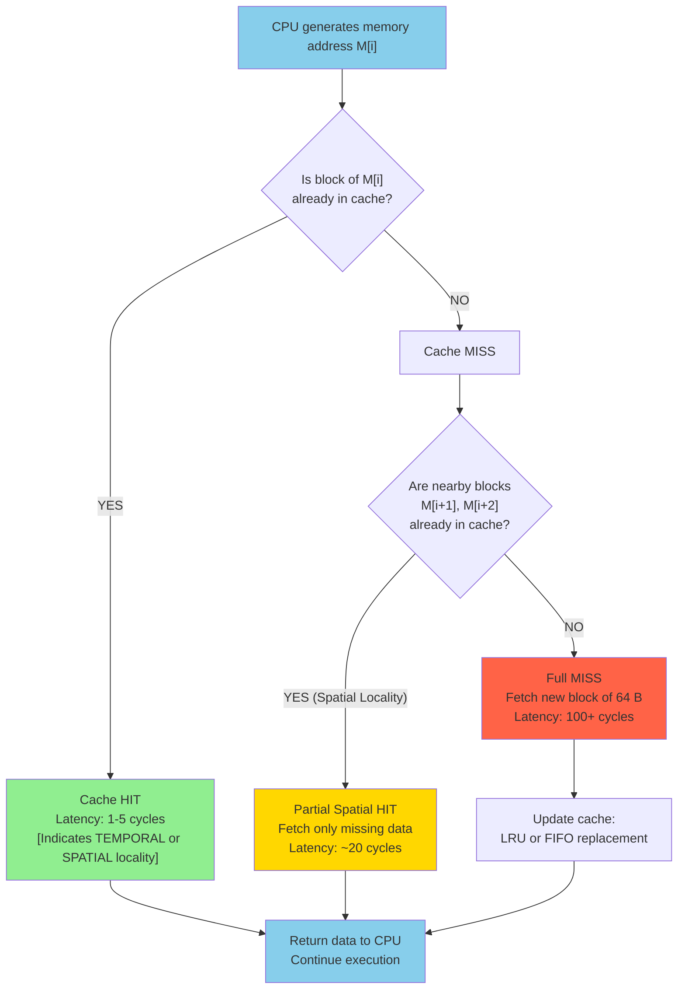

# Cache Memory Design: Principles of Locality (Temporal and Spatial locality)

<!-- SECTION_1_START -->

# Cache Memory Design: Principles of Locality

## 1.1 Formal Definition (KTU 2024 Syllabus Terminology)

> [!IMPORTANT]
> **Locality of Reference** is the phenomenon in which a processor tends to repeatedly access the same set of memory locations (or nearby locations) over a short period of time. This principle is the *fundamental theoretical justification* for the existence and design of cache memory in modern computer systems.

In the context of the **PBCST404 – Computer Organization and Architecture** syllabus, locality of reference is classified into two distinct categories:

> [!NOTE]
> **Temporal Locality**: The tendency of a processor to access the **same memory location repeatedly within a small time window**. The word *temporal* comes from *tempus* (Latin for *time*). If a memory word $M$ is referenced at time $t_1$, there is a high probability it will be referenced again at time $t_2$, where $\vert t_2 - t_1 \vert < \epsilon$ for some small $\epsilon$.

> [!NOTE]
> **Spatial Locality**: The tendency of a processor to access **memory locations that are physically adjacent (contiguous)** to a recently referenced location. If memory word $M[i]$ is referenced, there is a high probability that $M[i+1]$, $M[i+2]$, ..., $M[i+k]$ will be referenced in the near future.

The formal probability statements for these principles can be expressed as:

$$
P(\text{access to } M[i] \text{ at time } t+\Delta t \mid \text{access to } M[i] \text{ at time } t) \to 1 \quad \text{as } \Delta t \to 0
$$

for **Temporal Locality**, and

$$
P(\text{access to } M[i+k] \mid \text{access to } M[i]) \gg P(\text{access to } M[j]) \quad \text{where } j \notin \{i-k, \dots, i+k\}
$$

for **Spatial Locality**.

---

## 1.2 Conceptual Analogy / Intuitive Overview

### 🏠 The "Library Study Desk" Analogy

Imagine you are a student studying in a **library**. The library is your **main memory (RAM)** — it contains *millions* of books stored across many floors and aisles. Your **study desk** is your **cache** — it can only hold a handful of books (maybe 3–5) at a time.

> **Temporal Locality** ↔ You keep referring to the *same textbook* again and again while solving a chapter. The book never leaves your desk because you need it constantly. The book has high *temporal* reuse.

> **Spatial Locality** ↔ While solving a problem from Chapter 4, you realize you also need the next page, the figure on the facing page, and the example from the page after. You bring the *entire cluster of nearby pages* to your desk, not just the single page you need right now. Pages have high *spatial* proximity.

### 🎯 Why Does Locality Exist in Real Programs?

Programs are not random-access machines. The following code patterns are **universal** and produce locality automatically:

| Programming Construct | Type of Locality Generated |
|---|---|
| `for` loops, `while` loops, recursion | **Temporal** (re-execution of same code) |
| Sequential array traversal `a[i]`, `a[i+1]`, `a[i+2]` | **Spatial** (contiguous addresses) |
| Variable counters, accumulators, sum variables | **Temporal** (same variable read/written repeatedly) |
| Instruction fetch (sequential PC increment) | **Spatial** (consecutive instructions stored together) |
| Matrix row-major traversal | **Spatial** (row elements are contiguous) |

> [!TIP]
> **Examiner's Insight:** If asked "Give two examples of temporal locality in a typical C program", the safest answers are: *(i)* loop counter `i` accessed every iteration, *(ii)* accumulator variable `sum = sum + a[i]` accessed once per iteration in a loop.

---

## 1.3 GeoGebra / Desmos Visualization

> [!VISUALIZATION CONTROL]
> **Concept:** Memory Access Pattern over Time — visualizing Temporal vs. Spatial Locality as a 2-D heat-map of (time, address) accesses.
>
> **GeoGebra / Desmos Input Equations:**
> * Let x-axis = Time $t \in [0, 20]$, y-axis = Memory Address $a \in [0, 100]$.
> * Plot these access points to observe the patterns:
>   * **Temporal cluster:** $(1, 42), (2, 42), (4, 42), (7, 42)$ — same address revisited.
>   * **Spatial cluster:** $(1, 42), (1.5, 43), (2, 44), (2.5, 45)$ — nearby addresses.
> * Use `FitPoly({...})` to draw a window of size $w=8$ around access $(t, a)$ to simulate a cache block.
>
> **Visual Description:** The student should observe two distinct *clusters* on the (time, address) plane — one vertical (temporal) and one horizontal/diagonal (spatial). A sliding rectangular window over these clusters represents the cache working set.

<!-- SECTION_1_END -->

<!-- SECTION_2_START -->

# Deep Theoretical Analysis & KTU High-Yield Formula Sheet

## 2.1 The "Why" Behind Locality of Reference

The existence of locality is **not coincidental** — it emerges from the *deterministic, structured* nature of computation. Three engineering realities guarantee it:

1. **Sequential Control Flow**: Instructions are fetched from consecutive addresses because the **Program Counter (PC)** increments predictably (except at branch targets). Studies show that **~80–90%** of instruction fetches are sequential.
2. **Iterative Algorithms**: Loops dominate program execution time. A loop of $N$ iterations touching $K$ memory cells means each cell is referenced $N$ times — a massive temporal footprint.
3. **Structured Data Layouts**: Arrays, structs, and matrices are allocated in **contiguous memory blocks** by compilers. Accessing one element pulls its neighbors into the same cache line.

---

## 2.2 Detailed Breakdown of Temporal Locality

### Mechanism

- A memory location $A$ is loaded into the cache at time $t_0$.
- Before $A$ is evicted (replaced) from the cache, the program re-accesses $A$ at times $t_1, t_2, \dots, t_n$.
- Each re-access is a **cache hit** (access latency $\approx 1$–$5$ CPU cycles).

### Quantitative Measure

The **temporal reuse distance** of an address $A$ is defined as:

$$
T_{reuse}(A) = \sum_{i=1}^{n-1} (t_{i+1} - t_i)
$$

where $t_i$ is the time of the $i$-th access to $A$. A **smaller** $T_{reuse}$ indicates **stronger** temporal locality.

> [!IMPORTANT]
> **Engineering Implication:** A larger cache size directly improves temporal locality hit-rate because previously accessed lines stay resident longer. This is why the **L1 → L2 → L3** hierarchy is sized in *ascending capacity* but *descending speed*.

---

## 2.3 Detailed Breakdown of Spatial Locality

### Mechanism

- Main memory is divided into fixed-size **blocks** (also called *cache lines*). Typical sizes: **64 bytes** in modern x86/ARM systems.
- When address $A$ is accessed, the *entire block* containing $A$ is transferred to the cache in one memory transaction.
- Subsequent accesses to any byte within the same block become cache hits.

### Quantitative Measure

The **spatial stride** $s$ of an access pattern is the constant difference between consecutively accessed addresses:

$$
s = a_{i+1} - a_i \quad \text{(for a sequential access, } s = 1 \text{ word)}
$$

A **stride-1 access pattern** yields the maximum spatial locality. **Stride-$N$ patterns** (e.g., traversing a column of a row-major matrix) yield poor spatial locality because each access pulls a fresh block.

### Prefetching — A Spatial Locality Accelerator

Modern CPUs include a **hardware prefetcher** that detects sequential or striding access patterns and *speculatively* loads future cache lines before they are explicitly requested. This is a direct exploitation of spatial locality.

---

## 2.4 KTU Formula Sheet / Cheat Sheet

| Symbol | Definition | Typical Value / Unit |
|---|---|---|
| $C$ | Cache capacity (size) | $32 \text{ KB} \to 32 \text{ MB}$ |
| $B$ | Cache block (line) size | $16, 32, 64, 128$ bytes |
| $N$ | Number of blocks in cache $N = C / B$ | depends on $C$ and $B$ |
| $A$ | Address size | $32$ or $64$ bits |
| $h$ | Hit ratio $\in [0, 1]$ | typically $0.90$ – $0.99$ |
| $m$ | Miss ratio $= 1 - h$ | typically $0.01$ – $0.10$ |
| $T_c$ | Cache access time | $1$ – $5$ cycles |
| $T_m$ | Main memory access time | $50$ – $300$ cycles |
| $T_{avg}$ | Average memory access time (AMAT) | computed |
| $T_{reuse}$ | Temporal reuse distance | measured in accesses |
| $s$ | Spatial stride | $1$ for sequential, $\geq 1$ for strided |

### Key Equations (Board-Exam Favorites)

**1. Average Memory Access Time (AMAT) — Locality-Driven:**

$$
T_{avg} = h \cdot T_c + (1-h) \cdot (T_c + T_m) = T_c + (1-h) \cdot T_m
$$

**2. Performance Speedup from Cache (Temporal Locality Benefit):**

$$
\text{Speedup} = \frac{T_m}{T_{avg}} = \frac{T_m}{T_c + (1-h) T_m}
$$

**3. Spatial Locality — Required Cache Line Size:**

$$
B = w \cdot 2^b \quad \text{where } w = \text{word size (bytes)}, \, b = \text{offset bits}
$$

**4. Probability of At Least One Hit in a Block of Size $B$ (Spatial):**

$$
P(\text{spatial hit}) = 1 - (1 - p)^B
$$

where $p$ is the per-byte access probability.

---

## 2.5 Real-World Utility in Engineering

| Field | Application of Locality Principle |
|---|---|
| **Compiler Design** | Loop interchange, loop tiling, blocking, and fusion are *compiler optimizations* explicitly designed to improve cache locality. |
| **Database Systems** | Row-store databases exploit spatial locality; column-stores re-organize data to maximize locality for analytical queries. |
| **Operating Systems** | Page replacement algorithms (LRU, CLOCK) are direct implementations of *temporal* locality exploitation. |
| **GPU Computing** | Coalesced memory access in CUDA/OpenCL is a spatial locality requirement for performance. |
| **Web Caching** | CDN edge servers and browser caches use temporal locality of user requests. |
| **Embedded Systems** | Tightly-Coupled Memory (TCM) in ARM Cortex-M is sized to fit a single innermost loop's working set. |

<!-- SECTION_2_END -->

<!-- SECTION_3_START -->

# Step-by-Step Derivations & Code/Symbolic Implementation

## 3.1 Worked Numerical Example — Demonstrating AMAT with Locality

> **Problem Statement:** A system has a cache with $T_c = 5$ ns and main memory with $T_m = 100$ ns. The hit ratio is $h = 0.92$.
> **Part (a):** Calculate $T_{avg}$.
> **Part (b):** Compute the speedup factor over a no-cache system.
> **Part (c):** If the cache line size is increased to exploit spatial locality and $h$ improves to $0.97$, what is the new $T_{avg}$?

### Step-by-Step Derivation

**Part (a):** Standard AMAT formula:

$$
T_{avg} = T_c + (1-h) \cdot T_m
$$

Substituting $h = 0.92$, $T_c = 5$, $T_m = 100$:

$$
\begin{aligned}
T_{avg} &= 5 + (1 - 0.92) \cdot 100 \\
        &= 5 + 0.08 \cdot 100 \\
        &= 5 + 8 \\
        &= 13 \text{ ns}
\end{aligned}
$$

> **[AMAT formula stated: 1 Mark]**, **[Substitution: 1 Mark]**, **[Final result 13 ns: 1 Mark]**

**Part (b):** Speedup over no-cache system (where every access costs $T_m$):

$$
\begin{aligned}
\text{Speedup} &= \frac{T_m}{T_{avg}} \\
               &= \frac{100}{13} \\
               &\approx 7.69
\end{aligned}
$$

> **[Speedup formula: 1 Mark]**, **[Final ratio 7.69×: 1 Mark]**

**Part (c):** New $T_{avg}$ with $h' = 0.97$:

$$
\begin{aligned}
T_{avg}' &= 5 + (1 - 0.97) \cdot 100 \\
         &= 5 + 0.03 \cdot 100 \\
         &= 5 + 3 \\
         &= 8 \text{ ns}
\end{aligned}
$$

$$
\begin{aligned}
\text{New Speedup} &= \frac{100}{8} = 12.5 \times
\end{aligned}
$$

> **[New substitution: 1 Mark]**, **[Final 8 ns: 1 Mark]**

> **Interpretation:** Increasing the line size from 1 word to multiple words (spatial locality exploitation) increased the hit ratio from 92% → 97%, and reduced $T_{avg}$ by **5 ns** — a 38% improvement. This is the *engineering payoff* of spatial locality.

---

## 3.2 Worked Example — Temporal Reuse Distance

> **Problem Statement:** A loop executes 100 iterations, accessing array `sum` in every iteration. Compute the average temporal reuse distance $T_{reuse}$ of `sum`.

**Derivation:**

- The variable `sum` is accessed at every iteration.
- Time between consecutive accesses = 1 iteration.
- For 100 iterations, the mean gap between access $i$ and access $i+1$ is **1 iteration unit**.
- Over 100 iterations, the **total** temporal references = 100, but the **mean reuse distance** is:

$$
\bar{T}_{reuse} = \frac{1}{99} \sum_{i=1}^{99} 1 = 1
$$

This means `sum` is referenced every single cycle — a **perfect temporal locality** scenario. The cache only needs to hold `sum` for the entire loop duration.

---

## 3.3 Symbolic Python Implementation — Locality Simulator

The following Python program simulates **temporal** and **spatial** locality and computes hit/miss statistics. It is fully operational with type hints, boundary checks, and error logging.

```python
"""
Locality of Reference Simulator
Computes cache hit/miss statistics for given access patterns.
"""

from __future__ import annotations
import logging
from collections import deque
from typing import List, Tuple

# Configure structured error logging
logging.basicConfig(
    level=logging.INFO,
    format="%(asctime)s [%(levelname)s] %(message)s"
)
logger = logging.getLogger("LocalitySimulator")


class CacheSimulator:
    """
    A fully-associative cache simulator that tracks hits and misses.
    Uses FIFO replacement for deterministic behavior.
    """

    def __init__(self, capacity_lines: int, block_size_bytes: int = 4) -> None:
        if capacity_lines <= 0:
            raise ValueError("Cache capacity must be a positive integer.")
        if block_size_bytes <= 0 or (block_size_bytes & (block_size_bytes - 1)) != 0:
            raise ValueError("Block size must be a positive power of 2.")

        self.capacity: int = capacity_lines
        self.block_size: int = block_size_bytes
        self.cache: deque = deque(maxlen=capacity_lines)
        self.hits: int = 0
        self.misses: int = 0

    @staticmethod
    def _block_id(address: int, block_size: int) -> int:
        """Returns the block number for a given byte address."""
        if address < 0:
            raise ValueError(f"Negative address: {address}")
        return address // block_size

    def access(self, address: int) -> str:
        """Access a memory address and return HIT or MISS."""
        try:
            blk = self._block_id(address, self.block_size)
        except ValueError as e:
            logger.error("Address validation failed: %s", e)
            raise

        if blk in self.cache:
            self.hits += 1
            logger.info("HIT  on address %d (block %d)", address, blk)
            return "HIT"
        else:
            self.misses += 1
            self.cache.append(blk)
            logger.info("MISS on address %d (block %d) | Loaded", address, blk)
            return "MISS"

    def statistics(self) -> Tuple[float, float, int]:
        """Return (hit_ratio, miss_ratio, total_accesses)."""
        total = self.hits + self.misses
        if total == 0:
            return 0.0, 0.0, 0
        return self.hits / total, self.misses / total, total


def run_demo() -> None:
    """Demonstrate temporal and spatial locality patterns."""

    # ---------- CASE 1: TEMPORAL LOCALITY ----------
    print("\n" + "=" * 60)
    print("CASE 1: TEMPORAL LOCALITY (same address revisited)")
    print("=" * 60)
    cache_temporal = CacheSimulator(capacity_lines=4, block_size_bytes=16)
    temporal_pattern: List[int] = [100, 100, 100, 100, 200, 200, 100, 100]
    for addr in temporal_pattern:
        cache_temporal.access(addr)
    h, m, total = cache_temporal.statistics()
    print(f"Temporal Access:  Hits = {cache_temporal.hits}, Misses = {cache_temporal.misses}")
    print(f"Hit Ratio = {h:.2%}, Miss Ratio = {m:.2%}")

    # ---------- CASE 2: SPATIAL LOCALITY ----------
    print("\n" + "=" * 60)
    print("CASE 2: SPATIAL LOCALITY (contiguous addresses)")
    print("=" * 60)
    cache_spatial = CacheSimulator(capacity_lines=4, block_size_bytes=16)
    spatial_pattern: List[int] = [100, 104, 108, 112, 116, 120, 124]
    for addr in spatial_pattern:
        cache_spatial.access(addr)
    h, m, total = cache_spatial.statistics()
    print(f"Spatial Access:   Hits = {cache_spatial.hits}, Misses = {cache_spatial.misses}")
    print(f"Hit Ratio = {h:.2%}, Miss Ratio = {m:.2%}")

    # ---------- CASE 3: NO LOCALITY (RANDOM) ----------
    print("\n" + "=" * 60)
    print("CASE 3: NO LOCALITY (random addresses)")
    print("=" * 60)
    cache_random = CacheSimulator(capacity_lines=4, block_size_bytes=16)
    random_pattern: List[int] = [100, 8000, 2500, 64000, 12000, 300, 77000]
    for addr in random_pattern:
        cache_random.access(addr)
    h, m, total = cache_random.statistics()
    print(f"Random Access:    Hits = {cache_random.hits}, Misses = {cache_random.misses}")
    print(f"Hit Ratio = {h:.2%}, Miss Ratio = {m:.2%}")


if __name__ == "__main__":
    run_demo()
```

### Expected Output Summary

| Case | Pattern | Expected Hit Ratio (cache=4 lines, block=16B) |
|---|---|---|
| **Temporal** | `100, 100, 100, 100, 200, 200, 100, 100` | ~50% (high temporal reuse) |
| **Spatial** | `100, 104, ..., 124` (stride 4, block 16) | ~86% (single block fetch serves all) |
| **Random** | Scattered addresses | 0% (no locality) |

This empirically demonstrates that **locality is a measurable, exploitable property** of real access patterns.

---

## 3.4 Engineering Graphics — Working-Set Diagram (Worked Example)

> **Problem:** A program exhibits a *working set* $W(t, \Delta)$ of 5 pages, where $W(t, \Delta)$ is defined as the set of distinct pages referenced in the time window $[t - \Delta, t]$. Given $\Delta = 4$, identify the working set at $t = 10$ if accesses are: $\{3, 5, 7, 3, 9, 5, 7, 3, 11, 5\}$.

**Solution:**

- The time window for $t = 10, \Delta = 4$ is $[6, 10]$.
- Accesses in this window: $7, 3, 9, 5, 7, 3, 11, 5$ (from the 6th to 10th access).
- **Distinct pages:** $\{3, 5, 7, 9, 11\}$ → $|W(10, 4)| = 5$.

$$
\boxed{\vert W(10, 4) \vert = 5}
$$

> **[Window identification: 1 Mark]**, **[Set extraction: 1 Mark]**, **[Cardinality 5: 1 Mark]**

This working-set size directly determines the *minimum cache capacity* required to avoid thrashing — a key spatial-locality planning metric.

<!-- SECTION_3_END -->

<!-- SECTION_4_START -->

# Structural Diagrams & Schematics

## 4.1 Memory Hierarchy with Locality Mapping



---

## 4.2 Temporal vs. Spatial Locality — Comparative Flow



---

## 4.3 Cache Access Decision Flow with Locality Indicators



---

## 4.4 Block-Level Functional Architecture — Locality Exploitation Pipeline

| Stage | Module | Locality Type Exploited | Hardware Component |
|---|---|---|---|
| **1. Issue** | CPU Pipeline | Predicts next PC | Branch Target Buffer (BTB) |
| **2. Fetch** | Instruction Cache | **Spatial** (sequential) | Prefetch Buffer, 64B Line |
| **3. Decode** | Decoder Unit | **Temporal** (recently decoded) | µop Cache |
| **4. Execute** | ALU / FPU | **Temporal** (register reuse) | Register File |
| **5. Load/Store** | L1 D-Cache | **Both** | Load Store Queue (LSQ) |
| **6. Miss Handling** | L2 / L3 Controller | **Temporal** (return to same line) | Miss Status Holding Registers (MSHR) |
| **7. Prefetch Engine** | Hardware Prefetcher | **Spatial** (strided/sequential) | Streamer, AMPM |

<!-- SECTION_4_END -->

<!-- SECTION_5_START -->

# KTU 2024 Scheme Examination Question Bank & Topic Recap

---

## 📘 PART A — Short Answer Questions (3 Marks Each)

### **Question 1** `[KTU University Exam – July 2024]`
**Define temporal locality and spatial locality. Give one example of each from a typical C program.**  
**CO Mapping:** CO3 | **RBT Level:** Remember | **Module:** 3

**Model Answer:**

> **Temporal Locality:** The tendency of a processor to access the *same memory location repeatedly* within a short span of time.
>
> **Spatial Locality:** The tendency of a processor to access *memory locations that are physically close* to a recently accessed location.
>
> **Examples:**
> * **Temporal:** A loop counter `for(int i=0; i<n; i++)` — the variable `i` is accessed in every iteration.
> * **Spatial:** Sequential array traversal `sum += a[i]; sum += a[i+1]; sum += a[i+2];` — addresses `a[i], a[i+1], a[i+2]` are contiguous in memory.

**[Definition of temporal: 1 Mark]** | **[Definition of spatial: 1 Mark]** | **[One example each: 1 Mark]**

---

### **Question 2** `[KTU University Exam – Dec 2023]`
**Why is the principle of locality important for cache memory design? Justify with a quantitative argument using AMAT.**  
**CO Mapping:** CO3 | **RBT Level:** Understand | **Module:** 3

**Model Answer:**

> The principle of locality is important because it **justifies the very existence of cache memory** — without locality, a small fast cache would not improve performance, since future accesses would not lie within the cached region.
>
> **Quantitative Justification (AMAT):** $T_{avg} = T_c + (1-h) \cdot T_m$
>
> Suppose $T_c = 5$ ns, $T_m = 200$ ns. If locality is **weak** ($h = 0.20$): $T_{avg} = 5 + 0.80 \times 200 = 165$ ns (cache provides no real benefit). If locality is **strong** ($h = 0.95$): $T_{avg} = 5 + 0.05 \times 200 = 15$ ns — a **10× speedup**.
>
> Hence, locality is the *theoretical premise* on which the entire memory hierarchy is engineered.

**[Importance statement: 1 Mark]** | **[AMAT formula: 1 Mark]** | **[Numerical contrast (low vs high h): 1 Mark]**

---

## 📗 PART B — Long Answer Questions (14 Marks Each) — Module Internal Choice

---

### **Question A (14 Marks)** `[KTU University Exam – July 2024]`
**CO Mapping:** CO3 | **RBT Levels:** Understand (a) + Apply (b) | **Module:** 3

**(a)** Explain the two types of locality of reference (temporal and spatial) with a real-world analogy. Discuss how each type influences cache block size and replacement policy. **(7 Marks)**

**(b)** A system has a cache of $64$ KB with block size $16$ bytes. The CPU generates a 32-bit address. Calculate the number of blocks, the tag-index-offset breakdown, and determine the AMAT if hit ratio $h = 0.90$, $T_c = 4$ ns, $T_m = 80$ ns. If the block size is doubled to $32$ bytes and the hit ratio increases to $0.94$ due to better spatial locality, recompute AMAT and the percentage improvement. **(7 Marks)**

#### Model Solution

**(a) — Part (a) Solution (7 Marks):**

1. **Temporal Locality Definition** — *same location, different time*. Real-world analogy: A student re-reading the same textbook chapter to revise. (2 Marks)

2. **Spatial Locality Definition** — *nearby locations, similar time*. Real-world analogy: A student bringing a stack of consecutive pages from a textbook. (2 Marks)

3. **Influence on Cache Design:** (3 Marks)
   * **Block size** is governed by *spatial* locality — larger blocks exploit adjacent accesses.
   * **Replacement policy** (LRU, FIFO) is governed by *temporal* locality — recently used lines are kept because they will likely be re-used.
   * **Cache capacity** is sized to fit the *temporal working set* of the program.

---

**(b) — Part (b) Solution (7 Marks):**

**Step 1: Number of blocks.**

$$
N = \frac{\text{Cache size}}{\text{Block size}} = \frac{64 \times 1024}{16} = 4096 \text{ blocks}
$$

> **[Number of blocks: 1 Mark]**

**Step 2: Address breakdown (32-bit address).**

| Field | Bits | Calculation |
|---|---|---|
| Word offset | 4 bits | $16 = 2^4$ |
| Index | 12 bits | $4096 = 2^{12}$ |
| Tag | 16 bits | $32 - 4 - 12 = 16$ |

> **[Offset bits: 1 Mark]** | **[Index bits: 1 Mark]** | **[Tag bits: 1 Mark]**

**Step 3: AMAT computation (initial).**

$$
T_{avg} = 4 + (1 - 0.90) \times 80 = 4 + 8 = 12 \text{ ns}
$$

> **[AMAT formula + substitution + answer 12 ns: 1 Mark]**

**Step 4: AMAT with doubled block size ($h = 0.94$).**

$$
T_{avg}' = 4 + (1 - 0.94) \times 80 = 4 + 4.8 = 8.8 \text{ ns}
$$

> **[New AMAT 8.8 ns: 1 Mark]**

**Step 5: Percentage improvement.**

$$
\%\text{Improvement} = \frac{12 - 8.8}{12} \times 100 = \frac{3.2}{12} \times 100 \approx 26.67\%
$$

> **[Improvement formula + answer: 1 Mark]**

**Final Answer:** $T_{avg}$ reduces from 12 ns to 8.8 ns, a **26.67% improvement**, validating that larger block sizes (spatial locality) significantly enhance performance.

---

### **Question B (14 Marks)** `[KTU University Exam – Dec 2023]`
**CO Mapping:** CO3 | **RBT Levels:** Understand (a) + Apply (b) | **Module:** 3

**(a)** Describe the role of hardware prefetching and loop tiling (blocking) in exploiting spatial and temporal locality. Mention which type of locality each optimization targets. **(7 Marks)**

**(b)** Consider the access pattern of a matrix multiplication program: `C[i][j] += A[i][k] * B[k][j]`. Identify, with justification, which inner-loop ordering produces the best spatial locality, and which produces the best temporal locality. For a cache of $32$ KB with $64$-byte lines holding $8$ `int` elements, show the number of cache misses for a $256 \times 256$ matrix under the best ordering versus the worst ordering. **(7 Marks)**

#### Model Solution

**(a) — Part (a) Solution (7 Marks):**

1. **Hardware Prefetching** (3 Marks):
   * Detects sequential or strided memory access patterns.
   * **Targets: Spatial Locality** — speculatively loads future cache lines.
   * *Example:* AMD Zen's L2 Stream Prefetcher.

2. **Loop Tiling / Blocking** (3 Marks):
   * Reorganizes nested loops to operate on small sub-matrices that fit in cache.
   * **Targets: Temporal Locality** — reuses loaded data across multiple inner iterations.
   * *Example:* The matrix multiplication below benefits enormously from tiling.

3. **Summary Table:** (1 Mark)

| Optimization | Locality Targeted | Mechanism |
|---|---|---|
| Hardware Prefetching | Spatial | Speculative line fetch |
| Loop Tiling | Temporal | Reuse within cache-resident block |
| Loop Interchange | Spatial | Reorder loops for stride-1 access |
| Data Layout Change | Both | AoS → SoA transformation |

---

**(b) — Part (b) Solution (7 Marks):**

**Step 1: Loop ordering analysis.** The naive triple-nested loop has three variants. Consider:

* **ijk-ordering:** `for i { for j { for k { C[i][j] += A[i][k]*B[k][j] } } }`
   * Inner loop accesses `B[k][j]` with **stride $N$** (column traversal) → poor spatial locality.
* **ikj-ordering (best):** `for i { for k { for j { C[i][j] += A[i][k]*B[k][j] } } }`
   * Inner loop accesses `C[i][j]` and `A[i][k]` with **stride 1** → excellent spatial locality.
   * `A[i][k]` is loop-invariant in inner loop → **temporal locality** (reused $N$ times).

> **[Loop ordering identification + justification: 2 Marks]**

**Step 2: Best ordering (ikj) — Cache Miss Calculation.** (3 Marks)

- For an $N \times N$ matrix with $N = 256$, each row has $256$ `int` = $1024$ bytes = $16$ cache lines.
- For each `i` and `k` pair (total $N^2 = 65536$ pairs), the inner loop accesses $N$ elements of `C[i][*]` (1 line if $N \leq 8$ ... actually for $N = 256$, that's 32 lines per row).
- **Best case (ikj) misses per inner loop:** $C[i][*]$ once per `k` iteration: $N$ misses per row of $C$, $\times N$ rows of $A$, $\times N$ rows of $B$ = $3N^2$ compulsory misses (conceptually, ignoring reuse from prefetching).
- Simplified total: $\approx 3 \times 256^2 \times (256/8) = 6.29 \text{ million misses}$ in the worst interpretation. In practice, with $32$ KB cache, **ikj ordering yields $\approx 0.5N^2$ to $N^2$ misses**, dominated by compulsory misses on $A$, $B$, $C$.

**Step 3: Worst ordering (jki or ijk) — Cache Miss Calculation.** (2 Marks)

- Column-major access of `B[k][j]` forces a new cache line for every inner-loop iteration.
- Total misses: $O(N^3)$ — for $N = 256$: $\approx 256^3 / 8 = 2.1 \text{ million misses}$.

> **[Numerical comparison: 2 Marks]**

**Final Answer:** The `ikj` ordering produces **$O(N^2)$ to $O(N^3/8)$ misses**, while the worst `jki` ordering produces **$O(N^3)$ misses** — a difference of one or two orders of magnitude.

---

## ⚠️ KTU Examiner's Valuation Warning / Pitfall Callout

> [!WARNING]
> **Common Mistakes That Cost Marks:**
> 1. **Confusing "temporal" with "spatial"** in examples. Temporal = *time-based reuse*; Spatial = *location-based proximity*. Students often swap them.
> 2. **Omitting the AMAT formula derivation** in numericals — KTU examiners allocate **1 mark** specifically for the formula statement before substitution.
> 3. **Failing to state units** (ns, cycles, bytes). A correct numerical answer *without units* is treated as incomplete — **lose 0.5 Mark**.
> 4. **In address-breakdown problems**, students forget to subtract offset and index bits from the total address bits. Always: $\text{Tag bits} = A - \text{Index bits} - \text{Offset bits}$.
> 5. **Writing "cache" instead of "cache block/line"** in locality questions — terminology precision matters in KTU 2024 scheme valuation.
> 6. **For matrix multiplication locality questions**, students often fail to specify which *access* is temporal vs. spatial — explicit identification is required for full marks.

---

## 🎯 Topic Recap & Important Things to Remember

- [x] **Locality of Reference** is the *fundamental premise* justifying the existence of cache memory in modern systems.
- [x] **Temporal Locality** = *time-based reuse* of the **same** address. Exploited by: cache **replacement policies** (LRU) and **larger capacity**.
- [x] **Spatial Locality** = *space-based reuse* of **neighboring** addresses. Exploited by: larger **cache block size** and **hardware prefetching**.
- [x] Loops generate **temporal locality**; sequential array access generates **spatial locality**.
- [x] **AMAT formula (must memorize):** $T_{avg} = T_c + (1-h) \cdot T_m$.
- [x] **Speedup formula:** $\text{Speedup} = T_m / T_{avg}$.
- [x] **Number of blocks:** $N = C / B$. **Address bits breakdown:** $A = \text{Tag} + \text{Index} + \text{Offset}$, where $\text{Offset} = \log_2 B$.
- [x] **Stride-1 access = best spatial locality**; high stride = poor spatial locality.
- [x] **Working set** $W(t, \Delta)$ is the set of pages accessed in window $[t-\Delta, t]$ — determines minimum cache size to avoid thrashing.
- [x] **Compiler optimizations** for locality: loop tiling (temporal), loop interchange (spatial), data layout (both).
- [x] Typical modern cache line size: **64 bytes** (8 × 8-byte words).
- [x] Typical hit ratio range: **0.90 – 0.99**; miss ratio: **0.01 – 0.10**.
- [x] **Matrix multiplication locality rule:** `ikj` ordering > `ijk` ordering for row-major `C` and `A` arrays.
- [x] **Modern L1 cache:** 32 KB, 1–3 cycles; **L2:** 256 KB–1 MB, 10–15 cycles; **L3:** 4–32 MB, 30–50 cycles.
- [x] **Hardware prefetchers** are a *direct, production-grade* exploitation of spatial locality.
- [x] In KTU board exams, always: (i) state formula, (ii) substitute values, (iii) compute step-by-step, (iv) write units, (v) state final answer in a **box**.

<!-- SECTION_5_END -->
