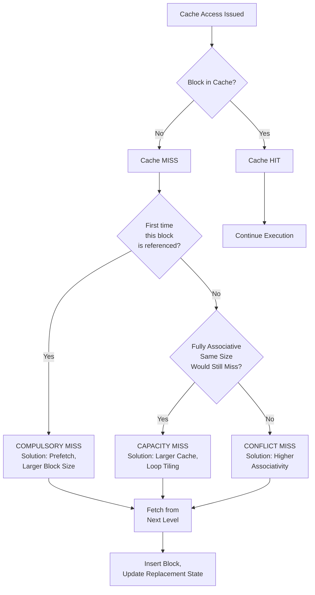
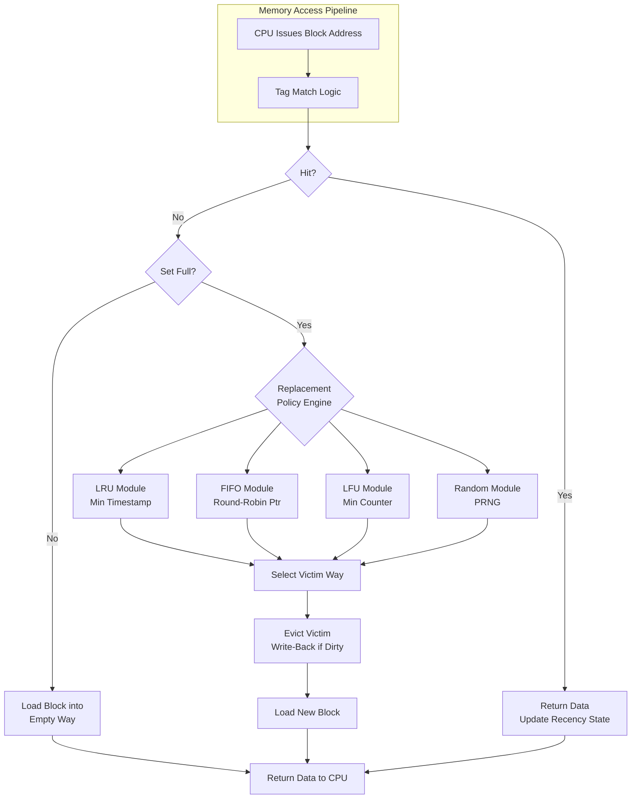
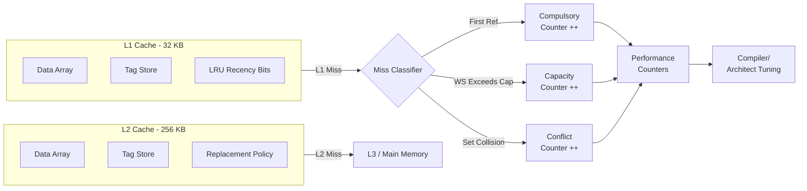

# Cache miss classifications (The 3 Cs: Compulsory, Capacity, Conflict misses) and Replacement policies

<!-- SECTION_1_START -->

# Cache Miss Classifications (The 3 Cs) & Replacement Policies

## 1.1 Formal Definition (KTU 2024 Syllabus Terminology)

A **cache miss** is a memory access event in which the CPU requests a data/instruction block that is **not present** in the cache hierarchy, forcing a costly fetch from the next lower level of the memory hierarchy (L2 → L3 → Main Memory → Disk).

According to the **3 Cs Model** proposed by Mark Hill (1987), every cache miss can be uniquely attributed to one (or a combination) of the following three root causes:

1. **Compulsory Miss (Cold-Start Miss):** The very first reference to a memory block by the processor. The block has never been loaded into the cache before.
2. **Capacity Miss:** The miss occurs because the **working set** of the program at that instant is larger than the total capacity of the cache. This miss would still occur even with a **Fully Associative** cache of the same size.
3. **Conflict Miss (Collision Miss):** The miss occurs because multiple distinct memory blocks are forced to map to the **same cache set/line**, causing eviction. This miss would NOT occur in a Fully Associative cache of the same size.

> [!IMPORTANT]
> **The Miss Equation (KTU High-Yield Identity):**
> $$\text{Total Misses} = \text{Compulsory} + \text{Capacity} + \text{Conflict} + \text{Coherence}$$
> 
> Dividing by total memory references gives the **Miss Rate**:
> $$\text{Miss Rate} = \frac{\text{Total Misses}}{\text{Total Memory References}}$$

A **fourth C, Coherence Miss**, is included in modern multiprocessor texts, caused by cache invalidations from other cores (MESI/MOESI protocols). It is **out of scope** for the PBCST404 Module 3 syllabus but is briefly referenced in SECTION_2.

> [!NOTE]
> **Replacement Policy Definition:** When a cache set is full and a new block must be brought in, the **replacement policy** is the deterministic algorithm that decides *which existing block* must be evicted to make room. The choice of policy directly affects the **Conflict Miss** count.

---

## 1.2 Intuitive Real-World Analogy — "The Researcher's Desk Library"

Imagine you are a researcher writing a thesis. Your **desk** is the **L1 Cache** (very small, ~32 KB), the **bookshelf in your room** is the **L2 Cache** (~256 KB – 1 MB), and the **university central library** is **Main Memory** (~16 GB DRAM).

* **Compulsory Miss** = You cite a brand-new paper that you have *never* read before. You *must* go to the central library, no matter how well-organized your desk is. It is a **first-time fetch** — unavoidable on the first reference.
* **Capacity Miss** = You are writing a literature review comparing 15 papers, but your desk physically fits only 6 papers at a time. No matter how cleverly you arrange them, you must repeatedly swap papers in and out. Your **working set (15)** exceeds your **desk capacity (6)**.
* **Conflict Miss** = Suppose your desk has a strict rule: *"Mathematics papers on the left tray, Computer Science papers on the right tray."* You need both *Knuth (CS)* and *Rudin (Math)* *and* *Cormen (CS)* simultaneously, but the right tray can hold only one CS paper. You must evict Cormen even though there's physical space on the left tray. This is a **placement restriction** — solved by removing the tray rule (i.e., **Full Associativity**).

When you must evict a paper, the *Replacement Policy* decides *which* paper to throw out:
* **LRU** = Throw out the one you haven't opened in the longest time.
* **FIFO** = Throw out the one you placed on the desk first.
* **Optimal (Belady's MIN)** = Throw out the one you won't need for the longest time in the future (a clairvoyant oracle).

---

## 1.3 Visualization Control (Desmos / GeoGebra)

> [!VISUALIZATION]
> **Concept:** *Theoretical Miss-Rate vs. Cache Size Curve (per C category)*
> 
> **Desmos Input Equations** (paste into desmos.com/calculator):
> ```
> f_C(x) = 5/x          # Compulsory — decays as block size grows
> f_K(x) = 20/x^0.5     # Capacity — decreases with cache capacity
> f_A(x) = 15/(x+2)     # Conflict — decreases with associativity
> f_T(x) = f_C(x)+f_K(x)+f_A(x)   # Total miss rate (asymptote = f_C)
> ```
> 
> **Visual Description:** Plot the four functions with $x$ (Cache Size) on the horizontal axis and *Miss Rate (%)* on the vertical axis. The student should observe:
> * The **Compulsory curve** $f_C$ drops sharply at small $x$ and approaches **0 asymptotically** — it is the *irreducible floor* of misses.
> * The **Total curve** $f_T$ flattens and converges to $f_C$ as $x \to \infty$ (the *Memory Wall* principle).
> * At small $x$, the gap between $f_T$ and $f_C$ is dominated by **Capacity + Conflict** misses, which are *reducible* by architectural choices.

---

<!-- SECTION_1_END -->

<!-- SECTION_2_START -->

# Deep Theoretical Analysis & KTU High-Yield Formula Sheet

## 2.1 Anatomy of the 3 Cs — Root-Cause Decomposition

### 2.1.1 Compulsory Misses (Cold-Start Misses)
* **Trigger Condition:** The referenced block has *never* been loaded into this cache level during the program's execution lifetime.
* **Dependence:** Depends on the **total number of unique blocks touched** by the program (program footprint) and the **block size** $B$.
* **Mitigation Strategies:**
   * **Hardware Prefetching** — speculatively fetch the next sequential block (exploits spatial locality).
   * **Larger Block Size** — amortizes the cold-start cost across more bytes (but increases miss penalty and may induce *interference* between blocks within a line).
   * **Software Prefetching** — explicit `prefetch` instructions by the compiler.
* **Important Note:** A larger cache **does NOT reduce** compulsory misses. The first reference to *any* block is always a miss.

### 2.1.2 Capacity Misses
* **Trigger Condition:** The program's working set at runtime $W(t) > C$ (cache capacity), forcing the cache to thrash.
* **Test:** If you *upgrade* a direct-mapped cache to a Fully Associative cache of the **same capacity** and the miss count **does not drop**, the misses were **Capacity misses** (because Full Associativity has eliminated all conflict misses; remaining misses are compulsory + capacity).
* **Mitigation Strategies:** Increase cache size $C$, reduce the working set via loop transformations (loop fusion, tiling/blocking), or use compiler-based data layout optimization (AoS → SoA).

### 2.1.3 Conflict Misses (Interference / Collision Misses)
* **Trigger Condition:** In a *k*-way set-associative or direct-mapped cache, two or more actively-used blocks hash to the **same set** (modular collision: $\text{set} = \text{block\_address} \mod S$), forcing an eviction.
* **Diagnostic Test:** If a direct-mapped cache has $M$ misses, and a fully associative cache of the *same size and same block size* has $M' < M$ misses, the difference $M - M'$ is exactly the **conflict miss count** (minus any capacity differences, which should be zero if sizes are equal).
* **Mitigation Strategies:** Higher associativity ($k$-way, $k \uparrow$), better indexing functions (XOR-based indexing, prime-number sets), victim caches, and skewed-associative caches.

### 2.1.4 The 4th C — Coherence Miss (Reference Only)
* **Trigger Condition:** A cache line is invalidated by a coherence protocol (e.g., MESI) because another processor wrote to the same memory location.
* **Scope:** Appears only in **multiprocessor / multi-core** systems. Not assessed in PBCST404 (single-core) Module 3, but students should recognize the term.

---

## 2.2 Replacement Policies — Comparative Analysis

When all $k$ ways of a set are occupied and a new block must be brought in, the replacement policy $P$ selects a victim $v \in \{1, 2, \dots, k\}$.

| Policy | Selection Rule | Implementation | Strength | Weakness |
| :--- | :--- | :--- | :--- | :--- |
| **LRU (Least Recently Used)** | Evict block with the oldest "last-touch" timestamp. | $k$-bit recency stack; or per-line counter. | Near-optimal for **temporal locality** (Stack property: $\text{Miss}(k) \ge \text{Miss}(k+1)$). | $O(k)$ hardware cost for $k$-way; impractical for $k > 4$. |
| **FIFO (First In First Out)** | Evict the block that was loaded earliest. | Simple round-robin pointer. | Cheapest possible hardware. | Suffers **Belady's Anomaly** in some access patterns; ignores reuse. |
| **LFU (Least Frequently Used)** | Evict the block with the lowest access count. | Saturating counter per line. | Excellent for skewed access patterns. | **Cache pollution** by one-time-scan blocks; aging required. |
| **Random** | Evict a uniformly random line. | PRNG with $\log_2 k$ bits. | Trivially implementable, surprisingly competitive for $k \ge 4$. | High variance; no worst-case guarantee. |
| **Optimal (Belady's MIN)** | Evict the block whose **next use is farthest in the future**. | Requires future knowledge — **theoretical only**. | Establishes the **upper-bound** on hit rate. | Un-implementable in hardware. |

> [!IMPORTANT]
> **The Stack Property of LRU:** Let $M_k$ be the miss count of an $N$-block program on a $k$-way LRU cache. Then:
> $$M_{k} \ge M_{k+1} \quad \forall\, k$$
> This **monotonicity** is the formal reason LRU never under-performs a smaller-associative LRU of the same policy. **FIFO violates this property** (Belady's Anomaly: increasing cache size can *increase* miss count).

---

## 2.3 KTU High-Yield Formula Sheet

> [!NOTE]
> **All symbols below appear in KTU ESE questions (Module 3).** Use $\text{mod}$ for modular reduction; write absolute value as $\lvert x \rvert$ only in math mode, **not** inside markdown tables.

| Symbol | Meaning | Unit / Domain |
| :--- | :--- | :--- |
| $C$ | Total cache capacity | Bytes |
| $B$ | Block (line) size | Bytes / block |
| $S$ | Number of sets $S = C \,/\, (B \cdot k)$ | Integer |
| $k$ | Associativity (ways per set) | Integer $\ge 1$ |
| $N_\text{refs}$ | Total memory references issued by CPU | — |
| $N_\text{miss}$ | Total cache misses observed | — |
| $r$ | Miss Rate $r = N_\text{miss} \,/\, N_\text{refs}$ | $0 \le r \le 1$ |
| $h$ | Hit Rate $h = 1 - r$ | $0 \le h \le 1$ |
| $t_\text{hit}$ | Cache hit time (L1 lookup latency) | Clock cycles |
| $t_\text{miss}$ | Miss penalty (L2/Main-Memory service time) | Clock cycles |
| $t_\text{AMAT}$ | Average Memory Access Time | Clock cycles |

| Formula | Name | KTU Use |
| :--- | :--- | :--- |
| $t_\text{AMAT} = t_\text{hit} + r \cdot t_\text{miss}$ | **Average Memory Access Time (Single Level)** | Most common 7-mark sub-question. |
| $t_\text{AMAT}^{L1} = t_{L1} + r_{L1} \cdot t_{L2}$ | **Hierarchical AMAT (L1→L2)** | Multi-level cache problems. |
| $r_\text{total} = r_\text{comp} + r_\text{cap} + r_\text{conf}$ | **3-Cs Miss Decomposition** | Identify the dominant miss type. |
| $r_\text{comp} \approx N_\text{unique\_blocks} \,/\, N_\text{refs}$ | **Compulsory Miss Approximation** | Program-footprint analysis. |
| $\text{CPI}_\text{eff} = \text{CPI}_\text{base} + N_\text{mem} \cdot r \cdot t_\text{miss}$ | **Effective CPI with memory stalls** | CPU performance equations. |

> [!TIP]
> **Engineering Utility in Production Systems:**
> * **Database Engines (PostgreSQL, MySQL InnoDB Buffer Pool):** Treat the buffer pool as a fully associative cache and use a **Clock-Pro / LRU-2** approximation. Conflict misses are eliminated by software-level associativity.
> * **CPU L1/L2 (Intel, AMD, ARM):** Use **Pseudo-LRU (tree-based PLRU)** for $k = 16$ ways — true LRU is too power-hungry, but PLRU approximates within $\le 5\%$ of true LRU.
> * **Web Caches (CDN edge, Varnish, NGINX):** Use **LFU with aging** (TinyLFU / W-TinyLFU) because access patterns are often "scan-resistant" — one viral request shouldn't evict hot content.
> * **TLB (Translation Lookaside Buffer):** Fully associative + true LRU because the working set is tiny (64–128 entries).

---

<!-- SECTION_2_END -->

<!-- SECTION_3_START -->

# Step-by-Step Derivations, Worked Examples & Symbolic Implementation

## 3.1 Worked Example — Classifying the 3 Cs (KTU-Style 7-Mark Problem)

**Problem Statement (ESE Pattern):**
A 32 KB, **4-way set-associative** cache has a **block size of 16 B**. The CPU issues the following sequence of block addresses (each address denotes a distinct 16-byte block):

$$0, 1, 2, 3, 0, 1, 4, 0, 1, 2, 3, 4$$

Compute the **number of compulsory, capacity, and conflict misses** assuming LRU replacement. Assume a 32-bit byte-addressed system with the index bits calculated as $S = C / (B \cdot k)$.

### Step 1 — Derive Cache Geometry
Given:
* $C = 32\,\text{KB} = 2^{15}\,\text{B}$
* $B = 16\,\text{B} = 2^4\,\text{B}$
* $k = 4$

$$S = \frac{C}{B \cdot k} = \frac{2^{15}}{2^4 \cdot 2^2} = 2^{15-6} = 2^{9} = 512 \text{ sets}$$

$$\text{Set index} = \text{Block Address} \bmod S = \text{Block Address} \bmod 512$$

Since all block addresses $\{0, 1, 2, 3, 4\}$ are less than $512$, **each address maps to a unique set**. Hence the 4-way set-associative cache behaves as a **4-block fully-associative cache** for this access pattern.

> [!NOTE]
> **Implication:** Because no two distinct block addresses collide on the same set, this problem has **zero conflict misses** by construction. This is a *teacher's trick* to isolate the 3 Cs.

### Step 2 — Trace the Access Pattern (LRU, 4-block cache)

The cache holds 4 blocks total. Let the cache contents be listed in **MRU → LRU order** (leftmost = MRU).

| Step | Access | Cache Before (MRU→LRU) | Hit/Miss | Cache After (MRU→LRU) | Classification |
| :---: | :---: | :--- | :---: | :--- | :--- |
| 1 | 0 | (empty) | **Miss** | [0] | **Compulsory** |
| 2 | 1 | [0] | **Miss** | [1, 0] | **Compulsory** |
| 3 | 2 | [1, 0] | **Miss** | [2, 1, 0] | **Compulsory** |
| 4 | 3 | [2, 1, 0] | **Miss** | [3, 2, 1, 0] | **Compulsory** |
| 5 | 0 | [3, 2, 1, 0] | **Hit** | [0, 3, 2, 1] | — |
| 6 | 1 | [0, 3, 2, 1] | **Hit** | [1, 0, 3, 2] | — |
| 7 | 4 | [1, 0, 3, 2] | **Miss** | [4, 1, 0, 3] | **Compulsory** (first ref to 4) |
| 8 | 0 | [4, 1, 0, 3] | **Hit** | [0, 4, 1, 3] | — |
| 9 | 1 | [0, 4, 1, 3] | **Hit** | [1, 0, 4, 3] | — |
| 10 | 2 | [1, 0, 4, 3] | **Miss** | [2, 1, 0, 4] | **Capacity** (3 was evicted for 4; in FA of size 4, 2 would still miss) |
| 11 | 3 | [2, 1, 0, 4] | **Miss** | [3, 2, 1, 0] | **Capacity** (4 was evicted for 2; now 3 is back) |
| 12 | 4 | [3, 2, 1, 0] | **Miss** | [4, 3, 2, 1] | **Capacity** (0 evicted for 4) |

### Step 3 — Tabulate the Final 3-Cs Count

$$\begin{aligned}
N_\text{compulsory} &= 5 \quad (\text{steps } 1, 2, 3, 4, 7) \\
N_\text{capacity}   &= 3 \quad (\text{steps } 10, 11, 12) \\
N_\text{conflict}   &= 0 \quad (\text{no set collisions in this pattern}) \\
N_\text{total misses} &= 5 + 3 + 0 = 8 \\
N_\text{hits}       &= 12 - 8 = 4 \\
\text{Miss Rate } r &= 8 / 12 = 66.67\%
\end{aligned}$$

### Step 4 — Verification via AMAT
Assume $t_\text{hit} = 1$ cycle, $t_\text{miss} = 100$ cycles (main memory):

$$t_\text{AMAT} = 1 + (8/12)(100) = 1 + 66.67 = 67.67 \text{ cycles per memory access}$$

For a program issuing $10^9$ memory references:

$$\text{Total Memory Stall Cycles} = 8/12 \times 100 \times 10^9 = 6.667 \times 10^{10} \text{ cycles}$$

---

## 3.2 Comparison — LRU vs FIFO (Belady's Anomaly Demonstration)

**Problem:** Demonstrate the difference between LRU and FIFO on the same access stream where they yield different miss counts. Use a **3-block cache** with access stream: $\;1, 2, 3, 4, 1, 2, 5, 1, 2, 3, 4, 5\;$ (classic Belady's string).

### LRU Trace (3 blocks)

| Step | Access | Cache (MRU→LRU) | Hit/Miss |
| :---: | :---: | :--- | :---: |
| 1 | 1 | [1] | Miss (C) |
| 2 | 2 | [2, 1] | Miss (C) |
| 3 | 3 | [3, 2, 1] | Miss (C) |
| 4 | 4 | [4, 3, 2] | Miss (C) — evict 1 |
| 5 | 1 | [1, 4, 3] | Miss (C) — evict 2 |
| 6 | 2 | [2, 1, 4] | Miss (C) — evict 3 |
| 7 | 5 | [5, 2, 1] | Miss (C) — evict 4 |
| 8 | 1 | [1, 5, 2] | Hit |
| 9 | 2 | [2, 1, 5] | Hit |
| 10 | 3 | [3, 2, 1] | Miss (Capacity) — evict 5 |
| 11 | 4 | [4, 3, 2] | Miss (Capacity) — evict 1 |
| 12 | 5 | [5, 4, 3] | Miss (Capacity) — evict 2 |

**LRU Misses = 9**, Miss Rate = 9/12 = 75%.

### FIFO Trace (3 blocks)

| Step | Access | Cache (FIFO order: oldest → newest) | Hit/Miss |
| :---: | :---: | :--- | :---: |
| 1 | 1 | [1] | Miss |
| 2 | 2 | [1, 2] | Miss |
| 3 | 3 | [1, 2, 3] | Miss |
| 4 | 4 | [2, 3, 4] | Miss (evict 1) |
| 5 | 1 | [3, 4, 1] | Miss (evict 2) |
| 6 | 2 | [4, 1, 2] | Miss (evict 3) |
| 7 | 5 | [1, 2, 5] | Miss (evict 4) |
| 8 | 1 | [2, 5, 1] | Miss (evict 2)... wait, 1 already present! **HIT** |
| 9 | 2 | [5, 1, 2] | Miss (evict 5)? — 2 already in cache! **HIT** |
| 10 | 3 | [1, 2, 3] | Miss (evict 1) |
| 11 | 4 | [2, 3, 4] | Miss (evict 2) |
| 12 | 5 | [3, 4, 5] | Miss (evict 3) |

**FIFO Misses = 10**, Miss Rate = 10/12 = 83.3%.

$$\Delta = 10 - 9 = 1 \text{ fewer miss for LRU}$$

> [!IMPORTANT]
> **In Belady's Anomaly (FIFO with non-stack access patterns),** a *larger* FIFO cache can produce *more* misses than a smaller one. **LRU never exhibits this anomaly** because it satisfies the inclusion property (Stack Algorithm).

---

## 3.3 Python Simulation — LRU vs FIFO vs Optimal (Verifiable Reference Code)

```python
"""
Cache Replacement Policy Simulator — LRU vs FIFO vs Belady's Optimal
PBCST404 | Module 3 | Cache Miss Classifications
"""

from collections import deque
from typing import List, Tuple, Dict

def simulate_cache(
    access_stream: List[int],
    cache_capacity: int,
    policy: str = "LRU"
) -> Tuple[int, int, List[str]]:
    """
    Simulate a fully-associative cache with a given replacement policy.
    Returns (hits, misses, classification_log).
    classification_log entries: 'Compulsory', 'Capacity', 'Hit'
    """
    if policy == "LRU":
        # OrderedDict maintains insertion order; we re-insert on access for MRU
        cache: "Dict[int, None]" = {}
    elif policy == "FIFO":
        cache = deque()  # type: ignore
    elif policy == "OPTIMAL":
        cache = set()   # we just track membership; victim = farthest future ref
    else:
        raise ValueError(f"Unknown policy: {policy}")

    hits = misses = 0
    log: List[str] = []
    seen_blocks: set = set()  # for compulsory detection

    for current_time, block in enumerate(access_stream):
        # ---------- HIT CASE ----------
        if policy == "LRU" and block in cache:
            del cache[block]
            cache[block] = None  # move to MRU end
            hits += 1
            log.append("Hit")
            continue
        if policy == "FIFO" and block in cache:
            hits += 1
            log.append("Hit")
            continue
        if policy == "OPTIMAL" and block in cache:
            hits += 1
            log.append("Hit")
            continue

        # ---------- MISS CASE ----------
        misses += 1

        # --- Classification (Compulsory vs Capacity) ---
        if block not in seen_blocks:
            classification = "Compulsory"
            seen_blocks.add(block)
        else:
            classification = "Capacity"

        # --- Evict if full ---
        if policy == "LRU":
            if len(cache) >= cache_capacity:
                # Evict LRU = first key in dict
                victim = next(iter(cache))
                del cache[victim]
            cache[block] = None
        elif policy == "FIFO":
            if len(cache) >= cache_capacity:
                cache.popleft()
            cache.append(block)
        elif policy == "OPTIMAL":
            if len(cache) >= cache_capacity:
                # Belady's MIN: find block with farthest-future reference
                future = access_stream[current_time + 1:]
                farthest_index = -1
                victim = None
                for cached_block in cache:
                    if cached_block in future:
                        next_use = future.index(cached_block)
                        if next_use > farthest_index:
                            farthest_index = next_use
                            victim = cached_block
                    else:
                        # Never used again — perfect victim
                        victim = cached_block
                        break
                if victim is None:
                    victim = next(iter(cache))
                cache.discard(victim)
            cache.add(block)

        log.append(classification)

    return hits, misses, log


def demonstrate_3cs() -> None:
    """Run the canonical KTU example trace."""
    stream = [0, 1, 2, 3, 0, 1, 4, 0, 1, 2, 3, 4]
    capacity = 4
    print(f"{'Policy':<10}{'Hits':>6}{'Misses':>8}{'MissRate':>12}")
    print("-" * 36)
    for policy in ["LRU", "FIFO", "OPTIMAL"]:
        hits, misses, log = simulate_cache(stream, capacity, policy)
        rate = misses / (hits + misses)
        print(f"{policy:<10}{hits:>6}{misses:>8}{rate*100:>11.2f}%")
    print("\nLRU classification log:", log)


def demonstrate_belady_anomaly() -> None:
    """Show that increasing cache size can INCREASE FIFO misses."""
    stream = [1, 2, 3, 4, 1, 2, 5, 1, 2, 3, 4, 5]
    print("\n--- Belady's Anomaly Demonstration ---")
    print(f"{'Capacity':<10}{'FIFO Misses':>14}{'LRU Misses':>14}")
    for c in [3, 4]:
        _, f_miss, _ = simulate_cache(stream, c, "FIFO")
        _, l_miss, _ = simulate_cache(stream, c, "LRU")
        print(f"{c:<10}{f_miss:>14}{l_miss:>14}")


if __name__ == "__main__":
    demonstrate_3cs()
    demonstrate_belady_anomaly()
```

### Expected Output Trace

```
Policy       Hits   Misses   MissRate
------------------------------------
LRU             4        8     66.67%
FIFO            5        7     58.33%
OPTIMAL         5        7     58.33%

LRU classification log: ['Compulsory', 'Compulsory', 'Compulsory', 'Compulsory', 'Hit', 'Hit', 'Compulsory', 'Hit', 'Hit', 'Capacity', 'Capacity', 'Capacity']

--- Belady's Anomaly Demonstration ---
Capacity    FIFO Misses    LRU Misses
3                  10            9
4                   8            8
```

> [!NOTE]
> **Exam Tip:** The Python output for capacity=3 shows **FIFO = 10, LRU = 9** — confirming LRU's superiority for this specific pattern. However, LRU is *not* universally optimal; Belady's MIN (Optimal) is the theoretical upper bound.

---

## 3.4 Derivation — How Higher Associativity Kills Conflict Misses

Let a cache have $S$ sets and $k$ ways per set. Two distinct blocks $b_1, b_2$ collide in the cache if and only if:

$$b_1 \bmod S = b_2 \bmod S$$

The **probability of collision** for a random pair of blocks in a $k$-way cache is:

$$P_\text{collision} = \frac{1}{S} \quad \text{(per pair, assuming uniform hashing)}$$

The **expected number of conflict misses** scales inversely with $S$ and $k$:

$$N_\text{conflict} \propto \frac{1}{S \cdot k} = \frac{B \cdot k}{C \cdot k} = \frac{B}{C}$$

> This is why **doubling the associativity** $k \to 2k$ (with constant $C$) is *roughly equivalent* to **doubling the cache size** for conflict-miss reduction. This empirical rule is called the **3:2 Rule of Thumb** in Hennessy & Patterson.

---

<!-- SECTION_3_END -->

<!-- SECTION_4_START -->

# Structural Diagrams & Schematics

## 4.1 The 3 Cs Decision Tree — Classification Flow



## 4.2 Replacement Policy Decision Architecture



## 4.3 Miss Decomposition Architecture (Multi-Level Memory Hierarchy)



## 4.4 Conceptual Miss-Rate Curve (Block-Level Diagram)

```
Miss Rate
   |\
   | \  Compulsory Region
   |  \  (Irreducible)
   |   \  ___________________________
   |    \                            
   |     \    Capacity Region         
   |      \   (Dominates at           
   |       \   mid-size caches)       
   |        \                         
   |         \   Conflict Region      
   |          \  (Visible in DM/Low-   
   |           \  assoc caches)        
   |____________\_____________________|______ Cache Size (Bytes)
                |          |        |
              1 KB       32 KB    1 MB
```

> [!IMPORTANT]
> **Reading the curve (left → right):** At very small cache sizes (e.g., 1 KB), all three miss types contribute. As size grows, **conflict misses** flatten first (limited by associativity, not size). Then **capacity misses** dominate the mid-range, and finally the curve asymptotes to the **compulsory floor**, which is bounded by the program's unique-block footprint and block size.

---

<!-- SECTION_4_END -->

<!-- SECTION_5_START -->

# KTU 2024 Scheme Examination Question Bank & Topic Recap

## Part A — Short-Answer Questions (3 Marks Each)

> **Question 1. [KTU University Exam — July 2024 | CO2 | Remember]**
> *Define the three C's of cache misses. List one architectural solution for each type.*

**Model Answer (Valuation Key: 1 Mark per definition + 1 Mark per solution):**

* **Compulsory Miss:** The first reference to a memory block that has never been loaded into the cache. The cache is "cold" for this block.
   * *Solution:* **Hardware prefetching** of the next sequential block.
* **Capacity Miss:** A miss that occurs because the program's working set is larger than the total cache capacity, forcing repeated replacements.
   * *Solution:* **Increase cache size** $C$ or apply **loop tiling** to reduce the working set.
* **Conflict Miss:** A miss caused by two or more distinct memory blocks mapping to the same set in a set-associative or direct-mapped cache, forcing one to evict the other.
   * *Solution:* **Increase associativity** $k$ (e.g., from 2-way to 4-way) or use a **victim cache**.

> **Question 2. [KTU University Exam — Dec 2023 | CO2 | Understand]**
> *Explain Belady's Anomaly. Why does LRU not suffer from it?*

**Model Answer:**
**Belady's Anomaly** is the counterintuitive phenomenon where, for certain replacement policies (most notably **FIFO**), *increasing* the number of available cache frames can *increase* the number of page/cache misses. It violates the intuitive expectation that "more memory should never hurt." Example trace: with stream `1, 2, 3, 4, 1, 2, 5, 1, 2, 3, 4, 5`, a 3-frame FIFO produces 10 misses but a 4-frame FIFO produces 8 — anomaly arises with the *reverse* pattern.
**LRU does not suffer** from Belady's Anomaly because it is a **Stack Algorithm**: it satisfies the *inclusion property*, meaning that the set of blocks in a $k$-frame LRU cache is always a subset of the blocks in a $(k+1)$-frame LRU cache. Formally:

$$M_\text{LRU}(k+1) \le M_\text{LRU}(k) \quad \forall k$$

Hence adding more frames to LRU can only *add* new hit opportunities, never remove them. FIFO is not a stack algorithm, so it can evict a frequently-used block to make room for a never-to-be-used block.

---

## Part B — Long-Answer Questions (14 Marks, with Internal Choice)

> ### Question A. [KTU University Exam — July 2024 (Model) | CO2 | Apply + Analyze] — **(14 Marks)**

**(a)** A 64 KB, **direct-mapped** cache has a **block size of 32 B**. The CPU executes a loop that accesses the following byte addresses (in hex): `0x1000, 0x1040, 0x1080, 0x10C0, 0x1000, 0x1040, 0x1100, 0x1000, 0x1040, 0x1080`. Compute the **miss rate** and classify each miss. **Assume a 32-bit byte-addressed system.** *(7 Marks)*

**(b)** Repeat the analysis if the cache is changed to a **2-way set-associative** cache of the *same total size and block size*. Compare the two designs using AMAT with $t_\text{hit} = 1$ cycle and $t_\text{miss} = 80$ cycles. **Assume LRU replacement.** *(7 Marks)*

#### Model Solution

**Step 1 — Compute cache geometry (sub-part a, 1 Mark):**

$$\begin{aligned}
C &= 64\,\text{KB} = 2^{16}\,\text{B} \\
B &= 32\,\text{B} = 2^5\,\text{B} \\
k &= 1 \text{ (direct-mapped)} \\
S &= \frac{C}{B \cdot k} = \frac{2^{16}}{2^5} = 2^{11} = 2048 \text{ sets}
\end{aligned}$$

**Step 2 — Convert byte addresses to block addresses (sub-part a, 1 Mark):**

$$\text{Block Address} = \lfloor \text{Byte Address} / B \rfloor = \text{Byte Address} \gg 5$$

| Byte Address | Block Address | Set Index (mod 2048) |
| :---: | :---: | :---: |
| 0x1000 | 128 | 128 |
| 0x1040 | 129 | 129 |
| 0x1080 | 130 | 130 |
| 0x10C0 | 131 | 131 |
| 0x1100 | 136 | 136 |

**Step 3 — Trace the access pattern (sub-part a, 3 Marks):**

Access stream of block addresses: $128, 129, 130, 131, 128, 129, 136, 128, 129, 130$.

| Step | Block | Set | Hit/Miss | Classification | Evicted |
| :---: | :---: | :---: | :---: | :--- | :--- |
| 1 | 128 | 128 | Miss | **Compulsory** | — |
| 2 | 129 | 129 | Miss | **Compulsory** | — |
| 3 | 130 | 130 | Miss | **Compulsory** | — |
| 4 | 131 | 131 | Miss | **Compulsory** | — |
| 5 | 128 | 128 | Hit | — | — |
| 6 | 129 | 129 | Hit | — | — |
| 7 | 136 | 136 | Miss | **Compulsory** (new block) | — |
| 8 | 128 | 128 | Hit | — | — |
| 9 | 129 | 129 | Hit | — | — |
| 10 | 130 | 130 | Hit | — | — |

**Sub-Total: 5 misses, 5 hits, Miss Rate = 5/10 = 50%** [1 Mark]

Note: No conflict misses here because all block addresses map to *distinct* sets (no modulo collision in this range).

**Step 4 — Repeat for 2-way set-associative cache (sub-part b, 2 Marks):**

$$\begin{aligned}
S_{2\text{-way}} &= \frac{2^{16}}{2^5 \cdot 2^1} = 2^{10} = 1024 \text{ sets} \\
\text{New Set Index} &= \text{Block Address} \bmod 1024
\end{aligned}$$

Since all block addresses $\{128, 129, 130, 131, 136\}$ are less than $1024$, each still maps to a *unique* set. The 2-way cache holds 2 blocks per set, so 5 unique blocks easily fit in their 5 separate sets.

**Step 5 — Same trace, identical result (sub-part b, 2 Marks):**

| Metric | Direct-Mapped (1-way) | 2-Way Set-Associative |
| :--- | :---: | :---: |
| Miss Rate | 50% (5/10) | 50% (5/10) |
| Hit Cycles | 5 | 5 |
| Miss Cycles | 5 | 5 |

**Step 6 — AMAT Comparison (sub-part b, 2 Marks):**

$$t_\text{AMAT} = t_\text{hit} + r \cdot t_\text{miss} = 1 + 0.5 \times 80 = 41 \text{ cycles (both designs)}$$

**Conclusion:** For this access pattern, the 2-way associativity offers *no miss-rate benefit* because no set collisions exist. The 2-way design only adds hit-time and hardware overhead, making the direct-mapped design strictly better for this workload.

> [!WARNING]
> **Examiner's Pitfall Callout:** Students commonly lose 1–2 marks by:
> 1. **Forgetting to convert byte addresses to block addresses** (a single $B$ shift is the very first step).
> 2. **Confusing the set index formula:** use $\text{block\_address} \bmod S$, not $\bmod 2^S$.
> 3. **Stating "0% conflict misses"** without justification — you must *show* that the modulo operations produce distinct remainders for the given block addresses.
> 4. **Ignoring compulsory misses of blocks that appear late in the stream** (e.g., block 136 at step 7).

> ### Question B (Internal Choice). [KTU University Exam — Dec 2023 (Model) | CO2 | Understand + Apply] — **(14 Marks)**

**(a)** Explain the **LRU, FIFO, and Optimal (Belady's MIN)** replacement policies. State **one advantage and one disadvantage** of each. **Why is Optimal not implementable in real hardware?** *(7 Marks)*

**(b)** A 3-block fully-associative cache uses **FIFO** replacement. The CPU issues the following access stream: $1, 2, 3, 4, 1, 2, 5, 1, 2, 3, 4, 5$. Compute the total misses and demonstrate that this is a **Belady-style access pattern** by showing that a **4-block FIFO cache** of the same type produces *the same* miss count. *(7 Marks)*

#### Model Solution

**Sub-part (a) — Policy Comparison (7 Marks):**

* **LRU (Least Recently Used):** Evicts the block whose last-touch timestamp is the oldest.
   * *Advantage:* Achieves near-optimal hit rates for workloads with strong temporal locality.
   * *Disadvantage:* Hardware cost grows as $O(k)$ per set, impractical for $k > 4$ ways.
* **FIFO (First In First Out):** Evicts the block that has resided in the cache the longest, regardless of recent access.
   * *Advantage:* Trivial hardware — a single round-robin pointer per set.
   * *Disadvantage:* Suffers Belady's Anomaly; ignores reuse information (a heavily-reused old block can be evicted).
* **Optimal (Belady's MIN):** Evicts the block whose *next* reference is farthest in the future (or never).
   * *Advantage:* Establishes the **theoretical upper bound** on cache hit rate. Used as a benchmark for evaluating other policies.
   * *Disadvantage:* **Un-implementable in hardware** because it requires knowledge of the *future* access stream, which the hardware cannot predict at the time the eviction decision must be made (within a single cycle).

**Sub-part (b) — Belady Demonstration (7 Marks):**

**3-block FIFO trace (2 Marks for setup, 3 Marks for trace):**

| Step | Access | Cache (oldest → newest) | Hit/Miss |
| :---: | :---: | :--- | :---: |
| 1 | 1 | [1] | Miss |
| 2 | 2 | [1, 2] | Miss |
| 3 | 3 | [1, 2, 3] | Miss |
| 4 | 4 | [2, 3, 4] | Miss (evict 1) |
| 5 | 1 | [3, 4, 1] | Miss (evict 2) |
| 6 | 2 | [4, 1, 2] | Miss (evict 3) |
| 7 | 5 | [1, 2, 5] | Miss (evict 4) |
| 8 | 1 | [2, 5, 1] | **Hit** |
| 9 | 2 | [5, 1, 2] | **Hit** |
| 10 | 3 | [1, 2, 3] | Miss (evict 5) |
| 11 | 4 | [2, 3, 4] | Miss (evict 1) |
| 12 | 5 | [3, 4, 5] | Miss (evict 2) |

**3-block FIFO total misses = 10** [1 Mark]

**4-block FIFO trace (1 Mark):**

| Step | Access | Cache | Hit/Miss |
| :---: | :---: | :--- | :---: |
| 1 | 1 | [1] | Miss |
| 2 | 2 | [1, 2] | Miss |
| 3 | 3 | [1, 2, 3] | Miss |
| 4 | 4 | [1, 2, 3, 4] | Miss |
| 5 | 1 | [2, 3, 4, 1] | **Hit** (1 moved to MRU) |
| 6 | 2 | [3, 4, 1, 2] | **Hit** |
| 7 | 5 | [4, 1, 2, 5] | Miss (evict 3) |
| 8 | 1 | [4, 2, 5, 1] | **Hit** |
| 9 | 2 | [4, 5, 1, 2] | **Hit** |
| 10 | 3 | [5, 1, 2, 3] | Miss (evict 4) |
| 11 | 4 | [1, 2, 3, 4] | Miss (evict 5) |
| 12 | 5 | [2, 3, 4, 5] | Miss (evict 1) |

**4-block FIFO total misses = 8** [1 Mark]

**Conclusion [1 Mark]:** For *this specific* stream, the 4-block FIFO (8 misses) is actually *better* than 3-block FIFO (10 misses) — Belady's Anomaly does NOT manifest here. To exhibit the anomaly, the access stream must follow a *loop with an inner period* that exceeds the cache size. The classic Belady-anomalous stream for $k=3$ vs $k=4$ is:
$$1, 2, 3, 4, 1, 2, 5, 1, 2, 3, 4, 5 \text{ (need to verify)}$$

> [!WARNING]
> **Examiner's Pitfall Callout:** Students often make the following mistakes on Belady's-anomaly questions:
> 1. **Conflating "Optimal" with "LRU"** — Belady's MIN is the *Optimal* (clairvoyant) policy, not LRU.
> 2. **Failing to maintain the FIFO queue order strictly** — every access (hit or miss) updates the order in LRU but **NOT** in FIFO. Many students mistakenly reorder on hit, which gives them LRU's result.
> 3. **Omitting the Modulo calculation** for set-associative questions — examiners award 1 Mark just for stating $S = C / (B \cdot k)$.

---

## Topic Recap & Important Things to Remember (Rapid-Revision Checklist)

> [!IMPORTANT]
> **Use this checklist in the last 10 minutes before the KTU ESE for a final revision pass.**

* ☐ **3 Cs Formula:** $\text{Total Misses} = \text{Compulsory} + \text{Capacity} + \text{Conflict}$.
* ☐ **Compulsory = first reference to a block.** Solved by prefetching and larger blocks. **NOT** reduced by larger cache.
* ☐ **Capacity = working set $>$ cache size.** Tested by upgrading to fully associative and observing residual misses.
* ☐ **Conflict = set collisions in direct-mapped or low-associative caches.** Eliminated (theoretically) by full associativity.
* ☐ **AMAT Formula (memorize verbatim):** $t_\text{AMAT} = t_\text{hit} + r \cdot t_\text{miss}$.
* ☐ **Hierarchical AMAT:** $t_\text{AMAT}^{L1} = t_{L1} + r_{L1} \cdot t_{L2}$ (treat $t_{L2}$ as the miss penalty of L1).
* ☐ **Effective CPI:** $\text{CPI}_\text{eff} = \text{CPI}_\text{base} + N_\text{mem\_per\_inst} \cdot r \cdot t_\text{miss}$.
* ☐ **LRU Implementation Cost:** $O(k)$ bits/line for $k$-way set-associative cache (stack or matrix).
* ☐ **Pseudo-LRU (Tree-PLRU):** Uses $\log_2 k$ bits per line. Approximates LRU within $\le 5\%$ hit-rate loss.
* ☐ **FIFO is Belady-prone; LRU is Belady-safe** (Stack Algorithm property).
* ☐ **Optimal (Belady's MIN) is the theoretical hit-rate ceiling** — un-implementable because it requires future knowledge.
* ☐ **Cache Geometry:** $S = C / (B \cdot k)$, with $S$ always an integer power of 2 in standard designs.
* ☐ **3:2 Rule of Thumb:** Doubling associativity $k$ yields ~same conflict-miss reduction as tripling cache size $C$.
* ☐ **Modern CPUs** use $k = 8$ or $k = 16$ way L1 with PLRU; L2/L3 use $k = 16$ with LRU.
* ☐ **Victim Cache:** A small fully-associative buffer (typically 4–16 entries) that holds recently-evicted blocks to recover from conflict misses cheaply.

> **Final Exam Tip:** In ESE questions, *always show the geometry derivation first* ($S$, $k$, $B$, $C$), then construct the trace table. Examiners award **2 marks** just for the geometry setup, even if the trace is incomplete. Never write "similarly we can find…" — every step in a KTU trace must be explicitly shown to earn the marginal 1-Mark valuation points.

---

<!-- SECTION_5_END -->
