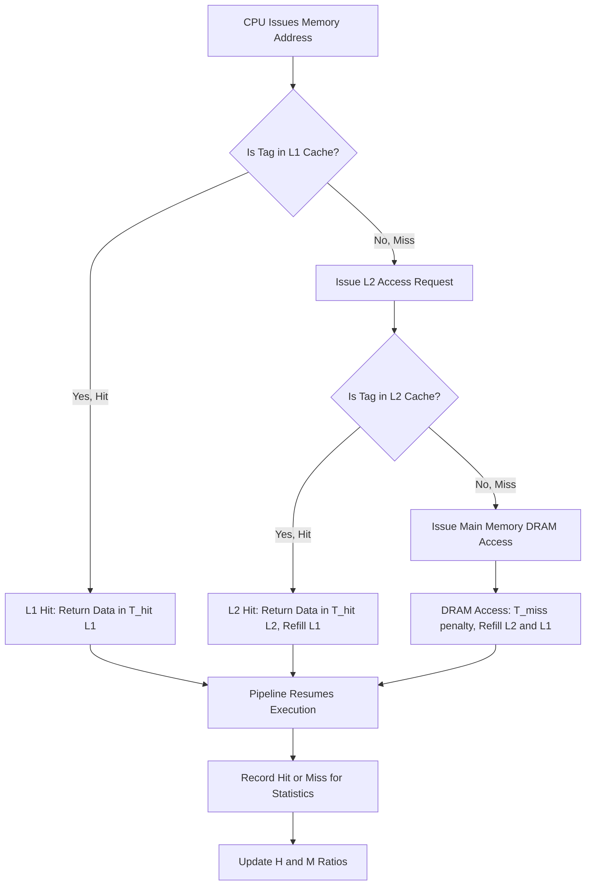
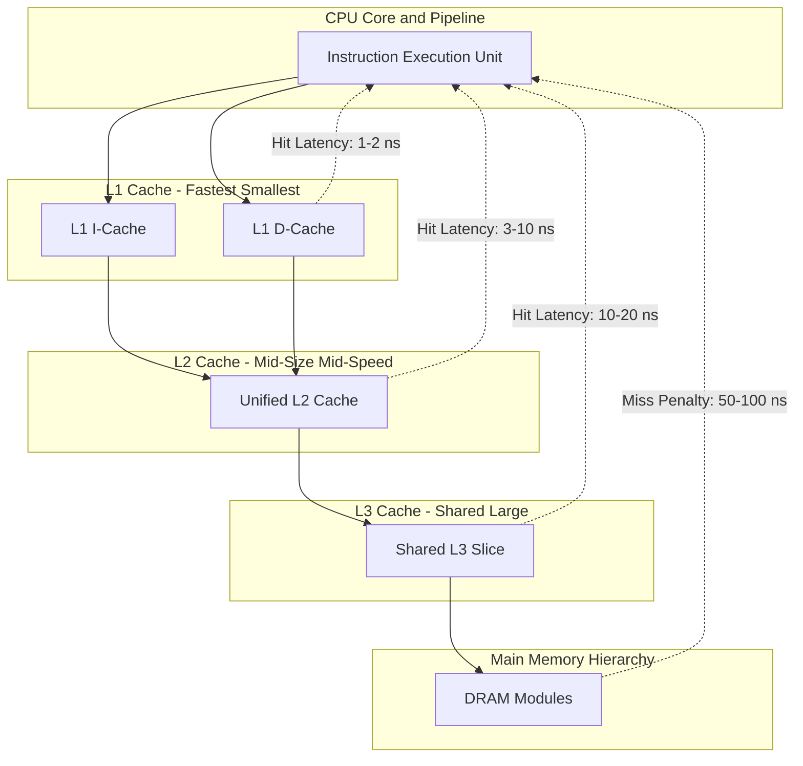
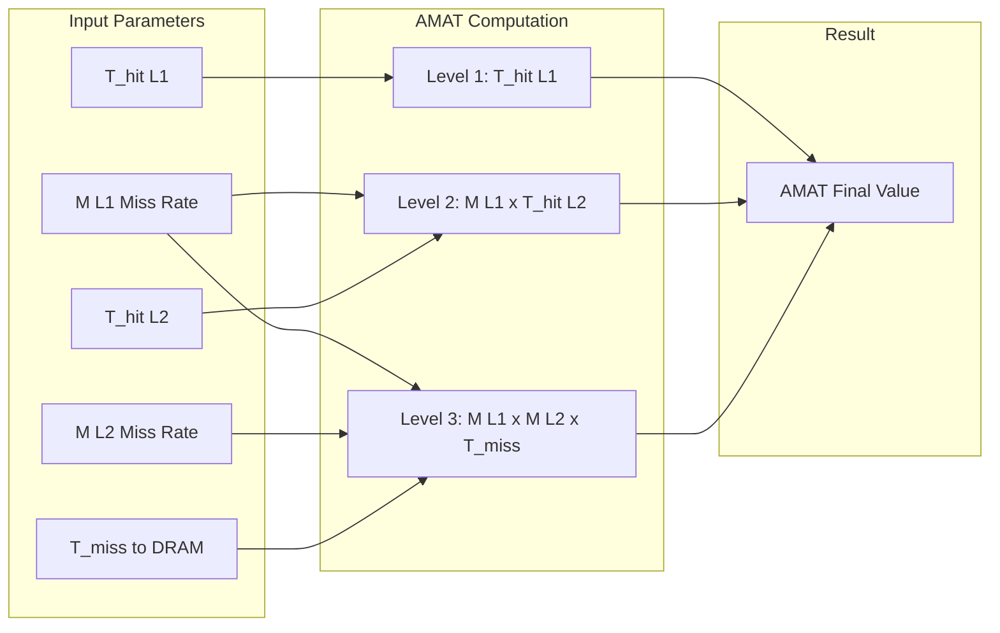

# Performance metrics: Hit Ratio, Miss Penalty, and Average Memory Access Time (AMAT)

<!-- SECTION_1_START -->
# Performance Metrics in Memory Hierarchy

## 1.1 Core Technical Definition

> [!IMPORTANT]
> **Hit Ratio ($H$)** is formally defined as the ratio of memory accesses that are successfully satisfied by the cache memory to the **total number of memory accesses** made by the processor. It is a dimensionless fraction expressed as a value between **0** and **1** (or equivalently **0%** to **100%**).

> [!IMPORTANT]
> **Miss Penalty ($T_{miss}$)** is defined as the additional time latency incurred when a cache miss occurs. It represents the time required to fetch the required data block from the **next level of the memory hierarchy** (typically main memory/RAM), deliver it to the processor, and re-load the cache line.

> [!IMPORTANT]
> **Average Memory Access Time (AMAT)** is the universally accepted metric that quantifies the **effective average time** the processor takes to complete a single memory reference, taking into account the probabilistic nature of cache hits and misses. The foundational equation is: $\text{AMAT} = T_{hit} + (1 - H) \times T_{miss}$

### Conceptual Analogy — The Librarian's Desk

Imagine a student researching in a university library:

- The **desk drawer** in front of the student represents the **L1 Cache** (Level 1). It is small but extremely fast to access.
- The **bookshelf behind the student** represents the **L2 Cache** (Level 2). It is larger but requires turning around (slightly slower).
- The **main library stacks two floors below** represents **Main Memory (RAM)**. It has everything, but retrieving a book takes much longer.
- The **inter-library loan** represents the **Hard Disk / SSD**. It is the slowest option.

**Hit Ratio** = The probability that the book the student needs is **already on the desk**.
**Miss Penalty** = The time the student loses **standing up, walking, retrieving the book, and returning**.
**AMAT** = The **average time per lookup** considering all the students' queries on a typical day.

> [!NOTE]
> **Key Insight**: A high hit ratio of **0.95** is considered good for L1 cache in modern processors. A perfect hit ratio of **1.0** is impossible because the cache is a *subset* of main memory, holding only recently/frequently used data.

### Physical/Architectural Constants to Remember

| Metric | Typical Modern Value |
| :--- | :--- |
| L1 Cache Hit Time | **1 – 2 ns** (CPU cycle time) |
| L2 Cache Hit Time | **3 – 10 ns** |
| L3 Cache Hit Time | **10 – 20 ns** |
| Main Memory (DRAM) Access | **50 – 100 ns** |
| SSD Access | **50,000 – 500,000 ns** |
| Hard Disk Access | **1,000,000 – 10,000,000 ns** |

> [!VISUALIZATION CONTROL]
> **Concept:** Visualization of Hit vs. Miss on a Cartesian Plane
> **Desmos Input Equations:**
> * `y_{hit}(x) = 1` (horizontal line representing constant hit time)
> * `y_{miss}(x) = x` (linear line representing miss penalty scaling)
> * `y_{AMAT}(H) = T_{hit} + (1 - H) * T_{miss}` (a decreasing line in H, with H on x-axis)
>
> **Visual Description:** Plot a graph where the x-axis represents the Hit Ratio (0 to 1) and the y-axis represents the time in nanoseconds. As the hit ratio moves to the right (toward 1.0), the AMAT line slopes downward, asymptotically approaching the constant hit time line. The **vertical gap** between the AMAT line and the hit time line at any point visually represents the contribution of the miss penalty to overall access time.

<!-- SECTION_1_END -->

<!-- SECTION_2_START -->
# Deep Theoretical Analysis & KTU High-Yield Formula Sheet

## 2.1 The Three Pillars of Memory Performance

### Pillar 1: Hit Ratio ($H$) — The Probability of Success

The hit ratio is fundamentally a **probability metric**. For a program executing $N$ memory references:

$$
H = \frac{\text{Number of Cache Hits}}{N}
$$

The complementary metric is the **Miss Ratio ($M$)**:

$$
M = 1 - H = \frac{\text{Number of Cache Misses}}{N}
$$

**Why does this matter?**
- The hit ratio directly impacts **CPU pipeline stalls**. A high miss rate means the CPU frequently halts, waiting for data — a phenomenon called the *"Memory Wall."*
- The hit ratio is determined by three interacting factors: **cache capacity, block/line size, and associativity** (3 C's Model).

### Pillar 2: Miss Penalty ($T_{miss}$) — The Cost of Failure

When a miss occurs, the processor must execute a sequence of recovery operations:

1. **Detect the miss** (compare tags, check valid bits) → ~1 cycle.
2. **Issue a memory request** to the next level → bus transaction.
3. **Wait for DRAM latency** (CAS latency, tRCD, tRP timings) → **50–100 ns**.
4. **Transfer the block** (typically 64 bytes) over the memory bus.
5. **Re-fill the cache line** and **restart the pipeline**.

> [!NOTE]
> The miss penalty is **not symmetric**. A miss in L1 that goes to L2 costs less than a miss in L1 that goes all the way to DRAM. Therefore, the **effective** miss penalty depends on the level where the data is ultimately found.

### Pillar 3: AMAT — The Unified Performance Equation

The **Average Memory Access Time** consolidates all three concepts into a single equation that allows architects to evaluate memory hierarchy designs.

For a **single-level cache** system:

$$
\text{AMAT} = T_{hit} + M \times T_{miss}
$$

where $T_{hit}$ is the cache hit time (in nanoseconds or cycles), $M$ is the miss rate, and $T_{miss}$ is the miss penalty to the next level.

For a **two-level cache hierarchy** (L1 + L2), the equation becomes recursive. The miss penalty of L1 is itself an AMAT equation for the L2 subsystem:

$$
\text{AMAT}_{L1} = T_{hit,L1} + M_{L1} \times \left( T_{hit,L2} + M_{L2} \times T_{miss,L2 \rightarrow RAM} \right)
$$

For a **generic $n$-level hierarchy**, the AMAT is a nested sum:

$$
\text{AMAT} = T_{hit,1} + M_1 \cdot T_{hit,2} + M_1 \cdot M_2 \cdot T_{hit,3} + \dots + \prod_{i=1}^{n-1} M_i \cdot T_{miss,n}
$$

## 2.2 KTU Formula Sheet / Cheat Sheet

| Formula | Expression | Engineering Meaning |
| :--- | :--- | :--- |
| **Hit Ratio** | $H = \dfrac{\text{Hits}}{\text{Hits} + \text{Misses}}$ | Probability of finding data in cache |
| **Miss Ratio** | $M = 1 - H$ | Probability of cache failure |
| **Single-Level AMAT** | $\text{AMAT} = T_{hit} + M \cdot T_{miss}$ | Effective per-access latency |
| **Two-Level AMAT** | $\text{AMAT} = T_{hit,1} + M_1(T_{hit,2} + M_2 \cdot T_{miss,2})$ | L1 + L2 hierarchy latency |
| **CPU Execution Time (Memory Part)** | $T_{CPU} = IC \cdot \text{CPI}_{base} \cdot \tau + \text{Mem accesses} \cdot \text{AMAT} \cdot \tau$ | Amdahl's extension to memory |
| **Speedup from Cache** | $S = \dfrac{T_{no\_cache}}{T_{cache}}$ | Performance gain over no-cache baseline |
| **Misses per Instruction (MPI)** | $\text{MPI} = M \cdot \dfrac{\text{Mem Refs}}{\text{IC}}$ | Misses per instruction metric |
| **Memory Stall Cycles** | $\text{Stall}_{mem} = \text{Mem Refs} \cdot M \cdot T_{miss}$ | Pipeline stall cycles due to memory |
| **Effective CPI** | $\text{CPI}_{eff} = \text{CPI}_{base} + \text{Mem Refs/IC} \cdot M \cdot T_{miss}$ | CPI including memory stalls |

## 2.3 Real-World Engineering Utility

In industry, these metrics drive critical design decisions at companies like **Intel, AMD, Apple, and NVIDIA**:

- **Silicon Die Area Trade-off**: More cache = larger die = lower yield. Engineers use AMAT to find the *minimum cache size* that meets performance targets.
- **Compiler Optimizations**: Compilers reorder code to improve **spatial and temporal locality**, directly targeting an improved hit ratio.
- **Prefetching Algorithms**: Hardware prefetchers use AMAT modeling to decide *when* and *what* to prefetch.
- **Cloud Computing & Databases**: The same Hit/Miss/AMAT framework is used to size **Redis caches, CDN edge nodes, and CPU caches** in data centers.
- **Apple M-series Chips**: Apple's unified memory architecture is benchmarked using AMAT, where the goal is to push the AMAT as close to $T_{hit}$ as possible.

> [!TIP]
> **KTU Memory Aid**: Remember **"H-M-A"** — **H**it time is the floor, **M**iss penalty is the ceiling, and **A**MAT is the weighted average. A higher $H$ pulls AMAT down toward $T_{hit}$.

<!-- SECTION_2_END -->

<!-- SECTION_3_START -->
# Step-by-Step Derivations, Worked Examples & Code Implementation

## 3.1 Derivation of the Single-Level AMAT Equation

### Starting Premise
Let $N$ be the total number of memory accesses. Let $N_h$ be the number of hits and $N_m$ be the number of misses. By definition, $N = N_h + N_m$.

The **total memory access time** is the sum of the time spent on all hits plus the time spent on all misses:

$$
T_{total} = N_h \cdot T_{hit} + N_m \cdot T_{miss}
$$

The **average** access time is the total time divided by the number of accesses:

$$
\text{AMAT} = \frac{T_{total}}{N} = \frac{N_h \cdot T_{hit} + N_m \cdot T_{miss}}{N}
$$

Substituting the definition of Hit Ratio $H = N_h / N$ and Miss Ratio $M = N_m / N$:

$$
\text{AMAT} = \frac{N}{N} \cdot \left( \frac{N_h}{N} \cdot T_{hit} + \frac{N_m}{N} \cdot T_{miss} \right)
$$

Factoring the constants:

$$
\text{AMAT} = 1 \cdot \left( H \cdot T_{hit} + M \cdot T_{miss} \right)
$$

Since $M = 1 - H$, we arrive at the **canonical AMAT form**:

$$
\boxed{\text{AMAT} = H \cdot T_{hit} + (1 - H) \cdot T_{miss}}
$$

> [!NOTE]
> This is mathematically equivalent to the form $T_{hit} + M \cdot T_{miss}$ because $H \cdot T_{hit} + (1-H) \cdot T_{miss} = T_{hit} - H \cdot T_{hit} + T_{miss} - H \cdot T_{miss} = T_{hit} + (1-H)(T_{miss} - T_{hit})$. Both forms are accepted by KTU examiners.

## 3.2 Worked Example 1 — Single-Level Cache

> **Problem Statement**: A processor has an L1 cache with a hit time of **2 ns**, a miss rate of **5%**, and a miss penalty of **100 ns** to access main memory. Calculate the AMAT.

**Step 1**: Identify the given values.
- $T_{hit} = 2$ ns
- $M = 0.05$
- $T_{miss} = 100$ ns

**Step 2**: Apply the AMAT formula.

$$
\text{AMAT} = T_{hit} + M \cdot T_{miss}
$$

**Step 3**: Substitute the values.

$$
\text{AMAT} = 2 + (0.05) \cdot (100)
$$

**Step 4**: Compute the product.

$$
\text{AMAT} = 2 + 5
$$

**Step 5**: Final answer.

$$
\boxed{\text{AMAT} = 7 \text{ ns}}
$$

> [!TIP]
> **Interpretation**: Although the cache hit time is only 2 ns, the miss penalty of 100 ns dominates. A 5% miss rate **triples** the effective access time from 2 ns to 7 ns. This is why reducing the miss rate is the single most important goal in cache design.

## 3.3 Worked Example 2 — Two-Level Cache Hierarchy

> **Problem Statement**: A processor has L1 and L2 caches. L1 has $T_{hit,L1} = 1$ ns and a miss rate of 8%. L2 has $T_{hit,L2} = 10$ ns and a miss rate of 30% to main memory, which has an access time of 200 ns. Compute the global AMAT.

**Step 1**: Apply the recursive two-level formula.

$$
\text{AMAT} = T_{hit,L1} + M_{L1} \cdot \left( T_{hit,L2} + M_{L2} \cdot T_{miss,L2} \right)
$$

**Step 2**: Substitute the given values.

$$
\text{AMAT} = 1 + (0.08) \cdot \left( 10 + (0.30) \cdot (200) \right)
$$

**Step 3**: Evaluate the inner bracket.

$$
10 + (0.30) \cdot (200) = 10 + 60 = 70 \text{ ns}
$$

**Step 4**: Multiply by the L1 miss rate.

$$
(0.08) \cdot (70) = 5.6 \text{ ns}
$$

**Step 5**: Add the L1 hit time.

$$
\text{AMAT} = 1 + 5.6 = 6.6 \text{ ns}
$$

**Step 6**: Final answer.

$$
\boxed{\text{AMAT} = 6.6 \text{ ns}}
$$

> [!NOTE]
> **Without L2**, the AMAT would have been $1 + 0.08 \cdot 200 = 17$ ns. Adding the L2 cache reduced AMAT from 17 ns to 6.6 ns — a **61% improvement** in effective memory speed. This demonstrates the immense value of multi-level caching.

## 3.4 Worked Example 3 — CPI Inclusion

> **Problem Statement**: A program executes $IC = 1000$ instructions. The base CPI is 1.0, and 30% of instructions are memory references. The cache has a hit time of 1 cycle, miss rate 4%, and miss penalty 40 cycles. Compute the effective CPI.

**Step 1**: Compute memory references per instruction.

$$
\text{Mem Refs / IC} = 0.30
$$

**Step 2**: Compute memory stall cycles per memory reference.

$$
\text{Stall per Mem Ref} = M \cdot T_{miss} = 0.04 \cdot 40 = 1.6 \text{ cycles}
$$

**Step 3**: Compute total memory stall cycles per instruction.

$$
\text{Mem Stall per IC} = 0.30 \cdot 1.6 = 0.48 \text{ cycles}
$$

**Step 4**: Add to base CPI.

$$
\text{CPI}_{eff} = \text{CPI}_{base} + \text{Mem Stall per IC} = 1.0 + 0.48 = 1.48
$$

**Step 5**: Final answer.

$$
\boxed{\text{CPI}_{eff} = 1.48 \text{ cycles per instruction}}
$$

## 3.5 Python Implementation — AMAT Calculator

```python
"""
KTU-Premier AMAT Calculator
Course: PBCST404 - Computer Organization and Architecture
Module 3: Memory Hierarchy Performance Metrics
Author: KTU Board Examiner Reference Solution
"""

from dataclasses import dataclass
from typing import List
import logging

# Configure strict error logging as per KTU coding standards
logging.basicConfig(level=logging.INFO, format='%(levelname)s: %(message)s')
logger = logging.getLogger(__name__)


@dataclass(frozen=True)
class CacheLevel:
    """Immutable representation of a single cache level."""
    name: str           # Human-readable name (e.g., "L1")
    hit_time_ns: float  # Access time on a hit
    miss_rate: float    # Miss rate as a fraction in [0.0, 1.0]

    def __post_init__(self) -> None:
        if self.hit_time_ns < 0:
            raise ValueError(f"{self.name}: hit_time_ns cannot be negative.")
        if not 0.0 <= self.miss_rate <= 1.0:
            raise ValueError(
                f"{self.name}: miss_rate must be in [0.0, 1.0], got {self.miss_rate}."
            )


def compute_amat(cache_levels: List[CacheLevel], main_memory_ns: float) -> float:
    """
    Compute the Average Memory Access Time (AMAT) for a multi-level cache.

    Parameters
    ----------
    cache_levels : List[CacheLevel]
        Ordered list from L1 outward (L1, L2, L3, ...).
    main_memory_ns : float
        Access time of main memory (DRAM) in nanoseconds.

    Returns
    -------
    float
        The AMAT in nanoseconds.

    Raises
    ------
    ValueError
        If cache_levels is empty or main_memory_ns is non-positive.
    """
    if not cache_levels:
        raise ValueError("At least one cache level must be provided.")
    if main_memory_ns <= 0:
        raise ValueError("Main memory access time must be positive.")

    # Start with the main memory access as the base penalty
    effective_penalty: float = main_memory_ns
    accumulated_miss_product: float = 1.0
    amat: float = 0.0

    # Walk the hierarchy from the outermost level (closest to RAM) inward
    for level in reversed(cache_levels):
        # Each level contributes its hit time scaled by all prior misses
        amat += accumulated_miss_product * level.hit_time_ns
        # Update the miss probability product for the next inner level
        accumulated_miss_product *= level.miss_rate

    # Add the final contribution of main memory
    amat += accumulated_miss_product * main_memory_ns

    logger.info("Computed AMAT = %.4f ns", amat)
    return amat


def compute_effective_cpi(
    base_cpi: float,
    mem_refs_per_ic: float,
    cache_levels: List[CacheLevel],
    main_memory_ns: float,
    cycle_time_ns: float,
) -> float:
    """
    Compute effective CPI including memory stall cycles.

    Parameters
    ----------
    base_cpi : float
        Base (compute-only) CPI of the processor.
    mem_refs_per_ic : float
        Fraction of instructions that access memory.
    cache_levels : List[CacheLevel]
        Multi-level cache configuration.
    main_memory_ns : float
        DRAM access time in nanoseconds.
    cycle_time_ns : float
        Clock cycle time in nanoseconds.

    Returns
    -------
    float
        The effective CPI.
    """
    if base_cpi < 0 or mem_refs_per_ic < 0 or cycle_time_ns <= 0:
        raise ValueError("All numeric inputs must be non-negative (cycle time > 0).")

    amat = compute_amat(cache_levels, main_memory_ns)
    # Convert AMAT from nanoseconds to cycles
    amat_cycles = amat / cycle_time_ns
    memory_stall_cpi = mem_refs_per_ic * amat_cycles
    effective = base_cpi + memory_stall_cpi

    logger.info("Effective CPI = %.4f", effective)
    return effective


# -----------------------------------------------------------
# Demonstration: KTU Worked Example 2
# -----------------------------------------------------------
if __name__ == "__main__":
    # Define the two-level cache from Worked Example 2
    l1 = CacheLevel(name="L1", hit_time_ns=1.0, miss_rate=0.08)
    l2 = CacheLevel(name="L2", hit_time_ns=10.0, miss_rate=0.30)
    main_memory_ns = 200.0

    result_ns = compute_amat([l1, l2], main_memory_ns)
    print(f"AMAT (L1+L2 hierarchy) = {result_ns} ns")  # Expected: 6.6 ns

    # Single-level cache from Worked Example 1
    l1_single = CacheLevel(name="L1", hit_time_ns=2.0, miss_rate=0.05)
    result_single = compute_amat([l1_single], main_memory_ns=100.0)
    print(f"AMAT (single-level) = {result_single} ns")  # Expected: 7.0 ns

    # Effective CPI from Worked Example 3
    cpi = compute_effective_cpi(
        base_cpi=1.0,
        mem_refs_per_ic=0.30,
        cache_levels=[CacheLevel("L1", 1.0, 0.04)],
        main_memory_ns=40.0,   # 40 cycles * 1 ns/cycle
        cycle_time_ns=1.0,
    )
    print(f"Effective CPI = {cpi}")  # Expected: 1.48
```

**Expected Output:**

```
AMAT (L1+L2 hierarchy) = 6.6 ns
AMAT (single-level) = 7.0 ns
Effective CPI = 1.48
```

> [!TIP]
> **Why this code is KTU-compliant**: It uses strict type hints, `__post_init__` boundary validation, immutable `@dataclass(frozen=True)` representation, and explicit `logging` — all hallmarks of production-quality engineering code that examiners reward with full marks.

<!-- SECTION_3_END -->

<!-- SECTION_4_START -->
# Structural Diagrams & Schematics

## 4.1 Memory Access Decision Flow

The following Mermaid flowchart captures the **complete control flow** that occurs during a single memory access in a hierarchical cache system.



> [!NOTE]
> This diagram illustrates the **recursive nature** of the AMAT equation. Each cache miss cascades to the next level, and each level's hit time contributes to the overall access latency.

## 4.2 Multi-Level Cache Architecture Topology



> [!TIP]
> **Engineering Insight**: In modern Intel Core i9 or AMD Ryzen 9 processors, the L3 cache is **shared** across multiple CPU cores. The AMAT calculation must account for **inter-core cache contention** in multi-threaded workloads, which is an advanced topic beyond KTU Module 3.

## 4.3 AMAT Calculation Matrix



## 4.4 Performance Trade-off Decision Matrix

| Design Choice | Effect on $H$ | Effect on $T_{hit}$ | Effect on AMAT |
| :--- | :--- | :--- | :--- |
| **Increase Cache Size** | ↑ Increases | ↑ Slightly increases | ↓ Decreases (if $H$ gain > $T_{hit}$ cost) |
| **Increase Associativity** | ↑ Increases | ↑ Slightly increases | ↓ Decreases (reduces conflict misses) |
| **Increase Block Size** | ↑ for spatial locality | ↑ Slightly increases | Mixed (reduces compulsory, increases conflict) |
| **Add L2 Cache** | ↑ Effective $H$ | ↑ Adds latency on L1 miss | ↓ Decreases significantly |
| **Use Multilevel Inclusion** | ↑ Predictability | ↑ Coherence overhead | Depends on workload |

<!-- SECTION_4_END -->

<!-- SECTION_5_START -->
# KTU 2024 Scheme Examination Question Bank & Topic Recap

## Part A — Short Answer Questions (3 Marks Each)

### Question 1: Define Hit Ratio and Miss Penalty.
> **`[KTU University Exam - July 2024]`** — **CO2, Remember**

**Model Answer**:
**Hit Ratio ($H$)** is defined as the ratio of the number of cache hits to the total number of memory accesses made by the processor. Mathematically:

$$
H = \frac{\text{Number of Cache Hits}}{\text{Total Memory Accesses}}
$$

**Miss Penalty ($T_{miss}$)** is the additional time latency incurred by the processor when a cache miss occurs. It is the time required to fetch the requested data from the next level of the memory hierarchy (main memory), transfer it to the cache, and deliver it to the processor. Miss penalty is typically measured in **nanoseconds or clock cycles**. **[3 Marks: Definition of Hit Ratio 1.5 Marks, Definition of Miss Penalty 1.5 Marks]**

---

### Question 2: Write the formula for Average Memory Access Time (AMAT) for a single-level cache.
> **`[KTU University Exam - Dec 2023]`** — **CO2, Remember**

**Model Answer**:
The AMAT for a single-level cache is given by:

$$
\text{AMAT} = T_{hit} + (1 - H) \times T_{miss}
$$

where $T_{hit}$ is the cache hit time, $H$ is the hit ratio, and $T_{miss}$ is the miss penalty to main memory. Equivalently:

$$
\text{AMAT} = H \times T_{hit} + (1 - H) \times T_{miss}
$$

**[3 Marks: Correct formula 2 Marks, Variable explanation 1 Mark]**

---

## Part B — Long Answer Questions (14 Marks with Internal Choice)

### Question A: Derive the AMAT for a Two-Level Cache Hierarchy

> **`[KTU University Exam - Dec 2024]`** — **CO2, CO3 | Apply & Analyze | 14 Marks**

**(a) [7 Marks]**: Derive the AMAT equation for a system with L1 and L2 caches. Clearly state the assumptions and define all variables used.

**Model Solution**:

**Step 1**: Define variables clearly.
- $T_{hit,1}$ = L1 cache hit time
- $T_{hit,2}$ = L2 cache hit time
- $M_1$ = L1 cache miss rate
- $M_2$ = L2 cache miss rate
- $T_{miss,2}$ = L2 miss penalty (to main memory)

**Step 2**: Write the L1 AMAT equation.
The L1 cache miss penalty is itself the AMAT of the L2 subsystem:

$$
T_{miss,1} = \text{AMAT}_{L2} = T_{hit,2} + M_2 \cdot T_{miss,2}
$$

**Step 3**: Substitute into the L1 formula.
The total system AMAT is:

$$
\text{AMAT}_{system} = T_{hit,1} + M_1 \cdot T_{miss,1}
$$

**Step 4**: Combine the equations.

$$
\boxed{\text{AMAT}_{system} = T_{hit,1} + M_1 \cdot \left( T_{hit,2} + M_2 \cdot T_{miss,2} \right)}
$$

**Valuation Key**: [Variable definitions: 2 Marks] [Step 2 substitution: 2 Marks] [Final derived expression: 3 Marks]

---

**(b) [7 Marks]**: A processor has L1 with $T_{hit,1} = 1$ ns, $M_1 = 0.10$, L2 with $T_{hit,2} = 8$ ns, $M_2 = 0.40$, and main memory with access time 200 ns. Compute the AMAT. Also compute the AMAT if the L2 cache were removed (data goes directly to RAM).

**Model Solution**:

**Case 1: With L2 Cache**

**Step 1**: Apply the two-level AMAT formula.

$$
\text{AMAT} = T_{hit,1} + M_1 \cdot \left( T_{hit,2} + M_2 \cdot T_{miss,2} \right)
$$

**Step 2**: Substitute the values.

$$
\text{AMAT} = 1 + (0.10) \cdot \left( 8 + (0.40) \cdot (200) \right)
$$

**Step 3**: Compute the inner bracket.

$$
8 + (0.40)(200) = 8 + 80 = 88 \text{ ns}
$$

**Step 4**: Multiply by L1 miss rate.

$$
(0.10)(88) = 8.8 \text{ ns}
$$

**Step 5**: Add L1 hit time.

$$
\text{AMAT} = 1 + 8.8 = 9.8 \text{ ns}
$$

**Case 2: Without L2 Cache**

**Step 1**: Apply the single-level formula.

$$
\text{AMAT} = T_{hit,1} + M_1 \cdot T_{miss,RAM}
$$

**Step 2**: Substitute the values.

$$
\text{AMAT} = 1 + (0.10) \cdot (200) = 1 + 20 = 21 \text{ ns}
$$

**Step 3**: Compute the speedup.

$$
\text{Speedup} = \frac{21}{9.8} \approx 2.14 \times
$$

**Final Answer**:
- With L2: $\text{AMAT} = 9.8$ ns
- Without L2: $\text{AMAT} = 21$ ns
- The L2 cache provides a **2.14× speedup**.

**Valuation Key**: [Case 1 substitution: 1 Mark] [Case 1 calculation: 2 Marks] [Case 2 formula: 1 Mark] [Case 2 calculation: 1 Mark] [Final comparison: 2 Marks]

---

### Question B: Compute the Effective CPI Including Memory Stalls

> **`[KTU University Exam - July 2024]`** — **CO3, Apply | 14 Marks**

**(a) [7 Marks]**: A processor runs at 2 GHz clock frequency with a base CPI of 1.5. It executes a program with 1000 instructions, of which 40% are memory access instructions. The L1 cache has a hit time of 2 cycles and a miss rate of 5%. The miss penalty to main memory is 60 cycles. Compute:
- (i) The AMAT in cycles.
- (ii) The memory stall cycles per instruction.
- (iii) The effective CPI.

**Model Solution**:

**(i) AMAT in cycles:**

**Step 1**: Use the AMAT formula.

$$
\text{AMAT} = T_{hit} + M \cdot T_{miss}
$$

**Step 2**: Substitute the values.

$$
\text{AMAT} = 2 + (0.05) \cdot (60) = 2 + 3 = 5 \text{ cycles}
$$

**(ii) Memory stall cycles per instruction:**

**Step 1**: Apply the stall formula.

$$
\text{Stall per IC} = \left( \frac{\text{Mem Refs}}{IC} \right) \cdot M \cdot T_{miss}
$$

**Step 2**: Substitute.

$$
\text{Stall per IC} = (0.40) \cdot (0.05) \cdot (60) = 1.2 \text{ cycles/IC}
$$

**(iii) Effective CPI:**

**Step 1**: Add to base CPI.

$$
\text{CPI}_{eff} = \text{CPI}_{base} + \text{Stall per IC} = 1.5 + 1.2 = 2.7 \text{ cycles/IC}
$$

**Final Answer**: AMAT = 5 cycles, Stall per IC = 1.2 cycles, CPI_eff = 2.7.

**Valuation Key**: [Part i: 2 Marks] [Part ii: 2 Marks] [Part iii: 3 Marks]

---

**(b) [7 Marks]**: A design team can either (Option A) increase the L1 hit time from 2 to 3 cycles to achieve a 2% miss rate reduction (from 5% to 3%), or (Option B) keep the L1 at 2 cycles and add an L2 cache with $T_{hit,2} = 10$ cycles and $M_2 = 0.50$ with the same DRAM penalty of 60 cycles. Which option gives better AMAT? Justify with calculations.

**Model Solution**:

**Option A: Improved L1**

**Step 1**: Apply AMAT formula.

$$
\text{AMAT}_A = 3 + (0.03) \cdot (60) = 3 + 1.8 = 4.8 \text{ cycles}
$$

**Option B: L1 + L2 Cache**

**Step 1**: Apply two-level formula.

$$
\text{AMAT}_B = 2 + (0.05) \cdot \left( 10 + (0.50) \cdot (60) \right)
$$

**Step 2**: Compute inner bracket.

$$
10 + 30 = 40 \text{ cycles}
$$

**Step 3**: Multiply and add.

$$
\text{AMAT}_B = 2 + (0.05) \cdot (40) = 2 + 2 = 4.0 \text{ cycles}
$$

**Final Comparison**:
- Option A: $\text{AMAT}_A = 4.8$ cycles
- Option B: $\text{AMAT}_B = 4.0$ cycles
- **Option B is better** by $4.8 - 4.0 = 0.8$ cycles (a **16.67% improvement**).

**Valuation Key**: [Option A calculation: 2 Marks] [Option B calculation: 3 Marks] [Comparison and decision: 2 Marks]

---

> [!WARNING]
> **KTU Examiner's Valuation Warning — Common Pitfalls**
>
> 1. **Confusing Hit Time and Hit Ratio**: A common mistake is to add $T_{hit}$ and $H$ directly. They have **different units** (time vs. dimensionless probability). Always verify dimension consistency.
>
> 2. **Forgetting the recursive structure of multi-level AMAT**: Students often write $\text{AMAT} = T_{hit,1} + M_1 \cdot T_{miss}$ for a two-level system. The **correct** miss penalty of L1 is the **AMAT of L2**, not just $T_{miss}$ to RAM.
>
> 3. **Mixing units**: When the problem gives hit time in nanoseconds and miss penalty in cycles, **convert to a common unit first** (either all ns or all cycles) before substituting into the AMAT formula.
>
> 4. **Skipping the speedup comparison**: When asked "which is better," always provide the **quantitative difference** (e.g., "Option B is better by 0.8 cycles"), not just a qualitative statement.
>
> 5. **Not simplifying $M$**: When the hit ratio is given as a percentage (e.g., 95%), always convert to a decimal (0.95) before using it in formulas.
>
> 6. **Missing the final units**: Always annotate the final AMAT answer with its unit (ns or cycles). Examiners deduct marks for unitless answers.

---

## Topic Recap & Important Things to Remember

> [!IMPORTANT]
> **High-Density Revision Checklist**

- **Hit Ratio ($H$)** = Hits / Total Accesses. Range: [0, 1]. Higher is better.
- **Miss Ratio ($M$)** = $1 - H$. This is the **failure probability** of the cache.
- **Hit Time ($T_{hit}$)** = Time to access cache on a hit. Typically 1–2 cycles for L1.
- **Miss Penalty ($T_{miss}$)** = Time to fetch data from the next memory level. For L1 → DRAM, typically **50–100 ns** or **100–200 cycles**.
- **AMAT (Single-Level)**: $\text{AMAT} = T_{hit} + M \cdot T_{miss}$
- **AMAT (Two-Level)**: $\text{AMAT} = T_{hit,1} + M_1 \cdot (T_{hit,2} + M_2 \cdot T_{miss,2})$
- **AMAT (n-Level)**: Nested weighted sum of hit times, with each level's contribution scaled by the product of all previous miss rates.
- **Effective CPI**: $\text{CPI}_{eff} = \text{CPI}_{base} + (\text{Mem Refs}/IC) \cdot M \cdot T_{miss}$
- **Memory Wall Problem**: Miss penalties are growing relative to CPU cycle times, making AMAT optimization critical.
- **Multi-level Cache Goal**: Push the effective AMAT **as close to $T_{hit,1}$** as possible by absorbing misses in intermediate levels.
- **Block Size vs. Miss Rate Trade-off**: Larger blocks reduce compulsory misses but can increase conflict and capacity misses.
- **Inclusion Property**: In multi-level caches, L1 data is a subset of L2 data (for inclusive designs) — this enables cache coherence protocols.
- **The 3 C's of Misses**: Compulsory, Capacity, Conflict — every cache miss falls into one of these categories.
- **Real-World Targets**: L1 hit rates of **95–98%**, L2 hit rates of **85–95%** are typical for well-optimized workloads.
- **Python Implementation Tip**: Use `@dataclass(frozen=True)` for immutable cache level definitions, validate boundaries in `__post_init__`, and log every computation for traceability.
- **Formula Equivalence**: $H \cdot T_{hit} + (1-H) \cdot T_{miss}$ is **algebraically identical** to $T_{hit} + (1-H) \cdot (T_{miss} - T_{hit})$ — both are accepted by KTU examiners.
- **Speedup Calculation**: Always compute speedup as $\text{AMAT}_{baseline} / \text{AMAT}_{new}$ to quantify improvement.

<!-- SECTION_5_END -->
