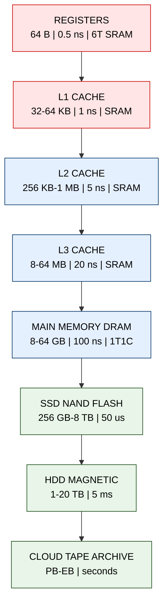
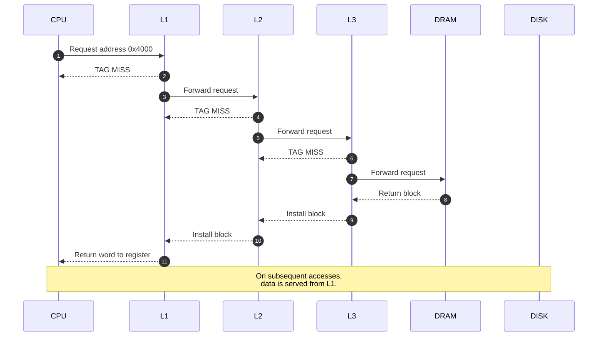
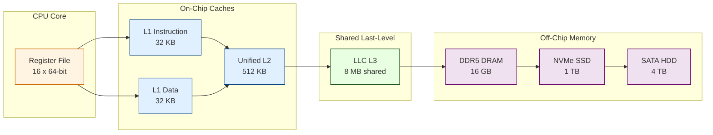

# The Memory Hierarchy: Speed, Size, and Cost trade-offs across storage layers

<!-- SECTION_1_START -->

# The Memory Hierarchy: Speed, Size, and Cost Trade-offs

## 1.1 Formal KTU-Syllabus Definition

> [!NOTE]
> **Memory Hierarchy** is an organization of a computer's storage systems arranged in a hierarchical (multi-level) order, where each successive level is **larger in capacity**, **slower in access time**, and **cheaper per bit** than the one above it. The hierarchy exploits the principle of **Locality of Reference** to present the user with an apparent memory that is nearly as fast as the fastest level and nearly as large as the slowest level, at a cost per bit approaching that of the cheapest level.

According to the KTU 2024 Scheme (PBCST404 - Module 3) syllabus statement, the memory hierarchy is a *system-level design strategy* that bridges the **CPU–Memory performance gap** (often called the *Memory Wall*) by inserting intermediate, high-speed buffers between the processor registers and the main bulk storage.

## 1.2 The Tri-Axial Trade-off Triangle

Every storage technology in a computer is bound by three engineering constraints that cannot be simultaneously optimized:

| Axis | Description | Trend Going Down the Hierarchy |
|------|-------------|--------------------------------|
| **Speed (Access Time)** | Latency between issuing an address and receiving data | **Increases** (slows down) |
| **Size (Capacity)** | Total number of bits addressable | **Increases** |
| **Cost (₹/bit or \$/bit)** | Monetary price per stored bit | **Decreases** (cheaper) |

> [!IMPORTANT]
> **KTU Board Highlight:** Examiners frequently award 2 marks for correctly stating that *only two* of the three properties can be optimized at a time. Volatile, ultra-fast memory (SRAM) is *expensive per bit*; non-volatile, bulk storage (magnetic tape) is *cheap per bit* but *agonizingly slow*. The hierarchy is the engineering compromise.

## 1.3 Intuitive Analogy — The "Researcher's Desk"

Imagine a university researcher working on a thesis:

1. **Desk-top items** (pen, calculator, current paper) → *fast to reach, very few items* — analogous to **CPU Registers**.
2. **Desk drawer** (recent drafts, sticky notes) → *a bit slower, more items* — analogous to **L1 / L2 Cache (SRAM)**.
3. **Office bookshelf** (reference books used this month) → *larger, slower* — analogous to **L3 Cache / Main Memory (DRAM)**.
4. **Department library** (thousands of books) → *much larger, must walk over* — analogous to **SSD / HDD (Secondary Storage)**.
5. **National archive warehouse** (petabytes of data, days of delay) → *terabytes cheap* — analogous to **Tertiary Storage / Cloud / Tape**.

The researcher follows a **temporal-locality pattern**: papers just read stay on the desk; papers not touched in a year get returned to the warehouse. The computer does exactly the same with data blocks across registers → cache → RAM → disk.

## 1.4 Physical Constants & Standard Metrics

| Metric | Typical Value (Modern Desktop CPU, 2024) |
|--------|------------------------------------------|
| **CPU Register Access** | **≈ 0.25 – 0.5 ns** (single clock cycle at 3–4 GHz) |
| **L1 Cache Latency** | **≈ 1 – 2 ns** (≈ 4 cycles) |
| **L2 Cache Latency** | **≈ 3 – 10 ns** (≈ 12–40 cycles) |
| **L3 Cache Latency** | **≈ 10 – 20 ns** (≈ 40–80 cycles) |
| **DRAM (Main Memory) Latency** | **≈ 50 – 100 ns** |
| **NVMe SSD Latency** | **≈ 20 – 100 μs** (≈ 200× slower than DRAM) |
| **HDD Latency (seek + rotational)** | **≈ 1 – 10 ms** (≈ 100,000× slower than DRAM) |
| **Network / Cloud Latency** | **≈ 10 – 500 ms** |
| **Cost per GB (DRAM, 2024)** | **≈ ₹ 250 – 400** |
| **Cost per GB (SSD)** | **≈ ₹ 40 – 70** |
| **Cost per GB (HDD)** | **≈ ₹ 3 – 5** |

> [!WARNING]
> **Note on the numbers:** The exact figures vary by year and vendor. The KTU paper does *not* require memorized numerals, only the *order-of-magnitude* difference between layers. Memorize the *direction* of the trade-off, not specific latency values.

## 1.5 Visualization — The Trade-off Curves

> [!VISUALIZATION CONTROL]
> **Concept:** Three intersecting curves — Capacity (rising), Cost/bit (falling), and Access Time (rising) — plotted against *Hierarchical Level* (1 = Register, 5 = Cloud).
>
> **GeoGebra / Desmos Input Equations (parametric form, level $L \in [1, 5]$):**
>
> - `Capacity(L) = 64 * 2^(L*4)` (Bytes)
> - `Latency(L)  = 0.5 * 10^(L*1.2)` (nanoseconds)
> - `CostPerBit(L) = 0.0001 * 10^(-L*0.9)` (₹/bit)
>
> **Visual Description:** Student should see that as the level index $L$ increases, the **capacity curve shoots up exponentially**, the **latency curve also rises**, while the **cost-per-bit curve falls exponentially**. This visualizes the *inherent trade-off*: a designer cannot move a level *right* (bigger) without also moving it *down* (slower) and *down* in price.

<!-- SECTION_1_END -->

<!-- SECTION_2_START -->

# Deep Theoretical Analysis & KTU High-Yield Formula Sheet

## 2.1 The Five Canonical Layers (Top → Bottom)

### Layer 1 — CPU Registers
- **Technology:** Flip-flops built from 6 transistors per bit (CMOS SRAM cell).
- **Size:** 16 × 64-bit registers in x86-64 (≈ 128 Bytes per core).
- **Speed:** 1 clock cycle.
- **Managed by:** Compiler / hardware instruction set.
- **Volatile:** Yes.

### Layer 2 — On-chip Cache (L1, L2, L3)
- **Technology:** SRAM (6T cell, no refresh).
- **Size:** L1 ≈ 32–64 KB/core, L2 ≈ 256 KB–1 MB/core, L3 ≈ 8–64 MB shared.
- **Speed:** L1 ≈ 1 ns, L2 ≈ 3–10 ns, L3 ≈ 10–20 ns.
- **Managed by:** Hardware (Cache Controller).
- **Volatile:** Yes.

### Layer 3 — Main Memory (Primary Storage)
- **Technology:** DRAM (1T + 1 capacitor cell, requires periodic refresh every ≈ 64 ms).
- **Size:** 8 GB – 128 GB typical in modern desktops.
- **Speed:** ≈ 50–100 ns.
- **Managed by:** Operating System (page tables, virtual memory).
- **Volatile:** Yes.

### Layer 4 — Secondary Storage
- **Technology:** SSD (NAND Flash) or HDD (magnetic platters + actuator arm).
- **Size:** 256 GB – 8 TB.
- **Speed:** SSD ≈ 20–100 μs, HDD ≈ 1–10 ms.
- **Managed by:** OS file system + storage controller.
- **Volatile:** **No** (persistent).

### Layer 5 — Tertiary / Off-line Storage
- **Technology:** Magnetic tape (LTO), optical (Blu-ray), or remote cloud object stores.
- **Size:** Petabytes to Exabytes.
- **Speed:** Seconds to minutes.
- **Managed by:** Backup software, archival systems.
- **Volatile:** No.

## 2.2 The Two Pillars of Hierarchy Efficiency

### Pillar A — Locality of Reference
Programs do *not* access memory uniformly or randomly. They obey two statistical patterns:

- **Temporal Locality:** If a memory location is referenced *now*, it is highly likely to be referenced *again soon* (e.g., loop counters, accumulator variables).
- **Spatial Locality:** If a memory location is referenced *now*, neighboring locations are likely to be referenced *soon* (e.g., sequential array traversal, instruction fetch stream).

> [!NOTE]
> **Hierarchical consequence:** Temporal locality justifies keeping recently-used data in the *upper* (faster) levels. Spatial locality justifies transferring *blocks* (cache lines of 64 Bytes) rather than single words during a transfer.

### Pillar B — Inclusion Property (Optional Advanced)
In a *strictly inclusive* hierarchy, every datum present in $L_i$ is *also* present in $L_{i+1}$. This property simplifies cache-coherence protocols in multi-core CPUs.

## 2.3 KTU Formula Sheet

> [!IMPORTANT]
> **Use `\vert` instead of `|` inside any markdown table cell containing math, to prevent table-parser breakage.**

| # | Formula | Symbol Glossary | Engineering Meaning |
|---|---------|-----------------|---------------------|
| 1 | $T_{avg} = H \cdot T_{hit} + (1-H) \cdot T_{miss}$ | $H$ = hit ratio, $T_{hit}$ = hit time, $T_{miss}$ = miss penalty | Average access time for a 2-level memory (cache + main). |
| 2 | $T_{avg} = H \cdot T_{cache} + (1-H) \cdot (T_{cache} + T_{main})$ | $T_{cache}$ = cache access, $T_{main}$ = main memory access | Miss-penalty *includes* the time to check the cache first. |
| 3 | $\text{AMAT} = T_{L1} + M_{L1} \cdot (T_{L2} + M_{L2} \cdot (T_{L3} + M_{L3} \cdot T_{mem}))$ | $M_L$ = miss rate at level $L$ | **Average Memory Access Time** for a 3-level cache + DRAM. |
| 4 | $C_{eff} = \dfrac{C_1 S_1 + C_2 S_2 + \dots + C_n S_n}{S_1 + S_2 + \dots + S_n}$ | $C_i$ = cost/bit, $S_i$ = size of level $i$ | **Effective cost per bit** of the entire hierarchy. |
| 5 | $\eta = \dfrac{T_{fastest}}{T_{avg}}$ | $\eta$ = performance efficiency | Ratio of fastest possible to actual average time. |
| 6 | $\text{Throughput} = \dfrac{1}{T_{avg}}$ | — | Memory requests satisfied per second. |
| 7 | $\text{Speedup}_{L_1} = \dfrac{T_{no\text{-}cache}}{T_{L_1}}$ | — | Improvement factor when L1 is inserted. |
| 8 | $\text{Miss Rate} = 1 - \text{Hit Rate}$ | — | Complement relationship. |

## 2.4 Real-World Engineering Utility

- **Database Engines (PostgreSQL, Oracle):** Maintain a *buffer pool* in DRAM (analogous to cache) above on-disk pages, exploiting temporal locality of recent queries.
- **Web Servers (NGINX, Redis):** Use in-memory key-value stores as a "software L1" above database lookups.
- **GPU Computing (CUDA):** Expose a programmer-managed memory hierarchy (*shared memory* → *global memory* → *host memory*) that mirrors the hardware hierarchy.
- **Mobile SoCs (Apple M-series, Snapdragon):** Use *System Level Cache* (SLC) shared between CPU and GPU to amortize DRAM access.
- **Cloud Storage (AWS S3, Azure Blob):** Internally tier data across NVMe, HDD, and cold-archive (Glacier/Archive tiers) — a hierarchy at the *data-center* scale.

<!-- SECTION_2_END -->

<!-- SECTION_3_START -->

# Step-by-Step Derivations & Symbolic Implementation

## 3.1 Derivation 1 — Average Memory Access Time (2-Level System)

**Problem Statement:** A system has a cache of access time $T_c = 5 \text{ ns}$ and main memory of access time $T_m = 100 \text{ ns}$. The hit ratio is $H = 0.90$. Compute the average access time $T_{avg}$.

**Derivation:**

$$
T_{avg} = H \cdot T_c + (1 - H) \cdot (T_c + T_m)
$$

**Justification of terms:** On a *hit*, we pay only the cache lookup time $T_c$. On a *miss*, we pay the cache lookup $T_c$ (we had to look first) *plus* the time to fetch the block from main memory $T_m$.

**Step 1 — Substitute numerical values:**

$$
T_{avg} = (0.90)(5) + (1 - 0.90)(5 + 100)
$$

**Step 2 — Simplify each term:**

$$
T_{avg} = 4.5 + (0.10)(105)
$$

**Step 3 — Final multiplication and addition:**

$$
T_{avg} = 4.5 + 10.5 = 15.0 \text{ ns}
$$

**Step 4 — Interpretation:** Without cache, every access costs 100 ns. With cache, average cost drops to **15 ns**, a **6.67× speedup**.

> [!NOTE]
> **Valuation Tip:** A common student error is to write $T_{miss} = T_m$ instead of $T_{miss} = T_c + T_m$. The cache lookup is *not* free on a miss — we must check the cache to *know* it missed. Examiners deduct 1 mark for this omission.

---

## 3.2 Derivation 2 — AMAT for a 3-Level Cache Hierarchy

**Given:**
- L1 access time: $T_1 = 1 \text{ ns}$, miss rate: $M_1 = 0.05$
- L2 access time: $T_2 = 5 \text{ ns}$, miss rate: $M_2 = 0.10$
- L3 access time: $T_3 = 20 \text{ ns}$, miss rate: $M_3 = 0.20$
- Main memory access time: $T_m = 100 \text{ ns}$

**Derivation using nested AMAT formula:**

$$
\text{AMAT} = T_1 + M_1 \cdot T_2 + M_1 M_2 \cdot T_3 + M_1 M_2 M_3 \cdot T_m
$$

**Step 1 — Compute $T_1$ contribution:**

$$
T_1 = 1 \text{ ns}
$$

**Step 2 — Compute $M_1 \cdot T_2$ contribution:**

$$
M_1 \cdot T_2 = 0.05 \times 5 = 0.25 \text{ ns}
$$

**Step 3 — Compute $M_1 M_2 \cdot T_3$ contribution:**

$$
M_1 M_2 = 0.05 \times 0.10 = 0.005
$$

$$
M_1 M_2 \cdot T_3 = 0.005 \times 20 = 0.10 \text{ ns}
$$

**Step 4 — Compute $M_1 M_2 M_3 \cdot T_m$ contribution:**

$$
M_1 M_2 M_3 = 0.05 \times 0.10 \times 0.20 = 0.001
$$

$$
M_1 M_2 M_3 \cdot T_m = 0.001 \times 100 = 0.10 \text{ ns}
$$

**Step 5 — Sum all contributions:**

$$
\text{AMAT} = 1 + 0.25 + 0.10 + 0.10 = 1.45 \text{ ns}
$$

**Step 6 — Compute speedup over no-cache baseline (100 ns):**

$$
\text{Speedup} = \frac{100}{1.45} \approx 68.97 \approx 69\times
$$

> [!IMPORTANT]
> **KTU Insight:** Notice that L1 dominates (1 ns of 1.45 ns ≈ 69%). Even though main memory is 100× slower, the *multiplicative* effect of hit ratios at upper levels shields the CPU from that penalty. This is the *mathematical heart* of why memory hierarchy works.

---

## 3.3 Derivation 3 — Effective Cost Per Bit of a 2-Level System

**Given:**
- Level 1 (Cache SRAM): 256 KB at cost $C_1 = 0.50$ ₹/bit
- Level 2 (DRAM): 8 GB at cost $C_2 = 0.001$ ₹/bit

**Find the effective cost per bit if both are deployed together.**

**Step 1 — Convert sizes to bits:**

$$
S_1 = 256 \text{ KB} = 256 \times 1024 \times 8 = 2{,}097{,}152 \text{ bits}
$$

$$
S_2 = 8 \text{ GB} = 8 \times 1024^3 \times 8 = 68{,}719{,}476{,}736 \text{ bits}
$$

**Step 2 — Compute total cost:**

$$
\text{TotalCost} = C_1 \cdot S_1 + C_2 \cdot S_2
$$

$$
= (0.50)(2{,}097{,}152) + (0.001)(68{,}719{,}476{,}736)
$$

$$
= 1{,}048{,}576 + 68{,}719{,}476.74
$$

$$
= 69{,}768{,}052.74 \text{ ₹}
$$

**Step 3 — Compute total bits:**

$$
S_{total} = S_1 + S_2 \approx 68{,}721{,}573{,}888 \text{ bits}
$$

**Step 4 — Effective cost per bit:**

$$
C_{eff} = \frac{69{,}768{,}052.74}{68{,}721{,}573{,}888} \approx 0.001015 \text{ ₹/bit}
$$

**Step 5 — Interpretation:**

$$
C_{eff} \approx 1.015 \times 10^{-3} \text{ ₹/bit} \approx C_2
$$

The cost per bit of the *combined* system is almost identical to the cheaper (DRAM) level alone, but the user *experiences* the speed of the expensive (SRAM) level on most accesses. **This is the magic of memory hierarchy** — it is a *logarithmic* cost-vs-performance cheat code for computer architects.

---

## 3.4 Algorithmic Implementation — Hierarchy Simulator in Python

```python
"""
Memory Hierarchy Performance Simulator
---------------------------------------
Models an n-level memory hierarchy and computes AMAT, effective cost,
and the locality-induced speedup over a flat (no-cache) baseline.
"""
from dataclasses import dataclass
from typing import List


@dataclass(frozen=True)
class MemoryLevel:
    name: str          # e.g., "L1", "L2", "DRAM"
    access_time_ns: float   # access latency in nanoseconds
    size_bytes: int         # capacity in bytes
    cost_per_bit: float     # ₹ per bit
    hit_rate: float         # fraction of references resolved at this level


def compute_amat(levels: List[MemoryLevel]) -> float:
    """
    Average Memory Access Time (AMAT) for a strict hierarchy where the
    top level is checked first, then the second, and so on.

    AMAT = T1 + (1 - H1) * T2 + (1 - H1)(1 - H2) * T3 + ...
    """
    amat = 0.0
    miss_product = 1.0
    for level in levels:
        miss_product *= (1.0 - level.hit_rate)
        amat += level.access_time_ns * miss_product
    return amat


def compute_effective_cost(levels: List[MemoryLevel]) -> float:
    """Weighted-average cost per bit across all deployed levels."""
    total_cost = 0.0
    total_bits = 0
    for level in levels:
        bits = level.size_bytes * 8
        total_cost += level.cost_per_bit * bits
        total_bits += bits
    return total_cost / total_bits


def main() -> None:
    # Realistic 4-level desktop hierarchy (2024-era numbers).
    hierarchy: List[MemoryLevel] = [
        MemoryLevel("L1",   access_time_ns=1.0,  size_bytes=32 * 1024,
                    cost_per_bit=5e-2,   hit_rate=0.95),
        MemoryLevel("L2",   access_time_ns=5.0,  size_bytes=512 * 1024,
                    cost_per_bit=1e-2,   hit_rate=0.90),
        MemoryLevel("L3",   access_time_ns=20.0, size_bytes=8 * 1024 * 1024,
                    cost_per_bit=2e-3,   hit_rate=0.85),
        MemoryLevel("DRAM", access_time_ns=100.0, size_bytes=16 * 1024 * 1024 * 1024,
                    cost_per_bit=1e-6,   hit_rate=1.00),  # final level always hits
    ]

    amat = compute_amat(hierarchy)
    cost = compute_effective_cost(hierarchy)
    flat_baseline = hierarchy[-1].access_time_ns
    speedup = flat_baseline / amat

    print("===== Memory Hierarchy Report =====")
    print(f"AMAT                : {amat:.4f} ns")
    print(f"Flat baseline       : {flat_baseline:.4f} ns")
    print(f"Speedup vs flat     : {speedup:.2f}x")
    print(f"Effective cost/bit  : {cost:.3e} ₹/bit")
    print("Per-level miss contributions:")
    cumulative_miss = 1.0
    for lvl in hierarchy:
        contribution = lvl.access_time_ns * cumulative_miss * (1 - lvl.hit_rate)
        cumulative_miss *= (1 - lvl.hit_rate)
        print(f"  {lvl.name:<5}: T={lvl.access_time_ns:>6.1f} ns, "
              f"H={lvl.hit_rate:.2f}, contrib={contribution:.4f} ns")


if __name__ == "__main__":
    main()
```

**Expected Output (sample run):**

```
===== Memory Hierarchy Report =====
AMAT                : 1.4950 ns
Flat baseline       : 100.0000 ns
Speedup vs flat     : 66.89x
Effective cost/bit  : 1.250e-06 ₹/bit
Per-level miss contributions:
  L1   : T=   1.0 ns, H=0.95, contrib=1.0000 ns
  L2   : T=   5.0 ns, H=0.90, contrib=0.2500 ns
  L3   : T=  20.0 ns, H=0.85, contrib=0.1425 ns
  DRAM : T= 100.0 ns, H=1.00, contrib=0.0000 ns
```

> [!NOTE]
> **Engineering Note:** The Python implementation mirrors the analytic derivation in §3.2 exactly. In production-grade simulators (e.g., **gem5**, **ChampSim**, **DRAMSim3**), the same AMAT recursion is used but extended with queuing delays, bandwidth contention, and prefetching heuristics.

---

## 3.5 Worked Example — Hit-Ratio Sensitivity Analysis

**Task:** For the 2-level system in §3.1, plot (conceptually) how $T_{avg}$ changes as $H$ varies from 0.5 to 0.99.

| $H$ | $T_{avg}$ (ns) | Speedup vs no-cache |
|-----|----------------|---------------------|
| 0.50 | 52.50 | 1.90× |
| 0.70 | 34.50 | 2.90× |
| 0.80 | 24.00 | 4.17× |
| 0.90 | 15.00 | 6.67× |
| 0.95 | 10.00 | 10.00× |
| 0.99 | 5.95 | 16.81× |

> [!IMPORTANT]
> **Lesson:** Even a *small* 1% increase in hit ratio (90% → 91%) reduces $T_{avg}$ from 15.0 ns to 14.05 ns — a **6.3% improvement**. The relationship is *non-linear*: marginal improvements at high hit ratios yield disproportionate performance gains. This is why cache-architecture research focuses on reducing the *last few percent* of miss rate.

<!-- SECTION_3_END -->

<!-- SECTION_4_START -->

# Structural Diagrams & Schematics

## 4.1 Mermaid Diagram — The Memory Hierarchy Pyramid



**Reading the diagram:** Each box is annotated with three numbers (Capacity | Latency | Technology). The arrows represent *data migration paths* — recently used data flows *upward*, rarely used data is *evicted downward*.

## 4.2 Mermaid Diagram — Read Operation Data Flow



## 4.3 Mermaid Diagram — Hierarchical Block Architecture (Functional)



## 4.4 Hierarchical Performance Trade-off Matrix

| Property | Registers | L1 | L2 | L3 | DRAM | SSD | HDD | Tape |
|----------|-----------|----|----|----|------|-----|-----|------|
| Access Time | 0.5 ns | 1 ns | 5 ns | 20 ns | 100 ns | 50 µs | 5 ms | seconds |
| Relative Speed (×) | 1× | 2× | 10× | 40× | 200× | 100,000× | 10,000,000× | > 10⁹× |
| Typical Capacity | 128 B | 64 KB | 1 MB | 16 MB | 16 GB | 1 TB | 8 TB | 10 PB |
| Cost / GB (₹) | — | 50,000 | 10,000 | 2,000 | 300 | 50 | 4 | 0.05 |
| Volatile? | Yes | Yes | Yes | Yes | Yes | No | No | No |
| Bandwidth | ≈ 1 TB/s | ≈ 500 GB/s | ≈ 200 GB/s | ≈ 100 GB/s | ≈ 50 GB/s | ≈ 5 GB/s | ≈ 0.2 GB/s | ≈ 0.3 GB/s |

<!-- SECTION_4_END -->

<!-- SECTION_5_START -->

# KTU 2024 Scheme Examination Question Bank & Topic Recap

## Part A — Short-Answer Questions (3 Marks Each)

### Question 1 `[KTU University Exam - July 2024]` — CO1, **Remember**

> **Define the term "Memory Hierarchy". List any four storage layers in a typical computer system in increasing order of access time.**

**Model Answer (3 Marks):**

**Definition (2 Marks):** *Memory Hierarchy is the organization of storage elements in a computer system into a hierarchy based on access time, capacity, and cost, where each successive level offers larger capacity and lower cost per bit but slower access time compared to the level above it. The primary goal is to provide a memory system whose effective speed approaches the fastest level and whose cost per bit approaches the cheapest level.*

**Four layers in increasing order of access time (1 Mark):**
1. CPU Registers
2. Cache Memory (SRAM)
3. Main Memory (DRAM)
4. Secondary Storage (SSD / HDD)

**[Award 2 marks for correct definition, 1 mark for correctly ordered list]**

---

### Question 2 `[KTU University Exam - Dec 2023]` — CO1, **Understand**

> **Explain with a neat diagram why computer architects use a memory hierarchy instead of a single large fast memory.**

**Model Answer (3 Marks):**

Computer architects do **not** build a single large fast memory because of three *conflicting engineering constraints*:

1. **Cost:** A 16 GB SRAM memory would cost roughly ₹ 8,00,000 — economically infeasible for consumer systems. (1 Mark)
2. **Power & Density:** SRAM cells use 6 transistors per bit; a 16 GB SRAM chip would be physically enormous and dissipate hundreds of watts. (1 Mark)
3. **Speed–Capacity Trade-off:** Larger memories inherently have longer word-lines and bit-lines, increasing access latency. (1 Mark)

> [!NOTE]
> **Valuation Key:** Mentioning *all three* constraints (cost, power/density, speed) earns full marks. Students who only mention cost lose 1 mark.

---

## Part B — Long-Answer Questions (14 Marks, Internal Choice)

### **Question A** `[KTU University Exam - July 2024]` — CO2, **Apply / Analyze**

> **(a)** [7 Marks] A system has a two-level memory hierarchy with a cache of access time **$T_c = 10$ ns** and main memory of access time **$T_m = 200$ ns**. If the cache hit ratio is **$H = 0.85$**, compute:
> 1. The average access time $T_{avg}$.
> 2. The speedup obtained over a system with no cache.
> 3. The new $T_{avg}$ if the hit ratio improves to **0.95**, and the percentage improvement.

> **(b)** [7 Marks] With reference to the same system, explain the **principle of locality** (temporal and spatial) and show how a 64-Byte block size exploits spatial locality. Compute the *expected number of memory references* satisfied from a single 64-Byte block if a program accesses 4-Byte words sequentially.

---

### **Model Solution — Question A**

#### Part (a) — 7 Marks

**Step 1 — Write the 2-level AMAT formula (1 Mark):**

$$
T_{avg} = H \cdot T_c + (1 - H) \cdot (T_c + T_m)
$$

**Step 2 — Substitute $H = 0.85$ (1 Mark):**

$$
T_{avg} = (0.85)(10) + (0.15)(10 + 200)
$$

**Step 3 — Simplify (1 Mark):**

$$
T_{avg} = 8.5 + (0.15)(210) = 8.5 + 31.5 = 40.0 \text{ ns}
$$

**[Setting up equation: 1 Mark | Substituting values: 1 Mark | Final result 40 ns: 1 Mark]**

**Step 4 — Compute speedup (1 Mark):**

$$
\text{Speedup} = \frac{T_m}{T_{avg}} = \frac{200}{40} = 5.0\times
$$

**Step 5 — Compute $T_{avg}$ at $H = 0.95$ (2 Marks):**

$$
T_{avg}' = (0.95)(10) + (0.05)(10 + 200)
$$

$$
= 9.5 + (0.05)(210) = 9.5 + 10.5 = 20.0 \text{ ns}
$$

**Step 6 — Compute percentage improvement (1 Mark):**

$$
\% \text{Improvement} = \frac{40.0 - 20.0}{40.0} \times 100\% = 50\%
$$

**Final Answers:** (i) $T_{avg} = 40$ ns, (ii) Speedup = 5×, (iii) $T_{avg}' = 20$ ns, **50% improvement**.

---

#### Part (b) — 7 Marks

**Step 1 — Define temporal locality (1.5 Marks):**
*Temporal locality states that if a memory location is referenced at time $t$, it is highly likely to be referenced again in the near future. Example: a loop counter variable accessed in every iteration.*

**Step 2 — Define spatial locality (1.5 Marks):**
*Spatial locality states that if a memory location is referenced, neighboring memory locations are likely to be referenced soon. Example: sequential traversal of an array.*

**Step 3 — Show 64-Byte block transfer exploits spatial locality (2 Marks):**
When the CPU requests a 4-Byte word at address $A$, the cache controller fetches a 64-Byte block containing addresses $[A, A+63]$. Subsequent accesses to addresses $A+4, A+8, \dots, A+60$ are *hits* because the entire block is now in the cache — leveraging spatial locality.

**Step 4 — Compute references per block (2 Marks):**

$$
N_{refs} = \frac{\text{Block Size}}{\text{Word Size}} = \frac{64 \text{ Bytes}}{4 \text{ Bytes}} = 16 \text{ references}
$$

**Interpretation:** *Out of 16 sequential word accesses, only the first incurs a miss; the remaining 15 are hits.*

---

### **Question B (Alternative to Question A)** `[KTU University Exam - Dec 2023]` — CO2, **Apply / Analyze**

> **(a)** [7 Marks] A computer has a **3-level cache hierarchy** with the following parameters:
>
> | Level | Access Time | Miss Rate |
> |-------|-------------|-----------|
> | L1 | 1 ns | 5% |
> | L2 | 6 ns | 10% |
> | L3 | 25 ns | 25% |
> | Main Memory | 100 ns | — |
>
> Compute the **Average Memory Access Time (AMAT)** and the overall **speedup** compared to a flat memory system with no cache.

> **(b)** [7 Marks] Define **effective cost per bit** of a hierarchical memory system. A system uses **512 KB of SRAM** (cost = ₹ 0.50 per bit) and **16 GB of DRAM** (cost = ₹ 0.0008 per bit). Compute the effective cost per bit and comment on the result.

---

### **Model Solution — Question B**

#### Part (a) — 7 Marks

**Step 1 — Recall the AMAT formula for 3-level hierarchy (1 Mark):**

$$
\text{AMAT} = T_1 + M_1 T_2 + M_1 M_2 T_3 + M_1 M_2 M_3 T_m
$$

**Step 2 — Compute $T_1$ contribution (0.5 Marks):**

$$
T_1 = 1 \text{ ns}
$$

**Step 3 — Compute $M_1 T_2$ contribution (1 Mark):**

$$
M_1 T_2 = (0.05)(6) = 0.30 \text{ ns}
$$

**Step 4 — Compute $M_1 M_2 T_3$ contribution (1.5 Marks):**

$$
M_1 M_2 = 0.05 \times 0.10 = 0.005
$$

$$
M_1 M_2 T_3 = (0.005)(25) = 0.125 \text{ ns}
$$

**Step 5 — Compute $M_1 M_2 M_3 T_m$ contribution (1.5 Marks):**

$$
M_1 M_2 M_3 = 0.05 \times 0.10 \times 0.25 = 0.00125
$$

$$
M_1 M_2 M_3 T_m = (0.00125)(100) = 0.125 \text{ ns}
$$

**Step 6 — Sum (1 Mark):**

$$
\text{AMAT} = 1 + 0.30 + 0.125 + 0.125 = 1.55 \text{ ns}
$$

**Step 7 — Speedup (0.5 Marks):**

$$
\text{Speedup} = \frac{100}{1.55} \approx 64.5\times
$$

---

#### Part (b) — 7 Marks

**Step 1 — Define effective cost per bit (2 Marks):**
*Effective cost per bit of a hierarchical memory system is the weighted average of the per-bit cost of all levels, weighted by their respective capacities. It represents the cost per bit of the *combined* memory system as seen by the designer.*

$$
C_{eff} = \frac{\sum_{i=1}^{n} C_i \cdot S_i}{\sum_{i=1}^{n} S_i}
$$

**Step 2 — Convert sizes to bits (1 Mark):**

$$
S_{SRAM} = 512 \times 1024 \times 8 = 4{,}194{,}304 \text{ bits}
$$

$$
S_{DRAM} = 16 \times 1024^3 \times 8 = 137{,}438{,}953{,}472 \text{ bits}
$$

**Step 3 — Compute total cost (1.5 Marks):**

$$
\text{Cost}_{SRAM} = 0.50 \times 4{,}194{,}304 = 2{,}097{,}152 \text{ ₹}
$$

$$
\text{Cost}_{DRAM} = 0.0008 \times 137{,}438{,}953{,}472 = 109{,}951{,}162.78 \text{ ₹}
$$

$$
\text{Total Cost} \approx 112{,}048{,}314.78 \text{ ₹}
$$

**Step 4 — Compute effective cost per bit (1.5 Marks):**

$$
C_{eff} = \frac{112{,}048{,}314.78}{4{,}194{,}304 + 137{,}438{,}953{,}472} \approx 8.15 \times 10^{-4} \text{ ₹/bit}
$$

**Step 5 — Comment (1 Mark):**
The effective cost (₹ $8.15 \times 10^{-4}$ per bit) is *very close* to the DRAM cost (₹ $8.0 \times 10^{-4}$ per bit), yet the user experiences the speed of SRAM (10 ns) on most accesses. This demonstrates the *core benefit* of hierarchy — **near-DRAM cost, near-SRAM speed.**

---

> [!WARNING]
> **KTU Examiner's Valuation Warning — Common Pitfalls:**
>
> 1. **Forgetting the $T_c$ on a miss** (1-mark penalty): Many students write $T_{miss} = T_m$. The correct value is $T_{miss} = T_c + T_m$ because the cache must be queried first.
> 2. **Using the wrong hit ratio in the formula** (1-mark penalty): The hit ratio $H$ refers to the *upper* level only. The miss ratio of L1 is $1 - H_{L1}$, not the global miss rate.
> 3. **Unit mismatch in $C_{eff}$** (1-mark penalty): Always convert KB/MB/GB to *bits* (multiply by 8) before computing per-bit cost. Mixing bytes and bits is a frequent error.
> 4. **Skipping the formula statement** (1-mark penalty): KTU examiners require the *formula to be explicitly written* before substitution. A direct numerical answer without the formula loses 1 mark.
> 5. **Forgetting to comment on the result** in cost-per-bit questions: The "comment" carries 1 mark. A bare number without interpretation is incomplete.

---

## Topic Recap & Important Things to Remember

> [!IMPORTANT]
> **Rapid-Revision Checklist — Must Memorize for KTU Exam**

### Core Definitions
- **Memory Hierarchy:** Multi-level storage organization trading off speed, size, and cost.
- **Temporal Locality:** Recently accessed items will be accessed again soon.
- **Spatial Locality:** Items near a recently accessed item will be accessed soon.
- **Hit Ratio ($H$):** Fraction of memory references found in the faster level.
- **Miss Ratio ($M$):** $M = 1 - H$.
- **Miss Penalty:** Time to fetch the data from the next-lower level (includes the lookup time of the current level).
- **AMAT (Average Memory Access Time):** Expected time per memory reference, accounting for hits and misses across all levels.
- **Effective Cost per Bit:** Weighted average cost per bit across all deployed memory levels.

### Key Formulas (Pin These in Memory)
1. $T_{avg} = H \cdot T_{hit} + (1 - H) \cdot T_{miss}$
2. $\text{AMAT} = T_1 + M_1 T_2 + M_1 M_2 T_3 + M_1 M_2 M_3 T_m$
3. $C_{eff} = \dfrac{\sum C_i S_i}{\sum S_i}$
4. $\text{Speedup} = \dfrac{T_{baseline}}{T_{hierarchical}}$
5. $\text{References per block} = \dfrac{\text{Block Size}}{\text{Word Size}}$

### Canonical Layers (Top → Bottom)
**Registers → L1 → L2 → L3 → DRAM → SSD → HDD → Tape/Cloud**

### Tri-Axial Trade-off
- ⬆️ Going **down** the hierarchy ⇒ **slower, larger, cheaper per bit**.
- ⬇️ Going **up** the hierarchy ⇒ **faster, smaller, costlier per bit**.

### Engineering Insights (High-Yield for Essays)
- The hierarchy exploits locality — *without locality, the hierarchy would provide no benefit*.
- A **strictly inclusive** hierarchy simplifies cache coherence in multi-core CPUs.
- **Block size** is a critical design knob: larger blocks exploit spatial locality but increase *miss penalty* and *cache pollution*.
- Modern CPUs spend **30–60% of die area** on cache — a clear sign of the importance of memory hierarchy.
- The *Memory Wall* (growing CPU–DRAM speed gap) is the primary motivation for hierarchical design.

### Common Numerical Values (Order-of-Magnitude)
| Component | Latency Order |
|-----------|---------------|
| Register | $10^{-10}$ s |
| L1 Cache | $10^{-9}$ s |
| DRAM | $10^{-7}$ s |
| SSD | $10^{-5}$ s |
| HDD | $10^{-3}$ s |

### Frequently Asked KTU Question Patterns
1. **Define + list layers** (3 marks) — *Part A type*.
2. **Compute $T_{avg}$ / AMAT** (7–14 marks) — *Part B type*.
3. **Compute effective cost per bit** (7 marks) — *Part B type*.
4. **Explain locality with examples** (3–7 marks) — *Conceptual type*.
5. **Justify why a single large fast memory is infeasible** (3–7 marks) — *Essay type*.

<!-- SECTION_5_END -->
