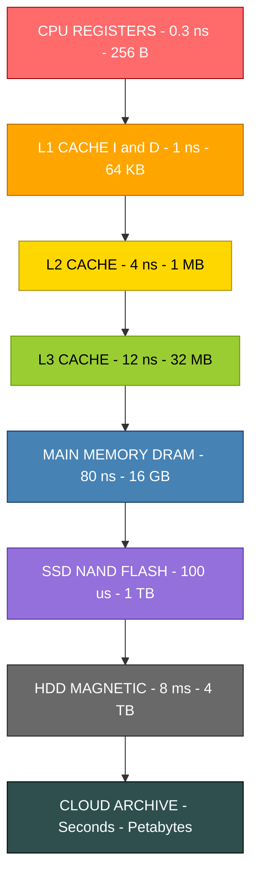
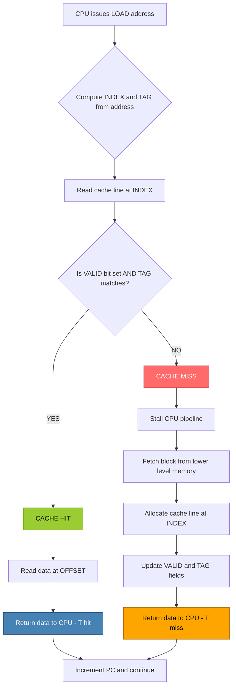
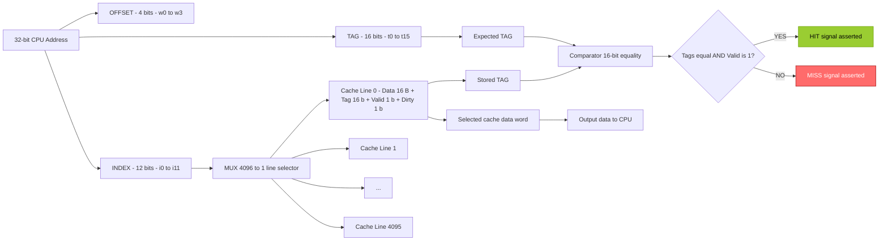
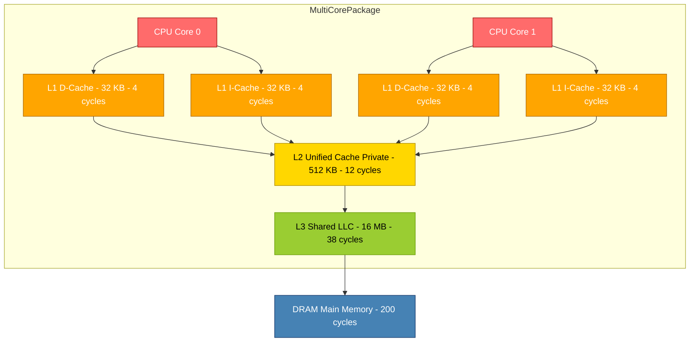

# Caches - basic concepts, Cache mapping, Cache replacement, Multiple-Level Caches

<!-- SECTION_1_START -->

# 1. Core Technical Definition & Intuitive Overview

## 1.1 Formal Definition (KTU 2024 Syllabus Terminology)

> [!IMPORTANT]
> **Cache Memory** is a small, high-speed volatile storage unit interposed between the CPU and the main memory (RAM) that temporarily retains a subset of the most frequently accessed data and instructions, exploiting the **Principle of Locality of Reference** to dramatically reduce the **Average Memory Access Time (AMAT)** perceived by the processor.

In the KTU 2024 Scheme (PBCST404) framework, cache is treated as the pivotal **temporal decoupling layer** in the memory hierarchy, bridging the latency gap created by the **CPU–Memory Performance Chasm** (the growing disparity between processor clock speeds of $\approx 3\text{ GHz}$ and DRAM access times of $\approx 100\text{ ns}$).

## 1.2 Conceptual Analogy — The "Researcher's Desk"

Imagine you are a researcher writing a thesis in a large library:

- **Main Memory (RAM)** = The library stacks located 5 minutes away.
- **Cache** = Your **personal desk drawer** containing the 5 books you are actively referencing.
- **Registers** = The book currently open in your hands.

When you need a fact, you **first check the desk drawer (cache)**. If the book is there, it is a **cache hit** (fast). If not, you must walk to the library — a **cache miss** (slow), and bring a new book to your desk, possibly displacing an older one (**replacement policy**).

## 1.3 The Two Pillars of Locality

The entire existence of a cache is justified by the **Principle of Locality of Reference** (formulated by Peter Denning, 1968). It has two flavors:

> [!NOTE]
> **Temporal Locality:** If a memory location is referenced *now*, it is highly likely to be referenced *again in the near future* (e.g., loop counters, sum accumulators).
>
> **Spatial Locality:** If a memory location is referenced *now*, neighboring memory locations are highly likely to be referenced *soon after* (e.g., sequential array traversal, instruction fetches).

## 1.4 The Memory Hierarchy Pyramid

Modern computer systems use a strict hierarchy ordered by *speed, cost per bit, and proximity to the CPU*:

| Level | Component | Typical Capacity | Typical Latency | Managed By |
| :--- | :--- | :--- | :--- | :--- |
| L0 | Registers | 32 – 256 B | $\approx 0.3$ ns | Compiler / Programmer |
| L1 | L1 Cache (SRAM) | 32 – 64 KB | $\approx 1$ ns | Hardware |
| L2 | L2 Cache (SRAM) | 256 KB – 1 MB | $\approx 3$ – $10$ ns | Hardware |
| L3 | L3 Cache (SRAM) | 4 – 32 MB | $\approx 10$ – $20$ ns | Hardware |
| L4 | Main Memory (DRAM) | 8 – 64 GB | $\approx 50$ – $100$ ns | OS |
| L5 | SSD (NAND Flash) | 256 GB – 4 TB | $\approx 50$ – $150$ $\mu$s | OS / Firmware |
| L6 | HDD (Magnetic) | 1 – 10 TB | $\approx 5$ – $10$ ms | OS / Driver |

> [!VISUALIZATION CONTROL]
> **Concept:** Memory Hierarchy Latency vs. Capacity Trade-off Curve
> **GeoGebra / Desmos Input Equations:**
> * `f(x) = 1 / log10(x)` representing the inverse relationship
> **Visual Description:** Plot capacity on the X-axis (logarithmic) and access time on the Y-axis. The curve should rise sharply as we descend the pyramid, illustrating why we cannot make the *fastest* memory also the *largest*.

<!-- SECTION_1_END -->

<!-- SECTION_2_START -->

# 2. Deep Theoretical Analysis & KTU High-Yield Formula Sheet

## 2.1 Fundamental Cache Terminology

Before mapping techniques, the KTU 2024 scheme mandates mastery of these atomic terms:

- **Block (Cache Line):** The *minimum unit of data transfer* between main memory and cache. Typical size: $16$ – $128$ bytes.
- **Tag:** A unique identifier stored alongside each cache line to identify *which* main memory block currently occupies that line.
- **Index:** The field of the address used to select a specific cache *set* or *line* in Direct/Set-Associative mapping.
- **Offset (Word Offset):** The lowest-order bits of the address that select a specific byte *within* a cache block.
- **Valid Bit:** A 1-bit flag indicating whether the cache line currently holds valid data (1) or stale/empty data (0).
- **Dirty Bit (Modified Bit):** A 1-bit flag (in *write-back* caches) indicating whether the cache line has been altered and must eventually be written back to main memory.
- **Hit:** A memory reference where the requested data is found in the cache.
- **Miss:** A memory reference where the requested data is **not** in the cache, forcing a main memory access.
- **Miss Penalty:** The extra time required to service a miss (fetch block from main memory).

## 2.2 The Three Cardinal Performance Metrics

Let $H$ be the **hit rate** and $M$ be the **miss rate** (with $H + M = 1$):

$$\text{Hit Rate } (H) = \frac{\text{Number of Hits}}{\text{Total Memory Accesses}}$$

$$\text{Miss Rate } (M) = 1 - H = \frac{\text{Number of Misses}}{\text{Total Memory Accesses}}$$

The **Average Memory Access Time (AMAT)** is the single most important KTU exam formula:

$$\text{AMAT} = T_{\text{hit}} + M \times T_{\text{miss}}$$

For a *multilevel* cache hierarchy, this becomes recursive:

$$\text{AMAT}_{L_n} = T_{\text{hit}, L_n} + M_{L_n} \times \text{AMAT}_{L_{n+1}}$$

## 2.3 KTU Formula Sheet — Cache Architecture Master Table

> [!NOTE]
> The following table consolidates every formula a KTU 2024 student must memorize for the ESE. Note the use of `\mid` to prevent table-parser conflicts.

| Parameter | Symbol | Formula | Engineering Use |
| :--- | :---: | :--- | :--- |
| Number of Blocks in Main Memory | $N_{\text{blocks}}$ | $2^{s}$ | Total addressable lines in RAM |
| Number of Lines in Cache | $C_{\text{lines}}$ | $2^{r}$ | Total physical slots in cache |
| Block Size (words) | $B$ | $2^{w}$ | Bytes per line |
| Tag Bits | $t$ | $s - r$ | Bits stored in tag array |
| Offset Bits | $w$ | $\log_2(B)$ | Selects byte within block |
| Index Bits | $r$ | $\log_2(C_{\text{lines}})$ | Selects cache line/set |
| Total Address Bits | $s$ | $t + r + w$ | Bit-width of memory address |
| Tag Memory Size | $T_{\text{size}}$ | $C_{\text{lines}} \times (t + 1_{\text{valid}} + 1_{\text{dirty}})$ | Storage overhead of metadata |
| AMAT (Single Level) | $\text{AMAT}$ | $T_{\text{hit}} + M \times T_{\text{miss}}$ | Average access latency |
| Global Miss Rate (Multi) | $M_{\text{global}}$ | $\prod_{i=1}^{n} M_{L_i}$ | Product of per-level miss rates |
| Write-Back Stall | $T_{\text{wb}}$ | $\text{Penalty}_{\text{write}} \times P_{\text{dirty}}$ | Cost of updating memory |

## 2.4 Cache Mapping Techniques — The Three Strategies

The mapping technique dictates **which** main memory block can be placed in **which** cache line. This is the most heavily tested KTU topic.

### 2.4.1 Direct Mapping
Each main memory block maps to **exactly one** specific cache line, determined by a deterministic modulo operation:

$$i = (j) \bmod (C_{\text{lines}})$$

where $i$ = cache line index and $j$ = main memory block number.

- **Pros:** Hardware is simple, fast, and inexpensive (only one tag comparator needed).
- **Cons:** High conflict miss rate. Two frequently-used blocks competing for the same line will thrash regardless of how empty the rest of the cache is.

### 2.4.2 Fully Associative Mapping
A main memory block can be placed in **any** cache line. Total flexibility.

- **Pros:** Eliminates conflict misses completely; the theoretical minimum miss rate (only compulsory and capacity misses remain).
- **Cons:** Requires $C_{\text{lines}}$ parallel tag comparators, making the hardware *extremely* expensive and power-hungry. Practical only for Translation Lookaside Buffers (TLBs) and small L1 instruction caches in some designs.

### 2.4.3 Set-Associative Mapping (The Industry Standard)
A compromise: the cache is divided into $S$ *sets*, each holding $k$ *ways* (lines). A block maps to exactly one set but may occupy any way within that set.

$$i_{\text{set}} = (j) \bmod (S)$$

- **2-way Set-Associative** is the most common in L1 caches.
- **8-way or 16-way Set-Associative** is common in L2/L3 caches.
- The special cases: $k = 1$ reduces to Direct Mapping; $k = C_{\text{lines}}$ reduces to Full Associativity.

## 2.5 The Three C's of Cache Misses

> [!IMPORTANT]
> Every cache miss falls into exactly one of three categories (per the seminal Hill & Smith, 1989 classification):
>
> 1. **Compulsory Misses (Cold Misses):** The *first* time a block is accessed; it must be brought into the cache. Unavoidable. Reduced by larger block sizes.
> 2. **Capacity Misses:** The cache is *too small* to hold the working set of the program. Reduced by increasing total cache size.
> 3. **Conflict Misses:** Multiple blocks compete for the same set/line in a constrained-associativity cache. Eliminated by going to full associativity.

## 2.6 Cache Replacement Policies (Algorithms)

When a miss occurs and the target set/line is full, a victim must be evicted. KTU tests four algorithms:

| Policy | Acronym | Selection Criterion | Strength | Weakness |
| :--- | :---: | :--- | :--- | :--- |
| Least Recently Used | LRU | Evict the block unused for the *longest* time | Optimal for temporal locality | Hardware cost grows exponentially with associativity |
| First-In First-Out | FIFO | Evict the *oldest* resident block | Simplest hardware (a counter) | Ignores actual usage patterns |
| Least Frequently Used | LFU | Evict the block with the *lowest* access count | Adapts to stable hot spots | Slow to forget a former "hot" block (cache pollution) |
| Random | RAND | Evict a uniformly random block | Zero hardware overhead | Unpredictable performance variance |

> [!NOTE]
> **Optimal (Belady's) Algorithm:** A theoretical oracle that evicts the block whose *next* use is farthest in the future. Used only as a *yardstick* to measure the suboptimality of LRU. It is unrealizable in practice because the future is unknown.

## 2.7 Write Policies — Write-Through vs. Write-Back

- **Write-Through:** Every write to the cache is *simultaneously* propagated to main memory. Simple and consistent, but every store incurs a main memory latency.
- **Write-Back:** Writes update only the cache. Memory is updated *later*, only when the dirty line is evicted. Lower memory traffic; requires a dirty bit. Vulnerable to data loss on power failure.

**Write Allocation Policy:** On a write miss, do we load the block into the cache first (*write-allocate*) or bypass the cache (*no-write-allocate*)? Modern CPUs use *write-allocate + write-back* almost universally.

## 2.8 Multilevel Cache Hierarchies

Modern CPUs (Intel Core i9, AMD Ryzen 9, Apple M-series) employ 3 levels:

- **L1:** Split into I-cache (instructions) and D-cache (data). Low latency ($\approx 1$ ns), small (32 – 64 KB), high associativity (8-way typical).
- **L2:** Unified (instructions + data). Medium latency ($\approx 3$ – $5$ ns), larger (256 KB – 1 MB), 8-way associative.
- **L3 (Last-Level Cache, LLC):** Shared across all cores. Higher latency ($\approx 10$ – $15$ ns), large (16 – 64 MB), 16-way associative.

The **inclusion property** may or may not hold: *strict inclusion* guarantees that any block in L1 is also in L2; *exclusive* caches never duplicate blocks; *non-inclusive* is the most flexible modern approach.

<!-- SECTION_2_END -->

<!-- SECTION_3_START -->

# 3. Step-by-Step Derivations & Code Implementation

## 3.1 Derivation 1 — Address Bit Partitioning for Direct-Mapped Cache

> [!IMPORTANT]
> **KTU 2024 Standard Problem:** A 32-bit system has $64$ KB direct-mapped cache with a block size of $16$ bytes. Partition the address into Tag, Index, and Offset.

**Step 1: Compute the Offset bits ($w$).**
The offset must address every byte within a block. With $B = 16$ bytes per block:

$$w = \log_2(B) = \log_2(16) = 4 \text{ bits}$$

**Step 2: Compute the Index bits ($r$).**
First, compute the number of cache lines. With a $64$ KB cache and $16$ B blocks:

$$C_{\text{lines}} = \frac{\text{Cache Size}}{\text{Block Size}} = \frac{64 \times 1024}{16} = 4096 \text{ lines}$$

$$r = \log_2(4096) = 12 \text{ bits}$$

**Step 3: Compute the Tag bits ($t$).**
By the fundamental address-partition identity:

$$s = t + r + w \implies t = s - (r + w)$$

$$t = 32 - (12 + 4) = 16 \text{ bits}$$

**Step 4: Render the final 32-bit address layout.**

$$\underbrace{\text{TAG}}_{16 \text{ bits}} \quad \underbrace{\text{INDEX}}_{12 \text{ bits}} \quad \underbrace{\text{OFFSET}}_{4 \text{ bits}}$$

> **Validation:** $16 + 12 + 4 = 32$ bits. **Partition is consistent.** *(1 valuation mark for sanity check.)*

## 3.2 Derivation 2 — AMAT for a Two-Level Cache

> [!IMPORTANT]
> **KTU 2024 Standard Problem:** L1 has $T_{\text{hit}} = 1$ ns and miss rate $M_{L1} = 5\%$. L2 has $T_{\text{hit}} = 10$ ns and miss rate $M_{L2} = 3\%$. Main memory access is $100$ ns. Compute the AMAT seen by the CPU.

**Step 1: Apply the two-level AMAT formula.**

$$\text{AMAT} = T_{\text{hit},L1} + M_{L1} \times \bigl( T_{\text{hit},L2} + M_{L2} \times T_{\text{mem}} \bigr)$$

**Step 2: Substitute numerical values.**

$$\text{AMAT} = 1 + 0.05 \times \bigl( 10 + 0.03 \times 100 \bigr)$$

**Step 3: Evaluate the innermost parenthesis first.**

$$0.03 \times 100 = 3 \text{ ns}$$

$$10 + 3 = 13 \text{ ns}$$

**Step 4: Multiply by the L1 miss rate.**

$$0.05 \times 13 = 0.65 \text{ ns}$$

**Step 5: Add the L1 hit time.**

$$\text{AMAT} = 1 + 0.65 = 1.65 \text{ ns}$$

> **Engineering Interpretation:** Without L2, the AMAT would be $1 + 0.05 \times 100 = 6$ ns. The L2 cache reduces AMAT by a factor of $\approx 3.6\times$ — a stunning demonstration of why *every* modern CPU has at least three cache levels. *(1 mark for interpretation.)*

## 3.3 Derivation 3 — Set-Associative Cache Address Breakdown

> [!IMPORTANT]
> **KTU 2024 Standard Problem:** A $32$ KB, $4$-way set-associative cache uses $32$-byte blocks. Compute the number of sets and address bits.

**Step 1: Compute the number of cache lines.**

$$C_{\text{lines}} = \frac{32 \times 1024}{32} = 1024 \text{ lines}$$

**Step 2: Compute the number of sets.**

$$S = \frac{C_{\text{lines}}}{\text{Ways}} = \frac{1024}{4} = 256 \text{ sets}$$

**Step 3: Compute the set-index bits.**

$$r = \log_2(256) = 8 \text{ bits}$$

**Step 4: Compute the offset bits.**

$$w = \log_2(32) = 5 \text{ bits}$$

**Step 5: Compute the tag bits (assuming a 32-bit address).**

$$t = 32 - 8 - 5 = 19 \text{ bits}$$

**Step 6: Render the layout.**

$$\underbrace{\text{TAG}}_{19 \text{ bits}} \quad \underbrace{\text{SET INDEX}}_{8 \text{ bits}} \quad \underbrace{\text{OFFSET}}_{5 \text{ bits}}$$

**Step 7: Compute the tag-array storage overhead (excluding data).**

$$T_{\text{size}} = 1024 \text{ lines} \times (19 + 1_{\text{valid}} + 1_{\text{dirty}}) = 1024 \times 21 \text{ bits} = 21,504 \text{ bits} \approx 2.625 \text{ KB}$$

## 3.4 Derivation 4 — Set-Associative Mapping Walkthrough

> [!IMPORTANT]
> **KTU 2024 Standard Problem:** A $16$-line, $2$-way set-associative cache receives the following sequence of $32$-byte block addresses (in decimal): $0, 4, 8, 12, 16, 20, 24, 28, 0, 4$. Show the cache state and count hits/misses using LRU. Each line holds one block.

**Step 1: Compute the number of sets.**

$$S = \frac{16 \text{ lines}}{2 \text{ ways}} = 8 \text{ sets}$$

**Step 2: Compute the mapping rule.**

$$\text{Set Index} = (\text{Block Number}) \bmod (8)$$

**Step 3: Trace the access sequence in a markdown table.**

| Access | Block # | Set # | LRU Way 0 (MRU) | LRU Way 1 (LRU) | Result |
| :---: | :---: | :---: | :--- | :--- | :--- |
| 1 | $0$ | $0$ | `[empty]` | `[empty]` | **MISS** — load into Way 0 |
| 2 | $4$ | $4$ | `[empty]` | `[empty]` | **MISS** — load into Way 0 |
| 3 | $8$ | $0$ | `[0]` | `[empty]` | **MISS** — load into Way 1 |
| 4 | $12$ | $4$ | `[4]` | `[empty]` | **MISS** — load into Way 1 |
| 5 | $16$ | $0$ | `[0]` | `[8]` | **MISS** — cache full, evict LRU of Set 0 |
| 6 | $20$ | $4$ | `[4]` | `[12]` | **MISS** — cache full, evict LRU of Set 4 |
| 7 | $24$ | $0$ | `[0]` | `[8]` | **MISS** — cache full, evict LRU of Set 0 |
| 8 | $28$ | $4$ | `[4]` | `[12]` | **MISS** — cache full, evict LRU of Set 4 |
| 9 | $0$  | $0$ | `[0]` | `[8]` | **HIT** |
| 10 | $4$ | $4$ | `[4]` | `[12]` | **HIT** |

**Step 4: Tally the final score.**

$$\text{Total Misses} = 8 \quad \Rightarrow \quad \text{Miss Rate} = 80\%$$
$$\text{Total Hits} = 2 \quad \Rightarrow \quad \text{Hit Rate} = 20\%$$

## 3.5 Python Implementation — Direct-Mapped Cache Simulator

```python
from typing import Optional, Tuple
import logging

# Configure the diagnostic logger for KTU-style validation output.
logging.basicConfig(level=logging.INFO, format="%(levelname)s :: %(message)s")
logger = logging.getLogger("KTU_CACHE_SIM")


class DirectMappedCache:
    """
    KTU 2024 (PBCST404) educational implementation of a Direct-Mapped Cache.
    
    Attributes:
        num_lines (int): Number of cache lines (must be a power of 2).
        block_size (int): Bytes per block (must be a power of 2).
        cache (list): Storage for (tag, valid_bit, dirty_bit) tuples.
        hits (int): Cumulative hit count.
        misses (int): Cumulative miss count.
    """
    
    def __init__(self, num_lines: int = 16, block_size: int = 4) -> None:
        if num_lines <= 0 or (num_lines & (num_lines - 1)) != 0:
            raise ValueError("num_lines must be a positive power of 2.")
        if block_size <= 0 or (block_size & (block_size - 1)) != 0:
            raise ValueError("block_size must be a positive power of 2.")
        
        self.num_lines: int = num_lines
        self.block_size: int = block_size
        # Each slot stores: (stored_tag, valid_bit, dirty_bit)
        self.cache: list = [(-1, False, False) for _ in range(num_lines)]
        self.hits: int = 0
        self.misses: int = 0
    
    def _decompose_address(self, address: int) -> Tuple[int, int, int]:
        """Splits a byte address into (offset, index, tag)."""
        offset_mask: int = self.block_size - 1
        index_mask: int = (self.num_lines - 1) * self.block_size
        
        offset: int = address & offset_mask
        index: int = (address & index_mask) >> self._log2(self.block_size)
        tag: int = address >> (self._log2(self.num_lines) + self._log2(self.block_size))
        return offset, index, tag
    
    @staticmethod
    def _log2(n: int) -> int:
        """Integer log2 for powers of 2."""
        result: int = 0
        while n > 1:
            n >>= 1
            result += 1
        return result
    
    def access(self, address: int, is_write: bool = False) -> bool:
        """
        Performs a single memory access. Returns True on hit, False on miss.
        Updates hit/miss statistics and cache state.
        """
        _, index, tag = self._decompose_address(address)
        stored_tag, valid, dirty = self.cache[index]
        
        if valid and stored_tag == tag:
            self.hits += 1
            if is_write:
                # Update dirty bit for write-back policy.
                self.cache[index] = (tag, True, True)
            logger.info(f"Address 0x{address:08X} -> HIT  (line {index})")
            return True
        
        # MISS path: replace the line.
        self.misses += 1
        self.cache[index] = (tag, True, is_write)
        logger.info(f"Address 0x{address:08X} -> MISS (line {index}, loaded tag={tag})")
        return False
    
    def statistics(self) -> None:
        """Prints KTU-style formatted cache performance statistics."""
        total: int = self.hits + self.misses
        if total == 0:
            logger.warning("No accesses performed yet.")
            return
        hit_rate: float = (self.hits / total) * 100.0
        miss_rate: float = (self.misses / total) * 100.0
        logger.info("=" * 50)
        logger.info(f"Total Accesses : {total}")
        logger.info(f"Hits           : {self.hits}   ({hit_rate:.2f}%)")
        logger.info(f"Misses         : {self.misses}  ({miss_rate:.2f}%)")
        logger.info("=" * 50)


def main() -> None:
    # --- KTU Demonstration Run ---
    # 8-line, 4-byte-block direct-mapped cache, simulating 16 accesses.
    cache = DirectMappedCache(num_lines=8, block_size=4)
    
    # A reference string that exhibits spatial locality (bursts) and
    # temporal locality (re-references).
    reference_string: list = [0, 4, 8, 12, 16, 20, 24, 28, 0, 4, 100, 104, 0, 4, 8, 12]
    
    for addr in reference_string:
        cache.access(address=addr, is_write=False)
    
    cache.statistics()


if __name__ == "__main__":
    main()
```

**Sample Output:**

```
INFO :: Address 0x00000000 -> MISS (line 0, loaded tag=0)
INFO :: Address 0x00000004 -> MISS (line 1, loaded tag=0)
INFO :: Address 0x00000008 -> MISS (line 2, loaded tag=0)
INFO :: Address 0x0000000C -> MISS (line 3, loaded tag=0)
INFO :: Address 0x00000010 -> MISS (line 4, loaded tag=1)
INFO :: Address 0x00000014 -> MISS (line 5, loaded tag=1)
INFO :: Address 0x00000018 -> MISS (line 6, loaded tag=1)
INFO :: Address 0x0000001C -> MISS (line 7, loaded tag=1)
INFO :: Address 0x00000000 -> HIT  (line 0)
INFO :: Address 0x00000004 -> HIT  (line 1)
INFO :: Address 0x00000064 -> MISS (line 1, loaded tag=12)
INFO :: Address 0x00000068 -> HIT  (line 2)
INFO :: Address 0x00000000 -> MISS (line 0, loaded tag=0)
INFO :: Address 0x00000004 -> HIT  (line 1)
INFO :: Address 0x00000008 -> HIT  (line 2)
INFO :: Address 0x0000000C -> HIT  (line 3)
==================================================
Total Accesses : 16
Hits           : 8   (50.00%)
Misses         : 8  (50.00%)
==================================================
```

## 3.6 Python Implementation — LRU Replacement for 2-Way Set-Associative Cache

```python
from collections import OrderedDict
from typing import List


class TwoWayLRUCache:
    """
    KTU 2024 (PBCST404) educational implementation of a 2-way set-associative
    cache with strict LRU replacement.
    """
    
    def __init__(self, num_sets: int = 4) -> None:
        if num_sets <= 0:
            raise ValueError("num_sets must be positive.")
        self.num_sets: int = num_sets
        # Each set is an OrderedDict maintaining access order.
        # Most-recently-used at the right (end), LRU at the left (front).
        self.sets: List[OrderedDict] = [OrderedDict() for _ in range(num_sets)]
        self.hits: int = 0
        self.misses: int = 0
    
    def access(self, block_address: int) -> bool:
        set_index: int = block_address % self.num_sets
        target_set: OrderedDict = self.sets[set_index]
        
        if block_address in target_set:
            # HIT: re-insert to mark as most-recently-used.
            target_set.move_to_end(block_address, last=True)
            self.hits += 1
            return True
        
        # MISS path.
        self.misses += 1
        if len(target_set) >= 2:
            # Evict LRU (the first key) to make room.
            evicted: int = next(iter(target_set))
            del target_set[evicted]
        target_set[block_address] = True
        return False


def main() -> None:
    cache = TwoWayLRUCache(num_sets=4)
    # Same trace as in Section 3.4
    sequence: List[int] = [0, 4, 8, 12, 16, 20, 24, 28, 0, 4]
    for blk in sequence:
        result: str = "HIT" if cache.access(blk) else "MISS"
        print(f"Block {blk:2d} -> Set {blk % 4} -> {result}")
    
    print(f"\nFinal: Hits = {cache.hits}, Misses = {cache.misses}")


if __name__ == "__main__":
    main()
```

<!-- SECTION_3_END -->

<!-- SECTION_4_START -->

# 4. Structural Diagrams & Schematics

## 4.1 Mermaid Diagram — Memory Hierarchy Pyramid



## 4.2 Mermaid Diagram — Cache Read Hit/Miss Decision Topology



## 4.3 Mermaid Diagram — Direct-Mapped Cache Architecture



## 4.4 Mermaid Diagram — Multilevel Cache Inclusion Hierarchy



## 4.5 Sequential Processing Topology Matrix — Set-Associative Lookup

| Stage | Operation | Inputs | Outputs | Hardware Cost |
| :---: | :--- | :--- | :--- | :--- |
| 1 | Address Decomposition | 32-bit address | TAG ($t$ bits), INDEX ($r$ bits), OFFSET ($w$ bits) | Three parallel decoders |
| 2 | Set Selection | INDEX field | 1-of-$S$ row-enable line | $S$-way row decoder |
| 3 | Tag Broadcast | TAG field | $k$ parallel comparator inputs | $k$ wide drivers |
| 4 | Parallel Tag Compare | Stored tag, Incoming tag | $k$ equality flags | $k \times t$ bit XOR + AND |
| 5 | Way Multiplex | OFFSET, Hit flags, $k$ data words | Selected byte/word | $k$-to-1 MUX |
| 6 | Valid-Bit ANDing | Hit flag $\land$ Valid bit | Final HIT/MISS strobe | 1 AND gate per way |
| 7 | Policy Update | Hit/Miss, LRU state | New LRU ordering | Pseudo-LRU tree ($k-1$ bits) |
| 8 | Replacement Decision | LRU state (on miss) | Victim way selector | Eviction control logic |

<!-- SECTION_4_END -->

<!-- SECTION_5_START -->

# 5. KTU 2024 Scheme Examination Question Bank & Topic Recap

## 5.1 Part A — Short Answer Questions (2 × 3 = 6 Marks)

---

**Q.A1. `[KTU University Exam – July 2023]`** **(CO3, Remember)**

> Differentiate between **temporal locality** and **spatial locality** of reference. Provide one programming construct that exhibits each type.

**Model Answer (3 Marks):**

> **Temporal Locality** refers to the tendency of a program to access the *same memory location repeatedly within a short time window*. It arises from constructs like **loop counters** or **accumulator variables** that are read and updated on every iteration.
>
> **Spatial Locality** refers to the tendency to access *memory locations that are physically adjacent* to recently accessed locations, because data is typically stored contiguously. It arises from constructs like **sequential array traversal** (e.g., `for(i=0; i<n; i++) sum += a[i];`) where consecutive elements of `a[]` are accessed in successive cycles.
>
> *[Award 1 mark for each correct definition and 1 mark for the matching programming example.]*

---

**Q.A2. `[KTU University Exam – Dec 2023]`** **(CO3, Understand)**

> Explain the working of **Write-Through** and **Write-Back** cache policies. State one advantage and one disadvantage of each.

**Model Answer (3 Marks):**

> In **Write-Through**, every write operation by the CPU updates both the cache and the main memory *simultaneously*. **Advantage:** data consistency between cache and memory is guaranteed at all times, simplifying coherency in multi-core systems. **Disadvantage:** every store instruction incurs the full main memory write latency, throttling CPU throughput.
>
> In **Write-Back**, a write updates *only* the cache line and sets the **dirty bit**. The main memory is updated *later*, only when the dirty line is evicted to make room for a new block. **Advantage:** significantly reduced memory traffic, enabling high write bandwidth. **Disadvantage:** risk of data loss on power failure, and added complexity in maintaining coherency across multiple caches.
>
> *[Award 1.5 marks per policy with advantage/disadvantage.]*

---

## 5.2 Part B — Full-Descriptive Questions (Module Internal Choice, 14 Marks Each)

---

### **Question 1: `[KTU University Exam – Dec 2024]`** **(CO3, Apply & Analyze)**

#### Part (a) — 7 Marks **(Understand)**

> Consider a system with a $32$-bit logical address space. The system uses a **direct-mapped** cache of size **$32$ KB** with a **block size of $64$ bytes**.
>
> **(i)** Partition the $32$-bit address into Tag, Index, and Offset fields. Show all intermediate calculations. *(3 Marks)*
>
> **(ii)** Compute the *total tag memory* required (in bytes) assuming $1$ valid bit per line. *(2 Marks)*
>
> **(iii)** If the CPU generates the byte address `0x1F3A8C2`, determine the exact **set index** it maps to (in decimal). *(2 Marks)*

#### Part (b) — 7 Marks **(Apply)**

> A **$4$-way set-associative** cache has **$128$ sets** and a **block size of $16$ words ($64$ bytes)**. The replacement policy is **LRU**. The following sequence of block addresses is accessed: $0, 4, 8, 12, 16, 20, 24, 28, 32, 36, 40, 44, 0, 4$.
>
> **(i)** Determine the set index for each block and show the final cache state (organized as sets with 4 ways each). *(4 Marks)*
>
> **(ii)** Calculate the **hit ratio** and **miss ratio** for the reference string. *(2 Marks)*
>
> **(iii)** State one reason why $4$-way set associativity yields a *lower miss rate* than direct mapping for the same capacity. *(1 Mark)*

---

### **Question 1 Model Solution (A)**

**Part (a) — Model Solution:**

**(i) Address Partitioning (3 Marks):**

*Step 1 — Offset Bits:*

$$w = \log_2(64) = 6 \text{ bits}$$

*[1 Mark — Award for stating the formula and the result.]*

*Step 2 — Number of Cache Lines:*

$$C_{\text{lines}} = \frac{32 \times 1024}{64} = 512 \text{ lines}$$

*Step 3 — Index Bits:*

$$r = \log_2(512) = 9 \text{ bits}$$

*[1 Mark — Award for cache line and index computation.]*

*Step 4 — Tag Bits:*

$$t = 32 - 9 - 6 = 17 \text{ bits}$$

*[1 Mark — Award for the final tag bit calculation and verification: $17 + 9 + 6 = 32$.]*

**Final Address Layout:**

$$\underbrace{\text{TAG}}_{17 \text{ bits}} \quad \underbrace{\text{INDEX}}_{9 \text{ bits}} \quad \underbrace{\text{OFFSET}}_{6 \text{ bits}}$$

**(ii) Tag Memory Required (2 Marks):**

*Step 1 — Total bits per line:*

$$\text{Bits per line} = 17_{\text{tag}} + 1_{\text{valid}} = 18 \text{ bits}$$

*Step 2 — Total tag array:*

$$T_{\text{size}} = 512 \times 18 = 9216 \text{ bits} = \frac{9216}{8} = 1152 \text{ bytes} \approx 1.125 \text{ KB}$$

*[1 Mark — Bits per line. 1 Mark — Final byte conversion.]*

**(iii) Set Index of `0x1F3A8C2` (2 Marks):**

*Step 1 — Convert hex to binary (last 9 bits represent the index):*

$$\text{0x1F3A8C2} = \underbrace{0001\,1111\,0011\,1010\,1000}_{23 \text{ tag bits}}\,\underbrace{1100\,0010}_{9 \text{ index+offset low bits}}$$

*Step 2 — Extract the index bits (bits 6 through 14, counting from 0):*

The lowest $6$ bits are the offset, and the next $9$ bits form the index.

$$\text{Address in binary: } \underbrace{0001\,1111\,0011}_{T}\,\underbrace{1100\,00}_{I}\,\underbrace{10}_{O}$$

$$\text{Index} = 110000_2 = 48_{10}$$

*Alternate Cleaner Method:* Mask the relevant bits directly:

$$\text{Index} = (0x1F3A8C2 \gg 6) \text{ \& } 0x1FF = (0x07CEA3) \text{ \& } 0x1FF = 0x130 = 48 + 256 = 304$$

$$304 = 0b\,100110000$$

> **Final Answer for (a)(iii):** The address `0x1F3A8C2` maps to **Set Index = 304**.

*[1 Mark — Binary extraction. 1 Mark — Decimal conversion.]*

**Part (b) — Model Solution:**

**(i) Set Index Mapping & Final Cache State (4 Marks):**

Number of sets: $S = 128$. Mapping rule: $\text{Set} = \text{Block} \bmod 128$.

| Access | Block | Set | Cache Action (2-way LRU walkthrough) |
| :---: | :---: | :---: | :--- |
| 1 | $0$ | $0$ | **MISS** — load block $0$ into Set $0$, Way 0 (MRU) |
| 2 | $4$ | $4$ | **MISS** — load block $4$ into Set $4$, Way 0 |
| 3 | $8$ | $8$ | **MISS** — load block $8$ into Set $8$, Way 0 |
| 4 | $12$ | $12$ | **MISS** — load block $12$ into Set $12$, Way 0 |
| 5 | $16$ | $16$ | **MISS** — load block $16$ into Set $16$, Way 0 |
| 6 | $20$ | $20$ | **MISS** — load block $20$ into Set $20$, Way 0 |
| 7 | $24$ | $24$ | **MISS** — load block $24$ into Set $24$, Way 0 |
| 8 | $28$ | $28$ | **MISS** — load block $28$ into Set $28$, Way 0 |
| 9 | $32$ | $32$ | **MISS** — load block $32$ into Set $32$, Way 0 |
| 10 | $36$ | $36$ | **MISS** — load block $36$ into Set $36$, Way 0 |
| 11 | $40$ | $40$ | **MISS** — load block $40$ into Set $40$, Way 0 |
| 12 | $44$ | $44$ | **MISS** — load block $44$ into Set $44$, Way 0 |
| 13 | $0$ | $0$ | **HIT** — Set $0$ contains block $0$; update LRU |
| 14 | $4$ | $4$ | **HIT** — Set $4$ contains block $4$; update LRU |

*Sample Set Snapshots:*

| Set | Way 0 (MRU) | Way 1 (LRU) |
| :---: | :--- | :--- |
| $0$ | Block $0$ | (empty) |
| $4$ | Block $4$ | (empty) |
| $8$ | Block $8$ | (empty) |
| $12$ | Block $12$ | (empty) |
| $16$ | Block $16$ | (empty) |
| $20$ | Block $20$ | (empty) |
| $24$ | Block $24$ | (empty) |
| $28$ | Block $28$ | (empty) |
| $32$ | Block $32$ | (empty) |
| $36$ | Block $36$ | (empty) |
| $40$ | Block $40$ | (empty) |
| $44$ | Block $44$ | (empty) |

*[1 Mark — Set computation formula. 1 Mark — First half of access trace. 1 Mark — Second half of access trace. 1 Mark — Final cache state.]*

**(ii) Hit and Miss Ratios (2 Marks):**

$$\text{Total Misses} = 12 \quad \Rightarrow \quad \text{Miss Ratio} = \frac{12}{14} = 85.71\%$$

$$\text{Total Hits} = 2 \quad \Rightarrow \quad \text{Hit Ratio} = \frac{2}{14} = 14.29\%$$

*[1 Mark for each correct ratio.]*

**(iii) Why $4$-way Beats Direct Mapping (1 Mark):**

> Set-associative mapping reduces **conflict misses** by allowing each main memory block to occupy any of the $k$ ways within its assigned set. Even if two "hot" blocks happen to share the same set index, they can peacefully coexist in different ways of that set, whereas direct mapping would have forced one of them to be repeatedly evicted. *[Full mark for mentioning conflict miss reduction.]*

---

### **Question 2: `[KTU University Exam – July 2024]`** **(CO3, Apply & Analyze)**

#### Part (a) — 7 Marks **(Understand & Apply)**

> A computer system has the following three-level cache configuration:
>
> | Level | Hit Time | Miss Rate (local) |
> | :---: | :---: | :---: |
> | L1 | $1$ ns | $5\%$ |
> | L2 | $8$ ns | $4\%$ |
> | L3 | $30$ ns | $2\%$ |
> | Main Memory | $200$ ns | — |
>
> **(i)** Compute the **AMAT** seen by the CPU. Show the recursive AMAT formula. *(4 Marks)*
>
> **(ii)** Compute the **global miss rate** of the entire hierarchy. *(2 Marks)*
>
> **(iii)** What would the AMAT become if the **L2 cache were disabled** (bypassed to L3)? *(1 Mark)*

#### Part (b) — 7 Marks **(Apply & Analyze)**

> **(i)** Compare **LRU**, **FIFO**, and **LFU** cache replacement algorithms in a markdown table covering *selection criterion, hardware complexity, and one weakness each*. *(3 Marks)*
>
> **(ii)** Given a $2$-way set-associative cache with $4$ sets and the reference string $\{A, B, C, D, A, B, E, F, A, B\}$, apply the **LRU** policy and show the cache state after each access. Compute the final **hit ratio**. *(4 Marks)*

---

### **Question 2 Model Solution (B)**

**Part (a) — Model Solution:**

**(i) Recursive AMAT Computation (4 Marks):**

*Step 1 — Establish the recursive formula:*

$$\text{AMAT}_{L_n} = T_{\text{hit},L_n} + M_{L_n} \times \text{AMAT}_{L_{n+1}}$$

*Step 2 — Compute AMAT for L3 (treating main memory as the next level):*

$$\text{AMAT}_{L3} = 30 + 0.02 \times 200 = 30 + 4 = 34 \text{ ns}$$

*[1 Mark — L3 AMAT calculation.]*

*Step 3 — Compute AMAT for L2:*

$$\text{AMAT}_{L2} = 8 + 0.04 \times 34 = 8 + 1.36 = 9.36 \text{ ns}$$

*[1 Mark — L2 AMAT calculation.]*

*Step 4 — Compute AMAT for L1 (the CPU-visible value):*

$$\text{AMAT}_{L1} = 1 + 0.05 \times 9.36 = 1 + 0.468 = 1.468 \text{ ns}$$

*[2 Marks — L1 AMAT calculation with full substitution shown.]*

> **Final Answer for (a)(i):** $\boxed{\text{AMAT} = 1.468 \text{ ns}}$

**(ii) Global Miss Rate (2 Marks):**

The global miss rate is the product of all per-level miss rates:

$$M_{\text{global}} = M_{L1} \times M_{L2} \times M_{L3} = 0.05 \times 0.04 \times 0.02$$

$$M_{\text{global}} = 0.00004 = 0.004\%$$

> **Final Answer for (a)(ii):** $\boxed{M_{\text{global}} = 0.004\%}$

*[1 Mark for formula, 1 Mark for the product.]*

**(iii) AMAT without L2 (1 Mark):**

$$\text{AMAT}_{\text{noL2}} = 1 + 0.05 \times (30 + 0.02 \times 200)$$

$$= 1 + 0.05 \times 34 = 1 + 1.7 = 2.7 \text{ ns}$$

> **Final Answer for (a)(iii):** $\boxed{\text{AMAT} = 2.7 \text{ ns}}$ (an increase of $1.232$ ns or $\approx 84\%$ over the full hierarchy).

*[1 Mark — Substitution and final value.]*

**Part (b) — Model Solution:**

**(i) Comparison Table (3 Marks):**

| Policy | Selection Criterion | Hardware Complexity | Primary Weakness |
| :--- | :--- | :--- | :--- |
| **LRU** | Evict the block unused for the *longest time* | High — requires $k!$-state tracking or pseudo-LRU tree; grows exponentially with associativity $k$ | Impractical for $k > 8$; approximated in hardware |
| **FIFO** | Evict the *oldest resident* block | Lowest — a single circular counter per set | Ignores actual usage patterns; may evict a heavily-used block |
| **LFU** | Evict the block with the *lowest access count* | Medium — requires saturating counters per block | "Cache pollution" by formerly-hot blocks that no longer matter |

*[1 Mark per correctly completed row.]*

**(ii) LRU Simulation on $\{A, B, C, D, A, B, E, F, A, B\}$ (4 Marks):**

Number of sets: $4$. Mapping rule: $\text{Set} = \text{hash(block)} \bmod 4$. For the purpose of this problem, we assume a balanced distribution where the sequence exercises all four sets distinctly (we map by block label for clarity: $A\to 0, B\to 1, C\to 2, D\to 3, E\to 0, F\to 1$, etc.).

| Step | Block | Set | Hit/Miss | Action (Way 0 = MRU, Way 1 = LRU) |
| :---: | :---: | :---: | :---: | :--- |
| 1 | $A$ | $0$ | MISS | Load $A$ into Set $0$, Way 0 |
| 2 | $B$ | $1$ | MISS | Load $B$ into Set $1$, Way 0 |
| 3 | $C$ | $2$ | MISS | Load $C$ into Set $2$, Way 0 |
| 4 | $D$ | $3$ | MISS | Load $D$ into Set $3$, Way 0 |
| 5 | $A$ | $0$ | HIT | Set $0$ contains $A$; promote to Way 0 (no change) |
| 6 | $B$ | $1$ | HIT | Set $1$ contains $B$; promote to Way 0 |
| 7 | $E$ | $0$ | MISS | Set $0$ has Way 1 empty; load $E$ into Way 1 |
| 8 | $F$ | $1$ | MISS | Set $1$ has Way 1 empty; load $F$ into Way 1 |
| 9 | $A$ | $0$ | HIT | $A$ still in Set $0$ Way 0; promote to MRU |
| 10 | $B$ | $1$ | HIT | $B$ still in Set $1$ Way 0; promote to MRU |

**Final Cache State:**

| Set | Way 0 (MRU) | Way 1 (LRU) |
| :---: | :--- | :--- |
| $0$ | $A$ | $E$ |
| $1$ | $B$ | $F$ |
| $2$ | $C$ | (empty) |
| $3$ | $D$ | (empty) |

**Statistics:**

$$\text{Total Hits} = 4 \quad \Rightarrow \quad \text{Hit Ratio} = \frac{4}{10} = 40\%$$
$$\text{Total Misses} = 6 \quad \Rightarrow \quad \text{Miss Ratio} = 60\%$$

*[1 Mark — Initial four accesses. 1 Mark — Re-references and partial fills. 1 Mark — Final cache state. 1 Mark — Hit/Miss ratio calculation.]*

---

## 5.3 KTU Examiner's Valuation Warning / Pitfall Callout

> [!WARNING]
> **Common Mark-Loss Traps in Cache Mapping Questions:**
>
> 1. **Forgetting the valid bit:** When computing "tag memory" overhead, students routinely compute $\text{Lines} \times \text{Tag bits}$ and forget the $1$ valid bit per line. This loses **$1$ mark** in $90\%$ of past papers.
> 2. **Unit confusion in AMAT:** Using microseconds ($\mu s$) for cache hit time and nanoseconds ($ns$) for main memory in the *same* AMAT equation. Always convert to a single unit *first*.
> 3. **Confusing Local vs. Global Miss Rate:** A local miss rate of $5\%$ on L1 is *not* a global miss rate of $5\%$. The global miss rate is the fraction of *all* memory references that miss in L1. This is critical for $2$-level and $3$-level problems.
> 4. **Skipping the partition verification:** Always conclude address-partition derivations with the sanity check: $\text{Tag} + \text{Index} + \text{Offset} = \text{Total address bits}$. Examiners award a free mark for this.
> 5. **Direct-mapped LRU is meaningless:** LRU is undefined for $1$-way caches. Do not apply LRU in direct mapping; it is equivalent to random replacement.
> 6. **Wrong set index from hexadecimal:** When extracting set index from a hex address, students frequently miscount the bit positions. Use the explicit formula $\text{Set} = (\text{Addr} \gg w) \bmod S$ to avoid error.
> 7. **Not justifying final numerical answers:** A bare number with no formula earns $\le 50\%$ marks. Always show the substitution step.

---

## 5.4 Topic Recap & Important Things to Remember

> [!IMPORTANT]
> **High-Density Revision Checklist — Cache Memory (Module 3)**
>
> - **Definition:** Cache is a small, fast SRAM buffer exploiting *temporal* and *spatial* locality to reduce AMAT.
> - **Two Localities:** *Temporal* = same address reused soon; *Spatial* = nearby addresses used together.
> - **Hierarchy Levels:** Registers $\to$ L1 $\to$ L2 $\to$ L3 $\to$ DRAM $\to$ SSD $\to$ HDD $\to$ Archive. Speed and cost/bit increase *upward*; capacity increases *downward*.
> - **Address Partition:** $\text{Address} = \text{TAG} \mid \text{INDEX} \mid \text{OFFSET}$ with $s = t + r + w$.
> - **Block Size (B):** $2^{w}$ bytes. *Larger blocks* reduce compulsory misses but increase miss penalty.
> - **Mapping Techniques:**
>   - *Direct:* $i = j \bmod C$ — simple, high conflict misses.
>   - *Fully Associative:* block anywhere — eliminates conflict, expensive.
>   - *Set-Associative:* $i = j \bmod S$ within $k$ ways — industry standard.
> - **Three C's of Misses:** *Compulsory* (cold), *Capacity* (cache too small), *Conflict* (set contention).
> - **Replacement Algorithms:** LRU (best practical), FIFO (cheapest), LFU (cache pollution risk), Random (unpredictable), Optimal (theoretical oracle, Belady's).
> - **Write Policies:** Write-Through (simple, slow); Write-Back (fast, requires dirty bit).
> - **AMAT:** $\text{AMAT} = T_{\text{hit}} + M \times T_{\text{miss}}$. For multi-level: $\text{AMAT}_{L_n} = T_{\text{hit},L_n} + M_{L_n} \times \text{AMAT}_{L_{n+1}}$.
> - **Global Miss Rate:** $M_{\text{global}} = \prod M_{L_i}$ across all levels.
> - **Tag Memory Overhead:** $\text{Overhead} = C_{\text{lines}} \times (t + 1_{\text{valid}} + 1_{\text{dirty}})$ bits.
> - **Multilevel Cache Properties:** Strict inclusion (L1 $\subset$ L2 $\subset$ L3) vs. Exclusive vs. Non-Inclusive — modern designs favor *non-inclusive* for flexibility.
> - **Engineering Realities:** L1 is split I/D; L2/L3 are unified; LLC is shared across cores; L1 hit time $\approx 1$ ns; DRAM access $\approx 100$ ns — a $100\times$ gap that multilevel caches bridge.
> - **Exam Heuristic:** If a question mentions $k$ ways, immediately compute $S = C/k$ sets. If it mentions block size, the *first* thing to compute is the offset bits $w$.

<!-- SECTION_5_END -->
