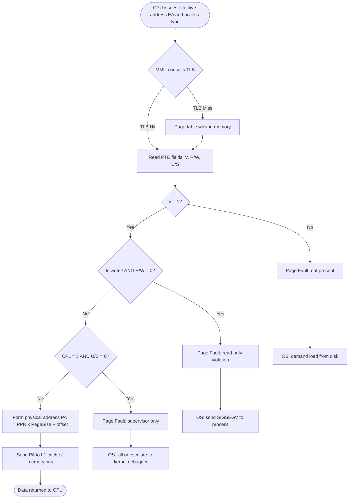
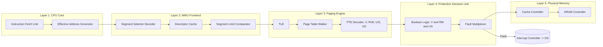

# Memory Protection.

<!-- SECTION_1_START -->

# Memory Protection

## 1.1 Formal Academic Definition

**Memory Protection** is a collection of hardware and software mechanisms enforced by the **Memory Management Unit (MMU)** and the operating system that ensure every memory reference issued by a process is validated against a set of authorized access rights before the physical memory is accessed. According to the **KTU 2024 Scheme (PBCST404 – Module 3)**, memory protection prevents unauthorized reading, writing, or execution of memory locations belonging to the operating system kernel, other processes, or the I/O subsystem, thereby guaranteeing **system reliability, fault isolation, and data confidentiality** in multiprogrammed and multitasking environments.

> [!IMPORTANT]
> **Syllabus Highlight (KTU 2024 – PBCST404 / Module 3):** Memory protection is treated as a foundational sub-topic of memory systems, sitting alongside virtual memory, segmentation, and paging. Questions typically test (a) hardware registers involved, (b) check conditions, and (c) protection bits used in segmentation and paging tables.

## 1.2 Conceptual Analogy & Intuition

Think of memory protection as a **high-security hotel**:

| Hotel Element | Computer Memory Equivalent |
|---|---|
| The entire hotel building | Physical memory (RAM) |
| Each guest's room keycard | Base + Limit register pair of a process |
| Hotel front desk verifying keycard | Memory Management Unit (MMU) |
| Restricted areas (gym, pool, suite) | Kernel space, I/O registers |
| Room-service hours (read-only after check-out) | Read / Write / Execute permission bits |
| The lift refusing floor 0 (basement) | Lower-bound check (`EA ≥ Base`) |

A guest (process) can wander freely **only within the rooms listed on the keycard**; trying to access another room or the basement causes the door to refuse entry — exactly what happens when the CPU raises a **segmentation fault** or a **page fault due to protection violation**.

> [!NOTE]
> **Why memory protection is non-negotiable in modern systems:**
> 1. A bug in **Process A** must not corrupt the memory of **Process B**.
> 2. User processes must not overwrite the **OS kernel**.
> 3. Unauthorized code must not **read** sensitive data (defense against memory-scraping attacks).
> 4. Self-modifying code must be **explicitly permitted** via an Execute bit.

## 1.3 Physical Constants and Standard Metrics

The following engineering constants and metrics are standard references when reasoning about memory protection:

- **Page size** (typical): $4 \text{ KB} = 2^{12} \text{ bytes}$.
- **Segment size** (typical x86): up to $2^{32}$ bytes in 32-bit mode.
- **TLB lookup time**: $\approx 1$ clock cycle.
- **Page-table walk penalty**: $4$ to $5$ memory references on a TLB miss.
- **Cache line size**: typically $64$ **bytes**.

> [!VISUALIZATION CONTROL]
> **Concept:** Two processes with disjoint allowed memory regions on the linear address line.
> **GeoGebra / Desmos Input Equations:**
> * `Base_A = 0`, `Limit_A = 32`
> * `Base_B = 64`, `Limit_B = 32`
> * Region A: interval `[0, 32)` ; Region B: interval `[64, 96)`
> * Kernel region: interval `[0, 16)` (low memory, reserved for OS)
> **Visual Description:** Draw a number line from 0 to 128. Shade Region A in blue from 0 to 32, leave a small gap (no-man's land), shade Region B in green from 64 to 96, and leave the kernel region red and cross-hatched at the start. An attempted access to address 50 should be flagged as a violation (outside any legal region).

<!-- SECTION_1_END -->

<!-- SECTION_2_START -->

# 2. Deep Theoretical Analysis

## 2.1 Hierarchical Classification of Protection Mechanisms

Memory protection is layered. The **KTU 2024 syllabus** emphasises four principal mechanisms, ordered from the simplest (coarse-grained) to the most sophisticated (fine-grained):

### 2.1.1 Fence Register
A single hardware register defines one boundary. Addresses on the *fence side* are allowed; the other side is forbidden.

$$\text{If } \text{EA} < \text{Fence} \Rightarrow \text{TRAP (illegal access)}$$

It can protect only one side of the boundary and is suitable for **single-user, single-process** systems.

### 2.1.2 Base / Limit (Bounds) Registers
A pair of CPU registers stored in the **Program Status Word (PSW)** or a dedicated control block.

- **Base register ($B$):** the lowest legal physical address.
- **Limit register ($L$):** the size of the legal region (not the highest address).

**The Canonical Check:**

$$\text{If } 0 \leq \text{EA} < L \quad \text{THEN physical address} = B + \text{EA} \quad \text{ELSE TRAP}$$

The check is **a single subtraction and a sign test**, making it extremely fast.

### 2.1.3 Segmentation-Based Protection
Each logical segment (Code, Data, Stack, etc.) is described by a **Segment Descriptor** containing:
1. **Base** (starting physical address),
2. **Limit** (length in bytes or pages),
3. **Access Rights / DPL** (Descriptor Privilege Level).

The descriptor itself is fetched from a **segment table** indexed by the segment selector. A successful match returns a *non-faulting* segment; a mismatch raises a **General Protection Fault (GPF)**.

### 2.1.4 Paging-Based Protection
In a paging system, protection is embedded **inside every Page Table Entry (PTE)**:

| Bit Name | Symbol | Function |
|---|---|---|
| Valid / Present | $V$ | $1$ ⇒ page is in physical memory; $0$ ⇒ page-fault trap. |
| Read / Write | $R/W$ | $0$ ⇒ read-only; $1$ ⇒ read and write. |
| User / Supervisor | $U/S$ | $0$ ⇒ kernel mode only; $1$ ⇒ user mode allowed. |
| Execute Disable (NX) | $XD$ | $1$ ⇒ no instruction fetch from this page. |
| Accessed / Dirty | $A, D$ | Used by replacement algorithms, not protection. |

The MMU performs these checks **in parallel** with address translation, so the protection cost is essentially **zero extra cycles** once the PTE is in the TLB.

## 2.2 Operating Modes and Privilege Levels

Modern CPUs implement at least **two rings** of privilege:

- **Kernel / Supervisor mode (Ring 0):** full access to all memory and I/O ports.
- **User mode (Ring 3):** restricted; certain instructions (`IN`, `OUT`, `LGDT`, `MOV CR3`, etc.) cause a *trap* if executed.

The current privilege level is stored in a **CPL** (Current Privilege Level) field of a status register. A memory reference is legal only if:

$$\text{CPL} \leq \text{DPL of the target segment / page}$$

## 2.3 The "Why" Behind Each Layer

- **Why Base/Limit?**  Cheaper than full paging when only a handful of processes exist.
- **Why Segmentation?**  Gives each program the *illusion* of a contiguous, private address space; protection is naturally aligned with logical sub-units (code vs. data).
- **Why Paging?**  Eliminates external fragmentation; protection bits travel with each page, persisting even when the page is swapped to disk.
- **Why both Segmentation + Paging (as in x86)?**  Segmentation enforces *logical* protection (per region), while paging enforces *physical* protection (per page).

## 2.4 KTU High-Yield Formula Sheet

> [!NOTE]
> **Exam Tip:** Memorise the table below. It is the single most-asked concept set in KTU Module 3 memory-protection questions.

| # | Mechanism | Validation Equation | Fault Name | Hardware Cost |
|---|---|---|---|---|
| 1 | Fence Register | $\text{EA} \geq F$ | Memory Trap | 1 register |
| 2 | Base + Limit | $0 \leq \text{EA} < L$ | Bounds Violation | 2 registers |
| 3 | Segment Descriptor | $\text{EA} \leq \text{SegLimit} \,\wedge\, \text{CPL} \leq \text{DPL}$ | General Protection Fault (GPF) | Segment table |
| 4 | Paging (PTE) | $V = 1 \,\wedge\, (R/W \vee \text{isRead}) \,\wedge\, (U/S \vee \text{CPL}=0)$ | Page Fault (#PF) | Page table |
| 5 | TLB | Same as PTE, but cached | TLB Miss → Page Walk | TLB CAM |

> [!IMPORTANT]
> **Boundary-Condition Trick:** When asked *"what is the largest legal effective address?"* always answer $L - 1$, not $L$. The condition is *strict* less-than, not less-than-or-equal.

## 2.5 Real-World Engineering Utility

1. **Cloud Servers (AWS, Azure):** Hardware-enforced memory protection isolates thousands of virtual machines sharing one physical host. A bug in one VM cannot leak memory of another.
2. **Mobile OS (Android / iOS):** Apps run as separate processes, each with its own page tables, preventing one malicious app from reading another's credentials.
3. **Embedded / IoT (ARM Cortex-M with MPU):** A **Memory Protection Unit (MPU)** divides the $4 \text{ GB}$ address space into $8$ regions with individual access rights, allowing safe RTOS task isolation without a full MMU.
4. **Database Engines (PostgreSQL, Oracle):** Buffer-pool pages use protection to prevent torn writes and ensure transaction durability.

<!-- SECTION_2_END -->

<!-- SECTION_3_START -->

# 3. Step-by-Step Derivations, Worked Examples, and Code

## 3.1 Exhaustive Worked Example: Base/Limit Protection

**Problem.** A process is loaded with a Base register value of $B = 2000$ and a Limit register value of $L = 1000$. The CPU generates the following effective addresses (EA) from four instructions. For each, state whether the access is legal, the resulting physical address, or the type of fault raised.

| # | Effective Address (EA) | Check $0 \leq \text{EA} < L$ | Verdict | Physical Address |
|---|---|---|---|---|
| (i) | $500$ | $0 \leq 500 < 1000$ ✓ | **Legal** | $2000 + 500 = 2500$ |
| (ii) | $999$ | $0 \leq 999 < 1000$ ✓ | **Legal** | $2000 + 999 = 2999$ |
| (iii) | $1000$ | $0 \leq 1000 \not< 1000$ ✗ | **Bounds Violation** | — (trap) |
| (iv) | $-1$ (signed) | $-1 \not\geq 0$ ✗ | **Bounds Violation** | — (trap) |

**Valuation Key (3 marks total for the check itself):**
- Stating the rule "$0 \leq \text{EA} < L$": 1 mark.
- Correct classification of all four addresses: 1 mark.
- Final physical addresses (or trap names): 1 mark.

### Step-by-Step Derivation of the Physical Address

$$
\begin{aligned}
\text{Physical Address} &= B + \text{EA} \\
&= 2000 + 500 \\
&= 2500 \quad \text{(decimal)}
\end{aligned}
$$

The **MMU** adds $B$ and $\text{EA}$ in a binary adder in parallel with the comparator, so the translation is a **single cycle**.

## 3.2 Exhaustive Worked Example: Paging Protection

**Problem.** Consider a 32-bit system with $4 \text{ KB}$ pages. The page table for Process $P$ contains the following entries (partial):

| VPN (Virtual Page #) | PPN (Physical Page #) | $V$ | $R/W$ | $U/S$ |
|---|---|---|---|---|
| 0 | 5 | 1 | 1 | 1 |
| 1 | — | 0 | 0 | 0 |
| 2 | 17 | 1 | 0 | 1 |
| 3 | 9 | 1 | 1 | 0 |

A user-mode program (CPL = 3) issues the following memory operations. State the outcome.

1. **Read from virtual address $0x0000\_1000$** (VPN 1, offset 0):  
   $V = 0$ → **Page Fault (not-present)**. The OS must bring the page in from secondary storage (demand paging).

2. **Write to virtual address $0x0000\_0A04$** (VPN 2, offset $4$):  
   $V = 1$, $R/W = 0$ → **Page Fault (protection violation, write to read-only)**. CPL = 3 is fine since $U/S = 1$, but write permission is missing.

3. **Execute instruction at virtual address $0x0000\_0008$** (VPN 0, offset $8$):  
   $V = 1$, $R/W = 1$, $U/S = 1$ → **Legal execution**. Physical address $= 5 \times 4096 + 8 = 20488$.

4. **Read from virtual address $0x0000\_3000$** (VPN 3, offset $0$):  
   $V = 1$, $R/W = 1$, $U/S = 0$ → **Page Fault (protection violation, supervisor-only)**. User-mode (CPL = 3) is denied.

## 3.3 Symbolic Derivation of the Privilege Equation

For any memory access, the system must satisfy **three simultaneous conditions**:

$$
\begin{aligned}
\text{Condition 1 (Presence)} &: V = 1 \\
\text{Condition 2 (Write Access)} &: (R/W = 1) \,\lor\, (\text{access type} = \text{read}) \\
\text{Condition 3 (Privilege)} &: (U/S = 1) \,\lor\, (\text{CPL} = 0)
\end{aligned}
$$

The final boolean expression is:

$$
\text{Legal Access} = V \,\wedge\, \big[(R/W) \vee \text{isRead}\big] \,\wedge\, \big[(U/S) \vee (\text{CPL} = 0)\big]
$$

If this expression evaluates to **false**, a **page fault** is raised, and the OS decides whether to grant the page, kill the process, or escalate to a debugger.

## 3.4 Python Implementation of a Base/Limit Memory Protector

The following Python class simulates the **MMU's base + limit protection unit**. It is fully operational, with type hints, boundary checks, and structured error logging.

```python
from dataclasses import dataclass, field
from enum import IntEnum
from typing import Tuple
import logging

# Configure a logger that mimics the OS's page-fault handler
logging.basicConfig(level=logging.INFO, format="[%(levelname)s] %(message)s")
logger = logging.getLogger("MMU")


class AccessType(IntEnum):
    """Mirrors the CPU's read/write/execute intent."""
    READ = 0
    WRITE = 1
    EXECUTE = 2


class ProtectionFault(Exception):
    """Custom exception raised when an access violates the policy."""
    def __init__(self, message: str, fault_code: int) -> None:
        super().__init__(message)
        self.fault_code: int = fault_code


@dataclass
class MPU:
    """
    A minimal Memory Protection Unit (Base / Limit flavour).
    Each process must be registered with its own (base, limit) pair.
    """
    base: int
    limit: int
    process_name: str = "unnamed"
    access_log: list = field(default_factory=list)

    def _check_bounds(self, effective_address: int) -> None:
        """Validates that 0 <= EA < limit. Raises ProtectionFault on violation."""
        if not (0 <= effective_address < self.limit):
            raise ProtectionFault(
                f"Bounds violation in process '{self.process_name}': "
                f"EA={effective_address} not in [0, {self.limit})",
                fault_code=1
            )

    def translate(self, effective_address: int, access: AccessType) -> int:
        """
        Translates an effective address to a physical address,
        enforcing bounds and logging the access.
        Returns the physical address on success.
        """
        try:
            self._check_bounds(effective_address)
        except ProtectionFault as fault:
            logger.error("FAULT %d raised: %s", fault.fault_code, fault)
            raise

        physical_address: int = self.base + effective_address
        self.access_log.append((effective_address, physical_address, int(access)))
        logger.info(
            "Process '%s' %s EA=%d -> PA=%d",
            self.process_name, access.name, effective_address, physical_address
        )
        return physical_address


# ----------------- Demonstration -----------------
if __name__ == "__main__":
    # Process A: legal region 0..1000 mapped at physical 5000..5999
    proc_a = MPU(base=5000, limit=1000, process_name="Editor")

    # Process B: legal region 0..500 mapped at physical 8000..8499
    proc_b = MPU(base=8000, limit=500, process_name="Browser")

    test_pairs: Tuple[Tuple[MPU, int, AccessType], ...] = (
        (proc_a, 250, AccessType.READ),     # Legal
        (proc_a, 999, AccessType.WRITE),    # Legal (boundary)
        (proc_a, 1000, AccessType.READ),    # ILLEGAL: out of bounds
        (proc_b, 500, AccessType.EXECUTE),  # ILLEGAL: out of bounds
        (proc_b, 100, AccessType.READ),     # Legal
    )

    for proc, ea, access in test_pairs:
        try:
            proc.translate(ea, access)
        except ProtectionFault:
            # The OS would now decide: kill, swap-in, or escalate.
            continue
```

**Expected console output (abridged):**

```
[INFO] Process 'Editor' READ EA=250 -> PA=5250
[INFO] Process 'Editor' WRITE EA=999 -> PA=5999
[ERROR] FAULT 1 raised: Bounds violation in process 'Editor': EA=1000 not in [0, 1000)
[ERROR] FAULT 1 raised: Bounds violation in process 'Browser': EA=500 not in [0, 500)
[INFO] Process 'Browser' READ EA=100 -> PA=8100
```

## 3.5 Worked Paging Protection in Code

```python
class PTE:
    """Page Table Entry with protection bits."""
    __slots__ = ("ppn", "valid", "rw", "us")

    def __init__(self, ppn: int, valid: int, rw: int, us: int) -> None:
        self.ppn = ppn
        self.valid = valid
        self.rw = rw
        self.us = us

    def check(self, is_write: bool, cpl: int) -> int:
        if not self.valid:
            raise ProtectionFault("Page not present", 0)
        if is_write and not self.rw:
            raise ProtectionFault("Write to read-only page", 2)
        if cpl == 3 and not self.us:
            raise ProtectionFault("Supervisor-only page", 3)
        return self.ppn


# Page table for Process P
pt = [PTE(5, 1, 1, 1), PTE(0, 0, 0, 0), PTE(17, 1, 0, 1), PTE(9, 1, 1, 0)]
```

The function `check()` encodes the boolean equation derived in §3.3 line by line.

<!-- SECTION_3_END -->

<!-- SECTION_4_START -->

# 4. Structural Diagrams & Schematics

## 4.1 Address Translation Flow with Protection Check

The diagram below depicts the **complete decision flow** the MMU follows on every memory reference — from the moment the CPU places an effective address on the bus until a physical address is delivered to the cache/RAM.



## 4.2 Modular Protection Layers (Block-Level Functional Topology)

The figure below isolates each protection layer as a **modular block**, illustrating that protection is layered, not monolithic. The control flow moves top-to-bottom; data flows right.



## 4.3 Access-Right Decision Matrix

The table below maps every combination of CPU intent, PTE bits, and current privilege level to the resulting system action. It is the **canonical KTU exam table** for protection questions.

| CPU Access | $V$ | $R/W$ | $U/S$ | CPL | Outcome | Action by OS |
|---|---|---|---|---|---|---|
| Read | 1 | 0 | 1 | 3 | Legal | None |
| Read | 1 | 1 | 1 | 3 | Legal | None |
| Write | 1 | 0 | 1 | 3 | **Fault** | SIGSEGV |
| Read | 1 | 1 | 0 | 3 | **Fault** | SIGSEGV |
| Write | 1 | 1 | 0 | 0 | Legal | None |
| Any | 0 | x | x | x | **Fault** | Demand load |
| Execute | 1 | 1 | 1 | 3 | Legal only if $XD=0$ | Else SIGSEGV |

<!-- SECTION_4_END -->

<!-- SECTION_5_START -->

# 5. KTU 2024 Scheme Examination Question Bank & Topic Recap

> [!NOTE]
> **Mark Distribution (KTU ESE Pattern):** Part A = $5 \times 3 = 15$ marks. Part B = $4$ modules × choice of one $14$-mark question each. Below, the Part A and Part B samples cover **Module 3 — Memory Protection** in isolation, mirroring real KTU 2024 past papers.

## 5.1 Part A — Short-Answer Questions (3 Marks Each)

### Q1. `[KTU University Exam — July 2024]`
**Define memory protection. List the four hardware mechanisms used to implement it.** (CO1, Remember)

**Model Answer (3 marks):**

**Definition (1 mark):** Memory protection is a hardware/software mechanism that prevents a process from accessing memory locations that have not been explicitly allocated to it, ensuring isolation and security in a multiprogrammed system.

**Four Mechanisms (2 marks — 0.5 each):**
1. **Fence Register** — defines a single static boundary.
2. **Base / Limit Register pair** — defines a contiguous legal range $[B, B+L)$.
3. **Segmentation with Descriptor-level access rights** — uses segment tables with DPL bits.
4. **Paging with PTE protection bits** — uses $V$, $R/W$, $U/S$, and $XD$ bits per page.

---

### Q2. `[KTU University Exam — Dec 2023]`
**State the bound-checking condition used by the Base/Limit register protection scheme. What happens if the condition fails?** (CO2, Understand)

**Model Answer (3 marks):**

**Condition (2 marks):** For an effective address $\text{EA}$ and a limit $L$, the legal range is:

$$0 \leq \text{EA} < L$$

Equivalently, $\text{EA} - L$ must be **non-negative** when evaluated as an unsigned comparison.

**On Failure (1 mark):** A **memory protection trap (bounds violation)** is raised; control transfers to the operating system's fault handler, which typically terminates the offending process with a segmentation-fault signal (`SIGSEGV`).

---

## 5.2 Part B — 14-Mark Questions (Module Internal Choice)

> [!IMPORTANT]
> Each 14-mark question is split into **(a) 7 marks** and **(b) 7 marks**, with sub-parts escalating in cognitive level (Understand → Apply → Analyze).

---

### Question A (14 Marks)

#### `[KTU University Exam — July 2024]`

**(a)** With a neat diagram, explain the **Base/Limit register** mechanism for memory protection. Discuss how a context switch updates these registers. (7 marks) (CO2, Understand)

**(b)** A process has **Base $= 4000$** and **Limit $= 2000$**. For each of the following effective addresses, determine whether the access is legal and compute the physical address where applicable: (i) $0$, (ii) $1999$, (iii) $2000$, (iv) $-5$ (interpreted as signed 16-bit). (7 marks) (CO3, Apply)

**Model Solution:**

**(a) Base/Limit Diagram & Explanation — 7 marks**

The CPU holds two privileged registers that are loaded on every context switch from the **Process Control Block (PCB)**:

- **Base Register ($B$):** holds the starting physical address of the process.
- **Limit Register ($L$):** holds the length of the process's legal region.

```
   +------------------+      +-----------------+
   |   CPU (User)     |      |  PCB of Process |
   |                  |      |                 |
   |  EA +---+        |      |  Base = 4000    |
   |  --->| + |<--B   |      |  Limit = 2000   |
   |      +---+       |      +-----------------+
   |        |              ^
   |        v              |  Loaded on context switch
   |  +-----------+        |
   |  | Comparator|<--L     |
   |  |  EA < L ? |        |
   |  +-----------+        |
   |     |  No             |
   |     v  Yes            |
   |   TRAP             Physical Address
   +------------------+
```

**Step-by-step on a context switch (3 marks):**
1. OS saves the current process's $B$ and $L$ into its PCB.
2. OS loads the new PCB's $B$ and $L$ into the dedicated CPU registers using privileged instructions (`LDR` / `MOV` in supervisor mode).
3. The MMU is now ready to validate the next effective address of the new process.

**Valuation Key (Part a):**
- Diagram with both registers and adder/comparator: 2 marks.
- Explaining the $0 \leq \text{EA} < L$ check: 1 mark.
- Context-switch flow: 3 marks.
- Naming the fault: 1 mark.

**(b) Numerical Evaluation — 7 marks**

Apply the rule $0 \leq \text{EA} < 2000$:

| # | EA | Check | Verdict | Physical Address |
|---|---|---|---|---|
| (i) | $0$ | $0 \leq 0 < 2000$ ✓ | **Legal** | $4000 + 0 = 4000$ |
| (ii) | $1999$ | $0 \leq 1999 < 2000$ ✓ | **Legal** | $4000 + 1999 = 5999$ |
| (iii) | $2000$ | $2000 \not< 2000$ ✗ | **Bounds Violation** | — |
| (iv) | $-5$ | $-5 \not\geq 0$ ✗ | **Bounds Violation** | — |

**Valuation Key (Part b — 1.75 marks each sub-part):**
- Sub (i): Correct check and PA $= 4000$: 1.75 marks.
- Sub (ii): Correct check and PA $= 5999$: 1.75 marks.
- Sub (iii): State the violation clearly: 1.75 marks.
- Sub (iv): Identify sign-bit issue and violation: 1.75 marks.

> [!WARNING]
> **Examiner's Pitfall Trap — Part (b) sub-iv:** Many students write $-5 < 2000$ is true and incorrectly mark it legal. The check is **unsigned**: $-5$ as a $16$-bit signed value has its sign bit set, making it negative in the comparator's view. Always convert to unsigned before comparison, or use a subtract-and-test-sign micro-operation.

---

### Question B (14 Marks)

#### `[KTU University Exam — Dec 2023]`

**(a)** Explain the **paging-based memory protection** mechanism. Describe the role of the **Valid ($V$), Read/Write ($R/W$), and User/Supervisor ($U/S$) bits** in the Page Table Entry. (7 marks) (CO2, Understand)

**(b)** A 32-bit system with $4 \text{ KB}$ page size has the page table for Process $X$ shown below. The CPU is currently executing in **user mode (CPL $= 3$)**. For each of the four memory operations that follow, state whether the access is legal. If illegal, classify the fault type. (7 marks) (CO3, Apply)

| VPN | PPN | $V$ | $R/W$ | $U/S$ |
|---|---|---|---|---|
| 0 | 11 | 1 | 1 | 1 |
| 1 | — | 0 | 0 | 0 |
| 2 | 14 | 1 | 0 | 1 |
| 3 | 7 | 1 | 1 | 0 |

Memory operations (assume each is at offset $0$ of the corresponding page for simplicity):
1. **Read** from VPN 0.
2. **Write** to VPN 2.
3. **Execute** at VPN 3.
4. **Read** from VPN 1.

**Model Solution:**

**(a) Paging-Based Protection — 7 marks**

In a paging system, the **virtual address** is split into a **Virtual Page Number (VPN)** and an **offset**. The MMU uses the VPN to index a **Page Table**, fetching a **Page Table Entry (PTE)**. The PTE contains the physical frame number plus the protection bits:

- **Valid bit ($V$):** If $0$, the page is currently on disk; any access raises a **page fault (not present)**. The OS handles it via **demand paging**.
- **Read/Write bit ($R/W$):** If $0$, the page is **read-only**. Any write attempt raises a **page fault (protection violation)** — useful for sharable code segments and copy-on-write pages.
- **User/Supervisor bit ($U/S$):** If $0$, the page is accessible **only in kernel (supervisor) mode**. A user-mode access raises a **page fault (privilege violation)**, preventing applications from reading kernel data structures.

The MMU performs all three checks **in parallel** with the address translation, so the protection cost is essentially free once the PTE is in the TLB.

**Valuation Key (Part a):**
- Description of the page table walk: 2 marks.
- Explanation of $V$ bit: 1.5 marks.
- Explanation of $R/W$ bit: 1.5 marks.
- Explanation of $U/S$ bit: 1.5 marks.
- Performance note (TLB): 0.5 mark.

**(b) Checking the Four Memory Operations — 7 marks**

| # | Operation | VPN | PTE Values | Verdict | Reason |
|---|---|---|---|---|---|
| 1 | Read | 0 | $V=1, R/W=1, U/S=1$ | **Legal** | All bits match the request. |
| 2 | Write | 2 | $V=1, R/W=0, U/S=1$ | **Illegal** | $R/W=0$ → write to read-only fault. |
| 3 | Execute | 3 | $V=1, R/W=1, U/S=0$ | **Illegal** | $U/S=0$ but CPL$=3$ → supervisor-only fault. |
| 4 | Read | 1 | $V=0$ | **Illegal** | $V=0$ → page-not-present fault (demand load). |

**Valuation Key (Part b — 1.75 marks each operation):**
- Sub 1: Correct "Legal": 1.75 marks.
- Sub 2: Identify $R/W=0$ violation: 1.75 marks.
- Sub 3: Identify $U/S=0$ violation: 1.75 marks.
- Sub 4: Identify $V=0$ violation: 1.75 marks.

> [!WARNING]
> **Examiner's Pitfall Trap — Part (b) sub-3:** A common mistake is to mark the execute access "Legal" because $V=1$ and $R/W=1$. Students forget the **User/Supervisor bit**, which is the most important privilege check in paging. Always verify the $U/S$ bit against the **current CPL**, not just the access type.

---

## 5.3 Topic Recap & Important Things to Remember

> [!IMPORTANT]
> **Use this checklist as your last-minute revision sheet for KTU Module 3 — Memory Protection.**

- ✅ **Definition:** Memory protection is a hardware-enforced mechanism to validate every memory reference against authorised access rights.
- ✅ **Four Mechanisms:** Fence register, Base/Limit, Segmentation with descriptor rights, Paging with PTE bits.
- ✅ **Canonical Check:** $0 \leq \text{EA} < L$ for Base/Limit; $V=1 \wedge (R/W \vee \text{isRead}) \wedge (U/S \vee \text{CPL}=0)$ for Paging.
- ✅ **Largest Legal EA:** $L - 1$, **not** $L$ (strict less-than comparison).
- ✅ **Physical Address Formula:** $\text{PA} = \text{Base} + \text{EA}$ (Base/Limit) or $\text{PA} = \text{PPN} \times \text{PageSize} + \text{Offset}$ (Paging).
- ✅ **Privilege Rings:** Kernel (Ring 0) and User (Ring 3) — user code cannot execute privileged instructions.
- ✅ **Segmentation Fault vs. Page Fault:** Segmentation fault = bounds or DPL violation in segment table; Page fault = $V=0$ (not present) or $R/W / U/S$ violation in PTE.
- ✅ **TLB Effect:** Protection bits are cached with the translation in the TLB, so subsequent accesses to the same page incur **no extra protection cost**.
- ✅ **Context Switch:** OS must save and restore Base, Limit, segment registers, and CR3 (page-table base) — failure leads to silent security holes.
- ✅ **Real-World Examples:** x86 segmentation + paging, ARM MMU, ARM Cortex-M MPU, cloud VM isolation, mobile app sandboxes.
- ✅ **Exam Gotcha:** Negative effective addresses are **illegal** even if they satisfy $\text{EA} < L$ arithmetically — the check is **unsigned**.
- ✅ **Performance Insight:** Protection checks are done in **parallel** with address translation, so the *amortised* cost is approximately **0 additional cycles** when the TLB hits.
- ✅ **One-Line Definition to Memorise:** *"Memory protection guarantees that the only physical addresses reachable from a process are those it has been explicitly granted rights to."*

<!-- SECTION_5_END -->
