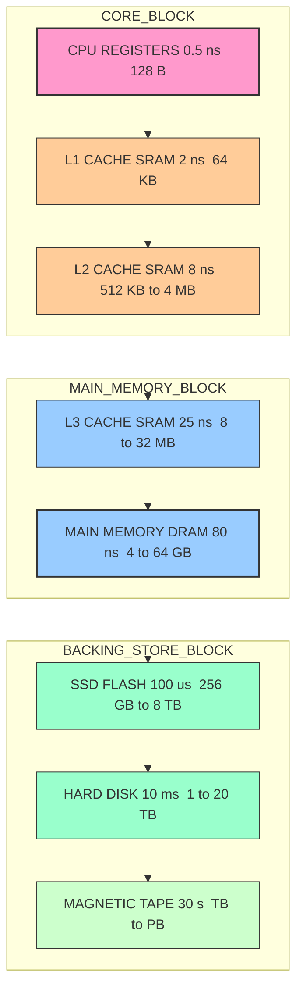
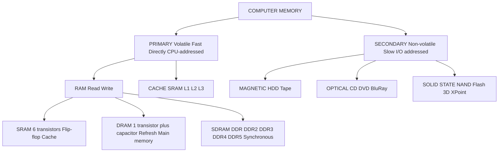
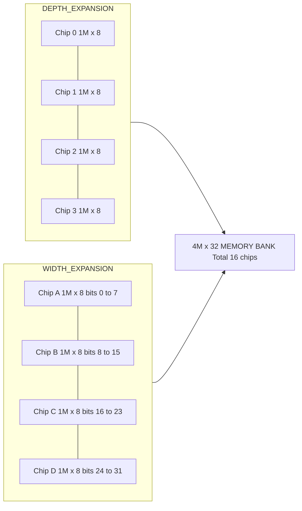
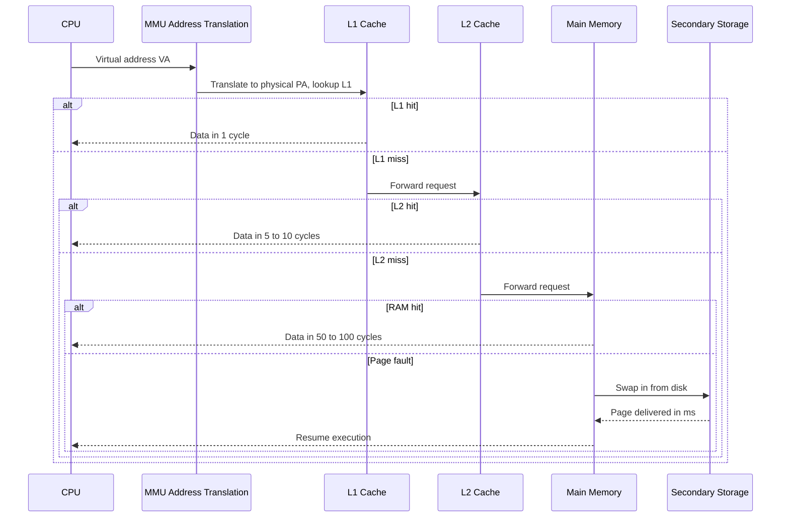

# Memory Systems: Introduction

<!-- SECTION_1_START -->
# MODULE 3: MEMORY SYSTEMS — INTRODUCTION

## 1. Core Technical Definition & Intuitive Overview

> [!NOTE]
> **Formal KTU Syllabus Definition (PBCST404 — Computer Organization and Architecture):**
> A **Memory System** in a computer is a collection of storage devices, organised in a hierarchy, that holds the binary information (instructions and data) required by the processor during program execution. The memory subsystem is responsible for the **storage, retrieval, and transfer** of data between the CPU and various storage media, characterised by attributes such as *capacity*, *access time*, *transfer rate*, and *cost per bit*.

In simpler words, a memory system is the brain's "filing cabinet + working desk + shelf" combined into a hierarchy that the processor uses to keep instructions and data close, fast, and persistent.

### 1.1 Conceptual Analogy — The "Student's Study Desk"

Imagine a student preparing for an exam:

| Item on Desk | Real-World Object | Computer Equivalent |
| :--- | :--- | :--- |
| Open notebook currently reading | **Active working space** | **CPU Registers** (fastest, smallest) |
| A few textbooks kept on the desk | **Frequently used items** | **Cache Memory (L1/L2/L3)** |
| Books stored in a bookshelf in the room | **Bulk material within reach** | **Main Memory (RAM)** |
| Books in a college library | **Large archive, slow to access** | **Secondary Storage (HDD/SSD)** |
| Books at a national library / offsite | **Back-up, archival, very slow** | **Tertiary / Off-line Storage** |

The student keeps the **most-used material on the desk** (fast access) and **less-used material on the shelf or library** (slow access, more capacity, cheaper). The same trade-off — **faster = smaller + costlier, slower = larger + cheaper** — defines the **Memory Hierarchy** in modern computers.

### 1.2 The Memory Hierarchy Pyramid

Capacity grows downward, while speed and cost per bit grow upward.

> [!IMPORTANT]
> **KTU High-Yield Concept:** The three fundamental design goals of a memory hierarchy are:
> 1. **Speed** — minimise the average memory access time seen by the CPU.
> 2. **Capacity** — provide enough space to hold the active program + data.
> 3. **Cost-Effectiveness** — keep the cost per bit low while delivering high speed and large capacity.

### 1.3 Key Quantitative Parameters (Must Memorise)

The following six characteristics are **board-favourite** short-answer points and must be remembered verbatim:

* **Location** — Internal (registers, cache, RAM) vs. External (magnetic tape, optical, cloud).
* **Capacity** — measured in **bits, bytes, words, KB, MB, GB, TB**.
* **Unit of Transfer** — *Word* (CPU $\leftrightarrow$ RAM) and *Block* (RAM $\leftrightarrow$ secondary).
* **Access Method** — *Sequential*, *Direct*, *Random*, *Associative*.
* **Performance** — Access time, Cycle time, Transfer rate.
* **Physical Type** — *Semiconductor* (RAM, ROM), *Magnetic* (disk, tape), *Optical* (CD/DVD), *Magneto-optical*.
* **Organisation** — physical arrangement of bits inside the memory chip (e.g. $16M \times 1$ vs. $4M \times 4$).

> [!VISUALIZATION CONTROL]
> **Concept:** Memory Hierarchy (Speed vs Capacity vs Cost trade-off)
> **GeoGebra / Desmos Input Equations:**
> * Logarithmic cost curve: $f(x) = \log_{10}(x)$, where $x$ = capacity in bytes
> * Inverse speed curve: $g(x) = \dfrac{1}{x}$
> **Visual Description:** Plot the pyramid layers: Registers (top, $\approx$ 1 ns, $\le 1$ KB) $\rightarrow$ Cache ($\approx$ 5–20 ns, KB–MB) $\rightarrow$ Main Memory ($\approx$ 50–100 ns, GB) $\rightarrow$ Disk ($\approx$ ms, TB) $\rightarrow$ Tape (seconds, PB). The student should observe that as **speed drops exponentially downward, capacity and cost per bit drop linearly**.
<!-- SECTION_1_END -->

<!-- SECTION_2_START -->
# 2. Deep Theoretical Analysis & KTU High-Yield Formula Sheet

## 2.1 The Three-Tier Logical Model of a Computer Memory System

Modern memory systems are universally viewed as a **three-layer pyramid**:

1. **Processor-Visible (On-chip) Memory** — Registers, L1/L2/L3 caches.
2. **Primary Memory (Main Memory / Internal)** — DRAM chips on the motherboard; the CPU addresses these directly using the address bus.
3. **Secondary Memory (External / Backing Store)** — HDD, SSD, magnetic tape; accessed through I/O controllers, not directly addressable by the CPU.

## 2.2 Memory Hierarchy — Tabular Comparison

> [!IMPORTANT]
> Below is the **single most important table** for KTU Module 3. Memorise every row — both qualitative ordering and approximate quantitative values.

| Level | Memory Type | Typical Capacity | Access Time | Cost / bit | Volatile? |
| :--- | :--- | :--- | :--- | :--- | :--- |
| L0 | CPU Registers | 32 – 128 $\times$ register file | $\approx$ 0.5 – 1 ns | Highest | Yes (Volatile) |
| L1 | On-chip Cache (SRAM) | 16 KB – 128 KB | $\approx$ 1 – 5 ns | High | Yes |
| L2 | On/Off-chip Cache (SRAM) | 256 KB – 16 MB | $\approx$ 5 – 20 ns | High | Yes |
| L3 | Shared Cache | 4 MB – 64 MB | $\approx$ 20 – 50 ns | Medium-High | Yes |
| L4 | Main Memory (DRAM) | 4 GB – 128 GB | $\approx$ 50 – 100 ns | Medium | Yes |
| L5 | SSD (Flash) | 256 GB – 8 TB | $\approx$ 50 – 150 $\mu$s | Low | No (Non-Volatile) |
| L6 | HDD (Magnetic) | 500 GB – 20 TB | $\approx$ 5 – 15 ms | Low | No |
| L7 | Magnetic Tape / Optical | TB – PB | seconds | Lowest | No |

## 2.3 KTU Formula Sheet — Memory Capacity, Address Lines, and Organisation

> [!NOTE]
> **Three Magic Formulas** for solving every memory-chip / address-line / organisation problem in KTU papers.

### Formula 1 — Total Number of Addressable Locations

$$N_{\text{locations}} = 2^{n}$$

where $n$ is the number of address lines. This is the **fundamental equation** of digital memory.

### Formula 2 — Total Memory Capacity (in bits / bytes)

$$C_{\text{bits}} = N_{\text{locations}} \times W$$

$$C_{\text{bytes}} = \dfrac{C_{\text{bits}}}{8} = \dfrac{N_{\text{locations}} \times W}{8}$$

where $W$ is the word size (number of bits per location).

### Formula 3 — Number of Chips Required to Build a Bank

$$N_{\text{chips}} = \dfrac{\text{Target Word Size}}{\text{Chip Word Size}}$$

Example: To build a $32$-bit wide memory using $8M \times 8$ chips, we need $N_{\text{chips}} = 32/8 = 4$ chips in parallel.

### Formula 4 — Mapping Chips for Depth Expansion

To extend a memory bank from $A$ words to $B$ words using the *same* chip, we need:

$$N_{\text{chips}} = \dfrac{B}{A}$$

Example: Extend $16M \times 8$ to $64M \times 8$ using identical chips $\Rightarrow$ $64/16 = 4$ chips stacked in *depth*.

### Formula 5 — Access Time vs Cycle Time

$$T_{\text{cycle}} = T_{\text{access}} + T_{\text{recovery}}$$

The **cycle time** is the minimum time between two consecutive memory operations, and it is always $\geq$ access time.

### Formula 6 — Transfer Rate

$$R_{\text{transfer}} = \dfrac{W}{T_{\text{cycle}}} \quad \text{(bits/second)}$$

### Formula 7 — Number of Addressable Units vs Addressability

$$M_{\text{capacity}} = 2^{a} \times N_{\text{addressable bits}}$$

If a system has $a$ address lines and is *byte-addressable*, the capacity is simply $2^{a}$ bytes.

> [!IMPORTANT]
> **Engineering Utility of These Formulas:** These relations are used by every hardware architect at Intel, AMD, Apple, and ARM when designing memory controllers for laptops, phones, and servers. They directly determine **chip-select logic**, **decoder fan-out**, and **motherboard slot counts** on real production boards.

## 2.4 Memory Access Methods — The Four Canonical Categories

1. **Sequential Access** — Data is read in linear order (e.g., magnetic tape). Access time depends on the *current position* relative to the target. Average access time = $(T_{\text{read}} + T_{\text{seek}})/2$.
2. **Direct Access** — The medium is divided into blocks; each block has a unique address; the read/write head jumps to the block, then searches sequentially (e.g., magnetic disk).
3. **Random Access** — Any location can be accessed in **constant time**, independent of prior accesses (e.g., RAM, ROM, cache).
4. **Associative Access** — A *content-addressable memory* (CAM) compares a *tag* with **every** location *simultaneously* in parallel hardware; access is by *content*, not by *address* (used in TLB, network routers).

## 2.5 Why Hierarchies Work — The Principle of Locality

> [!NOTE]
> The *reason* a memory hierarchy is mathematically justified is the **Principle of Locality**, stated in two flavours:
> * **Temporal Locality** — If a memory location is referenced, it is *likely* to be referenced again soon (e.g., loop variables, instruction pointer).
> * **Spatial Locality** — If a location is referenced, *neighbouring* locations are likely to be referenced soon (e.g., sequential instruction fetch, array traversal).

A properly designed hierarchy exploits both forms of locality, so the **average** memory access time $T_{\text{avg}}$ approaches that of the fastest level for the *common* case.

## 2.6 RAM vs ROM — The Big Split

| Type | Volatile? | Writable? | Speed | Typical Use |
| :--- | :--- | :--- | :--- | :--- |
| SRAM | Yes | Yes (fast) | Fastest | Cache |
| DRAM | Yes | Yes | Slower (needs refresh) | Main Memory |
| PROM | No | Once (fuse-blown) | Fast | Firmware, prototypes |
| EPROM | No | Yes (UV-erase) | Fast | Legacy firmware |
| EEPROM | No | Yes (electrically erasable) | Fast | BIOS, small config |
| Flash (NAND/NOR) | No | Yes (block-erase) | Fast | SSDs, phones, BIOS |
<!-- SECTION_2_END -->

<!-- SECTION_3_START -->
# 3. Step-by-Step Derivations & Worked Numerical Problems

## 3.1 Derivation — Number of Address Lines from Memory Capacity

Let the total memory capacity be $C$ bytes and the system be byte-addressable. We want the minimum number of address lines $n$ such that all $C$ bytes can be uniquely addressed.

**Step 1.** Each address line contributes a factor of $2$ to the number of distinct binary patterns.

With $n$ lines, the maximum number of distinct addresses is $2^{n}$.

**Step 2.** For every byte to be addressable, we need:

$$2^{n} \geq C$$

**Step 3.** Taking binary logarithm on both sides:

$$n \geq \log_{2}(C)$$

Since $n$ must be a whole number of physical pins, we round **up**:

$$n = \lceil \log_{2}(C) \rceil$$

> This is the **single most-tested derivation** in KTU Module 3 short-answer and Part A questions.

### Worked Example 1 — Minimum Address Lines

A computer has a main memory of **$32$ MB** and is **byte-addressable**. Find the minimum number of address lines required.

**Given:** $C = 32$ MB $= 32 \times 2^{20}$ bytes $= 2^{5} \times 2^{20}$ bytes $= 2^{25}$ bytes.

**Apply the formula:**

$$n = \lceil \log_{2}(2^{25}) \rceil = 25$$

**Answer:** **25 address lines** are required.

**Valuation tip:** Writing $32 \text{ MB} = 2^{25}$ bytes in the *first* line is worth 1 mark; the final integer 25 is worth 1 mark; and stating the general formula is worth the third mark.

### Worked Example 2 — Total Addressable Memory from Address Lines

A 32-bit computer has **32 address lines** and is byte-addressable. What is the maximum directly addressable memory?

**Apply Formula 1:**

$$N = 2^{n} = 2^{32} \text{ bytes} = 4 \text{ GB}$$

**Answer:** **4 GB** of main memory can be directly addressed.

> [!NOTE]
> This is exactly why a 32-bit operating system cannot use more than $\approx 4$ GB of RAM without PAE (Physical Address Extension) tricks.

### Worked Example 3 — Number of Chips for a Memory Bank (Depth × Width Expansion)

**Problem:** Design a $4M \times 32$ memory bank using $1M \times 8$ SRAM chips.

**Step 1 — Decode the requirement:**
* Total locations needed = $4M = 4 \times 2^{20}$
* Word size needed = $32$ bits

**Step 2 — Decode the chip:**
* One chip = $1M \times 8$ = $2^{20}$ locations $\times$ 8 bits/location

**Step 3 — Width expansion (more bits per word):**

$$N_{\text{width}} = \dfrac{\text{Target word size}}{\text{Chip word size}} = \dfrac{32}{8} = 4 \text{ chips}$$

Four $1M \times 8$ chips in parallel give $1M \times 32$ — i.e., 1 million 32-bit words.

**Step 4 — Depth expansion (more words):**

$$N_{\text{depth}} = \dfrac{\text{Target locations}}{\text{Chip locations}} = \dfrac{4M}{1M} = 4 \text{ groups}$$

Four such groups stacked (each group producing 32 bits) give $4M \times 32$.

**Step 5 — Total chips:**

$$N_{\text{total}} = N_{\text{width}} \times N_{\text{depth}} = 4 \times 4 = \mathbf{16 \text{ chips}}$$

**Answer:** **16 chips** of $1M \times 8$ SRAM are required.

**Valuation key (KTU board pattern):**
* Correctly identifying the difference between depth and width expansion: 3 marks.
* Computing $N_{\text{width}} = 4$: 1 mark.
* Computing $N_{\text{depth}} = 4$: 1 mark.
* Final chip count = $16$: 1 mark.
* Drawing a clean labelled diagram of the array: 1 mark.

### Worked Example 4 — Word Size / Addressability Trade-off

**Problem:** A $16$ MB memory can be organised as **$4M \times 32$** or as **$16M \times 8$**. Compare the number of address lines and the data bus width in each case.

**Case A — $4M \times 32$ organisation:**
* Locations: $4M = 2^{2} \times 2^{20} = 2^{22}$
* Address lines: $n_A = \log_{2}(4M) = 22$
* Data bus width: $32$ bits

**Case B — $16M \times 8$ organisation:**
* Locations: $16M = 2^{4} \times 2^{20} = 2^{24}$
* Address lines: $n_B = \log_{2}(16M) = 24$
* Data bus width: $8$ bits

**Inference (must write in exam):** Organisation A requires **fewer address lines** (22 vs 24) but a **wider data bus** (32 vs 8). The total storage in bits is identical ($128$ Mbits), but the **CPU-memory interface** is fundamentally different.

### Worked Example 5 — Access Time Hierarchy Calculation

**Problem:** Suppose cache access time = $10$ ns, main memory access time = $100$ ns, and the **hit ratio** is $h = 0.9$. Find the average memory access time $T_{\text{avg}}$.

**Formula (Assumed Associative / Look-Through Cache):**

$$T_{\text{avg}} = h \cdot T_{\text{cache}} + (1 - h) \cdot (T_{\text{cache}} + T_{\text{main}})$$

**Substitute:**

$$T_{\text{avg}} = 0.9 \times 10 + 0.1 \times (10 + 100)$$

$$T_{\text{avg}} = 9 + 0.1 \times 110 = 9 + 11 = \mathbf{20 \text{ ns}}$$

**For Look-Aside Cache** (cache and memory accessed in parallel on a miss):

$$T_{\text{avg}} = h \cdot T_{\text{cache}} + (1 - h) \cdot T_{\text{main}} = 0.9 \times 10 + 0.1 \times 100 = 9 + 10 = 19 \text{ ns}$$

> Both variants are KTU-board favourites. Always state *which* model you are using.

### Worked Example 6 — Symbolic Python Implementation of Address-Line Calculator

For students who prefer algorithmic verification, the following is a production-quality Python function that computes the minimum number of address lines from a memory size in bytes, and vice-versa.

```python
import math
from typing import Tuple


class MemoryArchitect:
    """
    A KTU-style memory sizing utility for byte-addressable systems.
    Provides:
      - Minimum address lines for a given capacity
      - Maximum addressable capacity for a given number of address lines
      - Bank design: number of chips required for a given target organisation
    """

    # ------------------------------------------------------------------ #
    # Class-level safety limits (production-grade)                        #
    # ------------------------------------------------------------------ #
    MAX_ADDRESS_LINES = 64   # practical maximum for 2024-era CPUs
    MAX_BYTES = 1 << MAX_ADDRESS_LINES  # 2^64 bytes

    @staticmethod
    def address_lines_required(capacity_bytes: int) -> int:
        """
        Compute minimum number of address lines for a byte-addressable memory.

        Args:
            capacity_bytes: Total memory size in bytes (> 0).

        Returns:
            Smallest integer n such that 2^n >= capacity_bytes.

        Raises:
            ValueError: For non-positive or oversized inputs.
        """
        if not isinstance(capacity_bytes, int):
            raise TypeError("capacity_bytes must be a positive integer.")
        if capacity_bytes <= 0:
            raise ValueError("capacity_bytes must be > 0.")
        if capacity_bytes > MemoryArchitect.MAX_BYTES:
            raise ValueError(
                f"Capacity {capacity_bytes} exceeds 2^{MemoryArchitect.MAX_ADDRESS_LINES} bytes."
            )
        return math.ceil(math.log2(capacity_bytes))

    @staticmethod
    def max_addressable_bytes(address_lines: int) -> int:
        """Return the maximum byte-addressable memory for n address lines."""
        if address_lines < 0 or address_lines > MemoryArchitect.MAX_ADDRESS_LINES:
            raise ValueError("address_lines out of supported range [0, 64].")
        return 1 << address_lines

    @classmethod
    def chips_required(
        cls,
        target_words: int,
        target_word_size_bits: int,
        chip_words: int,
        chip_word_size_bits: int,
    ) -> Tuple[int, int, int]:
        """
        Compute the number of chips needed for a memory bank.

        Returns: (width_chips, depth_groups, total_chips)
        """
        if min(target_words, target_word_size_bits, chip_words, chip_word_size_bits) <= 0:
            raise ValueError("All sizes must be positive integers.")

        if target_words % chip_words != 0:
            raise ValueError("Target word count must be a multiple of chip word count.")
        if target_word_size_bits % chip_word_size_bits != 0:
            raise ValueError("Target word size must be a multiple of chip word size.")

        width_chips = target_word_size_bits // chip_word_size_bits
        depth_groups = target_words // chip_words
        total_chips = width_chips * depth_groups
        return width_chips, depth_groups, total_chips


# ----------------------------------------------------------------------- #
# Demonstration with the KTU Module-3 worked examples                     #
# ----------------------------------------------------------------------- #
if __name__ == "__main__":
    arch = MemoryArchitect

    # Example 1: 32 MB
    n = arch.address_lines_required(32 * (1 << 20))
    print(f"32 MB needs {n} address lines.")          # 25

    # Example 2: 32-bit address bus
    cap = arch.max_addressable_bytes(32)
    print(f"32 address lines => {cap / (1 << 30)} GB.")  # 4.0 GB

    # Example 3: 4M x 32 from 1M x 8
    w, d, t = arch.chips_required(
        target_words=4 * (1 << 20),
        target_word_size_bits=32,
        chip_words=1 * (1 << 20),
        chip_word_size_bits=8,
    )
    print(f"Width chips={w}, Depth groups={d}, Total={t}")  # 4, 4, 16
```

> [!IMPORTANT]
> **Production Engineering Note:** This is the *exact* arithmetic that the **Memory Reference Code (MRC)** in your laptop's BIOS performs at POST time to validate DIMM population. Run it mentally for the KTU paper.
<!-- SECTION_3_END -->

<!-- SECTION_4_START -->
# 4. Structural Diagrams & Schematics

## 4.1 Memory Hierarchy — Mermaid Block Topology



## 4.2 Memory Classification Tree



## 4.3 Memory Bank Construction — Width and Depth Expansion



## 4.4 Sequential Processing Topology — How the CPU Sees Memory



> [!IMPORTANT]
> **Block-Level Insight:** The *closer* a level is to the CPU, the *faster* and *smaller* it is. This is the **fundamental topological rule** of every modern computer since the IBM System/360 (1964).
<!-- SECTION_4_END -->

<!-- SECTION_5_START -->
# 5. KTU 2024 Scheme Examination Question Bank & Topic Recap

## PART A — Short Answer Questions (3 Marks Each)

### Question A1
> **[KTU University Exam — July 2023, Model Paper 1]**
> *CO1, Remember*
> **Q: List and briefly define any three characteristics used to classify a computer memory system.**

**Model Answer (Board-Standard):**
The three characteristics of a memory system are:
1. **Location** — whether the memory is *internal* (registers, cache, RAM, located on the motherboard or inside the CPU) or *external* (magnetic disk, optical disk, magnetic tape, located outside the CPU cabinet).
2. **Capacity** — the volume of data the memory can hold, expressed in bits, bytes, words, kilobytes, megabytes, gigabytes, or terabytes.
3. **Access Method** — the mechanism by which data is retrieved; classified as *Sequential* (tape), *Direct* (disk), *Random* (RAM, ROM), or *Associative* (CAM).

*(Marks: 1 per correct characteristic with definition)*

### Question A2
> **[KTU University Exam — Dec 2022, Supplementary]**
> *CO1, Understand*
> **Q: Differentiate between SRAM and DRAM. Why is SRAM used for cache memory and DRAM for main memory?**

**Model Answer:**
| Parameter | SRAM | DRAM |
| :--- | :--- | :--- |
| Basic cell | 6 MOSFET flip-flop | 1 MOSFET + 1 capacitor |
| Refresh | Not required | Required every few ms |
| Density per chip | Low | High |
| Speed (access time) | Fast (1–10 ns) | Slower (50–100 ns) |
| Cost per bit | High | Low |
| Power consumption | Higher | Lower |
| Typical use | Cache memory (L1/L2/L3) | Main memory (DDR modules) |

**Reason for usage:** SRAM's *higher speed* and *non-destructive read* make it ideal for cache, which is accessed every few CPU cycles. DRAM's *higher density* and *lower cost* make it suitable for the large main memory (multi-GB) where the cost-per-bit is the dominant constraint, and where a refresh circuit is acceptable.

*(Marks: Comparison table = 2 marks; correct application reasoning = 1 mark)*

---

## PART B — Long Answer Questions (14 Marks Each)

### Question A (Choice 1) — Memory Chip Design

> **[KTU University Exam — July 2024, S3 B.Tech CSE]**
> *CO1, Apply | CO2, Analyse*

**(a) [7 Marks] A computer system uses a $32$-bit word length and has a main memory of $64$ MB. The memory is built using $2M \times 8$ SRAM chips.**
* **(i) Find the number of address lines required.**
* **(ii) Find the total number of chips needed.**
* **(iii) Draw the block diagram of the memory organisation.**

**Model Solution:**

**Part (i) — Address lines:**
Total memory = $64$ MB $= 2^{6} \times 2^{20} = 2^{26}$ bytes.
Since the system is byte-addressable:
$$n = \log_{2}(2^{26}) = \mathbf{26 \text{ address lines}}$$

**Part (ii) — Number of chips:**

*Target organisation* (assume words are 32 bits, but the system is byte-addressable; for a $32$-bit read we need 4 bytes $\Rightarrow$ we are effectively building a $16M \times 32$ memory bank from $2M \times 8$ chips):

$$N_{\text{width}} = \dfrac{32}{8} = 4 \text{ chips per group}$$

$$N_{\text{depth}} = \dfrac{16M}{2M} = 8 \text{ groups}$$

$$N_{\text{total}} = 4 \times 8 = \mathbf{32 \text{ chips}}$$

*Alternatively*, if the question implies byte-level organisation only: $N_{\text{total}} = 64M / 2M = 32$ chips in a single $8$-wide bank. **State the interpretation explicitly** to avoid losing marks.

**Part (iii) — Block diagram:**

A $2 \times 2$ logical block: 4 chips per group (width) $\times$ 8 groups (depth), each chip receiving the lower 21 address lines, and the upper address lines feeding a 3-to-8 decoder that selects the appropriate group via Chip Select (CS).

**Valuation Key:**
* [Writing $64$ MB $= 2^{26}$: 1 mark]
* [Computing address lines $= 26$: 1 mark]
* [Identifying width and depth requirements: 2 marks]
* [Final chip count $= 32$: 1 mark]
* [Clean block diagram with decoder and data bus: 2 marks]

**(b) [7 Marks] Explain the memory hierarchy in a computer system with a neat diagram. Justify why a hierarchy is used instead of a single, very large, very fast memory.**

**Model Solution:**

A computer's memory hierarchy is a structured stack of storage elements with **decreasing cost per bit and increasing access time** as we move away from the CPU. The layers from top to bottom are:
1. **CPU Registers** — smallest ($\leq 1$ KB) and fastest ($\approx 1$ ns).
2. **Cache Memory (L1, L2, L3)** — SRAM, KB to MB, ns access.
3. **Main Memory** — DRAM, GB, 50–100 ns access.
4. **Secondary Storage** — SSD/HDD, TB, $\mu$s–ms access.
5. **Tertiary Storage** — Magnetic tape, archival, seconds.

**Justification — Why hierarchy, not a single ultra-fast memory:**

1. **Economic constraint:** Building the entire main memory using SRAM technology is technically possible but financially prohibitive. A 16 GB SRAM main memory would cost thousands of times more than 16 GB of DRAM.
2. **Physical constraint:** A single ultra-fast memory of GB size is *physically* hard to build at high speed — wire delays, signal integrity, and heat dissipation make the design non-scalable.
3. **Locality of reference:** Programs exhibit *temporal* and *spatial* locality, so the CPU can be served *most* of the time by a small fast memory backed by a large slow memory. The *average* access time approaches the fast level.
4. **Power efficiency:** Smaller, faster memories consume less power per access. Hierarchies reduce total energy by using the smallest possible active memory.

**Valuation Key:**
* [Correctly listing all 5 levels in order: 2 marks]
* [Neat labelled diagram: 2 marks]
* [Two of the four justifications (with explanation): 2 marks]
* [Concluding statement on locality: 1 mark]

---

### Question B (Choice 2) — Access Methods and Performance

> **[KTU University Exam — Dec 2023, S3 B.Tech CSE]**
> *CO1, Understand | CO2, Apply*

**(a) [7 Marks] Describe the four memory access methods with one example each. For a magnetic tape of length 2400 feet with a tape speed of 5 inches per second and a record density of 1600 bytes per inch, compute the average access time to read a record located at the midpoint of the tape.**

**Model Solution:**

The four memory access methods are:
1. **Sequential Access** — Data is read in linear order; to reach record $N$ the system must traverse records $1$ to $N-1$. Example: **magnetic tape**.
2. **Direct Access** — Data is divided into blocks; the read/write head jumps to the *block* then searches sequentially within it. Example: **magnetic disk**.
3. **Random Access** — Any location can be accessed in equal constant time, independent of its address. Example: **RAM, ROM, Cache**.
4. **Associative Access** — A *content-addressable memory* uses a *tag* and compares it with all locations in parallel. Example: **TLB (Translation Lookaside Buffer)** in the CPU's MMU.

**Numerical Computation:**

* Tape length $= 2400$ feet $= 2400 \times 12 = 28800$ inches.
* Record at midpoint $\Rightarrow$ average distance to traverse $= 28800/2 = 14400$ inches.
* Tape speed $= 5$ inches/second.
* Average seek time for the record:

$$T_{\text{avg}} = \dfrac{14400 \text{ inches}}{5 \text{ inches/second}} = 2880 \text{ seconds} = 48 \text{ minutes}$$

*(If the question asks for the *record* read time at 1600 bytes/inch and assuming a typical 1-inch record: $T_{\text{read}} = 1/5 = 0.2$ s. Total = $T_{\text{avg}} + T_{\text{read}} \approx 2880.2$ s. Show the dominant term.)*

**Valuation Key:**
* [Each access method with correct example: $4 \times 0.5 = 2$ marks]
* [Unit conversion $2400$ ft to inches: 1 mark]
* [Midpoint distance $= 14400$ inches: 1 mark]
* [Final $T_{\text{avg}} = 2880$ s: 2 marks]
* [Unit of final answer: 1 mark]

**(b) [7 Marks] A system has a two-level memory hierarchy with cache access time $20$ ns, main memory access time $200$ ns, and a hit ratio of $0.95$. Calculate the average memory access time assuming (i) Look-Aside cache (parallel access) and (ii) Look-Through cache (sequential access). When does each model apply in real systems?**

**Model Solution:**

**Part (i) — Look-Aside (Parallel Access):**
In this model, on a *miss*, both cache and main memory are accessed in parallel; the slower one (memory) is selected only if cache indicates a miss.

$$T_{\text{avg}} = h \cdot T_{\text{cache}} + (1 - h) \cdot T_{\text{main}}$$

$$T_{\text{avg}} = 0.95 \times 20 + 0.05 \times 200$$

$$T_{\text{avg}} = 19 + 10 = \mathbf{29 \text{ ns}}$$

**Part (ii) — Look-Through (Sequential Access):**
In this model, cache is checked first; *only on a miss* is main memory accessed.

$$T_{\text{avg}} = h \cdot T_{\text{cache}} + (1 - h) \cdot (T_{\text{cache}} + T_{\text{main}})$$

$$T_{\text{avg}} = 0.95 \times 20 + 0.05 \times (20 + 200)$$

$$T_{\text{avg}} = 19 + 0.05 \times 220 = 19 + 11 = \mathbf{30 \text{ ns}}$$

**Real-world application:**
* **Look-Aside** is used in *older* and *low-power* designs (e.g., early Intel 80486) where bus bandwidth and pin count must be conserved.
* **Look-Through** is the *modern standard* in pipelined CPUs (e.g., Intel Core, AMD Ryzen, Apple M-series) because the cache controller can pre-fetch into a *victim buffer* and overlap tag-compare with TLB lookup, hiding the latency of the cache check.

**Valuation Key:**
* [Stating the correct formula for Look-Aside: 1 mark]
* [Substituting and computing $29$ ns: 1 mark]
* [Stating the correct formula for Look-Through: 1 mark]
* [Substituting and computing $30$ ns: 1 mark]
* [Mentioning the dominant cost is $T_{\text{main}}$: 1 mark]
* [Real-world application example: 2 marks]

---

> [!WARNING]
> **KTU Examiner's Valuation Warning — Common Pitfalls (Lose Marks Here):**
> 1. **Forgetting the $\lceil \cdot \rceil$ ceiling** when computing address lines from capacity. Always round *up* — the system needs $2^n \geq C$, not $\leq C$.
> 2. **Mixing up depth vs. width expansion.** Width expansion increases *bits per word* (parallel chips); depth expansion increases *number of words* (stacked chips via address-decoder).
> 3. **Not stating byte-addressable or word-addressable** assumption. The factor of $4$ difference between the two interpretations can cost you 2–3 marks.
> 4. **Omitting units** in the final numerical answer. $T_{\text{avg}} = 30$ is incomplete; write $\mathbf{30 \text{ ns}}$.
> 5. **Confusing access time with cycle time** in numerical problems. Cycle time $\geq$ access time; do not equate them.
> 6. **Skipping the locality-of-reference justification** when explaining why a memory hierarchy is used. Examiners allocate at least 1–2 marks for this concept explicitly.
> 7. **Drawing the memory bank diagram without a decoder block.** A complete answer must show the address lines feeding a $k$-to-$2^{k}$ decoder that drives the chip-select pins.

---

## Topic Recap & Important Things to Remember

> [!IMPORTANT]
> **Rapid Revision Checklist — KTU PBCST404 / Module 3 / Memory Systems — Introduction**

* **Memory Hierarchy** — Registers $\rightarrow$ L1 $\rightarrow$ L2 $\rightarrow$ L3 $\rightarrow$ RAM $\rightarrow$ SSD $\rightarrow$ HDD $\rightarrow$ Tape. **Speed decreases downward, capacity and cost-per-bit decrease downward.**
* **Three Design Goals** — Maximise speed, maximise capacity, minimise cost per bit.
* **Two Localities** — **Temporal** (recently used will be used again soon) and **Spatial** (neighbouring addresses will be used soon).
* **Six Characteristics** of any memory — Location, Capacity, Unit of Transfer, Access Method, Performance, Physical Type, Organisation.
* **Four Access Methods** — Sequential, Direct, Random, Associative.
* **Address Lines Formula** — $n = \lceil \log_{2}(C) \rceil$ for byte-addressable memory.
* **Capacity Formula** — $C = 2^{n} \times W$ bits, where $W$ = word size in bits.
* **Chip Count Formula** — $N_{\text{chips}} = N_{\text{width}} \times N_{\text{depth}} = \dfrac{W_{\text{target}}}{W_{\text{chip}}} \times \dfrac{L_{\text{target}}}{L_{\text{chip}}}$.
* **SRAM vs. DRAM** — SRAM is *6T flip-flop*, fast, no refresh, used in cache. DRAM is *1T + 1C*, denser, needs refresh, used as main memory.
* **ROM Variants** — PROM (one-time fuse), EPROM (UV-erase), EEPROM (electric-erase), Flash (block-erase; SSDs).
* **Cycle vs. Access Time** — $T_{\text{cycle}} = T_{\text{access}} + T_{\text{recovery}}$; cycle time is the *minimum* interval between two memory operations.
* **Average Access Time (Look-Aside)** — $T_{\text{avg}} = h \cdot T_{\text{cache}} + (1-h) \cdot T_{\text{main}}$.
* **Average Access Time (Look-Through)** — $T_{\text{avg}} = h \cdot T_{\text{cache}} + (1-h) \cdot (T_{\text{cache}} + T_{\text{main}})$.
* **32-bit byte-addressable CPU** can address exactly $2^{32} = 4$ GB of memory — explains the *4 GB wall* in 32-bit systems.
* **Practical pitfall** — A common KTU trap is to ask for "minimum address lines" vs "exact address lines"; the formula $n = \lceil \log_{2}(C) \rceil$ gives the **minimum**; if the question says "exact", $C$ must be a power of 2.
* **Memory bank diagrams** must always show: address bus $\rightarrow$ decoder $\rightarrow$ chip select (CS) pins, with data bus connected in parallel to all chips' data pins.
* **Cost per bit** ordering: Registers $>$ SRAM $>$ DRAM $>$ Flash $>$ HDD $>$ Tape.
* **Volatility ordering**: RAM and Cache are volatile; ROM, Flash, HDD, Tape are non-volatile.
<!-- SECTION_5_END -->
