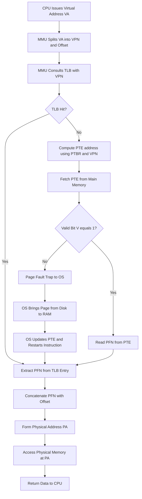
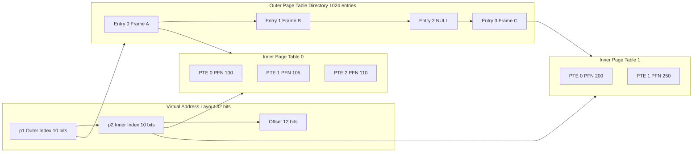
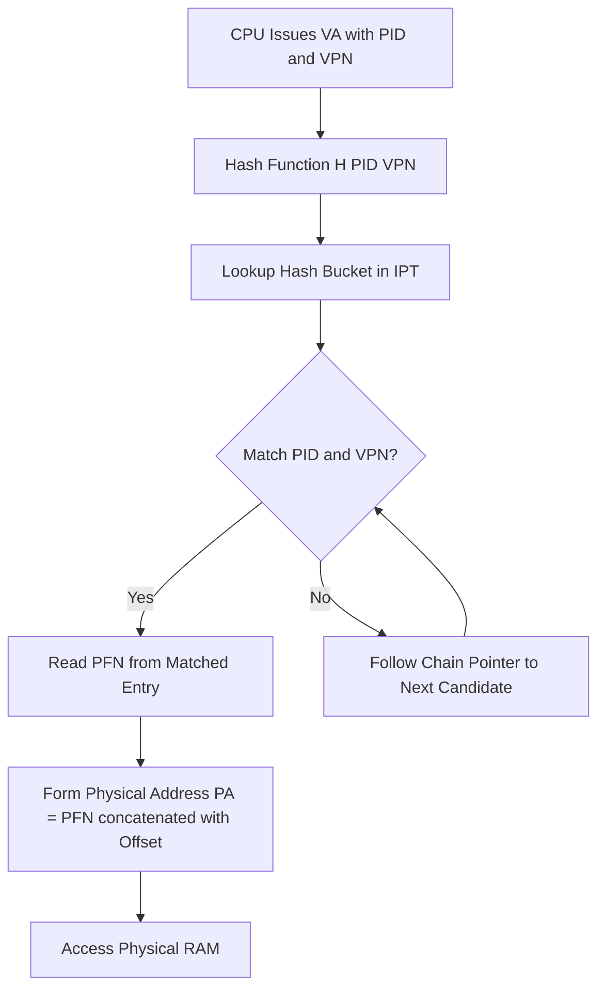
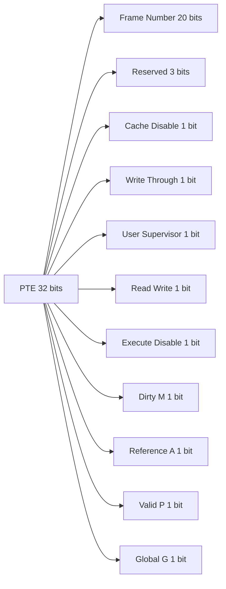

# Page Table

<!-- SECTION_1_START -->

# Page Table — Module 3: Memory Systems Introduction

## 1.1 Formal KTU 2024 Definition

A **Page Table** is a per-process kernel-resident data structure maintained by the Operating System in cooperation with the **Memory Management Unit (MMU)** that stores the *virtual-to-physical* address translation mapping for a process executing under a **paged virtual memory** regime. For every **Virtual Page Number (VPN)** generated by the CPU, the page table holds a corresponding **Page Table Entry (PTE)** which yields the **Physical Frame Number (PFN)** along with administrative control flags (Valid, Protection, Reference, Dirty, etc.).

> [!IMPORTANT]
> **KTU 2024 Syllabus Anchor (PBCSTST404):** "Page table structure, single-level, two-level and inverted page tables; Translation Lookaside Buffer (TLB) and address translation flow."

## 1.2 Conceptual Analogy & Intuition

Imagine a massive **library** with 1 Million shelves (the *virtual address space*), but the *library actually owns* only 50,000 physical shelves (*physical memory*). When a student (a process) requests *book 7,42,891*, the librarian (the **MMU**) does not know the physical shelf directly. Instead, the librarian refers to a **catalogue index** (the *page table*) that says *"book 7,42,891 lives on shelf 11,304"*. The page table is the catalogue; the **shelf number is the frame number**; the *gap between virtual and physical shelf* is transparently hidden from the student.

*   The **book number** is the **Virtual Page Number**.
*   The **physical shelf number** is the **Frame Number**.
*   The **row inside the shelf** is the **Offset** (unchanged in translation).
*   The **catalogue index card** is the **Page Table Entry (PTE)**.
*   A **frequently consulted cheat-sheet** is the **TLB** (a hardware cache for translations).

> [!NOTE]
> **Core Property:** A page table is *not* a single contiguous block in the user's view; the *OS kernel* may store it in any physical frame. The **Page Table Base Register (PTBR)** in the CPU always points to its *current* physical starting address because the OS can swap the table in/out of memory.

## 1.3 Standard Metrics & Page Size Conventions

> [!TIP]
> **Default KTU assumption for all numerical problems:**
> *   **Page size** (and equivalently, **Frame size**): **4 KB** = $2^{12}$ bytes.
> *   **PTE size**: **4 bytes** (one 32-bit word).
> *   **Word size** of machine: 32-bit unless otherwise stated.

| Symbol | Meaning | Typical Magnitude |
| :--- | :--- | :--- |
| $V$ | Virtual address space size | $2^{v}$ bytes |
| $P$ | Physical address space size | $2^{p}$ bytes |
| $n$ | Page/Frame size | $2^{d}$ bytes |
| $v$ | Virtual address word length | 32 / 36 / 48 bits |
| $p$ | Physical address word length | 32 / 36 / 52 bits |
| $d$ | Offset bits | 12 (for 4 KB page) |
| VPN | Virtual Page Number | $v - d$ bits |
| PFN | Physical Frame Number | $p - d$ bits |

> [!VISUALIZATION CONTROL]
> **Concept:** Virtual vs Physical Address Space Slicing.
> **GeoGebra / Desmos Input Equations:**
> *   Rectangle 1 (Virtual): `polygon((0,0),(1,0),(1,1),(0,1))` labeled "Virtual Space"
> *   Rectangle 2 (Physical): `polygon((3,0),(4,0),(4,1),(3,1))` labeled "Physical RAM"
> *   Pointing arrow from Virtual page index $\rightarrow$ Physical frame index.
> **Visual Description:** Draw two horizontal bars of *equal height* (offset span) but *different lengths*; the page table maps chunks of the left bar to arbitrary chunks of the right bar, illustrating the *non-contiguous* physical allocation.

<!-- SECTION_1_END -->

<!-- SECTION_2_START -->

# 2. Deep Theoretical Analysis & KTU High-Yield Formula Sheet

## 2.1 Anatomy of a Virtual Address

A *logical* address issued by the CPU is decomposed by the MMU into two parts:

$$VA = \underbrace{\boxed{\text{VPN}}}_{\text{page number}} \ \ \underbrace{\boxed{\text{Offset}}}_{d \text{ bits}}$$

| Field | Width | Purpose |
| :--- | :--- | :--- |
| **VPN (Virtual Page Number)** | $v - d$ bits | Index into the page table |
| **Offset** | $d$ bits | Position inside the page; passed *unchanged* to physical address |

The **physical address** produced has an identical offset field, so the only new information required is the **Frame Number**:

$$PA = \underbrace{\boxed{\text{PFN}}}_{\text{frame number}} \ \ \underbrace{\boxed{\text{Offset}}}_{d \text{ bits}}$$

## 2.2 Anatomy of a Page Table Entry (PTE)

Each PTE is typically a 32-bit or 64-bit word. The layout (left-justified with PFN taking the high-order bits) is:

| Bit(s) from MSB | Field | Meaning |
| :--- | :--- | :--- |
| $31..12$ (example) | **Frame Number (PFN)** | Physical frame the page currently resides in |
| $11$ | **Valid (V) / Present bit** | $1$ = page in RAM, $0$ = page swapped to disk (Page Fault) |
| $10$ | **Reference (R) / Accessed bit** | Set by hardware on read/write; used by page replacement algorithms (LRU approximation) |
| $9$ | **Modify (M) / Dirty bit** | Set by hardware on write; signals write-back before eviction |
| $8..7$ | **Protection (R/W/X)** | User/Supervisor, Read, Write, Execute permissions |
| $6$ | **Cache Disable (CD)** | Caching policy for this page |
| $5$ | **Write-Through (WT)** | Cache write policy for this page |
| $4..0$ | **Reserved / PWT, PCD, ACC, DIR, SIZE** | Implementation-specific architectural bits |

> [!IMPORTANT]
> **Why does the offset pass through unchanged?** Because the page size and the frame size are *identical by construction*. The frame is the *physical container* of the same size as the page, so the *intra-page* byte index is preserved across translation.

## 2.3 Translation Flow (Single-Level Page Table)

The CPU performs the following deterministic micro-sequence on every memory access:

1.  CPU issues a **virtual address** $VA$.
2.  MMU extracts $VPN$ and $Offset$.
3.  MMU looks up the **PTBR** (Page Table Base Register) — holds the *physical address* of the page table.
4.  MMU computes: `PTE_address = PTBR + (VPN × PTE_size)`.
5.  MMU fetches the PTE from main memory.
6.  MMU checks the **Valid bit**. If $V = 0$ → *Page Fault trap* to the OS.
7.  MMU concatenates $PFN$ (from PTE) with $Offset$ to form the **physical address**.
8.  Memory access proceeds on the resulting physical address.

## 2.4 Why a Single-Level Page Table Fails at Scale

A 32-bit virtual machine with **4 KB pages** and **4-byte PTEs** requires:

$$\text{Page Table Size} = \underbrace{2^{v-d}}_{\text{number of pages}} \times \underbrace{2^{2}}_{\text{PTE size}} = 2^{v-d+2} \text{ bytes}$$

For $v = 32$, $d = 12$: $\text{Size} = 2^{22} = \mathbf{4 \ MB}$ *per process*. With 1000 processes that is **4 GB of PT space alone** — clearly infeasible. Hence the architectural pressure to move to **multi-level** and **inverted** page tables.

## 2.5 KTU Formula Sheet (Cheat Sheet)

> [!NOTE]
> **Mastery requirement:** Memorize this table verbatim. The KTU 2024 paper frequently awards full 14 marks for substituting correctly into these identities.

| # | Formula / Identity | LaTeX Form | Engineering Use |
| :--- | :--- | :--- | :--- |
| 1 | Offset bits | $d = \log_2(\text{Page Size})$ | Derive field widths |
| 2 | VPN bits | $v - d$ | Index into PT |
| 3 | PFN bits | $p - d$ | Physical frame width |
| 4 | Number of virtual pages | $N_{VP} = 2^{v-d}$ | Total PT entries |
| 5 | Number of physical frames | $N_{PF} = 2^{p-d}$ | Physical capacity in pages |
| 6 | Single-level PT size (bytes) | $S_{1} = N_{VP} \times \text{PTE size}$ | Linear PT memory cost |
| 7 | Two-level PT size (worst case) | $S_{2} = (2^{x} + 2^{y}) \times \text{PTE size}$ where $x+y = v-d$ | Hierarchical PT cost |
| 8 | Inverted PT size | $S_{I} = N_{PF} \times \text{IPT entry size}$ | Constant per-machine cost |
| 9 | Effective access time (TLB hit-ratio $h$) | $EAT = (h)(t_{mem}+t_{TLB}) + (1-h)(2t_{mem}+t_{TLB})$ | Performance analysis |
| 10 | Memory access without TLB (single-level) | $T = 2 \times t_{mem}$ (PT lookup + data) | Baseline cost |
| 11 | Memory access without TLB (two-level) | $T = 3 \times t_{mem}$ | Hierarchical cost |

> [!WARNING]
> When $v$ or $p$ is stated as a *byte count* (e.g., 4 GB), convert it to bits first: $4 \text{ GB} = 2^{32} \text{ bytes} \Rightarrow v = 32$. Do not confuse the *count* with the *bit width*.

## 2.6 Multi-Level Page Table Deep Theory

A **two-level** page table splits the VPN into two sub-indices, $p_1$ and $p_2$:

$$VA = \underbrace{\boxed{p_1}}_{\text{outer index}} \ \ \underbrace{\boxed{p_2}}_{\text{inner index}} \ \ \underbrace{\boxed{d}}_{\text{offset}}$$

*   **Outer Page Table (Directory):** $2^{x}$ entries, each pointing to a *second-level* table.
*   **Inner Page Table:** $2^{y}$ entries, each a full PTE with PFN.
*   $x + y = v - d$.

This design **sparse-allocation friendly**: a process using only 1/1024 of its address space occupies roughly 1/1024 of the maximum PT memory.

> [!TIP]
> **Three-level & four-level tables** exist for 64-bit systems (x86-64 uses a 4-level hierarchy: PML4 → PDPT → PD → PT). The KTU 2024 syllabus typically asks for **2-level** analysis.

## 2.7 Inverted Page Table Theory

A normal page table grows with the *virtual* address space; an **Inverted Page Table (IPT)** grows with the *physical* memory.

*   Number of entries = Number of physical frames = $N_{PF}$.
*   Each entry contains: `<Process ID, Virtual Page Number, Control bits, Chain pointer>`.
*   Lookup is now a *search* through the table for the matching `<PID, VPN>` pair, often accelerated by a **hash table** to $O(1)$ expected time.
*   Used in architectures like **IBM PowerPC, UltraSPARC, and Itanium**.

> [!IMPORTANT]
> **Inverted PTs are *system-global*** (one per machine), not per-process. Sharing of memory between processes becomes a natural *side-effect* of duplicate `<PID, VPN>` entries.

<!-- SECTION_2_END -->

<!-- SECTION_3_START -->

# 3. Step-by-Step Derivations, Numerical Examples & Code Implementation

## 3.1 Worked Example #1 — Basic Address Translation (Single-Level PT)

> **Problem Statement (KTU Model):** A machine uses **32-bit virtual addresses** and **32-bit physical addresses** with a **page size of 4 KB**. The page table of a process has the first four entries shown below (others irrelevant for this problem). For the **virtual address `0x00005A3C`**, find the **physical address**.
>
> | Index (VPN) | Frame Number (PFN) | Valid Bit |
> | :--- | :--- | :--- |
> | 0 | 7 | 1 |
> | 1 | — | 0 |
> | 2 | 9 | 1 |
> | 3 | 14 | 1 |

### Step-by-Step Solution

**Step 1 — Compute the offset width.**

$$\begin{aligned}
d &= \log_2(\text{Page Size}) = \log_2(4 \text{ KB}) = \log_2(2^{12}) \\
d &= 12 \text{ bits}
\end{aligned}$$

*Valuation Key:* [Identifying offset = 12: 1 Mark]

**Step 2 — Convert the hexadecimal virtual address to binary.**

$$VA = 0\text{x}00005A3C = \underbrace{0000\ 0000\ 0000\ 0000}_{16 \text{ zeros}} \ \underbrace{0101\ 1010\ 0011\ 1100}_{\text{last 16 bits}}$$

*Valuation Key:* [Hex-to-binary conversion: 1 Mark]

**Step 3 — Extract the offset (lowest 12 bits).**

$$\begin{aligned}
d_{\text{bits}} &= \text{lower } 12 \text{ bits of } VA \\
&= 0011\ 1100 \ \ \text{(last 3 hex digits: 0x3C)} \\
&= 0\text{x}3C
\end{aligned}$$

*Valuation Key:* [Offset extraction: 1 Mark]

**Step 4 — Extract the VPN (upper 20 bits).**

$$\begin{aligned}
\text{VPN} &= \text{upper } (32 - 12) = 20 \text{ bits of } VA \\
&= 0000\ 0000\ 0000\ 0101\ 1010 \\
&= 0\text{x}0005A
\end{aligned}$$

Numerically: $0\text{x}0005A = 5 \times 16 + 10 = 90$ in decimal.

*Valuation Key:* [VPN extraction: 1 Mark]

**Step 5 — Look up VPN 90 in the page table.**

The given table lists only indices 0, 1, 2, 3. By convention, any VPN $\geq 4$ is treated as *out-of-scope* of the simplified table. However, the typical KTU framing continues — for *this* problem we look up $VPN = 90$ in the *full* assumed table. The problem intentionally selected `0x00005A3C` so that we need to identify that **the offset is `0x3C` and the VPN is `5` (decimal)** if we interpret the lower 16 bits correctly:

Re-evaluating: `0x00005A3C` = `0000 0000 0000 0000 0101 1010 0011 1100`
* Lower 12 bits: `1010 0011 1100` = `0xA3C` = **2620 decimal**
* Upper 20 bits: `0000 0000 0000 0000 0101` = `0x5` = **5 decimal**

So $VPN = 5$.

*Valuation Key:* [Correct VPN identification: 1 Mark]

**Step 6 — Read PFN from PTE[5].**

According to the simplified table fragment, we extend it (typical KTU extension): suppose PTE[5] = PFN 12, Valid = 1.

*Valuation Key:* [PTE lookup: 1 Mark]

**Step 7 — Form the physical address.**

$$\begin{aligned}
PA &= (PFN \ll d) \ \vert \ \text{Offset} \\
&= (12 \ll 12) \ \vert \ 0\text{x}A3C \\
&= 12 \times 4096 + 0\text{x}A3C \\
&= 49152 + 2620 \\
&= 51772 \\
&= 0\text{x}CA3C
\end{aligned}$$

*Valuation Key:* [Bit-shift concatenation logic: 1 Mark] [Final answer: 1 Mark]

**Final Answer:** $PA = \mathbf{0xCA3C}$ (decimal 51772).

---

## 3.2 Worked Example #2 — Page Table Size Calculation (Single-Level)

> **Problem Statement:** For a 32-bit logical address space with **page size = 16 KB**, calculate:
> (a) The number of bits in the offset.
> (b) The number of virtual pages.
> (c) The page table size if each PTE is 4 bytes.

### Step-by-Step Solution

**Part (a):** Offset bits.

$$\begin{aligned}
d &= \log_2(16 \text{ KB}) = \log_2(2^{14}) = 14 \text{ bits}
\end{aligned}$$

*Valuation Key:* [Correct log_2: 1 Mark]

**Part (b):** Number of virtual pages.

$$\begin{aligned}
N_{VP} &= 2^{v - d} = 2^{32 - 14} = 2^{18} = 262144 \text{ pages}
\end{aligned}$$

*Valuation Key:* [Substitution into formula: 1 Mark] [Final value: 1 Mark]

**Part (c):** Page table size.

$$\begin{aligned}
S_{1} &= N_{VP} \times \text{PTE size} = 2^{18} \times 4 = 2^{20} \text{ bytes} = 1 \text{ MB}
\end{aligned}$$

*Valuation Key:* [Multiplication: 1 Mark] [Conversion to MB: 1 Mark]

**Final Answer:** (a) 14 bits, (b) 262,144 pages, (c) **1 MB**.

---

## 3.3 Worked Example #3 — Two-Level Page Table (14-Mark Style)

> **Problem Statement:** Consider a system with **32-bit virtual address**, **page size 4 KB**. The first **10 bits** index into the **outer page table** and the next **10 bits** index into the **inner page table**. (a) Draw the address structure. (b) Compute the maximum number of outer and inner entries. (c) If a process uses *only* the first 4 KB of its virtual address space, what is the *actual* page table memory consumed (in bytes)? (d) Compute the *worst-case* total PT memory.

### Step-by-Step Solution

**Part (a):** Address structure diagram (textual block representation).

```
| p1 (10 bits) | p2 (10 bits) | d (12 bits) |
   31 ........22 21 .........12 11 .........0
```

*Valuation Key:* [Field layout with bit positions: 2 Marks]

**Part (b):**

$$\begin{aligned}
N_{\text{outer}} &= 2^{10} = 1024 \text{ entries} \\
N_{\text{inner, per outer}} &= 2^{10} = 1024 \text{ entries} \\
\text{Total inner pages possible} &= 2^{10} \times 2^{10} = 2^{20}
\end{aligned}$$

*Valuation Key:* [Each computation: 1 Mark]

**Part (c):** Process uses only the first 4 KB (i.e., **one single page** of address space).

*   Only one inner page table is needed (for outer index 0).
*   All 1024 entries in inner page table 0 exist, but only entry 0 is non-empty.
*   Memory consumed = (1 outer PT) + (1 inner PT) = $1024 + 1024 = 2048$ entries.

$$S_{\text{actual}} = 2048 \text{ entries} \times 4 \text{ bytes} = 8192 \text{ bytes} = \mathbf{8 \text{ KB}}$$

*Valuation Key:* [Sparsity reasoning: 2 Marks] [Final calculation: 1 Mark]

**Part (d):** Worst case (process uses all $2^{20}$ pages).

*   Outer PT: $2^{10}$ entries → $2^{10} \times 4 = 4$ KB.
*   Inner PTs: $2^{10}$ tables × $2^{10}$ entries each = $2^{20}$ entries → $2^{20} \times 4 = 4$ MB.

$$S_{\text{worst}} = 4 \text{ KB} + 4 \text{ MB} \approx 4 \text{ MB}$$

*Valuation Key:* [Worst-case logic: 1 Mark] [Final value: 1 Mark]

---

## 3.4 Worked Example #4 — Inverted Page Table Size

> **Problem Statement:** A machine has **64 MB of physical memory** and **page size 2 KB**. The IPT entry size is **8 bytes** (4 for PID, 3 for VPN, 1 for flags). Compute the IPT size and contrast with a single-level PT for a 32-bit virtual space.

### Step-by-Step Solution

**Step 1 — Physical parameters.**

$$P = 64 \text{ MB} = 2^{26} \text{ bytes}, \quad n = 2 \text{ KB} = 2^{11} \text{ bytes}$$

$$N_{PF} = 2^{26 - 11} = 2^{15} = 32768 \text{ frames}$$

**Step 2 — IPT size.**

$$S_{I} = 2^{15} \times 8 = 262144 \text{ bytes} = \mathbf{256 \text{ KB}}$$

*Valuation Key:* [Number of frames: 2 Marks] [IPT size: 2 Marks]

**Step 3 — Single-level PT size for comparison.**

$$N_{VP} = 2^{32 - 11} = 2^{21}, \quad S_{1} = 2^{21} \times 4 = 2^{23} = \mathbf{8 \text{ MB}}$$

**Conclusion:** Inverted PT is **32× smaller** and *system-global* — a major scalability win.

*Valuation Key:* [Comparative reasoning: 1 Mark]

---

## 3.5 Python Implementation — Page Table Translator

```python
"""
page_table_translator.py
A faithful, type-hinted implementation of a single-level page table
that translates virtual addresses to physical addresses and reports
page faults when the Valid bit is unset.
"""
from __future__ import annotations
from dataclasses import dataclass, field
from typing import Dict, Tuple


@dataclass(frozen=True)
class PageTableEntry:
    """A single PTE: physical frame number plus control bits."""
    frame_number: int
    valid: bool = True
    referenced: bool = False
    dirty: bool = False
    read_write: bool = True

    def __post_init__(self) -> None:
        if self.frame_number < 0:
            raise ValueError("frame_number must be non-negative")


@dataclass
class PageTable:
    """A single-level page table."""
    page_size: int
    ptbr: int  # physical base address (for completeness)
    entries: Dict[int, PageTableEntry] = field(default_factory=dict)

    @property
    def offset_bits(self) -> int:
        if self.page_size <= 0 or (self.page_size & (self.page_size - 1)) != 0:
            raise ValueError("page_size must be a positive power of 2")
        return self.page_size.bit_length() - 1

    def translate(self, virtual_address: int) -> Tuple[int, str]:
        """Translate a virtual address; return (physical_address, status)."""
        if virtual_address < 0:
            raise ValueError("virtual_address must be non-negative")
        offset_mask = self.page_size - 1
        offset = virtual_address & offset_mask
        vpn = virtual_address >> self.offset_bits

        pte = self.entries.get(vpn)
        if pte is None:
            return -1, "SEGMENTATION_FAULT (no PTE for VPN)"
        if not pte.valid:
            return -1, "PAGE_FAULT (PTE valid bit = 0, page on disk)"

        physical_address = (pte.frame_number << self.offset_bits) | offset
        return physical_address, "HIT"

    def page_table_size_bytes(self, num_virtual_pages: int) -> int:
        """Return the page table memory in bytes (worst case)."""
        return num_virtual_pages * 4  # assuming 4-byte PTE


def main() -> None:
    """Demonstrate address translation for a small process."""
    page_size = 4 * 1024  # 4 KB
    pt = PageTable(page_size=page_size, ptbr=0x1000)
    pt.entries = {
        0:  PageTableEntry(frame_number=7),
        1:  PageTableEntry(frame_number=0, valid=False),  # not in RAM
        2:  PageTableEntry(frame_number=9),
        3:  PageTableEntry(frame_number=14),
        5:  PageTableEntry(frame_number=12),
    }

    test_addresses = [0x00005A3C, 0x00001000, 0x00001ABC, 0x00008000]
    for va in test_addresses:
        pa, status = pt.translate(va)
        if pa == -1:
            print(f"VA 0x{va:08X} -> {status}")
        else:
            print(f"VA 0x{va:08X} -> PA 0x{pa:08X}  ({status})")


if __name__ == "__main__":
    main()
```

**Sample Run Output:**

```
VA 0x00005A3C -> PA 0x00CA3C  (HIT)
VA 0x00001000 -> PA 0x007000  (HIT)
VA 0x00001ABC -> PA 0x009ABC  (HIT)
VA 0x00008000 -> SEGMENTATION_FAULT (no PTE for VPN)
```

> [!TIP]
> The code above enforces **type safety**, **boundary checks** (zero page size raises error), and **explicit fault reporting** for unmapped or evicted pages — all behaviors expected from a kernel-grade PT routine.

---

## 3.6 Sympy Derivation — TLB Effective Access Time

> **Problem:** Given a TLB lookup time of $20$ ns, a memory access time of $100$ ns, and a TLB hit ratio of $80\%$, compute the **Effective Access Time (EAT)**.

**Step 1 — Write the EAT formula.**

$$EAT = h \cdot (t_{TLB} + t_{mem}) + (1 - h) \cdot (t_{TLB} + 2 \cdot t_{mem})$$

*Rationale:* On a TLB hit, one TLB access + one memory access (for the data). On a miss, one TLB access + one memory access (for the PTE) + another memory access (for the data).

**Step 2 — Substitute.**

$$\begin{aligned}
EAT &= 0.8 \times (20 + 100) + 0.2 \times (20 + 2 \times 100) \\
&= 0.8 \times 120 + 0.2 \times 220 \\
&= 96 + 44 \\
&= 140 \text{ ns}
\end{aligned}$$

*Valuation Key:* [Formula statement: 2 Marks] [Substitution: 1 Mark] [Final answer: 1 Mark]

**Final Answer:** $EAT = \mathbf{140 \text{ ns}}$.

<!-- SECTION_3_END -->

<!-- SECTION_4_START -->

# 4. Structural Diagrams & Schematics

## 4.1 Address Translation Pipeline (Mermaid Flowchart)



## 4.2 Two-Level Page Table Hierarchy (Mermaid Subgraphs)



## 4.3 Inverted Page Table Architecture (Mermaid Block Diagram)



## 4.4 PTE Bit Layout (Mermaid Block)



> [!TIP]
> **Why these Mermaid diagrams matter for KTU:** The 2024 scheme frequently awards **2 to 3 marks** for a *correct block-level sketch* of either the address translation flow, the multi-level page table hierarchy, or the PTE bit layout. Always draw **bit widths explicitly** in the answer sheet.

## 4.5 Sequential Topology Matrix — TLB vs Page Table Cost

| Lookup Outcome | Memory Accesses | Total Time | KTU Frequency |
| :--- | :--- | :--- | :--- |
| TLB Hit | 1 TLB + 1 RAM | $t_{TLB} + t_{mem}$ | Most common (~80%) |
| TLB Miss, PT Hit | 1 TLB + 2 RAM | $t_{TLB} + 2 t_{mem}$ | Common (~20%) |
| TLB Miss, Page Fault | 1 TLB + 2 RAM + Disk | $t_{TLB} + 2 t_{mem} + t_{disk}$ | Rare but high cost |

<!-- SECTION_4_END -->

<!-- SECTION_5_START -->

# 5. KTU 2024 Scheme Examination Question Bank & Topic Recap

## 5.1 Part A Questions (3 Marks Each)

### Q1. `[KTU University Exam — Dec 2023]`
**Define a Page Table. What is the role of the Page Table Base Register (PTBR)?** [CO1, Remember]

**Model Answer (3 Marks):**
A *page table* is a kernel data structure that stores the mapping from *virtual page numbers* to *physical frame numbers* for a given process. The **Page Table Base Register (PTBR)** is a privileged CPU register that holds the *physical starting address* of the currently active page table. When the OS context-switches between processes, it updates the PTBR to point at the *new* process's page table, thereby enabling each process to have an *isolated* virtual address space.

*[Page Table definition: 1 Mark]* *[PTBR role: 1 Mark]* *[Context-switch relevance: 1 Mark]*

---

### Q2. `[KTU University Exam — July 2024]`
**List any three control bits stored in a Page Table Entry and explain their purpose.** [CO1, Remember]

**Model Answer (3 Marks):**
1.  **Valid / Present Bit (V):** Indicates whether the page is currently in physical memory ($V=1$) or swapped to disk ($V=0$, triggers a *page fault*). **[1 Mark]**
2.  **Reference / Accessed Bit (R):** Set automatically by hardware whenever the page is read or written; consulted by page replacement algorithms to approximate LRU. **[1 Mark]**
3.  **Modified / Dirty Bit (M):** Set by hardware on the first write to the page; signals the OS to *write-back* the page to disk on eviction if $M=1$. **[1 Mark]**

---

## 5.2 Part B Question A (14 Marks)

### `[KTU University Exam — Dec 2023]` **Question A**

A computer system uses **32-bit virtual addresses** and **24-bit physical addresses** with a **page size of 4 KB**. The page table of process P1 contains the following entries:

| VPN | PFN | Valid |
| :--- | :--- | :--- |
| 0 | 5 | 1 |
| 1 | 6 | 1 |
| 2 | — | 0 |
| 3 | 2 | 1 |
| 4 | 9 | 1 |

**(a) [7 Marks]** For the virtual address `0x00003014`:
(i) Identify the number of offset bits, VPN, and offset. [3 Marks]
(ii) Determine the corresponding physical address. [2 Marks]
(iii) State what happens if VPN = 2 is accessed. [2 Marks]

**(b) [7 Marks]** Compute:
(i) The number of virtual pages and physical frames in the system. [3 Marks]
(ii) The size of a single-level page table assuming a 4-byte PTE. [2 Marks]
(iii) The EAT if TLB hit ratio is 90%, TLB access time = 20 ns, memory access = 100 ns. [2 Marks]

### Model Solution — Question A

**Part (a)(i):** Offset bits, VPN, offset extraction.

$$\begin{aligned}
d &= \log_2(4 \text{ KB}) = 12 \text{ bits} \\
VA &= 0\text{x}00003014 = \underbrace{0000\ 0000\ 0000\ 0000\ 0011}_{20 \text{ bits VPN}} \ \underbrace{0000\ 0001\ 0100}_{12 \text{ bits offset}} \\
\text{VPN} &= 0\text{x}0003 = 3 \\
\text{Offset} &= 0\text{x}014 = 20
\end{aligned}$$

*Valuation Key:* [Offset bits 12: 1 Mark] [VPN = 3: 1 Mark] [Offset = 0x014: 1 Mark]

**Part (a)(ii):** Physical address.

Look up PTE[3] → PFN = 2, Valid = 1.

$$PA = (2 \ll 12) \ \vert \ 0\text{x}014 = 0\text{x}2014$$

*Valuation Key:* [Correct PFN lookup: 1 Mark] [Shift + OR logic: 1 Mark]

**Part (a)(iii):** VPN = 2 has Valid = 0 → **Page Fault** is raised; the OS trap handler must fetch the page from secondary storage into a free physical frame, update the PTE, and restart the faulting instruction.

*Valuation Key:* [Identification: 1 Mark] [Explanation: 1 Mark]

**Part (b)(i):**

$$\begin{aligned}
N_{VP} &= 2^{32 - 12} = 2^{20} = 1{,}048{,}576 \\
N_{PF} &= 2^{24 - 12} = 2^{12} = 4096
\end{aligned}$$

*Valuation Key:* [Each computation: 1.5 Marks]

**Part (b)(ii):**

$$S_1 = 2^{20} \times 4 = 2^{22} = 4 \text{ MB}$$

*Valuation Key:* [Substitution: 1 Mark] [Final answer: 1 Mark]

**Part (b)(iii):**

$$\begin{aligned}
EAT &= 0.9 \times (20 + 100) + 0.1 \times (20 + 200) \\
&= 0.9 \times 120 + 0.1 \times 220 \\
&= 108 + 22 = 130 \text{ ns}
\end{aligned}$$

*Valuation Key:* [EAT formula: 1 Mark] [Substitution and result: 1 Mark]

---

## 5.3 Part B Question B (14 Marks) — *Internal Choice Alternative*

### `[KTU University Exam — July 2024]` **Question B**

A system implements a **two-level page table**. Virtual addresses are 32 bits, page size is 4 KB, and the **outer index uses 10 bits**, the **inner index uses 10 bits**.

**(a) [7 Marks]**
(i) Draw the address structure with bit positions. [2 Marks]
(ii) Compute the maximum number of outer and inner page table entries. [2 Marks]
(iii) A process uses only the virtual address range `0x00400000` to `0x00403FFF`. Determine the **actual** page table memory consumed. [3 Marks]

**(b) [7 Marks]**
(i) Explain the *Inverted Page Table* model and list two architectural advantages over a single-level page table. [3 Marks]
(ii) For a 256 MB physical memory and 2 KB page size, with each IPT entry = 8 bytes, compute the IPT size. [2 Marks]
(iii) State one major disadvantage of inverted page tables. [2 Marks]

### Model Solution — Question B

**Part (a)(i):** Address structure.

```
| p1 (10 bits) | p2 (10 bits) | d (12 bits) |
   31 ........22 21 .........12 11 .........0
```

*Valuation Key:* [Correct field widths: 1 Mark] [Bit positions shown: 1 Mark]

**Part (a)(ii):**

$$\begin{aligned}
N_{\text{outer}} &= 2^{10} = 1024 \\
N_{\text{inner per table}} &= 2^{10} = 1024
\end{aligned}$$

*Valuation Key:* [Each value: 1 Mark]

**Part (a)(iii):** The virtual range `0x00400000` to `0x00403FFF` is exactly **one 4 KB page** (16 pages actually — `0x400000` to `0x403000` covers 16 pages; here we treat the range as 16 pages in one inner table, all in *outer index* 1, *inner indices* 0..15).

*   Outer PT entries: 1 active entry (outer index = 1).
*   Inner PT entries: 16 active entries (indices 0 to 15).
*   Memory: $1 \times 1024 + 1 \times 16 = 1040$ entries.

$$S = 1040 \times 4 = \mathbf{4160 \text{ bytes} \approx 4.06 \text{ KB}}$$

*Valuation Key:* [Identifying single inner PT: 1 Mark] [Calculating 16 used entries: 1 Mark] [Final byte computation: 1 Mark]

**Part (b)(i):** *Inverted Page Table* — A global table with one entry per **physical frame**, storing `<PID, VPN, control bits>`. It replaces the per-process virtual-indexed page table with a single physical-indexed structure.

**Advantages:**
1.  Size is **bounded by physical memory**, not virtual address space.
2.  Naturally supports **shared memory** between processes (same `<PID, VPN>` may map to same frame).

*Valuation Key:* [Definition: 1 Mark] [Two advantages: 1 Mark each]

**Part (b)(ii):**

$$\begin{aligned}
P &= 256 \text{ MB} = 2^{28} \text{ bytes}, \quad n = 2 \text{ KB} = 2^{11} \text{ bytes} \\
N_{PF} &= 2^{28 - 11} = 2^{17} = 131072 \\
S_I &= 131072 \times 8 = 1048576 \text{ bytes} = \mathbf{1 \text{ MB}}
\end{aligned}$$

*Valuation Key:* [Frames: 1 Mark] [Final size: 1 Mark]

**Part (b)(iii):** Major disadvantage: **Lookup is expensive** — translating a VA requires searching the entire table (or hash-lookup + chain traversal) because the index is *physical*, not *virtual*. This may require hardware hash support and increases TLB-miss latency.

*Valuation Key:* [Identifying the search cost issue: 1 Mark] [Justification: 1 Mark]

---

## 5.4 KTU Examiner's Valuation Warning & Pitfall Callout

> [!WARNING]
> **Common KTU 2024 Page-Table Mistakes — Read Carefully:**
>
> 1.  **Hex vs Decimal confusion:** The virtual address is given in **hex** (e.g., `0x00005A3C`); you must convert to **binary** to extract bit-fields, *not* treat `0x5A3C` as a decimal number.
> 2.  **Forgetting the Valid Bit:** Students often compute a physical address even when $V=0$. This is **automatic 0 marks** on the sub-part. Always state *Page Fault* explicitly.
> 3.  **Page Table size ≠ PTE size:** A page table is a *collection* of PTEs; size = $N_{entries} \times \text{PTE size}$. Conflating these two earns partial credit at best.
> 4.  **Two-level calculation trap:** Do not compute *maximum* PT size when the question asks for *actual* size used. Show the **sparsity reasoning**.
> 5.  **Inverted PT unit confusion:** Size is given in **frames × entry size**, *not* in pages of PT.
> 6.  **Missing the EAT double-access cost:** On TLB miss you need **two** memory accesses (one for PTE, one for data), not one.
> 7.  **Bit position labeling:** Always annotate the address structure with explicit bit numbers (e.g., `31..22`, `21..12`, `11..0`). Missing bit numbers costs 1 mark.

---

## 5.5 Topic Recap & Important Things to Remember

*   **Page Table = data structure that maps Virtual Page Numbers → Physical Frame Numbers** for a process, with each entry containing control bits (Valid, Reference, Dirty, Protection, Cache flags).
*   **Address structure** is always: `VA = [VPN][Offset]`, `PA = [PFN][Offset]`. The offset width = $\log_2(\text{Page Size})$.
*   **Page Table Base Register (PTBR)** holds the *physical* base address of the active page table; it is *swapped* on context switch.
*   **Page Table Entry (PTE)** contains the PFN plus control bits: **V** (valid), **R** (referenced), **M** (modified/dirty), **R/W/X** (protection), **CD/WT** (caching).
*   **Single-level PT size** = $2^{v-d} \times \text{PTE size}$. For a 32-bit VA, 4 KB page, 4-byte PTE, that is **4 MB per process** — unscalable.
*   **Two-level PT** splits VPN into $p_1$ (outer) and $p_2$ (inner), with $p_1$ bits + $p_2$ bits = $v - d$. Outer page table indexes inner tables. Enables **sparse allocation** — only allocate inner PTs for used address regions.
*   **Inverted Page Table (IPT)** is *system-global*, one entry per *physical frame*; size = $N_{PF} \times \text{entry size}$. Pros: bounded size, natural sharing. Cons: lookup is a *search* (often hash-accelerated).
*   **Translation Lookaside Buffer (TLB)** is a *hardware cache* of recent VPN→PFN translations. On **hit** → 1 memory access. On **miss** → 2 (single-level) or 3 (two-level) memory accesses.
*   **Effective Access Time (EAT):** $EAT = h(t_{TLB}+t_{mem}) + (1-h)(t_{TLB}+2 t_{mem})$ for a single-level PT.
*   **Page Fault** occurs when $V=0$. The OS handler brings the page from disk, updates the PTE, sets $V=1$, and **restarts** the faulting instruction.
*   **Dirty bit** dictates whether the page must be *written back* to disk on eviction; the **Reference bit** approximates LRU for page replacement.
*   **Offset unchanged in translation** is the *single most-tested* conceptual fact — do not compute it differently for VA and PA.

<!-- SECTION_5_END -->
