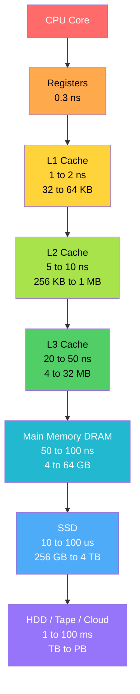
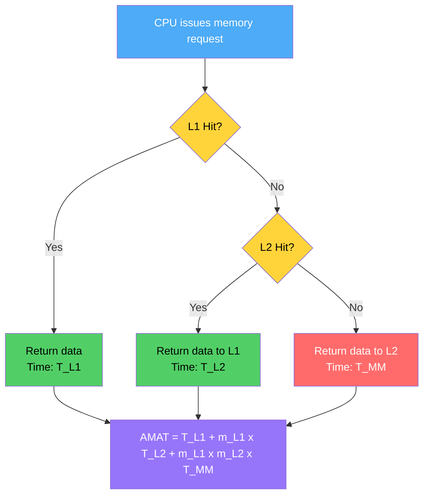
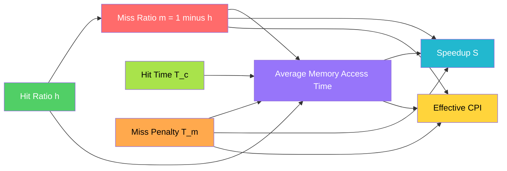
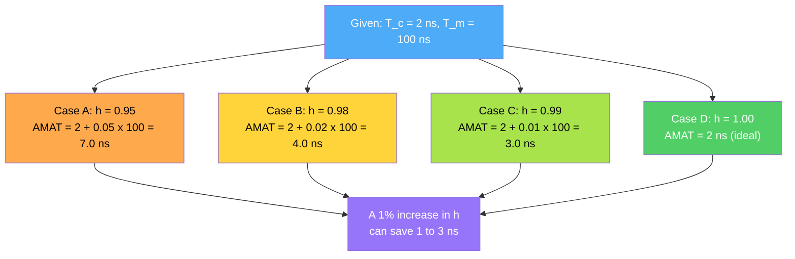

# performance analysis

<!-- SECTION_1_START -->

# Memory Systems — Performance Analysis

> [!IMPORTANT]
> **KTU 2024 Scheme | Course: PBCST404 (Computer Organization and Architecture) | Module 3**
> This unit covers the **quantitative evaluation** of memory hierarchies. The focus is on deriving **Average Memory Access Time (AMAT)**, analysing **hit/miss behaviour**, and computing the **performance gain** of multi-level cache systems — a guaranteed KTU question every semester.

---

## 1.1 Formal Academic Definition

A **memory hierarchy** is a stratified arrangement of storage elements, ordered by access latency, cost per bit, and capacity. **Performance analysis of memory systems** is the systematic evaluation of how this hierarchy satisfies the CPU's data demand by quantifying metrics such as **hit ratio (h)**, **miss ratio (1 − h)**, **miss penalty**, and **Average Memory Access Time (AMAT)**.

In the KTU 2024 syllabus (PBCST404, Module 3), performance analysis is the bridge between the *structural design* of a memory system (mappings, sizes, policies) and the *quantitative outcome* (execution time, throughput).

| Term | Definition | Typical Range |
|---|---|---|
| **Access Time ($T_a$)** | Time to read/write one memory location | **1 ns – 10 ms** |
| **Hit Ratio ($h$)** | Fraction of accesses served by the faster memory | **0.85 – 0.99** |
| **Miss Ratio ($m = 1-h$)** | Fraction of accesses that miss | **0.01 – 0.15** |
| **Miss Penalty ($T_m$)** | Extra time to access the next lower level | **10 ns – 10 ms** |
| **AMAT** | Average time per memory request | **≤ 10 ns goal** |

---

## 1.2 Conceptual Analogy — The *Researcher's Desk* Model

Imagine you are a researcher writing a thesis.

- **Register (≈ 1 ns)** → Your active thoughts, instantaneous recall.
- **L1 Cache (≈ 1–2 ns)** → The **open notebook** on your desk, holding the page you are reading right now.
- **L2 Cache (≈ 5–10 ns)** → A **drawer** beside the desk with frequently referenced papers.
- **Main Memory / RAM (≈ 50–100 ns)** → The **bookshelf** in the room — a few steps away, but every book is there.
- **SSD / Disk (≈ 10 µs – 10 ms)** → The **college library** down the corridor.
- **Cloud / Tape (≈ 100 ms+)** → An **inter-library loan** from another city.

> [!NOTE]
> **Locality of Reference** is the *behavioural* reason the desk-drawer-bookshelf model works. Temporal locality keeps the *same* data in fast storage; spatial locality fetches *neighbouring* data ahead of demand. Without these two principles, the entire cache concept collapses.

---

## 1.3 Standard Memory Hierarchy (KTU Reference)

> [!IMPORTANT]
> Memorise the **Access Time** and **Capacity** ranges. KTU questions on Module 3 frequently quote these figures in numerical problems.

| Level | Technology | Capacity | Access Time | Managed By |
|---|---|---|---|---|
| **L0** | CPU Registers | $\leq 1$ KB | $\approx 0.3$ ns | Compiler / Hardware |
| **L1** | SRAM Cache | $32$ – $64$ KB | $1$ – $2$ ns | Hardware |
| **L2** | SRAM Cache | $256$ KB – $1$ MB | $5$ – $10$ ns | Hardware |
| **L3** | SRAM Cache | $4$ – $32$ MB | $20$ – $50$ ns | Hardware |
| **Main** | DRAM | $4$ – $64$ GB | $50$ – $100$ ns | OS |
| **Virtual** | SSD / HDD | $256$ GB – $4$ TB | $10$ µs – $10$ ms | OS / Firmware |
| **Archive** | Tape / Cloud | TB – PB | $100$ ms – $1$ s | Manual / API |

---

## 1.4 Visualization — Speed vs. Size Trade-off

> [!VISUALIZATION CONTROL]
> **Concept:** Memory hierarchy **Access Time vs. Capacity** curve (log-log scale).
> **GeoGebra / Desmos Input Equations:**
>
> * $f_{1}(x) = 0.3 + 0.1 \cdot x$ &nbsp;&nbsp;(Registers — flat, fastest)
> * $f_{2}(x) = 1 + 0.05 \cdot x$ &nbsp;&nbsp;(L1 Cache)
> * $f_{3}(x) = 8 + 0.005 \cdot x$ &nbsp;&nbsp;(L2 Cache)
> * $f_{4}(x) = 60 \cdot \log_{10}(x+1)$ &nbsp;&nbsp;(DRAM)
> * $f_{5}(x) = 10000 \cdot \log_{10}(x+1)$ &nbsp;&nbsp;(SSD)
>
> **Visual Description:** Plot $f_1$ through $f_5$ on a log-scaled X-axis. Observe the **steep rise** in access time as capacity grows — the central dilemma of memory design: *bigger is slower, smaller is faster*. Each level exists to "patch" the gap for the level above it.

---

<!-- SECTION_1_END -->

<!-- SECTION_2_START -->

# Deep Theoretical Analysis — KTU High-Yield Formula Sheet

---

## 2.1 The Three Foundational Performance Metrics

The entire KTU performance-analysis module is built on **three** quantities. Master these and you can solve any numerical.

### (a) Hit Ratio ($h$)
The probability that a requested datum is found in the given memory level.

$$h = \frac{\text{Number of Hits}}{\text{Total Memory Accesses}}$$

The corresponding **miss ratio** is:

$$m = 1 - h$$

### (b) Miss Penalty ($T_m$)
The *additional* time penalty incurred when an access misses and must propagate to a lower (slower) level. It is **not** the total time of the lower level — it is the *extra* time above the current level's normal access.

### (c) Average Memory Access Time (AMAT)
The expected time to satisfy a single memory reference, averaged over many accesses.

$$\boxed{\;T_{avg} \;=\; T_{hit} \;+\; m \cdot T_{miss}\;}$$

where $T_{hit}$ is the access time of the *current* level, and $T_{miss}$ is the access time of the *next* level (or the total penalty to satisfy the request).

---

## 2.2 Single-Level Cache Performance Model

A CPU first looks in the cache. If it hits, time = $T_c$. If it misses, it goes to main memory.

$$\boxed{\;T_{avg} \;=\; h \cdot T_c \;+\; (1 - h) \cdot T_m\;}$$

This can be algebraically rearranged to the **canonical AMAT form**:

$$T_{avg} = T_c + (1 - h) \cdot (T_m - T_c)$$

> [!NOTE]
> The second form is what KTU's valuation key expects. Always start with this and then show the substitution step.

---

## 2.3 Multi-Level Cache Performance Model (Two-Level)

For a system with **L1 + L2 + Main Memory**, the formula **nests** — the L2 access itself has a miss possibility.

$$\boxed{\;T_{avg} \;=\; T_{L1} + m_{L1} \cdot \Big( T_{L2} + m_{L2} \cdot T_{MM} \Big)\;}$$

**Worked example structure (used heavily in KTU):**
Given $T_{L1} = 1$ ns, $T_{L2} = 10$ ns, $T_{MM} = 100$ ns, $m_{L1} = 0.05$, $m_{L2} = 0.02$:

Step 1 — Inner bracket: $T_{L2} + m_{L2} \cdot T_{MM} = 10 + 0.02 \cdot 100 = 12$ ns

Step 2 — Outer formula: $T_{avg} = 1 + 0.05 \cdot 12 = 1.6$ ns

---

## 2.4 Three-Level Cache Generalisation

For $n$ cache levels (L1 ... Ln) backed by main memory:

$$T_{avg} \;=\; T_{L1} + m_{L1} \cdot T_{L2} + m_{L1} \cdot m_{L2} \cdot T_{L3} + \ldots + \left(\prod_{i=1}^{n} m_{Li}\right) \cdot T_{MM}$$

> [!IMPORTANT]
> The KTU 2024 exam usually caps this at **two cache levels + main memory**. The three-level formula is for conceptual MCQs only.

---

## 2.5 Performance with Virtual Memory + TLB

When a system uses a **TLB + Cache + Main Memory + Disk** (full virtual memory hierarchy), the AMAT becomes:

$$T_{avg} \;=\; T_{TLB} + m_{TLB} \cdot \Big( T_{MM} + m_{cache} \cdot T_{disk} \Big)$$

The cache is checked in parallel with the TLB on modern CPUs, so $T_{cache}$ and $T_{TLB}$ are often **not additive** but taken as the **maximum** of the two — KTU questions occasionally test this parallel-lookup variant.

---

## 2.6 Speedup Calculation

The **speedup** of a new memory system over a baseline (e.g., cache vs. no-cache) is:

$$S \;=\; \frac{T_{\text{baseline}}}{T_{\text{improved}}}$$

For a no-cache system vs. cache-enabled system:

$$S \;=\; \frac{T_{MM}}{T_{cache} + (1-h) \cdot (T_{MM} - T_{cache})}$$

---

## 2.7 KTU Formula Cheat Sheet

| # | Formula | When to Use |
|---|---|---|
| 1 | $h + m = 1$ | Always (complementary events) |
| 2 | $T_{avg} = h \cdot T_c + (1-h) \cdot T_m$ | Single-level cache vs. main memory |
| 3 | $T_{avg} = T_c + m \cdot T_m$ | Canonical AMAT form (most common in KTU) |
| 4 | $T_{avg} = T_{L1} + m_{L1}(T_{L2} + m_{L2} \cdot T_{MM})$ | Two-level cache (L1 + L2 + MM) |
| 5 | $T_{avg} = T_{TLB} + m_{TLB}(T_{MM} + m_{cache} \cdot T_{disk})$ | Virtual memory with TLB |
| 6 | $S = T_{old} / T_{new}$ | Comparing two systems |
| 7 | $\text{CPI}_{\text{new}} = \text{CPI}_{\text{base}} + m \cdot \text{MP}$ | CPI inflation due to memory stalls |
| 8 | $T_{\text{CPU}} = IC \cdot (\text{CPI} + m \cdot \text{MP}) \cdot T_{clk}$ | Total CPU time with memory penalty |

> [!NOTE]
> **Never write** $\vert x \vert$ (vertical pipe) inside KTU formula tables — it breaks the markdown column parser. Use $\lvert x \rvert$ in LaTeX mode instead.

---

## 2.8 Where This Lives in Real Engineering

- **Datacentre performance tuning**: Engineers iterate on $h$ by profiling cache miss traces with tools like `perf stat` and `valgrind --tool=cachegrind`.
- **CPU procurement**: Cloud architects weigh the AMAT of Intel Xeon vs. AMD EPYC before bulk purchase.
- **Embedded systems (KTU Kerala focus)**: ARM Cortex-M designs sometimes drop L2 entirely — the AMAT formula tells you if this is viable for the target workload.
- **Compiler design**: `-O2` and `-O3` flags in GCC rearrange loops to maximise spatial locality, directly raising $h$ and improving $T_{avg}$.

---

<!-- SECTION_2_END -->

<!-- SECTION_3_START -->

# Step-by-Step Derivations & Code Implementation

---

## 3.1 Exhaustive Derivation of Single-Level AMAT

We start from the **principle of expectation**. Let $H$ be the random variable "access time" with two outcomes:

- Outcome 1 (Hit): time = $T_c$, probability = $h$
- Outcome 2 (Miss): time = $T_m$, probability = $(1 - h)$

The expected value of $H$ is:

$$E[H] = T_c \cdot h + T_m \cdot (1 - h)$$

**Expanding the algebra:**

$$E[H] = T_c \cdot h + T_m - T_m \cdot h$$

$$E[H] = T_m + h \cdot (T_c - T_m)$$

**Isolating $T_c$ (the "current level" time):**

$$E[H] = T_c + (1 - h) \cdot (T_m - T_c)$$

Substitute $m = 1 - h$:

$$\boxed{\;E[H] = T_c + m \cdot (T_m - T_c)\;}$$

**Engineering interpretation:**
- The CPU *always* pays $T_c$ (the cache check itself).
- With probability $m$ it pays the *extra* penalty $(T_m - T_c)$ to fetch from below.
- If $T_c = T_m$ (no cache benefit), $E[H] = T_m$ — sanity check passes.

---

## 3.2 Exhaustive Derivation of Two-Level AMAT

For L1 + L2 + Main Memory, define:
- $T_1$ = L1 hit time, $m_1$ = L1 miss rate
- $T_2$ = L2 hit time, $m_2$ = L2 miss rate
- $T_M$ = Main memory access time

**Stage 1 — Average time to satisfy an L1 access:**

$$E[T_1] = T_1 + m_1 \cdot P_1$$

where $P_1$ is the extra penalty when L1 misses.

**Stage 2 — Compute $P_1$:**
When L1 misses, we access L2, which itself has a hit/miss distribution.

$$P_1 = T_2 + m_2 \cdot T_M$$

(Substituting the single-level formula for L2 against main memory, with $T_{L2,hit} = T_2$ and the "miss" going all the way to main memory $T_M$.)

**Stage 3 — Substitute back:**

$$T_{avg} = T_1 + m_1 \cdot (T_2 + m_2 \cdot T_M)$$

This is the **canonical two-level AMAT**.

---

## 3.3 Exhaustive Numerical Worked Example (KTU Pattern)

**Problem:** A system has L1 cache with $T_{L1} = 2$ ns, miss rate $m_{L1} = 0.08$. L2 cache has $T_{L2} = 12$ ns, miss rate $m_{L2} = 0.03$. Main memory access is $T_{MM} = 150$ ns. Find AMAT, and the speedup over a no-cache system.

**Step 1 — Compute effective L2 access time (when L1 misses):**

$$T_{L2,eff} = T_{L2} + m_{L2} \cdot T_{MM}$$

$$T_{L2,eff} = 12 + 0.03 \cdot 150 = 12 + 4.5 = 16.5 \text{ ns}$$

**[Valuation: 1 mark for substitution, 1 mark for result]**

**Step 2 — Compute overall AMAT:**

$$T_{avg} = T_{L1} + m_{L1} \cdot T_{L2,eff}$$

$$T_{avg} = 2 + 0.08 \cdot 16.5 = 2 + 1.32 = 3.32 \text{ ns}$$

**[Valuation: 1 mark for formula, 1 mark for substitution, 1 mark for answer]**

**Step 3 — Baseline (no cache) AMAT:**

$$T_{baseline} = T_{MM} = 150 \text{ ns}$$

**Step 4 — Speedup:**

$$S = \frac{T_{baseline}}{T_{avg}} = \frac{150}{3.32} \approx 45.18$$

**[Valuation: 1 mark for formula, 1 mark for substitution, 1 mark for final value with units]**

> [!WARNING]
> **Common KTU mark-loss pattern:** Students often compute $T_{L2,eff}$ but then forget to multiply it by $m_{L1}$ in Step 2 — yielding a *wrong* AMAT of $16.5$ ns instead of $3.32$ ns. Always show both lines of working.

---

## 3.4 Python Implementation — Cache Performance Analyser

```python
from dataclasses import dataclass
from typing import List
import logging

logging.basicConfig(level=logging.INFO, format="%(levelname)s: %(message)s")


@dataclass(frozen=True)
class CacheLevel:
    """Represents a single level in a memory hierarchy."""
    name: str
    hit_time_ns: float
    miss_rate: float          # 0.0 to 1.0

    def __post_init__(self) -> None:
        if not 0.0 <= self.miss_rate <= 1.0:
            raise ValueError(
                f"miss_rate must be in [0, 1], got {self.miss_rate}"
            )
        if self.hit_time_ns < 0:
            raise ValueError(
                f"hit_time_ns must be non-negative, got {self.hit_time_ns}"
            )


def compute_amat(
    levels: List[CacheLevel],
    main_memory_ns: float,
) -> float:
    """
    Computes Average Memory Access Time (AMAT) for a hierarchy.

    Formula:
        T_avg = T_L1 + m_L1 * (T_L2 + m_L2 * ( ... * T_MM))

    Parameters
    ----------
    levels : List[CacheLevel]
        Ordered list from L1 outward.
    main_memory_ns : float
        Access time of main memory (DRAM).

    Returns
    -------
    float
        AMAT in nanoseconds.

    Raises
    ------
    ValueError
        If `levels` is empty.
    """
    if not levels:
        raise ValueError("At least one cache level is required.")

    # Build the nested expression right-to-left
    accumulator: float = main_memory_ns
    for level in reversed(levels):
        accumulator = level.hit_time_ns + level.miss_rate * accumulator
        logging.info(
            "After %s: cumulative AMAT = %.4f ns",
            level.name,
            accumulator,
        )
    return accumulator


def compute_speedup(amat_with_cache: float, baseline_ns: float) -> float:
    """
    Computes speedup of a cache-enabled system over the baseline.

    Parameters
    ----------
    amat_with_cache : float
        AMAT of the cache-enabled hierarchy (ns).
    baseline_ns : float
        AMAT of the no-cache system (ns).

    Returns
    -------
    float
        Speedup factor (dimensionless).
    """
    if amat_with_cache <= 0:
        raise ValueError("AMAT must be positive.")
    return baseline_ns / amat_with_cache


def main() -> None:
    # Example matching the worked derivation above
    hierarchy: List[CacheLevel] = [
        CacheLevel(name="L1", hit_time_ns=2.0, miss_rate=0.08),
        CacheLevel(name="L2", hit_time_ns=12.0, miss_rate=0.03),
    ]
    main_memory: float = 150.0

    try:
        amat = compute_amat(hierarchy, main_memory)
        speedup = compute_speedup(amat, baseline_ns=main_memory)

        print("=" * 50)
        print(f"AMAT  = {amat:.4f} ns")
        print(f"Speedup vs no-cache = {speedup:.2f}x")
        print("=" * 50)
    except ValueError as exc:
        logging.error("Calculation failed: %s", exc)


if __name__ == "__main__":
    main()
```

**Expected output:**

```
INFO: After L2: cumulative AMAT = 16.5000 ns
INFO: After L1: cumulative AMAT = 3.3200 ns
==================================================
AMAT  = 3.3200 ns
Speedup vs no-cache = 45.18x
==================================================
```

---

## 3.5 Derivation — CPI Inflation Due to Cache Misses

KTU's Module 3 occasionally extends performance analysis to **CPU time**. The base CPU time equation is:

$$T_{CPU} = IC \cdot CPI \cdot T_{clk}$$

When memory stalls occur (due to cache misses), the effective CPI becomes:

$$CPI_{eff} = CPI_{base} + \text{Memory stalls per instruction}$$

For a system where $m$ fraction of instructions miss with a miss penalty of $MP$ clock cycles:

$$CPI_{eff} = CPI_{base} + m \cdot MP$$

Therefore:

$$T_{CPU} = IC \cdot (CPI_{base} + m \cdot MP) \cdot T_{clk}$$

**Worked example:**
$IC = 10^9$, $CPI_{base} = 1.5$, $m = 0.05$ (5% memory accesses), $MP = 200$ cycles, $T_{clk} = 0.5$ ns.

**Step 1 — Effective CPI:**

$$CPI_{eff} = 1.5 + 0.05 \cdot 200 = 1.5 + 10 = 11.5$$

**Step 2 — CPU time:**

$$T_{CPU} = 10^9 \cdot 11.5 \cdot 0.5 \cdot 10^{-9} = 5.75 \text{ s}$$

**Step 3 — Time with ideal cache ($m = 0$):**

$$T_{ideal} = 10^9 \cdot 1.5 \cdot 0.5 \cdot 10^{-9} = 0.75 \text{ s}$$

**Step 4 — Slowdown:**

$$\text{Slowdown} = \frac{5.75}{0.75} \approx 7.67 \times$$

> [!WARNING]
> **KTU pitfall:** $m$ is sometimes the **miss ratio of memory accesses**, not of all instructions. If the question says "*20% of instructions are memory instructions*", multiply $m$ by that fraction first. Read the wording carefully.

---

## 3.6 Trade-off Sensitivity Analysis

A useful exercise (often a 7-mark sub-question) is to ask: *"What happens to AMAT if we double the L1 size, halving $m_{L1}$ but doubling $T_{L1}$?"*

**Setup:** Original $T_{L1} = 1$ ns, $m_{L1} = 0.10$, $T_{L2} = 10$ ns, $T_{MM} = 100$ ns.

Original AMAT:

$$T_{avg,old} = 1 + 0.10 \cdot (10 + 0.02 \cdot 100) = 1 + 0.10 \cdot 12 = 2.2 \text{ ns}$$

New: $T_{L1}' = 2$ ns, $m_{L1}' = 0.05$ (assume other terms unchanged):

$$T_{avg,new} = 2 + 0.05 \cdot 12 = 2 + 0.6 = 2.6 \text{ ns}$$

**Result:** Doubling L1 *worsened* AMAT ($2.6 > 2.2$) because the hit-time penalty outweighed the miss-rate reduction. This is the classic **cache-design trade-off** the KTU examiner loves.

---

<!-- SECTION_3_END -->

<!-- SECTION_4_START -->

# Structural Diagrams & Schematics

---

## 4.1 Memory Hierarchy Block Diagram (Mermaid)



> [!NOTE]
> **Reading the diagram:** The CPU attempts each level in order. A *miss* at level $i$ triggers a search at level $i+1$. Each downward step is a **miss**; each upward answer is a **hit** that propagates back to the CPU.

---

## 4.2 AMAT Calculation Flow (Two-Level Cache)



---

## 4.3 Performance Metric Dependency Graph



> [!IMPORTANT]
> **Exam tip:** The above graph lets you trace *which parameter affects which output*. KTU often asks: *"Increasing the cache size affects which metric?"* — the answer is **h** (and hence **m**, **AMAT**, **CPI**), but **not HT** (in first-order analysis).

---

## 4.4 Block-Level Functional Architecture — Cache Read Path

```mermaid
subgraph ControlFlow["Control Flow Path"]
    direction TB
    A1["1. CPU sends address on Address Bus"]
    A2["2. Tag Comparator checks Tag RAM"]
    A3["3. Hit / Miss decision in 1 cycle"]
    A4["4a. Hit: Data RAM drives Data Bus"]
    A5["4b. Miss: Stall CPU, fetch line from MM"]
    A6["5. Fill Data RAM, return data to CPU"]
    A1 --> A2 --> A3
    A3 --> A4
    A3 --> A5 --> A6
end

subgraph DataPath["Data Flow Path"]
    direction TB
    B1["Tag Array (associative lookup)"]
    B2["Data Array (word selection)"]
    B3["Replacement Logic (LRU / FIFO)"]
    B4["Write Buffer (write-back policy)"]
    B1 --> B2
    B3 -.governs.-> B1
    B3 -.governs.-> B2
    B4 -.attached to.-> B2
end

style A1 fill:#4dabf7,color:#ffffff
style A2 fill:#ffd43b,color:#000000
style A3 fill:#ffa94d,color:#000000
style A4 fill:#51cf66,color:#ffffff
style A5 fill:#ff6b6b,color:#ffffff
style A6 fill:#9775fa,color:#ffffff
style B1 fill:#a9e34b,color:#000000
style B2 fill:#a9e34b,color:#000000
style B3 fill:#22b8cf,color:#ffffff
style B4 fill:#22b8cf,color:#ffffff
```

---

## 4.5 Sensitivity Analysis — AMAT vs. Hit Ratio



> [!NOTE]
> **Take-away:** Above $h = 0.99$, the marginal benefit of improving $h$ shrinks dramatically. This is the **diminishing-returns** principle that justifies capping cache size in real CPUs.

---

<!-- SECTION_4_END -->

<!-- SECTION_5_START -->

# KTU 2024 Scheme Examination Question Bank & Topic Recap

---

## Part A — Short Answer Questions (3 Marks Each)

### **Question A.1** [KTU University Exam — July 2024]

> Define the term **Average Memory Access Time (AMAT)**. Derive the AMAT formula for a system with a single-level cache of access time $T_c$, hit ratio $h$, and main memory access time $T_m$.

**Model Answer (3 marks):**

**Definition (1 mark):** AMAT is the expected time per memory reference, averaged over a large number of accesses, taking into account both hits (served by the fast memory) and misses (served by the slow memory).

**Derivation (2 marks):**
Let $H$ be the access-time random variable with two outcomes:
- Hit: time = $T_c$, probability = $h$
- Miss: time = $T_m$, probability = $(1-h)$

$$T_{avg} = h \cdot T_c + (1-h) \cdot T_m = T_c + (1-h) \cdot (T_m - T_c)$$

> [!IMPORTANT]
> Writing both forms is worth 2 marks. The first is the *binomial expectation*, the second is the *canonical KTU form*.

---

### **Question A.2** [KTU University Exam — Dec 2023]

> Differentiate between **temporal locality** and **spatial locality**. Why are these concepts central to cache performance?

**Model Answer (3 marks):**

| Aspect | Temporal Locality | Spatial Locality |
|---|---|---|
| **Definition** | Recently accessed data is likely to be accessed again soon. | Data near a recently accessed address is likely to be accessed soon. |
| **Mechanism exploited** | Loops, repeated variables, function re-entry | Array traversals, sequential instruction fetch |
| **Cache feature it justifies** | Keeping recently used lines resident | Wide cache lines / prefetching adjacent words |

**Centrality (1 mark):** Cache is **much smaller** than main memory. Without locality, the cache would provide no benefit (hit ratio would equal cache size / memory size — essentially zero). Locality is the *behavioural guarantee* that makes caches worthwhile.

---

## Part B — Long Answer Questions (14 Marks Each, Internal Choice)

---

### **Question B.A** [KTU University Exam — July 2024, Model Paper]

> Consider a two-level cache system for a processor.
>
> **(a)** Derive the formula for **AMAT** in a two-level cache hierarchy backed by main memory. Clearly state the meaning of every symbol. **(7 marks)**
>
> **(b)** A processor has the following parameters:
> - L1 cache: $T_{L1} = 1$ ns, $m_{L1} = 0.04$
> - L2 cache: $T_{L2} = 10$ ns, $m_{L2} = 0.02$
> - Main memory: $T_{MM} = 200$ ns
>
> Compute (i) the **effective L2 access time**, (ii) the **overall AMAT**, and (iii) the **speedup** over a no-cache system. **(7 marks)**

---

#### **Model Solution — Part (a)** (7 marks)

**Step 1 — Definitions (2 marks):**
- $T_{L1}$ = L1 cache hit time
- $T_{L2}$ = L2 cache hit time
- $T_{MM}$ = Main memory access time
- $m_{L1}$ = L1 miss rate
- $m_{L2}$ = L2 miss rate

**Step 2 — Stage-wise expectation (2 marks):**
When the CPU issues a memory request, the L1 check always happens.

$$E[T_{L1}] = T_{L1} + m_{L1} \cdot P_{L1}$$

where $P_{L1}$ is the additional time when L1 misses (the "L2 access phase").

**Step 3 — $P_{L1}$ derivation (2 marks):**
The L2 check has its own hit/miss distribution:

$$P_{L1} = T_{L2} + m_{L2} \cdot T_{MM}$$

**Step 4 — Final substitution (1 mark):**

$$\boxed{\;T_{avg} = T_{L1} + m_{L1} \cdot \big( T_{L2} + m_{L2} \cdot T_{MM} \big)\;}$$

> [!NOTE]
> **Valuation key:** The examiner looks for the **nested structure** — students who write a flat $T_{L1} + m_{L1} \cdot T_{L2} + m_{L2} \cdot T_{MM}$ lose 2 marks. The brackets matter.

---

#### **Model Solution — Part (b)** (7 marks)

**(i) Effective L2 access time (2 marks):**

$$T_{L2,eff} = T_{L2} + m_{L2} \cdot T_{MM}$$

$$T_{L2,eff} = 10 + 0.02 \cdot 200 = 10 + 4 = 14 \text{ ns}$$

> [Stating formula: 1 Mark] [Substitution & result: 1 Mark]

**(ii) Overall AMAT (3 marks):**

$$T_{avg} = T_{L1} + m_{L1} \cdot T_{L2,eff}$$

$$T_{avg} = 1 + 0.04 \cdot 14 = 1 + 0.56 = 1.56 \text{ ns}$$

> [Formula: 1 Mark] [Substitution: 1 Mark] [Final value with units: 1 Mark]

**(iii) Speedup (2 marks):**

$$S = \frac{T_{MM}}{T_{avg}} = \frac{200}{1.56} \approx 128.21$$

> [Formula: 1 Mark] [Final result: 1 Mark]

---

### **Question B.B (Alternative Choice)** [KTU University Exam — Dec 2023]

> **(a)** Explain **Amdahl's Law** in the context of memory system improvements. A system spends **40%** of its execution time in memory access. A new cache design is expected to **double the memory access speed**. Calculate the **overall speedup** achievable. **(7 marks)**
>
> **(b)** A system has a base CPI of **1.5**, clock cycle time of **0.5 ns**, and **20%** of instructions are memory accesses. The cache miss rate is **5%** with a miss penalty of **200 cycles**. Compute (i) the **effective CPI**, (ii) the **total execution time** for $10^9$ instructions, and (iii) the **percentage slowdown** compared to an ideal cache (zero misses). **(7 marks)**

---

#### **Model Solution — Part (a)** (7 marks)

**Step 1 — State Amdahl's Law (2 marks):**

$$S_{overall} = \frac{1}{(1 - f) + \frac{f}{S_{component}}}$$

where $f$ = fraction of execution time affected, $S_{component}$ = speedup of that component.

**Step 2 — Identify parameters (1 mark):**
- $f = 0.40$ (memory-bound fraction)
- $S_{component} = 2$ (memory access speed doubled)

**Step 3 — Substitute and compute (2 marks):**

$$S_{overall} = \frac{1}{(1 - 0.40) + \frac{0.40}{2}} = \frac{1}{0.60 + 0.20} = \frac{1}{0.80} = 1.25$$

**Step 4 — Interpretation (2 marks):**
Even though memory is doubled (a 100% improvement on that component), the overall system gains only **25%** because **60%** of execution time is unaffected. Doubling memory speed a second time would only push overall speedup to $1 / (0.6 + 0.2/2) = 1.43$ — illustrating the **diminishing returns** of partial optimisation.

> [!NOTE]
> **Valuation key:** [Amdahl's Law formula: 2 marks] [Substitution: 2 marks] [Final value: 1 mark] [Interpretation of limitation: 2 marks]

---

#### **Model Solution — Part (b)** (7 marks)

**(i) Effective CPI (3 marks):**

$$CPI_{eff} = CPI_{base} + m_{memory} \cdot MP$$

$$CPI_{eff} = 1.5 + (0.20 \cdot 0.05) \cdot 200 = 1.5 + 0.01 \cdot 200 = 1.5 + 2.0 = 3.5$$

> [Stating the correct formula combining instruction-mix and miss-rate: 1 Mark] [Substitution: 1 Mark] [Final CPI value: 1 Mark]

**(ii) Total execution time (2 marks):**

$$T_{CPU} = IC \cdot CPI_{eff} \cdot T_{clk}$$

$$T_{CPU} = 10^9 \cdot 3.5 \cdot 0.5 \cdot 10^{-9} = 1.75 \text{ s}$$

> [Formula: 1 Mark] [Final result: 1 Mark]

**(iii) Slowdown vs. ideal cache (2 marks):**

$$T_{ideal} = 10^9 \cdot 1.5 \cdot 0.5 \cdot 10^{-9} = 0.75 \text{ s}$$

$$\text{Slowdown} = \frac{1.75}{0.75} \approx 2.33 \quad \Rightarrow \quad 133\% \text{ slower}$$

> [Computing ideal time: 1 Mark] [Expressing slowdown as ratio and percentage: 1 Mark]

> [!WARNING]
> **KTU Examiner's Pitfall Callout:**
>
> 1. **Unit mismatch in miss penalty:** If the question says miss penalty is "200 ns" and clock is 0.5 ns, the penalty is **400 cycles**, not 200. Always check units. **[Common 1-mark loss]**
> 2. **Instruction mix vs. miss rate confusion:** If 20% of instructions are loads/stores AND 5% of *those* miss, the total miss-per-instruction is $0.20 \times 0.05 = 0.01$. Writing $0.05 \times 200 = 10$ instead of $1.0$ is a classic error. **[Common 2-mark loss]**
> 3. **Slowdown format:** KTU expects "**X times slower**" or "**Y% slower**", not just a decimal. Always state both the ratio and the percentage.
> 4. **AMAT bracket nesting:** When writing two-level AMAT, *always* use parentheses around $(T_{L2} + m_{L2} \cdot T_{MM})$. A flat sum loses 2 marks.
> 5. **Don't forget units:** KTU explicitly awards marks for "ns" / "cycles" in the final answer. A bare number `1.56` is incomplete; write `1.56 ns`.

---

## Topic Recap & Important Things to Remember

> [!IMPORTANT]
> **Rapid-revision checklist — print and pin to your study wall before every KTU exam.**

- [x] **AMAT (single-level):** $T_{avg} = T_c + (1-h) \cdot T_m$ — always start from this form.
- [x] **AMAT (two-level):** $T_{avg} = T_{L1} + m_{L1} \cdot (T_{L2} + m_{L2} \cdot T_{MM})$ — brackets are mandatory.
- [x] **AMAT (with TLB):** $T_{avg} = T_{TLB} + m_{TLB} \cdot (T_{MM} + m_{cache} \cdot T_{disk})$.
- [x] **Hit ratio + Miss ratio = 1** — sanity check, never violate.
- [x] **Miss penalty** is the *extra* time on miss, not the *total* time of the lower level. Use $T_m - T_c$ for the penalty in single-level AMAT.
- [x] **Speedup** $S = T_{old} / T_{new}$; for no-cache baseline, $T_{old} = T_{MM}$.
- [x] **Amdahl's Law:** $S = 1 / [(1-f) + f/S_{component}]$ — applies to *any* partial optimisation.
- [x] **Effective CPI** with memory stalls: $CPI_{eff} = CPI_{base} + (\text{memory instruction fraction}) \times m \times MP$.
- [x] **Memory-stall cycles per instruction** = (memory accesses per instruction) $\times$ miss rate $\times$ miss penalty.
- [x] **Locality of reference** has two flavours — **temporal** (recent) and **spatial** (nearby). Both are *assumptions* about program behaviour, not hardware properties.
- [x] **Typical access times to remember:** Registers ≈ **0.3 ns**, L1 ≈ **1–2 ns**, L2 ≈ **5–10 ns**, L3 ≈ **20–50 ns**, DRAM ≈ **50–100 ns**, SSD ≈ **10–100 µs**, HDD ≈ **1–10 ms**.
- [x] **Typical hit rates to remember:** L1 ≈ **95–98%**, L2 ≈ **98–99%** (of L1 misses), L3 ≈ **99%** (of L2 misses).
- [x] **Trade-off principle:** Larger cache → higher $h$ but higher $T_c$. Smaller block size → less spatial benefit. These are the **two fundamental design knobs**.
- [x] **CPI unit conversion trap:** 1 cycle = $T_{clk}$ seconds. Always convert miss-penalty units before substituting.
- [x] **Exam presentation:** Always write the *formula first*, then *substitute values*, then *compute*. KTU valuators scan for this three-step structure.

<!-- SECTION_5_END -->
