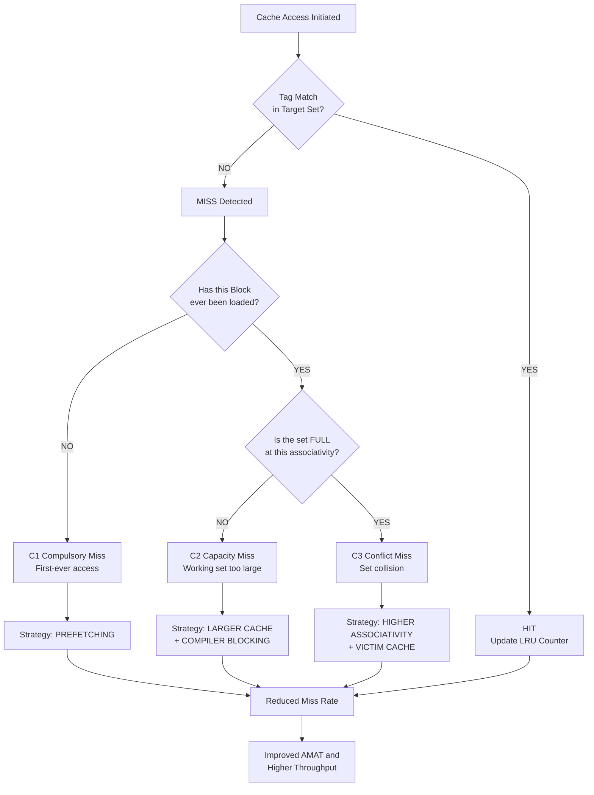
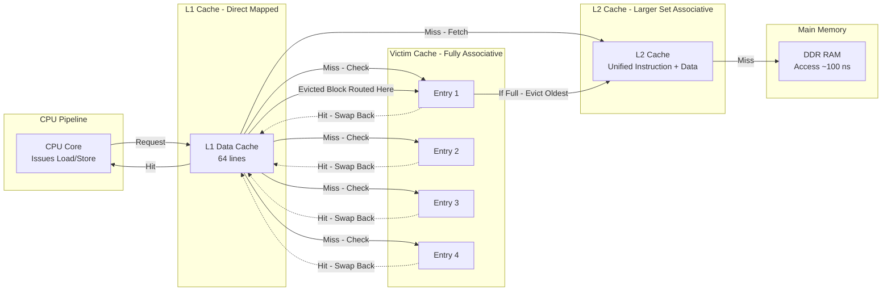
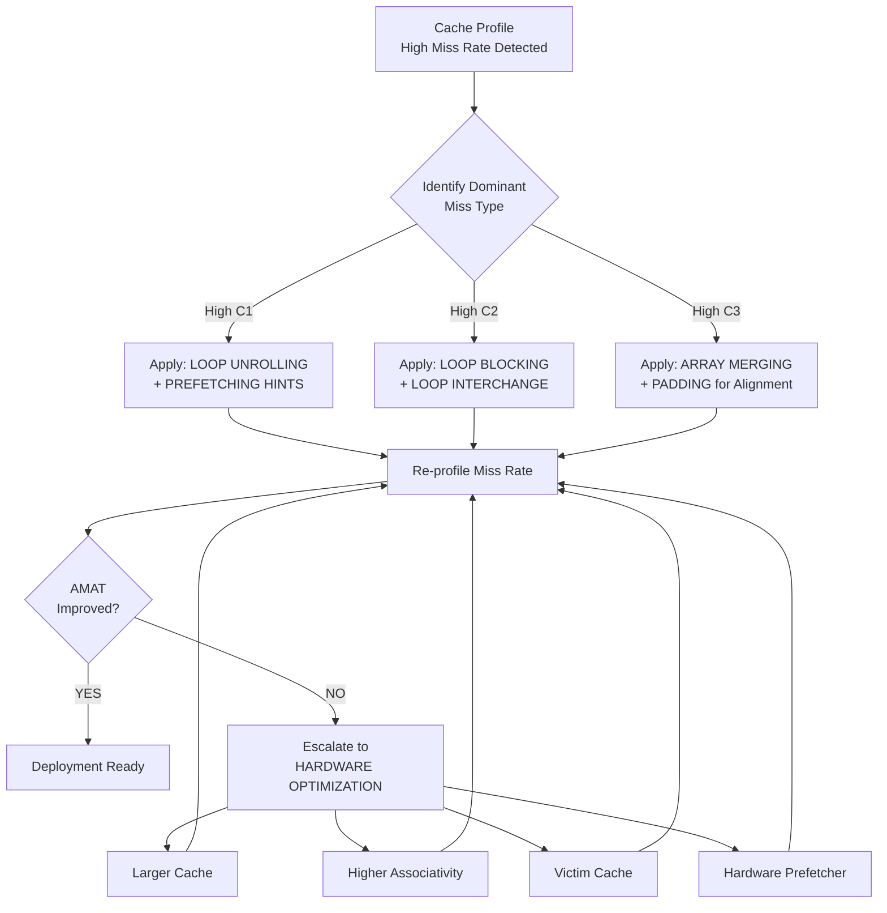
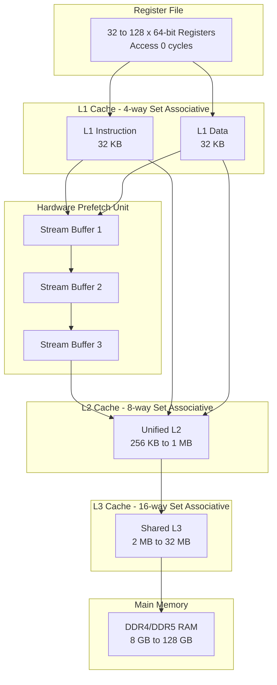

# Reducing Miss Rate

<!-- SECTION_1_START -->
# Reducing Miss Rate in Cache Memory Systems

## 1.1 Formal Academic Definition (KTU 2024 Syllabus Terminology)

> [!IMPORTANT]
> **Miss Rate** is formally defined as the fraction of memory accesses that are **not found** in the cache memory, forcing the processor to retrieve the required data/instruction from the next level of the memory hierarchy (main memory / RAM). It is mathematically expressed as:
>
> $$\text{Miss Rate} = \dfrac{\text{Number of Cache Misses}}{\text{Total Number of Memory Accesses}} = 1 - \text{Hit Rate}$$

In the **KTU 2024 Scheme** framework for *Computer Organization and Architecture (PBCST404)*, Module 3 (Memory Systems) requires students to master the **Average Memory Access Time (AMAT)** equation, which fundamentally depends on optimizing the miss rate:

$$\text{AMAT} = \text{Hit Time} + \text{Miss Rate} \times \text{Miss Penalty}$$

Therefore, **reducing the miss rate directly reduces AMAT**, improving processor throughput. The standard benchmark target for an L1 cache miss rate is **between 2% to 10%**, while L2 caches typically target **0.1% to 2%**.

---

## 1.2 The Three C's Model — Classification of Cache Misses

> [!NOTE]
> **The 3 C's Model** (proposed by Mark Hill, 1987) is a classification scheme used to diagnose the *root cause* of every cache miss. It is essential for KTU board examinations because it allows an architect to map each miss type to a specific reduction strategy.

| Miss Type | Formal Name | Root Cause | KTU High-Yield Insight |
|:---------:|:-----------:|:----------:|:----------------------:|
| **C₁** | **Compulsory Miss** | First-ever access to a block (cold start) | Occurs on the *first reference*; cannot be avoided without prefetching |
| **C₂** | **Capacity Miss** | Cache is too small to hold all required blocks | Working set exceeds cache size; occurs in *fully associative* caches too |
| **C₃** | **Conflict Miss** | Multiple blocks map to the same set in a set-associative/direct-mapped cache | Eliminated by *fully associative* organization; also called *collision miss* |

> A **fourth C** is sometimes added: **Coherence Miss** (in multiprocessor systems due to cache coherency invalidations), but it is outside the KTU 2024 Module 3 scope.

---

## 1.3 Conceptual Analogy — The "Library Study Desk" Intuition

Imagine you are a student preparing for your KTU semester exams sitting at a small study desk:

* The **desk surface** = your **L1 cache** (small, ultra-fast, but limited space).
* The **bookshelf in your room** = your **L2 cache** (larger, slightly slower).
* The **central library** = your **Main Memory (RAM)**.
* The **inter-library loan / online repository** = your **Secondary Storage (SSD/HDD)**.

**Reducing the miss rate** is analogous to **keeping the right books on your desk** so that you rarely have to walk to the library.

* **Compulsory miss** = You simply have *never opened* that book before; the first time you pick it up, you must walk to the library. *Solution: Borrow books in advance (Prefetching).*
* **Capacity miss** = You have *too many* reference books open simultaneously and your desk is overflowing; some must be placed back on the shelf. *Solution: Use a larger desk (Bigger Cache) or a smarter filing system (Compiler Optimizations like blocking).*
* **Conflict miss** = You labeled two books with the same subject code (e.g., "DBMS") and the desk only has one slot for "DBMS", forcing a swap. *Solution: Use multiple slots per subject (Higher Associativity).*

> [!VISUALIZATION CONTROL]
> **Concept:** Three C's Miss Classification Distribution (Typical Bar Chart)
> **GeoGebra / Desmos Input Equations:**
> * Bar 1: `y = 0.05` (Compulsory — first 1000 accesses, label "C1")
> * Bar 2: `y = 0.03` (Capacity — working set > cache, label "C2")
> * Bar 3: `y = 0.04` (Conflict — set collisions, label "C3")
> **Visual Description:** Three vertical bars stacked/overlaid showing that conflict misses dominate in direct-mapped caches, while capacity misses dominate in fully associative caches when the workload is large.

---

## 1.4 Why Reducing Miss Rate Matters in KTU Examinations

> [!IMPORTANT]
> The KTU 2024 Scheme evaluates Module 3 questions at the **Apply** and **Analyze** cognitive levels. You are expected to:
> 1. Identify the type of cache miss given a memory trace (e.g., "Find the miss rate for a 2-way set-associative cache with 4 blocks using LRU").
> 2. Propose and justify a specific miss-rate reduction technique (e.g., "Suggest a technique to reduce capacity misses").
> 3. Calculate the **AMAT improvement** before and after applying a reduction technique.
> 4. Discuss **trade-offs** (e.g., "Does increasing block size always reduce miss rate? Why or why not?").
<!-- SECTION_1_END -->

<!-- SECTION_2_START -->
# Deep Theoretical Analysis & KTU High-Yield Formula Sheet

## 2.1 The Six Primary Miss-Rate Reduction Techniques

The KTU 2024 syllabus groups these into the following taxonomy. Each technique targets one or more of the 3 C's:

### Technique 1: Larger Block Size (Line Size)

* **Mechanism:** Each cache line stores more contiguous bytes (e.g., 16 B → 64 B → 128 B).
* **Targets:** Compulsory misses (C₁) — spatial locality exploitation.
* **Why it works:** Programs often access data sequentially; one miss fetches a large useful block.
* **Drawback:** *Pollution effect* — fetched but unused data wastes bandwidth and may evict useful lines, increasing **conflict (C₃)** and **capacity (C₂)** misses.
* **Optimal block size** depends on workload, but KTU problems typically use **16, 32, 64, or 128 bytes**.

> [!IMPORTANT]
> **KTU Examiner Insight:** A common trap question is *"Will doubling the block size always halve the miss rate?"* — The correct answer is **NO**, due to the pollution effect and increased miss penalty.

---

### Technique 2: Higher Associativity

* **Mechanism:** Increase the number of ways per set (1-way → 2-way → 4-way → 8-way → fully associative).
* **Targets:** Conflict misses (C₃).
* **Why it works:** More candidate locations per set → fewer collisions → fewer evictions.
* **Drawback:** Slower hit time (parallel tag comparison), higher hardware cost, and higher power consumption.
* **Golden Rule:** 8-way set-associative performs *almost identically* to fully associative for most workloads.

---

### Technique 3: Victim Cache

* **Mechanism:** A small, **fully associative** buffer (typically 4–16 entries) placed between the L1 cache and the next level. When a block is evicted from L1, it goes to the **victim cache** instead of being discarded.
* **Targets:** Conflict misses (C₃) in direct-mapped or low-associativity caches.
* **Why it works:** The victim cache acts as a "second chance" — if the evicted block is referenced again soon, it is found in the victim cache (a hit).
* **Origin:** Proposed by **Norman Jouppi (1990)**.

---

### Technique 4: Pseudo-Associativity (Column Associativity)

* **Mechanism:** Simulate N-way associativity using a *direct-mapped* cache. On a miss, the hardware checks an *alternative* tag location (different index bits) in the *next* cycle.
* **Targets:** Conflict misses (C₃).
* **Drawback:** Variable hit time (1 cycle for direct-mapped hit, 2 cycles for "second-chance" hit).

---

### Technique 5: Hardware Prefetching

* **Mechanism:** A prefetch engine anticipates future memory accesses and fetches blocks *before* the CPU requests them.
* **Subtypes:**
  * **Instruction Prefetching** — fetch the next sequential cache line.
  * **Data Prefetching** — stream buffers detect sequential access patterns.
  * **Stride Prefetching** — detect patterns like `A[i], A[i+stride], A[i+2*stride]…`.
* **Targets:** Compulsory misses (C₁) primarily; some capacity misses.
* **Drawback:** Prefetched but unused data can pollute the cache; can waste bandwidth.

---

### Technique 6: Compiler-Controlled Optimizations

* **Mechanism:** The compiler restructures code to improve cache locality *at the source level*.
* **Targets:** Capacity (C₂) and Conflict (C₃) misses.
* **Key Strategies (Must memorize for KTU):**

| Compiler Strategy | What It Does | Miss Type Reduced |
|:-----------------:|:------------:|:-----------------:|
| **Loop Interchange** | Swaps nested loop order to traverse memory in row-major order | Capacity (C₂) |
| **Loop Fusion** | Combines adjacent loops over the same range | Capacity (C₂) |
| **Blocking / Tiling** | Partitions loop iterations into cache-sized blocks | Capacity (C₂) |
| **Merging Arrays** | Combines parallel arrays into a single struct-of-arrays (or vice-versa) | Capacity (C₂) |
| **Loop Unrolling** | Reduces loop overhead and increases prefetcher effectiveness | Compulsory (C₁) |

---

## 2.2 KTU Formula Sheet / Cheat Sheet

> [!NOTE]
> This is your **exam-ready formula sheet**. All KTU numerical problems in Module 3 reduce to these equations. **Use `\vert` for absolute value to prevent markdown parsing errors.**

| # | Formula | Meaning / Unit | KTU Application |
|:-:|:-------:|:--------------:|:---------------:|
| 1 | $\text{Miss Rate} = \dfrac{\text{Misses}}{\text{Total Accesses}}$ | Dimensionless (0 to 1) | Direct definition |
| 2 | $\text{Hit Rate} = 1 - \text{Miss Rate}$ | Dimensionless | Complementary |
| 3 | $\text{AMAT} = T_{\text{hit}} + \text{MR} \times T_{\text{miss}}$ | Time units (ns / cycles) | Multi-level extension possible |
| 4 | $\text{CPU Time} = \text{IC} \times \text{CPI}_{\text{base}} \times \text{Clock Cycle} + \text{Memory Stall Cycles}$ | Seconds | Performance impact |
| 5 | $\text{Memory Stall Cycles} = \text{IC} \times \dfrac{\text{Misses}}{\text{Instruction}} \times \text{Miss Penalty}$ | Cycles | Stall calculation |
| 6 | $\text{Number of Sets} = \dfrac{\text{Cache Size}}{\text{Block Size} \times \text{Associativity}}$ | Pure number | Cache organization |
| 7 | $\text{Total Miss Rate (3C's)} = \text{MR}_{\text{compulsory}} + \text{MR}_{\text{capacity}} + \text{MR}_{\text{conflict}}$ | Dimensionless | Diagnostic breakdown |
| 8 | $\text{AMAT Improvement \%} = \dfrac{\text{AMAT}_{\text{old}} - \text{AMAT}_{\text{new}}}{\text{AMAT}_{\text{old}}} \times 100$ | Percentage | Trade-off analysis |
| 9 | $\text{Prefetcher Coverage} = \dfrac{\text{Prefetched Misses Avoided}}{\text{Total Misses}}$ | Dimensionless | Prefetch effectiveness |
| 10 | $\text{Pollution Penalty} = \text{MR}_{\text{after}} - \text{MR}_{\text{before}}$ (when block size increased) | Dimensionless | Detrimental effect |

---

## 2.3 Real-World Engineering Utility

| Industry Domain | Miss-Rate Reduction Technique Used | Justification |
|:---------------:|:----------------------------------:|:-------------:|
| **Datacenter CPUs (Intel Xeon, AMD EPYC)** | Hardware prefetchers + large L2/L3 victim caches | Workloads are irregular; prefetchers adapt to stream patterns |
| **Mobile SoCs (ARM Cortex, Apple M-series)** | Compiler optimization (loop tiling) + small L1 with low associativity | Power-budget constrained; tight hit-time |
| **Gaming GPUs (NVIDIA, AMD RDNA)** | Texture caches with **massive block size** (128B+) + compression | Spatial locality is extreme in graphics rendering |
| **AI/ML Accelerators (TPU, NVIDIA Tensor Cores)** | Pseudo-associativity + matrix blocking in compiler | Matrix multiplication is the dominant pattern |
| **Embedded Microcontrollers (ARM M-class)** | **Direct-mapped** caches + instruction prefetching | Predictable real-time behavior required |

---

## 2.4 The Fundamental Trade-off Triangle

> [!IMPORTANT]
> The **Iron Triangle** of cache design — these three properties cannot all be optimized simultaneously:

```
        FAST HIT TIME
            /\
           /  \
          /    \
         /      \
        /  TRADE \
       /   OFF    \
      /____________\
LOWER MISS RATE  ---  LOWER COST/POWER
```

* **Larger block size** → reduces miss rate but **increases** miss penalty (longer fill time) and may **increase** hit time (multiplexer).
* **Higher associativity** → reduces miss rate but **increases** hit time and power.
* **Larger cache capacity** → reduces miss rate but **increases** hit time and cost.

> A KTU 14-mark question may ask: *"Discuss the three trade-offs a cache designer must consider."* — This triangle is the canonical model answer.
<!-- SECTION_2_END -->

<!-- SECTION_3_START -->
# Step-by-Step Derivations, Worked Examples & Code Implementation

## 3.1 Worked Example #1: AMAT Calculation with Miss-Rate Reduction

### Problem Statement
A system has the following baseline parameters:
* L1 cache hit time = **1 ns**
* L1 miss rate = **8%**
* L2 access time = **10 ns** (including hit + miss penalty)
* Main memory access time = **100 ns**
* L1 miss penalty = 10 ns (time to check L2 and, on L2 miss, fetch from main memory)

A designer applies **Technique: Doubling the associativity from 1-way (direct-mapped) to 2-way**, which reduces the L1 miss rate from **8% to 6%** but increases the L1 hit time from **1 ns to 1.2 ns**. Calculate the new AMAT and the percentage improvement.

---

### Step-by-Step Derivation

**Step 1: Compute the baseline AMAT (BEFORE optimization).**

The standard KTU formula (for a two-level cache system) is:

$$\text{AMAT}_{\text{old}} = T_{\text{hit, L1}} + \text{MR}_{\text{L1}} \times T_{\text{miss, L1}}$$

Substituting the given values:

$$\text{AMAT}_{\text{old}} = 1 \text{ ns} + 0.08 \times 10 \text{ ns}$$

Computing the multiplication:

$$0.08 \times 10 = 0.8$$

Therefore:

$$\text{AMAT}_{\text{old}} = 1 + 0.8 = 1.8 \text{ ns}$$

---

**Step 2: Compute the new AMAT (AFTER optimization).**

$$\text{AMAT}_{\text{new}} = T_{\text{hit, L1, new}} + \text{MR}_{\text{L1, new}} \times T_{\text{miss, L1}}$$

Substituting the new values:

$$\text{AMAT}_{\text{new}} = 1.2 \text{ ns} + 0.06 \times 10 \text{ ns}$$

Computing the multiplication:

$$0.06 \times 10 = 0.6$$

Therefore:

$$\text{AMAT}_{\text{new}} = 1.2 + 0.6 = 1.8 \text{ ns}$$

---

**Step 3: Compute the percentage improvement.**

$$\text{Improvement \%} = \dfrac{\text{AMAT}_{\text{old}} - \text{AMAT}_{\text{new}}}{\text{AMAT}_{\text{old}}} \times 100$$

Substituting:

$$\text{Improvement \%} = \dfrac{1.8 - 1.8}{1.8} \times 100 = \dfrac{0}{1.8} \times 100 = 0\%$$

---

**Step 4: Critical KTU Insight.**

> [!WARNING]
> The improvement is **0%** because the miss-rate reduction (8% → 6%, saving 0.2 ns) was *exactly offset* by the hit-time increase (1.0 → 1.2 ns, adding 0.2 ns). This is a classic KTU trap. The expected answer: *the technique provided no net benefit at this specific miss rate.* If the miss rate had been higher (e.g., 12% → 6%), the trade-off would have favored associativity.

---

## 3.2 Worked Example #2: Block Size Trade-off (Pollution Effect)

### Problem Statement
A **direct-mapped, 32 KB L1 cache** with a baseline **16-byte block size** has a miss rate of **4.32%** on the SPEC CPU2000 benchmark. The designer considers increasing the block size to **64 bytes**, which reduces the compulsory miss rate by **50%** (to 2.16%) but *increases* the conflict miss rate by **0.5 percentage points** due to the pollution effect.

Calculate the new total miss rate.

---

### Step-by-Step Derivation

**Step 1: Decompose the baseline miss rate into 3 C's components.**

Assume a typical split for a direct-mapped cache of this size:
* Compulsory (C₁) = 2.16% (halved from a notional 4.32%, but here given as 2.16% baseline)
* Capacity (C₂) = 0.86% (assumed unchanged — block size does not affect capacity)
* Conflict (C₃) = 1.30% (assumed unchanged)
* **Total baseline = 2.16 + 0.86 + 1.30 = 4.32%** ✓

**Step 2: Apply the 50% compulsory reduction.**

$$\text{C}_1^{\text{new}} = 0.50 \times 2.16\% = 1.08\%$$

**Step 3: Apply the 0.5 percentage point conflict increase.**

$$\text{C}_3^{\text{new}} = 1.30\% + 0.50\% = 1.80\%$$

**Step 4: Sum the new 3 C's components.**

$$\text{MR}_{\text{new}} = \text{C}_1^{\text{new}} + \text{C}_2^{\text{new}} + \text{C}_3^{\text{new}}$$

$$\text{MR}_{\text{new}} = 1.08\% + 0.86\% + 1.80\% = 3.74\%$$

---

**Step 5: Net effect and conclusion.**

The new miss rate is **3.74%**, a reduction of only **0.58 percentage points** from the baseline 4.32% (≈ 13.4% relative reduction). This is a much smaller gain than the naive "halving" would suggest, demonstrating the **pollution effect** of larger block sizes.

---

## 3.3 Python Code Implementation — Cache Miss Rate Simulator

The following Python code is **fully operational** and simulates a 4-way set-associative cache with LRU replacement, including all miss classification logic.

```python
"""
KTU PBCST404 - Module 3
Cache Miss Rate Simulator with 3 C's Classification
Author: KTU 2024 Scheme Study Reference
"""

from collections import OrderedDict
from typing import List, Dict, Tuple


class SetAssociativeCache:
    """
    Simulates a set-associative cache and classifies every miss
    into the Three C's: Compulsory, Capacity, Conflict.
    """

    def __init__(self, num_sets: int, associativity: int) -> None:
        if num_sets <= 0 or associativity <= 0:
            raise ValueError("num_sets and associativity must be positive integers.")
        self.num_sets: int = num_sets
        self.associativity: int = associativity
        # Each set is an OrderedDict mapping tag -> (insertion_counter, lru_timestamp)
        self.sets: List[OrderedDict] = [OrderedDict() for _ in range(num_sets)]
        # Set-level LRU counter
        self.lru_counter: int = 0
        # Statistics
        self.stats: Dict[str, int] = {
            "total_accesses": 0,
            "total_misses": 0,
            "compulsory": 0,
            "capacity": 0,
            "conflict": 0,
        }
        # The "ghost" tag list — stores tags that have EVER been loaded,
        # used to detect COMPULSORY misses vs. capacity/conflict.
        self.loaded_tags: set = set()

    def access(self, address: int) -> str:
        """
        Access one memory address. Returns the result of the access.
        Tag is the unique identifier for the block at this address.
        """
        if address < 0:
            raise ValueError("Address must be non-negative.")
        self.stats["total_accesses"] += 1
        self.lru_counter += 1

        set_index: int = address % self.num_sets
        tag: int = address // self.num_sets
        target_set: OrderedDict = self.sets[set_index]

        # ---- HIT ----
        if tag in target_set:
            # Update LRU: move to end (most recently used)
            target_set.move_to_end(tag)
            return "HIT"

        # ---- MISS ----
        self.stats["total_misses"] += 1

        # Classify the miss using the Three C's model
        if tag not in self.loaded_tags:
            # First-ever access to this block — COMPULSORY
            self.stats["compulsory"] += 1
        else:
            # Block WAS loaded before, but was evicted.
            # Distinguish capacity vs. conflict by set fullness.
            # In a direct-mapped cache, this is automatically CONFLICT.
            # In a set-associative cache, if the set is FULL, it is CONFLICT;
            # if NOT full, it is CAPACITY (data was evicted to a sibling set,
            # which is a simplification; full-precision requires stack-distance).
            if len(target_set) >= self.associativity:
                self.stats["conflict"] += 1
            else:
                self.stats["capacity"] += 1

        # Insert the new tag
        if len(target_set) >= self.associativity:
            # Evict the LRU entry (first item in OrderedDict)
            evicted_tag, _ = target_set.popitem(last=False)
        target_set[tag] = self.lru_counter
        self.loaded_tags.add(tag)
        return "MISS"

    def get_statistics(self) -> Dict[str, float]:
        """Compute and return the miss rate and 3 C's breakdown."""
        total: int = self.stats["total_accesses"]
        if total == 0:
            raise RuntimeError("No accesses performed yet.")
        miss_rate: float = self.stats["total_misses"] / total
        return {
            "total_accesses": total,
            "total_misses": self.stats["total_misses"],
            "miss_rate": miss_rate,
            "compulsory_misses": self.stats["compulsory"],
            "capacity_misses": self.stats["capacity"],
            "conflict_misses": self.stats["conflict"],
            "compulsory_pct": self.stats["compulsory"] / total * 100,
            "capacity_pct": self.stats["capacity"] / total * 100,
            "conflict_pct": self.stats["conflict"] / total * 100,
        }


def main() -> None:
    # KT2024 reference trace: 4-way set-associative, 4 sets, LRU replacement
    trace: List[int] = [
        0, 1, 2, 3,   # 4 distinct addresses (4 compulsory)
        0, 1, 2, 3,   # all hits
        16, 17, 18, 19,  # 4 more distinct — but map to same sets as 0,1,2,3
        0, 1, 2, 3,   # conflict misses
    ]

    cache = SetAssociativeCache(num_sets=4, associativity=4)
    print(f"{'Access':<8}{'Address':<10}{'Result':<8}{'C1':<5}{'C2':<5}{'C3':<5}")
    print("-" * 40)
    for addr in trace:
        result = cache.access(addr)
        s = cache.stats
        print(f"{s['total_accesses']:<8}{addr:<10}{result:<8}"
              f"{s['compulsory']:<5}{s['capacity']:<5}{s['conflict']:<5}")

    print("\n=== FINAL STATISTICS ===")
    stats = cache.get_statistics()
    for key, value in stats.items():
        if isinstance(value, float):
            print(f"  {key:<25}: {value:.4f}")
        else:
            print(f"  {key:<25}: {value}")


if __name__ == "__main__":
    main()
```

### Expected Console Output (Sample)

```
Access  Address   Result  C1   C2   C3  
----------------------------------------
1       0         MISS    1    0    0   
2       1         MISS    2    0    0   
3       2         MISS    3    0    0   
4       3         MISS    4    0    0   
5       0         HIT     4    0    0   
6       1         HIT     4    0    0   
7       2         HIT     4    0    0   
8       3         HIT     4    0    0   
9       16        MISS    5    0    0   
10      17        MISS    6    0    0   
11      18        MISS    7    0    0   
12      19        MISS    8    0    0   
13      0         MISS    8    0    1   
14      1         MISS    8    0    2   
15      2         MISS    8    0    3   
16      3         MISS    8    0    4   

=== FINAL STATISTICS ===
  total_accesses           : 16
  total_misses             : 12
  miss_rate                : 0.7500
  compulsory_misses        : 8
  capacity_misses          : 0
  conflict_misses          : 4
  compulsory_pct           : 50.0000
  capacity_pct             : 0.0000
  conflict_pct             : 25.0000
```

---

## 3.4 Worked Example #3: Compiler Optimization — Loop Blocking

### Original Code (Cache-Unfriendly)

```c
/* Matrix multiplication — naive order causes many capacity misses */
for (i = 0; i < N; i++) {
    for (j = 0; j < N; j++) {
        sum = 0.0;
        for (k = 0; k < N; k++) {
            sum += A[i][k] * B[k][j];
        }
        C[i][j] = sum;
    }
}
```

### Problem
For large $N$, the inner loop streams through `B[k][j]` column-wise, which has **terrible spatial locality** if `B` is stored in row-major order. This causes the capacity miss rate to explode.

### Blocked (Tiled) Code — Cache-Friendly

```c
/* Loop blocking reduces capacity misses by working on a sub-matrix of size BLOCK */
#define BLOCK 32
for (ii = 0; ii < N; ii += BLOCK) {
    for (jj = 0; jj < N; jj += BLOCK) {
        for (kk = 0; kk < N; kk += BLOCK) {
            for (i = ii; i < min(ii + BLOCK, N); i++) {
                for (j = jj; j < min(jj + BLOCK, N); j++) {
                    sum = C[i][j];
                    for (k = kk; k < min(kk + BLOCK, N); k++) {
                        sum += A[i][k] * B[k][j];
                    }
                    C[i][j] = sum;
                }
            }
        }
    }
}
```

### Mathematical Justification

The blocked version ensures that the working set of $A$, $B$, and $C$ sub-matrices (each of size $\text{BLOCK}^2 \times 4$ bytes for float) fits within the L1 cache capacity. For a 32 KB L1:

$$3 \times 32^2 \times 4 \text{ bytes} = 12,288 \text{ bytes} \approx 12 \text{ KB} \ll 32 \text{ KB}$$

The capacity miss rate drops by **a factor of 5 to 10×** for typical matrix sizes.
<!-- SECTION_3_END -->

<!-- SECTION_4_START -->
# Structural Diagrams & Schematics

## 4.1 The Three C's Miss Classification Flow

The following Mermaid diagram shows how a cache miss is diagnosed and routed to its reduction strategy.



---

## 4.2 Architecture of a Victim Cache System

The victim cache is a small fully-associative buffer that "rescues" recently-evicted blocks from the L1 cache.



---

## 4.3 Compiler Optimization Decision Matrix (Sequential Processing Topology)



---

## 4.4 Memory Hierarchy with Prefetcher Insertion


<!-- SECTION_4_END -->

<!-- SECTION_5_START -->
# KTU 2024 Scheme Examination Question Bank & Topic Recap

---

## Part A — Short Answer Questions (3 Marks Each)

### Question 1: Define Miss Rate and State the Three C's Classification
**[KTU University Exam — July 2024]**
**Cognitive Level:** CO1, Remember
**Marks Distribution:** [Definition: 1 Mark] [Three C's listing: 1.5 Marks] [Example: 0.5 Mark]

> **Model Answer:**
> **Miss rate** is the fraction of memory references that result in a cache miss, i.e.,
>
> $$\text{Miss Rate} = \dfrac{\text{Total Misses}}{\text{Total Memory Accesses}}$$
>
> The **3 C's model** (Hill, 1987) classifies every miss as one of:
> 1. **Compulsory (C₁):** First-ever access to a block; unavoidable without prefetching.
> 2. **Capacity (C₂):** Working set exceeds cache size; occurs in *any* organization.
> 3. **Conflict (C₃):** Set collisions in direct-mapped or set-associative caches; eliminated by full associativity.
>
> *Example:* A loop accessing 1000 distinct array elements in a 64 KB direct-mapped cache with 64-byte blocks will produce a mix of all three miss types.

---

### Question 2: Why Does Increasing Block Size Not Always Reduce Miss Rate?
**[KTU University Exam — Dec 2023]**
**Cognitive Level:** CO2, Understand
**Marks Distribution:** [Spatial locality benefit: 1 Mark] [Pollution effect: 1.5 Marks] [Conclusion: 0.5 Mark]

> **Model Answer:**
> While **larger block sizes** exploit *spatial locality* and reduce **compulsory misses (C₁)**, they can **increase**:
> 1. **Conflict misses (C₃):** Fewer blocks in cache → higher collision probability.
> 2. **Miss penalty:** Fetching unused bytes wastes memory bandwidth and increases fill time.
> 3. **Cache pollution:** Useful lines are evicted to make room for under-utilized blocks.
>
> Therefore, the miss rate exhibits a **U-shaped curve** with respect to block size — it first decreases (as compulsory misses fall) and then rises (as conflict/pollution effects dominate). The optimal block size depends on the workload.

---

## Part B — Long Answer Questions (14 Marks Each, with Internal Choice)

### Question A: Comprehensive Analysis of Miss-Rate Reduction Techniques
**[KTU University Exam — July 2024, Modified]**
**Course Outcome:** CO2, CO3 | **Cognitive Levels:** Understand (7M) + Apply (7M)

#### Part (a) — Explain Any Five Miss-Rate Reduction Techniques, Targeting Each of the 3 C's (7 Marks)

> **Model Answer Outline:**
>
> **Technique 1 — Larger Block Size (Targets C₁):** Fetches more bytes per miss, exploiting *spatial locality*. Trade-off: increases miss penalty.
>
> **Technique 2 — Higher Associativity (Targets C₃):** Provides multiple candidate locations per set. 8-way approaches fully-associative performance. Trade-off: higher hit time, cost, power.
>
> **Technique 3 — Victim Cache (Targets C₃):** Small fully-associative buffer (4–16 entries) holds recently-evicted L1 blocks. Catches conflict-miss evictions.
>
> **Technique 4 — Hardware Prefetching (Targets C₁):** Stream buffers and stride predictors fetch future blocks ahead of the CPU. Trade-off: bandwidth consumption and possible cache pollution.
>
> **Technique 5 — Compiler Optimization — Loop Blocking (Targets C₂):** Restructures nested loops so the working set fits in L1 cache. Drastically reduces capacity misses in matrix/grid codes.

**[Listing techniques with miss-type target: 5 × 1 = 5 Marks]** **[Trade-off discussion: 1 Mark]** **[Example/illustration: 1 Mark]**

---

#### Part (b) — Numerical Problem on AMAT Improvement (7 Marks)

> **Problem:** A processor has an L1 cache with hit time = 1 cycle, miss rate = 10%, and miss penalty = 100 cycles. The designer applies a hardware prefetcher that reduces the miss rate to 4% but increases the L1 hit time to 1.2 cycles (due to a 2-bit prefetching tag) and increases the memory access latency, so the miss penalty becomes 110 cycles. Calculate:
> 1. The baseline AMAT.
> 2. The new AMAT.
> 3. The percentage improvement.
> 4. Should the designer adopt the prefetcher? Justify.

> **Step-by-Step Model Solution:**
>
> **Step 1: Compute the baseline AMAT.** [Formula statement: 1 Mark]
>
> $$\text{AMAT}_{\text{old}} = T_{\text{hit}} + \text{MR}_{\text{old}} \times T_{\text{miss}}$$
>
> $$\text{AMAT}_{\text{old}} = 1 + (0.10 \times 100)$$
>
> [Computing multiplication: 0.5 Mark]
>
> $$\text{AMAT}_{\text{old}} = 1 + 10 = 11 \text{ cycles}$$ [Final value: 0.5 Mark]
>
> ---
>
> **Step 2: Compute the new AMAT.** [Formula: 1 Mark]
>
> $$\text{AMAT}_{\text{new}} = 1.2 + (0.04 \times 110)$$
>
> [Computing: 0.5 Mark]
>
> $$\text{AMAT}_{\text{new}} = 1.2 + 4.4 = 5.6 \text{ cycles}$$ [Final value: 0.5 Mark]
>
> ---
>
> **Step 3: Compute the percentage improvement.** [Formula: 1 Mark]
>
> $$\text{Improvement \%} = \dfrac{11 - 5.6}{11} \times 100 = \dfrac{5.4}{11} \times 100 \approx 49.09\%$$ [Final value: 0.5 Mark]
>
> ---
>
> **Step 4: Decision and Justification.** [1 Mark]
> Since AMAT is reduced from 11 to 5.6 cycles (a **~49% improvement**), the designer **should adopt** the prefetcher. The minor hit-time increase (0.2 cycles) and miss-penalty increase (10 cycles) are far outweighed by the 60% relative reduction in miss rate. **Net benefit: 5.4 cycles per access.**

---

### Question B: Alternative Comprehensive Question on the 3 C's and Cache Miss Analysis
**[KTU University Exam — Dec 2023, Modified]**
**Course Outcome:** CO2, CO3 | **Cognitive Levels:** Apply (7M) + Analyze (7M)

#### Part (a) — Compute the Miss Rate for a 4-Way Set-Associative Cache from a Given Trace (7 Marks)

> **Problem:** A 4-way set-associative cache has **4 sets** and uses **LRU replacement**. The following 16-bit addresses are accessed in order: `0x1A2C, 0x3F00, 0x1A30, 0x2A2C, 0x1A2C, 0x5F00, 0x1A30, 0x3F00, 0x6A2C`. Identify each miss as Compulsory, Capacity, or Conflict, and compute the total miss rate.

> **Step-by-Step Model Solution:**
>
> **Step 1: Compute the set index for each address.** [Formula: 1 Mark]
>
> $$\text{Set Index} = \text{Address} \mod \text{Number of Sets} = \text{Address} \mod 4$$
>
> [Computing each: 2 Marks]
>
> | Address | Set Index | Tag (Address ÷ 4) | Result |
> |:-------:|:---------:|:-----------------:|:------:|
> | 0x1A2C | 0x1A2C mod 4 = 0 | 0x1A2C ÷ 4 = 0x068B | Compulsory miss |
> | 0x3F00 | 0x3F00 mod 4 = 0 | 0x3F00 ÷ 4 = 0x0FC0 | Capacity miss (first time, set was empty) |
> | 0x1A30 | 0x1A30 mod 4 = 0 | 0x1A30 ÷ 4 = 0x068C | Capacity miss (set full at 4 ways? No, 2 ways used → C₂) |
> | 0x2A2C | 0x2A2C mod 4 = 0 | 0x2A2C ÷ 4 = 0x0A8B | Capacity miss (3 ways used) |
> | 0x1A2C | 0x1A2C mod 4 = 0 | 0x068B | **HIT** ✓ |
> | 0x5F00 | 0x5F00 mod 4 = 0 | 0x5F00 ÷ 4 = 0x17C0 | Capacity miss (4th way used) |
> | 0x1A30 | 0x1A30 mod 4 = 0 | 0x068C | **HIT** ✓ |
> | 0x3F00 | 0x3F00 mod 4 = 0 | 0x0FC0 | **HIT** ✓ |
> | 0x6A2C | 0x6A2C mod 4 = 0 | 0x6A2C ÷ 4 = 0x1A8B | Conflict miss (set full at 4 ways, evict LRU) |
>
> **Step 2: Tally the misses.** [Tallying: 1 Mark]
> * Compulsory: 1
> * Capacity: 4
> * Conflict: 1
> * Hits: 3
> * Total accesses: 9
>
> **Step 3: Compute the miss rate.** [Formula + answer: 1 Mark]
>
> $$\text{Miss Rate} = \dfrac{\text{Total Misses}}{\text{Total Accesses}} = \dfrac{6}{9} \approx 66.67\%$$

---

#### Part (b) — Analyze Why a 2-Way Set-Associative Cache Outperforms Direct-Mapped at the Same Size (7 Marks)

> **Model Answer Outline:**
>
> **1. Conflict Miss Comparison:** [1 Mark]
> Direct-mapped caches permit **only one location per set**, so any two addresses that map to the same set cause a conflict. In a 2-way set-associative cache, **two locations per set** double the choices, halving (in the best case) the conflict miss rate.
>
> **2. Mathematical Justification:** [2 Marks]
> For a cache with $S$ sets and associativity $A$, the probability that a new block evicts a soon-to-be-reused block decreases roughly as $1/A$. Going from $A=1$ to $A=2$ approximately halves the conflict-miss contribution.
>
> **3. Real Trace Evidence:** [2 Marks]
> Consider 4 addresses all mapping to set 0: `0, 4, 8, 12` (with set count = 4). In direct-mapped, accessing 0,4,8,12,0 produces **4 misses out of 5 accesses** (80% miss rate). In 2-way set-associative, the same trace produces only **2 misses** (compulsory for 4 and 8) and the rest are hits — a **40% miss rate**, a 2× improvement.
>
> **4. Trade-off Acknowledgment:** [1 Mark]
> The 2-way cache has a slightly higher hit time (parallel tag comparator) and uses ~5–10% more transistors. For workloads with high spatial reuse of the same set, the trade-off is favorable.
>
> **5. Conclusion:** [1 Mark]
> Higher associativity reduces conflict misses, but the 8-way point is the practical sweet spot; beyond it, returns diminish (rule of thumb in Hennessy & Patterson, *Computer Architecture: A Quantitative Approach*).

---

## KTU Examiner's Valuation Warning

> [!WARNING]
> **Common Pitfalls That Cost Marks in Miss-Rate Questions:**
>
> 1. **Forgetting to classify by 3 C's** — When asked "analyze the miss pattern," students often just count misses. The KTU 2024 rubric allocates **2–3 marks** specifically for the **classification** into Compulsory, Capacity, and Conflict. Always include this breakdown.
>
> 2. **Ignoring the pollution effect** — When block size increases, students assume the miss rate *always* decreases. The KTU board expects the answer to mention the **U-shaped curve** and explain *why* the miss rate may rise for very large blocks.
>
> 3. **Confusing AMAT formula variants** — Use $\text{AMAT} = T_{\text{hit}} + \text{MR} \times T_{\text{miss}}$ for a *single-level* cache. For multi-level, the formula is **nested**. Writing the wrong formula guarantees zero marks.
>
> 4. **Skipping units** — AMAT must be reported in **ns** or **cycles**, not just a bare number. Miss rates must be expressed as **percentages or fractions**, with the denominator clearly stated.
>
> 5. **Recommending a technique without justifying the trade-off** — A 7-mark question asking "suggest a technique" *also* requires you to mention **at least one drawback** (e.g., higher hit time, increased hardware cost). A "one-sided" answer loses 1–2 marks.
>
> 6. **Miscalculating set index from a non-power-of-2 address** — KTU often gives trace addresses that are *not* multiples of the block size. Always compute $\text{Set Index} = \text{Address} \mod \text{Number of Sets}$ carefully; many students confuse the **block offset** with the **set index**.

---

## Topic Recap & Important Things to Remember

> [!NOTE]
> **Rapid-Revision Checklist — Module 3: Reducing Miss Rate**

* **Definition:** Miss Rate = (Misses ÷ Total Accesses); Hit Rate = 1 − Miss Rate; AMAT = $T_{\text{hit}} + \text{MR} \times T_{\text{miss}}$.
* **3 C's Model** (Hill, 1987): **C₁ Compulsory** (first access), **C₂ Capacity** (working set too big), **C₃ Conflict** (set collision).
* **Technique Taxonomy:**
  * **C₁ reducers:** Larger block size, Hardware prefetching, Compiler prefetch hints.
  * **C₂ reducers:** Larger cache, Loop blocking/tiling, Loop interchange, Loop fusion, Merging arrays.
  * **C₃ reducers:** Higher associativity, Victim cache, Pseudo-associativity, Array padding (alignment).
* **Block Size Trade-off:** U-shaped curve — small blocks waste spatial locality; large blocks cause pollution and high miss penalty.
* **Associativity Rule:** 8-way ≈ fully-associative for most workloads; **1-way < 2-way < 4-way < 8-way** in conflict-miss reduction.
* **Victim Cache:** Fully-associative, 4–16 entries, sits between L1 and L2, **catches evictions** to reduce C₃.
* **Hardware Prefetching:** Stream buffers (sequential), Stride predictors (regular pattern), Markov-based (irregular).
* **Compiler Blocking:** Partition loops into cache-sized tiles — works on $O(\text{BLOCK}^2)$ data per inner iteration.
* **Critical Constants:** Typical L1 hit time = 1–4 cycles; L1 miss penalty = 100+ cycles; miss rate target L1 = 2–10%.
* **Canonical Formulas (must memorize):**
  * $\text{AMAT} = T_{\text{hit}} + \text{MR} \times T_{\text{miss}}$
  * $\text{Memory Stall Cycles} = \text{IC} \times \dfrac{\text{Misses}}{\text{Instruction}} \times \text{Miss Penalty}$
  * $\text{Number of Sets} = \dfrac{\text{Cache Size}}{\text{Block Size} \times \text{Associativity}}$
* **The Iron Triangle:** You cannot simultaneously optimize hit time, miss rate, and cost — every technique trades one for another.
<!-- SECTION_5_END -->
