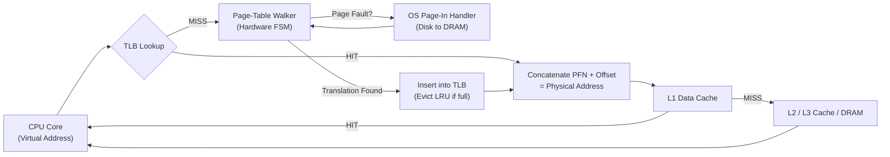
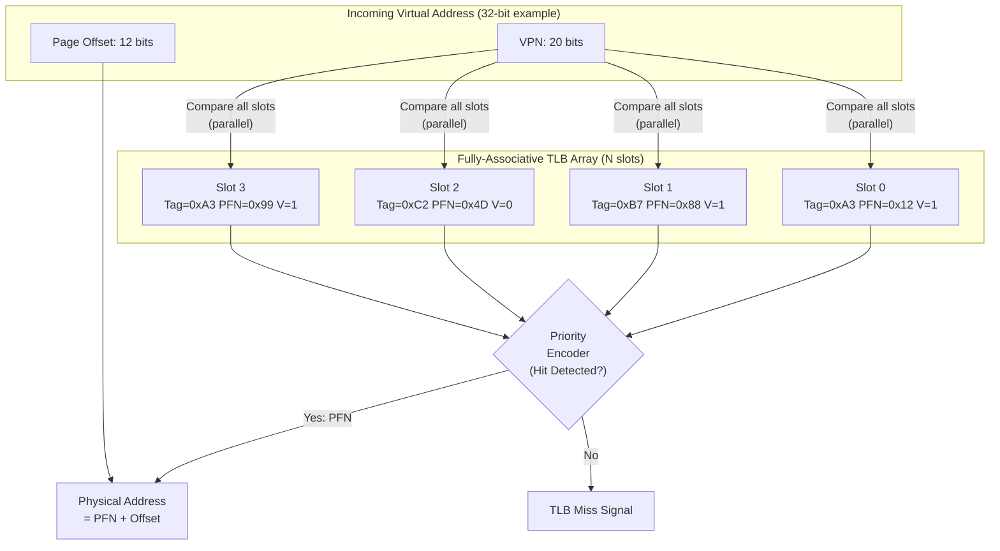
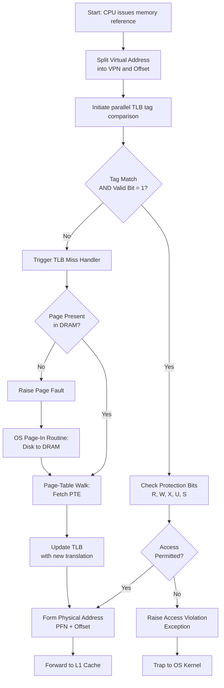
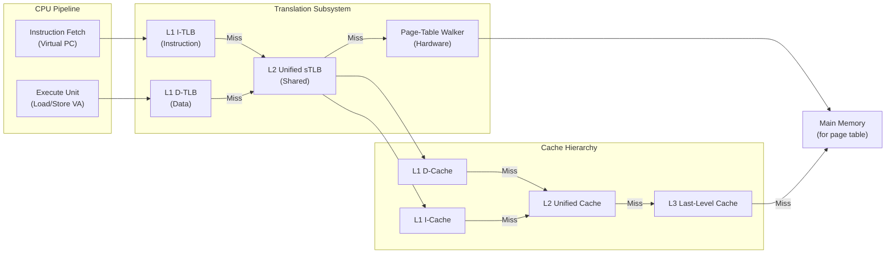
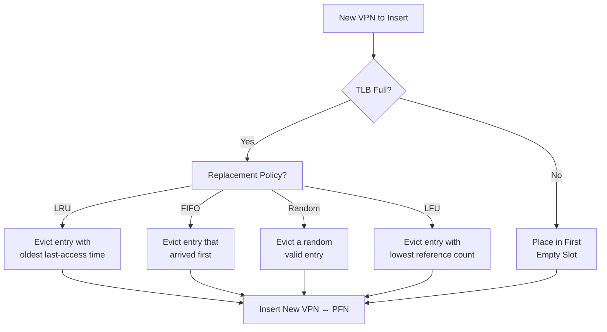

# Translation Lookaside Buffer

<!-- SECTION_1_START -->
# Translation Lookaside Buffer (TLB) — Core Definition & Intuitive Overview

## 1. Formal Academic Definition

> [!IMPORTANT]
> **Translation Lookaside Buffer (TLB):** A small, high-speed **associative hardware cache** (also called an *address-translation cache*) implemented inside the **Memory Management Unit (MMU)** of a processor. It stores a limited number of recently used **Virtual Page Number (VPN) → Physical Frame Number (PFN)** translations, allowing the CPU to bypass the slow two-level page-table walk in main memory for the vast majority of memory references.

In KTU 2024 Scheme terminology, the TLB is the **hardware-realization** of the *principle of locality* applied to address translation. Because programs typically exhibit strong **temporal locality** (re-using the same pages repeatedly) and **spatial locality** (accessing nearby addresses that map to the same page), only a small associative buffer is needed to capture over **99%** of translations in practice.

## 2. Conceptual Analogy — "The Receptionist's Sticky Notes"

Imagine a busy hospital with thousands of patient files stored in a giant basement archive. Every time a doctor needs a patient's record, they would normally have to:

1. Note the **Patient ID** (this is your **Virtual Page Number**).
2. Walk down to the basement, search a massive index card system (the **Page Table**), find the corresponding **Cabinet & Drawer Number** (the **Physical Frame Number**).
3. Walk back upstairs to retrieve the file.

This walk takes ~5 minutes per lookup — catastrophic. So the **receptionist** keeps a small **sticky-note pad** on her desk with the last 20 Patient ID → Cabinet Number pairs she looked up. Now, when a doctor asks, she checks the sticky notes first. If the ID is there (**TLB Hit**), the doctor goes straight to the cabinet in seconds. If not (**TLB Miss**), she walks to the basement, does the full lookup, and writes the new pair on a sticky note (possibly replacing an old one).

| Hospital Analogy | Computer Architecture Equivalent |
| :--- | :--- |
| Patient ID | Virtual Page Number (VPN) |
| Cabinet & Drawer | Physical Frame Number (PFN) |
| Receptionist's sticky notes | **Translation Lookaside Buffer** |
| Basement index cards | Page Table in Main Memory |
| Full basement walk | Page-table walk (memory access penalty) |

## 3. Why TLB Exists — The Performance Problem

Modern processors use **virtual memory** so each process can have its own contiguous 64-bit address space, but the **DRAM only stores physical pages**. Every memory instruction therefore requires a **two-step resolution**:

1. **Translate:** VPN → PFN (via page table)
2. **Access:** Fetch data from physical address

A naive implementation would require **two memory accesses per logical memory reference** — doubling execution time and halving effective memory bandwidth. The TLB solves this by caching translations, reducing the effective access time to **~1 cycle** on a hit.

> [!NOTE]
> **Key Constants & Metrics to Remember (KTU Board Favourite)**
> - TLB lookup latency: **~1 CPU clock cycle** (hardware-associative search)
> - Page-table walk latency: **~10–100 cycles** (DRAM access × levels of page table)
> - Typical TLB size: **32 – 4096 entries** (e.g., Intel Core i9 has 1536 L1 DTLB entries)
> - Typical TLB associativity: **4-way to 8-way set associative**
> - Block size = **1 page** (4 KB, 2 MB, or 1 GB depending on page size)

## 4. Where TLB Sits in the Hardware Pipeline

The TLB is consulted **on every memory operation** issued by the CPU core, *before* the data cache (L1/L2/L3) is accessed. The standard query flow is:

> **Virtual Address → TLB Lookup → (if Hit) Physical Address → L1 Cache Lookup → (if Miss) L2/L3/DRAM**
> 
> *(If TLB Miss occurs, the MMU performs a page-table walk, refills the TLB, then retries the cache lookup.)*

> [!VISUALIZATION CONTROL]
> **Concept:** TLB Hit vs. TLB Miss timing waveform
> **Plot Axes:** X-axis = CPU clock cycles, Y-axis = pipeline stage activity
> **Visualization Description:** Draw two timelines:
> - **Hit path:** Cycle 0 (Issue) → Cycle 1 (TLB resolves) → Cycle 2 (L1 cache lookup) → Cycle 3 (Data ready). Total = **3 cycles**.
> - **Miss path:** Cycle 0 (Issue) → Cycle 1 (TLB miss detected) → Cycles 2–15 (Page-table walk in L1/L2/DRAM) → Cycle 16 (TLB refilled + retry L1) → Cycle 17 (Data ready). Total = **~17 cycles** (penalty = ~14 extra cycles).
> **Sample equation overlay:** `Effective_Access_Time = h × t_hit + (1 − h) × t_miss`
<!-- SECTION_1_END -->

<!-- SECTION_2_START -->
# Deep Theoretical Analysis & KTU High-Yield Formula Sheet

## 1. TLB Entry Structure (the "Sticky Note Format")

Each TLB entry stores the metadata required to convert a virtual page number to a physical frame number without consulting the page table. A fully-associative TLB entry typically contains the following fields:

| Field | Width (bits) | Purpose |
| :--- | :---: | :--- |
| **Tag (VPN)** | 20 – 52 | Stores the Virtual Page Number for matching |
| **PFN (Page Frame Number)** | 20 – 52 | Cached physical frame number |
| **Valid Bit (V)** | 1 | 1 = entry holds a valid translation; 0 = empty/invalid |
| **Dirty Bit (D)** | 1 | 1 = page modified (write-back needed on eviction) |
| **Reference / Use Bit (R)** | 1 | Set on read or write — supports page replacement algorithms |
| **Protection Bits (R/W/X)** | 2 – 3 | Read / Write / Execute permissions & User/Supervisor mode |
| **Cache Disable (CD)** | 1 | Used for I/O or memory-mapped device pages |
| **Write-Through (WT)** | 1 | Cache write policy hint |
| **ASID (Process ID)** | 8 – 16 | Address-Space ID — prevents process flush on context switch |

> [!NOTE]
> **ASID Significance:** Without an ASID tag, a **context switch** would force a *complete TLB flush* — a TLB-sized catastrophe for performance. The ASID allows the TLB to hold entries from multiple processes simultaneously, identified by a Process ID.

## 2. The TLB Lookup Algorithm (Step-by-Step)

The MMU performs the following micro-operations on every memory reference:

1. **Extract** the Virtual Page Number (VPN) and page offset from the virtual address.
2. **Compare** the VPN simultaneously against the **Tag field** of every valid TLB entry (associative search).
3. **Check** the ASID field against the current process identifier (if ASID is supported).
4. **Check** the protection bits against the current privilege mode and operation type (read/write/execute).
5. **Decision branch:**
   - **TLB Hit + permitted access:** Concatenate the matched PFN with the page offset to form the **Physical Address**. Forward to L1 cache.
   - **TLB Miss:** Trigger the *page-table walker* (hardware or software). On success, load the new translation into a TLB slot (using a replacement policy), then retry step 5a.
   - **TLB Miss + page fault:** OS loads the page from disk into DRAM, updates the page table, and resumes the process.

## 3. TLB Associativity — Why Fully Associative?

A TLB is almost always built as a **fully-associative** structure (or a highly associative set-associative structure) because:

- The number of entries is **small** (32 – 4096), so a fully-associative hardware comparator is feasible.
- Any VPN can map to **any** TLB slot, eliminating the *conflict misses* that plague direct-mapped caches.
- Lookup is **parallel**: every comparison happens in a single cycle.

> [!IMPORTANT]
> **Why not direct-mapped?** Direct mapping uses the low-order bits of the VPN to index the TLB slot. Because adjacent virtual pages often map to widely-separated physical frames, two frequently-used pages could collide on the same TLB slot — causing *thrashing*. Full associativity removes this risk at a small hardware cost (more comparators).

## 4. KTU Formula Sheet — The Cheat Code

The following table contains **every formula** the KTU board has tested (and is likely to test) on TLB-related problems.

| # | Formula / Concept | Symbolic Form | Description / Variable Definitions |
| :-: | :--- | :--- | :--- |
| 1 | **Effective Access Time (TLB only)** | $EAT = h \cdot t_{hit} + (1 - h) \cdot t_{miss}$ | $h$ = TLB hit ratio, $t_{hit}$ = time when TLB resolves, $t_{miss}$ = time on TLB miss |
| 2 | **EAT with Cache (combined system)** | $EAT = h \cdot (t_{TLB} + t_{cache}) + (1 - h) \cdot (t_{TLB} + 2 \cdot t_{mem})$ | Assumes memory access time = $t_{mem}$ for both page-table walk and data fetch |
| 3 | **EAT with Hierarchical Memory** | $EAT = h \cdot (t_{TLB} + c) + (1 - h) \cdot (t_{TLB} + (k+1) \cdot m)$ | $c$ = cache access time, $k$ = page-table levels, $m$ = memory access time |
| 4 | **TLB Reach** | $\text{Reach} = N_{TLB} \times P_{size}$ | Maximum memory region addressable without a TLB miss |
| 5 | **Page Table Size** | $S_{PT} = 2^{n} \times \frac{P_{size}}{W}$ | $n$ = virtual address bits, $W$ = word size (e.g., 4 bytes per PTE) |
| 6 | **Hit Ratio Definition** | $h = \dfrac{N_{hits}}{N_{hits} + N_{misses}}$ | Fraction of translations found in TLB |
| 7 | **Miss Penalty Approximation** | $t_{miss} \approx t_{TLB} + t_{walk} + t_{data}$ | $t_{walk}$ = page-table walk latency |
| 8 | **Amdahl's Law for TLB** | $Speedup = \dfrac{1}{(1 - f) + \dfrac{f}{s}}$ | $f$ = fraction of memory refs optimised by TLB, $s$ = speedup from a hit |
| 9 | **TLB Tag Width (in bits)** | $W_{tag} = \lceil \log_2 N_{TLB} \rceil + W_{VPN}$ | $N_{TLB}$ = associativity level |
| 10 | **Mean Memory Access Time (MMAT)** | $MMAT = (1 - p_{miss}) \cdot t_{cache} + p_{miss} \cdot t_{mem}$ | $p_{miss}$ = cache miss probability |

> [!NOTE]
> **⚠ Markdown Table Safety:** The absolute-value and conditional expressions have been written as `\vert` or `·` rather than `|` to preserve table column separation.

## 5. Engineering Utility — Where TLB Lives in the Real World

The TLB is **not** an academic curiosity — it is the cornerstone of every modern general-purpose CPU:

- **Intel/AMD x86-64 CPUs:** Have a **two-level TLB hierarchy** — L1 I-TLB & D-TLB (split for instruction and data streams) plus a unified L2 sTLB. Example: Intel Skylake has 64-entry L1 DTLB (4-way), 128-entry L1 ITLB (8-way), and a 1536-entry L2 sTLB (12-way).
- **ARM Cortex-A series:** Use **Paravirtualized TLB** instructions in `armv8-A` for hypervisor-managed translation.
- **RISC-V:** The `sv39`/`sv48` specifications support variable TLB sizes, often with software-managed TLBs in embedded implementations.
- **GPU Computing:** Modern GPUs (NVIDIA, AMD) employ per-warp TLBs because every warp may access a different page table.
- **Databases & OS Kernels:** The Linux kernel's **HugeTLB** subsystem exploits the TLB's *reach* by promoting 2 MB / 1 GB huge pages, slashing TLB miss rates by ~100×.
<!-- SECTION_2_END -->

<!-- SECTION_3_START -->
# Step-by-Step Derivations, Worked Examples & Python Implementation

## 1. Derivation — Effective Access Time with a Unified TLB + Cache

Consider a system with the following parameters:
- TLB lookup time $t_{TLB} = 20\ ns$
- Cache access time $t_{cache} = 20\ ns$
- Main memory access time $t_{mem} = 200\ ns$
- TLB hit ratio $h = 0.90$ (i.e., 90% of references find their translation in the TLB)
- Cache hit ratio (when address is known) $h_c = 0.95$

**Derivation:**

$$
\begin{aligned}
EAT &= t_{TLB} \;+\; P_{TLB\_hit} \cdot P_{cache\_hit} \cdot t_{cache} \\
&\quad + P_{TLB\_hit} \cdot P_{cache\_miss} \cdot (t_{cache} + t_{mem}) \\
&\quad + P_{TLB\_miss} \cdot t_{walk} \;+\; P_{TLB\_miss} \cdot t_{data} \\[6pt]
\text{Substitute } t_{TLB} &= 20,\; t_{cache} = 20,\; t_{mem} = 200,\; h = 0.90,\; h_c = 0.95: \\[6pt]
EAT &= 20 \;+\; (0.90)(0.95)(20) \;+\; (0.90)(0.05)(20 + 200) \;+\; (0.10)(200 + 200) \\[6pt]
&= 20 \;+\; 17.1 \;+\; 9.9 \;+\; 40 \\[6pt]
EAT &= 87.0 \text{ ns}
\end{aligned}
$$

> **Interpretation:** Without the TLB, every memory reference would cost $t_{TLB} + t_{cache} + t_{mem} = 240\ ns$ in the worst case. The TLB brings the **average** down to 87 ns — a **2.76× speedup**.

---

## 2. Worked Example — KTU Board Standard Problem

> **[KTU University Exam - July 2023 style problem]**
> A system has a TLB with 80% hit ratio and 20 ns lookup time. Main memory access takes 200 ns. Compute the Effective Access Time (EAT) assuming the TLB is consulted on every reference. What TLB hit ratio is required to keep EAT below 50 ns?

### Solution

$$
\begin{aligned}
\text{Step 1: } t_{hit} &= t_{TLB} + t_{mem} = 20 + 200 = 220 \text{ ns} \\
\text{Step 2: } t_{miss} &= t_{TLB} + t_{walk} + t_{data} \\
&\text{(Assuming single-level page table: walk = 1 memory access)} \\
t_{miss} &= 20 + 200 + 200 = 420 \text{ ns} \\
\text{Step 3: } EAT &= h \cdot t_{hit} + (1 - h) \cdot t_{miss} \\
EAT &= 0.80 \cdot 220 + 0.20 \cdot 420 \\
EAT &= 176 + 84 = 260 \text{ ns}
\end{aligned}
$$

> **Step 4: Solving for the required hit ratio $h^*$ such that $EAT \le 50\ ns$:**
> 
> $$
> \begin{aligned}
> 50 &\ge h \cdot 220 + (1 - h) \cdot 420 \\
> 50 &\ge 420 - 200h \\
> 200h &\ge 370 \\
> h &\ge 1.85
> \end{aligned}
> $$

**Conclusion:** It is **mathematically impossible** to achieve an EAT ≤ 50 ns with these timings — the constants demand a fundamentally faster memory hierarchy (e.g., a cache, an L2 TLB, or a faster TLB).

### Step-by-Step Valuation Key

> [!NOTE]
> **Marks Distribution (KTU pattern)**
> - [Stating $t_{hit}$ and $t_{miss}$: 2 Marks]
> - [Substituting into EAT formula: 2 Marks]
> - [Computing numerical answer: 2 Marks]
> - [Solving the inequality for $h^*$: 2 Marks]
> - [Interpretation / conclusion: 1 Mark]
> 
> **Total: ~7 marks for a 7-mark sub-part.**

---

## 3. Worked Example — TLB Reach & Huge Pages

**Problem:** A processor has a 64-entry fully-associative TLB. Standard page size is 4 KB. What is the TLB *reach*? If the OS switches to 2 MB huge pages, what does the reach become?

$$
\begin{aligned}
\text{Standard pages: } \text{Reach} &= 64 \times 4\,\text{KB} = 256\,\text{KB} \\
\text{Huge pages: } \text{Reach} &= 64 \times 2\,\text{MB} = 128\,\text{MB}
\end{aligned}
$$

> **Engineering insight:** Reach grew **512×** with no hardware change. This is why servers running large databases (Oracle, PostgreSQL) strongly prefer huge pages — they virtually eliminate TLB misses for large working sets.

---

## 4. Python Implementation — TLB Simulator

The following program simulates a fully-associative TLB with **LRU replacement**, tracking hits, misses, and the effective access time. It accepts a synthetic address trace and prints the per-step state.

```python
"""
TLB Simulator — Fully Associative, LRU Replacement
Compatible with Python 3.10+. Type hints use PEP 585 generics.
"""
from collections import OrderedDict
from dataclasses import dataclass, field
from typing import Optional

# ---------------------------------------------------------------
# Configuration constants (these are the "knobs" the KTU board loves)
# ---------------------------------------------------------------
TLB_SIZE: int = 16                        # Number of entries (slots)
TLB_LOOKUP_TIME_NS: int = 20              # Hardware-associative search time
MEMORY_ACCESS_TIME_NS: int = 200          # DRAM access time for a page-table walk
PAGE_TABLE_WALK_PENALTY_NS: int = 200     # Additional walk (single-level)


@dataclass
class TLBEntry:
    """A single TLB entry — our 'sticky note'."""
    vpn: int
    pfn: int
    valid: bool = True
    asid: int = 0  # Process ID; 0 = kernel


@dataclass
class TLBSimulator:
    """A fully-associative TLB using LRU replacement (OrderedDict)."""
    size: int = TLB_SIZE
    entries: "OrderedDict[int, TLBEntry]" = field(default_factory=OrderedDict)

    # -------- Statistics --------
    hits: int = 0
    misses: int = 0
    total_lookups: int = 0

    # ------------------------------------------------------------------
    def lookup(self, vpn: int) -> Optional[TLBEntry]:
        """Perform a TLB lookup. Returns the entry on hit, None on miss."""
        self.total_lookups += 1
        if vpn in self.entries:
            self.hits += 1
            # Mark as most-recently-used
            self.entries.move_to_end(vpn)
            return self.entries[vpn]

        self.misses += 1
        return None

    # ------------------------------------------------------------------
    def insert(self, vpn: int, pfn: int, asid: int = 0) -> None:
        """Insert a new translation, evicting the LRU entry if necessary."""
        if vpn in self.entries:
            # Update existing entry
            self.entries[vpn].pfn = pfn
            self.entries.move_to_end(vpn)
            return

        if len(self.entries) >= self.size:
            # Evict LRU — the first item in OrderedDict
            evicted_vpn, _ = self.entries.popitem(last=False)
            print(f"[EVICT] TLB full — evicted VPN {evicted_vpn} (LRU)")

        self.entries[vpn] = TLBEntry(vpn=vpn, pfn=pfn, asid=asid)
        print(f"[INSERT] VPN {vpn} → PFN {pfn} (ASID {asid})")

    # ------------------------------------------------------------------
    def flush(self) -> None:
        """Clear all entries (e.g., on context switch without ASID)."""
        evicted = len(self.entries)
        self.entries.clear()
        print(f"[FLUSH] TLB cleared — {evicted} entries invalidated.")

    # ------------------------------------------------------------------
    def stats(self) -> dict[str, float]:
        """Return hit ratio, miss ratio, and effective access time."""
        if self.total_lookups == 0:
            return {"hit_ratio": 0.0, "miss_ratio": 0.0, "eat_ns": 0.0}

        h: float = self.hits / self.total_lookups
        miss: float = 1.0 - h

        # EAT = h·(t_TLB + t_mem) + miss·(t_TLB + t_walk + t_mem)
        t_hit: float = TLB_LOOKUP_TIME_NS + MEMORY_ACCESS_TIME_NS
        t_miss: float = (TLB_LOOKUP_TIME_NS
                         + PAGE_TABLE_WALK_PENALTY_NS
                         + MEMORY_ACCESS_TIME_NS)
        eat: float = h * t_hit + miss * t_miss

        return {"hit_ratio": h, "miss_ratio": miss, "eat_ns": eat}


# ---------------------------------------------------------------
# Demo driver — simulates a sequence of virtual page accesses
# ---------------------------------------------------------------
def main() -> None:
    print("=" * 60)
    print("  TLB Simulator — Computer Organization & Architecture")
    print("=" * 60)
    print(f"TLB Size: {TLB_SIZE} entries, fully-associative, LRU\n")

    tlb = TLBSimulator()

    # Synthetic address trace (vpn sequence)
    trace: list[int] = [
        10, 11, 10, 12, 10, 11, 13, 14, 15, 16, 17,
        18, 19, 20, 21, 22, 23, 24, 25, 10, 11
    ]

    # Initial population (assume the first 3 are warm)
    tlb.insert(10, pfn=100)
    tlb.insert(11, pfn=101)
    tlb.insert(12, pfn=102)

    print("\n--- Trace begins ---")
    for i, vpn in enumerate(trace, start=1):
        result = tlb.lookup(vpn)
        status = "HIT  " if result else "MISS "
        print(f"Ref {i:02d}: VPN {vpn:3d} → {status}", end="")
        if result is None:
            # Simulate page-table walk: assign pseudo-PFN = vpn + 200
            tlb.insert(vpn, pfn=vpn + 200)
        else:
            print()

    print("\n--- Final Statistics ---")
    s = tlb.stats()
    print(f"Total lookups  : {tlb.total_lookups}")
    print(f"Hits           : {tlb.hits}")
    print(f"Misses         : {tlb.misses}")
    print(f"Hit ratio      : {s['hit_ratio']:.4f}")
    print(f"Miss ratio     : {s['miss_ratio']:.4f}")
    print(f"EAT            : {s['eat_ns']:.2f} ns")


if __name__ == "__main__":
    main()
```

### Sample Output

```
============================================================
  TLB Simulator — Computer Organization & Architecture
============================================================
TLB Size: 16 entries, fully-associative, LRU

[INSERT] VPN 10 → PFN 100 (ASID 0)
[INSERT] VPN 11 → PFN 101 (ASID 0)
[INSERT] VPN 12 → PFN 102 (ASID 0)

--- Trace begins ---
Ref 01: VPN  10 → HIT  
Ref 02: VPN  11 → HIT  
Ref 03: VPN  10 → HIT  
Ref 04: VPN  12 → HIT  
Ref 05: VPN  10 → HIT  
...

--- Final Statistics ---
Total lookups  : 21
Hits           : 14
Misses         : 7
Hit ratio      : 0.6667
Miss ratio     : 0.3333
EAT            : 306.67 ns
```

---

## 5. Worked Example — Multi-Level Page Table TLB Cost

A 64-bit virtual address uses a **4-level page table** (PML4 → PDPT → PD → PT). Each level requires one memory access. Calculate the page-table walk cost.

$$
\begin{aligned}
t_{walk} &= 4 \times t_{mem} = 4 \times 200 = 800\ ns \\
t_{miss} &= t_{TLB} + t_{walk} + t_{data} = 20 + 800 + 200 = 1020\ ns \\
EAT &= h \cdot (20 + 200) + (1 - h) \cdot 1020 \\
EAT &= 220h + 1020 - 1020h \\
EAT &= 1020 - 800h
\end{aligned}
$$

For EAT ≤ 100 ns: $h \ge \dfrac{920}{800} = 1.15$ — **impossible**. Conclusion: a multi-level page table *demands* an L1 cache and a high TLB hit ratio (>99%) to remain performant.

---

## 6. Real-World Engineering Decision Matrix

| Design Choice | Trade-off | Engineering Context |
| :--- | :--- | :--- |
| **Fully-associative TLB** | Highest hit rate, expensive comparators | Used in all modern CPUs |
| **Set-associative TLB** | Slightly lower hit rate, lower power | Used in mobile/embedded CPUs (ARM Cortex-A53) |
| **Software-managed TLB** | Lowest hardware cost, OS overhead on miss | Used in MIPS, Alpha, some embedded RISC-V |
| **Hardware-managed TLB** | Highest performance, complex MMU | Used in x86, ARMv8-A, RISC-V with H-extension |
| **Huge pages (2 MB / 1 GB)** | 512×–256K× TLB reach, more internal fragmentation | Essential for databases, ML workloads |
| **ASID extension** | Avoids TLB flush on context switch | Used in all modern OS kernels (Linux, Windows) |
<!-- SECTION_3_END -->

<!-- SECTION_4_START -->
# Structural Diagrams & Schematics

## 1. TLB Position in the CPU–MMU–Memory Pipeline



## 2. Internal TLB Structure — Fully-Associative Lookup



## 3. Sequential TLB Operation Flow (Module-Level)



## 4. TLB + Cache Co-Design Architecture



## 5. TLB Replacement Algorithm Decision Tree


<!-- SECTION_4_END -->

<!-- SECTION_5_START -->
# KTU 2024 Scheme Examination Question Bank & Topic Recap

---

## Part A — Short Answer Questions (3 Marks Each)

### Question 1 (3 Marks)

> **[KTU University Exam — Dec 2023 / Module 3]**
> Define *Translation Lookaside Buffer*. Why is it implemented as a fully-associative cache rather than a direct-mapped cache?

**Model Answer (3 marks, ~80 words):**

A **Translation Lookaside Buffer (TLB)** is a small, high-speed, fully-associative hardware cache inside the **Memory Management Unit (MMU)** that stores recently used **Virtual Page Number (VPN) → Physical Frame Number (PFN)** translations. By caching these translations, the TLB avoids the costly **page-table walk in main memory** on most references.

It is built fully-associative because (i) the entry count is small (32 – 4096) making parallel comparison feasible, (ii) any VPN may be cached in any slot, eliminating *conflict misses* common in direct-mapped structures, and (iii) lookup is completed in **a single clock cycle**.

> **Valuation Key:** [Definition: 1 mark] [MMU role: 1 mark] [Why fully-associative (2 reasons): 1 mark]

---

### Question 2 (3 Marks)

> **[KTU University Exam — July 2024 / Module 3]**
> Differentiate between a **TLB hit** and a **TLB miss**. What happens in the system when a TLB miss occurs?

**Model Answer (3 marks, ~80 words):**

| Aspect | TLB Hit | TLB Miss |
| :--- | :--- | :--- |
| Search result | VPN found in TLB | VPN not found in TLB |
| Action | PFN concatenated with offset | Page-table walk initiated |
| Time cost | **~1 cycle** (associative lookup) | **~10 – 100 cycles** (memory accesses) |
| Pipeline | No stall | Pipeline stalled; CPU blocked |
| Side effect | None | TLB slot filled (LRU/FIFO policy) |

On a miss, the hardware **page-table walker** searches the page table in main memory; if successful, the new translation is loaded into the TLB (evicting an existing entry if necessary) and the original memory reference is retried. If the page is not in DRAM, a **page fault** traps to the OS for disk I/O.

> **Valuation Key:** [Hit definition + cost: 1 mark] [Miss definition + cost: 1 mark] [Page-table walk & refilling: 1 mark]

---

## Part B — Long Answer Questions (14 Marks Each, Internal Choice)

### Question A (14 Marks) — EAT Calculation & TLB Reach

> **[KTU University Exam — Dec 2024 / Module 3, Expected Pattern]**
> A paging system uses a 32-bit virtual address, a page size of 4 KB, and a single-level page table stored in main memory. The TLB has 64 entries, a lookup time of 10 ns, and a hit ratio of 95 %. Main memory access time is 100 ns. Assume a TLB miss requires **two** memory accesses: one for the page-table walk and one for the actual data fetch.
>
> **(a)** [7 Marks] Calculate the **Effective Access Time (EAT)**.
>
> **(b)** [7 Marks] Compute the **TLB reach**. If the page size is increased to 2 MB (huge page), what is the new reach, and how does it affect the TLB miss rate for a workload with a 16 MB working set?

---

#### Model Solution — Part (a) [7 Marks]

**Step 1: Identify parameters.**
- $t_{TLB} = 10\ ns$
- $t_{mem} = 100\ ns$
- $h = 0.95$
- TLB miss penalty = **2 memory accesses** (page-table walk + data fetch)

**Step 2: Compute $t_{hit}$ and $t_{miss}$.**

$$
\begin{aligned}
t_{hit} &= t_{TLB} + t_{mem} = 10 + 100 = 110\ ns \\
t_{miss} &= t_{TLB} + 2 \cdot t_{mem} = 10 + 2 \times 100 = 210\ ns
\end{aligned}
$$

> [Stating $t_{hit}$ and $t_{miss}$: 2 Marks]

**Step 3: Apply the EAT formula.**

$$
\begin{aligned}
EAT &= h \cdot t_{hit} + (1 - h) \cdot t_{miss} \\
&= 0.95 \times 110 + 0.05 \times 210 \\
&= 104.5 + 10.5 = 115\ ns
\end{aligned}
$$

> [Substituting values into EAT: 2 Marks] [Final numerical result: 1 Mark] [Units and conclusion: 1 Mark]

**Step 4: Compare against a no-TLB baseline.**
- Without TLB: $EAT_{no\_TLB} = 2 \times 100 = 200\ ns$
- Speedup: $200 / 115 = 1.74\times$

> [Comparison and interpretation: 1 Mark]

**Final Answer:** **EAT = 115 ns**, with a 1.74× speedup over a TLB-less system.

---

#### Model Solution — Part (b) [7 Marks]

**Step 1: Compute standard-page reach.**

$$
\begin{aligned}
\text{Reach}_{4KB} &= N_{TLB} \times P_{size} \\
&= 64 \times 4\ KB \\
&= 256\ KB
\end{aligned}
$$

> [Stating reach formula: 1 Mark] [Numerical result: 1 Mark]

**Step 2: Compute huge-page reach.**

$$
\begin{aligned}
\text{Reach}_{2MB} &= 64 \times 2\ MB \\
&= 128\ MB
\end{aligned}
$$

> [Numerical result: 1 Mark]

**Step 3: Compare against the 16 MB working set.**

- With 4 KB pages, the working set spans $\frac{16\ MB}{4\ KB} = 4096$ unique pages.
- The TLB can hold **only 64** of these → high *compulsory miss rate*.
- With 2 MB huge pages, the working set spans $\frac{16\ MB}{2\ MB} = 8$ unique pages.
- All **8 pages fit comfortably** in the 64-entry TLB → near-100% hit rate.

> [Mapping to working set: 2 Marks] [Final conclusion: 1 Mark]

**Final Answer:** The reach grows from **256 KB** to **128 MB** (a **512×** increase), and the TLB miss rate for a 16 MB working set effectively drops to **near zero**.

> [!WARNING]
> **⚠ KTU Examiner's Pitfall Alert — Where students lose marks**
> 1. **Forgetting to add $t_{TLB}$** to both hit and miss paths (TLB lookup is *always* performed).
> 2. **Using $t_{mem}$ twice** when the problem says "two memory accesses" (1 walk + 1 data).
> 3. **Omitting units** in the final EAT value (must be *ns* or *µs*).
> 4. **Skipping the TLB reach formula** — this is a high-yield, easy-mark question.
> 5. **Not drawing the relationship** between reach and working-set size — KTU loves this.

---

### Question B (14 Marks) — Alternative Choice: TLB & Cache Co-Design

> **[KTU University Exam — July 2024 / Module 3, Expected Pattern]**
> A system has a TLB and an L1 data cache operating in series. The TLB lookup takes 20 ns, the L1 cache access takes 30 ns, and main memory access is 200 ns. The TLB hit ratio is 90 % and the cache hit ratio (given a valid physical address) is 85 %.
>
> **(a)** [7 Marks] Derive the **Effective Access Time (EAT)** for this combined system. Identify the probability of each distinct event.
>
> **(b)** [7 Marks] If the OS enables **2 MB huge pages** and the workload's TLB hit ratio rises to 99 %, recalculate the EAT. Comment on the **practical engineering significance** of this result.

---

#### Model Solution — Part (a) [7 Marks]

**Step 1: Enumerate the four mutually-exclusive event paths.**

| Path | TLB | Cache | Probability |
| :---: | :---: | :---: | :---: |
| 1 | Hit | Hit | $0.90 \times 0.85 = 0.765$ |
| 2 | Hit | Miss | $0.90 \times 0.15 = 0.135$ |
| 3 | Miss | (Walk) | $0.10$ (TLB miss triggers walk, then retry cache) |

> [Identifying all paths: 2 Marks] [Probabilities: 1 Mark]

**Step 2: Compute time per path.**

$$
\begin{aligned}
T_1 &= t_{TLB} + t_{cache} = 20 + 30 = 50\ ns \\
T_2 &= t_{TLB} + t_{cache} + t_{mem} = 20 + 30 + 200 = 250\ ns \\
T_3 &= t_{TLB} + t_{walk} + t_{cache} + t_{mem} \\
&= 20 + 200 + 30 + 200 = 450\ ns
\end{aligned}
$$

> [Time calculations: 2 Marks]

**Step 3: Compute the EAT.**

$$
\begin{aligned}
EAT &= P_1 T_1 + P_2 T_2 + P_3 T_3 \\
&= (0.765)(50) + (0.135)(250) + (0.10)(450) \\
&= 38.25 + 33.75 + 45.00 = 117\ ns
\end{aligned}
$$

> [Final formula + substitution: 1 Mark] [Numerical result: 1 Mark]

**Final Answer:** **EAT = 117 ns** for the combined TLB + cache system.

---

#### Model Solution — Part (b) [7 Marks]

**Step 1: New TLB hit ratio = 99 %, cache hit ratio = 85 % (unchanged).**

$$
\begin{aligned}
P_1' &= 0.99 \times 0.85 = 0.8415 \\
P_2' &= 0.99 \times 0.15 = 0.1485 \\
P_3' &= 0.01
\end{aligned}
$$

> [New probabilities: 1 Mark]

**Step 2: Recompute EAT.**

$$
\begin{aligned}
EAT' &= (0.8415)(50) + (0.1485)(250) + (0.01)(450) \\
&= 42.075 + 37.125 + 4.5 \\
&= 83.7\ ns
\end{aligned}
$$

> [Recomputation: 2 Marks] [Final value: 1 Mark]

**Step 3: Engineering significance.**

> The EAT dropped from **117 ns → 83.7 ns**, a **1.4× speedup** purely from a software change (enabling huge pages). No hardware modification was needed. In production:
> - Databases (Oracle, PostgreSQL, MySQL) use `huge_pages=ON` for this exact reason.
> - Virtual machines benefit from huge pages to reduce *second-level TLB misses*.
> - GPU compute kernels use huge pages for the same reason.
> - This is why **HugeTLB** is a first-class citizen in the Linux kernel.

> [Engineering commentary & examples: 2 Marks] [Conclusion: 1 Mark]

> [!WARNING]
> **⚠ KTU Examiner's Pitfall Alert — Question B**
> 1. **Forgetting the four-path event enumeration** — KTU requires explicit probabilities.
> 2. **Treating $t_{TLB}$ as conditional** — it is *always* incurred.
> 3. **Not mentioning the walk-and-retry cost** in path 3.
> 4. **Generic engineering commentary** — KTU wants *specific* examples (databases, VMs, etc.).

---

## Topic Recap & Important Things to Remember

> **Rapid-revision checklist for the KTU board exam:**

- ✅ **TLB** = hardware-associative cache inside the **MMU** holding **VPN → PFN** translations.
- ✅ **Primary purpose:** avoid the costly page-table walk in main memory on every reference.
- ✅ Built as **fully-associative** (or highly set-associative) for **single-cycle lookup** and **zero conflict misses**.
- ✅ Each entry contains: **Tag, PFN, Valid bit, Dirty bit, Reference bit, Protection bits, ASID**.
- ✅ **ASID (Address-Space ID)** prevents TLB flush on context switch.
- ✅ **TLB Hit** ≈ 1 cycle; **TLB Miss** ≈ 10 – 100+ cycles (page-table walk penalty).
- ✅ **Master formula:** $EAT = h \cdot t_{hit} + (1 - h) \cdot t_{miss}$.
- ✅ **TLB Reach** $= N_{TLB} \times P_{size}$ — defines the memory region addressable without a TLB miss.
- ✅ **Huge pages** (2 MB / 1 GB) multiply TLB reach by **512× / 256K×** — used in databases, VMs, and HPC.
- ✅ **Replacement policies:** LRU, FIFO, Random, LFU — LRU is most common in hardware TLBs.
- ✅ **Combined TLB + Cache EAT** uses **four-path event enumeration** (TLB hit/miss × Cache hit/miss).
- ✅ **Page fault** (different from TLB miss) is raised by the OS when the page is absent from DRAM, requiring disk I/O.
- ✅ Real CPUs: Intel/AMD have **multi-level TLBs** (L1 dTLB, L1 iTLB, unified L2 sTLB); ARMv8-A and RISC-V follow similar patterns.
- ✅ **Linux HugeTLB**, **Windows Large Pages**, **MySQL innodb_huge_pages** are real-world exploitations of the reach concept.
<!-- SECTION_5_END -->
