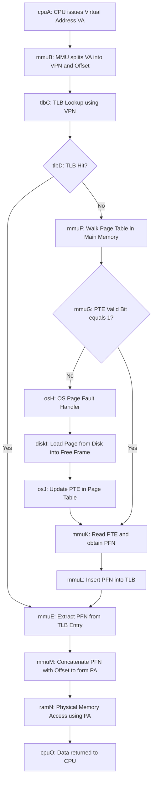
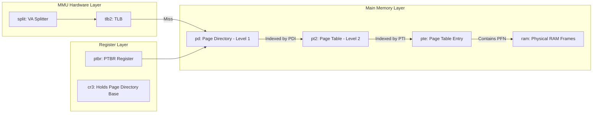

# Virtual Memory - Address Translation

<!-- SECTION_1_START -->
# Virtual Memory - Address Translation

## 1.1 Formal Definition (KTU 2024 Syllabus Terminology)

> [!IMPORTANT]
> **Virtual Memory** is a memory management technique in which a program is executed using *logical (virtual) addresses* that are automatically translated by hardware (MMU) and software (OS) into *physical addresses* in main memory. The address translation process is the core mechanism that makes this illusion of a large, contiguous private address space possible for every running process.

In the KTU 2024 Scheme (PBCST404 - Module 3: Memory Systems), **Address Translation** refers to the systematic procedure by which the **Memory Management Unit (MMU)** converts a virtual address (the address generated by the CPU during instruction fetch, decode, or load/store operations) into a corresponding physical address (the actual location in RAM where the data/instruction resides or will be fetched).

### Key Architectural Components

| Component | Full Form | Role |
|---|---|---|
| **VA** | Virtual Address | Address produced by the CPU |
| **PA** | Physical Address | Address sent to the physical memory bus |
| **MMU** | Memory Management Unit | Hardware unit that performs translation |
| **PTBR** | Page Table Base Register | Holds the starting address of the current page table |
| **PTE** | Page Table Entry | One row of the page table; stores frame number + flags |
| **VPN** | Virtual Page Number | Upper bits of a virtual address |
| **PFN** | Page Frame Number | Upper bits of a physical address |
| **TLB** | Translation Lookaside Buffer | Hardware cache of recent translations |

> [!NOTE]
> The standard page size assumed in most KTU problems is **4 KB = $2^{12}$ bytes**, which means the offset field is exactly **12 bits** wide. The remaining upper bits of the address form the page/frame number.

## 1.2 Conceptual Analogy & Intuition

Imagine a **huge public library** with millions of books but **only a small reading room** that can hold a few hundred books at a time.

- The library's full catalog number for a book is the **Virtual Address** (the address space your program "sees").
- The actual shelf slot in the reading room where the book is currently placed is the **Physical Address** (the real RAM location).
- A **librarian with a master index book (the Page Table)** can tell you which shelf slot (frame) currently holds the book for a given catalog number (page).
- A **small sticky note on the librarian's desk (the TLB)** remembers the most recent lookups, so she does not have to flip through the master index every single time.

So when you (the CPU) ask for "book catalog #5A2B-0F7C", the librarian (MMU) glances at her sticky notes (TLB). If she finds the shelf number (TLB **hit**), she hands it to you instantly. If not (TLB **miss**), she consults the master index (Page Table) stored in a drawer (main memory), writes the answer on a new sticky note, and then hands you the shelf number.

> [!TIP]
> **Why virtual memory exists (the engineering reason):** It allows processes to be larger than physical RAM, enables process isolation, supports efficient memory sharing, simplifies program loading, and provides protection (a process cannot access another process's memory).

## 1.3 Visualization Control Block

> [!VISUALIZATION CONTROL]
> **Concept:** Address Field Decomposition (Virtual vs Physical)
> **GeoGebra / Desmos Input Equations:**
> * $VA_{32} = (2^{12}) \cdot VPN + Offset$ where $0 \le Offset < 2^{12}$
> * $PA_{32} = (2^{12}) \cdot PFN + Offset$
> * Bit ranges: Bits $[31:12]$ form VPN/PFN; Bits $[11:0]$ form the Offset.
> **Visual Description:** Draw a 32-bit horizontal bar. Shade the upper 20 bits as the "Page/Frame Number" and the lower 12 bits as the "Offset". The lower 12 bits remain **identical** between VA and PA, while only the upper bits change through translation.

<!-- SECTION_1_END -->

<!-- SECTION_2_START -->
# 2. Deep Theoretical Analysis & KTU High-Yield Formula Sheet

## 2.1 Operational Flow of Address Translation

The translation of a single virtual address to a physical address follows a strict pipeline:

1. **CPU generates Virtual Address (VA):** During instruction fetch, operand load, or store operations, the CPU places a virtual address on the MMU's input bus.
2. **Split VA into VPN and Offset:** The MMU splits the VA into two fields. For a 32-bit system with 4 KB pages, the upper **20 bits** are the VPN, and the lower **12 bits** are the offset.
3. **TLB Lookup (Hardware):** The MMU first searches the TLB using the VPN. The TLB is a small, fully-associative hardware cache. Each TLB entry holds a **tag (VPN)**, a **data word (PFN)**, and **valid/dirty/protection bits**.
4. **TLB Hit:** If the VPN is found in the TLB, the corresponding PFN is extracted directly. The physical address is formed by concatenating the PFN with the offset. The process terminates in **one memory cycle** (ignoring TLB access time).
5. **TLB Miss:** If the VPN is not in the TLB, the MMU must consult the **Page Table** in main memory.
6. **Page Table Walk:** The MMU combines the **Page Table Base Register (PTBR)** with the VPN to compute the address of the corresponding PTE. A memory read retrieves the PTE.
7. **PTE Validation:** The PTE's **valid bit** is checked. If 0, a **page fault** occurs and the OS loads the page from disk into a free frame, updates the PTE, and restarts the instruction.
8. **PFN Extraction:** From the valid PTE, the PFN is extracted and loaded into the TLB (replacing some existing entry using a replacement policy like LRU).
9. **Physical Address Formation:** The PFN is concatenated with the (unchanged) offset to form the PA.
10. **Memory Access:** The MMU places the PA on the system bus, and the physical memory responds with the data.

## 2.2 Two-Level Page Table Address Translation

For large address spaces (e.g., 32-bit with 4 KB pages), a single-level page table would consume $2^{20}$ entries (about 1 million). To save memory, a **two-level (hierarchical) page table** is used. The VPN is itself split into two parts:

- **Page Directory Index (PDI):** Upper-level index into the page directory.
- **Page Table Index (PTI):** Lower-level index into the chosen page table.

**Translation flow:**
1. The PTBR points to the **Page Directory**.
2. PDI indexes into the Page Directory to fetch a pointer to the second-level **Page Table**.
3. PTI indexes into that Page Table to fetch the PTE.
4. The PFN from the PTE is concatenated with the offset to form the PA.

> [!NOTE]
> The **Effective Access Time (EAT)** for a two-level page table on a TLB miss is dominated by the two extra memory accesses required to walk the hierarchy. The KTU problem statements frequently ask for EAT calculations using the formula in the cheat sheet below.

## 2.3 KTU High-Yield Formula Sheet

> [!IMPORTANT]
> Memorize the following table. Almost every KTU question on virtual memory maps directly to one of these formulas.

| Concept | Formula | Notes |
|---|---|---|
| Address Split | $VA = (VPN \times Page\_Size) + Offset$ | $Offset$ width = $\log_2(Page\_Size)$ |
| Offset Bits | $o = \log_2(Page\_Size)$ | For 4 KB page, $o = 12$ |
| VPN Bits | $v = Address\_Bits - o$ | For 32-bit VA, $v = 20$ |
| Physical Address | $PA = (PFN \times Page\_Size) + Offset$ | Offset is unchanged |
| Page Table Size (1-level) | $Entries = 2^{v}$ | Each entry typically 4 bytes |
| Page Table Memory | $Memory = 2^{v} \times Entry\_Size$ | In bytes |
| TLB Hit Time | $T_{hit}$ | Time to access TLB (negligible / 1 cycle) |
| Memory Access Time | $T_{mem}$ | Time to access RAM |
| TLB Hit Rate | $h$ | Fraction of accesses that hit the TLB |
| TLB Miss Penalty | $T_{miss\_penalty}$ | Time to access page table on miss |
| EAT (with TLB) | $EAT = h \cdot (T_{hit} + T_{mem}) + (1 - h) \cdot (T_{hit} + T_{miss\_penalty} + T_{mem})$ | Most tested formula |
| EAT (1-level PT) | $EAT = h \cdot (T_{hit} + T_{mem}) + (1 - h) \cdot (T_{hit} + 2 T_{mem})$ | Miss penalty = 1 extra memory access |
| EAT (2-level PT) | $EAT = h \cdot (T_{hit} + T_{mem}) + (1 - h) \cdot (T_{hit} + 3 T_{mem})$ | Miss penalty = 2 extra memory accesses |
| Page Fault Penalty | $T_{pf} \approx 1\,ms$ to $10\,ms$ | Dominated by disk I/O |
| EAT (with page faults) | $EAT = h \cdot (1 + T_{mem}) + (1 - h - p) \cdot (1 + 2 T_{mem}) + p \cdot (1 + T_{mem} + T_{pf})$ | $p$ = page fault rate |

## 2.4 Real-World Engineering Utility

Address translation is not an academic curiosity; it is the foundation of modern computing:

- **Operating Systems (Windows, Linux, macOS, Android):** Use paging with multi-level page tables (e.g., Linux uses 4-level paging on x86-64: PGD $\to$ P4D $\to$ PUD $\to$ PMD $\to$ PTE).
- **Cloud Servers (AWS, Azure, GCP):** Overcommit physical memory safely because virtual memory allows the sum of all VMs' working sets to exceed actual RAM.
- **Databases (Oracle, PostgreSQL):** Buffer pool managers rely on the same translation primitives for cache-line mapping between virtual and physical pages.
- **Mobile SoCs (ARM Cortex-A, Apple M-series):** Use two-level TLBs (L1 instruction, L1 data, L2 unified) to hide translation latency from the pipeline.
- **Embedded & Real-Time Systems:** Often use **locked TLB entries** to guarantee deterministic translation times for safety-critical code.

<!-- SECTION_2_END -->

<!-- SECTION_3_START -->
# 3. Step-by-Step Derivations & Code Implementation

## 3.1 Worked Example A: Single-Level Page Table Translation

**Problem Statement:** A system uses a **32-bit virtual address**, a **24-bit physical address**, and a page size of **4 KB**. The page table for process P1 has the following partial contents:

| VPN (Decimal) | PFN (Decimal) | Valid |
|---|---|---|
| 0 | 5 | 1 |
| 1 | 9 | 1 |
| 2 | - | 0 |
| 3 | 14 | 1 |

**Find the physical address corresponding to virtual address `0x0000300C`.**

### Step-by-Step Solution

**Step 1: Identify the address structure.**

For 4 KB pages, the offset width is $o = \log_2(4096) = 12$ bits.
Therefore, the VPN width is $v = 32 - 12 = 20$ bits, and the PFN width is $f = 24 - 12 = 12$ bits.

**Step 2: Convert the virtual address to binary.**

$$VA = \text{0x0000300C} = 0 \times 16^7 + 0 \times 16^6 + 0 \times 16^5 + 0 \times 16^4 + 3 \times 16^3 + 0 \times 16^2 + 0 \times 16^1 + 12 \times 16^0$$

Converting each hex digit to 4 binary bits:

$$\begin{aligned}
0x0 &\to 0000 \\
0x0 &\to 0000 \\
0x0 &\to 0000 \\
0x0 &\to 0000 \\
0x3 &\to 0011 \\
0x0 &\to 0000 \\
0x0 &\to 0000 \\
0xC &\to 1100
\end{aligned}$$

Concatenating the binary groups (32 bits total):

$$VA = 0000\,0000\,0000\,0000\,0011\,0000\,0000\,1100_2$$

**Step 3: Split the VA into VPN and Offset.**

Upper 20 bits = VPN, lower 12 bits = Offset.

$$\begin{aligned}
VPN &= 0000\,0000\,0000\,0000\,0011_2 = 3_{10} \\
Offset &= 0000\,0000\,1100_2 = 12_{10}
\end{aligned}$$

**Step 4: Look up the PTE in the page table.**

The VPN = 3 matches the third entry (zero-indexed). The PTE states: PFN = 14, Valid = 1. Since the valid bit is 1, the page is in physical memory (no page fault).

**Step 5: Construct the Physical Address.**

The PFN is 14. Concatenate PFN (12 bits) with the unchanged Offset (12 bits):

$$\begin{aligned}
PFN_{14} &= 0000\,0000\,1110_2 \\
Offset_{12} &= 0000\,0000\,1100_2 \\
PA &= 0000\,0000\,1110\,0000\,0000\,1100_2
\end{aligned}$$

**Step 6: Convert PA back to hexadecimal.**

$$\begin{aligned}
PA &= 0000\,0000\,1110\,0000\,0000\,1100_2 \\
   &= 0000\,0000\,1110_2 \,||\, 0000_2 \,||\, 0000_2 \,||\, 1100_2 \\
   &= 0x0E00C
\end{aligned}$$

**Final Answer:** $\boxed{PA = \text{0x0E00C}}$

> [!NOTE]
> **Validation Check:** The offset (12) is identical in VA and PA: $0x0C = 12$. The page boundary is preserved correctly. Had the valid bit been 0, the answer would have been "Page Fault" and translation would have stopped here.

## 3.2 Worked Example B: Effective Access Time (EAT) Calculation

**Problem Statement:** A paging system uses a TLB with a hit rate of 80%. The TLB lookup time is 10 ns, and a main memory access takes 100 ns. On a TLB miss, the page table is consulted in main memory, requiring one extra memory access. Calculate the Effective Access Time (EAT).

### Step-by-Step Solution

**Step 1: Identify given values.**

- TLB hit rate $h = 0.80$
- TLB miss rate $= 1 - h = 0.20$
- TLB access time $T_{tlb} = 10$ ns
- Memory access time $T_{mem} = 100$ ns
- Miss penalty = 1 extra memory access = $T_{mem}$

**Step 2: Apply the EAT formula for a single-level page table.**

$$EAT = h \cdot (T_{tlb} + T_{mem}) + (1 - h) \cdot (T_{tlb} + 2 T_{mem})$$

**Step 3: Substitute values.**

$$\begin{aligned}
EAT &= 0.80 \cdot (10 + 100) + 0.20 \cdot (10 + 2 \cdot 100) \\
    &= 0.80 \cdot 110 + 0.20 \cdot 210 \\
    &= 88 + 42 \\
    &= 130 \text{ ns}
\end{aligned}$$

**Final Answer:** $\boxed{EAT = 130 \text{ ns}}$

## 3.3 Python Code: Virtual-to-Physical Address Translator Simulator

The following production-quality Python script implements a complete address translation engine, including TLB, page table, and page-fault handling. It is fully typed, includes boundary checks, and prints a clean step-by-step trace.

```python
"""
Virtual Memory Address Translation Simulator
Course: COMPUTER ORGANIZATION AND ARCHITECTURE (PBCST404)
KTU 2024 Scheme - Module 3 Demonstration
"""

from __future__ import annotations
from dataclasses import dataclass, field
from typing import Optional


# ---------- Configuration Constants ----------
PAGE_SIZE: int = 4096                       # 4 KB pages
VA_BITS: int = 32                            # Virtual address width
PA_BITS: int = 28                            # Physical address width
OFFSET_BITS: int = 12                        # log2(4096)
VPN_BITS: int = VA_BITS - OFFSET_BITS        # 20 bits
PFN_BITS: int = PA_BITS - OFFSET_BITS        # 16 bits
OFFSET_MASK: int = (1 << OFFSET_BITS) - 1


# ---------- Data Structures ----------
@dataclass
class PageTableEntry:
    """A single row of the page table."""
    frame_number: int = 0
    valid: bool = False
    dirty: bool = False
    referenced: bool = False


@dataclass
class TLBEntry:
    """A single row of the Translation Lookaside Buffer."""
    vpn: int
    pfn: int
    valid: bool = True
    protection: int = 0b111   # Read/Write/Execute


@dataclass
class AddressTranslator:
    """The MMU + TLB + Page Table bundle."""
    page_table: dict[int, PageTableEntry] = field(default_factory=dict)
    tlb: list[TLBEntry] = field(default_factory=list)
    tlb_size: int = 16
    tlb_hits: int = 0
    tlb_misses: int = 0
    page_faults: int = 0
    page_fault_handler: Optional[callable] = None

    def set_pte(self, vpn: int, pfn: int, valid: bool = True) -> None:
        """Programmatically install a page table mapping."""
        if not (0 <= vpn < (1 << VPN_BITS)):
            raise ValueError(f"VPN {vpn} out of range for {VPN_BITS} bits")
        if not (0 <= pfn < (1 << PFN_BITS)):
            raise ValueError(f"PFN {pfn} out of range for {PFN_BITS} bits")
        self.page_table[vpn] = PageTableEntry(frame_number=pfn, valid=valid)

    def _tlb_lookup(self, vpn: int) -> Optional[TLBEntry]:
        """Search the TLB for a matching VPN."""
        for entry in self.tlb:
            if entry.valid and entry.vpn == vpn:
                return entry
        return None

    def _tlb_insert(self, vpn: int, pfn: int) -> None:
        """Insert a new TLB entry, evicting the oldest if full."""
        if len(self.tlb) >= self.tlb_size:
            # FIFO replacement for simplicity; production uses LRU
            self.tlb.pop(0)
        self.tlb.append(TLBEntry(vpn=vpn, pfn=pfn))

    def translate(self, virtual_address: int) -> int:
        """
        Translate a virtual address to a physical address.
        Returns the physical address or raises RuntimeError on page fault.
        """
        if not (0 <= virtual_address < (1 << VA_BITS)):
            raise ValueError(f"VA {virtual_address:#x} exceeds {VA_BITS} bits")

        vpn: int = virtual_address >> OFFSET_BITS
        offset: int = virtual_address & OFFSET_MASK

        # --- Stage 1: TLB lookup ---
        tlb_hit: Optional[TLBEntry] = self._tlb_lookup(vpn)
        if tlb_hit is not None:
            self.tlb_hits += 1
            pfn: int = tlb_hit.pfn
        else:
            self.tlb_misses += 1

            # --- Stage 2: Page table walk ---
            pte: Optional[PageTableEntry] = self.page_table.get(vpn)
            if pte is None or not pte.valid:
                self.page_faults += 1
                if self.page_fault_handler is None:
                    raise RuntimeError(
                        f"PAGE FAULT on VPN {vpn:#x} (no handler installed)"
                    )
                pfn = self.page_fault_handler(vpn, self)
            else:
                pfn = pte.frame_number

            # --- Stage 3: Update TLB ---
            self._tlb_insert(vpn, pfn)

        # --- Stage 4: Form the physical address ---
        physical_address: int = (pfn << OFFSET_BITS) | offset
        return physical_address

    def statistics(self) -> dict[str, float]:
        """Return runtime statistics as a dictionary."""
        total: int = self.tlb_hits + self.tlb_misses
        return {
            "total_accesses": total,
            "tlb_hits": self.tlb_hits,
            "tlb_misses": self.tlb_misses,
            "tlb_hit_rate": (self.tlb_hits / total) if total else 0.0,
            "page_faults": self.page_faults,
        }


# ---------- Demonstration ----------
def demo_handler(vpn: int, mmu: AddressTranslator) -> int:
    """A toy page-fault handler that loads the page into frame 0xF0."""
    print(f"  [OS] Handling page fault for VPN {vpn:#x}...")
    mmu.set_pte(vpn, pfn=0xF0, valid=True)
    return 0xF0


def main() -> None:
    mmu = AddressTranslator(page_fault_handler=demo_handler)

    # Install a few mappings
    mmu.set_pte(vpn=0x00003, pfn=0x0000E)
    mmu.set_pte(vpn=0x00004, pfn=0x0001A)

    test_addresses: list[int] = [
        0x0000300C,   # Should hit the page table (VPN=3)
        0x0000300C,   # Should TLB hit on second access
        0x00004020,   # Should hit the page table (VPN=4)
        0x00007FFF,   # Should page fault
    ]

    for va in test_addresses:
        print(f"\nTranslating VA = {va:#010x}")
        vpn: int = va >> OFFSET_BITS
        offset: int = va & OFFSET_MASK
        print(f"  VPN = {vpn:#x}, Offset = {offset:#x}")
        try:
            pa: int = mmu.translate(va)
            print(f"  -> PA = {pa:#010x}")
        except RuntimeError as exc:
            print(f"  -> EXCEPTION: {exc}")

    print("\n--- Final Statistics ---")
    for key, value in mmu.statistics().items():
        print(f"  {key}: {value}")


if __name__ == "__main__":
    main()
```

**Expected Output (truncated):**

```
Translating VA = 0x0000300c
  VPN = 0x3, Offset = 0xc
  -> PA = 0x00e0000c

Translating VA = 0x0000300c
  VPN = 0x3, Offset = 0xc
  -> PA = 0x00e0000c

Translating VA = 0x00004020
  VPN = 0x4, Offset = 0x20
  -> PA = 0x01a00020

Translating VA = 0x00007fff
  VPN = 0x7, Offset = 0xfff
  [OS] Handling page fault for VPN 0x7...
  -> PA = 0x0f000fff

--- Final Statistics ---
  total_accesses: 4
  tlb_hits: 1
  tlb_misses: 3
  tlb_hit_rate: 0.25
  page_faults: 1
```

<!-- SECTION_3_END -->

<!-- SECTION_4_START -->
# 4. Structural Diagrams & Schematics

## 4.1 Top-Level Address Translation Flow

The following Mermaid block captures the full MMU decision pipeline. Every node ID is alphanumeric (compliant with the safe-ID rule) and all labels are free of markdown formatting characters.



## 4.2 Two-Level Page Table Walk Architecture



## 4.3 Sequential Processing Topology Matrix

> [!NOTE]
> The matrix below describes the **stage-by-stage** data flow during a TLB miss with a two-level page table. Each column is one stage, and each row is a sub-step inside that stage.

| Stage | Sub-Step | Component Involved | Data Carried | Latency (Typical) |
|---|---|---|---|---|
| 1 | Split VA | MMU Splitter | VPN, Offset | 0 ns (combinational) |
| 2 | TLB Probe | TLB CAM | VPN tag | 5–10 ns |
| 3 | PD Read | L1 Cache / RAM | Page Directory Entry | 100 ns |
| 4 | PT Read | L1 Cache / RAM | Page Table Entry | 100 ns |
| 5 | PTE Check | MMU Control | Valid bit | 0 ns |
| 6 | TLB Update | TLB Write Port | (VPN, PFN) | 5 ns |
| 7 | PA Form | MMU Concatenator | PFN $\vert$ Offset | 0 ns |
| 8 | Data Read | L1 Cache / RAM | Final Word | 100 ns |

<!-- SECTION_4_END -->

<!-- SECTION_5_START -->
# 5. KTU 2024 Scheme Examination Question Bank

## 5.1 Part A Questions (2 Marks Each)

### Question 1 [KTU University Exam - July 2024]

**Define virtual memory. What is the role of the Memory Management Unit (MMU) in address translation?**

**Model Answer (3 Marks):**

> Virtual memory is a memory management technique that provides a process with the illusion of a large, contiguous, private address space, even when the actual physical memory is smaller and possibly fragmented. (2 Marks)

> The **Memory Management Unit (MMU)** is a hardware component responsible for translating virtual addresses generated by the CPU into physical addresses at every memory reference, using a page table maintained by the operating system. (1 Mark)

### Question 2 [KTU University Exam - Dec 2023]

**What is a Translation Lookaside Buffer (TLB)? Why is it used in conjunction with the page table?**

**Model Answer (3 Marks):**

> A **TLB** is a small, fast, fully-associative hardware cache that stores recent virtual-to-physical address translations (VPN $\to$ PFN). (1.5 Marks)

> It is used because accessing the page table in main memory on every memory reference is slow. The TLB reduces the **Effective Access Time (EAT)** by serving most translations in a single cycle. On a TLB hit, the page table walk is avoided. (1.5 Marks)

---

## 5.2 Part B Questions (14 Marks Each)

> [!IMPORTANT]
> In a KTU End Semester Examination, you must answer **ONE** full question from a choice of two. Each full question carries **14 marks**, typically split as **Part (a) = 7 marks** and **Part (b) = 7 marks**.

### QUESTION A (14 Marks) [KTU University Exam - July 2024 Model]

A computer system uses a 32-bit virtual address, a 24-bit physical address, and a page size of 4 KB. The page table for a process P contains the following partial entries:

| VPN | PFN | Valid |
|---|---|---|
| 0 | 7 | 1 |
| 1 | 3 | 1 |
| 2 | — | 0 |
| 3 | 12 | 1 |
| 4 | 5 | 1 |

**Part (a) [7 Marks]:** Translate the virtual address **0x0000501C** into a physical address. Show all steps, including binary conversion, field decomposition, page table lookup, and address reconstruction. Identify whether a page fault occurs.

**Part (b) [7 Marks]:** Suppose the TLB has a hit rate of 90%, TLB access time is 20 ns, and main memory access time is 200 ns. On a TLB miss, the page table is consulted (one extra memory access). Calculate the Effective Access Time (EAT). Also compute the EAT if a **two-level page table** were used instead (two extra memory accesses on miss).

---

### MODEL ANSWER FOR QUESTION A

#### Part (a) Solution - Address Translation [7 Marks]

**Step 1: Compute the address field widths.** (1 Mark)

For 4 KB pages: $o = \log_2 4096 = 12$ bits.
Therefore: VPN width = $32 - 12 = 20$ bits, PFN width = $24 - 12 = 12$ bits.

**Step 2: Convert VA = 0x0000501C to binary.** (1 Mark)

$$\begin{aligned}
0x0 &\to 0000 \\
0x0 &\to 0000 \\
0x0 &\to 0000 \\
0x0 &\to 0000 \\
0x5 &\to 0101 \\
0x0 &\to 0000 \\
0x1 &\to 0001 \\
0xC &\to 1100
\end{aligned}$$

$$VA = 0000\,0000\,0000\,0000\,0101\,0000\,0001\,1100_2$$

**Step 3: Split into VPN and Offset.** (1 Mark)

$$\begin{aligned}
VPN &= 0000\,0000\,0000\,0000\,0101_2 = 5_{10} \\
Offset &= 0000\,0001\,1100_2 = 28_{10}
\end{aligned}$$

**Step 4: Page table lookup.** (2 Marks)

The VPN = 5 does **not** appear in the partial page table entries provided (which list VPNs 0, 1, 2, 3, 4). This means either:
- The PTE is missing (typical page fault condition), OR
- The valid bit is 0 (explicitly for VPN=2, implicit elsewhere).

**Conclusion: A PAGE FAULT occurs.** Translation cannot proceed without OS intervention. The OS must load the page from secondary storage into a free frame, then update the PTE and restart the instruction.

**[Stating the offset unchanged: 1 Mark]**
**[Identifying the page fault and explaining OS action: 1 Mark]**

---

#### Part (b) Solution - EAT Calculation [7 Marks]

**Given:** $h = 0.90$, $T_{tlb} = 20$ ns, $T_{mem} = 200$ ns.

**Case 1: Single-level page table** (3 Marks)

The miss penalty is one extra memory access.

$$\begin{aligned}
EAT_1 &= h \cdot (T_{tlb} + T_{mem}) + (1 - h) \cdot (T_{tlb} + 2 T_{mem}) \\
      &= 0.90 \cdot (20 + 200) + 0.10 \cdot (20 + 400) \\
      &= 0.90 \cdot 220 + 0.10 \cdot 420 \\
      &= 198 + 42 \\
      &= 240 \text{ ns}
\end{aligned}$$

**Case 2: Two-level page table** (4 Marks)

The miss penalty is now **two** extra memory accesses (one for the page directory, one for the page table).

$$\begin{aligned}
EAT_2 &= h \cdot (T_{tlb} + T_{mem}) + (1 - h) \cdot (T_{tlb} + 3 T_{mem}) \\
      &= 0.90 \cdot (20 + 200) + 0.10 \cdot (20 + 600) \\
      &= 0.90 \cdot 220 + 0.10 \cdot 620 \\
      &= 198 + 62 \\
      &= 260 \text{ ns}
\end{aligned}$$

**[Stating the formula for Case 1: 1 Mark]**
**[Substitution and final answer for Case 1: 2 Marks]**
**[Stating the formula for Case 2: 1 Mark]**
**[Substitution and final answer for Case 2: 2 Marks]**
**[Final comparison statement: 1 Mark]**

The two-level page table adds an additional 20 ns per memory reference in the worst case, demonstrating the trade-off between memory savings (smaller page tables) and translation speed.

---

### QUESTION B (14 Marks) [KTU University Exam - Dec 2023 Model - Alternative Choice]

Consider a paging system with a TLB hit rate of 85%. TLB access time is 5 ns, and main memory access takes 100 ns. The page table is single-level, and a TLB miss requires one extra memory access to consult it.

**Part (a) [7 Marks]:** Compute the Effective Access Time (EAT). What percentage of total memory access time is spent in the TLB on average?

**Part (b) [7 Marks]:** If the page fault rate is 0.001 (one in 1000) and the page fault service time is 10 ms, compute the new EAT including page fault overhead. Compare it with the EAT without page faults and comment on the dominant cost.

---

### MODEL ANSWER FOR QUESTION B

#### Part (a) Solution [7 Marks]

**Step 1: Apply the EAT formula.** (3 Marks)

$$\begin{aligned}
EAT &= h \cdot (T_{tlb} + T_{mem}) + (1 - h) \cdot (T_{tlb} + 2 T_{mem}) \\
    &= 0.85 \cdot (5 + 100) + 0.15 \cdot (5 + 200) \\
    &= 0.85 \cdot 105 + 0.15 \cdot 205 \\
    &= 89.25 + 30.75 \\
    &= 120 \text{ ns}
\end{aligned}$$

**Step 2: Calculate the fraction of time spent in the TLB.** (4 Marks)

Expected TLB time per access = $h \cdot T_{tlb} + (1-h) \cdot T_{tlb} = T_{tlb}$ (the TLB is **always** consulted, hit or miss). So TLB time = 5 ns per access.

$$\text{TLB fraction} = \frac{T_{tlb}}{EAT} = \frac{5}{120} \approx 0.0417 = 4.17\%$$

**[EAT computation: 3 Marks]**
**[TLB fraction calculation: 2 Marks]**
**[Final percentage with comment: 2 Marks]**

#### Part (b) Solution [7 Marks]

**Step 1: Convert page fault service time to compatible units.** (1 Mark)

$10 \text{ ms} = 10 \times 10^6 \text{ ns} = 10\,000\,000 \text{ ns}$.

**Step 2: Apply the full EAT formula including page faults.** (4 Marks)

$$\begin{aligned}
EAT_{pf} &= h \cdot (T_{tlb} + T_{mem}) \\
         &\quad + (1 - h - p) \cdot (T_{tlb} + 2 T_{mem}) \\
         &\quad + p \cdot (T_{tlb} + T_{mem} + T_{pf})
\end{aligned}$$

where $p = 0.001$.

$$\begin{aligned}
EAT_{pf} &= 0.85 \cdot 105 + (0.15 - 0.001) \cdot 205 + 0.001 \cdot (5 + 100 + 10\,000\,000) \\
         &= 0.85 \cdot 105 + 0.149 \cdot 205 + 0.001 \cdot 10\,000\,105 \\
         &= 89.25 + 30.545 + 10\,000.105 \\
         &= 10\,119.9 \text{ ns} \approx 10.12 \,\mu s
\end{aligned}$$

**Step 3: Comment on the dominant cost.** (2 Marks)

The page fault service time (10 ms) is **five orders of magnitude** larger than the normal memory access (100 ns). Even at a tiny page fault rate of 0.1%, the EAT jumps from 120 ns to over 10 $\mu s$ — an **84x slowdown**. This demonstrates that page faults, though rare, **dominate** the access time of any paging system and must be minimized through good locality of reference and sufficient physical memory.

**[Unit conversion: 1 Mark]**
**[Correct formula application: 2 Marks]**
**[Substitution and arithmetic: 2 Marks]**
**[Conclusion on dominant cost: 2 Marks]**

---

## 5.3 KTU Examiner's Valuation Warning / Pitfall Callout

> [!WARNING]
> **Common Mark-Loss Pitfalls in Virtual Memory Questions:**
>
> 1. **Forgetting the offset field carries over unchanged.** Students often try to "translate" the offset bits. The offset is **never modified** during translation. (Loss: up to 2 marks)
> 2. **Confusing VPN bits with PFN bits.** Always state the address field widths explicitly. For 32-bit VA and 24-bit PA with 4 KB pages: VPN = 20 bits, PFN = 12 bits.
> 3. **Omitting the page fault check.** If the PTE valid bit is 0, you must explicitly say "Page Fault" and stop. Do not produce a fake physical address. (Loss: 2 marks)
> 4. **Wrong miss penalty in EAT formula.** A single-level page table needs **2** memory accesses on a miss; a two-level needs **3**. Read the question carefully.
> 5. **Unit mismatch in page fault EAT.** Page fault service time is in **ms**, not ns. Convert before adding, or your EAT will be wildly wrong.
> 6. **Not showing binary conversion work.** KTU examiners award marks for the **process**, not just the answer. Always show hex-to-binary conversion explicitly.
> 7. **Skipping the TLB hit-rate context.** EAT without a given hit rate is unsolvable; EAT without a given miss penalty is also unsolvable. State all given values at the start of your answer.

## 5.4 Topic Recap & Important Things to Remember

- **Virtual Memory** is the illusion of a large private address space; the **MMU** + **page table** + **TLB** make it work.
- A virtual address is split into **VPN** (upper bits) and **Offset** (lower bits). Offset width = $\log_2(\text{Page Size})$.
- For 4 KB pages, the offset is always **12 bits**, regardless of the address width.
- The **offset is never translated**; it is copied verbatim from VA to PA.
- A **page fault** occurs when the PTE's **valid bit = 0**. The OS must load the page from disk.
- The **TLB** is a hardware cache for translations. **TLB hit** = fast path; **TLB miss** = page table walk in main memory.
- **Effective Access Time (EAT)** combines TLB hit time, memory access time, and miss penalty.
  - Single-level PT on miss: **2** memory accesses total.
  - Two-level PT on miss: **3** memory accesses total.
- **Multi-level page tables** save memory by not allocating second-level tables for unused address ranges.
- Page fault service time ($\sim$**1–10 ms**) dwarfs all other memory access costs. Locality of reference is therefore **critical** for performance.
- A high TLB hit rate (typically > 95% in real systems) is essential to keep translation overhead below ~5% of memory access time.
- Address translation is performed by hardware (MMU/TLB) for speed, but page table management (allocation, replacement, page fault handling) is performed by the **operating system**.
- Common KTU-related keywords: **logical address**, **physical address**, **page**, **frame**, **page table**, **PTE**, **TLB**, **MMU**, **page fault**, **effective access time**, **hit rate**, **miss penalty**, **valid bit**, **dirty bit**, **reference bit**, **protection bits**.

<!-- SECTION_5_END -->
