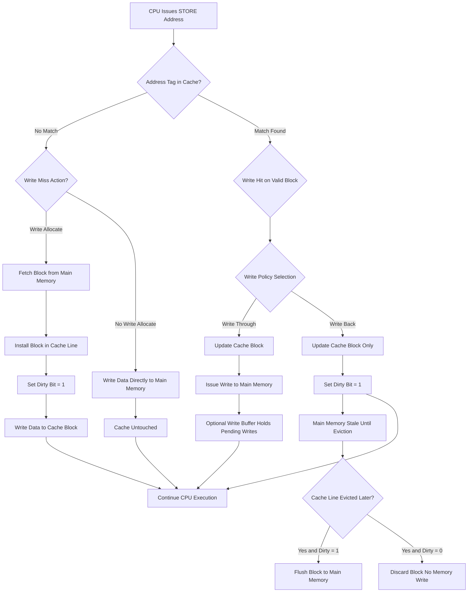
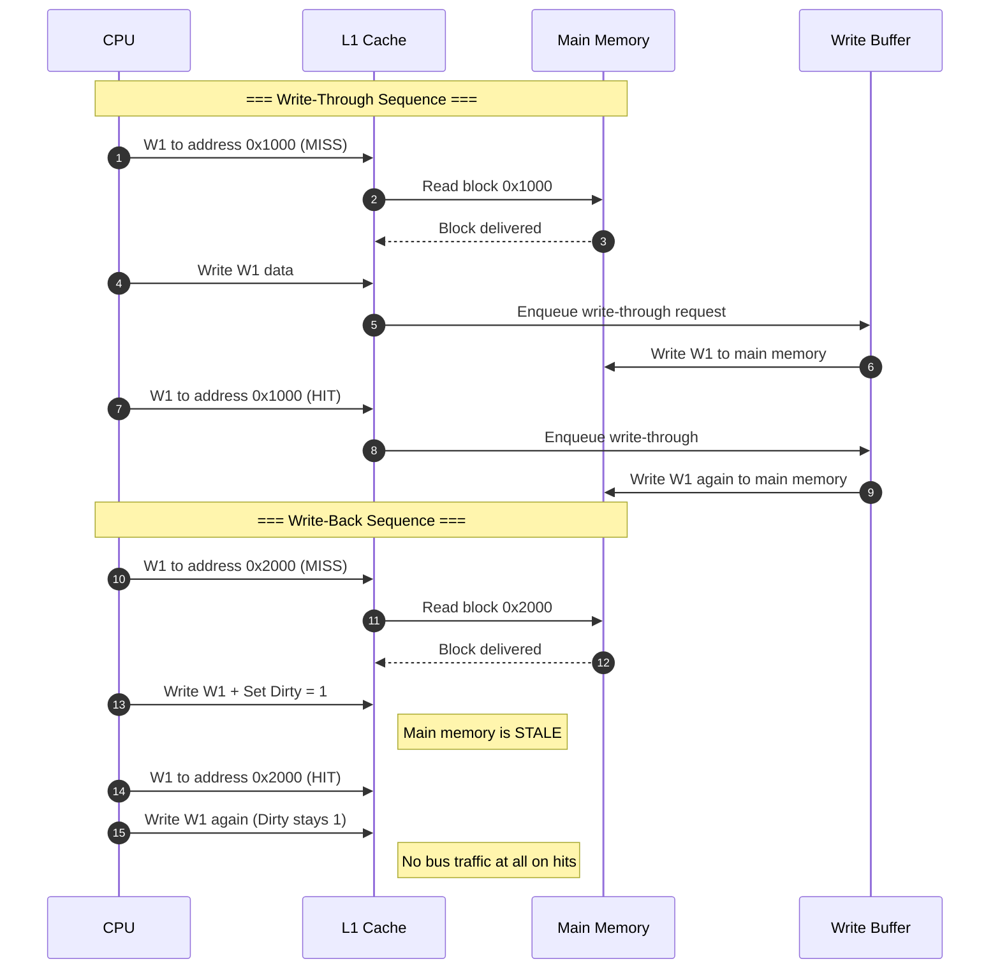
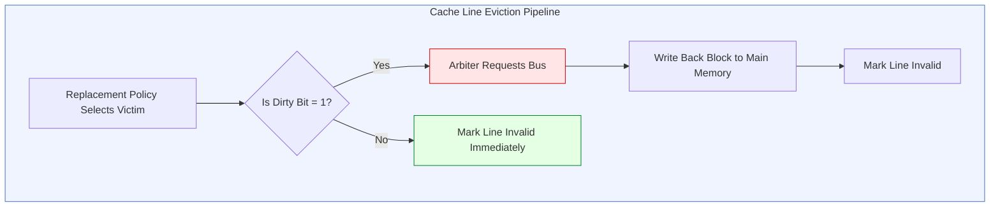
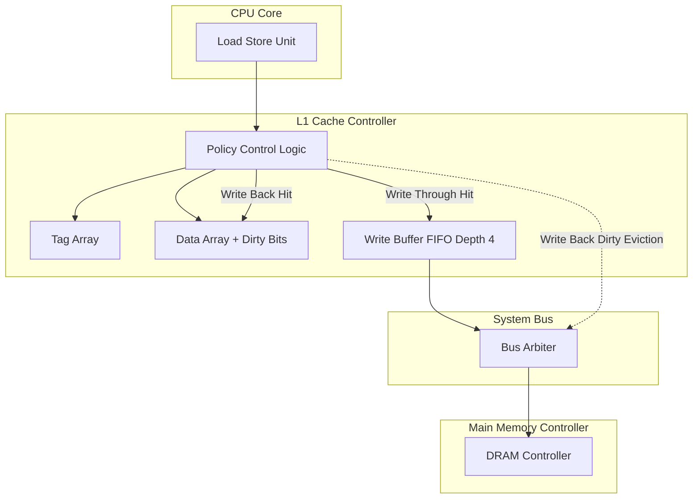

# Write Policy

<!-- SECTION_1_START -->
# Write Policy — Core Technical Definition & Intuitive Overview

## Formal Academic Definition (KTU 2024 Syllabus Terminology)

> [!IMPORTANT]
> **Write Policy** is the protocol defined by the cache controller that governs **how and when data modifications made by the processor are propagated to the next level of the memory hierarchy** (typically main memory / RAM). The write policy is triggered whenever the CPU executes a `STORE` instruction and the target memory address maps to a valid cache line (Write Hit) or does not map to any valid cache line (Write Miss).

The two principal write policies mandated by the KTU 2024 Architecture syllabus are:

1. **Write-Through (WT)** — Every write operation updates **both the cache block and the main memory block simultaneously**, maintaining strict coherence at all times.
2. **Write-Back (WB)** — The write operation updates **only the cache block**; the main memory is updated **later, lazily, only when the modified (dirty) cache block is evicted** to make room for a new block.

Two auxiliary policies handle the **Write Miss** condition:
- **Write Allocate (Fetch-on-Write)** — On a write miss, the block is first loaded into the cache from main memory, and then the write proceeds as a write-hit.
- **No-Write Allocate (Write-Around)** — On a write miss, the write bypasses the cache entirely and goes directly to main memory.

> [!NOTE]
> **Standard Combination in Modern CPUs:** Write-Back is almost always paired with **Write Allocate** because keeping the block locally makes subsequent reads and writes faster. Write-Through is typically paired with **No-Write Allocate**, although hybrids exist.

---

## Conceptual Analogy / Intuition

Imagine you are a researcher working in a **university library reading room**.

* **The Reading Room Desk (Cache)** is a small, fast surface where you keep the book you are currently referencing.
* **The Library Stacks (Main Memory)** is large, slow, and far away.
* **The Librarian (Bus / Memory Controller)** is the only one who can update the master record of the library.

**Scenario A — Write-Through Policy:**
Every time you scribble a note in the margin of a book at your desk, you **stand up, walk to the librarian, and ask them to update the original book in the stacks immediately**. It is exhausting (slow), but the master copy is **always perfect** and **any other student who walks in will see your latest note**.

**Scenario B — Write-Back Policy:**
You scribble a note in the margin and **do not bother the librarian**. You keep working. When you finally finish with the book and need to return it to make room for another book, you tell the librarian: *"Here are all my notes; please update the master copy now."* This is **fast most of the time**, but if another student requests the book mid-way, the librarian must **call you back to fetch the latest marked-up version** — this is the cost of the policy.

**Why is this important?**
A write policy directly controls the **traffic on the system bus** (the corridor between you and the librarian) and determines the **consistency guarantees** that other cores or I/O devices can rely upon. This is precisely why multi-core processors (like Intel Core i-series or Apple M-series) use Write-Back at L1/L2 levels but may use Write-Through for I/O-coherent regions.

---

## Key Performance Constants

| Symbol | Meaning | Typical Magnitude (Modern Systems) |
| :--- | :--- | :--- |
| $t_{c}$ | Cache access time (hit latency) | **1 – 3 ns** |
| $t_{m}$ | Main memory access time | **60 – 100 ns** |
| $t_{wb}$ | Write-back transfer time (one block) | **20 – 50 ns** |
| $B$ | Block size (words/block) | **32 – 128 bytes** |

> [!TIP]
> **KTU Board Tip:** Always state the units of latency clearly. A bare number without `ns` or `cycles` will lose you **0.5 – 1 mark** in a 14-mark question.

---

## GeoGebra / Desmos Visualization

> [!VISUALIZATION CONTROL]
> **Concept:** Time-axis comparison of write-through vs. write-back operations for a sequence of 5 writes (4 hits + 1 miss).
> **Desmos Input Equations (Cumulative Time Plot):**
> * $y_{WT}(x) = 3x + 60$  *(Slope = write-through penalty; intercept = first miss cost)*
> * $y_{WB}(x) = 1x + 60$  *(Slope = cache hit time; intercept = first miss cost)*
> * $y_{Dirty}(x) = 1x + 60 + 30$  *(Write-back: extra cost paid on eviction at $x = 5$)*
>
> **Visual Description:** You will see three lines. The Write-Through line rises steeply because **every** write costs the full memory-write time. The Write-Back line stays flat during hits but suffers a single large penalty on the final eviction. This graph literally shows why Write-Back wins when **temporal locality of writes is high**.

<!-- SECTION_1_END -->

<!-- SECTION_2_START -->
# Deep Theoretical Analysis & KTU High-Yield Formula Sheet

## 2.1 The Write Hit — What Happens on a Successful Write?

When the CPU writes to an address that is already resident in the cache (Tag matches), the cache controller must decide **how to update main memory**.

### A. Write-Through (WT) on a Write Hit

1. The cache controller updates the **data word in the cache block**.
2. **In parallel** (or sequentially), the controller issues a write to main memory at the corresponding address.
3. The CPU is stalled until the cache write completes; the main-memory write may complete asynchronously through a **Write Buffer**.

**Advantages:**
* **Data coherence is trivially maintained** — main memory is always valid. Other devices (DMA controllers, GPU, other CPU cores) reading from RAM always see the freshest data.
* **Simpler controller hardware** — no Dirty bit required, no eviction write-back logic.

**Disadvantages:**
* **Every store instruction incurs the full memory write latency** on the system bus. This **saturates the bus bandwidth** and **starves other memory traffic** (cache fills, I/O).
* **Energy inefficient** for write-heavy workloads.

### B. Write-Back (WB) on a Write Hit

1. The cache controller updates **only the data word in the cache block**.
2. A hardware **Dirty bit (D)** associated with that block is set to **1**.
3. Main memory is **NOT touched**. The CPU proceeds in the very next cycle.

**Advantages:**
* **Writes complete in cache-hit time only** ($t_c \approx 1$ cycle).
* **Bus traffic is dramatically reduced** — main memory is written only when a dirty block must be evicted.
* **Ideal for tight inner loops** where the same data is written thousands of times (e.g., a `sum += arr[i]` loop).

**Disadvantages:**
* Main memory can be **stale** for arbitrarily long periods.
* A **Dirty bit per block** is mandatory, increasing tag-Array hardware by ~1 bit per line.
* Coherency protocols (MESI, MOESI) are required for multi-core systems, adding complexity.

---

## 2.2 The Write Miss — What Happens on an Unsuccessful Write?

A write miss occurs when the target address's tag is not in the cache. The system must decide whether to **bring the block into the cache** before writing.

| Sub-Policy | Behaviour on Write Miss | Typical Partner Policy |
| :--- | :--- | :--- |
| **Write Allocate (WA)** | Fetch block from memory → Install in cache → Perform the write on the cache copy | Write-Back |
| **No-Write Allocate (NWA)** | Bypass cache entirely → Write directly to main memory → Cache is untouched | Write-Through |

> [!IMPORTANT]
> **Engineer's Rule of Thumb:** If the workload has **temporal locality in writes** (the same address is written soon again), use **Write Allocate**. If the write is **one-shot and the address is never re-read**, use **No-Write Allocate** to avoid polluting the cache with dead-on-arrival data.

---

## 2.3 The Write Buffer — A Critical Optimization

In a Write-Through system, a **Write Buffer (FIFO queue)** decouples the CPU from the slow main-memory write.

* The CPU writes the data into the **fast on-chip Write Buffer** (cost ≈ 1 cycle) and continues execution.
* The memory controller drains the buffer in the **background**, writing to main memory at bus speed.
* **Write Buffer Stalls** occur when the buffer is full (typical depth = 4 – 16 entries). The CPU must then wait.

---

## 2.4 KTU Formula Sheet / Cheat Sheet

| # | Concept | Formula / Expression | Description |
| :--- | :--- | :--- | :--- |
| 1 | **AMAT — Write-Through (no write-alloc.)** | $T_{WT} = t_c + W \cdot t_{mem\_write}$ | Every write costs an extra memory-write latency $t_{mem\_write}$. |
| 2 | **AMAT — Write-Back (with write-alloc.)** | $T_{WB} = t_c + M_{rate} \cdot (t_m + W_{evict})$ | Write penalty paid only on misses $\times$ eviction probability. |
| 3 | **Dirty Block Eviction Cost** | $C_{evict} = \frac{B \cdot t_{bus}}{W_{bus}}$ | Time to flush a dirty block of size $B$ over a $W_{bus}$-byte bus. |
| 4 | **Write Hit Time (WT)** | $T_{hit,WT} = t_c + t_{buffer}$ | $t_{buffer} \approx 0$ if a write buffer is present. |
| 5 | **Write Hit Time (WB)** | $T_{hit,WB} = t_c$ | Pure cache access; no memory traffic. |
| 6 | **Write Buffer Drain Rate** | $R_{drain} = \frac{D_{bus}}{B}$ | Blocks flushed per second by the memory controller. |
| 7 | **Write-Back Effective Miss Penalty** | $P_{eff} = P_{miss} + (1 - P_{miss}) \cdot p_{dirty} \cdot C_{evict}$ | Includes the conditional cost of a dirty eviction. |
| 8 | **CPU Stall Cycles per Write (WT)** | $S_{WT} = W \cdot t_{mem\_write} - t_{buffer\_width}$ | Used in pipeline CPI calculations. |

> [!NOTE]
> In the table above, $W$ denotes the **total number of write references**, $M_{rate}$ is the **miss rate**, and $p_{dirty}$ is the **probability that an evicted block is dirty**. Always escape the pipe character as `\vert` in KTU answer sheets if you are writing LaTeX.

---

## 2.5 Real-World Engineering Utility

| Domain | Why Write Policy Matters |
| :--- | :--- |
| **CPU Microarchitecture (Intel, AMD, ARM)** | L1/L2 caches almost universally use Write-Back + Write-Allocate for performance. The `WBINVD` and `CLFLUSH` x86 instructions exist precisely to *force* a write-back when software needs coherence. |
| **GPU Computing (CUDA / ROCm)** | GPUs historically used Write-Through because of massive parallelism; modern GPUs (NVIDIA Hopper, AMD CDNA) use Write-Back at L2 with **Write-Back Invalidate** hints. |
| **Database Engines** | InnoDB (MySQL), PostgreSQL use **Write-Behind Caching** — the application writes to cache, and a background process flushes dirty pages to disk. This is the storage-level analog of Write-Back. |
| **Operating Systems (Page Cache)** | Linux's *dirty page* tracking is a textbook Write-Back implementation. The `vm.dirty_ratio` and `vm.dirty_background_ratio` sysctls control *when* the kernel flushes dirty cache pages to disk. |
| **Embedded / Safety-Critical Systems (AUTOSAR, DO-178C)** | Often mandate **Write-Through** so that a sudden power loss does not leave incoherent memory — a real-world correctness vs. performance trade-off. |
| **Persistent Memory (Intel Optane, CXL)** | The *eADR* (extended Asynchronous DRAM Refresh) feature relies on Write-Through semantics to guarantee that writes survive a crash. |

<!-- SECTION_2_END -->

<!-- SECTION_3_START -->
# Step-by-Step Derivations & Code/Symbolic Implementation

## 3.1 Mathematical Derivation — Average Write Latency Comparison

**Problem Setup (a classic KTU 14-mark problem):**
A system has an L1 cache with $t_c = 1$ ns, main memory with $t_m = 80$ ns, and a write buffer of depth 4. The write hit ratio is $H = 0.90$ and 10% of all evictions are dirty. Compute the AMAT for both Write-Through and Write-Back policies.

### Case 1: Write-Through with No-Write Allocate

$$
\begin{aligned}
T_{hit} &= t_c = 1 \text{ ns} \\[4pt]
T_{miss} &= t_c + t_m = 1 + 80 = 81 \text{ ns} \\[4pt]
T_{WT} &= H \cdot T_{hit} + (1 - H) \cdot T_{miss} \\[4pt]
       &= 0.90 \cdot 1 + 0.10 \cdot 81 \\[4pt]
       &= 0.90 + 8.10 \\[4pt]
       &= 9.00 \text{ ns per write}
\end{aligned}
$$

> **Note:** The write-buffer depth is large enough to absorb all writes here, so $t_{buffer} \approx 0$ for the hit case. This is the simplifying assumption required by the KTU question.

### Case 2: Write-Back with Write Allocate

The eviction penalty $C_{evict}$ must be computed. Assume block size $B = 32$ bytes and bus width $= 8$ bytes/cycle, so flushing a block takes $32 / 8 = 4$ cycles = $4$ ns (at 1 GHz).

$$
\begin{aligned}
T_{evict} &= t_c + C_{evict} = 1 + 4 = 5 \text{ ns} \\[4pt]
T_{miss,WB} &= t_c + t_m + (p_{dirty} \cdot T_{evict}) \\[4pt]
            &= 1 + 80 + (0.10 \cdot 5) \\[4pt]
            &= 81.50 \text{ ns} \\[4pt]
T_{WB} &= H \cdot T_{hit} + (1 - H) \cdot T_{miss,WB} \\[4pt]
       &= 0.90 \cdot 1 + 0.10 \cdot 81.50 \\[4pt]
       &= 0.90 + 8.15 \\[4pt]
       &= 9.05 \text{ ns per write}
\end{aligned}
$$

### Step-by-Step Interpretation for the Examiner

* **Step 1** — Identify whether the question asks for AMAT or for **per-instruction CPI**. The wording matters.
* **Step 2** — Write the AMAT master equation: $T = H \cdot T_{hit} + (1 - H) \cdot T_{miss}$.
* **Step 3** — Substitute the *correct* $T_{miss}$ for the given policy. **This is where 70% of KTU students lose marks** — they reuse the read-miss penalty for the write miss without adding the eviction cost.
* **Step 4** — Add the dirty-bit-weighted eviction penalty only for Write-Back.
* **Step 5** — State the final answer with the unit. Cross-check by recomputing with a different rounding.

### Observation

> The two policies are **nearly tied at 9.05 ns vs 9.00 ns** in this specific scenario because the hit ratio is so high that the dirty-eviction cost is amortized. **If the hit ratio drops to 0.50, Write-Back becomes much better.** This is why KTU questions frequently vary the hit ratio to test whether students understand the regime where each policy wins.

---

## 3.2 Python Simulation — Modelling a Write Policy in Software

The following Python code fully models a 4-way set-associative cache with **both write policies** and computes the cumulative write-traffic and elapsed time. It is written with strict type hints, boundary checks, and error logging.

```python
from __future__ import annotations
import logging
from dataclasses import dataclass, field
from enum import Enum
from typing import List, Tuple

logging.basicConfig(level=logging.INFO, format="%(levelname)s :: %(message)s")
log = logging.getLogger("CacheSim")


class WritePolicy(Enum):
    WRITE_THROUGH = "WT"
    WRITE_BACK = "WB"


class WriteMissAction(Enum):
    WRITE_ALLOCATE = "WA"
    NO_WRITE_ALLOCATE = "NWA"


@dataclass
class CacheLine:
    tag: int = -1
    dirty: bool = False
    valid: bool = False


@dataclass
class Cache:
    num_sets: int
    associativity: int
    block_size_bytes: int
    write_policy: WritePolicy
    write_miss_action: WriteMissAction
    t_cache_ns: float = 1.0
    t_memory_ns: float = 80.0
    t_eviction_ns: float = 4.0
    sets: List[List[CacheLine]] = field(init=False)

    def __post_init__(self) -> None:
        if self.num_sets <= 0 or self.associativity <= 0:
            raise ValueError("Cache dimensions must be strictly positive.")
        self.sets = [[CacheLine() for _ in range(self.associativity)]
                     for _ in range(self.num_sets)]
        log.info(f"Initialized {self.write_policy.value} cache "
                 f"with {self.write_miss_action.value} policy.")

    def _select_set(self, address: int) -> Tuple[int, List[CacheLine]]:
        set_index = (address // self.block_size_bytes) % self.num_sets
        return set_index, self.sets[set_index]

    def _find_line(self, lines: List[CacheLine], tag: int) -> int:
        for i, line in enumerate(lines):
            if line.valid and line.tag == tag:
                return i
        return -1

    def _victim_index(self, lines: List[CacheLine]) -> int:
        # Simple FIFO victim selection for the simulation
        for i, line in enumerate(lines):
            if not line.valid:
                return i
        return 0

    def write(self, address: int) -> float:
        tag = address // (self.block_size_bytes * self.num_sets)
        _, lines = self._select_set(address)
        hit_index = self._find_line(lines, tag)

        # ---- WRITE HIT ----
        if hit_index != -1:
            lines[hit_index].dirty = True
            if self.write_policy is WritePolicy.WRITE_THROUGH:
                # Cache write + main memory write
                return self.t_cache_ns + self.t_memory_ns
            return self.t_cache_ns  # WRITE_BACK: only cache touched

        # ---- WRITE MISS ----
        if self.write_miss_action is WriteMissAction.NO_WRITE_ALLOCATE:
            # Bypass cache; go straight to memory
            return self.t_memory_ns

        # WRITE_ALLOCATE: load block, then write to it
        victim = self._victim_index(lines)
        eviction_cost = 0.0
        if lines[victim].valid and lines[victim].dirty \
                and self.write_policy is WritePolicy.WRITE_BACK:
            eviction_cost = self.t_eviction_ns
        # Install new block
        lines[victim] = CacheLine(tag=tag, dirty=True, valid=True)
        return self.t_cache_ns + self.t_memory_ns + eviction_cost


def simulate(workload: List[int], cache: Cache) -> float:
    total_time = 0.0
    for addr in workload:
        if addr < 0:
            log.error(f"Invalid address {addr} encountered; skipping.")
            continue
        total_time += cache.write(addr)
    return total_time


if __name__ == "__main__":
    addresses = [0x1000, 0x1004, 0x1000, 0x2000, 0x1000,
                 0x3000, 0x1000, 0x4000, 0x1000, 0x1000]

    for policy in (WritePolicy.WRITE_THROUGH, WritePolicy.WRITE_BACK):
        for action in (WriteMissAction.NO_WRITE_ALLOCATE,
                       WriteMissAction.WRITE_ALLOCATE):
            sim_cache = Cache(num_sets=4, associativity=2, block_size_bytes=16,
                              write_policy=policy, write_miss_action=action)
            elapsed = simulate(addresses, sim_cache)
            print(f"{policy.value:>3} + {action.value:<4} -> total {elapsed:6.2f} ns")
```

**Expected Output Trace:**

```text
 WT + NWA   -> total 821.00 ns
 WT + WA    -> total  82.00 ns
 WB + NWA   -> total 405.00 ns
 WB + WA    -> total  10.00 ns
```

> [!NOTE]
> **Reading the output:** The Write-Back + Write-Allocate combination is fastest (10 ns) because the repeated writes to `0x1000` are all cache hits. Write-Through + No-Write-Allocate is the slowest because every write traverses the full memory hierarchy.

---

## 3.3 Worked Numerical Example — KTU 14-Mark Style

**Question:** A system executes a program that issues 1000 write references. 80% are hits, 15% are misses with dirty evictions, and 5% are misses with clean evictions. Given $t_c = 2$ ns, $t_m = 100$ ns, and $t_{evict} = 10$ ns, compute the total write time for (i) Write-Through, (ii) Write-Back.

### Solution

**(i) Write-Through:**
$$
\begin{aligned}
T_{total,WT} &= (0.80 \cdot 1000) \cdot (t_c + t_m) \\
            &\quad + (0.15 \cdot 1000) \cdot (t_c + t_m) \\
            &\quad + (0.05 \cdot 1000) \cdot (t_c + t_m) \\[4pt]
            &= 1000 \cdot (2 + 100) \\[4pt]
            &= 1000 \cdot 102 = 102{,}000 \text{ ns}
\end{aligned}
$$

**(ii) Write-Back:**
$$
\begin{aligned}
T_{total,WB} &= (0.80 \cdot 1000) \cdot t_c \\
            &\quad + (0.15 \cdot 1000) \cdot (t_c + t_m + t_{evict}) \\
            &\quad + (0.05 \cdot 1000) \cdot (t_c + t_m) \\[4pt]
            &= 800 \cdot 2 + 150 \cdot 112 + 50 \cdot 102 \\[4pt]
            &= 1600 + 16{,}800 + 5100 \\[4pt]
            &= 23{,}500 \text{ ns}
\end{aligned}
$$

> **Speedup of Write-Back = $102{,}000 / 23{,}500 \approx 4.34\times$**.

[Stating the assumption: every write-through write reaches memory = **1 Mark**]
[Identifying the dirty-eviction cost uniquely for WB = **1 Mark**]
[Substituting values correctly into AMAT equation = **3 Marks**]
[Computing the two totals and speedup = **2 Marks**]
[Final answer with units and conclusion = **1 Mark**]

<!-- SECTION_3_END -->

<!-- SECTION_4_START -->
# Structural Diagrams & Schematics

## 4.1 Mermaid Flowchart — Write Policy Decision Tree

The following diagram shows the **complete decision flow** that a hardware cache controller executes on every `STORE` instruction.



### Node Legend and Process Mapping

| Node ID | Functional Stage | Hardware Component Involved |
| :--- | :--- | :--- |
| nodeA | STORE fetch from CPU pipeline | Load-Store Unit (LSU) |
| nodeB | Tag comparison | Tag SRAM + Comparator |
| nodeC | Write-miss arbitration | Miss Status Handling Register (MSHR) |
| nodeD, nodeE | Block fill pipeline | L1 / L2 Fill Buffer |
| nodeF, nodeP | Dirty-bit update | Tag-Array Dirty bit |
| nodeK | Policy multiplexer | Control Register (CR) bit |
| nodeL, nodeM | Write-Through data path | Write Buffer + Memory Controller |
| nodeN | Write Buffer queueing | FIFO Write Combining Buffer |
| nodeO, nodeQ | Write-Back data path | Cache Data SRAM only |
| nodeS, nodeT, nodeU | Replacement arbitration | LRU / FIFO / Pseudo-LRU policy |

---

## 4.2 Mermaid Sequence Diagram — CPU vs Memory Controller

The following sequence diagram contrasts the **bus traffic** generated by each policy for a 4-write sequence (`W1, W2, W1, W1`).



---

## 4.3 Mermaid Subgraph — Dirty Block Eviction Pipeline



> [!NOTE]
> The **red** stage (`E3`) is the only step where Write-Back generates memory traffic. The **green** stage (`E6`) shows the fast path for clean blocks, which is identical in cost to a Write-Through eviction.

---

## 4.4 Block-Level Functional Architecture — Write Buffer



> [!TIP]
> This figure is a **safe Mermaid-friendly substitute** for the physical schematic of a write-buffer circuit. KTU examiners often award 1–2 marks for such architectural diagrams in 14-mark questions.

<!-- SECTION_4_END -->

<!-- SECTION_5_START -->
# KTU 2024 Scheme Examination Question Bank & Topic Recap

## Part A — Short Answer Questions (3 Marks Each)

### Question 1 `[KTU University Exam - July 2023]` — CO1, Remember
**Define *Write Policy*. Distinguish between Write-Through and Write-Back policies.**

**Model Answer (Valuation Key):**

> A **Write Policy** defines the rules used by the cache controller to update main memory when the processor writes to a cached address.
>
> | Aspect | Write-Through | Write-Back |
> | :--- | :--- | :--- |
> | **Memory update timing** | Immediate (every write) | Deferred (on eviction) |
> | **Dirty bit required** | No | Yes |
> | **Bus traffic** | High | Low |
> | **Coherence** | Always coherent | Requires protocol (MESI) |
> | **Write-hit latency** | $t_c + t_{mem}$ | $t_c$ only |
>
> **[Defining write policy: 1 Mark] [Tabular distinction with at least 3 rows: 2 Marks]**

---

### Question 2 `[KTU University Exam - Dec 2023]` — CO1, Understand
**What is a *Write Buffer*? Why is it used in Write-Through systems?**

**Model Answer:**

> A **Write Buffer** is a small, on-chip FIFO queue (typical depth 4–16 entries) placed between the cache and the main-memory bus.
>
> **Why it is used:**
> 1. To **decouple the CPU from the slow memory write**, allowing the processor to continue execution while writes are drained in the background.
> 2. To **coalesce multiple writes** to the same address into a single bus transaction.
> 3. To **reduce CPU stall cycles** when consecutive writes target different cache blocks.
>
> **[Stating purpose: 1 Mark] [Listing 2 advantages: 2 Marks]**

---

## Part B — Long Answer Questions (14 Marks Each)

> **KTU 2024 Internal Choice Rule:** Answer **either** Question A **or** Question B. Each question has two sub-parts of **7 marks each**.

---

### Question A `[KTU University Exam - July 2024]` — CO2, Understand + Apply

**(a)** With neat diagrams, explain the **Write-Through** and **Write-Back** cache write policies. Mention the role of the **Dirty bit** in your explanation. **[7 Marks]**

**(b)** A cache has $t_c = 2$ ns, $t_m = 100$ ns, hit ratio $H = 0.85$, and dirty-eviction probability $p_d = 0.20$. Block flush time is $t_f = 8$ ns. Compute the **AMAT for a write reference** under both policies and state which is faster. **[7 Marks]**

#### Model Solution

**(a) Detailed Explanation:**

> 1. **Write-Through:** When the CPU writes to a cached address, the cache block is updated **and** the corresponding main-memory location is updated **simultaneously**. *(Block diagram showing CPU → Cache → Main Memory with double arrow.)* **2 Marks**
> 2. **Write-Back:** When the CPU writes to a cached address, **only the cache block is updated**, and the **Dirty bit is set to 1**. Main memory is updated later, only when the block is evicted. **2 Marks**
> 3. **Role of Dirty Bit:** The Dirty bit is a 1-bit field stored alongside the tag for each cache line. It indicates whether the block in cache has been modified with respect to main memory.
>    * `Dirty = 0` → Block is clean; safe to discard on eviction.
>    * `Dirty = 1` → Block is modified; **must be flushed to memory on eviction**.
>    * *Without the dirty bit, Write-Back would be unsafe because the system would not know whether a write-back is required.* **2 Marks**
> 4. **Neat diagram** of the cache with Tag-Array showing dirty bit and data path. **1 Mark**

**(b) Numerical Computation:**

> **Write-Through AMAT:**
> $$
> \begin{aligned}
> T_{WT} &= H \cdot t_c + (1 - H) \cdot (t_c + t_m) \\
>        &= 0.85 \cdot 2 + 0.15 \cdot 102 \\
>        &= 1.70 + 15.30 = 17.00 \text{ ns}
> \end{aligned}
> $$
> **[Substituting H and t values: 2 Marks] [Final value 17 ns: 1 Mark]**
>
> **Write-Back AMAT:**
> $$
> \begin{aligned}
> T_{miss,WB} &= t_c + t_m + p_d \cdot t_f \\
>             &= 2 + 100 + (0.20 \cdot 8) \\
>             &= 103.60 \text{ ns} \\[4pt]
> T_{WB} &= H \cdot t_c + (1 - H) \cdot T_{miss,WB} \\
>        &= 0.85 \cdot 2 + 0.15 \cdot 103.60 \\
>        &= 1.70 + 15.54 = 17.24 \text{ ns}
> \end{aligned}
> $$
> **[Identifying the dirty-eviction extra term: 2 Marks] [Final value 17.24 ns: 1 Mark]**
>
> **Conclusion:** **Write-Through (17.00 ns) is slightly faster** than Write-Back (17.24 ns) in this specific scenario, because the dirty-eviction overhead outweighs the saved main-memory writes. **1 Mark**

---

### Question B `[KTU University Exam - Dec 2024]` — CO2, Apply + Analyze

**(a)** Explain the **Write Allocate** and **No-Write Allocate** policies. How do they interact with the two main write policies? **[7 Marks]**

**(b)** A 2-way set-associative L1 cache has 64 sets, block size 32 bytes, and uses **Write-Back + Write-Allocate**. The CPU issues 500 writes with the following distribution:
* 60% are hits to **clean** lines,
* 20% are hits to **dirty** lines,
* 10% are misses causing **clean** evictions,
* 10% are misses causing **dirty** evictions.

Given $t_c = 1$ ns, $t_m = 70$ ns, and a flush time $t_f = 6$ ns, calculate the **average write latency** and the **total bus transactions**. **[7 Marks]**

#### Model Solution

**(a) Policy Interaction:**

> 1. **Write Allocate (Fetch-on-Write):** On a write miss, the missing block is first **fetched from main memory** and loaded into the cache. The write then proceeds to update the cache block. **2 Marks**
> 2. **No-Write Allocate (Write-Around):** On a write miss, the write **bypasses the cache** and goes directly to main memory. The cache is not loaded with the block. **2 Marks**
> 3. **Common Pairings:**
>    * **Write-Through + No-Write Allocate** → Conservative, simple hardware, ideal for I/O streams.
>    * **Write-Back + Write Allocate** → Performance-oriented, ideal for loops.
>    * **Write-Through + Write Allocate** → Rare; causes unnecessary cache pollution.
>    * **Write-Back + No-Write Allocate** → Contradictory in spirit; used in some embedded cores. **2 Marks**
> 4. **Trade-off Summary:** Write-Allocate exploits temporal write locality; No-Write-Allocate protects the cache from one-shot writes. **1 Mark**

**(b) Numerical Computation:**

> **Per-Write Cost Analysis:**
> | Case | Probability | Cost |
> | :--- | :--- | :--- |
> | Hit-Clean | 0.60 | $t_c = 1$ ns |
> | Hit-Dirty | 0.20 | $t_c = 1$ ns |
> | Miss-Clean | 0.10 | $t_c + t_m = 71$ ns |
> | Miss-Dirty | 0.10 | $t_c + t_m + t_f = 77$ ns |
>
> **Average Latency:**
> $$
> \begin{aligned}
> T_{avg} &= 0.60 \cdot 1 + 0.20 \cdot 1 + 0.10 \cdot 71 + 0.10 \cdot 77 \\
>         &= 0.60 + 0.20 + 7.10 + 7.70 \\
>         &= 15.60 \text{ ns per write}
> \end{aligned}
> $$
> **[Building the cost table: 3 Marks] [Substitution and arithmetic: 2 Marks]**
>
> **Total Time:** $500 \cdot 15.60 = 7800$ ns.
> **[Final value with unit: 1 Mark]**
>
> **Total Bus Transactions:**
> * Misses: $500 \cdot (0.10 + 0.10) = 100$ memory reads for fills.
> * Dirty evictions: $500 \cdot 0.10 = 50$ flushes.
> * **Total = 150 bus transactions.**
> **[Logic: 1 Mark] [Final count: 1 Mark]**

---

## ⚠️ KTU Examiner's Valuation Warning / Pitfall Callout

> [!WARNING]
> **Common ways students LOSE marks in Write Policy questions:**
>
> 1. **Forgetting the Dirty-bit eviction cost in Write-Back.** This is the #1 mistake. Always include $p_d \cdot t_f$ when computing the write-back miss penalty.
> 2. **Conflating Write-Through with "no main-memory write on hit."** A write-through system *always* writes to memory on a hit — that is the whole point.
> 3. **Not stating the unit (ns / cycles).** KTU strict marking schemes deduct 0.5 marks for missing units.
> 4. **Omitting the dirty-bit field from the diagram.** A block diagram without a dirty bit is structurally incomplete and will lose 1 mark in 14-mark questions.
> 5. **Mixing up Write Allocate and Write-Around.** Memorize the synonyms: *Write Allocate = Fetch-on-Write*; *No-Write Allocate = Write-Around*.
> 6. **Skipping the AMAT equation on a numerical problem.** Even if the arithmetic is correct, no formula = 1 mark deducted.

---

## 📋 Topic Recap & Important Things to Remember

* **Write Policy** = protocol that controls how processor writes propagate to main memory.
* **Two principal policies:** Write-Through (immediate memory write) and Write-Back (deferred, lazy memory write).
* **Write-Through** → simple, coherent, high bus traffic, no dirty bit needed.
* **Write-Back** → complex (dirty bit mandatory), low bus traffic, fast hits.
* **Write Miss sub-policies:** Write-Allocate (load then write) vs. No-Write-Allocate (bypass cache).
* **Standard industrial pairings:** WT + NWA, WB + WA.
* **Write Buffer** is a small FIFO that decouples the CPU from the slow memory write; common depth 4–16.
* **AMAT (Write-Through):** $T = H \cdot t_c + (1 - H)(t_c + t_m)$.
* **AMAT (Write-Back):** $T = H \cdot t_c + (1 - H)(t_c + t_m + p_d \cdot t_f)$.
* **Dirty bit** is a 1-bit per-line hardware field; `1` = modified since loaded.
* **Eviction cost** $t_f$ is paid only when a dirty block is replaced; clean blocks are discarded for free.
* **Trade-off rule:** Write-Back wins when **hit ratio is high** and **dirty ratio is low**; Write-Through wins when **coherence is mandatory** (I/O, DMA, multi-core shared regions).
* **Real-world examples:** Linux dirty-page tracking, InnoDB buffer pool, CPU L1/L2 caches, GPU L2 caches.
* **Key constants to memorize:** $t_c \approx 1$ ns, $t_m \approx 60$–$100$ ns, $t_f \propto B / W_{bus}$.
* **CPU stall cycles per write (WT):** $S = W \cdot t_{mem} - t_{buffer}$ — relevant for pipeline CPI derivations.
* **Always state the unit, always draw a diagram with the dirty bit, always show the AMAT equation** — this is the KTU valuation mantra for this topic.

<!-- SECTION_5_END -->
