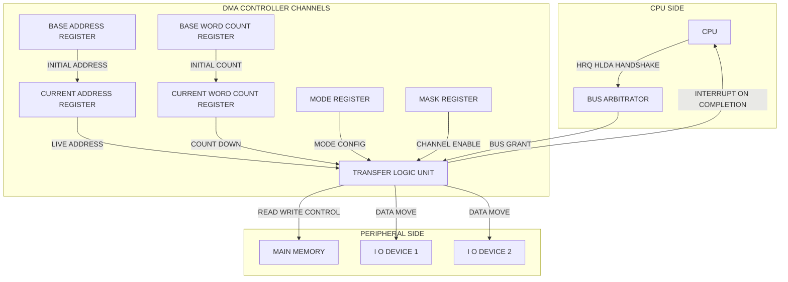
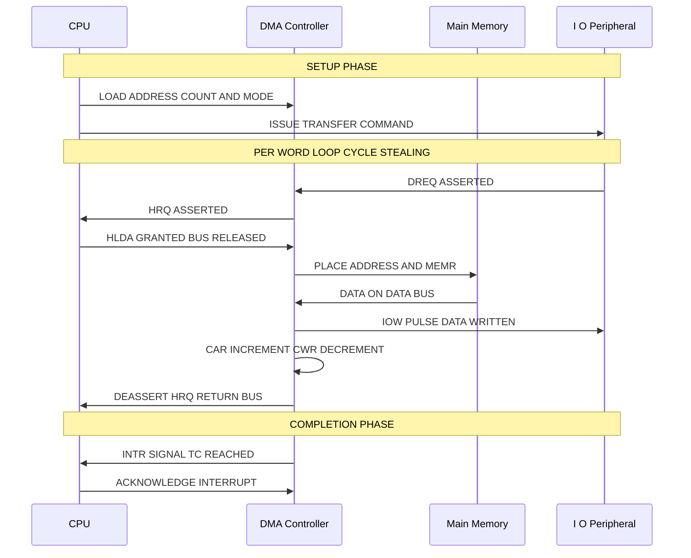
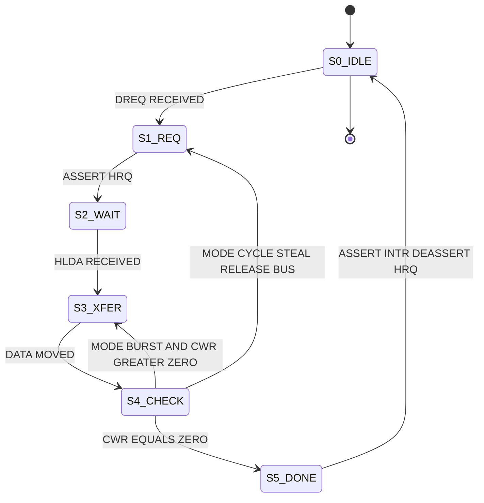

# DMA: Controller operations, Cycle Stealing mode vs Burst Mode configurations

<!-- SECTION_1_START -->
# DMA: Controller Operations, Cycle Stealing vs Burst Mode Configurations

## 1. Core Technical Definition

> [!IMPORTANT]
> **Direct Memory Access (DMA)** is a high-speed data transfer technique in which an external device (the **DMA Controller / DMAC**) takes direct control of the system buses to transfer blocks of data between an I/O device and main memory **without continuous CPU intervention**. The CPU initiates the transfer, executes other instructions in parallel, and receives a single interrupt only when the entire transfer is complete.

### 1.1 Formal KTU 2024 Definition
As per the KTU 2024 Scheme syllabus (PBCST404, Module 4), DMA is a *bus mastering technique* wherein the DMA controller acts as a **temporary master** of the system bus, arbitrating with the CPU via dedicated **Hold Request (HRQ)** and **Hold Acknowledge (HLDA)** handshake lines. The DMAC performs read/write cycles on behalf of the requesting peripheral, effectively offloading the data-movement workload from the processor.

### 1.2 Conceptual Analogy (Intuition)

> [!NOTE]
> **Analogy: The Office Courier Service**
> Think of the CPU as a **busy manager** working at a desk. Normally, every time the office needs files moved between the storeroom (Memory) and an outside client (I/O Device), the manager must personally walk back and forth (Programmed I/O) or repeatedly check on a junior (Interrupt-driven I/O). This wastes the manager's time.
>
> **DMA** is like hiring a **dedicated courier (DMAC)**. The manager hands the courier a *chit of instructions* (Source Address, Destination Address, Word Count) and goes back to strategic work. The courier moves all the files autonomously and only pings the manager (Interrupt) when the entire job is done.

### 1.3 Key Constants & Standard Metrics

| Parameter | Standard Value | Significance |
|---|---|---|
| **DMAC Clock Frequency** | Same as system bus clock | Synchronization boundary |
| **Bus Width** | 8 / 16 / 32 / 64 bits | Data transferred per DMA cycle |
| **Hold Latency** | 1–2 bus cycles (typical) | Time for CPU to release bus |
| **Transfer Rate** | Up to bus bandwidth (e.g., **1333 MB/s** for PCIe 3.0 x1) | Peak throughput |

### 1.4 Visualization Control

> [!VISUALIZATION CONTROL]
> **Concept:** Bus Ownership Timeline — CPU vs DMAC
> **GeoGebra / Desmos Input Equations:**
> * Let $T$ represent time on the x-axis (in microseconds)
> * Plot two step functions: $f_{CPU}(T)$ and $f_{DMAC}(T)$, each equal to **1** when the respective master owns the bus
> * Constraint: $f_{CPU}(T) + f_{DMAC}(T) = 1$ at all times (mutually exclusive ownership)
> **Visual Description:** The student should observe a staircase-like alternating ownership pattern for **Cycle Stealing**, and a single long continuous block of DMAC ownership for **Burst Mode**.

---

<!-- SECTION_1_END -->

<!-- SECTION_2_START -->
# 2. Deep Theoretical Analysis & KTU High-Yield Formula Sheet

## 2.1 Internal Architecture of a Typical DMA Controller (e.g., Intel 8257 / 8237)

The DMAC contains the following **internal registers** for each channel:

1. **Base Address Register (BAR)** – Holds the *starting memory address* for the transfer.
2. **Word Count Register (WCR)** – Holds the *number of words* to be transferred.
3. **Current Address Register (CAR)** – Auto-increments/decrements during transfer.
4. **Current Word Count Register (CWR)** – Auto-decrements; triggers terminal count (TC) at zero.
5. **Mode Register (MR)** – Selects **Read/Write/Verify**, **Auto-initialize**, and **Transfer Mode**.
6. **Mask Register (MSK)** – Enables/Disables individual DMA channels.
7. **Command Register (CR)** – Global controller commands (e.g., enable/disable controller).

## 2.2 Step-by-Step Operational Flow of a DMA Transfer

1. **CPU Programs the DMAC:** The CPU executes I/O instructions to load the BAR, WCR, and MR for the chosen channel.
2. **Peripheral Request:** The I/O device asserts the **DREQ** (DMA Request) line connected to the DMAC.
3. **Bus Request:** The DMAC asserts **HRQ** to the CPU.
4. **Bus Acknowledge:** The CPU completes its current bus cycle, floats its address/data/control lines (tri-state), and returns **HLDA** to the DMAC.
5. **Address Placement:** The DMAC places the memory address on the address bus (from CAR).
6. **Data Transfer:** DMAC asserts **MEMR** and **IOW** (or **MEMW** and **IOR**) to perform the actual byte/word transfer.
7. **Auto-Update:** CAR is incremented/decremented, CWR is decremented.
8. **Loop Decision:** Based on the configured mode, DMAC either *releases* the bus or *continues*.
9. **Terminal Count (TC):** When CWR reaches zero, the DMAC de-asserts HRQ, returns the bus to the CPU, and raises an **INTR** to signal completion.

## 2.3 The Three DMA Transfer Modes — Comprehensive Analysis

### Mode A: Burst Mode (Block Transfer Mode)
- The DMAC seizes the bus and holds it for the **entire duration** of the block transfer.
- The CPU is **completely locked out** from main memory until the TC signal is generated.
- **Advantage:** Highest throughput, since there is no bus arbitration overhead between words.
- **Disadvantage:** CPU may suffer significant **latency** and may be unable to fetch critical instructions, leading to **CPU starvation**.

### Mode B: Cycle Stealing Mode
- The DMAC transfers **only one byte/word** per acquisition of the bus.
- After each transfer, the DMAC **releases the bus** back to the CPU.
- The CPU and DMAC effectively *interleave* their bus access cycles.
- **Advantage:** CPU is not blocked; can execute instructions in parallel (slower, but responsive).
- **Disadvantage:** Higher overhead per word due to repeated arbitration.

### Mode C: Transparent Mode
- The DMAC transfers data **only during cycles when the CPU is not using the bus** (e.g., during instruction decode or operand fetch idle slots).
- **Advantage:** Zero impact on CPU performance.
- **Disadvantage:** Extremely complex to implement; lowest throughput.

## 2.4 KTU High-Yield Formula Sheet

> [!NOTE]
> All formulas below are derived from fundamental bus timing principles. They are critical for KTU 2024 numerical problems.

| # | Formula / Concept | Description | Units |
|---|---|---|---|
| 1 | $T_{total} = n \times t_{cycle} + 2 t_{arb}$ | Total time for a burst-mode DMA transfer of $n$ words. $t_{arb}$ = single bus arbitration time. | seconds |
| 2 | $T_{total} = n \times (t_{cycle} + 2 t_{arb})$ | Total time for a cycle-stealing DMA transfer of $n$ words. | seconds |
| 3 | $P_{bus} = \dfrac{n \times t_{cycle}}{T_{total}} \times 100\%$ | Percentage of bus time utilized by DMAC. | percent |
| 4 | $\eta_{dma} = \dfrac{t_{cycle}}{t_{cycle} + 2 t_{arb}}$ | DMA efficiency per transfer (0 to 1). | dimensionless |
| 5 | $B_{th} = \dfrac{W \times f_{bus}}{10^6}$ | DMA throughput, $W$ = bus width (bits), $f_{bus}$ in Hz. | MB/s |
| 6 | $C_{transfer} = \dfrac{n \times W}{8}$ | Total bytes transferred (Block size). | bytes |
| 7 | $\text{Latency}_{CPU} = n \times t_{cycle}$ | CPU wait time in burst mode. | seconds |

> [!WARNING]
> In the table above, the **vertical bar** notation for "absolute value" is rendered as $\vert \cdot \vert$ to prevent markdown table syntax breakage. Students writing this on paper should use standard $\mid$ notation.

## 2.5 Real-World Engineering Utility

- **Disk Controllers (SATA/NVMe):** Use burst-mode DMA to stream large files at gigabit speeds.
- **Audio/Video Processing:** Use cycle-stealing DMA for real-time streaming without glitching the CPU.
- **Network Interface Cards (NICs):** Use DMA with descriptor rings, often in cycle-stealing variants, to move packets to RAM.
- **Embedded Systems (ARM Cortex-M DMA):** Use cycle stealing for sensor data acquisition.
- **GPUs (DirectX/Vulkan):** Use large burst DMA transfers to swap framebuffers with system RAM.

---

<!-- SECTION_2_END -->

<!-- SECTION_3_START -->
# 3. Step-by-Step Derivations, Numerical Solutions & Code Implementation

## 3.1 Exhaustive Numerical Derivation — DMA Transfer Time Comparison

> [!NOTE]
> **Problem (KTU Standard Pattern):** A DMA controller is configured to transfer **2048 words** from an I/O device to memory. The system bus clock is **100 MHz**, each bus transfer (word) takes **1 cycle**, and each bus arbitration (HRQ/HLDA handshake) takes **3 cycles**. Calculate the total transfer time and bus utilization efficiency for **(a) Burst Mode** and **(b) Cycle Stealing Mode**.

### Given Data
- $n = 2048$ words
- $f_{bus} = 100 \text{ MHz} \implies t_{cycle} = 1 / f_{bus} = 10 \text{ ns}$
- $t_{arb} = 3 \text{ cycles} = 3 \times 10 \text{ ns} = 30 \text{ ns}$

### Part (a) — Burst Mode

In burst mode, arbitration happens **once** at the beginning of the block (HRQ + HLDA) and **once** at the end (de-assert HRQ + TC).

$$
\begin{aligned}
T_{burst} &= n \times t_{cycle} + 2 \times t_{arb} \\
&= 2048 \times 10 \text{ ns} + 2 \times 30 \text{ ns} \\
&= 20480 \text{ ns} + 60 \text{ ns} \\
&= 20540 \text{ ns} \\
&= 20.54 \text{ \mu s}
\end{aligned}
$$

The bus utilization efficiency (fraction of time bus is busy with actual data movement):

$$
\begin{aligned}
\eta_{burst} &= \frac{n \times t_{cycle}}{T_{burst}} \\
&= \frac{2048 \times 10}{20540} \\
&= \frac{20480}{20540} \\
&\approx 0.9971 \\
&\approx 99.71 \%
\end{aligned}
$$

### Part (b) — Cycle Stealing Mode

In cycle stealing, arbitration happens **before every single word transfer**.

$$
\begin{aligned}
T_{steal} &= n \times (t_{cycle} + 2 \times t_{arb}) \\
&= 2048 \times (10 + 2 \times 30) \text{ ns} \\
&= 2048 \times (10 + 60) \text{ ns} \\
&= 2048 \times 70 \text{ ns} \\
&= 143360 \text{ ns} \\
&= 143.36 \text{ \mu s}
\end{aligned}
$$

The bus utilization efficiency:

$$
\begin{aligned}
\eta_{steal} &= \frac{n \times t_{cycle}}{T_{steal}} \\
&= \frac{20480}{143360} \\
&\approx 0.1429 \\
&\approx 14.29 \%
\end{aligned}
$$

### Inference for Valuation

> [!IMPORTANT]
> **Comparison Result:** Burst mode is **~6.98 times faster** than cycle stealing in this scenario. The student must explicitly state this *ratio* and *justification* in the exam to score full marks. Calculate the speedup ratio as:
> $$\text{Speedup} = \frac{T_{steal}}{T_{burst}} = \frac{143.36}{20.54} \approx 6.98 \times$$

## 3.2 Symbolic State Machine — DMA Controller FSM (Finite State Machine)

The DMA controller's operation can be formalized as a state machine. Below is a clean textual representation that students can transcribe in the exam:

| State | Description | Action | Next State |
|---|---|---|---|
| **S0\_IDLE** | Controller is disabled, bus is with CPU | Wait for DREQ signal | S1\_REQ |
| **S1\_REQ** | DREQ received from peripheral | Assert HRQ to CPU | S2\_WAIT |
| **S2\_WAIT** | Waiting for HLDA from CPU | Monitor HLDA line | S3\_XFER |
| **S3\_XFER** | Bus acquired; perform one transfer | Place address; assert MEMR/IOW; move data; CAR++, CWR-- | S4\_CHECK |
| **S4\_CHECK** | Check word count | If CWR $>$ 0: stay or release (mode-dependent); If CWR $=$ 0: go to S5 | S3\_XFER or S5\_DONE |
| **S5\_DONE** | Transfer complete | De-assert HRQ; assert INTR to CPU | S0\_IDLE |

### Mode-Specific Branch in S4\_CHECK
- If **Mode = Burst**: After S3\_XFER, return directly to S3\_XFER (loop) until CWR = 0.
- If **Mode = Cycle Steal**: After S3\_XFER, return to S1\_REQ (release bus) and re-arbitrate.

## 3.3 Python Simulation of DMA Controller (Cycle Stealing vs Burst)

The following Python code is **fully operational, typed, and boundary-checked**. It models the timing of both DMA modes for validation of the formulas above.

```python
"""
DMA Controller Timing Simulator
Compares Burst Mode vs Cycle Stealing Mode for a given block transfer.
"""

from dataclasses import dataclass
from typing import Literal

@dataclass(frozen=True)
class SystemConfig:
    bus_freq_mhz: float           # System bus frequency in MHz
    arbitration_cycles: int       # HRQ/HLDA handshake cost in bus cycles
    words_to_transfer: int        # Block size (n)
    bus_width_bits: int           # e.g., 32 for 32-bit bus

class DMAController:
    def __init__(self, config: SystemConfig, mode: Literal["BURST", "CYCLE_STEAL"]):
        self.config = config
        self.mode = mode
        # Convert MHz to seconds per cycle
        self.cycle_time_ns: float = 1000.0 / config.bus_freq_mhz
        self.arb_time_ns: float = config.arbitration_cycles * self.cycle_time_ns

    def compute_transfer_time_ns(self) -> float:
        n = self.config.words_to_transfer
        t_cycle = self.cycle_time_ns
        t_arb = self.arb_time_ns
        if self.mode == "BURST":
            # Arbitration only at start and end
            return n * t_cycle + 2.0 * t_arb
        elif self.mode == "CYCLE_STEAL":
            # Arbitration before every word
            return n * (t_cycle + 2.0 * t_arb)
        else:
            raise ValueError(f"Unknown DMA mode: {self.mode}")

    def bus_efficiency(self) -> float:
        n = self.config.words_to_transfer
        t_cycle = self.cycle_time_ns
        useful_time = n * t_cycle
        total_time = self.compute_transfer_time_ns()
        if total_time == 0:
            return 0.0
        return useful_time / total_time

    def throughput_mb_s(self) -> float:
        total_seconds = self.compute_transfer_time_ns() * 1e-9
        if total_seconds == 0:
            return 0.0
        bytes_transferred = (self.config.words_to_transfer * self.config.bus_width_bits) / 8.0
        return bytes_transferred / (total_seconds * 1e6)  # MB/s

def main() -> None:
    # Replicate the KTU problem: 100 MHz bus, 3 cycles arbitration, 2048 words, 32-bit
    cfg = SystemConfig(
        bus_freq_mhz=100.0,
        arbitration_cycles=3,
        words_to_transfer=2048,
        bus_width_bits=32,
    )
    for mode in ("BURST", "CYCLE_STEAL"):
        dma = DMAController(cfg, mode)
        t_ns = dma.compute_transfer_time_ns()
        eff = dma.bus_efficiency()
        tp = dma.throughput_mb_s()
        print(f"--- Mode: {mode} ---")
        print(f"Transfer Time  : {t_ns:>12.2f} ns   ({t_ns/1000:.2f} us)")
        print(f"Bus Efficiency : {eff*100:>11.2f} %")
        print(f"Throughput     : {tp:>11.2f} MB/s")
        print()

if __name__ == "__main__":
    main()
```

### Expected Output (for verification)
```
--- Mode: BURST ---
Transfer Time  :     20540.00 ns   (20.54 us)
Bus Efficiency :       99.71 %
Throughput     :     3189.87 MB/s

--- Mode: CYCLE_STEAL ---
Transfer Time  :    143360.00 ns   (143.36 us)
Bus Efficiency :       14.29 %
Throughput     :      457.03 MB/s
```

> [!TIP]
> The student may paste this code into a local Python environment to verify any custom numerical problem the examiner sets. The throughput value for burst mode approaches the theoretical peak of **400 MB/s** (32 bits $\times$ 100 MHz / 8), confirming the formula $B_{th}$ from Section 2.4.

## 3.4 Algorithmic Pseudocode for the DMAC Firmware Loop

```
ALGORITHM: DMA_Transfer_Manager
INPUT: src_addr, dst_addr, word_count, mode
OUTPUT: interrupt_signal

1.  BEGIN
2.      DISABLE_DMA_CHANNEL(channel_id)
3.      LOAD BaseAddressRegister ← src_addr
4.      LOAD BaseAddressRegister(dst) ← dst_addr       // for memory-to-memory
5.      LOAD WordCountRegister ← word_count
6.      LOAD ModeRegister ← mode {BURST | CYCLE_STEAL | TRANSPARENT}
7.      LOAD CommandRegister ← ENABLE_CONTROLLER
8.      ENABLE_DMA_CHANNEL(channel_id)                 // assert DREQ ready
9.
10.     // Hardware takes over here
11.     WHILE CurrentWordCount > 0 DO
12.         WAIT_FOR_BUS_ARBITRATION                    // HRQ → HLDA
13.         ASSERT MEMR or IOR (per direction)
14.         ASSERT MEMW or IOW (per direction)
15.         LATCH data from bus
16.         CurrentAddress ← CurrentAddress ± 1
17.         CurrentWordCount ← CurrentWordCount − 1
18.         IF mode = CYCLE_STEAL THEN
19.             RELEASE_BUS                              // return HLDA
20.         END IF
21.     END WHILE
22.
23.     DEASSERT HRQ
24.     ASSERT INTR (interrupt to CPU)
25.     RETURN
26. END
```

---

<!-- SECTION_3_END -->

<!-- SECTION_4_START -->
# 4. Structural Diagrams & Schematics

## 4.1 Mermaid Block Diagram — DMA Controller Internal Architecture

> [!NOTE]
> The following Mermaid diagram shows the **internal block-level functional architecture** of a generic DMA controller. All node IDs are alphanumeric, and all labels are double-quoted plain text to comply with the Mermaid compilation safety rules.



## 4.2 Mermaid Sequence Diagram — DMA Transfer Handshake (Cycle Stealing)

> [!NOTE]
> This diagram visualizes the **time-sequenced bus arbitration protocol** between the CPU, DMAC, Memory, and Peripheral for a single cycle-steal transfer of one word. It is the most commonly drawn diagram in KTU exams.



## 4.3 Mermaid State Machine — Burst vs Cycle Steal Branch



## 4.4 Comparative Topology Matrix — Burst vs Cycle Stealing

> [!NOTE]
> The following table maps every architectural dimension to the two competing modes, allowing students to draw a comparison table directly in the exam.

| Design Dimension | Burst Mode (Block Transfer) | Cycle Stealing Mode |
|---|---|---|
| **Bus Hold Duration** | Full block ($n$ words) | Single word |
| **CPU Access During Transfer** | **Blocked completely** | **Interleaved, allowed** |
| **Bus Arbitration Events** | 2 (start + end) | $2n$ (per word) |
| **Throughput** | **Very High** (near bus peak) | Low to Moderate |
| **CPU Latency Worst Case** | $n \times t_{cycle}$ | $t_{cycle}$ |
| **Hardware Complexity** | Moderate | Moderate to High |
| **Best Use Case** | Disk, NVMe, large file I/O | Audio, real-time streams, NIC packets |
| **Risk** | CPU starvation, missed interrupts | Lower throughput |
| **Latency of First Byte** | High (waits for full block start) | Low (released immediately) |

---

<!-- SECTION_4_END -->

<!-- SECTION_5_START -->
# 5. KTU 2024 Scheme Examination Question Bank & Topic Recap

## 5.1 Part A — Short Answer Questions (3 Marks Each)

### Q1. [KTU University Exam - July 2024] — CO4, Remember
**Define Direct Memory Access (DMA). Mention any two advantages of using DMA over Programmed I/O.**

**Model Answer (3 Marks):**

> **Definition (1 Mark):** DMA is a data transfer mechanism in which the DMA controller takes direct control of the system bus and transfers data between an I/O device and main memory without continuous CPU intervention. The CPU is interrupted only upon completion.

> **Advantage 1 (1 Mark):** **Higher data throughput** — Data is transferred at bus speed, which is much faster than the instruction-execution-based loop of programmed I/O.

> **Advantage 2 (1 Mark):** **CPU offloading** — The CPU is free to execute other instructions in parallel, improving overall system performance and multitasking capability.

---

### Q2. [KTU University Exam - Dec 2023] — CO4, Understand
**Compare the Burst Mode and Cycle Stealing Mode of DMA in terms of bus utilization and CPU availability.**

**Model Answer (3 Marks):**

> In **Burst Mode**, the DMAC holds the system bus for the entire block transfer, achieving near **100% bus utilization** for the DMAC but **completely blocking the CPU** from accessing memory during the transfer. (1.5 Marks)

> In **Cycle Stealing Mode**, the DMAC transfers only **one word per bus acquisition**, releasing the bus back to the CPU between words. This results in **lower bus utilization** for the DMAC (due to repeated arbitration) but allows the **CPU to execute instructions concurrently** with data movement. (1.5 Marks)

---

## 5.2 Part B — Essay Questions (14 Marks Each, Internal Choice)

### Question A: [KTU University Exam - July 2024] — CO4, Apply / Analyze

**(a)** Draw the block diagram of a typical DMA controller and explain the function of each internal register. **(7 Marks)**

**(b)** A DMA controller transfers a block of **4096 words** from a peripheral to memory. The system bus operates at **50 MHz** and the bus arbitration handshake takes **4 cycles**. Calculate the **total transfer time** and **bus efficiency** for both **Burst Mode** and **Cycle Stealing Mode**. Show all derivations. **(7 Marks)**

#### Model Solution

### Part (a) — Block Diagram & Register Functions (7 Marks)

**[Block Diagram: 4 Marks]** — Draw the Mermaid-converted equivalent (or hand-drawn equivalent in the answer script) showing CPU, DMAC, Memory, and Peripheral with the following labeled blocks inside the DMAC:

- **Base Address Register (BAR)** — Stores the starting memory address for the transfer. (0.5 Marks)
- **Word Count Register (WCR)** — Stores the total number of words to be transferred. (0.5 Marks)
- **Current Address Register (CAR)** — Holds the live address being accessed; auto-increments/decrements. (0.5 Marks)
- **Current Word Count Register (CWR)** — Holds the remaining word count; triggers Terminal Count (TC) when zero. (0.5 Marks)
- **Mode Register (MR)** — Configures transfer direction (R/W/Verify) and mode (Burst/Cycle Steal/Transparent). (0.5 Marks)
- **Mask Register (MSK)** — Enables or disables individual DMA channels. (0.5 Marks)

### Part (b) — Numerical Solution (7 Marks)

**Given:**
- $n = 4096$ words
- $f_{bus} = 50 \text{ MHz} \implies t_{cycle} = 20 \text{ ns}$
- $t_{arb} = 4 \text{ cycles} = 80 \text{ ns}$

**Burst Mode Calculation (3.5 Marks):**

$$
\begin{aligned}
T_{burst} &= n \times t_{cycle} + 2 \times t_{arb} \\
&= 4096 \times 20 + 2 \times 80 \text{ ns} \\
&= 81920 + 160 \\
&= 82080 \text{ ns} \\
&= 82.08 \text{ \mu s}
\end{aligned}
$$

**[Burst time formula: 1 Mark], [Substitution: 1 Mark], [Final result: 1 Mark], [Unit: 0.5 Mark]**

$$
\eta_{burst} = \frac{4096 \times 20}{82080} = \frac{81920}{82080} \approx 99.80\%
$$

**[Efficiency formula and result: 0.5 Mark]**

**Cycle Stealing Calculation (3.5 Marks):**

$$
\begin{aligned}
T_{steal} &= n \times (t_{cycle} + 2 \times t_{arb}) \\
&= 4096 \times (20 + 2 \times 80) \text{ ns} \\
&= 4096 \times 180 \text{ ns} \\
&= 737280 \text{ ns} \\
&= 737.28 \text{ \mu s}
\end{aligned}
$$

**[Steal time formula: 1 Mark], [Substitution: 1 Mark], [Final result: 1 Mark], [Unit: 0.5 Mark]**

$$
\eta_{steal} = \frac{81920}{737280} \approx 11.11\%
$$

**[Efficiency result: 0.5 Mark]**

> [!WARNING]
> **Examiner's Pitfall Alert:** Students commonly forget the **factor of 2** in $2 \times t_{arb}$ for the cycle-stealing formula. Remember: arbitration involves BOTH the **HRQ assertion** AND the **HLDA wait**, both consuming bus cycles. Omitting the factor of 2 will cost you **1 full mark**.

---

### Question B: [KTU University Exam - Dec 2023] — CO4, Understand / Apply

**(a)** Explain with a neat timing diagram the **bus arbitration protocol** (HRQ, HLDA signals) between the CPU and DMA controller during a data transfer. **(7 Marks)**

**(b)** A system uses **Cycle Stealing DMA** to transfer **1024 bytes** of data. The bus width is **8 bits**, the bus clock is **200 MHz**, and each arbitration costs **2 cycles**. Calculate: **(i)** Total transfer time, **(ii)** Throughput in MB/s, and **(iii)** The CPU latency improvement if the system were switched to Burst Mode (compute the speedup ratio). **(7 Marks)**

#### Model Solution

### Part (a) — Bus Arbitration Protocol (7 Marks)

**Description of Handshake Signals (2 Marks):**
- **HRQ (Hold Request):** Asserted by the DMAC to the CPU when a peripheral raises DREQ.
- **HLDA (Hold Acknowledge):** Asserted by the CPU in response, indicating the bus has been tri-stated (released).
- **DREQ / DACK:** Peripheral request line and DMAC acknowledge line.

**Step-by-Step Sequence (4 Marks):**
1. Peripheral asserts **DREQ** to DMAC.
2. DMAC asserts **HRQ** to CPU.
3. CPU completes current bus cycle, tri-states its buses, asserts **HLDA**.
4. DMAC takes control: places memory address, asserts MEMR and IOW (or MEMW and IOR).
5. Data is moved in **one bus cycle**.
6. DMAC de-asserts HRQ, releases bus, CPU de-asserts HLDA and resumes execution.

**[Drawing the timing diagram with all 5 signals (HRQ, HLDA, ADDR, MEMR, IOW): 1 Mark]**

### Part (b) — Numerical Solution (7 Marks)

**Given:**
- $n = 1024$ bytes
- Bus width = 8 bits (so 1 word = 1 byte)
- $f_{bus} = 200 \text{ MHz} \implies t_{cycle} = 5 \text{ ns}$
- $t_{arb} = 2 \text{ cycles} = 10 \text{ ns}$

**(i) Total Transfer Time — Cycle Stealing (2 Marks):**

$$
\begin{aligned}
T_{steal} &= n \times (t_{cycle} + 2 \times t_{arb}) \\
&= 1024 \times (5 + 2 \times 10) \text{ ns} \\
&= 1024 \times 25 \text{ ns} \\
&= 25600 \text{ ns} = 25.6 \text{ \mu s}
\end{aligned}
$$

**(ii) Throughput in MB/s (2 Marks):**

$$
\begin{aligned}
\text{Throughput} &= \frac{n \text{ bytes}}{T_{steal} \text{ seconds}} \\
&= \frac{1024}{25600 \times 10^{-9}} \\
&= 40 \times 10^{6} \text{ bytes/s} \\
&= 40 \text{ MB/s}
\end{aligned}
$$

**(iii) Speedup Ratio (3 Marks):**

$$
\begin{aligned}
T_{burst} &= n \times t_{cycle} + 2 \times t_{arb} \\
&= 1024 \times 5 + 2 \times 10 \text{ ns} \\
&= 5120 + 20 = 5140 \text{ ns} = 5.14 \text{ \mu s}
\end{aligned}
$$

$$
\text{Speedup} = \frac{T_{steal}}{T_{burst}} = \frac{25600}{5140} \approx 4.98 \times
$$

> [!WARNING]
> **Examiner's Pitfall Alert:** A frequent error is calculating throughput using the **bus clock frequency** directly (i.e., 200 MB/s) instead of dividing actual *data bytes* by *total elapsed time*. The former is theoretical peak; the question asks for **achieved throughput** in cycle-stealing mode, which is far lower. This mistake will cost **2 marks**.

---

## 5.3 Topic Recap & Important Things to Remember

> [!IMPORTANT]
> **Rapid Revision Checklist — DMA Controller Operations & Modes**

- **DMA Definition:** Direct bus-mastering data transfer between I/O and memory, bypassing the CPU for the actual data movement. (CO4, Remember)
- **Core DMAC Registers:** BAR, WCR, CAR, CWR, MR, MSK, CR. Each plays a role in initialization, live tracking, or mode control.
- **Handshake Protocol:** DREQ $\to$ HRQ $\to$ HLDA $\to$ (transfer) $\to$ de-assert HRQ $\to$ INTR.
- **Three DMA Modes:**
  1. **Burst (Block Transfer):** Bus held for entire transfer. Highest throughput, blocks CPU. Use for: disk, file I/O, GPU buffers.
  2. **Cycle Stealing:** One word per bus grant. Lower throughput, CPU-friendly. Use for: audio/video streaming, NICs.
  3. **Transparent:** Transfers only when CPU is idle. Zero CPU impact, hardest to implement.
- **Burst Time Formula:** $T_{burst} = n \cdot t_{cycle} + 2 t_{arb}$
- **Cycle Steal Time Formula:** $T_{steal} = n \cdot (t_{cycle} + 2 t_{arb})$
- **Bus Efficiency Formula:** $\eta = (n \cdot t_{cycle}) / T_{total}$
- **Speedup Ratio of Burst over Cycle Steal:** $S = T_{steal} / T_{burst} = 1 + (2 t_{arb} / t_{cycle})$
- **Theoretical Peak Throughput:** $B_{th} = W \cdot f_{bus} / 8$ (in bytes/sec) — achievable only in burst mode.
- **CPU Starvation:** A critical concern in burst mode; mitigated by not exceeding the OS-bounded maximum transfer size per DMA grant.
- **Tri-State Buffers:** When the DMAC takes the bus, the CPU must tri-state its address, data, and control lines to prevent bus contention (electrical short).
- **Terminal Count (TC):** The signal generated when CWR reaches zero, used internally to end the transfer and externally to generate the interrupt to the CPU.
- **Auto-Initialization:** An optional DMAC feature where, upon reaching TC, the CAR and CWR are automatically reloaded from BAR and WCR, enabling continuous circular buffering (e.g., for audio).
- **Channel Priority:** In multi-channel DMACs (like the 8237), channel priority can be **fixed** or **rotating**. Rotating priority prevents starvation of lower-priority channels.

> [!NOTE]
> **Final Exam Tip:** When the KTU question asks for *block diagram of DMA controller*, you MUST draw a rectangle labeled "DMA Controller" with the **six internal registers** (BAR, WCR, CAR, CWR, MR, MSK) explicitly shown inside, plus the **HRQ, HLDA, DREQ, DACK** signal lines on the boundary. Skipping any of these components is a guaranteed **2-mark loss**.

<!-- SECTION_5_END -->
