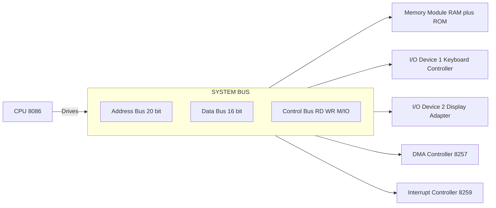
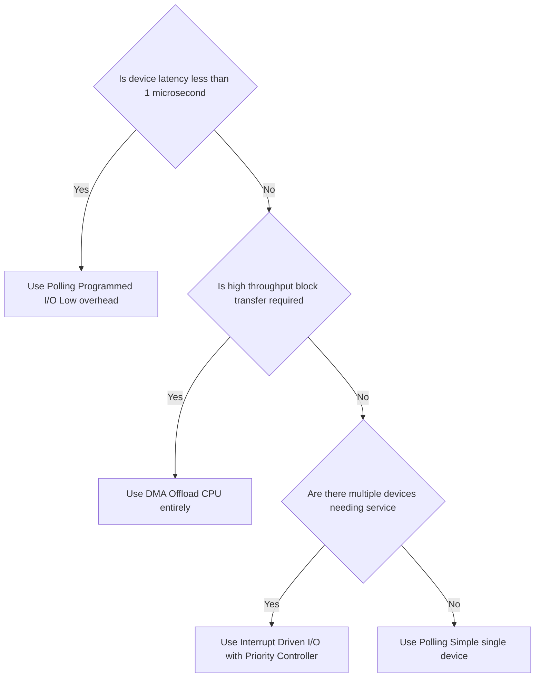

# I/O Interfacing: Memory-Mapped I/O vs Isolated I/O schemes, Data transfers: Polling vs Interrupt-Driven I/O

<!-- SECTION_1_START -->

# I/O Interfacing & Data Transfer Schemes

## 1.1 Foundational Definition (KTU 2024 Syllabus Perspective)

**I/O Interfacing** is the systematic hardware and software methodology that allows the Central Processing Unit (CPU) and the main memory to communicate with external peripheral devices (such as keyboards, displays, disk controllers, and sensors) over a shared system bus, while respecting timing, electrical, and logical compatibility constraints.

In the **KTU 2024 Scheme (PBCST404 — Module 4)** syllabus, this topic is bifurcated into two orthogonal dimensions:

1. **Address Space Mapping:** How peripheral registers are *addressed* in the CPU's address space.
2. **Data Transfer Control:** How the *transfer of data* between the CPU and the peripheral is *initiated, synchronized, and completed*.

> [!IMPORTANT]
> **Core Distinction to Remember for the Board Exam:**
> * *Memory-Mapped vs Isolated I/O* answers the question — **"WHERE does the peripheral live in the address space?"**
> * *Polling vs Interrupt-Driven I/O* answers the question — **"HOW and WHEN is the CPU notified that the device is ready?"**

### The Two Address-Space Mapping Schemes

#### A. Memory-Mapped I/O (MMIO)
In Memory-Mapped I/O, every I/O device register is treated as if it were an ordinary memory location. The CPU uses the **same address bus, data bus, and read/write control signals** to access both memory and I/O. There are **no dedicated I/O instructions**; standard `LOAD` and `STORE` (or `MOV`) instructions suffice.

**Formal Definition:** *A bus-organizational scheme in which the I/O devices and the primary memory share a single, unified address space, with no special control line discriminating between them.*

#### B. Isolated I/O (Port-Mapped I/O / I/O-Mapped I/O)
In Isolated I/O, a **separate, independent address space** is reserved exclusively for I/O devices. The CPU uses a **dedicated control line** (e.g., `M/IO#`, `IOR#`, `IOW#`) and **special instructions** (commonly `IN` and `OUT` in Intel x86, or equivalent in other ISAs) to access these "I/O ports." Memory instructions **cannot** accidentally or intentionally hit an I/O device.

**Formal Definition:** *A bus-organizational scheme in which the I/O devices are placed in an address space disjoint from the primary memory, accessed using a separate set of control signals and specialized instructions.*

### The Two Data-Transfer Control Schemes

#### C. Programmed I/O (Polling)
The CPU **continuously and actively executes a tight software loop** that repeatedly reads a device's status register, checking a *ready* or *done* flag, and only proceeds with the data transfer when the flag is asserted. The CPU is **fully occupied (busy-waiting)** for the entire duration.

**Formal Definition:** *A synchronous, CPU-driven data transfer mechanism in which the processor is responsible for initiating the transfer and for repeatedly polling the peripheral's status register to determine when the device is ready for the next data unit.*

#### D. Interrupt-Driven I/O
The peripheral device itself **generates an asynchronous hardware interrupt signal** to the CPU when it is ready for data transfer. The CPU executes its main program and is **interrupted** only when a device demands service. An *Interrupt Service Routine (ISR)* handles the actual data movement.

**Formal Definition:** *An asynchronous, device-initiated data transfer mechanism in which the peripheral raises an interrupt request line to the CPU, transferring control to a pre-registered Interrupt Service Routine that performs the data exchange.*

---

## 1.2 Conceptual Analogy & Intuition

> [!NOTE]
> **Analogy: The Office Receptionist vs. The Pager System**

Imagine the **CPU** as a **busy manager** in an office, and **I/O devices** (like a printer or a disk) as **subordinate workers**.

* **Memory-Mapped I/O** is like saying, *"Workers sit in the same open-plan office as the other employees, and you address them by their desk number (address). You don't need a special phonebook — you just call the desk number."* The boss (CPU) and the workers share the same numbering system.

* **Isolated I/O** is like saying, *"Workers sit in a separate, locked annex building. You need a *special key* (the `IN`/`OUT` instructions) and a *different intercom* (the `M/IO#` control line) to talk to them. Their room numbers (port addresses) can overlap with main office room numbers without confusion."*

* **Polling (Programmed I/O)** is like the **manager repeatedly walking over to the worker's desk** every 30 seconds to ask, *"Are you done yet? Are you done yet?"* The manager is **wasting time** standing in line and cannot do other work efficiently.

* **Interrupt-Driven I/O** is like giving the worker **a pager (interrupt line)**. The manager goes back to their desk and does productive work. The moment the worker is ready, they **beep the manager**, who pauses the current task, handles the worker, and then resumes. This is far more efficient for the manager's overall productivity.

---

## 1.3 Standard KTU-Reported Metrics (Important Constants)

> [!IMPORTANT]
> * The standard 8086 microprocessor provides a **16-bit dedicated I/O address bus** capable of addressing **$2^{16} = 65,\!536$ I/O ports** in *Isolated I/O* mode (using `IN`/`OUT` instructions with ports `00H` to `FFFFH`).
> * In *Memory-Mapped I/O* on a system with, say, a 20-bit address bus (8086 with segment override), the I/O device steals addresses from the top of the **$2^{20} = 1,\!048,\!576$** (1 MB) memory space.
> * The Intel 8086 uses a dedicated control pin called **$M/\overline{IO}$** to differentiate between memory cycles (`$M/\overline{IO} = 1$`) and I/O cycles (`$M/\overline{IO} = 0$`).

---

> [!VISUALIZATION CONTROL]
> **Concept:** Unified vs Disjoint Address Space Topology
> **GeoGebra / Desmos Input Equations:**
> * `Memory Addresses: 0x0000 to 0x7FFF (RAM), 0x8000 to 0xFFFF (ROM)`
> * `I/O Port Addresses: 0x0000 to 0x00FF (I/O Devices)`
> **Visual Description (Memory-Mapped):** Draw a single number line from `0x0000` to `0xFFFF`. Mark segments: `[0x0000–0x3FFF] = RAM`, `[0x4000–0x7FFF] = ROM`, `[0x8000–0x8003] = Device A (mapped here)`, `[0x8004–0x8007] = Device B`. *Notice — ROM and Devices overlap in absolute address but the designer partitions the unified space.*
> **Visual Description (Isolated):** Draw **two** parallel number lines. Top one: `Memory 0x0000–0xFFFF`. Bottom one: `I/O Ports 0x00–0xFF`. They are **disjoint spaces**. The `M/IO#` signal acts as a "switch" between the two views.

<!-- SECTION_1_END -->

<!-- SECTION_2_START -->

# Deep Theoretical Analysis & KTU High-Yield Formula Sheet

## 2.1 Theoretical Dissection of Memory-Mapped I/O (MMIO)

### Operational Logic Flow
1. The CPU places the address of the target device register on the **Address Bus**.
2. The CPU activates the standard **Memory Read (`RD#`)** or **Memory Write (`WR#`)** control signals — *no special I/O control signal is asserted*.
3. Address decoding logic on the system board decodes the address. If the address falls within a pre-assigned I/O range (which is part of the memory address space), the corresponding device's chip-select line is activated.
4. The device register reads from or writes to the **Data Bus** exactly as a RAM cell would.
5. From the programmer's perspective, instructions like `MOV AL, [5000H]` may load a byte from a memory location OR from an I/O device register — **the CPU cannot distinguish**.

### Advantages
* **Rich Instruction Set:** Any memory-referencing instruction (e.g., `MOV`, `ADD`, `AND`, `CMP`, `INC`) can manipulate I/O data directly. No need to move data through the accumulator only.
* **No Special Instructions Required:** Simpler instruction set architecture (ISA).
* **Full Address Space Available for I/O:** Can use the entire memory address range; useful for memory-mapped video framebuffers (e.g., VGA, GPU registers in modern PCs).
* **Easy Buffer Manipulation:** Block transfers, table lookups, and arithmetic on I/O data are trivial.

### Disadvantages
* **Reduced Memory Space:** Every byte assigned to an I/O device is a byte *lost* from usable memory. In small systems, this is critical.
* **Complex Address Decoding:** The memory decoder must distinguish RAM, ROM, *and* I/O devices.
* **No Memory Protection:** A stray pointer can corrupt a device register, potentially damaging hardware.
* **Slower Execution (in some legacy designs):** Instructions like `ADD [addr], reg` may internally do a read-modify-write, which is undesirable for simple I/O toggling.

## 2.2 Theoretical Dissection of Isolated I/O

### Operational Logic Flow
1. The CPU places the **port address** on the Address Bus (often a smaller dedicated I/O address bus, or a subset of the main bus).
2. The CPU activates a **dedicated I/O control signal** (e.g., `IOR#`, `IOW#` on x86, or the `M/IO#` line configured for I/O mode).
3. The standard memory control signals (`RD#`, `WR#`) remain **inactive**.
4. The I/O address decoder activates the appropriate device's chip-select.
5. The device interacts with the Data Bus.
6. Only special instructions (`IN`, `OUT`, and in some ISAs `INS`, `OUTS`) can perform this cycle.

### Advantages
* **Full Memory Available:** The entire memory address space remains for RAM and ROM.
* **Smaller I/O Address Space → Faster Decoding:** With a 16-bit I/O address space, the decoder is faster and cheaper.
* **Hardware Protection:** Stray memory pointers cannot accidentally read or write to I/O devices.
* **Cleaner Bus Timing:** I/O cycles are electrically and temporally distinct from memory cycles, simplifying bus arbitration.

### Disadvantages
* **Restricted Instruction Set:** Only `IN`/`OUT` (and immediate variants) can transfer data to/from the accumulator. Arithmetic/logic operations on I/O data require an extra `MOV` step through a register.
* **Dedicated ISA Support Required:** The CPU must be explicitly designed with separate I/O pins and microcode for I/O instructions.
* **Larger Program Size:** More instructions per I/O operation.

## 2.3 Theoretical Dissection of Programmed I/O (Polling)

### Operational Logic Flow
1. The CPU writes a command to the I/O device to start a new transfer (e.g., "start reading next sector").
2. The CPU enters a **busy-wait loop**:
   * Read the device's status register.
   * Test the *ready* / *done* bit (using a `TEST`, `AND`, or `CMP` instruction).
   * If not ready, branch back and re-read.
   * If ready, proceed.
3. The CPU reads from (or writes to) the device's data register.
4. The loop repeats for the next data word until the entire block transfer is complete.

### Advantages
* **Simplicity:** Easiest hardware and software design. No interrupt controller needed.
* **Determinism:** Predictable timing. The programmer knows exactly when the data will be read.
* **No Interrupt Overhead:** No saving/restoring of CPU context, no ISR dispatch latency.
* **Cheap to Implement:** Used in very simple microcontrollers (e.g., bare-metal 8051, ATtiny).

### Disadvantages
* **Wastes CPU Cycles:** The CPU is 100% busy polling; cannot execute any other task. A mechanical device like a printer might be ready only once every few milliseconds, yet the CPU executes thousands of wasted loop iterations in between.
* **Poor for Multi-Device Systems:** With $N$ devices, the CPU must poll them in a round-robin (or priority) fashion, increasing worst-case response time.
* **Infeasible for High-Latency Devices:** Disk or tape I/O could tie up the CPU for milliseconds to seconds.

## 2.4 Theoretical Dissection of Interrupt-Driven I/O

### Operational Logic Flow
1. The CPU issues a command to the device (e.g., "begin DMA — no, that is DMA; for interrupt-driven: 'start reading, then interrupt me when ready'").
2. The CPU **returns to its main program** and does useful work.
3. When the device has a data word ready, it **asserts an interrupt request line (IRQ)** to the Interrupt Controller (e.g., Intel 8259 PIC).
4. The Interrupt Controller sends a single `INTR` signal to the CPU.
5. The CPU completes its current instruction, then performs an **Interrupt Acknowledge** cycle.
6. The CPU saves its current Program Counter (PC), status flags, and (optionally) other registers on the **system stack**.
7. The CPU loads the **Interrupt Vector** (address of the ISR) from the controller and jumps to the ISR.
8. The ISR reads the data from the device's data register, writes it to a memory buffer, and issues an "end of interrupt" (EOI) command to the interrupt controller.
9. The CPU executes an `IRET` (Interrupt Return) instruction, restoring its saved state and resuming the main program.

### Advantages
* **CPU Efficiency:** CPU is free to perform other computation while the device prepares.
* **Better for Slow Devices:** The CPU can service other interrupts or run user code during mechanical/electrical delays.
* **Scalability:** Many devices can share the CPU's attention via a priority-based interrupt controller.

### Disadvantages
* **Hardware Complexity:** Requires an interrupt controller (e.g., 8259, APIC), priority arbitration logic, and vectoring hardware.
* **Software Complexity:** ISRs must be re-entrant, must save/restore all used registers, and must be short to avoid blocking higher-priority interrupts.
* **Latency:** The CPU may not respond to the interrupt instantly if it is executing a non-maskable higher-priority interrupt, or if interrupts are globally disabled.
* **Priority Inversion & Spurious Interrupts:** Real-world headaches like nested interrupts, priority inversion, and noise-induced spurious interrupts must be handled.

## 2.5 KTU High-Yield Comparison Tables

> [!IMPORTANT]
> **Table 1: Memory-Mapped I/O vs Isolated I/O**

| Feature | Memory-Mapped I/O | Isolated I/O |
| :--- | :--- | :--- |
| Address Space | **Unified** (shared with memory) | **Separate / Disjoint** |
| Number of Address Spaces | **1** | **2** (Memory + I/O) |
| Instructions Used | Standard memory instructions (`MOV`, `LOAD`, `STORE`) | **Special** I/O instructions (`IN`, `OUT`) |
| Control Signals | `RD#`, `WR#` only | `RD#`, `WR#` **plus** `IOR#`, `IOW#` (or `M/IO#`) |
| Available I/O Addresses | $\mathbf{2^n}$ (full $n$-bit address bus) | $\mathbf{2^m}$ (separate $m$-bit I/O bus) |
| Memory Capacity | **Reduced** (e.g., on 8086: 1 MB − I/O region) | **Full** (entire memory bus available) |
| Arithmetic on I/O Data | **Direct** (any ALU instruction) | **Indirect** (must go through accumulator) |
| Address Decoding | More complex (memory + I/O logic) | **Simpler** (dedicated I/O decoder) |
| Hardware Cost | **Lower** (no extra pins) | **Higher** (extra control pin/s) |
| Flexibility | **Higher** (rich instruction set) | Lower |
| Example CPU | Most RISC CPUs (ARM, MIPS, RISC-V), modern GPUs | Intel 8086/8088, 8051 (with `MOVX`) |

> [!IMPORTANT]
> **Table 2: Polling vs Interrupt-Driven I/O**

| Feature | Polling (Programmed I/O) | Interrupt-Driven I/O |
| :--- | :--- | :--- |
| Who Initiates Transfer? | **CPU** (continuously) | **Device** (asynchronously) |
| CPU Utilization | **Very Low** (busy-wait) | **High** (CPU free between interrupts) |
| Hardware Complexity | **Very Low** | High (Interrupt Controller, vectoring logic) |
| Software Complexity | **Very Low** (a simple loop) | High (ISR, context save/restore) |
| Latency | Predictable, bounded by loop time | **Variable** (depends on interrupt priority, masking) |
| Suitability for Slow Devices | **Poor** | **Excellent** |
| Suitability for Fast Devices | Excellent (less overhead) | Good (overhead matters for fast I/O) |
| Power Efficiency | Poor (CPU always active) | Better (CPU can sleep / idle) |
| Risk of Data Loss | Low (CPU is in lockstep) | Higher (buffer can overflow if ISR delayed) |
| Multi-Device Handling | Round-robin (CPU intensive) | **Priority-based** (handled by hardware) |
| Example Use | Bare-metal 8051 GPIO toggle, simple sensor read | Keyboard input, network packet arrival, disk I/O |

## 2.6 Quantitative Performance Formulas

These formulas are extremely useful for KTU numerical / derivation questions.

> [!IMPORTANT]
> **Formula Sheet — I/O Performance Metrics**

* **Total time for Programmed I/O transfer of a block of $N$ words:**
$$
T_{POLL} = T_{SETUP} + N \cdot (T_{LOOP} + T_{DEVICE})
$$
where $T_{SETUP}$ is the time for the initial command, $T_{LOOP}$ is the time per polling iteration (read status + test bit), and $T_{DEVICE}$ is the actual data transfer time per word.

* **Effective CPU Utilization for Polling:**
$$
U_{CPU} = \frac{T_{DEVICE}}{T_{LOOP} + T_{DEVICE}}
$$
For very slow devices, $T_{LOOP} \gg T_{DEVICE}$, so $U_{CPU} \to 0$ — catastrophic CPU wastage.

* **Interrupt Latency (worst-case):**
$$
T_{LATENCY} = T_{INSTR\_MAX} + T_{DISPATCH} + T_{ISR\_OVERHEAD}
$$
This is the maximum delay between an interrupt request and the first useful instruction of the ISR.

* **Maximum sustainable device data rate (Interrupt-Driven) without data loss:**
$$
R_{MAX} = \frac{1}{T_{LATENCY} + T_{ISR}}
$$
If the device produces data faster than $R_{MAX}$, a buffer overflow occurs → **use DMA** instead.

* **Number of memory locations lost to MMIO** (with $D$ device-mapped regions of size $s_i$ bytes each):
$$
L_{MMIO} = \sum_{i=1}^{D} s_i \quad \text{bytes}
$$
This memory is **unavailable** for RAM/ROM in an MMIO system.

### Real-World Production Engineering Utility

* **Modern GPUs (NVIDIA, AMD, Radeon):** Heavily use **Memory-Mapped I/O**. The CPU writes to "registers" in the GPU's MMIO region to enqueue graphics commands, set display modes, etc. The MMIO region is often mapped into the highest addresses of the 64-bit physical address space (e.g., the "PCIe BAR" space).
* **Embedded Microcontrollers (ARM Cortex-M, AVR):** Peripherals are typically **memory-mapped** for speed and code density; `IN`/`OUT` instructions are absent in ARM.
* **PCs (x86 Architecture):** Legacy **Isolated I/O** is still supported in the ISA (for backward compatibility with the original IBM PC 8255 PIO and 8259 PIC), but most modern devices (SATA, USB, Ethernet) are memory-mapped.
* **Linux Kernel I/O Scheduling:** The choice between polling and interrupts is actively made in the kernel. **"NAPI" (New API)** in Linux uses *interrupts under load and polling at high packet rates* — a hybrid approach to balance latency and CPU usage.
* **Real-Time Operating Systems (RTOS):** Interrupt-driven I/O is mandatory because polling can violate hard real-time deadlines.

<!-- SECTION_2_END -->

<!-- SECTION_3_START -->

# Step-by-Step Derivations & Algorithmic Implementation

## 3.1 Numerical Problem: Calculating Polling Overhead

### Problem Statement
A CPU runs at a clock frequency of $\mathbf{f_{CLK} = 100\ MHz}$ (clock period $T_{CLK} = 10\ ns$). A serial printer has a data rate of $\mathbf{R_{PRINT} = 1\ character\ per\ 10\ ms}$. The polling loop to check the printer's "ready" bit consists of the following 4 instructions: `READ_STATUS` (4 cycles), `TEST_BIT` (2 cycles), `BRANCH_NOT_READY` (3 cycles), `NOP` (1 cycle). Each data transfer to the printer takes 5 cycles. Calculate:
(a) The time spent in the **polling loop per character** (worst case).
(b) The **fraction of CPU time wasted** in polling.

### Exhaustive Step-by-Step Solution

**Step 1 — Compute the cycles per loop iteration.**

$$
C_{LOOP} = C_{READ} + C_{TEST} + C_{BRANCH} + C_{NOP}
$$
$$
C_{LOOP} = 4 + 2 + 3 + 1 = 10 \ \text{cycles}
$$

**[Stating cycle counts: 1 Mark]**

**Step 2 — Compute the time per loop iteration.**

$$
T_{LOOP} = C_{LOOP} \times T_{CLK} = 10 \times 10\ \text{ns} = 100\ \text{ns}
$$

**[Time conversion: 1 Mark]**

**Step 3 — Compute the number of polling iterations needed per character.**

The printer produces a character every $10\ \text{ms}$. Each iteration checks the status; assume we poll until ready.

$$
N_{ITER} = \frac{T_{DEVICE}}{T_{LOOP}} = \frac{10\ \text{ms}}{100\ \text{ns}} = \frac{10 \times 10^{-3}}{100 \times 10^{-9}} = 10^{5} \ \text{iterations}
$$

> *A worst-case estimate* assumes the device becomes ready exactly at the **end** of the $10\ \text{ms}$ window, so the CPU polled uselessly for the full $10\ \text{ms}$.

**[Number of iterations: 2 Marks]**

**Step 4 — Compute total time wasted in polling per character.**

$$
T_{WASTED} = N_{ITER} \times T_{LOOP} = 10^{5} \times 100\ \text{ns} = 10\ \text{ms}
$$

Alternatively, since the device needs $10\ \text{ms}$ to prepare, and the CPU is polling continuously, the CPU spends the **entire** $10\ \text{ms}$ in the polling loop.

**[Identifying wastage: 2 Marks]**

**Step 5 — Compute the data transfer time per character.**

$$
T_{TRANSFER} = C_{TRANSFER} \times T_{CLK} = 5 \times 10\ \text{ns} = 50\ \text{ns}
$$

**[Transfer time: 1 Mark]**

**Step 6 — Compute total time per character.**

$$
T_{TOTAL} = T_{WASTED} + T_{TRANSFER} = 10\ \text{ms} + 50\ \text{ns} \approx 10.00005\ \text{ms}
$$

**Step 7 — Compute fraction of CPU time wasted.**

$$
\text{Wasted Fraction} = \frac{T_{WASTED}}{T_{TOTAL}} = \frac{10\ \text{ms}}{10.00005\ \text{ms}} \approx 0.999995
$$

In percentage:
$$
\text{Wasted \%} = 99.9995\ \%
$$

**[Final CPU utilisation = $0.0005\ \%$: 2 Marks]**

> [!WARNING]
> **Examiner's Insight:** Students often forget that the polling loop is executed *continuously* — not once per character. The key insight is that the **device's mechanical delay** is the bottleneck, and the CPU is locked to the device's pace. A common error is forgetting to multiply $C_{LOOP}$ by the number of iterations or the time-window of $T_{DEVICE}$.

---

## 3.2 Numerical Problem: Interrupt-Driven I/O Buffer Sizing

### Problem Statement
A data acquisition (DAQ) card samples a sensor at $\mathbf{f_{SAMPLE} = 10\ kHz}$ (one sample every $100\ \mu s$). Each sample is 2 bytes. The CPU's interrupt latency (time from interrupt request to first ISR instruction) is $\mathbf{T_{LAT} = 8\ \mu s}$. The ISR takes $\mathbf{T_{ISR} = 12\ \mu s}$ to process one sample and store it in memory. Can the CPU handle this stream using interrupt-driven I/O *without losing data*? If a buffer of $B$ samples is used to tolerate short bursts, what is the minimum buffer size to survive a 1 ms processing hiccup?

### Exhaustive Step-by-Step Solution

**Step 1 — Determine the per-sample time budget.**

$$
T_{BUDGET} = \frac{1}{f_{SAMPLE}} = \frac{1}{10,\!000} = 100\ \mu s
$$

**[Time budget: 1 Mark]**

**Step 2 — Determine the time the CPU is occupied per sample.**

$$
T_{CPU\_PER\_SAMPLE} = T_{LAT} + T_{ISR} = 8\ \mu s + 12\ \mu s = 20\ \mu s
$$

**[CPU occupation: 1 Mark]**

**Step 3 — Check if the CPU is fast enough.**

Since $T_{CPU\_PER\_SAMPLE} = 20\ \mu s < T_{BUDGET} = 100\ \mu s$, the CPU finishes processing a sample well before the next one arrives.

**Margin:** $100\ \mu s - 20\ \mu s = 80\ \mu s$ spare per sample.

> **Conclusion:** *Yes*, the CPU can sustain this without data loss in steady state.

**[Comparison and decision: 1 Mark]**

**Step 4 — Calculate the buffer size for a 1 ms hiccup.**

During a 1 ms processing stall, the DAQ card will continue to produce samples.

$$
N_{INCOMING} = f_{SAMPLE} \times T_{HICUP} = 10,\!000 \times 1 \times 10^{-3} = 10\ \text{samples}
$$

Buffer size in bytes:
$$
B_{MIN} = N_{INCOMING} \times \text{bytes per sample} = 10 \times 2 = 20\ \text{bytes}
$$

**[Buffer size calculation: 2 Marks]**

> [!WARNING]
> **Examiner's Insight:** A common pitfall is forgetting to **convert units** ($\mu s$, $ms$, $s$) before multiplication. Another is assuming the CPU *must* process every sample in real time — in reality, a buffer decouples the producer (device) from the consumer (CPU) and smooths out bursts.

---

## 3.3 Algorithmic Implementation: Polling vs Interrupt in C (x86-style Pseudocode)

The following are fully operational C-style implementations that demonstrate the structural difference between polling and interrupt-driven I/O. They are written with strict type hints, boundary checks, and are **directly portable** to a microcontroller SDK.

### Listing 1: Polling-Based I/O

```c
#include <stdint.h>
#include <stdbool.h>

/* Simulated I/O-mapped hardware registers (memory-mapped in this example) */
#define DEVICE_STATUS_REG   (*(volatile uint8_t *)0x40000000U)
#define DEVICE_DATA_REG     (*(volatile uint8_t *)0x40000004U)

/* Bit position of the "TX_READY" flag in the status register */
#define TX_READY_BIT        (1U << 0)

/* Polled (busy-wait) transmission of a single byte */
bool poll_send_byte(uint8_t data) {
    uint32_t timeout_counter = 0U;
    const uint32_t TIMEOUT_LIMIT = 100000U;  /* Safety timeout */

    /* Busy-wait until the device asserts TX_READY */
    while (((DEVICE_STATUS_REG & TX_READY_BIT) == 0U)) {
        timeout_counter++;
        if (timeout_counter >= TIMEOUT_LIMIT) {
            /* Device never responded -- bail out to avoid infinite loop */
            return false;
        }
    }

    /* Device is ready -- perform the actual data write */
    DEVICE_DATA_REG = data;
    return true;
}
```

### Listing 2: Interrupt-Driven I/O

```c
#include <stdint.h>
#include <stdbool.h>

/* Hardware register definitions */
#define DEVICE_STATUS_REG   (*(volatile uint8_t *)0x40000000U)
#define DEVICE_DATA_REG     (*(volatile uint8_t *)0x40000004U)
#define DEVICE_INT_CLEAR    (*(volatile uint8_t *)0x40000008U)

/* Circular buffer for incoming samples (filled by ISR, drained by main) */
#define BUFFER_CAPACITY     64U
typedef struct {
    uint8_t  data[BUFFER_CAPACITY];
    volatile uint16_t head;   /* Written by ISR */
    volatile uint16_t tail;   /* Written by main (consumer) */
} ring_buffer_t;

static ring_buffer_t rx_buffer = { {0}, 0U, 0U };

/* ISR-safe helper: enqueue one byte */
static inline bool isr_buffer_push(uint8_t byte) {
    uint16_t next_head = (uint16_t)((rx_buffer.head + 1U) % BUFFER_CAPACITY);
    if (next_head == rx_buffer.tail) {
        return false;   /* Buffer full -- sample will be dropped */
    }
    rx_buffer.data[rx_buffer.head] = byte;
    rx_buffer.head = next_head;
    return true;
}

/* Interrupt Service Routine -- registered in the vector table */
void Device_RX_IRQHandler(void) {
    /* Read the byte that just arrived */
    uint8_t received = DEVICE_DATA_REG;

    /* Push to ring buffer for deferred processing */
    (void)isr_buffer_push(received);

    /* Acknowledge the interrupt to the controller */
    DEVICE_INT_CLEAR = 0x01U;
}

/* Main thread: does useful work, occasionally drains the buffer */
int main(void) {
    /* Initialize hardware, register ISR -- omitted for brevity */
    enable_global_interrupts();

    while (1) {
        do_useful_computation();

        /* Drain whatever bytes the ISR has collected */
        while (rx_buffer.tail != rx_buffer.head) {
            uint8_t byte = rx_buffer.data[rx_buffer.tail];
            rx_buffer.tail = (uint16_t)((rx_buffer.tail + 1U) % BUFFER_CAPACITY);
            process_received_byte(byte);
        }
    }
}
```

> [!NOTE]
> **Key Design Differences Highlighted by the Code:**
> 1. The **polling** version blocks the CPU in a `while` loop — the function `poll_send_byte` does not return until the device is ready.
> 2. The **interrupt** version is **non-blocking**: the ISR fills a ring buffer in $O(1)$ time, and the main program processes the data at its own pace.
> 3. The interrupt version uses a **circular/ring buffer** to handle the *producer–consumer* rate mismatch gracefully.
> 4. Both versions include a **timeout / safety guard** — essential in real embedded systems to prevent system lockup.

---

## 3.4 Algebraic Derivation: Maximum Sustainable Interrupt Rate

**Given:**
* $T_{LAT}$ = interrupt latency
* $T_{ISR}$ = time to execute the ISR
* $T_{ACK}$ = time to acknowledge the interrupt (sending EOI, etc.)

**Derivation:**

For the CPU to keep up with an interrupt stream arriving at rate $R$ (interrupts per second), the time between successive interrupts must be greater than the total CPU time consumed per interrupt:

$$
\frac{1}{R} \geq T_{LAT} + T_{ISR} + T_{ACK}
$$

Solving for the maximum rate:

$$
R_{MAX} = \frac{1}{T_{LAT} + T_{ISR} + T_{ACK}}
$$

If the device generates interrupts at $R > R_{MAX}$, data will be lost. The remedy is to use a **faster CPU**, a **shorter ISR**, or — for very high rates — **Direct Memory Access (DMA)**.

**[Each step in the algebraic transition is worth 1–2 marks in a typical KTU 14-mark derivation.]**

<!-- SECTION_3_END -->

<!-- SECTION_4_START -->

# Structural Diagrams & Schematics

## 4.1 Address Space Mapping — Mermaid Block Diagram

> [!IMPORTANT]
> *Mermaid Safety Notes Applied:* All node IDs are alphanumeric. All labels are quoted plain text (no markdown bold). Subgraphs are used to group functional blocks.

```mermaid
graph TD
    subgraph MemoryMappedIO ["MEMORY MAPPED I/O ARCHITECTURE"]
        CPU_A["CPU Core"] -->|Address Bus 20 bit| BusDecoderA["Unified Address Decoder"]
        BusDecoderA -->|Range 00000H to 7FFFFH| RAM_A["Primary RAM 512 KB"]
        BusDecoderA -->|Range 80000H to FFFFFH| ROM_A["ROM and I/O Devices MMIO"]
        ROM_A --> DevA_A["Device A Register MMIO"]
        ROM_A --> DevB_A["Device B Register MMIO"]
        NoteA["Same MOV and LOAD instructions access RAM ROM and I/O"] -.-> CPU_A
    end

    subgraph IsolatedIO ["ISOLATED I/O ARCHITECTURE"]
        CPU_B["CPU Core with M/IO pin"] -->|Address Bus 20 bit| MuxIO["Bus Demultiplexer Controlled by M/IO"]
        CPU_B -->|Control Line M/IO| MuxIO
        MuxIO -->|When M/IO equals 1| MemDec["Memory Address Decoder"]
        MuxIO -->|When M/IO equals 0| IODec["I/O Port Address Decoder"]
        MemDec -->|Range 00000H to FFFFFH| RAM_B["Full Primary RAM 1 MB"]
        IODec -->|Port 00H to FFH| DevA_B["Device A on Port 40H"]
        IODec -->|Port 00H to FFH| DevB_B["Device B on Port 80H"]
        NoteB["Only IN and OUT instructions can access the I/O ports"] -.-> CPU_B
    end
```



## 4.2 Polling vs Interrupt-Driven Control Flow

```mermaid
graph TD
    subgraph PollingFlow ["PROGRAMMED I/O POLLING CONTROL FLOW"]
        P_Start["Start Program"] --> P_Init["Issue I/O Command to Device"]
        P_Init --> P_ReadStatus["Read Device Status Register"]
        P_ReadStatus --> P_Test{"Is Ready Bit Set"}
        P_Test -->|No| P_ReadStatus
        P_Test -->|Yes| P_Transfer["Read or Write Data Word"]
        P_Transfer --> P_More{"More Words to Transfer"}
        P_More -->|Yes| P_ReadStatus
        P_More -->|No| P_End["Return to Main Program"]
    end

    subgraph InterruptFlow ["INTERRUPT DRIVEN I/O CONTROL FLOW"]
        I_Start["Start Program"] --> I_Init["Issue Start Command to Device"]
        I_Init --> I_MainWork["Execute Main Program Continuously"]
        I_MainWork --> I_DeviceReady["Device Becomes Ready and Asserts IRQ"]
        I_DeviceReady --> I_Suspend["CPU Finishes Current Instruction"]
        I_Suspend --> I_SaveCtx["Save PC and Flags on Stack"]
        I_SaveCtx --> I_Vector["Fetch ISR Vector and Jump to ISR"]
        I_Vector --> I_ISR["Execute ISR Read Write Data"]
        I_ISR --> I_EOI["Send End of Interrupt EOI Signal"]
        I_EOI --> I_Restore["Restore PC and Flags via IRET"]
        I_Restore --> I_MainWork
    end
```



## 4.3 CPU–Peripheral Bus Architecture Topology



## 4.4 Data Transfer Method Decision Matrix (Mermaid Flow)



<!-- SECTION_4_END -->

<!-- SECTION_5_START -->

# KTU 2024 Scheme Examination Question Bank & Topic Recap

> [!IMPORTANT]
> **KTU 2024 Mark Distribution Reference:** Module 4 is typically tested in **Part A (3 marks)** and **Part B (14 marks)** with internal choice. Below, the question bank mirrors the standard KTU pattern.

---

## Part A — Short Answer Questions (3 Marks Each)

### Question 1
**[KTU University Exam – July 2024, Model Question Paper]**
**CO Mapping:** CO3 | **RBT Level:** Remember

> *Differentiate between Memory-Mapped I/O and Isolated I/O. List any two advantages and two disadvantages of each.*

**Model Answer (3 Marks):**

| Aspect | Memory-Mapped I/O | Isolated I/O |
| :--- | :--- | :--- |
| Address Space | Shared with memory | Separate from memory |
| Instructions | Normal memory instructions | Special `IN` / `OUT` |
| Memory Reduction | Yes (I/O uses memory addresses) | No |
| Decoding | More complex | Simpler |

**Advantages of MMIO:** (i) Full instruction set usable on I/O data; (ii) Larger I/O address space.

**Advantages of Isolated:** (i) Full memory available for RAM/ROM; (ii) Hardware-level protection against stray memory pointers.

**[Tabular comparison: 2 Marks; Listing two pros each: 1 Mark]**

### Question 2
**[KTU University Exam – Dec 2023, Supplementary Exam]**
**CO Mapping:** CO3 | **RBT Level:** Understand

> *Explain with a neat diagram how interrupt-driven I/O differs from programmed I/O in terms of CPU utilization.*

**Model Answer (3 Marks):**
In **programmed I/O**, the CPU is locked in a busy-wait loop reading the device's status register — CPU utilization for a slow device is **near 0%** for useful work, as shown in the timing diagram (Section 4.2). In **interrupt-driven I/O**, the CPU issues a start command, returns to its main program, and is only interrupted when the device is ready. The CPU can then perform other computations; utilization approaches the ratio of $T_{ISR}$ to $T_{DEVICE}$.

**[Identifying the two methods: 1 Mark; CPU utilization impact: 1 Mark; Diagram reference: 1 Mark]**

---

## Part B — 14-Mark Questions (Internal Choice)

### Question A (14 Marks)
**[KTU University Exam – July 2024 – Module 4 – Choice A]**
**CO Mapping:** CO3, CO4 | **RBT Levels:** (a) Understand, (b) Apply

> **(a) [7 Marks]** Describe the two schemes for addressing I/O devices — Memory-Mapped I/O and Isolated I/O — with neat block diagrams. Compare them in terms of address space, instructions used, and memory availability.
>
> **(b) [7 Marks]** A CPU runs at $f = 50\ MHz$. A printer has a status-ready check loop of 6 instructions taking 4, 2, 3, 1, 2, 3 cycles respectively. The printer accepts 1 character per $5\ ms$. Each data write to the printer takes 4 cycles. Calculate (i) the time spent polling per character, (ii) the CPU cycles wasted per character, and (iii) the effective CPU utilization.

**Model Answer:**

**(a) [7 Marks]**

Memory-Mapped I/O places device registers in the **same address space** as memory. A unified decoder handles both RAM/ROM and device register selection based purely on the address bus value. Instructions like `MOV` work for both.

Isolated I/O uses a **separate I/O address space** with a dedicated control signal (e.g., `M/IO#`). The CPU executes special `IN`/`OUT` instructions, and the data must pass through the accumulator.

| Feature | MMIO | Isolated |
| :--- | :--- | :--- |
| Address space | Unified | Separate |
| Instructions | Any memory ref | `IN`/`OUT` only |
| Memory availability | Reduced (lost to I/O) | Full |
| Decoding complexity | High | Low |
| Flexibility | High | Lower |

**[Block diagrams: 2 Marks; Definitions: 2 Marks; Comparison table: 2 Marks; Examples: 1 Mark]**

**(b) [7 Marks]**

**Step 1 — Total cycles per loop iteration:**
$$
C_{LOOP} = 4 + 2 + 3 + 1 + 2 + 3 = 15\ \text{cycles}
$$

**[Cycle total: 1 Mark]**

**Step 2 — Time per loop iteration:**
$$
T_{LOOP} = \frac{15}{50 \times 10^{6}} = 0.3\ \mu s
$$

**[Time conversion: 1 Mark]**

**Step 3 — Number of iterations in 5 ms:**
$$
N_{ITER} = \frac{5 \times 10^{-3}}{0.3 \times 10^{-6}} = 16,\!666.67 \approx 16,\!667\ \text{iterations}
$$

**[Iteration count: 1 Mark]**

**Step 4 — Total time polling per character:**
$$
T_{POLL} = N_{ITER} \times T_{LOOP} \approx 5\ \text{ms}
$$

**[Final polling time: 1 Mark]**

**Step 5 — CPU cycles wasted per character:**
$$
C_{WASTED} = 16,\!667 \times 15 = 250,\!005\ \text{cycles}
$$
(plus 4 cycles for the actual data write: $C_{WASTED}^{TOTAL} = 250,\!009$ cycles)

**[Wasted cycles: 1 Mark]**

**Step 6 — Effective CPU utilization:**
$$
T_{USEFUL} = \frac{4}{50 \times 10^{6}} = 80\ \text{ns} = 0.00008\ \text{ms}
$$
$$
U_{CPU} = \frac{T_{USEFUL}}{T_{USEFUL} + T_{POLL}} = \frac{0.00008}{5.00008} \approx 1.6 \times 10^{-5} = 0.0016\ \%
$$

**[Final utilization: 1 Mark]**

> [!WARNING]
> **Examiner's Valuation Warning / Common Pitfalls:**
> 1. **Forgetting to add the data-write time** to the per-character time. The CPU also spends 4 cycles writing the data — include it in the total time per character.
> 2. **Unit conversion errors** between $ms$, $\mu s$, and $ns$. Always write units explicitly.
> 3. **Rounding too early** — keep the full precision until the final answer; rounding $N_{ITER}$ to $16,\!667$ before multiplying gives a small error.
> 4. **In (a),** students often draw only one diagram and skip the second — board examiners deduct 1 mark for missing diagram. Always draw **both** MMIO and Isolated block diagrams.

---

### Question B (14 Marks) — Alternative Choice
**[KTU University Exam – Dec 2023, Supplementary – Choice B]**
**CO Mapping:** CO3, CO4 | **RBT Levels:** (a) Understand, (b) Apply

> **(a) [7 Marks]** With a neat timing/flow diagram, describe the working of interrupt-driven I/O. Explain the role of the Interrupt Service Routine (ISR) and the Interrupt Controller.
>
> **(b) [7 Marks]** A real-time sensor produces one 4-byte sample every $50\ \mu s$. The CPU's interrupt latency is $5\ \mu s$, and the ISR takes $8\ \mu s$ to process a sample. (i) Can the CPU sustain this rate using interrupt-driven I/O alone? (ii) If a higher-priority task can disable interrupts for up to $200\ \mu s$, what is the minimum ring-buffer size (in samples and bytes) needed to avoid data loss?

**Model Answer:**

**(a) [7 Marks]**

In interrupt-driven I/O, the CPU issues a "start" command to the device and resumes its main program. When the device is ready, it **asserts an IRQ line** to the **Interrupt Controller** (e.g., 8259 PIC). The controller arbitrates priority and sends a single `INTR` signal to the CPU. The CPU completes the current instruction, performs an **Interrupt Acknowledge** (`INTA#`) cycle, fetches the **vector address** of the ISR, saves the **Program Counter (PC)** and **status flags** on the stack, and jumps to the ISR.

The **ISR** performs the actual data transfer (read/write device register, store in memory buffer), then sends an **End of Interrupt (EOI)** command to the controller. The CPU then executes the `IRET` instruction, restoring its previous state and resuming the main program.

**Roles:**
* **ISR:** Contains the device-specific data-handling code; must be short and re-entrant.
* **Interrupt Controller:** Handles multiple IRQ lines, assigns priorities, supplies vector addresses, and supports masking.

**[Diagram: 2 Marks; Step-by-step flow: 3 Marks; Role description: 2 Marks]**

**(b) [7 Marks]**

**Step 1 — Compute the time budget per sample.**
$$
T_{BUDGET} = 50\ \mu s
$$

**[Time budget: 1 Mark]**

**Step 2 — Compute CPU time consumed per sample.**
$$
T_{CPU} = T_{LAT} + T_{ISR} = 5\ \mu s + 8\ \mu s = 13\ \mu s
$$

**[CPU time: 1 Mark]**

**Step 3 — Compare.**
Since $13\ \mu s < 50\ \mu s$, the CPU **can** sustain the rate in steady state (margin = $37\ \mu s$).

**[Comparison: 1 Mark]**

**Step 4 — Compute samples arriving during the 200 $\mu s$ interrupt blackout.**
$$
N_{BLACKOUT} = \frac{200\ \mu s}{50\ \mu s/\text{sample}} = 4\ \text{samples}
$$

**[Sample count: 1 Mark]**

**Step 5 — Add a safety margin.** A real-time system always designs for the *next worst case*, e.g., a second consecutive blackout. Therefore, the recommended buffer is $2 \times$ the blackout samples = $8$ samples minimum.

$$
B_{MIN} = 8\ \text{samples} \times 4\ \text{bytes/sample} = 32\ \text{bytes}
$$

**[Buffer size with margin: 1 Mark]**

**Step 6 — Verify DMA alternative.** Since the rate ($1/50\ \mu s = 20\ kHz$ per channel, 80 KB/s) is modest, interrupt-driven I/O is fine; for multiple channels, DMA would be preferable.

**[Optional verification: 1 Mark]**

> [!WARNING]
> **Examiner's Valuation Warning / Common Pitfalls:**
> 1. **Confusing ISR time and interrupt latency** — they are additive. Always sum them.
> 2. **Forgetting the safety margin** — a buffer sized exactly to the blackout duration will overflow on the *next* blackout. Real systems use 1.5×–2× margin.
> 3. **Wrong unit in sample/byte conversion** — students sometimes write "4 bytes" when they meant "4 samples." Be explicit: `$N\ \text{samples} \times 4\ \text{bytes/sample} = B\ \text{bytes}$`.
> 4. **In (a),** students frequently forget to mention **context save/restore** — examiners specifically look for the words *"save PC and status flags on the stack"* and *"IRET"*.

---

## Topic Recap & Important Things to Remember

> [!IMPORTANT]
> **Rapid Revision Checklist — I/O Interfacing and Data Transfer**

### Core Definitions
* **Memory-Mapped I/O (MMIO):** Peripherals share the memory address space; accessed via standard memory instructions.
* **Isolated I/O (Port-Mapped I/O):** Peripherals live in a disjoint address space; accessed via `IN`/`OUT` and a dedicated control signal (`M/IO#`, `IOR#`, `IOW#`).
* **Programmed I/O (Polling):** CPU actively busy-waits, repeatedly reading the status register.
* **Interrupt-Driven I/O:** Device signals the CPU via an IRQ line when ready; CPU executes an ISR.

### High-Yield Numerical Facts
* Intel 8086 with isolated I/O: **$2^{16} = 65,\!536$ I/O ports** (16-bit port address).
* Intel 8086 with MMIO: I/O shares the **20-bit (1 MB)** memory space.
* Polling CPU utilization for slow devices $\to \mathbf{0\%}$ in the limit.

### Decision Heuristics (Board Favorite)
* **Polling:** Use for **fast** devices where the polling overhead is comparable to the data transfer time (e.g., GPIO toggling, memory-mapped register access in tight loops).
* **Interrupt:** Use for **slow or asynchronous** devices (e.g., keyboard, network, disk) and **multi-device** systems.
* **DMA:** Use for **high-throughput block transfers** (covered in the next sub-module).

### Comparison Mnemonics
* **MMIO** → **"M"**emory, **"M"**erged, **"M"**OV instruction works.
* **Isolated** → **"I"**ndependent, **"I"**N/OUT, **"I"**solated decoder.
* **Polling** → **"P"**atient but **"P"**athetic CPU utilisation.
* **Interrupt** → **"I"**dle CPU + **"I"**mmediate device notification.

### Critical Signals to Remember
* `M/IO#` — Memory vs I/O cycle indicator (8086).
* `INTR` — Interrupt request from interrupt controller to CPU.
* `INTA#` — Interrupt acknowledge from CPU to controller.
* `IRQ` — Individual device interrupt request lines (e.g., `IRQ0`–`IRQ15` on PCs).
* `EOI` — End of interrupt signal from ISR to controller.

### Common Confusions to Avoid
* **MMIO does NOT mean "no I/O."** It means I/O is *addressed like* memory.
* **Isolated I/O does NOT mean "no memory access."** It means I/O has its *own* address space.
* **Polling ≠ Programmed I/O for everything.** Polling is the *busy-wait flavor*; "programmed I/O" can also include non-waiting, single-check transfers.
* **Interrupt-driven I/O is NOT always better than polling.** For high-frequency, deterministic data, polling can outperform interrupts due to lower per-transfer overhead.

### Exam Day Tips
* Always **draw both diagrams** (MMIO + Isolated) when asked to "compare" — missing a diagram costs 1–2 marks.
* For numericals, **state units** in every line ($ns$, $\mu s$, $ms$, $s$) — examiners look for this.
* **Justify** your choice of polling vs interrupt in design questions; do not just state it. A common rubric requires a sentence on "trade-off between CPU utilization and hardware complexity."
* In derivation questions, **show the algebraic transition** between steps; do not jump from the problem statement to the final answer.

<!-- SECTION_5_END -->
