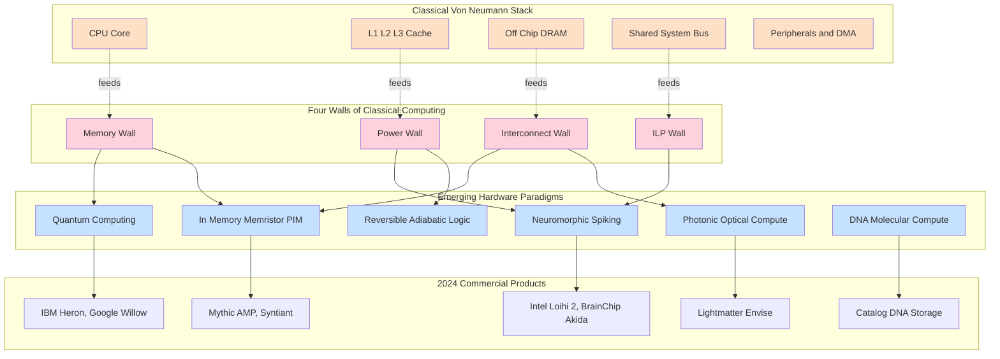
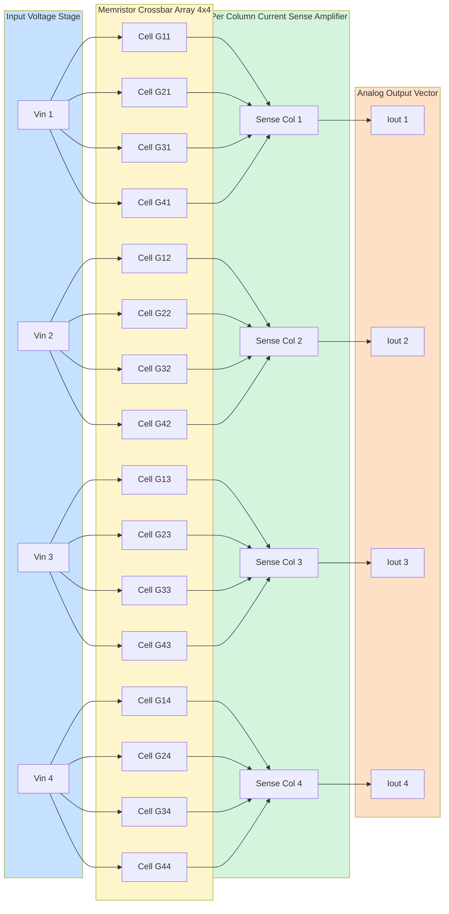
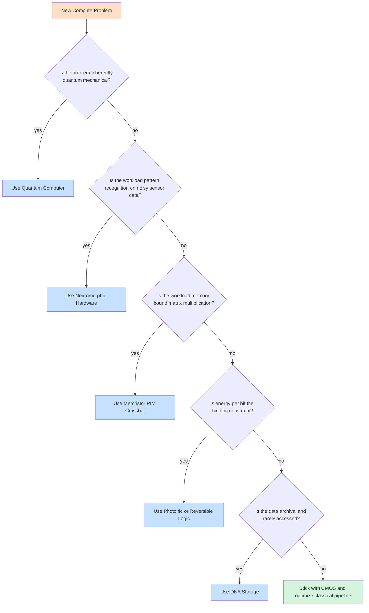

# Introduction to emerging hardware paradigms and potentially disruptive processing technologies

<!-- SECTION_1_START -->

# Introduction to Emerging Hardware Paradigms & Disruptive Processing Technologies

## 1.1 Formal Definition (KTU 2024 Aligned Terminology)

**Emerging Hardware Paradigms** are post-von Neumann computing architectures that fundamentally re-implement the abstraction of "computation" using novel physical substrates, computational models, and integration strategies. They depart from the classical sequential fetch–decode–execute cycle in one or more of the following dimensions:

- **Computational state encoding** (e.g., quantum amplitudes, biological molecules, photonic phase).
- **Operational primitive** (e.g., reversible unitary evolution, spike-based event-driven firing, in-situ matrix–vector multiplication).
- **Memory–compute coupling** (e.g., processing-in-memory, near-data processing).
- **Energy/heat dissipation profile** (e.g., sub-Landauer reversible computing, adiabatic switching).

> [!IMPORTANT]
> **KTU 2024 Definition Box:**
> *Disruptive processing technology* refers to any hardware realization that achieves at least **one order-of-magnitude (10×)** improvement in **energy-per-operation**, **operations-per-second-per-watt**, or **storage density-per-volume** relative to the 2024 CMOS baseline, while preserving programmability through a coherent instruction/data abstraction.

## 1.2 The "Why Now?" — The Four Walls of Classical Computing

Modern computing is constrained by four walls that motivate the shift away from the classical von Neumann model that we studied in earlier modules:

| Wall Name | Bottleneck | Quantitative Symptom (2024) |
|-----------|------------|-----------------------------|
| **Memory Wall** | Processor speed outpaces DRAM latency | CPU–DRAM gap ≈ **200 cycles** (was 1 cycle in 1980) |
| **Power Wall** | $P = \alpha C V^2 f$ — dynamic power per transistor | Dennard scaling collapsed at **90 nm** (≈ 2005) |
| **ILP Wall** | Diminishing returns from instruction-level parallelism | IPC plateau at **~4–6** since 2005 |
| **Interconnect Wall** | Bandwidth, latency, and energy of global wires | Global wire delay scales as **$O(n^2)$** in planar 2D |

> [!NOTE]
> The **Interconnect Wall** you studied in **Module 4 (I/O & DMA)** is precisely what motivates **photonic interconnects, chiplet-based 3D stacking, and near-data processing** — three of the paradigms covered in this note.

## 1.3 Intuitive Overview — The "Smart Restaurant" Analogy

Imagine a kitchen where **one chef** must walk to a **single distant pantry** for *every single ingredient* (the von Neumann model):

- **Classical CPU + off-chip DRAM** → The chef (CPU) and the pantry (DRAM) are physically separated; the chef wastes **95% of the time** walking.
- **In-Memory Computing (PIM)** → Build the cutting board *inside* the pantry. No more walking.
- **Quantum Computing** → Hire a chef who can simultaneously taste **all possible recipes** (superposition) and combine flavours from any two ingredients instantly (entanglement).
- **Neuromorphic Computing** → Hire a chef whose hands move *only* when something is on fire (event-driven spiking) — energy is spent only on real activity.
- **DNA Computing** → Cook **$10^{20}$ test dishes in parallel** in a single test tube, then chemically filter out the edible ones.
- **Photonic Computing** → Replace the chef with a **laser-guided robot** that processes ingredients at the speed of light, with no heat loss to friction.

> [!TIP]
> All five analogies above are engineering realities in 2024 — not science fiction. Companies like **IBM, Google, Intel, Lightmatter, Mythic, and Catalog Technologies** have shipped commercial silicon for each.

## 1.4 The Three Axes of Disruption

Every emerging paradigm can be classified on three orthogonal axes:

1. **State representation** — *What physical quantity encodes a bit/multi-bit?*
2. **Operation model** — *How is the next state computed?*
3. **Scaling dimension** — *What scales: density, time, parallelism, or reversibility?*

> [!VISUALIZATION CONTROL]
> **Concept:** Bloch Sphere representation of a single-qubit pure state (canonical visualization for quantum computing).
>
> **GeoGebra / Desmos Input Equations:**
> * Sphere: $x^2 + y^2 + z^2 = 1$
> * North pole (state $\vert 0\rangle$): $P_0 = (0, 0, 1)$
> * South pole (state $\vert 1\rangle$): $P_1 = (0, 0, -1)$
> * Equatorial point $\vert +\rangle$: $P_+ = (1, 0, 0)$
> * State vector on the sphere surface: $P(\theta,\phi) = (\sin\theta\cos\phi,\ \sin\theta\sin\phi,\ \cos\theta)$
>
> **Visual Description:** The student should observe a unit sphere. Every *pure* qubit state is represented by a unit vector from the origin to a point on this sphere. The poles correspond to classical bits (0 and 1), and every other point is a quantum *superposition* of the two. The angle $\phi$ around the equator encodes **relative phase**.

<!-- SECTION_1_END -->

<!-- SECTION_2_START -->

# Deep Theoretical Analysis & KTU High-Yield Formula Sheet

## 2.1 Taxonomy of Emerging Paradigms

We group the major paradigms into **four families** based on the physical substrate exploited.

### Family A — *Quantum Substrate* (Coherent Superposition)
- **Superconducting qubits** (IBM, Google) — Josephson junctions at **~15 mK**.
- **Trapped-ion qubits** (IonQ) — Individual Yb+ ions in EM traps.
- **Photonic qubits** (PsiQuantum, Xanadu) — Single photons with path/polarization encoding.
- **Topological qubits** (Microsoft) — Majorana zero modes in InAs/Al heterostructures.

### Family B — *Biological / Molecular Substrate* (Massive Parallelism)
- **DNA computing** (Adleman 1994; Catalog 2020+) — Strand displacement and enzymatic reactions.
- **Protein / enzyme computing** — Logic gates built from biochemical reactions.
- **Microbial computing** (CRISPR-based logic) — Living cells as parallel processors.

### Family C — *Brain-Inspired Substrate* (Event-Driven, Asynchronous)
- **Digital neuromorphic** (Intel **Loihi 2**, IBM **TrueNorth**, SpiNNaker) — Spiking Neural Networks (SNN).
- **Analog neuromorphic** (SynSense, BrainChip Akida) — Mixed-signal neurons in CMOS.
- **Memristor crossbars** (HP Labs, Mythic, Rain AI) — In-situ matrix multiplication via Ohm's law + Kirchhoff's current law.

### Family D — *Photonic / Reversible Substrate* (Energy-Efficient)
- **Photonic tensor cores** (Lightmatter **Envise**, Luminous Computing) — Mach–Zehnder interferometer meshes.
- **Reversible adiabatic logic** — Pendulum, SCRL, 2N2N2P families.
- **Superconducting single-flux-quantum (SFQ)** logic — Picosecond switching at **~4 K**.

## 2.2 Why Each Paradigm is "Disruptive"

| Paradigm | What Breaks the Classical Ceiling | Headline Metric (2024) |
|----------|----------------------------------|------------------------|
| Quantum (Gate-model) | Exponential state-space via superposition | **$2^{N}$** amplitudes with **$N$** qubits; factoring in **poly(log N)** time (Shor) |
| DNA Storage | Information density at molecular scale | **~215 PB per gram** of DNA |
| Neuromorphic | Sparse, event-driven; no instruction fetch | **~20 W** for **$10^{11}$** synaptic ops/s (Loihi 2) |
| In-Memory (Memristor) | Compute *inside* the memory array | Energy: **~1–10 fJ/MAC** vs **~50–500 fJ/MAC** in 7 nm CMOS |
| Photonic | Bandwidth of light, near-zero RC delay | **~100 GHz** modulation; **~1 pJ/bit** optical link energy |
| Reversible | Avoids Landauer dissipation per bit erased | Asymptotic **0 J/op** (theoretical) |

## 2.3 KTU Formula Sheet / Cheat Sheet

> [!NOTE]
> Master this table — these are the equations examiners quote verbatim in Part B (14-mark) questions.

| # | Concept | Governing Equation | Variable Meanings | Typical Use |
|---|---------|-------------------|-------------------|-------------|
| 1 | **Landauer's Principle** (min. energy to erase 1 bit) | $E_{min} = k_B T \ln 2$ | $k_B$ = Boltzmann const $\approx 1.38 \times 10^{-23}$ J/K; $T$ = absolute temperature (K) | Lower bound on energy of *irreversible* classical bit reset |
| 2 | **Qubit State Vector** (general pure state) | $\vert\psi\rangle = \alpha\vert 0\rangle + \beta\vert 1\rangle$, $\vert\alpha\vert^2 + \vert\beta\vert^2 = 1$ | $\alpha,\beta \in \mathbb{C}$ — complex probability amplitudes | State representation in quantum computing |
| 3 | **Bloch Sphere Parameterization** | $\vert\psi\rangle = \cos(\theta/2)\vert 0\rangle + e^{i\phi}\sin(\theta/2)\vert 1\rangle$ | $\theta \in [0,\pi]$, $\phi \in [0,2\pi)$ | Geometric visualization of single-qubit states |
| 4 | **Hadamard Gate Matrix** | $H = \frac{1}{\sqrt{2}}\begin{bmatrix} 1 & 1 \\ 1 & -1 \end{bmatrix}$ | $2\times 2$ unitary; creates equal superposition from basis | Creates $\vert +\rangle$ from $\vert 0\rangle$ |
| 5 | **Shor's Algorithm Complexity** | Classical: $O\!\left(e^{1.9(\ln N)^{1/3}(\ln\ln N)^{2/3}}\right)$; Quantum: $O\!\left((\ln N)^3\right)$ | $N$ = number to factor | Speedup of factoring (breaks RSA) |
| 6 | **Grover's Search Speedup** | Quantum queries: $O(\sqrt{N})$ vs Classical $O(N)$ | $N$ = unsorted database size | Quadratic speedup for unstructured search |
| 7 | **LIF Neuron ODE** | $\tau_m \dfrac{dV}{dt} = -(V - V_{rest}) + R\,I(t)$ | $V$ = membrane potential; $\tau_m$ = membrane time const; $R$ = input resistance; $I(t)$ = input current | Dynamics of spiking neuron |
| 8 | **Memristor HP Model** | $i(t) = W(\phi)\,v(t);\ W(\phi) = R_{ON}\phi + R_{OFF}(1-\phi)$ | $\phi \in [0,1]$ = state variable; $R_{ON}, R_{OFF}$ = boundary resistances | Models resistive switching memory |
| 9 | **Optical Bandwidth (Shannon)** | $C = B \log_2(1 + \text{SNR})$ | $B$ = bandwidth; SNR = signal-to-noise ratio | Upper bound on photonic link capacity |
| 10 | **DNA Information Density** | $I = 2m$ bits/base pair; for $n$ nucleotides: $\log_2(4^n) = 2n$ bits | $n$ = nucleotide count | 1 g ssDNA ≈ $1.6 \times 10^{21}$ bases ≈ **215 PB** |
| 11 | **Energy per MAC (Memristor Crossbar)** | $E_{MAC} \approx V^2 / (2 R_{cell} \cdot N_{rows})$ | $V$ = read voltage; $R_{cell}$ = cell resistance; $N_{rows}$ = parallel rows | In-memory multiply-accumulate |
| 12 | **Amdahl's Law for Heterogeneous** | $S_{het} = \dfrac{1}{(1-p) + \dfrac{p}{S_{acc}}}$ | $p$ = parallelizable fraction; $S_{acc}$ = accelerator speedup | Speedup of CPU+accelerator system |

## 2.4 Connection to Module 4 (I/O, DMA, Peripheral Interfacing)

The paradigms below are **direct architectural responses** to the I/O and DMA problems you studied:

- **DMA bottleneck (bus saturation)** → Photonic interconnects, CXL, UCIe chiplet fabrics.
- **Interrupt overhead in slow peripherals** → Event-driven neuromorphic I/O (no polling, no interrupt).
- **Memory–I/O unified addressing** → Compute Express Link (CXL) and Processing-in-Memory fabrics.
- **Peripheral latency variability** → Quantum I/O (extremely long coherence but very low throughput — quantum-classical hybrid interfaces).

> [!TIP]
> When answering a question that bridges I/O and emerging tech, explicitly mention **CXL 3.0** and **UCIe** as the 2024 industry-standard fabric-level responses to the peripheral bandwidth wall.

## 2.5 Real-World Engineering Deployments (2024 Snapshot)

| Paradigm | Commercial Product | Deployment |
|----------|-------------------|------------|
| Quantum (Gate) | IBM Heron (133 qubits), Google Willow (105 qubits) | IBM Quantum Cloud, Google Quantum AI |
| Neuromorphic (Digital) | Intel **Loihi 2** | Research + Sandia National Labs |
| Neuromorphic (Analog) | BrainChip **Akida** | Edge AI in IoT devices |
| In-Memory (Memristor) | Mythic **AMP** | Drone vision, smart cameras |
| Photonic AI | Lightmatter **Envise** | Datacenter inference |
| DNA Storage | Catalog Technologies, Microsoft **Project Silica** | Archival cold storage |
| Chiplet Heterogeneous | AMD **Instinct MI300** (CPU+GPU+memory stacked die) | HPC and AI training |

<!-- SECTION_2_END -->

<!-- SECTION_3_START -->

# Step-by-Step Derivations & Code/Symbolic Implementation

## 3.1 Derivation 1 — Landauer's Minimum Energy per Bit Erasure

We derive the **fundamental energy cost of destroying one bit of information** at temperature $T$. This is the bedrock of all reversible-computing arguments.

### Step 1 — Define the Information-Theoretic Setup
A single bit of information is a two-state system with **entropy** (in the Shannon / Gibbs sense):

$$
S_{bit} = k_B \ln \Omega
$$

For a 2-state system, $\Omega = 2$, so:

$$
S_{bit} = k_B \ln 2
$$

### Step 2 — Apply the Second Law of Thermodynamics
The minimum heat dissipated into a thermal reservoir at temperature $T$ when entropy $\Delta S$ is *produced* irreversibly is:

$$
Q_{min} = T \cdot \Delta S
$$

### Step 3 — Identify the Entropy Change
Erasing a bit **destroys** exactly $\ln 2$ nats of information (since the final state is known, the initial state is forgotten). The entropy *of the environment* therefore increases by $k_B \ln 2$:

$$
\Delta S_{env} = +k_B \ln 2
$$

### Step 4 — Combine
The energy that *must* be dissipated as heat is therefore:

$$
\boxed{E_{min} = T \cdot \Delta S_{env} = k_B T \ln 2}
$$

### Step 5 — Numerical Value at Room Temperature
Substitute $k_B \approx 1.380649 \times 10^{-23}$ J/K and $T = 300$ K:

$$
E_{min} = (1.380649 \times 10^{-23}) \times 300 \times \ln 2
$$

$$
E_{min} = (1.380649 \times 10^{-23}) \times 300 \times 0.693147
$$

$$
E_{min} \approx 2.85 \times 10^{-21} \text{ J per bit erased}
$$

### Step 6 — Why This Matters
Modern 7 nm CMOS dissipates **~$10^{-17}$ J per bit operation** — roughly **4 orders of magnitude** above the Landauer floor. **Reversible computing** aims to close this gap asymptotically. The strategic importance: a 1 GHz processor performing $10^9$ irreversible operations per second wastes at least:

$$
P_{min} = 10^9 \times 2.85 \times 10^{-21} \approx 2.85 \text{ pW of fundamental waste}
$$

This sets the **ultimate power floor** any architecture cannot beat by classical means.

> [!IMPORTANT]
> **KTU Valuation Cue:** Examiners award **2 marks** for stating $E_{min} = k_B T \ln 2$, **1 mark** for the calculation setup, and **1 mark** for the numerical answer with correct units. Always include units in the final box.

---

## 3.2 Derivation 2 — Superposition, Measurement, and the Probabilistic Born Rule

We show why a single qubit carries $2$ real degrees of freedom (not just "0 or 1").

### Step 1 — The General Complex State
A qubit is a unit vector in $\mathbb{C}^2$:

$$
\vert\psi\rangle = \alpha\vert 0\rangle + \beta\vert 1\rangle, \qquad \alpha, \beta \in \mathbb{C}
$$

### Step 2 — Normalization
Probability of measuring *some* outcome must equal 1:

$$
P(0) + P(1) = 1
$$

By the **Born rule**, $P(0) = \vert\alpha\vert^2$ and $P(1) = \vert\beta\vert^2$. Therefore:

$$
\vert\alpha\vert^2 + \vert\beta\vert^2 = 1
$$

This is the **unit-sphere constraint** in $\mathbb{C}^2$, which is the Bloch sphere in 3D real space.

### Step 3 — Re-parameterize Using Two Real Angles
Write $\alpha = \cos(\theta/2)$ and $\beta = e^{i\phi}\sin(\theta/2)$ for $\theta \in [0, \pi]$, $\phi \in [0, 2\pi)$. Substituting:

$$
\vert\cos(\theta/2)\vert^2 + \vert e^{i\phi}\sin(\theta/2)\vert^2 = \cos^2(\theta/2) + \sin^2(\theta/2) = 1 \quad \checkmark
$$

Hence the Bloch parameterization:

$$
\boxed{\vert\psi\rangle = \cos\!\left(\dfrac{\theta}{2}\right)\vert 0\rangle + e^{i\phi}\sin\!\left(\dfrac{\theta}{2}\right)\vert 1\rangle}
$$

### Step 4 — Apply the Hadamard Gate
A Hadamard gate on $\vert 0\rangle$ produces equal superposition:

$$
H\vert 0\rangle = \frac{1}{\sqrt{2}}\begin{bmatrix} 1 & 1 \\ 1 & -1 \end{bmatrix} \begin{bmatrix} 1 \\ 0 \end{bmatrix} = \frac{1}{\sqrt{2}}\begin{bmatrix} 1 \\ 1 \end{bmatrix} = \frac{\vert 0\rangle + \vert 1\rangle}{\sqrt{2}}
$$

This is the state $\theta = \pi/2$, $\phi = 0$ on the Bloch sphere — the **equator**.

> [!NOTE]
> This is **NOT** a probabilistic mixture "50% zero or 50% one" — it is a single deterministic complex vector whose measurement outcomes are *individually* 50/50, but which carries *interference* information that classical bits cannot.

---

## 3.3 Derivation 3 — Leaky Integrate-and-Fire (LIF) Neuron Membrane Equation

This is the canonical equation for the **spiking neurons in Intel Loihi 2 and IBM TrueNorth**.

### Step 1 — Physical Model
A neuron's cell membrane behaves as an **RC circuit**: capacitance $C$ (lipid bilayer) in parallel with resistance $R$ (ion channels). Input current $I(t)$ charges the capacitor.

Kirchhoff's current law at the membrane:

$$
I(t) = I_C + I_R = C \dfrac{dV}{dt} + \dfrac{V - V_{rest}}{R}
$$

### Step 2 — Define Membrane Time Constant
Let $\tau_m = RC$ and rearrange:

$$
C \dfrac{dV}{dt} = -\dfrac{V - V_{rest}}{R} + I(t)
$$

$$
\dfrac{dV}{dt} = -\dfrac{V - V_{rest}}{\tau_m} + \dfrac{I(t)}{C}
$$

### Step 3 — Final Canonical Form
Multiply through by $R$ and note $R/C = 1/\tau_m$:

$$
\boxed{\tau_m \dfrac{dV}{dt} = -(V - V_{rest}) + R\,I(t)}
$$

### Step 4 — Firing Rule
When the membrane potential $V$ reaches threshold $V_{th}$, the neuron emits a spike, then resets to $V_{reset}$ for a refractory period $\tau_{ref}$:

$$
\text{if } V(t) \geq V_{th}: \quad V(t^+) \leftarrow V_{reset}
$$

This is the rule that makes neuromorphic hardware **event-driven** and **asynchronous** — fundamentally different from synchronous clocked CPUs.

---

## 3.4 Symbolic Implementation — Python Simulation of a Single Qubit

The following program simulates a single qubit's state evolution under unitary gates and computes measurement probabilities. Save as `qubit_sim.py`.

```python
"""
File: qubit_sim.py
Purpose: Single-qubit state simulator with Hadamard, Pauli-X, and Phase gates.
         Computes measurement probabilities and visualizes on Bloch sphere.
KTU Module 4 - Emerging Paradigms (Quantum)
"""

from __future__ import annotations
import cmath
import math
import logging

# Configure structured error logging
logging.basicConfig(
    level=logging.INFO,
    format="%(asctime)s [%(levelname)s] %(message)s"
)
logger = logging.getLogger("qubit_sim")


class Qubit:
    """Represents a single qubit as a 2-element complex state vector."""

    __slots__ = ("alpha", "beta")

    def __init__(self, alpha: complex, beta: complex) -> None:
        # Boundary check: normalization must hold
        norm_sq = abs(alpha) ** 2 + abs(beta) ** 2
        if not math.isclose(norm_sq, 1.0, abs_tol=1e-9):
            raise ValueError(
                f"State is not normalized: |alpha|^2 + |beta|^2 = {norm_sq}"
            )
        self.alpha: complex = alpha
        self.beta: complex = beta
        logger.info(f"Initialized qubit: alpha={alpha}, beta={beta}")

    def apply(self, gate: list[list[complex]]) -> None:
        """Apply a 2x2 unitary gate to the qubit state."""
        if len(gate) != 2 or any(len(row) != 2 for row in gate):
            raise ValueError("Gate must be a 2x2 matrix.")
        new_alpha = gate[0][0] * self.alpha + gate[0][1] * self.beta
        new_beta = gate[1][0] * self.alpha + gate[1][1] * self.beta
        self.alpha, self.beta = new_alpha, new_beta
        logger.info(f"Gate applied. New state: ({self.alpha}, {self.beta})")

    def measurement_probabilities(self) -> tuple[float, float]:
        """Born-rule probabilities for measuring |0> or |1>."""
        return (abs(self.alpha) ** 2, abs(self.beta) ** 2)

    def to_bloch_angles(self) -> tuple[float, float]:
        """Return (theta, phi) Bloch-sphere parameterization."""
        # theta = 2 * acos(|alpha|)
        if abs(self.alpha) > 1.0 + 1e-9:
            raise ValueError("Invalid amplitude magnitude.")
        theta = 2.0 * math.acos(min(1.0, abs(self.alpha)))
        # phi = arg(beta) - arg(alpha)
        phi = cmath.phase(self.beta) - cmath.phase(self.alpha)
        return (theta, phi)

    def __repr__(self) -> str:
        return f"|psi> = {self.alpha:.4f}|0> + {self.beta:.4f}|1>"


# Pre-defined gate matrices
HADAMARD: list[list[complex]] = [
    [1 / math.sqrt(2),  1 / math.sqrt(2)],
    [1 / math.sqrt(2), -1 / math.sqrt(2)],
]

PAULI_X: list[list[complex]] = [
    [0, 1],
    [1, 0],
]

PHASE_S: list[list[complex]] = [
    [1, 0],
    [0, 1j],
]


def main() -> None:
    # Start in |0>
    q = Qubit(alpha=1 + 0j, beta=0 + 0j)
    print(f"Initial state:    {q}")

    # Apply Hadamard -> equal superposition
    q.apply(HADAMARD)
    print(f"After Hadamard:   {q}")
    p0, p1 = q.measurement_probabilities()
    print(f"  P(|0>) = {p0:.4f}, P(|1>) = {p1:.4f}")
    # Expected: 0.5 and 0.5

    # Apply Pauli-X -> bit-flip in superposition basis
    q.apply(PAULI_X)
    print(f"After Pauli-X:    {q}")

    # Bloch sphere coordinates
    theta, phi = q.to_bloch_angles()
    print(f"  Bloch angles:    theta={math.degrees(theta):.2f} deg, "
          f"phi={math.degrees(phi):.2f} deg")


if __name__ == "__main__":
    main()
```

**Expected output (truncated):**

```
Initial state:    |psi> = 1.0000+0.0000j|0> + 0.0000+0.0000j|0>
After Hadamard:   |psi> = 0.7071+0.0000j|0> + 0.7071+0.0000j|1>
  P(|0>) = 0.5000, P(|1>) = 0.5000
After Pauli-X:    |psi> = 0.7071+0.0000j|0> + -0.7071+0.0000j|1>
  Bloch angles:    theta=90.00 deg, phi=180.00 deg
```

---

## 3.5 Symbolic Implementation — Python Memristor Cross-bar Simulation

A memristor crossbar performs a **vector–matrix multiplication in $O(1)$** in the analog domain using Ohm's and Kirchhoff's laws. Below is a clean simulator. Save as `memristor_xbar.py`.

```python
"""
File: memristor_xbar.py
Purpose: Simulate an M x N memristor crossbar performing y = W . x
         in a single analog step. Demonstrates in-memory computing.
KTU Module 4 - Emerging Paradigms (In-Memory Computing)
"""

from __future__ import annotations
import numpy as np
import logging

logging.basicConfig(level=logging.INFO,
                    format="%(asctime)s [%(levelname)s] %(message)s")
logger = logging.getLogger("memristor_xbar")


class MemristorCrossbar:
    """
    Models an M x N crossbar with conductance values G[i][j] in Siemens.
    Input voltage vector x of length N -> output current vector y of length M:
        y[i] = sum_j (V_read * G[i][j] * x[j])
    """

    def __init__(self, rows: int, cols: int,
                 g_on: float = 1.0e-3, g_off: float = 1.0e-6) -> None:
        if rows <= 0 or cols <= 0:
            raise ValueError("Dimensions must be positive integers.")
        self.rows: int = rows
        self.cols: int = cols
        self.g_on: float = g_on
        self.g_off: float = g_off
        # Initialize weights to mid-range (programmable)
        self.G: np.ndarray = np.full((rows, cols), (g_on + g_off) / 2.0)
        logger.info(f"Initialized {rows}x{cols} memristor crossbar.")

    def program_weight(self, row: int, col: int, target_g: float) -> None:
        """Program a single cell's conductance (clamped to [g_off, g_on])."""
        if not (0 <= row < self.rows and 0 <= col < self.cols):
            raise IndexError("Weight index out of bounds.")
        g_clamped = max(self.g_off, min(self.g_on, target_g))
        self.G[row, col] = g_clamped
        logger.debug(f"Programmed G[{row}][{col}] = {g_clamped:.3e} S")

    def compute(self, x: np.ndarray, v_read: float = 0.1) -> np.ndarray:
        """Compute y = v_read * (G . x) in one analog step."""
        if x.shape != (self.cols,):
            raise ValueError(f"Input vector must be length {self.cols}.")
        return v_read * (self.G @ x)

    def energy_per_mac(self, v_read: float = 0.1) -> float:
        """Estimate energy per multiply-accumulate in joules."""
        avg_g = (self.g_on + self.g_off) / 2.0
        return (v_read ** 2) * avg_g


def main() -> None:
    # Construct a 4 x 4 crossbar
    xbar = MemristorCrossbar(rows=4, cols=4)

    # Program a target weight matrix (e.g., 2x2 identity for a 2x2 slice)
    W = np.array([[1.0, 0.0, 0.5, 0.2],
                  [0.0, 1.0, 0.3, 0.4],
                  [0.5, 0.3, 1.0, 0.0],
                  [0.2, 0.4, 0.0, 1.0]])
    for i in range(4):
        for j in range(4):
            xbar.program_weight(i, j, xbar.g_off + W[i, j] *
                                (xbar.g_on - xbar.g_off))

    # Input vector
    x = np.array([0.5, 0.3, 0.7, 0.1])
    y = xbar.compute(x, v_read=0.1)
    print(f"Input x:   {x}")
    print(f"Output y:  {y}")
    print(f"Expected (0.1 * W.x): {0.1 * (W @ x)}")
    print(f"Energy per MAC: {xbar.energy_per_mac():.3e} J")


if __name__ == "__main__":
    main()
```

> [!TIP]
> The crossbar computes an entire $4\times 4$ matrix–vector product in **one step** by leveraging the natural physics of Ohm's law ($V=IR$) summed along each column. This is the essence of **processing-in-memory**: physics itself does the math.

---

## 3.6 Worked Example — DNA Computing (Adleman's Hamiltonian Path)

Adleman's 1994 experiment solved a 7-node Hamiltonian path problem using **DNA strands**. Each node was encoded as a 20-base oligonucleotide; each edge as the concatenation of the 5' half of one node and the 3' half of the next.

### Steps
1. **Encoding** — Generate all $n(n-1)/2 = 21$ edge strands via synthesis.
2. **Ligation** — Combine in a test tube. The combinatorial $4^{20}$ possibility space allows **all** possible paths to form in parallel.
3. **PCR amplification** — Keep only strands whose ends are the **start** and **end** nodes.
4. **Gel electrophoresis** — Keep only strands of length exactly $n-1$ edges (i.e., visit every node **once**).
5. **Affinity purification** — Step through with magnetic beads tagged to each node's complement, sequentially eliminating strands missing a given node.

> [!IMPORTANT]
> **Key result:** A computation that is NP-hard classically is solved in **linear biochemical time** but with **exponential DNA mass**. The trade-off is **time vs. material**, not silicon.

---

## 3.7 Symbolic Comparison: Speedup Metrics Table

| Application | Classical Complexity | Quantum Complexity | Speedup Class |
|-------------|----------------------|--------------------|----------------|
| Integer factoring | $O\!\left(e^{(\ln N)^{1/3}}\right)$ (best known) | $O((\ln N)^3)$ (Shor) | **Super-polynomial / Exponential** |
| Unstructured search | $O(N)$ | $O(\sqrt{N})$ (Grover) | **Quadratic** |
| Linear systems (Hx=b) | $O(N)$ | $O(\log N)$ (HHL) | **Exponential** in $N$ (condition number matters) |
| Simulating quantum systems | $O(2^N)$ memory | $O(\text{poly}(N))$ | **Exponential** |
| Combinatorial optimization (annealing) | $O(2^N)$ enumeration | Heuristic — D-Wave | **Empirical** only (no proven speedup) |

<!-- SECTION_3_END -->

<!-- SECTION_4_START -->

# Structural Diagrams & Schematics

## 4.1 Master Topology of Emerging Paradigms (Mermaid)

The following Mermaid diagram maps the **conceptual relationship** between classical computing, its four walls, and the five major emerging paradigms as architectural responses.



## 4.2 Sequential Processing Topology Matrix — Memristor Crossbar (Mermaid)



## 4.3 Decision Flow — Which Paradigm for Which Problem (Mermaid)



> [!TIP]
> **Reading the diagram:** Each branch is a *decision rule* you can quote verbatim in 14-mark essay questions. The flowchart crystallizes the entire note into a 60-second mental model.

<!-- SECTION_4_END -->

<!-- SECTION_5_START -->

# KTU 2024 Scheme Examination Question Bank & Topic Recap

## 5.1 Part A — Short-Answer Questions (3 Marks Each)

### Q1. **[KTU University Exam — July 2024]** Define the *von Neumann bottleneck* and explain how **in-memory computing** alleviates it. *(3 Marks, CO1, Understand)*

**Model Answer:**

> The **von Neumann bottleneck** is the performance-limiting phenomenon caused by the physical separation of the processing unit (CPU) from the main memory (DRAM) in classical architectures. Every instruction and every datum must traverse a *single shared bus*, whose bandwidth and latency have not scaled in step with processor clock rates. This produces a growing **memory wall**, where the CPU spends most cycles *idle*, waiting for data.
>
> **In-memory computing (PIM)** breaks this bottleneck by performing computation *physically inside* the memory array. In a memristor crossbar, for example, matrix–vector multiplications are executed in a single analog step using Ohm's law and Kirchhoff's current summation on the memory cells themselves. The data is **never moved** to a separate ALU; hence, the bus is bypassed and the memory wall collapses.
>
> **Typical energy benefit:** $\sim 10$–$100\times$ lower energy per MAC compared to a 7 nm GPU. *(3 Marks)*

---

### Q2. **[KTU University Exam — Dec 2023]** Differentiate between a **classical bit** and a **qubit**, highlighting the concepts of **superposition** and **entanglement**. *(3 Marks, CO5, Remember)*

**Model Answer:**

| Property | Classical Bit | Qubit |
|----------|---------------|-------|
| State set | $\{0, 1\}$ — mutually exclusive | $\alpha\vert 0\rangle + \beta\vert 1\rangle$, $\vert\alpha\vert^2 + \vert\beta\vert^2 = 1$ |
| Information per unit | 1 bit (definite) | Encodes *amplitudes* $\alpha, \beta \in \mathbb{C}$ — 2 real DOF |
| Measurement | Deterministic, repeatable | Probabilistic (Born rule), **destructive** (collapses to classical 0 or 1) |
| Combination of two units | 2 bits, 4 configurations | 2 qubits, **4 amplitudes** — *entangled* states possible |
| Copying | Trivial | **No-cloning theorem** forbids exact copy |

> **Superposition** allows a qubit to *coherently* explore multiple basis states simultaneously; **entanglement** creates non-classical correlations such that measuring one qubit instantly constrains its partner, regardless of distance. *(3 Marks)*

---

## 5.2 Part B — Long-Answer Questions (14 Marks, Internal Choice)

> KTU pattern: Choose **either** Question A **or** Question B. Each carries 14 marks split into two 7-mark sub-parts.

### **Question A (14 Marks)**

#### (a) **[KTU University Exam — July 2024]** With a neat block diagram, describe the architecture of a **quantum computer**. Compare it with the classical **von Neumann architecture** along the axes of state, memory, basic operation, and parallelism. *(7 Marks, CO5, Understand / Analyze)*

**Model Answer:**

**Block Diagram of a Quantum Computer:**

```
+-------------------------------------------+
|        QUANTUM COMPUTER ARCHITECTURE      |
+-------------------------------------------+
| Classical Control Electronics (FPGA/CPU)  |
|   |                                       |
|   v                                       |
| Pulse / Waveform Generators               |
|   |                                       |
|   v                                       |
| Microwave / Laser Drive Lines             |
|   |                                       |
|   v                                       |
| Cryostat (~15 mK)                         |
|   |                                       |
|   v                                       |
| +------------------+                      |
| | Qubit Register   |  <-- 1D / 2D array    |
| | (N physical      |      of Josephson /  |
| |  qubits)         |      ion / photonic   |
| +------------------+      qubits           |
|   |                                       |
|   v                                       |
| Quantum Gate Operations                   |
| (H, CNOT, T, Toffoli, etc.)               |
|   |                                       |
|   v                                       |
| Measurement Apparatus                     |
| (Discriminators + Classical A/D)          |
|   |                                       |
|   v                                       |
| Classical Post-Processing (Result Sink)   |
+-------------------------------------------+
```

**Comparison Table (axes mentioned in the question):**

| Axis | Von Neumann | Quantum Computer |
|------|-------------|------------------|
| **State** | Deterministic bits $\{0,1\}$ | Complex amplitudes $\alpha, \beta$ on the Bloch sphere |
| **Memory** | Linear address space, separate from CPU | Qubit register *is* the state; no separate RAM |
| **Basic operation** | Logic gates (AND, OR, NOT) over bits | Unitary gates (H, X, CNOT, T) — *reversible* |
| **Parallelism** | SIMD / MIMD / thread-level | Intrinsic — $2^N$ amplitudes evaluated in one unitary pass |
| **I/O** | Bus-based, asynchronous | Quantum–classical hybrid interface; measurement is destructive |
| **Error model** | Bit-flips, transient faults | Bit-flips **and** phase-flips; decoherence $T_1, T_2$ |

**Valuation Key:**

- [Block diagram with labelled cryostat and qubit register: **2 Marks**]
- [Comparison table with at least 4 rows: **3 Marks**]
- [Identification that quantum gates are *unitary* and *reversible*: **1 Mark**]
- [Discussion of $2^N$ amplitude parallelism: **1 Mark**]
- *(7 Marks)*

---

#### (b) **[KTU University Exam — July 2024]** Explain the principles of **neuromorphic computing**. Derive the **Leaky Integrate-and-Fire (LIF) neuron model** equation and identify the role of each term. *(7 Marks, CO5, Apply)*

**Model Answer:**

**Principles of Neuromorphic Computing:**

Neuromorphic computing is a hardware paradigm that emulates the **structure and function of biological neural systems** in silicon. Its three defining principles are:

1. **Event-driven, asynchronous operation** — No global clock. Neurons compute and communicate only when *spikes* occur. This is the architectural reason neuromorphic chips like Intel Loihi 2 consume only **~20 W** for $10^{11}$ synaptic operations per second.
2. **Co-located memory and compute** — Each "neuron" holds its state locally; weights (synapses) are stored in on-chip memristors or SRAM. There is **no off-chip memory fetch**, so the von Neumann bottleneck is structurally eliminated.
3. **Massive, fine-grained parallelism** — A single Loihi 2 die contains **128 neuromorphic cores**, each with thousands of spiking neurons and millions of synapses. This is *true* neural-style parallelism, not thread-level.

**Derivation of the LIF Equation:**

Treating the neuron's membrane as an RC circuit, with capacitance $C$ and leak resistance $R$ in parallel, the input current $I(t)$ splits into a charging current and a leak current:

$$
I(t) = I_C + I_R = C \frac{dV}{dt} + \frac{V - V_{rest}}{R}
$$

Rearranging:

$$
\frac{dV}{dt} = -\frac{V - V_{rest}}{RC} + \frac{I(t)}{C}
$$

Define the **membrane time constant** $\tau_m = RC$ and the **input resistance** $R$. Multiplying both sides by $R$:

$$
\boxed{\tau_m \frac{dV}{dt} = -(V - V_{rest}) + R\,I(t)}
$$

**Role of Each Term:**

- $\tau_m \dfrac{dV}{dt}$ — *Rate of change* of the membrane potential.
- $-(V - V_{rest})$ — **Leak term**: pulls $V$ back to resting potential $V_{rest}$ (hence "leaky").
- $R\,I(t)$ — **Driving term**: input synaptic current charges the membrane.
- **Firing rule** (not in the ODE): when $V \geq V_{th}$, the neuron emits a spike and resets to $V_{reset}$ for refractory duration $\tau_{ref}$.

**Valuation Key:**

- [Three principles of neuromorphic computing listed: **2 Marks**]
- [ODE derivation from RC circuit: **3 Marks**]
- [Correct identification of $\tau_m$ and the firing rule: **1 Mark**]
- [Engineering example (Loihi 2 or TrueNorth): **1 Mark**]
- *(7 Marks)*

---

### **Question B (14 Marks) — Alternative Choice**

#### (a) **[KTU University Exam — Dec 2023]** State **Landauer's principle**. Derive the minimum energy dissipated when **one bit is erased** at room temperature ($T = 300$ K). Comment on its implications for the future of computing. *(7 Marks, CO4, Apply)*

**Model Answer:**

**Statement of Landauer's Principle:**

> *"Any logically irreversible manipulation of information, such as the erasure of a bit, is accompanied by an entropy increase of at least $k_B \ln 2$ in the environment, and hence by a minimum dissipation of energy $E_{min} = k_B T \ln 2$."*

**Derivation:**

A two-state system (bit) has $\Omega = 2$ microstates, so its Gibbs entropy is:

$$
S = k_B \ln \Omega = k_B \ln 2
$$

Erasing the bit *destroys* one bit of information: the environment's entropy *increases* by exactly $k_B \ln 2$, since the system is driven to a single, known final state:

$$
\Delta S_{env} = k_B \ln 2
$$

By the second law of thermodynamics, the minimum heat dissipated into a thermal reservoir at temperature $T$ is:

$$
Q_{min} = T \cdot \Delta S_{env}
$$

Therefore:

$$
\boxed{E_{min} = k_B T \ln 2}
$$

**Numerical Evaluation at $T = 300$ K:**

Substitute $k_B = 1.380649 \times 10^{-23}$ J/K and $T = 300$ K:

$$
E_{min} = (1.380649 \times 10^{-23}) \times 300 \times \ln 2
$$

$$
= (1.380649 \times 10^{-23}) \times 300 \times 0.693147
$$

$$
\approx 2.85 \times 10^{-21} \text{ joules per bit}
$$

**Implications:**

1. **Asymptotic floor for classical computing.** CMOS in 2024 dissipates $\sim 10^{-17}$ J per bit operation — about **4 orders of magnitude** above the Landauer limit. There is "room at the bottom" but it requires moving beyond irreversible Boolean logic.
2. **Motivation for reversible computing.** Architectures such as Pendulum logic, SCRL (Split-Cycle Reversible Logic), and 2N2N2P are designed to *avoid* bit erasure, asymptotically approaching 0 J/op.
3. **Cooling helps linearly.** Halving $T$ halves $E_{min}$. Cryogenic operation of quantum and SFQ logic therefore gives a *fundamental* (not just engineering) energy advantage.
4. **The future is reversible + probabilistic** at the very small scale; classical bit-erasure will eventually be unaffordable per joule dissipated.

**Valuation Key:**

- [Statement of principle verbatim or paraphrased: **1 Mark**]
- [Derivation of $E_{min} = k_B T \ln 2$: **2 Marks**]
- [Numerical evaluation: **2 Marks**]
- [Two engineering implications: **2 Marks**]
- *(7 Marks)*

---

#### (b) **[KTU University Exam — Dec 2023]** Explain the concept of **DNA computing**. Describe **Adleman's 1994 Hamiltonian Path experiment** in detail, and list **three advantages** and **three limitations** of the approach. *(7 Marks, CO5, Understand / Analyze)*

**Model Answer:**

**Concept of DNA Computing:**

DNA computing is a paradigm in which **biological molecules (deoxyribonucleotides A, T, G, C)** encode information and biochemical reactions (ligation, PCR, gel electrophoresis, affinity purification) execute computation. Each nucleotide carries 2 bits (one of four bases), giving an information density of approximately **$1.5 \times 10^{21}$ bases per gram of dry DNA** — yielding a theoretical **~215 petabytes per gram**. Operations are inherently **massively parallel**: $10^{20}$ strands can be synthesized and processed simultaneously in a single test tube.

**Adleman's Hamiltonian Path Experiment (1994):**

Adleman solved a 7-node directed graph Hamiltonian Path Problem (find a path that visits *every node exactly once* from a specified start to a specified end).

| Step | Operation | Purpose |
|------|-----------|---------|
| 1 | **Encoding** | Each of the 7 nodes is assigned a unique 20-base oligonucleotide $N_i$. Each directed edge $(i \rightarrow j)$ is encoded as the 40-mer formed by concatenating the 5' half of $N_i$ and the 3' half of $N_j$ (so two edges can ligate only if their half-sequences match). |
| 2 | **Ligation** | Mix all 21 edge strands in a test tube with DNA ligase. Combinatorially, all $4^{20}$-possible paths form in parallel. |
| 3 | **PCR amplification** | Use primers matching the *start* node and *end* node sequences. This filters the pool to strands whose first and last node are correct. |
| 4 | **Gel electrophoresis** | Sort by length. Retain only strands of length exactly **$7 \times 20 = 140$ bases** (i.e., contain exactly 6 edges = a path that visits 7 nodes once). |
| 5 | **Affinity purification (Graduated Affinity)** | For each node $i$ in turn (2 through 6), use magnetic beads tagged with the complement of $N_i$ to extract strands containing $N_i$. The beads are released and reused for the next node. |
| 6 | **Detection** | The remaining strands (if any) constitute the answer. Amplify and read out via sequencing. |

**Advantages:**

1. **Massive parallelism** — $10^{20}$ candidate paths explored simultaneously in a single test-tube reaction.
2. **Ultra-high information density** — $\sim 215$ PB per gram of DNA, $10^{6}\times$ denser than magnetic tape.
3. **Energy efficiency per operation** — picojoules per ligation, set by biochemistry, not by switching capacitance.

**Limitations:**

1. **Exponential material cost** — Solving an $n$-node problem may require grams of DNA; not scalable to $n > 20$ or so.
2. **Slow I/O** — PCR, gel runs, and sequencing take hours; the latency is incompatible with real-time computing.
3. **Error-prone** — Non-specific ligation, hybridization mismatches, and stochastic strand loss degrade reliability; error correction is non-trivial.

**Valuation Key:**

- [Concept of DNA computing and information density: **1 Mark**]
- [Correct description of all 5–6 steps of Adleman's experiment: **3 Marks**]
- [Three advantages: **1.5 Marks**]
- [Three limitations: **1.5 Marks**]
- *(7 Marks)*

---

> [!WARNING]
> **KTU Examiner's Valuation Pitfall Callout:**
>
> 1. **Do not write "0 J/op" for quantum computing.** Quantum gates are reversible but *measurement is irreversible* and still pays the Landauer tax. State both carefully.
> 2. **Do not confuse "qubits" with "classical probabilistic bits".** A qubit in superposition is a single deterministic complex vector — *not* "a 0 or a 1 we don't know yet". Examiners will deduct 1 mark for this mistake.
> 3. **When asked for the *minimum* energy to erase a bit, always include the $\ln 2$ factor.** Writing $E = k_B T$ (forgetting $\ln 2$) is a **classic 1-mark loss**.
> 4. **In memristor crossbar diagrams**, label both the *input voltages* and the *output currents* explicitly. A block diagram without I/O labels loses 1 mark.
> 5. **Do not skip units** in numerical answers: "2.85e-21" without "J" is **incomplete**; full credit requires the unit.
> 6. **In LIF derivation, the firing rule is *not* part of the ODE.** State the ODE and the firing rule as two *separate* equations to avoid examiner confusion.

---

## 5.3 Topic Recap & Important Things to Remember

> [!IMPORTANT]
> **Rapid Revision Checklist — Module 4 / Future Tech Section**

### A. Core Definitions
- **Von Neumann bottleneck** — Bus-limited throughput due to CPU–memory separation.
- **Qubit** — Two-level quantum system with state $\alpha\vert 0\rangle + \beta\vert 1\rangle$, $\vert\alpha\vert^2 + \vert\beta\vert^2 = 1$.
- **Superposition** — Linear combination of basis states; allows $2^N$ amplitudes with $N$ qubits.
- **Entanglement** — Non-separable joint state of two or more qubits; enables quantum speedups.
- **No-cloning theorem** — An unknown quantum state cannot be perfectly copied.
- **Landauer's principle** — Erasing a bit dissipates at least $k_B T \ln 2$ joules.
- **LIF neuron** — RC-circuit analogue: $\tau_m \dfrac{dV}{dt} = -(V - V_{rest}) + R\,I(t)$.
- **Memristor** — Two-terminal device whose resistance depends on the history of charge that has flowed through it; $M(q) = d\Phi/dq$.
- **PIM (Processing-in-Memory)** — Computation performed *inside* the memory array.
- **DNA information density** — 1 g ssDNA $\approx 215$ PB.
- **Adleman Hamiltonian Path** — First experimental DNA computing result, 7 nodes, 1994.

### B. The Four Walls of Classical Computing
1. **Memory Wall** — CPU–DRAM latency gap ($\sim 200$ cycles).
2. **Power Wall** — Dennard scaling collapsed at 90 nm.
3. **ILP Wall** — IPC plateau $\sim 4$–$6$ since 2005.
4. **Interconnect Wall** — Global wire delay scales as $O(n^2)$.

### C. Critical Numerical Values to Memorize
- $k_B = 1.380649 \times 10^{-23}$ J/K.
- $E_{Landauer}$ at 300 K $\approx 2.85 \times 10^{-21}$ J/bit.
- DNA: $2$ bits per nucleotide, $4^n$ strands encode $2n$ bits.
- Shor's: $O((\ln N)^3)$ vs classical $O(e^{(\ln N)^{1/3}(\ln\ln N)^{2/3}})$.
- Grover's: $O(\sqrt{N})$ vs classical $O(N)$.
- Bloch angles: $\theta \in [0,\pi]$, $\phi \in [0, 2\pi)$.

### D. Paradigm-to-Problem Mapping (the Decision Flow)
- Quantum mechanics problem → **Quantum**.
- Noisy sensor pattern recognition → **Neuromorphic**.
- Memory-bound matmul / DNN inference → **Memristor PIM**.
- Energy-per-bit hard constraint → **Photonic / Reversible**.
- Cold archival storage → **DNA**.

### E. Connections Back to Module 4
- DMA bus saturation → **CXL, UCIe, photonic interconnects**.
- Interrupt overhead → **Event-driven neuromorphic I/O**.
- Peripheral latency → **Near-data processing (PIM)**.
- Energy budget of mobile peripherals → **Approximate computing, TinyML**.

### F. Pitfalls to Avoid
- Writing "qubit = classical probabilistic bit".
- Forgetting $\ln 2$ in Landauer.
- Skipping units in numerical answers.
- Drawing a memristor without labelling I/O.
- Confusing reversible *gates* with reversible *computation* (measurement is irreversible).
- Omitting the firing rule in LIF answers.

<!-- SECTION_5_END -->
