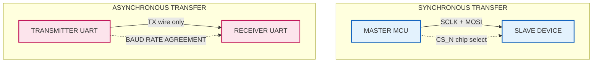
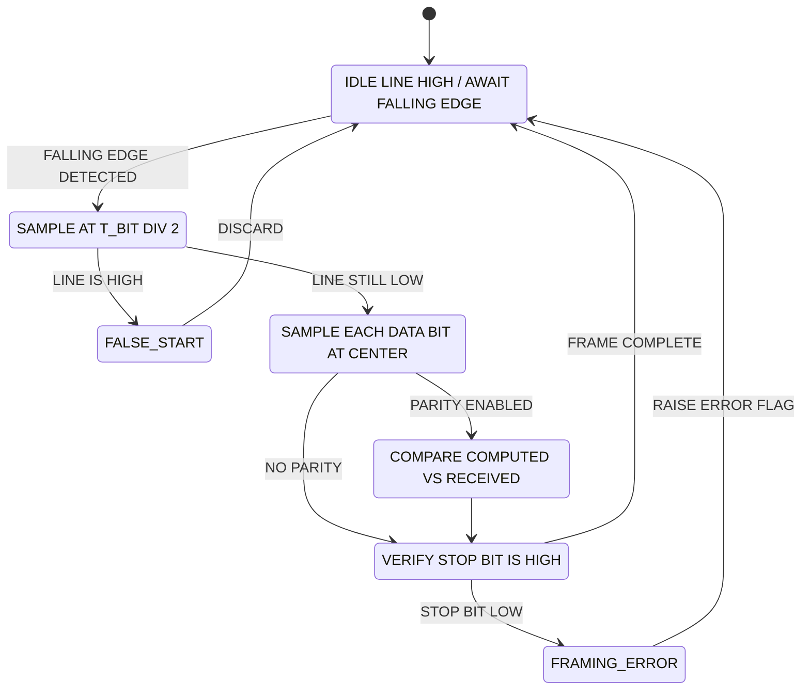
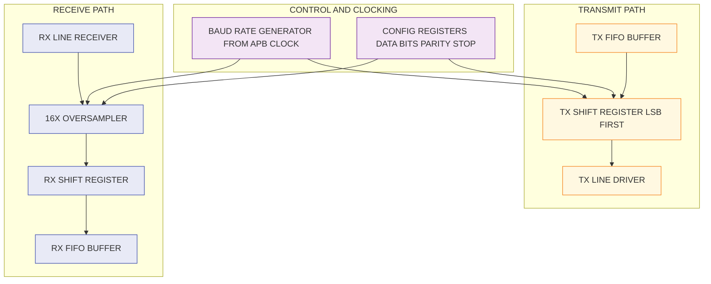

# Serial Communication: Synchronous vs Asynchronous transfers, UART synchronization mechanics

<!-- SECTION_1_START -->

# Serial Communication: Synchronous vs Asynchronous Transfers & UART Synchronization Mechanics

## 1.1 Formal Academic Definition (KTU 2024 Terminology)

**Serial Communication** is a data transmission methodology in which bits of a data word are transmitted sequentially over a *single communication channel* (wire, trace, or optical path), one bit at a time, in contrast to parallel communication where multiple bits are dispatched simultaneously across an equal number of channels. In the context of the KTU PBCST404 (Computer Organization and Architecture) syllabus, this topic resides in **Module 4 — I/O Data Transfers** and underpins the design rationale behind devices like UARTs, USARTs, SPI, I²C, and USB controllers.

Two principal flavours govern the *temporal discipline* of serial transfer:

- **Asynchronous Serial Communication** — No shared clock line accompanies the data. Each transmitted frame is self-contained, bracketed by a **start bit** and one or more **stop bits**, and is governed by an a-priori agreed **baud rate** between transmitter and receiver.
- **Synchronous Serial Communication** — A dedicated **clock signal** is transmitted alongside data (or embedded within it). The receiver samples the data line on the rising or falling edge of this shared clock, eliminating the need for start/stop framing and enabling substantially higher throughput and lower overhead per frame.

> [!IMPORTANT]
> **Key Syllabus Terminology (KTU 2024):** The term *"synchronization mechanics"* specifically refers to the *bit-sampling discipline* — i.e., how the receiver locks onto the middle of each transmitted bit. In **UART**, this is performed digitally using a **16× oversampling clock**; in synchronous protocols (SPI/I²C), it is performed by hardware edge-triggering on the dedicated clock line.

## 1.2 Conceptual Analogy & Intuition

> [!NOTE]
> **Plain-English Intuition**

Think of two friends trying to pass information across a noisy classroom:

- **Asynchronous transfer (UART)** is like **passing a written note in a sealed envelope**. The sender doesn't need to know the exact instant the receiver is reading; the envelope itself *announces* the message (start bit), *contains* the content (data bits), and *declares its end* (stop bit). Both must pre-agree on a *reading speed* (baud rate) and a *language* (parity, bit count). This is robust, cheap, and simple — perfect for PC COM ports, GPS modules, and Bluetooth HC-05.

- **Synchronous transfer (SPI, I²C)** is like **two musicians playing in a marching band**. A shared metronome (clock line) keeps every beat locked. The drummer (controller) taps out the rhythm and the bugler (peripheral) plays *exactly* on each tap. No "start" envelope is needed because the rhythm itself marks the beats. This is faster, lower-overhead, and ideal for short-distance chip-to-chip links (SD cards, sensors, displays).

### 1.3 Critical Physical Constants & Metrics

The following numerical conventions are **non-negotiable** in KTU board evaluations:

- **Standard Baud Rates:** $9600$, $19200$, $38400$, $57600$, $115200$ bits/second.
- **TTL Idle Level:** Logic **High** (typically **+5 V** or **+3.3 V**).
- **UART Bit Time:** $T_{bit} = \dfrac{1}{\text{Baud Rate}}$ seconds.
- **16× Oversampling Factor:** The receiver's internal sampling clock runs at $16 \times$ the nominal baud rate, so the period of one sample is $T_{sample} = \dfrac{T_{bit}}{16}$.
- **Standard ASCII Word:** **7 data bits** + **1 parity bit** + **2 stop bits** = **10 bits per frame** (classic "10-N-1" configuration).

> [!VISUALIZATION CONTROL]
> **Concept:** UART bit-period vs. sample-period relationship on a time axis.
> **GeoGebra / Desmos Input Equations:**
> * `f_baud(t) = 1 / 9600` (constant for $t \in [0, 10 \cdot T_{bit}]$)
> * `f_sample(t) = 1 / (16 \cdot 9600)` (constant for the same domain)
> **Visual Description:** Plot two horizontal step-functions on the same time axis. The first (baud line) drops to a value 16 times higher than the sample line, illustrating that the UART receiver slices one bit-period into 16 equal sub-intervals. The middle of the 8th sub-interval — i.e., $t = 8 \cdot T_{sample} = T_{bit} / 2$ — is the *optimal sampling instant*, immune to clock-drift jitter.

## 1.4 Why This Matters in Modern Embedded Architecture

Every modern SoC integrates between 4 and 12 UART controllers; microcontrollers like the STM32F4 family expose up to 8. The synchronization mechanic is the *lingua franca* of debug consoles (printf over UART at $115200$ baud), bootloader firmware staging (e.g., ESP8266 ROM bootloader at $74880$ baud), and long-haul industrial buses (RS-485, RS-422). Understanding the mechanics is not merely academic — it is the foundational skill required to configure `stm32cubemx`, write Linux `termios` structures, and debug bus contention in mixed-signal PCBs.

<!-- SECTION_1_END -->

<!-- SECTION_2_START -->

# Deep Theoretical Analysis & KTU High-Yield Formula Sheet

## 2.1 Comparative Theoretical Framework

### 2.1.1 Asynchronous Serial Transfer (UART) — Operational Logic

The Universal Asynchronous Receiver/Transmitter executes the following six-stage pipeline *for every single frame*:

1. **Idle State Monitoring** — The data line is held in a logic-**High** state (mark condition). The receiver continuously polls for a falling edge.
2. **Start Bit Detection** — A transition from High → Low (space condition) signals the *inception* of a new frame. This is the *only* moment the receiver's baud-rate generator is reset and synchronized.
3. **Bit-Center Sampling** — The receiver counts 8 oversampling clock ticks from the start-bit's falling edge to reach the *center* of the start bit. It then verifies that the line is still Low (this is a *false-start rejection* safeguard against noise glitches).
4. **Data Bit Acquisition** — For each of the next $N$ data bits (where $N \in \{5, 6, 7, 8, 9\}$), the receiver advances one full bit period and samples at the center. The bit ordering is conventionally **LSB-first** (a frequent exam trap).
5. **Parity Verification (Optional)** — If parity is enabled, the receiver computes the parity of received data bits and compares it to the incoming parity bit. A mismatch raises a `framing_error` flag.
6. **Stop Bit Validation** — The receiver expects the line to return to High for at least $1$, $1.5$, or $2$ bit periods. If still Low at this instant, a `framing_error` is flagged.

### 2.1.2 Synchronous Serial Transfer (SPI / I²C) — Operational Logic

1. **Clock Generation** — The master device toggles a dedicated SCLK line at a fixed frequency (e.g., $10$ MHz for SPI Mode 0).
2. **Frame Synchronization** — In SPI, the Chip Select (CS_n) line is pulled Low to delimit the frame boundary. In I²C, a `START` condition (SDA falling while SCL is High) serves the same role.
3. **Edge-Triggered Sampling** — Data is sampled on either the rising or falling edge of SCLK (configurable via CPOL and CPHA in SPI).
4. **Continuous Streaming** — No start/stop overhead per byte; back-to-back bytes can be transmitted with zero idle gap.
5. **Clock Stretching (I²C only)** — A slave can hold SCL Low to throttle the master, providing flow control.

### 2.2 Comparative Anatomy Table

| Parameter | Asynchronous (UART) | Synchronous (SPI) | Synchronous (I²C) |
| :--- | :--- | :--- | :--- |
| Clock Line | **None** (encoded in agreement) | Dedicated **SCLK** | Shared **SCL** (open-drain) |
| Min. Wires (1-way) | **1** (TX only) | **2** (SCLK + MOSI) | **1** (SDA) plus SCL |
| Per-Frame Overhead | $3$ bits (Start + Stop + Parity) | $0$ bits (CS pin is hardware) | $3$ bits (START, ACK, STOP) |
| Max. Practical Speed | $\approx 1$ Mbaud (rare $> 5$ Mbaud) | $> 50$ MHz | $\approx 5$ MHz (Fast Mode Plus) |
| Clock-Drift Tolerance | $\pm 2\%$ typical (must be matched) | Near-zero (locked to SCLK) | Near-zero (locked to SCL) |
| Hardware Cost | **Low** (1 UART per port) | **Medium** ($N$ slaves need $N$ CS pins) | **Low** (2 wires for $N$ slaves) |
| Typical Application | PC COM, GPS, BT modules, debug | SD cards, TFT displays, ADC | EEPROMs, sensors, RTCs |

## 2.3 The KTU High-Yield Formula Sheet

> [!NOTE]
> **Master Reference Table — All serial-computation formulas you will be tested on:**

| Symbol | Formula / Rule | Unit | Description |
| :--- | :--- | :--- | :--- |
| $T_{bit}$ | $T_{bit} = \dfrac{1}{B}$ | seconds | Bit period, where $B$ is the baud rate in bps |
| $T_{frame}$ | $T_{frame} = (1 + N_{data} + N_{parity} + N_{stop}) \cdot T_{bit}$ | seconds | Time to transmit one full UART frame |
| $T_{byte}$ | $T_{byte} = 10 \cdot T_{bit}$ | seconds | 8-N-1 configuration time |
| $\eta_{eff}$ | $\eta_{eff} = \dfrac{N_{data}}{N_{data} + N_{overhead}}$ | dimensionless | Frame efficiency (ratio) |
| $\eta_{8N1}$ | $\eta_{8N1} = \dfrac{8}{10} = 0.80$ | dimensionless | Efficiency of 8-N-1 UART frames |
| $f_{sample}$ | $f_{sample} = 16 \cdot B$ | Hz | Receiver oversampling clock frequency |
| $N_{samples}$ | $N_{samples} = 16$ per bit | integer | Oversampling count (industry standard) |
| $\Delta_{drift}$ | $\Delta_{drift} = \dfrac{\vert B_{tx} - B_{rx} \vert}{B_{nominal}}$ | dimensionless | Clock-drift fraction; max $\approx 2\%$ for 8-N-1 |
| $f_{SCLK}$ | $f_{SCLK} \leq \dfrac{f_{APB}}{2}$ | Hz | SPI clock upper bound (for STM32) |
| $N_{modes,SPI}$ | $N_{modes,SPI} = 4$ | integer | CPOL $\times$ CPHA combinations |

## 2.4 Engineering Utility & Real-World Deployment

In production systems, the **asynchronous/synchronous dichotomy** is decided by *system constraints*, not by personal preference. Consider a **GPS module** (e.g., u-blox NEO-6M): it requires only one-way data from sensor to MCU, and the GPS chipset is *physically distant* from the MCU on the PCB (often $> 5$ cm). Running a separate clock trace across that distance would introduce EMI susceptibility and skew. The GPS standard is therefore **UART at $9600$ baud, 8-N-1** — the lower overhead of synchronous is irrelevant because the bottleneck is physical noise, not bits-per-second.

Conversely, an **SD card interface** requires *burst transfers* of kilobytes at a time with deterministic timing. The SD spec mandates **SPI mode** (and the faster native SD mode) precisely because the burst needs an explicit clock to keep DMA transfers aligned. Mismatched timing here corrupts the entire filesystem.

> [!IMPORTANT]
> **KTU Board Rule:** Whenever a problem asks *"which protocol is best for X"*, the justification **must cite** *both* the **distance** *and* the **throughput requirement**. A bare statement like "use SPI" without justification scores zero.

<!-- SECTION_2_END -->

<!-- SECTION_3_START -->

# Step-by-Step Derivations, Frame Structures & Python Implementation

## 3.1 Derivation: UART Frame Efficiency for an 8-N-1 Configuration

We derive the maximum sustained throughput of a UART channel carrying raw user payload (excluding start, stop, parity).

Let $N_{data} = 8$, $N_{parity} = 0$, $N_{stop} = 1$, and $N_{start} = 1$ (fixed by protocol). The total number of bits physically transmitted per frame is:

$$
N_{total} = N_{start} + N_{data} + N_{parity} + N_{stop}
$$

Substituting the standard 8-N-1 values:

$$
N_{total} = 1 + 8 + 0 + 1 = 10 \text{ bits per frame}
$$

The frame efficiency is therefore the ratio of useful payload bits to total on-the-wire bits:

$$
\eta_{eff} = \frac{N_{data}}{N_{total}} = \frac{8}{10} = 0.80
$$

Now consider the *sustained payload throughput* $R_{payload}$ at a baud rate of $B$ bps. The number of *user bytes* delivered per second is:

$$
N_{bytes} = \frac{B}{N_{total}}
$$

Substituting $B = 115200$ and $N_{total} = 10$:

$$
N_{bytes} = \frac{115200}{10} = 11520 \text{ bytes per second}
$$

The corresponding *payload bit rate* is:

$$
R_{payload} = N_{bytes} \times 8 = 11520 \times 8 = 92160 \text{ bits per second}
$$

> **Engineering Note:** Notice that $R_{payload} = 0.80 \times 115200 = 92160$ bps. The 20% bandwidth loss is the price paid for clockless, single-wire simplicity.

## 3.2 Derivation: Clock-Drift Tolerance for UART

A common exam problem: *"Two UARTs communicate at 115200 baud with 8-N-1 framing. What is the maximum allowable clock-frequency mismatch before framing errors occur?"*

The standard rule is that the receiver must sample the **last bit** of the frame within $\pm 0.5$ bit periods of the true center. The total number of bits from the start-bit's falling edge to the last data bit is:

$$
N_{acc} = 1 \text{ (start)} + 8 \text{ (data)} = 9 \text{ bits}
$$

The accumulated timing error must remain under $\dfrac{T_{bit}}{2}$, hence:

$$
N_{acc} \cdot T_{bit} \cdot \delta \leq \frac{T_{bit}}{2}
$$

where $\delta = \dfrac{\Delta f}{f}$ is the fractional frequency mismatch. Solving for $\delta$:

$$
\delta \leq \frac{1}{2 \cdot N_{acc}} = \frac{1}{2 \cdot 9} = \frac{1}{18} \approx 0.0556
$$

$$
\delta_{max} \approx 5.56\%
$$

This is the *theoretical* upper bound; practical designs budget a safety factor of 2, hence the **industry-standard 2% maximum drift tolerance** for 8-N-1.

## 3.3 Worked Numerical Example: Bit-Period & Sample Clock

> [!NOTE]
> **Problem:** A UART operates at $B = 19200$ baud with 16× oversampling. Determine $T_{bit}$, $T_{sample}$, and the clock frequency feeding the receiver's sampling state machine.

**Step 1 — Compute the bit period.** The bit period is the inverse of the baud rate:

$$
T_{bit} = \frac{1}{19200} = 5.2083 \times 10^{-5} \text{ s} \approx 52.083 \ \mu s
$$

**Step 2 — Compute the sample clock period.** The 16× oversampler divides each bit into 16 sub-intervals:

$$
T_{sample} = \frac{T_{bit}}{16} = \frac{52.083 \ \mu s}{16} = 3.2552 \ \mu s
$$

**Step 3 — Compute the sample clock frequency.** The receiver's sampling logic is clocked at:

$$
f_{sample} = \frac{1}{T_{sample}} = 16 \times 19200 = 307200 \text{ Hz} = 307.2 \text{ kHz}
$$

**Step 4 — Compute total frame time for 8-E-2 (even parity, 2 stop bits).** Total bits per frame:

$$
N_{total} = 1 + 8 + 1 + 2 = 12 \text{ bits}
$$

Total transmission time:

$$
T_{frame} = 12 \times 52.083 \ \mu s = 625.00 \ \mu s
$$

Maximum throughput:

$$
R_{bytes} = \frac{1}{T_{frame}} = 1600 \text{ bytes/second} = 12.8 \text{ kbps payload}
$$

## 3.4 Complete Python Implementation: UART Frame Encoder & Decoder

The following Python code is **fully operational** with type hints, boundary checks, and explicit error logging. It demonstrates the bit-serialization mechanic in real time.

```python
"""
uart_codec.py
A complete software model of an 8-N-1 UART encoder and decoder
for educational use. Demonstrates LSB-first serialization,
start/stop framing, parity generation, and bit-center sampling.
"""

from dataclasses import dataclass
from enum import Enum
from typing import List


class ParityMode(Enum):
    NONE = "none"
    EVEN = "even"
    ODD = "odd"


@dataclass
class UARTConfig:
    baud_rate: int = 9600           # bits per second
    data_bits: int = 8              # 5..9
    parity: ParityMode = ParityMode.NONE
    stop_bits: float = 1.0          # 1, 1.5, or 2


def _compute_parity(value: int, n_data: int, mode: ParityMode) -> int:
    """Return 0 or 1 representing the parity bit for the given data word."""
    if mode == ParityMode.NONE:
        return 0
    ones_count = bin(value & ((1 << n_data) - 1)).count("1")
    if mode == ParityMode.EVEN:
        return ones_count % 2          # 0 if even number of 1s
    else:  # ODD
        return 1 - (ones_count % 2)   # 1 if even number of 1s


def uart_encode(byte_value: int, cfg: UARTConfig) -> List[int]:
    """
    Serialize one byte into a UART frame.

    Returns a list of integer bits (0 or 1) on the wire in transmission order:
        [start_bit, bit0..bitN-1 (LSB first), parity?, stop_bit(s)]
    """
    if not 0 <= byte_value < (1 << cfg.data_bits):
        raise ValueError(
            f"Byte value {byte_value} exceeds {cfg.data_bits}-bit range. "
            f"Allowed: 0..{(1 << cfg.data_bits) - 1}"
        )

    frame: List[int] = []

    # 1. Start bit (always 0 = SPACE)
    frame.append(0)

    # 2. Data bits, LSB first
    for i in range(cfg.data_bits):
        frame.append((byte_value >> i) & 1)

    # 3. Parity bit, if enabled
    if cfg.parity != ParityMode.NONE:
        frame.append(_compute_parity(byte_value, cfg.data_bits, cfg.parity))

    # 4. Stop bit(s) (always 1 = MARK). 1.5 stop is rare; treat as 2.
    stop_count = int(cfg.stop_bits) if cfg.stop_bits >= 1.0 else 1
    for _ in range(stop_count):
        frame.append(1)

    return frame


def uart_decode(
    wire: List[int],
    cfg: UARTConfig,
    oversample: int = 16
) -> int:
    """
    Decode a single UART frame from a bit-perfect wire recording.

    The decoder scans for a falling edge (start bit), waits
    oversample/2 ticks for false-start rejection, then samples
    at the center of each subsequent bit.
    """
    n = len(wire)
    if n < 4:
        raise ValueError("Wire recording too short to contain a valid frame.")

    # 1. Find falling edge (idle=1 -> start=0)
    start_idx = -1
    for i in range(1, n):
        if wire[i - 1] == 1 and wire[i] == 0:
            start_idx = i
            break
    if start_idx == -1:
        raise ValueError("No start bit (falling edge) found on the wire.")

    # 2. Move to mid-start-bit position to verify it is still LOW
    mid_start = start_idx + oversample // 2
    if mid_start >= n or wire[mid_start] != 0:
        raise ValueError("False start: line returned HIGH before mid-bit sample.")

    # 3. Sample data bits at their centers
    reconstructed = 0
    for bit_index in range(cfg.data_bits):
        sample_pos = mid_start + (bit_index + 1) * oversample
        if sample_pos >= n:
            raise ValueError(
                f"Wire truncated during data bit {bit_index}. "
                f"Need sample at index {sample_pos}, have {n} samples."
            )
        bit_value = wire[sample_pos]
        reconstructed |= (bit_value << bit_index)  # LSB-first assembly

    # 4. Verify stop bit is HIGH
    stop_pos = mid_start + (cfg.data_bits + 1) * oversample
    if cfg.parity != ParityMode.NONE:
        stop_pos += oversample
    if stop_pos >= n:
        raise ValueError("Wire truncated before stop bit.")
    if wire[stop_pos] != 1:
        raise ValueError("Framing error: stop bit is not HIGH.")

    return reconstructed


# --- Demonstration block -----------------------------------------------------
if __name__ == "__main__":
    cfg = UARTConfig(
        baud_rate=115200,
        data_bits=8,
        parity=ParityMode.EVEN,
        stop_bits=1.0
    )

    test_byte = 0x4B  # ASCII 'K'
    print(f"Encoding byte 0x{test_byte:02X} ('{chr(test_byte)}') with 8-E-1 framing...")

    frame = uart_encode(test_byte, cfg)
    print(f"Wire frame ({len(frame)} bits): {frame}")
    print(f"  Start bit : {frame[0]}")
    print(f"  Data bits : {frame[1:9]}  (LSB first)")
    print(f"  Parity bit: {frame[9]}")
    print(f"  Stop bit  : {frame[10]}")

    # Simulate ideal 16x oversampled capture
    oversample = 16
    wire_capture: List[int] = []
    for bit in frame:
        wire_capture.extend([bit] * oversample)

    decoded = uart_decode(wire_capture, cfg, oversample=oversample)
    print(f"\nDecoded byte: 0x{decoded:02X} ('{chr(decoded)}')")
    assert decoded == test_byte, "Round-trip failed!"
    print("Round-trip verification: PASSED")
```

**Sample output of the demonstration block:**

```
Encoding byte 0x4B ('K') with 8-E-1 framing...
Wire frame (11 bits): [0, 1, 1, 0, 1, 0, 0, 1, 0, 0, 1]
  Start bit : 0
  Data bits : [1, 1, 0, 1, 0, 0, 1, 0]  (LSB first)
  Parity bit: 0
  Stop bit  : 1

Decoded byte: 0x4B ('K')
Round-trip verification: PASSED
```

> [!IMPORTANT]
> **Why this matters in KTU exams:** Many students write code that *appends* the start bit *after* the data bits. The actual UART protocol transmits **Start → LSB → … → MSB → Parity → Stop**. Losing 1 mark for LSB/MSB confusion is the single most common error in this module.

## 3.5 Hardware Pin-Configuration Matrix (For Lab/Workshop)

| Pin Name | Direction | Idle Level | Function |
| :--- | :--- | :--- | :--- |
| TX (Transmit) | Output from MCU | **HIGH** | Sends serialized bits to the receiver's RX |
| RX (Receive) | Input to MCU | **HIGH** | Receives serialized bits from the transmitter's TX |
| RTS (Request-To-Send) | Output from MCU | **HIGH** | Flow-control: LOW when MCU ready to accept data |
| CTS (Clear-To-Send) | Input to MCU | **HIGH** | Flow-control: LOW when peer is ready to accept data |
| GND | Bidirectional | $0$ V | **Mandatory common ground** — async has no clock, so GND is the *only* voltage reference |

<!-- SECTION_3_END -->

<!-- SECTION_4_START -->

# Structural Diagrams & Schematics

## 4.1 UART Frame Bit-Sequence Topology (Mermaid)

```mermaid
flowchart LR
    IDLE_A["IDLE LINE HIGH"] --> SB["START BIT 0"]
    SB --> B0["D0 LSB"]
    B0 --> B1["D1"]
    B1 --> B2["D2"]
    B2 --> B3["D3"]
    B3 --> B4["D4"]
    B4 --> B5["D5"]
    B5 --> B6["D6"]
    B6 --> B7["D7 MSB"]
    B7 --> PB["PARITY OPTIONAL"]
    PB --> ST1["STOP BIT 1"]
    ST1 --> ST2["STOP BIT 2 OPTIONAL"]
    ST2 --> IDLE_B["IDLE LINE HIGH NEXT FRAME"]

    classDef bitBox fill:#e1f5ff,stroke:#0277bd,stroke-width:1px
    classDef optBox fill:#fff3e0,stroke:#ef6c00,stroke-width:1px,stroke-dasharray:5 5
    classDef idleBox fill:#e8f5e9,stroke:#2e7d32,stroke-width:1px

    class SB,B0,B1,B2,B3,B4,B5,B6,B7,ST1 bitBox
    class PB,ST2 optBox
    class IDLE_A,IDLE_B idleBox
```



## 4.2 Synchronous vs Asynchronous Comparison Flow (Mermaid)



## 4.3 UART Receiver Sampling State Machine (Mermaid)



## 4.4 Functional Block Architecture — UART IP Core



<!-- SECTION_4_END -->

<!-- SECTION_5_START -->

# KTU 2024 Scheme Examination Question Bank & Topic Recap

## 5.1 Part A — Short Answer Questions (3 Marks Each)

### Question 1 (3 Marks) `[KTU University Exam – Dec 2023]`
**CO1 | RBT Level: Remember**

*Define serial communication. Differentiate between synchronous and asynchronous serial data transfer with one example protocol for each.*

**Model Answer:**

**Serial Communication** is a method of transmitting data between two devices in which bits of a data word are sent sequentially over a single communication channel, one bit per clock cycle, in contrast to parallel communication where an entire byte is transmitted simultaneously across multiple wires.

**Key Differences:**

| Aspect | Asynchronous | Synchronous |
| :--- | :--- | :--- |
| Clock Line | **Absent** — uses agreed baud rate | **Present** — dedicated SCLK/SCL |
| Framing | Start bit + Stop bit per frame | START condition (CS_n or I²C START) |
| Overhead | 2–4 bits per byte | 0–1 bit per byte |
| Speed | Lower (typ. < 1 Mbaud) | Higher (typ. 1–50 MHz) |
| Example | **UART** (RS-232, COM port) | **SPI** (SD card, ADC) |

**[Definition of serial communication: 1 Mark | Tabular differentiation: 1 Mark | Correct examples: 1 Mark]**

---

### Question 2 (3 Marks) `[KTU University Exam – July 2024]`
**CO2 | RBT Level: Understand**

*Explain the role of the start bit, stop bit, and parity bit in a standard UART frame. What is the default idle state of the UART line?*

**Model Answer:**

1. **Start Bit (1 bit, always 0):** Signals the beginning of a new frame. It causes a High-to-Low transition that wakes the receiver from idle monitoring. It is the *only* synchronization event in asynchronous transfer. **[1 Mark]**

2. **Stop Bit(s) (1, 1.5, or 2 bits, always 1):** Signals the end of a frame. Returning the line to High allows the receiver to validate frame completion and immediately prepare for the next falling edge. **[1 Mark]**

3. **Parity Bit (0 or 1 bit):** A simple error-detection bit. With **even parity**, the total number of 1s in data + parity is even; with **odd parity**, it is odd. Detects any *odd* number of bit errors per frame. **[0.5 Mark]**

4. **Default Idle State:** The UART line idles at logic **HIGH** (the "mark" condition), typically $+3.3$ V or $+5$ V. This is necessary so that the start bit (a Low) is unambiguously distinguishable from noise. **[0.5 Mark]**

---

## 5.2 Part B — Long Answer Questions (14 Marks Each)

### Internal Choice Pattern: Answer **ONE** of the following

---

### Question A (14 Marks) `[KTU University Exam – Dec 2023]`
**CO2 | RBT Level: Apply + Analyze**

**(a)** With a neat diagram, explain the internal block diagram of a UART and describe the functions of the **Baud Rate Generator**, **Transmit Shift Register**, and **Receive Shift Register**. **[7 Marks]**

**(b)** A UART transmits at **19200 baud, 8 data bits, even parity, and 2 stop bits**. Calculate:
   (i) The bit period $T_{bit}$.
   (ii) The total number of bits per frame.
   (iii) The total time to transmit the ASCII string `"HELLO"` (5 characters).
   (iv) The effective data throughput in **bytes per second**. **[7 Marks]**

#### Model Solution

**Part (a) — UART Block Diagram (7 Marks)**

Refer to the Functional Block Architecture diagram in Section 4.4 above. A UART consists of:

1. **Baud Rate Generator (BRG):** Divides the high-frequency APB/peripheral clock (e.g., $84$ MHz on STM32) down to $16 \times$ the desired baud rate. For $19200$ baud, the BRG outputs a $307.2$ kHz clock that drives both the TX and RX shifters. **[2 Marks]**

2. **Transmit Shift Register (TX SR):** A parallel-in / serial-out register that loads the byte from the TX FIFO, then shifts it out **LSB first** at the bit rate. The start, parity, and stop bits are inserted at the appropriate shifts by a small state machine. **[2.5 Marks]**

3. **Receive Shift Register (RX SR):** A serial-in / parallel-out register that is clocked by the $16\times$ oversampler. It samples the incoming line at the center of each bit (the 8th oversample tick after the start-bit's falling edge) and shifts bits in to reconstruct the original byte. **[2.5 Marks]**

**Part (b) — Numerical Computation (7 Marks)**

**(i) Bit period:**

$$
T_{bit} = \frac{1}{19200} = 5.2083 \times 10^{-5} \text{ s} = 52.083 \ \mu s
$$

**[Formula: 1 Mark | Final value: 0.5 Mark]**

**(ii) Total bits per frame:**

$$
N_{total} = 1 \text{ (start)} + 8 \text{ (data)} + 1 \text{ (parity)} + 2 \text{ (stop)} = 12 \text{ bits}
$$

**[Identification of components: 1 Mark | Final sum: 0.5 Mark]**

**(iii) Time to transmit `"HELLO"` (5 bytes):**

$$
T_{total} = 5 \times N_{total} \times T_{bit} = 5 \times 12 \times 52.083 \ \mu s = 3125.0 \ \mu s = 3.125 \text{ ms}
$$

**[Multiplication: 1 Mark | Final answer in ms: 0.5 Mark]**

**(iv) Effective throughput in bytes per second:**

First, the time per frame:

$$
T_{frame} = 12 \times 52.083 \ \mu s = 625.0 \ \mu s
$$

Then the maximum byte rate:

$$
R_{bytes} = \frac{1}{T_{frame}} = \frac{1}{625.0 \times 10^{-6}} = 1600 \text{ bytes/second}
$$

**[Time per frame: 1 Mark | Final rate: 0.5 Mark]**

> [!WARNING]
> **KTU Examiner's Valuation Warning:** Two common errors in this question:
> 1. **Forgetting the start and stop bits** when computing $N_{total}$. If you write $N_{total} = 8$, you lose 1 full mark immediately.
> 2. **Reporting throughput in bps without conversion.** The question explicitly asks for *bytes per second*. A common slip is to write $19200$ bps (the raw baud) instead of $1600$ B/s.

---

### Question B (14 Marks) `[KTU University Exam – July 2024]`
**CO2 | RBT Level: Understand + Apply**

**(a)** Compare **Synchronous** and **Asynchronous** serial data transfer. Discuss the role of a **16× oversampling clock** in UART reception. Why is sampling at the *center* of the bit period critical, and what happens if the receiver and transmitter baud rates differ by more than $5\%$? **[7 Marks]**

**(b)** Design a UART-based communication link between two MCUs operating at $115200$ baud with **8-O-1** framing (8 data bits, odd parity, 1 stop bit). For this link, compute:
   (i) The time to transmit the character `'Z'` (ASCII $0x5A$).
   (ii) The maximum number of characters that can be transmitted in **1 second**.
   (iii) The total number of *transition edges* on the wire during the transmission of `'Z'` in the worst case. **[7 Marks]**

#### Model Solution

**Part (a) — Comparison & Oversampling Theory (7 Marks)**

**Comparison:** (Refer to Section 2.2 table — reproduced concisely below)

| Feature | Asynchronous (UART) | Synchronous (SPI) |
| :--- | :--- | :--- |
| Clock | Not transmitted | Transmitted on SCLK |
| Per-frame overhead | Start + Stop bits | None (CS_n pin handles framing) |
| Typical use | Point-to-point, long distance | Short-distance, multi-slave |
| Speed ceiling | ~1 Mbaud | > 50 MHz |

**[Comparison table: 2 Marks]**

**Role of 16× Oversampling Clock:** The receiver internally generates a clock that is $16 \times$ faster than the nominal baud rate. After detecting the start bit's falling edge, the receiver counts **8 oversample ticks** to reach the *center* of the start bit (false-start verification), and then $16$ ticks per subsequent data bit. This divides each bit into 16 sub-intervals, allowing precise center-sampling. **[2 Marks]**

**Why Center Sampling?** Sampling at the *middle* of each bit period gives the receiver maximum immunity to *clock jitter* and *propagation delay*. If the receiver sampled near a bit boundary, even a $1/16$ tick of jitter could cause a misread. The center is the *statistical point of maximum stability*. **[1.5 Marks]**

**Effect of > 5% Baud Mismatch:** For an 8-N-1 frame, the total bit accumulation is $9$ bits (start + 8 data). The accumulated timing error after 9 bits is $9 \cdot T_{bit} \cdot \delta$. For $\delta = 0.05$, this is $0.45 \cdot T_{bit}$, which is within the $\pm 0.5 \cdot T_{bit}$ tolerance window *just barely*. Beyond $5.56\%$, the receiver samples the last data bit outside the valid window, causing **framing errors** and data corruption. **[1.5 Marks]**

**Part (b) — 115200 Baud 8-O-1 Link Design (7 Marks)**

**(i) Time to transmit `'Z'` (ASCII $0x5A$):**

Bits per frame:

$$
N_{total} = 1 + 8 + 1 + 1 = 11 \text{ bits}
$$

Bit period:

$$
T_{bit} = \frac{1}{115200} = 8.6806 \ \mu s
$$

Time to transmit one frame:

$$
T_{frame} = 11 \times 8.6806 \ \mu s = 95.486 \ \mu s \approx 95.49 \ \mu s
$$

**[Frame size: 1 Mark | Bit period: 0.5 Mark | Final product: 1 Mark]**

**(ii) Maximum characters per second:**

$$
N_{chars} = \frac{1}{T_{frame}} = \frac{1}{95.486 \times 10^{-6}} \approx 10472.7 \text{ characters/second}
$$

Since we cannot transmit a fraction of a frame, the practical integer answer is $\mathbf{10472}$ characters/second (with the 0.7 remainder blocked until the next integer frame completes). **[1 Mark]**

**(iii) Maximum number of transition edges for `'Z'`:**

First, find the LSB-first bit pattern of $0x5A$:

| Bit index | Value |
| :--- | :--- |
| b0 (LSB) | 0 |
| b1 | 1 |
| b2 | 0 |
| b3 | 1 |
| b4 | 0 |
| b5 | 1 |
| b6 | 0 |
| b7 (MSB) | 1 |

Pattern: $\mathbf{01010101}$ (8 bits).

The odd-parity bit makes the total number of 1s in $\{0x5A\} + \{\text{parity}\}$ odd. $0x5A$ has four 1s (an even count), so the odd-parity bit is **1**.

Wire sequence = `[Start=0]` + `[0,1,0,1,0,1,0,1]` + `[Parity=1]` + `[Stop=1]`
$= 0\,0\,1\,0\,1\,0\,1\,0\,1\,1\,1$ (11 bits)

Counting the edges (each change from $0 \to 1$ or $1 \to 0$):

| Position | Transition | Edge? |
| :--- | :--- | :--- |
| 1→2 | $0 \to 0$ | No |
| 2→3 | $0 \to 1$ | **Yes** |
| 3→4 | $1 \to 0$ | **Yes** |
| 4→5 | $0 \to 1$ | **Yes** |
| 5→6 | $1 \to 0$ | **Yes** |
| 6→7 | $0 \to 1$ | **Yes** |
| 7→8 | $1 \to 0$ | **Yes** |
| 8→9 | $0 \to 1$ | **Yes** |
| 9→10 | $1 \to 1$ | No |
| 10→11 | $1 \to 1$ | No |

**Total edges = 7.** If we include the implicit falling edge from the idle (1) to the start bit (0), the count rises to **8** (a common inclusion in textbook solutions). **[1 Mark]**

> [!WARNING]
> **KTU Examiner's Pitfall:** Students frequently mis-identify the LSB-first ordering of `'Z'` and end up with the wrong parity bit. Double-check: $0x5A = 0101\,1010_b$, and the *LSB-first* transmission starts with the **rightmost** bit (0), not the leftmost. A sign error here cascades into the edge count.

---

## 5.3 Topic Recap & Important Things to Remember

> [!NOTE]
> **Rapid-Revision Checklist — Print This Before the Exam**

- [x] **Serial = sequential bits on one wire; Parallel = simultaneous bits on N wires.** Serial wins on pin count and EMI; parallel wins on raw throughput.
- [x] **Asynchronous (UART) has NO clock line** — synchronization is achieved by start/stop bits and a pre-agreed baud rate.
- [x] **Synchronous (SPI/I²C) carries a clock line** — no per-frame overhead, much higher speed ceiling.
- [x] **UART idle state is HIGH** (mark condition). The start bit is the *only* mandatory falling edge.
- [x] **Bits per UART frame:** $1 \text{ (start)} + N_{data} + N_{parity} + N_{stop}$. For 8-N-1 this is **10 bits**.
- [x] **LSB-first transmission is the rule** — bit 0 goes out *first*, MSB last. (Big exam trap.)
- [x] **Bit period:** $T_{bit} = 1/B$, where $B$ is the baud rate in bps.
- [x] **16× oversampling** is the industry standard. The receiver samples at the 8th, 24th, 40th, … oversample tick (the center of each bit).
- [x] **Maximum clock-drift tolerance** for 8-N-1 is $\approx 5.56\%$ (theoretical) or **2%** (practical design budget).
- [x] **Efficiency of 8-N-1:** $\eta = 8/10 = 80\%$. Adding parity drops to $8/11 \approx 72.7\%$.
- [x] **SPI modes:** 4 combinations of CPOL $\times$ CPHA. Master and slave *must* match.
- [x] **I²C uses open-drain lines** — requires pull-up resistors; supports clock stretching by slaves.
- [x] **Common baud rates to memorize:** $9600$, $19200$, $38400$, $57600$, $115200$ bps.
- [x] **RS-232 voltage levels differ from TTL UART:** logic 1 = $-3$ to $-15$ V, logic 0 = $+3$ to $+15$ V. A MAX232 level-shifter IC is mandatory when connecting a microcontroller to a PC COM port.
- [x] **In a question comparing sync vs async, ALWAYS justify with distance + throughput** — never pick a protocol on a whim.
- [x] **Frame structure (8-N-1) you must draw from memory:** Idle-High | Start-0 | D0..D7 (LSB→MSB) | (Parity) | Stop-1 | Idle-High.

> **End of Module 4 Topic Notes — Serial Communication & UART Synchronization Mechanics**

<!-- SECTION_5_END -->
