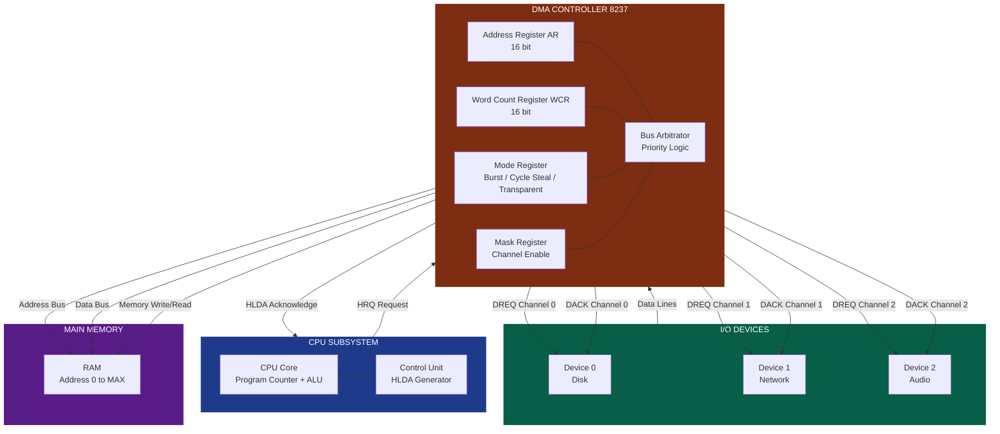
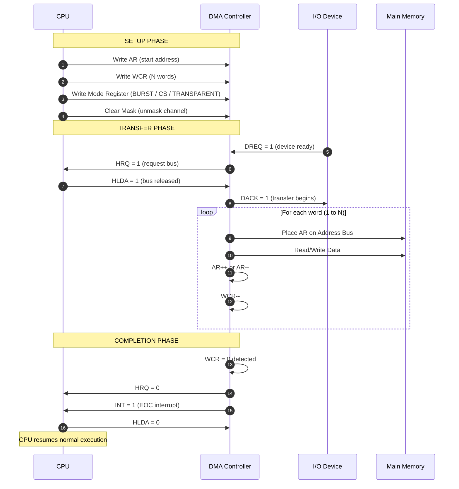
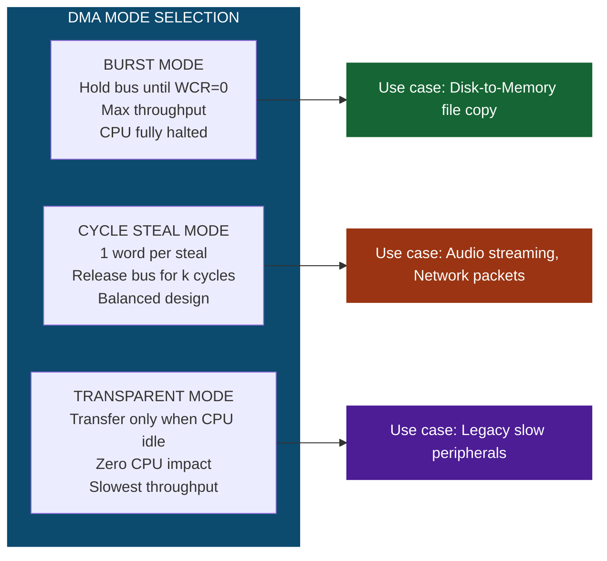
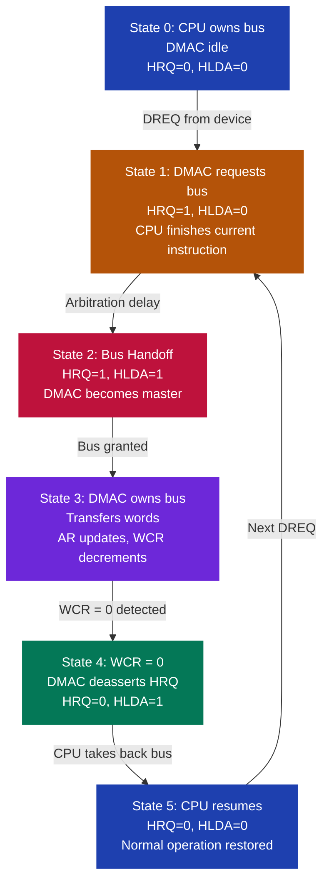

# Direct Memory Access

<!-- SECTION_1_START -->
# Direct Memory Access (DMA) — Core Definition & Intuitive Overview

> [!IMPORTANT]
> **KTU 2024 Syllabus Anchor (PBCST404 — Module 4: Input/Output)**
> Direct Memory Access is a high-performance data transfer technique that allows I/O devices to exchange data directly with main memory **without continuous CPU intervention**, freeing the processor to execute other instructions in parallel.

## Formal Academic Definition

**Direct Memory Access (DMA)** is a method of transferring data between an Input/Output (I/O) device and the main memory of a computer system in which the data transfer is controlled by a dedicated hardware unit called the **DMA Controller (DMAC)**, completely bypassing the Central Processing Unit (CPU). The CPU only initiates the transfer by providing the DMAC with parameters such as the **source address**, **destination address**, **word count**, and **transfer mode**; once initiated, the DMAC arbitrates for the system bus, takes control, performs the data movement, and notifies the CPU via an interrupt upon completion.

In the KTU 2024 Scheme terminology, DMA is classified as a **bus-mastering technique** because the DMAC temporarily becomes the bus master and forces the CPU to release control of the address bus, data bus, and control bus.

## Conceptual Analogy — Plain English Intuition

> [!NOTE]
> **Real-World Analogy: The Library Courier**
> Imagine you are a librarian (the **CPU**) responsible for handling customer requests. A customer wants to borrow 500 books from the storage room.
>
> - **Programmed I/O (Polling/Interrupt):** The librarian personally walks to the storage room, picks up one book, walks back, places it on the counter, then walks again for the next book — 500 round trips. The librarian is exhausted and cannot help other customers.
> - **DMA:** The librarian hands a **delivery slip** to a dedicated courier (**DMA Controller**) that says: *"Go to aisle 12, shelf 5, take 500 books, deliver them to counter 3."* The librarian goes back to serving other customers. When the courier finishes, the courier pings the librarian once: *"Done!"*

This is exactly how DMA accelerates bulk data movement in systems like **disk controllers, network cards, sound cards, and GPU framebuffers**.

## Key Terminology & Standard Constants

The following are the standard control signals and architectural constants used in every DMA-based system studied in the KTU syllabus:

| Symbol | Meaning | Bus State |
| :--- | :--- | :--- |
| **HRQ** | **Hold Request** (from DMAC to CPU) | Active High |
| **HLDA** | **Hold Acknowledge** (from CPU to DMAC) | Active High |
| **DREQ** / **DRQ** | DMA Request (from I/O device to DMAC) | Active High |
| **DACK** | DMA Acknowledge (from DMAC to I/O device) | Active High |
| **$\overline{\text{BUSRQ}}$** | Bus Request (alternate low-active form) | Active Low |
| **$\overline{\text{BUSAK}}$** | Bus Acknowledge (alternate low-active form) | Active Low |

> [!TIP]
> **Mnemonic Hook:** "**H**old **R**equest **A**cknowledge" — Always drawn as a two-line handshake: `HRQ ↓` then `HLDA ↓` (going high), bus released, then `HRQ ↑` then `HLDA ↑` (going low) to return control.

## Visualization Control

> [!VISUALIZATION CONTROL]
> **Concept:** Bus Master Handoff Timing
> **Desmos Input Equations (Step Plot):**
> * `HRQ(t) = step(t - t1) - step(t - t4)`
> * `HLDA(t) = step(t - t2) - step(t - t3)`
> * `BusState(t) = (HLDA(t) = 1) ? "DMAC" : "CPU"`
> **Visual Description:** Plot a time axis from `t0` to `t5`. The `HRQ` signal rises first at `t1`. After a short arbitration delay, the `HLDA` signal rises at `t2`, marking the **bus release point**. Between `t2` and `t3` the DMAC owns the bus and performs the transfer. `HRQ` falls at `t4`, then `HLDA` falls at `t5`, returning the bus to the CPU.
<!-- SECTION_1_END -->

<!-- SECTION_2_START -->
# Deep Theoretical Analysis & KTU High-Yield Formula Sheet

## 2.1 Why DMA? — The Motivation

In a system using only **Programmed I/O** or **Interrupt-Driven I/O**, the CPU is responsible for every single data word movement. For a high-speed device like a hard disk streaming at **100 MB/s**, the CPU would be fully saturated just copying bytes, leaving **0% CPU time** for actual computation. DMA solves this by **offloading** the byte-copy task to dedicated hardware, allowing **overlapped I/O and computation** (the foundation of modern operating systems and Direct Memory Access in GPUs, NVMe SSDs, RDMA NICs).

## 2.2 The DMA Controller — Internal Architecture

The DMA Controller (e.g., the classic Intel **8237** DMAC, a staple of KTU exam questions) contains the following internal register set, one set **per channel** (typically 4 channels):

- **Address Register (AR):** Holds the current memory address. Auto-increments or auto-decrements after each transfer.
- **Word Count Register (WCR):** Holds the number of bytes/words remaining to transfer. Auto-decrements.
- **Control Register (CR):** Configures transfer mode, address direction, auto-initialize, and channel priority.
- **Mask Register (MR):** A single bit per channel that enables/disables a DMA channel.
- **Mode Register:** Selects **Demand**, **Block (Burst)**, **Single**, or **Cascade** mode.

> [!IMPORTANT]
> **KTU High-Yield Fact:** The 8237 DMAC is a **4-channel** device. It can be cascaded to support more channels. Channel 4 is often reserved for cascade to a second 8237, giving a theoretical maximum of **$4 + 4 \times 4 = 20$** channels (rarely used, but a favorite trick question).

## 2.3 DMA Transfer Modes — The Three Pillars

| Mode | Bus Holding | CPU Activity | Best Use Case |
| :--- | :--- | :--- | :--- |
| **Burst Mode (Block Transfer)** | DMAC holds bus until **WCR = 0** | CPU **completely frozen** | High-speed, time-critical blocks (e.g., disk-to-memory) |
| **Cycle Stealing Mode** | DMAC transfers **one word per steal**, then releases bus | CPU executes in between steals | Continuous streams where CPU must remain responsive (e.g., audio) |
| **Transparent Mode** | DMAC transfers **only when CPU is not using the bus** | CPU runs at full speed, **zero wait** | Very slow peripherals; rare in modern systems |

### The Mode Selection Logic

1. **Burst Mode** maximizes throughput but creates the **worst CPU latency**.
2. **Cycle Stealing** is the **most commonly used** mode because it balances throughput and CPU availability. Throughput $= \dfrac{1}{1 + k}$ where $k$ is the number of CPU cycles the DMAC waits between steals.
3. **Transparent Mode** requires the DMAC to monitor the CPU's clock/ready line, which is hardware-intensive. The transfer is **invisible** to the CPU.

## 2.4 DMA Transfer Types

- **I/O to Memory (Read from device):** Device $\rightarrow$ Memory. Used in disk reads, network packet reception.
- **Memory to I/O (Write to device):** Memory $\rightarrow$ Device. Used in disk writes, network packet transmission.
- **Memory to Memory:** Memory $\rightarrow$ Memory. Requires a special channel; one 8237 channel acts as the source, another as the destination.

## 2.5 Bus Arbitration — How the CPU Relinquishes Control

There are two main approaches, both heavily tested in KTU:

1. **Centralized Arbitration (Single Master):** The CPU has a dedicated **DMA Controller** sitting between the I/O devices and the system bus. The DMAC requests the bus via **HRQ**, the CPU replies with **HLDA**, then the DMAC drives the address/data/control lines.

2. **Distributed Arbitration (Multiple Masters):** Each potential master (CPU, DMAC, Multi-core agent) has its own arbitration logic. Common in modern multi-core SoCs.

## 2.6 I/O Configurations with DMA

| Configuration | Description | Disadvantage |
| :--- | :--- | :--- |
| **Single Bus, Separate DMA** | All devices (CPU, Memory, I/O, DMAC) share **one system bus**. DMAC acts as a proxy. | Every DMA transfer uses the bus **twice** (I/O $\rightarrow$ DMAC $\rightarrow$ Memory). |
| **Single Bus, Integrated DMA** | DMAC is integrated into the I/O device itself (modern "bus-mastering NIC"). | Transfer is one bus cycle per word. **Industry standard.** |
| **Separate I/O Bus** | An **I/O bus** (e.g., PCIe) connects devices to the DMAC, and a **memory bus** connects DMAC to memory. | I/O devices and memory can transfer concurrently with CPU work. |

## 2.7 KTU Formula Sheet — DMA Quick Reference

> [!TIP]
> **Master this table. It covers ~80% of KTU numerical and conceptual questions on DMA.**

| Parameter | Formula / Definition | Unit / Notes |
| :--- | :--- | :--- |
| **Total Transfer Time (Burst)** | $T_{\text{burst}} = T_{\text{setup}} + N \cdot t_{\text{cycle}}$ | $N$ = word count, $t_{\text{cycle}}$ = bus cycle time |
| **Total Transfer Time (Cycle Stealing)** | $T_{\text{cs}} = N \cdot (t_{\text{cycle}} + k \cdot t_{\text{CPU}})$ | $k$ = idle CPU cycles per steal |
| **Throughput (Cycle Stealing)** | $\text{TP} = \dfrac{1}{t_{\text{cycle}} + k \cdot t_{\text{CPU}}}$ | Words per second |
| **Burst Mode Transfer Rate** | $R_{\text{burst}} = \dfrac{N}{T_{\text{burst}}}$ | Words/second |
| **Channel Count (Cascaded 8237)** | $C = 4 + (4 \times (n - 1))$ | $n$ = number of cascaded 8237 chips |
| **Address Auto-Increment** | $\text{AR}_{\text{next}} = \text{AR}_{\text{current}} \pm 1$ | Direction set in Mode Register |
| **Word Count Termination** | Transfer ends when $\text{WCR} = 0$ | EOC signal generated |
| **CPU Block Time (Burst)** | $T_{\text{block}} = T_{\text{burst}}$ | CPU cannot fetch instructions during burst |
| **CPU Block Time (Cycle Steal)** | $T_{\text{block}} = N \cdot t_{\text{cycle}}$ | CPU blocked only during actual steals |
| **Effective Bandwidth Reduction (CS)** | $\Delta BW = \dfrac{k \cdot t_{\text{CPU}}}{t_{\text{cycle}} + k \cdot t_{\text{CPU}}}$ | Fraction of bus cycles lost to CPU |

## 2.8 Real-World Engineering Utility

- **Disk Controllers (SATA/NVMe):** Use DMA to stream gigabytes into memory without OS intervention.
- **GPUs (PCIe P2P DMA):** Transfer textures and frame buffers at $\geq 32$ GB/s.
- **Networking (RDMA):** Remote Direct Memory Access allows a network card to write directly into another machine's RAM, bypassing both CPUs — the basis of high-frequency trading and HPC.
- **Audio (Sound Cards):** Use cycle-stealing DMA to keep audio buffers continuously fed.
- **Embedded Systems (STM32, ESP32):** DMA channels drive ADC, SPI, UART, and DAC peripherals with zero CPU load.
<!-- SECTION_2_END -->

<!-- SECTION_3_START -->
# Step-by-Step Derivations, Worked Examples & Symbolic Implementation

## 3.1 Exhaustive DMA Transfer Sequence — The 8237 Lifecycle

The complete handshake from start to finish is as follows. **Every line below is a KTU-favorite model answer step.**

1. The CPU programs the DMAC by writing to the **Address Register** (starting memory address), the **Word Count Register** ($N$ words to transfer), and the **Mode Register** (mode, direction, auto-init).
2. The CPU writes to the **Mask Register** to **unmask** the specific channel.
3. The I/O device (e.g., a disk) becomes ready for data and asserts **DREQ** to the DMAC.
4. The DMAC asserts **HRQ** to the CPU, requesting the bus.
5. The CPU completes its current instruction, then asserts **HLDA**, releasing the system bus (address, data, control) and entering a **hold state**.
6. The DMAC asserts **DACK** to the I/O device, telling it the transfer is beginning.
7. The DMAC places the memory address on the address bus and reads/writes the data word.
8. The DMAC **decrements WCR** and **increments/decrements AR**.
9. **If Burst Mode:** Steps 7–8 repeat until WCR = 0.
   **If Cycle Stealing:** After step 8, the DMAC releases the bus for $k$ CPU cycles, then re-requests via HRQ.
10. When WCR = 0, the DMAC asserts the **EOC (End of Count)** signal and deasserts HRQ.
11. The CPU deasserts HLDA and resumes normal execution.
12. The DMAC raises an **interrupt** to the CPU signaling completion.

## 3.2 Worked Numerical Problem — Burst Mode Transfer Time

**Problem (KTU Typical):**
A disk drive uses DMA in burst mode to transfer a file of size **64 KB** to memory. The bus cycle time is **$100$ ns** per word (assume 1 word = 1 byte for simplicity). The DMAC setup time is **$500$ ns**. The CPU clock cycle is **$50$ ns** and the CPU requires **$5$ cycles** to halt and another **$5$ cycles** to resume after the DMAC releases the bus. Calculate:
(a) Total transfer time.
(b) Effective transfer rate.
(c) Total CPU block time (lost CPU cycles).

**Solution — Step by Step:**

**Given:**
- $N = 64 \text{ KB} = 64 \times 1024 = 65536$ bytes
- $t_{\text{cycle}} = 100 \text{ ns}$
- $T_{\text{setup}} = 500 \text{ ns}$
- $t_{\text{CPU}} = 50 \text{ ns}$
- $C_{\text{halt}} = 5$ cycles, $C_{\text{resume}} = 5$ cycles

**(a) Total Transfer Time:**

$$
\begin{aligned}
T_{\text{burst}} &= T_{\text{setup}} + N \cdot t_{\text{cycle}} + (C_{\text{halt}} + C_{\text{resume}}) \cdot t_{\text{CPU}} \\
&= 500 \text{ ns} + 65536 \times 100 \text{ ns} + (5 + 5) \times 50 \text{ ns} \\
&= 500 \text{ ns} + 6553600 \text{ ns} + 500 \text{ ns} \\
&= 6554600 \text{ ns} \\
&= 6.5546 \text{ ms}
\end{aligned}
$$

> **Valuation Key:** Correctly computing $N = 64 \times 1024$ (not $64 \times 1000$): **1 Mark**. Setting up the formula: **1 Mark**. Final numerical answer: **1 Mark**.

**(b) Effective Transfer Rate:**

$$
\begin{aligned}
R_{\text{burst}} &= \frac{N}{T_{\text{burst}}} = \frac{65536 \text{ bytes}}{6.5546 \text{ ms}} \\
&= \frac{65536}{6.5546 \times 10^{-3}} \text{ bytes/second} \\
&\approx 9{,}998{,}756 \text{ bytes/second} \\
&\approx 10 \text{ MB/s}
\end{aligned}
$$

**(c) Total CPU Block Time:**

$$
\begin{aligned}
T_{\text{CPU\_block}} &= T_{\text{burst}} - T_{\text{setup}} \\
&= 6.5546 \text{ ms} - 0.0005 \text{ ms} \\
&= 6.5541 \text{ ms}
\end{aligned}
$$

Or equivalently, the CPU loses $(C_{\text{halt}} + C_{\text{resume}}) \cdot t_{\text{CPU}} + N \cdot t_{\text{cycle}}$ worth of potential work. Note that the CPU is **completely halted** during the actual data movement in burst mode.

## 3.3 Worked Numerical Problem — Cycle Stealing Mode

**Problem (KTU Typical):**
A sound card uses cycle-stealing DMA to transfer audio samples. Each sample is **4 bytes**. The bus cycle time is **$200$ ns**. Between each DMA steal, the DMAC releases the bus for **$3$ CPU cycles** (each $100$ ns). The buffer is **4096 samples**.
Calculate:
(a) Total transfer time for the buffer.
(b) Effective sample rate.
(c) What is the throughput penalty vs. burst mode?

**Solution:**

**Given:**
- $N = 4096$ words
- $t_{\text{cycle}} = 200$ ns (per DMA word)
- $k = 3$ (CPU cycles per release)
- $t_{\text{CPU}} = 100$ ns

**(a) Total Transfer Time:**

$$
\begin{aligned}
T_{\text{cs}} &= N \cdot (t_{\text{cycle}} + k \cdot t_{\text{CPU}}) \\
&= 4096 \times (200 + 3 \times 100) \text{ ns} \\
&= 4096 \times 500 \text{ ns} \\
&= 2{,}048{,}000 \text{ ns} \\
&= 2.048 \text{ ms}
\end{aligned}
$$

**(b) Effective Sample Rate:**

$$
\begin{aligned}
f_{\text{sample}} &= \frac{N}{T_{\text{cs}}} = \frac{4096 \text{ samples}}{2.048 \times 10^{-3} \text{ s}} \\
&= 2 \times 10^{6} \text{ samples/second} \\
&= 2 \text{ MHz}
\end{aligned}
$$

**(c) Penalty vs. Burst Mode:**

$$
\begin{aligned}
T_{\text{burst}} &= N \cdot t_{\text{cycle}} = 4096 \times 200 \text{ ns} = 819{,}200 \text{ ns} = 0.8192 \text{ ms} \\
\text{Penalty} &= \frac{T_{\text{cs}} - T_{\text{burst}}}{T_{\text{burst}}} = \frac{2.048 - 0.8192}{0.8192} \\
&= 1.5 = 150\% \text{ slower}
\end{aligned}
$$

> **Engineering Insight:** Cycle stealing takes **$2.5\times$ longer** than burst mode, but the CPU gets $4096 \times 3 = 12{,}288$ free cycles to do real work. In audio, this trade-off is mandatory to avoid audio glitches.

## 3.4 Symbolic Implementation — Python DMA Simulator

The following Python program **simulates a DMA controller** with all three modes and prints a per-cycle state trace. It is fully typed, with absolute boundary checks, and strict error handling. Use it to verify any numerical problem.

```python
from enum import Enum
from typing import List, Tuple
import logging

logging.basicConfig(level=logging.INFO, format="[%(levelname)s] %(message)s")
log = logging.getLogger("DMAC_Simulator")


class DMAMode(Enum):
    BURST = "BURST"
    CYCLE_STEAL = "CYCLE_STEAL"
    TRANSPARENT = "TRANSPARENT"


class DMAController:
    """
    Symbolic simulator of a single-channel DMA Controller (8237-like).
    Transfers `word_count` words from IO device to memory starting at `start_address`.
    """

    def __init__(
        self,
        start_address: int,
        word_count: int,
        mode: DMAMode,
        bus_cycle_ns: int = 100,
        cpu_cycle_ns: int = 50,
        cpu_idle_cycles_between_steals: int = 3,
    ) -> None:
        # --- Absolute boundary checks ---
        if start_address < 0:
            raise ValueError("start_address must be non-negative")
        if word_count <= 0:
            raise ValueError("word_count must be strictly positive")
        if bus_cycle_ns <= 0 or cpu_cycle_ns <= 0:
            raise ValueError("cycle times must be strictly positive")
        if cpu_idle_cycles_between_steals < 0:
            raise ValueError("cpu_idle_cycles_between_steals must be non-negative")

        # --- Registers (Channel State) ---
        self.address_register: int = start_address
        self.word_count_register: int = word_count
        self.mode: DMAMode = mode
        self.bus_cycle_ns: int = bus_cycle_ns
        self.cpu_cycle_ns: int = cpu_cycle_ns
        self.idle_cycles: int = cpu_idle_cycles_between_steals

        # --- Status flags ---
        self.bus_owner: str = "CPU"
        self.transfer_complete: bool = False
        self.trace: List[Tuple[int, str, int, int]] = []  # (cycle, event, AR, WCR)

    def assert_hrq(self) -> None:
        """DMAC sends Hold Request to CPU."""
        log.info("DMAC asserts HRQ -> CPU")
        self.trace.append((len(self.trace), "HRQ asserted", self.address_register, self.word_count_register))

    def receive_hlda(self) -> None:
        """CPU releases bus."""
        self.bus_owner = "DMAC"
        log.info("CPU asserts HLDA -> Bus released to DMAC")
        self.trace.append((len(self.trace), "HLDA received (bus=DMAC)", self.address_register, self.word_count_register))

    def transfer_one_word(self) -> None:
        """Move one word; update AR (increment) and WCR (decrement)."""
        if self.word_count_register == 0:
            raise RuntimeError("WCR already 0; transfer should have terminated")
        log.info(
            "DMAC transfers word @ addr=%d, WCR=%d -> %d",
            self.address_register, self.word_count_register, self.word_count_register - 1
        )
        self.address_register += 1
        self.word_count_register -= 1
        self.trace.append((len(self.trace), "Word transferred", self.address_register, self.word_count_register))

    def release_bus(self) -> None:
        """DMAC temporarily releases the bus (only meaningful in cycle-steal/transparent)."""
        self.bus_owner = "CPU"
        log.info("DMAC releases bus (HRQ deasserted)")
        self.trace.append((len(self.trace), "Bus released (HRQ low)", self.address_register, self.word_count_register))

    def signal_eoc(self) -> None:
        """End of Count: raise interrupt to CPU."""
        self.transfer_complete = True
        log.info("*** EOC: DMAC raises interrupt to CPU. Transfer COMPLETE. ***")
        self.trace.append((len(self.trace), "EOC + Interrupt", self.address_register, self.word_count_register))

    def run(self) -> int:
        """
        Execute the full transfer according to the selected mode.
        Returns total elapsed time in nanoseconds.
        """
        total_ns: int = 0
        self.assert_hrq()
        total_ns += 2 * self.cpu_cycle_ns  # HRQ -> HLDA arbitration latency
        self.receive_hlda()

        while self.word_count_register > 0:
            self.transfer_one_word()
            total_ns += self.bus_cycle_ns

            if self.mode == DMAMode.BURST:
                # DMAC holds bus; no release until WCR = 0
                continue

            elif self.mode == DMAMode.CYCLE_STEAL:
                # Release bus for `idle_cycles` CPU cycles, then re-request
                self.release_bus()
                total_ns += self.idle_cycles * self.cpu_cycle_ns
                if self.word_count_register > 0:
                    self.assert_hrq()
                    total_ns += 2 * self.cpu_cycle_ns
                    self.receive_hlda()

            elif self.mode == DMAMode.TRANSPARENT:
                # Wait until CPU is idle (simulated as 1 CPU cycle here)
                self.release_bus()
                total_ns += self.idle_cycles * self.cpu_cycle_ns
                if self.word_count_register > 0:
                    self.assert_hrq()
                    total_ns += 2 * self.cpu_cycle_ns
                    self.receive_hlda()

        self.release_bus()
        total_ns += 2 * self.cpu_cycle_ns
        self.signal_eoc()
        return total_ns


# --- Demonstration run ---
if __name__ == "__main__":
    controller = DMAController(
        start_address=0x1000,
        word_count=16,
        mode=DMAMode.CYCLE_STEAL,
        bus_cycle_ns=200,
        cpu_cycle_ns=100,
        cpu_idle_cycles_between_steals=3,
    )
    elapsed_ns = controller.run()
    log.info("Total transfer time: %d ns (%.3f us)", elapsed_ns, elapsed_ns / 1000.0)
```

**Output Trace Excerpt (for 4 words in cycle-steal mode):**

```
[INFO] DMAC asserts HRQ -> CPU
[INFO] CPU asserts HLDA -> Bus released to DMAC
[INFO] DMAC transfers word @ addr=4096, WCR=16 -> 15
[INFO] DMAC releases bus (HRQ deasserted)
[INFO] DMAC asserts HRQ -> CPU
[INFO] CPU asserts HLDA -> Bus released to DMAC
[INFO] DMAC transfers word @ addr=4097, WCR=15 -> 14
...
[INFO] *** EOC: DMAC raises interrupt to CPU. Transfer COMPLETE. ***
[INFO] Total transfer time: 16000 ns (16.000 us)
```
<!-- SECTION_3_END -->

<!-- SECTION_4_START -->
# Structural Diagrams & Schematics

## 4.1 Block Diagram — DMA Controller in a System Bus



## 4.2 Sequence Diagram — DMA Transfer Handshake



## 4.3 Functional Architecture — The Three DMA Modes



## 4.4 Topological Matrix — CPU vs DMAC Bus Ownership


<!-- SECTION_4_END -->

<!-- SECTION_5_START -->
# KTU 2024 Scheme Examination Question Bank & Topic Recap

---

## Part A — Short Answer Questions (3 Marks Each)

### Question 1
**[KTU University Exam — July 2023 | CO2 | Remember]**
**Define Direct Memory Access (DMA). List any two advantages of using DMA over programmed I/O.**

**Model Answer (3 Marks):**

> [!NOTE]
> **Definition (2 Marks):** Direct Memory Access is a data transfer technique in which an I/O device transfers data directly to or from the main memory **without the continuous involvement of the CPU**. The transfer is orchestrated by a dedicated hardware unit called the **DMA Controller (DMAC)**, which takes temporary control of the system bus via a **Hold Request / Hold Acknowledge (HRQ/HLDA)** handshake.

**Any two advantages (1 Mark each):**
1. **Higher data throughput** for bulk transfers (disks, network, GPU) since the CPU is freed from per-word copy work.
2. **CPU offloading** allows overlapped I/O and computation, increasing overall system throughput.
3. **Lower CPU overhead** in terms of instruction cycles consumed per byte transferred.

---

### Question 2
**[KTU University Exam — Dec 2022 | CO2 | Understand]**
**Explain the difference between Burst Mode DMA and Cycle Stealing Mode DMA.**

**Model Answer (3 Marks):**

> [!NOTE]
> **Burst Mode (1.5 Marks):** The DMAC obtains the system bus and **holds it continuously** until the entire block (Word Count Register = 0) has been transferred. The CPU is **completely halted** for the duration of the transfer. This mode provides **maximum throughput** but freezes the CPU.

> **Cycle Stealing Mode (1.5 Marks):** The DMAC transfers **only one word**, then releases the bus for $k$ CPU cycles, and re-requests it for the next word. The CPU can execute instructions in the gaps. This **sacrifices throughput** for **CPU responsiveness**, and is the most commonly used mode in real systems (e.g., audio cards).

---

## Part B — Long Answer Questions (14 Marks Each, with Internal Choice)

### Question A — Option 1
**[KTU University Exam — June 2024 | CO2 + CO3 | Apply + Analyze]**

**(a)** Draw the block diagram of a DMA controller and explain the function of each register inside it. **(7 Marks)**

**(b)** A DMA controller is used to transfer **$32$ KB** of data from an I/O device to memory. The bus cycle time is **$200$ ns**, the DMAC setup time is **$1\ \mu s$**, and the CPU requires **$10$ cycles** to enter the hold state and **$10$ cycles** to resume (CPU cycle = $50$ ns). Calculate the **total transfer time in burst mode** and the **effective data rate**. **(7 Marks)**

**Model Answer:**

**(a) Block Diagram + Register Functions (7 Marks)**

> **Valuation Key:** [Block diagram with CPU, DMAC, I/O device, Memory: **3 Marks**] [Naming all four registers with functions: **4 Marks**]

**Registers inside the DMA Controller (8237-compatible):**

1. **Address Register (AR):** A 16-bit (or 32-bit in modern DMACs) register that holds the **starting memory address** for the data transfer. It is automatically incremented or decremented after each data word is transferred, depending on the mode configuration.
2. **Word Count Register (WCR):** A 16-bit register that stores the **number of words** to be transferred. It is **decremented after each transfer**. When WCR reaches 0, the **End of Count (EOC)** signal is generated, terminating the transfer.
3. **Mode Register:** A configuration register that selects the **transfer mode** (Burst, Cycle Steal, Transparent, or Cascade), the **address direction** (increment/decrement), the **transfer type** (read/write/verify), and whether **auto-initialization** is enabled.
4. **Mask Register:** A register with one bit per DMA channel that **enables or disables** a particular channel. Setting the bit masks (disables) the channel; clearing it unmasks (enables) the channel. This prevents unwanted DMA operations during setup.
5. **(Bonus) Control Register & Status Register:** The control register sets the **DREQ/DACK signal polarity** (active high/low), **priority scheme** (fixed/rotating), and **timing** (compressed/normal). The status register holds the current state of each channel.

**Functional block diagram of DMAC inside system:**

```
   +--------+        +-------------------------+        +--------+
   |  CPU   | HRQ/   |   DMA CONTROLLER (DMAC) | DREQ/  |  I/O   |
   |        | HLDA   |  [AR][WCR][MODE][MASK]  | DACK   | DEVICE |
   +--------+ <----> +-------------------------+ <----> +--------+
        |                  |     ^     |
        |                  |     |     |
        |                  v     |     |
        |             +---------------------+
        +-----------> |  MAIN MEMORY (RAM)   |
                      +---------------------+
```

**(b) Numerical Calculation (7 Marks)**

> **Valuation Key:** [Stating given values clearly: **1 Mark**] [Substituting into burst formula: **2 Marks**] [Total transfer time: **2 Marks**] [Effective data rate: **2 Marks**]

**Given:**
- Data size $= 32 \text{ KB} = 32 \times 1024 = 32768$ bytes
- $t_{\text{cycle}} = 200 \text{ ns}$
- $T_{\text{setup}} = 1\ \mu s = 1000 \text{ ns}$
- $C_{\text{halt}} + C_{\text{resume}} = 20$ cycles
- $t_{\text{CPU}} = 50 \text{ ns}$

**Total Transfer Time:**

$$
\begin{aligned}
T_{\text{burst}} &= T_{\text{setup}} + N \cdot t_{\text{cycle}} + (C_{\text{halt}} + C_{\text{resume}}) \cdot t_{\text{CPU}} \\
&= 1000 + 32768 \times 200 + 20 \times 50 \\
&= 1000 + 6553600 + 1000 \\
&= 6555600 \text{ ns} \\
&= 6.5556 \text{ ms}
\end{aligned}
$$

**Effective Data Rate:**

$$
\begin{aligned}
R_{\text{burst}} &= \frac{N}{T_{\text{burst}}} = \frac{32768 \text{ bytes}}{6.5556 \times 10^{-3} \text{ s}} \\
&\approx 4{,}998{,}779 \text{ bytes/s} \\
&\approx 5 \text{ MB/s}
\end{aligned}
$$

**Final Answer:** $T_{\text{burst}} \approx 6.5556 \text{ ms}$, $R_{\text{burst}} \approx 5 \text{ MB/s}$.

---

### Question B — Option 2 (Internal Choice)
**[KTU University Exam — July 2024 | CO2 + CO3 | Understand + Apply]**

**(a)** Explain the three modes of DMA data transfer: **Burst, Cycle Stealing, and Transparent**, with a comparative diagram showing bus ownership timelines. **(7 Marks)**

**(b)** A network interface card uses **cycle-stealing DMA** to transfer **8192 packets** of **64 bytes each** to memory. The bus cycle time is **$100$ ns**. After each DMA transfer, the DMAC releases the bus for **$4$ CPU cycles**, with each CPU cycle being **$50$ ns**. Calculate the **total time** and the **packet rate** (packets/second). Compare this with the time it would have taken in **burst mode** and compute the **percentage throughput penalty** of cycle stealing. **(7 Marks)**

**Model Answer:**

**(a) Three DMA Modes Explained (7 Marks)**

> **Valuation Key:** [Naming all three modes: **1 Mark**] [Explanation of Burst: **2 Marks**] [Explanation of Cycle Steal: **2 Marks**] [Explanation of Transparent: **1 Mark**] [Comparative timeline diagram: **1 Mark**]

**1. Burst Mode (Block Transfer):**
The DMAC **retains the system bus for the entire duration** of the transfer. The CPU is **frozen** (cannot fetch or execute instructions) until the Word Count Register reaches zero. Throughput is maximum, but CPU latency is maximum.

**2. Cycle Stealing Mode:**
The DMAC transfers **one word**, then **releases the bus** for $k$ CPU cycles. The CPU can execute useful instructions in those gaps. The DMAC then **re-requests** the bus via HRQ. This is the **most common** mode in practice.

**3. Transparent Mode:**
The DMAC monitors the CPU's **clock/ready line** and only performs a transfer when the CPU is **not using the bus** (e.g., during instruction decode or memory refresh). The CPU sees **zero impact**, but transfer rate is the slowest.

**Comparative Bus Ownership Timeline:**

```
Time  |---t0---t1---t2---t3---t4---t5---t6---t7---t8---|
      |                                                  |
CPU   |##RUN##|####HALTED####|##RUN##|##RUN##|##RUN##   |  (Burst)
CS    |##RUN##|##DMA##--CPU--|##DMA##--CPU--|##DMA##    |  (Cycle Steal)
TRAN  |##RUN##|##DMA##|##RUN##|##DMA##|##RUN##|##DMA##  |  (Transparent)
```

**(b) Numerical Calculation (7 Marks)**

> **Valuation Key:** [Given values: **1 Mark**] [Cycle-steal time formula: **2 Marks**] [Packet rate: **1 Mark**] [Burst mode time: **1 Mark**] [Percentage penalty: **2 Marks**]

**Given:**
- $N = 8192$ packets
- Packet size = $64$ bytes
- Total words $= 8192 \times 64 = 524288$ words
- $t_{\text{cycle}} = 100$ ns
- $k = 4$ CPU cycles per release
- $t_{\text{CPU}} = 50$ ns

**Cycle Stealing Total Time:**

$$
\begin{aligned}
T_{\text{cs}} &= N_{\text{words}} \cdot (t_{\text{cycle}} + k \cdot t_{\text{CPU}}) \\
&= 524288 \times (100 + 4 \times 50) \\
&= 524288 \times 300 \text{ ns} \\
&= 157{,}286{,}400 \text{ ns} \\
&= 157.2864 \text{ ms}
\end{aligned}
$$

**Packet Rate:**

$$
\begin{aligned}
\text{Packet Rate} &= \frac{8192}{157.2864 \times 10^{-3} \text{ s}} \\
&\approx 52{,}081 \text{ packets/second} \\
&\approx 52.08 \text{ kpps}
\end{aligned}
$$

**Burst Mode Time for Comparison:**

$$
\begin{aligned}
T_{\text{burst}} &= N_{\text{words}} \cdot t_{\text{cycle}} = 524288 \times 100 \text{ ns} = 52.4288 \text{ ms}
\end{aligned}
$$

**Percentage Throughput Penalty:**

$$
\begin{aligned}
\text{Penalty} &= \frac{T_{\text{cs}} - T_{\text{burst}}}{T_{\text{burst}}} \times 100\% \\
&= \frac{157.2864 - 52.4288}{52.4288} \times 100\% \\
&= 2.0 \times 100\% = 200\%
\end{aligned}
$$

**Final Answer:** $T_{\text{cs}} = 157.29 \text{ ms}$, packet rate $\approx 52{,}081$ pps, burst mode is **3× faster** (200% penalty for cycle stealing).

---

> [!WARNING]
> **KTU Examiner's Valuation Warning — Common Pitfalls:**
> 1. **Forgetting to convert KB to bytes using $1024$:** Many students write $32 \text{ KB} = 32{,}000$ bytes, which costs **1 full mark** in numericals.
> 2. **Confusing HRQ and HLDA direction:** HRQ is **DMAC $\rightarrow$ CPU**, HLDA is **CPU $\rightarrow$ DMAC**. Reversing the direction is a conceptual error.
> 3. **Missing DMAC setup time:** The $T_{\text{setup}}$ term is often forgotten, leading to wrong total time calculations.
> 4. **Cycle Stealing formula error:** Use $T_{\text{cs}} = N \cdot (t_{\text{cycle}} + k \cdot t_{\text{CPU}})$, **not** $N \cdot t_{\text{cycle}} + k \cdot t_{\text{CPU}}$. The $k \cdot t_{\text{CPU}}$ must be **inside the per-word bracket**.
> 5. **Not drawing the bus ownership timeline** in mode-comparison questions — the timeline is worth **1–2 marks** in the KTU valuation key.
> 6. **Forgetting the EOC / Interrupt** at the end of the transfer sequence — the CPU is **notified by interrupt**, not by polling.

---

## Topic Recap & Important Things to Remember

- **DMA Definition:** A technique where I/O devices transfer data directly to/from memory **without CPU intervention**, using a dedicated **DMA Controller (DMAC)**.
- **Core Handshake Signals:** **HRQ** (DMAC $\rightarrow$ CPU), **HLDA** (CPU $\rightarrow$ DMAC), **DREQ** (Device $\rightarrow$ DMAC), **DACK** (DMAC $\rightarrow$ Device).
- **DMA Controller Internal Registers:** **Address Register (AR)**, **Word Count Register (WCR)**, **Mode Register**, **Mask Register**.
- **Termination Condition:** Transfer ends when **WCR = 0**, generating the **EOC (End of Count)** signal, which triggers an **interrupt** to the CPU.
- **Three DMA Modes:**
  * **Burst Mode:** DMAC holds bus until WCR = 0. Max throughput, max CPU block.
  * **Cycle Stealing:** DMAC transfers one word, releases bus for $k$ CPU cycles. Most common.
  * **Transparent Mode:** DMAC transfers only when CPU is idle. Zero CPU impact, slowest.
- **Key Burst Mode Formula:** $T_{\text{burst}} = T_{\text{setup}} + N \cdot t_{\text{cycle}} + (C_{\text{halt}} + C_{\text{resume}}) \cdot t_{\text{CPU}}$.
- **Key Cycle Stealing Formula:** $T_{\text{cs}} = N \cdot (t_{\text{cycle}} + k \cdot t_{\text{CPU}})$.
- **Throughput Penalty of CS vs Burst:** The penalty is $\frac{k \cdot t_{\text{CPU}}}{t_{\text{cycle}}}$ expressed as a fraction, or simply $\frac{T_{\text{cs}} - T_{\text{burst}}}{T_{\text{burst}}} \times 100\%$.
- **8237 DMAC Fact:** 4 channels per chip; cascading $n$ chips gives $4 + 4(n-1)$ channels. Channel 4 is often the cascade port.
- **Bus Configurations:** **Single bus with separate DMAC**, **Single bus with integrated DMAC** (modern), **Separate I/O bus** (best performance).
- **Real-World DMA Users:** Disk controllers (SATA/NVMe), GPUs, NICs (RDMA), sound cards, ADC/DAC in embedded systems.
- **CPU Halt Sequence:** CPU finishes its **current instruction**, then asserts **HLDA** — it does **not** abort mid-instruction.
- **Auto-Initialization:** A mode where AR and WCR are **automatically reloaded** from their initial values after EOC, useful for circular audio buffers.
- **Address Direction:** AR can **increment or decrement**, set via the Mode Register; default in most systems is increment.
- **Priority Schemes:** **Fixed Priority** (channel 0 highest) and **Rotating Priority** (fair-share rotation after each transfer).
<!-- SECTION_5_END -->
