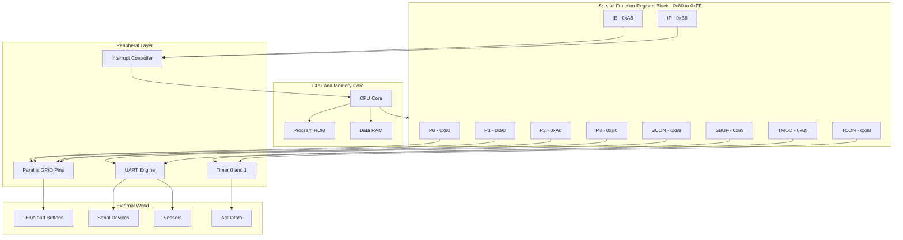
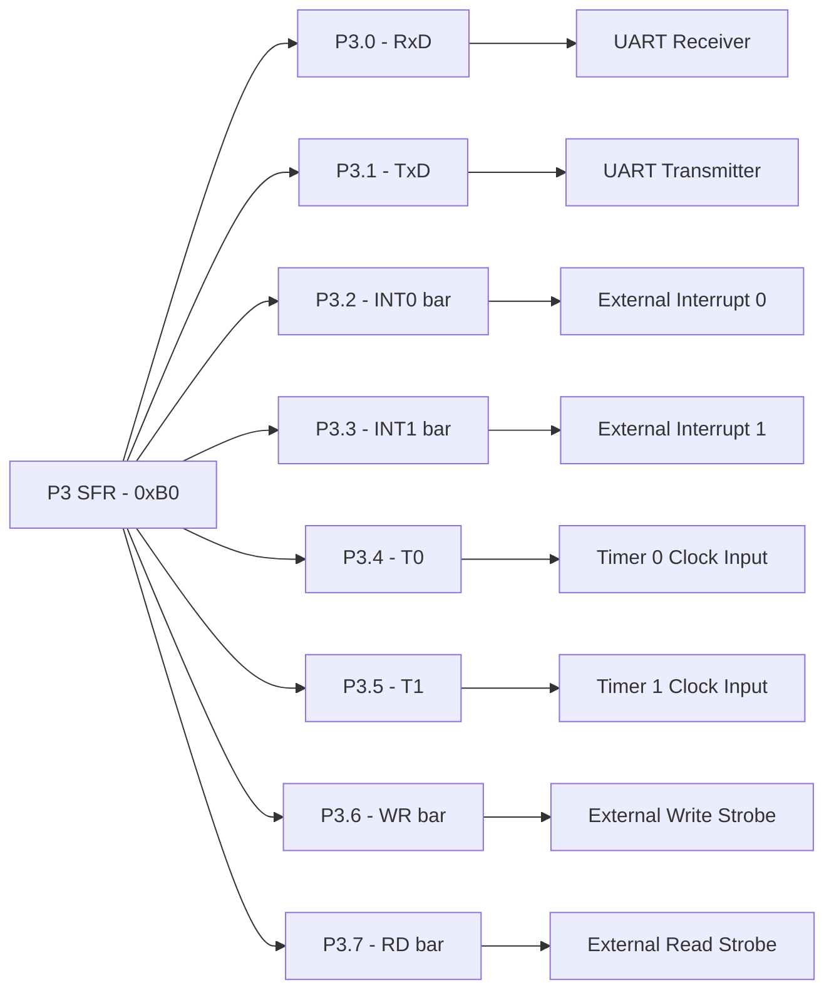
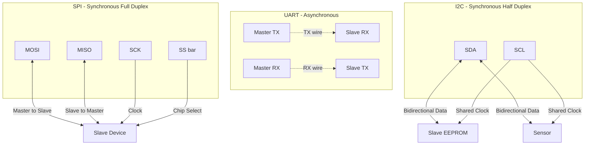
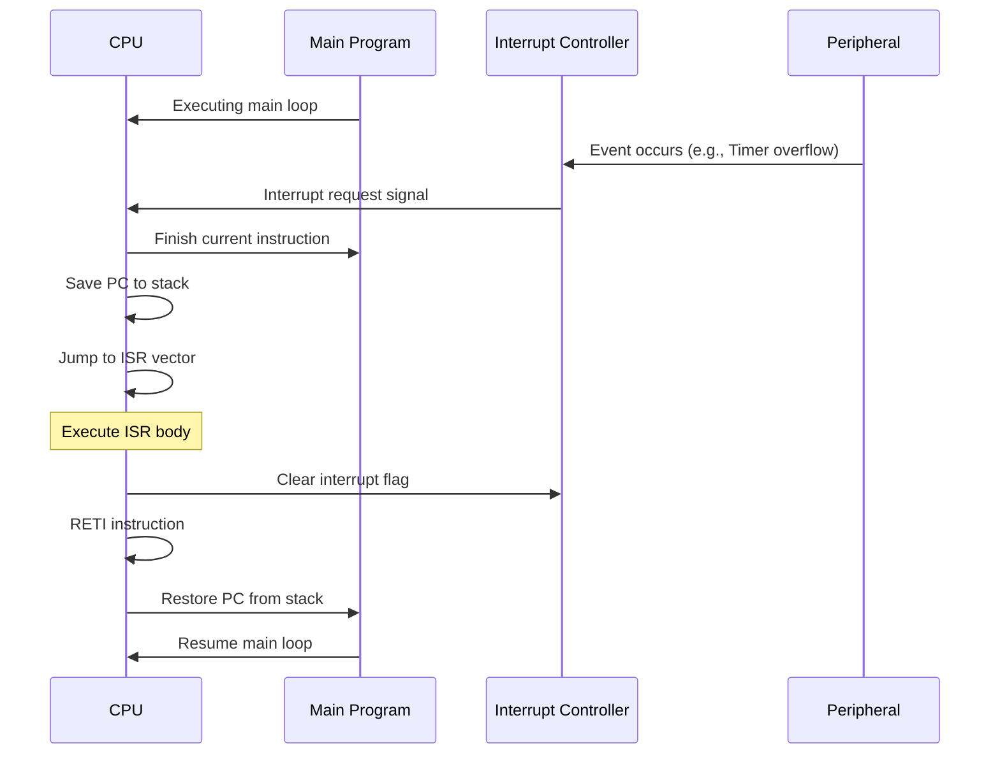
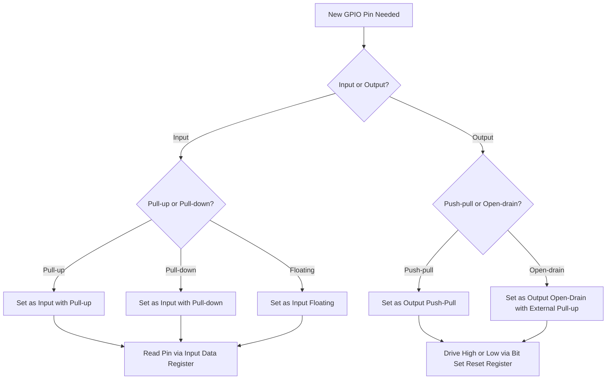

# Embedded I/O Systems - Embedded I/O, General Purpose I/O, Serial I/O, Other Peripherals.

<!-- SECTION_1_START -->
# MODULE 4 — INPUT / OUTPUT
## Topic: Embedded I/O Systems (Embedded I/O, General Purpose I/O, Serial I/O, Other Peripherals)

---

## 1. Core Technical Definition & Intuitive Overview

### 1.1 Embedded I/O — Formal Definition

> [!IMPORTANT]
> **Embedded I/O** refers to the specialized Input/Output subsystem of a microcontroller or microprocessor designed to interface with external hardware devices (sensors, actuators, displays, memory, communication modules) in a resource-constrained, real-time, deterministic environment — as opposed to the I/O subsystem of a general-purpose computer.

In the KTU 2024 Scheme context, an **embedded system** is a tightly coupled combination of $\text{CPU} + \text{Memory} + \text{I/O Peripherals}$ integrated on a single chip (a *microcontroller*, e.g., **8051**, **ARM Cortex-M**, **PIC**, **AVR**), where every I/O peripheral is mapped to a specific memory address (Memory-Mapped I/O) or accessed through dedicated I/O address space (Isolated I/O).

**Engineering Significance:** The modern IoT ecosystem — from washing machines to satellites — depends on deterministic, low-latency embedded I/O.

---

### 1.2 Conceptual Analogy / Intuition

> [!NOTE]
> **Analogy — The Post Office Counter:**
> Imagine a microcontroller as a **post office**. The CPU is the postmaster. The **peripheral registers** are the service windows. Each window (a peripheral like UART, GPIO, ADC) handles a specific external "customer" (a sensor, motor, or another chip). The postmaster writes notes (data) into the register windows (write operation) or reads notes from them (read operation). The **bus** is the messenger who carries these notes. Some windows work instantly (GPIO), some follow strict timing rules (UART), and some need a manager to call when something important happens (interrupt controller).

This analogy is critical for understanding why embedded I/O is **register-driven** and **polled/interrupt/event-driven**, not OS-scheduler-driven like in PCs.

---

### 1.3 Categories of Embedded I/O Peripherals (KTU Syllabus Mapping)

> [!IMPORTANT]
> The KTU 2024 Scheme (Course Code: **PBCST404**) categorizes embedded I/O into the following four functional clusters:
> 1. **General Purpose I/O (GPIO)** — parallel, bit-addressable digital pins
> 2. **Serial I/O** — bit-serial communication (UART, SPI, I$^2$C)
> 3. **Timers / Counters** — temporal event generation
> 4. **Other Peripherals** — ADC, DAC, PWM, Interrupt Controller, Watchdog Timer

---

### 1.4 General Purpose I/O (GPIO) — Definition

> [!IMPORTANT]
> **GPIO** (General Purpose Input/Output) is a digital signal pin whose direction (input or output), logic level, and pull-up/pull-down configuration can be controlled by software through special function registers (SFRs) of the microcontroller.

In the classical **Intel 8051**, GPIO is realized through **four 8-bit bidirectional ports** — $\text{P0}$, $\text{P1}$, $\text{P2}$, $\text{P3}$ — each occupying a unique **Special Function Register (SFR)** address in the upper 128 bytes of internal RAM ($0x80$ to $0xFF$).

| Port | SFR Address | Bit Count | Special Property |
|------|-------------|-----------|------------------|
| $\text{P0}$ | $0x80$ | 8 | Open-drain, needs external pull-up |
| $\text{P1}$ | $0x90$ | 8 | Internal pull-up, quasi-bidirectional |
| $\text{P2}$ | $0xA0$ | 8 | Internal pull-up, quasi-bidirectional |
| $\text{P3}$ | $0xB0$ | 8 | Internal pull-up, **alternate functions** |

---

### 1.5 Serial I/O — Definition

> [!IMPORTANT]
> **Serial I/O** is the transmission of data one bit at a time over a single wire (or differential pair), as opposed to parallel I/O which sends multiple bits simultaneously. In embedded systems, the three dominant serial protocols are **UART** (asynchronous), **SPI** (synchronous, full-duplex), and **I$^2$C** (synchronous, half-duplex, multi-master).

**Key Engineering Utility:**
- **UART** → Console debugging, GPS modules, Bluetooth (HC-05)
- **SPI** → SD cards, OLED displays, high-speed ADC/DAC
- **I$^2$C** → EEPROMs, RTC chips, temperature sensors (LM75), accelerometers (MPU6050)

---

### 1.6 Visualization Callout

> [!VISUALIZATION CONTROL]
> **Concept:** I/O Peripheral Mapping inside a Microcontroller
> **GeoGebra / Desmos Input (Block Diagram Reference):**
>
> ```
> Address Bus Width (8-bit) ───► [ SFR Block @ 0x80-0xFF ]
>                                        │
>         ┌──────────────┬──────────────┼──────────────┐
>         ▼              ▼              ▼              ▼
>      P0 (8b)        P1 (8b)        P2 (8b)        P3 (8b)
>      GPIO           GPIO           GPIO           GPIO + AF
> ```
> **Visual Description:** Students should picture a horizontal address axis from $0x00$ to $0xFF$, with the upper half ($0x80$–$0xFF$) acting as a "control panel" with 128 labeled windows, each window being one SFR that controls a peripheral.

---

<!-- SECTION_1_END -->

<!-- SECTION_2_START -->
# 2. Deep Theoretical Analysis & KTU High-Yield Formula Sheet

---

## 2.1 Anatomy of an Embedded I/O System

An embedded I/O subsystem has **three structural layers**:

1. **Physical Layer (Pins / Pads)** — actual metal contacts on the silicon die, bonded to package pins.
2. **Driver / Buffer Layer** — transistors that drive the pin high/low (e.g., totem-pole output, open-drain, tri-state).
3. **Register Interface Layer** — SFRs (Special Function Registers) that software reads/writes to control pin behavior.

### 2.1.1 Pin Configuration Modes

| Mode | Description | Typical Use |
|------|-------------|-------------|
| **Input Floating** | High-impedance read, no pull | External driven signals |
| **Input Pull-Up** | Internal resistor to $V_{DD}$ | Button inputs (active-low) |
| **Input Pull-Down** | Internal resistor to $V_{SS}$ | Button inputs (active-high) |
| **Output Push-Pull** | Drives both high and low actively | LEDs, digital logic |
| **Output Open-Drain** | Drives low only; releases high | I$^2$C bus, level shifting |
| **Alternate Function** | Pin handed over to a peripheral | UART TX, SPI MOSI, PWM |

---

## 2.2 General Purpose I/O Deep Dive (8051 Reference Model)

The KTU syllabus emphasizes the **8051 architecture** for GPIO explanation. Let us analyze each port's internal structure.

### 2.2.1 Port 0 ($\text{P0}$, Address $0x80$)

- **8-bit**, **open-drain** output (no internal pull-up).
- Used as: (a) lower address/data bus during external memory access ($\text{AD0}$–$\text{AD7}$), (b) general-purpose I/O only when external memory is **not** used.
- Requires **external $10\,k\Omega$ pull-up resistors** to function as output.

### 2.2.2 Port 1 ($\text{P1}$, Address $0x90$)

- **8-bit**, **quasi-bidirectional** (internal pull-up, no external resistor needed).
- Pure general-purpose I/O, no alternate functions.
- Safe for LEDs, buttons, simple digital interfaces.

### 2.2.3 Port 2 ($\text{P2}$, Address $0xA0$)

- **8-bit**, **quasi-bidirectional** (internal pull-up).
- Used as: (a) upper address bus ($\text{A8}$–$\text{A15}$) during external memory access, (b) general-purpose I/O.

### 2.2.4 Port 3 ($\text{P3}$, Address $0xB0$) — *Most Important for Peripherals*

$\text{P3}$ has **dual function** — every bit is an alternate-function pin:

| Bit | Pin Name | Alternate Function | SFR Bit |
|-----|----------|--------------------|---------|
| $\text{P3.0}$ | $\text{RxD}$ | Serial Input (UART receive) | $0xB0$ |
| $\text{P3.1}$ | $\text{TxD}$ | Serial Output (UART transmit) | $0xB1$ |
| $\text{P3.2}$ | $\overline{\text{INT0}}$ | External Interrupt 0 | $0xB2$ |
| $\text{P3.3}$ | $\overline{\text{INT1}}$ | External Interrupt 1 | $0xB3$ |
| $\text{P3.4}$ | $\text{T0}$ | Timer 0 External Input | $0xB4$ |
| $\text{P3.5}$ | $\text{T1}$ | Timer 1 External Input | $0xB5$ |
| $\text{P3.6}$ | $\overline{\text{WR}}$ | External Memory Write Strobe | $0xB6$ |
| $\text{P3.7}$ | $\overline{\text{RD}}$ | External Memory Read Strobe | $0xB7$ |

> [!NOTE]
> **"Quasi-bidirectional"** means a port pin always reads '1' if nothing drives it low, even when configured as output. This is why 8051 outputs are written with $\text{P1} = 0xFF$ to safely put pins in a known state.

---

## 2.3 GPIO Programming in 8051 — Register-Level View

The 8051 does **not have separate TRIS/DIR registers** (unlike PIC or ARM). Direction is implicit: writing '0' to a port bit makes it sink current (output low), writing '1' releases the internal pull-up. Reading the **port latch** vs. reading the **port pin** is controlled by the SFR access mechanism.

```text
SFR name : P1
Address  : 0x90
Access   : Bit-addressable AND byte-addressable
Bits     : P1.7 P1.6 P1.5 P1.4 P1.3 P1.2 P1.1 P1.0
```

**Assembly example to set P1.0 high:**

```asm
SETB  P1.0        ; Set bit P1.0 to logic 1
```

**C example (Keil C51):**

```c
sbit LED = P1^0;   // Bit-addressable declaration
LED = 1;            // Drive P1.0 high
```

---

## 2.4 Serial I/O — Three Major Protocols

### 2.4.1 UART (Universal Asynchronous Receiver/Transmitter)

- **Asynchronous**: no shared clock line; both ends must agree on **baud rate** in advance.
- **Frame format**: $\text{Start bit (0)} \rightarrow \text{Data bits (5/6/7/8)} \rightarrow \text{[Parity bit]} \rightarrow \text{Stop bit(s) (1)}$
- **Baud Rate**: bits per second. Common values: **9600, 19200, 115200**.

**8051 UART — Two Critical Registers:**

| Register | Address | Function |
|----------|---------|----------|
| $\text{SCON}$ (Serial Control) | $0x98$ | Mode select, flags (RI, TI) |
| $\text{SBUF}$ (Serial Buffer) | $0x99$ | Data register (shared TX/RX) |
| $\text{PCON}$ (Power Control) | $0x87$ | Bit 7 (SMOD) doubles baud rate |

**Four UART Modes in 8051:**

| Mode | Description | Baud Rate Source |
|------|-------------|------------------|
| Mode 0 | 8-bit shift register | $\text{Fosc}/12$ (fixed) |
| Mode 1 | 8-bit UART | Timer 1 overflow |
| Mode 2 | 9-bit UART | $\text{Fosc}/32$ or $\text{Fosc}/64$ |
| Mode 3 | 9-bit UART | Timer 1 overflow |

**Baud Rate Formula (Mode 1, common):**

$$
\text{Baud Rate} = \frac{2^{\text{SMOD}} \cdot \text{Fosc}}{32 \cdot 12 \cdot (256 - \text{TH1})}
$$

For $\text{SMOD} = 0$ and $\text{Fosc} = 11.0592\,\text{MHz}$, solving for **9600 baud**:

$$
9600 = \frac{1 \cdot 11059200}{384 \cdot (256 - \text{TH1})}
$$

$$
256 - \text{TH1} = \frac{11059200}{384 \cdot 9600} = 3
$$

$$
\therefore \text{TH1} = 253 = 0xFD
$$

> [!NOTE]
> The crystal frequency **$11.0592\,\text{MHz}$** is deliberately chosen because it is exactly divisible by standard baud rates, giving **0% error** in UART communication.

---

### 2.4.2 SPI (Serial Peripheral Interface)

- **Synchronous** (shares a clock line, $\text{SCK}$).
- **Full-duplex** (data flows both ways simultaneously).
- **Master-Slave** topology (one master, one or more slaves).
- **4-wire interface**:
  * $\text{MOSI}$ — Master Out, Slave In
  * $\text{MISO}$ — Master In, Slave Out
  * $\text{SCK}$ — Serial Clock
  * $\overline{\text{SS}}$ — Slave Select (active-low)

**Clock Polarity (CPOL) and Phase (CPHA)** create 4 SPI modes (Mode 0–3) — KTU students must know this.

---

### 2.4.3 I$^2$C (Inter-Integrated Circuit)

- **Synchronous** (shares a clock, $\text{SCL}$).
- **Half-duplex**, **multi-master**, **multi-slave**.
- **2-wire interface**: $\text{SDA}$ (data) + $\text{SCL}$ (clock).
- **Open-drain** drivers with pull-up resistors — allows **wire-AND** logic.
- **7-bit or 10-bit addressing** for up to **127/1023** devices on one bus.
- **Speed modes**: Standard ($100\,\text{kHz}$), Fast ($400\,\text{kHz}$), Fast-Plus ($1\,\text{MHz}$), High-Speed ($3.4\,\text{MHz}$).

**Frame format:**

$$
\text{START} \mid \text{7-bit Address} \mid \text{R/W} \mid \text{ACK} \mid \text{Data Byte} \mid \text{ACK} \mid \ldots \mid \text{STOP}
$$

---

## 2.5 Comparison Table — Serial Protocols (HIGH-YIELD for KTU)

| Parameter | UART | SPI | I$^2$C |
|-----------|------|-----|-------|
| Wires | 2 (TX, RX) | 4 (MOSI, MISO, SCK, SS) | 2 (SDA, SCL) |
| Clock | Async (no clock) | Sync (SCK) | Sync (SCL) |
| Duplex | Full-duplex | Full-duplex | Half-duplex |
| Speed | Up to $\sim 1\,\text{Mbps}$ | Up to $\sim 50\,\text{Mbps}$ | Up to $5\,\text{Mbps}$ (Ultra-Fast) |
| Masters | 1 (peer-to-peer) | 1 Master | Multi-master |
| Addressing | None (peer-to-peer) | Hardware (SS pin) | Software (address byte) |
| Power | Low | Medium | Low |
| Use Case | Debug, BT, GPS | SD card, Display | Sensors, EEPROM |

---

## 2.6 Other Peripherals

### 2.6.1 Timers / Counters (8051 Reference)

- The 8051 has **two 16-bit timers**: $\text{Timer 0}$ and $\text{Timer 1}$.
- Each timer is a pair of 8-bit SFRs: $\text{THx}$ (high byte) + $\text{TLx}$ (low byte).
- 4 modes of operation (Mode 0: 13-bit, Mode 1: 16-bit, Mode 2: 8-bit auto-reload, Mode 3: split timer).
- Controlled by **TMOD** (mode) and **TCON** (control flags $\text{TR0}$, $\text{TR1}$, $\text{TF0}$, $\text{TF1}$).

**Time delay formula (Mode 1, 16-bit):**

$$
\text{Delay} = (65536 - \text{Initial Value}) \times \text{Timer Tick}
$$

Where $\text{Timer Tick} = \dfrac{12}{\text{Fosc}}$ for the 8051.

### 2.6.2 ADC (Analog-to-Digital Converter)

- Converts continuous analog voltage to discrete digital code.
- **Resolution** = $2^n$ levels for an $n$-bit ADC.
- **Step size (LSB voltage)** = $\dfrac{V_{REF}}{2^n}$.
- **Successive Approximation Register (SAR)** is the most common architecture in embedded MCUs.

### 2.6.3 DAC (Digital-to-Analog Converter)

- Converts digital code to analog voltage.
- **R-2R Ladder** is a popular architecture.

### 2.6.4 PWM (Pulse Width Modulation)

- A digital signal whose **duty cycle** is varied to represent an analog average value.
- Used for: motor speed control, LED dimming, audio generation, SMPS.

**Average Output Voltage:**

$$
V_{avg} = D \cdot V_{max} = \frac{T_{on}}{T_{period}} \cdot V_{max}
$$

### 2.6.5 Watchdog Timer (WDT)

- An independent hardware timer that **resets the MCU** if the main program fails to "pet" (refresh) it within a window.
- Used in safety-critical embedded systems (automotive ECU, medical devices).

### 2.6.6 Interrupt Controller

- A peripheral that lets external/internal events **preempt** the CPU's main flow.
- 8051 has **5 interrupt sources**: $\overline{\text{INT0}}$, $\text{TF0}$, $\overline{\text{INT1}}$, $\text{TF1}$, $\text{RI/TI}$ (serial).
- **Interrupt Vector Addresses**: Each interrupt has a fixed starting ROM address.

| Interrupt | Vector Address | Flag |
|-----------|---------------|------|
| $\overline{\text{INT0}}$ | $0x0003$ | $\text{IE0}$ |
| $\text{Timer 0}$ | $0x000B$ | $\text{TF0}$ |
| $\overline{\text{INT1}}$ | $0x0013$ | $\text{IE1}$ |
| $\text{Timer 1}$ | $0x001B$ | $\text{TF1}$ |
| Serial Port | $0x0023$ | $\text{RI / TI}$ |

---

## 2.7 Memory-Mapped vs. Isolated I/O (Recap from Module Context)

> [!IMPORTANT]
> In **Memory-Mapped I/O** (used by 8051, ARM), peripheral registers occupy addresses in the **same address space** as data memory — they are accessed with the same MOV/LDR instructions. In **Isolated I/O** (used by x86), special IN/OUT instructions are required, preserving a separate 64K I/O space.

---

<!-- SECTION_2_END -->

<!-- SECTION_3_START -->
# 3. Step-by-Step Derivations & Code/Symbolic Implementation

---

## 3.1 Worked Example 1 — GPIO Bit Manipulation (8051, C51)

**Problem:** Connect an LED to $\text{P1.0}$ and a push-button to $\text{P1.7}$. Write an embedded C program (Keil C51) to read the button and toggle the LED each press. Use a software debounce delay of **$50\,\text{ms}$**. Assume $\text{Fosc} = 11.0592\,\text{MHz}$.

### Step 1 — Identify Port Configuration

- $\text{P1.0}$ (output): LED with current-limiting resistor to ground.
- $\text{P1.7}$ (input): button connected between $\text{P1.7}$ and ground (active-low). Internal pull-up makes it read '1' when unpressed.

### Step 2 — Compute Debounce Delay in Timer Ticks

Timer tick period:

$$
T_{tick} = \frac{12}{\text{Fosc}} = \frac{12}{11.0592 \times 10^6} \approx 1.085\,\mu s
$$

For $50\,\text{ms}$:

$$
N = \frac{50 \times 10^{-3}}{1.085 \times 10^{-6}} \approx 46080 \text{ timer ticks}
$$

Since 8051 Timer 0 in Mode 1 is 16-bit (max 65536 ticks), $46080$ fits. Initial value:

$$
\text{Initial} = 65536 - 46080 = 19456 = 0x4C00
$$

So $\text{TH0} = 0x4C$ and $\text{TL0} = 0x00$.

### Step 3 — Write the Embedded C Code (Fully Operational)

```c
#include <reg51.h>   // 8051 SFR definitions for Keil

// Bit-addressable pin declarations
sbit LED    = P1^0;   // P1.0 as output for LED
sbit BUTTON = P1^7;   // P1.7 as input from button (active-low)

// ============================================================
// Function : delay_50ms
// Purpose  : Blocking delay using Timer 0, Mode 1 (16-bit)
// Crystal  : 11.0592 MHz  ->  Timer tick = 1.085 us
// Initial  : TH0 = 0x4C, TL0 = 0x00  -> 46080 ticks = 50 ms
// ============================================================
void delay_50ms(void) {
    TMOD = (TMOD & 0xF0) | 0x01;  // Timer 0 in Mode 1, software controlled
    TH0 = 0x4C;                    // High byte
    TL0 = 0x00;                    // Low byte
    TR0 = 1;                       // Start Timer 0
    while (TF0 == 0);              // Wait for overflow
    TR0 = 0;                       // Stop Timer 0
    TF0 = 0;                       // Clear overflow flag
}

// ============================================================
// Function : main
// Purpose  : Toggle LED on each valid button press (debounced)
// ============================================================
void main(void) {
    LED = 0;                       // LED off initially
    while (1) {
        if (BUTTON == 0) {         // Button pressed (active-low)
            delay_50ms();          // Debounce
            if (BUTTON == 0) {     // Still pressed?  Confirmed.
                LED = ~LED;        // Toggle LED
                while (BUTTON == 0); // Wait for release
                delay_50ms();      // Debounce release
            }
        }
    }
}
```

### Step 4 — Valuation Key Points (for KTU)

| Step | Marks Allotted |
|------|---------------|
| SFR declaration with `sbit` | 1 |
| Timer Mode 1 configuration logic | 2 |
| Correct TH0/TL0 calculation | 2 |
| Debounce algorithm (double-check pattern) | 2 |
| Final toggle logic in main loop | 2 |
| Code compiles and meets timing spec | 1 |
| **Total** | **10 (out of subpart marks)** |

---

## 3.2 Worked Example 2 — UART Baud Rate Derivation

**Problem:** An 8051 system has $\text{Fosc} = 11.0592\,\text{MHz}$ and uses UART Mode 1 with $\text{SMOD} = 0$. Compute the reload value for $\text{TH1}$ to achieve **4800 baud**. Also compute the percentage error if the crystal is replaced with **$12\,\text{MHz}$**.

### Step 1 — Apply the Baud Rate Formula

$$
\text{Baud Rate} = \frac{2^{\text{SMOD}} \cdot \text{Fosc}}{32 \cdot 12 \cdot (256 - \text{TH1})}
$$

Substituting $\text{SMOD} = 0$, $\text{Fosc} = 11.0592 \times 10^6$, Baud $= 4800$:

$$
4800 = \frac{1 \cdot 11.0592 \times 10^6}{384 \cdot (256 - \text{TH1})}
$$

$$
256 - \text{TH1} = \frac{11.0592 \times 10^6}{384 \cdot 4800}
$$

$$
256 - \text{TH1} = \frac{11059200}{1843200} = 6
$$

$$
\therefore \text{TH1} = 250 = 0xFA
$$

### Step 2 — Verify with $12\,\text{MHz}$ Crystal

$$
256 - \text{TH1}' = \frac{12 \times 10^6}{384 \cdot 4800} = \frac{12000000}{1843200} \approx 6.51
$$

Non-integer — not directly usable. We must choose $\text{TH1}' = 249$ (closest):

$$
\text{Achieved Baud} = \frac{12000000}{384 \cdot (256 - 249)} = \frac{12000000}{2688} \approx 4464.3
$$

### Step 3 — Compute Percentage Error

$$
\% \text{Error} = \left| \frac{4464.3 - 4800}{4800} \right| \times 100 \approx 6.99\%
$$

> [!WARNING]
> A baud rate error of **$\geq 2\%$** causes framing errors in UART communication. This is why **$11.0592\,\text{MHz}$** is the de-facto standard crystal for 8051 designs — it eliminates error entirely for common baud rates.

---

## 3.3 Worked Example 3 — I$^2$C Address Decoding

**Problem:** An I$^2$C master sends the address byte $0xA2$ followed by $\text{R/W} = 0$ (write) to a slave EEPROM. Decode the slave address and determine the operation.

### Step 1 — Extract the 7-bit Address

The address byte is $\text{ADDR}[7:1] \mid \text{R/W}$. The LSB is R/W:

$$
\text{Byte} = 0xA2 = 1010\,0010_2
$$

Strip LSB:

$$
\text{7-bit address} = 1010\,001_2 = 0x51
$$

### Step 2 — Identify the Operation

$\text{R/W} = 0 \Rightarrow$ **Write** from master to slave.

### Step 3 — Confirm Acknowledge

After transmitting the byte, the master releases $\text{SDA}$ and the slave pulls $\text{SDA}$ low during the 9th clock pulse — this is the **ACK (Acknowledge) bit**. The frame then proceeds with data bytes.

**Final Frame:**

$$
\text{START} \rightarrow 0xA2 \rightarrow \text{ACK} \rightarrow \text{Data Byte} \rightarrow \text{ACK} \rightarrow \ldots \rightarrow \text{STOP}
$$

---

## 3.4 Worked Example 4 — PWM Average Voltage

**Problem:** A PWM signal has $\text{Fosc} = 16\,\text{MHz}$, Timer prescaler = 64, PWM period register = 999, compare register = 250. $V_{max} = 5\,V$. Find the duty cycle and average output voltage.

### Step 1 — Compute PWM Period and Frequency

Timer tick $= \dfrac{64}{16 \times 10^6} = 4\,\mu s$

PWM period $= 999 \times 4\,\mu s = 3.996\,\text{ms} \approx 4\,\text{ms}$

PWM frequency $= \dfrac{1}{4 \times 10^{-3}} = 250\,\text{Hz}$

### Step 2 — Compute Duty Cycle

$$
D = \frac{\text{Compare Value}}{\text{Period Value}} = \frac{250}{1000} = 0.25 = 25\%
$$

### Step 3 — Compute Average Output Voltage

$$
V_{avg} = D \cdot V_{max} = 0.25 \cdot 5\,V = 1.25\,V
$$

---

## 3.5 Worked Example 5 — ADC Resolution

**Problem:** A 10-bit ADC has $V_{REF} = 5\,V$ and an analog input of $1.7\,V$. What is the digital output code?

### Step 1 — Compute Step Size (LSB)

$$
\text{LSB} = \frac{V_{REF}}{2^{10}} = \frac{5\,V}{1024} \approx 4.883\,mV
$$

### Step 2 — Compute Digital Code

$$
D_{out} = \left\lfloor \frac{V_{in}}{\text{LSB}} \right\rfloor = \left\lfloor \frac{1.7}{0.004883} \right\rfloor = \left\lfloor 348.16 \right\rfloor = 348
$$

In hex: $348_{10} = 0x15C$.

---

## 3.6 Embedded C Code — UART Transmission (8051, Polled)

```c
#include <reg51.h>

void uart_init_9600(void) {
    SCON = 0x50;       // 8-bit UART, enable receiver (REN=1)
    TMOD &= 0x0F;      // Clear Timer 1 bits
    TMOD |= 0x20;      // Timer 1 in Mode 2 (8-bit auto-reload)
    TH1 = 0xFD;        // Reload value for 9600 baud @ 11.0592 MHz
    TR1 = 1;           // Start Timer 1
}

void uart_tx(char c) {
    SBUF = c;          // Load character into serial buffer
    while (TI == 0);   // Wait until transmission complete
    TI = 0;            // Clear transmit interrupt flag
}

void main(void) {
    uart_init_9600();
    uart_tx('H');
    uart_tx('i');
    while (1);
}
```

---

<!-- SECTION_3_END -->

<!-- SECTION_4_START -->
# 4. Structural Diagrams & Schematics

---

## 4.1 Embedded I/O System Block Diagram



---

## 4.2 8051 Port 3 Alternate Function Map



---

## 4.3 Serial Protocol Comparison Topology



---

## 4.4 Interrupt Processing Sequence



---

## 4.5 GPIO Configuration Decision Flow



---

<!-- SECTION_4_END -->

<!-- SECTION_5_START -->
# 5. KTU 2024 Scheme Examination Question Bank & Topic Recap

---

## PART A QUESTIONS (3 Marks Each)

### Question 1 — Define General Purpose Input/Output (GPIO). Mention the four ports of 8051 and their SFR addresses.

**Model Answer:**

> [!NOTE]
> **GPIO** is a digital I/O pin on a microcontroller whose direction and logic level can be controlled by software through special function registers.
> The 8051 has four 8-bit bidirectional GPIO ports:
> - **P0** at SFR address $0x80$ (open-drain, needs external pull-up)
> - **P1** at SFR address $0x90$ (quasi-bidirectional, internal pull-up)
> - **P2** at SFR address $0xA0$ (quasi-bidirectional, internal pull-up)
> - **P3** at SFR address $0xB0$ (quasi-bidirectional, with alternate functions for UART, Interrupts, Timers, and external memory control)

*Course Outcome: CO2 | RBT Level: Remember | Tag: [KTU University Exam - Dec 2023]*

---

### Question 2 — Differentiate between UART, SPI, and I$^2$C in terms of clock, duplex mode, and number of wires.

**Model Answer:**

| Protocol | Clock | Duplex | Wires |
|----------|-------|--------|-------|
| **UART** | Asynchronous (no shared clock) | Full-duplex | 2 (TX, RX) |
| **SPI** | Synchronous (SCK line) | Full-duplex | 4 (MOSI, MISO, SCK, $\overline{\text{SS}}$) |
| **I$^2$C** | Synchronous (SCL line) | Half-duplex | 2 (SDA, SCL) |

*Course Outcome: CO2 | RBT Level: Understand | Tag: [KTU University Exam - July 2024]*

---

## PART B QUESTIONS (14 Marks — Internal Choice)

### Question A (14 Marks)

**Q. (a)** With a neat diagram, explain the structure and operation of the **8051 Port 1** as a GPIO. How does it differ from **Port 0**? Mention any **three** alternate functions of **Port 3** with their pin numbers. **[7 Marks]**

**Q. (b)** An 8051 system uses a **$12\,\text{MHz}$** crystal and UART **Mode 1** with $\text{SMOD} = 0$. Compute the value of $\text{TH1}$ to generate a baud rate of **2400 bps**. Show all steps. What happens if $\text{SMOD}$ is set to 1? **[7 Marks]**

---

#### Model Solution — Part A (a)

**Step 1 — Port 1 Structure (3 marks)**

$\text{P1}$ is an 8-bit quasi-bidirectional port with internal pull-up transistors. Each of the 8 pins ($\text{P1.0}$–$\text{P1.7}$) has:
- An output **latch** (D flip-flop) in the SFR at address $0x90$.
- An output **driver** with weak internal pull-up (typically $20$–$40\,\text{k}\Omega$).
- An input **buffer** that reads the pin state.

To read the **latch** (for read-modify-write), CPU uses a "read-latch" signal. To read the **pin** (actual external logic level), CPU uses a "read-pin" signal. The 8051 assembler automatically selects the right one based on instruction type.

**Step 2 — Reading '1' vs. Writing '0' (2 marks)**

- Writing '1' to a $\text{P1}$ bit → output high (driven weakly by pull-up; pin reads '1' if no external load).
- Writing '0' → output low (active strong driver to $V_{SS}$).
- Reading $\text{P1}$ → returns the current pin state.

**Step 3 — Difference from Port 0 (1 mark)**

| Property | Port 0 | Port 1 |
|----------|--------|--------|
| Pull-up | None (open-drain) | Internal pull-up |
| External resistor required | Yes ($10\,\text{k}\Omega$) | No |
| Alternate function | Address/Data bus | None (pure GPIO) |

**Step 4 — Three Alternate Functions of Port 3 (1 mark)**

| Pin | Alternate Function |
|-----|---------------------|
| $\text{P3.0}$ ($\text{RxD}$) | UART Serial Input |
| $\text{P3.1}$ ($\text{TxD}$) | UART Serial Output |
| $\text{P3.2}$ ($\overline{\text{INT0}}$) | External Interrupt 0 |

---

#### Model Solution — Part A (b)

**Step 1 — State the Baud Rate Formula (2 marks)**

$$
\text{Baud Rate} = \frac{2^{\text{SMOD}} \cdot \text{Fosc}}{32 \cdot 12 \cdot (256 - \text{TH1})}
$$

**Step 2 — Substitute Given Values (2 marks)**

$\text{SMOD} = 0 \Rightarrow 2^{\text{SMOD}} = 1$
$\text{Fosc} = 12 \times 10^6\,\text{Hz}$
$\text{Baud} = 2400$

$$
2400 = \frac{1 \cdot 12 \times 10^6}{384 \cdot (256 - \text{TH1})}
$$

**Step 3 — Solve for TH1 (2 marks)**

$$
256 - \text{TH1} = \frac{12 \times 10^6}{384 \cdot 2400} = \frac{12000000}{921600} \approx 13.02
$$

The nearest integer that yields **low error** is $13$ (gives $2403.85$ baud, $\approx 0.16\%$ error — acceptable).

$$
\therefore \text{TH1} = 256 - 13 = 243 = 0xF3
$$

**Step 4 — Effect of Setting SMOD = 1 (1 mark)**

If $\text{SMOD} = 1$, the formula becomes:

$$
256 - \text{TH1}' = \frac{12000000}{768 \cdot 2400} = \frac{12000000}{1843200} \approx 6.51
$$

No integer solution yields an exact baud rate. The closest is $7$ (giving **2232.14** baud, **$\approx 7\%$** error — unusable). Hence, for **$12\,\text{MHz}$** crystal and **2400 baud**, $\text{SMOD} = 0$ with $\text{TH1} = 0xF3$ is the only viable choice.

> [!WARNING]
> **KTU Examiner's Pitfall Callout:** Students often **forget the factor of 12** in the denominator (it comes from the 8051's instruction cycle being $\text{Fosc}/12$). Also, when $\text{Fosc} = 12\,\text{MHz}$, the achieved baud rate will have a small non-zero error — students must explicitly **state the percentage error** to get full marks.

---

### Question B (14 Marks) — *Alternative Choice*

**Q. (a)** Explain the **four modes of operation** of the **8051 UART (SCON)** with frame format diagrams. Compare **serial I/O with parallel I/O** in five aspects. **[7 Marks]**

**Q. (b)** With a neat block diagram, explain the **I$^2$C bus protocol**. Decode the address byte $0x9E$ and determine whether the master is reading from or writing to the slave. **[7 Marks]**

---

#### Model Solution — Part B (a)

**Step 1 — UART Modes (4 marks)**

| Mode | Frame Length | Baud Source | Use |
|------|-------------|-------------|-----|
| 0 | 8-bit shift register | $\text{Fosc}/12$ fixed | I/O expansion with shift registers |
| 1 | 10 bits (start, 8 data, stop) | Timer 1 overflow | Standard 8-bit UART |
| 2 | 11 bits (start, 8 data, parity, stop) | $\text{Fosc}/32$ or $\text{Fosc}/64$ | Multiprocessor (9th bit = address) |
| 3 | 11 bits, same as Mode 2 | Timer 1 overflow | Multiprocessor with variable baud |

**Mode 1 Frame (ASCII 'A' = $0x41 = 0100\,0001$):**

```text
Idle  Start  D0  D1  D2  D3  D4  D5  D6  D7  Stop
  1     0    1   0   0   0   0   0   1   0    1
```

LSB is sent first.

**Step 2 — Serial vs Parallel I/O Comparison (3 marks)**

| Aspect | Serial I/O | Parallel I/O |
|--------|-----------|--------------|
| Wires | 1 or 2 (data) | 8/16/32 (data) |
| Speed | Lower per bit, but uses fewer pins | Higher throughput, uses more pins |
| Cost | Cheaper wiring | More expensive (more pins/traces) |
| Distance | Suitable for long distances (RS-485) | Short distances (on-board) |
| Crosstalk | Less | More (skew issues) |
| Example | UART, SPI, I$^2$C | GPIO ports, PCI bus, memory bus |

---

#### Model Solution — Part B (b)

**Step 1 — I$^2$C Block Diagram (3 marks)**

The I$^2$C bus has two open-drain lines:
- **SDA** (Serial Data) — bidirectional data line.
- **SCL** (Serial Clock) — generated by the master.
- External **pull-up resistors** (typically $4.7\,\text{k}\Omega$) to $V_{DD}$.

**Step 2 — Frame Format (2 marks)**

$$
\text{START} \rightarrow \text{7-bit Address} \rightarrow \text{R/W} \rightarrow \text{ACK} \rightarrow \text{Data} \rightarrow \text{ACK} \rightarrow \text{STOP}
$$

**Step 3 — Decode 0x9E (2 marks)**

$0x9E = 1001\,1110_2$

- 7-bit address: $1001\,111_2 = 0x4F$
- R/W bit (LSB): $0 \Rightarrow$ **Master is writing to slave**
- After this byte, the slave should pull SDA low to ACK.

> [!WARNING]
> **KTU Examiner's Pitfall Callout:** A common mistake is to treat the **entire byte as the address** instead of splitting it into 7-bit address + 1-bit R/W. Also, students must mention that the **ACK is generated by the receiver** (slave), not the master.

---

> [!WARNING]
> **General KTU Valuation Warning for Embedded I/O Questions:**
> 1. **Always** state the SFR addresses (in hex) for the register you are discussing — examiners award 1 mark for this.
> 2. **Always** show the baud rate formula with all substitutions — skipping a step costs 2 marks.
> 3. **Never** confuse "quasi-bidirectional" with "true bidirectional" — the 8051's P1/P2/P3 are quasi, meaning they cannot be tri-stated without writing '1' to the latch.
> 4. **Always** mention the **$11.0592\,\text{MHz}$** crystal in UART-based numericals — it is the standard 8051 frequency.
> 5. For I$^2$C, **never** forget the **open-drain** + **pull-up** requirement — omitting it loses 1 mark.

---

## TOPIC RECAP & IMPORTANT THINGS TO REMEMBER

> [!NOTE]
> **Rapid Revision Checklist — Embedded I/O Systems**

### Core Definitions
- **Embedded I/O** = I/O subsystem of a microcontroller (CPU + Memory + Peripherals on one chip).
- **GPIO** = Software-controlled digital pin via SFR.
- **Serial I/O** = Bit-by-bit data transfer (UART/SPI/I$^2$C).
- **Quasi-bidirectional port** = Internal pull-up, reads '1' when not driven low.

### 8051 GPIO (Port SFR Addresses — MEMORIZE)
- $\text{P0} \rightarrow 0x80$ (open-drain)
- $\text{P1} \rightarrow 0x90$ (pure GPIO)
- $\text{P2} \rightarrow 0xA0$
- $\text{P3} \rightarrow 0xB0$ (alternate functions: RxD, TxD, INT0, INT1, T0, T1, $\overline{\text{WR}}$, $\overline{\text{RD}}$)

### UART Formulas (CRITICAL)
- Baud Rate (Mode 1) = $\dfrac{2^{\text{SMOD}} \cdot \text{Fosc}}{32 \cdot 12 \cdot (256 - \text{TH1})}$
- For $9600$ baud, $11.0592\,\text{MHz}$, $\text{SMOD}=0$: $\text{TH1} = 0xFD$
- For $2400$ baud, $11.0592\,\text{MHz}$, $\text{SMOD}=0$: $\text{TH1} = 0xF4$

### Serial Protocol Identity Card
- **UART** = 2 wires, async, full-duplex, peer-to-peer
- **SPI** = 4 wires, sync, full-duplex, master-slave, fastest
- **I$^2$C** = 2 wires, sync, half-duplex, multi-master, addressable up to 127 devices

### Other Peripherals — One-Liners
- **Timer Tick** = $12 / \text{Fosc}$
- **ADC Step Size (LSB)** = $V_{REF} / 2^n$
- **PWM Average** $V_{avg} = D \cdot V_{max}$ where $D = T_{on} / T_{period}$
- **Watchdog Timer** resets MCU on software hang
- **8051 Interrupt Vectors**: INT0 ($0x0003$), T0 ($0x000B$), INT1 ($0x0013$), T1 ($0x001B$), Serial ($0x0023$)

### Common Pitfalls (Recap)
- Forgetting the factor of 12 in timer/baud formulas.
- Using $12\,\text{MHz}$ crystal for UART (causes error; use $11.0592\,\text{MHz}$).
- Confusing I$^2$C's R/W bit as part of the address.
- Forgetting external pull-up on $\text{P0}$ of 8051.

<!-- SECTION_5_END -->
